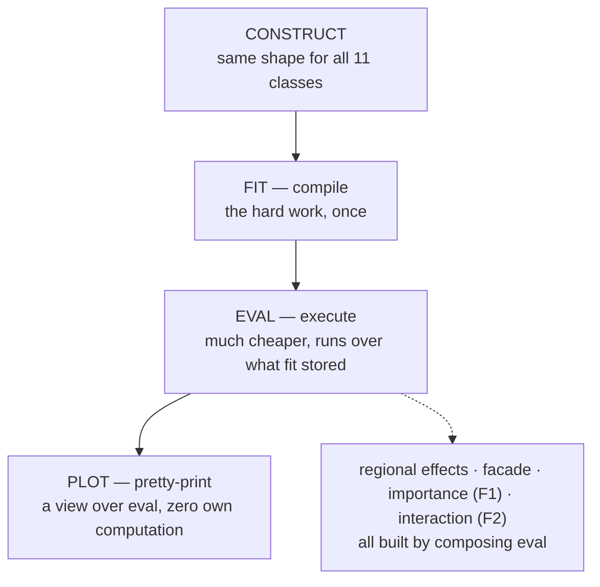
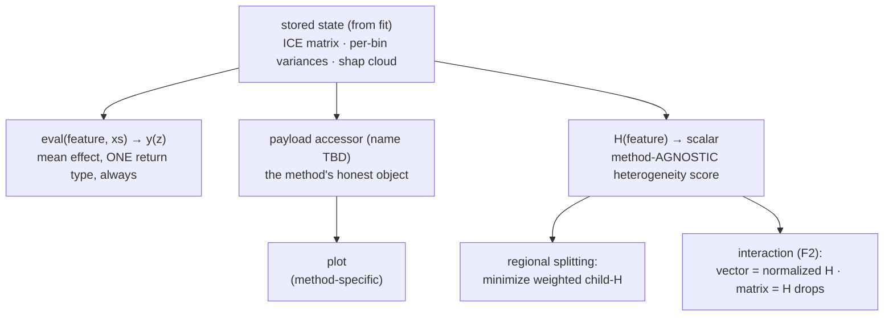
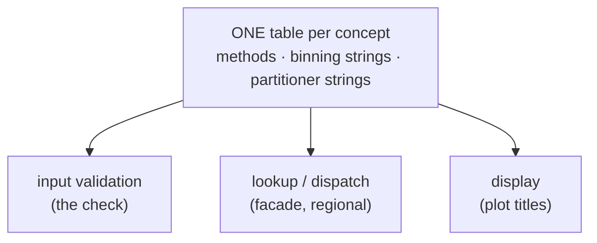

# Logbook — what we actually do

Companion to `PLAN.md`. That file is the **map** (the extensive roadmap); this file
is the **trail** — the steps we actually take, written by me (Vasilis), with Claude's
help, so that I am fully aware of everything we do.

The loop, per item:

1. Claude reads `PLAN.md` and names the next item.
2. We discuss it — intuition, diagrams, alternatives — until I understand and agree
   (or we change the plan).
3. I write the entry below; then (and only then) the work happens.

Nothing lands in code before it has an entry here.

Entry format:

```
## <nr>. <date> — <title> (tag: theory | code)  [PLAN.md ref]

<diagram — what we do, at a glance>

**What:** the decision / the thing done, in one or two sentences.
**Why:** the reason I'm convinced.
**Changes:** what changed (in PLAN.md, code, tests).
```

Tags: **theory** = ends in a mental model / verdict; **code** = ends in code changes.
Every entry starts with a diagram.

---

## 1. 2026-07-02 — Test suite: hierarchy of tests, run in two tiers (tag: theory)

```
              the hierarchy                       what breaking it looks like
  ┌────────────────────────────────────┐
  │ FUNCTIONAL — pieces work together  │   wrong numbers end-to-end
  │   closed-form ground truths        │   (curve shifts, split lands wrong)
  ├────────────────────────────────────┤
  │ UNIT — each piece in isolation     │   wrong numbers in one kernel
  │   bin effects, ALE math, helpers   │   (NaN handling, off-by-one)
  ├────────────────────────────────────┤
  │ CONTRACT — the signature/promise   │   a method deviates from the API
  │   one suite, all 11 methods        │   (shape, centering, lazy-fit)
  └────────────────────────────────────┘

  tier 1   make test       ≤ 3 min    every PR          all layers, trimmed
  tier 2   make test-all   ≤ 10 min   merge / nightly   all layers, full + notebooks
```

**What:** 

Three test layers seen as a hierarchy: 
- the **contract** layer tests the *signature* (the promise every method makes), 
- the **unit** layer tests the *actual numbers* of each small piece, 
- the **functional** layer tests that the *pieces work well together*. 


Two run tiers: 
- **≤ 3 min sanity** (`make test`, every PR — all three layers, trimmed) and 
- **≤ 10 min exhaustive** (`make test-all`, pre-merge/nightly — full strength, incl. notebooks).

**Why:** 

Today's suite is not adequate; the refactoring and the new features need a good alarm system and a sanity tier that is never blind to a whole layer.

**Changes:** 
PLAN.md Part II rewritten (intro, §5 two-tier budget, §8 budget rule).

---

## 2. 2026-07-02 — Order of test suite and refactor (tag: theory)

```
   P1–P5          FUNCTIONAL           §1 RULES         CONTRACT           REFACTOR
   fix the   ──►  anchor:        ──►   agreed      ──►  rules as      ──►  turn every
   wiring         ground truths        as text          xfail spec         xfail green
                  ─────────────────────────────────────────────────────────────────►
                  stays green through EVERYTHING

                  done ≔ zero xfails left  +  functional layer still green
```

**What:** 
(1) fix the P-items and write the **functional ground-truth tests first**: 
they test *what* is computed, never *how*, so they stay stable through the whole
effort 
(2) agree the Part III §1 constitution **as text**; 
(3) encode it as the **contract layer** — green where a rule already holds, `xfail(strict=True)` where the refactor must make it true; 
(4) refactor (all part III) until **zero xfails remain and the functional layer is still green** — that is the definition of done.

**Why:** the contract tests don't "follow" Part III — they *are* Part III §1 in
executable form. Functional tests are the refactor-invariant anchor; writing the
contract first turns the refactor into "make the xfails green" (measurable, no
scope drift). The concrete functional test list stays open — we agree on it
test-by-test when we write them.

**Changes:** PLAN.md Part II §6 rewritten (interleaved order), Part III §4 preamble
added.

---

## 3. 2026-07-02 — Method lifecycle: fit = compile, eval = execute, plot = pretty-print (tag: theory)  [Part III §1, R1+R8]



**What:** every method follows the same three-step lifecycle: **fit** does the hard
work once; **eval** is the cheap execution step over fit's results; **plot** is
pretty-print over eval. All classes are constructed the same way. This is a
*mental-model* agreement: the exact signatures (of `eval`, of the constructor, and
whether extra entry points like an `eval_all` exist) are deliberately **not**
decided here — they come later, with the constitution text and its contract tests.

**Why:** everything beyond a single plot is programmatic composition of `eval` —
regional, facade, F1, F2. If plot computes anything on its own, what we *see*
drifts from what we *compute*. This is the core of our mental model.

**Changes:** none yet — the exact-signature decisions and contract tests
(C1/C3/C6) reference this entry when we get there.

---

## 4. 2026-07-02 — Heterogeneity: eval returns the mean only; payload accessor + agnostic score H (tag: theory)  [Part III §1, R2–R4]



**What:** heterogeneity does **not** go through `eval`. Three public objects instead
of one overloaded one:
- `eval` → the mean effect only, one return type, always;
- a **payload accessor** (name/shape TBD) → the method's honest per-instance object
  (ICE table for PDP, per-bin variances for ALE/RHALE, shap cloud for ShapDP) —
  method-specific units are fine, nothing agnostic consumes it;
- **H** → one method-agnostic scalar per feature; the only heterogeneity quantity
  consumed by regional splitting and the future interaction submodule.

Convention for the underlying h: variance internally, sqrt only at plot;
centering-invariant. Also locked: **R3** one centering vocabulary
{False, zero_integral (=True), zero_start}, default declared once per class;
**R4** one null (`None`) for "not computed".

Deliberately not decided: payload accessor name/shape; how H aggregates (weighting
uniform vs data-density); normalization.

**Why:** every agnostic consumer needs either the mean curve or the scalar H —
never h(z) on a grid (for bin methods that was interpolation theater anyway). One
return type for eval kills a whole class of contract warts, and PDP's old
`return_all` exception becomes the rule: every method has a payload accessor.

**Conscious costs:** breaking API change (`eval(heterogeneity=True)` is public
today) — right time, pre-1.0. Functional anchor tests get written against today's
API first and re-pointed mechanically when this lands.

**Changes:** PLAN.md — R1/R2 rewritten (Part III §1); notes where the old seam was
referenced (Part II §3.1 contract items, Part IV intro + F1/F2).

---

## 5. 2026-07-02 — One menu: every list of valid names is written once (tag: theory)  [Part III §1, R5+R6]



**What:** every list of valid names is written **once** and everything else reads
it. R6: for each string option (binning `"fixed" | "greedy" | "dp"`, partitioner
`"best" | "best_level_wise"`) there is one list — the check and the lookup use the
same one, so they *cannot* disagree. R5: same idea one level up — "which methods
exist and what does each need" is one table (`"pdp" → class, needs jacobian?,
display name`), read by the facade, the regional dispatch, and the plot titles
instead of three hand-typed if/elif chains. Exact table shapes: decided later, at
constitution-writing.

**Why:** the hand-typed copies already drifted — 3 of our 9 known bugs (B2, B3:
`"dp"` binning is unreachable today; `"cart"` passes the check then crashes;
`"best_level_wise"` is valid but rejected). One table kills the bug *class*, and
future features become new rows: GADGET = a row in the partitioner table,
categorical support = a column in the method table.

**Changes:** none yet — implemented across Part III steps; contract tests
(registries) enforce it.

---

## 6. 2026-07-02 — Polite surfaces: plots always return the figure, errors always speak (tag: theory)  [Part III §1, R7+R9 — constitution closed]

```
  R7   plot(..., show_plot=False)  →  (fig, ax)     every method, every vis function
       plot(..., show_plot=True)   →  None          no exceptions

  R9   bad user input   →  ValueError/TypeError with a message that names the fix
       internal hiccup  →  warnings.warn (never print, never bare assert)
```

**What:** R7 — every plot hands back `(fig, ax)` when asked, uniformly (that's what
enables saving, tweaking, composing grids). R9 — wrong input raises a proper error
that says what's wrong and what's allowed; internal warnings go through
`warnings.warn`. With these two, the **constitution R1–R9 is closed**: #3 (R1+R8
lifecycle), #4 (R2–R4 semantics), #5 (R5+R6 registries), #6 (R7+R9 surfaces).

**Why:** small rules, big feel — they're the difference between a package that
feels solid and one that prints errors into a progress bar. Both are trivially
contract-testable.

**Changes:** PLAN.md Part III §1 — all nine rules now carry their agreement marker.
Next per entry #2: functional anchor (first `tag: code` work), then the other test
layers as xfail spec, then the refactor.

---
