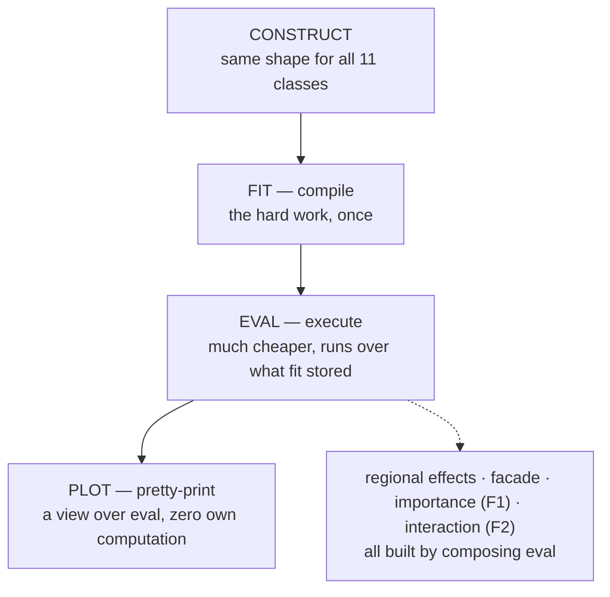
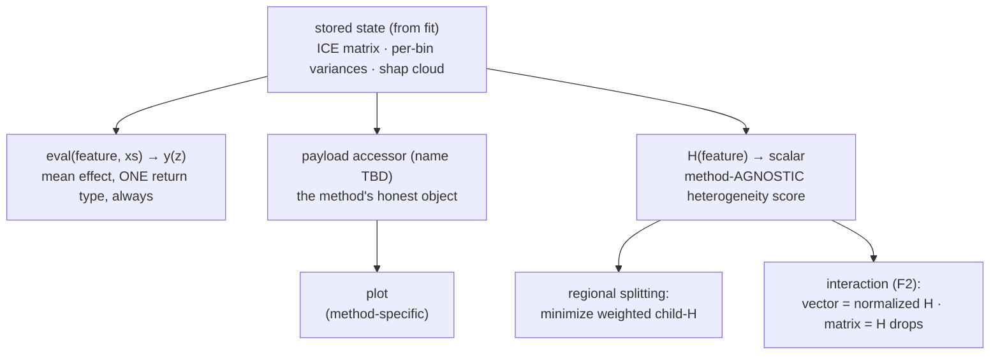
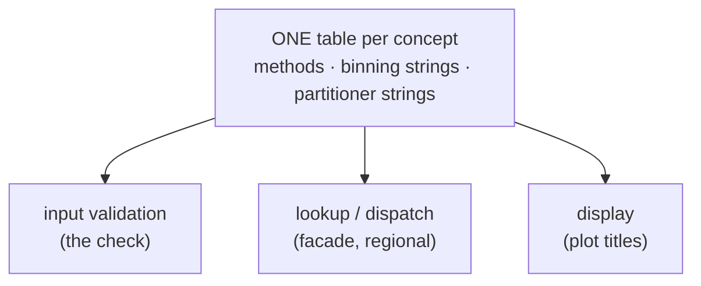
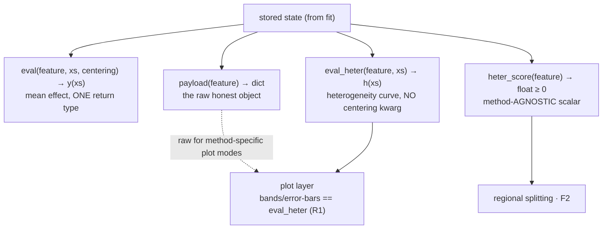

# Logbook — what we actually do

Companion to `PLAN.md`. That file is the **map** (the extensive roadmap); this file
is the **trail** — the steps we actually take, written by me (Vasilis), with Claude's
help, so that I am fully aware of everything we do.

The loop, per item:

1. Claude reads `PLAN.md` and names the next item.
2. We discuss it — intuition, diagrams, alternatives — until I understand and agree
   (or we change the plan).
3. I write the entry below; then (and only then) the work happens.

Nothing lands in code before it has an entry here.

Entry format:

```
## <nr>. <date> — <title> (tag: theory | code)  [PLAN.md ref]

<diagram — what we do, at a glance>

**What:** the decision / the thing done, in one or two sentences.
**Why:** the reason I'm convinced.
**Changes:** what changed (in PLAN.md, code, tests).
```

Tags: **theory** = ends in a mental model / verdict; **code** = ends in code changes.
Every entry starts with a diagram.

---

## 1. 2026-07-02 — Test suite: hierarchy of tests, run in two tiers (tag: theory)

```
              the hierarchy                       what breaking it looks like
  ┌────────────────────────────────────┐
  │ FUNCTIONAL — pieces work together  │   wrong numbers end-to-end
  │   closed-form ground truths        │   (curve shifts, split lands wrong)
  ├────────────────────────────────────┤
  │ UNIT — each piece in isolation     │   wrong numbers in one kernel
  │   bin effects, ALE math, helpers   │   (NaN handling, off-by-one)
  ├────────────────────────────────────┤
  │ CONTRACT — the signature/promise   │   a method deviates from the API
  │   one suite, all 11 methods        │   (shape, centering, lazy-fit)
  └────────────────────────────────────┘

  tier 1   make test       ≤ 3 min    every PR          all layers, trimmed
  tier 2   make test-all   ≤ 10 min   merge / nightly   all layers, full + notebooks
```

**What:** 

Three test layers seen as a hierarchy: 
- the **contract** layer tests the *signature* (the promise every method makes), 
- the **unit** layer tests the *actual numbers* of each small piece, 
- the **functional** layer tests that the *pieces work well together*. 


Two run tiers: 
- **≤ 3 min sanity** (`make test`, every PR — all three layers, trimmed) and 
- **≤ 10 min exhaustive** (`make test-all`, pre-merge/nightly — full strength, incl. notebooks).

**Why:** 

Today's suite is not adequate; the refactoring and the new features need a good alarm system and a sanity tier that is never blind to a whole layer.

**Changes:** 
PLAN.md Part II rewritten (intro, §5 two-tier budget, §8 budget rule).

---

## 2. 2026-07-02 — Order of test suite and refactor (tag: theory)

```
   P1–P5          FUNCTIONAL           §1 RULES         CONTRACT           REFACTOR
   fix the   ──►  anchor:        ──►   agreed      ──►  rules as      ──►  turn every
   wiring         ground truths        as text          xfail spec         xfail green
                  ─────────────────────────────────────────────────────────────────►
                  stays green through EVERYTHING

                  done ≔ zero xfails left  +  functional layer still green
```

**What:** 
(1) fix the P-items and write the **functional ground-truth tests first**: 
they test *what* is computed, never *how*, so they stay stable through the whole
effort 
(2) agree the Part III §1 constitution **as text**; 
(3) encode it as the **contract layer** — green where a rule already holds, `xfail(strict=True)` where the refactor must make it true; 
(4) refactor (all part III) until **zero xfails remain and the functional layer is still green** — that is the definition of done.

**Why:** the contract tests don't "follow" Part III — they *are* Part III §1 in
executable form. Functional tests are the refactor-invariant anchor; writing the
contract first turns the refactor into "make the xfails green" (measurable, no
scope drift). The concrete functional test list stays open — we agree on it
test-by-test when we write them.

**Changes:** PLAN.md Part II §6 rewritten (interleaved order), Part III §4 preamble
added.

---

## 3. 2026-07-02 — Method lifecycle: fit = compile, eval = execute, plot = pretty-print (tag: theory)  [Part III §1, R1+R8]



**What:** every method follows the same three-step lifecycle: **fit** does the hard
work once; **eval** is the cheap execution step over fit's results; **plot** is
pretty-print over eval. All classes are constructed the same way. This is a
*mental-model* agreement: the exact signatures (of `eval`, of the constructor, and
whether extra entry points like an `eval_all` exist) are deliberately **not**
decided here — they come later, with the constitution text and its contract tests.

**Why:** everything beyond a single plot is programmatic composition of `eval` —
regional, facade, F1, F2. If plot computes anything on its own, what we *see*
drifts from what we *compute*. This is the core of our mental model.

**Changes:** none yet — the exact-signature decisions and contract tests
(C1/C3/C6) reference this entry when we get there.

---

## 4. 2026-07-02 — Heterogeneity: eval returns the mean only; payload accessor + agnostic score H (tag: theory)  [Part III §1, R2–R4]



**What:** heterogeneity does **not** go through `eval`. Three public objects instead
of one overloaded one:
- `eval` → the mean effect only, one return type, always;
- a **payload accessor** (name/shape TBD) → the method's honest per-instance object
  (ICE table for PDP, per-bin variances for ALE/RHALE, shap cloud for ShapDP) —
  method-specific units are fine, nothing agnostic consumes it;
- **H** → one method-agnostic scalar per feature; the only heterogeneity quantity
  consumed by regional splitting and the future interaction submodule.

Convention for the underlying h: variance internally, sqrt only at plot;
centering-invariant. Also locked: **R3** one centering vocabulary
{False, zero_integral (=True), zero_start}, default declared once per class;
**R4** one null (`None`) for "not computed".

Deliberately not decided: payload accessor name/shape; how H aggregates (weighting
uniform vs data-density); normalization.

**Why:** every agnostic consumer needs either the mean curve or the scalar H —
never h(z) on a grid (for bin methods that was interpolation theater anyway). One
return type for eval kills a whole class of contract warts, and PDP's old
`return_all` exception becomes the rule: every method has a payload accessor.

**Conscious costs:** breaking API change (`eval(heterogeneity=True)` is public
today) — right time, pre-1.0. Functional anchor tests get written against today's
API first and re-pointed mechanically when this lands.

**Changes:** PLAN.md — R1/R2 rewritten (Part III §1); notes where the old seam was
referenced (Part II §3.1 contract items, Part IV intro + F1/F2).

---

## 5. 2026-07-02 — One menu: every list of valid names is written once (tag: theory)  [Part III §1, R5+R6]



**What:** every list of valid names is written **once** and everything else reads
it. R6: for each string option (binning `"fixed" | "greedy" | "dp"`, partitioner
`"best" | "best_level_wise"`) there is one list — the check and the lookup use the
same one, so they *cannot* disagree. R5: same idea one level up — "which methods
exist and what does each need" is one table (`"pdp" → class, needs jacobian?,
display name`), read by the facade, the regional dispatch, and the plot titles
instead of three hand-typed if/elif chains. Exact table shapes: decided later, at
constitution-writing.

**Why:** the hand-typed copies already drifted — 3 of our 9 known bugs (B2, B3:
`"dp"` binning is unreachable today; `"cart"` passes the check then crashes;
`"best_level_wise"` is valid but rejected). One table kills the bug *class*, and
future features become new rows: GADGET = a row in the partitioner table,
categorical support = a column in the method table.

**Changes:** none yet — implemented across Part III steps; contract tests
(registries) enforce it.

---

## 6. 2026-07-02 — Polite surfaces: plots always return the figure, errors always speak (tag: theory)  [Part III §1, R7+R9 — constitution closed]

```
  R7   plot(..., show_plot=False)  →  (fig, ax)     every method, every vis function
       plot(..., show_plot=True)   →  None          no exceptions

  R9   bad user input   →  ValueError/TypeError with a message that names the fix
       internal hiccup  →  warnings.warn (never print, never bare assert)
```

**What:** R7 — every plot hands back `(fig, ax)` when asked, uniformly (that's what
enables saving, tweaking, composing grids). R9 — wrong input raises a proper error
that says what's wrong and what's allowed; internal warnings go through
`warnings.warn`. With these two, the **constitution R1–R9 is closed**: #3 (R1+R8
lifecycle), #4 (R2–R4 semantics), #5 (R5+R6 registries), #6 (R7+R9 surfaces).

**Why:** small rules, big feel — they're the difference between a package that
feels solid and one that prints errors into a progress bar. Both are trivially
contract-testable.

**Changes:** PLAN.md Part III §1 — all nine rules now carry their agreement marker.
Next per entry #2: functional anchor (first `tag: code` work), then the other test
layers as xfail spec, then the refactor.

---

## 7. 2026-07-02 — Functional anchor: the final test list (tag: theory)  [Part II §3.3]

```
  sources surveyed (18 notebooks · 4 scripts · 12 test files)

  notebooks 05/06/07 ──port──►  F1 F3 F4     real asserts already, never ran in CI
  05_regional (stub) ──write──► F2           regional GT known, nothing implemented
  notebook 02        ──port──►  F5           richest closed forms, never asserted (NEW)
  linear/gam/regional tests ──repair──► F6 F7 F8   good structure, no-op asserts (P1)
  TestExample2       ──keep──►  F9
  everything else    ──reject── scripts = benchmarks · quickstart/guides/real-examples
                                = no ground truths → tier-2 execution smoke only
```

| # | file | setup | asserts |
|---|---|---|---|
| F1 | `test_functional_conditional_interaction.py` (port 05_global + 05_heter) | `models.ConditionalInteraction`, `IndependentUniform` dim=3 [-1,1], N=1000, `Fixed(31)` | centered PDP/ALE/RHALE vs closed form (atol 1e-1, ALE jump-bin masked); PDP heterogeneity + ALE `bin_variance` vs closed form |
| F2 | same file, regional section (written fresh — 05_regional is a stub) | same model/data; `RegionalPDP/ALE/RHALE.fit(0)` | root split on x2 ≈ 0; per-region effect ≈ ±x1² centered; per-region heterogeneity ≈ 0 |
| F3 | `test_functional_general_interaction.py` (port 06) | `models.GeneralInteraction`, same recipe | PDP/ALE/RHALE vs closed form, atol 1e-1 |
| F4 | `test_functional_4_regions.py` (port 07) | `models.ConditionalInteraction4Regions`, dim=4, N=1000 | PDP/ALE/RHALE vs closed form (atol 1e-1/2e-1/1e-2); Regional finds x2-then-x3 splits → 4 leaves |
| F5 | `test_functional_correlated.py` (NEW — port notebook 02) | Gkolemis 2023 model, x3 strongly correlated with x1, analytic jac, N≈170 | notebook's `*_gt` closed forms asserted: PDP, d-PDP, ALE, RHALE, SHAP each vs its own GT — only test where methods provably differ; only closed-form SHAP check |
| F6 | `test_functional_linear.py` (repair P1) | f = x1+x2, N=100; 5 methods + jac variants + both SHAP backends | eval ≈ x, heterogeneity ≈ 0, real asserts, parametrized per method; non-SHAP fast, one tiny SHAP case in the gate |
| F7 | `test_functional_gam.py` (repair P1) | same grid, GAM model | per-method eval vs closed-form effect + derivative curves |
| F8 | `test_regional_methods.py` (repair P1) | f = 5·x0 if (x1>0 ∧ x2=0) else 0; 5 regional methods + shapiq | subregion effect ≈ 5x, heterogeneity ≈ 0; `node_idx` derived from fitted tree |
| F9 | `test_functional.py::TestExample2` (keep) | piecewise-linear, correlated x1,x2 | RHALE vs closed-form ALE, Fixed + DP binning |

**What:** the functional layer's concrete test list (the selection §3.3 left open),
chosen from a full survey of every notebook, script, and test file. Nine tests:
port the four asserting synthetic notebooks (F1, F3, F4), write the regional ground
truth fresh (F2), port notebook 02's unasserted closed forms (F5 — new vs the plan),
repair the three no-op-assert tests (F6–F8), keep TestExample2 (F9).

**Why:** the survey confirmed real ground-truth asserts exist in exactly five places
in the whole repo — notebooks 05/06/07 and TestExample2 — and none run in CI. F2
fills the biggest hole (regional methods have zero working numeric assertions);
F5 is the only ground truth where PDP/ALE/SHAP provably differ (correlation), which
is exactly what a refactor can silently break. Scripts and the remaining notebooks
carry no ground truths — smoke tier only.

**Changes:** this entry. PLAN.md §3.3 to be updated with the two deltas (F5 added;
F2 written fresh, not ported); code lands next as the first `tag: code` work.

---

## 8. 2026-07-02 — Functional tests, agreed one-by-one: 8 tests, one source of truth (tag: theory)  [Part II §3.3]

```
        effector.benchmarks.<Model><Distribution>          ← the (f, p) PAIR:
        .model  ·  .dataset  ·  .pdp_gt / .ale_gt /          a GT is a theorem about
        .rhale_gt / .heter_gt  (+ regional GT)               model AND distribution,
                    ┌───────────┴───────────┐                never the model alone
                    ▼                       ▼
     tests/test_functional_*.py      notebooks: derivation prose
     tier-1 gate, parametrized       + the SAME asserts (tier-2 execution)
```

**What:** went through LOGBOOK #7's F1–F9 one by one (Claude proposed, I decided).
Final list is **8 tests in 5 + 2 files**, and the keep-mechanism is **C**: closed-form
ground truths live once, on benchmark pair-objects named `<Model><Distribution>`
(the name states the scope of validity); tests and notebooks both consume them.
Files named by scenario; F7–F9 stay test-local (trivial GT, no notebook twin).

| # | file | benchmark object | decision |
|---|---|---|---|
| F1 | `test_functional_conditional_interaction.py` | `ConditionalInteractionUniform` | keep; trim heter N 10k→~2k |
| F2 | same file | same object | keep; write fresh; **finish 05_regional notebook** from same object |
| F3 | `test_functional_general_interaction.py` | `GeneralInteractionUniform` | keep; **add h(x2)=x2⁴/3** closed form |
| F4 | `test_functional_four_regions.py` | `ConditionalInteraction4RegionsUniform` | keep; **investigate first** (PDP assert fails on current code, 91% of points — regression or stale GT); xfail(strict) if code bug; add two-level regional assert |
| F5 | `test_functional_correlated_features.py` | `CorrelatedInteraction` | keep; asserts never ran — tune tolerances knowingly; pin SHAP seed+budget |
| F7 | `test_functional_all_methods_global.py` | — (test-local) | **absorbs F6** — linear test dropped (its DerPDP check compared eval to x, wrong; GAM file does it right); real asserts, parametrize, jac/no-jac parity, tiny fast SHAP in gate |
| F8 | `test_functional_all_methods_regional.py` | — (test-local) | keep + repair: real asserts, leaf derived from fitted tree (no `node_idx=3`), assert tree structure, ShapDP N→50 |
| F9 | `test_functional_binning.py` | — (test-local; linear is load-bearing: exact under any binning → atol 1e-2) | keep + cleanup: fix lying docstring, seed inside test (P4), N→10k, **add Greedy** → all 3 binning methods covered |

Retired: `test_functional_linear.py`, old `test_functional.py` (TestExample2 → F9,
TestBinEstimation → unit layer), old `test_functional_gam.py` / `test_regional_methods.py`
names (→ F7/F8).

**Why:** (mechanism) a `.pdp_gt` on the model class alone would be a lie — the ground
truth is a functional of (prediction function, data distribution); hanging it on the
pair-object makes it true, and it is the only option where notebook and test cannot
disagree (under plain porting, drift between the two copies is caught by nobody).
(list) F1/F2 anchor method semantics + the only heterogeneity numbers; F3 anchors
averaging; F4 anchors D=4 and multi-level splits — and already caught a real failure;
F5 is the only place methods provably differ (correlation) and the only SHAP GT;
F7/F8 are breadth (every method/backend/jac-path, global and regional); F9 is the
only tight-tolerance and only DP/Greedy binning guard.

**Changes:** PLAN.md §3.3 rewritten to this list (files, benchmark objects, fixes).
Next: the first `tag: code` work — P1–P5 + F4 investigation, then the tests.

---

## 9. 2026-07-03 — Functional anchor landed (tag: code)  [Part II §3.3; branch `tests/functional-anchor`]

```
   F4 investigation ──► B10: model bug, FIXED     benchmarks.py (4 pair-objects)
   (07 never passed)    (exp read x3, not x4)              │
                                                           ▼
   8 tests · 7 files · all green        tier 1:  106 tests   ~15 s   (was 18 / 28 s)
   + P2–P5 wiring fixed                 tier 2:  121 tests   ~2:20   (budget 10 min)
```

**What:** the agreed functional layer (#8) is code. `effector.benchmarks` holds
the four (model, distribution) pairs; F1–F9 live in 5 new + 2 repaired test
files; the old no-op/broken files are retired; P2–P5 fixed (notebooks collected
as tier-2 `test_notebooks.py` with `kernel_name=python3`, BikeSharing marked
slow, no import-time seeding anywhere, utils doctests fixed and gated).

**Found along the way (all recorded in PLAN Part III §3):**
- **B10 (fixed):** `ConditionalInteraction4Regions` read `x[:, 2]` for its exp
  term — x4 unused; notebook 07's asserts had never passed anywhere. Fixing the
  model made 07 green end-to-end for the first time.
- **B11 (open):** `ShapDP.eval` defaults `heterogeneity=True`, contradicting its
  own docstring and every sibling class — bare `eval` returns a tuple only there.
- **Regional-SHAP semantics:** `RegionalShapDP` subsets the *global* shap values
  per region (slope 5·7/12 on the F8 gate, not 5 = within-region recompute).
  F8 locks the current semantics; the regional pass decides deliberately.
- **Notebook-02 errata:** `gt_d_pdp` has a spurious `+1` (corrected in
  benchmarks); the SHAP closed form (−5/6 sin) does not match interventional
  Shapley (exact brute force + shap package agree with each other, not with it)
  — needs re-derivation, its assert is skipped until then.
- Tolerances tuned knowingly where GTs are 0 only in expectation (RHALE of
  x1-like features ~1.5e-1 at N=1000; leaf heterogeneity at bin resolution).

**Why green means something now:** every method class and both SHAP backends sit
behind numeric asserts; heterogeneity values, regional splits (incl. two-level
and categorical), and all three binning strategies each have at least one
closed-form guard. Zero xfails; one honest skip.

**Changes:** effector: `benchmarks.py` (new), `models.py` (B10), `utils.py`
(doctests), `__init__.py`; tests: 7 new/repaired files, 4 retired
(`test_functional.py`, `test_functional_linear.py`, `test_functional_gam.py`,
`test_regional_methods.py`, `notebook_execution.py`); notebook 07 tolerances;
PLAN.md (baseline table, §3 bug register + errata). Next per #2: 05_regional
notebook finish (F2's twin), then the constitution text.

---

## 10. 2026-07-03 — Notebooks rewired to benchmarks: mechanism C complete (tag: code)  [LOGBOOK #8; branch `tests/functional-anchor`]

```
   effector.benchmarks ──────────────► tests/test_functional_*.py   (tier 1, #9)
        one source of truth  └───────► notebooks 02 · 05×3 · 06 · 07 (tier 2, this entry)
                                        derivation prose + the SAME asserts
```

**What:** the notebook half of mechanism C. Notebooks 02, 05_global, 05_heter,
06, 07 now import their ground truths from `effector.benchmarks` (local GT
copies deleted); 05_regional is written in full (F2's prose twin — regional
PDP/ALE/RHALE recover split, position, and ±x1² per region); all execute green
under `test_notebooks.py`, twice, with fresh outputs stored (the outputs ARE
the docs).

**Shine fixes along the way:** kernelspec normalized to `python3` in 8 notebooks
(contributor-local `eff-env` pin); 06 got a heterogeneity section (the new
h(x1), h(x2) closed forms) and its RHALE summary corrected (was copy-pasted
from 05 — claimed x1 has zero effect); 07's ALE mask moved to the feature that
actually has the jump (x2 → x3's step), letting atol tighten 2e-1 → 1e-1, and
its stray duplicated ALE derivation cell removed; 05_heter's empty RHALE
derivation placeholders filled (per-bin variance 4c²/0/0) with a new assert —
also added to F1; notebook 02 got its first-ever asserts (mirroring F5) and an
honest note that its SHAP closed form is disputed; RHALE fits pinned to
`Fixed(31)` where bin-variance GTs assume it (default binning is not
deterministic across kernels — caught by running the suite twice).

**Changes:** 6 notebooks rewritten/executed; `benchmarks.py` +
`rhale_bin_variance_gt`; F1 + RHALE bin-variance test. Docs `.md` regeneration
deliberately untouched — that belongs to the docs-pipeline work
(docs/DOCS_PIPELINE_PLAN.md). Next: constitution → contract layer (#2 step 3–4).

---

## 11. 2026-07-03 — Docs finalized: all notebooks refreshed + signed, pipeline made explicit (tag: code)  [PLAN II §6 step 1; docs/DOCS_PIPELINE_PLAN.md; branch `docs/finalize-notebooks-and-pipeline`]

**What:** the docs-refresh step, complete. All 17 runnable notebooks
(quickstart ×3, guides ×2, synthetic ×9, real ×3) re-executed green with fresh
stored outputs, each timed; every notebook and hand-written guide page now
opens with a signature — `Author / Runtime / Description` (pages that aren't
executed drop the Runtime line). The docs build follows the four-bucket model
of DOCS_PIPELINE_PLAN.md: `docs/notebook_map.txt` declares which notebook is a
`page` (committed converted copy) or an `image` source (figures for authored
pages); `make docs-pages` / `make docs-images` replace the old blanket
`docs-update`; conversion renders saved outputs, never executes; nbconvert
moved to the lightweight `docs` dep group.

**Fixes along the way:** every hardcoded `node_idx` plot (synthetic 04,
readme_example, real 01/02/04 + the same snippet in README.md and index.md)
became a loop over the fitted tree's level-1/level-2 nodes — ids depend on the
fitted tree, which is exactly what crashed synthetic 04 (now un-skipped in
`test_notebooks.py`). Real 01's ShapDP zero-size-array crash did not reproduce
across two full re-runs — treated as fixed by the re-run + robust node lookup.
Dead docs trees deleted (Tutorials output dir, `notebooks/quickstart` copies,
stray static `.md`, `_bak`, orphan `02_regional_*` + `efficiency_comparison_*`
pages); `index.md`/README now read readme-example figures from
`static/quickstart/`; captions in `global_and_regional_effects.md` re-synced to
the fresh trees (PDP's workingday branch now splits by year, SHAP's by temp).

**Deferred:** `03_california_housing_tabpfn.ipynb` NOT re-run (TabPFN
license/CPU cost) — signed with Runtime from its stored metadata (~8 min),
still a docs page (old outputs render fine). Deal with it later.

**Next:** contract layer (PLAN II §6 step 2 / §3.1).

---
## 12. 2026-07-03 — Test safety net complete: contract + unit + plot layers, frozen (tag: code)  [PLAN II §6 steps 2–3 / §3.1–3.5; branch `tests/contract-and-unit-layers`]

**Process (agreed with Vasilis):** steps 2–3 batched and executed
autonomously; the test-by-test agreement moved to an end-of-phase summary
gate. Synthetic tests are the iteration oracle; real-data/guide/timing
notebooks run once at the very end of the refactor, not during it.

**What landed:**
- **Contract layer** — `tests/conftest.py` (the method registry: all 11
  classes constructed one way, tiny linear model N=200 for global, the F8
  gated model N=500 for regional, ShapDP via *analytic* shap values so the
  layer is SHAP-free) + `test_contract_global.py` (C1–C6 + new-surface
  xfails), `test_contract_regional.py` (RC1–RC5),
  `test_contract_registries.py` (binning/partitioner/centering menus, R9).
- **Unit layer** — `test_unit_{utils,helpers,axis_partitioning,
  space_partitioning,tree,pdp_kernels}.py`; absorbed and retired
  `test_unit.py`, `test_tree.py`, `test_space_partitioning.py`.
- **Plot-content layer** — `test_contract_plots.py` (mean line == eval,
  affine scaling, y_limits, nof_ice count, legend labels, band semantics);
  `test_plots.py` trimmed (N=200, precomputed shap): plot suite 15 s → <2 s.
- **Facade/data** — overlay-equals-eval check, jacobian-vs-finite-diff per
  model, seeded-data reproducibility.

**Provisional decisions (encoded as xfail(strict), cheap to rename — need
Vasilis's sign-off):** payload accessor = `method.payload(feature) -> dict`
with at least key `"h"` (ndarray); agnostic score = `method.heterogeneity(
feature) -> float >= 0`, centering-invariant; `eval` loses
`heterogeneity`/`return_all` kwargs (one return type, always).

**xfail ledger (36, all strict):** B11 (C1, ShapDP tuple), B1 (RC4 via a
value-level twin comparison), B2 ("dp" string), B5 ×2 (derivative scale_y;
std_err band), B6 (Fixed on single-unique-value data), R7 (regional
show_plot ×5 + eval-signature ×5), R2 new surface (payload/H/h-invariance
×15), R9 (ValueError not assert, ×4), prep_features range spec (×1).

**Empirical corrections to the B-table:** B9 is *resolved-fine* — the
vectorized finite-diff d-ICE agrees with the non-vectorized path and the
analytic jacobian (unit-tested; delete the TODO in refactor step 2.3). B3's
bad assert is dead code (every `fit()` resolves the partitioner string before
`_fit_feature`), so `"best_level_wise"` already works — RC5 is green; the fix
is deleting the assert. B6 bites only the single-unique-value case
(`min_points` violations do return False). B4 is dead compute, no visible
defect — pinned via "band only when asked".

**Freeze:** gate = 314 passed / 36 xfailed / ~14 s, identical over two runs;
slow SHAP tier 6 passed / 42 s; coverage 77% → **90%** (regional modules
18–27% → 88–99%). Tier-2 notebooks not re-run (cost discipline).

**Next:** Vasilis reviews the phase summary + provisional names → then the
Part III refactor (steps 1–7). Definition of done unchanged: functional layer
green, zero xfail markers left.

---
## 13. 2026-07-03 — Constitution amendment: the four-object heterogeneity surface (tag: theory)  [Part III §1 R2; approval gate for PLAN II §6 steps 2–3]



**What:** Vasilis approved the Phase-A summary (LOGBOOK #12) and amended the
surface: alongside `eval`, `payload`, and the scalar (now named
**`heter_score`**), a fourth public object exists — **`eval_heter(feature,
xs)`**, the heterogeneity curve. Aggregation ladder: `payload` (raw) →
`eval_heter` (curve) → `heter_score` (scalar); each level has a distinct
consumer. `eval_heter` takes **no centering argument** — invariance is enforced
by the signature, not by convention. Method-specific units (PDP: var of
centered ICE; DerPDP: var of d-ICE; ALE/RHALE: per-bin variance as a step
function — the step function is the honest object, no interpolation; ShapDP:
residual spline). Regional twin: `eval_heter(feature, node_idx, xs)`.

**Why:** the plot layer is the concrete consumer that justifies the curve:
every plot draws heterogeneity vs x, and R1 (plot = thin wrapper, zero own
computation) is only achievable if the band values come from a uniform accessor
instead of per-plot method-specific reductions of the payload. `payload` stays
because curves can't replace the raw objects (ICE lines for the "ice" mode,
shap cloud for the scatter).

**Changes:** contract tests re-pointed/extended on `tests/contract-and-unit-layers`
(PR #24): `heterogeneity` → `heter_score`; new xfail C-items for `eval_heter`
(shape, non-negativity, no-centering signature, centering-invariance — the
invariance test moved off `payload["h"]`); payload item loosened to "non-empty
dict" (schema fixed at refactor steps 2–3). PLAN.md R2 rewritten; refactor step
2 now also builds base `eval_heter`/`payload`/`heter_score`, and step 4 ties
plot bands to `eval_heter`.

**Next:** the Part III refactor, step 1 (helpers/utils), one branch+PR per step.

---
## 14. 2026-07-03 — Refactor step 1: helpers/utils foundation (tag: code)  [Part III §2.1, §4 step 1; branch `refactor/step-1-helpers-utils`]

**What:** the foundations pass, exactly §2.1:
- **`helpers.prep_data`** — the axis-limits→subsample block that lived as three
  copies (GlobalEffectBase, RegionalEffectBase, FeatureEffect) is one function;
  all three constructors now call it. `data_effect` stays row-aligned through
  both steps.
- **R4: `None` for "not computed"** — `norm_const` sentinels unified
  (`EMPTY_SYMBOL`/`np.nan`/`1e8` → `None`); `EMPTY_SYMBOL` deleted from
  `helpers`; `requires_refit`'s `norm_const is None` branch is now live (B7's
  dead branch — the full B7 review completes in step 2).
- **R9 in the input normalizers** — `prep_features` (now also validates
  range), `prep_centering`, `prep_confidence_interval`, `prep_nof_instances`
  raise `ValueError`/`TypeError` instead of bare asserts.
- **R6 groundwork** — `axis_partitioning.VALID_METHODS` alias table;
  `return_default` reads it and raises `ValueError` on junk (B2's other half —
  the RHALE assert — falls in step 3).
- Dead code deleted: `prep_dale_fit_params`, `prep_ale_fit_params`,
  `utils_integrate.py` (live `mean_1d_linspace` moved into `utils` with a
  doctest). One numerical-differentiation scheme:
  `compute_jacobian_numerically` is now central-difference, `eps=1e-6`
  (the `ice_*` kernels rewire to it in step 3).

**xfails flipped green (markers removed, 51 → 46):** prep_features
out-of-range spec, R9 ValueError ×3 (centering / binning / nof_instances), R9
junk-centering-through-eval.

**Verified:** gate 323 passed / 46 xfailed / ~13 s; slow SHAP tier 6 passed /
~45 s; ruff clean.

**Next:** step 2 — `global_effect.py` base (`_eval_unnorm` kernel, base
`eval`/`eval_heter`/`payload`/`heter_score`, base fit loop + norm-const).

---
## 15. 2026-07-03 — Refactor step 2: the base class carries the lifecycle + the new surface (tag: code)  [Part III §2.2, R1–R4; branch `refactor/step-2-global-base`]

**What:** `GlobalEffectBase` now owns the shared machinery:
- **`_fit_loop`** (hoisted from ALEBase; PDP and ShapDP had inline copies) —
  one fit skeleton: prep inputs → `_fit_feature` payload → norm-const →
  `fit_args`/`is_fitted`. `fit_args` now records *all* fit kwargs uniformly.
- **`_compute_norm_const`** (generalized from ALEBase) — works on any method
  through the `_eval_unnorm` kernel; PDP overrides it (its normalization is
  per-instance: each ICE centers on its own — that is what makes h honest).
- **`_eval_unnorm(feature, xs, heterogeneity)` is the abstract kernel** —
  ALE already had it; PDP and ShapDP kernels extracted (PDP's computes ICE and
  h = var of per-instance-centered ICE / raw d-ICE; ShapDP's reads the splines).
- **The new surface (LOGBOOK #13), implemented once on the base:**
  `eval_heter` (kernel's h, no centering kwarg), `payload` (the stored fit
  dict), `heter_score` (mean of `eval_heter` on a 30-grid — same grid
  convention as regional's `points_for_mean_heterogeneity`).
- `DEFAULT_CENTERING` class attribute declared (ALE-family/ShapDP:
  `"zero_integral"`, PDP-family: `False`); signatures converge on it in step 3.
  Dead `self.avg_output` state removed. ALEBase's double `method_name` set
  removed.

**Deliberate behavior change (flagged for the notebook oracle):** ShapDP's
`zero_integral` norm-const now uses the same midpoint scheme as ALE
(`utils.mean_1d_linspace`) instead of a 30-gridpoint mean — its centered
curves shift by ~2e-3 on the contract fixture. The C2 zero-integral contract
test was re-stated semantically (dense grid, atol covering the 30-point
discretization) instead of pinning the old per-method grid accident.

**xfails flipped green (markers removed, 46 → 21):** the 25 new-surface items —
`payload` ×5, `heter_score` ×5, `eval_heter` shape/positivity ×5, no-centering
signature ×5, centering-invariance ×5.

**Verified:** gate 348 passed / 21 xfailed / ~14 s; slow SHAP tier 6 passed;
ruff clean.

**Next:** step 3 — slim the three global-method files onto the base (eval loses
`heterogeneity`/`return_all` → B11; keyword-only constructors R8; `spline_var`
rename B8).

---
## 16. 2026-07-03 — Refactor step 3: one eval, one return type — the global methods slim down (tag: code)  [Part III §2.3, R1–R3, R8–R9; branch `refactor/step-3-global-methods`]

**What:** the breaking API change LOGBOOK #4 accepted, landed:
- **`eval(feature, xs, centering=None→class default)` is written once on the
  base** and always returns the `(T,)` mean effect. The `heterogeneity` and
  PDP's `return_all` kwargs are gone (B11 with them); per-class defaults come
  from `DEFAULT_CENTERING`. The three per-method `eval` overrides are deleted.
- **Consumers re-pointed** to the new surface: regional heterogeneity
  functions use `eval_heter` (identical values); regional PDP/DerPDP build
  their ICE tables from the kernel + stored norms; regional `eval` keeps its
  public signature but is built on `eval`+`eval_heter`; facade drops the dead
  kwarg; ALE plot feeds vis through a small shim (vis redraw is step 4).
- **R8 constructors:** all five global classes are keyword-only after
  `(data, model[, model_jac])`; RHALE's params reordered to the canonical
  `data, model, model_jac, *, data_effect, ...`; three positional call sites
  in the regional files fixed (they only survived by memorizing per-class
  orders — exactly the bug class R8 kills).
- **ShapDP:** B4 fixed (`== "std" or True`); `spline_std` → `spline_var`
  (B8) with sqrt at the plot boundary; `plot` normalizes `centering` like
  every sibling; `_compute_shap_values` factored module-level (the 4×
  duplicated "code behind the scene" docstring blocks now reference it);
  junk backend raises `ValueError`.
- **(RH)ALE:** binning validation delegated to the resolver (B2: `"dp"` now
  works, junk gets one `ValueError`); the 3× duplicated "impossible to
  compute bins" assert is one `utils.raise_if_no_binning`. B9's settled TODO
  deleted.
- Functional tests re-pointed mechanically (`eval(heterogeneity=True)` →
  `eval` + `eval_heter`), values unchanged — as planned in LOGBOOK #4. The
  executed notebooks still call the old API: they are updated once, at the
  end-of-story full pass.

**xfails flipped green (markers removed, 21 → 14):** B11 (C1), the 5
eval-signature specs, B2. Remaining 14: B1, B5×2, B6, R7 regional plots ×5,
regional `eval_heter` ×5.

**Verified:** gate 355 passed / 14 xfailed / ~14 s; slow SHAP tier 6 passed;
ruff clean. B-table updated in PLAN.md (B2/B4/B7/B8/B9/B11 fixed; B3
downgraded to dead code).

**Next:** step 4 — `visualization.py` (fresh session: shared frame, wire
`is_derivative` → flips B5×2, bands from `eval_heter`), then steps 5–7.

---
