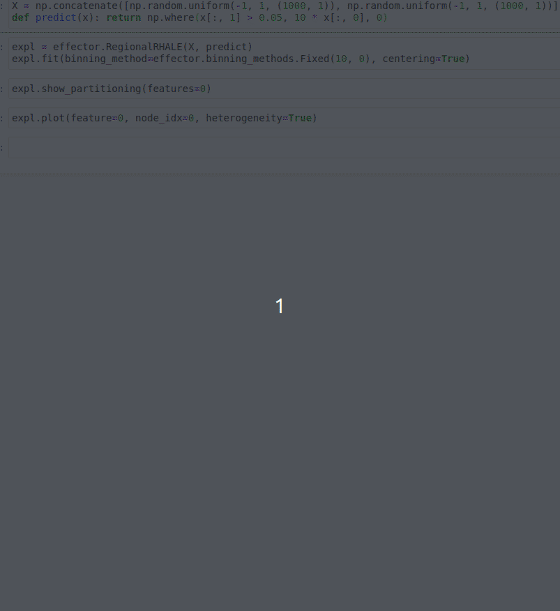

# Effector

[Documenation](https://xai-effector.github.io/) | [Global Effect](https://xai-effector.github.io/Feature%20Effect/01_global_effect_intro/) | [Regional Effect](https://xai-effector.github.io/Feature%20Effect/02_regional_effect_intro/) | [API](https://xai-effector.github.io/api/) | [Tutorials](https://xai-effector.github.io/)

`Effector` is a python package for global and regional effect analysis.

---



---
### Installation

`Effector` is compatible with `Python 3.7+`. We recommend to first create a virtual environment with `conda`:

```bash
conda create -n effector python=3.7
conda activate effector
```

and then install `Effector` via `pip`:

```bash
pip install effector
```

## Methods and Publications

### Methods

`Effector` implements the following methods:

| Method   | Global Effect     | Regional Effect         |                                                                                                                                
|----------|-------------------|-------------------------|
| PDP      | `PDP`             | `RegionalPDP`           |
| d-PDP    | `DerivativePDP`   | `RegionalDerivativePDP` |
| ALE      | `ALE`             | `RegionalALE`           |
| RHALE    | `RHALE`           | `RegionalRHALE`         |
| SHAP-DP  | `SHAPDependence`  | `RegionalSHAP`          |

### Publications

The methods above are based on the following publications:

- Global Effect:

  - PDP and d-PDP: [Friedman, Jerome H. "Greedy function approximation: a gradient boosting machine." Annals of statistics (2001): 1189-1232.](https://projecteuclid.org/euclid.aos/1013203451)
  - ALE: [Apley, Daniel W. "Visualizing the effects of predictor variables in black box supervised learning models." arXiv preprint arXiv:1612.08468 (2016).](https://arxiv.org/abs/1612.08468)
  - RHALE: [Gkolemis, Vasilis, "RHALE](https://ebooks.iospress.nl/doi/10.3233/FAIA230354)
  - SHAP-DP: [Lundberg, Scott M., and Su-In Lee. "A unified approach to interpreting model predictions." Advances in neural information processing systems. 2017.](https://papers.nips.cc/paper/7062-a-unified-approach-to-interpreting-model-predictions)

- Regional Effect:
 
  - [REPID: Regional Effect Plots with implicit Interaction Detection](https://proceedings.mlr.press/v151/herbinger22a.html)
  - [Decomposing Global Feature Effects Based on Feature Interactions](https://arxiv.org/pdf/2306.00541.pdf)
  - [Regionally Additive Models: Explainable-by-design models minimizing feature interactions](https://arxiv.org/abs/2309.12215)