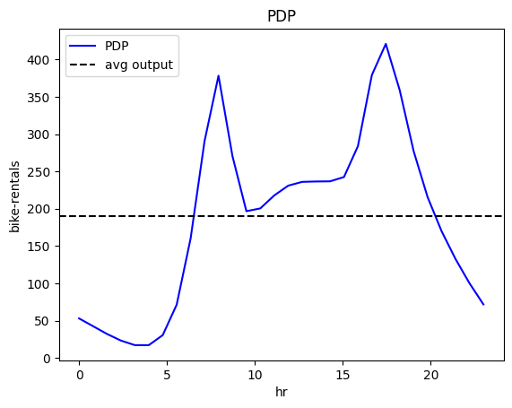

# Bike-Sharing Dataset

The [Bike-Sharing Dataset](https://archive.ics.uci.edu/ml/datasets/bike+sharing+dataset) This dataset contains the hourly and daily count of rental bikes between years 2011 and 2012 in Capital bikeshare system with the corresponding weather and seasonal information. The dataset contains 14 features with information about the day-type, e.g., month, hour, which day of the week, whether it is working-day, and the weather conditions, e.g., temperature, humidity, wind speed, etc. The target variable is the number of bike rentals per hour. The dataset contains 17,379 instances. 


```python
import effector
import numpy as np
import pandas as pd
import tensorflow as tf
from tensorflow import keras

np.random.seed(42)
tf.random.set_seed(42)

```

    2024-01-08 14:10:02.113432: I external/local_tsl/tsl/cuda/cudart_stub.cc:31] Could not find cuda drivers on your machine, GPU will not be used.
    2024-01-08 14:10:02.145940: E external/local_xla/xla/stream_executor/cuda/cuda_dnn.cc:9261] Unable to register cuDNN factory: Attempting to register factory for plugin cuDNN when one has already been registered
    2024-01-08 14:10:02.145962: E external/local_xla/xla/stream_executor/cuda/cuda_fft.cc:607] Unable to register cuFFT factory: Attempting to register factory for plugin cuFFT when one has already been registered
    2024-01-08 14:10:02.146743: E external/local_xla/xla/stream_executor/cuda/cuda_blas.cc:1515] Unable to register cuBLAS factory: Attempting to register factory for plugin cuBLAS when one has already been registered
    2024-01-08 14:10:02.151664: I external/local_tsl/tsl/cuda/cudart_stub.cc:31] Could not find cuda drivers on your machine, GPU will not be used.
    2024-01-08 14:10:02.152237: I tensorflow/core/platform/cpu_feature_guard.cc:182] This TensorFlow binary is optimized to use available CPU instructions in performance-critical operations.
    To enable the following instructions: AVX2 FMA, in other operations, rebuild TensorFlow with the appropriate compiler flags.
    2024-01-08 14:10:02.907279: W tensorflow/compiler/tf2tensorrt/utils/py_utils.cc:38] TF-TRT Warning: Could not find TensorRT


## Preprocess the data


```python
# load dataset
df = pd.read_csv("./../data/Bike-Sharing-Dataset/hour.csv")

# drop columns
df = df.drop(["instant", "dteday", "casual", "registered", "atemp"], axis=1)
```


```python
for col_name in df.columns:
    print("Feature: {:15}, unique: {:4d}, Mean: {:6.2f}, Std: {:6.2f}, Min: {:6.2f}, Max: {:6.2f}".format(col_name, len(df[col_name].unique()), df[col_name].mean(), df[col_name].std(), df[col_name].min(), df[col_name].max()))
```

    Feature: season         , unique:    4, Mean:   2.50, Std:   1.11, Min:   1.00, Max:   4.00
    Feature: yr             , unique:    2, Mean:   0.50, Std:   0.50, Min:   0.00, Max:   1.00
    Feature: mnth           , unique:   12, Mean:   6.54, Std:   3.44, Min:   1.00, Max:  12.00
    Feature: hr             , unique:   24, Mean:  11.55, Std:   6.91, Min:   0.00, Max:  23.00
    Feature: holiday        , unique:    2, Mean:   0.03, Std:   0.17, Min:   0.00, Max:   1.00
    Feature: weekday        , unique:    7, Mean:   3.00, Std:   2.01, Min:   0.00, Max:   6.00
    Feature: workingday     , unique:    2, Mean:   0.68, Std:   0.47, Min:   0.00, Max:   1.00
    Feature: weathersit     , unique:    4, Mean:   1.43, Std:   0.64, Min:   1.00, Max:   4.00
    Feature: temp           , unique:   50, Mean:   0.50, Std:   0.19, Min:   0.02, Max:   1.00
    Feature: hum            , unique:   89, Mean:   0.63, Std:   0.19, Min:   0.00, Max:   1.00
    Feature: windspeed      , unique:   30, Mean:   0.19, Std:   0.12, Min:   0.00, Max:   0.85
    Feature: cnt            , unique:  869, Mean: 189.46, Std: 181.39, Min:   1.00, Max: 977.00


Feature analysis:

| Feature      | Description                              | Value Range                                           |
|--------------|------------------------------------------|-------------------------------------------------------|
| season       | season                                   | 1: winter, 2: spring, 3: summer, 4: fall              |
| yr           | year                                     | 0: 2011, 1: 2012                                      |
| mnth         | month                                    | 1 to 12                                               |
| hr           | hour                                     | 0 to 23                                               |
| holiday      | whether the day is a holiday or not      | 0: no, 1: yes                                         |
| weekday      | day of the week                          | 0: Sunday, 1: Monday, …, 6: Saturday                  |
| workingday   | whether the day is a working day or not  | 0: no, 1: yes                                         |
| weathersit   | weather situation                        | 1: clear, 2: mist, 3: light rain, 4: heavy rain       |
| temp         | temperature                              | values in [0.02, 1.00], with mean: 0.50 and std: 0.19 |
| hum          | humidity                                 | values in [0.00, 1.00], with mean: 0.63 and std: 0.19 |
| windspeed    | wind speed                               | values in [0.00, 0.85], with mean: 0.19 and std: 0.12 |


Target variable:

| Target       | Description                            | Value Range                                          |
|--------------|----------------------------------------|------------------------------------------------------|
| cnt          | bike rentals per hour                  | values in [1, 977] with mean: 189.46 and std: 181.39 |


```python
def preprocess(df):
    # Standarize X
    X_df = df.drop(["cnt"], axis=1)
    x_mean = X_df.mean()
    x_std = X_df.std()
    X_df = (X_df - X_df.mean()) / X_df.std()

    # Standarize Y
    Y_df = df["cnt"]
    y_mean = Y_df.mean()
    y_std = Y_df.std()
    Y_df = (Y_df - Y_df.mean()) / Y_df.std()
    return X_df, Y_df, x_mean, x_std, y_mean, y_std

# shuffle and standarize all features
X_df, Y_df, x_mean, x_std, y_mean, y_std = preprocess(df)
```


```python
def split(X_df, Y_df):
    # shuffle indices
    indices = X_df.index.tolist()
    np.random.shuffle(indices)
    
    # data split
    train_size = int(0.8 * len(X_df))
    
    X_train = X_df.iloc[indices[:train_size]]
    Y_train = Y_df.iloc[indices[:train_size]]
    X_test = X_df.iloc[indices[train_size:]]
    Y_test = Y_df.iloc[indices[train_size:]]
    
    return X_train, Y_train, X_test, Y_test

# train/test split
X_train, Y_train, X_test, Y_test = split(X_df, Y_df)

```

## Fit a Neural Network


```python
# Train - Evaluate - Explain a neural network
model = keras.Sequential([
    keras.layers.Dense(1024, activation="relu"),
    keras.layers.Dense(512, activation="relu"),
    keras.layers.Dense(256, activation="relu"),
    keras.layers.Dense(1)
])

optimizer = keras.optimizers.Adam(learning_rate=0.001)
model.compile(optimizer=optimizer, loss="mse", metrics=["mae", keras.metrics.RootMeanSquaredError()])
model.fit(X_train, Y_train, batch_size=512, epochs=20, verbose=1)
model.evaluate(X_train, Y_train, verbose=1)
model.evaluate(X_test, Y_test, verbose=1)

```

    Epoch 1/20


    2024-01-08 14:10:03.542085: E external/local_xla/xla/stream_executor/cuda/cuda_driver.cc:274] failed call to cuInit: CUDA_ERROR_NO_DEVICE: no CUDA-capable device is detected


    28/28 [==============================] - 1s 10ms/step - loss: 0.5126 - mae: 0.5196 - root_mean_squared_error: 0.7160
    Epoch 2/20
    28/28 [==============================] - 0s 11ms/step - loss: 0.3579 - mae: 0.4280 - root_mean_squared_error: 0.5982
    Epoch 3/20
    28/28 [==============================] - 0s 10ms/step - loss: 0.2762 - mae: 0.3698 - root_mean_squared_error: 0.5255
    Epoch 4/20
    28/28 [==============================] - 0s 10ms/step - loss: 0.2060 - mae: 0.3177 - root_mean_squared_error: 0.4539
    Epoch 5/20
    28/28 [==============================] - 0s 10ms/step - loss: 0.1465 - mae: 0.2640 - root_mean_squared_error: 0.3828
    Epoch 6/20
    28/28 [==============================] - 0s 10ms/step - loss: 0.1148 - mae: 0.2356 - root_mean_squared_error: 0.3388
    Epoch 7/20
    28/28 [==============================] - 0s 10ms/step - loss: 0.0887 - mae: 0.2062 - root_mean_squared_error: 0.2979
    Epoch 8/20
    28/28 [==============================] - 0s 10ms/step - loss: 0.0741 - mae: 0.1880 - root_mean_squared_error: 0.2722
    Epoch 9/20
    28/28 [==============================] - 0s 10ms/step - loss: 0.0606 - mae: 0.1685 - root_mean_squared_error: 0.2462
    Epoch 10/20
    28/28 [==============================] - 0s 10ms/step - loss: 0.0588 - mae: 0.1666 - root_mean_squared_error: 0.2424
    Epoch 11/20
    28/28 [==============================] - 0s 10ms/step - loss: 0.0609 - mae: 0.1710 - root_mean_squared_error: 0.2468
    Epoch 12/20
    28/28 [==============================] - 0s 10ms/step - loss: 0.0545 - mae: 0.1631 - root_mean_squared_error: 0.2334
    Epoch 13/20
    28/28 [==============================] - 0s 10ms/step - loss: 0.0509 - mae: 0.1568 - root_mean_squared_error: 0.2256
    Epoch 14/20
    28/28 [==============================] - 0s 10ms/step - loss: 0.0474 - mae: 0.1489 - root_mean_squared_error: 0.2177
    Epoch 15/20
    28/28 [==============================] - 0s 10ms/step - loss: 0.0451 - mae: 0.1428 - root_mean_squared_error: 0.2123
    Epoch 16/20
    28/28 [==============================] - 0s 10ms/step - loss: 0.0430 - mae: 0.1395 - root_mean_squared_error: 0.2073
    Epoch 17/20
    28/28 [==============================] - 0s 11ms/step - loss: 0.0462 - mae: 0.1489 - root_mean_squared_error: 0.2148
    Epoch 18/20
    28/28 [==============================] - 0s 10ms/step - loss: 0.0419 - mae: 0.1387 - root_mean_squared_error: 0.2047
    Epoch 19/20
    28/28 [==============================] - 0s 10ms/step - loss: 0.0414 - mae: 0.1395 - root_mean_squared_error: 0.2036
    Epoch 20/20
    28/28 [==============================] - 0s 11ms/step - loss: 0.0486 - mae: 0.1524 - root_mean_squared_error: 0.2205
    435/435 [==============================] - 1s 1ms/step - loss: 0.0492 - mae: 0.1509 - root_mean_squared_error: 0.2218
    109/109 [==============================] - 0s 957us/step - loss: 0.0688 - mae: 0.1743 - root_mean_squared_error: 0.2622


    [0.06875330954790115, 0.17425496876239777, 0.2622085213661194]


We train a deep fully-connected Neural Network with 3 hidden layers for \(20\) epochs. 
The model achieves a root mean squared error on the test of about $0.24$ units, that corresponds to approximately \(0.24 * 181 = 43\) counts.

## Explain

We will focus on the feature `temp` (temperature) because its global effect is quite heterogeneous and the heterogeneity can be further explained using regional effects.


```python
def model_jac(x):
    x_tensor = tf.convert_to_tensor(x, dtype=tf.float32)
    with tf.GradientTape() as t:
        t.watch(x_tensor)
        pred = model(x_tensor)
        grads = t.gradient(pred, x_tensor)
    return grads.numpy()

def model_forward(x):
    return model(x).numpy().squeeze()

```


```python
scale_x = {"mean": x_mean.iloc[3], "std": x_std.iloc[3]}
scale_y = {"mean": y_mean, "std": y_std}
scale_x_list =[{"mean": x_mean.iloc[i], "std": x_std.iloc[i]} for i in range(len(x_mean))]
feature_names = X_df.columns.to_list()
target_name = "bike-rentals"
```

## Global Effect

We will first analyze the global effect of the feature `hour` on the target variable `bike-rentals`, using the PDP and RHALE methods.

### PDP 


```python
pdp = effector.PDP(data=X_train.to_numpy(), model=model_forward, feature_names=feature_names, target_name=target_name, nof_instances="all")
pdp.plot(feature=3, centering=False, scale_x=scale_x, scale_y=scale_y, show_avg_output=True)
```

    2024-01-08 14:10:10.948112: W external/local_tsl/tsl/framework/cpu_allocator_impl.cc:83] Allocation of 1708400640 exceeds 10% of free system memory.
    2024-01-08 14:10:11.211370: W external/local_tsl/tsl/framework/cpu_allocator_impl.cc:83] Allocation of 1708400640 exceeds 10% of free system memory.
    2024-01-08 14:10:11.428720: W external/local_tsl/tsl/framework/cpu_allocator_impl.cc:83] Allocation of 1708400640 exceeds 10% of free system memory.


    

    


```python
pdp.plot(feature=3, heterogeneity="ice", centering=True, scale_x=scale_x, scale_y=scale_y, nof_ice=300, show_avg_output=True)
```

    2024-01-08 14:10:13.477440: W external/local_tsl/tsl/framework/cpu_allocator_impl.cc:83] Allocation of 5694668800 exceeds 10% of free system memory.
    2024-01-08 14:10:14.355351: W external/local_tsl/tsl/framework/cpu_allocator_impl.cc:83] Allocation of 5694668800 exceeds 10% of free system memory.


    

    


### RHALE


```python
rhale = effector.RHALE(data=X_train.to_numpy(), model=model_forward, model_jac=model_jac, feature_names=feature_names, target_name=target_name)
rhale.fit(features=3, binning_method=effector.binning_methods.Greedy(init_nof_bins=100, min_points_per_bin=100, discount=1., cat_limit=10))
rhale.plot(feature=3, centering=True, scale_x=scale_x, scale_y=scale_y, show_avg_output=True)
```

    Degrees of freedom <= 0 for slice
    invalid value encountered in divide
    invalid value encountered in divide


    

    


```python
rhale.plot(feature=3, heterogeneity="std", centering=True, scale_x=scale_x, scale_y=scale_y, show_avg_output=True)
```


    

    


### Conclusion

The global effect of feature `hour` on the target variable `bike-rentals` shows two high peaks, one at around 8:00 and another at around 17:00, which probably corresponds to the morning and evening commute hours of the working days. However, the effect is quite heterogeneous. For this reason, we will analyze the regional effects which may explain the underlying heterogeneity.

## Regional Effect

### RegionalRHALE


```python
# Regional RHALE
regional_rhale = effector.RegionalRHALE(
    data=X_train.to_numpy(),
    model=model_forward,
    model_jac=model_jac,
    cat_limit=10,
    feature_names=feature_names,
    nof_instances="all"
)

regional_rhale.fit(
    features=3,
    heter_small_enough=0.1,
    heter_pcg_drop_thres=0.2,
    binning_method=effector.binning_methods.Greedy(init_nof_bins=100, min_points_per_bin=100, discount=1., cat_limit=10),
    max_depth=2,
    nof_candidate_splits_for_numerical=10,
    min_points_per_subregion=10,
    candidate_conditioning_features="all",
    split_categorical_features=True,
)
```

    100%|██████████| 1/1 [00:16<00:00, 16.81s/it]


```python
regional_rhale.show_partitioning(features=3, only_important=True, scale_x_list=scale_x_list)
```

    Feature 3 - Full partition tree:
    Node id: 0, name: hr, heter: 6.02 || nof_instances: 13903 || weight: 1.00
            Node id: 1, name: hr | workingday == 0.0, heter: 2.33 || nof_instances:  4385 || weight: 0.32
            Node id: 2, name: hr | workingday != 0.0, heter: 4.54 || nof_instances:  9518 || weight: 0.68
    --------------------------------------------------
    Feature 3 - Statistics per tree level:
    Level 0, heter: 6.02
            Level 1, heter: 3.84 || heter drop: 2.18 (36.19%)


```python
regional_rhale.plot(feature=3, node_idx=1, heterogeneity=True, centering=True, scale_x_list=scale_x_list, scale_y=scale_y)
regional_rhale.plot(feature=3, node_idx=2, heterogeneity=True, centering=True, scale_x_list=scale_x_list, scale_y=scale_y)
```


    

    


    

    


### RegionalPDP


```python
regional_pdp = effector.RegionalPDP(
    data=X_train.to_numpy(),
    model=model_forward,
    cat_limit=10,
    feature_names=feature_names,
    nof_instances="all"
)

regional_pdp.fit(
    features=3,
    heter_small_enough=0.1,
    heter_pcg_drop_thres=0.1,
    max_depth=2,
    nof_candidate_splits_for_numerical=5,
    min_points_per_subregion=10,
    candidate_conditioning_features="all",
    split_categorical_features=True,
    nof_instances=1000
)
```

    100%|██████████| 1/1 [00:15<00:00, 15.85s/it]


```python
regional_pdp.show_partitioning(features=3, only_important=True, scale_x_list=scale_x_list)
```

    Feature 3 - Full partition tree:
    Node id: 0, name: hr, heter: 0.57 || nof_instances: 13903 || weight: 1.00
            Node id: 1, name: hr | workingday == 1.0, heter: 0.43 || nof_instances:  9518 || weight: 0.68
                    Node id: 3, name: hr | workingday == 1.0 and season == 1.0, heter: 0.29 || nof_instances:  2245 || weight: 0.16
                    Node id: 4, name: hr | workingday == 1.0 and season != 1.0, heter: 0.38 || nof_instances:  7273 || weight: 0.52
            Node id: 2, name: hr | workingday != 1.0, heter: 0.46 || nof_instances:  4385 || weight: 0.32
                    Node id: 5, name: hr | workingday != 1.0 and season == 1.0, heter: 0.27 || nof_instances:  1140 || weight: 0.08
                    Node id: 6, name: hr | workingday != 1.0 and season != 1.0, heter: 0.39 || nof_instances:  3245 || weight: 0.23
    --------------------------------------------------
    Feature 3 - Statistics per tree level:
    Level 0, heter: 0.57
            Level 1, heter: 0.44 || heter drop: 0.13 (22.76%)
                    Level 2, heter: 0.36 || heter drop: 0.08 (17.64%)


```python
regional_pdp.plot(feature=3, node_idx=1, heterogeneity="ice", centering=True, scale_x_list=scale_x_list, scale_y=scale_y)
```


    

    


```python
regional_pdp.plot(feature=3, node_idx=2, heterogeneity="ice", centering=True, scale_x_list=scale_x_list, scale_y=scale_y)
```


    

    


### Conclusion

The both PDP and RHALE regional effect reveal two distinct explanations; one for the working days and another for the non-working days. For the working days, the effect is quite similar to the global effect (unfortunately, working ways dominate our life), with two high peaks at around 8:00 and 17:00. However, for the non-working days, the effect is quite different, with a single high peak at around 13:00 which probably corresponds to sightseeing and leisure activities.
