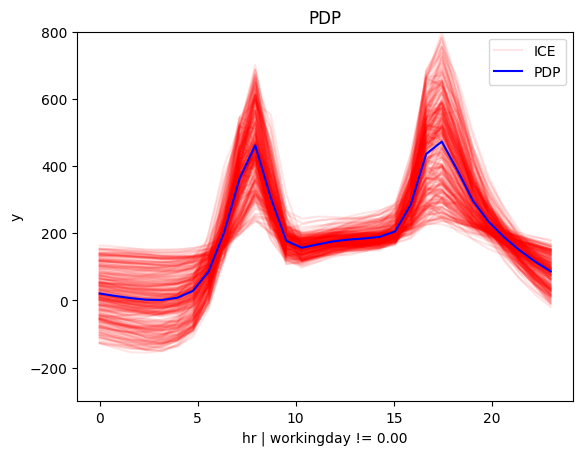
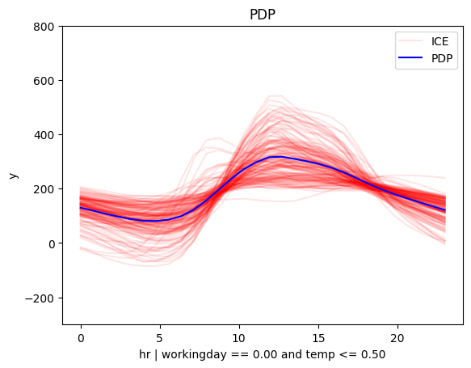
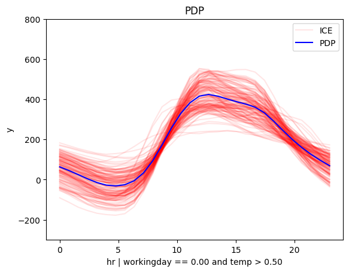
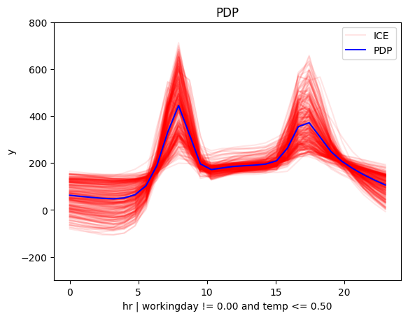
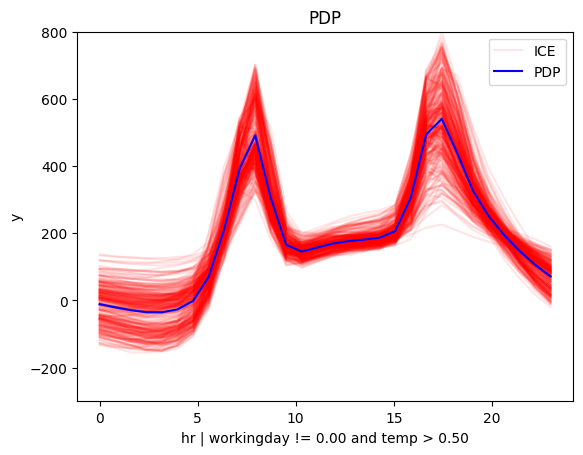

# Bike-Sharing Dataset

The [Bike-Sharing Dataset](https://archive.ics.uci.edu/ml/datasets/bike+sharing+dataset) contains the hourly and daily count of rental bikes between years 2011 and 2012 in Capital bikeshare system with the corresponding weather and seasonal information. The dataset contains 14 features with information about the day-type, e.g., month, hour, which day of the week, whether it is working-day, and the weather conditions, e.g., temperature, humidity, wind speed, etc. The target variable is the number of bike rentals per hour. The dataset contains 17,379 instances. 


```python
import effector
import numpy as np
import tensorflow as tf
from tensorflow import keras
import random

np.random.seed(42)
tf.random.set_seed(42)
random.seed(42)

```

    2025-01-27 13:52:25.892685: I external/local_xla/xla/tsl/cuda/cudart_stub.cc:32] Could not find cuda drivers on your machine, GPU will not be used.
    2025-01-27 13:52:26.039049: I external/local_xla/xla/tsl/cuda/cudart_stub.cc:32] Could not find cuda drivers on your machine, GPU will not be used.
    2025-01-27 13:52:26.141317: E external/local_xla/xla/stream_executor/cuda/cuda_fft.cc:477] Unable to register cuFFT factory: Attempting to register factory for plugin cuFFT when one has already been registered
    WARNING: All log messages before absl::InitializeLog() is called are written to STDERR
    E0000 00:00:1737982346.229875   62941 cuda_dnn.cc:8310] Unable to register cuDNN factory: Attempting to register factory for plugin cuDNN when one has already been registered
    E0000 00:00:1737982346.257185   62941 cuda_blas.cc:1418] Unable to register cuBLAS factory: Attempting to register factory for plugin cuBLAS when one has already been registered
    2025-01-27 13:52:26.474073: I tensorflow/core/platform/cpu_feature_guard.cc:210] This TensorFlow binary is optimized to use available CPU instructions in performance-critical operations.
    To enable the following instructions: AVX2 FMA, in other operations, rebuild TensorFlow with the appropriate compiler flags.


## Preprocess the data


```python
from ucimlrepo import fetch_ucirepo 
  
# fetch dataset 
bike_sharing_dataset = fetch_ucirepo(id=275) 
  
# data (as pandas dataframes) 
X = bike_sharing_dataset.data.features 
y = bike_sharing_dataset.data.targets 
  
# metadata 
# print(bike_sharing_dataset.metadata) 
  
# variable information 
print(bike_sharing_dataset.variables) 
```

              name     role         type demographic  \
    0      instant       ID      Integer        None   
    1       dteday  Feature         Date        None   
    2       season  Feature  Categorical        None   
    3           yr  Feature  Categorical        None   
    4         mnth  Feature  Categorical        None   
    5           hr  Feature  Categorical        None   
    6      holiday  Feature       Binary        None   
    7      weekday  Feature  Categorical        None   
    8   workingday  Feature       Binary        None   
    9   weathersit  Feature  Categorical        None   
    10        temp  Feature   Continuous        None   
    11       atemp  Feature   Continuous        None   
    12         hum  Feature   Continuous        None   
    13   windspeed  Feature   Continuous        None   
    14      casual    Other      Integer        None   
    15  registered    Other      Integer        None   
    16         cnt   Target      Integer        None   
    
                                              description units missing_values  
    0                                        record index  None             no  
    1                                                date  None             no  
    2                1:winter, 2:spring, 3:summer, 4:fall  None             no  
    3                             year (0: 2011, 1: 2012)  None             no  
    4                                     month (1 to 12)  None             no  
    5                                      hour (0 to 23)  None             no  
    6   weather day is holiday or not (extracted from ...  None             no  
    7                                     day of the week  None             no  
    8   if day is neither weekend nor holiday is 1, ot...  None             no  
    9   - 1: Clear, Few clouds, Partly cloudy, Partly ...  None             no  
    10  Normalized temperature in Celsius. The values ...     C             no  
    11  Normalized feeling temperature in Celsius. The...     C             no  
    12  Normalized humidity. The values are divided to...  None             no  
    13  Normalized wind speed. The values are divided ...  None             no  
    14                              count of casual users  None             no  
    15                          count of registered users  None             no  
    16  count of total rental bikes including both cas...  None             no  


```python
X = X.drop(["dteday", "atemp"], axis=1)
```


```python
X.head()
```


<div>
<style scoped>
    .dataframe tbody tr th:only-of-type {
        vertical-align: middle;
    }

    .dataframe tbody tr th {
        vertical-align: top;
    }

    .dataframe thead th {
        text-align: right;
    }
</style>
<table border="1" class="dataframe">
  <thead>
    <tr style="text-align: right;">
      <th></th>
      <th>season</th>
      <th>yr</th>
      <th>mnth</th>
      <th>hr</th>
      <th>holiday</th>
      <th>weekday</th>
      <th>workingday</th>
      <th>weathersit</th>
      <th>temp</th>
      <th>hum</th>
      <th>windspeed</th>
    </tr>
  </thead>
  <tbody>
    <tr>
      <th>0</th>
      <td>1</td>
      <td>0</td>
      <td>1</td>
      <td>0</td>
      <td>0</td>
      <td>6</td>
      <td>0</td>
      <td>1</td>
      <td>0.24</td>
      <td>0.81</td>
      <td>0.0</td>
    </tr>
    <tr>
      <th>1</th>
      <td>1</td>
      <td>0</td>
      <td>1</td>
      <td>1</td>
      <td>0</td>
      <td>6</td>
      <td>0</td>
      <td>1</td>
      <td>0.22</td>
      <td>0.80</td>
      <td>0.0</td>
    </tr>
    <tr>
      <th>2</th>
      <td>1</td>
      <td>0</td>
      <td>1</td>
      <td>2</td>
      <td>0</td>
      <td>6</td>
      <td>0</td>
      <td>1</td>
      <td>0.22</td>
      <td>0.80</td>
      <td>0.0</td>
    </tr>
    <tr>
      <th>3</th>
      <td>1</td>
      <td>0</td>
      <td>1</td>
      <td>3</td>
      <td>0</td>
      <td>6</td>
      <td>0</td>
      <td>1</td>
      <td>0.24</td>
      <td>0.75</td>
      <td>0.0</td>
    </tr>
    <tr>
      <th>4</th>
      <td>1</td>
      <td>0</td>
      <td>1</td>
      <td>4</td>
      <td>0</td>
      <td>6</td>
      <td>0</td>
      <td>1</td>
      <td>0.24</td>
      <td>0.75</td>
      <td>0.0</td>
    </tr>
  </tbody>
</table>
</div>


```python
# load dataset
# df = pd.read_csv("./../data/Bike-Sharing-Dataset/hour.csv")

# drop columns
# df = df.drop(["instant", "dteday", "casual", "registered", "atemp"], axis=1)
```


```python
print("Design matrix shape: {}".format(X.shape))
print("---------------------------------")
for col_name in X.columns:
    print("Feature: {:15}, unique: {:4d}, Mean: {:6.2f}, Std: {:6.2f}, Min: {:6.2f}, Max: {:6.2f}".format(col_name, len(X[col_name].unique()), X[col_name].mean(), X[col_name].std(), X[col_name].min(), X[col_name].max()))
    
print("\nTarget shape: {}".format(y.shape))
print("---------------------------------")
for col_name in y.columns:
    print("Target: {:15}, unique: {:4d}, Mean: {:6.2f}, Std: {:6.2f}, Min: {:6.2f}, Max: {:6.2f}".format(col_name, len(y[col_name].unique()), y[col_name].mean(), y[col_name].std(), y[col_name].min(), y[col_name].max()))
```

    Design matrix shape: (17379, 11)
    ---------------------------------
    Feature: season         , unique:    4, Mean:   2.50, Std:   1.11, Min:   1.00, Max:   4.00
    Feature: yr             , unique:    2, Mean:   0.50, Std:   0.50, Min:   0.00, Max:   1.00
    Feature: mnth           , unique:   12, Mean:   6.54, Std:   3.44, Min:   1.00, Max:  12.00
    Feature: hr             , unique:   24, Mean:  11.55, Std:   6.91, Min:   0.00, Max:  23.00
    Feature: holiday        , unique:    2, Mean:   0.03, Std:   0.17, Min:   0.00, Max:   1.00
    Feature: weekday        , unique:    7, Mean:   3.00, Std:   2.01, Min:   0.00, Max:   6.00
    Feature: workingday     , unique:    2, Mean:   0.68, Std:   0.47, Min:   0.00, Max:   1.00
    Feature: weathersit     , unique:    4, Mean:   1.43, Std:   0.64, Min:   1.00, Max:   4.00
    Feature: temp           , unique:   50, Mean:   0.50, Std:   0.19, Min:   0.02, Max:   1.00
    Feature: hum            , unique:   89, Mean:   0.63, Std:   0.19, Min:   0.00, Max:   1.00
    Feature: windspeed      , unique:   30, Mean:   0.19, Std:   0.12, Min:   0.00, Max:   0.85
    
    Target shape: (17379, 1)
    ---------------------------------
    Target: cnt            , unique:  869, Mean: 189.46, Std: 181.39, Min:   1.00, Max: 977.00


Feature analysis:

| Feature      | Description                              | Value Range                                           |
|--------------|------------------------------------------|-------------------------------------------------------|
| season       | season                                   | 1: winter, 2: spring, 3: summer, 4: fall              |
| yr           | year                                     | 0: 2011, 1: 2012                                      |
| mnth         | month                                    | 1 to 12                                               |
| hr           | hour                                     | 0 to 23                                               |
| holiday      | whether the day is a holiday or not      | 0: no, 1: yes                                         |
| weekday      | day of the week                          | 0: Sunday, 1: Monday, …, 6: Saturday                  |
| workingday   | whether the day is a working day or not  | 0: no, 1: yes                                         |
| weathersit   | weather situation                        | 1: clear, 2: mist, 3: light rain, 4: heavy rain       |
| temp         | temperature                              | values in [0.02, 1.00], with mean: 0.50 and std: 0.19 |
| hum          | humidity                                 | values in [0.00, 1.00], with mean: 0.63 and std: 0.19 |
| windspeed    | wind speed                               | values in [0.00, 0.85], with mean: 0.19 and std: 0.12 |


Target variable:

| Target       | Description                            | Value Range                                          |
|--------------|----------------------------------------|------------------------------------------------------|
| cnt          | bike rentals per hour                  | values in [1, 977] with mean: 189.46 and std: 181.39 |


```python
def preprocess(X, y):
    # Standarize X
    X_df = X
    x_mean = X_df.mean()
    x_std = X_df.std()
    X_df = (X_df - X_df.mean()) / X_df.std()

    # Standarize Y
    Y_df = y
    y_mean = Y_df.mean()
    y_std = Y_df.std()
    Y_df = (Y_df - Y_df.mean()) / Y_df.std()
    return X_df, Y_df, x_mean, x_std, y_mean, y_std

# shuffle and standarize all features
X_df, Y_df, x_mean, x_std, y_mean, y_std = preprocess(X, y)
```


```python
def split(X_df, Y_df):
    # shuffle indices
    indices = X_df.index.tolist()
    np.random.shuffle(indices)
    
    # data split
    train_size = int(0.8 * len(X_df))
    
    X_train = X_df.iloc[indices[:train_size]]
    Y_train = Y_df.iloc[indices[:train_size]]
    X_test = X_df.iloc[indices[train_size:]]
    Y_test = Y_df.iloc[indices[train_size:]]
    
    return X_train, Y_train, X_test, Y_test

# train/test split
X_train, Y_train, X_test, Y_test = split(X_df, Y_df)

```

## Fit a Neural Network


```python
# Train - Evaluate - Explain a neural network
model = keras.Sequential([
    keras.layers.Dense(1024, activation="relu"),
    keras.layers.Dense(512, activation="relu"),
    keras.layers.Dense(256, activation="relu"),
    keras.layers.Dense(1)
])

optimizer = keras.optimizers.Adam(learning_rate=0.001)
model.compile(optimizer=optimizer, loss="mse", metrics=["mae", keras.metrics.RootMeanSquaredError()])
model.fit(X_train, Y_train, batch_size=512, epochs=20, verbose=1)
model.evaluate(X_train, Y_train, verbose=1)
model.evaluate(X_test, Y_test, verbose=1)

```

    Epoch 1/20


    2025-01-27 13:52:31.859374: E external/local_xla/xla/stream_executor/cuda/cuda_driver.cc:152] failed call to cuInit: INTERNAL: CUDA error: Failed call to cuInit: CUDA_ERROR_COMPAT_NOT_SUPPORTED_ON_DEVICE: forward compatibility was attempted on non supported HW
    2025-01-27 13:52:31.859402: I external/local_xla/xla/stream_executor/cuda/cuda_diagnostics.cc:137] retrieving CUDA diagnostic information for host: givasile-ubuntu-XPS-15-9500
    2025-01-27 13:52:31.859409: I external/local_xla/xla/stream_executor/cuda/cuda_diagnostics.cc:144] hostname: givasile-ubuntu-XPS-15-9500
    2025-01-27 13:52:31.859553: I external/local_xla/xla/stream_executor/cuda/cuda_diagnostics.cc:168] libcuda reported version is: 560.35.5
    2025-01-27 13:52:31.859574: I external/local_xla/xla/stream_executor/cuda/cuda_diagnostics.cc:172] kernel reported version is: 550.120.0
    2025-01-27 13:52:31.859580: E external/local_xla/xla/stream_executor/cuda/cuda_diagnostics.cc:262] kernel version 550.120.0 does not match DSO version 560.35.5 -- cannot find working devices in this configuration


    28/28 ━━━━━━━━━━━━━━━━━━━━ 1s 11ms/step - loss: 0.6231 - mae: 0.5745 - root_mean_squared_error: 0.7853
    Epoch 2/20
    28/28 ━━━━━━━━━━━━━━━━━━━━ 0s 11ms/step - loss: 0.3870 - mae: 0.4506 - root_mean_squared_error: 0.6219
    Epoch 3/20
    28/28 ━━━━━━━━━━━━━━━━━━━━ 0s 11ms/step - loss: 0.2976 - mae: 0.3851 - root_mean_squared_error: 0.5454
    Epoch 4/20
    28/28 ━━━━━━━━━━━━━━━━━━━━ 0s 11ms/step - loss: 0.2237 - mae: 0.3326 - root_mean_squared_error: 0.4728
    Epoch 5/20
    28/28 ━━━━━━━━━━━━━━━━━━━━ 0s 11ms/step - loss: 0.1619 - mae: 0.2836 - root_mean_squared_error: 0.4023
    Epoch 6/20
    28/28 ━━━━━━━━━━━━━━━━━━━━ 0s 11ms/step - loss: 0.1193 - mae: 0.2386 - root_mean_squared_error: 0.3451
    Epoch 7/20
    28/28 ━━━━━━━━━━━━━━━━━━━━ 0s 13ms/step - loss: 0.0906 - mae: 0.2075 - root_mean_squared_error: 0.3009
    Epoch 8/20
    28/28 ━━━━━━━━━━━━━━━━━━━━ 0s 11ms/step - loss: 0.0753 - mae: 0.1895 - root_mean_squared_error: 0.2745
    Epoch 9/20
    28/28 ━━━━━━━━━━━━━━━━━━━━ 0s 11ms/step - loss: 0.0669 - mae: 0.1784 - root_mean_squared_error: 0.2586
    Epoch 10/20
    28/28 ━━━━━━━━━━━━━━━━━━━━ 0s 11ms/step - loss: 0.0610 - mae: 0.1703 - root_mean_squared_error: 0.2469
    Epoch 11/20
    28/28 ━━━━━━━━━━━━━━━━━━━━ 0s 11ms/step - loss: 0.0554 - mae: 0.1614 - root_mean_squared_error: 0.2353
    Epoch 12/20
    28/28 ━━━━━━━━━━━━━━━━━━━━ 0s 11ms/step - loss: 0.0500 - mae: 0.1524 - root_mean_squared_error: 0.2235
    Epoch 13/20
    28/28 ━━━━━━━━━━━━━━━━━━━━ 0s 11ms/step - loss: 0.0462 - mae: 0.1459 - root_mean_squared_error: 0.2149
    Epoch 14/20
    28/28 ━━━━━━━━━━━━━━━━━━━━ 0s 11ms/step - loss: 0.0431 - mae: 0.1407 - root_mean_squared_error: 0.2075
    Epoch 15/20
    28/28 ━━━━━━━━━━━━━━━━━━━━ 0s 11ms/step - loss: 0.0410 - mae: 0.1372 - root_mean_squared_error: 0.2026
    Epoch 16/20
    28/28 ━━━━━━━━━━━━━━━━━━━━ 0s 12ms/step - loss: 0.0399 - mae: 0.1360 - root_mean_squared_error: 0.1996
    Epoch 17/20
    28/28 ━━━━━━━━━━━━━━━━━━━━ 0s 11ms/step - loss: 0.0381 - mae: 0.1325 - root_mean_squared_error: 0.1952
    Epoch 18/20
    28/28 ━━━━━━━━━━━━━━━━━━━━ 0s 11ms/step - loss: 0.0378 - mae: 0.1323 - root_mean_squared_error: 0.1945
    Epoch 19/20
    28/28 ━━━━━━━━━━━━━━━━━━━━ 0s 11ms/step - loss: 0.0376 - mae: 0.1325 - root_mean_squared_error: 0.1940
    Epoch 20/20
    28/28 ━━━━━━━━━━━━━━━━━━━━ 0s 11ms/step - loss: 0.0378 - mae: 0.1331 - root_mean_squared_error: 0.1944
    435/435 ━━━━━━━━━━━━━━━━━━━━ 1s 1ms/step - loss: 0.0420 - mae: 0.1422 - root_mean_squared_error: 0.2048
    109/109 ━━━━━━━━━━━━━━━━━━━━ 0s 1ms/step - loss: 0.0701 - mae: 0.1725 - root_mean_squared_error: 0.2633


    [0.06317276507616043, 0.16644978523254395, 0.25134193897247314]


We train a deep fully-connected Neural Network with 3 hidden layers for \(20\) epochs. 
The model achieves a root mean squared error on the test of about $0.24$ units, that corresponds to approximately \(0.26 * 181 = 47\) counts.

## Explain

We will focus on the feature `temp` (temperature) because its global effect is quite heterogeneous and the heterogeneity can be further explained using regional effects.


```python
def model_jac(x):
    x_tensor = tf.convert_to_tensor(x, dtype=tf.float32)
    with tf.GradientTape() as t:
        t.watch(x_tensor)
        pred = model(x_tensor)
        grads = t.gradient(pred, x_tensor)
    return grads.numpy()

def model_forward(x):
    return model(x).numpy().squeeze()

```


```python
scale_x = {"mean": x_mean.iloc[3], "std": x_std.iloc[3]}
scale_y = {"mean": y_mean.iloc[0], "std": y_std.iloc[0]}
scale_x_list =[{"mean": x_mean.iloc[i], "std": x_std.iloc[i]} for i in range(len(x_mean))]
feature_names = X_df.columns.to_list()
target_name = "bike-rentals"
```

## Global Effect

We will first analyze the global effect of the feature `hour` on the target variable `bike-rentals`, using the PDP and RHALE methods.

### PDP 


```python
pdp = effector.PDP(data=X_train.to_numpy(), model=model_forward, feature_names=feature_names, target_name=target_name, nof_instances=300)
```


```python
pdp.plot(feature=3, centering=True, scale_x=scale_x, scale_y=scale_y, show_avg_output=True)
```


    

    


### RHALE


```python
rhale = effector.RHALE(data=X_train.to_numpy(), model=model_forward, model_jac=model_jac, feature_names=feature_names, target_name=target_name)
```


```python
rhale.plot(feature=3, heterogeneity="std", centering=True, scale_x=scale_x, scale_y=scale_y, show_avg_output=True)
```

    /home/givasile/miniconda3/envs/effector-dev/lib/python3.10/site-packages/numpy/_core/fromnumeric.py:4008: RuntimeWarning: Degrees of freedom <= 0 for slice
      return _methods._var(a, axis=axis, dtype=dtype, out=out, ddof=ddof,
    /home/givasile/miniconda3/envs/effector-dev/lib/python3.10/site-packages/numpy/_core/_methods.py:175: RuntimeWarning: invalid value encountered in divide
      arrmean = um.true_divide(arrmean, div, out=arrmean,
    /home/givasile/miniconda3/envs/effector-dev/lib/python3.10/site-packages/numpy/_core/_methods.py:210: RuntimeWarning: invalid value encountered in divide
      ret = ret.dtype.type(ret / rcount)


    

    


### Conclusion

The global effect of feature `hour` on the target variable `bike-rentals` shows two high peaks, one at around 8:00 and another at around 17:00, which probably corresponds to the morning and evening commute hours of the working days. However, the effect is quite heterogeneous. For this reason, we will analyze the regional effects which may explain the underlying heterogeneity.

## Regional Effect

### RegionalRHALE


```python
# Regional RHALE
regional_rhale = effector.RegionalRHALE(
    data=X_train.to_numpy(),
    model=model_forward,
    model_jac=model_jac,
    cat_limit=10,
    feature_names=feature_names,
    nof_instances="all"
)

regional_rhale.fit(
    features=3,
    heter_small_enough=0.1,
    heter_pcg_drop_thres=0.2,
    binning_method=effector.binning_methods.Greedy(init_nof_bins=100, min_points_per_bin=100, discount=1., cat_limit=10),
    max_depth=2,
    nof_candidate_splits_for_numerical=10,
    min_points_per_subregion=10,
    candidate_conditioning_features="all",
    split_categorical_features=True,
)
```

    100%|████████████████████████████████████████████████████████████████████████████████████████████████████████████████████████████████████████████████████████████████████████████████████████████████████████████████████████████████████████████████| 1/1 [00:16<00:00, 16.92s/it]


```python
regional_rhale.summary(features=3, only_important=True, scale_x_list=scale_x_list)
```

    
    
    Feature 3 - Full partition tree:
    Node id: 0, name: hr, heter: 5.46 || nof_instances: 13903 || weight: 1.00
            Node id: 1, name: hr | workingday == 0.00, heter: 0.73 || nof_instances:  4385 || weight: 0.32
                    Node id: 3, name: hr | workingday == 0.00 and yr == 0.00, heter: 0.42 || nof_instances:  2183 || weight: 0.16
                    Node id: 4, name: hr | workingday == 0.00 and yr != 0.00, heter: 0.94 || nof_instances:  2202 || weight: 0.16
            Node id: 2, name: hr | workingday != 0.00, heter: 3.34 || nof_instances:  9518 || weight: 0.68
                    Node id: 5, name: hr | workingday != 0.00 and yr == 0.00, heter: 1.85 || nof_instances:  4785 || weight: 0.34
                    Node id: 6, name: hr | workingday != 0.00 and yr != 0.00, heter: 3.26 || nof_instances:  4733 || weight: 0.34
    --------------------------------------------------
    Feature 3 - Statistics per tree level:
    Level 0, heter: 5.46
            Level 1, heter: 2.52 || heter drop : 2.94 (units), 53.87% (pcg)
                    Level 2, heter: 1.96 || heter drop : 0.55 (units), 22.00% (pcg)
    
    


```python
regional_rhale.plot(feature=3, node_idx=1, heterogeneity=True, centering=True, scale_x_list=scale_x_list, scale_y=scale_y)
regional_rhale.plot(feature=3, node_idx=2, heterogeneity=True, centering=True, scale_x_list=scale_x_list, scale_y=scale_y)
```


    

    


    

    


### RegionalPDP


```python
regional_pdp = effector.RegionalPDP(
    data=X_train.to_numpy(),
    model=model_forward,
    cat_limit=10,
    feature_names=feature_names,
    nof_instances=1_000
)

regional_pdp.fit(
    features=3,
    heter_small_enough=0.1,
    heter_pcg_drop_thres=0.1,
    max_depth=2,
    nof_candidate_splits_for_numerical=5,
    min_points_per_subregion=10,
    candidate_conditioning_features="all",
    split_categorical_features=True,
)
```

    100%|████████████████████████████████████████████████████████████████████████████████████████████████████████████████████████████████████████████████████████████████████████████████████████████████████████████████████████████████████████████████| 1/1 [00:00<00:00,  5.56it/s]


```python
regional_pdp.summary(features=3, only_important=True, scale_x_list=scale_x_list)
```

    
    
    Feature 3 - Full partition tree:
    Node id: 0, name: hr, heter: 0.43 || nof_instances:  1000 || weight: 1.00
            Node id: 1, name: hr | workingday == 0.00, heter: 0.38 || nof_instances:   302 || weight: 0.30
                    Node id: 3, name: hr | workingday == 0.00 and temp <= 0.50, heter: 0.21 || nof_instances:   157 || weight: 0.16
                    Node id: 4, name: hr | workingday == 0.00 and temp > 0.50, heter: 0.23 || nof_instances:   145 || weight: 0.14
            Node id: 2, name: hr | workingday != 0.00, heter: 0.30 || nof_instances:   698 || weight: 0.70
                    Node id: 5, name: hr | workingday != 0.00 and temp <= 0.50, heter: 0.22 || nof_instances:   305 || weight: 0.30
                    Node id: 6, name: hr | workingday != 0.00 and temp > 0.50, heter: 0.21 || nof_instances:   393 || weight: 0.39
    --------------------------------------------------
    Feature 3 - Statistics per tree level:
    Level 0, heter: 0.43
            Level 1, heter: 0.32 || heter drop : 0.11 (units), 25.31% (pcg)
                    Level 2, heter: 0.22 || heter drop : 0.11 (units), 33.43% (pcg)
    
    


```python
y_limits=[-300, 800]
```


```python
regional_pdp.plot(feature=3, node_idx=1, heterogeneity="ice", centering=True, scale_x_list=scale_x_list, scale_y=scale_y, y_limits=y_limits)
```


    

    


```python
regional_pdp.plot(feature=3, node_idx=2, heterogeneity="ice", centering=True, scale_x_list=scale_x_list, scale_y=scale_y, y_limits=y_limits)
```


    

    


### Conclusion

The both PDP and RHALE regional effect reveal two distinct explanations; one for the working days and another for the non-working days. For the working days, the effect is quite similar to the global effect (unfortunately, working ways dominate our life), with two high peaks at around 8:00 and 17:00. However, for the non-working days, the effect is quite different, with a single high peak at around 13:00 which probably corresponds to sightseeing and leisure activities.


```python
for node_idx in [3, 4, 5, 6]:
    regional_pdp.plot(feature=3, node_idx=node_idx, heterogeneity="ice", centering=True, scale_x_list=scale_x_list, scale_y=scale_y, y_limits=y_limits)
```


    

    


    

    


    

    


    

    


```python
import timeit
tic = timeit.default_timer()
regional_pdp.fit(
    features="all",
    heter_small_enough=0.1,
    heter_pcg_drop_thres=0.1,
    max_depth=2,
    nof_candidate_splits_for_numerical=5,
    min_points_per_subregion=10,
    candidate_conditioning_features="all",
    split_categorical_features=True,
)
toc = timeit.default_timer() - tic
print(toc)
```

    100%|██████████████████████████████████████████████████████████████████████████████████████████████████████████████████████████████████████████████████████████████████████████████████████████████████████████████████████████████████████████████| 11/11 [00:01<00:00,  5.80it/s]

    1.8987026840004546


    


```python

```
