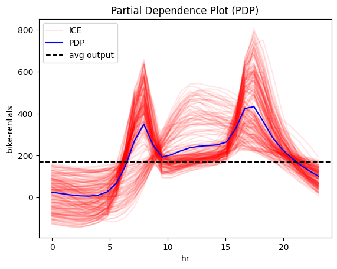
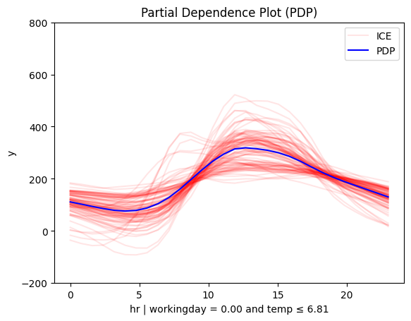

# Bike-Sharing Dataset

The [Bike-Sharing Dataset](https://archive.ics.uci.edu/ml/datasets/bike+sharing+dataset) contains the hourly and daily count of rental bikes between years 2011 and 2012 in Capital bikeshare system with the corresponding weather and seasonal information. The dataset contains 14 features with information about the day-type, e.g., month, hour, which day of the week, whether it is working-day, and the weather conditions, e.g., temperature, humidity, wind speed, etc. The target variable is the number of bike rentals per hour. The dataset contains 17,379 instances. 


```python
import effector
import numpy as np
import tensorflow as tf
from tensorflow import keras
import random

np.random.seed(42)
tf.random.set_seed(42)
random.seed(42)

```

    Using `tqdm.autonotebook.tqdm` in notebook mode. Use `tqdm.tqdm` instead to force console mode (e.g. in jupyter console)
    2024-03-28 17:24:36.392080: I tensorflow/core/platform/cpu_feature_guard.cc:193] This TensorFlow binary is optimized with oneAPI Deep Neural Network Library (oneDNN) to use the following CPU instructions in performance-critical operations:  AVX2 FMA
    To enable them in other operations, rebuild TensorFlow with the appropriate compiler flags.
    2024-03-28 17:24:37.795745: W tensorflow/compiler/xla/stream_executor/platform/default/dso_loader.cc:64] Could not load dynamic library 'libnvinfer.so.7'; dlerror: libnvinfer.so.7: cannot open shared object file: No such file or directory
    2024-03-28 17:24:37.795860: W tensorflow/compiler/xla/stream_executor/platform/default/dso_loader.cc:64] Could not load dynamic library 'libnvinfer_plugin.so.7'; dlerror: libnvinfer_plugin.so.7: cannot open shared object file: No such file or directory
    2024-03-28 17:24:37.795868: W tensorflow/compiler/tf2tensorrt/utils/py_utils.cc:38] TF-TRT Warning: Cannot dlopen some TensorRT libraries. If you would like to use Nvidia GPU with TensorRT, please make sure the missing libraries mentioned above are installed properly.


## Preprocess the data


```python
from ucimlrepo import fetch_ucirepo 
  
# fetch dataset 
bike_sharing_dataset = fetch_ucirepo(id=275) 
  
# data (as pandas dataframes) 
X = bike_sharing_dataset.data.features 
y = bike_sharing_dataset.data.targets 
  
# metadata 
print(bike_sharing_dataset.metadata) 
  
# variable information 
print(bike_sharing_dataset.variables) 
```

    {'uci_id': 275, 'name': 'Bike Sharing', 'repository_url': 'https://archive.ics.uci.edu/dataset/275/bike+sharing+dataset', 'data_url': 'https://archive.ics.uci.edu/static/public/275/data.csv', 'abstract': 'This dataset contains the hourly and daily count of rental bikes between years 2011 and 2012 in Capital bikeshare system with the corresponding weather and seasonal information.', 'area': 'Social Science', 'tasks': ['Regression'], 'characteristics': ['Multivariate'], 'num_instances': 17389, 'num_features': 13, 'feature_types': ['Integer', 'Real'], 'demographics': [], 'target_col': ['cnt'], 'index_col': ['instant'], 'has_missing_values': 'no', 'missing_values_symbol': None, 'year_of_dataset_creation': 2013, 'last_updated': 'Sun Mar 10 2024', 'dataset_doi': '10.24432/C5W894', 'creators': ['Hadi Fanaee-T'], 'intro_paper': {'title': 'Event labeling combining ensemble detectors and background knowledge', 'authors': 'Hadi Fanaee-T, João Gama', 'published_in': 'Progress in Artificial Intelligence', 'year': 2013, 'url': 'https://www.semanticscholar.org/paper/bc42899f599d31a5d759f3e0a3ea8b52479d6423', 'doi': '10.1007/s13748-013-0040-3'}, 'additional_info': {'summary': 'Bike sharing systems are new generation of traditional bike rentals where whole process from membership, rental and return back has become automatic. Through these systems, user is able to easily rent a bike from a particular position and return back at another position. Currently, there are about over 500 bike-sharing programs around the world which is composed of over 500 thousands bicycles. Today, there exists great interest in these systems due to their important role in traffic, environmental and health issues. \r\n\r\nApart from interesting real world applications of bike sharing systems, the characteristics of data being generated by these systems make them attractive for the research. Opposed to other transport services such as bus or subway, the duration of travel, departure and arrival position is explicitly recorded in these systems. This feature turns bike sharing system into a virtual sensor network that can be used for sensing mobility in the city. Hence, it is expected that most of important events in the city could be detected via monitoring these data.', 'purpose': None, 'funded_by': None, 'instances_represent': None, 'recommended_data_splits': None, 'sensitive_data': None, 'preprocessing_description': None, 'variable_info': 'Both hour.csv and day.csv have the following fields, except hr which is not available in day.csv\r\n\t\r\n\t- instant: record index\r\n\t- dteday : date\r\n\t- season : season (1:winter, 2:spring, 3:summer, 4:fall)\r\n\t- yr : year (0: 2011, 1:2012)\r\n\t- mnth : month ( 1 to 12)\r\n\t- hr : hour (0 to 23)\r\n\t- holiday : weather day is holiday or not (extracted from http://dchr.dc.gov/page/holiday-schedule)\r\n\t- weekday : day of the week\r\n\t- workingday : if day is neither weekend nor holiday is 1, otherwise is 0.\r\n\t+ weathersit : \r\n\t\t- 1: Clear, Few clouds, Partly cloudy, Partly cloudy\r\n\t\t- 2: Mist + Cloudy, Mist + Broken clouds, Mist + Few clouds, Mist\r\n\t\t- 3: Light Snow, Light Rain + Thunderstorm + Scattered clouds, Light Rain + Scattered clouds\r\n\t\t- 4: Heavy Rain + Ice Pallets + Thunderstorm + Mist, Snow + Fog\r\n\t- temp : Normalized temperature in Celsius. The values are derived via (t-t_min)/(t_max-t_min), t_min=-8, t_max=+39 (only in hourly scale)\r\n\t- atemp: Normalized feeling temperature in Celsius. The values are derived via (t-t_min)/(t_max-t_min), t_min=-16, t_max=+50 (only in hourly scale)\r\n\t- hum: Normalized humidity. The values are divided to 100 (max)\r\n\t- windspeed: Normalized wind speed. The values are divided to 67 (max)\r\n\t- casual: count of casual users\r\n\t- registered: count of registered users\r\n\t- cnt: count of total rental bikes including both casual and registered\r\n', 'citation': None}}
              name     role         type demographic  \
    0      instant       ID      Integer        None   
    1       dteday  Feature         Date        None   
    2       season  Feature  Categorical        None   
    3           yr  Feature  Categorical        None   
    4         mnth  Feature  Categorical        None   
    5           hr  Feature  Categorical        None   
    6      holiday  Feature       Binary        None   
    7      weekday  Feature  Categorical        None   
    8   workingday  Feature       Binary        None   
    9   weathersit  Feature  Categorical        None   
    10        temp  Feature   Continuous        None   
    11       atemp  Feature   Continuous        None   
    12         hum  Feature   Continuous        None   
    13   windspeed  Feature   Continuous        None   
    14      casual    Other      Integer        None   
    15  registered    Other      Integer        None   
    16         cnt   Target      Integer        None   
    
                                              description units missing_values  
    0                                        record index  None             no  
    1                                                date  None             no  
    2                1:winter, 2:spring, 3:summer, 4:fall  None             no  
    3                             year (0: 2011, 1: 2012)  None             no  
    4                                     month (1 to 12)  None             no  
    5                                      hour (0 to 23)  None             no  
    6   weather day is holiday or not (extracted from ...  None             no  
    7                                     day of the week  None             no  
    8   if day is neither weekend nor holiday is 1, ot...  None             no  
    9   - 1: Clear, Few clouds, Partly cloudy, Partly ...  None             no  
    10  Normalized temperature in Celsius. The values ...     C             no  
    11  Normalized feeling temperature in Celsius. The...     C             no  
    12  Normalized humidity. The values are divided to...  None             no  
    13  Normalized wind speed. The values are divided ...  None             no  
    14                              count of casual users  None             no  
    15                          count of registered users  None             no  
    16  count of total rental bikes including both cas...  None             no  


```python
X = X.drop(["dteday", "atemp"], axis=1)
```


```python
X.head()
```


<div>
<style scoped>
    .dataframe tbody tr th:only-of-type {
        vertical-align: middle;
    }

    .dataframe tbody tr th {
        vertical-align: top;
    }

    .dataframe thead th {
        text-align: right;
    }
</style>
<table border="1" class="dataframe">
  <thead>
    <tr style="text-align: right;">
      <th></th>
      <th>season</th>
      <th>yr</th>
      <th>mnth</th>
      <th>hr</th>
      <th>holiday</th>
      <th>weekday</th>
      <th>workingday</th>
      <th>weathersit</th>
      <th>temp</th>
      <th>hum</th>
      <th>windspeed</th>
    </tr>
  </thead>
  <tbody>
    <tr>
      <th>0</th>
      <td>1</td>
      <td>0</td>
      <td>1</td>
      <td>0</td>
      <td>0</td>
      <td>6</td>
      <td>0</td>
      <td>1</td>
      <td>0.24</td>
      <td>0.81</td>
      <td>0.0</td>
    </tr>
    <tr>
      <th>1</th>
      <td>1</td>
      <td>0</td>
      <td>1</td>
      <td>1</td>
      <td>0</td>
      <td>6</td>
      <td>0</td>
      <td>1</td>
      <td>0.22</td>
      <td>0.80</td>
      <td>0.0</td>
    </tr>
    <tr>
      <th>2</th>
      <td>1</td>
      <td>0</td>
      <td>1</td>
      <td>2</td>
      <td>0</td>
      <td>6</td>
      <td>0</td>
      <td>1</td>
      <td>0.22</td>
      <td>0.80</td>
      <td>0.0</td>
    </tr>
    <tr>
      <th>3</th>
      <td>1</td>
      <td>0</td>
      <td>1</td>
      <td>3</td>
      <td>0</td>
      <td>6</td>
      <td>0</td>
      <td>1</td>
      <td>0.24</td>
      <td>0.75</td>
      <td>0.0</td>
    </tr>
    <tr>
      <th>4</th>
      <td>1</td>
      <td>0</td>
      <td>1</td>
      <td>4</td>
      <td>0</td>
      <td>6</td>
      <td>0</td>
      <td>1</td>
      <td>0.24</td>
      <td>0.75</td>
      <td>0.0</td>
    </tr>
  </tbody>
</table>
</div>


```python
# load dataset
# df = pd.read_csv("./../data/Bike-Sharing-Dataset/hour.csv")

# drop columns
# df = df.drop(["instant", "dteday", "casual", "registered", "atemp"], axis=1)
```


```python
print("Design matrix shape: {}".format(X.shape))
print("---------------------------------")
for col_name in X.columns:
    print("Feature: {:15}, unique: {:4d}, Mean: {:6.2f}, Std: {:6.2f}, Min: {:6.2f}, Max: {:6.2f}".format(col_name, len(X[col_name].unique()), X[col_name].mean(), X[col_name].std(), X[col_name].min(), X[col_name].max()))
    
print("\nTarget shape: {}".format(y.shape))
print("---------------------------------")
for col_name in y.columns:
    print("Target: {:15}, unique: {:4d}, Mean: {:6.2f}, Std: {:6.2f}, Min: {:6.2f}, Max: {:6.2f}".format(col_name, len(y[col_name].unique()), y[col_name].mean(), y[col_name].std(), y[col_name].min(), y[col_name].max()))
```

    Design matrix shape: (17379, 11)
    ---------------------------------
    Feature: season         , unique:    4, Mean:   2.50, Std:   1.11, Min:   1.00, Max:   4.00
    Feature: yr             , unique:    2, Mean:   0.50, Std:   0.50, Min:   0.00, Max:   1.00
    Feature: mnth           , unique:   12, Mean:   6.54, Std:   3.44, Min:   1.00, Max:  12.00
    Feature: hr             , unique:   24, Mean:  11.55, Std:   6.91, Min:   0.00, Max:  23.00
    Feature: holiday        , unique:    2, Mean:   0.03, Std:   0.17, Min:   0.00, Max:   1.00
    Feature: weekday        , unique:    7, Mean:   3.00, Std:   2.01, Min:   0.00, Max:   6.00
    Feature: workingday     , unique:    2, Mean:   0.68, Std:   0.47, Min:   0.00, Max:   1.00
    Feature: weathersit     , unique:    4, Mean:   1.43, Std:   0.64, Min:   1.00, Max:   4.00
    Feature: temp           , unique:   50, Mean:   0.50, Std:   0.19, Min:   0.02, Max:   1.00
    Feature: hum            , unique:   89, Mean:   0.63, Std:   0.19, Min:   0.00, Max:   1.00
    Feature: windspeed      , unique:   30, Mean:   0.19, Std:   0.12, Min:   0.00, Max:   0.85
    
    Target shape: (17379, 1)
    ---------------------------------
    Target: cnt            , unique:  869, Mean: 189.46, Std: 181.39, Min:   1.00, Max: 977.00


Feature analysis:

| Feature      | Description                              | Value Range                                           |
|--------------|------------------------------------------|-------------------------------------------------------|
| season       | season                                   | 1: winter, 2: spring, 3: summer, 4: fall              |
| yr           | year                                     | 0: 2011, 1: 2012                                      |
| mnth         | month                                    | 1 to 12                                               |
| hr           | hour                                     | 0 to 23                                               |
| holiday      | whether the day is a holiday or not      | 0: no, 1: yes                                         |
| weekday      | day of the week                          | 0: Sunday, 1: Monday, …, 6: Saturday                  |
| workingday   | whether the day is a working day or not  | 0: no, 1: yes                                         |
| weathersit   | weather situation                        | 1: clear, 2: mist, 3: light rain, 4: heavy rain       |
| temp         | temperature                              | values in [0.02, 1.00], with mean: 0.50 and std: 0.19 |
| hum          | humidity                                 | values in [0.00, 1.00], with mean: 0.63 and std: 0.19 |
| windspeed    | wind speed                               | values in [0.00, 0.85], with mean: 0.19 and std: 0.12 |


Target variable:

| Target       | Description                            | Value Range                                          |
|--------------|----------------------------------------|------------------------------------------------------|
| cnt          | bike rentals per hour                  | values in [1, 977] with mean: 189.46 and std: 181.39 |


```python
def preprocess(X, y):
    # Standarize X
    X_df = X
    x_mean = X_df.mean()
    x_std = X_df.std()
    X_df = (X_df - X_df.mean()) / X_df.std()

    # Standarize Y
    Y_df = y
    y_mean = Y_df.mean()
    y_std = Y_df.std()
    Y_df = (Y_df - Y_df.mean()) / Y_df.std()
    return X_df, Y_df, x_mean, x_std, y_mean, y_std

# shuffle and standarize all features
X_df, Y_df, x_mean, x_std, y_mean, y_std = preprocess(X, y)
```


```python
def split(X_df, Y_df):
    # shuffle indices
    indices = X_df.index.tolist()
    np.random.shuffle(indices)
    
    # data split
    train_size = int(0.8 * len(X_df))
    
    X_train = X_df.iloc[indices[:train_size]]
    Y_train = Y_df.iloc[indices[:train_size]]
    X_test = X_df.iloc[indices[train_size:]]
    Y_test = Y_df.iloc[indices[train_size:]]
    
    return X_train, Y_train, X_test, Y_test

# train/test split
X_train, Y_train, X_test, Y_test = split(X_df, Y_df)

```

## Fit a Neural Network


```python
# Train - Evaluate - Explain a neural network
model = keras.Sequential([
    keras.layers.Dense(1024, activation="relu"),
    keras.layers.Dense(512, activation="relu"),
    keras.layers.Dense(256, activation="relu"),
    keras.layers.Dense(1)
])

optimizer = keras.optimizers.Adam(learning_rate=0.001)
model.compile(optimizer=optimizer, loss="mse", metrics=["mae", keras.metrics.RootMeanSquaredError()])
model.fit(X_train, Y_train, batch_size=512, epochs=20, verbose=1)
model.evaluate(X_train, Y_train, verbose=1)
model.evaluate(X_test, Y_test, verbose=1)

```

    2024-03-28 17:24:54.274872: I tensorflow/compiler/xla/stream_executor/cuda/cuda_gpu_executor.cc:981] successful NUMA node read from SysFS had negative value (-1), but there must be at least one NUMA node, so returning NUMA node zero
    2024-03-28 17:24:54.429935: I tensorflow/compiler/xla/stream_executor/cuda/cuda_gpu_executor.cc:981] successful NUMA node read from SysFS had negative value (-1), but there must be at least one NUMA node, so returning NUMA node zero
    2024-03-28 17:24:54.430254: I tensorflow/compiler/xla/stream_executor/cuda/cuda_gpu_executor.cc:981] successful NUMA node read from SysFS had negative value (-1), but there must be at least one NUMA node, so returning NUMA node zero
    2024-03-28 17:24:54.431282: I tensorflow/core/platform/cpu_feature_guard.cc:193] This TensorFlow binary is optimized with oneAPI Deep Neural Network Library (oneDNN) to use the following CPU instructions in performance-critical operations:  AVX2 FMA
    To enable them in other operations, rebuild TensorFlow with the appropriate compiler flags.
    2024-03-28 17:24:54.433073: I tensorflow/compiler/xla/stream_executor/cuda/cuda_gpu_executor.cc:981] successful NUMA node read from SysFS had negative value (-1), but there must be at least one NUMA node, so returning NUMA node zero
    2024-03-28 17:24:54.433377: I tensorflow/compiler/xla/stream_executor/cuda/cuda_gpu_executor.cc:981] successful NUMA node read from SysFS had negative value (-1), but there must be at least one NUMA node, so returning NUMA node zero
    2024-03-28 17:24:54.433601: I tensorflow/compiler/xla/stream_executor/cuda/cuda_gpu_executor.cc:981] successful NUMA node read from SysFS had negative value (-1), but there must be at least one NUMA node, so returning NUMA node zero
    2024-03-28 17:24:54.511809: I tensorflow/compiler/xla/stream_executor/cuda/cuda_gpu_executor.cc:981] successful NUMA node read from SysFS had negative value (-1), but there must be at least one NUMA node, so returning NUMA node zero
    2024-03-28 17:24:54.512287: I tensorflow/compiler/xla/stream_executor/cuda/cuda_gpu_executor.cc:981] successful NUMA node read from SysFS had negative value (-1), but there must be at least one NUMA node, so returning NUMA node zero
    2024-03-28 17:24:54.512458: I tensorflow/compiler/xla/stream_executor/cuda/cuda_gpu_executor.cc:981] successful NUMA node read from SysFS had negative value (-1), but there must be at least one NUMA node, so returning NUMA node zero
    2024-03-28 17:24:54.512848: I tensorflow/core/common_runtime/gpu/gpu_device.cc:1613] Created device /job:localhost/replica:0/task:0/device:GPU:0 with 2794 MB memory:  -> device: 0, name: NVIDIA GeForce GTX 1650 Ti, pci bus id: 0000:01:00.0, compute capability: 7.5


    Epoch 1/20


    2024-03-28 17:24:55.960441: I tensorflow/compiler/xla/service/service.cc:173] XLA service 0x70a86c4aa520 initialized for platform CUDA (this does not guarantee that XLA will be used). Devices:
    2024-03-28 17:24:55.960460: I tensorflow/compiler/xla/service/service.cc:181]   StreamExecutor device (0): NVIDIA GeForce GTX 1650 Ti, Compute Capability 7.5
    2024-03-28 17:24:55.983708: I tensorflow/compiler/mlir/tensorflow/utils/dump_mlir_util.cc:268] disabling MLIR crash reproducer, set env var `MLIR_CRASH_REPRODUCER_DIRECTORY` to enable.
    2024-03-28 17:24:56.214219: I tensorflow/tsl/platform/default/subprocess.cc:304] Start cannot spawn child process: No such file or directory
    2024-03-28 17:24:56.298082: I tensorflow/compiler/jit/xla_compilation_cache.cc:477] Compiled cluster using XLA!  This line is logged at most once for the lifetime of the process.


    28/28 [==============================] - 3s 5ms/step - loss: 0.5113 - mae: 0.5164 - root_mean_squared_error: 0.7150
    Epoch 2/20
    28/28 [==============================] - 0s 4ms/step - loss: 0.3653 - mae: 0.4330 - root_mean_squared_error: 0.6044
    Epoch 3/20
    28/28 [==============================] - 0s 4ms/step - loss: 0.2810 - mae: 0.3716 - root_mean_squared_error: 0.5301
    Epoch 4/20
    28/28 [==============================] - 0s 4ms/step - loss: 0.2122 - mae: 0.3225 - root_mean_squared_error: 0.4606
    Epoch 5/20
    28/28 [==============================] - 0s 4ms/step - loss: 0.1509 - mae: 0.2682 - root_mean_squared_error: 0.3884
    Epoch 6/20
    28/28 [==============================] - 0s 4ms/step - loss: 0.1262 - mae: 0.2467 - root_mean_squared_error: 0.3553
    Epoch 7/20
    28/28 [==============================] - 0s 4ms/step - loss: 0.0983 - mae: 0.2217 - root_mean_squared_error: 0.3135
    Epoch 8/20
    28/28 [==============================] - 0s 4ms/step - loss: 0.0751 - mae: 0.1886 - root_mean_squared_error: 0.2740
    Epoch 9/20
    28/28 [==============================] - 0s 4ms/step - loss: 0.0623 - mae: 0.1720 - root_mean_squared_error: 0.2495
    Epoch 10/20
    28/28 [==============================] - 0s 4ms/step - loss: 0.0609 - mae: 0.1699 - root_mean_squared_error: 0.2467
    Epoch 11/20
    28/28 [==============================] - 0s 4ms/step - loss: 0.0615 - mae: 0.1753 - root_mean_squared_error: 0.2480
    Epoch 12/20
    28/28 [==============================] - 0s 4ms/step - loss: 0.0585 - mae: 0.1706 - root_mean_squared_error: 0.2418
    Epoch 13/20
    28/28 [==============================] - 0s 4ms/step - loss: 0.0525 - mae: 0.1579 - root_mean_squared_error: 0.2292
    Epoch 14/20
    28/28 [==============================] - 0s 4ms/step - loss: 0.0458 - mae: 0.1452 - root_mean_squared_error: 0.2139
    Epoch 15/20
    28/28 [==============================] - 0s 4ms/step - loss: 0.0437 - mae: 0.1415 - root_mean_squared_error: 0.2092
    Epoch 16/20
    28/28 [==============================] - 0s 4ms/step - loss: 0.0413 - mae: 0.1387 - root_mean_squared_error: 0.2031
    Epoch 17/20
    28/28 [==============================] - 0s 4ms/step - loss: 0.0442 - mae: 0.1439 - root_mean_squared_error: 0.2103
    Epoch 18/20
    28/28 [==============================] - 0s 4ms/step - loss: 0.0414 - mae: 0.1382 - root_mean_squared_error: 0.2035
    Epoch 19/20
    28/28 [==============================] - 0s 4ms/step - loss: 0.0402 - mae: 0.1360 - root_mean_squared_error: 0.2005
    Epoch 20/20
    28/28 [==============================] - 0s 4ms/step - loss: 0.0489 - mae: 0.1513 - root_mean_squared_error: 0.2211
    435/435 [==============================] - 1s 2ms/step - loss: 0.0457 - mae: 0.1488 - root_mean_squared_error: 0.2138
    109/109 [==============================] - 0s 2ms/step - loss: 0.0652 - mae: 0.1726 - root_mean_squared_error: 0.2553


    [0.06518784910440445, 0.17260313034057617, 0.25531911849975586]


We train a deep fully-connected Neural Network with 3 hidden layers for \(20\) epochs. 
The model achieves a root mean squared error on the test of about $0.24$ units, that corresponds to approximately \(0.26 * 181 = 47\) counts.

## Explain

We will focus on the feature `temp` (temperature) because its global effect is quite heterogeneous and the heterogeneity can be further explained using regional effects.


```python
def model_jac(x):
    x_tensor = tf.convert_to_tensor(x, dtype=tf.float32)
    with tf.GradientTape() as t:
        t.watch(x_tensor)
        pred = model(x_tensor)
        grads = t.gradient(pred, x_tensor)
    return grads.numpy()

def model_forward(x):
    return model(x).numpy().squeeze()

```


```python
scale_x = {"mean": x_mean.iloc[3], "std": x_std.iloc[3]}
scale_y = {"mean": y_mean.iloc[0], "std": y_std.iloc[0]}
scale_x_list =[{"mean": x_mean.iloc[i], "std": x_std.iloc[i]} for i in range(len(x_mean))]
feature_names = X_df.columns.to_list()
target_name = "bike-rentals"
```

## Global Effect

We will first analyze the global effect of the feature `hour` on the target variable `bike-rentals`, using the PDP and RHALE methods.

### PDP 


```python
pdp = effector.PDP(data=X_train.to_numpy(), model=model_forward, feature_names=feature_names, target_name=target_name, nof_instances=300)
```


```python
pdp.plot(feature=3, centering=True, scale_x=scale_x, scale_y=scale_y, show_avg_output=True)
```


    

    


### RHALE


```python
rhale = effector.RHALE(data=X_train.to_numpy(), model=model_forward, model_jac=model_jac, feature_names=feature_names, target_name=target_name)
```


```python
rhale.plot(feature=3, heterogeneity="std", centering=True, scale_x=scale_x, scale_y=scale_y, show_avg_output=True)
```

    Degrees of freedom <= 0 for slice
    invalid value encountered in true_divide
    invalid value encountered in true_divide


    

    


### Conclusion

The global effect of feature `hour` on the target variable `bike-rentals` shows two high peaks, one at around 8:00 and another at around 17:00, which probably corresponds to the morning and evening commute hours of the working days. However, the effect is quite heterogeneous. For this reason, we will analyze the regional effects which may explain the underlying heterogeneity.

## Regional Effect

### RegionalRHALE


```python
# Regional RHALE
regional_rhale = effector.RegionalRHALE(
    data=X_train.to_numpy(),
    model=model_forward,
    model_jac=model_jac,
    cat_limit=10,
    feature_names=feature_names,
    nof_instances="all"
)

regional_rhale.fit(
    features=3,
    heter_small_enough=0.1,
    heter_pcg_drop_thres=0.2,
    binning_method=effector.binning_methods.Greedy(init_nof_bins=100, min_points_per_bin=100, discount=1., cat_limit=10),
    max_depth=2,
    nof_candidate_splits_for_numerical=10,
    min_points_per_subregion=10,
    candidate_conditioning_features="all",
    split_categorical_features=True,
)
```

    100%|██████████| 1/1 [00:09<00:00,  9.37s/it]


```python
regional_rhale.show_partitioning(features=3, only_important=True, scale_x_list=scale_x_list)
```

    Feature 3 - Full partition tree:
    Node id: 0, name: hr, heter: 5.97 || nof_instances: 13903 || weight: 1.00
            Node id: 1, name: hr | workingday == 0.0, heter: 2.41 || nof_instances:  4385 || weight: 0.32
            Node id: 2, name: hr | workingday != 0.0, heter: 4.54 || nof_instances:  9518 || weight: 0.68
    --------------------------------------------------
    Feature 3 - Statistics per tree level:
    Level 0, heter: 5.97
            Level 1, heter: 3.86 || heter drop: 2.11 (35.31%)


```python
regional_rhale.plot(feature=3, node_idx=1, heterogeneity=True, centering=True, scale_x_list=scale_x_list, scale_y=scale_y)
regional_rhale.plot(feature=3, node_idx=2, heterogeneity=True, centering=True, scale_x_list=scale_x_list, scale_y=scale_y)
```


    

    


    

    


### RegionalPDP


```python
regional_pdp = effector.RegionalPDP(
    data=X_train.to_numpy(),
    model=model_forward,
    cat_limit=10,
    feature_names=feature_names,
    nof_instances="all"
)

regional_pdp.fit(
    features=3,
    heter_small_enough=0.1,
    heter_pcg_drop_thres=0.1,
    max_depth=2,
    nof_candidate_splits_for_numerical=5,
    min_points_per_subregion=10,
    candidate_conditioning_features="all",
    split_categorical_features=True,
    nof_instances=1000
)
```

    100%|██████████| 1/1 [00:04<00:00,  4.02s/it]


```python
regional_pdp.show_partitioning(features=3, only_important=True, scale_x_list=scale_x_list)
```

    Feature 3 - Full partition tree:
    Node id: 0, name: hr, heter: 0.57 || nof_instances: 13903 || weight: 1.00
            Node id: 1, name: hr | workingday == 1.0, heter: 0.43 || nof_instances:  9518 || weight: 0.68
                    Node id: 3, name: hr | workingday == 1.0 and yr == 1.0, heter: 0.39 || nof_instances:  4733 || weight: 0.34
                    Node id: 4, name: hr | workingday == 1.0 and yr != 1.0, heter: 0.31 || nof_instances:  4785 || weight: 0.34
            Node id: 2, name: hr | workingday != 1.0, heter: 0.46 || nof_instances:  4385 || weight: 0.32
                    Node id: 5, name: hr | workingday != 1.0 and yr == 1.0, heter: 0.47 || nof_instances:  2202 || weight: 0.16
                    Node id: 6, name: hr | workingday != 1.0 and yr != 1.0, heter: 0.33 || nof_instances:  2183 || weight: 0.16
    --------------------------------------------------
    Feature 3 - Statistics per tree level:
    Level 0, heter: 0.57
            Level 1, heter: 0.44 || heter drop: 0.13 (22.38%)
                    Level 2, heter: 0.37 || heter drop: 0.07 (16.57%)


```python
regional_pdp.plot(feature=3, node_idx=1, heterogeneity="ice", centering=True, scale_x_list=scale_x_list, scale_y=scale_y)
```


    

    


```python
regional_pdp.plot(feature=3, node_idx=2, heterogeneity="ice", centering=True, scale_x_list=scale_x_list, scale_y=scale_y)
```


    

    


### Conclusion

The both PDP and RHALE regional effect reveal two distinct explanations; one for the working days and another for the non-working days. For the working days, the effect is quite similar to the global effect (unfortunately, working ways dominate our life), with two high peaks at around 8:00 and 17:00. However, for the non-working days, the effect is quite different, with a single high peak at around 13:00 which probably corresponds to sightseeing and leisure activities.
