# Regional Effects (unknown black-box function)

This tutorial use the same dataset with the previous [tutorial](./03_regional_effects_synthetic_f/), but instead of explaining the known (synthetic) predictive function, we fit a neural network on the data and explain the neural network. This is a more realistic scenario, since in real-world applications we do not know the underlying function and we only have access to the data. We advise the reader to first read the previous tutorial.


```python
import numpy as np
import effector
import keras
import tensorflow as tf

np.random.seed(12345)
tf.random.set_seed(12345)
```

## Simulation example

### Data Generating Distribution

We will generate $N=500$ examples with $D=3$ features, which are in the uncorrelated setting all uniformly distributed as follows:

<center>

| Feature | Description                                | Distribution                 |
|---------|--------------------------------------------|------------------------------|
| $x_1$   | Uniformly distributed between $-1$ and $1$ | $x_1 \sim \mathcal{U}(-1,1)$ |
| $x_2$   | Uniformly distributed between $-1$ and $1$ | $x_2 \sim \mathcal{U}(-1,1)$ |
| $x_3$   | Uniformly distributed between $-1$ and $1$ | $x_3 \sim \mathcal{U}(-1,1)$ |

</center>

For the correlated setting we keep the distributional assumptions for $x_2$ and $x_3$ but define $x_1$ such that it is highly correlated with $x_3$ by: $x_1 = x_3 + \delta$ with $\delta \sim \mathcal{N}(0,0.0625)$.


```python
def generate_dataset_uncorrelated(N):
    x1 = np.random.uniform(-1, 1, size=N)
    x2 = np.random.uniform(-1, 1, size=N)
    x3 = np.random.uniform(-1, 1, size=N)
    return np.stack((x1, x2, x3), axis=-1)

def generate_dataset_correlated(N):
    x3 = np.random.uniform(-1, 1, size=N)
    x2 = np.random.uniform(-1, 1, size=N)
    x1 = x3 + np.random.normal(loc = np.zeros_like(x3), scale = 0.25)
    return np.stack((x1, x2, x3), axis=-1)

# generate the dataset for the uncorrelated and correlated setting
N = 1000
X_uncor_train = generate_dataset_uncorrelated(N)
X_uncor_test = generate_dataset_uncorrelated(10000)
X_cor_train = generate_dataset_correlated(N)
X_cor_test = generate_dataset_correlated(10000)
```

### Black-box function

We will use the following linear model with a subgroup-specific interaction term:
 $$ y = 3x_1I_{x_3>0} - 3x_1I_{x_3\leq0} + x_3$$ 
 
On a global level, there is a high heterogeneity for the features $x_1$ and $x_3$ due to their interaction with each other. However, this heterogeneity vanishes to 0 if the feature space is separated into subregions:

<center>

| Feature | Region      | Average Effect | Heterogeneity |
|---------|-------------|----------------|---------------|
| $x_1$   | $x_3>0$     | $3x_1$         | 0             |
| $x_1$   | $x_3\leq 0$ | $-3x_1$        | 0             |
| $x_2$   | all         | 0              | 0             |
| $x_3$   | $x_3>0$     | $x_3$          | 0             |
| $x_3$   | $x_3\leq 0$ | $x_3$          | 0             |

</center>


```python
def generate_target(X):
    f = np.where(X[:,2] > 0, 3*X[:,0] + X[:,2], -3*X[:,0] + X[:,2])
    epsilon = np.random.normal(loc = np.zeros_like(X[:,0]), scale = 0.1)
    Y = f + epsilon
    return(Y)

# generate target for uncorrelated and correlated setting
Y_uncor_train = generate_target(X_uncor_train)
Y_uncor_test = generate_target(X_uncor_test)
Y_cor_train = generate_target(X_cor_train)
Y_cor_test = generate_target(X_cor_test)      
```

### Fit a Neural Network

We create a two-layer feedforward Neural Network, a weight decay of 0.01 for 100 epochs. We train two instances of this NN, one on the uncorrelated and one on the correlated setting. In both cases, the NN achieves a Mean Squared Error of about $0.17$ units.


```python
# Train - Evaluate - Explain a neural network
model_uncor = keras.Sequential([
    keras.layers.Dense(10, activation="relu", input_shape=(3,)),
    keras.layers.Dense(10, activation="relu", input_shape=(3,)),
    keras.layers.Dense(1)
])

optimizer = keras.optimizers.Adam(learning_rate=0.01)
model_uncor.compile(optimizer=optimizer, loss="mse")
model_uncor.fit(X_uncor_train, Y_uncor_train, epochs=100)
model_uncor.evaluate(X_uncor_test, Y_uncor_test)
```

    Epoch 1/100
    32/32 [==============================] - 0s 1ms/step - loss: 2.4792
    Epoch 2/100
    32/32 [==============================] - 0s 1ms/step - loss: 0.8556
    Epoch 3/100
    32/32 [==============================] - 0s 1ms/step - loss: 0.3830
    Epoch 4/100
    32/32 [==============================] - 0s 1ms/step - loss: 0.2637
    Epoch 5/100
    32/32 [==============================] - 0s 1ms/step - loss: 0.2191
    Epoch 6/100
    32/32 [==============================] - 0s 1ms/step - loss: 0.1843
    Epoch 7/100
    32/32 [==============================] - 0s 1ms/step - loss: 0.1651
    Epoch 8/100
    32/32 [==============================] - 0s 2ms/step - loss: 0.1473
    Epoch 9/100
    32/32 [==============================] - 0s 1ms/step - loss: 0.1447
    Epoch 10/100
    32/32 [==============================] - 0s 1ms/step - loss: 0.1520
    Epoch 11/100
    32/32 [==============================] - 0s 1ms/step - loss: 0.1299
    Epoch 12/100
    32/32 [==============================] - 0s 1ms/step - loss: 0.1255
    Epoch 13/100
    32/32 [==============================] - 0s 1ms/step - loss: 0.1102
    Epoch 14/100
    32/32 [==============================] - 0s 1ms/step - loss: 0.1004
    Epoch 15/100
    32/32 [==============================] - 0s 1ms/step - loss: 0.0913
    Epoch 16/100
    32/32 [==============================] - 0s 1ms/step - loss: 0.0871
    Epoch 17/100
    32/32 [==============================] - 0s 2ms/step - loss: 0.0845
    Epoch 18/100
    32/32 [==============================] - 0s 1ms/step - loss: 0.0844
    Epoch 19/100
    32/32 [==============================] - 0s 1ms/step - loss: 0.0888
    Epoch 20/100
    32/32 [==============================] - 0s 1ms/step - loss: 0.0887
    Epoch 21/100
    32/32 [==============================] - 0s 1ms/step - loss: 0.0725
    Epoch 22/100
    32/32 [==============================] - 0s 1ms/step - loss: 0.0901
    Epoch 23/100
    32/32 [==============================] - 0s 1ms/step - loss: 0.0672
    Epoch 24/100
    32/32 [==============================] - 0s 1ms/step - loss: 0.0747
    Epoch 25/100
    32/32 [==============================] - 0s 1ms/step - loss: 0.0655
    Epoch 26/100
    32/32 [==============================] - 0s 2ms/step - loss: 0.0708
    Epoch 27/100
    32/32 [==============================] - 0s 1ms/step - loss: 0.0687
    Epoch 28/100
    32/32 [==============================] - 0s 1ms/step - loss: 0.0602
    Epoch 29/100
    32/32 [==============================] - 0s 2ms/step - loss: 0.0632
    Epoch 30/100
    32/32 [==============================] - 0s 2ms/step - loss: 0.0638
    Epoch 31/100
    32/32 [==============================] - 0s 1ms/step - loss: 0.0615
    Epoch 32/100
    32/32 [==============================] - 0s 1ms/step - loss: 0.0537
    Epoch 33/100
    32/32 [==============================] - 0s 2ms/step - loss: 0.0536
    Epoch 34/100
    32/32 [==============================] - 0s 2ms/step - loss: 0.0536
    Epoch 35/100
    32/32 [==============================] - 0s 2ms/step - loss: 0.0559
    Epoch 36/100
    32/32 [==============================] - 0s 1ms/step - loss: 0.0705
    Epoch 37/100
    32/32 [==============================] - 0s 1ms/step - loss: 0.0570
    Epoch 38/100
    32/32 [==============================] - 0s 1ms/step - loss: 0.0526
    Epoch 39/100
    32/32 [==============================] - 0s 2ms/step - loss: 0.0562
    Epoch 40/100
    32/32 [==============================] - 0s 1ms/step - loss: 0.0539
    Epoch 41/100
    32/32 [==============================] - 0s 2ms/step - loss: 0.0517
    Epoch 42/100
    32/32 [==============================] - 0s 1ms/step - loss: 0.0614
    Epoch 43/100
    32/32 [==============================] - 0s 1ms/step - loss: 0.0516
    Epoch 44/100
    32/32 [==============================] - 0s 2ms/step - loss: 0.0561
    Epoch 45/100
    32/32 [==============================] - 0s 1ms/step - loss: 0.0663
    Epoch 46/100
    32/32 [==============================] - 0s 1ms/step - loss: 0.0599
    Epoch 47/100
    32/32 [==============================] - 0s 1ms/step - loss: 0.0485
    Epoch 48/100
    32/32 [==============================] - 0s 1ms/step - loss: 0.0547
    Epoch 49/100
    32/32 [==============================] - 0s 2ms/step - loss: 0.0439
    Epoch 50/100
    32/32 [==============================] - 0s 1ms/step - loss: 0.0595
    Epoch 51/100
    32/32 [==============================] - 0s 1ms/step - loss: 0.0571
    Epoch 52/100
    32/32 [==============================] - 0s 1ms/step - loss: 0.0457
    Epoch 53/100
    32/32 [==============================] - 0s 1ms/step - loss: 0.0458
    Epoch 54/100
    32/32 [==============================] - 0s 2ms/step - loss: 0.0424
    Epoch 55/100
    32/32 [==============================] - 0s 1ms/step - loss: 0.0460
    Epoch 56/100
    32/32 [==============================] - 0s 1ms/step - loss: 0.0421
    Epoch 57/100
    32/32 [==============================] - 0s 1ms/step - loss: 0.0578
    Epoch 58/100
    32/32 [==============================] - 0s 1ms/step - loss: 0.0555
    Epoch 59/100
    32/32 [==============================] - 0s 1ms/step - loss: 0.0718
    Epoch 60/100
    32/32 [==============================] - 0s 1ms/step - loss: 0.0568
    Epoch 61/100
    32/32 [==============================] - 0s 1ms/step - loss: 0.0463
    Epoch 62/100
    32/32 [==============================] - 0s 1ms/step - loss: 0.0437
    Epoch 63/100
    32/32 [==============================] - 0s 1ms/step - loss: 0.0479
    Epoch 64/100
    32/32 [==============================] - 0s 2ms/step - loss: 0.0661
    Epoch 65/100
    32/32 [==============================] - 0s 2ms/step - loss: 0.0463
    Epoch 66/100
    32/32 [==============================] - 0s 2ms/step - loss: 0.0418
    Epoch 67/100
    32/32 [==============================] - 0s 1ms/step - loss: 0.0438
    Epoch 68/100
    32/32 [==============================] - 0s 1ms/step - loss: 0.0515
    Epoch 69/100
    32/32 [==============================] - 0s 1ms/step - loss: 0.0455
    Epoch 70/100
    32/32 [==============================] - 0s 1ms/step - loss: 0.0439
    Epoch 71/100
    32/32 [==============================] - 0s 1ms/step - loss: 0.0496
    Epoch 72/100
    32/32 [==============================] - 0s 1ms/step - loss: 0.0485
    Epoch 73/100
    32/32 [==============================] - 0s 1ms/step - loss: 0.0428
    Epoch 74/100
    32/32 [==============================] - 0s 1ms/step - loss: 0.0466
    Epoch 75/100
    32/32 [==============================] - 0s 1ms/step - loss: 0.0391
    Epoch 76/100
    32/32 [==============================] - 0s 1ms/step - loss: 0.0514
    Epoch 77/100
    32/32 [==============================] - 0s 2ms/step - loss: 0.0510
    Epoch 78/100
    32/32 [==============================] - 0s 1ms/step - loss: 0.0448
    Epoch 79/100
    32/32 [==============================] - 0s 1ms/step - loss: 0.0390
    Epoch 80/100
    32/32 [==============================] - 0s 1ms/step - loss: 0.0370
    Epoch 81/100
    32/32 [==============================] - 0s 1ms/step - loss: 0.0376
    Epoch 82/100
    32/32 [==============================] - 0s 1ms/step - loss: 0.0702
    Epoch 83/100
    32/32 [==============================] - 0s 1ms/step - loss: 0.0368
    Epoch 84/100
    32/32 [==============================] - 0s 1ms/step - loss: 0.0357
    Epoch 85/100
    32/32 [==============================] - 0s 1ms/step - loss: 0.0353
    Epoch 86/100
    32/32 [==============================] - 0s 1ms/step - loss: 0.0599
    Epoch 87/100
    32/32 [==============================] - 0s 1ms/step - loss: 0.0434
    Epoch 88/100
    32/32 [==============================] - 0s 2ms/step - loss: 0.0435
    Epoch 89/100
    32/32 [==============================] - 0s 1ms/step - loss: 0.0439
    Epoch 90/100
    32/32 [==============================] - 0s 1ms/step - loss: 0.0344
    Epoch 91/100
    32/32 [==============================] - 0s 1ms/step - loss: 0.0337
    Epoch 92/100
    32/32 [==============================] - 0s 1ms/step - loss: 0.0394
    Epoch 93/100
    32/32 [==============================] - 0s 1ms/step - loss: 0.0389
    Epoch 94/100
    32/32 [==============================] - 0s 1ms/step - loss: 0.0360
    Epoch 95/100
    32/32 [==============================] - 0s 1ms/step - loss: 0.0471
    Epoch 96/100
    32/32 [==============================] - 0s 1ms/step - loss: 0.0361
    Epoch 97/100
    32/32 [==============================] - 0s 2ms/step - loss: 0.0347
    Epoch 98/100
    32/32 [==============================] - 0s 1ms/step - loss: 0.0325
    Epoch 99/100
    32/32 [==============================] - 0s 1ms/step - loss: 0.0366
    Epoch 100/100
    32/32 [==============================] - 0s 1ms/step - loss: 0.0385
    313/313 [==============================] - 0s 1ms/step - loss: 0.0479


    0.04788530245423317


```python
model_cor = keras.Sequential([
    keras.layers.Dense(10, activation="relu", input_shape=(3,)),
    keras.layers.Dense(10, activation="relu", input_shape=(3,)),
    keras.layers.Dense(1)
])

optimizer = keras.optimizers.Adam(learning_rate=0.01)
model_cor.compile(optimizer=optimizer, loss="mse")
model_cor.fit(X_cor_train, Y_cor_train, epochs=100)
model_cor.evaluate(X_cor_test, Y_cor_test)
```

    Epoch 1/100
    32/32 [==============================] - 0s 1ms/step - loss: 1.7385
    Epoch 2/100
    32/32 [==============================] - 0s 2ms/step - loss: 0.4965
    Epoch 3/100
    32/32 [==============================] - 0s 1ms/step - loss: 0.2288
    Epoch 4/100
    32/32 [==============================] - 0s 2ms/step - loss: 0.1634
    Epoch 5/100
    32/32 [==============================] - 0s 1ms/step - loss: 0.1332
    Epoch 6/100
    32/32 [==============================] - 0s 1ms/step - loss: 0.1123
    Epoch 7/100
    32/32 [==============================] - 0s 1ms/step - loss: 0.0996
    Epoch 8/100
    32/32 [==============================] - 0s 1ms/step - loss: 0.0914
    Epoch 9/100
    32/32 [==============================] - 0s 1ms/step - loss: 0.0864
    Epoch 10/100
    32/32 [==============================] - 0s 1ms/step - loss: 0.0845
    Epoch 11/100
    32/32 [==============================] - 0s 1ms/step - loss: 0.0782
    Epoch 12/100
    32/32 [==============================] - 0s 1ms/step - loss: 0.0744
    Epoch 13/100
    32/32 [==============================] - 0s 1ms/step - loss: 0.0741
    Epoch 14/100
    32/32 [==============================] - 0s 1ms/step - loss: 0.0689
    Epoch 15/100
    32/32 [==============================] - 0s 1ms/step - loss: 0.0659
    Epoch 16/100
    32/32 [==============================] - 0s 1ms/step - loss: 0.0647
    Epoch 17/100
    32/32 [==============================] - 0s 1ms/step - loss: 0.0599
    Epoch 18/100
    32/32 [==============================] - 0s 1ms/step - loss: 0.0595
    Epoch 19/100
    32/32 [==============================] - 0s 1ms/step - loss: 0.0601
    Epoch 20/100
    32/32 [==============================] - 0s 1ms/step - loss: 0.0546
    Epoch 21/100
    32/32 [==============================] - 0s 1ms/step - loss: 0.0539
    Epoch 22/100
    32/32 [==============================] - 0s 2ms/step - loss: 0.0539
    Epoch 23/100
    32/32 [==============================] - 0s 1ms/step - loss: 0.0514
    Epoch 24/100
    32/32 [==============================] - 0s 1ms/step - loss: 0.0507
    Epoch 25/100
    32/32 [==============================] - 0s 1ms/step - loss: 0.0523
    Epoch 26/100
    32/32 [==============================] - 0s 1ms/step - loss: 0.0510
    Epoch 27/100
    32/32 [==============================] - 0s 1ms/step - loss: 0.0498
    Epoch 28/100
    32/32 [==============================] - 0s 1ms/step - loss: 0.0456
    Epoch 29/100
    32/32 [==============================] - 0s 1ms/step - loss: 0.0452
    Epoch 30/100
    32/32 [==============================] - 0s 1ms/step - loss: 0.0452
    Epoch 31/100
    32/32 [==============================] - 0s 1ms/step - loss: 0.0444
    Epoch 32/100
    32/32 [==============================] - 0s 1ms/step - loss: 0.0432
    Epoch 33/100
    32/32 [==============================] - 0s 1ms/step - loss: 0.0436
    Epoch 34/100
    32/32 [==============================] - 0s 1ms/step - loss: 0.0447
    Epoch 35/100
    32/32 [==============================] - 0s 1ms/step - loss: 0.0460
    Epoch 36/100
    32/32 [==============================] - 0s 1ms/step - loss: 0.0422
    Epoch 37/100
    32/32 [==============================] - 0s 1ms/step - loss: 0.0403
    Epoch 38/100
    32/32 [==============================] - 0s 1ms/step - loss: 0.0401
    Epoch 39/100
    32/32 [==============================] - 0s 2ms/step - loss: 0.0391
    Epoch 40/100
    32/32 [==============================] - 0s 1ms/step - loss: 0.0404
    Epoch 41/100
    32/32 [==============================] - 0s 1ms/step - loss: 0.0367
    Epoch 42/100
    32/32 [==============================] - 0s 1ms/step - loss: 0.0362
    Epoch 43/100
    32/32 [==============================] - 0s 1ms/step - loss: 0.0353
    Epoch 44/100
    32/32 [==============================] - 0s 1ms/step - loss: 0.0400
    Epoch 45/100
    32/32 [==============================] - 0s 1ms/step - loss: 0.0369
    Epoch 46/100
    32/32 [==============================] - 0s 1ms/step - loss: 0.0345
    Epoch 47/100
    32/32 [==============================] - 0s 1ms/step - loss: 0.0334
    Epoch 48/100
    32/32 [==============================] - 0s 1ms/step - loss: 0.0332
    Epoch 49/100
    32/32 [==============================] - 0s 1ms/step - loss: 0.0320
    Epoch 50/100
    32/32 [==============================] - 0s 1ms/step - loss: 0.0341
    Epoch 51/100
    32/32 [==============================] - 0s 1ms/step - loss: 0.0401
    Epoch 52/100
    32/32 [==============================] - 0s 1ms/step - loss: 0.0331
    Epoch 53/100
    32/32 [==============================] - 0s 1ms/step - loss: 0.0308
    Epoch 54/100
    32/32 [==============================] - 0s 1ms/step - loss: 0.0333
    Epoch 55/100
    32/32 [==============================] - 0s 1ms/step - loss: 0.0310
    Epoch 56/100
    32/32 [==============================] - 0s 1ms/step - loss: 0.0311
    Epoch 57/100
    32/32 [==============================] - 0s 1ms/step - loss: 0.0314
    Epoch 58/100
    32/32 [==============================] - 0s 2ms/step - loss: 0.0316
    Epoch 59/100
    32/32 [==============================] - 0s 1ms/step - loss: 0.0320
    Epoch 60/100
    32/32 [==============================] - 0s 1ms/step - loss: 0.0303
    Epoch 61/100
    32/32 [==============================] - 0s 1ms/step - loss: 0.0313
    Epoch 62/100
    32/32 [==============================] - 0s 1ms/step - loss: 0.0280
    Epoch 63/100
    32/32 [==============================] - 0s 1ms/step - loss: 0.0286
    Epoch 64/100
    32/32 [==============================] - 0s 1ms/step - loss: 0.0374
    Epoch 65/100
    32/32 [==============================] - 0s 1ms/step - loss: 0.0306
    Epoch 66/100
    32/32 [==============================] - 0s 1ms/step - loss: 0.0297
    Epoch 67/100
    32/32 [==============================] - 0s 1ms/step - loss: 0.0299
    Epoch 68/100
    32/32 [==============================] - 0s 1ms/step - loss: 0.0280
    Epoch 69/100
    32/32 [==============================] - 0s 1ms/step - loss: 0.0277
    Epoch 70/100
    32/32 [==============================] - 0s 1ms/step - loss: 0.0296
    Epoch 71/100
    32/32 [==============================] - 0s 1ms/step - loss: 0.0251
    Epoch 72/100
    32/32 [==============================] - 0s 1ms/step - loss: 0.0286
    Epoch 73/100
    32/32 [==============================] - 0s 1ms/step - loss: 0.0276
    Epoch 74/100
    32/32 [==============================] - 0s 1ms/step - loss: 0.0309
    Epoch 75/100
    32/32 [==============================] - 0s 1ms/step - loss: 0.0262
    Epoch 76/100
    32/32 [==============================] - 0s 1ms/step - loss: 0.0276
    Epoch 77/100
    32/32 [==============================] - 0s 1ms/step - loss: 0.0275
    Epoch 78/100
    32/32 [==============================] - 0s 1ms/step - loss: 0.0274
    Epoch 79/100
    32/32 [==============================] - 0s 1ms/step - loss: 0.0262
    Epoch 80/100
    32/32 [==============================] - 0s 1ms/step - loss: 0.0238
    Epoch 81/100
    32/32 [==============================] - 0s 1ms/step - loss: 0.0263
    Epoch 82/100
    32/32 [==============================] - 0s 1ms/step - loss: 0.0246
    Epoch 83/100
    32/32 [==============================] - 0s 1ms/step - loss: 0.0241
    Epoch 84/100
    32/32 [==============================] - 0s 1ms/step - loss: 0.0277
    Epoch 85/100
    32/32 [==============================] - 0s 1ms/step - loss: 0.0274
    Epoch 86/100
    32/32 [==============================] - 0s 2ms/step - loss: 0.0260
    Epoch 87/100
    32/32 [==============================] - 0s 1ms/step - loss: 0.0235
    Epoch 88/100
    32/32 [==============================] - 0s 1ms/step - loss: 0.0245
    Epoch 89/100
    32/32 [==============================] - 0s 1ms/step - loss: 0.0307
    Epoch 90/100
    32/32 [==============================] - 0s 1ms/step - loss: 0.0253
    Epoch 91/100
    32/32 [==============================] - 0s 1ms/step - loss: 0.0259
    Epoch 92/100
    32/32 [==============================] - 0s 1ms/step - loss: 0.0252
    Epoch 93/100
    32/32 [==============================] - 0s 1ms/step - loss: 0.0266
    Epoch 94/100
    32/32 [==============================] - 0s 1ms/step - loss: 0.0238
    Epoch 95/100
    32/32 [==============================] - 0s 1ms/step - loss: 0.0233
    Epoch 96/100
    32/32 [==============================] - 0s 1ms/step - loss: 0.0235
    Epoch 97/100
    32/32 [==============================] - 0s 1ms/step - loss: 0.0247
    Epoch 98/100
    32/32 [==============================] - 0s 1ms/step - loss: 0.0322
    Epoch 99/100
    32/32 [==============================] - 0s 1ms/step - loss: 0.0284
    Epoch 100/100
    32/32 [==============================] - 0s 1ms/step - loss: 0.0232
    313/313 [==============================] - 0s 922us/step - loss: 0.0374


    0.03737838566303253


---
## PDP
### Uncorrelated setting
#### Global PDP


```python
pdp = effector.PDP(data=X_uncor_train, model=model_uncor, feature_names=['x1','x2','x3'], target_name="Y")
pdp.plot(feature=0, centering=True, show_avg_output=False, heterogeneity="ice", y_limits=[-5, 5])
pdp.plot(feature=1, centering=True, show_avg_output=False, heterogeneity="ice", y_limits=[-5, 5])
pdp.plot(feature=2, centering=True, show_avg_output=False, heterogeneity="ice", y_limits=[-5, 5])
```


    
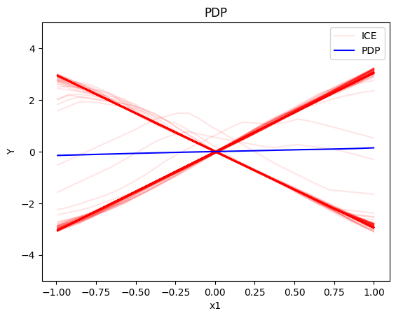
    


    
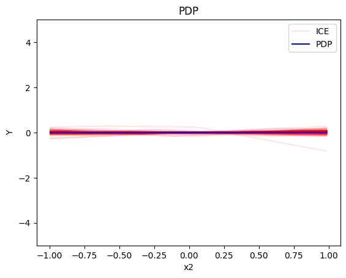
    


    
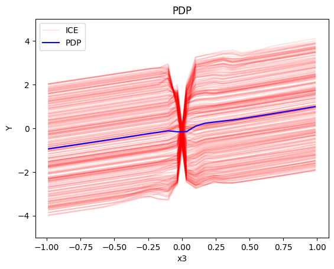
    


#### Regional PDP


```python
regional_pdp = effector.RegionalPDP(data=X_uncor_train, model=model_uncor, feature_names=['x1','x2','x3'], axis_limits=np.array([[-1,1],[-1,1],[-1,1]]).T)
regional_pdp.fit(features="all", heter_pcg_drop_thres=0.3, nof_candidate_splits_for_numerical=11)
```

    100%|██████████| 3/3 [00:00<00:00,  5.94it/s]

```python
regional_pdp.summary(features=0)
```

    Feature 0 - Full partition tree:
    Node id: 0, name: x1, heter: 1.72 || nof_instances:  1000 || weight: 1.00
            Node id: 1, name: x1 | x3 <= -0.0, heter: 0.32 || nof_instances:   498 || weight: 0.50
            Node id: 2, name: x1 | x3  > -0.0, heter: 0.32 || nof_instances:   502 || weight: 0.50
    --------------------------------------------------
    Feature 0 - Statistics per tree level:
    Level 0, heter: 1.72
            Level 1, heter: 0.32 || heter drop: 1.40 (81.48%)


```python
regional_pdp.plot(feature=0, node_idx=1, heterogeneity="ice", y_limits=[-5, 5])
regional_pdp.plot(feature=0, node_idx=2, heterogeneity="ice", y_limits=[-5, 5])
```


    
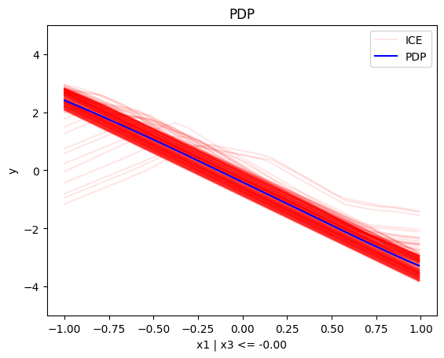
    


    
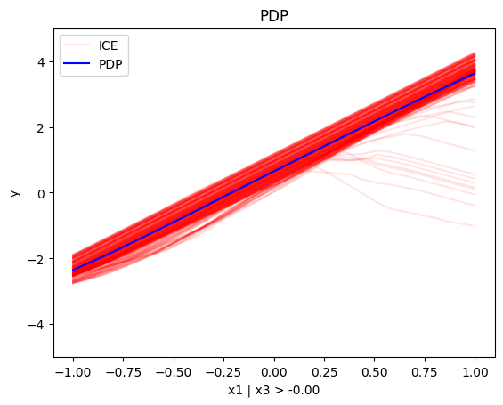

```python
regional_pdp.summary(features=1)
```

    Feature 1 - Full partition tree:
    Node id: 0, name: x2, heter: 1.81 || nof_instances:  1000 || weight: 1.00
    --------------------------------------------------
    Feature 1 - Statistics per tree level:
    Level 0, heter: 1.81

```python
regional_pdp.summary(features=2)
```

    Feature 2 - Full partition tree:
    Node id: 0, name: x3, heter: 1.73 || nof_instances:  1000 || weight: 1.00
            Node id: 1, name: x3 | x1 <= -0.0, heter: 0.86 || nof_instances:   494 || weight: 0.49
            Node id: 2, name: x3 | x1  > -0.0, heter: 0.86 || nof_instances:   506 || weight: 0.51
    --------------------------------------------------
    Feature 2 - Statistics per tree level:
    Level 0, heter: 1.73
            Level 1, heter: 0.86 || heter drop: 0.87 (50.34%)


```python
regional_pdp.plot(feature=2, node_idx=1, heterogeneity="ice", centering=True, y_limits=[-5, 5])
regional_pdp.plot(feature=2, node_idx=2, heterogeneity="ice", centering=True, y_limits=[-5, 5])
```


    
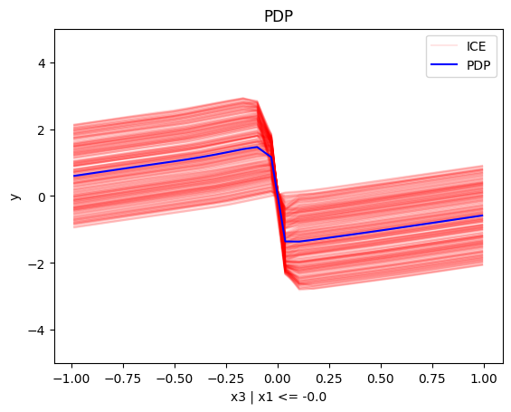
    


    
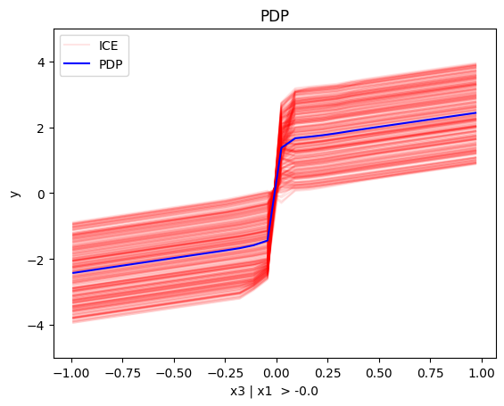
    


#### Conclusion

For the Global PDP:

   * the average effect of $x_1$ is $0$ with some heterogeneity implied by the interaction with $x_1$. The heterogeneity is expressed with two opposite lines; $-3x_1$ when $x_1 \leq 0$ and $3x_1$ when $x_1 >0$
   * the average effect of $x_2$ to be $0$ without heterogeneity
   * the average effect of $x_3$ to be $x_3$ with some heterogeneity due to the interaction with $x_1$. The heterogeneity is expressed with a discontinuity around $x_3=0$, with either a positive or a negative offset depending on the value of $x_1^i$

--- 

For the Regional PDP:

* For $x_1$, the algorithm finds two regions, one for $x_3 \leq 0$ and one for $x_3 > 0$
  * when $x_3>0$ the effect is $3x_1$
  * when $x_3 \leq 0$, the effect is $-3x_1$
* For $x_2$ the algorithm does not find any subregion 
* For $x_3$, there is a change in the offset:
  * when $x_1>0$ the line is $x_3 - 3x_1^i$ in the first half and $x_3 + 3x_1^i$ later
  * when $x_1<0$ the line is $x_3 + 3x_1^i$ in the first half and $x_3 - 3x_1^i$ later

### Correlated setting


#### Global PDP


```python
pdp = effector.PDP(data=X_cor_train, model=model_cor, feature_names=['x1','x2','x3'], target_name="Y")
pdp.plot(feature=0, centering=True, show_avg_output=False, heterogeneity="ice", y_limits=[-5, 5])
pdp.plot(feature=1, centering=True, show_avg_output=False, heterogeneity="ice", y_limits=[-5, 5])
pdp.plot(feature=2, centering=True, show_avg_output=False, heterogeneity="ice", y_limits=[-5, 5])
```


    
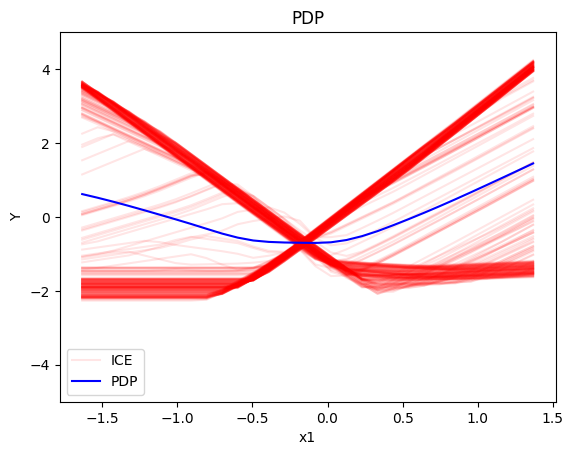
    


    
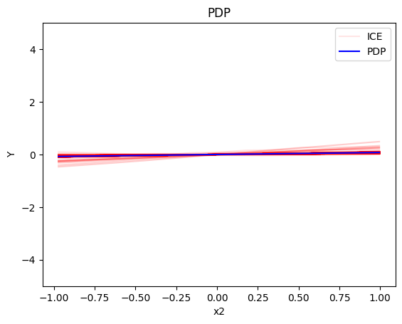
    


    
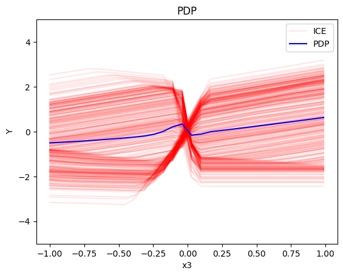
    


#### Regional-PDP


```python
regional_pdp = effector.RegionalPDP(data=X_cor_train, model=model_cor, feature_names=['x1','x2','x3'], axis_limits=np.array([[-1,1],[-1,1],[-1,1]]).T)
regional_pdp.fit(features="all", heter_pcg_drop_thres=0.4, nof_candidate_splits_for_numerical=11)
```

    100%|██████████| 3/3 [00:00<00:00,  5.85it/s]

```python
regional_pdp.summary(features=0)
```

    Feature 0 - Full partition tree:
    Node id: 0, name: x1, heter: 1.63 || nof_instances:  1000 || weight: 1.00
            Node id: 1, name: x1 | x3 <= -0.0, heter: 0.42 || nof_instances:   491 || weight: 0.49
            Node id: 2, name: x1 | x3  > -0.0, heter: 0.41 || nof_instances:   509 || weight: 0.51
    --------------------------------------------------
    Feature 0 - Statistics per tree level:
    Level 0, heter: 1.63
            Level 1, heter: 0.41 || heter drop: 1.22 (74.70%)


```python
regional_pdp.plot(feature=0, node_idx=1, heterogeneity="ice", centering=True, y_limits=[-5, 5])
regional_pdp.plot(feature=0, node_idx=2, heterogeneity="ice", centering=True, y_limits=[-5, 5])
```


    
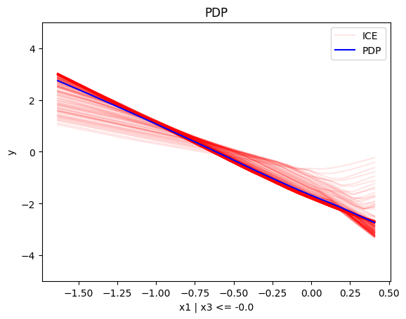
    


    
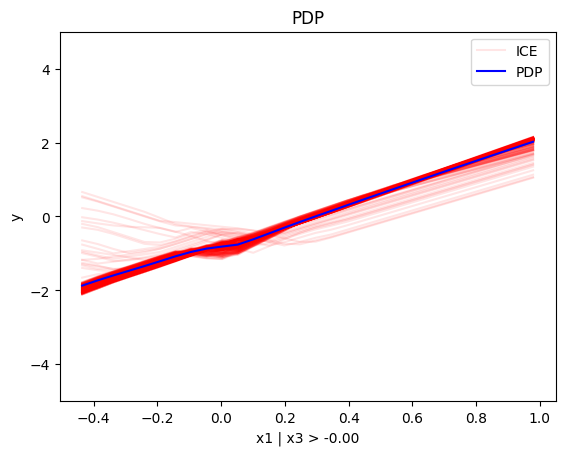

```python
regional_pdp.summary(features=1)
```

    Feature 1 - Full partition tree:
    Node id: 0, name: x2, heter: 1.28 || nof_instances:  1000 || weight: 1.00
    --------------------------------------------------
    Feature 1 - Statistics per tree level:
    Level 0, heter: 1.28

```python
regional_pdp.summary(features=2)
```

    Feature 2 - Full partition tree:
    Node id: 0, name: x3, heter: 1.39 || nof_instances:  1000 || weight: 1.00
            Node id: 1, name: x3 | x1 <= -0.13, heter: 0.71 || nof_instances:   447 || weight: 0.45
            Node id: 2, name: x3 | x1  > -0.13, heter: 0.79 || nof_instances:   553 || weight: 0.55
    --------------------------------------------------
    Feature 2 - Statistics per tree level:
    Level 0, heter: 1.39
            Level 1, heter: 0.75 || heter drop: 0.64 (45.97%)


```python
regional_pdp.plot(feature=2, node_idx=1, heterogeneity="ice", centering=True, y_limits=[-5, 5])
regional_pdp.plot(feature=2, node_idx=2, heterogeneity="ice", centering=True, y_limits=[-5, 5])
```


    
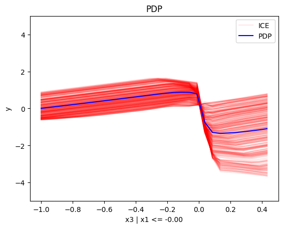
    


    
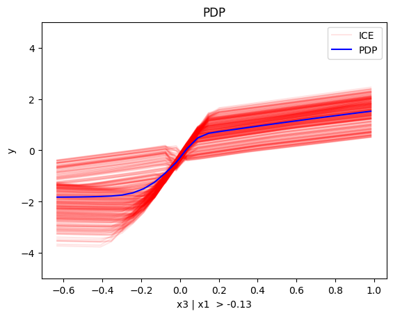
    


#### Conclusion

## (RH)ALE


```python
def model_uncor_jac(x):
    x_tensor = tf.convert_to_tensor(x, dtype=tf.float32)
    with tf.GradientTape() as t:
        t.watch(x_tensor)
        pred = model_uncor(x_tensor)
        grads = t.gradient(pred, x_tensor)
    return grads.numpy()

def model_cor_jac(x):
    x_tensor = tf.convert_to_tensor(x, dtype=tf.float32)
    with tf.GradientTape() as t:
        t.watch(x_tensor)
        pred = model_cor(x_tensor)
        grads = t.gradient(pred, x_tensor)
    return grads.numpy()
```

### Uncorrelated setting

#### Global RHALE


```python
rhale = effector.RHALE(data=X_uncor_train, model=model_uncor, model_jac=model_uncor_jac, feature_names=['x1','x2','x3'], target_name="Y")

binning_method = effector.binning_methods.Fixed(10, min_points_per_bin=0)
rhale.fit(features="all", binning_method=binning_method, centering=True)

rhale.plot(feature=0, centering=True, heterogeneity="std", show_avg_output=False, y_limits=[-5, 5], dy_limits=[-5, 5])
rhale.plot(feature=1, centering=True, heterogeneity="std", show_avg_output=False, y_limits=[-5, 5], dy_limits=[-5, 5])
rhale.plot(feature=2, centering=True, heterogeneity="std", show_avg_output=False, y_limits=[-5, 5], dy_limits=[-5, 5])
```


    
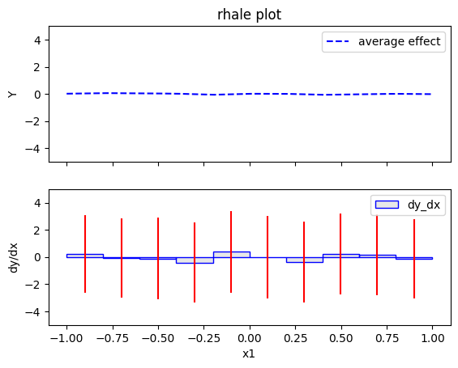
    


    
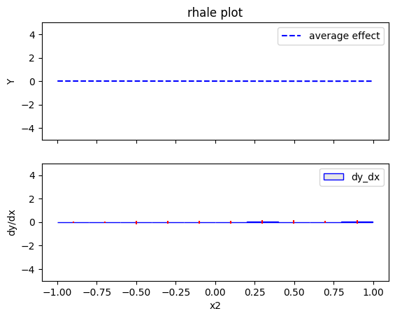
    


    
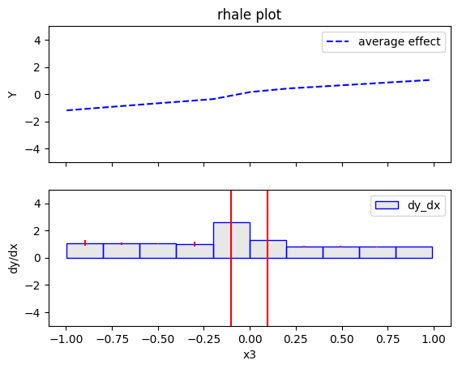
    


#### Regional RHALE


```python
regional_rhale = effector.RegionalRHALE(
    data=X_uncor_train, 
    model=model_uncor, 
    model_jac= model_uncor_jac, 
    feature_names=['x1', 'x2', 'x3'],
    axis_limits=np.array([[-1, 1], [-1, 1], [-1, 1]]).T) 

binning_method = effector.binning_methods.Fixed(11, min_points_per_bin=0)
regional_rhale.fit(
    features="all",
    heter_pcg_drop_thres=0.6,
    binning_method=binning_method,
    nof_candidate_splits_for_numerical=11
)

```

    100%|██████████| 3/3 [00:00<00:00,  9.01it/s]

```python
regional_rhale.summary(features=0)
```

    Feature 0 - Full partition tree:
    Node id: 0, name: x1, heter: 5.92 || nof_instances:  1000 || weight: 1.00
            Node id: 1, name: x1 | x3 <= -0.0, heter: 0.56 || nof_instances:   498 || weight: 0.50
            Node id: 2, name: x1 | x3  > -0.0, heter: 0.67 || nof_instances:   502 || weight: 0.50
    --------------------------------------------------
    Feature 0 - Statistics per tree level:
    Level 0, heter: 5.92
            Level 1, heter: 0.62 || heter drop: 5.30 (89.61%)


```python
regional_rhale.plot(feature=0, node_idx=1, heterogeneity="std", centering=True, y_limits=[-5, 5])
regional_rhale.plot(feature=0, node_idx=2, heterogeneity="std", centering=True, y_limits=[-5, 5])
```


    
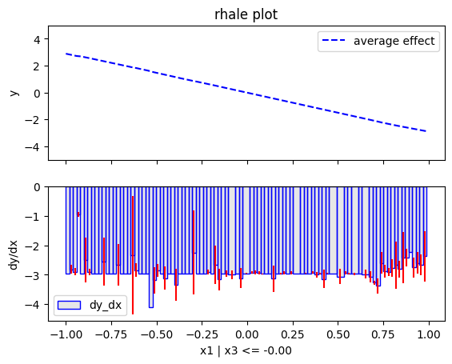
    


    
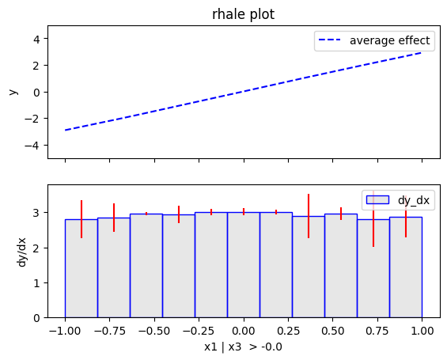

```python
regional_rhale.summary(features=1)
```

    Feature 1 - Full partition tree:
    Node id: 0, name: x2, heter: 0.29 || nof_instances:  1000 || weight: 1.00
    --------------------------------------------------
    Feature 1 - Statistics per tree level:
    Level 0, heter: 0.29

```python
regional_rhale.summary(features=2)
```

    Feature 2 - Full partition tree:
    Node id: 0, name: x3, heter: 6.48 || nof_instances:  1000 || weight: 1.00
    --------------------------------------------------
    Feature 2 - Statistics per tree level:
    Level 0, heter: 6.48


#### Conclusion

### Correlated setting

#### Global RHALE


```python
rhale = effector.RHALE(data=X_cor_train, model=model_cor, model_jac=model_cor_jac, feature_names=['x1','x2','x3'], target_name="Y")

binning_method = effector.binning_methods.Fixed(10, min_points_per_bin=0)
rhale.fit(features="all", binning_method=binning_method, centering=True)
```


```python
rhale.plot(feature=0, centering=True, heterogeneity="std", show_avg_output=False, y_limits=[-5, 5], dy_limits=[-5, 5])
rhale.plot(feature=1, centering=True, heterogeneity="std", show_avg_output=False, y_limits=[-5, 5], dy_limits=[-5, 5])
rhale.plot(feature=2, centering=True, heterogeneity="std", show_avg_output=False, y_limits=[-5, 5], dy_limits=[-5, 5])
```


    

    


    
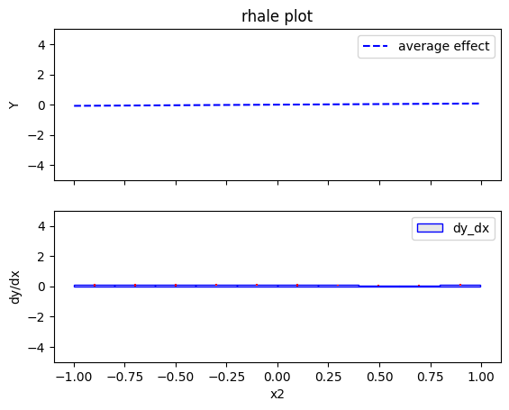
    


    
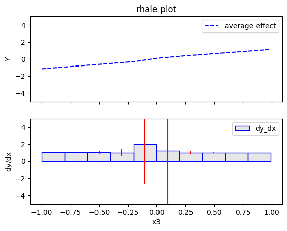
    


#### Regional RHALE


```python
regional_rhale = effector.RegionalRHALE(
    data=X_cor_train, 
    model=model_cor, 
    model_jac= model_cor_jac, 
    feature_names=['x1', 'x2', 'x3'],
    axis_limits=np.array([[-1, 1], [-1, 1], [-1, 1]]).T) 

binning_method = effector.binning_methods.Fixed(11, min_points_per_bin=0)
regional_rhale.fit(
    features="all",
    heter_pcg_drop_thres=0.6,
    binning_method=binning_method,
    nof_candidate_splits_for_numerical=11
)
```

    100%|██████████| 3/3 [00:00<00:00,  6.31it/s]

```python
regional_rhale.summary(features=0)
```

    Feature 0 - Full partition tree:
    Node id: 0, name: x1, heter: 1.91 || nof_instances:  1000 || weight: 1.00
    --------------------------------------------------
    Feature 0 - Statistics per tree level:
    Level 0, heter: 1.91

```python
regional_rhale.summary(features=1)
```

    Feature 1 - Full partition tree:
    Node id: 0, name: x2, heter: 0.13 || nof_instances:  1000 || weight: 1.00
    --------------------------------------------------
    Feature 1 - Statistics per tree level:
    Level 0, heter: 0.13

```python
regional_rhale.summary(features=2)
```

    Feature 2 - Full partition tree:
    Node id: 0, name: x3, heter: 2.23 || nof_instances:  1000 || weight: 1.00
    --------------------------------------------------
    Feature 2 - Statistics per tree level:
    Level 0, heter: 2.23


#### Conclusion

## SHAP DP
### Uncorrelated setting
#### Global SHAP DP


```python
shap = effector.ShapDP(data=X_uncor_train, model=model_uncor, feature_names=['x1', 'x2', 'x3'], target_name="Y")

shap.plot(feature=0, centering=True, heterogeneity="shap_values", show_avg_output=False, y_limits=[-3, 3])
shap.plot(feature=1, centering=True, heterogeneity="shap_values", show_avg_output=False, y_limits=[-3, 3])
shap.plot(feature=2, centering=True, heterogeneity="shap_values", show_avg_output=False, y_limits=[-3, 3])

```


    
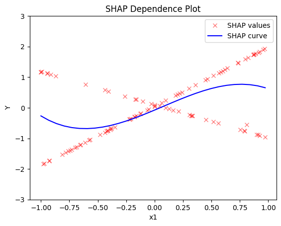
    


    
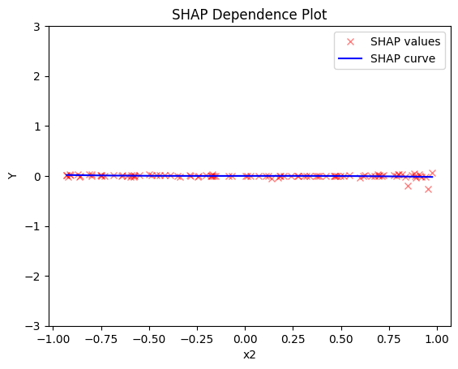
    


    
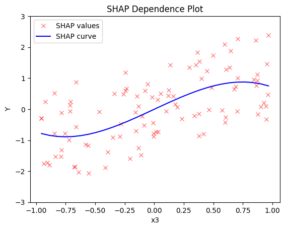
    


#### Regional SHAP-DP


```python
regional_shap = effector.RegionalShapDP(
    data=X_uncor_train,
    model=model_uncor,
    feature_names=['x1', 'x2', 'x3'],
    axis_limits=np.array([[-1, 1], [-1, 1], [-1, 1]]).T)

regional_shap.fit(
    features="all",
    heter_pcg_drop_thres=0.6,
    nof_candidate_splits_for_numerical=11
)

```

    100%|██████████| 3/3 [00:27<00:00,  9.30s/it]

```python
regional_shap.summary(0)
```

    Feature 0 - Full partition tree:
    Node id: 0, name: x1, heter: 0.82 || nof_instances:   100 || weight: 1.00
            Node id: 1, name: x1 | x3 <= -0.0, heter: 0.02 || nof_instances:    51 || weight: 0.51
            Node id: 2, name: x1 | x3  > -0.0, heter: 0.01 || nof_instances:    49 || weight: 0.49
    --------------------------------------------------
    Feature 0 - Statistics per tree level:
    Level 0, heter: 0.82
            Level 1, heter: 0.02 || heter drop: 0.80 (98.14%)


```python
regional_shap.plot(feature=0, node_idx=1, heterogeneity="std", centering=True, y_limits=[-5, 5])
regional_shap.plot(feature=0, node_idx=2, heterogeneity="std", centering=True, y_limits=[-5, 5])
```


    
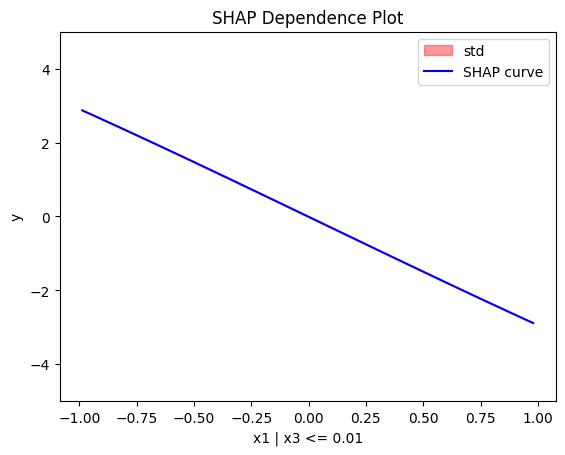
    


    
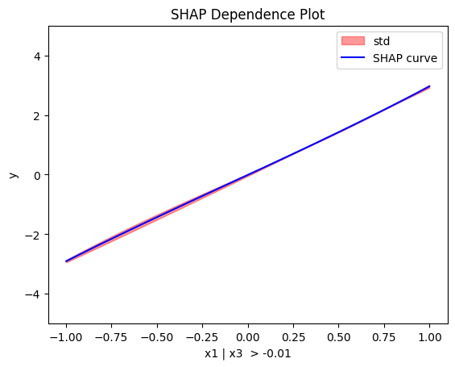

```python
regional_shap.summary(features=1)
```

    Feature 1 - Full partition tree:
    Node id: 0, name: x2, heter: 0.01 || nof_instances:   100 || weight: 1.00
    --------------------------------------------------
    Feature 1 - Statistics per tree level:
    Level 0, heter: 0.01

```python
regional_shap.summary(features=2)
```

    Feature 2 - Full partition tree:
    Node id: 0, name: x3, heter: 0.73 || nof_instances:   100 || weight: 1.00
    --------------------------------------------------
    Feature 2 - Statistics per tree level:
    Level 0, heter: 0.73


#### Conclusion

### Correlated setting

#### Global SHAP-DP


```python

shap = effector.ShapDP(data=X_cor_train, model=model_cor, feature_names=['x1', 'x2', 'x3'], target_name="Y")

shap.plot(feature=0, centering=True, heterogeneity="shap_values", show_avg_output=False, y_limits=[-3, 3])
shap.plot(feature=1, centering=True, heterogeneity="shap_values", show_avg_output=False, y_limits=[-3, 3])
shap.plot(feature=2, centering=True, heterogeneity="shap_values", show_avg_output=False, y_limits=[-3, 3])

```


    
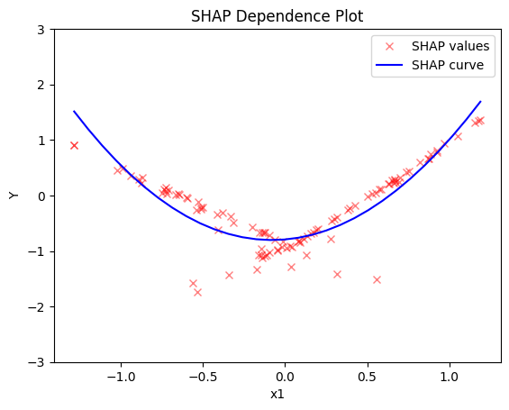
    


    
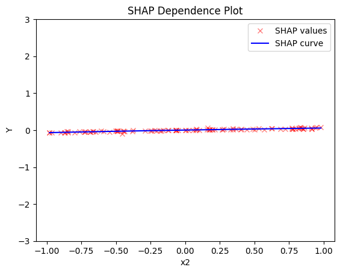
    


    
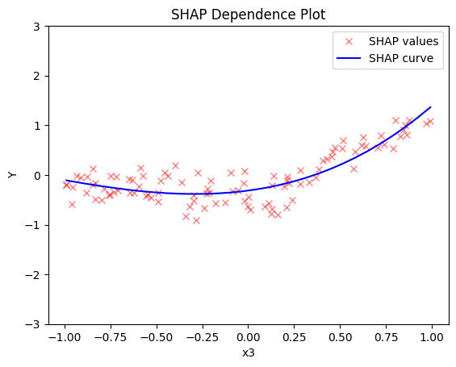
    


#### Regional SHAP


```python
regional_shap = effector.RegionalShapDP(
    data=X_cor_train,
    model=model_cor,
    feature_names=['x1', 'x2', 'x3'],
    axis_limits=np.array([[-1, 1], [-1, 1], [-1, 1]]).T)

regional_shap.fit(
    features="all",
    heter_pcg_drop_thres=0.6,
    nof_candidate_splits_for_numerical=11
)
```

    100%|██████████| 3/3 [00:26<00:00,  8.68s/it]

```python
regional_shap.summary(0)
regional_shap.summary(1)
regional_shap.summary(2)
```

    Feature 0 - Full partition tree:
    Node id: 0, name: x1, heter: 0.17 || nof_instances:   100 || weight: 1.00
    --------------------------------------------------
    Feature 0 - Statistics per tree level:
    Level 0, heter: 0.17
    Feature 1 - Full partition tree:
    Node id: 0, name: x2, heter: 0.01 || nof_instances:   100 || weight: 1.00
    --------------------------------------------------
    Feature 1 - Statistics per tree level:
    Level 0, heter: 0.01
    Feature 2 - Full partition tree:
    Node id: 0, name: x3, heter: 0.22 || nof_instances:   100 || weight: 1.00
    --------------------------------------------------
    Feature 2 - Statistics per tree level:
    Level 0, heter: 0.22


#### Conclusion


