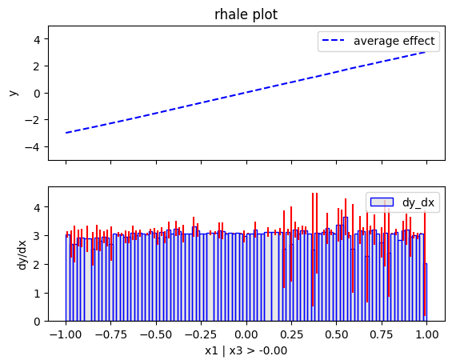

# Regional Effects (unknown black-box function)

This tutorial use the same dataset with the previous [tutorial](./03_regional_effects_synthetic_f/), but instead of explaining the known (synthetic) predictive function, we fit a neural network on the data and explain the neural network. This is a more realistic scenario, since in real-world applications we do not know the underlying function and we only have access to the data. We advise the reader to first read the previous tutorial.


```python
import numpy as np
import effector
import keras
import tensorflow as tf

np.random.seed(12345)
tf.random.set_seed(12345)
```

    2025-01-27 15:12:36.310452: I external/local_xla/xla/tsl/cuda/cudart_stub.cc:32] Could not find cuda drivers on your machine, GPU will not be used.
    2025-01-27 15:12:36.313175: I external/local_xla/xla/tsl/cuda/cudart_stub.cc:32] Could not find cuda drivers on your machine, GPU will not be used.
    2025-01-27 15:12:36.322064: E external/local_xla/xla/stream_executor/cuda/cuda_fft.cc:477] Unable to register cuFFT factory: Attempting to register factory for plugin cuFFT when one has already been registered
    WARNING: All log messages before absl::InitializeLog() is called are written to STDERR
    E0000 00:00:1737987156.337129  102929 cuda_dnn.cc:8310] Unable to register cuDNN factory: Attempting to register factory for plugin cuDNN when one has already been registered
    E0000 00:00:1737987156.341482  102929 cuda_blas.cc:1418] Unable to register cuBLAS factory: Attempting to register factory for plugin cuBLAS when one has already been registered
    2025-01-27 15:12:36.357073: I tensorflow/core/platform/cpu_feature_guard.cc:210] This TensorFlow binary is optimized to use available CPU instructions in performance-critical operations.
    To enable the following instructions: AVX2 FMA, in other operations, rebuild TensorFlow with the appropriate compiler flags.


## Simulation example

### Data Generating Distribution

We will generate $N=500$ examples with $D=3$ features, which are in the uncorrelated setting all uniformly distributed as follows:

<center>

| Feature | Description                                | Distribution                 |
|---------|--------------------------------------------|------------------------------|
| $x_1$   | Uniformly distributed between $-1$ and $1$ | $x_1 \sim \mathcal{U}(-1,1)$ |
| $x_2$   | Uniformly distributed between $-1$ and $1$ | $x_2 \sim \mathcal{U}(-1,1)$ |
| $x_3$   | Uniformly distributed between $-1$ and $1$ | $x_3 \sim \mathcal{U}(-1,1)$ |

</center>

For the correlated setting we keep the distributional assumptions for $x_2$ and $x_3$ but define $x_1$ such that it is highly correlated with $x_3$ by: $x_1 = x_3 + \delta$ with $\delta \sim \mathcal{N}(0,0.0625)$.


```python
def generate_dataset_uncorrelated(N):
    x1 = np.random.uniform(-1, 1, size=N)
    x2 = np.random.uniform(-1, 1, size=N)
    x3 = np.random.uniform(-1, 1, size=N)
    return np.stack((x1, x2, x3), axis=-1)

def generate_dataset_correlated(N):
    x3 = np.random.uniform(-1, 1, size=N)
    x2 = np.random.uniform(-1, 1, size=N)
    x1 = x3 + np.random.normal(loc = np.zeros_like(x3), scale = 0.25)
    return np.stack((x1, x2, x3), axis=-1)

# generate the dataset for the uncorrelated and correlated setting
N = 1000
X_uncor_train = generate_dataset_uncorrelated(N)
X_uncor_test = generate_dataset_uncorrelated(10000)
X_cor_train = generate_dataset_correlated(N)
X_cor_test = generate_dataset_correlated(10000)
```

### Black-box function

We will use the following linear model with a subgroup-specific interaction term:
 $$ y = 3x_1I_{x_3>0} - 3x_1I_{x_3\leq0} + x_3$$ 
 
On a global level, there is a high heterogeneity for the features $x_1$ and $x_3$ due to their interaction with each other. However, this heterogeneity vanishes to 0 if the feature space is separated into subregions:

<center>

| Feature | Region      | Average Effect | Heterogeneity |
|---------|-------------|----------------|---------------|
| $x_1$   | $x_3>0$     | $3x_1$         | 0             |
| $x_1$   | $x_3\leq 0$ | $-3x_1$        | 0             |
| $x_2$   | all         | 0              | 0             |
| $x_3$   | $x_3>0$     | $x_3$          | 0             |
| $x_3$   | $x_3\leq 0$ | $x_3$          | 0             |

</center>


```python
def generate_target(X):
    f = np.where(X[:,2] > 0, 3*X[:,0] + X[:,2], -3*X[:,0] + X[:,2])
    epsilon = np.random.normal(loc = np.zeros_like(X[:,0]), scale = 0.1)
    Y = f + epsilon
    return(Y)

# generate target for uncorrelated and correlated setting
Y_uncor_train = generate_target(X_uncor_train)
Y_uncor_test = generate_target(X_uncor_test)
Y_cor_train = generate_target(X_cor_train)
Y_cor_test = generate_target(X_cor_test)      
```

### Fit a Neural Network

We create a two-layer feedforward Neural Network, a weight decay of 0.01 for 100 epochs. We train two instances of this NN, one on the uncorrelated and one on the correlated setting. In both cases, the NN achieves a Mean Squared Error of about $0.17$ units.


```python
# Train - Evaluate - Explain a neural network
model_uncor = keras.Sequential([
    keras.layers.Dense(10, activation="relu", input_shape=(3,)),
    keras.layers.Dense(10, activation="relu", input_shape=(3,)),
    keras.layers.Dense(1)
])

optimizer = keras.optimizers.Adam(learning_rate=0.01)
model_uncor.compile(optimizer=optimizer, loss="mse")
model_uncor.fit(X_uncor_train, Y_uncor_train, epochs=100)
model_uncor.evaluate(X_uncor_test, Y_uncor_test)
```

    Epoch 1/100


    /home/givasile/miniconda3/envs/effector-dev/lib/python3.10/site-packages/keras/src/layers/core/dense.py:87: UserWarning: Do not pass an `input_shape`/`input_dim` argument to a layer. When using Sequential models, prefer using an `Input(shape)` object as the first layer in the model instead.
      super().__init__(activity_regularizer=activity_regularizer, **kwargs)
    2025-01-27 15:12:37.627490: E external/local_xla/xla/stream_executor/cuda/cuda_driver.cc:152] failed call to cuInit: INTERNAL: CUDA error: Failed call to cuInit: CUDA_ERROR_COMPAT_NOT_SUPPORTED_ON_DEVICE: forward compatibility was attempted on non supported HW
    2025-01-27 15:12:37.627515: I external/local_xla/xla/stream_executor/cuda/cuda_diagnostics.cc:137] retrieving CUDA diagnostic information for host: givasile-ubuntu-XPS-15-9500
    2025-01-27 15:12:37.627520: I external/local_xla/xla/stream_executor/cuda/cuda_diagnostics.cc:144] hostname: givasile-ubuntu-XPS-15-9500
    2025-01-27 15:12:37.627686: I external/local_xla/xla/stream_executor/cuda/cuda_diagnostics.cc:168] libcuda reported version is: 560.35.5
    2025-01-27 15:12:37.627714: I external/local_xla/xla/stream_executor/cuda/cuda_diagnostics.cc:172] kernel reported version is: 550.120.0
    2025-01-27 15:12:37.627721: E external/local_xla/xla/stream_executor/cuda/cuda_diagnostics.cc:262] kernel version 550.120.0 does not match DSO version 560.35.5 -- cannot find working devices in this configuration


    32/32 ━━━━━━━━━━━━━━━━━━━━ 1s 755us/step - loss: 2.6350
    Epoch 2/100
    32/32 ━━━━━━━━━━━━━━━━━━━━ 0s 646us/step - loss: 0.8495
    Epoch 3/100
    32/32 ━━━━━━━━━━━━━━━━━━━━ 0s 634us/step - loss: 0.4121
    Epoch 4/100
    32/32 ━━━━━━━━━━━━━━━━━━━━ 0s 622us/step - loss: 0.3024
    Epoch 5/100
    32/32 ━━━━━━━━━━━━━━━━━━━━ 0s 624us/step - loss: 0.2426
    Epoch 6/100
    32/32 ━━━━━━━━━━━━━━━━━━━━ 0s 625us/step - loss: 0.2076
    Epoch 7/100
    32/32 ━━━━━━━━━━━━━━━━━━━━ 0s 686us/step - loss: 0.1830
    Epoch 8/100
    32/32 ━━━━━━━━━━━━━━━━━━━━ 0s 639us/step - loss: 0.1631
    Epoch 9/100
    32/32 ━━━━━━━━━━━━━━━━━━━━ 0s 648us/step - loss: 0.1482
    Epoch 10/100
    32/32 ━━━━━━━━━━━━━━━━━━━━ 0s 663us/step - loss: 0.1380
    Epoch 11/100
    32/32 ━━━━━━━━━━━━━━━━━━━━ 0s 623us/step - loss: 0.1300
    Epoch 12/100
    32/32 ━━━━━━━━━━━━━━━━━━━━ 0s 593us/step - loss: 0.1225
    Epoch 13/100
    32/32 ━━━━━━━━━━━━━━━━━━━━ 0s 603us/step - loss: 0.1156
    Epoch 14/100
    32/32 ━━━━━━━━━━━━━━━━━━━━ 0s 675us/step - loss: 0.1099
    Epoch 15/100
    32/32 ━━━━━━━━━━━━━━━━━━━━ 0s 633us/step - loss: 0.1063
    Epoch 16/100
    32/32 ━━━━━━━━━━━━━━━━━━━━ 0s 605us/step - loss: 0.1027
    Epoch 17/100
    32/32 ━━━━━━━━━━━━━━━━━━━━ 0s 620us/step - loss: 0.0992
    Epoch 18/100
    32/32 ━━━━━━━━━━━━━━━━━━━━ 0s 633us/step - loss: 0.0961
    Epoch 19/100
    32/32 ━━━━━━━━━━━━━━━━━━━━ 0s 630us/step - loss: 0.0921
    Epoch 20/100
    32/32 ━━━━━━━━━━━━━━━━━━━━ 0s 604us/step - loss: 0.0896
    Epoch 21/100
    32/32 ━━━━━━━━━━━━━━━━━━━━ 0s 587us/step - loss: 0.0869
    Epoch 22/100
    32/32 ━━━━━━━━━━━━━━━━━━━━ 0s 2ms/step - loss: 0.0836 
    Epoch 23/100
    32/32 ━━━━━━━━━━━━━━━━━━━━ 0s 805us/step - loss: 0.0818
    Epoch 24/100
    32/32 ━━━━━━━━━━━━━━━━━━━━ 0s 658us/step - loss: 0.0797
    Epoch 25/100
    32/32 ━━━━━━━━━━━━━━━━━━━━ 0s 712us/step - loss: 0.0770
    Epoch 26/100
    32/32 ━━━━━━━━━━━━━━━━━━━━ 0s 633us/step - loss: 0.0749
    Epoch 27/100
    32/32 ━━━━━━━━━━━━━━━━━━━━ 0s 586us/step - loss: 0.0730
    Epoch 28/100
    32/32 ━━━━━━━━━━━━━━━━━━━━ 0s 611us/step - loss: 0.0707
    Epoch 29/100
    32/32 ━━━━━━━━━━━━━━━━━━━━ 0s 642us/step - loss: 0.0690
    Epoch 30/100
    32/32 ━━━━━━━━━━━━━━━━━━━━ 0s 626us/step - loss: 0.0683
    Epoch 31/100
    32/32 ━━━━━━━━━━━━━━━━━━━━ 0s 620us/step - loss: 0.0672
    Epoch 32/100
    32/32 ━━━━━━━━━━━━━━━━━━━━ 0s 634us/step - loss: 0.0661
    Epoch 33/100
    32/32 ━━━━━━━━━━━━━━━━━━━━ 0s 629us/step - loss: 0.0655
    Epoch 34/100
    32/32 ━━━━━━━━━━━━━━━━━━━━ 0s 648us/step - loss: 0.0638
    Epoch 35/100
    32/32 ━━━━━━━━━━━━━━━━━━━━ 0s 668us/step - loss: 0.0627
    Epoch 36/100
    32/32 ━━━━━━━━━━━━━━━━━━━━ 0s 594us/step - loss: 0.0622
    Epoch 37/100
    32/32 ━━━━━━━━━━━━━━━━━━━━ 0s 624us/step - loss: 0.0610
    Epoch 38/100
    32/32 ━━━━━━━━━━━━━━━━━━━━ 0s 599us/step - loss: 0.0599
    Epoch 39/100
    32/32 ━━━━━━━━━━━━━━━━━━━━ 0s 610us/step - loss: 0.0595
    Epoch 40/100
    32/32 ━━━━━━━━━━━━━━━━━━━━ 0s 649us/step - loss: 0.0591
    Epoch 41/100
    32/32 ━━━━━━━━━━━━━━━━━━━━ 0s 685us/step - loss: 0.0568
    Epoch 42/100
    32/32 ━━━━━━━━━━━━━━━━━━━━ 0s 588us/step - loss: 0.0574
    Epoch 43/100
    32/32 ━━━━━━━━━━━━━━━━━━━━ 0s 625us/step - loss: 0.0566
    Epoch 44/100
    32/32 ━━━━━━━━━━━━━━━━━━━━ 0s 666us/step - loss: 0.0571
    Epoch 45/100
    32/32 ━━━━━━━━━━━━━━━━━━━━ 0s 600us/step - loss: 0.0562
    Epoch 46/100
    32/32 ━━━━━━━━━━━━━━━━━━━━ 0s 638us/step - loss: 0.0557
    Epoch 47/100
    32/32 ━━━━━━━━━━━━━━━━━━━━ 0s 610us/step - loss: 0.0557
    Epoch 48/100
    32/32 ━━━━━━━━━━━━━━━━━━━━ 0s 718us/step - loss: 0.0558
    Epoch 49/100
    32/32 ━━━━━━━━━━━━━━━━━━━━ 0s 730us/step - loss: 0.0549
    Epoch 50/100
    32/32 ━━━━━━━━━━━━━━━━━━━━ 0s 639us/step - loss: 0.0550
    Epoch 51/100
    32/32 ━━━━━━━━━━━━━━━━━━━━ 0s 679us/step - loss: 0.0544
    Epoch 52/100
    32/32 ━━━━━━━━━━━━━━━━━━━━ 0s 613us/step - loss: 0.0557
    Epoch 53/100
    32/32 ━━━━━━━━━━━━━━━━━━━━ 0s 622us/step - loss: 0.0546
    Epoch 54/100
    32/32 ━━━━━━━━━━━━━━━━━━━━ 0s 607us/step - loss: 0.0536
    Epoch 55/100
    32/32 ━━━━━━━━━━━━━━━━━━━━ 0s 619us/step - loss: 0.0546
    Epoch 56/100
    32/32 ━━━━━━━━━━━━━━━━━━━━ 0s 626us/step - loss: 0.0533
    Epoch 57/100
    32/32 ━━━━━━━━━━━━━━━━━━━━ 0s 588us/step - loss: 0.0544
    Epoch 58/100
    32/32 ━━━━━━━━━━━━━━━━━━━━ 0s 573us/step - loss: 0.0537
    Epoch 59/100
    32/32 ━━━━━━━━━━━━━━━━━━━━ 0s 601us/step - loss: 0.0537
    Epoch 60/100
    32/32 ━━━━━━━━━━━━━━━━━━━━ 0s 619us/step - loss: 0.0529
    Epoch 61/100
    32/32 ━━━━━━━━━━━━━━━━━━━━ 0s 596us/step - loss: 0.0540
    Epoch 62/100
    32/32 ━━━━━━━━━━━━━━━━━━━━ 0s 604us/step - loss: 0.0550
    Epoch 63/100
    32/32 ━━━━━━━━━━━━━━━━━━━━ 0s 576us/step - loss: 0.0535
    Epoch 64/100
    32/32 ━━━━━━━━━━━━━━━━━━━━ 0s 617us/step - loss: 0.0544
    Epoch 65/100
    32/32 ━━━━━━━━━━━━━━━━━━━━ 0s 609us/step - loss: 0.0524
    Epoch 66/100
    32/32 ━━━━━━━━━━━━━━━━━━━━ 0s 569us/step - loss: 0.0524
    Epoch 67/100
    32/32 ━━━━━━━━━━━━━━━━━━━━ 0s 590us/step - loss: 0.0515
    Epoch 68/100
    32/32 ━━━━━━━━━━━━━━━━━━━━ 0s 626us/step - loss: 0.0531
    Epoch 69/100
    32/32 ━━━━━━━━━━━━━━━━━━━━ 0s 1ms/step - loss: 0.0530
    Epoch 70/100
    32/32 ━━━━━━━━━━━━━━━━━━━━ 0s 806us/step - loss: 0.0510
    Epoch 71/100
    32/32 ━━━━━━━━━━━━━━━━━━━━ 0s 603us/step - loss: 0.0501
    Epoch 72/100
    32/32 ━━━━━━━━━━━━━━━━━━━━ 0s 598us/step - loss: 0.0514
    Epoch 73/100
    32/32 ━━━━━━━━━━━━━━━━━━━━ 0s 607us/step - loss: 0.0511
    Epoch 74/100
    32/32 ━━━━━━━━━━━━━━━━━━━━ 0s 627us/step - loss: 0.0508
    Epoch 75/100
    32/32 ━━━━━━━━━━━━━━━━━━━━ 0s 572us/step - loss: 0.0495
    Epoch 76/100
    32/32 ━━━━━━━━━━━━━━━━━━━━ 0s 617us/step - loss: 0.0495
    Epoch 77/100
    32/32 ━━━━━━━━━━━━━━━━━━━━ 0s 635us/step - loss: 0.0487
    Epoch 78/100
    32/32 ━━━━━━━━━━━━━━━━━━━━ 0s 647us/step - loss: 0.0490
    Epoch 79/100
    32/32 ━━━━━━━━━━━━━━━━━━━━ 0s 622us/step - loss: 0.0495
    Epoch 80/100
    32/32 ━━━━━━━━━━━━━━━━━━━━ 0s 606us/step - loss: 0.0492
    Epoch 81/100
    32/32 ━━━━━━━━━━━━━━━━━━━━ 0s 592us/step - loss: 0.0483
    Epoch 82/100
    32/32 ━━━━━━━━━━━━━━━━━━━━ 0s 631us/step - loss: 0.0475
    Epoch 83/100
    32/32 ━━━━━━━━━━━━━━━━━━━━ 0s 636us/step - loss: 0.0487
    Epoch 84/100
    32/32 ━━━━━━━━━━━━━━━━━━━━ 0s 585us/step - loss: 0.0497
    Epoch 85/100
    32/32 ━━━━━━━━━━━━━━━━━━━━ 0s 588us/step - loss: 0.0505
    Epoch 86/100
    32/32 ━━━━━━━━━━━━━━━━━━━━ 0s 644us/step - loss: 0.0471
    Epoch 87/100
    32/32 ━━━━━━━━━━━━━━━━━━━━ 0s 622us/step - loss: 0.0477
    Epoch 88/100
    32/32 ━━━━━━━━━━━━━━━━━━━━ 0s 595us/step - loss: 0.0478
    Epoch 89/100
    32/32 ━━━━━━━━━━━━━━━━━━━━ 0s 668us/step - loss: 0.0465
    Epoch 90/100
    32/32 ━━━━━━━━━━━━━━━━━━━━ 0s 606us/step - loss: 0.0480
    Epoch 91/100
    32/32 ━━━━━━━━━━━━━━━━━━━━ 0s 587us/step - loss: 0.0510
    Epoch 92/100
    32/32 ━━━━━━━━━━━━━━━━━━━━ 0s 603us/step - loss: 0.0465
    Epoch 93/100
    32/32 ━━━━━━━━━━━━━━━━━━━━ 0s 595us/step - loss: 0.0464
    Epoch 94/100
    32/32 ━━━━━━━━━━━━━━━━━━━━ 0s 621us/step - loss: 0.0465
    Epoch 95/100
    32/32 ━━━━━━━━━━━━━━━━━━━━ 0s 621us/step - loss: 0.0464
    Epoch 96/100
    32/32 ━━━━━━━━━━━━━━━━━━━━ 0s 1ms/step - loss: 0.0482  
    Epoch 97/100
    32/32 ━━━━━━━━━━━━━━━━━━━━ 0s 813us/step - loss: 0.0523
    Epoch 98/100
    32/32 ━━━━━━━━━━━━━━━━━━━━ 0s 650us/step - loss: 0.0455
    Epoch 99/100
    32/32 ━━━━━━━━━━━━━━━━━━━━ 0s 628us/step - loss: 0.0453
    Epoch 100/100
    32/32 ━━━━━━━━━━━━━━━━━━━━ 0s 642us/step - loss: 0.0465
    313/313 ━━━━━━━━━━━━━━━━━━━━ 0s 471us/step - loss: 0.0786


    0.07576844841241837


```python
model_cor = keras.Sequential([
    keras.layers.Dense(10, activation="relu", input_shape=(3,)),
    keras.layers.Dense(10, activation="relu", input_shape=(3,)),
    keras.layers.Dense(1)
])

optimizer = keras.optimizers.Adam(learning_rate=0.01)
model_cor.compile(optimizer=optimizer, loss="mse")
model_cor.fit(X_cor_train, Y_cor_train, epochs=100)
model_cor.evaluate(X_cor_test, Y_cor_test)
```

    Epoch 1/100
    32/32 ━━━━━━━━━━━━━━━━━━━━ 1s 624us/step - loss: 2.3108
    Epoch 2/100
    32/32 ━━━━━━━━━━━━━━━━━━━━ 0s 633us/step - loss: 0.4373
    Epoch 3/100
    32/32 ━━━━━━━━━━━━━━━━━━━━ 0s 620us/step - loss: 0.1331
    Epoch 4/100
    32/32 ━━━━━━━━━━━━━━━━━━━━ 0s 615us/step - loss: 0.1131
    Epoch 5/100
    32/32 ━━━━━━━━━━━━━━━━━━━━ 0s 589us/step - loss: 0.1109
    Epoch 6/100
    32/32 ━━━━━━━━━━━━━━━━━━━━ 0s 593us/step - loss: 0.1074
    Epoch 7/100
    32/32 ━━━━━━━━━━━━━━━━━━━━ 0s 634us/step - loss: 0.1039
    Epoch 8/100
    32/32 ━━━━━━━━━━━━━━━━━━━━ 0s 573us/step - loss: 0.0991
    Epoch 9/100
    32/32 ━━━━━━━━━━━━━━━━━━━━ 0s 606us/step - loss: 0.0911
    Epoch 10/100
    32/32 ━━━━━━━━━━━━━━━━━━━━ 0s 601us/step - loss: 0.0838
    Epoch 11/100
    32/32 ━━━━━━━━━━━━━━━━━━━━ 0s 595us/step - loss: 0.0780
    Epoch 12/100
    32/32 ━━━━━━━━━━━━━━━━━━━━ 0s 619us/step - loss: 0.0719
    Epoch 13/100
    32/32 ━━━━━━━━━━━━━━━━━━━━ 0s 606us/step - loss: 0.0675
    Epoch 14/100
    32/32 ━━━━━━━━━━━━━━━━━━━━ 0s 597us/step - loss: 0.0643
    Epoch 15/100
    32/32 ━━━━━━━━━━━━━━━━━━━━ 0s 564us/step - loss: 0.0586
    Epoch 16/100
    32/32 ━━━━━━━━━━━━━━━━━━━━ 0s 601us/step - loss: 0.0552
    Epoch 17/100
    32/32 ━━━━━━━━━━━━━━━━━━━━ 0s 604us/step - loss: 0.0517
    Epoch 18/100
    32/32 ━━━━━━━━━━━━━━━━━━━━ 0s 614us/step - loss: 0.0477
    Epoch 19/100
    32/32 ━━━━━━━━━━━━━━━━━━━━ 0s 615us/step - loss: 0.0436
    Epoch 20/100
    32/32 ━━━━━━━━━━━━━━━━━━━━ 0s 588us/step - loss: 0.0408
    Epoch 21/100
    32/32 ━━━━━━━━━━━━━━━━━━━━ 0s 628us/step - loss: 0.0381
    Epoch 22/100
    32/32 ━━━━━━━━━━━━━━━━━━━━ 0s 600us/step - loss: 0.0358
    Epoch 23/100
    32/32 ━━━━━━━━━━━━━━━━━━━━ 0s 603us/step - loss: 0.0338
    Epoch 24/100
    32/32 ━━━━━━━━━━━━━━━━━━━━ 0s 628us/step - loss: 0.0320
    Epoch 25/100
    32/32 ━━━━━━━━━━━━━━━━━━━━ 0s 575us/step - loss: 0.0306
    Epoch 26/100
    32/32 ━━━━━━━━━━━━━━━━━━━━ 0s 613us/step - loss: 0.0293
    Epoch 27/100
    32/32 ━━━━━━━━━━━━━━━━━━━━ 0s 610us/step - loss: 0.0286
    Epoch 28/100
    32/32 ━━━━━━━━━━━━━━━━━━━━ 0s 635us/step - loss: 0.0275
    Epoch 29/100
    32/32 ━━━━━━━━━━━━━━━━━━━━ 0s 571us/step - loss: 0.0266
    Epoch 30/100
    32/32 ━━━━━━━━━━━━━━━━━━━━ 0s 688us/step - loss: 0.0260
    Epoch 31/100
    32/32 ━━━━━━━━━━━━━━━━━━━━ 0s 624us/step - loss: 0.0252
    Epoch 32/100
    32/32 ━━━━━━━━━━━━━━━━━━━━ 0s 636us/step - loss: 0.0246
    Epoch 33/100
    32/32 ━━━━━━━━━━━━━━━━━━━━ 0s 578us/step - loss: 0.0239
    Epoch 34/100
    32/32 ━━━━━━━━━━━━━━━━━━━━ 0s 588us/step - loss: 0.0230
    Epoch 35/100
    32/32 ━━━━━━━━━━━━━━━━━━━━ 0s 623us/step - loss: 0.0224
    Epoch 36/100
    32/32 ━━━━━━━━━━━━━━━━━━━━ 0s 602us/step - loss: 0.0219
    Epoch 37/100
    32/32 ━━━━━━━━━━━━━━━━━━━━ 0s 600us/step - loss: 0.0215
    Epoch 38/100
    32/32 ━━━━━━━━━━━━━━━━━━━━ 0s 571us/step - loss: 0.0215
    Epoch 39/100
    32/32 ━━━━━━━━━━━━━━━━━━━━ 0s 601us/step - loss: 0.0210
    Epoch 40/100
    32/32 ━━━━━━━━━━━━━━━━━━━━ 0s 686us/step - loss: 0.0206
    Epoch 41/100
    32/32 ━━━━━━━━━━━━━━━━━━━━ 0s 628us/step - loss: 0.0205
    Epoch 42/100
    32/32 ━━━━━━━━━━━━━━━━━━━━ 0s 586us/step - loss: 0.0204
    Epoch 43/100
    32/32 ━━━━━━━━━━━━━━━━━━━━ 0s 599us/step - loss: 0.0203
    Epoch 44/100
    32/32 ━━━━━━━━━━━━━━━━━━━━ 0s 623us/step - loss: 0.0205
    Epoch 45/100
    32/32 ━━━━━━━━━━━━━━━━━━━━ 0s 588us/step - loss: 0.0201
    Epoch 46/100
    32/32 ━━━━━━━━━━━━━━━━━━━━ 0s 695us/step - loss: 0.0202
    Epoch 47/100
    32/32 ━━━━━━━━━━━━━━━━━━━━ 0s 741us/step - loss: 0.0198
    Epoch 48/100
    32/32 ━━━━━━━━━━━━━━━━━━━━ 0s 682us/step - loss: 0.0198
    Epoch 49/100
    32/32 ━━━━━━━━━━━━━━━━━━━━ 0s 1ms/step - loss: 0.0198  
    Epoch 50/100
    32/32 ━━━━━━━━━━━━━━━━━━━━ 0s 782us/step - loss: 0.0201
    Epoch 51/100
    32/32 ━━━━━━━━━━━━━━━━━━━━ 0s 619us/step - loss: 0.0193
    Epoch 52/100
    32/32 ━━━━━━━━━━━━━━━━━━━━ 0s 621us/step - loss: 0.0197
    Epoch 53/100
    32/32 ━━━━━━━━━━━━━━━━━━━━ 0s 691us/step - loss: 0.0190
    Epoch 54/100
    32/32 ━━━━━━━━━━━━━━━━━━━━ 0s 802us/step - loss: 0.0190
    Epoch 55/100
    32/32 ━━━━━━━━━━━━━━━━━━━━ 0s 785us/step - loss: 0.0193
    Epoch 56/100
    32/32 ━━━━━━━━━━━━━━━━━━━━ 0s 710us/step - loss: 0.0196
    Epoch 57/100
    32/32 ━━━━━━━━━━━━━━━━━━━━ 0s 782us/step - loss: 0.0190
    Epoch 58/100
    32/32 ━━━━━━━━━━━━━━━━━━━━ 0s 844us/step - loss: 0.0191
    Epoch 59/100
    32/32 ━━━━━━━━━━━━━━━━━━━━ 0s 686us/step - loss: 0.0188
    Epoch 60/100
    32/32 ━━━━━━━━━━━━━━━━━━━━ 0s 695us/step - loss: 0.0190
    Epoch 61/100
    32/32 ━━━━━━━━━━━━━━━━━━━━ 0s 672us/step - loss: 0.0187
    Epoch 62/100
    32/32 ━━━━━━━━━━━━━━━━━━━━ 0s 630us/step - loss: 0.0190
    Epoch 63/100
    32/32 ━━━━━━━━━━━━━━━━━━━━ 0s 606us/step - loss: 0.0186
    Epoch 64/100
    32/32 ━━━━━━━━━━━━━━━━━━━━ 0s 610us/step - loss: 0.0188
    Epoch 65/100
    32/32 ━━━━━━━━━━━━━━━━━━━━ 0s 723us/step - loss: 0.0186
    Epoch 66/100
    32/32 ━━━━━━━━━━━━━━━━━━━━ 0s 668us/step - loss: 0.0192
    Epoch 67/100
    32/32 ━━━━━━━━━━━━━━━━━━━━ 0s 776us/step - loss: 0.0185
    Epoch 68/100
    32/32 ━━━━━━━━━━━━━━━━━━━━ 0s 627us/step - loss: 0.0188
    Epoch 69/100
    32/32 ━━━━━━━━━━━━━━━━━━━━ 0s 588us/step - loss: 0.0186
    Epoch 70/100
    32/32 ━━━━━━━━━━━━━━━━━━━━ 0s 618us/step - loss: 0.0190
    Epoch 71/100
    32/32 ━━━━━━━━━━━━━━━━━━━━ 0s 713us/step - loss: 0.0187
    Epoch 72/100
    32/32 ━━━━━━━━━━━━━━━━━━━━ 0s 773us/step - loss: 0.0194
    Epoch 73/100
    32/32 ━━━━━━━━━━━━━━━━━━━━ 0s 723us/step - loss: 0.0183
    Epoch 74/100
    32/32 ━━━━━━━━━━━━━━━━━━━━ 0s 673us/step - loss: 0.0193
    Epoch 75/100
    32/32 ━━━━━━━━━━━━━━━━━━━━ 0s 629us/step - loss: 0.0185
    Epoch 76/100
    32/32 ━━━━━━━━━━━━━━━━━━━━ 0s 673us/step - loss: 0.0193
    Epoch 77/100
    32/32 ━━━━━━━━━━━━━━━━━━━━ 0s 711us/step - loss: 0.0183
    Epoch 78/100
    32/32 ━━━━━━━━━━━━━━━━━━━━ 0s 649us/step - loss: 0.0194
    Epoch 79/100
    32/32 ━━━━━━━━━━━━━━━━━━━━ 0s 654us/step - loss: 0.0176
    Epoch 80/100
    32/32 ━━━━━━━━━━━━━━━━━━━━ 0s 616us/step - loss: 0.0176
    Epoch 81/100
    32/32 ━━━━━━━━━━━━━━━━━━━━ 0s 641us/step - loss: 0.0178
    Epoch 82/100
    32/32 ━━━━━━━━━━━━━━━━━━━━ 0s 609us/step - loss: 0.0179
    Epoch 83/100
    32/32 ━━━━━━━━━━━━━━━━━━━━ 0s 635us/step - loss: 0.0185
    Epoch 84/100
    32/32 ━━━━━━━━━━━━━━━━━━━━ 0s 607us/step - loss: 0.0176
    Epoch 85/100
    32/32 ━━━━━━━━━━━━━━━━━━━━ 0s 588us/step - loss: 0.0187
    Epoch 86/100
    32/32 ━━━━━━━━━━━━━━━━━━━━ 0s 627us/step - loss: 0.0176
    Epoch 87/100
    32/32 ━━━━━━━━━━━━━━━━━━━━ 0s 611us/step - loss: 0.0186
    Epoch 88/100
    32/32 ━━━━━━━━━━━━━━━━━━━━ 0s 601us/step - loss: 0.0174
    Epoch 89/100
    32/32 ━━━━━━━━━━━━━━━━━━━━ 0s 655us/step - loss: 0.0186
    Epoch 90/100
    32/32 ━━━━━━━━━━━━━━━━━━━━ 0s 600us/step - loss: 0.0173
    Epoch 91/100
    32/32 ━━━━━━━━━━━━━━━━━━━━ 0s 635us/step - loss: 0.0185
    Epoch 92/100
    32/32 ━━━━━━━━━━━━━━━━━━━━ 0s 608us/step - loss: 0.0171
    Epoch 93/100
    32/32 ━━━━━━━━━━━━━━━━━━━━ 0s 627us/step - loss: 0.0186
    Epoch 94/100
    32/32 ━━━━━━━━━━━━━━━━━━━━ 0s 723us/step - loss: 0.0172
    Epoch 95/100
    32/32 ━━━━━━━━━━━━━━━━━━━━ 0s 638us/step - loss: 0.0185
    Epoch 96/100
    32/32 ━━━━━━━━━━━━━━━━━━━━ 0s 625us/step - loss: 0.0171
    Epoch 97/100
    32/32 ━━━━━━━━━━━━━━━━━━━━ 0s 585us/step - loss: 0.0185
    Epoch 98/100
    32/32 ━━━━━━━━━━━━━━━━━━━━ 0s 622us/step - loss: 0.0171
    Epoch 99/100
    32/32 ━━━━━━━━━━━━━━━━━━━━ 0s 607us/step - loss: 0.0186
    Epoch 100/100
    32/32 ━━━━━━━━━━━━━━━━━━━━ 0s 606us/step - loss: 0.0174
    313/313 ━━━━━━━━━━━━━━━━━━━━ 0s 476us/step - loss: 0.0290


    0.026531754061579704


---
## PDP
### Uncorrelated setting
#### Global PDP


```python
pdp = effector.PDP(data=X_uncor_train, model=model_uncor, feature_names=['x1','x2','x3'], target_name="Y")
pdp.plot(feature=0, centering=True, show_avg_output=False, heterogeneity="ice", y_limits=[-5, 5])
pdp.plot(feature=1, centering=True, show_avg_output=False, heterogeneity="ice", y_limits=[-5, 5])
pdp.plot(feature=2, centering=True, show_avg_output=False, heterogeneity="ice", y_limits=[-5, 5])
```


    

    


    

    


    

    


#### Regional PDP


```python
regional_pdp = effector.RegionalPDP(data=X_uncor_train, model=model_uncor, feature_names=['x1','x2','x3'], axis_limits=np.array([[-1,1],[-1,1],[-1,1]]).T)
regional_pdp.fit(features="all", heter_pcg_drop_thres=0.3, nof_candidate_splits_for_numerical=11)
```

    100%|████████████████████████████████████████████████████████████████████████████████████████████████████████████████████████████████████████████████████████████████████████████████████████████████████████████████████████████████████████████████| 3/3 [00:00<00:00, 21.39it/s]


```python
regional_pdp.summary(features=0)
```

    
    
    Feature 0 - Full partition tree:
    Node id: 0, name: x1, heter: 3.62 || nof_instances:  1000 || weight: 1.00
            Node id: 1, name: x1 | x3 <= -0.0, heter: 0.11 || nof_instances:   498 || weight: 0.50
            Node id: 2, name: x1 | x3  > -0.0, heter: 0.17 || nof_instances:   502 || weight: 0.50
    --------------------------------------------------
    Feature 0 - Statistics per tree level:
    Level 0, heter: 3.62
            Level 1, heter: 0.14 || heter drop : 3.48 (units), 96.13% (pcg)
    
    


```python
regional_pdp.plot(feature=0, node_idx=1, heterogeneity="ice", y_limits=[-5, 5])
regional_pdp.plot(feature=0, node_idx=2, heterogeneity="ice", y_limits=[-5, 5])
```


    

    


    

    


```python
regional_pdp.summary(features=1)
```

    
    
    Feature 1 - Full partition tree:
    Node id: 0, name: x2, heter: 3.36 || nof_instances:  1000 || weight: 1.00
    --------------------------------------------------
    Feature 1 - Statistics per tree level:
    Level 0, heter: 3.36
    
    


```python
regional_pdp.summary(features=2)
```

    
    
    Feature 2 - Full partition tree:
    Node id: 0, name: x3, heter: 3.00 || nof_instances:  1000 || weight: 1.00
            Node id: 1, name: x3 | x1 <= -0.0, heter: 0.73 || nof_instances:   494 || weight: 0.49
            Node id: 2, name: x3 | x1  > -0.0, heter: 0.73 || nof_instances:   506 || weight: 0.51
    --------------------------------------------------
    Feature 2 - Statistics per tree level:
    Level 0, heter: 3.00
            Level 1, heter: 0.73 || heter drop : 2.27 (units), 75.67% (pcg)
    
    


```python
regional_pdp.plot(feature=2, node_idx=1, heterogeneity="ice", centering=True, y_limits=[-5, 5])
regional_pdp.plot(feature=2, node_idx=2, heterogeneity="ice", centering=True, y_limits=[-5, 5])
```


    

    


    

    


#### Conclusion

For the Global PDP:

   * the average effect of $x_1$ is $0$ with some heterogeneity implied by the interaction with $x_1$. The heterogeneity is expressed with two opposite lines; $-3x_1$ when $x_1 \leq 0$ and $3x_1$ when $x_1 >0$
   * the average effect of $x_2$ to be $0$ without heterogeneity
   * the average effect of $x_3$ to be $x_3$ with some heterogeneity due to the interaction with $x_1$. The heterogeneity is expressed with a discontinuity around $x_3=0$, with either a positive or a negative offset depending on the value of $x_1^i$

--- 

For the Regional PDP:

* For $x_1$, the algorithm finds two regions, one for $x_3 \leq 0$ and one for $x_3 > 0$
  * when $x_3>0$ the effect is $3x_1$
  * when $x_3 \leq 0$, the effect is $-3x_1$
* For $x_2$ the algorithm does not find any subregion 
* For $x_3$, there is a change in the offset:
  * when $x_1>0$ the line is $x_3 - 3x_1^i$ in the first half and $x_3 + 3x_1^i$ later
  * when $x_1<0$ the line is $x_3 + 3x_1^i$ in the first half and $x_3 - 3x_1^i$ later

### Correlated setting


#### Global PDP


```python
pdp = effector.PDP(data=X_cor_train, model=model_cor, feature_names=['x1','x2','x3'], target_name="Y")
pdp.plot(feature=0, centering=True, show_avg_output=False, heterogeneity="ice", y_limits=[-5, 5])
pdp.plot(feature=1, centering=True, show_avg_output=False, heterogeneity="ice", y_limits=[-5, 5])
pdp.plot(feature=2, centering=True, show_avg_output=False, heterogeneity="ice", y_limits=[-5, 5])
```


    

    


    

    


    

    


#### Regional-PDP


```python
regional_pdp = effector.RegionalPDP(data=X_cor_train, model=model_cor, feature_names=['x1','x2','x3'], axis_limits=np.array([[-1,1],[-1,1],[-1,1]]).T)
regional_pdp.fit(features="all", heter_pcg_drop_thres=0.4, nof_candidate_splits_for_numerical=11)
```

    100%|████████████████████████████████████████████████████████████████████████████████████████████████████████████████████████████████████████████████████████████████████████████████████████████████████████████████████████████████████████████████| 3/3 [00:00<00:00, 27.46it/s]


```python
regional_pdp.summary(features=0)
```

    
    
    Feature 0 - Full partition tree:
    Node id: 0, name: x1, heter: 2.92 || nof_instances:   900 || weight: 1.00
            Node id: 1, name: x1 | x3 <= -0.0, heter: 0.23 || nof_instances:   435 || weight: 0.48
            Node id: 2, name: x1 | x3  > -0.0, heter: 0.19 || nof_instances:   465 || weight: 0.52
    --------------------------------------------------
    Feature 0 - Statistics per tree level:
    Level 0, heter: 2.92
            Level 1, heter: 0.21 || heter drop : 2.71 (units), 92.73% (pcg)
    
    


```python
regional_pdp.plot(feature=0, node_idx=1, heterogeneity="ice", centering=True, y_limits=[-5, 5])
regional_pdp.plot(feature=0, node_idx=2, heterogeneity="ice", centering=True, y_limits=[-5, 5])
```


    

    


    

    


```python
regional_pdp.summary(features=1)
```

    
    
    Feature 1 - Full partition tree:
    Node id: 0, name: x2, heter: 1.21 || nof_instances:   900 || weight: 1.00
            Node id: 1, name: x2 | x1 <= 0.54, heter: 0.61 || nof_instances:   714 || weight: 0.79
            Node id: 2, name: x2 | x1  > 0.54, heter: 0.37 || nof_instances:   186 || weight: 0.21
    --------------------------------------------------
    Feature 1 - Statistics per tree level:
    Level 0, heter: 1.21
            Level 1, heter: 0.56 || heter drop : 0.65 (units), 53.62% (pcg)
    
    


```python
regional_pdp.summary(features=2)
```

    
    
    Feature 2 - Full partition tree:
    Node id: 0, name: x3, heter: 2.13 || nof_instances:   900 || weight: 1.00
            Node id: 1, name: x3 | x1 <= -0.0, heter: 0.69 || nof_instances:   463 || weight: 0.51
            Node id: 2, name: x3 | x1  > -0.0, heter: 0.58 || nof_instances:   437 || weight: 0.49
    --------------------------------------------------
    Feature 2 - Statistics per tree level:
    Level 0, heter: 2.13
            Level 1, heter: 0.63 || heter drop : 1.50 (units), 70.30% (pcg)
    
    


```python
regional_pdp.plot(feature=2, node_idx=1, heterogeneity="ice", centering=True, y_limits=[-5, 5])
regional_pdp.plot(feature=2, node_idx=2, heterogeneity="ice", centering=True, y_limits=[-5, 5])
```


    

    


    

    


#### Conclusion

## (RH)ALE


```python
def model_uncor_jac(x):
    x_tensor = tf.convert_to_tensor(x, dtype=tf.float32)
    with tf.GradientTape() as t:
        t.watch(x_tensor)
        pred = model_uncor(x_tensor)
        grads = t.gradient(pred, x_tensor)
    return grads.numpy()

def model_cor_jac(x):
    x_tensor = tf.convert_to_tensor(x, dtype=tf.float32)
    with tf.GradientTape() as t:
        t.watch(x_tensor)
        pred = model_cor(x_tensor)
        grads = t.gradient(pred, x_tensor)
    return grads.numpy()
```

### Uncorrelated setting

#### Global RHALE


```python
rhale = effector.RHALE(data=X_uncor_train, model=model_uncor, model_jac=model_uncor_jac, feature_names=['x1','x2','x3'], target_name="Y")

binning_method = effector.binning_methods.Fixed(10, min_points_per_bin=0)
rhale.fit(features="all", binning_method=binning_method, centering=True)

rhale.plot(feature=0, centering=True, heterogeneity="std", show_avg_output=False, y_limits=[-5, 5], dy_limits=[-5, 5])
rhale.plot(feature=1, centering=True, heterogeneity="std", show_avg_output=False, y_limits=[-5, 5], dy_limits=[-5, 5])
rhale.plot(feature=2, centering=True, heterogeneity="std", show_avg_output=False, y_limits=[-5, 5], dy_limits=[-5, 5])
```


    

    


    

    


    

    


#### Regional RHALE


```python
regional_rhale = effector.RegionalRHALE(
    data=X_uncor_train, 
    model=model_uncor, 
    model_jac= model_uncor_jac, 
    feature_names=['x1', 'x2', 'x3'],
    axis_limits=np.array([[-1, 1], [-1, 1], [-1, 1]]).T) 

binning_method = effector.binning_methods.Fixed(11, min_points_per_bin=0)
regional_rhale.fit(
    features="all",
    heter_pcg_drop_thres=0.6,
    binning_method=binning_method,
    nof_candidate_splits_for_numerical=11
)

```

    100%|████████████████████████████████████████████████████████████████████████████████████████████████████████████████████████████████████████████████████████████████████████████████████████████████████████████████████████████████████████████████| 3/3 [00:00<00:00,  6.24it/s]


```python
regional_rhale.summary(features=0)
```

    
    
    Feature 0 - Full partition tree:
    Node id: 0, name: x1, heter: 8.93 || nof_instances:  1000 || weight: 1.00
            Node id: 1, name: x1 | x3 <= -0.0, heter: 0.22 || nof_instances:   498 || weight: 0.50
            Node id: 2, name: x1 | x3  > -0.0, heter: 0.40 || nof_instances:   502 || weight: 0.50
    --------------------------------------------------
    Feature 0 - Statistics per tree level:
    Level 0, heter: 8.93
            Level 1, heter: 0.31 || heter drop : 8.63 (units), 96.57% (pcg)
    
    


```python
regional_rhale.plot(feature=0, node_idx=1, heterogeneity="std", centering=True, y_limits=[-5, 5])
regional_rhale.plot(feature=0, node_idx=2, heterogeneity="std", centering=True, y_limits=[-5, 5])
```


    

    


    /home/givasile/miniconda3/envs/effector-dev/lib/python3.10/site-packages/numpy/_core/fromnumeric.py:4008: RuntimeWarning: Degrees of freedom <= 0 for slice
      return _methods._var(a, axis=axis, dtype=dtype, out=out, ddof=ddof,
    /home/givasile/miniconda3/envs/effector-dev/lib/python3.10/site-packages/numpy/_core/_methods.py:175: RuntimeWarning: invalid value encountered in divide
      arrmean = um.true_divide(arrmean, div, out=arrmean,
    /home/givasile/miniconda3/envs/effector-dev/lib/python3.10/site-packages/numpy/_core/_methods.py:210: RuntimeWarning: invalid value encountered in divide
      ret = ret.dtype.type(ret / rcount)


    

    


```python
regional_rhale.summary(features=1)
```

    
    
    Feature 1 - Full partition tree:
    Node id: 0, name: x2, heter: 0.02 || nof_instances:  1000 || weight: 1.00
    --------------------------------------------------
    Feature 1 - Statistics per tree level:
    Level 0, heter: 0.02
    
    


```python
regional_rhale.summary(features=2)
```

    
    
    Feature 2 - Full partition tree:
    Node id: 0, name: x3, heter: 72.23 || nof_instances:  1000 || weight: 1.00
    --------------------------------------------------
    Feature 2 - Statistics per tree level:
    Level 0, heter: 72.23
    
    


#### Conclusion

### Correlated setting

#### Global RHALE


```python
rhale = effector.RHALE(data=X_cor_train, model=model_cor, model_jac=model_cor_jac, feature_names=['x1','x2','x3'], target_name="Y")

binning_method = effector.binning_methods.Fixed(10, min_points_per_bin=0)
rhale.fit(features="all", binning_method=binning_method, centering=True)
```


```python
rhale.plot(feature=0, centering=True, heterogeneity="std", show_avg_output=False, y_limits=[-5, 5], dy_limits=[-5, 5])
rhale.plot(feature=1, centering=True, heterogeneity="std", show_avg_output=False, y_limits=[-5, 5], dy_limits=[-5, 5])
rhale.plot(feature=2, centering=True, heterogeneity="std", show_avg_output=False, y_limits=[-5, 5], dy_limits=[-5, 5])
```


    

    


    

    


    

    


#### Regional RHALE


```python
regional_rhale = effector.RegionalRHALE(
    data=X_cor_train, 
    model=model_cor, 
    model_jac= model_cor_jac, 
    feature_names=['x1', 'x2', 'x3'],
    axis_limits=np.array([[-1, 1], [-1, 1], [-1, 1]]).T) 

binning_method = effector.binning_methods.Fixed(11, min_points_per_bin=0)
regional_rhale.fit(
    features="all",
    heter_pcg_drop_thres=0.6,
    binning_method=binning_method,
    nof_candidate_splits_for_numerical=11
)
```

    100%|████████████████████████████████████████████████████████████████████████████████████████████████████████████████████████████████████████████████████████████████████████████████████████████████████████████████████████████████████████████████| 3/3 [00:00<00:00,  6.49it/s]


```python
regional_rhale.summary(features=0)
```

    
    
    Feature 0 - Full partition tree:
    Node id: 0, name: x1, heter: 2.33 || nof_instances:   900 || weight: 1.00
    --------------------------------------------------
    Feature 0 - Statistics per tree level:
    Level 0, heter: 2.33
    
    


```python
regional_rhale.summary(features=1)
```

    
    
    Feature 1 - Full partition tree:
    Node id: 0, name: x2, heter: 0.01 || nof_instances:   900 || weight: 1.00
    --------------------------------------------------
    Feature 1 - Statistics per tree level:
    Level 0, heter: 0.01
    
    


```python
regional_rhale.summary(features=2)
```

    
    
    Feature 2 - Full partition tree:
    Node id: 0, name: x3, heter: 11.64 || nof_instances:   900 || weight: 1.00
    --------------------------------------------------
    Feature 2 - Statistics per tree level:
    Level 0, heter: 11.64
    
    


#### Conclusion

## SHAP DP
### Uncorrelated setting
#### Global SHAP DP


```python
shap = effector.ShapDP(data=X_uncor_train, model=model_uncor, feature_names=['x1', 'x2', 'x3'], target_name="Y")

shap.plot(feature=0, centering=True, heterogeneity="shap_values", show_avg_output=False, y_limits=[-3, 3])
shap.plot(feature=1, centering=True, heterogeneity="shap_values", show_avg_output=False, y_limits=[-3, 3])
shap.plot(feature=2, centering=True, heterogeneity="shap_values", show_avg_output=False, y_limits=[-3, 3])

```


    

    


    

    


    

    


#### Regional SHAP-DP


```python
regional_shap = effector.RegionalShapDP(
    data=X_uncor_train,
    model=model_uncor,
    feature_names=['x1', 'x2', 'x3'],
    axis_limits=np.array([[-1, 1], [-1, 1], [-1, 1]]).T)

regional_shap.fit(
    features="all",
    heter_pcg_drop_thres=0.6,
    nof_candidate_splits_for_numerical=11
)

```

    100%|████████████████████████████████████████████████████████████████████████████████████████████████████████████████████████████████████████████████████████████████████████████████████████████████████████████████████████████████████████████████| 3/3 [00:35<00:00, 11.77s/it]


```python
regional_shap.summary(0)
```

    
    
    Feature 0 - Full partition tree:
    Node id: 0, name: x1, heter: 0.82 || nof_instances:   100 || weight: 1.00
            Node id: 1, name: x1 | x3 <= 0.01, heter: 0.01 || nof_instances:    55 || weight: 0.55
            Node id: 2, name: x1 | x3  > 0.01, heter: 0.02 || nof_instances:    45 || weight: 0.45
    --------------------------------------------------
    Feature 0 - Statistics per tree level:
    Level 0, heter: 0.82
            Level 1, heter: 0.01 || heter drop : 0.81 (units), 98.59% (pcg)
    
    


```python
regional_shap.plot(feature=0, node_idx=1, heterogeneity="std", centering=True, y_limits=[-5, 5])
regional_shap.plot(feature=0, node_idx=2, heterogeneity="std", centering=True, y_limits=[-5, 5])
```


    

    


    

    


```python
regional_shap.summary(features=1)
```

    
    
    Feature 1 - Full partition tree:
    Node id: 0, name: x2, heter: 0.01 || nof_instances:   100 || weight: 1.00
    --------------------------------------------------
    Feature 1 - Statistics per tree level:
    Level 0, heter: 0.01
    
    


```python
regional_shap.summary(features=2)
```

    
    
    Feature 2 - Full partition tree:
    Node id: 0, name: x3, heter: 0.69 || nof_instances:   100 || weight: 1.00
    --------------------------------------------------
    Feature 2 - Statistics per tree level:
    Level 0, heter: 0.69
    
    


#### Conclusion

### Correlated setting

#### Global SHAP-DP


```python

shap = effector.ShapDP(data=X_cor_train, model=model_cor, feature_names=['x1', 'x2', 'x3'], target_name="Y")

shap.plot(feature=0, centering=True, heterogeneity="shap_values", show_avg_output=False, y_limits=[-3, 3])
shap.plot(feature=1, centering=True, heterogeneity="shap_values", show_avg_output=False, y_limits=[-3, 3])
shap.plot(feature=2, centering=True, heterogeneity="shap_values", show_avg_output=False, y_limits=[-3, 3])

```


    

    


    

    


    

    


#### Regional SHAP


```python
regional_shap = effector.RegionalShapDP(
    data=X_cor_train,
    model=model_cor,
    feature_names=['x1', 'x2', 'x3'],
    axis_limits=np.array([[-1, 1], [-1, 1], [-1, 1]]).T)

regional_shap.fit(
    features="all",
    heter_pcg_drop_thres=0.6,
    nof_candidate_splits_for_numerical=11
)
```

    100%|████████████████████████████████████████████████████████████████████████████████████████████████████████████████████████████████████████████████████████████████████████████████████████████████████████████████████████████████████████████████| 3/3 [00:32<00:00, 10.84s/it]


```python
regional_shap.summary(0)
regional_shap.summary(1)
regional_shap.summary(2)
```

    
    
    Feature 0 - Full partition tree:
    Node id: 0, name: x1, heter: 0.13 || nof_instances:    89 || weight: 1.00
            Node id: 1, name: x1 | x3 <= -0.02, heter: 0.01 || nof_instances:    41 || weight: 0.46
            Node id: 2, name: x1 | x3  > -0.02, heter: 0.04 || nof_instances:    48 || weight: 0.54
    --------------------------------------------------
    Feature 0 - Statistics per tree level:
    Level 0, heter: 0.13
            Level 1, heter: 0.03 || heter drop : 0.10 (units), 79.40% (pcg)
    
    
    
    
    Feature 1 - Full partition tree:
    Node id: 0, name: x2, heter: 0.00 || nof_instances:    89 || weight: 1.00
    --------------------------------------------------
    Feature 1 - Statistics per tree level:
    Level 0, heter: 0.00
    
    
    
    
    Feature 2 - Full partition tree:
    Node id: 0, name: x3, heter: 0.28 || nof_instances:    89 || weight: 1.00
            Node id: 1, name: x3 | x1 <= -0.33, heter: 0.05 || nof_instances:    32 || weight: 0.36
            Node id: 2, name: x3 | x1  > -0.33, heter: 0.12 || nof_instances:    57 || weight: 0.64
    --------------------------------------------------
    Feature 2 - Statistics per tree level:
    Level 0, heter: 0.28
            Level 1, heter: 0.09 || heter drop : 0.19 (units), 67.27% (pcg)
    
    


#### Conclusion


