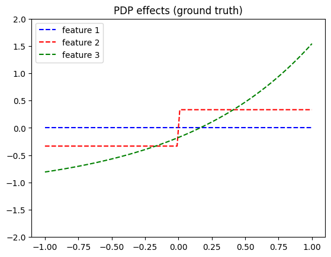
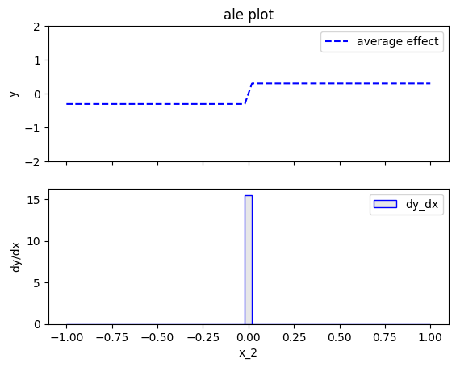

# Example with interaction

In this example, we will show how the Partial Dependence Plot (PDP) and the Accumulated Local Effect (ALE) 
compute the feature effect in the presence of feature interactions. We will use the following model: 

$$ 
f(x_1, x_2, x_3) = -x_1^2 \mathbb{1}_{x_2 <0} + x_1^2 \mathbb{1}_{x_2 \geq 0} + e^{x_3} 
$$

where the features $x_1, x_2, x_3$ are independent and uniformly distributed in the interval $[-1, 1]$.

The model has interaction between $x_1$ and $x_2$, caused by the terms: $f_{1,2}(x_1, x_2) = -x_1^2 \mathbb{1}_{x_2 <0} + x_1^2 \mathbb{1}_{x_2 \geq 0}$.
This means that the effect of $x_1$ depends on the value of $x_2$ and vice versa, 
so there is no golden standard on how to distribute the combined effect to the individual features.
Each method has its own strategy, and below, we show how PDP and ALE treat this interaction.

In contrast, there are no terms that involve interactions between $x_3$ and the other features,
so the effect of $x_3$ can be easily isolated as $e^{x_3}$. 
I
Below, we show how to use the `effector` package to compute the 
Partial Dependence Plot (PDP) and the Accumulated Local Effect (ALE) for the model above.


```python
import numpy as np
import matplotlib.pyplot as plt
import effector

np.random.seed(21)

model = effector.models.ConditionalInteraction()
dataset = effector.datasets.IndependentUniform(dim=3, low=-1, high=1)
x = dataset.generate_data(1_000)
```


## Global effect 

Global effect measures the isolated impact (effect) of an individual feature on the model output, **on average**.
The word "global" refers to the fact that the effect is averaged over the entire dataset, i.e., over the entire feature space.
There are two common methods to compute the global effect: the Partial Dependence Plot (PDP) and the Accumulated Local Effect (ALE).

### Partial Dependence Plot (PDP)

Knowing model $𝑓$ and the data-generating distribution $p(\mathbb{x})$ in closed form, we can compute the Partial Dependence Plot (PDP) effects based on the PDP definition.

$$ 
PDP(x_1) = E_{x_2, x_3} [f(x_1, x_2, x_3)] = 
-x_1^2 E_{x_2}[\mathbb{1}_{x_2 <0}] + x_1^2 E_{x_2}[\mathbb{1}_{x_2 \geq 0}] + E_{x_3}[e^{x_3}]
= -x_1^2 \frac{1}{4} + x_1^2 \frac{1}{4} + 0 = 0 
$$

$$ PDP(x_2) = E_{x_1, x_3} [f(x_1, x_2, x_3)] = 
\mathbb{1}_{x_2 <0} E_{x_1}[-x_1^2] + \mathbb{1}_{x_2 \geq 0} E_{x_1}[x_1^2] + E_{x_3}[e^{x_3}] = 
-\frac{1}{3} \mathbb{1}_{x_2 <0} + \frac{1}{3} \mathbb{1}_{x_2 \geq 0} + c
$$

$$ PDP(x_3) = E_{x_1, x_2} [f(x_1, x_2, x_3)] = e^{x_3} $$

PDP states that on average, $x_1$ has no effect on the model output, $x_2$ has a negative effect of $-\frac{2}{3}$ if $x_2 < 0$ and a positive effect of $\frac{2}{3}$ if $x_2 \geq 0$, and $x_3$ has a positive effect of $e^{x_3}$.
It makes sense: $x_1$ has a zero average effect, since half of the times it has $-x_1^2$ (when $x_2 < 0$) and half of the times it has $x_1^2$ (when $x_2 \geq 0$), so the effects cancel out. 
$x_2$ has a negative effect when $x_2 < 0$ because the term $-x_1^2$ adds a negative value to the model output, and a positive effect when $x_2 \geq 0$ because the term $x_1^2$ adds a positive value to the model output.
Finally, $x_3$, as expected, has an effect of $e^{x_3}$.


In real-world scenarios, we do not know the data-generating distribution $p(\mathbf{x})$ or the model $f$ in closed form.
We simply have a dataset $X$, a `np.ndarray` of shape `(n_samples, n_features)`, drawn from an unknown distribution, 
a black-box model $f$, a `Python` function, and 
`effector` which can approximate the PDP effects based on the dataset $X$ and the model $f$.
Let's see that in practice.


```python
def compute_centering_constant(func, start, stop, nof_points):
    x = np.linspace(start, stop, nof_points)
    y = func(x)
    return np.mean(y)
    
```


```python
def pdp_ground_truth(feature, xs):
    if feature == 0:
        ff = lambda x: np.zeros_like(x)
        z = compute_centering_constant(ff, -1, 1, 1000)
        return ff(xs) - z
    elif feature == 1:
        ff = lambda x: -1/3 * (x < 0) + 1/3 * (x >= 0)
        z = compute_centering_constant(ff, -1, 1, 1000)
        return ff(xs) - z
    elif feature == 2:
        ff = lambda x: np.exp(x)
        z = compute_centering_constant(ff, -1, 1, 1000)
        return ff(xs) - z
```


```python
xx = np.linspace(-1, 1, 100)
y_pdp = []
for feature in [0, 1, 2]:
    y_pdp.append(pdp_ground_truth(feature, xx))

plt.figure()
plt.title("PDP effects (ground truth)")
color_pallette = ["blue", "red", "green"]
for feature in [0, 1, 2]:
    plt.plot(
        xx, 
        y_pdp[feature], 
        color=color_pallette[feature], 
        linestyle="--",
        label=f"feature {feature + 1}"
    )
plt.legend()
plt.xlim([-1.1, 1.1])
plt.ylim([-2, 2])
plt.show()
    
    
```


    

    


```python
pdp = effector.PDP(x, model.predict, dataset.axis_limits)
pdp.fit(features="all", centering=True)
for feature in [0, 1, 2]:
    pdp.plot(feature=feature, centering=True, y_limits=[-2, 2])
```


    

    


    

    


    

    


```python
# make a test
xx = np.linspace(-1, 1, 100)
for feature in [0, 1, 2]:
    y_pdp = pdp.eval(feature=feature, xs=xx, centering=True)
    y_gt = pdp_ground_truth(feature, xx)
    np.testing.assert_allclose(y_pdp, y_gt, atol=1e-1)
```

### Accumulated Local Effect (ALE)

Accumulated Local Effect (ALE) is another method to compute the global effect of a feature on the model output.

$$ 
ALE(x_1) = \int_{x_{1,min}}^{x_1} \mathbb{E}_{x_2, x_3|x_1} \frac{\partial f}{\partial x_1} (z, x_2, x_3) dz
= \int_{x_{1,min}}^{x_1} \mathbb{E}_{x_2, x_3|x_1} \left( -2z \mathbb{1}_{x_2 <0} + 2z \mathbb{1}_{x_2 \geq 0} \right) dz 
= \int_{x_{1,min}}^{x_1} \left( -2z \frac{1}{4} + 2z \frac{1}{4} \right) dz = 0
$$

$$ ALE(x_2) = \int_{x_{2,min}}^{x_2} \mathbb{E}_{x_1, x_3|x_2} \frac{\partial f}{\partial x_2} (x_1, z, x_3) dz
= \int_{x_{2,min}}^{x_2} \mathbb{E}_{x_1, x_3|x_2} \left( -x_1^2 \frac{d \mathbb{1}_{x_2<0}}{dx_2} + x_1^2 \frac{d \mathbb{1}_{x_2 \geq 0}}{dx_2} \right) dz
\propto \cases{ -\frac{1}{3} \text{ if } x_2 < 0 \\ \frac{1}{3} \text{ if } x_2 > 0 \\ \text{undefined if } x_2 = 0}
$$

$$ ALE(x_3) = \int_{x_{3,min}}^{x_3} \mathbb{E}_{x_1, x_2|x_3} \frac{\partial f}{\partial x_3} (x_1, x_2, z) dz
= \int_{x_{3,min}}^{x_3} \mathbb{E}_{x_1, x_2|x_3} e^z dz \propto e^{x_3}
$$

ALE states something similar to PDP: 
$x_1$ average effect is zero. 
$x_2$ has a negative effect of $-\frac{1}{3}$ if $x_2 < 0$, a positive of $\frac{2}{3}$ if $x_2 > 0$, but it is not defined at $x_2 = 0$. This is the only different bit compared to PDP. ALE requires a differentiable black-box function for computing the derivative. Since the indicator terms are discontinuous at $x_2 = 0$, the ALE is undefined at this point. 
We will see below that there are two different approaches to handle this issue: ALE and RHALE. 
Finally, $x_3$ has an effect of $e^{x_3}$.


## ALE approximation

ALE approximation creates a piecewise linear function to approximate ALE definition:

$$\hat{\text{ALE}}(x_s) = \sum_{k=1}^{k_{x_s}} \frac{1}{| \mathcal{S}_k |} \sum_{i: x^{(i)} \in \mathcal{S}_k} \left [ f(z_k, x_c) - f(z_{k-1}, x_c) \right ]
$$

$\hat{\text{ALE}}(x_s)$ uses a Riemannian sum to approximate the integral of $\text{ALE}(x_s)$. The axis of the $s$-th feature is split in $K$ bins (intervals) of equal size. In each bin, the average effect is estimated by the difference between the model output at the right and left bin edges. 

Therefore, for $x_2$, ALE approximation will compute a negative effect of $-\frac{1}{3}$ if $x_2 < -\frac{1}{K}$, a positive effect of $\frac{1}{3}$ if $x_2 > \frac{1}{K}$ and a linear transition in between.


```python
def ale_ground_truth(feature, xs):
    if feature == 0:
        ff = lambda x: np.zeros_like(x)
        z = compute_centering_constant(ff, -1, 1, 1000)
        return ff(xs) - z
    elif feature == 1:
        K = 51
        ff = lambda x: -1/3 * (x < 0) + 1/3 * (x >= 0)
        z = compute_centering_constant(ff, -1, 1, 1000)
        return ff(xs) - z
    elif feature == 2:
        ff = lambda x: np.exp(x)
        z = compute_centering_constant(ff, -1, 1, 1000)
        return ff(xs) - z
```


```python
xx = np.linspace(-1, 1, 100)
y_ale = []
for feature in [0, 1, 2]:
    y_ale.append(ale_ground_truth(feature, xx))
    
plt.figure()
plt.title("ALE effects (ground truth)")
color_pallette = ["blue", "red", "green"]
for feature in [0, 1, 2]:
    plt.plot(
        xx, 
        y_ale[feature], 
        color=color_pallette[feature], 
        linestyle="--",
        label=f"feature {feature + 1}"
    )
plt.legend()
plt.xlim([-1.1, 1.1])
plt.ylim([-2, 2])
plt.show()
    
```


    

    


```python
ale = effector.ALE(x, model.predict, axis_limits=dataset.axis_limits)
ale.fit(features=1, centering=True, binning_method=effector.binning_methods.Fixed(nof_bins=51))

for feature in [0, 1, 2]:
    ale.plot(feature=feature, centering=True, y_limits=[-2, 2])
```


    

    


    

    


    

    


```python
xx = np.linspace(-1, 1, 100)
for feature in [1]:# [0, 1, 2]:
    y_ale = ale.eval(feature=feature, xs=xx, centering=True)
    y_gt = ale_ground_truth(feature, xx)
    
    # hack to remove the effect at undefined region
    if feature == 1:
        K = 51
        ind = np.logical_and(xx > -1/K, xx < 1/K)
        y_ale[ind] = 0
        y_gt[ind] = 0
    
    np.testing.assert_allclose(y_ale, y_gt, atol=1e-1)
    
```

### Robust and Heterogeneity-aware ALE (RHALE)

RHALE, in contrast to ALE, approximates the effect with derivatives at the instances, instead of the bin edges.

$$\hat{\text{RHALE}}(x_s) = \sum_{k=1}^{k_{x_s}} \frac{1}{| \mathcal{S}_k |} \sum_{i: x^{(i)} \in \mathcal{S}_k} \left [ \frac{\partial f}{\partial x_s} (z_i, x_c) \right ]
 $$

Therefore, it computes a zero effect everywhere.


```python
def rhale_ground_truth(feature, xs):
    if feature == 0:
        ff = lambda x: np.zeros_like(x)
        z = compute_centering_constant(ff, -1, 1, 1000)
        return ff(xs) - z
    elif feature == 1:
        K = 51
        ff = lambda x: np.zeros_like(x)
        z = compute_centering_constant(ff, -1, 1, 1000)
        return ff(xs) - z
    elif feature == 2:
        ff = lambda x: np.exp(x)
        z = compute_centering_constant(ff, -1, 1, 1000)
        return ff(xs) - z

```


```python
xx = np.linspace(-1, 1, 100)
y_rhale = []
for feature in [0, 1, 2]:
    y_rhale.append(rhale_ground_truth(feature, xx))
    
plt.figure()
plt.title("RHALE effects (ground truth)")
color_pallette = ["blue", "red", "green"]
for feature in [0, 1, 2]:
    plt.plot(
        xx, 
        y_rhale[feature], 
        color=color_pallette[feature], 
        linestyle="-" if feature == 0 else "--",
        label=f"feature {feature + 1}"
    )
plt.legend()
plt.xlim([-1.1, 1.1])
plt.ylim([-2, 2])
plt.show()


```


    

    


```python
rhale = effector.RHALE(x,
                       model.predict,
                       model.jacobian,
                       axis_limits=dataset.axis_limits
                       )
rhale.fit(features="all", centering=True)

for feature in [0, 1, 2]:
    rhale.plot(feature=feature, centering=True, y_limits=[-2, 2])
    
```


    

    


    

    


    

    


```python
for feature in [0, 1, 2]:
    y_ale = rhale.eval(feature=feature, xs=xx, centering=True)
    y_gt = rhale_ground_truth(feature, xx)
    np.testing.assert_allclose(y_ale, y_gt, atol=1e-1)
```


```python

```
