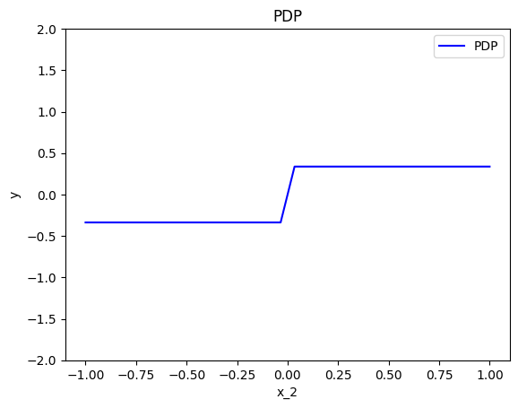
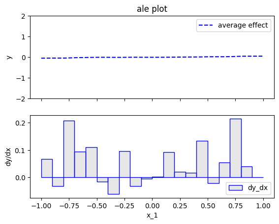
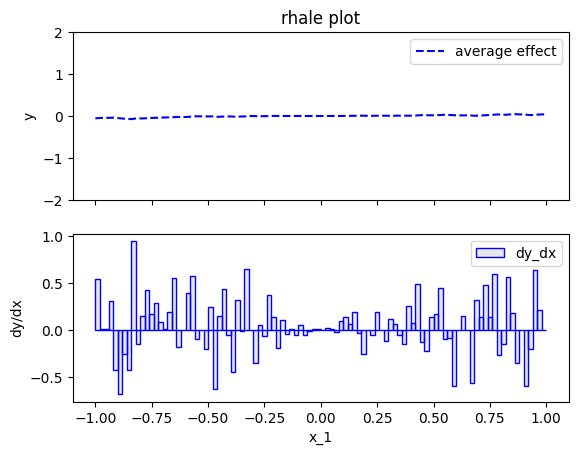

# Model with conditional interaction

In this example, we show global effects of a model with conditional interactions using PDP, ALE, and RHALE.
In particular, we:

1. show how to use `effector` to estimate the global effects using PDP, ALE, and RHALE
2. provide the analytical formulas for the global effects
3. test that (1) and (2) match

We will use the following model: 

$$ 
f(x_1, x_2, x_3) = -x_1^2 \mathbb{1}_{x_2 <0} + x_1^2 \mathbb{1}_{x_2 \geq 0} + e^{x_3} 
$$

where the features $x_1, x_2, x_3$ are independent and uniformly distributed in the interval $[-1, 1]$.


The model has an _interaction_ between $x_1$ and $x_2$ caused by the terms: 
$f_{1,2}(x_1, x_2) = -x_1^2 \mathbb{1}_{x_2 <0} + x_1^2 \mathbb{1}_{x_2 \geq 0}$.
This means that the effect of $x_1$ on the output $y$ depends on the value of $x_2$ and vice versa.
Therefore, there is no golden standard on how to distribute such combined effect to each feature, 
and each method has its own strategy to handle this issue.
Below we will see how PDP, ALE, and RHALE handle this interaction.

In contrast, $x_3$ does not interact with any other feature, so its effect can be easily computed as $e^{x_3}$.


```python
import numpy as np
import matplotlib.pyplot as plt
import effector

np.random.seed(21)

model = effector.models.ConditionalInteraction()
dataset = effector.datasets.IndependentUniform(dim=3, low=-1, high=1)
x = dataset.generate_data(1_000)
```

## PDP

### Effector

Let's see below the PDP effects for each feature, using `effector`.


```python
pdp = effector.PDP(x, model.predict, dataset.axis_limits)
pdp.fit(features="all", centering=True)
for feature in [0, 1, 2]:
    pdp.plot(feature=feature, centering=True, y_limits=[-2, 2])
```


    

    


    

    


    

    


PDP states that:

* $x_1$ has a zero average effect on the model output
* $x_2$ has a positive effect of $\frac{2}{3}$ when moving from (slightly) negative to (slightly) positive values
* $x_3$ has an effect of $e^{x_3}$

### Derivations

Why PDP gives the above explanations? Let's have some analytical derivations. If you don't care about the derivations, skip the following three cells and go directly to the coclusions.

For $x_1$:

\begin{align}
PDP(x_1) &\propto \frac{1}{N} \sum_{i=1}^{n} f(x_1, \mathbf{x}^i_{/1}) \\
&\propto \frac{1}{N} \sum_{i=1}^{N} -x_1^2 \mathbb{1}_{x_2^i <0} + x_1^2 \mathbb{1}_{x_2^i \geq 0} + e^{x_3^i} \\
&\propto x_1^2 \frac{1}{N}\sum_{i=1}^{n} ( - \mathbb{1}_{x_2^i < 0} + \mathbb{1}_{x_2^i \geq 0}) \\
&\approx c
\end{align}

For $x_2$:

\begin{align}
PDP(x_2) &\propto \frac{1}{N} \sum_{i=1}^{n} f(x_2, \mathbf{x}_{/2}^i) \\
&\propto \frac{1}{N} \sum_{i=1}^{n} \left [ (-x_1^i)^2 \mathbb{1}_{x_2 < 0} + (x_1^i)^2 \mathbb{1}_{x_2 \geq 0} + e^{x_3^i} \right ] \\
&\propto \left [ \frac{1}{N} \sum_i^N -x_{i,1}^2 \right ] \mathbb{1}_{x_2 <0}  + \left [ \frac{1}{N} \sum_i^N x_{i,1}^2\right ] \mathbb{1}_{x_2 \geq 0}  \\
&\approx -\frac{1}{3} \mathbb{1}_{x_2 < 0} + \frac{1}{3} \mathbb{1}_{x_2 \geq 0} + c
\end{align}

For $x_3$:

\begin{align}
PDP(x_3) &\propto \frac{1}{N} \sum_{i=1}^{n} f(x_3, x_{/3}^i) \\
&\propto e^{x_3} \\
\end{align}

### Conclusions

Given our knownlegde about the model, are the PDP effects intuitive?

* For $x_1$ the effect is zero. The terms related to $x_1$ are $-x_1^2 \mathbb{1}_{x_2 <0}$ and $x_1^2 \mathbb{1}_{x_2 \geq 0}$. Both terms involve an interaction with $x_2$. Since $x_2 \sim \mathcal{U}(-1,1)$, almost half of the instances have $x_2^i < 0$ and the the other half $x_2^i \geq 0$, so the the two terms cancel out.
* For $x_2$, the effect is constant when $x_2 < 0$ or $x_2>0$ but has a positive jump of $\frac{2}{3}$ when moving from $x_2^-$ to $x_2^+$. It makes sense; when $x_2 < 0$ the active term is $-(x_1^i)^2 \mathbb{1}_{x_2 < 0} $ which adds a negative quantity to the output and when $x_2 \geq 0$ the active term is $(x_1^i)^2 \mathbb{1}_{x_2 \geq 0}$ that adds something postive. Therefore in the transmission we observe a non-linearity.
* For $x_3$, the effect is  $e^{x_3}$, as expected, since only the this term corresponds to $x_3$ and has no interaction with other variables.


```python
def compute_centering_constant(func, start, stop, nof_points):
    x = np.linspace(start, stop, nof_points)
    y = func(x)
    return np.mean(y)


def pdp_ground_truth(feature, xs):
    if feature == 0:
        ff = lambda x: np.zeros_like(x)
        z = compute_centering_constant(ff, -1, 1, 1000)
        return ff(xs) - z
    elif feature == 1:
        ff = lambda x: -1 / 3 * (x < 0) + 1 / 3 * (x >= 0)
        z = compute_centering_constant(ff, -1, 1, 1000)
        return ff(xs) - z
    elif feature == 2:
        ff = lambda x: np.exp(x)
        z = compute_centering_constant(ff, -1, 1, 1000)
        return ff(xs) - z
```


```python
xx = np.linspace(-1, 1, 100)
y_pdp = []
for feature in [0, 1, 2]:
    y_pdp.append(pdp_ground_truth(feature, xx))

plt.figure()
plt.title("PDP effects (ground truth)")
color_pallette = ["blue", "red", "green"]
for feature in [0, 1, 2]:
    plt.plot(
        xx, 
        y_pdp[feature], 
        color=color_pallette[feature], 
        linestyle="--",
        label=f"feature {feature + 1}"
    )
plt.legend()
plt.xlim([-1.1, 1.1])
plt.ylim([-2, 2])
plt.show()

```


    

    


```python
# make a test
xx = np.linspace(-1, 1, 100)
for feature in [0, 1, 2]:
    y_pdp = pdp.eval(feature=feature, xs=xx, centering=True)
    y_gt = pdp_ground_truth(feature, xx)
    np.testing.assert_allclose(y_pdp, y_gt, atol=1e-1)
```

### Accumulated Local Effect (ALE)

Let's see below the ALE effects for each feature, using `effector`.


```python
ale = effector.ALE(x, model.predict, axis_limits=dataset.axis_limits)
ale.fit(features=1, centering=True, binning_method=effector.binning_methods.Fixed(nof_bins=51))

for feature in [0, 1, 2]:
    ale.plot(feature=feature, centering=True, y_limits=[-2, 2])
```


    

    


    

    


    

    


ALE states the same as PDP:
- $x_1$ has a zero average effect on the model output
- $x_2$ has a constant effect of $-\frac{1}{3}$ if $x_2 < 0$ and $\frac{1}{3}$ if $x_2 \geq 0$
- $x_3$ has a positive effect of $e^{x_3}$


## ALE Analytical Formulas

\begin{align}
ALE(x_1) &\propto \sum_{k=1}^{k_{x_1}} \frac{1}{| \mathcal{S}_k |} \sum_{i: x^{(i)} \in \mathcal{S}_k} \left [  f(z_k, x_{i,/1}) - f(z_{k-1}, x_{i,/1}) \right ] \\
&\propto \sum_{k=1}^{k_{x_1}} \frac{1}{| \mathcal{S}_k |} \sum_{i: x^{(i)} \in \mathcal{S}_k} \left [ -z_k^2 \mathbb{1}_{x_{2,i} <0} + z_k^2 \mathbb{1}_{x_{2,i} \geq 0} - (-z_{k-1}^2 \mathbb{1}_{x_{2,i} <0} + z_{k-1}^2 \mathbb{1}_{x_{2,i} \geq 0}) \right ] \\
&\propto \sum_{k=1}^{k_{x_1}} \frac{1}{| \mathcal{S}_k |} \sum_{i: x^{(i)} \in \mathcal{S}_k} \left [ -z_k^2 \underbrace{(\mathbb{1}_{x_{2,i} <0} - \mathbb{1}_{x_{2,i} \geq 0})}_{\approx 0} + z_{k-1}^2 \underbrace{(\mathbb{1}_{x_{2,i} <0} - \mathbb{1}_{x_{2,i} \geq 0})}_{\approx 0} \right ] \\
&\propto \sum_{k=1}^{k_{x_1}} \frac{1}{| \mathcal{S}_k |} \sum_{i: x^{(i)} \in \mathcal{S}_k} 0 \\
&\approx 0
\end{align}

\begin{align}
ALE(x_2) &\propto \sum_{k=1}^{k_{x_2}} \frac{1}{| \mathcal{S}_k |} \sum_{i: x^{(i)} \in \mathcal{S}_k} \left [  f(x_{i,1}, z_k, x_{i,3}) - f(x_{i,1}, z_{k-1}, x_{i,3}) \right ] \\
&\propto \sum_{k=1}^{k_{x_2}} \frac{1}{| \mathcal{S}_k |} \sum_{i: x^{(i)} \in \mathcal{S}_k} \left [ -x_{i,1}^2 \mathbb{1}_{z_k <0} + x_{i,1}^2 \mathbb{1}_{z_k \geq 0} - (-x_{i,1}^2 \mathbb{1}_{z_{k-1} <0} + x_{i,1}^2 \mathbb{1}_{z_{k-1} \geq 0}) \right ] \\
\end{align}

For all bins, except one, it holds that bin limits are either both negative or both positive, so the effects cancel out.
For the bin that contains zero, i.e., the one from $-\frac{2}{K}$ to $\frac{2}{K}$, the effect is $\frac{2x_{i,1}^2}{| \mathcal{S}_k |} = \frac{2}{3} \frac{K}{2} = \frac{K}{3}$.
Therefore, the ALE effect is:

\begin{equation}
ALE(x_2) \approx
\cases{
-\frac{1}{3} \text{ if } x_2 < -\frac{2}{K} \\
-\frac{1}{3} + (x- \frac{2}{K}) \frac{1}{3} \text{ if } x_2 \in [-\frac{2}{K}, \frac{2}{K}] \\
\frac{1}{3} \text{ if } x_2 > \frac{2}{K}}
\end{equation}


\begin{align}
ALE(x_3) &\propto \sum_{k=1}^{k_{x_3}} \frac{1}{| \mathcal{S}_k |} \sum_{i: x^{(i)} \in \mathcal{S}_k} \left [  f(x_{i,1}, x_{i,2}, z_k) - f(x_{i,1}, x_{i,2}, z_{k-1}) \right ] \\
&\propto \sum_{k=1}^{k_{x_3}} \frac{1}{| \mathcal{S}_k |} \sum_{i: x^{(i)} \in \mathcal{S}_k} \left [ e^{z_k} - e^{z_{k-1}} \right ] \\
&\approx e^{x_3}
\end{align}


```python
def ale_ground_truth(feature, xs):
    if feature == 0:
        ff = lambda x: np.zeros_like(x)
        z = compute_centering_constant(ff, -1, 1, 1000)
        return ff(xs) - z
    elif feature == 1:
        K = 51
        ff = lambda x: -1/3 * (x < 0) + 1/3 * (x >= 0)
        z = compute_centering_constant(ff, -1, 1, 1000)
        return ff(xs) - z
    elif feature == 2:
        ff = lambda x: np.exp(x)
        z = compute_centering_constant(ff, -1, 1, 1000)
        return ff(xs) - z
```


```python
xx = np.linspace(-1, 1, 100)
y_ale = []
for feature in [0, 1, 2]:
    y_ale.append(ale_ground_truth(feature, xx))
    
plt.figure()
plt.title("ALE effects (ground truth)")
color_pallette = ["blue", "red", "green"]
for feature in [0, 1, 2]:
    plt.plot(
        xx, 
        y_ale[feature], 
        color=color_pallette[feature], 
        linestyle="--",
        label=f"feature {feature + 1}"
    )
plt.legend()
plt.xlim([-1.1, 1.1])
plt.ylim([-2, 2])
plt.show()
    
```


    

    


```python
ale = effector.ALE(x, model.predict, axis_limits=dataset.axis_limits)
ale.fit(features=1, centering=True, binning_method=effector.binning_methods.Fixed(nof_bins=51))

for feature in [0, 1, 2]:
    ale.plot(feature=feature, centering=True, y_limits=[-2, 2])
```


    

    


    

    


    

    


```python
xx = np.linspace(-1, 1, 100)
for feature in [1]:# [0, 1, 2]:
    y_ale = ale.eval(feature=feature, xs=xx, centering=True)
    y_gt = ale_ground_truth(feature, xx)
    
    # hack to remove the effect at undefined region
    if feature == 1:
        K = 51
        ind = np.logical_and(xx > -1/K, xx < 1/K)
        y_ale[ind] = 0
        y_gt[ind] = 0
    
    np.testing.assert_allclose(y_ale, y_gt, atol=1e-1)
    
```

### Robust and Heterogeneity-aware ALE (RHALE)

RHALE, in contrast to ALE, approximates the effect with derivatives at the instances, instead of the bin edges.

$$\hat{\text{RHALE}}(x_s) = \sum_{k=1}^{k_{x_s}} \frac{1}{| \mathcal{S}_k |} \sum_{i: x^{(i)} \in \mathcal{S}_k} \left [ \frac{\partial f}{\partial x_s} (z_i, x_c) \right ]
 $$

Therefore, it computes a zero effect everywhere.


```python
def rhale_ground_truth(feature, xs):
    if feature == 0:
        ff = lambda x: np.zeros_like(x)
        z = compute_centering_constant(ff, -1, 1, 1000)
        return ff(xs) - z
    elif feature == 1:
        K = 51
        ff = lambda x: np.zeros_like(x)
        z = compute_centering_constant(ff, -1, 1, 1000)
        return ff(xs) - z
    elif feature == 2:
        ff = lambda x: np.exp(x)
        z = compute_centering_constant(ff, -1, 1, 1000)
        return ff(xs) - z

```


```python
xx = np.linspace(-1, 1, 100)
y_rhale = []
for feature in [0, 1, 2]:
    y_rhale.append(rhale_ground_truth(feature, xx))
    
plt.figure()
plt.title("RHALE effects (ground truth)")
color_pallette = ["blue", "red", "green"]
for feature in [0, 1, 2]:
    plt.plot(
        xx, 
        y_rhale[feature], 
        color=color_pallette[feature], 
        linestyle="-" if feature == 0 else "--",
        label=f"feature {feature + 1}"
    )
plt.legend()
plt.xlim([-1.1, 1.1])
plt.ylim([-2, 2])
plt.show()


```


    

    


```python
rhale = effector.RHALE(x,
                       model.predict,
                       model.jacobian,
                       axis_limits=dataset.axis_limits
                       )
rhale.fit(features="all", centering=True)

for feature in [0, 1, 2]:
    rhale.plot(feature=feature, centering=True, y_limits=[-2, 2])
    
```


    

    


    

    


    

    


```python
for feature in [0, 1, 2]:
    y_ale = rhale.eval(feature=feature, xs=xx, centering=True)
    y_gt = rhale_ground_truth(feature, xx)
    np.testing.assert_allclose(y_ale, y_gt, atol=1e-1)
```

## Proofs

Since this is a synthetic example, we know the model $𝑓$ and the data-generating distribution $p(\mathbb{x})$ in closed form, so we can compute the Partial Dependence Plot (PDP) effects based on the PDP definition.

### PDP


PDP computes the effect of feature $x_s$ as:

$$ PDP(x_s) = \mathbb{E}_{x_{-s}} [f(x_s, x_{-s})] $$

Applying the PDP definition to our case, we have:

$$ 
PDP(x_1) = E_{x_2, x_3} [f(x_1, x_2, x_3)] = 
-x_1^2 E_{x_2}[\mathbb{1}_{x_2 <0}] + x_1^2 E_{x_2}[\mathbb{1}_{x_2 \geq 0}] + E_{x_3}[e^{x_3}]
= -x_1^2 \frac{1}{4} + x_1^2 \frac{1}{4} + 0 = 0 
$$

$$ PDP(x_2) = E_{x_1, x_3} [f(x_1, x_2, x_3)] = 
\mathbb{1}_{x_2 <0} E_{x_1}[-x_1^2] + \mathbb{1}_{x_2 \geq 0} E_{x_1}[x_1^2] + E_{x_3}[e^{x_3}] = 
-\frac{1}{3} \mathbb{1}_{x_2 <0} + \frac{1}{3} \mathbb{1}_{x_2 \geq 0} + c
$$

$$ PDP(x_3) = E_{x_1, x_2} [f(x_1, x_2, x_3)] = e^{x_3} $$

PDP states that $x_1$ has a zero average effect on the model output, $x_2$ has a negative effect of $-\frac{2}{3}$ if $x_2 < 0$ and a positive effect of $\frac{2}{3}$ if $x_2 \geq 0$, and $x_3$ has a positive effect of $e^{x_3}$.
It makes sense: $x_1$ has a zero average effect, since half of the times it has $-x_1^2$ (when $x_2 < 0$) and half of the times it has $x_1^2$ (when $x_2 \geq 0$), so the effects cancel out. 
$x_2$ has a negative effect when $x_2 < 0$ because the term $-x_1^2$ adds a negative value to the model output, and a positive effect when $x_2 \geq 0$ because the term $x_1^2$ adds a positive value to the model output.
Finally, $x_3$, as expected, has an effect of $e^{x_3}$.


In real-world scenarios, we do not know the data-generating distribution $p(\mathbf{x})$ or the model $f$ in closed form.
We simply have a dataset $X$, a `np.ndarray` of shape `(n_samples, n_features)`, drawn from an unknown distribution, 
a black-box model $f$, a `Python` function, and 
`effector` which can approximate the PDP effects based on the dataset $X$ and the model $f$.
Let's see that in practice.


Below we provide the proofs:

$$ 
ALE(x_1) = \int_{x_{1,min}}^{x_1} \mathbb{E}_{x_2, x_3|x_1} \frac{\partial f}{\partial x_1} (z, x_2, x_3) dz
= \int_{x_{1,min}}^{x_1} \mathbb{E}_{x_2, x_3|x_1} \left( -2z \mathbb{1}_{x_2 <0} + 2z \mathbb{1}_{x_2 \geq 0} \right) dz 
= \int_{x_{1,min}}^{x_1} \left( -2z \frac{1}{4} + 2z \frac{1}{4} \right) dz = 0
$$

$$ ALE(x_2) = \int_{x_{2,min}}^{x_2} \mathbb{E}_{x_1, x_3|x_2} \frac{\partial f}{\partial x_2} (x_1, z, x_3) dz
= \int_{x_{2,min}}^{x_2} \mathbb{E}_{x_1, x_3|x_2} \left( -x_1^2 \frac{d \mathbb{1}_{x_2<0}}{dx_2} + x_1^2 \frac{d \mathbb{1}_{x_2 \geq 0}}{dx_2} \right) dz
\propto \cases{ 0 \text{ if } x_2 < 0 \\ \text{undefined if } x_2 \geq 0}
$$

$$ ALE(x_3) = \int_{x_{3,min}}^{x_3} \mathbb{E}_{x_1, x_2|x_3} \frac{\partial f}{\partial x_3} (x_1, x_2, z) dz
= \int_{x_{3,min}}^{x_3} \mathbb{E}_{x_1, x_2|x_3} e^z dz \propto e^{x_3}
$$

