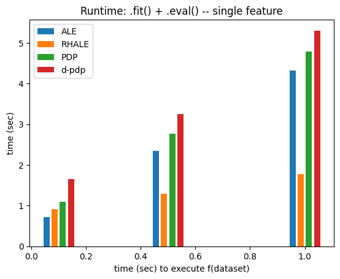
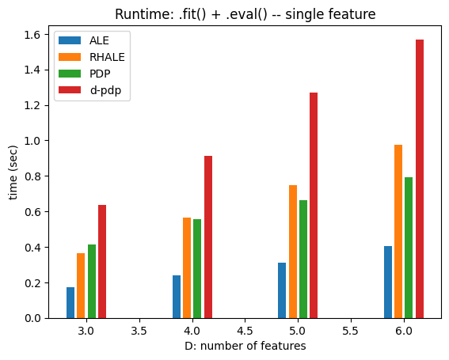
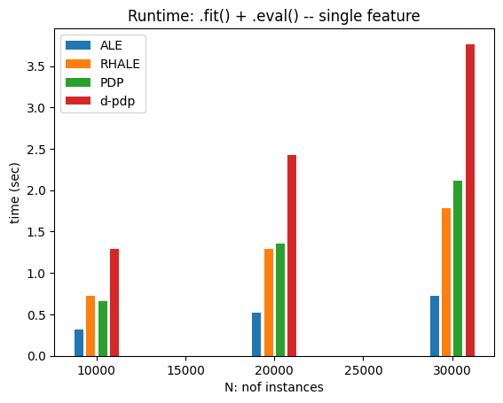

# Measuring Runtime of Regional Effect Plots  

This notebook analyzes the runtime $T(\cdot)$ of Regional Effect plots, which depends on:  

- **$t_f$**: Time to evaluate the black-box function $f$.  
- **$N$**: Number of instances in $X$.  
- **$D$**: Number of features in $X$.  
- **$K$**: Number of points for centering the feature effect plot.  
- **$M$**: Number of evaluation points.  

The main factors affecting runtime are $t_f$, $N$, and $D$.  

### Runtime Breakdown  

1. **Global heterogeneity computation** ($T_{global}$):  
   - Done once for the entire dataset.  
   - Stores intermediate values for reuse.  
   - Runtime:  
     - $T_{global} = \mathcal{O}(N) + \mathcal{O}(t_f)$ for PDP and d-PDP.  
     - $T_{global} = \mathcal{O}(t_f)$ for RHALE.  

2. **Cart-based subregion heterogeneity** ($T_{cart}$):  
   - Iterates over $D-1$ features.  
   - Evaluates $P$ possible conditioning positions.  
   - Recursively splits the dataset up to depth $L$.  
   - Heterogeneity is computed without re-evaluating $f$, only splitting and indexing instances.  

   $$ T_{cart} = (D-1)PL \cdot T(N) $$  

### Total Runtime  

$$
T(t_f, N, D) \approx T_{global} + T_{cart} \approx \mathcal{O}(N) + \mathcal{O}(t_f) + \mathcal{O}(DPLN)
$$  

Runtime is **linear in all key variables**. When computing for all features, it scales as $D^2$.  

Now, let's test this in practice!


```python
import effector
import numpy as np
import timeit
import time
import matplotlib.pyplot as plt
np.random.seed(21)
```


```python
def return_predict(t):
    def predict(x):
        time.sleep(t)
        model = effector.models.DoubleConditionalInteraction()
        return model.predict(x)
    return predict

def return_jacobian(t):
    def jacobian(x):
        time.sleep(t)
        model = effector.models.DoubleConditionalInteraction()
        return model.jacobian(x)
    return jacobian
```


```python
def measure_time(method_name, features):
    fit_time_list, eval_time_list = [], []
    X = np.random.uniform(-1, 1, (N, D))
    xx = np.linspace(-1, 1, M)
    axis_limits = np.array([[-1] * D, [1] * D])

    method_map = {
        "pdp": effector.RegionalPDP,
        "d_pdp": effector.RegionalDerPDP,
        "ale": effector.RegionalALE,
        "rhale": effector.RegionalRHALE,
        "shap_dp": effector.RegionalShapDP
    }

    for _ in range(repetitions):
        # general kwargs
        method_kwargs = {"data": X, "model": model, "axis_limits": axis_limits, "nof_instances":"all"}
        fit_kwargs = {"features": features, "centering": True, "points_for_centering": K, "max_depth": 2}

        # specialize kwargs per method
        if method_name in ["d_pdp", "rhale"]:
            method_kwargs["model_jac"] = model_jac
        if method_name in ["rhale", "ale"]:
            fit_kwargs["binning_method"] = effector.binning_methods.Fixed(nof_bins=20, min_points_per_bin=0.)
            fit_kwargs.pop("centering")
            fit_kwargs.pop("points_for_centering")

        # init
        method = method_map[method_name](**method_kwargs)

        # fit
        tic = time.time()
        method.fit(**fit_kwargs)
        fit_time_list.append(time.time() - tic)

        # eval
        tic = time.time()
        for feat in features:
            eval_kwargs = {"feature": feat, "node_idx": 0, "xs": xx, "centering": True, "heterogeneity": True}
            method.eval(**eval_kwargs)
        eval_time_list.append(time.time() - tic)

    return {"fit": np.mean(fit_time_list), "eval": np.mean(eval_time_list), "total": (np.mean(fit_time_list) + np.mean(eval_time_list))}
```


```python
import matplotlib.pyplot as plt

def bar_plot(xs, time_dict, methods, metric, title, xlabel, ylabel, bar_width=0.02):

    bar_width = (np.max(xs) - np.min(xs)) / 40
    method_to_label = {"ale": "ALE", "rhale": "RHALE", "pdp": "PDP", "d_pdp": "d-pdp", "shap_dp": "SHAP DP"}
    plt.figure()
    
    # Calculate the offsets for each bar group
    offsets = np.linspace(-2*bar_width, 2*bar_width, len(methods))
    
    for i, method in enumerate(methods):
        label = method_to_label[method]
        plt.bar(
            xs + offsets[i],
            [tt[metric] for tt in time_dict[method]],
            label=label,
            width=bar_width
        )
    
    plt.title(title)
    plt.xlabel(xlabel)
    plt.ylabel(ylabel)
    plt.legend()
    plt.show()
```

## Runtime vs $t_f$


```python
t = 0.001
N = 10_000
D = 5
K = 100
M = 100
repetitions = 2
features=[0]
```


```python
method_names = ["ale", "rhale", "pdp", "d_pdp"]
vec = np.array([.1, .5, 1.])
time_dict = {method_name: [] for method_name in method_names}
for t in vec:
    model = return_predict(t)
    model_jac = return_jacobian(t)
    for method_name in method_names:
        time_dict[method_name].append(measure_time(method_name, features))
```

    100%|█████████████████████████████████████████████████████████████████████████████████████████████████████████████████████████████████████████████████████████████████████████| 1/1 [00:00<00:00,  1.98it/s]
    100%|█████████████████████████████████████████████████████████████████████████████████████████████████████████████████████████████████████████████████████████████████████████| 1/1 [00:00<00:00,  1.96it/s]
    100%|█████████████████████████████████████████████████████████████████████████████████████████████████████████████████████████████████████████████████████████████████████████| 1/1 [00:00<00:00,  1.33it/s]
    100%|█████████████████████████████████████████████████████████████████████████████████████████████████████████████████████████████████████████████████████████████████████████| 1/1 [00:00<00:00,  1.27it/s]
    100%|█████████████████████████████████████████████████████████████████████████████████████████████████████████████████████████████████████████████████████████████████████████| 1/1 [00:00<00:00,  1.28it/s]
    100%|█████████████████████████████████████████████████████████████████████████████████████████████████████████████████████████████████████████████████████████████████████████| 1/1 [00:00<00:00,  1.31it/s]
    100%|█████████████████████████████████████████████████████████████████████████████████████████████████████████████████████████████████████████████████████████████████████████| 1/1 [00:01<00:00,  1.25s/it]
    100%|█████████████████████████████████████████████████████████████████████████████████████████████████████████████████████████████████████████████████████████████████████████| 1/1 [00:01<00:00,  1.31s/it]
    100%|█████████████████████████████████████████████████████████████████████████████████████████████████████████████████████████████████████████████████████████████████████████| 1/1 [00:01<00:00,  1.32s/it]
    100%|█████████████████████████████████████████████████████████████████████████████████████████████████████████████████████████████████████████████████████████████████████████| 1/1 [00:01<00:00,  1.35s/it]
    100%|█████████████████████████████████████████████████████████████████████████████████████████████████████████████████████████████████████████████████████████████████████████| 1/1 [00:00<00:00,  1.30it/s]
    100%|█████████████████████████████████████████████████████████████████████████████████████████████████████████████████████████████████████████████████████████████████████████| 1/1 [00:00<00:00,  1.33it/s]
    100%|█████████████████████████████████████████████████████████████████████████████████████████████████████████████████████████████████████████████████████████████████████████| 1/1 [00:01<00:00,  1.57s/it]
    100%|█████████████████████████████████████████████████████████████████████████████████████████████████████████████████████████████████████████████████████████████████████████| 1/1 [00:01<00:00,  1.59s/it]
    100%|█████████████████████████████████████████████████████████████████████████████████████████████████████████████████████████████████████████████████████████████████████████| 1/1 [00:02<00:00,  2.10s/it]
    100%|█████████████████████████████████████████████████████████████████████████████████████████████████████████████████████████████████████████████████████████████████████████| 1/1 [00:02<00:00,  2.05s/it]
    100%|█████████████████████████████████████████████████████████████████████████████████████████████████████████████████████████████████████████████████████████████████████████| 1/1 [00:02<00:00,  2.31s/it]
    100%|█████████████████████████████████████████████████████████████████████████████████████████████████████████████████████████████████████████████████████████████████████████| 1/1 [00:02<00:00,  2.32s/it]
    100%|█████████████████████████████████████████████████████████████████████████████████████████████████████████████████████████████████████████████████████████████████████████| 1/1 [00:00<00:00,  1.32it/s]
    100%|█████████████████████████████████████████████████████████████████████████████████████████████████████████████████████████████████████████████████████████████████████████| 1/1 [00:00<00:00,  1.37it/s]
    100%|█████████████████████████████████████████████████████████████████████████████████████████████████████████████████████████████████████████████████████████████████████████| 1/1 [00:02<00:00,  2.63s/it]
    100%|█████████████████████████████████████████████████████████████████████████████████████████████████████████████████████████████████████████████████████████████████████████| 1/1 [00:02<00:00,  2.58s/it]
    100%|█████████████████████████████████████████████████████████████████████████████████████████████████████████████████████████████████████████████████████████████████████████| 1/1 [00:03<00:00,  3.16s/it]
    100%|█████████████████████████████████████████████████████████████████████████████████████████████████████████████████████████████████████████████████████████████████████████| 1/1 [00:03<00:00,  3.13s/it]


```python
for metric in ["total"]:
    if metric in ["fit", "eval"]:
        title = "Runtime: ." + metric + "() -- single feature"
    else:
        title = "Runtime: .fit() + .eval() -- single feature"
    
    bar_plot(
        vec, 
        time_dict, 
        method_names,
        metric=metric,
        title=title,
        xlabel="time (sec) to execute f(dataset)",
        ylabel="time (sec)"
)
```


    

    


## Runtime vs. D


```python
t = 0.001
N = 10_000
D = 5
K = 100
M = 100
repetitions = 2
features=[0]
```


```python
method_names = ["ale", "rhale", "pdp", "d_pdp"]
vec = np.array([3, 4, 5, 6])
time_dict = {method_name: [] for method_name in method_names}
for D in vec:
    model = return_predict(t)
    model_jac = return_jacobian(t)
    for method_name in method_names:
        time_dict[method_name].append(measure_time(method_name, features))
```

    100%|█████████████████████████████████████████████████████████████████████████████████████████████████████████████████████████████████████████████████████████████████████████| 1/1 [00:00<00:00,  5.81it/s]
    100%|█████████████████████████████████████████████████████████████████████████████████████████████████████████████████████████████████████████████████████████████████████████| 1/1 [00:00<00:00,  6.30it/s]
    100%|█████████████████████████████████████████████████████████████████████████████████████████████████████████████████████████████████████████████████████████████████████████| 1/1 [00:00<00:00,  2.93it/s]
    100%|█████████████████████████████████████████████████████████████████████████████████████████████████████████████████████████████████████████████████████████████████████████| 1/1 [00:00<00:00,  2.94it/s]
    100%|█████████████████████████████████████████████████████████████████████████████████████████████████████████████████████████████████████████████████████████████████████████| 1/1 [00:00<00:00,  3.25it/s]
    100%|█████████████████████████████████████████████████████████████████████████████████████████████████████████████████████████████████████████████████████████████████████████| 1/1 [00:00<00:00,  3.24it/s]
    100%|█████████████████████████████████████████████████████████████████████████████████████████████████████████████████████████████████████████████████████████████████████████| 1/1 [00:00<00:00,  2.16it/s]
    100%|█████████████████████████████████████████████████████████████████████████████████████████████████████████████████████████████████████████████████████████████████████████| 1/1 [00:00<00:00,  1.86it/s]
    100%|█████████████████████████████████████████████████████████████████████████████████████████████████████████████████████████████████████████████████████████████████████████| 1/1 [00:00<00:00,  4.31it/s]
    100%|█████████████████████████████████████████████████████████████████████████████████████████████████████████████████████████████████████████████████████████████████████████| 1/1 [00:00<00:00,  4.32it/s]
    100%|█████████████████████████████████████████████████████████████████████████████████████████████████████████████████████████████████████████████████████████████████████████| 1/1 [00:00<00:00,  1.80it/s]
    100%|█████████████████████████████████████████████████████████████████████████████████████████████████████████████████████████████████████████████████████████████████████████| 1/1 [00:00<00:00,  1.91it/s]
    100%|█████████████████████████████████████████████████████████████████████████████████████████████████████████████████████████████████████████████████████████████████████████| 1/1 [00:00<00:00,  2.31it/s]
    100%|█████████████████████████████████████████████████████████████████████████████████████████████████████████████████████████████████████████████████████████████████████████| 1/1 [00:00<00:00,  2.31it/s]
    100%|█████████████████████████████████████████████████████████████████████████████████████████████████████████████████████████████████████████████████████████████████████████| 1/1 [00:00<00:00,  1.30it/s]
    100%|█████████████████████████████████████████████████████████████████████████████████████████████████████████████████████████████████████████████████████████████████████████| 1/1 [00:00<00:00,  1.36it/s]
    100%|█████████████████████████████████████████████████████████████████████████████████████████████████████████████████████████████████████████████████████████████████████████| 1/1 [00:00<00:00,  3.27it/s]
    100%|█████████████████████████████████████████████████████████████████████████████████████████████████████████████████████████████████████████████████████████████████████████| 1/1 [00:00<00:00,  3.31it/s]
    100%|█████████████████████████████████████████████████████████████████████████████████████████████████████████████████████████████████████████████████████████████████████████| 1/1 [00:00<00:00,  1.38it/s]
    100%|█████████████████████████████████████████████████████████████████████████████████████████████████████████████████████████████████████████████████████████████████████████| 1/1 [00:00<00:00,  1.39it/s]
    100%|█████████████████████████████████████████████████████████████████████████████████████████████████████████████████████████████████████████████████████████████████████████| 1/1 [00:00<00:00,  1.85it/s]
    100%|█████████████████████████████████████████████████████████████████████████████████████████████████████████████████████████████████████████████████████████████████████████| 1/1 [00:00<00:00,  1.87it/s]
    100%|█████████████████████████████████████████████████████████████████████████████████████████████████████████████████████████████████████████████████████████████████████████| 1/1 [00:01<00:00,  1.09s/it]
    100%|█████████████████████████████████████████████████████████████████████████████████████████████████████████████████████████████████████████████████████████████████████████| 1/1 [00:01<00:00,  1.15s/it]
    100%|█████████████████████████████████████████████████████████████████████████████████████████████████████████████████████████████████████████████████████████████████████████| 1/1 [00:00<00:00,  2.63it/s]
    100%|█████████████████████████████████████████████████████████████████████████████████████████████████████████████████████████████████████████████████████████████████████████| 1/1 [00:00<00:00,  2.46it/s]
    100%|█████████████████████████████████████████████████████████████████████████████████████████████████████████████████████████████████████████████████████████████████████████| 1/1 [00:00<00:00,  1.06it/s]
    100%|█████████████████████████████████████████████████████████████████████████████████████████████████████████████████████████████████████████████████████████████████████████| 1/1 [00:00<00:00,  1.06it/s]
    100%|█████████████████████████████████████████████████████████████████████████████████████████████████████████████████████████████████████████████████████████████████████████| 1/1 [00:00<00:00,  1.52it/s]
    100%|█████████████████████████████████████████████████████████████████████████████████████████████████████████████████████████████████████████████████████████████████████████| 1/1 [00:00<00:00,  1.53it/s]
    100%|█████████████████████████████████████████████████████████████████████████████████████████████████████████████████████████████████████████████████████████████████████████| 1/1 [00:01<00:00,  1.41s/it]
    100%|█████████████████████████████████████████████████████████████████████████████████████████████████████████████████████████████████████████████████████████████████████████| 1/1 [00:01<00:00,  1.36s/it]


```python
for metric in ["total"]:
    if metric in ["fit", "eval"]:
        title = "Runtime: ." + metric + "() -- single feature"
    else:
        title = "Runtime: .fit() + .eval() -- single feature"
    
    bar_plot(
        vec, 
        time_dict, 
        method_names,
        metric=metric,
        title=title,
        xlabel="D: number of features",
        ylabel="time (sec)"
)
```


    

    


## Time vs N (number of features)


```python
t = 0.001
N = 100_000
D = 5
T = 100
K = 100
repetitions = 2
features=[0]
```


```python
method_names = ["ale", "rhale", "pdp", "d_pdp"]
vec = np.array([10_000, 20_000, 30_000])
time_dict = {method_name: [] for method_name in method_names}
for N in vec:
    model = return_predict(t)
    model_jac = return_jacobian(t)
    for method_name in method_names:
        time_dict[method_name].append(measure_time(method_name, features))
```

    100%|█████████████████████████████████████████████████████████████████████████████████████████████████████████████████████████████████████████████████████████████████████████| 1/1 [00:00<00:00,  3.10it/s]
    100%|█████████████████████████████████████████████████████████████████████████████████████████████████████████████████████████████████████████████████████████████████████████| 1/1 [00:00<00:00,  3.28it/s]
    100%|█████████████████████████████████████████████████████████████████████████████████████████████████████████████████████████████████████████████████████████████████████████| 1/1 [00:00<00:00,  1.42it/s]
    100%|█████████████████████████████████████████████████████████████████████████████████████████████████████████████████████████████████████████████████████████████████████████| 1/1 [00:00<00:00,  1.42it/s]
    100%|█████████████████████████████████████████████████████████████████████████████████████████████████████████████████████████████████████████████████████████████████████████| 1/1 [00:00<00:00,  1.87it/s]
    100%|█████████████████████████████████████████████████████████████████████████████████████████████████████████████████████████████████████████████████████████████████████████| 1/1 [00:00<00:00,  1.85it/s]
    100%|█████████████████████████████████████████████████████████████████████████████████████████████████████████████████████████████████████████████████████████████████████████| 1/1 [00:01<00:00,  1.18s/it]
    100%|█████████████████████████████████████████████████████████████████████████████████████████████████████████████████████████████████████████████████████████████████████████| 1/1 [00:01<00:00,  1.08s/it]
    100%|█████████████████████████████████████████████████████████████████████████████████████████████████████████████████████████████████████████████████████████████████████████| 1/1 [00:00<00:00,  1.93it/s]
    100%|█████████████████████████████████████████████████████████████████████████████████████████████████████████████████████████████████████████████████████████████████████████| 1/1 [00:00<00:00,  1.94it/s]
    100%|█████████████████████████████████████████████████████████████████████████████████████████████████████████████████████████████████████████████████████████████████████████| 1/1 [00:01<00:00,  1.30s/it]
    100%|█████████████████████████████████████████████████████████████████████████████████████████████████████████████████████████████████████████████████████████████████████████| 1/1 [00:01<00:00,  1.22s/it]
    100%|█████████████████████████████████████████████████████████████████████████████████████████████████████████████████████████████████████████████████████████████████████████| 1/1 [00:01<00:00,  1.19s/it]
    100%|█████████████████████████████████████████████████████████████████████████████████████████████████████████████████████████████████████████████████████████████████████████| 1/1 [00:01<00:00,  1.27s/it]
    100%|█████████████████████████████████████████████████████████████████████████████████████████████████████████████████████████████████████████████████████████████████████████| 1/1 [00:02<00:00,  2.20s/it]
    100%|█████████████████████████████████████████████████████████████████████████████████████████████████████████████████████████████████████████████████████████████████████████| 1/1 [00:02<00:00,  2.35s/it]
    100%|█████████████████████████████████████████████████████████████████████████████████████████████████████████████████████████████████████████████████████████████████████████| 1/1 [00:00<00:00,  1.39it/s]
    100%|█████████████████████████████████████████████████████████████████████████████████████████████████████████████████████████████████████████████████████████████████████████| 1/1 [00:00<00:00,  1.40it/s]
    100%|█████████████████████████████████████████████████████████████████████████████████████████████████████████████████████████████████████████████████████████████████████████| 1/1 [00:01<00:00,  1.72s/it]
    100%|█████████████████████████████████████████████████████████████████████████████████████████████████████████████████████████████████████████████████████████████████████████| 1/1 [00:01<00:00,  1.80s/it]
    100%|█████████████████████████████████████████████████████████████████████████████████████████████████████████████████████████████████████████████████████████████████████████| 1/1 [00:01<00:00,  1.97s/it]
    100%|█████████████████████████████████████████████████████████████████████████████████████████████████████████████████████████████████████████████████████████████████████████| 1/1 [00:02<00:00,  2.00s/it]
    100%|█████████████████████████████████████████████████████████████████████████████████████████████████████████████████████████████████████████████████████████████████████████| 1/1 [00:03<00:00,  3.59s/it]
    100%|█████████████████████████████████████████████████████████████████████████████████████████████████████████████████████████████████████████████████████████████████████████| 1/1 [00:03<00:00,  3.62s/it]


```python
for metric in ["total"]:
    if metric in ["fit", "eval"]:
        title = "Runtime: ." + metric + "() -- single feature"
    else:
        title = "Runtime: .fit() + .eval() -- single feature"
    
    bar_plot(
        vec, 
        time_dict, 
        method_names,
        metric=metric,
        title=title,
        xlabel="N: nof instances",
        ylabel="time (sec)"
)
```


    

    


## A demanding example


```python
t = 0.1
N = 50_000
D = 15
T = 100
K = 100
repetitions = 2
features=[0]
```


```python
method_names = ["ale", "rhale", "pdp", "d_pdp"]
time_dict = {method_name: [] for method_name in method_names}
model = return_predict(t)
model_jac = return_jacobian(t)
for method_name in method_names:
    time_dict[method_name].append(measure_time(method_name, features))
```

    100%|█████████████████████████████████████████████████████████████████████████████████████████████████████████████████████████████████████████████████████████████████████████| 1/1 [00:04<00:00,  4.69s/it]
    100%|█████████████████████████████████████████████████████████████████████████████████████████████████████████████████████████████████████████████████████████████████████████| 1/1 [00:04<00:00,  4.76s/it]
      0%|                                                                                                                                                                                 | 0/1 [00:11<?, ?it/s]


    ---------------------------------------------------------------------------

    KeyboardInterrupt                         Traceback (most recent call last)

    Cell In[15], line 6
          4 model_jac = return_jacobian(t)
          5 for method_name in method_names:
    ----> 6     time_dict[method_name].append(measure_time(method_name, features))


    Cell In[3], line 33, in measure_time(method_name, features)
         31 # fit
         32 tic = time.time()
    ---> 33 method.fit(**fit_kwargs)
         34 fit_time_list.append(time.time() - tic)
         36 # eval


    File ~/github/packages/effector/effector/regional_effect_ale.py:193, in RegionalRHALE.fit(self, features, heter_pcg_drop_thres, heter_small_enough, max_depth, nof_candidate_splits_for_numerical, min_points_per_subregion, candidate_conditioning_features, split_categorical_features, binning_method, points_for_mean_heterogeneity)
        188 for feat in tqdm(features):
        189     heter = self._create_heterogeneity_function(
        190         feat, binning_method, min_points_per_subregion
        191     )
    --> 193     self._fit_feature(
        194         feat,
        195         heter,
        196         heter_pcg_drop_thres,
        197         heter_small_enough,
        198         max_depth,
        199         nof_candidate_splits_for_numerical,
        200         min_points_per_subregion,
        201         candidate_conditioning_features,
        202         split_categorical_features,
        203     )
        205     self.method_args["feature_" + str(feat)] = {
        206         "heter_pcg_drop_thres": heter_pcg_drop_thres,
        207         "heter_small_enough": heter_small_enough,
       (...)
        213         "binning_method": binning_method,
        214     }


    File ~/github/packages/effector/effector/regional_effect.py:131, in RegionalEffectBase._fit_feature(self, feature, heter_func, heter_pcg_drop_thres, heter_small_enough, max_split_levels, candidate_positions_for_numerical, min_points_per_subregion, candidate_foc, split_categorical_features)
        112 regions = Regions(
        113     feature,
        114     heter_func,
       (...)
        128     split_categorical_features,
        129 )
        130 # apply partitioning
    --> 131 regions.search_all_splits()
        132 regions.choose_important_splits()
        133 self.tree_full["feature_{}".format(feature)] = regions.splits_to_tree()


    File ~/github/packages/effector/effector/partitioning.py:124, in Regions.search_all_splits(self)
        121     break
        123 # find optimal split
    --> 124 split = self.single_level_splits(
        125     x_list,
        126     x_jac_list,
        127     splits[-1]["heterogeneity"],
        128     active_indices_list
        129 )
        131 x_list = split["x_list"]
        132 x_jac_list = split["x_jac_list"]


    File ~/github/packages/effector/effector/partitioning.py:197, in Regions.single_level_splits(self, x_list, x_jac_list, heter_before, active_indices_list)
        188 active_indices_list_2 = self.flatten_list([k for _, _, k in tmp])
        190 # sub_heter: list with the heterogeneity after split of foc_i at position j
        191 # if x_jac_list[0] is None:
        192 #     sub_heter = [heter_func(x) for x in x_list_2]
       (...)
        195 #         heter_func(x, x_jac) for x, x_jac in zip(x_list_2, x_jac_list_2)
        196 #     ]
    --> 197 sub_heter = [heter_func(x) for x in active_indices_list_2]
        199 # heter_drop: list with the heterogeneity drop after split of foc_i at position j
        200 heter_drop = np.array(
        201     self.flatten_list(
        202         [
       (...)
        209     )
        210 )


    File ~/github/packages/effector/effector/partitioning.py:197, in <listcomp>(.0)
        188 active_indices_list_2 = self.flatten_list([k for _, _, k in tmp])
        190 # sub_heter: list with the heterogeneity after split of foc_i at position j
        191 # if x_jac_list[0] is None:
        192 #     sub_heter = [heter_func(x) for x in x_list_2]
       (...)
        195 #         heter_func(x, x_jac) for x, x_jac in zip(x_list_2, x_jac_list_2)
        196 #     ]
    --> 197 sub_heter = [heter_func(x) for x in active_indices_list_2]
        199 # heter_drop: list with the heterogeneity drop after split of foc_i at position j
        200 heter_drop = np.array(
        201     self.flatten_list(
        202         [
       (...)
        209     )
        210 )


    File ~/github/packages/effector/effector/regional_effect_ale.py:89, in RegionalRHALE._create_heterogeneity_function.<locals>.heter(active_indices)
         87 data = self.data[active_indices.astype(bool), :]
         88 if self.data_effect is not None:
    ---> 89     instance_effects = self.data_effect[active_indices.astype(bool), :]
         90 else:
         91     instance_effects = None


    KeyboardInterrupt: 


```python
time_dict
```


```python
bar_plot(np.array([1, 2]), time_dict, method_names, metric="total", 
         title="a",
         xlabel="A difficult case",
         ylabel="time (sec)",
        )
```
