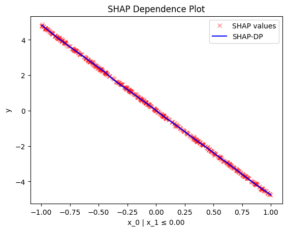

## Summary

All regional effect methods have a similar interface and workflow:

1. create an instance of the regional effect method you want to use
2. (optional) `.fit()` to customize the method
3. `.summary()` to print the partition tree found for each feature
4. `.plot()` to plot the regional effect of a feature at a specific node
5. `.eval()` to evaluate the regional effect of a feature at a specific node at a specific grid of points

---

## Usage

```python
# set up the input
X = ... # input data
predict = ... # model to be explained
jacobian = ... # jacobian of the model
```

1. **Create an instance of the regional effect method you want to use**:

    === "PDP"
        
        ```python
        effector.RegionalPDP(data=X, model=predict)
        ```
    
    === "RHALE"
    
        ```python
        effector.RegionalRHALE(data=X, model=predict, model_jac=jacobian)
        ```
    
    === "ShapDP"
    
         ```python
         effector.RegionalShapDP(data=X, model=predict)
         ```
    
    === "ALE"
    
        ```python
        effector.RegionalALE(data=X, model=predict)
        ```
    
    === "DerPDP"
    
         ```python
         effector.DerPDP(data=X, model=predict, model_jac=jacobian)
         ```

2. **Customize the regional effect method (optional)**:

    `.fit(features, **method_specific_args)`
    
    ??? Tip "This is the place for customization"

        The `.fit()` step can be omitted if you are ok with the default settings; you can directly call the `.summary()`, `.plot()`, or `.eval()` methods.
        However, if you want more control over the fitting process, you can pass additional arguments to the `.fit()` method.
        Check the Usage section below and the method-specific documentation for more information.

    ??? Example "Usage"


        ```python
        # customize the space partitioning algorithm
        space_partitioner = effector.space_partitioning.Best(
            heter_pcg_drop_thres=0.3 # percentage drop threshold (default: 0.1),
            max_split_levels=1 # maximum number of split levels (default: 2)
        )
        r_method.fit(
            features=[0, 1], # list of features to be analyzed
            space_partitioner=space_partitioner # space partitioning algorithm (default: effector.space_partitioning.Best)
        )
        ```

3. **Print the partition tree found for each feature in `features`**:

    `.summary(features)`
    
    ??? Example "Usage"

        ```python
        features = [...] # list of features to be analyzed
        r_method.summary(features)
        ```
    
    ??? Example "Example Output"
   
        ```python
        Feature 3 - Full partition tree:
        🌳 Full Tree Structure:
        ───────────────────────

        hr 🔹 [id: 0 | heter: 0.43 | inst: 3476 | w: 1.00]
            workingday = 0.00 🔹 [id: 1 | heter: 0.36 | inst: 1129 | w: 0.32]
                temp ≤ 6.50 🔹 [id: 3 | heter: 0.17 | inst: 568 | w: 0.16]
                temp > 6.50 🔹 [id: 4 | heter: 0.21 | inst: 561 | w: 0.16]
            workingday ≠ 0.00 🔹 [id: 2 | heter: 0.28 | inst: 2347 | w: 0.68]
                temp ≤ 6.50 🔹 [id: 5 | heter: 0.19 | inst: 953 | w: 0.27]
                temp > 6.50 🔹 [id: 6 | heter: 0.20 | inst: 1394 | w: 0.40]
        --------------------------------------------------
        Feature 3 - Statistics per tree level:
        🌳 Tree Summary:
        ─────────────────
        Level 0🔹heter: 0.43
            Level 1🔹heter: 0.31 | 🔻0.12 (28.15%)
                Level 2🔹heter: 0.19 | 🔻0.11 (37.10%)
        ```

4. **Plot the regional effect of a feature at a specific node**:

    `.plot(feature, node_idx)`
    
    ??? Example "Usage"

        ```python
        feature = ...
        node_idx = ...
        r_method.plot(feature, node_idx, **plot_specific_args)
        ```


    ??? Example "Output"

        === "PDP"
        
             | `node_idx=1`: $x_1$ when $x_2 \leq 0$ | `node_idx=2`: $x_1$ when $x_2 > 0$ |
             |:---------:|:---------:|
             | `r_method.plot(0, 1)` | `r_method.plot(0, 2)` |
             |  |  |
        
        === "RHALE"
        
             | `node_idx=1`: $x_1$ when $x_2 \leq 0$ | `node_idx=2`: $x_1$ when $x_2 > 0$ |
             |:---------:|:---------:|
             | `r_method.plot(0, 1)` | `r_method.plot(0, 2)` |
             |  |  |

        === "ShapDP"

             | `node_idx=1`: $x_1$ when $x_2 \leq 0$ | `node_idx=2`: $x_1$ when $x_2 > 0$ |
             |:---------:|:---------:|
             | `r_method.plot(0, 1)` | `r_method.plot(0, 2)` |
             |  |  |
        
        === "ALE"
        
             | `node_idx=1`: $x_1$ when $x_2 \leq 0$ | `node_idx=2`: $x_1$ when $x_2 > 0$ |
             |:---------:|:---------:|
             | `r_method.plot(0, 1)` | `r_method.plot(0, 2)` |
             |  |  |
        
        
        === "derPDP"
        
             | `node_idx=1`: $x_1$ when $x_2 \leq 0$ | `node_idx=2`: $x_1$ when $x_2 > 0$ |
             |:---------:|:---------:|
             | `r_method.plot(0, 1)` | `r_method.plot(0, 2)` |
             |  |  |

5. **Evaluate the regional effect of a feature at a specific node at a specific grid of points**:
   
    `.eval(feature, node_idx, xs)`

    ??? Example "Usage"

        ```python
        # Example input
        feature = ... # feature to be analyzed
        node_idx = ... # node index
        xs = ... # grid of points to evaluate the regional effect, e.g., np.linspace(0, 1, 100)
        ```

         ```python
         y, het = r_method.eval(feature, node_idx, xs)
         ```

## API

### ::: effector.regional_effect.RegionalEffectBase
       options:
         show_root_heading: False
         show_symbol_type_toc: True
         inherited_members: True
         members:
           - eval
           - summary

### ::: effector.regional_effect_ale.RegionalALE
       options:
         show_root_heading: True
         show_symbol_type_toc: True
         inherited_members: True
         members:
           - __init__
           - fit
           - plot

### ::: effector.regional_effect_ale.RegionalRHALE
       options:
         show_root_heading: True
         show_symbol_type_toc: True
         inherited_members: True
         members:
           - __init__
           - fit
           - plot


### ::: effector.regional_effect_pdp.RegionalPDP
       options:
         show_root_heading: True
         show_symbol_type_toc: True
         inherited_members: True
         members:
           - __init__
           - fit
           - plot

### ::: effector.regional_effect_pdp.RegionalDerPDP
       options:
         show_root_heading: True
         show_symbol_type_toc: True
         inherited_members: True
         members:
           - __init__
           - fit
           - plot

### ::: effector.regional_effect_shap.RegionalShapDP
       options:
         show_root_heading: True
         show_symbol_type_toc: True
         inherited_members: True
         members:
           - __init__
           - fit
           - plot
