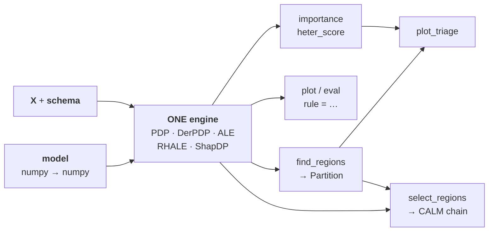
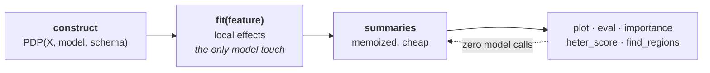

???+ success "Description"

    The thinking behind `effector`'s API: one engine, values not state, two
    entrances. Internalize this page and every verb becomes predictable.

???+ note "Reading time"

	Approx. 4' to read.

???+ note "Glossary"

    - **Engine**: an effect object — `PDP`, `DerPDP`, `ALE`, `RHALE`, `ShapDP`. The one stateful thing.
    - **Verb**: anything you ask the engine — `fit`, `plot`, `eval`, `importance`,
      `heter_score`, `find_regions`, `select_regions`. Every verb takes a feature
      by **index or name**.
    - **Rule**: a predicate like `workingday == yes`. Passing `rule=` to a verb
      restricts it to that subpopulation.
    - **`Partition`**: a tree of regions returned by `find_regions`; each region carries a rule.
    - **`CALM`**: one snapshot of the analysis — global effects everywhere except
      the accepted splits, with its explained-variance R² stamped on it.
      `select_regions` returns the chain of them (`CalmSequence`), from the pure
      GAM to the selected regional model.
    - **`Report`**: the frozen result of `effector.explain`, renderable with `.to_html()`.

## One engine, five methods



🔧 Think of an engine the way you think of a pytorch model: construct it once,
it holds what is expensive, live with it for the whole session.

What it holds is small — the data, the model handle, and **two caches**.
Everything else is computed on demand, **without touching the model again**.



```python
pdp = effector.PDP(X, model, schema=schema)   # construct once
pdp.plot("hr")                                 # everything else is a query
pdp.importance("temp")
pdp.find_regions("hr")
```

???+ note "The two-block lifecycle"

    Design contract [R14](./design.md): block (a) is frame-gated and touches
    the model once per feature; block (b) is a memo of cheap summaries.
    Nothing else is stored.

## Values, not state

???+ question "Where does my analysis live?"

    In your variables. Not in the engine.

Queries return **values** ([R12](./design.md)): a float from `importance`, a
`Partition` from `find_regions`, a `CalmSequence` from `select_regions`, a
`Report` from `explain`.

```python
parts = pdp.find_regions(features="heterogeneous")   # a dict you hold
pdp.plot("hr", rule=parts["hr"][2].rule)             # plot node 2 of the tree
```

✅ Don't like a partition? Recompute it with different finder kwargs. Nothing
needs resetting, because nothing was stored.

## Two entrances, one engine

Two ways in. They share every internal:

=== "The one-liner"

    ```python
    report = effector.explain(X, model, schema=schema)
    report.to_html("report.html")
    ```

    Fits one method, searches regions on the heterogeneous features, lets
    `select_regions` decide which splits earn their explained-variance keep,
    and freezes it all into a `Report` — the ledger bar first, then the
    selected snapshot, then the global baseline.

    👉 Use it when you want **the answer**.

=== "The workbench"

    ```python
    pdp = effector.PDP(X, model, schema=schema)
    pdp.fit(features="all")
    effector.plot_triage(pdp)
    parts = pdp.find_regions(features="heterogeneous")
    ```

    Drive the analysis yourself, intervening wherever the defaults don't
    convince you.

    👉 Use it when you want **the analysis**.

???+ note "`explain` is not a different pipeline"

    It is the workbench walked with defaults and nobody intervening.

---

## Where to next

- [effector's report](../quickstart/report.md): the one-liner, in depth
- [The interactive API](../quickstart/interactive_api.md): the workbench, verb by verb
- [The design contract](./design.md): the formal rules behind this page
