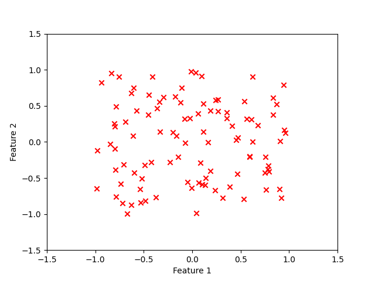
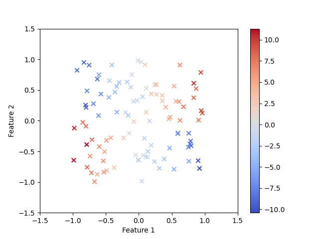
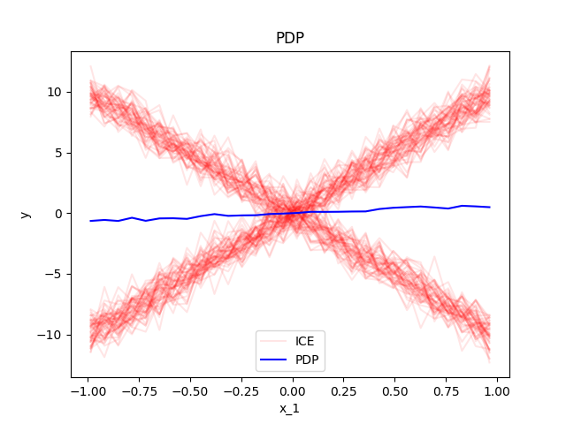
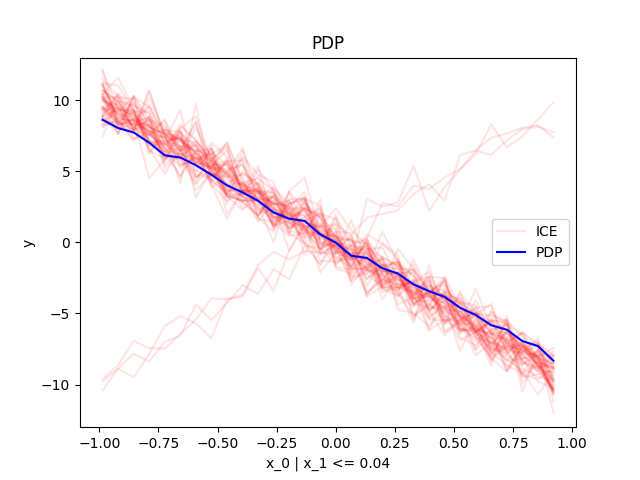
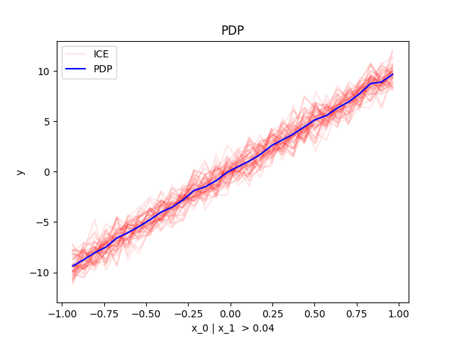

# Home

`Effector` is a python package for [global](./global_effect_intro/) and [regional](.regional_effect_intro/) feature effects.

## How to use

???+ success "You need a dataset"
     Must be a `np.ndarray` with shape `(n_samples, n_features)`.

=== "Code"

    ```python
    X = np.random.uniform(-1, 1, (100, 2))
    ```

=== "Plot"

    ```python
    plt.scatter(X[:, 0], X[:, 1], c="red", marker="x")
    plt.xlabel("Feature 1")
    plt.ylabel("Feature 2")
    plt.xlim(-1.5, 1.5)
    plt.ylim(-1.5, 1.5)
    plt.show()
    ```

=== "Output"
    
    

???+ success "And a model"
     The black-box model you want to interpret.

     Must be a `callable` with signature `model(X: np.ndarray[n_samples, n_features]) -> np.ndarray[n_samples]`.


=== "Code"

    ```python
    def predict(x):
        y = np.zeros(x.shape[0])
        ind = x[:, 1] > 0
        y[ind] = 10*x[ind, 0]
        y[~ind] = -10*x[~ind, 0]
        return y + np.random.normal(0, 1, x.shape[0])
    ```

=== "Plot"

    ```python
    plt.scatter(X[:, 0], X[:, 1], c=predict(X), cmap="coolwarm", marker="x")
    plt.xlabel("Feature 1")
    plt.ylabel("Feature 2")
    plt.xlim(-1.5, 1.5)
    plt.ylim(-1.5, 1.5)
    plt.colorbar()
    plt.show()
    ```

=== "Output"

    

=== "$f(x)$"
   
    $$f(x) = \begin{cases} 10x_1 + \epsilon, & \text{if } x_2 > 0 \\ -10x_1 + \epsilon, & \text{otherwise} \end{cases}$$    

???+ success "Global Effect"

    As you do not know the model's form, you want to understand how `Feature 1` relates to the model's output. 
    You can use `Effector`:

=== "Global Effect"

    ```python
    effector.PDP(data=X, model=predict).plot(feature=0, heterogeneity="ice")
    ```

=== "Plot"

    

???+ success "Regional Effect"

    The plot implies that the global effect of `Feature 1` on the model's output is zero,
    but there is heterogeneity in the effect.
    You want to further investigate the sources of heterogeneity:

=== "Code"

    ```python
    reg_pdp = effector.RegionalPDP(data=X, model=predict)
    reg_pdp.show_partitioning(feature=0)

    reg_pdp.plot(feature=0, node_idx=0, heterogeneity="ice", y_limits=(-13, 13))
    reg_pdp.plot(feature=0, node_idx=1, heterogeneity="ice", y_limits=(-13, 13))
    reg_pdp.plot(feature=0, node_idx=2, heterogeneity="ice", y_limits=(-13, 13))
    ```

=== "Show Partitioning"
    
    ```
    Feature 0 - Full partition tree:
        Node id: 0, name: x_0, heter: 5.57 || nof_instances:   100 || weight: 1.00
                Node id: 1, name: x_0 | x_1 <= 0.04, heter: 2.78 || nof_instances:    50 || weight: 0.50
                Node id: 2, name: x_0 | x_1  > 0.04, heter: 1.03 || nof_instances:    50 || weight: 0.50
    --------------------------------------------------
    Feature 0 - Statistics per tree level:
        Level 0, heter: 5.57
                Level 1, heter: 1.90 || heter drop: 3.67 (65.85%)
    ```

=== "when $x_1 <= 0.04$"

    

=== "when $x_1 > 0.04$"

    

## Dive in

That was a simple example. 
`Effector` has many more methods for obtaining global and regional effects
and 
for each method many parameters to customize your analysis:
For a deeper dive, check out:

- the intoduction to [global effects](./global_effect_intro/),
- the introduction to [regional effects](./regional_effect_intro/),
- the tutorials on synthetic examples: [link 1](/Tutorials/synthetic-examples/01_linear_model/), [link 2](/Tutorials/synthetic-examples/02_global_effect_methods_comparison/), [link 3](/Tutorials/synthetic-examples/03_regional_effects_synthetic_f/), [link 4](/Tutorials/synthetic-examples/04_regional_effects_real_f/),
- the tutorials on real examples: [link 1](/Tutorials/real-examples/01_bike_sharing/), [link 2](/Tutorials/real-examples/02_bike_sharing_global_effect/), [link 3](/Tutorials/real-examples/03_bike_sharing_dataset/).
- the guides on how to use effector: [link 1](/Guides/wrap_models/)

## Methods

`Effector` implements the following methods:

|  Method  |                      Global Effect                      |                                 Regional Effect                                 |                                                                       Paper                                                                        |                                                                                                                                
|:--------:|:-------------------------------------------------------:|:-------------------------------------------------------------------------------:|:--------------------------------------------------------------------------------------------------------------------------------------------------:|
|   PDP    |     [`PDP`](./api/#effector.global_effect_pdp.PDP)      |        [`RegionalPDP`](./api/#effector.regional_effect_pdp.RegionalPDP)         | [PDP](https://projecteuclid.org/euclid.aos/1013203451), [ICE](https://arxiv.org/abs/1309.6392), [GAGDET-PD](https://arxiv.org/pdf/2306.00541.pdf)  |
|  d-PDP   |  [`DerPDP`](./api/#effector.global_effect_pdp.DerPDP)   |     [`RegionalDerPDP`](./api/#effector.regional_effect_pdp.RegionalDerPDP)      |                                                  [d-PDP, d-ICE](https://arxiv.org/abs/1309.6392)                                                   | 
|   ALE    |     [`ALE`](./api/#effector.global_effect_ale.ALE)      |        [`RegionalALE`](./api/#effector.regional_effect_ale.RegionalALE)         |                [ALE](https://academic.oup.com/jrsssb/article/82/4/1059/7056085), [GAGDET-ALE](https://arxiv.org/pdf/2306.00541.pdf)                |                                                                                    
|  RHALE   |   [`RHALE`](./api/#effector.global_effect_ale.RHALE)    |      [`RegionalRHALE`](./api/#effector.regional_effect_ale.RegionalRHALE)       |         [RHALE](https://ebooks.iospress.nl/doi/10.3233/FAIA230354), [DALE](https://proceedings.mlr.press/v189/gkolemis23a/gkolemis23a.pdf)         |
| SHAP-DP  |  [`ShapDP`](./api/#effector.global_effect_shap.ShapDP)  |     [`RegionalShapDP`](./api/#effector.regional_effect_shap.RegionalShapDP)     | [SHAP](https://papers.nips.cc/paper/7062-a-unified-approach-to-interpreting-model-predictions), [GAGDET-DP](https://arxiv.org/pdf/2306.00541.pdf)  |

