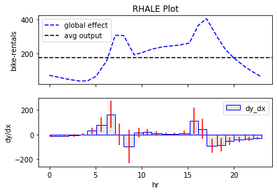
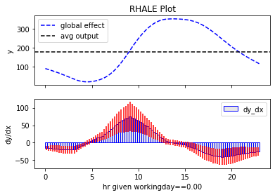
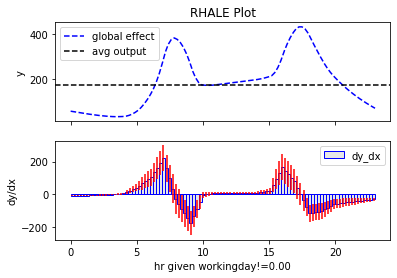

# Getting Started

`Effector` is a python package for [global](#global-effect-plots) and 
[regional](#regional-effect-plots-in-a-single-line) effect plots.

---
### Installation

Add installation instructions

---
### Global effect plots

`Effector` is designed to provide a simple API. In most cases, the user can get 
the plot in a single line of code. 
Given a dataset `X` and a machine learning model `ml_model`, 
the user can get the effect plot of feature `feature` by simply calling:

```python
# for PDP
PDP(data=X, model=ml_model).plot(feature)
```


```python
# for ALE
ALE(data=X, model=ml_model, model_jac=ml_model_jac).plot(feature)
```


--- 

### Heterogeneity

`Effector` gives emphasis to the heterogeneity of the effect, i.e., how much the
instance-level effects deviate from the global effect. For all methods, 
plotting the heterogeneity can be done by setting the `confidence_interval` parameter.

```python
# for ALE
ALE(data=X, model=ml_model, model_jac=ml_model_jac).plot(feature, heterogeneity=True)
```



```python
# for PDP-ICE
PDPwithICE(data=X, model=ml_model).plot(feature, heterogeneity="ice")
```


For more details, check the [global effect tutorial](./tutorials/00_linear_global_effect/).

--- 

### Regional Effect plots

`Effector` provides a simple API for regional effect plots. 
In cases with high-heterogeneity, the regional effect plots, i.e.,
the effect plots for a subset of the data, can be more informative than the
global effect plots. For example, the effect of feature `\mathtt{hour}` is highly-heterogeneous:

<center>

</center>

But, if we look at the effect of `\mathtt{hr}` for the subset of the workingdays (`workingday=1`) and non-workingdays (`workingday=0`),
we can see that the effect is much more homogeneous. 
`Effector` can find such subsets automatically and plot the regional effect plots in a single line of code:

```python
RegionalRHALE(data=X, model=ml_model, model_jac=ml_model_jac).plot(feature=0, heterogeneity=True)
```





---

## Methods Supported by Effector

### Global Effect Plots


| Method        | How to use                                                                                                                                              |
|---------------|---------------------------------------------------------------------------------------------------------------------------------------------------------|
| PDP           | [`effector.PDP(X, model).plot(feature, centering, confidence_interval)`](./../../03_API/#effector.global_effect_pdp.PDP)                                |
| d-PDP         | [`effector.DerivativePDP(X, model, model_jac).plot(feature, centering, confidence_interval)`](./../../03_API/#effector.global_effect_pdp.DerivativePDP) |
| ALE           | [`effector.ALE(X, model).plot(feature, centering, confidence_interval)`](./../../03_API/#effector.global_effect_ale.ALE)                                |
| RHALE         | [`effector.RHALE(X, model, model_jac).plot(feature, centering, confidence_interval)`](./../../03_API/#effector.global_effect_rhale.RHALE)               |


### Regional Effect Plots


| Method        | How to use                                                                                          |
|---------------|-----------------------------------------------------------------------------------------------------|
| RegionalRHALE | [`effector.ALE(X, model).plot(feature, centering, confidence_interval)`](./../../03_API/#effector.global_effect_ale.ALE)|
| RegionalPDP   | [`effector.PDP(X, model).plot(feature, centering, confidence_interval)`](./../../03_API/#effector.global_effect_ale.ALE) |


