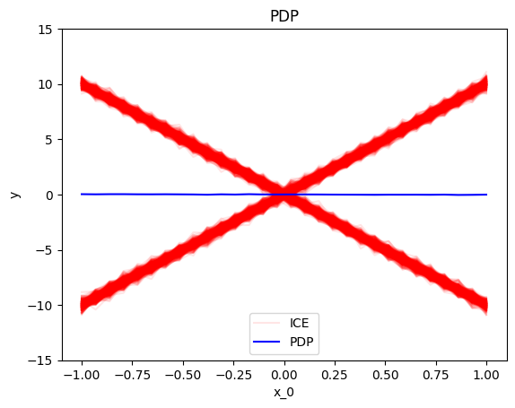
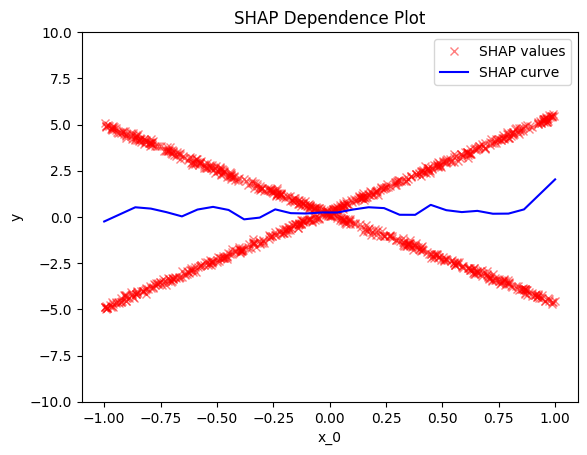
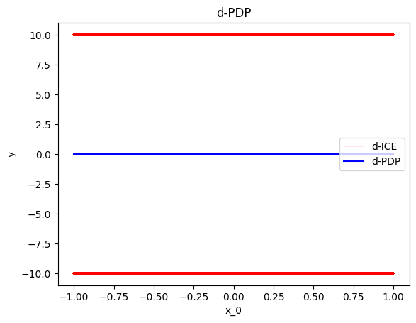
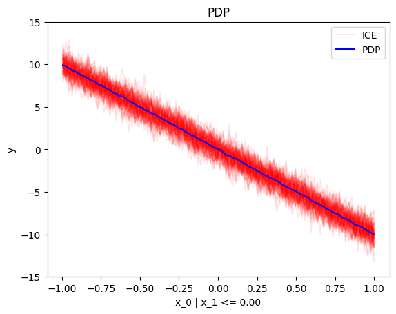
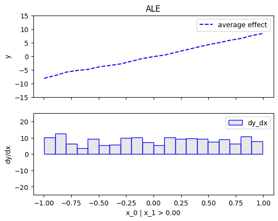
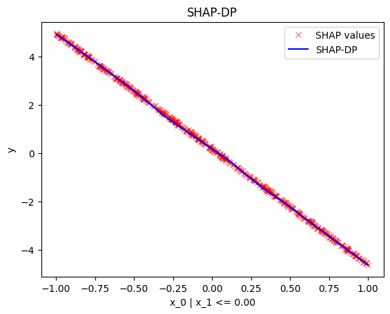
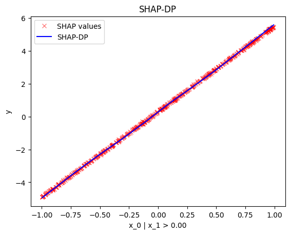
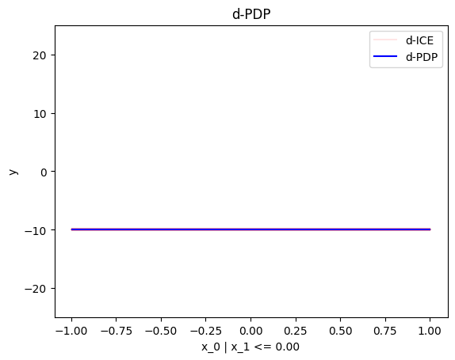

# Home

`Effector` is a python package for [global](./global_effect_intro/) and [regional](./regional_effect_intro/) feature effects.

## Setup

To use `Effector`, you need:

- a dataset, normally the test set
- a black-box model 
- (optionally) the jacobian of the black-box model

### Dataset

???+ note "A dataset, typically the test set"
     Must be a `np.ndarray` with shape `(N, D)`. 

=== "synthetic example"
     
     ```python
     Ν = 100
     D = 2
     X_test = np.random.uniform(-1, 1, (N, D))
     ```

=== "a real case"

    Example with bike-sharing dataset:

    ```python
    from ucimlrepo import fetch_ucirepo 

    # fetch dataset 
    bike_sharing_dataset = fetch_ucirepo(id=275) 
  
    # data (as pandas dataframes) 
    X = bike_sharing_dataset.data.features 
    y = bike_sharing_dataset.data.targets 

    # split data
    X_train, X_test, y_train, y_test = train_test_split(X, y, test_size=0.2)
    ```

### Black-box model

???+ note "A trained black-box model"

     Must be a `Callable` with signature `X: np.ndarray[N, D]) -> np.ndarray[N]`. 

     

=== "synthetic example"

     ```python
     def predict(x):
        '''y = 10*x[0] if x[1] > 0 else -10*x[0] + noise'''
        y = np.zeros(x.shape[0])          options:
            force_inspection: true
            allow_inspection: true
        ind = x[:, 1] > 0
        y[ind] = 10*x[ind, 0]
        y[~ind] = -10*x[~ind, 0]
        return y + np.random.normal(0, 1, x.shape[0])
     ```

=== "scikit-learn"

     If you have a sklearn `model`, use `model.predict`.

     ```python
     # X = ... (the training data)
     # y = ... (the training labels)
     # model = sklearn.ensemble.RandomForestRegressor().fit(X, y)

     def predict(x):
        return model.predict(x)
     ```

=== "tensorflow"

     If you have a tensorflow model, use `model.predict`.

     ```python
     # X = ... (the training data)
     # y = ... (the training labels)
     # model = ... (a keras model, e.g., keras.Sequential)

     def predict(x):
        return model.predict(x)
     ```

=== "pytorch"

     If you have a pytorch model, use `model.forward`.

     ```python
     # X = ... (the training data)
     # y = ... (the training labels)
     # model = ... (a pytorch model, e.g., torch.nn.Sequential)

     def predict(x):
        return model.forward(x).detach().numpy()
     ```

### Jacobian (optional)

???+ note "Optional: The jacobian of the model's output w.r.t. the input"
    
    Must be a `Callable` with signature `X: np.ndarray[N, D]) -> np.ndarray[N, D]`.     
    It is not required, but for some methods (`RHALE` and `DerPDP`), it accelerates the computation.

=== "synthetic example"

     ```python
     def jacobian(x):
       '''dy/dx = 10 if x[1] > 0 else -10'''
       y = np.zeros_like(x)
       ind = x[:, 1] > 0
       y[ind, 0] = 10
       y[~ind, 0] = -10
       return y
     ```

=== "scikit-learn"
    
    Not available.

=== "tensorflow"

     ```python
     # X = ... (the training data)
     # y = ... (the training labels)
     # model = ... (a keras model, e.g., keras.Sequential)

     def jacobian(x):
        with tf.GradientTape() as tape:
            tape.watch(x)
            y = model(x)
        return tape.jacobian(y, x)
     ```

=== "pytorch"

    ```python
     # X = ... (the training data)
     # y = ... (the training labels)
     # model = ... (a pytorch model, e.g., torch.nn.Sequential)

     def jacobian(x):
        x = torch.tensor(x, requires_grad=True)
        y = model(x)
        y.backward(torch.eye(y.shape[0]))
        return x.grad.numpy()
    ```


## Global Effect

???+ success "Global effect: how each feature affects the model's output **globally**, averaged over all instances."

    `Effector` offers many methods to visualize the global effect, all under a similar API.

=== "PDP"

    ```python
    effector.PDP(data=X, model=predict).plot(feature=0, heterogeneity="ice")
    ```
    { align=center }

=== "RHALE"

    ```python
    effector.RHALE(data=X, model=predict, model_jac=jacobian).plot(feature=0, heterogeneity=True)
    ```
    { align=center }

=== "ALE"

    ```python
    effector.ALE(data=X, model=predict).plot(feature=0, heterogeneity=True)
    ```
    { align=center }

=== "ShapDP"

    ```python
    effector.PDP(data=X, model=predict).plot(feature=0, heterogeneity="shap_values")
    ```
    { align=center }
=== "derPDP"

    ```python
    effector.DerPDP(data=X, model=predict, model_jac=jacobian).plot(feature=0, heterogeneity="d-ice")
    ```
    { align=center }


## Regional Effect

???+ success "Regional Effect: How each feature affects the model's output **regionally**, averaged over all instances **in a subregion.**"
     
    Sometimes, global effects are very heterogeneous (local effects deviate from the global effect).
    In these cases, there maybe subregions with less variance.
    `Effector` searches for such regions.


### `.summary()`

=== "PDP"
    
    ```python
    effector.RegionalPDP(data=X, model=predict).summary(0)
    ```

    ```python
    Feature 0 - Full partition tree:
        Node id: 0, name: x_0, heter: 5.57 || nof_instances:   100 || weight: 1.00
                Node id: 1, name: x_0 | x_1 <= 0.04, heter: 2.78 || nof_instances:    50 || weight: 0.50
                Node id: 2, name: x_0 | x_1  > 0.04, heter: 1.03 || nof_instances:    50 || weight: 0.50
    --------------------------------------------------
    Feature 0 - Statistics per tree level:
        Level 0, heter: 5.57
                Level 1, heter: 1.90 || heter drop: 3.67 (65.85%)
    ```

=== "RHALE"

     ```python
    effector.RegionalRHALE(data=X, model=predict, model_jac=jacobian).summary(0)
     ```

    ```python
    Feature 0 - Full partition tree:
     Node id: 0, name: x_0, heter: 93.45 || nof_instances:  1000 || weight: 1.00
             Node id: 1, name: x_0 | x_1 <= 0.0, heter: 0.00 || nof_instances:   501 || weight: 0.50
             Node id: 2, name: x_0 | x_1  > 0.0, heter: 0.00 || nof_instances:   499 || weight: 0.50
     --------------------------------------------------
     Feature 0 - Statistics per tree level:
     Level 0, heter: 93.45
             Level 1, heter: 0.00 || heter drop : 93.45 (units), 100.00% (pcg)
    ```
=== "ALE"

    ```python
    effector.RegionalALE(data=X, model=predict).summary(0)
    ```

    ```python
     Feature 0 - Full partition tree:
     Node id: 0, name: x_0, heter: 289.24 || nof_instances:  1000 || weight: 1.00
             Node id: 1, name: x_0 | x_1 <= 0.0, heter: 183.08 || nof_instances:   501 || weight: 0.50
             Node id: 2, name: x_0 | x_1  > 0.0, heter: 193.44 || nof_instances:   499 || weight: 0.50
     --------------------------------------------------
     Feature 0 - Statistics per tree level:
     Level 0, heter: 289.24
             Level 1, heter: 188.25 || heter drop : 100.99 (units), 34.92% (pcg)
    ```
=== "ShapDP"

     ```python
        effector.RegionalShapDP(data=X, model=predict).summary(0)
     ```

     ```python
     Feature 0 - Full partition tree:
     Node id: 0, name: x_0, heter: 8.35 || nof_instances:  1000 || weight: 1.00
             Node id: 1, name: x_0 | x_1 <= 0.0, heter: 0.01 || nof_instances:   501 || weight: 0.50
             Node id: 2, name: x_0 | x_1  > 0.0, heter: 0.01 || nof_instances:   499 || weight: 0.50
     --------------------------------------------------
     Feature 0 - Statistics per tree level:
     Level 0, heter: 8.35
             Level 1, heter: 0.01 || heter drop : 8.34 (units), 99.86% (pcg)
     ```

=== "DerPDP"

     ```python
        effector.DerPDP(data=X, model=predict, model_jac=jacobian).summary(0)
     ```

    ```python
     Feature 0 - Full partition tree:
     Node id: 0, name: x_0, heter: 100.00 || nof_instances:  1000 || weight: 1.00
             Node id: 1, name: x_0 | x_1 <= 0.0, heter: 0.00 || nof_instances:   501 || weight: 0.50
             Node id: 2, name: x_0 | x_1  > 0.0, heter: 0.00 || nof_instances:   499 || weight: 0.50
     --------------------------------------------------
     Feature 0 - Statistics per tree level:
     Level 0, heter: 100.00
             Level 1, heter: 0.00 || heter drop : 100.00 (units), 100.00% (pcg)
    ```

### `.plot()`

=== "PDP"

     ```python
     effector.RegionalPDP(data=X, model=predict).plot(0)
     ```

     | $x_1$ when $x_2 leq 0$ | $x_1$ when $x_2 > 0$ |
     |:---------:|:---------:|
     |  |  |

=== "RHALE"

     ```python
     effector.RegionalRHALE(data=X, model=predict, model_jac=jacobian).plot(0)
     ```

     | $x_1$ when $x_2 leq 0$ | $x_1$ when $x_2 > 0$ |
     |:---------:|:---------:|
     |  |  |

=== "ALE"

     ```python
     effector.RegionalALE(data=X, model=predict).plot(0)
     ```

     | $x_1$ when $x_2 leq 0$ | $x_1$ when $x_2 > 0$ |
     |:---------:|:---------:|
     |  |  |

=== "ShapDP"

     ```python
     effector.RegionalShapDP(data=X, model=predict).plot(0)
     ```

     | $x_1$ when $x_2 leq 0$ | $x_1$ when $x_2 > 0$ |
     |:---------:|:---------:|
     |  |  |

=== "derPDP"

     ```python
     effector.RegionalDerPDP(data=X, model=predict, model_jac=jacobian).plot(0)
     ```

     | $x_1$ when $x_2 leq 0$ | $x_1$ when $x_2 > 0$ |
     |:---------:|:---------:|
     |  |  |

## Dive in

That was a simple example. 
`Effector` has many more methods for obtaining global and regional effects
and 
for each method many parameters to customize your analysis:
For a deeper dive, check out:

- the intoduction to [global effects](./global_effect_intro/),
- the introduction to [regional effects](./regional_effect_intro/),
- the tutorials on synthetic examples: [link 1](/Tutorials/synthetic-examples/01_linear_model/), [link 2](/Tutorials/synthetic-examples/02_global_effect_methods_comparison/), [link 3](/Tutorials/synthetic-examples/03_regional_effects_synthetic_f/), [link 4](/Tutorials/synthetic-examples/04_regional_effects_real_f/),
- the tutorials on real examples: [link 1](/Tutorials/real-examples/01_bike_sharing/), [link 2](/Tutorials/real-examples/02_bike_sharing_global_effect/), [link 3](/Tutorials/real-examples/03_bike_sharing_dataset/).
- the guides on how to use effector: [link 1](/Guides/wrap_models/)

## Methods

`Effector` implements the following methods:

|  Method  |                      Global Effect                      |                                 Regional Effect                                 |                                                                       Paper                                                                        |                                                                                                                                
|:--------:|:-------------------------------------------------------:|:-------------------------------------------------------------------------------:|:--------------------------------------------------------------------------------------------------------------------------------------------------:|
|   PDP    |     [`PDP`](./api/#effector.global_effect_pdp.PDP)      |        [`RegionalPDP`](./api/#effector.regional_effect_pdp.RegionalPDP)         | [PDP](https://projecteuclid.org/euclid.aos/1013203451), [ICE](https://arxiv.org/abs/1309.6392), [GAGDET-PD](https://arxiv.org/pdf/2306.00541.pdf)  |
|  d-PDP   |  [`DerPDP`](./api/#effector.global_effect_pdp.DerPDP)   |     [`RegionalDerPDP`](./api/#effector.regional_effect_pdp.RegionalDerPDP)      |                                                  [d-PDP, d-ICE](https://arxiv.org/abs/1309.6392)                                                   | 
|   ALE    |     [`ALE`](./api/#effector.global_effect_ale.ALE)      |        [`RegionalALE`](./api/#effector.regional_effect_ale.RegionalALE)         |                [ALE](https://academic.oup.com/jrsssb/article/82/4/1059/7056085), [GAGDET-ALE](https://arxiv.org/pdf/2306.00541.pdf)                |                                                                                    
|  RHALE   |   [`RHALE`](./api/#effector.global_effect_ale.RHALE)    |      [`RegionalRHALE`](./api/#effector.regional_effect_ale.RegionalRHALE)       |         [RHALE](https://ebooks.iospress.nl/doi/10.3233/FAIA230354), [DALE](https://proceedings.mlr.press/v189/gkolemis23a/gkolemis23a.pdf)         |
| SHAP-DP  |  [`ShapDP`](./api/#effector.global_effect_shap.ShapDP)  |     [`RegionalShapDP`](./api/#effector.regional_effect_shap.RegionalShapDP)     | [SHAP](https://papers.nips.cc/paper/7062-a-unified-approach-to-interpreting-model-predictions), [GAGDET-DP](https://arxiv.org/pdf/2306.00541.pdf)  |

