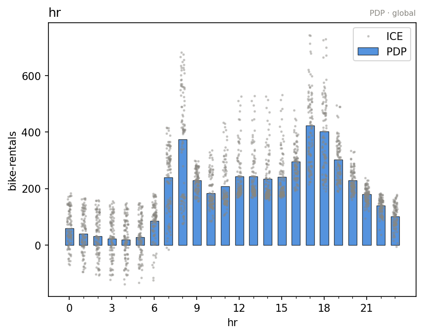

# 

<p align="center">
  
</p>

[](https://badge.fury.io/py/effector)

[](https://codecov.io/gh/givasile/effector)

[](https://pepy.tech/projects/effector)
[](https://github.com/astral-sh/ruff)

---

`effector` is an eXplainable AI package for **tabular data**. It:

- explains any black-box model with [global and regional effects](./quickstart/global_and_regional_effects/): what each feature does, and where the average hides something
- produces a report in one line: [`effector.explain(X, model)`](./quickstart/report/) fits, ranks the features, hunts for subregions, and writes a single self-contained HTML page
- offers an [interactive API](./quickstart/interactive_api/) when you want the controls: five engines ([PDP, d-PDP, ALE, RHALE, SHAP-DP](./#supported-methods)), one verb set
- is model agnostic: any callable `numpy → numpy` works, and [adapters](./quickstart/input_guide/) wrap scikit-learn, PyTorch, classifiers and DataFrame pipelines
- is fast, for both [global](./notebooks/guides/efficiency_global/) and [regional](./notebooks/guides/efficiency_regional/) methods: everything after the fit is free

---

📖 [Documentation](./) | 🚀 [Quickstart](./quickstart/simple_api/) | 🔧 [API](./api_docs/) | 🏗 [Examples](./examples/)

---

## Installation

Effector requires Python 3.10+:

```bash
pip install effector
```

This installs a lightweight core (`numpy`, `scipy`, `matplotlib`, `tqdm`) that covers PDP, ALE, RHALE and their regional effects.

`ShapDP` needs the heavier `shap`/`shapiq` backends (which pull in `numba`, `scikit-learn`, `pandas`, ...). Install them only if you use that method:

```bash
pip install effector[shap]
```

---

## Quickstart

### (a) The inputs

A dataset as a numpy array, a model as a `numpy → numpy` callable, and, optionally, a schema so the explanation speaks your vocabulary:

```python
import effector
from sklearn.ensemble import HistGradientBoostingRegressor

data = effector.datasets.BikeSharing()  # standardized numpy arrays
model = HistGradientBoostingRegressor(random_state=21).fit(data.x_train, data.y_train)
predict = effector.adapters.from_sklearn(model)  # a plain numpy -> numpy callable

schema = effector.Schema(
    feature_names=data.feature_names,
    feature_types=[
        "nominal", "nominal", "ordinal", "ordinal", "nominal", "nominal",
        "nominal", "ordinal", "continuous", "continuous", "continuous",
    ],
    category_names=[
        ["winter", "spring", "summer", "fall"],
        ["2011", "2012"],
        ["Jan", "Feb", "Mar", "Apr", "May", "Jun",
         "Jul", "Aug", "Sep", "Oct", "Nov", "Dec"],
        None,
        ["no", "yes"],
        ["Sun", "Mon", "Tue", "Wed", "Thu", "Fri", "Sat"],
        ["no", "yes"],
        ["clear", "mist", "light rain/snow", "heavy rain"],
        None, None, None,
    ],
    scale_x_list=[
        {"mean": data.x_train_mu[i], "std": data.x_train_std[i]}
        for i in range(data.x_train.shape[1])
    ],
    scale_y={"mean": data.y_train_mu, "std": data.y_train_std},
    target_name="bike-rentals",
)
```

📄 In depth: [the input layer](./quickstart/input_guide/); pandas, sklearn, torch, classifiers, feature types, units.

### (b) The one-liner

```python
report = effector.explain(
    data.x_train, predict, y=data.y_train, schema=schema, nof_instances=5000
)
```

It fits once, ranks the features, hunts for subregions where the average is hiding something, keeps only the splits that pay for themselves, and opens with the one number worth having:

```text
[effector] global effects   (GAM)  -> 72.3% of the model's variance
           regional effects (CALM) -> 92.0%
```

The result is a `Report`, a value you can export or print:

```python
report.to_html("report.html")  # a single self-contained page; mail it, commit it
report.show()                  # the same story, as terminal tables
```

```text
  ════════════════════════════════════════════════════════════════════════
  PDP report  ·  target: bike-rentals
  ════════════════════════════════════════════════════════════════════════

  DATA & MODEL
  ────────────────────────────────────────────────────────────────────────
    instances     5,000
    features      11  ·  5 nominal · 3 ordinal · 3 continuous
    model output  mean 188 · std 176 · range [-19.5, 948]
    model R²      0.960  (on this subsample)

  EXPLAINED VARIANCE
  ────────────────────────────────────────────────────────────────────────
    step         split on                 solo     ΔR²      R²       heter
    ──────────────────────────────────────────────────────────────────────
    GAM          (all features global)       —       —   72.3%           —
  + hr           temp, workingday, yr   +18.3%  +18.3%   90.6% 0.47 → 0.26
  + temp         hr, hum                 +2.4%   +1.4%   92.0% 0.22 → 0.19
    ──────────────────────────────────────────────────────────────────────
    FINAL                                                92.0%

  REJECTED SPLITS                                            min gain 1.0%
  ────────────────────────────────────────────────────────────────────────
    feature      split on                 solo     ΔR²    reason
    ──────────────────────────────────────────────────────────────────────
  ✗ yr           hr, workingday          +2.7%   -0.8%    redundant
  ✗ hum          hr, temp                +2.2%   +0.2%    below threshold
  ✗ weekday      hr, temp, yr            +0.4%   +0.2%    below threshold
  ✗ workingday   hr, yr                  +6.2%   -4.8%    redundant

    ✗ redundant: it would explain variance on its own (see solo),
      but the accepted splits already account for it.

  FEATURES                                ranked, in the selected snapshot
  ────────────────────────────────────────────────────────────────────────
    feature        importance                          heter      #regions
    ──────────────────────────────────────────────────────────────────────
    hr                 0.7273  ██████████████████     0.2608             4
    yr                 0.2271  ██████                 0.2088             1
    temp               0.2098  █████                  0.1874             4
    hum                0.0932  ██                     0.1221             1
    ──────────────────────────────────────────────────────────────────────
    the features above carry 82% of the total importance mass
```

(the accepted partition trees follow)

📄 In depth: [the report](./quickstart/report/); the explained variance ledger, the triage plane, the regional analysis, every knob of `explain(...)`.

### (c) The interactive API

The same engine, as a live handle you query as you go:

```python
pdp = effector.PDP(data.x_train, predict, schema=schema, nof_instances=5000)

pdp.plot("hr")                        # the global effect, ICE curves behind it
pdp.heter_score("hr")                 # 0.47: the average hides a lot
partition = pdp.find_regions("hr")    # where is it hiding it?
partition.show()
```

```text
Feature 3 - Full partition tree:
🌳 Full Tree Structure:
───────────────────────
hr 🔹 [id: 0 | heter: 0.47 | inst: 5000 | w: 1.00]
    workingday = no 🔹 [id: 1 | heter: 0.33 | inst: 1545 | w: 0.31]
        temp < 6.86 🔹 [id: 2 | heter: 0.22 | inst: 778 | w: 0.16]
        temp ≥ 6.86 🔹 [id: 3 | heter: 0.26 | inst: 767 | w: 0.15]
    workingday = yes 🔹 [id: 4 | heter: 0.34 | inst: 3455 | w: 0.69]
        yr = 2011 🔹 [id: 5 | heter: 0.23 | inst: 1720 | w: 0.34]
        yr = 2012 🔹 [id: 6 | heter: 0.31 | inst: 1735 | w: 0.35]
--------------------------------------------------
Feature 3 - Statistics per tree level:
🌳 Tree Summary:
─────────────────
Level 0🔹heter: 0.47
    Level 1🔹heter: 0.34 | 🔻0.13 (28.12%)
        Level 2🔹heter: 0.26 | 🔻0.08 (22.91%)
```

The effect of `hr` depends on `workingday` (commute peaks vs a midday plateau), and within each branch on `temp` and `yr`. Plot the effect inside a region:

```python
partition.plot(2)  # hr, on non-working days, in the cold
```

<table>
  <tr>
    <td></td>
    <td></td>
  </tr>
</table>

Every verb answers one question:

| verb                    | question it answers                    |
|-------------------------|----------------------------------------|
| `.plot(f)`              | what does feature `f` do?              |
| `.eval(f, xs)`          | …as numbers, on my grid                |
| `.importance(f)`        | how much does `f` move the output?     |
| `.heter_score(f)`       | is the average hiding something?       |
| `.find_regions(f)`      | *where* is it hiding it?               |
| `.select_regions()`     | which splits actually earn their keep? |
| `.fit(features, **cfg)` | (optional) tune the method first       |

📄 In depth: [the interactive API](./quickstart/interactive_api/); construct and fit, [customizing `.fit()`](./quickstart/interactive/customize_fit/), plot, eval, scores, regions.

---

## Documentation map

Start here:

- [What are global and regional effects](./quickstart/global_and_regional_effects/): the concepts
- [`effector`'s API](./quickstart/simple_api/): the whole API in 3 minutes
    - [(a) The input layer](./quickstart/input_guide/): numpy, models, adapters, the schema
    - [(b) `effector`'s report](./quickstart/report/): the one-liner, `.show()`, and the HTML page
    - [(c) The interactive API](./quickstart/interactive_api/): the five engines, global and regional effects

Going deeper:

- [The mental model](./guides/mental_model/): the thinking behind the API; one engine, values not state, two entrances
- [Methods: the math reference](./guides/methods/): how each method defines the effect, its heterogeneity, and the two scalars
- [The design contract](./guides/design/): the rules the API is built on, one breath each
- [Efficiency of global](./notebooks/guides/efficiency_global/) and [regional](./notebooks/guides/efficiency_regional/) methods: count the model calls

---

## Supported Methods

Every method computes global effects, and regional effects via `.find_regions(feature)`:

| Method  | Class    | Reference | ML model | Speed |
|---------|----------|-----------|----------|-------|
| PDP     | `PDP`    | [Friedman, 2001](https://projecteuclid.org/euclid.aos/1013203451) | any | fast for a small dataset |
| d-PDP   | `DerPDP` | [Goldstein et al., 2013](https://arxiv.org/abs/1309.6392) | differentiable | fast for a small dataset |
| ALE     | `ALE`    | [Apley & Zhu, 2020](https://academic.oup.com/jrsssb/article/82/4/1059/7056085) | any | fast |
| RHALE   | `RHALE`  | [Gkolemis et al., 2023](https://ebooks.iospress.nl/doi/10.3233/FAIA230354) | differentiable | very fast |
| SHAP-DP | `ShapDP` | [Lundberg & Lee, 2017](https://papers.nips.cc/paper/7062-a-unified-approach-to-interpreting-model-predictions) | any | fast for a small dataset and a light model |

---

## Choosing a method

Three questions decide: is the dataset **small** (N < 10K) or **large**? Is the model **light** (< 0.1s per call) or **heavy**? Is it **differentiable** or not?

| your case | use |
|---|---|
| small + light | any: `PDP`, `ALE`, `ShapDP`; plus `RHALE`, `DerPDP` if differentiable |
| small + heavy | `PDP`, `ALE`; plus `RHALE`, `DerPDP` if differentiable |
| large + differentiable | `RHALE` |
| large + non-differentiable | `ALE` |

---

## Citation

If you use `effector`, please cite it:

```bibtex
@misc{gkolemis2024effector,
  title={effector: A Python package for regional explanations},
  author={Vasilis Gkolemis et al.},
  year={2024},
  eprint={2404.02629},
  archivePrefix={arXiv},
  primaryClass={cs.LG}
}
```

---

## Spotlight on `effector`

### 📚 Featured Publications  
- **Gkolemis, Vasilis, et al.**  
  *"Fast and Accurate Regional Effect Plots for Automated Tabular Data Analysis."*  
  [Proceedings of the VLDB Endowment](https://vldb.org/workshops/2024/proceedings/TaDA/TaDA.5.pdf) | ISSN 2150-8097  

### 🎤 Talks & Presentations  
- **LMU-IML Group Talk**  
  [Slides & Materials](https://github.com/givasile/effector-paper/tree/main/presentation-general) | [LMU-IML Research](https://www.slds.stat.uni-muenchen.de/research/explainable-ai.html)  
- **AIDAPT Plenary Meeting**  
  [Deep dive into effector](https://github.com/givasile/presentation-aidapt-xai-effector/tree/main)  
- **XAI World Conference 2024**  
  [Poster](https://github.com/givasile/effector-paper/blob/main/poster-general/main.pdf) | [Paper](https://github.com/givasile/effector-paper/blob/main/xai-conference-submission/effector_xai_conf.pdf)  

### 🌍 Adoption & Collaborations  
- **[AIDAPT Project](https://www.ai-dapt.eu/effector/)**  
  Leveraging `effector` for explainable AI solutions.  

### 🔍 Additional Resources  

- **Medium Post**  
  [Effector: An eXplainability Library for Global and Regional Effects](https://medium.com/@ntipakos/effector-bfe17206672c)

- **Courses & Lists**:  
  [IML Course @ LMU](https://slds-lmu.github.io/iml/)  
  [Awesome ML Interpretability](https://github.com/jphall663/awesome-machine-learning-interpretability)  
  [Awesome XAI](https://github.com/wangyongjie-ntu/Awesome-explainable-AI)  
  [Best of ML Python](https://github.com/ml-tooling/best-of-ml-python)  

### 📚 Related Publications

Papers that have inspired `effector`:

- **REPID: Regional Effects in Predictive Models**  
  Herbinger et al., 2022 - [Link](https://proceedings.mlr.press/v151/herbinger22a)  

- **Decomposing Global Feature Effects Based on Feature Interactions**  
  Herbinger et al., 2023 - [Link](https://arxiv.org/pdf/2306.00541.pdf)  

- **RHALE: Robust Heterogeneity-Aware Effects**  
  Gkolemis Vasilis et al., 2023 - [Link](https://ebooks.iospress.nl/doi/10.3233/FAIA230354)  

- **DALE: Decomposing Global Feature Effects**  
  Gkolemis Vasilis et al., 2023 - [Link](https://proceedings.mlr.press/v189/gkolemis23a/gkolemis23a.pdf)  

- **Greedy Function Approximation: A Gradient Boosting Machine**  
  Friedman, 2001 - [Link](https://projecteuclid.org/euclid.aos/1013203451)  

- **Visualizing Predictor Effects in Black-Box Models**  
  Apley, 2016 - [Link](https://arxiv.org/abs/1612.08468)  

- **SHAP: A Unified Approach to Model Interpretation**  
  Lundberg & Lee, 2017 - [Link](https://papers.nips.cc/paper/7062-a-unified-approach-to-interpreting-model-predictions)  

- **Regionally Additive Models: Explainable-by-design models minimizing feature interactions**  
  Gkolemis Vasilis et al., 2023 - [Link](https://arxiv.org/abs/2309.12215)

---

## License

`effector` is released under the [MIT License](https://github.com/givasile/effector/blob/main/LICENSE).

---

## Powered by:

- **[AIDAPT](https://www.ai-dapt.eu/)**  
  

- **XMANAI**  

