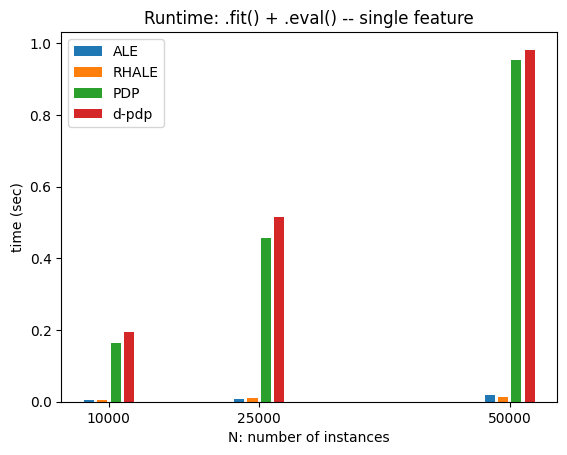
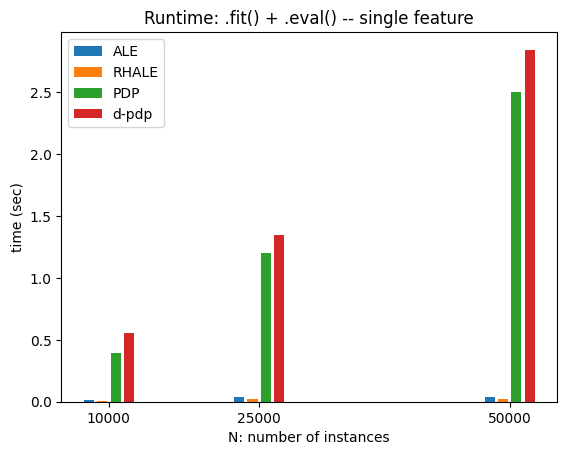
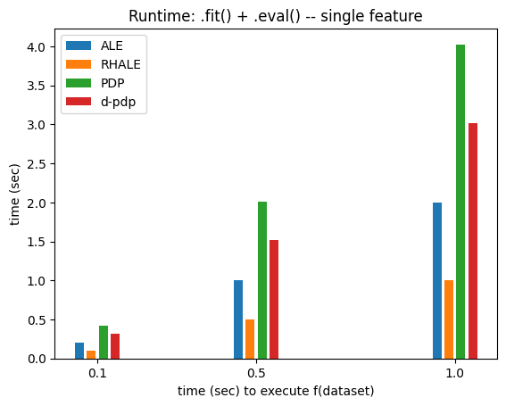
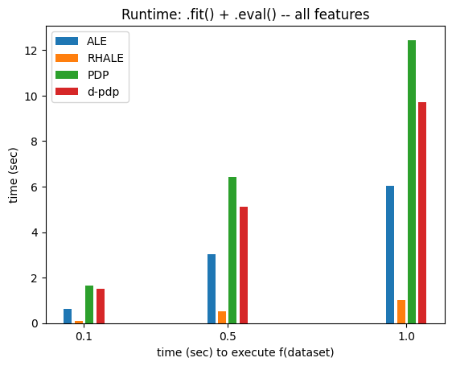
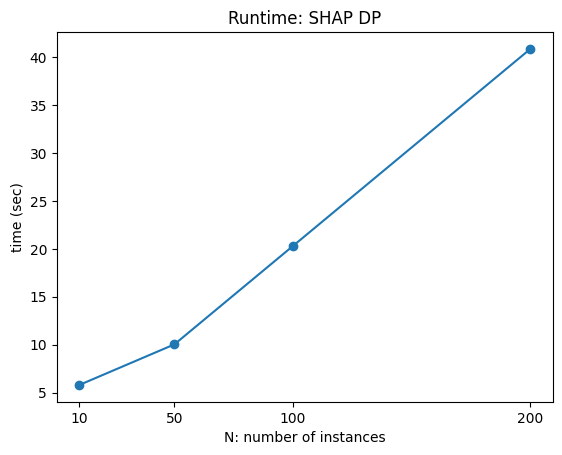
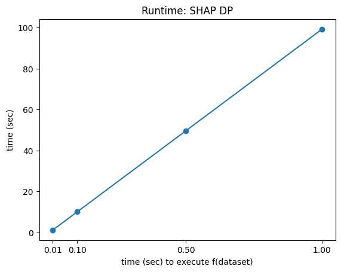

# Efficiency of global methods

- Author: [givasile](https://givasile.github.io/)
- Runtime: ~11 min (deliberate benchmark)
- Description: Benchmarks how the runtime of each global method (PDP, d-PDP,
  ALE, RHALE, SHAP-DP) scales with the number of instances $N$ and the cost
  of a model call $t_f$, ending with a summary cost table per method.


```python
import effector
import numpy as np
import timeit
import time
import matplotlib.pyplot as plt
np.random.seed(21)
```


```python
def return_predict(t):
    def predict(x):
        time.sleep(t)
        model = effector.models.DoubleConditionalInteraction()
        return model.predict(x)
    return predict

def return_jacobian(t):
    def jacobian(x):
        time.sleep(t)
        model = effector.models.DoubleConditionalInteraction()
        return model.jacobian(x)
    return jacobian
```


```python
def measure_time(method_name, features, model, N, M, D, repetitions, K, model_jac=None,):
    fit_time_list, eval_time_list = [], []
    X = np.random.uniform(-1, 1, (N, D))
    xx = np.linspace(-1, 1, M)
    axis_limits = np.array([[-1] * D, [1] * D])

    method_map = {
        "pdp": effector.PDP,
        "d_pdp": effector.DerPDP,
        "ale": effector.ALE,
        "rhale": effector.RHALE,
        "shap_dp": effector.ShapDP
    }

    for _ in range(repetitions):
        # general kwargs
        method_kwargs = {"data": X, "model": model, "axis_limits": axis_limits, "nof_instances": "all"}
        fit_kwargs = {"features": features, "centering": True, "points_for_centering": K}

        # specialize kwargs per method
        if method_name in ["d_pdp", "rhale"]:
            method_kwargs["model_jac"] = model_jac
        if method_name in ["rhale", "ale"]:
            fit_kwargs["binning_method"] = effector.axis_partitioning.Fixed(nof_bins=20)

        # init
        method = method_map[method_name](**method_kwargs)

        # fit
        tic = time.time()
        method.fit(**fit_kwargs)
        fit_time_list.append(time.time() - tic)

        # eval
        tic = time.time()
        for feat in features:
            method.eval(feature=feat, xs=xx, centering=True)
            method.eval_heter(feature=feat, xs=xx)
        eval_time_list.append(time.time() - tic)

    return {"fit": np.mean(fit_time_list), "eval": np.mean(eval_time_list), "total": (np.mean(fit_time_list) + np.mean(eval_time_list))}
```


```python
import matplotlib.pyplot as plt

def bar_plot(xs, time_dict, methods, metric, title, xlabel, ylabel, bar_width=0.02):

    bar_width = (np.max(xs) - np.min(xs)) / 40
    method_to_label = {"ale": "ALE", "rhale": "RHALE", "pdp": "PDP", "d_pdp": "d-pdp", "shap_dp": "SHAP DP"}
    plt.figure()
    
    # Calculate the offsets for each bar group
    offsets = np.linspace(-2*bar_width, 2*bar_width, len(methods))
    
    for i, method in enumerate(methods):
        label = method_to_label[method]
        plt.bar(
            xs + offsets[i],
            [tt[metric] for tt in time_dict[method]],
            label=label,
            width=bar_width
        )
    
    plt.title(title)
    plt.xlabel(xlabel)
    plt.ylabel(ylabel)
    plt.xticks(xs)
    plt.legend()
    plt.show()
```

## $T_1$: runtime vs N

### For one feature


```python
t = 0.001
N = 10_000
D = 3
K = 100
M = 100
repetitions = 2
features=[0]
```


```python
method_names = ["ale", "rhale", "pdp", "d_pdp"]
vec = np.array([10_000, 25_000, 50_000])
time_dict = {method_name: [] for method_name in method_names}
for N in vec:
    model = return_predict(t)
    model_jac = return_jacobian(t)
    for method_name in method_names:
        time_dict[method_name].append(measure_time(method_name, features, model, N, M, D, repetitions, K, model_jac=model_jac))
```


```python
for metric in ["total"]: # ["fit", "eval", "total"]:
    if metric in ["fit", "eval"]:
        title = "Runtime: ." + metric + "() -- single feature"
    else:
        title = "Runtime: .fit() + .eval() -- single feature"
    
    bar_plot(
        vec, 
        time_dict, 
        method_names,
        metric=metric,
        title=title,
        xlabel="N: number of instances",
        ylabel="time (sec)"
)
```


    

    


### For all features


```python
features=[i for i in range(D)]
method_names = ["ale", "rhale", "pdp", "d_pdp"]
vec = np.array([10_000, 25_000, 50_000])
time_dict = {method_name: [] for method_name in method_names}
for N in vec:
    model = return_predict(t)
    model_jac = return_jacobian(t)
    for method_name in method_names:
        time_dict[method_name].append(measure_time(method_name, features, model, N, M, D, repetitions, K, model_jac=model_jac))
```


```python
for metric in ["total"]: # ["fit", "eval", "total"]:
    if metric in ["fit", "eval"]:
        title = "Runtime: ." + metric + "() -- single feature"
    else:
        title = "Runtime: .fit() + .eval() -- single feature"
    
    bar_plot(
        vec, 
        time_dict, 
        method_names,
        metric=metric,
        title=title,
        xlabel="N: number of instances",
        ylabel="time (sec)"
)
```


    

    


### Conclusion

| Method        | `.fit()`     | `.eval()` | $T_1$ (single feature) | $T_1$ (all features)|
|--------------|-------------|-----------|----------------|-----------------------------------|
| **PDP / d-PDP** | $c_1 N$     | $c_2 N$    | $(c_1 + c_2) N$  | $D (c_1 + c_2) N$               |
| **ALE**       | $\epsilon$   | Free      | $\epsilon$       | $D \epsilon \approx 0$           |
| **RHALE**     | $\epsilon$   | Free      | $\epsilon$       | $D \epsilon \approx 0$           |

> Here, $c_1$ and $c_2$ are small but nonzero, meaning the runtime scales linearly with $N$ but remains low. In contrast, $\epsilon$ is extremely small, making ALE and RHALE effectively free in practice.  


## $T_2$: runtime vs. $t_f$:

To isolate the impact of $t_f$, we reduce $N$ to a small value. This assumes that the execution time of $f(X)$ remains constant regardless of the dataset size $X$. While this is not always true in general, it is a reasonable assumption for many ML models with vectorized implementations, as long as $f(X)$ can be computed in a single pass.

### For a single feature


```python
t = 0.001
N = 1_000
D = 3
K = 100
M = 100
repetitions = 2
features=[0]
```


```python
method_names = ["ale", "rhale", "pdp", "d_pdp"]
vec = np.array([.1, .5, 1.])
time_dict = {method_name: [] for method_name in method_names}
for t in vec:
    model = return_predict(t)
    model_jac = return_jacobian(t)
    for method_name in method_names:
        time_dict[method_name].append(measure_time(method_name, features, model, N, M, D, repetitions, K, model_jac=model_jac))
```


```python
for metric in ["total"]: # ["fit", "eval", "total"]:
    if metric in ["fit", "eval"]:
        title = "Runtime: ." + metric + "() -- single feature"
    else:
        title = "Runtime: .fit() + .eval() -- single feature"
    
    bar_plot(
        vec, 
        time_dict, 
        method_names,
        metric=metric,
        title=title,
        xlabel="time (sec) to execute f(dataset)",
        ylabel="time (sec)"
)
```


    

    


### For all features 


```python
t = 0.1
N = 10_000
D = 3
K = 100
M = 100
repetitions = 2

```


```python
features=[i for i in range(D)]
method_names = ["ale", "rhale", "pdp", "d_pdp"]
vec = np.array([.1, .5, 1.])
time_dict = {method_name: [] for method_name in method_names}
for t in vec:
    model = return_predict(t)
    model_jac = return_jacobian(t)
    for method_name in method_names:
        time_dict[method_name].append(measure_time(method_name, features, model, N, M, D, repetitions, K, model_jac=model_jac))
```


```python
for metric in ["total"]: #["fit", "eval", "total"]:
    if metric in ["fit", "eval"]:
        title = "Runtime: ." + metric + "() -- all features"
    else:
        title = "Runtime: .fit() + .eval() -- all features"
    
    bar_plot(
        vec, 
        time_dict, 
        method_names,
        metric=metric,
        title=title,
        xlabel="time (sec) to execute f(dataset)",
        ylabel="time (sec)"
)
```


    

    


### Conclusion


| Method        | `.fit()`     | `.eval()` | $T_2$ (one feature)  | $T_2$ (all features) |
|---------------|--------------|-----------------------|------------------------|------------------------------------|
| **PDP / d-PDP** | $t_f$       | $t_f$                | $2t_f$                 | $2Dt_f$                      |
| **ALE**       | $2t_f$       | Free                  | $2t_f$                 | $2Dt_f$                             |
| **RHALE**     | $t_f$        | Free                  | $t_f$                   | $t_f$                              |

## Total Runtime

Adding the two parts, we have the total runtime:

| Method          | $T = T_1 + T_2$ (one feature) | $T = T_1 + T_2$ (all features) |
|-----------------|-------------------------------|--------------------------------|
| **PDP / d-PDP** | $(c_1 + c_2) N + 2 t_f$       | $D (c_1 + c_2) N + 2 D t_f$    |
| **ALE**         | $2 t_f$                       | $2 D t_f$                      |
| **RHALE**       | $t_f$                         | $t_f$                          |

## SHAP-DP

SHAP-DP is a much slower method, compared to the others. Let's see how it scales with $N$ and $t_f$.


```python
t = 0.1
N = 10_000
D = 3
K = 100
M = 100
features = [0]
repetitions = 2
```


```python
method_names = ["shap_dp"]
vec = np.array([10, 50, 100, 200])
time_dict = {method_name: [] for method_name in method_names}
for N in vec:
    model = return_predict(t)
    model_jac = return_jacobian(t)
    for method_name in method_names:
        time_dict[method_name].append(
            measure_time(method_name, features, model, N, M, D, repetitions, K, model_jac=model_jac))
```

    
ExactExplainer explainer: 100%|██████████| 50/50 [00:00<?, ?it/s]

    
ExactExplainer explainer: 51it [00:10, 10.01s/it]                

    


    
ExactExplainer explainer: 100%|██████████| 50/50 [00:00<?, ?it/s]

    
ExactExplainer explainer: 51it [00:10, 10.04s/it]                

    


    
ExactExplainer explainer:  50%|█████     | 50/100 [00:00<?, ?it/s]

    
ExactExplainer explainer:  52%|█████▏    | 52/100 [00:10<00:04,  9.82it/s]

    
ExactExplainer explainer:  53%|█████▎    | 53/100 [00:10<00:06,  6.95it/s]

    
ExactExplainer explainer:  54%|█████▍    | 54/100 [00:10<00:07,  6.01it/s]

    
ExactExplainer explainer:  55%|█████▌    | 55/100 [00:10<00:08,  5.54it/s]

    
ExactExplainer explainer:  56%|█████▌    | 56/100 [00:11<00:08,  5.31it/s]

    
ExactExplainer explainer:  57%|█████▋    | 57/100 [00:11<00:08,  5.18it/s]

    
ExactExplainer explainer:  58%|█████▊    | 58/100 [00:11<00:08,  5.10it/s]

    
ExactExplainer explainer:  59%|█████▉    | 59/100 [00:11<00:08,  5.04it/s]

    
ExactExplainer explainer:  60%|██████    | 60/100 [00:11<00:08,  5.00it/s]

    
ExactExplainer explainer:  61%|██████    | 61/100 [00:12<00:07,  4.96it/s]

    
ExactExplainer explainer:  62%|██████▏   | 62/100 [00:12<00:07,  4.92it/s]

    
ExactExplainer explainer:  63%|██████▎   | 63/100 [00:12<00:07,  4.91it/s]

    
ExactExplainer explainer:  64%|██████▍   | 64/100 [00:12<00:07,  4.88it/s]

    
ExactExplainer explainer:  65%|██████▌   | 65/100 [00:12<00:07,  4.86it/s]

    
ExactExplainer explainer:  66%|██████▌   | 66/100 [00:13<00:06,  4.87it/s]

    
ExactExplainer explainer:  67%|██████▋   | 67/100 [00:13<00:06,  4.86it/s]

    
ExactExplainer explainer:  68%|██████▊   | 68/100 [00:13<00:06,  4.89it/s]

    
ExactExplainer explainer:  69%|██████▉   | 69/100 [00:13<00:06,  4.90it/s]

    
ExactExplainer explainer:  70%|███████   | 70/100 [00:13<00:06,  4.91it/s]

    
ExactExplainer explainer:  71%|███████   | 71/100 [00:14<00:05,  4.91it/s]

    
ExactExplainer explainer:  72%|███████▏  | 72/100 [00:14<00:05,  4.89it/s]

    
ExactExplainer explainer:  73%|███████▎  | 73/100 [00:14<00:05,  4.89it/s]

    
ExactExplainer explainer:  74%|███████▍  | 74/100 [00:14<00:05,  4.88it/s]

    
ExactExplainer explainer:  75%|███████▌  | 75/100 [00:14<00:05,  4.90it/s]

    
ExactExplainer explainer:  76%|███████▌  | 76/100 [00:15<00:04,  4.91it/s]

    
ExactExplainer explainer:  77%|███████▋  | 77/100 [00:15<00:04,  4.91it/s]

    
ExactExplainer explainer:  78%|███████▊  | 78/100 [00:15<00:04,  4.92it/s]

    
ExactExplainer explainer:  79%|███████▉  | 79/100 [00:15<00:04,  4.92it/s]

    
ExactExplainer explainer:  80%|████████  | 80/100 [00:15<00:04,  4.92it/s]

    
ExactExplainer explainer:  81%|████████  | 81/100 [00:16<00:03,  4.93it/s]

    
ExactExplainer explainer:  82%|████████▏ | 82/100 [00:16<00:03,  4.93it/s]

    
ExactExplainer explainer:  83%|████████▎ | 83/100 [00:16<00:03,  4.93it/s]

    
ExactExplainer explainer:  84%|████████▍ | 84/100 [00:16<00:03,  4.93it/s]

    
ExactExplainer explainer:  85%|████████▌ | 85/100 [00:17<00:03,  4.91it/s]

    
ExactExplainer explainer:  86%|████████▌ | 86/100 [00:17<00:02,  4.91it/s]

    
ExactExplainer explainer:  87%|████████▋ | 87/100 [00:17<00:02,  4.90it/s]

    
ExactExplainer explainer:  88%|████████▊ | 88/100 [00:17<00:02,  4.91it/s]

    
ExactExplainer explainer:  89%|████████▉ | 89/100 [00:17<00:02,  4.92it/s]

    
ExactExplainer explainer:  90%|█████████ | 90/100 [00:18<00:02,  4.92it/s]

    
ExactExplainer explainer:  91%|█████████ | 91/100 [00:18<00:01,  4.89it/s]

    
ExactExplainer explainer:  92%|█████████▏| 92/100 [00:18<00:01,  4.87it/s]

    
ExactExplainer explainer:  93%|█████████▎| 93/100 [00:18<00:01,  4.89it/s]

    
ExactExplainer explainer:  94%|█████████▍| 94/100 [00:18<00:01,  4.89it/s]

    
ExactExplainer explainer:  95%|█████████▌| 95/100 [00:19<00:01,  4.90it/s]

    
ExactExplainer explainer:  96%|█████████▌| 96/100 [00:19<00:00,  4.90it/s]

    
ExactExplainer explainer:  97%|█████████▋| 97/100 [00:19<00:00,  4.88it/s]

    
ExactExplainer explainer:  98%|█████████▊| 98/100 [00:19<00:00,  4.88it/s]

    
ExactExplainer explainer:  99%|█████████▉| 99/100 [00:19<00:00,  4.88it/s]

    
ExactExplainer explainer: 100%|██████████| 100/100 [00:20<00:00,  4.89it/s]

    
ExactExplainer explainer: 101it [00:20,  4.89it/s]                         

    
ExactExplainer explainer: 101it [00:20,  2.51it/s]

    


    
ExactExplainer explainer:  50%|█████     | 50/100 [00:00<?, ?it/s]

    
ExactExplainer explainer:  52%|█████▏    | 52/100 [00:10<00:04,  9.82it/s]

    
ExactExplainer explainer:  53%|█████▎    | 53/100 [00:10<00:06,  6.84it/s]

    
ExactExplainer explainer:  54%|█████▍    | 54/100 [00:10<00:07,  5.93it/s]

    
ExactExplainer explainer:  55%|█████▌    | 55/100 [00:10<00:08,  5.52it/s]

    
ExactExplainer explainer:  56%|█████▌    | 56/100 [00:11<00:08,  5.27it/s]

    
ExactExplainer explainer:  57%|█████▋    | 57/100 [00:11<00:08,  5.13it/s]

    
ExactExplainer explainer:  58%|█████▊    | 58/100 [00:11<00:08,  5.04it/s]

    
ExactExplainer explainer:  59%|█████▉    | 59/100 [00:11<00:08,  5.00it/s]

    
ExactExplainer explainer:  60%|██████    | 60/100 [00:11<00:08,  4.98it/s]

    
ExactExplainer explainer:  61%|██████    | 61/100 [00:12<00:07,  4.93it/s]

    
ExactExplainer explainer:  62%|██████▏   | 62/100 [00:12<00:07,  4.93it/s]

    
ExactExplainer explainer:  63%|██████▎   | 63/100 [00:12<00:07,  4.92it/s]

    
ExactExplainer explainer:  64%|██████▍   | 64/100 [00:12<00:07,  4.90it/s]

    
ExactExplainer explainer:  65%|██████▌   | 65/100 [00:12<00:07,  4.90it/s]

    
ExactExplainer explainer:  66%|██████▌   | 66/100 [00:13<00:06,  4.88it/s]

    
ExactExplainer explainer:  67%|██████▋   | 67/100 [00:13<00:06,  4.87it/s]

    
ExactExplainer explainer:  68%|██████▊   | 68/100 [00:13<00:06,  4.88it/s]

    
ExactExplainer explainer:  69%|██████▉   | 69/100 [00:13<00:06,  4.88it/s]

    
ExactExplainer explainer:  70%|███████   | 70/100 [00:13<00:06,  4.89it/s]

    
ExactExplainer explainer:  71%|███████   | 71/100 [00:14<00:05,  4.87it/s]

    
ExactExplainer explainer:  72%|███████▏  | 72/100 [00:14<00:05,  4.85it/s]

    
ExactExplainer explainer:  73%|███████▎  | 73/100 [00:14<00:05,  4.86it/s]

    
ExactExplainer explainer:  74%|███████▍  | 74/100 [00:14<00:05,  4.88it/s]

    
ExactExplainer explainer:  75%|███████▌  | 75/100 [00:14<00:05,  4.88it/s]

    
ExactExplainer explainer:  76%|███████▌  | 76/100 [00:15<00:04,  4.87it/s]

    
ExactExplainer explainer:  77%|███████▋  | 77/100 [00:15<00:04,  4.84it/s]

    
ExactExplainer explainer:  78%|███████▊  | 78/100 [00:15<00:04,  4.85it/s]

    
ExactExplainer explainer:  79%|███████▉  | 79/100 [00:15<00:04,  4.86it/s]

    
ExactExplainer explainer:  80%|████████  | 80/100 [00:15<00:04,  4.87it/s]

    
ExactExplainer explainer:  81%|████████  | 81/100 [00:16<00:03,  4.87it/s]

    
ExactExplainer explainer:  82%|████████▏ | 82/100 [00:16<00:03,  4.86it/s]

    
ExactExplainer explainer:  83%|████████▎ | 83/100 [00:16<00:03,  4.87it/s]

    
ExactExplainer explainer:  84%|████████▍ | 84/100 [00:16<00:03,  4.87it/s]

    
ExactExplainer explainer:  85%|████████▌ | 85/100 [00:17<00:03,  4.86it/s]

    
ExactExplainer explainer:  86%|████████▌ | 86/100 [00:17<00:02,  4.86it/s]

    
ExactExplainer explainer:  87%|████████▋ | 87/100 [00:17<00:02,  4.87it/s]

    
ExactExplainer explainer:  88%|████████▊ | 88/100 [00:17<00:02,  4.85it/s]

    
ExactExplainer explainer:  89%|████████▉ | 89/100 [00:17<00:02,  4.87it/s]

    
ExactExplainer explainer:  90%|█████████ | 90/100 [00:18<00:02,  4.88it/s]

    
ExactExplainer explainer:  91%|█████████ | 91/100 [00:18<00:01,  4.86it/s]

    
ExactExplainer explainer:  92%|█████████▏| 92/100 [00:18<00:01,  4.87it/s]

    
ExactExplainer explainer:  93%|█████████▎| 93/100 [00:18<00:01,  4.88it/s]

    
ExactExplainer explainer:  94%|█████████▍| 94/100 [00:18<00:01,  4.86it/s]

    
ExactExplainer explainer:  95%|█████████▌| 95/100 [00:19<00:01,  4.85it/s]

    
ExactExplainer explainer:  96%|█████████▌| 96/100 [00:19<00:00,  4.86it/s]

    
ExactExplainer explainer:  97%|█████████▋| 97/100 [00:19<00:00,  4.85it/s]

    
ExactExplainer explainer:  98%|█████████▊| 98/100 [00:19<00:00,  4.87it/s]

    
ExactExplainer explainer:  99%|█████████▉| 99/100 [00:19<00:00,  4.88it/s]

    
ExactExplainer explainer: 100%|██████████| 100/100 [00:20<00:00,  4.89it/s]

    
ExactExplainer explainer: 101it [00:20,  4.88it/s]                         

    
ExactExplainer explainer: 101it [00:20,  2.51it/s]

    


    
ExactExplainer explainer:  25%|██▌       | 50/200 [00:00<?, ?it/s]

    
ExactExplainer explainer:  26%|██▌       | 52/200 [00:10<00:14,  9.90it/s]

    
ExactExplainer explainer:  26%|██▋       | 53/200 [00:10<00:21,  6.94it/s]

    
ExactExplainer explainer:  27%|██▋       | 54/200 [00:10<00:24,  5.98it/s]

    
ExactExplainer explainer:  28%|██▊       | 55/200 [00:10<00:26,  5.57it/s]

    
ExactExplainer explainer:  28%|██▊       | 56/200 [00:11<00:26,  5.35it/s]

    
ExactExplainer explainer:  28%|██▊       | 57/200 [00:11<00:27,  5.20it/s]

    
ExactExplainer explainer:  29%|██▉       | 58/200 [00:11<00:28,  5.05it/s]

    
ExactExplainer explainer:  30%|██▉       | 59/200 [00:11<00:28,  4.91it/s]

    
ExactExplainer explainer:  30%|███       | 60/200 [00:11<00:28,  4.88it/s]

    
ExactExplainer explainer:  30%|███       | 61/200 [00:12<00:28,  4.89it/s]

    
ExactExplainer explainer:  31%|███       | 62/200 [00:12<00:28,  4.87it/s]

    
ExactExplainer explainer:  32%|███▏      | 63/200 [00:12<00:28,  4.87it/s]

    
ExactExplainer explainer:  32%|███▏      | 64/200 [00:12<00:27,  4.89it/s]

    
ExactExplainer explainer:  32%|███▎      | 65/200 [00:12<00:27,  4.88it/s]

    
ExactExplainer explainer:  33%|███▎      | 66/200 [00:13<00:27,  4.89it/s]

    
ExactExplainer explainer:  34%|███▎      | 67/200 [00:13<00:27,  4.90it/s]

    
ExactExplainer explainer:  34%|███▍      | 68/200 [00:13<00:27,  4.87it/s]

    
ExactExplainer explainer:  34%|███▍      | 69/200 [00:13<00:26,  4.86it/s]

    
ExactExplainer explainer:  35%|███▌      | 70/200 [00:13<00:26,  4.86it/s]

    
ExactExplainer explainer:  36%|███▌      | 71/200 [00:14<00:26,  4.89it/s]

    
ExactExplainer explainer:  36%|███▌      | 72/200 [00:14<00:26,  4.90it/s]

    
ExactExplainer explainer:  36%|███▋      | 73/200 [00:14<00:25,  4.90it/s]

    
ExactExplainer explainer:  37%|███▋      | 74/200 [00:14<00:25,  4.89it/s]

    
ExactExplainer explainer:  38%|███▊      | 75/200 [00:14<00:25,  4.90it/s]

    
ExactExplainer explainer:  38%|███▊      | 76/200 [00:15<00:25,  4.91it/s]

    
ExactExplainer explainer:  38%|███▊      | 77/200 [00:15<00:25,  4.92it/s]

    
ExactExplainer explainer:  39%|███▉      | 78/200 [00:15<00:24,  4.91it/s]

    
ExactExplainer explainer:  40%|███▉      | 79/200 [00:15<00:24,  4.92it/s]

    
ExactExplainer explainer:  40%|████      | 80/200 [00:15<00:24,  4.91it/s]

    
ExactExplainer explainer:  40%|████      | 81/200 [00:16<00:24,  4.90it/s]

    
ExactExplainer explainer:  41%|████      | 82/200 [00:16<00:24,  4.91it/s]

    
ExactExplainer explainer:  42%|████▏     | 83/200 [00:16<00:23,  4.92it/s]

    
ExactExplainer explainer:  42%|████▏     | 84/200 [00:16<00:23,  4.93it/s]

    
ExactExplainer explainer:  42%|████▎     | 85/200 [00:17<00:23,  4.94it/s]

    
ExactExplainer explainer:  43%|████▎     | 86/200 [00:17<00:23,  4.94it/s]

    
ExactExplainer explainer:  44%|████▎     | 87/200 [00:17<00:22,  4.94it/s]

    
ExactExplainer explainer:  44%|████▍     | 88/200 [00:17<00:22,  4.94it/s]

    
ExactExplainer explainer:  44%|████▍     | 89/200 [00:17<00:22,  4.93it/s]

    
ExactExplainer explainer:  45%|████▌     | 90/200 [00:18<00:22,  4.89it/s]

    
ExactExplainer explainer:  46%|████▌     | 91/200 [00:18<00:22,  4.89it/s]

    
ExactExplainer explainer:  46%|████▌     | 92/200 [00:18<00:22,  4.89it/s]

    
ExactExplainer explainer:  46%|████▋     | 93/200 [00:18<00:21,  4.89it/s]

    
ExactExplainer explainer:  47%|████▋     | 94/200 [00:18<00:21,  4.88it/s]

    
ExactExplainer explainer:  48%|████▊     | 95/200 [00:19<00:21,  4.86it/s]

    
ExactExplainer explainer:  48%|████▊     | 96/200 [00:19<00:21,  4.88it/s]

    
ExactExplainer explainer:  48%|████▊     | 97/200 [00:19<00:21,  4.88it/s]

    
ExactExplainer explainer:  49%|████▉     | 98/200 [00:19<00:20,  4.87it/s]

    
ExactExplainer explainer:  50%|████▉     | 99/200 [00:19<00:20,  4.85it/s]

    
ExactExplainer explainer:  50%|█████     | 100/200 [00:20<00:20,  4.86it/s]

    
ExactExplainer explainer:  50%|█████     | 101/200 [00:20<00:20,  4.85it/s]

    
ExactExplainer explainer:  51%|█████     | 102/200 [00:20<00:20,  4.85it/s]

    
ExactExplainer explainer:  52%|█████▏    | 103/200 [00:20<00:19,  4.86it/s]

    
ExactExplainer explainer:  52%|█████▏    | 104/200 [00:20<00:19,  4.84it/s]

    
ExactExplainer explainer:  52%|█████▎    | 105/200 [00:21<00:19,  4.86it/s]

    
ExactExplainer explainer:  53%|█████▎    | 106/200 [00:21<00:19,  4.88it/s]

    
ExactExplainer explainer:  54%|█████▎    | 107/200 [00:21<00:19,  4.89it/s]

    
ExactExplainer explainer:  54%|█████▍    | 108/200 [00:21<00:18,  4.89it/s]

    
ExactExplainer explainer:  55%|█████▍    | 109/200 [00:21<00:18,  4.89it/s]

    
ExactExplainer explainer:  55%|█████▌    | 110/200 [00:22<00:18,  4.88it/s]

    
ExactExplainer explainer:  56%|█████▌    | 111/200 [00:22<00:18,  4.88it/s]

    
ExactExplainer explainer:  56%|█████▌    | 112/200 [00:22<00:18,  4.87it/s]

    
ExactExplainer explainer:  56%|█████▋    | 113/200 [00:22<00:17,  4.86it/s]

    
ExactExplainer explainer:  57%|█████▋    | 114/200 [00:22<00:17,  4.85it/s]

    
ExactExplainer explainer:  57%|█████▊    | 115/200 [00:23<00:17,  4.86it/s]

    
ExactExplainer explainer:  58%|█████▊    | 116/200 [00:23<00:17,  4.87it/s]

    
ExactExplainer explainer:  58%|█████▊    | 117/200 [00:23<00:17,  4.86it/s]

    
ExactExplainer explainer:  59%|█████▉    | 118/200 [00:23<00:16,  4.88it/s]

    
ExactExplainer explainer:  60%|█████▉    | 119/200 [00:23<00:16,  4.89it/s]

    
ExactExplainer explainer:  60%|██████    | 120/200 [00:24<00:16,  4.89it/s]

    
ExactExplainer explainer:  60%|██████    | 121/200 [00:24<00:16,  4.90it/s]

    
ExactExplainer explainer:  61%|██████    | 122/200 [00:24<00:15,  4.91it/s]

    
ExactExplainer explainer:  62%|██████▏   | 123/200 [00:24<00:15,  4.91it/s]

    
ExactExplainer explainer:  62%|██████▏   | 124/200 [00:24<00:15,  4.92it/s]

    
ExactExplainer explainer:  62%|██████▎   | 125/200 [00:25<00:15,  4.92it/s]

    
ExactExplainer explainer:  63%|██████▎   | 126/200 [00:25<00:15,  4.92it/s]

    
ExactExplainer explainer:  64%|██████▎   | 127/200 [00:25<00:14,  4.92it/s]

    
ExactExplainer explainer:  64%|██████▍   | 128/200 [00:25<00:14,  4.91it/s]

    
ExactExplainer explainer:  64%|██████▍   | 129/200 [00:26<00:14,  4.91it/s]

    
ExactExplainer explainer:  65%|██████▌   | 130/200 [00:26<00:14,  4.89it/s]

    
ExactExplainer explainer:  66%|██████▌   | 131/200 [00:26<00:14,  4.90it/s]

    
ExactExplainer explainer:  66%|██████▌   | 132/200 [00:26<00:13,  4.87it/s]

    
ExactExplainer explainer:  66%|██████▋   | 133/200 [00:26<00:13,  4.88it/s]

    
ExactExplainer explainer:  67%|██████▋   | 134/200 [00:27<00:13,  4.90it/s]

    
ExactExplainer explainer:  68%|██████▊   | 135/200 [00:27<00:13,  4.89it/s]

    
ExactExplainer explainer:  68%|██████▊   | 136/200 [00:27<00:13,  4.86it/s]

    
ExactExplainer explainer:  68%|██████▊   | 137/200 [00:27<00:12,  4.88it/s]

    
ExactExplainer explainer:  69%|██████▉   | 138/200 [00:27<00:12,  4.87it/s]

    
ExactExplainer explainer:  70%|██████▉   | 139/200 [00:28<00:12,  4.84it/s]

    
ExactExplainer explainer:  70%|███████   | 140/200 [00:28<00:12,  4.87it/s]

    
ExactExplainer explainer:  70%|███████   | 141/200 [00:28<00:12,  4.89it/s]

    
ExactExplainer explainer:  71%|███████   | 142/200 [00:28<00:11,  4.90it/s]

    
ExactExplainer explainer:  72%|███████▏  | 143/200 [00:28<00:11,  4.92it/s]

    
ExactExplainer explainer:  72%|███████▏  | 144/200 [00:29<00:11,  4.92it/s]

    
ExactExplainer explainer:  72%|███████▎  | 145/200 [00:29<00:11,  4.93it/s]

    
ExactExplainer explainer:  73%|███████▎  | 146/200 [00:29<00:10,  4.93it/s]

    
ExactExplainer explainer:  74%|███████▎  | 147/200 [00:29<00:10,  4.91it/s]

    
ExactExplainer explainer:  74%|███████▍  | 148/200 [00:29<00:10,  4.91it/s]

    
ExactExplainer explainer:  74%|███████▍  | 149/200 [00:30<00:10,  4.91it/s]

    
ExactExplainer explainer:  75%|███████▌  | 150/200 [00:30<00:10,  4.89it/s]

    
ExactExplainer explainer:  76%|███████▌  | 151/200 [00:30<00:10,  4.89it/s]

    
ExactExplainer explainer:  76%|███████▌  | 152/200 [00:30<00:09,  4.89it/s]

    
ExactExplainer explainer:  76%|███████▋  | 153/200 [00:30<00:09,  4.87it/s]

    
ExactExplainer explainer:  77%|███████▋  | 154/200 [00:31<00:09,  4.87it/s]

    
ExactExplainer explainer:  78%|███████▊  | 155/200 [00:31<00:09,  4.86it/s]

    
ExactExplainer explainer:  78%|███████▊  | 156/200 [00:31<00:09,  4.88it/s]

    
ExactExplainer explainer:  78%|███████▊  | 157/200 [00:31<00:08,  4.88it/s]

    
ExactExplainer explainer:  79%|███████▉  | 158/200 [00:31<00:08,  4.87it/s]

    
ExactExplainer explainer:  80%|███████▉  | 159/200 [00:32<00:08,  4.86it/s]

    
ExactExplainer explainer:  80%|████████  | 160/200 [00:32<00:08,  4.87it/s]

    
ExactExplainer explainer:  80%|████████  | 161/200 [00:32<00:08,  4.85it/s]

    
ExactExplainer explainer:  81%|████████  | 162/200 [00:32<00:07,  4.84it/s]

    
ExactExplainer explainer:  82%|████████▏ | 163/200 [00:32<00:07,  4.86it/s]

    
ExactExplainer explainer:  82%|████████▏ | 164/200 [00:33<00:07,  4.87it/s]

    
ExactExplainer explainer:  82%|████████▎ | 165/200 [00:33<00:07,  4.86it/s]

    
ExactExplainer explainer:  83%|████████▎ | 166/200 [00:33<00:06,  4.88it/s]

    
ExactExplainer explainer:  84%|████████▎ | 167/200 [00:33<00:06,  4.85it/s]

    
ExactExplainer explainer:  84%|████████▍ | 168/200 [00:34<00:06,  4.84it/s]

    
ExactExplainer explainer:  84%|████████▍ | 169/200 [00:34<00:06,  4.84it/s]

    
ExactExplainer explainer:  85%|████████▌ | 170/200 [00:34<00:06,  4.87it/s]

    
ExactExplainer explainer:  86%|████████▌ | 171/200 [00:34<00:05,  4.89it/s]

    
ExactExplainer explainer:  86%|████████▌ | 172/200 [00:34<00:05,  4.91it/s]

    
ExactExplainer explainer:  86%|████████▋ | 173/200 [00:35<00:05,  4.92it/s]

    
ExactExplainer explainer:  87%|████████▋ | 174/200 [00:35<00:05,  4.92it/s]

    
ExactExplainer explainer:  88%|████████▊ | 175/200 [00:35<00:05,  4.92it/s]

    
ExactExplainer explainer:  88%|████████▊ | 176/200 [00:35<00:04,  4.93it/s]

    
ExactExplainer explainer:  88%|████████▊ | 177/200 [00:35<00:04,  4.93it/s]

    
ExactExplainer explainer:  89%|████████▉ | 178/200 [00:36<00:04,  4.92it/s]

    
ExactExplainer explainer:  90%|████████▉ | 179/200 [00:36<00:04,  4.92it/s]

    
ExactExplainer explainer:  90%|█████████ | 180/200 [00:36<00:04,  4.91it/s]

    
ExactExplainer explainer:  90%|█████████ | 181/200 [00:36<00:03,  4.88it/s]

    
ExactExplainer explainer:  91%|█████████ | 182/200 [00:36<00:03,  4.90it/s]

    
ExactExplainer explainer:  92%|█████████▏| 183/200 [00:37<00:03,  4.91it/s]

    
ExactExplainer explainer:  92%|█████████▏| 184/200 [00:37<00:03,  4.91it/s]

    
ExactExplainer explainer:  92%|█████████▎| 185/200 [00:37<00:03,  4.92it/s]

    
ExactExplainer explainer:  93%|█████████▎| 186/200 [00:37<00:02,  4.92it/s]

    
ExactExplainer explainer:  94%|█████████▎| 187/200 [00:37<00:02,  4.91it/s]

    
ExactExplainer explainer:  94%|█████████▍| 188/200 [00:38<00:02,  4.89it/s]

    
ExactExplainer explainer:  94%|█████████▍| 189/200 [00:38<00:02,  4.90it/s]

    
ExactExplainer explainer:  95%|█████████▌| 190/200 [00:38<00:02,  4.91it/s]

    
ExactExplainer explainer:  96%|█████████▌| 191/200 [00:38<00:01,  4.92it/s]

    
ExactExplainer explainer:  96%|█████████▌| 192/200 [00:38<00:01,  4.91it/s]

    
ExactExplainer explainer:  96%|█████████▋| 193/200 [00:39<00:01,  4.91it/s]

    
ExactExplainer explainer:  97%|█████████▋| 194/200 [00:39<00:01,  4.89it/s]

    
ExactExplainer explainer:  98%|█████████▊| 195/200 [00:39<00:01,  4.89it/s]

    
ExactExplainer explainer:  98%|█████████▊| 196/200 [00:39<00:00,  4.88it/s]

    
ExactExplainer explainer:  98%|█████████▊| 197/200 [00:39<00:00,  4.85it/s]

    
ExactExplainer explainer:  99%|█████████▉| 198/200 [00:40<00:00,  4.85it/s]

    
ExactExplainer explainer: 100%|█████████▉| 199/200 [00:40<00:00,  4.87it/s]

    
ExactExplainer explainer: 100%|██████████| 200/200 [00:40<00:00,  4.88it/s]

    
ExactExplainer explainer: 201it [00:40,  4.86it/s]                         

    
ExactExplainer explainer: 201it [00:40,  3.71it/s]

    


    
ExactExplainer explainer:  25%|██▌       | 50/200 [00:00<?, ?it/s]

    
ExactExplainer explainer:  26%|██▌       | 52/200 [00:10<00:15,  9.78it/s]

    
ExactExplainer explainer:  26%|██▋       | 53/200 [00:10<00:21,  6.90it/s]

    
ExactExplainer explainer:  27%|██▋       | 54/200 [00:10<00:24,  5.95it/s]

    
ExactExplainer explainer:  28%|██▊       | 55/200 [00:10<00:26,  5.53it/s]

    
ExactExplainer explainer:  28%|██▊       | 56/200 [00:11<00:27,  5.29it/s]

    
ExactExplainer explainer:  28%|██▊       | 57/200 [00:11<00:27,  5.14it/s]

    
ExactExplainer explainer:  29%|██▉       | 58/200 [00:11<00:28,  5.06it/s]

    
ExactExplainer explainer:  30%|██▉       | 59/200 [00:11<00:28,  4.99it/s]

    
ExactExplainer explainer:  30%|███       | 60/200 [00:11<00:28,  4.95it/s]

    
ExactExplainer explainer:  30%|███       | 61/200 [00:12<00:28,  4.94it/s]

    
ExactExplainer explainer:  31%|███       | 62/200 [00:12<00:28,  4.92it/s]

    
ExactExplainer explainer:  32%|███▏      | 63/200 [00:12<00:28,  4.89it/s]

    
ExactExplainer explainer:  32%|███▏      | 64/200 [00:12<00:27,  4.89it/s]

    
ExactExplainer explainer:  32%|███▎      | 65/200 [00:12<00:27,  4.89it/s]

    
ExactExplainer explainer:  33%|███▎      | 66/200 [00:13<00:27,  4.90it/s]

    
ExactExplainer explainer:  34%|███▎      | 67/200 [00:13<00:27,  4.90it/s]

    
ExactExplainer explainer:  34%|███▍      | 68/200 [00:13<00:27,  4.87it/s]

    
ExactExplainer explainer:  34%|███▍      | 69/200 [00:13<00:26,  4.88it/s]

    
ExactExplainer explainer:  35%|███▌      | 70/200 [00:13<00:26,  4.87it/s]

    
ExactExplainer explainer:  36%|███▌      | 71/200 [00:14<00:26,  4.88it/s]

    
ExactExplainer explainer:  36%|███▌      | 72/200 [00:14<00:26,  4.86it/s]

    
ExactExplainer explainer:  36%|███▋      | 73/200 [00:14<00:26,  4.85it/s]

    
ExactExplainer explainer:  37%|███▋      | 74/200 [00:14<00:25,  4.85it/s]

    
ExactExplainer explainer:  38%|███▊      | 75/200 [00:14<00:25,  4.84it/s]

    
ExactExplainer explainer:  38%|███▊      | 76/200 [00:15<00:25,  4.86it/s]

    
ExactExplainer explainer:  38%|███▊      | 77/200 [00:15<00:25,  4.87it/s]

    
ExactExplainer explainer:  39%|███▉      | 78/200 [00:15<00:25,  4.85it/s]

    
ExactExplainer explainer:  40%|███▉      | 79/200 [00:15<00:24,  4.86it/s]

    
ExactExplainer explainer:  40%|████      | 80/200 [00:16<00:24,  4.85it/s]

    
ExactExplainer explainer:  40%|████      | 81/200 [00:16<00:24,  4.87it/s]

    
ExactExplainer explainer:  41%|████      | 82/200 [00:16<00:24,  4.86it/s]

    
ExactExplainer explainer:  42%|████▏     | 83/200 [00:16<00:24,  4.86it/s]

    
ExactExplainer explainer:  42%|████▏     | 84/200 [00:16<00:23,  4.85it/s]

    
ExactExplainer explainer:  42%|████▎     | 85/200 [00:17<00:23,  4.87it/s]

    
ExactExplainer explainer:  43%|████▎     | 86/200 [00:17<00:23,  4.88it/s]

    
ExactExplainer explainer:  44%|████▎     | 87/200 [00:17<00:23,  4.85it/s]

    
ExactExplainer explainer:  44%|████▍     | 88/200 [00:17<00:23,  4.84it/s]

    
ExactExplainer explainer:  44%|████▍     | 89/200 [00:17<00:22,  4.86it/s]

    
ExactExplainer explainer:  45%|████▌     | 90/200 [00:18<00:22,  4.84it/s]

    
ExactExplainer explainer:  46%|████▌     | 91/200 [00:18<00:22,  4.86it/s]

    
ExactExplainer explainer:  46%|████▌     | 92/200 [00:18<00:22,  4.85it/s]

    
ExactExplainer explainer:  46%|████▋     | 93/200 [00:18<00:22,  4.85it/s]

    
ExactExplainer explainer:  47%|████▋     | 94/200 [00:18<00:21,  4.87it/s]

    
ExactExplainer explainer:  48%|████▊     | 95/200 [00:19<00:21,  4.86it/s]

    
ExactExplainer explainer:  48%|████▊     | 96/200 [00:19<00:21,  4.88it/s]

    
ExactExplainer explainer:  48%|████▊     | 97/200 [00:19<00:21,  4.88it/s]

    
ExactExplainer explainer:  49%|████▉     | 98/200 [00:19<00:20,  4.88it/s]

    
ExactExplainer explainer:  50%|████▉     | 99/200 [00:19<00:20,  4.88it/s]

    
ExactExplainer explainer:  50%|█████     | 100/200 [00:20<00:20,  4.88it/s]

    
ExactExplainer explainer:  50%|█████     | 101/200 [00:20<00:20,  4.87it/s]

    
ExactExplainer explainer:  51%|█████     | 102/200 [00:20<00:20,  4.85it/s]

    
ExactExplainer explainer:  52%|█████▏    | 103/200 [00:20<00:19,  4.86it/s]

    
ExactExplainer explainer:  52%|█████▏    | 104/200 [00:20<00:19,  4.87it/s]

    
ExactExplainer explainer:  52%|█████▎    | 105/200 [00:21<00:19,  4.85it/s]

    
ExactExplainer explainer:  53%|█████▎    | 106/200 [00:21<00:19,  4.84it/s]

    
ExactExplainer explainer:  54%|█████▎    | 107/200 [00:21<00:19,  4.83it/s]

    
ExactExplainer explainer:  54%|█████▍    | 108/200 [00:21<00:19,  4.83it/s]

    
ExactExplainer explainer:  55%|█████▍    | 109/200 [00:21<00:18,  4.85it/s]

    
ExactExplainer explainer:  55%|█████▌    | 110/200 [00:22<00:18,  4.85it/s]

    
ExactExplainer explainer:  56%|█████▌    | 111/200 [00:22<00:18,  4.87it/s]

    
ExactExplainer explainer:  56%|█████▌    | 112/200 [00:22<00:18,  4.86it/s]

    
ExactExplainer explainer:  56%|█████▋    | 113/200 [00:22<00:17,  4.85it/s]

    
ExactExplainer explainer:  57%|█████▋    | 114/200 [00:23<00:17,  4.85it/s]

    
ExactExplainer explainer:  57%|█████▊    | 115/200 [00:23<00:17,  4.84it/s]

    
ExactExplainer explainer:  58%|█████▊    | 116/200 [00:23<00:17,  4.86it/s]

    
ExactExplainer explainer:  58%|█████▊    | 117/200 [00:23<00:16,  4.89it/s]

    
ExactExplainer explainer:  59%|█████▉    | 118/200 [00:23<00:16,  4.89it/s]

    
ExactExplainer explainer:  60%|█████▉    | 119/200 [00:24<00:16,  4.90it/s]

    
ExactExplainer explainer:  60%|██████    | 120/200 [00:24<00:16,  4.89it/s]

    
ExactExplainer explainer:  60%|██████    | 121/200 [00:24<00:16,  4.90it/s]

    
ExactExplainer explainer:  61%|██████    | 122/200 [00:24<00:16,  4.87it/s]

    
ExactExplainer explainer:  62%|██████▏   | 123/200 [00:24<00:15,  4.88it/s]

    
ExactExplainer explainer:  62%|██████▏   | 124/200 [00:25<00:15,  4.87it/s]

    
ExactExplainer explainer:  62%|██████▎   | 125/200 [00:25<00:15,  4.88it/s]

    
ExactExplainer explainer:  63%|██████▎   | 126/200 [00:25<00:15,  4.88it/s]

    
ExactExplainer explainer:  64%|██████▎   | 127/200 [00:25<00:14,  4.89it/s]

    
ExactExplainer explainer:  64%|██████▍   | 128/200 [00:25<00:14,  4.89it/s]

    
ExactExplainer explainer:  64%|██████▍   | 129/200 [00:26<00:14,  4.89it/s]

    
ExactExplainer explainer:  65%|██████▌   | 130/200 [00:26<00:14,  4.87it/s]

    
ExactExplainer explainer:  66%|██████▌   | 131/200 [00:26<00:14,  4.89it/s]

    
ExactExplainer explainer:  66%|██████▌   | 132/200 [00:26<00:13,  4.89it/s]

    
ExactExplainer explainer:  66%|██████▋   | 133/200 [00:26<00:13,  4.87it/s]

    
ExactExplainer explainer:  67%|██████▋   | 134/200 [00:27<00:13,  4.87it/s]

    
ExactExplainer explainer:  68%|██████▊   | 135/200 [00:27<00:13,  4.85it/s]

    
ExactExplainer explainer:  68%|██████▊   | 136/200 [00:27<00:13,  4.84it/s]

    
ExactExplainer explainer:  68%|██████▊   | 137/200 [00:27<00:13,  4.83it/s]

    
ExactExplainer explainer:  69%|██████▉   | 138/200 [00:27<00:12,  4.83it/s]

    
ExactExplainer explainer:  70%|██████▉   | 139/200 [00:28<00:12,  4.82it/s]

    
ExactExplainer explainer:  70%|███████   | 140/200 [00:28<00:12,  4.81it/s]

    
ExactExplainer explainer:  70%|███████   | 141/200 [00:28<00:12,  4.82it/s]

    
ExactExplainer explainer:  71%|███████   | 142/200 [00:28<00:12,  4.81it/s]

    
ExactExplainer explainer:  72%|███████▏  | 143/200 [00:28<00:11,  4.81it/s]

    
ExactExplainer explainer:  72%|███████▏  | 144/200 [00:29<00:11,  4.82it/s]

    
ExactExplainer explainer:  72%|███████▎  | 145/200 [00:29<00:11,  4.85it/s]

    
ExactExplainer explainer:  73%|███████▎  | 146/200 [00:29<00:11,  4.84it/s]

    
ExactExplainer explainer:  74%|███████▎  | 147/200 [00:29<00:10,  4.83it/s]

    
ExactExplainer explainer:  74%|███████▍  | 148/200 [00:30<00:10,  4.82it/s]

    
ExactExplainer explainer:  74%|███████▍  | 149/200 [00:30<00:10,  4.82it/s]

    
ExactExplainer explainer:  75%|███████▌  | 150/200 [00:30<00:10,  4.84it/s]

    
ExactExplainer explainer:  76%|███████▌  | 151/200 [00:30<00:10,  4.84it/s]

    
ExactExplainer explainer:  76%|███████▌  | 152/200 [00:30<00:09,  4.83it/s]

    
ExactExplainer explainer:  76%|███████▋  | 153/200 [00:31<00:09,  4.85it/s]

    
ExactExplainer explainer:  77%|███████▋  | 154/200 [00:31<00:09,  4.83it/s]

    
ExactExplainer explainer:  78%|███████▊  | 155/200 [00:31<00:09,  4.84it/s]

    
ExactExplainer explainer:  78%|███████▊  | 156/200 [00:31<00:09,  4.85it/s]

    
ExactExplainer explainer:  78%|███████▊  | 157/200 [00:31<00:08,  4.85it/s]

    
ExactExplainer explainer:  79%|███████▉  | 158/200 [00:32<00:08,  4.87it/s]

    
ExactExplainer explainer:  80%|███████▉  | 159/200 [00:32<00:08,  4.85it/s]

    
ExactExplainer explainer:  80%|████████  | 160/200 [00:32<00:08,  4.83it/s]

    
ExactExplainer explainer:  80%|████████  | 161/200 [00:32<00:08,  4.86it/s]

    
ExactExplainer explainer:  81%|████████  | 162/200 [00:32<00:07,  4.85it/s]

    
ExactExplainer explainer:  82%|████████▏ | 163/200 [00:33<00:07,  4.85it/s]

    
ExactExplainer explainer:  82%|████████▏ | 164/200 [00:33<00:07,  4.84it/s]

    
ExactExplainer explainer:  82%|████████▎ | 165/200 [00:33<00:07,  4.83it/s]

    
ExactExplainer explainer:  83%|████████▎ | 166/200 [00:33<00:07,  4.84it/s]

    
ExactExplainer explainer:  84%|████████▎ | 167/200 [00:33<00:06,  4.83it/s]

    
ExactExplainer explainer:  84%|████████▍ | 168/200 [00:34<00:06,  4.82it/s]

    
ExactExplainer explainer:  84%|████████▍ | 169/200 [00:34<00:06,  4.83it/s]

    
ExactExplainer explainer:  85%|████████▌ | 170/200 [00:34<00:06,  4.84it/s]

    
ExactExplainer explainer:  86%|████████▌ | 171/200 [00:34<00:05,  4.85it/s]

    
ExactExplainer explainer:  86%|████████▌ | 172/200 [00:34<00:05,  4.85it/s]

    
ExactExplainer explainer:  86%|████████▋ | 173/200 [00:35<00:05,  4.85it/s]

    
ExactExplainer explainer:  87%|████████▋ | 174/200 [00:35<00:05,  4.87it/s]

    
ExactExplainer explainer:  88%|████████▊ | 175/200 [00:35<00:05,  4.86it/s]

    
ExactExplainer explainer:  88%|████████▊ | 176/200 [00:35<00:04,  4.88it/s]

    
ExactExplainer explainer:  88%|████████▊ | 177/200 [00:35<00:04,  4.88it/s]

    
ExactExplainer explainer:  89%|████████▉ | 178/200 [00:36<00:04,  4.85it/s]

    
ExactExplainer explainer:  90%|████████▉ | 179/200 [00:36<00:04,  4.84it/s]

    
ExactExplainer explainer:  90%|█████████ | 180/200 [00:36<00:04,  4.84it/s]

    
ExactExplainer explainer:  90%|█████████ | 181/200 [00:36<00:03,  4.85it/s]

    
ExactExplainer explainer:  91%|█████████ | 182/200 [00:37<00:03,  4.84it/s]

    
ExactExplainer explainer:  92%|█████████▏| 183/200 [00:37<00:03,  4.84it/s]

    
ExactExplainer explainer:  92%|█████████▏| 184/200 [00:37<00:03,  4.83it/s]

    
ExactExplainer explainer:  92%|█████████▎| 185/200 [00:37<00:03,  4.86it/s]

    
ExactExplainer explainer:  93%|█████████▎| 186/200 [00:37<00:02,  4.87it/s]

    
ExactExplainer explainer:  94%|█████████▎| 187/200 [00:38<00:02,  4.85it/s]

    
ExactExplainer explainer:  94%|█████████▍| 188/200 [00:38<00:02,  4.83it/s]

    
ExactExplainer explainer:  94%|█████████▍| 189/200 [00:38<00:02,  4.82it/s]

    
ExactExplainer explainer:  95%|█████████▌| 190/200 [00:38<00:02,  4.81it/s]

    
ExactExplainer explainer:  96%|█████████▌| 191/200 [00:38<00:01,  4.84it/s]

    
ExactExplainer explainer:  96%|█████████▌| 192/200 [00:39<00:01,  4.84it/s]

    
ExactExplainer explainer:  96%|█████████▋| 193/200 [00:39<00:01,  4.84it/s]

    
ExactExplainer explainer:  97%|█████████▋| 194/200 [00:39<00:01,  4.86it/s]

    
ExactExplainer explainer:  98%|█████████▊| 195/200 [00:39<00:01,  4.87it/s]

    
ExactExplainer explainer:  98%|█████████▊| 196/200 [00:39<00:00,  4.87it/s]

    
ExactExplainer explainer:  98%|█████████▊| 197/200 [00:40<00:00,  4.84it/s]

    
ExactExplainer explainer:  99%|█████████▉| 198/200 [00:40<00:00,  4.83it/s]

    
ExactExplainer explainer: 100%|█████████▉| 199/200 [00:40<00:00,  4.83it/s]

    
ExactExplainer explainer: 100%|██████████| 200/200 [00:40<00:00,  4.82it/s]

    
ExactExplainer explainer: 201it [00:40,  4.85it/s]                         

    
ExactExplainer explainer: 201it [00:40,  3.69it/s]

    


```python
plt.figure()
plt.plot(
    vec,
    [tt["total"] for tt in time_dict["shap_dp"]],
    "o-",
)
plt.title("Runtime: SHAP DP")
plt.xlabel("N: number of instances")
plt.ylabel("time (sec)")
plt.xticks(vec)
plt.show()

```


    

    


```python
t = 0.1
N = 50
D = 3
K = 100
M = 100
features = [0]
repetitions = 2
```


```python
# compare with t_f
method_names = ["shap_dp"]
vec = np.array([.01, .1, .5, 1.])
time_dict = {method_name: [] for method_name in method_names}
for t in vec:
    model = return_predict(t)
    model_jac = return_jacobian(t)
    for method_name in method_names:
        time_dict[method_name].append(
            measure_time(method_name, features, model, N, M, D, repetitions, K, model_jac=model_jac))

```

    
ExactExplainer explainer: 100%|██████████| 50/50 [00:00<?, ?it/s]

    
ExactExplainer explainer: 51it [00:10, 10.06s/it]                

    


    
ExactExplainer explainer: 100%|██████████| 50/50 [00:00<?, ?it/s]

    
ExactExplainer explainer: 51it [00:10, 10.04s/it]                

    


    
ExactExplainer explainer:  22%|██▏       | 11/50 [00:00<?, ?it/s]

    
ExactExplainer explainer:  26%|██▌       | 13/50 [00:11<00:18,  1.99it/s]

    
ExactExplainer explainer:  28%|██▊       | 14/50 [00:12<00:25,  1.40it/s]

    
ExactExplainer explainer:  30%|███       | 15/50 [00:13<00:28,  1.22it/s]

    
ExactExplainer explainer:  32%|███▏      | 16/50 [00:14<00:30,  1.13it/s]

    
ExactExplainer explainer:  34%|███▍      | 17/50 [00:15<00:30,  1.08it/s]

    
ExactExplainer explainer:  36%|███▌      | 18/50 [00:16<00:30,  1.05it/s]

    
ExactExplainer explainer:  38%|███▊      | 19/50 [00:17<00:30,  1.03it/s]

    
ExactExplainer explainer:  40%|████      | 20/50 [00:18<00:29,  1.02it/s]

    
ExactExplainer explainer:  42%|████▏     | 21/50 [00:19<00:28,  1.01it/s]

    
ExactExplainer explainer:  44%|████▍     | 22/50 [00:20<00:27,  1.01it/s]

    
ExactExplainer explainer:  46%|████▌     | 23/50 [00:21<00:26,  1.00it/s]

    
ExactExplainer explainer:  48%|████▊     | 24/50 [00:22<00:25,  1.00it/s]

    
ExactExplainer explainer:  50%|█████     | 25/50 [00:23<00:25,  1.00s/it]

    
ExactExplainer explainer:  52%|█████▏    | 26/50 [00:24<00:24,  1.00s/it]

    
ExactExplainer explainer:  54%|█████▍    | 27/50 [00:25<00:23,  1.00s/it]

    
ExactExplainer explainer:  56%|█████▌    | 28/50 [00:26<00:22,  1.00s/it]

    
ExactExplainer explainer:  58%|█████▊    | 29/50 [00:27<00:21,  1.00s/it]

    
ExactExplainer explainer:  60%|██████    | 30/50 [00:28<00:20,  1.00s/it]

    
ExactExplainer explainer:  62%|██████▏   | 31/50 [00:29<00:19,  1.00s/it]

    
ExactExplainer explainer:  64%|██████▍   | 32/50 [00:30<00:18,  1.00s/it]

    
ExactExplainer explainer:  66%|██████▌   | 33/50 [00:31<00:17,  1.00s/it]

    
ExactExplainer explainer:  68%|██████▊   | 34/50 [00:32<00:16,  1.00s/it]

    
ExactExplainer explainer:  70%|███████   | 35/50 [00:33<00:15,  1.00s/it]

    
ExactExplainer explainer:  72%|███████▏  | 36/50 [00:34<00:14,  1.00s/it]

    
ExactExplainer explainer:  74%|███████▍  | 37/50 [00:35<00:13,  1.00s/it]

    
ExactExplainer explainer:  76%|███████▌  | 38/50 [00:36<00:12,  1.00s/it]

    
ExactExplainer explainer:  78%|███████▊  | 39/50 [00:37<00:11,  1.00s/it]

    
ExactExplainer explainer:  80%|████████  | 40/50 [00:38<00:10,  1.00s/it]

    
ExactExplainer explainer:  82%|████████▏ | 41/50 [00:39<00:09,  1.00s/it]

    
ExactExplainer explainer:  84%|████████▍ | 42/50 [00:40<00:08,  1.00s/it]

    
ExactExplainer explainer:  86%|████████▌ | 43/50 [00:41<00:07,  1.00s/it]

    
ExactExplainer explainer:  88%|████████▊ | 44/50 [00:42<00:06,  1.00s/it]

    
ExactExplainer explainer:  90%|█████████ | 45/50 [00:43<00:05,  1.00s/it]

    
ExactExplainer explainer:  92%|█████████▏| 46/50 [00:44<00:04,  1.00s/it]

    
ExactExplainer explainer:  94%|█████████▍| 47/50 [00:45<00:03,  1.00s/it]

    
ExactExplainer explainer:  96%|█████████▌| 48/50 [00:46<00:02,  1.00s/it]

    
ExactExplainer explainer:  98%|█████████▊| 49/50 [00:47<00:01,  1.00s/it]

    
ExactExplainer explainer: 100%|██████████| 50/50 [00:48<00:00,  1.00s/it]

    
ExactExplainer explainer: 51it [00:49,  1.00s/it]                        

    
ExactExplainer explainer: 51it [00:49,  1.24s/it]

    


    
ExactExplainer explainer:  22%|██▏       | 11/50 [00:00<?, ?it/s]

    
ExactExplainer explainer:  26%|██▌       | 13/50 [00:11<00:18,  1.99it/s]

    
ExactExplainer explainer:  28%|██▊       | 14/50 [00:12<00:25,  1.41it/s]

    
ExactExplainer explainer:  30%|███       | 15/50 [00:13<00:28,  1.22it/s]

    
ExactExplainer explainer:  32%|███▏      | 16/50 [00:14<00:30,  1.13it/s]

    
ExactExplainer explainer:  34%|███▍      | 17/50 [00:15<00:30,  1.08it/s]

    
ExactExplainer explainer:  36%|███▌      | 18/50 [00:16<00:30,  1.05it/s]

    
ExactExplainer explainer:  38%|███▊      | 19/50 [00:17<00:29,  1.04it/s]

    
ExactExplainer explainer:  40%|████      | 20/50 [00:18<00:29,  1.02it/s]

    
ExactExplainer explainer:  42%|████▏     | 21/50 [00:19<00:28,  1.01it/s]

    
ExactExplainer explainer:  44%|████▍     | 22/50 [00:20<00:27,  1.01it/s]

    
ExactExplainer explainer:  46%|████▌     | 23/50 [00:21<00:26,  1.01it/s]

    
ExactExplainer explainer:  48%|████▊     | 24/50 [00:22<00:25,  1.00it/s]

    
ExactExplainer explainer:  50%|█████     | 25/50 [00:23<00:24,  1.00it/s]

    
ExactExplainer explainer:  52%|█████▏    | 26/50 [00:24<00:24,  1.00s/it]

    
ExactExplainer explainer:  54%|█████▍    | 27/50 [00:25<00:23,  1.00s/it]

    
ExactExplainer explainer:  56%|█████▌    | 28/50 [00:26<00:22,  1.00s/it]

    
ExactExplainer explainer:  58%|█████▊    | 29/50 [00:27<00:21,  1.00s/it]

    
ExactExplainer explainer:  60%|██████    | 30/50 [00:28<00:20,  1.00s/it]

    
ExactExplainer explainer:  62%|██████▏   | 31/50 [00:29<00:19,  1.00s/it]

    
ExactExplainer explainer:  64%|██████▍   | 32/50 [00:30<00:18,  1.00s/it]

    
ExactExplainer explainer:  66%|██████▌   | 33/50 [00:31<00:17,  1.00s/it]

    
ExactExplainer explainer:  68%|██████▊   | 34/50 [00:32<00:16,  1.00s/it]

    
ExactExplainer explainer:  70%|███████   | 35/50 [00:33<00:15,  1.00s/it]

    
ExactExplainer explainer:  72%|███████▏  | 36/50 [00:34<00:14,  1.00s/it]

    
ExactExplainer explainer:  74%|███████▍  | 37/50 [00:35<00:13,  1.00s/it]

    
ExactExplainer explainer:  76%|███████▌  | 38/50 [00:36<00:12,  1.00s/it]

    
ExactExplainer explainer:  78%|███████▊  | 39/50 [00:37<00:11,  1.00s/it]

    
ExactExplainer explainer:  80%|████████  | 40/50 [00:38<00:10,  1.00s/it]

    
ExactExplainer explainer:  82%|████████▏ | 41/50 [00:39<00:09,  1.00s/it]

    
ExactExplainer explainer:  84%|████████▍ | 42/50 [00:40<00:08,  1.00s/it]

    
ExactExplainer explainer:  86%|████████▌ | 43/50 [00:41<00:07,  1.00s/it]

    
ExactExplainer explainer:  88%|████████▊ | 44/50 [00:42<00:06,  1.00s/it]

    
ExactExplainer explainer:  90%|█████████ | 45/50 [00:43<00:05,  1.00s/it]

    
ExactExplainer explainer:  92%|█████████▏| 46/50 [00:44<00:04,  1.00s/it]

    
ExactExplainer explainer:  94%|█████████▍| 47/50 [00:45<00:03,  1.00s/it]

    
ExactExplainer explainer:  96%|█████████▌| 48/50 [00:46<00:02,  1.00s/it]

    
ExactExplainer explainer:  98%|█████████▊| 49/50 [00:47<00:01,  1.00s/it]

    
ExactExplainer explainer: 100%|██████████| 50/50 [00:48<00:00,  1.00s/it]

    
ExactExplainer explainer: 51it [00:49,  1.00s/it]                        

    
ExactExplainer explainer: 51it [00:49,  1.24s/it]

    


    
ExactExplainer explainer:  12%|█▏        | 6/50 [00:00<?, ?it/s]

    
ExactExplainer explainer:  16%|█▌        | 8/50 [00:13<00:42,  1.00s/it]

    
ExactExplainer explainer:  18%|█▊        | 9/50 [00:15<00:58,  1.42s/it]

    
ExactExplainer explainer:  20%|██        | 10/50 [00:17<01:05,  1.64s/it]

    
ExactExplainer explainer:  22%|██▏       | 11/50 [00:19<01:08,  1.76s/it]

    
ExactExplainer explainer:  24%|██▍       | 12/50 [00:21<01:10,  1.84s/it]

    
ExactExplainer explainer:  26%|██▌       | 13/50 [00:23<01:10,  1.90s/it]

    
ExactExplainer explainer:  28%|██▊       | 14/50 [00:25<01:09,  1.93s/it]

    
ExactExplainer explainer:  30%|███       | 15/50 [00:27<01:08,  1.95s/it]

    
ExactExplainer explainer:  32%|███▏      | 16/50 [00:29<01:06,  1.97s/it]

    
ExactExplainer explainer:  34%|███▍      | 17/50 [00:31<01:05,  1.98s/it]

    
ExactExplainer explainer:  36%|███▌      | 18/50 [00:33<01:03,  1.99s/it]

    
ExactExplainer explainer:  38%|███▊      | 19/50 [00:35<01:01,  1.99s/it]

    
ExactExplainer explainer:  40%|████      | 20/50 [00:37<00:59,  2.00s/it]

    
ExactExplainer explainer:  42%|████▏     | 21/50 [00:39<00:57,  2.00s/it]

    
ExactExplainer explainer:  44%|████▍     | 22/50 [00:41<00:56,  2.00s/it]

    
ExactExplainer explainer:  46%|████▌     | 23/50 [00:43<00:54,  2.00s/it]

    
ExactExplainer explainer:  48%|████▊     | 24/50 [00:45<00:52,  2.00s/it]

    
ExactExplainer explainer:  50%|█████     | 25/50 [00:47<00:50,  2.00s/it]

    
ExactExplainer explainer:  52%|█████▏    | 26/50 [00:49<00:48,  2.00s/it]

    
ExactExplainer explainer:  54%|█████▍    | 27/50 [00:51<00:46,  2.00s/it]

    
ExactExplainer explainer:  56%|█████▌    | 28/50 [00:53<00:44,  2.00s/it]

    
ExactExplainer explainer:  58%|█████▊    | 29/50 [00:55<00:42,  2.00s/it]

    
ExactExplainer explainer:  60%|██████    | 30/50 [00:57<00:40,  2.00s/it]

    
ExactExplainer explainer:  62%|██████▏   | 31/50 [00:59<00:38,  2.00s/it]

    
ExactExplainer explainer:  64%|██████▍   | 32/50 [01:01<00:36,  2.00s/it]

    
ExactExplainer explainer:  66%|██████▌   | 33/50 [01:03<00:34,  2.00s/it]

    
ExactExplainer explainer:  68%|██████▊   | 34/50 [01:05<00:32,  2.00s/it]

    
ExactExplainer explainer:  70%|███████   | 35/50 [01:07<00:30,  2.00s/it]

    
ExactExplainer explainer:  72%|███████▏  | 36/50 [01:09<00:28,  2.00s/it]

    
ExactExplainer explainer:  74%|███████▍  | 37/50 [01:11<00:26,  2.00s/it]

    
ExactExplainer explainer:  76%|███████▌  | 38/50 [01:13<00:24,  2.00s/it]

    
ExactExplainer explainer:  78%|███████▊  | 39/50 [01:15<00:22,  2.00s/it]

    
ExactExplainer explainer:  80%|████████  | 40/50 [01:17<00:20,  2.00s/it]

    
ExactExplainer explainer:  82%|████████▏ | 41/50 [01:19<00:18,  2.00s/it]

    
ExactExplainer explainer:  84%|████████▍ | 42/50 [01:21<00:16,  2.00s/it]

    
ExactExplainer explainer:  86%|████████▌ | 43/50 [01:23<00:14,  2.00s/it]

    
ExactExplainer explainer:  88%|████████▊ | 44/50 [01:25<00:12,  2.00s/it]

    
ExactExplainer explainer:  90%|█████████ | 45/50 [01:27<00:10,  2.01s/it]

    
ExactExplainer explainer:  92%|█████████▏| 46/50 [01:29<00:08,  2.01s/it]

    
ExactExplainer explainer:  94%|█████████▍| 47/50 [01:31<00:06,  2.01s/it]

    
ExactExplainer explainer:  96%|█████████▌| 48/50 [01:33<00:04,  2.01s/it]

    
ExactExplainer explainer:  98%|█████████▊| 49/50 [01:35<00:02,  2.01s/it]

    
ExactExplainer explainer: 100%|██████████| 50/50 [01:37<00:00,  2.01s/it]

    
ExactExplainer explainer: 51it [01:39,  2.01s/it]                        

    
ExactExplainer explainer: 51it [01:39,  2.20s/it]

    


    
ExactExplainer explainer:  12%|█▏        | 6/50 [00:00<?, ?it/s]

    
ExactExplainer explainer:  16%|█▌        | 8/50 [00:13<00:42,  1.00s/it]

    
ExactExplainer explainer:  18%|█▊        | 9/50 [00:15<00:58,  1.42s/it]

    
ExactExplainer explainer:  20%|██        | 10/50 [00:17<01:05,  1.64s/it]

    
ExactExplainer explainer:  22%|██▏       | 11/50 [00:19<01:08,  1.77s/it]

    
ExactExplainer explainer:  24%|██▍       | 12/50 [00:21<01:10,  1.85s/it]

    
ExactExplainer explainer:  26%|██▌       | 13/50 [00:23<01:10,  1.90s/it]

    
ExactExplainer explainer:  28%|██▊       | 14/50 [00:25<01:09,  1.93s/it]

    
ExactExplainer explainer:  30%|███       | 15/50 [00:27<01:08,  1.95s/it]

    
ExactExplainer explainer:  32%|███▏      | 16/50 [00:29<01:06,  1.97s/it]

    
ExactExplainer explainer:  34%|███▍      | 17/50 [00:31<01:05,  1.98s/it]

    
ExactExplainer explainer:  36%|███▌      | 18/50 [00:33<01:03,  1.99s/it]

    
ExactExplainer explainer:  38%|███▊      | 19/50 [00:35<01:01,  1.99s/it]

    
ExactExplainer explainer:  40%|████      | 20/50 [00:37<00:59,  2.00s/it]

    
ExactExplainer explainer:  42%|████▏     | 21/50 [00:39<00:57,  2.00s/it]

    
ExactExplainer explainer:  44%|████▍     | 22/50 [00:41<00:56,  2.00s/it]

    
ExactExplainer explainer:  46%|████▌     | 23/50 [00:43<00:54,  2.00s/it]

    
ExactExplainer explainer:  48%|████▊     | 24/50 [00:45<00:52,  2.00s/it]

    
ExactExplainer explainer:  50%|█████     | 25/50 [00:47<00:50,  2.00s/it]

    
ExactExplainer explainer:  52%|█████▏    | 26/50 [00:49<00:48,  2.00s/it]

    
ExactExplainer explainer:  54%|█████▍    | 27/50 [00:51<00:46,  2.00s/it]

    
ExactExplainer explainer:  56%|█████▌    | 28/50 [00:53<00:44,  2.00s/it]

    
ExactExplainer explainer:  58%|█████▊    | 29/50 [00:55<00:42,  2.00s/it]

    
ExactExplainer explainer:  60%|██████    | 30/50 [00:57<00:40,  2.01s/it]

    
ExactExplainer explainer:  62%|██████▏   | 31/50 [00:59<00:38,  2.00s/it]

    
ExactExplainer explainer:  64%|██████▍   | 32/50 [01:01<00:36,  2.01s/it]

    
ExactExplainer explainer:  66%|██████▌   | 33/50 [01:03<00:34,  2.01s/it]

    
ExactExplainer explainer:  68%|██████▊   | 34/50 [01:05<00:32,  2.00s/it]

    
ExactExplainer explainer:  70%|███████   | 35/50 [01:07<00:30,  2.00s/it]

    
ExactExplainer explainer:  72%|███████▏  | 36/50 [01:09<00:28,  2.00s/it]

    
ExactExplainer explainer:  74%|███████▍  | 37/50 [01:11<00:26,  2.00s/it]

    
ExactExplainer explainer:  76%|███████▌  | 38/50 [01:13<00:24,  2.00s/it]

    
ExactExplainer explainer:  78%|███████▊  | 39/50 [01:15<00:22,  2.00s/it]

    
ExactExplainer explainer:  80%|████████  | 40/50 [01:17<00:20,  2.00s/it]

    
ExactExplainer explainer:  82%|████████▏ | 41/50 [01:19<00:18,  2.00s/it]

    
ExactExplainer explainer:  84%|████████▍ | 42/50 [01:21<00:16,  2.00s/it]

    
ExactExplainer explainer:  86%|████████▌ | 43/50 [01:23<00:14,  2.00s/it]

    
ExactExplainer explainer:  88%|████████▊ | 44/50 [01:25<00:12,  2.00s/it]

    
ExactExplainer explainer:  90%|█████████ | 45/50 [01:27<00:10,  2.01s/it]

    
ExactExplainer explainer:  92%|█████████▏| 46/50 [01:29<00:08,  2.01s/it]

    
ExactExplainer explainer:  94%|█████████▍| 47/50 [01:31<00:06,  2.01s/it]

    
ExactExplainer explainer:  96%|█████████▌| 48/50 [01:33<00:04,  2.01s/it]

    
ExactExplainer explainer:  98%|█████████▊| 49/50 [01:35<00:02,  2.01s/it]

    
ExactExplainer explainer: 100%|██████████| 50/50 [01:37<00:00,  2.01s/it]

    
ExactExplainer explainer: 51it [01:39,  2.01s/it]                        

    
ExactExplainer explainer: 51it [01:39,  2.21s/it]

    


```python
plt.figure()
plt.plot(
    vec,
    [tt["total"] for tt in time_dict["shap_dp"]],
    "o-",
)
plt.title("Runtime: SHAP DP")
plt.xlabel("time (sec) to execute f(dataset)")
plt.ylabel("time (sec)")
plt.xticks(vec)
plt.show()

```


    

    


So if we add shap-DP to the table, we have:

| Method          | $T = T_1 + T_2$ (one feature) | $T = T_1 + T_2$ (all features) |
|-----------------|-------------------------------|--------------------------------|
| **PDP / d-PDP** | $(c_{PDP}) N + 2 t_f$         | $D c_{PDP} N + 2 D t_f$        |
| **ALE**         | $2 t_f$                       | $2 D t_f$                      |
| **RHALE**       | $t_f$                         | $t_f$                          |
| **SHAP-DP**     | $c_{SHAP-DP} N t_f$           | $c_{SHAP-DP} D N t_f$          |

But $c_{SHAP-DP}$ is a large constant $c_{SHAP-DP} \approx 2 $.
In contrast, $c_{PDP} \approx 10^{-5}$.


```python

```
