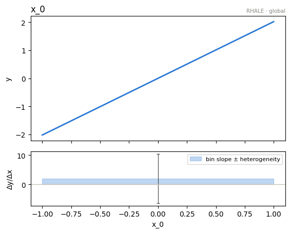
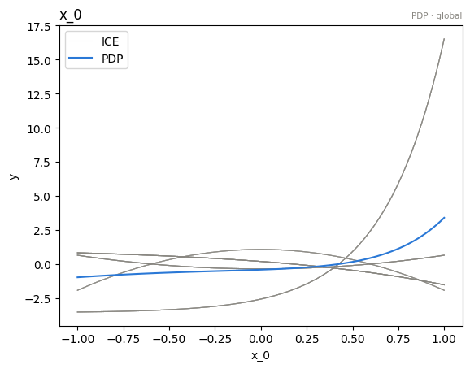
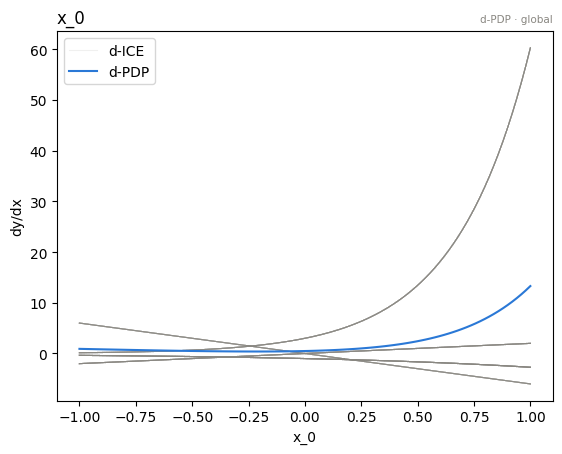
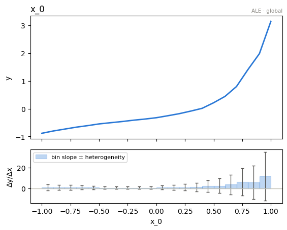
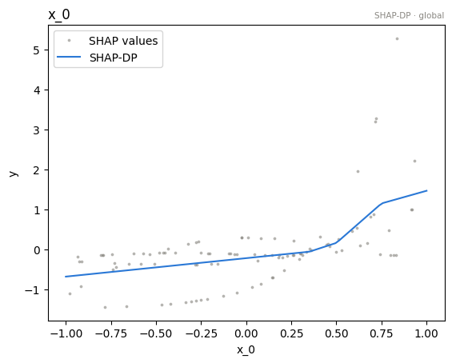
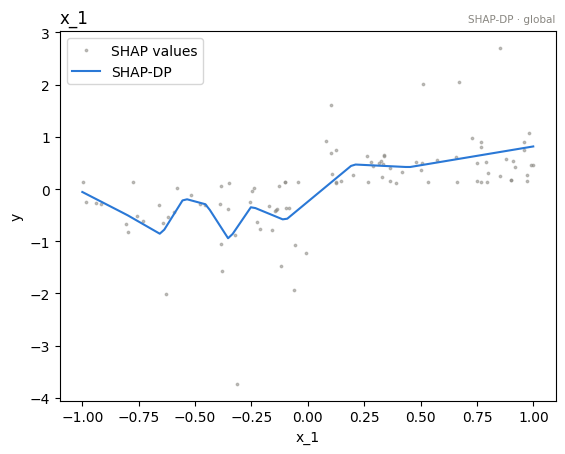

# Runtime of global effect methods

- Author: [givasile](https://givasile.github.io/)
- Runtime: ~30 sec
- Description: effector's cost model in one line — **runtime ≈ (number of
  model calls) × (cost of one call)** — and how to count the calls per method.

Everything effector computes is derived from a small set of *model-touching*
computations (the per-instance local effects), which are computed once and
cached. Everything else — heterogeneity, importance, regional effects,
re-plots — is numpy on top of that cache and is effectively free. So the only
question that matters for runtime is: **how many times does each method call
the model, and on how many rows?**


```python
import time

import numpy as np

import effector

np.random.seed(21)

N, D = 10_000, 3
X = np.random.uniform(-1, 1, (N, D))
axis_limits = np.array([[-1.0] * D, [1.0] * D])

f = effector.models.DoubleConditionalInteraction()


class CountingModel:
    """Wrap a callable and count how many times it is invoked."""

    def __init__(self, fn):
        self.fn, self.n_calls = fn, 0

    def __call__(self, x):
        self.n_calls += 1
        return self.fn(x)
```

## The call inventory

The model is called in exactly three situations:

1. **filling the local-effects cache** — once per feature (or once per object,
   for methods whose raw material covers all features at once);
2. **(d-)PDP evaluation at never-before-seen positions** — the missing
   positions only, cached afterwards;
3. **the average model output** (`show_avg_output=True`) — once per object.

Let's count, method by method, over a full working session: fit one feature,
plot it, plot it again, then ask for the heterogeneity, the importance, and a
regional partition.


```python
def session_counts(name):
    """Model/jacobian calls at each step of a typical session."""
    model = CountingModel(f.predict)
    jac = CountingModel(f.jacobian)
    ctor = {
        "PDP": lambda: effector.PDP(X, model, axis_limits=axis_limits),
        "d-PDP": lambda: effector.DerPDP(X, model, model_jac=jac, axis_limits=axis_limits),
        "ALE": lambda: effector.ALE(X, model, axis_limits=axis_limits),
        "RHALE": lambda: effector.RHALE(X, model, model_jac=jac, axis_limits=axis_limits),
    }
    m = ctor[name]()
    counts, last = {}, 0

    def step(label):
        nonlocal last
        total = model.n_calls + jac.n_calls
        counts[label] = total - last
        last = total

    m.fit(features=0)
    step("fit(0)")
    m.plot(0, show_plot=False)
    step("plot(0)")
    m.plot(0, show_plot=False)
    step("re-plot(0)")
    m.eval_heter(0, np.linspace(-1, 1, 50))
    m.heter_score(0)
    m.importance(0)
    step("heter+importance")
    m.find_regions(0)
    step("find_regions(0)")
    m.fit(features="all")
    step("fit(all)")
    return counts

names = ["PDP", "d-PDP", "ALE", "RHALE"]
rows = {name: session_counts(name) for name in names}
steps = list(next(iter(rows.values())))

print(f"{'model calls per step':<22}" + "".join(f"{s:>18}" for s in steps))
print("-" * (22 + 18 * len(steps)))
for name in names:
    print(f"{name:<22}" + "".join(f"{rows[name][s]:>18}" for s in steps))
```

    model calls per step              fit(0)           plot(0)        re-plot(0)  heter+importance   find_regions(0)          fit(all)
    ----------------------------------------------------------------------------------------------------------------------------------
    PDP                                    1                 1                 0                 0                 0                 2
    d-PDP                                  1                 1                 0                 0                 0                 2
    ALE                                    2                 0                 0                 0                 0                 4
    RHALE                                  1                 0                 0                 0                 0                 0


    

    


    

    


    

    


    

    


    

    


    

    


    

    


    

    


Reading the table:

| Method | who pays, and when |
|---|---|
| **PDP / d-PDP** | one call per *batch of new positions*: `fit` evaluates the ICE table on the internal grid, the first `plot` adds the display positions. Each call predicts `(positions × N)` rows, so `N` is the knob that matters. |
| **ALE** | two calls per feature (the secant's right and left bin edges), each on `N` rows. |
| **RHALE** | **one jacobian call per object** — it covers *all* features, so `fit(all)` costs nothing extra. |

And the zeros are the point: **re-plots, heterogeneity, importance, and the
entire regional search are model-free.** Once the local effects are cached,
you can explore as much as you like at numpy speed.

## Wall-clock check

Same story in seconds: wrap the model with an artificial delay of 50 ms per
call and time a first plot (pays the cache fill) against a second one (free).


```python
def slow(fn, t=0.05):
    def wrapped(x):
        time.sleep(t)
        return fn(x)
    return wrapped

print(f"{'method':<10}{'first plot':>14}{'second plot':>14}")
print("-" * 38)
for name in names:
    ctor = {
        "PDP": lambda: effector.PDP(X, slow(f.predict), axis_limits=axis_limits),
        "d-PDP": lambda: effector.DerPDP(X, slow(f.predict), model_jac=slow(f.jacobian), axis_limits=axis_limits),
        "ALE": lambda: effector.ALE(X, slow(f.predict), axis_limits=axis_limits),
        "RHALE": lambda: effector.RHALE(X, slow(f.predict), model_jac=slow(f.jacobian), axis_limits=axis_limits),
    }
    m = ctor[name]()
    tic = time.time(); m.plot(0, show_plot=False); t1 = time.time() - tic
    tic = time.time(); m.plot(0, show_plot=False); t2 = time.time() - tic
    print(f"{name:<10}{t1:>13.2f}s{t2:>13.2f}s")
```

    method        first plot   second plot
    --------------------------------------


    PDP                0.20s         0.13s


    d-PDP              0.22s         0.03s
    ALE                0.13s         0.04s


    RHALE              0.08s         0.03s


    

    


    

    


    

    


    

    


    

    


    

    


    

    


    

    


## SHAP-DP

SHAP-DP is the exception in magnitude, not in structure: its local effect is
the per-instance SHAP value, and the explainer that computes the `(N, D)`
table is *itself* a loop of model calls (controlled by `budget`). The table is
computed **once per object** — after that, SHAP-DP is as free as everything
else. The practical knobs are `nof_instances` (default 1,000) and `budget`.


```python
m = effector.ShapDP(X, f.predict, nof_instances=100, budget=64)

tic = time.time(); m.plot(0, show_plot=False); t1 = time.time() - tic
tic = time.time(); m.plot(0, show_plot=False); t2 = time.time() - tic
tic = time.time(); m.plot(1, show_plot=False); t3 = time.time() - tic
print(f"first plot (computes the SHAP table): {t1:6.2f}s")
print(f"second plot (cache):                  {t2:6.2f}s")
print(f"first plot of ANOTHER feature:        {t3:6.2f}s  (the table is shared)")
```

    first plot (computes the SHAP table):  10.82s
    second plot (cache):                    0.01s
    first plot of ANOTHER feature:          0.01s  (the table is shared)


    

    


    

    


    

    


## Summary

Model calls for a `D`-feature dataset (`t_f` = cost of one model call on `N`
rows):

| Method | fit one feature | fit all `D` | everything afterwards |
|---|---|---|---|
| **PDP / d-PDP** | $1$ call (grid × N rows) | $D$ calls | free, except brand-new eval positions |
| **ALE** | $2$ calls | $2D$ calls | free |
| **RHALE** | $1$ jacobian call | **that same $1$ call** | free |
| **SHAP-DP** | one explainer run (budget-driven) | that same run | free |

Practical advice:

- **RHALE with `model_jac`** is the cheapest method at scale: one call, all
  features, and the regional search included.
- **`nof_instances`** (constructor) is the one knob that shrinks every call:
  effector subsamples once and every method works on the subset.
- Binning (`binning_method`) is pure numpy and costs milliseconds — pick it
  for statistical, not computational, reasons.

## Cross-method sanity check

The one-liner `effector.explain` with every engine this notebook's model
supports. Everything must run end to end; the closing table puts the reads
side by side. Where methods disagree — ranking, accepted splits, R² — that is
a property of the data/model worth a closer look, not an error.


```python
from pathlib import Path
_out = Path("reports") / "efficiency_global"
_out.mkdir(parents=True, exist_ok=True)

# === cross-method sweep: effector.explain on every applicable engine ======
sweep_reports = {}
for _m in ["pdp", "derpdp", "ale", "rhale", "shapdp"]:
    _kw = {"nof_instances": 300} if _m == "shapdp" else {}
    print(f"--- {_m} " + "-" * 50)
    sweep_reports[_m] = effector.explain(
        X, f.predict, f.jacobian, method=_m, **_kw
    )
    sweep_reports[_m].to_html(_out / f"report_{_m}.html")

print()
print(f"{'method':<8} {'ranking (plotted)':<44} {'GAM R2':>8} {'final R2':>9}  splits")
for _m, _r in sweep_reports.items():
    _rank = " > ".join(fr.name for fr in _r.features)
    _ev = _r.explained_variance
    if _ev:
        _sp = "; ".join(f"{s['name']} on {s['on']}" for s in _ev["stages"]) or "none"
        print(f"{_m:<8} {_rank:<44} {_ev['gam_r2']:>7.1%} {_ev['regional_r2']:>8.1%}  {_sp}")
    else:
        print(f"{_m:<8} {_rank:<44} {'-':>7} {'-':>8}  (derivative scale: no variance ledger)")

print(f"\nreports stored in {_out}/")

```

    --- pdp --------------------------------------------------


    [effector] global effects reproduce 36.9% of the model's variance; with subregions, 99.7%


    /home/givasile/github/packages/effector/effector/report.py:422: UserWarning: This figure includes Axes that are not compatible with tight_layout, so results might be incorrect.
      fig.tight_layout()


    --- derpdp --------------------------------------------------


    /home/givasile/github/packages/effector/effector/report.py:422: UserWarning: This figure includes Axes that are not compatible with tight_layout, so results might be incorrect.
      fig.tight_layout()


    --- ale --------------------------------------------------


    [effector] global effects reproduce 35.0% of the model's variance; with subregions, 78.2%


    /home/givasile/github/packages/effector/effector/report.py:422: UserWarning: This figure includes Axes that are not compatible with tight_layout, so results might be incorrect.
      fig.tight_layout()


    --- rhale --------------------------------------------------


    [effector] global effects reproduce 3.7% of the model's variance; with subregions, 100.0%


    /home/givasile/github/packages/effector/effector/report.py:422: UserWarning: This figure includes Axes that are not compatible with tight_layout, so results might be incorrect.
      fig.tight_layout()


    --- shapdp --------------------------------------------------


    [effector] global effects reproduce 22.6% of the model's variance; with subregions, 81.3%


    /home/givasile/github/packages/effector/effector/report.py:422: UserWarning: This figure includes Axes that are not compatible with tight_layout, so results might be incorrect.
      fig.tight_layout()


    
    method   ranking (plotted)                              GAM R2  final R2  splits
    pdp      x_0 > x_2                                      36.9%    99.7%  x_0 on x_1, x_2
    derpdp   x_0                                                -        -  (derivative scale: no variance ledger)
    ale      x_2 > x_0 > x_1                                35.0%    78.2%  x_1 on x_0, x_2
    rhale    x_0                                             3.7%   100.0%  x_0 on x_1, x_2
    shapdp   x_2 > x_0 > x_1                                22.6%    81.3%  x_0 on x_1, x_2; x_1 on x_0, x_2
    
    reports stored in reports/efficiency_global/

