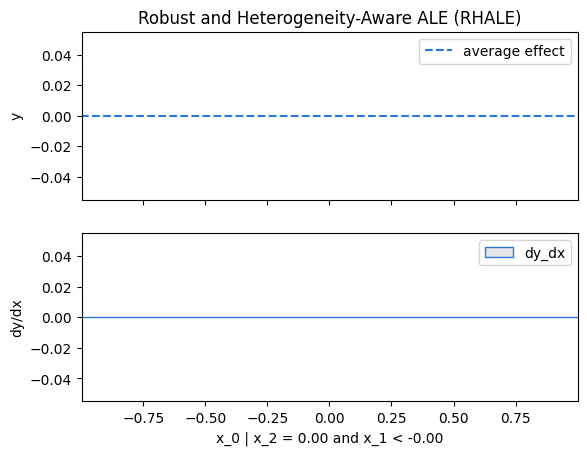
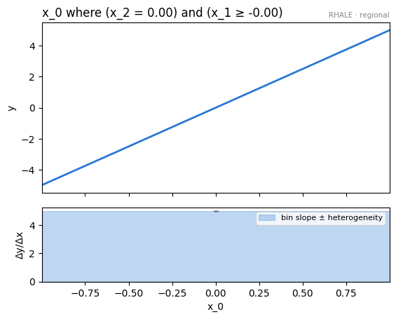
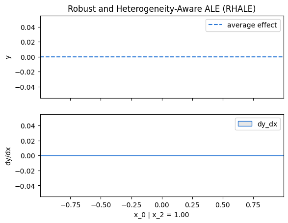

# Runtime of regional effects

- Author: [givasile](https://givasile.github.io/)
- Runtime: ~30 sec
- Description: `find_regions` never calls the model — the search runs on the
  cached local effects. This guide shows the zero, and what the search costs
  instead (numpy time, and which knobs control it).

A regional effect in effector is the global effect *restricted by a boolean
mask*, and every candidate region the split search scores is exactly such a
mask: its heterogeneity is re-summarized from the cached per-instance local
effects. So once the global effect is fitted, **the entire regional analysis
is model-free.**


```python
import time

import numpy as np

import effector

np.random.seed(21)

N, D = 10_000, 3
X = np.stack(
    [
        np.random.uniform(-1, 1, N),
        np.random.uniform(-1, 1, N),
        np.random.randint(0, 2, N).astype(float),
    ],
    axis=1,
)


def f(x):
    # a gated model with one obvious region structure: the effect of x0
    # flips on only when x1 > 0 and x2 == 0
    y = np.zeros_like(x[:, 0])
    on = np.logical_and(x[:, 1] > 0, x[:, 2] == 0)
    y[on] = 5 * x[on, 0]
    return y


class CountingModel:
    def __init__(self, fn):
        self.fn, self.n_calls = fn, 0

    def __call__(self, x):
        self.n_calls += 1
        return self.fn(x)


SCHEMA = {"feature_types": ["continuous", "continuous", "nominal"]}
```

## The zero

Fit the global effect (this is where the model is paid), then run the full
regional search — hundreds of candidate masks — and count.

(The fit costs 6 calls here because no `model_jac` is passed, so RHALE
differentiates numerically: 2 calls per feature. With an analytic jacobian it
would be exactly 1.)


```python
model = CountingModel(f)
rhale = effector.RHALE(X, model, schema=SCHEMA)

rhale.fit(features=0)
after_fit = model.n_calls

partition = rhale.find_regions(0)
for region in partition.leaves:
    partition.plot(region.idx, show_plot=False)

print(f"model calls to fit:                     {after_fit}")
print(f"model calls for the search + all plots: {model.n_calls - after_fit}")
partition.show()
```

    model calls to fit:                     6
    model calls for the search + all plots: 0
    
    
    Feature 0 - Full partition tree:
    🌳 Full Tree Structure:
    ───────────────────────
    x_0 🔹 [id: 0 | heter: 4.71 | inst: 10000 | w: 1.00]
        x_2 = 0.00 🔹 [id: 1 | heter: 6.25 | inst: 4971 | w: 0.50]
            x_1 ≤ -0.00 🔹 [id: 2 | heter: 0.00 | inst: 2452 | w: 0.25]
            x_1 > -0.00 🔹 [id: 3 | heter: 0.00 | inst: 2519 | w: 0.25]
        x_2 ≠ 0.00 🔹 [id: 4 | heter: 0.00 | inst: 5029 | w: 0.50]
    --------------------------------------------------
    Feature 0 - Statistics per tree level:
    🌳 Tree Summary:
    ─────────────────
    Level 0🔹heter: 4.71
        Level 1🔹heter: 3.11 | 🔻1.60 (34.06%)
            Level 2🔹heter: 0.00 | 🔻3.11 (100.00%)
    
    


    

    


    

    


    

    


## What the search costs instead

The search is numpy work: for every node it scores one candidate mask per
(conditioning feature, split position) pair, and each score is a masked
re-summary of the cached local effects — an `O(N)` pass, memoized so
re-proposed masks are free. Three knobs control the total:

- **`max_depth`** — how many levels of splits (nodes grow with depth);
- **`numerical_features_grid_size`** — candidate positions per continuous
  conditioning feature (default 20);
- **`candidate_conditioning_features`** — which features may define splits
  (default `"all"`).

At `N = 10{,}000` the whole search takes hundredths of a second — and because
candidate scores are memoized on the effect object, a deeper search re-uses
the scores of the shallower ones.


```python
rhale = effector.RHALE(X, f, schema=SCHEMA)
rhale.fit(features=0)

print(f"{'max_depth':>10}{'find_regions time':>20}")
print("-" * 30)
for depth in [1, 2, 3]:
    finder = effector.space_partitioning.Best(max_depth=depth)
    tic = time.time()
    rhale.find_regions(0, finder=finder)
    print(f"{depth:>10}{time.time() - tic:>18.2f}s")
```

     max_depth   find_regions time
    ------------------------------
             1              0.03s
             2              0.03s
             3              0.01s


```python
# restricting the conditioning features cuts the candidate set directly
rhale = effector.RHALE(X, f, schema=SCHEMA)
rhale.fit(features=0)

tic = time.time()
rhale.find_regions(0, candidate_conditioning_features=[1])
print(f"conditioning on x1 only: {time.time() - tic:.2f}s")
```

    conditioning on x1 only: 0.04s


## One-shot reports

`effector.explain` runs the whole pipeline — fit, importance ranking, effect
curves, and `find_regions` on the heterogeneous features — with the same cost
profile: the model is paid once, in the fit.


```python
model = CountingModel(f)
tic = time.time()
report = effector.explain(X, model, method="rhale", schema=SCHEMA)
print(f"explain(): {time.time() - tic:.2f}s, {model.n_calls} model call(s)")
report.show()
```

    explain(): 0.07s, 6 model call(s)
    
    RHALE report — target: y
    ============================================================
    feature                   importance     heter  #regions
    ------------------------------------------------------------
    x_0                           0.7516    4.7112         5
    x_1                           0.0000    0.0000         1
    ============================================================
    
    
    Feature 0 - Full partition tree:
    🌳 Full Tree Structure:
    ───────────────────────
    x_0 🔹 [id: 0 | heter: 4.71 | inst: 10000 | w: 1.00]
        x_2 = 0.00 🔹 [id: 1 | heter: 6.25 | inst: 4971 | w: 0.50]
            x_1 ≤ -0.00 🔹 [id: 2 | heter: 0.00 | inst: 2452 | w: 0.25]
            x_1 > -0.00 🔹 [id: 3 | heter: 0.00 | inst: 2519 | w: 0.25]
        x_2 ≠ 0.00 🔹 [id: 4 | heter: 0.00 | inst: 5029 | w: 0.50]
    --------------------------------------------------
    Feature 0 - Statistics per tree level:
    🌳 Tree Summary:
    ─────────────────
    Level 0🔹heter: 4.71
        Level 1🔹heter: 3.11 | 🔻1.60 (34.06%)
            Level 2🔹heter: 0.00 | 🔻3.11 (100.00%)
    
    


    /home/givasile/github/packages/effector/effector/report.py:300: UserWarning: importance is undefined for feature(s) ['x_2'] — this method does not support their feature type; returned NaN.
      imp = effect.importances()


## Summary

| Stage | model calls | time driver |
|---|---|---|
| global `fit` | the method's usual cost (see the [global guide](efficiency_global.md)) | `N`, `t_f` |
| `find_regions` | **0** | `N` × candidates: `max_depth`, grid size, conditioning features |
| `Partition.plot` / `eval` / `heter` | **0** | memo hits — the search already scored the node masks |
| `explain` | one fit | all of the above |

Practical advice:

- The search is `O(N)` per candidate — **`nof_instances` at construction is
  the strongest lever** when `N` is large.
- Restrict **`candidate_conditioning_features`** to the features a split
  could plausibly condition on.
- `max_depth=2` (the default) is almost always enough: it already yields four
  subregions per feature.
