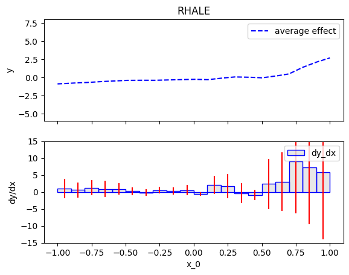
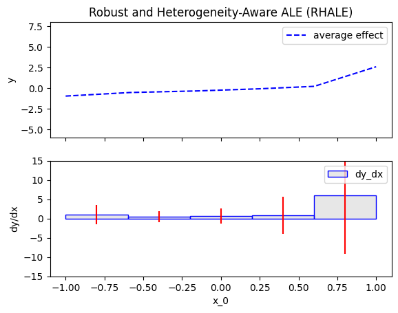
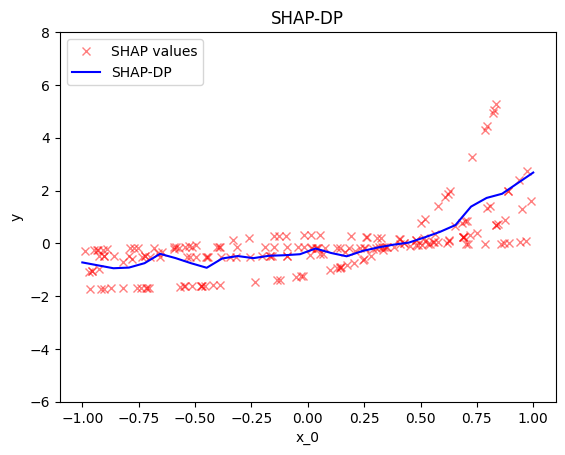
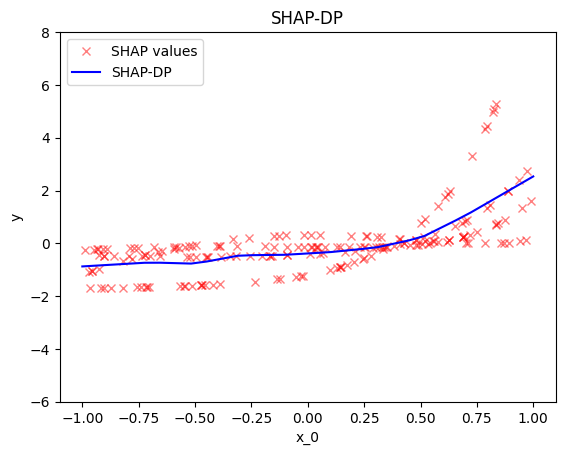
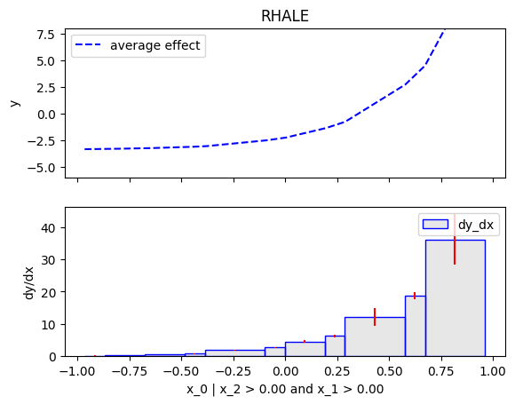
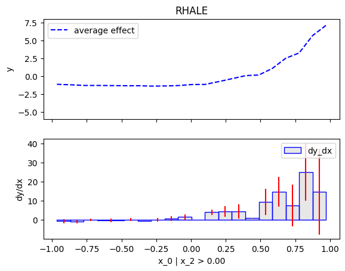
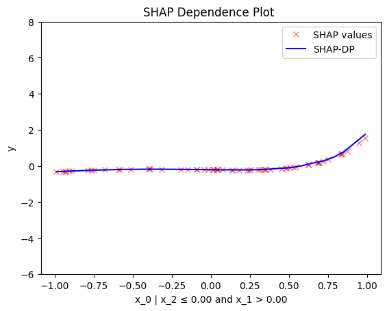
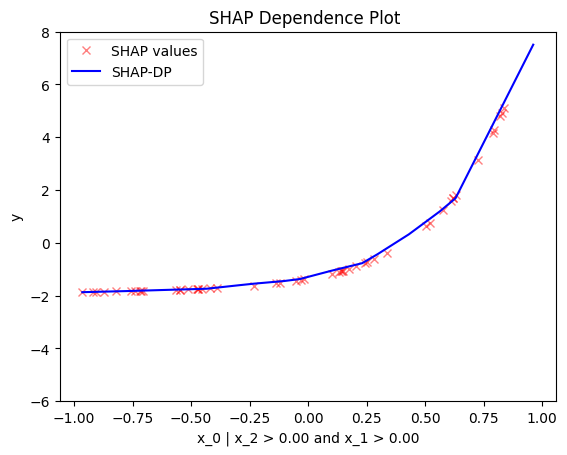
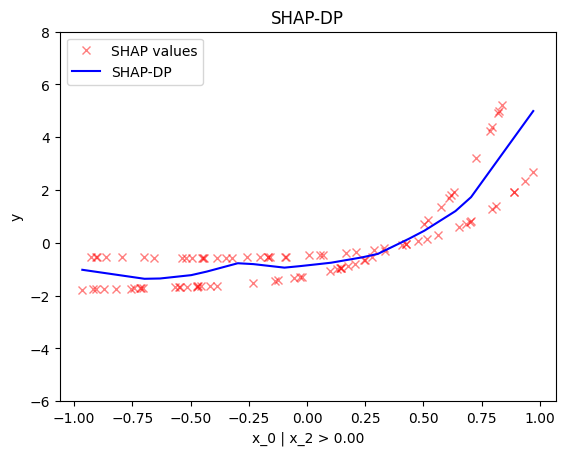

```python
import effector
import numpy as np
```


```python
np.random.seed(21)
```


```python
dist = effector.datasets.IndependentUniform(dim=3, low=-1, high=1)
X_test = dist.generate_data(n=200)
axis_limits = dist.axis_limits
```


```python
model = effector.models.DoubleConditionalInteraction()
predict = model.predict
jacobian = model.jacobian
```


```python
y_limits = [-6, 8]
dy_limits = [-15, 15]
```

## Global Effects

### RHALE


```python
rhale = effector.RHALE(X_test, predict, jacobian, axis_limits=axis_limits, nof_instances="all")
rhale.plot(feature=0, y_limits=y_limits, dy_limits=dy_limits)
```


    

    


```python
rhale = effector.RHALE(X_test, predict, jacobian, axis_limits=axis_limits, nof_instances="all")
rhale.fit(features=0, binning_method=effector.axis_partitioning.Fixed(nof_bins=5))
rhale.plot(feature=0, y_limits=y_limits, dy_limits=dy_limits)
```


    

    


### ShapDP


```python
shap_dp = effector.ShapDP(X_test, predict, axis_limits=axis_limits, nof_instances="all")
shap_dp.plot(feature=0, y_limits=y_limits)
```


    

    


```python
shap_dp = effector.ShapDP(X_test, predict, axis_limits=axis_limits, nof_instances="all")
shap_dp.fit(features=0, binning_method=effector.axis_partitioning.Fixed(nof_bins=10))
shap_dp.plot(feature=0, y_limits=y_limits)
```


    

    


## Regional Effect

### RHALE


```python
r_rhale = effector.RegionalRHALE(X_test, predict, jacobian, axis_limits=axis_limits, nof_instances="all")
```


```python
r_rhale.summary(0)
```

    100%|█████████████████████████████████████████████████████████████████████████████████████████████████████████████████████████████████████████████████████████████████████████| 1/1 [00:00<00:00,  2.71it/s]

    
    
    Feature 0 - Full partition tree:
    Node id: 0, name: x_0, heter: 60.47 || nof_instances:   200 || weight: 1.00
            Node id: 1, name: x_0 | x_2 <= 0.0, heter: 2.36 || nof_instances:   105 || weight: 0.53
                    Node id: 3, name: x_0 | x_2 <= 0.0 and x_1 <= 0.0, heter: 0.06 || nof_instances:    45 || weight: 0.23
                    Node id: 4, name: x_0 | x_2 <= 0.0 and x_1  > 0.0, heter: 0.00 || nof_instances:    60 || weight: 0.30
            Node id: 2, name: x_0 | x_2  > 0.0, heter: 70.28 || nof_instances:    95 || weight: 0.47
                    Node id: 5, name: x_0 | x_2  > 0.0 and x_1 <= 0.0, heter: 0.00 || nof_instances:    45 || weight: 0.23
                    Node id: 6, name: x_0 | x_2  > 0.0 and x_1  > 0.0, heter: 8.08 || nof_instances:    50 || weight: 0.25
    --------------------------------------------------
    Feature 0 - Statistics per tree level:
    Level 0, heter: 60.47
            Level 1, heter: 34.62 || heter drop : 25.85 (units), 42.75% (pcg)
                    Level 2, heter: 2.03 || heter drop : 32.59 (units), 94.12% (pcg)
    
    


    


```python
[r_rhale.plot(feature=0, node_idx=node_idx, y_limits=y_limits) for node_idx in range (3, 7)]
```


    

    


    

    


    

    


    

    


    [None, None, None, None]


```python
r_rhale = effector.RegionalRHALE(X_test, predict, jacobian, axis_limits=axis_limits, nof_instances="all")
```

```python
space_partitioner = effector.space_partitioning.Best(max_split_levels=1)
binning_method = effector.axis_partitioning.Greedy(init_nof_bins=10)
r_rhale.fit(features=0, space_partitioner=space_partitioner, binning_method=binning_method)
```

    100%|█████████████████████████████████████████████████████████████████████████████████████████████████████████████████████████████████████████████████████████████████████████| 1/1 [00:00<00:00,  8.87it/s]


```python
r_rhale.summary(0)
```

    
    
    Feature 0 - Full partition tree:
    Node id: 0, name: x_0, heter: 53.64 || nof_instances:   200 || weight: 1.00
            Node id: 1, name: x_0 | x_2 <= 0.0, heter: 2.42 || nof_instances:   105 || weight: 0.53
            Node id: 2, name: x_0 | x_2  > 0.0, heter: 61.95 || nof_instances:    95 || weight: 0.47
    --------------------------------------------------
    Feature 0 - Statistics per tree level:
    Level 0, heter: 53.64
            Level 1, heter: 30.70 || heter drop : 22.94 (units), 42.77% (pcg)
    
    


```python
[r_rhale.plot(feature=0, node_idx=node_idx, y_limits=y_limits) for node_idx in range (1, 3)]
```


    

    


    

    


    [None, None]


## SHAP-DP


```python
r_shap_dp = effector.RegionalShapDP(X_test, predict, axis_limits=axis_limits, nof_instances="all")
```


```python
r_shap_dp.summary(0)
```

    100%|█████████████████████████████████████████████████████████████████████████████████████████████████████████████████████████████████████████████████████████████████████████| 1/1 [00:00<00:00,  2.20it/s]

    
    
    Feature 0 - Full partition tree:
    Node id: 0, name: x_0, heter: 1.06 || nof_instances:   200 || weight: 1.00
            Node id: 1, name: x_0 | x_2 <= 0.0, heter: 0.08 || nof_instances:   105 || weight: 0.53
                    Node id: 3, name: x_0 | x_2 <= 0.0 and x_1 <= 0.0, heter: 0.00 || nof_instances:    45 || weight: 0.23
                    Node id: 4, name: x_0 | x_2 <= 0.0 and x_1  > 0.0, heter: 0.00 || nof_instances:    60 || weight: 0.30
            Node id: 2, name: x_0 | x_2  > 0.0, heter: 0.98 || nof_instances:    95 || weight: 0.47
                    Node id: 5, name: x_0 | x_2  > 0.0 and x_1 <= 0.0, heter: 0.01 || nof_instances:    45 || weight: 0.23
                    Node id: 6, name: x_0 | x_2  > 0.0 and x_1  > 0.0, heter: 0.34 || nof_instances:    50 || weight: 0.25
    --------------------------------------------------
    Feature 0 - Statistics per tree level:
    Level 0, heter: 1.06
            Level 1, heter: 0.51 || heter drop : 0.55 (units), 52.16% (pcg)
                    Level 2, heter: 0.09 || heter drop : 0.42 (units), 82.71% (pcg)
    
    


    


```python
[r_shap_dp.plot(feature=0, node_idx=node_idx, y_limits=y_limits) for node_idx in range (3, 7)]
```


    

    


    

    


    

    


    

    


    [None, None, None, None]


```python
r_shap_dp = effector.RegionalShapDP(X_test, predict, axis_limits=axis_limits, nof_instances="all")
```

```python
space_partitioner = effector.space_partitioning.Best(max_split_levels=1)
binning_method = effector.axis_partitioning.Greedy(init_nof_bins=10)
r_shap_dp.fit(features=0, space_partitioner=space_partitioner, binning_method=binning_method)
```

    100%|█████████████████████████████████████████████████████████████████████████████████████████████████████████████████████████████████████████████████████████████████████████| 1/1 [00:00<00:00,  4.32it/s]


```python
r_shap_dp.summary(0)
```

    
    
    Feature 0 - Full partition tree:
    Node id: 0, name: x_0, heter: 1.04 || nof_instances:   200 || weight: 1.00
            Node id: 1, name: x_0 | x_2 <= 0.0, heter: 0.08 || nof_instances:   105 || weight: 0.53
            Node id: 2, name: x_0 | x_2  > 0.0, heter: 0.97 || nof_instances:    95 || weight: 0.47
    --------------------------------------------------
    Feature 0 - Statistics per tree level:
    Level 0, heter: 1.04
            Level 1, heter: 0.50 || heter drop : 0.54 (units), 51.98% (pcg)
    
    


```python
[r_shap_dp.plot(feature=0, node_idx=node_idx, y_limits=y_limits) for node_idx in range (1, 3)]
```


    

    


    

    


    [None, None]


