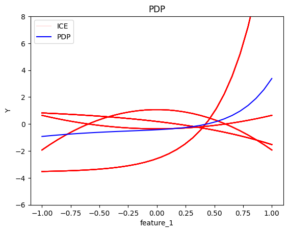
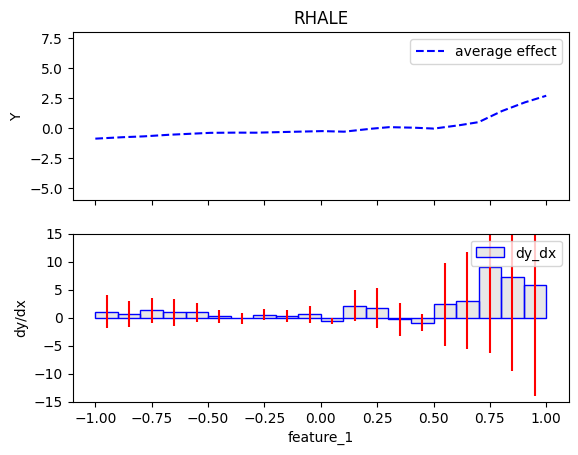
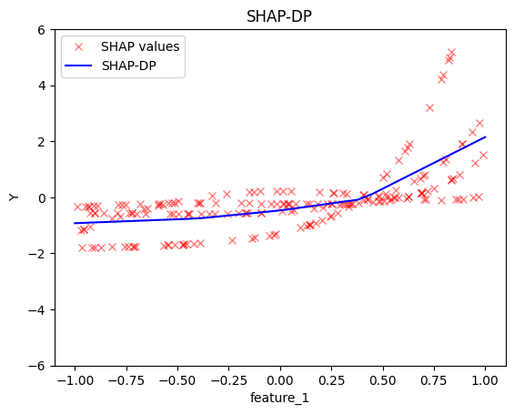
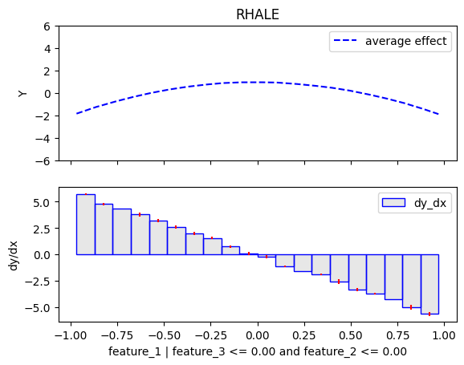
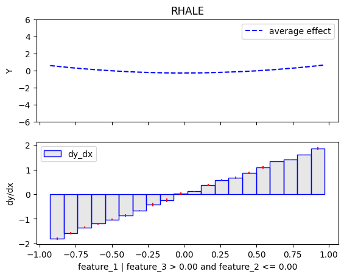
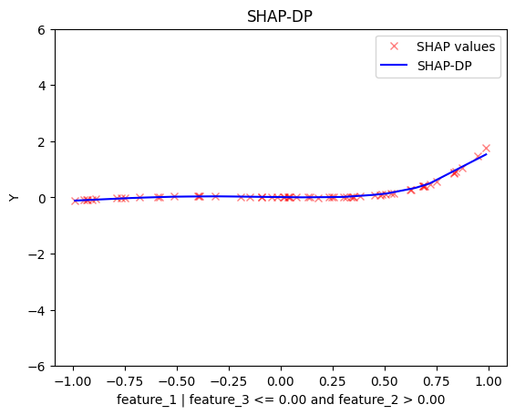
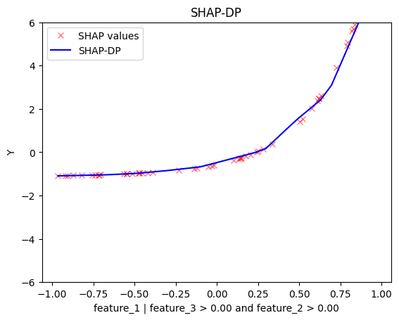

# A short introduction to effector's API


```python
import effector
import numpy as np
```


```python
np.random.seed(21)
```


```python
model = effector.models.DoubleConditionalInteraction()
predict = model.predict
jacobian = model.jacobian
```


```python
dist = effector.datasets.IndependentUniform(dim=3, low=-1, high=1)
data = dist.generate_data(n=200)
```

## Global Effects

### Simple API - use the defaults


```python
feature_names = ["feature_1", "feature_2", "feature_3"]
target_name = "Y"
axis_limits = np.stack([[-1]*3, [1]*3])
y_limits = [-6, 8]
dy_limits = [-15, 15]
```


```python
pdp = effector.PDP(data, predict, axis_limits, nof_instances="all", feature_names=feature_names, target_name=target_name)
pdp.plot(feature=0, y_limits=y_limits)
```


    

    


```python
rhale = effector.RHALE(data, predict, jacobian, axis_limits=axis_limits, nof_instances="all", feature_names=feature_names, target_name=target_name)
rhale.plot(feature=0, y_limits=y_limits, dy_limits=dy_limits)
```


    

    


```python
shap_dp = effector.ShapDP(data, predict, axis_limits=axis_limits, nof_instances="all", feature_names=feature_names, target_name=target_name)
shap_dp.plot(feature=0, y_limits=y_limits)
```


    

    


## Flexible API - Customize Fitting


```python
rhale = effector.RHALE(data, predict, jacobian, axis_limits=axis_limits, nof_instances="all", feature_names=feature_names, target_name=target_name)
rhale.fit(features=0, binning_method=effector.axis_partitioning.Fixed(nof_bins=5, min_points_per_bin=0.))
rhale.plot(feature=0, y_limits=y_limits, dy_limits=dy_limits)
```


    

    


```python
shap_dp = effector.ShapDP(data, predict, axis_limits=axis_limits, nof_instances="all", feature_names=feature_names, target_name=target_name)
shap_dp.fit(features=0, binning_method=effector.axis_partitioning.Fixed(nof_bins=5, min_points_per_bin=0.))
shap_dp.plot(feature=0, y_limits=y_limits)
```


    

    


## Regional Effect

### Simple API - use the defaults


```python
r_pdp = effector.RegionalPDP(data, predict, axis_limits=axis_limits, nof_instances="all", feature_names=feature_names, target_name=target_name)
r_pdp.summary(0)
[r_pdp.plot(feature=0, node_idx=node_idx, y_limits=y_limits) for node_idx in range (3, 7)]
```

    100%|█████████████████████████████████████████████████████████████████████████████████████████████████████████████████████████████████████████████████████████████████████████| 1/1 [00:00<00:00, 29.69it/s]


    
    
    Feature 0 - Full partition tree:
    Node id: 0, name: feature_1, heter: 9.79 || nof_instances:   200 || weight: 1.00
            Node id: 1, name: feature_1 | feature_3 <= 0.0, heter: 0.26 || nof_instances:   200 || weight: 1.00
                    Node id: 3, name: feature_1 | feature_3 <= 0.0 and feature_2 <= 0.0, heter: 0.00 || nof_instances:   200 || weight: 1.00
                    Node id: 4, name: feature_1 | feature_3 <= 0.0 and feature_2  > 0.0, heter: 0.00 || nof_instances:   200 || weight: 1.00
            Node id: 2, name: feature_1 | feature_3  > 0.0, heter: 8.88 || nof_instances:   200 || weight: 1.00
                    Node id: 5, name: feature_1 | feature_3  > 0.0 and feature_2 <= 0.0, heter: 0.00 || nof_instances:   200 || weight: 1.00
                    Node id: 6, name: feature_1 | feature_3  > 0.0 and feature_2  > 0.0, heter: 0.00 || nof_instances:   200 || weight: 1.00
    --------------------------------------------------
    Feature 0 - Statistics per tree level:
    Level 0, heter: 9.79
            Level 1, heter: 9.15 || heter drop : 0.64 (units), 6.55% (pcg)
                    Level 2, heter: 0.00 || heter drop : 9.15 (units), 100.00% (pcg)
    
    


    

    


    

    


    

    


    

    


    [None, None, None, None]


```python
r_rhale = effector.RegionalRHALE(data, predict, jacobian, axis_limits=axis_limits, nof_instances="all", feature_names=feature_names, target_name=target_name)
r_rhale.summary(0)
[r_rhale.plot(feature=0, node_idx=node_idx, y_limits=y_limits) for node_idx in range (3, 7)]
```

      0%|                                                                                                                                                                                 | 0/1 [00:00<?, ?it/s]/home/givasile/miniconda3/envs/effector-dev/lib/python3.10/site-packages/numpy/_core/fromnumeric.py:4008: RuntimeWarning: Degrees of freedom <= 0 for slice
      return _methods._var(a, axis=axis, dtype=dtype, out=out, ddof=ddof,
    /home/givasile/miniconda3/envs/effector-dev/lib/python3.10/site-packages/numpy/_core/_methods.py:175: RuntimeWarning: invalid value encountered in divide
      arrmean = um.true_divide(arrmean, div, out=arrmean,
    /home/givasile/miniconda3/envs/effector-dev/lib/python3.10/site-packages/numpy/_core/_methods.py:210: RuntimeWarning: invalid value encountered in scalar divide
      ret = ret.dtype.type(ret / rcount)
    100%|█████████████████████████████████████████████████████████████████████████████████████████████████████████████████████████████████████████████████████████████████████████| 1/1 [00:00<00:00,  2.08it/s]

    RegionalRHALE here: At a particular split, some bins had at most one point. I reject this split. 
     Error: Input array contains only NaN values. This is probably because in all bins there is at most one point, which is not enough to compute the bin variance. Please consider decreasing the number of bins or changing the bin splitting strategy.
    
    
    Feature 0 - Full partition tree:
    Node id: 0, name: feature_1, heter: 60.47 || nof_instances:   200 || weight: 1.00
            Node id: 1, name: feature_1 | feature_3 <= 0.0, heter: 2.35 || nof_instances:   200 || weight: 1.00
                    Node id: 3, name: feature_1 | feature_3 <= 0.0 and feature_2 <= 0.0, heter: 0.02 || nof_instances:   200 || weight: 1.00
                    Node id: 4, name: feature_1 | feature_3 <= 0.0 and feature_2  > 0.0, heter: 0.00 || nof_instances:   200 || weight: 1.00
            Node id: 2, name: feature_1 | feature_3  > 0.0, heter: 70.28 || nof_instances:   200 || weight: 1.00
                    Node id: 5, name: feature_1 | feature_3  > 0.0 and feature_2 <= 0.0, heter: 0.00 || nof_instances:   200 || weight: 1.00
                    Node id: 6, name: feature_1 | feature_3  > 0.0 and feature_2  > 0.0, heter: 0.80 || nof_instances:   200 || weight: 1.00
    --------------------------------------------------
    Feature 0 - Statistics per tree level:
    Level 0, heter: 60.47
            Level 1, heter: 72.62 || heter drop : -12.15 (units), -20.09% (pcg)
                    Level 2, heter: 0.82 || heter drop : 71.80 (units), 98.87% (pcg)
    
    


    


    

    


    

    


    

    


    

    


    [None, None, None, None]


```python
r_shap_dp = effector.RegionalShapDP(data, predict, axis_limits=axis_limits, nof_instances="all", feature_names=feature_names, target_name=target_name)
r_shap_dp.summary(0)
```

    100%|█████████████████████████████████████████████████████████████████████████████████████████████████████████████████████████████████████████████████████████████████████████| 1/1 [00:00<00:00,  1.53it/s]

    RegionalShapDP here: At a particular split, some bins had at most one point. I reject this split. 
     Error: Input array contains only NaN values. This is probably because in all bins there is at most one point, which is not enough to compute the bin variance. Please consider decreasing the number of bins or changing the bin splitting strategy.
    
    
    Feature 0 - Full partition tree:
    Node id: 0, name: feature_1, heter: 1.06 || nof_instances:   200 || weight: 1.00
            Node id: 1, name: feature_1 | feature_3 <= 0.0, heter: 0.08 || nof_instances:   200 || weight: 1.00
                    Node id: 3, name: feature_1 | feature_3 <= 0.0 and feature_2 <= 0.0, heter: 0.00 || nof_instances:   200 || weight: 1.00
                    Node id: 4, name: feature_1 | feature_3 <= 0.0 and feature_2  > 0.0, heter: 0.00 || nof_instances:   200 || weight: 1.00
            Node id: 2, name: feature_1 | feature_3  > 0.0, heter: 0.98 || nof_instances:   200 || weight: 1.00
                    Node id: 5, name: feature_1 | feature_3  > 0.0 and feature_2 <= 0.0, heter: 0.01 || nof_instances:   200 || weight: 1.00
                    Node id: 6, name: feature_1 | feature_3  > 0.0 and feature_2  > 0.0, heter: 0.02 || nof_instances:   200 || weight: 1.00
    --------------------------------------------------
    Feature 0 - Statistics per tree level:
    Level 0, heter: 1.06
            Level 1, heter: 1.06 || heter drop : 0.00 (units), 0.05% (pcg)
                    Level 2, heter: 0.03 || heter drop : 1.03 (units), 96.80% (pcg)
    
    


    


```python
### Flexible API - customize fitting
```


```python
r_shap_dp = effector.RegionalShapDP(data, predict, axis_limits=axis_limits, nof_instances="all", feature_names=feature_names, target_name=target_name)

space_partitioner = effector.partitioning.Regions(heter_small_enough=0.)
axis_partitioner = effector.axis_partitioning.Greedy(init_nof_bins=10, min_points_per_bin=0.)
r_shap_dp.fit(features=0, space_partitioner=space_partitioner, binning_method=axis_partitioner)
r_shap_dp.summary(features=0)
```

    100%|█████████████████████████████████████████████████████████████████████████████████████████████████████████████████████████████████████████████████████████████████████████| 1/1 [00:00<00:00,  1.86it/s]

    RegionalShapDP here: At a particular split, some bins had at most one point. I reject this split. 
     Error: Input array contains only NaN values. This is probably because in all bins there is at most one point, which is not enough to compute the bin variance. Please consider decreasing the number of bins or changing the bin splitting strategy.
    
    
    Feature 0 - Full partition tree:
    Node id: 0, name: feature_1, heter: 1.04 || nof_instances:   200 || weight: 1.00
            Node id: 1, name: feature_1 | feature_3 <= 0.0, heter: 0.08 || nof_instances:   200 || weight: 1.00
                    Node id: 3, name: feature_1 | feature_3 <= 0.0 and feature_2 <= 0.0, heter: 0.00 || nof_instances:   200 || weight: 1.00
                    Node id: 4, name: feature_1 | feature_3 <= 0.0 and feature_2  > 0.0, heter: 0.02 || nof_instances:   200 || weight: 1.00
            Node id: 2, name: feature_1 | feature_3  > 0.0, heter: 0.97 || nof_instances:   200 || weight: 1.00
                    Node id: 5, name: feature_1 | feature_3  > 0.0 and feature_2 <= 0.0, heter: 0.04 || nof_instances:   200 || weight: 1.00
                    Node id: 6, name: feature_1 | feature_3  > 0.0 and feature_2  > 0.0, heter: 0.41 || nof_instances:   200 || weight: 1.00
    --------------------------------------------------
    Feature 0 - Statistics per tree level:
    Level 0, heter: 1.04
            Level 1, heter: 1.04 || heter drop : -0.00 (units), -0.33% (pcg)
                    Level 2, heter: 0.47 || heter drop : 0.57 (units), 54.74% (pcg)
    
    


    


```python
[r_shap_dp.plot(feature=0, node_idx=node_idx, y_limits=y_limits) for node_idx in range (3, 7)]
```


    

    


    

    


    

    


    

    


    [None, None, None, None]


```python

```


```python

```
