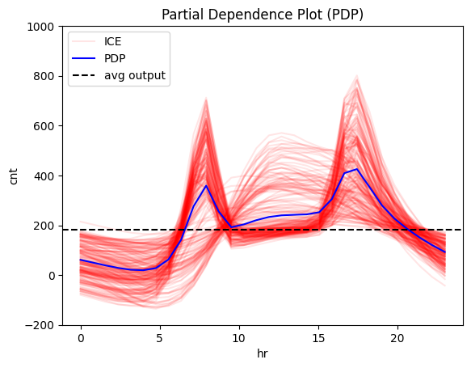
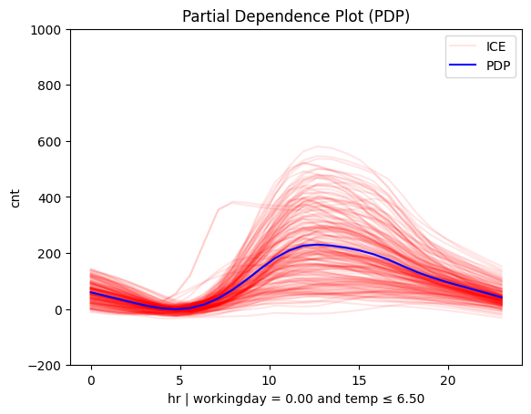
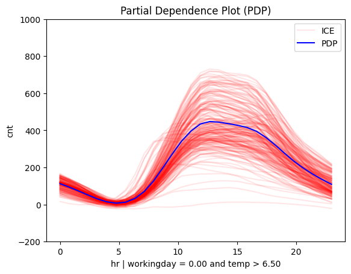
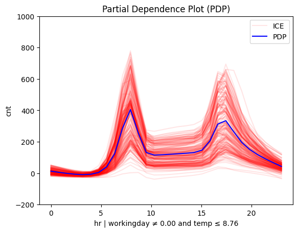
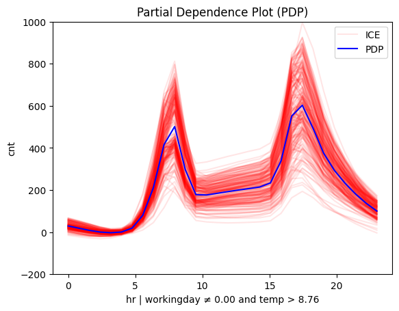

```python
import effector
import keras
import numpy as np
import tensorflow as tf

np.random.seed(42)
tf.random.set_seed(42)

# Load dataset
bike_sharing = effector.datasets.BikeSharing(pcg_train=0.8)
X_train, Y_train = bike_sharing.x_train, bike_sharing.y_train
X_test, Y_test = bike_sharing.x_test, bike_sharing.y_test
```


```python
# Define and train a neural network
model = keras.Sequential([
    keras.layers.Dense(1024, activation="relu"),
    keras.layers.Dense(512, activation="relu"),
    keras.layers.Dense(256, activation="relu"),
    keras.layers.Dense(1)
])
model.compile(optimizer="adam", loss="mse", metrics=["mae", keras.metrics.RootMeanSquaredError()])
model.fit(X_train, Y_train, batch_size=512, epochs=20, verbose=1)
model.evaluate(X_test, Y_test, verbose=1)

```

    Epoch 1/20
    28/28 ━━━━━━━━━━━━━━━━━━━━ 1s 8ms/step - loss: 0.6220 - mae: 0.5751 - root_mean_squared_error: 0.7851
    Epoch 2/20
    28/28 ━━━━━━━━━━━━━━━━━━━━ 0s 9ms/step - loss: 0.3867 - mae: 0.4507 - root_mean_squared_error: 0.6216
    Epoch 3/20
    28/28 ━━━━━━━━━━━━━━━━━━━━ 0s 9ms/step - loss: 0.2930 - mae: 0.3824 - root_mean_squared_error: 0.5411
    Epoch 4/20
    28/28 ━━━━━━━━━━━━━━━━━━━━ 0s 9ms/step - loss: 0.2149 - mae: 0.3252 - root_mean_squared_error: 0.4634
    Epoch 5/20
    28/28 ━━━━━━━━━━━━━━━━━━━━ 0s 9ms/step - loss: 0.1602 - mae: 0.2820 - root_mean_squared_error: 0.4000
    Epoch 6/20
    28/28 ━━━━━━━━━━━━━━━━━━━━ 0s 8ms/step - loss: 0.1148 - mae: 0.2334 - root_mean_squared_error: 0.3385
    Epoch 7/20
    28/28 ━━━━━━━━━━━━━━━━━━━━ 0s 9ms/step - loss: 0.0880 - mae: 0.2076 - root_mean_squared_error: 0.2966
    Epoch 8/20
    28/28 ━━━━━━━━━━━━━━━━━━━━ 0s 8ms/step - loss: 0.0734 - mae: 0.1887 - root_mean_squared_error: 0.2709
    Epoch 9/20
    28/28 ━━━━━━━━━━━━━━━━━━━━ 0s 9ms/step - loss: 0.0627 - mae: 0.1749 - root_mean_squared_error: 0.2504
    Epoch 10/20
    28/28 ━━━━━━━━━━━━━━━━━━━━ 0s 8ms/step - loss: 0.0551 - mae: 0.1623 - root_mean_squared_error: 0.2347
    Epoch 11/20
    28/28 ━━━━━━━━━━━━━━━━━━━━ 0s 8ms/step - loss: 0.0494 - mae: 0.1520 - root_mean_squared_error: 0.2224
    Epoch 12/20
    28/28 ━━━━━━━━━━━━━━━━━━━━ 0s 9ms/step - loss: 0.0459 - mae: 0.1456 - root_mean_squared_error: 0.2143
    Epoch 13/20
    28/28 ━━━━━━━━━━━━━━━━━━━━ 0s 9ms/step - loss: 0.0436 - mae: 0.1420 - root_mean_squared_error: 0.2087
    Epoch 14/20
    28/28 ━━━━━━━━━━━━━━━━━━━━ 0s 9ms/step - loss: 0.0427 - mae: 0.1414 - root_mean_squared_error: 0.2066
    Epoch 15/20
    28/28 ━━━━━━━━━━━━━━━━━━━━ 0s 8ms/step - loss: 0.0417 - mae: 0.1405 - root_mean_squared_error: 0.2043
    Epoch 16/20
    28/28 ━━━━━━━━━━━━━━━━━━━━ 0s 9ms/step - loss: 0.0414 - mae: 0.1396 - root_mean_squared_error: 0.2034
    Epoch 17/20
    28/28 ━━━━━━━━━━━━━━━━━━━━ 0s 9ms/step - loss: 0.0393 - mae: 0.1360 - root_mean_squared_error: 0.1983
    Epoch 18/20
    28/28 ━━━━━━━━━━━━━━━━━━━━ 0s 9ms/step - loss: 0.0419 - mae: 0.1426 - root_mean_squared_error: 0.2048
    Epoch 19/20
    28/28 ━━━━━━━━━━━━━━━━━━━━ 0s 8ms/step - loss: 0.0445 - mae: 0.1477 - root_mean_squared_error: 0.2109
    Epoch 20/20
    28/28 ━━━━━━━━━━━━━━━━━━━━ 0s 8ms/step - loss: 0.0427 - mae: 0.1434 - root_mean_squared_error: 0.2066
    109/109 ━━━━━━━━━━━━━━━━━━━━ 0s 796us/step - loss: 0.0816 - mae: 0.1865 - root_mean_squared_error: 0.2840


    [0.07368884235620499, 0.17802290618419647, 0.27145689725875854]


```python
def predict(x):
    return model(x).numpy().squeeze()
```


```python
pdp = effector.PDP(
    X_test,
    predict,
    feature_names=bike_sharing.feature_names,
    target_name=bike_sharing.target_name
)

# plot the effect of the 3rd feature (feature: temperature)
pdp.plot(
    feature=3,
    nof_ice=200,
    scale_x={"mean": bike_sharing.x_test_mu[3], "std": bike_sharing.x_test_std[3]},
    scale_y={"mean": bike_sharing.y_test_mu, "std": bike_sharing.y_test_std},
    centering=True,
    show_avg_output=True,
    y_limits=[-200, 1000]
)

```


    

    


```python
r_pdp = effector.RegionalPDP(
    X_test,
    predict,
    feature_names=bike_sharing.feature_names,
    target_name=bike_sharing.target_name
)

# summarize the subregions of feature 3
r_pdp.summary(
    features=3,
    scale_x_list=[{"mean": bike_sharing.x_test_mu[i], "std": bike_sharing.x_test_std[i]} for i in range(X_test.shape[1])]
)

```

    100%|██████████| 1/1 [00:00<00:00,  1.52it/s]

    
    
    Feature 3 - Full partition tree:
    🌳 Full Tree Structure:
    ───────────────────────
    hr 🔹 [id: 0 | heter: 0.42 | inst: 3476 | w: 1.00]
        workingday = 0.00 🔹 [id: 1 | heter: 0.37 | inst: 1129 | w: 0.32]
            temp ≤ 6.50 🔹 [id: 3 | heter: 0.18 | inst: 568 | w: 0.16]
            temp > 6.50 🔹 [id: 4 | heter: 0.23 | inst: 561 | w: 0.16]
        workingday ≠ 0.00 🔹 [id: 2 | heter: 0.28 | inst: 2347 | w: 0.68]
            temp ≤ 6.50 🔹 [id: 5 | heter: 0.18 | inst: 953 | w: 0.27]
            temp > 6.50 🔹 [id: 6 | heter: 0.21 | inst: 1394 | w: 0.40]
    --------------------------------------------------
    Feature 3 - Statistics per tree level:
    🌳 Tree Summary:
    ─────────────────
    Level 0🔹heter: 0.42
        Level 1🔹heter: 0.31 | 🔻0.11 (26.37%)
            Level 2🔹heter: 0.20 | 🔻0.11 (35.86%)
    
    


    


```python
# plot the regional effects after the first-level splits (workingday or non-workingday)
for node_idx in [1,2]:
    r_pdp.plot(
        feature=3,
        node_idx=node_idx,
        nof_ice=200,
        scale_x_list=[{"mean": bike_sharing.x_test_mu[i], "std": bike_sharing.x_test_std[i]} for i in range(X_test.shape[1])],
        scale_y={"mean": bike_sharing.y_test_mu, "std": bike_sharing.y_test_std},
        y_limits=[-200, 1000]
    )

```


    

    


    

    


```python
# plot the regional effects after the first-level splits (workingday or non-workingday)
for node_idx in [3,4,5,6]:
    r_pdp.plot(
        feature=3,
        node_idx=node_idx,
        nof_ice=200,
        scale_x_list=[{"mean": bike_sharing.x_test_mu[i], "std": bike_sharing.x_test_std[i]} for i in range(X_test.shape[1])],
        scale_y={"mean": bike_sharing.y_test_mu, "std": bike_sharing.y_test_std},
        y_limits=[-200, 1000]
    )

```


    

    


    

    


    

    


    

    

