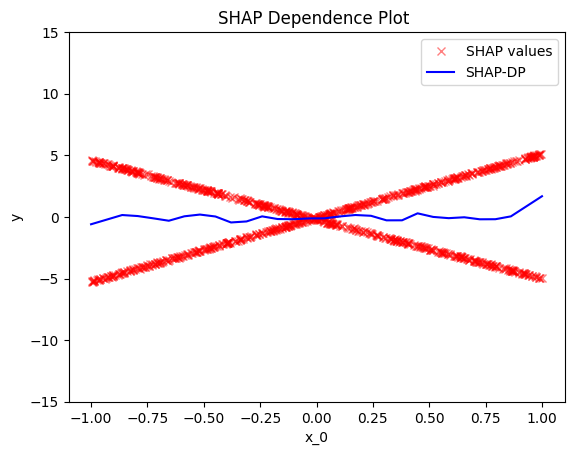
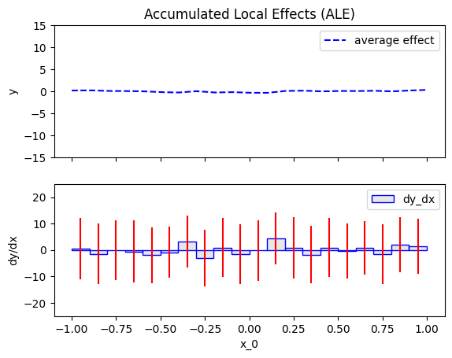
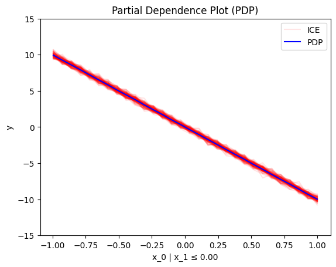
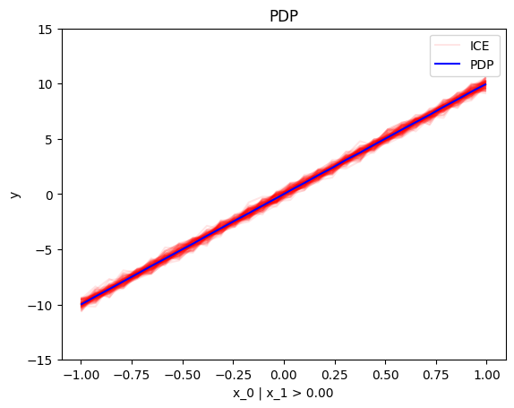
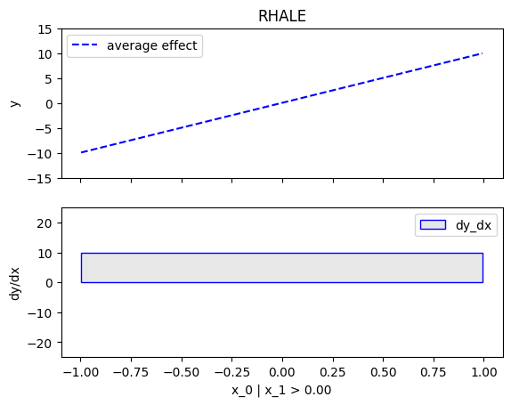
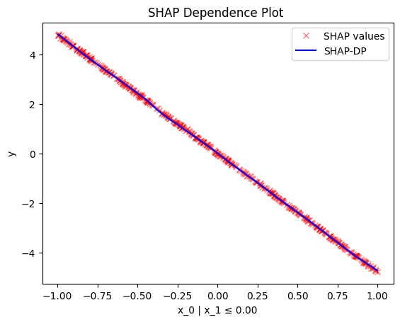
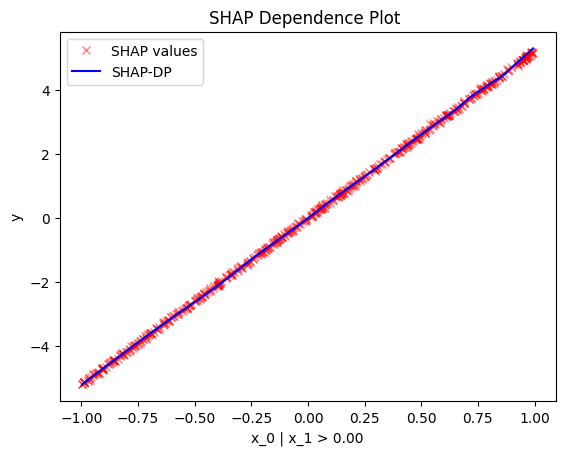
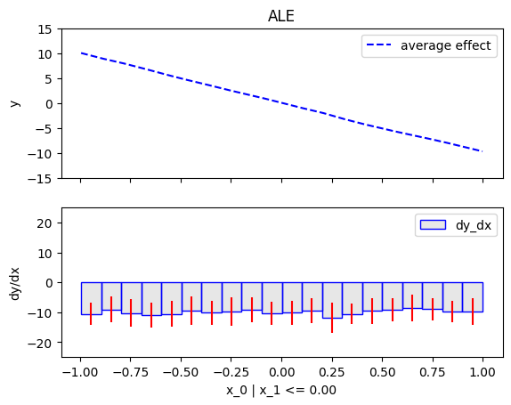
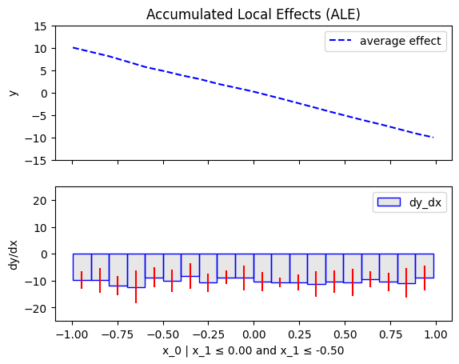
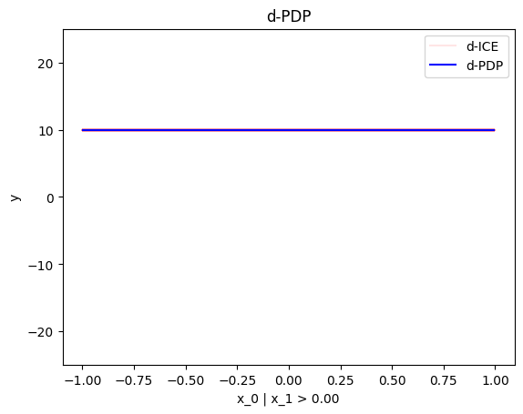

```python
import numpy as np
import effector
```


```python
np.random.seed(21)
```


```python
X_test = np.random.uniform(-1, 1, (1000, 2))
axis_limits = np.array([[-1, -1], [1, 1]])
```


```python
def predict(x):
    y = np.zeros(x.shape[0])
    ind = x[:, 1] > 0
    y[ind] = 10*x[ind, 0]
    y[~ind] = -10*x[~ind, 0]
    return y + np.random.normal(0, 1, x.shape[0])*.3
```


```python
def jacobian(x):
    J = np.zeros((x.shape[0], 2))
    ind = x[:, 1] > 0
    J[ind, 0] = 10
    J[~ind, 0] = -10
    return J
```


```python
y_limits = [-15, 15]
dy_limits = [-25, 25]
```

## Global Effect

### PDP


```python
pdp = effector.PDP(X_test, predict, axis_limits=axis_limits, nof_instances="all")
pdp.plot(feature=0, y_limits=y_limits)
```


    

    


### RHALE


```python
rhale = effector.RHALE(X_test, predict, jacobian, axis_limits=axis_limits, nof_instances="all")
rhale.plot(feature=0, y_limits=y_limits, dy_limits=dy_limits)
```


    

    


### SHAP-DP


```python
shapdp = effector.ShapDP(X_test, predict, axis_limits=axis_limits, nof_instances="all")
shapdp.plot(feature=0, y_limits=y_limits)
```


    

    


### ALE


```python
ale = effector.ALE(X_test, predict, axis_limits=axis_limits, nof_instances="all")
ale.plot(feature=0, y_limits=y_limits, dy_limits=dy_limits)
```


    

    


### d-PDP


```python
dpdp = effector.DerPDP(X_test, predict, model_jac=jacobian, axis_limits=axis_limits, nof_instances="all")
dpdp.plot(feature=0, dy_limits=dy_limits)
```


    

    


## Regional Effect

### RegionalPDP


```python
r_pdp = effector.RegionalPDP(X_test, predict, axis_limits=axis_limits, nof_instances="all")
r_pdp.summary(features=0)
```

    100%|████████████████████████████████████████████████████████████████████████████████████████████████████████████████████████████████████████████████████████████████████████| 1/1 [00:00<00:00, 112.55it/s]

    
    
    Feature 0 - Full partition tree:
    Node id: 0, name: x_0, heter: 35.72 || nof_instances:  1000 || weight: 1.00
            Node id: 1, name: x_0 | x_1 <= 0.0, heter: 0.09 || nof_instances:   501 || weight: 0.50
            Node id: 2, name: x_0 | x_1  > 0.0, heter: 0.09 || nof_instances:   499 || weight: 0.50
    --------------------------------------------------
    Feature 0 - Statistics per tree level:
    Level 0, heter: 35.72
            Level 1, heter: 0.09 || heter drop : 35.63 (units), 99.75% (pcg)
    
    


    


```python
[r_pdp.plot(feature=0, node_idx=i, y_limits=y_limits) for i in range(1, 3)]
```


    

    


    

    


    [None, None]


### Regional RHALE


```python
r_rhale = effector.RegionalRHALE(X_test, predict, jacobian, axis_limits=axis_limits, nof_instances="all")
r_rhale.summary(features=0)
```

    100%|█████████████████████████████████████████████████████████████████████████████████████████████████████████████████████████████████████████████████████████████████████████| 1/1 [00:00<00:00, 11.21it/s]

    
    
    Feature 0 - Full partition tree:
    Node id: 0, name: x_0, heter: 97.38 || nof_instances:  1000 || weight: 1.00
            Node id: 1, name: x_0 | x_1 <= 0.0, heter: 0.00 || nof_instances:   501 || weight: 0.50
            Node id: 2, name: x_0 | x_1  > 0.0, heter: 0.00 || nof_instances:   499 || weight: 0.50
    --------------------------------------------------
    Feature 0 - Statistics per tree level:
    Level 0, heter: 97.38
            Level 1, heter: 0.00 || heter drop : 97.38 (units), 100.00% (pcg)
    
    


    


```python
[r_rhale.plot(feature=0, node_idx=i, y_limits=y_limits, dy_limits=dy_limits) for i in range(1, 3)]
```


    

    


    

    


    [None, None]


### RegionalShapDP


```python
r_shapdp = effector.RegionalShapDP(X_test, predict, axis_limits=axis_limits, nof_instances="all")
r_shapdp.summary(features=0)
```

    100%|█████████████████████████████████████████████████████████████████████████████████████████████████████████████████████████████████████████████████████████████████████████| 1/1 [00:00<00:00,  1.79it/s]

    
    
    Feature 0 - Full partition tree:
    Node id: 0, name: x_0, heter: 8.82 || nof_instances:  1000 || weight: 1.00
            Node id: 1, name: x_0 | x_1 <= 0.0, heter: 0.02 || nof_instances:   501 || weight: 0.50
            Node id: 2, name: x_0 | x_1  > 0.0, heter: 0.02 || nof_instances:   499 || weight: 0.50
    --------------------------------------------------
    Feature 0 - Statistics per tree level:
    Level 0, heter: 8.82
            Level 1, heter: 0.02 || heter drop : 8.80 (units), 99.76% (pcg)
    
    


    


```python
[r_shapdp.plot(feature=0, node_idx=i) for i in range(1, 3)]
```


    

    


    

    


    [None, None]


### RegionalALE


```python
r_ale = effector.RegionalALE(X_test, predict, axis_limits=axis_limits, nof_instances="all")
r_ale.summary(features=0)
```

    100%|█████████████████████████████████████████████████████████████████████████████████████████████████████████████████████████████████████████████████████████████████████████| 1/1 [00:00<00:00, 77.86it/s]

    
    
    Feature 0 - Full partition tree:
    Node id: 0, name: x_0, heter: 120.05 || nof_instances:  1000 || weight: 1.00
            Node id: 1, name: x_0 | x_1 <= 0.0, heter: 18.88 || nof_instances:   501 || weight: 0.50
            Node id: 2, name: x_0 | x_1  > 0.0, heter: 17.65 || nof_instances:   499 || weight: 0.50
    --------------------------------------------------
    Feature 0 - Statistics per tree level:
    Level 0, heter: 120.05
            Level 1, heter: 18.26 || heter drop : 101.78 (units), 84.79% (pcg)
    
    


    


```python
[r_ale.plot(feature=0, node_idx=i, y_limits=y_limits, dy_limits=dy_limits) for i in range(1, 3)]
```


    

    


    

    


    [None, None]


### RegionalDerPDP


```python
r_dpdp = effector.RegionalDerPDP(X_test, predict, jacobian, axis_limits=axis_limits, nof_instances="all")
r_dpdp.summary(features=0)
```

    100%|█████████████████████████████████████████████████████████████████████████████████████████████████████████████████████████████████████████████████████████████████████████| 1/1 [00:00<00:00, 96.80it/s]

    
    
    Feature 0 - Full partition tree:
    Node id: 0, name: x_0, heter: 100.00 || nof_instances:  1000 || weight: 1.00
            Node id: 1, name: x_0 | x_1 <= 0.0, heter: 0.00 || nof_instances:   501 || weight: 0.50
            Node id: 2, name: x_0 | x_1  > 0.0, heter: 0.00 || nof_instances:   499 || weight: 0.50
    --------------------------------------------------
    Feature 0 - Statistics per tree level:
    Level 0, heter: 100.00
            Level 1, heter: 0.00 || heter drop : 100.00 (units), 100.00% (pcg)
    
    


    


```python
[r_dpdp.plot(feature=0, node_idx=i, dy_limits=dy_limits) for i in range(1, 3)]
```


    

    


    

    


    [None, None]


