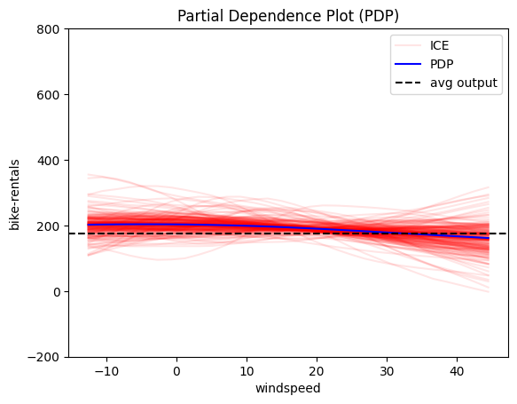
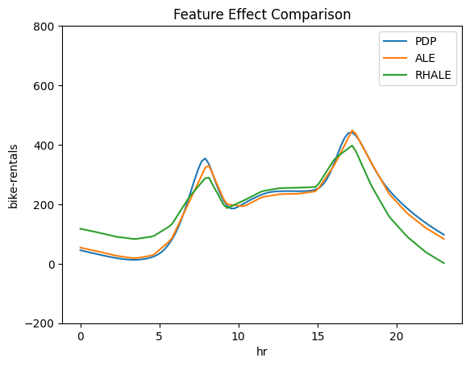
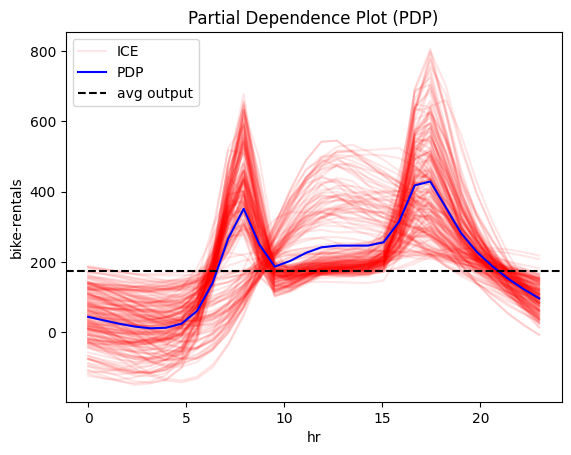
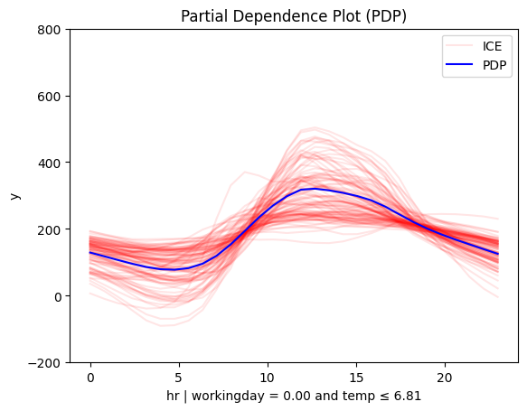
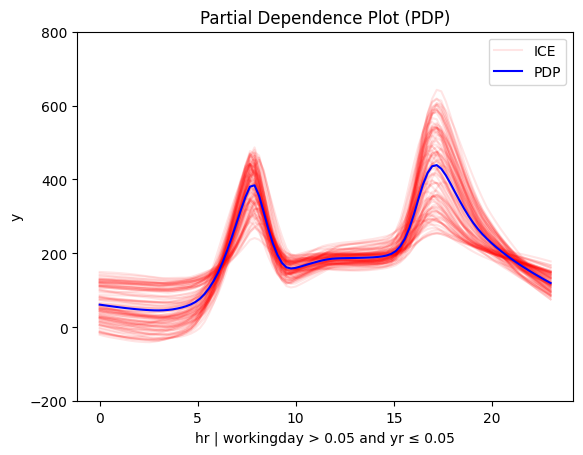
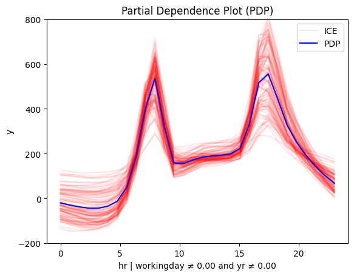
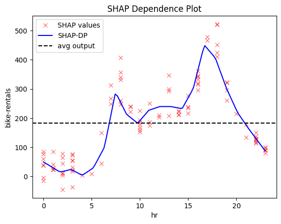
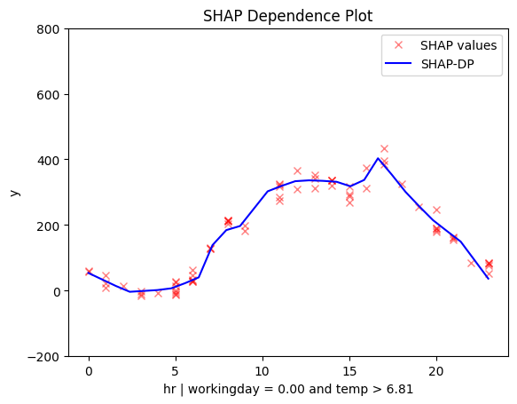
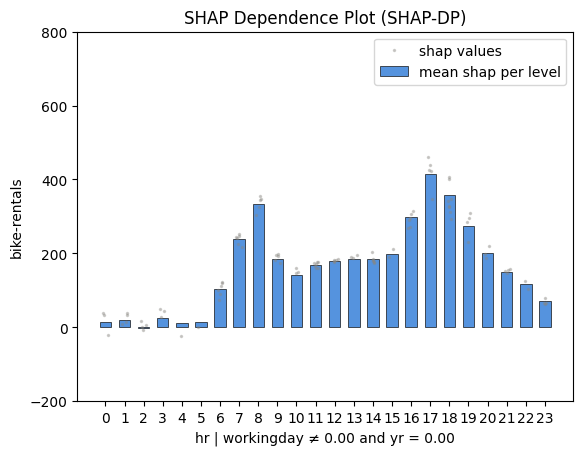

# Bike-Sharing Dataset

- Author: [givasile](https://givasile.github.io/)
- Runtime: ~6 min
- Description: Global and regional effects (PDP, RHALE, SHAP-DP) of the
  `hour` feature on hourly bike-rental counts, explaining a neural network
  trained on the UCI bike-sharing dataset.

This notebook analyzes the Capital Bikeshare system's rental data from 2011-2012. We'll explore how various factors influence bike rental patterns using advanced machine learning techniques.
The [Bike-Sharing Dataset](https://archive.ics.uci.edu/ml/datasets/bike+sharing+dataset) contains:
- 17,379 hourly records
- 14 features including temporal and weather information
- Target variable: hourly bike rental count


```python
import effector
import numpy as np
import tensorflow as tf
from tensorflow import keras
import random

np.random.seed(42)
tf.random.set_seed(42)
random.seed(42)
```

    WARNING: All log messages before absl::InitializeLog() is called are written to STDERR
    I0000 00:00:1783182486.836269   69637 cpu_feature_guard.cc:227] This TensorFlow binary is optimized to use available CPU instructions in performance-critical operations.
    To enable the following instructions: AVX2 FMA, in other operations, rebuild TensorFlow with the appropriate compiler flags.


## Preprocess the data


```python
from ucimlrepo import fetch_ucirepo
bike_sharing_dataset = fetch_ucirepo(id=275)
X = bike_sharing_dataset.data.features
y = bike_sharing_dataset.data.targets
```


```python
X = X.drop(["dteday", "atemp"], axis=1)
```


```python
print("Design matrix shape: {}".format(X.shape))
print("---------------------------------")
for i, col_name in enumerate(X.columns):
    print("x_{} {:15}, unique: {:4d}, Mean: {:6.2f}, Std: {:6.2f}, Min: {:6.2f}, Max: {:6.2f}".format(i, col_name, len(X[col_name].unique()), X[col_name].mean(), X[col_name].std(), X[col_name].min(), X[col_name].max()))
    
print("\nTarget shape: {}".format(y.shape))
print("---------------------------------")
for col_name in y.columns:
    print("Target: {:15}, unique: {:4d}, Mean: {:6.2f}, Std: {:6.2f}, Min: {:6.2f}, Max: {:6.2f}".format(col_name, len(y[col_name].unique()), y[col_name].mean(), y[col_name].std(), y[col_name].min(), y[col_name].max()))
```

    Design matrix shape: (17379, 11)
    ---------------------------------
    x_0 season         , unique:    4, Mean:   2.50, Std:   1.11, Min:   1.00, Max:   4.00
    x_1 yr             , unique:    2, Mean:   0.50, Std:   0.50, Min:   0.00, Max:   1.00
    x_2 mnth           , unique:   12, Mean:   6.54, Std:   3.44, Min:   1.00, Max:  12.00
    x_3 hr             , unique:   24, Mean:  11.55, Std:   6.91, Min:   0.00, Max:  23.00
    x_4 holiday        , unique:    2, Mean:   0.03, Std:   0.17, Min:   0.00, Max:   1.00
    x_5 weekday        , unique:    7, Mean:   3.00, Std:   2.01, Min:   0.00, Max:   6.00
    x_6 workingday     , unique:    2, Mean:   0.68, Std:   0.47, Min:   0.00, Max:   1.00
    x_7 weathersit     , unique:    4, Mean:   1.43, Std:   0.64, Min:   1.00, Max:   4.00
    x_8 temp           , unique:   50, Mean:   0.50, Std:   0.19, Min:   0.02, Max:   1.00
    x_9 hum            , unique:   89, Mean:   0.63, Std:   0.19, Min:   0.00, Max:   1.00
    x_10 windspeed      , unique:   30, Mean:   0.19, Std:   0.12, Min:   0.00, Max:   0.85
    
    Target shape: (17379, 1)
    ---------------------------------
    Target: cnt            , unique:  869, Mean: 189.46, Std: 181.39, Min:   1.00, Max: 977.00


```python
def preprocess(X, y):
    # Standarize X
    X_df = X
    x_mean = X_df.mean()
    x_std = X_df.std()
    X_df = (X_df - X_df.mean()) / X_df.std()

    # Standarize Y
    Y_df = y
    y_mean = Y_df.mean()
    y_std = Y_df.std()
    Y_df = (Y_df - Y_df.mean()) / Y_df.std()
    return X_df, Y_df, x_mean, x_std, y_mean, y_std

# shuffle and standarize all features
X_df, Y_df, x_mean, x_std, y_mean, y_std = preprocess(X, y)
```


```python
def split(X_df, Y_df):
    # shuffle indices
    indices = X_df.index.tolist()
    np.random.shuffle(indices)
    
    # data split
    train_size = int(0.8 * len(X_df))
    
    X_train = X_df.iloc[indices[:train_size]]
    Y_train = Y_df.iloc[indices[:train_size]]
    X_test = X_df.iloc[indices[train_size:]]
    Y_test = Y_df.iloc[indices[train_size:]]
    
    return X_train, Y_train, X_test, Y_test

# train/test split
X_train, Y_train, X_test, Y_test = split(X_df, Y_df)

```

## Fit a Neural Network


```python
# Train - Evaluate - Explain a neural network
model = keras.Sequential([
    keras.layers.Dense(1024, activation="relu"),
    keras.layers.Dense(512, activation="relu"),
    keras.layers.Dense(256, activation="relu"),
    keras.layers.Dense(1)
])

optimizer = keras.optimizers.Adam(learning_rate=0.001)
model.compile(optimizer=optimizer, loss="mse", metrics=["mae", keras.metrics.RootMeanSquaredError()])
model.fit(X_train, Y_train, batch_size=512, epochs=20, verbose=1)
model.evaluate(X_train, Y_train, verbose=1)
model.evaluate(X_test, Y_test, verbose=1)

```

    Epoch 1/20


    
 1/28 ━━━━━━━━━━━━━━━━━━━━ 25s 934ms/step - loss: 1.1537 - mae: 0.8307 - root_mean_squared_error: 1.0741

    
 5/28 ━━━━━━━━━━━━━━━━━━━━ 0s 13ms/step - loss: 0.8687 - mae: 0.7030 - root_mean_squared_error: 0.9285  

    
10/28 ━━━━━━━━━━━━━━━━━━━━ 0s 12ms/step - loss: 0.7623 - mae: 0.6488 - root_mean_squared_error: 0.8691

    
15/28 ━━━━━━━━━━━━━━━━━━━━ 0s 12ms/step - loss: 0.7061 - mae: 0.6181 - root_mean_squared_error: 0.8363

    
20/28 ━━━━━━━━━━━━━━━━━━━━ 0s 12ms/step - loss: 0.6683 - mae: 0.5979 - root_mean_squared_error: 0.8134

    
25/28 ━━━━━━━━━━━━━━━━━━━━ 0s 12ms/step - loss: 0.6407 - mae: 0.5837 - root_mean_squared_error: 0.7964

    
28/28 ━━━━━━━━━━━━━━━━━━━━ 1s 12ms/step - loss: 0.5114 - mae: 0.5164 - root_mean_squared_error: 0.7151


    Epoch 2/20


    
 1/28 ━━━━━━━━━━━━━━━━━━━━ 0s 26ms/step - loss: 0.4507 - mae: 0.4820 - root_mean_squared_error: 0.6713

    
 6/28 ━━━━━━━━━━━━━━━━━━━━ 0s 11ms/step - loss: 0.4161 - mae: 0.4743 - root_mean_squared_error: 0.6450

    
11/28 ━━━━━━━━━━━━━━━━━━━━ 0s 12ms/step - loss: 0.4074 - mae: 0.4675 - root_mean_squared_error: 0.6382

    
16/28 ━━━━━━━━━━━━━━━━━━━━ 0s 12ms/step - loss: 0.4003 - mae: 0.4612 - root_mean_squared_error: 0.6326

    
21/28 ━━━━━━━━━━━━━━━━━━━━ 0s 12ms/step - loss: 0.3947 - mae: 0.4565 - root_mean_squared_error: 0.6281

    
26/28 ━━━━━━━━━━━━━━━━━━━━ 0s 12ms/step - loss: 0.3898 - mae: 0.4528 - root_mean_squared_error: 0.6242

    
28/28 ━━━━━━━━━━━━━━━━━━━━ 0s 12ms/step - loss: 0.3624 - mae: 0.4319 - root_mean_squared_error: 0.6020


    Epoch 3/20


    
 1/28 ━━━━━━━━━━━━━━━━━━━━ 0s 26ms/step - loss: 0.3531 - mae: 0.4129 - root_mean_squared_error: 0.5942

    
 6/28 ━━━━━━━━━━━━━━━━━━━━ 0s 12ms/step - loss: 0.3145 - mae: 0.3950 - root_mean_squared_error: 0.5606

    
11/28 ━━━━━━━━━━━━━━━━━━━━ 0s 12ms/step - loss: 0.3102 - mae: 0.3939 - root_mean_squared_error: 0.5568

    
15/28 ━━━━━━━━━━━━━━━━━━━━ 0s 12ms/step - loss: 0.3070 - mae: 0.3915 - root_mean_squared_error: 0.5540

    
20/28 ━━━━━━━━━━━━━━━━━━━━ 0s 12ms/step - loss: 0.3034 - mae: 0.3889 - root_mean_squared_error: 0.5507

    
25/28 ━━━━━━━━━━━━━━━━━━━━ 0s 12ms/step - loss: 0.3002 - mae: 0.3869 - root_mean_squared_error: 0.5478

    
28/28 ━━━━━━━━━━━━━━━━━━━━ 0s 12ms/step - loss: 0.2802 - mae: 0.3730 - root_mean_squared_error: 0.5294


    Epoch 4/20


    
 1/28 ━━━━━━━━━━━━━━━━━━━━ 0s 29ms/step - loss: 0.2653 - mae: 0.3627 - root_mean_squared_error: 0.5151

    
 6/28 ━━━━━━━━━━━━━━━━━━━━ 0s 12ms/step - loss: 0.2424 - mae: 0.3492 - root_mean_squared_error: 0.4922

    
11/28 ━━━━━━━━━━━━━━━━━━━━ 0s 11ms/step - loss: 0.2376 - mae: 0.3456 - root_mean_squared_error: 0.4874

    
16/28 ━━━━━━━━━━━━━━━━━━━━ 0s 11ms/step - loss: 0.2325 - mae: 0.3404 - root_mean_squared_error: 0.4821

    
21/28 ━━━━━━━━━━━━━━━━━━━━ 0s 12ms/step - loss: 0.2288 - mae: 0.3369 - root_mean_squared_error: 0.4782

    
26/28 ━━━━━━━━━━━━━━━━━━━━ 0s 12ms/step - loss: 0.2256 - mae: 0.3342 - root_mean_squared_error: 0.4748

    
28/28 ━━━━━━━━━━━━━━━━━━━━ 0s 12ms/step - loss: 0.2077 - mae: 0.3184 - root_mean_squared_error: 0.4557


    Epoch 5/20


    
 1/28 ━━━━━━━━━━━━━━━━━━━━ 0s 27ms/step - loss: 0.1894 - mae: 0.3006 - root_mean_squared_error: 0.4352

    
 5/28 ━━━━━━━━━━━━━━━━━━━━ 0s 13ms/step - loss: 0.1745 - mae: 0.2947 - root_mean_squared_error: 0.4176

    
 9/28 ━━━━━━━━━━━━━━━━━━━━ 0s 13ms/step - loss: 0.1707 - mae: 0.2920 - root_mean_squared_error: 0.4130

    
14/28 ━━━━━━━━━━━━━━━━━━━━ 0s 13ms/step - loss: 0.1673 - mae: 0.2886 - root_mean_squared_error: 0.4090

    
19/28 ━━━━━━━━━━━━━━━━━━━━ 0s 13ms/step - loss: 0.1652 - mae: 0.2867 - root_mean_squared_error: 0.4063

    
23/28 ━━━━━━━━━━━━━━━━━━━━ 0s 13ms/step - loss: 0.1639 - mae: 0.2855 - root_mean_squared_error: 0.4047

    
27/28 ━━━━━━━━━━━━━━━━━━━━ 0s 13ms/step - loss: 0.1625 - mae: 0.2842 - root_mean_squared_error: 0.4030

    
28/28 ━━━━━━━━━━━━━━━━━━━━ 0s 13ms/step - loss: 0.1530 - mae: 0.2744 - root_mean_squared_error: 0.3911


    Epoch 6/20


    
 1/28 ━━━━━━━━━━━━━━━━━━━━ 0s 29ms/step - loss: 0.1515 - mae: 0.2577 - root_mean_squared_error: 0.3892

    
 6/28 ━━━━━━━━━━━━━━━━━━━━ 0s 12ms/step - loss: 0.1334 - mae: 0.2514 - root_mean_squared_error: 0.3650

    
11/28 ━━━━━━━━━━━━━━━━━━━━ 0s 12ms/step - loss: 0.1282 - mae: 0.2476 - root_mean_squared_error: 0.3579

    
16/28 ━━━━━━━━━━━━━━━━━━━━ 0s 12ms/step - loss: 0.1246 - mae: 0.2441 - root_mean_squared_error: 0.3527

    
21/28 ━━━━━━━━━━━━━━━━━━━━ 0s 12ms/step - loss: 0.1221 - mae: 0.2418 - root_mean_squared_error: 0.3492

    
26/28 ━━━━━━━━━━━━━━━━━━━━ 0s 12ms/step - loss: 0.1202 - mae: 0.2399 - root_mean_squared_error: 0.3465

    
28/28 ━━━━━━━━━━━━━━━━━━━━ 0s 12ms/step - loss: 0.1104 - mae: 0.2292 - root_mean_squared_error: 0.3323


    Epoch 7/20


    
 1/28 ━━━━━━━━━━━━━━━━━━━━ 0s 27ms/step - loss: 0.1089 - mae: 0.2210 - root_mean_squared_error: 0.3300

    
 5/28 ━━━━━━━━━━━━━━━━━━━━ 0s 15ms/step - loss: 0.0994 - mae: 0.2173 - root_mean_squared_error: 0.3152

    
 8/28 ━━━━━━━━━━━━━━━━━━━━ 0s 17ms/step - loss: 0.0970 - mae: 0.2146 - root_mean_squared_error: 0.3113

    
12/28 ━━━━━━━━━━━━━━━━━━━━ 0s 15ms/step - loss: 0.0949 - mae: 0.2122 - root_mean_squared_error: 0.3079

    
17/28 ━━━━━━━━━━━━━━━━━━━━ 0s 14ms/step - loss: 0.0930 - mae: 0.2100 - root_mean_squared_error: 0.3049

    
22/28 ━━━━━━━━━━━━━━━━━━━━ 0s 13ms/step - loss: 0.0918 - mae: 0.2089 - root_mean_squared_error: 0.3028

    
27/28 ━━━━━━━━━━━━━━━━━━━━ 0s 13ms/step - loss: 0.0909 - mae: 0.2078 - root_mean_squared_error: 0.3014

    
28/28 ━━━━━━━━━━━━━━━━━━━━ 0s 13ms/step - loss: 0.0860 - mae: 0.2018 - root_mean_squared_error: 0.2932


    Epoch 8/20


    
 1/28 ━━━━━━━━━━━━━━━━━━━━ 0s 26ms/step - loss: 0.0832 - mae: 0.1967 - root_mean_squared_error: 0.2884

    
 6/28 ━━━━━━━━━━━━━━━━━━━━ 0s 12ms/step - loss: 0.0782 - mae: 0.1934 - root_mean_squared_error: 0.2796

    
11/28 ━━━━━━━━━━━━━━━━━━━━ 0s 12ms/step - loss: 0.0772 - mae: 0.1916 - root_mean_squared_error: 0.2778

    
15/28 ━━━━━━━━━━━━━━━━━━━━ 0s 12ms/step - loss: 0.0764 - mae: 0.1905 - root_mean_squared_error: 0.2764

    
19/28 ━━━━━━━━━━━━━━━━━━━━ 0s 13ms/step - loss: 0.0759 - mae: 0.1902 - root_mean_squared_error: 0.2755

    
23/28 ━━━━━━━━━━━━━━━━━━━━ 0s 13ms/step - loss: 0.0756 - mae: 0.1899 - root_mean_squared_error: 0.2750

    
27/28 ━━━━━━━━━━━━━━━━━━━━ 0s 13ms/step - loss: 0.0754 - mae: 0.1896 - root_mean_squared_error: 0.2745

    
28/28 ━━━━━━━━━━━━━━━━━━━━ 0s 14ms/step - loss: 0.0734 - mae: 0.1865 - root_mean_squared_error: 0.2708


    Epoch 9/20


    
 1/28 ━━━━━━━━━━━━━━━━━━━━ 0s 29ms/step - loss: 0.0725 - mae: 0.1857 - root_mean_squared_error: 0.2693

    
 5/28 ━━━━━━━━━━━━━━━━━━━━ 0s 14ms/step - loss: 0.0700 - mae: 0.1837 - root_mean_squared_error: 0.2645

    
 9/28 ━━━━━━━━━━━━━━━━━━━━ 0s 14ms/step - loss: 0.0691 - mae: 0.1816 - root_mean_squared_error: 0.2628

    
13/28 ━━━━━━━━━━━━━━━━━━━━ 0s 14ms/step - loss: 0.0684 - mae: 0.1804 - root_mean_squared_error: 0.2615

    
17/28 ━━━━━━━━━━━━━━━━━━━━ 0s 14ms/step - loss: 0.0680 - mae: 0.1799 - root_mean_squared_error: 0.2607

    
21/28 ━━━━━━━━━━━━━━━━━━━━ 0s 14ms/step - loss: 0.0677 - mae: 0.1799 - root_mean_squared_error: 0.2602

    
25/28 ━━━━━━━━━━━━━━━━━━━━ 0s 14ms/step - loss: 0.0676 - mae: 0.1797 - root_mean_squared_error: 0.2599

    
28/28 ━━━━━━━━━━━━━━━━━━━━ 0s 14ms/step - loss: 0.0661 - mae: 0.1771 - root_mean_squared_error: 0.2570


    Epoch 10/20


    
 1/28 ━━━━━━━━━━━━━━━━━━━━ 0s 29ms/step - loss: 0.0673 - mae: 0.1801 - root_mean_squared_error: 0.2593

    
 5/28 ━━━━━━━━━━━━━━━━━━━━ 0s 14ms/step - loss: 0.0635 - mae: 0.1760 - root_mean_squared_error: 0.2520

    
 9/28 ━━━━━━━━━━━━━━━━━━━━ 0s 13ms/step - loss: 0.0624 - mae: 0.1731 - root_mean_squared_error: 0.2497

    
14/28 ━━━━━━━━━━━━━━━━━━━━ 0s 13ms/step - loss: 0.0615 - mae: 0.1712 - root_mean_squared_error: 0.2479

    
19/28 ━━━━━━━━━━━━━━━━━━━━ 0s 12ms/step - loss: 0.0610 - mae: 0.1706 - root_mean_squared_error: 0.2469

    
24/28 ━━━━━━━━━━━━━━━━━━━━ 0s 12ms/step - loss: 0.0608 - mae: 0.1703 - root_mean_squared_error: 0.2465

    
28/28 ━━━━━━━━━━━━━━━━━━━━ 0s 12ms/step - loss: 0.0595 - mae: 0.1674 - root_mean_squared_error: 0.2439


    Epoch 11/20


    
 1/28 ━━━━━━━━━━━━━━━━━━━━ 0s 27ms/step - loss: 0.0614 - mae: 0.1699 - root_mean_squared_error: 0.2477

    
 6/28 ━━━━━━━━━━━━━━━━━━━━ 0s 13ms/step - loss: 0.0571 - mae: 0.1663 - root_mean_squared_error: 0.2388

    
10/28 ━━━━━━━━━━━━━━━━━━━━ 0s 13ms/step - loss: 0.0562 - mae: 0.1639 - root_mean_squared_error: 0.2370

    
15/28 ━━━━━━━━━━━━━━━━━━━━ 0s 13ms/step - loss: 0.0554 - mae: 0.1621 - root_mean_squared_error: 0.2353

    
20/28 ━━━━━━━━━━━━━━━━━━━━ 0s 13ms/step - loss: 0.0551 - mae: 0.1616 - root_mean_squared_error: 0.2346

    
25/28 ━━━━━━━━━━━━━━━━━━━━ 0s 12ms/step - loss: 0.0549 - mae: 0.1614 - root_mean_squared_error: 0.2344

    
28/28 ━━━━━━━━━━━━━━━━━━━━ 0s 13ms/step - loss: 0.0541 - mae: 0.1591 - root_mean_squared_error: 0.2326


    Epoch 12/20


    
 1/28 ━━━━━━━━━━━━━━━━━━━━ 0s 28ms/step - loss: 0.0555 - mae: 0.1594 - root_mean_squared_error: 0.2356

    
 6/28 ━━━━━━━━━━━━━━━━━━━━ 0s 13ms/step - loss: 0.0518 - mae: 0.1582 - root_mean_squared_error: 0.2274

    
11/28 ━━━━━━━━━━━━━━━━━━━━ 0s 12ms/step - loss: 0.0510 - mae: 0.1559 - root_mean_squared_error: 0.2257

    
15/28 ━━━━━━━━━━━━━━━━━━━━ 0s 12ms/step - loss: 0.0506 - mae: 0.1548 - root_mean_squared_error: 0.2248

    
19/28 ━━━━━━━━━━━━━━━━━━━━ 0s 12ms/step - loss: 0.0504 - mae: 0.1545 - root_mean_squared_error: 0.2244

    
24/28 ━━━━━━━━━━━━━━━━━━━━ 0s 12ms/step - loss: 0.0503 - mae: 0.1543 - root_mean_squared_error: 0.2243

    
28/28 ━━━━━━━━━━━━━━━━━━━━ 0s 13ms/step - loss: 0.0500 - mae: 0.1524 - root_mean_squared_error: 0.2237


    Epoch 13/20


    
 1/28 ━━━━━━━━━━━━━━━━━━━━ 0s 28ms/step - loss: 0.0495 - mae: 0.1485 - root_mean_squared_error: 0.2225

    
 6/28 ━━━━━━━━━━━━━━━━━━━━ 0s 12ms/step - loss: 0.0469 - mae: 0.1496 - root_mean_squared_error: 0.2166

    
11/28 ━━━━━━━━━━━━━━━━━━━━ 0s 12ms/step - loss: 0.0465 - mae: 0.1480 - root_mean_squared_error: 0.2156

    
16/28 ━━━━━━━━━━━━━━━━━━━━ 0s 12ms/step - loss: 0.0463 - mae: 0.1470 - root_mean_squared_error: 0.2150

    
21/28 ━━━━━━━━━━━━━━━━━━━━ 0s 12ms/step - loss: 0.0462 - mae: 0.1467 - root_mean_squared_error: 0.2149

    
26/28 ━━━━━━━━━━━━━━━━━━━━ 0s 12ms/step - loss: 0.0462 - mae: 0.1466 - root_mean_squared_error: 0.2150

    
28/28 ━━━━━━━━━━━━━━━━━━━━ 0s 12ms/step - loss: 0.0463 - mae: 0.1455 - root_mean_squared_error: 0.2153


    Epoch 14/20


    
 1/28 ━━━━━━━━━━━━━━━━━━━━ 0s 27ms/step - loss: 0.0453 - mae: 0.1443 - root_mean_squared_error: 0.2129

    
 5/28 ━━━━━━━━━━━━━━━━━━━━ 0s 13ms/step - loss: 0.0436 - mae: 0.1451 - root_mean_squared_error: 0.2087

    
10/28 ━━━━━━━━━━━━━━━━━━━━ 0s 12ms/step - loss: 0.0432 - mae: 0.1432 - root_mean_squared_error: 0.2079

    
15/28 ━━━━━━━━━━━━━━━━━━━━ 0s 12ms/step - loss: 0.0431 - mae: 0.1423 - root_mean_squared_error: 0.2076

    
20/28 ━━━━━━━━━━━━━━━━━━━━ 0s 12ms/step - loss: 0.0431 - mae: 0.1418 - root_mean_squared_error: 0.2075

    
25/28 ━━━━━━━━━━━━━━━━━━━━ 0s 12ms/step - loss: 0.0432 - mae: 0.1417 - root_mean_squared_error: 0.2078

    
28/28 ━━━━━━━━━━━━━━━━━━━━ 0s 12ms/step - loss: 0.0436 - mae: 0.1405 - root_mean_squared_error: 0.2088


    Epoch 15/20


    
 1/28 ━━━━━━━━━━━━━━━━━━━━ 0s 29ms/step - loss: 0.0427 - mae: 0.1390 - root_mean_squared_error: 0.2067

    
 6/28 ━━━━━━━━━━━━━━━━━━━━ 0s 12ms/step - loss: 0.0411 - mae: 0.1399 - root_mean_squared_error: 0.2027

    
11/28 ━━━━━━━━━━━━━━━━━━━━ 0s 12ms/step - loss: 0.0410 - mae: 0.1387 - root_mean_squared_error: 0.2025

    
16/28 ━━━━━━━━━━━━━━━━━━━━ 0s 12ms/step - loss: 0.0409 - mae: 0.1379 - root_mean_squared_error: 0.2022

    
21/28 ━━━━━━━━━━━━━━━━━━━━ 0s 12ms/step - loss: 0.0409 - mae: 0.1376 - root_mean_squared_error: 0.2022

    
26/28 ━━━━━━━━━━━━━━━━━━━━ 0s 12ms/step - loss: 0.0410 - mae: 0.1375 - root_mean_squared_error: 0.2025

    
28/28 ━━━━━━━━━━━━━━━━━━━━ 0s 12ms/step - loss: 0.0414 - mae: 0.1365 - root_mean_squared_error: 0.2034


    Epoch 16/20


    
 1/28 ━━━━━━━━━━━━━━━━━━━━ 0s 26ms/step - loss: 0.0398 - mae: 0.1344 - root_mean_squared_error: 0.1995

    
 5/28 ━━━━━━━━━━━━━━━━━━━━ 0s 13ms/step - loss: 0.0385 - mae: 0.1356 - root_mean_squared_error: 0.1963

    
 9/28 ━━━━━━━━━━━━━━━━━━━━ 0s 13ms/step - loss: 0.0384 - mae: 0.1344 - root_mean_squared_error: 0.1959

    
13/28 ━━━━━━━━━━━━━━━━━━━━ 0s 14ms/step - loss: 0.0384 - mae: 0.1341 - root_mean_squared_error: 0.1961

    
17/28 ━━━━━━━━━━━━━━━━━━━━ 0s 14ms/step - loss: 0.0385 - mae: 0.1337 - root_mean_squared_error: 0.1963

    
21/28 ━━━━━━━━━━━━━━━━━━━━ 0s 14ms/step - loss: 0.0386 - mae: 0.1336 - root_mean_squared_error: 0.1965

    
25/28 ━━━━━━━━━━━━━━━━━━━━ 0s 14ms/step - loss: 0.0387 - mae: 0.1335 - root_mean_squared_error: 0.1968

    
28/28 ━━━━━━━━━━━━━━━━━━━━ 0s 15ms/step - loss: 0.0394 - mae: 0.1330 - root_mean_squared_error: 0.1986


    Epoch 17/20


    
 1/28 ━━━━━━━━━━━━━━━━━━━━ 0s 37ms/step - loss: 0.0380 - mae: 0.1302 - root_mean_squared_error: 0.1949

    
 5/28 ━━━━━━━━━━━━━━━━━━━━ 0s 14ms/step - loss: 0.0367 - mae: 0.1315 - root_mean_squared_error: 0.1914

    
 9/28 ━━━━━━━━━━━━━━━━━━━━ 0s 13ms/step - loss: 0.0366 - mae: 0.1307 - root_mean_squared_error: 0.1914

    
13/28 ━━━━━━━━━━━━━━━━━━━━ 0s 13ms/step - loss: 0.0367 - mae: 0.1306 - root_mean_squared_error: 0.1916

    
17/28 ━━━━━━━━━━━━━━━━━━━━ 0s 13ms/step - loss: 0.0368 - mae: 0.1304 - root_mean_squared_error: 0.1919

    
21/28 ━━━━━━━━━━━━━━━━━━━━ 0s 13ms/step - loss: 0.0369 - mae: 0.1303 - root_mean_squared_error: 0.1922

    
25/28 ━━━━━━━━━━━━━━━━━━━━ 0s 13ms/step - loss: 0.0371 - mae: 0.1304 - root_mean_squared_error: 0.1926

    
28/28 ━━━━━━━━━━━━━━━━━━━━ 0s 14ms/step - loss: 0.0379 - mae: 0.1303 - root_mean_squared_error: 0.1946


    Epoch 18/20


    
 1/28 ━━━━━━━━━━━━━━━━━━━━ 0s 27ms/step - loss: 0.0362 - mae: 0.1282 - root_mean_squared_error: 0.1902

    
 5/28 ━━━━━━━━━━━━━━━━━━━━ 0s 13ms/step - loss: 0.0353 - mae: 0.1294 - root_mean_squared_error: 0.1879

    
10/28 ━━━━━━━━━━━━━━━━━━━━ 0s 13ms/step - loss: 0.0355 - mae: 0.1286 - root_mean_squared_error: 0.1883

    
14/28 ━━━━━━━━━━━━━━━━━━━━ 0s 13ms/step - loss: 0.0356 - mae: 0.1285 - root_mean_squared_error: 0.1886

    
18/28 ━━━━━━━━━━━━━━━━━━━━ 0s 13ms/step - loss: 0.0357 - mae: 0.1284 - root_mean_squared_error: 0.1889

    
22/28 ━━━━━━━━━━━━━━━━━━━━ 0s 13ms/step - loss: 0.0358 - mae: 0.1284 - root_mean_squared_error: 0.1893

    
26/28 ━━━━━━━━━━━━━━━━━━━━ 0s 13ms/step - loss: 0.0360 - mae: 0.1286 - root_mean_squared_error: 0.1897

    
28/28 ━━━━━━━━━━━━━━━━━━━━ 0s 13ms/step - loss: 0.0370 - mae: 0.1287 - root_mean_squared_error: 0.1923


    Epoch 19/20


    
 1/28 ━━━━━━━━━━━━━━━━━━━━ 0s 29ms/step - loss: 0.0359 - mae: 0.1270 - root_mean_squared_error: 0.1895

    
 5/28 ━━━━━━━━━━━━━━━━━━━━ 0s 13ms/step - loss: 0.0351 - mae: 0.1280 - root_mean_squared_error: 0.1872

    
10/28 ━━━━━━━━━━━━━━━━━━━━ 0s 12ms/step - loss: 0.0351 - mae: 0.1273 - root_mean_squared_error: 0.1874

    
15/28 ━━━━━━━━━━━━━━━━━━━━ 0s 12ms/step - loss: 0.0353 - mae: 0.1273 - root_mean_squared_error: 0.1877

    
19/28 ━━━━━━━━━━━━━━━━━━━━ 0s 12ms/step - loss: 0.0353 - mae: 0.1273 - root_mean_squared_error: 0.1880

    
23/28 ━━━━━━━━━━━━━━━━━━━━ 0s 13ms/step - loss: 0.0355 - mae: 0.1274 - root_mean_squared_error: 0.1884

    
28/28 ━━━━━━━━━━━━━━━━━━━━ 0s 12ms/step - loss: 0.0357 - mae: 0.1276 - root_mean_squared_error: 0.1889

    
28/28 ━━━━━━━━━━━━━━━━━━━━ 0s 13ms/step - loss: 0.0365 - mae: 0.1281 - root_mean_squared_error: 0.1909


    Epoch 20/20


    
 1/28 ━━━━━━━━━━━━━━━━━━━━ 0s 31ms/step - loss: 0.0371 - mae: 0.1316 - root_mean_squared_error: 0.1926

    
 5/28 ━━━━━━━━━━━━━━━━━━━━ 0s 13ms/step - loss: 0.0360 - mae: 0.1314 - root_mean_squared_error: 0.1896

    
10/28 ━━━━━━━━━━━━━━━━━━━━ 0s 13ms/step - loss: 0.0358 - mae: 0.1302 - root_mean_squared_error: 0.1892

    
14/28 ━━━━━━━━━━━━━━━━━━━━ 0s 13ms/step - loss: 0.0358 - mae: 0.1299 - root_mean_squared_error: 0.1893

    
18/28 ━━━━━━━━━━━━━━━━━━━━ 0s 13ms/step - loss: 0.0359 - mae: 0.1297 - root_mean_squared_error: 0.1894

    
22/28 ━━━━━━━━━━━━━━━━━━━━ 0s 13ms/step - loss: 0.0360 - mae: 0.1298 - root_mean_squared_error: 0.1897

    
26/28 ━━━━━━━━━━━━━━━━━━━━ 0s 13ms/step - loss: 0.0361 - mae: 0.1298 - root_mean_squared_error: 0.1900

    
28/28 ━━━━━━━━━━━━━━━━━━━━ 0s 13ms/step - loss: 0.0365 - mae: 0.1292 - root_mean_squared_error: 0.1910


    
  1/435 ━━━━━━━━━━━━━━━━━━━━ 49s 114ms/step - loss: 0.0330 - mae: 0.1419 - root_mean_squared_error: 0.1818

    
 24/435 ━━━━━━━━━━━━━━━━━━━━ 0s 2ms/step - loss: 0.0491 - mae: 0.1573 - root_mean_squared_error: 0.2213   

    
 46/435 ━━━━━━━━━━━━━━━━━━━━ 0s 2ms/step - loss: 0.0472 - mae: 0.1551 - root_mean_squared_error: 0.2169

    
 71/435 ━━━━━━━━━━━━━━━━━━━━ 0s 2ms/step - loss: 0.0474 - mae: 0.1554 - root_mean_squared_error: 0.2176

    
 93/435 ━━━━━━━━━━━━━━━━━━━━ 0s 2ms/step - loss: 0.0476 - mae: 0.1554 - root_mean_squared_error: 0.2179

    
119/435 ━━━━━━━━━━━━━━━━━━━━ 0s 2ms/step - loss: 0.0477 - mae: 0.1556 - root_mean_squared_error: 0.2184

    
145/435 ━━━━━━━━━━━━━━━━━━━━ 0s 2ms/step - loss: 0.0478 - mae: 0.1556 - root_mean_squared_error: 0.2185

    
170/435 ━━━━━━━━━━━━━━━━━━━━ 0s 2ms/step - loss: 0.0476 - mae: 0.1555 - root_mean_squared_error: 0.2181

    
190/435 ━━━━━━━━━━━━━━━━━━━━ 0s 2ms/step - loss: 0.0474 - mae: 0.1553 - root_mean_squared_error: 0.2177

    
208/435 ━━━━━━━━━━━━━━━━━━━━ 0s 2ms/step - loss: 0.0473 - mae: 0.1552 - root_mean_squared_error: 0.2175

    
230/435 ━━━━━━━━━━━━━━━━━━━━ 0s 2ms/step - loss: 0.0472 - mae: 0.1550 - root_mean_squared_error: 0.2172

    
253/435 ━━━━━━━━━━━━━━━━━━━━ 0s 2ms/step - loss: 0.0471 - mae: 0.1549 - root_mean_squared_error: 0.2170

    
278/435 ━━━━━━━━━━━━━━━━━━━━ 0s 2ms/step - loss: 0.0470 - mae: 0.1549 - root_mean_squared_error: 0.2168

    
303/435 ━━━━━━━━━━━━━━━━━━━━ 0s 2ms/step - loss: 0.0470 - mae: 0.1548 - root_mean_squared_error: 0.2167

    
327/435 ━━━━━━━━━━━━━━━━━━━━ 0s 2ms/step - loss: 0.0469 - mae: 0.1548 - root_mean_squared_error: 0.2166

    
351/435 ━━━━━━━━━━━━━━━━━━━━ 0s 2ms/step - loss: 0.0469 - mae: 0.1548 - root_mean_squared_error: 0.2165

    
375/435 ━━━━━━━━━━━━━━━━━━━━ 0s 2ms/step - loss: 0.0469 - mae: 0.1548 - root_mean_squared_error: 0.2165

    
400/435 ━━━━━━━━━━━━━━━━━━━━ 0s 2ms/step - loss: 0.0468 - mae: 0.1548 - root_mean_squared_error: 0.2164

    
424/435 ━━━━━━━━━━━━━━━━━━━━ 0s 2ms/step - loss: 0.0468 - mae: 0.1548 - root_mean_squared_error: 0.2164

    
435/435 ━━━━━━━━━━━━━━━━━━━━ 1s 2ms/step - loss: 0.0468 - mae: 0.1551 - root_mean_squared_error: 0.2164


    
  1/109 ━━━━━━━━━━━━━━━━━━━━ 1s 16ms/step - loss: 0.2591 - mae: 0.2978 - root_mean_squared_error: 0.5090

    
 31/109 ━━━━━━━━━━━━━━━━━━━━ 0s 2ms/step - loss: 0.0963 - mae: 0.1984 - root_mean_squared_error: 0.3063 

    
 60/109 ━━━━━━━━━━━━━━━━━━━━ 0s 2ms/step - loss: 0.0846 - mae: 0.1902 - root_mean_squared_error: 0.2880

    
 88/109 ━━━━━━━━━━━━━━━━━━━━ 0s 2ms/step - loss: 0.0791 - mae: 0.1864 - root_mean_squared_error: 0.2790

    
109/109 ━━━━━━━━━━━━━━━━━━━━ 0s 2ms/step - loss: 0.0677 - mae: 0.1763 - root_mean_squared_error: 0.2602


    [0.06768743693828583, 0.17633390426635742, 0.2601681053638458]


We train a deep fully-connected Neural Network with 3 hidden layers for \(20\) epochs. 
The model achieves a root mean squared error on the test of about $0.24$ units, that corresponds to approximately \(0.26 * 181 = 47\) counts.

## Explain


```python
def model_jac(x):
    x_tensor = tf.convert_to_tensor(x, dtype=tf.float32)
    with tf.GradientTape() as t:
        t.watch(x_tensor)
        pred = model(x_tensor)
        grads = t.gradient(pred, x_tensor)
    return grads.numpy()

def model_forward(x):
    return model(x).numpy().squeeze()
```


```python
scale_y = {"mean": y_mean.iloc[0], "std": y_std.iloc[0]}
scale_x_list =[{"mean": x_mean.iloc[i], "std": x_std.iloc[i]} for i in range(len(x_mean))]
scale_x = scale_x_list[3]
feature_names = X_df.columns.to_list()
target_name = "bike-rentals"
y_limits=[-200, 800]
dy_limits = [-300, 300]
```


```python
scale_x_list[8]["mean"] += 8
scale_x_list[8]["std"] *= 47

scale_x_list[9]["std"] *= 100
scale_x_list[10]["std"] *= 67
```

## PDP - analyze all features

We start by examining all relevant features. Feature effect methods are generally more meaningful for numerical features, so we focus on them.
Relevant features:

- `month`  
- `hr`  
- `weekday`  
- `workingday`  
- `temp`  
- `humidity`  
- `windspeed`


```python
pdp = effector.PDP(data=X_train.to_numpy(), model=model_forward, schema={"feature_names": feature_names, "target_name": target_name}, nof_instances=2000)
for i in [2, 3, 8, 9, 10]:
    pdp.plot(feature=i, centering=True, scale_x=scale_x_list[i], scale_y=scale_y, show_avg_output=True, nof_ice=200, y_limits=y_limits)
```


    

    


    

    


    

    


    

    


    

    


We observe that features: `hour`, `temperature` and `humidity` have an intersting structure. Out of them `hour` has by far the most influence on the output, so it makes sensce to focus on it further.

## Feature `hour`

### All global methods at a glance

Before diving into each method separately, we can compare them in a single figure with the unified `effector.FeatureEffect` API. It holds the data/model/scaling once and overlays the (centered) mean effect of each method, so differences between methods are immediately visible. `ShapDP` can be added to the list too (it is slower, so it is opt-in).


```python
fe = effector.FeatureEffect(
    X_train.to_numpy(),
    model_forward,
    model_jac=model_jac,
    schema={"feature_names": feature_names, "target_name": target_name},
    nof_instances=2000,
)
fe.plot(
    feature=3,
    methods=["PDP", "ALE", "RHALE"],
    centering=True,
    scale_x=scale_x,
    scale_y=scale_y,
    y_limits=y_limits,
)
```


    

    


### PDP - global


```python
pdp = effector.PDP(data=X_train.to_numpy(), model=model_forward, schema={"feature_names": feature_names, "target_name": target_name}, nof_instances=5000)
pdp.plot(feature=3, centering=True, scale_x=scale_x, scale_y=scale_y, show_avg_output=True, nof_ice=200)
```


    

    


### PDP - regional


```python
regional_pdp = effector.RegionalPDP(data=X_train.to_numpy(), model=model_forward, schema={"feature_names": feature_names}, nof_instances=5_000)
regional_pdp.summary(features=3, scale_x_list=scale_x_list)
```

    
  0%|          | 0/1 [00:00<?, ?it/s]

    
100%|██████████| 1/1 [00:02<00:00,  2.58s/it]

    
100%|██████████| 1/1 [00:02<00:00,  2.58s/it]

    
    
    Feature 3 - Full partition tree:
    🌳 Full Tree Structure:
    ───────────────────────
    hr 🔹 [id: 0 | heter: 0.23 | inst: 5000 | w: 1.00]
        workingday ≤ 0.05 🔹 [id: 1 | heter: 0.14 | inst: 1563 | w: 0.31]
            temp ≤ 6.81 🔹 [id: 2 | heter: 0.07 | inst: 778 | w: 0.16]
            temp > 6.81 🔹 [id: 3 | heter: 0.09 | inst: 785 | w: 0.16]
        workingday > 0.05 🔹 [id: 4 | heter: 0.12 | inst: 3437 | w: 0.69]
            yr ≤ 0.05 🔹 [id: 5 | heter: 0.06 | inst: 1762 | w: 0.35]
            yr > 0.05 🔹 [id: 6 | heter: 0.10 | inst: 1675 | w: 0.34]
    --------------------------------------------------
    Feature 3 - Statistics per tree level:
    🌳 Tree Summary:
    ─────────────────
    Level 0🔹heter: 0.23
        Level 1🔹heter: 0.12 | 🔻0.11 (47.36%)
            Level 2🔹heter: 0.08 | 🔻0.04 (32.40%)
    
    


    


```python
# plot the level-1 subregions (node ids depend on the fitted tree)
for node in regional_pdp.tree["feature_3"].nodes:
    if node.info["level"] == 1:
        regional_pdp.plot(feature=3, node_idx=node.idx, centering=True, scale_x_list=scale_x_list, scale_y=scale_y, y_limits=y_limits)
```


    

    


    

    


```python
# and the level-2 subregions, where the tree splits further
for node in regional_pdp.tree["feature_3"].nodes:
    if node.info["level"] == 2:
        regional_pdp.plot(feature=3, node_idx=node.idx, centering=True, scale_x_list=scale_x_list, scale_y=scale_y, y_limits=y_limits)
```


    

    


    

    


    

    


    

    


### RHALE - global


```python
rhale = effector.RHALE(data=X_train.to_numpy(), model=model_forward, model_jac=model_jac, schema={"feature_names": feature_names, "target_name": target_name})
rhale.plot(feature=3, heterogeneity="std", centering=True, scale_x=scale_x, scale_y=scale_y, show_avg_output=True)
```


    

    


### RHALE - regional


```python
regional_rhale = effector.RegionalRHALE(data=X_train.to_numpy(), model=model_forward, model_jac=model_jac, schema={"feature_names": feature_names, "target_name": target_name})
regional_rhale.summary(features=3, scale_x_list=scale_x_list)
```

    
  0%|          | 0/1 [00:00<?, ?it/s]

    
100%|██████████| 1/1 [00:04<00:00,  4.84s/it]

    
100%|██████████| 1/1 [00:04<00:00,  4.84s/it]

    
    
    Feature 3 - Full partition tree:
    🌳 Full Tree Structure:
    ───────────────────────
    hr 🔹 [id: 0 | heter: 6.49 | inst: 10000 | w: 1.00]
        workingday ≤ 0.05 🔹 [id: 1 | heter: 0.70 | inst: 3148 | w: 0.31]
            temp ≤ 6.81 🔹 [id: 2 | heter: 0.38 | inst: 1577 | w: 0.16]
            temp > 6.81 🔹 [id: 3 | heter: 0.58 | inst: 1571 | w: 0.16]
        workingday > 0.05 🔹 [id: 4 | heter: 6.86 | inst: 6852 | w: 0.69]
    --------------------------------------------------
    Feature 3 - Statistics per tree level:
    🌳 Tree Summary:
    ─────────────────
    Level 0🔹heter: 6.49
        Level 1🔹heter: 4.93 | 🔻1.56 (24.11%)
            Level 2🔹heter: 0.15 | 🔻4.77 (96.94%)
    
    


    


```python
for node in regional_rhale.tree["feature_3"].nodes:
    if node.info["level"] == 1:
        regional_rhale.plot(feature=3, node_idx=node.idx, centering=True, scale_x_list=scale_x_list, scale_y=scale_y)
```


    

    


    

    


```python
for node in regional_rhale.tree["feature_3"].nodes:
    if node.info["level"] == 2:
        regional_rhale.plot(feature=3, node_idx=node.idx, centering=True, scale_x_list=scale_x_list, scale_y=scale_y, y_limits=y_limits)
```


    

    


    

    


### SHAPDP - global


```python
shap_dp = effector.ShapDP(data=X_train.to_numpy(), model=model_forward, schema={"feature_names": feature_names, "target_name": target_name}, nof_instances=500)
shap_dp.plot(feature=3, centering=True, scale_x=scale_x, scale_y=scale_y, show_avg_output=True)
```

    
PermutationExplainer explainer:   2%|▏         | 11/500 [00:00<?, ?it/s]

    
PermutationExplainer explainer:   3%|▎         | 13/500 [00:10<01:27,  5.57it/s]

    
PermutationExplainer explainer:   3%|▎         | 14/500 [00:10<02:04,  3.89it/s]

    
PermutationExplainer explainer:   3%|▎         | 15/500 [00:11<02:24,  3.37it/s]

    
PermutationExplainer explainer:   3%|▎         | 16/500 [00:11<02:34,  3.14it/s]

    
PermutationExplainer explainer:   3%|▎         | 17/500 [00:11<02:42,  2.97it/s]

    
PermutationExplainer explainer:   4%|▎         | 18/500 [00:12<02:44,  2.93it/s]

    
PermutationExplainer explainer:   4%|▍         | 19/500 [00:12<02:49,  2.84it/s]

    
PermutationExplainer explainer:   4%|▍         | 20/500 [00:13<02:51,  2.80it/s]

    
PermutationExplainer explainer:   4%|▍         | 21/500 [00:13<02:53,  2.77it/s]

    
PermutationExplainer explainer:   4%|▍         | 22/500 [00:13<02:53,  2.75it/s]

    
PermutationExplainer explainer:   5%|▍         | 23/500 [00:14<02:51,  2.78it/s]

    
PermutationExplainer explainer:   5%|▍         | 24/500 [00:14<02:49,  2.81it/s]

    
PermutationExplainer explainer:   5%|▌         | 25/500 [00:14<02:47,  2.84it/s]

    
PermutationExplainer explainer:   5%|▌         | 26/500 [00:15<02:48,  2.82it/s]

    
PermutationExplainer explainer:   5%|▌         | 27/500 [00:15<02:48,  2.81it/s]

    
PermutationExplainer explainer:   6%|▌         | 28/500 [00:15<02:50,  2.77it/s]

    
PermutationExplainer explainer:   6%|▌         | 29/500 [00:16<02:56,  2.67it/s]

    
PermutationExplainer explainer:   6%|▌         | 30/500 [00:16<02:52,  2.73it/s]

    
PermutationExplainer explainer:   6%|▌         | 31/500 [00:17<02:53,  2.70it/s]

    
PermutationExplainer explainer:   6%|▋         | 32/500 [00:17<03:01,  2.58it/s]

    
PermutationExplainer explainer:   7%|▋         | 33/500 [00:17<03:09,  2.47it/s]

    
PermutationExplainer explainer:   7%|▋         | 34/500 [00:18<03:17,  2.36it/s]

    
PermutationExplainer explainer:   7%|▋         | 35/500 [00:18<03:18,  2.35it/s]

    
PermutationExplainer explainer:   7%|▋         | 36/500 [00:19<03:21,  2.30it/s]

    
PermutationExplainer explainer:   7%|▋         | 37/500 [00:19<03:19,  2.33it/s]

    
PermutationExplainer explainer:   8%|▊         | 38/500 [00:20<03:10,  2.42it/s]

    
PermutationExplainer explainer:   8%|▊         | 39/500 [00:20<03:07,  2.46it/s]

    
PermutationExplainer explainer:   8%|▊         | 40/500 [00:20<03:02,  2.52it/s]

    
PermutationExplainer explainer:   8%|▊         | 41/500 [00:21<02:58,  2.58it/s]

    
PermutationExplainer explainer:   8%|▊         | 42/500 [00:21<03:04,  2.49it/s]

    
PermutationExplainer explainer:   9%|▊         | 43/500 [00:21<02:56,  2.59it/s]

    
PermutationExplainer explainer:   9%|▉         | 44/500 [00:22<02:51,  2.65it/s]

    
PermutationExplainer explainer:   9%|▉         | 45/500 [00:22<02:47,  2.72it/s]

    
PermutationExplainer explainer:   9%|▉         | 46/500 [00:23<02:54,  2.60it/s]

    
PermutationExplainer explainer:   9%|▉         | 47/500 [00:23<02:54,  2.60it/s]

    
PermutationExplainer explainer:  10%|▉         | 48/500 [00:23<02:56,  2.56it/s]

    
PermutationExplainer explainer:  10%|▉         | 49/500 [00:24<02:58,  2.53it/s]

    
PermutationExplainer explainer:  10%|█         | 50/500 [00:24<02:54,  2.58it/s]

    
PermutationExplainer explainer:  10%|█         | 51/500 [00:25<02:49,  2.65it/s]

    
PermutationExplainer explainer:  10%|█         | 52/500 [00:25<02:44,  2.72it/s]

    
PermutationExplainer explainer:  11%|█         | 53/500 [00:25<02:41,  2.77it/s]

    
PermutationExplainer explainer:  11%|█         | 54/500 [00:26<02:39,  2.80it/s]

    
PermutationExplainer explainer:  11%|█         | 55/500 [00:26<02:37,  2.83it/s]

    
PermutationExplainer explainer:  11%|█         | 56/500 [00:26<02:33,  2.89it/s]

    
PermutationExplainer explainer:  11%|█▏        | 57/500 [00:27<02:36,  2.83it/s]

    
PermutationExplainer explainer:  12%|█▏        | 58/500 [00:27<02:34,  2.87it/s]

    
PermutationExplainer explainer:  12%|█▏        | 59/500 [00:27<02:31,  2.90it/s]

    
PermutationExplainer explainer:  12%|█▏        | 60/500 [00:28<02:34,  2.84it/s]

    
PermutationExplainer explainer:  12%|█▏        | 61/500 [00:28<02:35,  2.82it/s]

    
PermutationExplainer explainer:  12%|█▏        | 62/500 [00:28<02:34,  2.84it/s]

    
PermutationExplainer explainer:  13%|█▎        | 63/500 [00:29<02:35,  2.82it/s]

    
PermutationExplainer explainer:  13%|█▎        | 64/500 [00:29<02:34,  2.82it/s]

    
PermutationExplainer explainer:  13%|█▎        | 65/500 [00:29<02:36,  2.78it/s]

    
PermutationExplainer explainer:  13%|█▎        | 66/500 [00:30<02:37,  2.76it/s]

    
PermutationExplainer explainer:  13%|█▎        | 67/500 [00:30<02:36,  2.77it/s]

    
PermutationExplainer explainer:  14%|█▎        | 68/500 [00:31<02:36,  2.76it/s]

    
PermutationExplainer explainer:  14%|█▍        | 69/500 [00:31<02:36,  2.75it/s]

    
PermutationExplainer explainer:  14%|█▍        | 70/500 [00:31<02:38,  2.72it/s]

    
PermutationExplainer explainer:  14%|█▍        | 71/500 [00:32<02:35,  2.75it/s]

    
PermutationExplainer explainer:  14%|█▍        | 72/500 [00:32<02:51,  2.49it/s]

    
PermutationExplainer explainer:  15%|█▍        | 73/500 [00:33<02:49,  2.51it/s]

    
PermutationExplainer explainer:  15%|█▍        | 74/500 [00:33<02:47,  2.54it/s]

    
PermutationExplainer explainer:  15%|█▌        | 75/500 [00:33<02:42,  2.61it/s]

    
PermutationExplainer explainer:  15%|█▌        | 76/500 [00:34<02:39,  2.66it/s]

    
PermutationExplainer explainer:  15%|█▌        | 77/500 [00:34<02:36,  2.70it/s]

    
PermutationExplainer explainer:  16%|█▌        | 78/500 [00:34<02:34,  2.72it/s]

    
PermutationExplainer explainer:  16%|█▌        | 79/500 [00:35<02:32,  2.76it/s]

    
PermutationExplainer explainer:  16%|█▌        | 80/500 [00:35<02:31,  2.78it/s]

    
PermutationExplainer explainer:  16%|█▌        | 81/500 [00:35<02:31,  2.76it/s]

    
PermutationExplainer explainer:  16%|█▋        | 82/500 [00:36<02:31,  2.76it/s]

    
PermutationExplainer explainer:  17%|█▋        | 83/500 [00:36<02:31,  2.75it/s]

    
PermutationExplainer explainer:  17%|█▋        | 84/500 [00:37<02:32,  2.72it/s]

    
PermutationExplainer explainer:  17%|█▋        | 85/500 [00:37<02:31,  2.75it/s]

    
PermutationExplainer explainer:  17%|█▋        | 86/500 [00:37<02:30,  2.75it/s]

    
PermutationExplainer explainer:  17%|█▋        | 87/500 [00:38<02:29,  2.76it/s]

    
PermutationExplainer explainer:  18%|█▊        | 88/500 [00:38<02:27,  2.80it/s]

    
PermutationExplainer explainer:  18%|█▊        | 89/500 [00:38<02:25,  2.82it/s]

    
PermutationExplainer explainer:  18%|█▊        | 90/500 [00:39<02:28,  2.76it/s]

    
PermutationExplainer explainer:  18%|█▊        | 91/500 [00:39<02:27,  2.77it/s]

    
PermutationExplainer explainer:  18%|█▊        | 92/500 [00:39<02:26,  2.79it/s]

    
PermutationExplainer explainer:  19%|█▊        | 93/500 [00:40<02:24,  2.81it/s]

    
PermutationExplainer explainer:  19%|█▉        | 94/500 [00:40<02:23,  2.84it/s]

    
PermutationExplainer explainer:  19%|█▉        | 95/500 [00:40<02:22,  2.84it/s]

    
PermutationExplainer explainer:  19%|█▉        | 96/500 [00:41<02:22,  2.84it/s]

    
PermutationExplainer explainer:  19%|█▉        | 97/500 [00:41<02:23,  2.81it/s]

    
PermutationExplainer explainer:  20%|█▉        | 98/500 [00:41<02:23,  2.81it/s]

    
PermutationExplainer explainer:  20%|█▉        | 99/500 [00:42<02:25,  2.76it/s]

    
PermutationExplainer explainer:  20%|██        | 100/500 [00:42<02:28,  2.69it/s]

    
PermutationExplainer explainer:  20%|██        | 101/500 [00:43<02:28,  2.68it/s]

    
PermutationExplainer explainer:  20%|██        | 102/500 [00:43<02:27,  2.69it/s]

    
PermutationExplainer explainer:  21%|██        | 103/500 [00:43<02:28,  2.67it/s]

    
PermutationExplainer explainer:  21%|██        | 104/500 [00:44<02:28,  2.67it/s]

    
PermutationExplainer explainer:  21%|██        | 105/500 [00:44<02:31,  2.60it/s]

    
PermutationExplainer explainer:  21%|██        | 106/500 [00:45<02:33,  2.57it/s]

    
PermutationExplainer explainer:  21%|██▏       | 107/500 [00:45<02:29,  2.63it/s]

    
PermutationExplainer explainer:  22%|██▏       | 108/500 [00:45<02:29,  2.63it/s]

    
PermutationExplainer explainer:  22%|██▏       | 109/500 [00:46<02:30,  2.61it/s]

    
PermutationExplainer explainer:  22%|██▏       | 110/500 [00:46<02:28,  2.62it/s]

    
PermutationExplainer explainer:  22%|██▏       | 111/500 [00:46<02:30,  2.59it/s]

    
PermutationExplainer explainer:  22%|██▏       | 112/500 [00:47<02:29,  2.60it/s]

    
PermutationExplainer explainer:  23%|██▎       | 113/500 [00:47<02:26,  2.65it/s]

    
PermutationExplainer explainer:  23%|██▎       | 114/500 [00:48<02:27,  2.62it/s]

    
PermutationExplainer explainer:  23%|██▎       | 115/500 [00:48<02:23,  2.68it/s]

    
PermutationExplainer explainer:  23%|██▎       | 116/500 [00:48<02:25,  2.64it/s]

    
PermutationExplainer explainer:  23%|██▎       | 117/500 [00:49<02:27,  2.59it/s]

    
PermutationExplainer explainer:  24%|██▎       | 118/500 [00:49<02:28,  2.58it/s]

    
PermutationExplainer explainer:  24%|██▍       | 119/500 [00:50<02:32,  2.50it/s]

    
PermutationExplainer explainer:  24%|██▍       | 120/500 [00:50<02:26,  2.59it/s]

    
PermutationExplainer explainer:  24%|██▍       | 121/500 [00:50<02:22,  2.66it/s]

    
PermutationExplainer explainer:  24%|██▍       | 122/500 [00:51<02:21,  2.67it/s]

    
PermutationExplainer explainer:  25%|██▍       | 123/500 [00:51<02:17,  2.74it/s]

    
PermutationExplainer explainer:  25%|██▍       | 124/500 [00:51<02:15,  2.78it/s]

    
PermutationExplainer explainer:  25%|██▌       | 125/500 [00:52<02:15,  2.78it/s]

    
PermutationExplainer explainer:  25%|██▌       | 126/500 [00:52<02:12,  2.82it/s]

    
PermutationExplainer explainer:  25%|██▌       | 127/500 [00:52<02:14,  2.77it/s]

    
PermutationExplainer explainer:  26%|██▌       | 128/500 [00:53<02:15,  2.75it/s]

    
PermutationExplainer explainer:  26%|██▌       | 129/500 [00:53<02:13,  2.78it/s]

    
PermutationExplainer explainer:  26%|██▌       | 130/500 [00:54<02:16,  2.72it/s]

    
PermutationExplainer explainer:  26%|██▌       | 131/500 [00:54<02:17,  2.69it/s]

    
PermutationExplainer explainer:  26%|██▋       | 132/500 [00:54<02:21,  2.61it/s]

    
PermutationExplainer explainer:  27%|██▋       | 133/500 [00:55<02:19,  2.62it/s]

    
PermutationExplainer explainer:  27%|██▋       | 134/500 [00:55<02:19,  2.62it/s]

    
PermutationExplainer explainer:  27%|██▋       | 135/500 [00:55<02:16,  2.67it/s]

    
PermutationExplainer explainer:  27%|██▋       | 136/500 [00:56<02:15,  2.69it/s]

    
PermutationExplainer explainer:  27%|██▋       | 137/500 [00:56<02:15,  2.68it/s]

    
PermutationExplainer explainer:  28%|██▊       | 138/500 [00:57<02:13,  2.71it/s]

    
PermutationExplainer explainer:  28%|██▊       | 139/500 [00:57<02:17,  2.63it/s]

    
PermutationExplainer explainer:  28%|██▊       | 140/500 [00:57<02:15,  2.66it/s]

    
PermutationExplainer explainer:  28%|██▊       | 141/500 [00:58<02:13,  2.68it/s]

    
PermutationExplainer explainer:  28%|██▊       | 142/500 [00:58<02:14,  2.67it/s]

    
PermutationExplainer explainer:  29%|██▊       | 143/500 [00:58<02:14,  2.66it/s]

    
PermutationExplainer explainer:  29%|██▉       | 144/500 [00:59<02:14,  2.64it/s]

    
PermutationExplainer explainer:  29%|██▉       | 145/500 [00:59<02:17,  2.58it/s]

    
PermutationExplainer explainer:  29%|██▉       | 146/500 [01:00<02:20,  2.52it/s]

    
PermutationExplainer explainer:  29%|██▉       | 147/500 [01:00<02:25,  2.43it/s]

    
PermutationExplainer explainer:  30%|██▉       | 148/500 [01:00<02:24,  2.44it/s]

    
PermutationExplainer explainer:  30%|██▉       | 149/500 [01:01<02:20,  2.50it/s]

    
PermutationExplainer explainer:  30%|███       | 150/500 [01:01<02:16,  2.57it/s]

    
PermutationExplainer explainer:  30%|███       | 151/500 [01:02<02:12,  2.64it/s]

    
PermutationExplainer explainer:  30%|███       | 152/500 [01:02<02:10,  2.67it/s]

    
PermutationExplainer explainer:  31%|███       | 153/500 [01:02<02:10,  2.66it/s]

    
PermutationExplainer explainer:  31%|███       | 154/500 [01:03<02:09,  2.68it/s]

    
PermutationExplainer explainer:  31%|███       | 155/500 [01:03<02:08,  2.69it/s]

    
PermutationExplainer explainer:  31%|███       | 156/500 [01:03<02:09,  2.66it/s]

    
PermutationExplainer explainer:  31%|███▏      | 157/500 [01:04<02:11,  2.62it/s]

    
PermutationExplainer explainer:  32%|███▏      | 158/500 [01:04<02:12,  2.58it/s]

    
PermutationExplainer explainer:  32%|███▏      | 159/500 [01:05<02:15,  2.52it/s]

    
PermutationExplainer explainer:  32%|███▏      | 160/500 [01:05<02:15,  2.51it/s]

    
PermutationExplainer explainer:  32%|███▏      | 161/500 [01:05<02:16,  2.48it/s]

    
PermutationExplainer explainer:  32%|███▏      | 162/500 [01:06<02:15,  2.50it/s]

    
PermutationExplainer explainer:  33%|███▎      | 163/500 [01:06<02:15,  2.49it/s]

    
PermutationExplainer explainer:  33%|███▎      | 164/500 [01:07<02:12,  2.53it/s]

    
PermutationExplainer explainer:  33%|███▎      | 165/500 [01:07<02:09,  2.58it/s]

    
PermutationExplainer explainer:  33%|███▎      | 166/500 [01:07<02:10,  2.56it/s]

    
PermutationExplainer explainer:  33%|███▎      | 167/500 [01:08<02:10,  2.55it/s]

    
PermutationExplainer explainer:  34%|███▎      | 168/500 [01:08<02:14,  2.48it/s]

    
PermutationExplainer explainer:  34%|███▍      | 169/500 [01:09<02:13,  2.48it/s]

    
PermutationExplainer explainer:  34%|███▍      | 170/500 [01:09<02:12,  2.49it/s]

    
PermutationExplainer explainer:  34%|███▍      | 171/500 [01:09<02:10,  2.52it/s]

    
PermutationExplainer explainer:  34%|███▍      | 172/500 [01:10<02:10,  2.52it/s]

    
PermutationExplainer explainer:  35%|███▍      | 173/500 [01:10<02:08,  2.55it/s]

    
PermutationExplainer explainer:  35%|███▍      | 174/500 [01:11<02:06,  2.57it/s]

    
PermutationExplainer explainer:  35%|███▌      | 175/500 [01:11<02:04,  2.60it/s]

    
PermutationExplainer explainer:  35%|███▌      | 176/500 [01:11<02:05,  2.59it/s]

    
PermutationExplainer explainer:  35%|███▌      | 177/500 [01:12<02:05,  2.58it/s]

    
PermutationExplainer explainer:  36%|███▌      | 178/500 [01:12<02:03,  2.62it/s]

    
PermutationExplainer explainer:  36%|███▌      | 179/500 [01:13<02:03,  2.61it/s]

    
PermutationExplainer explainer:  36%|███▌      | 180/500 [01:13<02:05,  2.55it/s]

    
PermutationExplainer explainer:  36%|███▌      | 181/500 [01:13<02:07,  2.51it/s]

    
PermutationExplainer explainer:  36%|███▋      | 182/500 [01:14<02:05,  2.53it/s]

    
PermutationExplainer explainer:  37%|███▋      | 183/500 [01:14<02:04,  2.54it/s]

    
PermutationExplainer explainer:  37%|███▋      | 184/500 [01:15<02:04,  2.55it/s]

    
PermutationExplainer explainer:  37%|███▋      | 185/500 [01:15<02:05,  2.51it/s]

    
PermutationExplainer explainer:  37%|███▋      | 186/500 [01:15<02:05,  2.49it/s]

    
PermutationExplainer explainer:  37%|███▋      | 187/500 [01:16<02:11,  2.38it/s]

    
PermutationExplainer explainer:  38%|███▊      | 188/500 [01:16<02:09,  2.40it/s]

    
PermutationExplainer explainer:  38%|███▊      | 189/500 [01:17<02:09,  2.40it/s]

    
PermutationExplainer explainer:  38%|███▊      | 190/500 [01:17<02:08,  2.41it/s]

    
PermutationExplainer explainer:  38%|███▊      | 191/500 [01:17<02:07,  2.42it/s]

    
PermutationExplainer explainer:  38%|███▊      | 192/500 [01:18<02:04,  2.47it/s]

    
PermutationExplainer explainer:  39%|███▊      | 193/500 [01:18<02:04,  2.46it/s]

    
PermutationExplainer explainer:  39%|███▉      | 194/500 [01:19<02:02,  2.50it/s]

    
PermutationExplainer explainer:  39%|███▉      | 195/500 [01:19<02:02,  2.50it/s]

    
PermutationExplainer explainer:  39%|███▉      | 196/500 [01:19<02:01,  2.51it/s]

    
PermutationExplainer explainer:  39%|███▉      | 197/500 [01:20<02:00,  2.51it/s]

    
PermutationExplainer explainer:  40%|███▉      | 198/500 [01:20<02:05,  2.41it/s]

    
PermutationExplainer explainer:  40%|███▉      | 199/500 [01:21<02:02,  2.46it/s]

    
PermutationExplainer explainer:  40%|████      | 200/500 [01:21<02:01,  2.48it/s]

    
PermutationExplainer explainer:  40%|████      | 201/500 [01:21<02:01,  2.47it/s]

    
PermutationExplainer explainer:  40%|████      | 202/500 [01:22<01:59,  2.50it/s]

    
PermutationExplainer explainer:  41%|████      | 203/500 [01:22<01:57,  2.53it/s]

    
PermutationExplainer explainer:  41%|████      | 204/500 [01:23<01:54,  2.58it/s]

    
PermutationExplainer explainer:  41%|████      | 205/500 [01:23<01:53,  2.60it/s]

    
PermutationExplainer explainer:  41%|████      | 206/500 [01:23<01:56,  2.52it/s]

    
PermutationExplainer explainer:  41%|████▏     | 207/500 [01:24<01:57,  2.49it/s]

    
PermutationExplainer explainer:  42%|████▏     | 208/500 [01:24<01:56,  2.51it/s]

    
PermutationExplainer explainer:  42%|████▏     | 209/500 [01:25<02:08,  2.27it/s]

    
PermutationExplainer explainer:  42%|████▏     | 210/500 [01:25<02:12,  2.20it/s]

    
PermutationExplainer explainer:  42%|████▏     | 211/500 [01:26<02:14,  2.14it/s]

    
PermutationExplainer explainer:  42%|████▏     | 212/500 [01:26<02:17,  2.10it/s]

    
PermutationExplainer explainer:  43%|████▎     | 213/500 [01:27<02:16,  2.11it/s]

    
PermutationExplainer explainer:  43%|████▎     | 214/500 [01:27<02:15,  2.11it/s]

    
PermutationExplainer explainer:  43%|████▎     | 215/500 [01:28<02:12,  2.15it/s]

    
PermutationExplainer explainer:  43%|████▎     | 216/500 [01:28<02:04,  2.28it/s]

    
PermutationExplainer explainer:  43%|████▎     | 217/500 [01:28<01:59,  2.36it/s]

    
PermutationExplainer explainer:  44%|████▎     | 218/500 [01:29<02:09,  2.17it/s]

    
PermutationExplainer explainer:  44%|████▍     | 219/500 [01:29<02:13,  2.11it/s]

    
PermutationExplainer explainer:  44%|████▍     | 220/500 [01:30<02:11,  2.13it/s]

    
PermutationExplainer explainer:  44%|████▍     | 221/500 [01:30<02:05,  2.23it/s]

    
PermutationExplainer explainer:  44%|████▍     | 222/500 [01:31<01:57,  2.36it/s]

    
PermutationExplainer explainer:  45%|████▍     | 223/500 [01:31<01:53,  2.44it/s]

    
PermutationExplainer explainer:  45%|████▍     | 224/500 [01:31<01:51,  2.47it/s]

    
PermutationExplainer explainer:  45%|████▌     | 225/500 [01:32<01:50,  2.50it/s]

    
PermutationExplainer explainer:  45%|████▌     | 226/500 [01:32<01:46,  2.56it/s]

    
PermutationExplainer explainer:  45%|████▌     | 227/500 [01:33<01:45,  2.60it/s]

    
PermutationExplainer explainer:  46%|████▌     | 228/500 [01:33<01:44,  2.60it/s]

    
PermutationExplainer explainer:  46%|████▌     | 229/500 [01:33<01:46,  2.56it/s]

    
PermutationExplainer explainer:  46%|████▌     | 230/500 [01:34<01:44,  2.59it/s]

    
PermutationExplainer explainer:  46%|████▌     | 231/500 [01:34<01:44,  2.58it/s]

    
PermutationExplainer explainer:  46%|████▋     | 232/500 [01:35<01:45,  2.55it/s]

    
PermutationExplainer explainer:  47%|████▋     | 233/500 [01:35<01:44,  2.55it/s]

    
PermutationExplainer explainer:  47%|████▋     | 234/500 [01:35<01:43,  2.57it/s]

    
PermutationExplainer explainer:  47%|████▋     | 235/500 [01:36<01:41,  2.61it/s]

    
PermutationExplainer explainer:  47%|████▋     | 236/500 [01:36<01:40,  2.63it/s]

    
PermutationExplainer explainer:  47%|████▋     | 237/500 [01:36<01:39,  2.63it/s]

    
PermutationExplainer explainer:  48%|████▊     | 238/500 [01:37<01:39,  2.64it/s]

    
PermutationExplainer explainer:  48%|████▊     | 239/500 [01:37<01:37,  2.67it/s]

    
PermutationExplainer explainer:  48%|████▊     | 240/500 [01:38<01:38,  2.65it/s]

    
PermutationExplainer explainer:  48%|████▊     | 241/500 [01:38<01:38,  2.64it/s]

    
PermutationExplainer explainer:  48%|████▊     | 242/500 [01:38<01:37,  2.65it/s]

    
PermutationExplainer explainer:  49%|████▊     | 243/500 [01:39<01:36,  2.67it/s]

    
PermutationExplainer explainer:  49%|████▉     | 244/500 [01:39<01:36,  2.67it/s]

    
PermutationExplainer explainer:  49%|████▉     | 245/500 [01:39<01:38,  2.60it/s]

    
PermutationExplainer explainer:  49%|████▉     | 246/500 [01:40<01:38,  2.59it/s]

    
PermutationExplainer explainer:  49%|████▉     | 247/500 [01:40<01:37,  2.58it/s]

    
PermutationExplainer explainer:  50%|████▉     | 248/500 [01:41<01:37,  2.59it/s]

    
PermutationExplainer explainer:  50%|████▉     | 249/500 [01:41<01:36,  2.60it/s]

    
PermutationExplainer explainer:  50%|█████     | 250/500 [01:41<01:35,  2.62it/s]

    
PermutationExplainer explainer:  50%|█████     | 251/500 [01:42<01:35,  2.61it/s]

    
PermutationExplainer explainer:  50%|█████     | 252/500 [01:42<01:34,  2.63it/s]

    
PermutationExplainer explainer:  51%|█████     | 253/500 [01:43<01:34,  2.62it/s]

    
PermutationExplainer explainer:  51%|█████     | 254/500 [01:43<01:34,  2.60it/s]

    
PermutationExplainer explainer:  51%|█████     | 255/500 [01:43<01:32,  2.65it/s]

    
PermutationExplainer explainer:  51%|█████     | 256/500 [01:44<01:30,  2.69it/s]

    
PermutationExplainer explainer:  51%|█████▏    | 257/500 [01:44<01:30,  2.68it/s]

    
PermutationExplainer explainer:  52%|█████▏    | 258/500 [01:44<01:29,  2.71it/s]

    
PermutationExplainer explainer:  52%|█████▏    | 259/500 [01:45<01:29,  2.69it/s]

    
PermutationExplainer explainer:  52%|█████▏    | 260/500 [01:45<01:28,  2.72it/s]

    
PermutationExplainer explainer:  52%|█████▏    | 261/500 [01:45<01:28,  2.69it/s]

    
PermutationExplainer explainer:  52%|█████▏    | 262/500 [01:46<01:31,  2.60it/s]

    
PermutationExplainer explainer:  53%|█████▎    | 263/500 [01:46<01:31,  2.59it/s]

    
PermutationExplainer explainer:  53%|█████▎    | 264/500 [01:47<01:32,  2.55it/s]

    
PermutationExplainer explainer:  53%|█████▎    | 265/500 [01:47<01:34,  2.50it/s]

    
PermutationExplainer explainer:  53%|█████▎    | 266/500 [01:47<01:33,  2.51it/s]

    
PermutationExplainer explainer:  53%|█████▎    | 267/500 [01:48<01:31,  2.56it/s]

    
PermutationExplainer explainer:  54%|█████▎    | 268/500 [01:48<01:30,  2.58it/s]

    
PermutationExplainer explainer:  54%|█████▍    | 269/500 [01:49<01:29,  2.57it/s]

    
PermutationExplainer explainer:  54%|█████▍    | 270/500 [01:49<01:27,  2.63it/s]

    
PermutationExplainer explainer:  54%|█████▍    | 271/500 [01:49<01:27,  2.63it/s]

    
PermutationExplainer explainer:  54%|█████▍    | 272/500 [01:50<01:25,  2.67it/s]

    
PermutationExplainer explainer:  55%|█████▍    | 273/500 [01:50<01:25,  2.66it/s]

    
PermutationExplainer explainer:  55%|█████▍    | 274/500 [01:51<01:26,  2.63it/s]

    
PermutationExplainer explainer:  55%|█████▌    | 275/500 [01:51<01:25,  2.63it/s]

    
PermutationExplainer explainer:  55%|█████▌    | 276/500 [01:51<01:25,  2.62it/s]

    
PermutationExplainer explainer:  55%|█████▌    | 277/500 [01:52<01:28,  2.53it/s]

    
PermutationExplainer explainer:  56%|█████▌    | 278/500 [01:52<01:26,  2.56it/s]

    
PermutationExplainer explainer:  56%|█████▌    | 279/500 [01:52<01:24,  2.61it/s]

    
PermutationExplainer explainer:  56%|█████▌    | 280/500 [01:53<01:22,  2.67it/s]

    
PermutationExplainer explainer:  56%|█████▌    | 281/500 [01:53<01:20,  2.71it/s]

    
PermutationExplainer explainer:  56%|█████▋    | 282/500 [01:54<01:20,  2.70it/s]

    
PermutationExplainer explainer:  57%|█████▋    | 283/500 [01:54<01:19,  2.71it/s]

    
PermutationExplainer explainer:  57%|█████▋    | 284/500 [01:54<01:20,  2.67it/s]

    
PermutationExplainer explainer:  57%|█████▋    | 285/500 [01:55<01:20,  2.68it/s]

    
PermutationExplainer explainer:  57%|█████▋    | 286/500 [01:55<01:19,  2.68it/s]

    
PermutationExplainer explainer:  57%|█████▋    | 287/500 [01:55<01:20,  2.66it/s]

    
PermutationExplainer explainer:  58%|█████▊    | 288/500 [01:56<01:19,  2.65it/s]

    
PermutationExplainer explainer:  58%|█████▊    | 289/500 [01:56<01:18,  2.69it/s]

    
PermutationExplainer explainer:  58%|█████▊    | 290/500 [01:57<01:17,  2.73it/s]

    
PermutationExplainer explainer:  58%|█████▊    | 291/500 [01:57<01:17,  2.71it/s]

    
PermutationExplainer explainer:  58%|█████▊    | 292/500 [01:57<01:19,  2.60it/s]

    
PermutationExplainer explainer:  59%|█████▊    | 293/500 [01:58<01:18,  2.65it/s]

    
PermutationExplainer explainer:  59%|█████▉    | 294/500 [01:58<01:16,  2.68it/s]

    
PermutationExplainer explainer:  59%|█████▉    | 295/500 [01:58<01:16,  2.69it/s]

    
PermutationExplainer explainer:  59%|█████▉    | 296/500 [01:59<01:16,  2.68it/s]

    
PermutationExplainer explainer:  59%|█████▉    | 297/500 [01:59<01:14,  2.71it/s]

    
PermutationExplainer explainer:  60%|█████▉    | 298/500 [01:59<01:14,  2.73it/s]

    
PermutationExplainer explainer:  60%|█████▉    | 299/500 [02:00<01:14,  2.72it/s]

    
PermutationExplainer explainer:  60%|██████    | 300/500 [02:00<01:13,  2.71it/s]

    
PermutationExplainer explainer:  60%|██████    | 301/500 [02:01<01:13,  2.72it/s]

    
PermutationExplainer explainer:  60%|██████    | 302/500 [02:01<01:11,  2.76it/s]

    
PermutationExplainer explainer:  61%|██████    | 303/500 [02:01<01:11,  2.75it/s]

    
PermutationExplainer explainer:  61%|██████    | 304/500 [02:02<01:10,  2.79it/s]

    
PermutationExplainer explainer:  61%|██████    | 305/500 [02:02<01:09,  2.82it/s]

    
PermutationExplainer explainer:  61%|██████    | 306/500 [02:02<01:09,  2.80it/s]

    
PermutationExplainer explainer:  61%|██████▏   | 307/500 [02:03<01:09,  2.77it/s]

    
PermutationExplainer explainer:  62%|██████▏   | 308/500 [02:03<01:10,  2.74it/s]

    
PermutationExplainer explainer:  62%|██████▏   | 309/500 [02:03<01:09,  2.76it/s]

    
PermutationExplainer explainer:  62%|██████▏   | 310/500 [02:04<01:09,  2.73it/s]

    
PermutationExplainer explainer:  62%|██████▏   | 311/500 [02:04<01:09,  2.74it/s]

    
PermutationExplainer explainer:  62%|██████▏   | 312/500 [02:05<01:10,  2.65it/s]

    
PermutationExplainer explainer:  63%|██████▎   | 313/500 [02:05<01:09,  2.70it/s]

    
PermutationExplainer explainer:  63%|██████▎   | 314/500 [02:05<01:10,  2.64it/s]

    
PermutationExplainer explainer:  63%|██████▎   | 315/500 [02:06<01:09,  2.66it/s]

    
PermutationExplainer explainer:  63%|██████▎   | 316/500 [02:06<01:08,  2.70it/s]

    
PermutationExplainer explainer:  63%|██████▎   | 317/500 [02:06<01:07,  2.70it/s]

    
PermutationExplainer explainer:  64%|██████▎   | 318/500 [02:07<01:08,  2.66it/s]

    
PermutationExplainer explainer:  64%|██████▍   | 319/500 [02:07<01:07,  2.70it/s]

    
PermutationExplainer explainer:  64%|██████▍   | 320/500 [02:08<01:06,  2.71it/s]

    
PermutationExplainer explainer:  64%|██████▍   | 321/500 [02:08<01:05,  2.73it/s]

    
PermutationExplainer explainer:  64%|██████▍   | 322/500 [02:08<01:06,  2.69it/s]

    
PermutationExplainer explainer:  65%|██████▍   | 323/500 [02:09<01:05,  2.69it/s]

    
PermutationExplainer explainer:  65%|██████▍   | 324/500 [02:09<01:04,  2.71it/s]

    
PermutationExplainer explainer:  65%|██████▌   | 325/500 [02:09<01:04,  2.71it/s]

    
PermutationExplainer explainer:  65%|██████▌   | 326/500 [02:10<01:03,  2.75it/s]

    
PermutationExplainer explainer:  65%|██████▌   | 327/500 [02:10<01:04,  2.68it/s]

    
PermutationExplainer explainer:  66%|██████▌   | 328/500 [02:11<01:03,  2.72it/s]

    
PermutationExplainer explainer:  66%|██████▌   | 329/500 [02:11<01:03,  2.70it/s]

    
PermutationExplainer explainer:  66%|██████▌   | 330/500 [02:11<01:03,  2.67it/s]

    
PermutationExplainer explainer:  66%|██████▌   | 331/500 [02:12<01:03,  2.68it/s]

    
PermutationExplainer explainer:  66%|██████▋   | 332/500 [02:12<01:02,  2.68it/s]

    
PermutationExplainer explainer:  67%|██████▋   | 333/500 [02:12<01:01,  2.73it/s]

    
PermutationExplainer explainer:  67%|██████▋   | 334/500 [02:13<01:00,  2.76it/s]

    
PermutationExplainer explainer:  67%|██████▋   | 335/500 [02:13<00:59,  2.77it/s]

    
PermutationExplainer explainer:  67%|██████▋   | 336/500 [02:13<01:01,  2.67it/s]

    
PermutationExplainer explainer:  67%|██████▋   | 337/500 [02:14<01:00,  2.69it/s]

    
PermutationExplainer explainer:  68%|██████▊   | 338/500 [02:14<01:00,  2.67it/s]

    
PermutationExplainer explainer:  68%|██████▊   | 339/500 [02:15<00:59,  2.70it/s]

    
PermutationExplainer explainer:  68%|██████▊   | 340/500 [02:15<00:59,  2.69it/s]

    
PermutationExplainer explainer:  68%|██████▊   | 341/500 [02:15<00:58,  2.71it/s]

    
PermutationExplainer explainer:  68%|██████▊   | 342/500 [02:16<00:58,  2.71it/s]

    
PermutationExplainer explainer:  69%|██████▊   | 343/500 [02:16<00:57,  2.73it/s]

    
PermutationExplainer explainer:  69%|██████▉   | 344/500 [02:16<00:58,  2.66it/s]

    
PermutationExplainer explainer:  69%|██████▉   | 345/500 [02:17<00:57,  2.67it/s]

    
PermutationExplainer explainer:  69%|██████▉   | 346/500 [02:17<00:56,  2.72it/s]

    
PermutationExplainer explainer:  69%|██████▉   | 347/500 [02:18<00:56,  2.73it/s]

    
PermutationExplainer explainer:  70%|██████▉   | 348/500 [02:18<00:55,  2.72it/s]

    
PermutationExplainer explainer:  70%|██████▉   | 349/500 [02:18<00:56,  2.66it/s]

    
PermutationExplainer explainer:  70%|███████   | 350/500 [02:19<00:55,  2.69it/s]

    
PermutationExplainer explainer:  70%|███████   | 351/500 [02:19<00:55,  2.69it/s]

    
PermutationExplainer explainer:  70%|███████   | 352/500 [02:19<00:54,  2.71it/s]

    
PermutationExplainer explainer:  71%|███████   | 353/500 [02:20<00:53,  2.74it/s]

    
PermutationExplainer explainer:  71%|███████   | 354/500 [02:20<00:53,  2.73it/s]

    
PermutationExplainer explainer:  71%|███████   | 355/500 [02:21<00:52,  2.74it/s]

    
PermutationExplainer explainer:  71%|███████   | 356/500 [02:21<00:52,  2.75it/s]

    
PermutationExplainer explainer:  71%|███████▏  | 357/500 [02:21<00:52,  2.73it/s]

    
PermutationExplainer explainer:  72%|███████▏  | 358/500 [02:22<00:52,  2.71it/s]

    
PermutationExplainer explainer:  72%|███████▏  | 359/500 [02:22<00:51,  2.71it/s]

    
PermutationExplainer explainer:  72%|███████▏  | 360/500 [02:22<00:52,  2.67it/s]

    
PermutationExplainer explainer:  72%|███████▏  | 361/500 [02:23<00:51,  2.72it/s]

    
PermutationExplainer explainer:  72%|███████▏  | 362/500 [02:23<00:50,  2.73it/s]

    
PermutationExplainer explainer:  73%|███████▎  | 363/500 [02:23<00:50,  2.70it/s]

    
PermutationExplainer explainer:  73%|███████▎  | 364/500 [02:24<00:51,  2.65it/s]

    
PermutationExplainer explainer:  73%|███████▎  | 365/500 [02:24<00:50,  2.66it/s]

    
PermutationExplainer explainer:  73%|███████▎  | 366/500 [02:25<00:49,  2.69it/s]

    
PermutationExplainer explainer:  73%|███████▎  | 367/500 [02:25<00:47,  2.78it/s]

    
PermutationExplainer explainer:  74%|███████▎  | 368/500 [02:25<00:46,  2.83it/s]

    
PermutationExplainer explainer:  74%|███████▍  | 369/500 [02:26<00:45,  2.86it/s]

    
PermutationExplainer explainer:  74%|███████▍  | 370/500 [02:26<00:47,  2.73it/s]

    
PermutationExplainer explainer:  74%|███████▍  | 371/500 [02:26<00:48,  2.67it/s]

    
PermutationExplainer explainer:  74%|███████▍  | 372/500 [02:27<00:47,  2.67it/s]

    
PermutationExplainer explainer:  75%|███████▍  | 373/500 [02:27<00:47,  2.67it/s]

    
PermutationExplainer explainer:  75%|███████▍  | 374/500 [02:27<00:46,  2.73it/s]

    
PermutationExplainer explainer:  75%|███████▌  | 375/500 [02:28<00:45,  2.75it/s]

    
PermutationExplainer explainer:  75%|███████▌  | 376/500 [02:28<00:45,  2.75it/s]

    
PermutationExplainer explainer:  75%|███████▌  | 377/500 [02:29<00:43,  2.81it/s]

    
PermutationExplainer explainer:  76%|███████▌  | 378/500 [02:29<00:42,  2.87it/s]

    
PermutationExplainer explainer:  76%|███████▌  | 379/500 [02:29<00:41,  2.91it/s]

    
PermutationExplainer explainer:  76%|███████▌  | 380/500 [02:30<00:40,  2.94it/s]

    
PermutationExplainer explainer:  76%|███████▌  | 381/500 [02:30<00:41,  2.90it/s]

    
PermutationExplainer explainer:  76%|███████▋  | 382/500 [02:30<00:41,  2.87it/s]

    
PermutationExplainer explainer:  77%|███████▋  | 383/500 [02:31<00:42,  2.76it/s]

    
PermutationExplainer explainer:  77%|███████▋  | 384/500 [02:31<00:45,  2.57it/s]

    
PermutationExplainer explainer:  77%|███████▋  | 385/500 [02:31<00:44,  2.58it/s]

    
PermutationExplainer explainer:  77%|███████▋  | 386/500 [02:32<00:45,  2.51it/s]

    
PermutationExplainer explainer:  77%|███████▋  | 387/500 [02:32<00:44,  2.56it/s]

    
PermutationExplainer explainer:  78%|███████▊  | 388/500 [02:33<00:42,  2.61it/s]

    
PermutationExplainer explainer:  78%|███████▊  | 389/500 [02:33<00:42,  2.62it/s]

    
PermutationExplainer explainer:  78%|███████▊  | 390/500 [02:33<00:41,  2.66it/s]

    
PermutationExplainer explainer:  78%|███████▊  | 391/500 [02:34<00:39,  2.74it/s]

    
PermutationExplainer explainer:  78%|███████▊  | 392/500 [02:34<00:38,  2.78it/s]

    
PermutationExplainer explainer:  79%|███████▊  | 393/500 [02:34<00:37,  2.84it/s]

    
PermutationExplainer explainer:  79%|███████▉  | 394/500 [02:35<00:36,  2.90it/s]

    
PermutationExplainer explainer:  79%|███████▉  | 395/500 [02:35<00:36,  2.88it/s]

    
PermutationExplainer explainer:  79%|███████▉  | 396/500 [02:35<00:36,  2.85it/s]

    
PermutationExplainer explainer:  79%|███████▉  | 397/500 [02:36<00:35,  2.91it/s]

    
PermutationExplainer explainer:  80%|███████▉  | 398/500 [02:36<00:34,  2.97it/s]

    
PermutationExplainer explainer:  80%|███████▉  | 399/500 [02:36<00:34,  2.93it/s]

    
PermutationExplainer explainer:  80%|████████  | 400/500 [02:37<00:33,  2.97it/s]

    
PermutationExplainer explainer:  80%|████████  | 401/500 [02:37<00:33,  2.98it/s]

    
PermutationExplainer explainer:  80%|████████  | 402/500 [02:37<00:33,  2.90it/s]

    
PermutationExplainer explainer:  81%|████████  | 403/500 [02:38<00:33,  2.87it/s]

    
PermutationExplainer explainer:  81%|████████  | 404/500 [02:38<00:33,  2.90it/s]

    
PermutationExplainer explainer:  81%|████████  | 405/500 [02:39<00:32,  2.91it/s]

    
PermutationExplainer explainer:  81%|████████  | 406/500 [02:39<00:32,  2.92it/s]

    
PermutationExplainer explainer:  81%|████████▏ | 407/500 [02:39<00:31,  2.95it/s]

    
PermutationExplainer explainer:  82%|████████▏ | 408/500 [02:40<00:31,  2.94it/s]

    
PermutationExplainer explainer:  82%|████████▏ | 409/500 [02:40<00:31,  2.86it/s]

    
PermutationExplainer explainer:  82%|████████▏ | 410/500 [02:40<00:31,  2.89it/s]

    
PermutationExplainer explainer:  82%|████████▏ | 411/500 [02:41<00:30,  2.89it/s]

    
PermutationExplainer explainer:  82%|████████▏ | 412/500 [02:41<00:30,  2.85it/s]

    
PermutationExplainer explainer:  83%|████████▎ | 413/500 [02:41<00:31,  2.78it/s]

    
PermutationExplainer explainer:  83%|████████▎ | 414/500 [02:42<00:30,  2.83it/s]

    
PermutationExplainer explainer:  83%|████████▎ | 415/500 [02:42<00:29,  2.86it/s]

    
PermutationExplainer explainer:  83%|████████▎ | 416/500 [02:42<00:29,  2.89it/s]

    
PermutationExplainer explainer:  83%|████████▎ | 417/500 [02:43<00:28,  2.91it/s]

    
PermutationExplainer explainer:  84%|████████▎ | 418/500 [02:43<00:28,  2.92it/s]

    
PermutationExplainer explainer:  84%|████████▍ | 419/500 [02:43<00:27,  2.91it/s]

    
PermutationExplainer explainer:  84%|████████▍ | 420/500 [02:44<00:27,  2.89it/s]

    
PermutationExplainer explainer:  84%|████████▍ | 421/500 [02:44<00:26,  2.93it/s]

    
PermutationExplainer explainer:  84%|████████▍ | 422/500 [02:44<00:26,  2.96it/s]

    
PermutationExplainer explainer:  85%|████████▍ | 423/500 [02:45<00:25,  2.97it/s]

    
PermutationExplainer explainer:  85%|████████▍ | 424/500 [02:45<00:25,  2.95it/s]

    
PermutationExplainer explainer:  85%|████████▌ | 425/500 [02:45<00:25,  2.95it/s]

    
PermutationExplainer explainer:  85%|████████▌ | 426/500 [02:46<00:25,  2.94it/s]

    
PermutationExplainer explainer:  85%|████████▌ | 427/500 [02:46<00:24,  2.95it/s]

    
PermutationExplainer explainer:  86%|████████▌ | 428/500 [02:46<00:24,  2.97it/s]

    
PermutationExplainer explainer:  86%|████████▌ | 429/500 [02:47<00:24,  2.94it/s]

    
PermutationExplainer explainer:  86%|████████▌ | 430/500 [02:47<00:23,  2.97it/s]

    
PermutationExplainer explainer:  86%|████████▌ | 431/500 [02:47<00:23,  2.90it/s]

    
PermutationExplainer explainer:  86%|████████▋ | 432/500 [02:48<00:23,  2.90it/s]

    
PermutationExplainer explainer:  87%|████████▋ | 433/500 [02:48<00:23,  2.88it/s]

    
PermutationExplainer explainer:  87%|████████▋ | 434/500 [02:48<00:22,  2.91it/s]

    
PermutationExplainer explainer:  87%|████████▋ | 435/500 [02:49<00:22,  2.90it/s]

    
PermutationExplainer explainer:  87%|████████▋ | 436/500 [02:49<00:21,  2.95it/s]

    
PermutationExplainer explainer:  87%|████████▋ | 437/500 [02:50<00:21,  2.87it/s]

    
PermutationExplainer explainer:  88%|████████▊ | 438/500 [02:50<00:21,  2.87it/s]

    
PermutationExplainer explainer:  88%|████████▊ | 439/500 [02:50<00:21,  2.87it/s]

    
PermutationExplainer explainer:  88%|████████▊ | 440/500 [02:51<00:20,  2.86it/s]

    
PermutationExplainer explainer:  88%|████████▊ | 441/500 [02:51<00:20,  2.91it/s]

    
PermutationExplainer explainer:  88%|████████▊ | 442/500 [02:51<00:19,  2.93it/s]

    
PermutationExplainer explainer:  89%|████████▊ | 443/500 [02:52<00:19,  2.94it/s]

    
PermutationExplainer explainer:  89%|████████▉ | 444/500 [02:52<00:19,  2.92it/s]

    
PermutationExplainer explainer:  89%|████████▉ | 445/500 [02:52<00:18,  2.94it/s]

    
PermutationExplainer explainer:  89%|████████▉ | 446/500 [02:53<00:18,  3.00it/s]

    
PermutationExplainer explainer:  89%|████████▉ | 447/500 [02:53<00:17,  3.00it/s]

    
PermutationExplainer explainer:  90%|████████▉ | 448/500 [02:53<00:17,  3.00it/s]

    
PermutationExplainer explainer:  90%|████████▉ | 449/500 [02:54<00:17,  2.99it/s]

    
PermutationExplainer explainer:  90%|█████████ | 450/500 [02:54<00:16,  3.00it/s]

    
PermutationExplainer explainer:  90%|█████████ | 451/500 [02:54<00:16,  3.00it/s]

    
PermutationExplainer explainer:  90%|█████████ | 452/500 [02:55<00:15,  3.04it/s]

    
PermutationExplainer explainer:  91%|█████████ | 453/500 [02:55<00:15,  3.02it/s]

    
PermutationExplainer explainer:  91%|█████████ | 454/500 [02:55<00:15,  3.04it/s]

    
PermutationExplainer explainer:  91%|█████████ | 455/500 [02:56<00:14,  3.03it/s]

    
PermutationExplainer explainer:  91%|█████████ | 456/500 [02:56<00:14,  3.00it/s]

    
PermutationExplainer explainer:  91%|█████████▏| 457/500 [02:56<00:14,  2.99it/s]

    
PermutationExplainer explainer:  92%|█████████▏| 458/500 [02:57<00:14,  2.94it/s]

    
PermutationExplainer explainer:  92%|█████████▏| 459/500 [02:57<00:13,  2.98it/s]

    
PermutationExplainer explainer:  92%|█████████▏| 460/500 [02:57<00:13,  3.00it/s]

    
PermutationExplainer explainer:  92%|█████████▏| 461/500 [02:58<00:12,  3.03it/s]

    
PermutationExplainer explainer:  92%|█████████▏| 462/500 [02:58<00:12,  3.06it/s]

    
PermutationExplainer explainer:  93%|█████████▎| 463/500 [02:58<00:12,  3.07it/s]

    
PermutationExplainer explainer:  93%|█████████▎| 464/500 [02:59<00:11,  3.06it/s]

    
PermutationExplainer explainer:  93%|█████████▎| 465/500 [02:59<00:11,  3.07it/s]

    
PermutationExplainer explainer:  93%|█████████▎| 466/500 [02:59<00:11,  3.07it/s]

    
PermutationExplainer explainer:  93%|█████████▎| 467/500 [03:00<00:10,  3.01it/s]

    
PermutationExplainer explainer:  94%|█████████▎| 468/500 [03:00<00:10,  3.01it/s]

    
PermutationExplainer explainer:  94%|█████████▍| 469/500 [03:00<00:10,  3.05it/s]

    
PermutationExplainer explainer:  94%|█████████▍| 470/500 [03:01<00:10,  3.00it/s]

    
PermutationExplainer explainer:  94%|█████████▍| 471/500 [03:01<00:09,  3.03it/s]

    
PermutationExplainer explainer:  94%|█████████▍| 472/500 [03:01<00:09,  3.06it/s]

    
PermutationExplainer explainer:  95%|█████████▍| 473/500 [03:01<00:08,  3.07it/s]

    
PermutationExplainer explainer:  95%|█████████▍| 474/500 [03:02<00:08,  3.02it/s]

    
PermutationExplainer explainer:  95%|█████████▌| 475/500 [03:02<00:08,  2.82it/s]

    
PermutationExplainer explainer:  95%|█████████▌| 476/500 [03:03<00:09,  2.62it/s]

    
PermutationExplainer explainer:  95%|█████████▌| 477/500 [03:03<00:08,  2.68it/s]

    
PermutationExplainer explainer:  96%|█████████▌| 478/500 [03:03<00:07,  2.78it/s]

    
PermutationExplainer explainer:  96%|█████████▌| 479/500 [03:04<00:07,  2.78it/s]

    
PermutationExplainer explainer:  96%|█████████▌| 480/500 [03:04<00:07,  2.84it/s]

    
PermutationExplainer explainer:  96%|█████████▌| 481/500 [03:04<00:06,  2.86it/s]

    
PermutationExplainer explainer:  96%|█████████▋| 482/500 [03:05<00:06,  2.84it/s]

    
PermutationExplainer explainer:  97%|█████████▋| 483/500 [03:05<00:05,  2.87it/s]

    
PermutationExplainer explainer:  97%|█████████▋| 484/500 [03:05<00:05,  2.89it/s]

    
PermutationExplainer explainer:  97%|█████████▋| 485/500 [03:06<00:05,  2.89it/s]

    
PermutationExplainer explainer:  97%|█████████▋| 486/500 [03:06<00:04,  2.83it/s]

    
PermutationExplainer explainer:  97%|█████████▋| 487/500 [03:07<00:04,  2.81it/s]

    
PermutationExplainer explainer:  98%|█████████▊| 488/500 [03:07<00:04,  2.80it/s]

    
PermutationExplainer explainer:  98%|█████████▊| 489/500 [03:07<00:03,  2.80it/s]

    
PermutationExplainer explainer:  98%|█████████▊| 490/500 [03:08<00:03,  2.85it/s]

    
PermutationExplainer explainer:  98%|█████████▊| 491/500 [03:08<00:03,  2.91it/s]

    
PermutationExplainer explainer:  98%|█████████▊| 492/500 [03:08<00:02,  2.83it/s]

    
PermutationExplainer explainer:  99%|█████████▊| 493/500 [03:09<00:02,  2.86it/s]

    
PermutationExplainer explainer:  99%|█████████▉| 494/500 [03:09<00:02,  2.86it/s]

    
PermutationExplainer explainer:  99%|█████████▉| 495/500 [03:09<00:01,  2.91it/s]

    
PermutationExplainer explainer:  99%|█████████▉| 496/500 [03:10<00:01,  2.93it/s]

    
PermutationExplainer explainer:  99%|█████████▉| 497/500 [03:10<00:01,  2.90it/s]

    
PermutationExplainer explainer: 100%|█████████▉| 498/500 [03:10<00:00,  2.94it/s]

    
PermutationExplainer explainer: 100%|█████████▉| 499/500 [03:11<00:00,  2.89it/s]

    
PermutationExplainer explainer: 100%|██████████| 500/500 [03:11<00:00,  2.93it/s]

    
PermutationExplainer explainer: 501it [03:11,  2.92it/s]                         

    
PermutationExplainer explainer: 501it [03:11,  2.55it/s]

    


    

    


### SHAPDP - regional


```python
regional_shap_dp = effector.RegionalShapDP(data=X_train.to_numpy(), model=model_forward, schema={"feature_names": feature_names}, nof_instances=500)
regional_shap_dp.summary(features=3, scale_x_list=scale_x_list)
```

    
  0%|          | 0/1 [00:00<?, ?it/s]

    


    
PermutationExplainer explainer:   6%|▌         | 30/500 [00:00<?, ?it/s]

    

    


    
PermutationExplainer explainer:   6%|▋         | 32/500 [00:10<01:20,  5.85it/s]

    

    


    
PermutationExplainer explainer:   7%|▋         | 33/500 [00:10<01:52,  4.15it/s]

    

    


    
PermutationExplainer explainer:   7%|▋         | 34/500 [00:11<02:08,  3.63it/s]

    

    


    
PermutationExplainer explainer:   7%|▋         | 35/500 [00:11<02:15,  3.42it/s]

    

    


    
PermutationExplainer explainer:   7%|▋         | 36/500 [00:11<02:28,  3.12it/s]

    

    


    
PermutationExplainer explainer:   7%|▋         | 37/500 [00:12<02:31,  3.06it/s]

    

    


    
PermutationExplainer explainer:   8%|▊         | 38/500 [00:12<02:31,  3.04it/s]

    

    


    
PermutationExplainer explainer:   8%|▊         | 39/500 [00:12<02:31,  3.05it/s]

    

    


    
PermutationExplainer explainer:   8%|▊         | 40/500 [00:13<02:30,  3.06it/s]

    

    


    
PermutationExplainer explainer:   8%|▊         | 41/500 [00:13<02:31,  3.03it/s]

    

    


    
PermutationExplainer explainer:   8%|▊         | 42/500 [00:13<02:34,  2.97it/s]

    

    


    
PermutationExplainer explainer:   9%|▊         | 43/500 [00:14<02:32,  3.00it/s]

    

    


    
PermutationExplainer explainer:   9%|▉         | 44/500 [00:14<02:30,  3.04it/s]

    

    


    
PermutationExplainer explainer:   9%|▉         | 45/500 [00:14<02:28,  3.06it/s]

    

    


    
PermutationExplainer explainer:   9%|▉         | 46/500 [00:15<02:30,  3.01it/s]

    

    


    
PermutationExplainer explainer:   9%|▉         | 47/500 [00:15<02:29,  3.02it/s]

    

    


    
PermutationExplainer explainer:  10%|▉         | 48/500 [00:15<02:28,  3.05it/s]

    

    


    
PermutationExplainer explainer:  10%|▉         | 49/500 [00:16<02:28,  3.04it/s]

    

    


    
PermutationExplainer explainer:  10%|█         | 50/500 [00:16<02:28,  3.04it/s]

    

    


    
PermutationExplainer explainer:  10%|█         | 51/500 [00:16<02:30,  2.99it/s]

    

    


    
PermutationExplainer explainer:  10%|█         | 52/500 [00:17<02:29,  3.00it/s]

    

    


    
PermutationExplainer explainer:  11%|█         | 53/500 [00:17<02:27,  3.04it/s]

    

    


    
PermutationExplainer explainer:  11%|█         | 54/500 [00:17<02:26,  3.05it/s]

    

    


    
PermutationExplainer explainer:  11%|█         | 55/500 [00:18<02:26,  3.04it/s]

    

    


    
PermutationExplainer explainer:  11%|█         | 56/500 [00:18<02:26,  3.04it/s]

    

    


    
PermutationExplainer explainer:  11%|█▏        | 57/500 [00:18<02:29,  2.96it/s]

    

    


    
PermutationExplainer explainer:  12%|█▏        | 58/500 [00:19<02:28,  2.98it/s]

    

    


    
PermutationExplainer explainer:  12%|█▏        | 59/500 [00:19<02:26,  3.02it/s]

    

    


    
PermutationExplainer explainer:  12%|█▏        | 60/500 [00:19<02:26,  3.00it/s]

    

    


    
PermutationExplainer explainer:  12%|█▏        | 61/500 [00:20<02:27,  2.97it/s]

    

    


    
PermutationExplainer explainer:  12%|█▏        | 62/500 [00:20<02:24,  3.03it/s]

    

    


    
PermutationExplainer explainer:  13%|█▎        | 63/500 [00:20<02:23,  3.05it/s]

    

    


    
PermutationExplainer explainer:  13%|█▎        | 64/500 [00:21<02:21,  3.07it/s]

    

    


    
PermutationExplainer explainer:  13%|█▎        | 65/500 [00:21<02:22,  3.04it/s]

    

    


    
PermutationExplainer explainer:  13%|█▎        | 66/500 [00:21<02:23,  3.02it/s]

    

    


    
PermutationExplainer explainer:  13%|█▎        | 67/500 [00:22<02:22,  3.04it/s]

    

    


    
PermutationExplainer explainer:  14%|█▎        | 68/500 [00:22<02:23,  3.01it/s]

    

    


    
PermutationExplainer explainer:  14%|█▍        | 69/500 [00:22<02:21,  3.04it/s]

    

    


    
PermutationExplainer explainer:  14%|█▍        | 70/500 [00:23<02:21,  3.03it/s]

    

    


    
PermutationExplainer explainer:  14%|█▍        | 71/500 [00:23<02:21,  3.03it/s]

    

    


    
PermutationExplainer explainer:  14%|█▍        | 72/500 [00:23<02:22,  3.01it/s]

    

    


    
PermutationExplainer explainer:  15%|█▍        | 73/500 [00:24<02:20,  3.05it/s]

    

    


    
PermutationExplainer explainer:  15%|█▍        | 74/500 [00:24<02:23,  2.96it/s]

    

    


    
PermutationExplainer explainer:  15%|█▌        | 75/500 [00:24<02:20,  3.03it/s]

    

    


    
PermutationExplainer explainer:  15%|█▌        | 76/500 [00:25<02:18,  3.06it/s]

    

    


    
PermutationExplainer explainer:  15%|█▌        | 77/500 [00:25<02:18,  3.06it/s]

    

    


    
PermutationExplainer explainer:  16%|█▌        | 78/500 [00:25<02:17,  3.06it/s]

    

    


    
PermutationExplainer explainer:  16%|█▌        | 79/500 [00:26<02:16,  3.08it/s]

    

    


    
PermutationExplainer explainer:  16%|█▌        | 80/500 [00:26<02:16,  3.07it/s]

    

    


    
PermutationExplainer explainer:  16%|█▌        | 81/500 [00:26<02:17,  3.05it/s]

    

    


    
PermutationExplainer explainer:  16%|█▋        | 82/500 [00:27<02:18,  3.03it/s]

    

    


    
PermutationExplainer explainer:  17%|█▋        | 83/500 [00:27<02:18,  3.00it/s]

    

    


    
PermutationExplainer explainer:  17%|█▋        | 84/500 [00:27<02:18,  3.01it/s]

    

    


    
PermutationExplainer explainer:  17%|█▋        | 85/500 [00:28<02:16,  3.05it/s]

    

    


    
PermutationExplainer explainer:  17%|█▋        | 86/500 [00:28<02:16,  3.03it/s]

    

    


    
PermutationExplainer explainer:  17%|█▋        | 87/500 [00:28<02:15,  3.04it/s]

    

    


    
PermutationExplainer explainer:  18%|█▊        | 88/500 [00:29<02:14,  3.06it/s]

    

    


    
PermutationExplainer explainer:  18%|█▊        | 89/500 [00:29<02:14,  3.06it/s]

    

    


    
PermutationExplainer explainer:  18%|█▊        | 90/500 [00:29<02:17,  2.97it/s]

    

    


    
PermutationExplainer explainer:  18%|█▊        | 91/500 [00:30<02:15,  3.02it/s]

    

    


    
PermutationExplainer explainer:  18%|█▊        | 92/500 [00:30<02:14,  3.04it/s]

    

    


    
PermutationExplainer explainer:  19%|█▊        | 93/500 [00:30<02:13,  3.05it/s]

    

    


    
PermutationExplainer explainer:  19%|█▉        | 94/500 [00:31<02:13,  3.03it/s]

    

    


    
PermutationExplainer explainer:  19%|█▉        | 95/500 [00:31<02:12,  3.06it/s]

    

    


    
PermutationExplainer explainer:  19%|█▉        | 96/500 [00:31<02:12,  3.05it/s]

    

    


    
PermutationExplainer explainer:  19%|█▉        | 97/500 [00:32<02:12,  3.04it/s]

    

    


    
PermutationExplainer explainer:  20%|█▉        | 98/500 [00:32<02:12,  3.04it/s]

    

    


    
PermutationExplainer explainer:  20%|█▉        | 99/500 [00:32<02:15,  2.95it/s]

    

    


    
PermutationExplainer explainer:  20%|██        | 100/500 [00:33<02:15,  2.96it/s]

    

    


    
PermutationExplainer explainer:  20%|██        | 101/500 [00:33<02:12,  3.00it/s]

    

    


    
PermutationExplainer explainer:  20%|██        | 102/500 [00:33<02:13,  2.99it/s]

    

    


    
PermutationExplainer explainer:  21%|██        | 103/500 [00:34<02:13,  2.97it/s]

    

    


    
PermutationExplainer explainer:  21%|██        | 104/500 [00:34<02:12,  2.98it/s]

    

    


    
PermutationExplainer explainer:  21%|██        | 105/500 [00:34<02:12,  2.97it/s]

    

    


    
PermutationExplainer explainer:  21%|██        | 106/500 [00:35<02:13,  2.96it/s]

    

    


    
PermutationExplainer explainer:  21%|██▏       | 107/500 [00:35<02:10,  3.01it/s]

    

    


    
PermutationExplainer explainer:  22%|██▏       | 108/500 [00:35<02:11,  2.97it/s]

    

    


    
PermutationExplainer explainer:  22%|██▏       | 109/500 [00:36<02:14,  2.91it/s]

    

    


    
PermutationExplainer explainer:  22%|██▏       | 110/500 [00:36<02:10,  2.98it/s]

    

    


    
PermutationExplainer explainer:  22%|██▏       | 111/500 [00:36<02:09,  3.01it/s]

    

    


    
PermutationExplainer explainer:  22%|██▏       | 112/500 [00:37<02:11,  2.96it/s]

    

    


    
PermutationExplainer explainer:  23%|██▎       | 113/500 [00:37<02:11,  2.94it/s]

    

    


    
PermutationExplainer explainer:  23%|██▎       | 114/500 [00:37<02:11,  2.94it/s]

    

    


    
PermutationExplainer explainer:  23%|██▎       | 115/500 [00:38<02:10,  2.95it/s]

    

    


    
PermutationExplainer explainer:  23%|██▎       | 116/500 [00:38<02:08,  2.99it/s]

    

    


    
PermutationExplainer explainer:  23%|██▎       | 117/500 [00:38<02:08,  2.98it/s]

    

    


    
PermutationExplainer explainer:  24%|██▎       | 118/500 [00:39<02:11,  2.91it/s]

    

    


    
PermutationExplainer explainer:  24%|██▍       | 119/500 [00:39<02:12,  2.88it/s]

    

    


    
PermutationExplainer explainer:  24%|██▍       | 120/500 [00:39<02:09,  2.93it/s]

    

    


    
PermutationExplainer explainer:  24%|██▍       | 121/500 [00:40<02:08,  2.94it/s]

    

    


    
PermutationExplainer explainer:  24%|██▍       | 122/500 [00:40<02:08,  2.95it/s]

    

    


    
PermutationExplainer explainer:  25%|██▍       | 123/500 [00:40<02:05,  2.99it/s]

    

    


    
PermutationExplainer explainer:  25%|██▍       | 124/500 [00:41<02:04,  3.02it/s]

    

    


    
PermutationExplainer explainer:  25%|██▌       | 125/500 [00:41<02:03,  3.02it/s]

    

    


    
PermutationExplainer explainer:  25%|██▌       | 126/500 [00:41<02:02,  3.06it/s]

    

    


    
PermutationExplainer explainer:  25%|██▌       | 127/500 [00:42<02:06,  2.96it/s]

    

    


    
PermutationExplainer explainer:  26%|██▌       | 128/500 [00:42<02:05,  2.95it/s]

    

    


    
PermutationExplainer explainer:  26%|██▌       | 129/500 [00:42<02:04,  2.98it/s]

    

    


    
PermutationExplainer explainer:  26%|██▌       | 130/500 [00:43<02:04,  2.98it/s]

    

    


    
PermutationExplainer explainer:  26%|██▌       | 131/500 [00:43<02:04,  2.95it/s]

    

    


    
PermutationExplainer explainer:  26%|██▋       | 132/500 [00:43<02:08,  2.86it/s]

    

    


    
PermutationExplainer explainer:  27%|██▋       | 133/500 [00:44<02:07,  2.88it/s]

    

    


    
PermutationExplainer explainer:  27%|██▋       | 134/500 [00:44<02:08,  2.84it/s]

    

    


    
PermutationExplainer explainer:  27%|██▋       | 135/500 [00:44<02:05,  2.90it/s]

    

    


    
PermutationExplainer explainer:  27%|██▋       | 136/500 [00:45<02:03,  2.95it/s]

    

    


    
PermutationExplainer explainer:  27%|██▋       | 137/500 [00:45<02:03,  2.94it/s]

    

    


    
PermutationExplainer explainer:  28%|██▊       | 138/500 [00:45<02:01,  2.99it/s]

    

    


    
PermutationExplainer explainer:  28%|██▊       | 139/500 [00:46<02:03,  2.93it/s]

    

    


    
PermutationExplainer explainer:  28%|██▊       | 140/500 [00:46<02:02,  2.93it/s]

    

    


    
PermutationExplainer explainer:  28%|██▊       | 141/500 [00:46<02:01,  2.95it/s]

    

    


    
PermutationExplainer explainer:  28%|██▊       | 142/500 [00:47<02:01,  2.94it/s]

    

    


    
PermutationExplainer explainer:  29%|██▊       | 143/500 [00:47<02:00,  2.97it/s]

    

    


    
PermutationExplainer explainer:  29%|██▉       | 144/500 [00:47<01:58,  3.00it/s]

    

    


    
PermutationExplainer explainer:  29%|██▉       | 145/500 [00:48<01:59,  2.98it/s]

    

    


    
PermutationExplainer explainer:  29%|██▉       | 146/500 [00:48<01:59,  2.97it/s]

    

    


    
PermutationExplainer explainer:  29%|██▉       | 147/500 [00:48<02:01,  2.91it/s]

    

    


    
PermutationExplainer explainer:  30%|██▉       | 148/500 [00:49<01:59,  2.95it/s]

    

    


    
PermutationExplainer explainer:  30%|██▉       | 149/500 [00:49<02:01,  2.89it/s]

    

    


    
PermutationExplainer explainer:  30%|███       | 150/500 [00:49<01:58,  2.95it/s]

    

    


    
PermutationExplainer explainer:  30%|███       | 151/500 [00:50<01:56,  3.00it/s]

    

    


    
PermutationExplainer explainer:  30%|███       | 152/500 [00:50<01:56,  2.98it/s]

    

    


    
PermutationExplainer explainer:  31%|███       | 153/500 [00:50<01:57,  2.96it/s]

    

    


    
PermutationExplainer explainer:  31%|███       | 154/500 [00:51<01:54,  3.01it/s]

    

    


    
PermutationExplainer explainer:  31%|███       | 155/500 [00:51<01:54,  3.02it/s]

    

    


    
PermutationExplainer explainer:  31%|███       | 156/500 [00:51<01:52,  3.07it/s]

    

    


    
PermutationExplainer explainer:  31%|███▏      | 157/500 [00:52<01:54,  3.00it/s]

    

    


    
PermutationExplainer explainer:  32%|███▏      | 158/500 [00:52<01:55,  2.97it/s]

    

    


    
PermutationExplainer explainer:  32%|███▏      | 159/500 [00:52<01:54,  2.98it/s]

    

    


    
PermutationExplainer explainer:  32%|███▏      | 160/500 [00:53<01:57,  2.89it/s]

    

    


    
PermutationExplainer explainer:  32%|███▏      | 161/500 [00:53<02:01,  2.80it/s]

    

    


    
PermutationExplainer explainer:  32%|███▏      | 162/500 [00:54<01:59,  2.83it/s]

    

    


    
PermutationExplainer explainer:  33%|███▎      | 163/500 [00:54<02:00,  2.79it/s]

    

    


    
PermutationExplainer explainer:  33%|███▎      | 164/500 [00:54<02:00,  2.80it/s]

    

    


    
PermutationExplainer explainer:  33%|███▎      | 165/500 [00:55<01:58,  2.83it/s]

    

    


    
PermutationExplainer explainer:  33%|███▎      | 166/500 [00:55<01:59,  2.80it/s]

    

    


    
PermutationExplainer explainer:  33%|███▎      | 167/500 [00:55<02:00,  2.76it/s]

    

    


    
PermutationExplainer explainer:  34%|███▎      | 168/500 [00:56<02:02,  2.71it/s]

    

    


    
PermutationExplainer explainer:  34%|███▍      | 169/500 [00:56<02:02,  2.70it/s]

    

    


    
PermutationExplainer explainer:  34%|███▍      | 170/500 [00:56<02:02,  2.70it/s]

    

    


    
PermutationExplainer explainer:  34%|███▍      | 171/500 [00:57<02:02,  2.69it/s]

    

    


    
PermutationExplainer explainer:  34%|███▍      | 172/500 [00:57<02:01,  2.70it/s]

    

    


    
PermutationExplainer explainer:  35%|███▍      | 173/500 [00:58<01:59,  2.73it/s]

    

    


    
PermutationExplainer explainer:  35%|███▍      | 174/500 [00:58<01:58,  2.75it/s]

    

    


    
PermutationExplainer explainer:  35%|███▌      | 175/500 [00:58<01:57,  2.78it/s]

    

    


    
PermutationExplainer explainer:  35%|███▌      | 176/500 [00:59<01:57,  2.75it/s]

    

    


    
PermutationExplainer explainer:  35%|███▌      | 177/500 [00:59<01:56,  2.77it/s]

    

    


    
PermutationExplainer explainer:  36%|███▌      | 178/500 [00:59<01:55,  2.80it/s]

    

    


    
PermutationExplainer explainer:  36%|███▌      | 179/500 [01:00<01:54,  2.80it/s]

    

    


    
PermutationExplainer explainer:  36%|███▌      | 180/500 [01:00<01:54,  2.80it/s]

    

    


    
PermutationExplainer explainer:  36%|███▌      | 181/500 [01:00<01:54,  2.79it/s]

    

    


    
PermutationExplainer explainer:  36%|███▋      | 182/500 [01:01<01:52,  2.82it/s]

    

    


    
PermutationExplainer explainer:  37%|███▋      | 183/500 [01:01<01:52,  2.83it/s]

    

    


    
PermutationExplainer explainer:  37%|███▋      | 184/500 [01:01<01:51,  2.84it/s]

    

    


    
PermutationExplainer explainer:  37%|███▋      | 185/500 [01:02<01:51,  2.83it/s]

    

    


    
PermutationExplainer explainer:  37%|███▋      | 186/500 [01:02<01:54,  2.75it/s]

    

    


    
PermutationExplainer explainer:  37%|███▋      | 187/500 [01:03<01:56,  2.68it/s]

    

    


    
PermutationExplainer explainer:  38%|███▊      | 188/500 [01:03<01:53,  2.74it/s]

    

    


    
PermutationExplainer explainer:  38%|███▊      | 189/500 [01:03<01:52,  2.76it/s]

    

    


    
PermutationExplainer explainer:  38%|███▊      | 190/500 [01:04<01:52,  2.75it/s]

    

    


    
PermutationExplainer explainer:  38%|███▊      | 191/500 [01:04<01:52,  2.75it/s]

    

    


    
PermutationExplainer explainer:  38%|███▊      | 192/500 [01:04<01:50,  2.79it/s]

    

    


    
PermutationExplainer explainer:  39%|███▊      | 193/500 [01:05<01:50,  2.79it/s]

    

    


    
PermutationExplainer explainer:  39%|███▉      | 194/500 [01:05<01:48,  2.82it/s]

    

    


    
PermutationExplainer explainer:  39%|███▉      | 195/500 [01:05<01:48,  2.82it/s]

    

    


    
PermutationExplainer explainer:  39%|███▉      | 196/500 [01:06<01:47,  2.83it/s]

    

    


    
PermutationExplainer explainer:  39%|███▉      | 197/500 [01:06<01:47,  2.83it/s]

    

    


    
PermutationExplainer explainer:  40%|███▉      | 198/500 [01:07<01:50,  2.73it/s]

    

    


    
PermutationExplainer explainer:  40%|███▉      | 199/500 [01:07<01:49,  2.76it/s]

    

    


    
PermutationExplainer explainer:  40%|████      | 200/500 [01:07<01:48,  2.75it/s]

    

    


    
PermutationExplainer explainer:  40%|████      | 201/500 [01:08<01:48,  2.76it/s]

    

    


    
PermutationExplainer explainer:  40%|████      | 202/500 [01:08<01:48,  2.75it/s]

    

    


    
PermutationExplainer explainer:  41%|████      | 203/500 [01:08<01:46,  2.78it/s]

    

    


    
PermutationExplainer explainer:  41%|████      | 204/500 [01:09<01:45,  2.82it/s]

    

    


    
PermutationExplainer explainer:  41%|████      | 205/500 [01:09<01:43,  2.84it/s]

    

    


    
PermutationExplainer explainer:  41%|████      | 206/500 [01:09<01:44,  2.82it/s]

    

    


    
PermutationExplainer explainer:  41%|████▏     | 207/500 [01:10<01:44,  2.80it/s]

    

    


    
PermutationExplainer explainer:  42%|████▏     | 208/500 [01:10<01:44,  2.79it/s]

    

    


    
PermutationExplainer explainer:  42%|████▏     | 209/500 [01:11<01:47,  2.72it/s]

    

    


    
PermutationExplainer explainer:  42%|████▏     | 210/500 [01:11<01:45,  2.75it/s]

    

    


    
PermutationExplainer explainer:  42%|████▏     | 211/500 [01:11<01:45,  2.75it/s]

    

    


    
PermutationExplainer explainer:  42%|████▏     | 212/500 [01:12<01:47,  2.69it/s]

    

    


    
PermutationExplainer explainer:  43%|████▎     | 213/500 [01:12<01:45,  2.73it/s]

    

    


    
PermutationExplainer explainer:  43%|████▎     | 214/500 [01:12<01:43,  2.77it/s]

    

    


    
PermutationExplainer explainer:  43%|████▎     | 215/500 [01:13<01:41,  2.80it/s]

    

    


    
PermutationExplainer explainer:  43%|████▎     | 216/500 [01:13<01:40,  2.83it/s]

    

    


    
PermutationExplainer explainer:  43%|████▎     | 217/500 [01:13<01:39,  2.83it/s]

    

    


    
PermutationExplainer explainer:  44%|████▎     | 218/500 [01:14<01:41,  2.78it/s]

    

    


    
PermutationExplainer explainer:  44%|████▍     | 219/500 [01:14<01:40,  2.78it/s]

    

    


    
PermutationExplainer explainer:  44%|████▍     | 220/500 [01:14<01:41,  2.77it/s]

    

    


    
PermutationExplainer explainer:  44%|████▍     | 221/500 [01:15<01:38,  2.82it/s]

    

    


    
PermutationExplainer explainer:  44%|████▍     | 222/500 [01:15<01:37,  2.84it/s]

    

    


    
PermutationExplainer explainer:  45%|████▍     | 223/500 [01:16<01:37,  2.84it/s]

    

    


    
PermutationExplainer explainer:  45%|████▍     | 224/500 [01:16<01:38,  2.79it/s]

    

    


    
PermutationExplainer explainer:  45%|████▌     | 225/500 [01:16<01:40,  2.74it/s]

    

    


    
PermutationExplainer explainer:  45%|████▌     | 226/500 [01:17<01:37,  2.80it/s]

    

    


    
PermutationExplainer explainer:  45%|████▌     | 227/500 [01:17<01:36,  2.84it/s]

    

    


    
PermutationExplainer explainer:  46%|████▌     | 228/500 [01:17<01:36,  2.82it/s]

    

    


    
PermutationExplainer explainer:  46%|████▌     | 229/500 [01:18<01:36,  2.81it/s]

    

    


    
PermutationExplainer explainer:  46%|████▌     | 230/500 [01:18<01:35,  2.81it/s]

    

    


    
PermutationExplainer explainer:  46%|████▌     | 231/500 [01:18<01:36,  2.79it/s]

    

    


    
PermutationExplainer explainer:  46%|████▋     | 232/500 [01:19<01:37,  2.75it/s]

    

    


    
PermutationExplainer explainer:  47%|████▋     | 233/500 [01:19<01:37,  2.75it/s]

    

    


    
PermutationExplainer explainer:  47%|████▋     | 234/500 [01:19<01:36,  2.76it/s]

    

    


    
PermutationExplainer explainer:  47%|████▋     | 235/500 [01:20<01:35,  2.77it/s]

    

    


    
PermutationExplainer explainer:  47%|████▋     | 236/500 [01:20<01:34,  2.80it/s]

    

    


    
PermutationExplainer explainer:  47%|████▋     | 237/500 [01:21<01:34,  2.80it/s]

    

    


    
PermutationExplainer explainer:  48%|████▊     | 238/500 [01:21<01:33,  2.80it/s]

    

    


    
PermutationExplainer explainer:  48%|████▊     | 239/500 [01:21<01:32,  2.83it/s]

    

    


    
PermutationExplainer explainer:  48%|████▊     | 240/500 [01:22<01:33,  2.77it/s]

    

    


    
PermutationExplainer explainer:  48%|████▊     | 241/500 [01:22<01:34,  2.74it/s]

    

    


    
PermutationExplainer explainer:  48%|████▊     | 242/500 [01:22<01:33,  2.77it/s]

    

    


    
PermutationExplainer explainer:  49%|████▊     | 243/500 [01:23<01:35,  2.70it/s]

    

    


    
PermutationExplainer explainer:  49%|████▉     | 244/500 [01:23<01:32,  2.76it/s]

    

    


    
PermutationExplainer explainer:  49%|████▉     | 245/500 [01:23<01:29,  2.84it/s]

    

    


    
PermutationExplainer explainer:  49%|████▉     | 246/500 [01:24<01:27,  2.89it/s]

    

    


    
PermutationExplainer explainer:  49%|████▉     | 247/500 [01:24<01:27,  2.88it/s]

    

    


    
PermutationExplainer explainer:  50%|████▉     | 248/500 [01:24<01:27,  2.88it/s]

    

    


    
PermutationExplainer explainer:  50%|████▉     | 249/500 [01:25<01:26,  2.89it/s]

    

    


    
PermutationExplainer explainer:  50%|█████     | 250/500 [01:25<01:25,  2.92it/s]

    

    


    
PermutationExplainer explainer:  50%|█████     | 251/500 [01:25<01:26,  2.88it/s]

    

    


    
PermutationExplainer explainer:  50%|█████     | 252/500 [01:26<01:26,  2.88it/s]

    

    


    
PermutationExplainer explainer:  51%|█████     | 253/500 [01:26<01:25,  2.89it/s]

    

    


    
PermutationExplainer explainer:  51%|█████     | 254/500 [01:27<01:25,  2.86it/s]

    

    


    
PermutationExplainer explainer:  51%|█████     | 255/500 [01:27<01:25,  2.86it/s]

    

    


    
PermutationExplainer explainer:  51%|█████     | 256/500 [01:27<01:23,  2.91it/s]

    

    


    
PermutationExplainer explainer:  51%|█████▏    | 257/500 [01:28<01:23,  2.91it/s]

    

    


    
PermutationExplainer explainer:  52%|█████▏    | 258/500 [01:28<01:23,  2.91it/s]

    

    


    
PermutationExplainer explainer:  52%|█████▏    | 259/500 [01:28<01:23,  2.90it/s]

    

    


    
PermutationExplainer explainer:  52%|█████▏    | 260/500 [01:29<01:21,  2.94it/s]

    

    


    
PermutationExplainer explainer:  52%|█████▏    | 261/500 [01:29<01:22,  2.88it/s]

    

    


    
PermutationExplainer explainer:  52%|█████▏    | 262/500 [01:29<01:23,  2.85it/s]

    

    


    
PermutationExplainer explainer:  53%|█████▎    | 263/500 [01:30<01:22,  2.86it/s]

    

    


    
PermutationExplainer explainer:  53%|█████▎    | 264/500 [01:30<01:23,  2.84it/s]

    

    


    
PermutationExplainer explainer:  53%|█████▎    | 265/500 [01:30<01:22,  2.84it/s]

    

    


    
PermutationExplainer explainer:  53%|█████▎    | 266/500 [01:31<01:21,  2.88it/s]

    

    


    
PermutationExplainer explainer:  53%|█████▎    | 267/500 [01:31<01:20,  2.88it/s]

    

    


    
PermutationExplainer explainer:  54%|█████▎    | 268/500 [01:31<01:20,  2.88it/s]

    

    


    
PermutationExplainer explainer:  54%|█████▍    | 269/500 [01:32<01:21,  2.84it/s]

    

    


    
PermutationExplainer explainer:  54%|█████▍    | 270/500 [01:32<01:22,  2.79it/s]

    

    


    
PermutationExplainer explainer:  54%|█████▍    | 271/500 [01:32<01:22,  2.78it/s]

    

    


    
PermutationExplainer explainer:  54%|█████▍    | 272/500 [01:33<01:20,  2.84it/s]

    

    


    
PermutationExplainer explainer:  55%|█████▍    | 273/500 [01:33<01:19,  2.87it/s]

    

    


    
PermutationExplainer explainer:  55%|█████▍    | 274/500 [01:34<01:19,  2.85it/s]

    

    


    
PermutationExplainer explainer:  55%|█████▌    | 275/500 [01:34<01:24,  2.68it/s]

    

    


    
PermutationExplainer explainer:  55%|█████▌    | 276/500 [01:35<01:40,  2.22it/s]

    

    


    
PermutationExplainer explainer:  55%|█████▌    | 277/500 [01:35<01:38,  2.28it/s]

    

    


    
PermutationExplainer explainer:  56%|█████▌    | 278/500 [01:35<01:31,  2.44it/s]

    

    


    
PermutationExplainer explainer:  56%|█████▌    | 279/500 [01:36<01:25,  2.58it/s]

    

    


    
PermutationExplainer explainer:  56%|█████▌    | 280/500 [01:36<01:21,  2.71it/s]

    

    


    
PermutationExplainer explainer:  56%|█████▌    | 281/500 [01:36<01:18,  2.79it/s]

    

    


    
PermutationExplainer explainer:  56%|█████▋    | 282/500 [01:37<01:17,  2.81it/s]

    

    


    
PermutationExplainer explainer:  57%|█████▋    | 283/500 [01:37<01:17,  2.80it/s]

    

    


    
PermutationExplainer explainer:  57%|█████▋    | 284/500 [01:37<01:17,  2.80it/s]

    

    


    
PermutationExplainer explainer:  57%|█████▋    | 285/500 [01:38<01:15,  2.85it/s]

    

    


    
PermutationExplainer explainer:  57%|█████▋    | 286/500 [01:38<01:15,  2.85it/s]

    

    


    
PermutationExplainer explainer:  57%|█████▋    | 287/500 [01:38<01:13,  2.89it/s]

    

    


    
PermutationExplainer explainer:  58%|█████▊    | 288/500 [01:39<01:14,  2.84it/s]

    

    


    
PermutationExplainer explainer:  58%|█████▊    | 289/500 [01:39<01:13,  2.89it/s]

    

    


    
PermutationExplainer explainer:  58%|█████▊    | 290/500 [01:39<01:11,  2.94it/s]

    

    


    
PermutationExplainer explainer:  58%|█████▊    | 291/500 [01:40<01:11,  2.93it/s]

    

    


    
PermutationExplainer explainer:  58%|█████▊    | 292/500 [01:40<01:12,  2.87it/s]

    

    


    
PermutationExplainer explainer:  59%|█████▊    | 293/500 [01:41<01:12,  2.87it/s]

    

    


    
PermutationExplainer explainer:  59%|█████▉    | 294/500 [01:41<01:14,  2.76it/s]

    

    


    
PermutationExplainer explainer:  59%|█████▉    | 295/500 [01:41<01:21,  2.50it/s]

    

    


    
PermutationExplainer explainer:  59%|█████▉    | 296/500 [01:42<01:21,  2.50it/s]

    

    


    
PermutationExplainer explainer:  59%|█████▉    | 297/500 [01:42<01:17,  2.61it/s]

    

    


    
PermutationExplainer explainer:  60%|█████▉    | 298/500 [01:42<01:14,  2.70it/s]

    

    


    
PermutationExplainer explainer:  60%|█████▉    | 299/500 [01:43<01:13,  2.75it/s]

    

    


    
PermutationExplainer explainer:  60%|██████    | 300/500 [01:43<01:11,  2.79it/s]

    

    


    
PermutationExplainer explainer:  60%|██████    | 301/500 [01:44<01:10,  2.81it/s]

    

    


    
PermutationExplainer explainer:  60%|██████    | 302/500 [01:44<01:09,  2.87it/s]

    

    


    
PermutationExplainer explainer:  61%|██████    | 303/500 [01:44<01:08,  2.89it/s]

    

    


    
PermutationExplainer explainer:  61%|██████    | 304/500 [01:45<01:06,  2.95it/s]

    

    


    
PermutationExplainer explainer:  61%|██████    | 305/500 [01:45<01:05,  2.98it/s]

    

    


    
PermutationExplainer explainer:  61%|██████    | 306/500 [01:45<01:04,  3.00it/s]

    

    


    
PermutationExplainer explainer:  61%|██████▏   | 307/500 [01:46<01:04,  2.97it/s]

    

    


    
PermutationExplainer explainer:  62%|██████▏   | 308/500 [01:46<01:05,  2.91it/s]

    

    


    
PermutationExplainer explainer:  62%|██████▏   | 309/500 [01:46<01:06,  2.88it/s]

    

    


    
PermutationExplainer explainer:  62%|██████▏   | 310/500 [01:47<01:10,  2.68it/s]

    

    


    
PermutationExplainer explainer:  62%|██████▏   | 311/500 [01:47<01:09,  2.71it/s]

    

    


    
PermutationExplainer explainer:  62%|██████▏   | 312/500 [01:47<01:11,  2.62it/s]

    

    


    
PermutationExplainer explainer:  63%|██████▎   | 313/500 [01:48<01:10,  2.65it/s]

    

    


    
PermutationExplainer explainer:  63%|██████▎   | 314/500 [01:48<01:11,  2.61it/s]

    

    


    
PermutationExplainer explainer:  63%|██████▎   | 315/500 [01:49<01:09,  2.65it/s]

    

    


    
PermutationExplainer explainer:  63%|██████▎   | 316/500 [01:49<01:09,  2.65it/s]

    

    


    
PermutationExplainer explainer:  63%|██████▎   | 317/500 [01:49<01:08,  2.66it/s]

    

    


    
PermutationExplainer explainer:  64%|██████▎   | 318/500 [01:50<01:09,  2.61it/s]

    

    


    
PermutationExplainer explainer:  64%|██████▍   | 319/500 [01:50<01:09,  2.62it/s]

    

    


    
PermutationExplainer explainer:  64%|██████▍   | 320/500 [01:50<01:06,  2.72it/s]

    

    


    
PermutationExplainer explainer:  64%|██████▍   | 321/500 [01:51<01:04,  2.79it/s]

    

    


    
PermutationExplainer explainer:  64%|██████▍   | 322/500 [01:51<01:03,  2.82it/s]

    

    


    
PermutationExplainer explainer:  65%|██████▍   | 323/500 [01:51<01:02,  2.83it/s]

    

    


    
PermutationExplainer explainer:  65%|██████▍   | 324/500 [01:52<01:00,  2.89it/s]

    

    


    
PermutationExplainer explainer:  65%|██████▌   | 325/500 [01:52<01:00,  2.87it/s]

    

    


    
PermutationExplainer explainer:  65%|██████▌   | 326/500 [01:52<00:59,  2.92it/s]

    

    


    
PermutationExplainer explainer:  65%|██████▌   | 327/500 [01:53<00:59,  2.88it/s]

    

    


    
PermutationExplainer explainer:  66%|██████▌   | 328/500 [01:53<00:59,  2.91it/s]

    

    


    
PermutationExplainer explainer:  66%|██████▌   | 329/500 [01:53<00:57,  2.96it/s]

    

    


    
PermutationExplainer explainer:  66%|██████▌   | 330/500 [01:54<00:56,  2.98it/s]

    

    


    
PermutationExplainer explainer:  66%|██████▌   | 331/500 [01:54<00:57,  2.96it/s]

    

    


    
PermutationExplainer explainer:  66%|██████▋   | 332/500 [01:54<00:56,  2.95it/s]

    

    


    
PermutationExplainer explainer:  67%|██████▋   | 333/500 [01:55<00:56,  2.96it/s]

    

    


    
PermutationExplainer explainer:  67%|██████▋   | 334/500 [01:55<00:56,  2.95it/s]

    

    


    
PermutationExplainer explainer:  67%|██████▋   | 335/500 [01:55<00:55,  2.97it/s]

    

    


    
PermutationExplainer explainer:  67%|██████▋   | 336/500 [01:56<00:55,  2.96it/s]

    

    


    
PermutationExplainer explainer:  67%|██████▋   | 337/500 [01:56<00:55,  2.95it/s]

    

    


    
PermutationExplainer explainer:  68%|██████▊   | 338/500 [01:57<00:55,  2.93it/s]

    

    


    
PermutationExplainer explainer:  68%|██████▊   | 339/500 [01:57<00:54,  2.96it/s]

    

    


    
PermutationExplainer explainer:  68%|██████▊   | 340/500 [01:57<00:54,  2.94it/s]

    

    


    
PermutationExplainer explainer:  68%|██████▊   | 341/500 [01:58<00:53,  2.96it/s]

    

    


    
PermutationExplainer explainer:  68%|██████▊   | 342/500 [01:58<00:53,  2.96it/s]

    

    


    
PermutationExplainer explainer:  69%|██████▊   | 343/500 [01:58<00:53,  2.92it/s]

    

    


    
PermutationExplainer explainer:  69%|██████▉   | 344/500 [01:59<00:54,  2.85it/s]

    

    


    
PermutationExplainer explainer:  69%|██████▉   | 345/500 [01:59<00:54,  2.86it/s]

    

    


    
PermutationExplainer explainer:  69%|██████▉   | 346/500 [01:59<00:53,  2.89it/s]

    

    


    
PermutationExplainer explainer:  69%|██████▉   | 347/500 [02:00<00:52,  2.92it/s]

    

    


    
PermutationExplainer explainer:  70%|██████▉   | 348/500 [02:00<00:52,  2.90it/s]

    

    


    
PermutationExplainer explainer:  70%|██████▉   | 349/500 [02:00<00:52,  2.90it/s]

    

    


    
PermutationExplainer explainer:  70%|███████   | 350/500 [02:01<00:50,  2.95it/s]

    

    


    
PermutationExplainer explainer:  70%|███████   | 351/500 [02:01<00:51,  2.89it/s]

    

    


    
PermutationExplainer explainer:  70%|███████   | 352/500 [02:01<00:51,  2.89it/s]

    

    


    
PermutationExplainer explainer:  71%|███████   | 353/500 [02:02<00:50,  2.93it/s]

    

    


    
PermutationExplainer explainer:  71%|███████   | 354/500 [02:02<00:50,  2.91it/s]

    

    


    
PermutationExplainer explainer:  71%|███████   | 355/500 [02:02<00:49,  2.92it/s]

    

    


    
PermutationExplainer explainer:  71%|███████   | 356/500 [02:03<00:49,  2.93it/s]

    

    


    
PermutationExplainer explainer:  71%|███████▏  | 357/500 [02:03<00:50,  2.83it/s]

    

    


    
PermutationExplainer explainer:  72%|███████▏  | 358/500 [02:03<00:50,  2.80it/s]

    

    


    
PermutationExplainer explainer:  72%|███████▏  | 359/500 [02:04<00:49,  2.82it/s]

    

    


    
PermutationExplainer explainer:  72%|███████▏  | 360/500 [02:04<00:50,  2.79it/s]

    

    


    
PermutationExplainer explainer:  72%|███████▏  | 361/500 [02:04<00:48,  2.86it/s]

    

    


    
PermutationExplainer explainer:  72%|███████▏  | 362/500 [02:05<00:47,  2.89it/s]

    

    


    
PermutationExplainer explainer:  73%|███████▎  | 363/500 [02:05<00:46,  2.92it/s]

    

    


    
PermutationExplainer explainer:  73%|███████▎  | 364/500 [02:06<00:46,  2.91it/s]

    

    


    
PermutationExplainer explainer:  73%|███████▎  | 365/500 [02:06<00:47,  2.84it/s]

    

    


    
PermutationExplainer explainer:  73%|███████▎  | 366/500 [02:06<00:48,  2.74it/s]

    

    


    
PermutationExplainer explainer:  73%|███████▎  | 367/500 [02:07<00:48,  2.75it/s]

    

    


    
PermutationExplainer explainer:  74%|███████▎  | 368/500 [02:07<00:48,  2.72it/s]

    

    


    
PermutationExplainer explainer:  74%|███████▍  | 369/500 [02:07<00:49,  2.64it/s]

    

    


    
PermutationExplainer explainer:  74%|███████▍  | 370/500 [02:08<00:50,  2.60it/s]

    

    


    
PermutationExplainer explainer:  74%|███████▍  | 371/500 [02:08<00:49,  2.60it/s]

    

    


    
PermutationExplainer explainer:  74%|███████▍  | 372/500 [02:09<00:49,  2.59it/s]

    

    


    
PermutationExplainer explainer:  75%|███████▍  | 373/500 [02:09<00:49,  2.58it/s]

    

    


    
PermutationExplainer explainer:  75%|███████▍  | 374/500 [02:09<00:47,  2.63it/s]

    

    


    
PermutationExplainer explainer:  75%|███████▌  | 375/500 [02:10<00:48,  2.60it/s]

    

    


    
PermutationExplainer explainer:  75%|███████▌  | 376/500 [02:10<00:46,  2.66it/s]

    

    


    
PermutationExplainer explainer:  75%|███████▌  | 377/500 [02:10<00:44,  2.74it/s]

    

    


    
PermutationExplainer explainer:  76%|███████▌  | 378/500 [02:11<00:43,  2.81it/s]

    

    


    
PermutationExplainer explainer:  76%|███████▌  | 379/500 [02:11<00:42,  2.85it/s]

    

    


    
PermutationExplainer explainer:  76%|███████▌  | 380/500 [02:12<00:44,  2.69it/s]

    

    


    
PermutationExplainer explainer:  76%|███████▌  | 381/500 [02:12<00:46,  2.57it/s]

    

    


    
PermutationExplainer explainer:  76%|███████▋  | 382/500 [02:12<00:47,  2.51it/s]

    

    


    
PermutationExplainer explainer:  77%|███████▋  | 383/500 [02:13<00:47,  2.45it/s]

    

    


    
PermutationExplainer explainer:  77%|███████▋  | 384/500 [02:13<00:48,  2.39it/s]

    

    


    
PermutationExplainer explainer:  77%|███████▋  | 385/500 [02:14<00:47,  2.40it/s]

    

    


    
PermutationExplainer explainer:  77%|███████▋  | 386/500 [02:14<00:48,  2.36it/s]

    

    


    
PermutationExplainer explainer:  77%|███████▋  | 387/500 [02:14<00:45,  2.48it/s]

    

    


    
PermutationExplainer explainer:  78%|███████▊  | 388/500 [02:15<00:42,  2.64it/s]

    

    


    
PermutationExplainer explainer:  78%|███████▊  | 389/500 [02:15<00:41,  2.68it/s]

    

    


    
PermutationExplainer explainer:  78%|███████▊  | 390/500 [02:16<00:44,  2.50it/s]

    

    


    
PermutationExplainer explainer:  78%|███████▊  | 391/500 [02:16<00:44,  2.45it/s]

    

    


    
PermutationExplainer explainer:  78%|███████▊  | 392/500 [02:16<00:43,  2.51it/s]

    

    


    
PermutationExplainer explainer:  79%|███████▊  | 393/500 [02:17<00:40,  2.62it/s]

    

    


    
PermutationExplainer explainer:  79%|███████▉  | 394/500 [02:17<00:39,  2.66it/s]

    

    


    
PermutationExplainer explainer:  79%|███████▉  | 395/500 [02:17<00:38,  2.73it/s]

    

    


    
PermutationExplainer explainer:  79%|███████▉  | 396/500 [02:18<00:37,  2.74it/s]

    

    


    
PermutationExplainer explainer:  79%|███████▉  | 397/500 [02:18<00:36,  2.80it/s]

    

    


    
PermutationExplainer explainer:  80%|███████▉  | 398/500 [02:19<00:36,  2.79it/s]

    

    


    
PermutationExplainer explainer:  80%|███████▉  | 399/500 [02:19<00:36,  2.79it/s]

    

    


    
PermutationExplainer explainer:  80%|████████  | 400/500 [02:19<00:35,  2.78it/s]

    

    


    
PermutationExplainer explainer:  80%|████████  | 401/500 [02:20<00:36,  2.74it/s]

    

    


    
PermutationExplainer explainer:  80%|████████  | 402/500 [02:20<00:35,  2.78it/s]

    

    


    
PermutationExplainer explainer:  81%|████████  | 403/500 [02:20<00:36,  2.69it/s]

    

    


    
PermutationExplainer explainer:  81%|████████  | 404/500 [02:21<00:37,  2.58it/s]

    

    


    
PermutationExplainer explainer:  81%|████████  | 405/500 [02:21<00:37,  2.57it/s]

    

    


    
PermutationExplainer explainer:  81%|████████  | 406/500 [02:22<00:37,  2.54it/s]

    

    


    
PermutationExplainer explainer:  81%|████████▏ | 407/500 [02:22<00:35,  2.62it/s]

    

    


    
PermutationExplainer explainer:  82%|████████▏ | 408/500 [02:22<00:34,  2.64it/s]

    

    


    
PermutationExplainer explainer:  82%|████████▏ | 409/500 [02:23<00:34,  2.65it/s]

    

    


    
PermutationExplainer explainer:  82%|████████▏ | 410/500 [02:23<00:33,  2.67it/s]

    

    


    
PermutationExplainer explainer:  82%|████████▏ | 411/500 [02:23<00:32,  2.72it/s]

    

    


    
PermutationExplainer explainer:  82%|████████▏ | 412/500 [02:24<00:31,  2.75it/s]

    

    


    
PermutationExplainer explainer:  83%|████████▎ | 413/500 [02:24<00:31,  2.80it/s]

    

    


    
PermutationExplainer explainer:  83%|████████▎ | 414/500 [02:24<00:30,  2.86it/s]

    

    


    
PermutationExplainer explainer:  83%|████████▎ | 415/500 [02:25<00:29,  2.89it/s]

    

    


    
PermutationExplainer explainer:  83%|████████▎ | 416/500 [02:25<00:28,  2.91it/s]

    

    


    
PermutationExplainer explainer:  83%|████████▎ | 417/500 [02:25<00:28,  2.92it/s]

    

    


    
PermutationExplainer explainer:  84%|████████▎ | 418/500 [02:26<00:28,  2.92it/s]

    

    


    
PermutationExplainer explainer:  84%|████████▍ | 419/500 [02:26<00:27,  2.89it/s]

    

    


    
PermutationExplainer explainer:  84%|████████▍ | 420/500 [02:26<00:27,  2.90it/s]

    

    


    
PermutationExplainer explainer:  84%|████████▍ | 421/500 [02:27<00:26,  2.93it/s]

    

    


    
PermutationExplainer explainer:  84%|████████▍ | 422/500 [02:27<00:26,  2.93it/s]

    

    


    
PermutationExplainer explainer:  85%|████████▍ | 423/500 [02:27<00:25,  2.96it/s]

    

    


    
PermutationExplainer explainer:  85%|████████▍ | 424/500 [02:28<00:25,  2.92it/s]

    

    


    
PermutationExplainer explainer:  85%|████████▌ | 425/500 [02:28<00:25,  2.92it/s]

    

    


    
PermutationExplainer explainer:  85%|████████▌ | 426/500 [02:29<00:25,  2.91it/s]

    

    


    
PermutationExplainer explainer:  85%|████████▌ | 427/500 [02:29<00:25,  2.91it/s]

    

    


    
PermutationExplainer explainer:  86%|████████▌ | 428/500 [02:29<00:25,  2.83it/s]

    

    


    
PermutationExplainer explainer:  86%|████████▌ | 429/500 [02:30<00:25,  2.82it/s]

    

    


    
PermutationExplainer explainer:  86%|████████▌ | 430/500 [02:30<00:24,  2.80it/s]

    

    


    
PermutationExplainer explainer:  86%|████████▌ | 431/500 [02:30<00:24,  2.76it/s]

    

    


    
PermutationExplainer explainer:  86%|████████▋ | 432/500 [02:31<00:24,  2.77it/s]

    

    


    
PermutationExplainer explainer:  87%|████████▋ | 433/500 [02:31<00:24,  2.76it/s]

    

    


    
PermutationExplainer explainer:  87%|████████▋ | 434/500 [02:31<00:23,  2.82it/s]

    

    


    
PermutationExplainer explainer:  87%|████████▋ | 435/500 [02:32<00:22,  2.84it/s]

    

    


    
PermutationExplainer explainer:  87%|████████▋ | 436/500 [02:32<00:22,  2.88it/s]

    

    


    
PermutationExplainer explainer:  87%|████████▋ | 437/500 [02:32<00:22,  2.86it/s]

    

    


    
PermutationExplainer explainer:  88%|████████▊ | 438/500 [02:33<00:21,  2.86it/s]

    

    


    
PermutationExplainer explainer:  88%|████████▊ | 439/500 [02:33<00:21,  2.79it/s]

    

    


    
PermutationExplainer explainer:  88%|████████▊ | 440/500 [02:34<00:22,  2.65it/s]

    

    


    
PermutationExplainer explainer:  88%|████████▊ | 441/500 [02:34<00:21,  2.71it/s]

    

    


    
PermutationExplainer explainer:  88%|████████▊ | 442/500 [02:34<00:21,  2.74it/s]

    

    


    
PermutationExplainer explainer:  89%|████████▊ | 443/500 [02:35<00:20,  2.78it/s]

    

    


    
PermutationExplainer explainer:  89%|████████▉ | 444/500 [02:35<00:19,  2.81it/s]

    

    


    
PermutationExplainer explainer:  89%|████████▉ | 445/500 [02:35<00:19,  2.83it/s]

    

    


    
PermutationExplainer explainer:  89%|████████▉ | 446/500 [02:36<00:18,  2.85it/s]

    

    


    
PermutationExplainer explainer:  89%|████████▉ | 447/500 [02:36<00:18,  2.88it/s]

    

    


    
PermutationExplainer explainer:  90%|████████▉ | 448/500 [02:36<00:18,  2.81it/s]

    

    


    
PermutationExplainer explainer:  90%|████████▉ | 449/500 [02:37<00:19,  2.63it/s]

    

    


    
PermutationExplainer explainer:  90%|█████████ | 450/500 [02:37<00:19,  2.63it/s]

    

    


    
PermutationExplainer explainer:  90%|█████████ | 451/500 [02:38<00:18,  2.65it/s]

    

    


    
PermutationExplainer explainer:  90%|█████████ | 452/500 [02:38<00:18,  2.60it/s]

    

    


    
PermutationExplainer explainer:  91%|█████████ | 453/500 [02:38<00:18,  2.59it/s]

    

    


    
PermutationExplainer explainer:  91%|█████████ | 454/500 [02:39<00:17,  2.65it/s]

    

    


    
PermutationExplainer explainer:  91%|█████████ | 455/500 [02:39<00:16,  2.65it/s]

    

    


    
PermutationExplainer explainer:  91%|█████████ | 456/500 [02:40<00:16,  2.60it/s]

    

    


    
PermutationExplainer explainer:  91%|█████████▏| 457/500 [02:40<00:16,  2.62it/s]

    

    


    
PermutationExplainer explainer:  92%|█████████▏| 458/500 [02:40<00:16,  2.59it/s]

    

    


    
PermutationExplainer explainer:  92%|█████████▏| 459/500 [02:41<00:15,  2.59it/s]

    

    


    
PermutationExplainer explainer:  92%|█████████▏| 460/500 [02:41<00:15,  2.61it/s]

    

    


    
PermutationExplainer explainer:  92%|█████████▏| 461/500 [02:41<00:14,  2.62it/s]

    

    


    
PermutationExplainer explainer:  92%|█████████▏| 462/500 [02:42<00:14,  2.61it/s]

    

    


    
PermutationExplainer explainer:  93%|█████████▎| 463/500 [02:42<00:13,  2.65it/s]

    

    


    
PermutationExplainer explainer:  93%|█████████▎| 464/500 [02:43<00:13,  2.59it/s]

    

    


    
PermutationExplainer explainer:  93%|█████████▎| 465/500 [02:43<00:13,  2.65it/s]

    

    


    
PermutationExplainer explainer:  93%|█████████▎| 466/500 [02:43<00:12,  2.65it/s]

    

    


    
PermutationExplainer explainer:  93%|█████████▎| 467/500 [02:44<00:12,  2.63it/s]

    

    


    
PermutationExplainer explainer:  94%|█████████▎| 468/500 [02:44<00:12,  2.64it/s]

    

    


    
PermutationExplainer explainer:  94%|█████████▍| 469/500 [02:44<00:11,  2.67it/s]

    

    


    
PermutationExplainer explainer:  94%|█████████▍| 470/500 [02:45<00:11,  2.65it/s]

    

    


    
PermutationExplainer explainer:  94%|█████████▍| 471/500 [02:45<00:10,  2.68it/s]

    

    


    
PermutationExplainer explainer:  94%|█████████▍| 472/500 [02:46<00:10,  2.68it/s]

    

    


    
PermutationExplainer explainer:  95%|█████████▍| 473/500 [02:46<00:09,  2.71it/s]

    

    


    
PermutationExplainer explainer:  95%|█████████▍| 474/500 [02:46<00:09,  2.69it/s]

    

    


    
PermutationExplainer explainer:  95%|█████████▌| 475/500 [02:47<00:09,  2.65it/s]

    

    


    
PermutationExplainer explainer:  95%|█████████▌| 476/500 [02:47<00:09,  2.65it/s]

    

    


    
PermutationExplainer explainer:  95%|█████████▌| 477/500 [02:47<00:08,  2.60it/s]

    

    


    
PermutationExplainer explainer:  96%|█████████▌| 478/500 [02:48<00:08,  2.51it/s]

    

    


    
PermutationExplainer explainer:  96%|█████████▌| 479/500 [02:48<00:08,  2.38it/s]

    

    


    
PermutationExplainer explainer:  96%|█████████▌| 480/500 [02:49<00:08,  2.43it/s]

    

    


    
PermutationExplainer explainer:  96%|█████████▌| 481/500 [02:49<00:07,  2.48it/s]

    

    


    
PermutationExplainer explainer:  96%|█████████▋| 482/500 [02:50<00:07,  2.52it/s]

    

    


    
PermutationExplainer explainer:  97%|█████████▋| 483/500 [02:50<00:06,  2.59it/s]

    

    


    
PermutationExplainer explainer:  97%|█████████▋| 484/500 [02:50<00:06,  2.63it/s]

    

    


    
PermutationExplainer explainer:  97%|█████████▋| 485/500 [02:51<00:05,  2.64it/s]

    

    


    
PermutationExplainer explainer:  97%|█████████▋| 486/500 [02:51<00:05,  2.66it/s]

    

    


    
PermutationExplainer explainer:  97%|█████████▋| 487/500 [02:51<00:04,  2.70it/s]

    

    


    
PermutationExplainer explainer:  98%|█████████▊| 488/500 [02:52<00:04,  2.68it/s]

    

    


    
PermutationExplainer explainer:  98%|█████████▊| 489/500 [02:52<00:04,  2.64it/s]

    

    


    
PermutationExplainer explainer:  98%|█████████▊| 490/500 [02:53<00:03,  2.66it/s]

    

    


    
PermutationExplainer explainer:  98%|█████████▊| 491/500 [02:53<00:03,  2.71it/s]

    

    


    
PermutationExplainer explainer:  98%|█████████▊| 492/500 [02:53<00:02,  2.69it/s]

    

    


    
PermutationExplainer explainer:  99%|█████████▊| 493/500 [02:54<00:02,  2.70it/s]

    

    


    
PermutationExplainer explainer:  99%|█████████▉| 494/500 [02:54<00:02,  2.72it/s]

    

    


    
PermutationExplainer explainer:  99%|█████████▉| 495/500 [02:54<00:01,  2.71it/s]

    

    


    
PermutationExplainer explainer:  99%|█████████▉| 496/500 [02:55<00:01,  2.74it/s]

    

    


    
PermutationExplainer explainer:  99%|█████████▉| 497/500 [02:55<00:01,  2.73it/s]

    

    


    
PermutationExplainer explainer: 100%|█████████▉| 498/500 [02:55<00:00,  2.69it/s]

    

    


    
PermutationExplainer explainer: 100%|█████████▉| 499/500 [02:56<00:00,  2.71it/s]

    

    


    
PermutationExplainer explainer: 100%|██████████| 500/500 [02:56<00:00,  2.72it/s]

    

    


    
PermutationExplainer explainer: 501it [02:57,  2.70it/s]                         

    

    
PermutationExplainer explainer: 501it [02:57,  2.66it/s]

    


    
100%|██████████| 1/1 [02:58<00:00, 178.70s/it]

    
100%|██████████| 1/1 [02:58<00:00, 178.70s/it]

    
    
    Feature 3 - Full partition tree:
    🌳 Full Tree Structure:
    ───────────────────────
    hr 🔹 [id: 0 | heter: 0.06 | inst: 500 | w: 1.00]
        workingday ≤ 0.05 🔹 [id: 1 | heter: 0.02 | inst: 155 | w: 0.31]
            temp ≤ 4.50 🔹 [id: 2 | heter: 0.01 | inst: 67 | w: 0.13]
            temp > 4.50 🔹 [id: 3 | heter: 0.02 | inst: 88 | w: 0.18]
        workingday > 0.05 🔹 [id: 4 | heter: 0.03 | inst: 345 | w: 0.69]
            yr ≤ 0.05 🔹 [id: 5 | heter: 0.02 | inst: 173 | w: 0.35]
            yr > 0.05 🔹 [id: 6 | heter: 0.02 | inst: 172 | w: 0.34]
    --------------------------------------------------
    Feature 3 - Statistics per tree level:
    🌳 Tree Summary:
    ─────────────────
    Level 0🔹heter: 0.06
        Level 1🔹heter: 0.03 | 🔻0.03 (51.01%)
            Level 2🔹heter: 0.02 | 🔻0.01 (32.41%)
    
    


    


```python
for node in regional_shap_dp.tree["feature_3"].nodes:
    if node.info["level"] == 1:
        regional_shap_dp.plot(feature=3, node_idx=node.idx, centering=True, scale_x_list=scale_x_list, scale_y=scale_y)
```


    

    


    

    


```python
for node in regional_shap_dp.tree["feature_3"].nodes:
    if node.info["level"] == 2:
        regional_shap_dp.plot(feature=3, node_idx=node.idx, centering=True, scale_x_list=scale_x_list, scale_y=scale_y, y_limits=y_limits)
```


    

    


    

    


    

    


    

    


## Conclusion

**Global effect of hour**
All methods agree: *hour* has a strong influence on bike rentals, showing two clear peaks—around **8:00** and **17:00**. This likely reflects commute times. But the exact shape of the effect varies between methods, hinting that local (regional) patterns could help explain these differences.

**Regional effect of hour**
When we zoom in using regional methods, two patterns emerge:

* **On working days**, the effect follows the global trend, with peaks at **8:00** and **17:00**—again, probably due to commuting.
* **On non-working days**, we see a single peak around **13:00**, which makes sense if people are out enjoying leisure activities or sightseeing.

All methods agree up to this point.

**Interactions**
Looking deeper, we see some interesting (but weaker) interactions. Most methods highlight either **temperature** or **year** (whether it’s the first or second year of data) as relevant.

For example, RHALE shows that on **non-working days**, the midday peak (12:00–14:00) becomes even stronger when the **temperature is higher**. That fits our intuition—people are more likely to rent bikes when it’s warm and sunny.
