# Bike-Sharing Dataset

- Author: [givasile](https://givasile.github.io/)
- Runtime: ~6 min
- Description: The canonical effector workflow on a real dataset — **scope →
  triage → look → find regions → triage with arrows** — explaining a neural
  network trained on hourly bike-rental counts, with per-method deep dives
  (PDP, RHALE, SHAP-DP) on the `hour` feature.

This notebook analyzes the Capital Bikeshare system's rental data from 2011-2012. We'll explore how various factors influence bike rental patterns using advanced machine learning techniques.
The [Bike-Sharing Dataset](https://archive.ics.uci.edu/ml/datasets/bike+sharing+dataset) contains:
- 17,379 hourly records
- 14 features including temporal and weather information
- Target variable: hourly bike rental count


```python
import effector
import numpy as np
import tensorflow as tf
from tensorflow import keras
import random

np.random.seed(42)
tf.random.set_seed(42)
random.seed(42)
```

    WARNING: All log messages before absl::InitializeLog() is called are written to STDERR
    I0000 00:00:1783956167.030801   66521 cpu_feature_guard.cc:227] This TensorFlow binary is optimized to use available CPU instructions in performance-critical operations.
    To enable the following instructions: AVX2 FMA, in other operations, rebuild TensorFlow with the appropriate compiler flags.


## Preprocess the data


```python
from ucimlrepo import fetch_ucirepo
bike_sharing_dataset = fetch_ucirepo(id=275)
X = bike_sharing_dataset.data.features
y = bike_sharing_dataset.data.targets
```


```python
X = X.drop(["dteday", "atemp"], axis=1)
```


```python
print("Design matrix shape: {}".format(X.shape))
print("---------------------------------")
for i, col_name in enumerate(X.columns):
    print("x_{} {:15}, unique: {:4d}, Mean: {:6.2f}, Std: {:6.2f}, Min: {:6.2f}, Max: {:6.2f}".format(i, col_name, len(X[col_name].unique()), X[col_name].mean(), X[col_name].std(), X[col_name].min(), X[col_name].max()))
    
print("\nTarget shape: {}".format(y.shape))
print("---------------------------------")
for col_name in y.columns:
    print("Target: {:15}, unique: {:4d}, Mean: {:6.2f}, Std: {:6.2f}, Min: {:6.2f}, Max: {:6.2f}".format(col_name, len(y[col_name].unique()), y[col_name].mean(), y[col_name].std(), y[col_name].min(), y[col_name].max()))
```

    Design matrix shape: (17379, 11)
    ---------------------------------
    x_0 season         , unique:    4, Mean:   2.50, Std:   1.11, Min:   1.00, Max:   4.00
    x_1 yr             , unique:    2, Mean:   0.50, Std:   0.50, Min:   0.00, Max:   1.00
    x_2 mnth           , unique:   12, Mean:   6.54, Std:   3.44, Min:   1.00, Max:  12.00
    x_3 hr             , unique:   24, Mean:  11.55, Std:   6.91, Min:   0.00, Max:  23.00
    x_4 holiday        , unique:    2, Mean:   0.03, Std:   0.17, Min:   0.00, Max:   1.00
    x_5 weekday        , unique:    7, Mean:   3.00, Std:   2.01, Min:   0.00, Max:   6.00
    x_6 workingday     , unique:    2, Mean:   0.68, Std:   0.47, Min:   0.00, Max:   1.00
    x_7 weathersit     , unique:    4, Mean:   1.43, Std:   0.64, Min:   1.00, Max:   4.00
    x_8 temp           , unique:   50, Mean:   0.50, Std:   0.19, Min:   0.02, Max:   1.00
    x_9 hum            , unique:   89, Mean:   0.63, Std:   0.19, Min:   0.00, Max:   1.00
    x_10 windspeed      , unique:   30, Mean:   0.19, Std:   0.12, Min:   0.00, Max:   0.85
    
    Target shape: (17379, 1)
    ---------------------------------
    Target: cnt            , unique:  869, Mean: 189.46, Std: 181.39, Min:   1.00, Max: 977.00


```python
def preprocess(X, y):
    # Standarize X
    X_df = X
    x_mean = X_df.mean()
    x_std = X_df.std()
    X_df = (X_df - X_df.mean()) / X_df.std()

    # Standarize Y
    Y_df = y
    y_mean = Y_df.mean()
    y_std = Y_df.std()
    Y_df = (Y_df - Y_df.mean()) / Y_df.std()
    return X_df, Y_df, x_mean, x_std, y_mean, y_std

# shuffle and standarize all features
X_df, Y_df, x_mean, x_std, y_mean, y_std = preprocess(X, y)
```


```python
def split(X_df, Y_df):
    # shuffle indices
    indices = X_df.index.tolist()
    np.random.shuffle(indices)
    
    # data split
    train_size = int(0.8 * len(X_df))
    
    X_train = X_df.iloc[indices[:train_size]]
    Y_train = Y_df.iloc[indices[:train_size]]
    X_test = X_df.iloc[indices[train_size:]]
    Y_test = Y_df.iloc[indices[train_size:]]
    
    return X_train, Y_train, X_test, Y_test

# train/test split
X_train, Y_train, X_test, Y_test = split(X_df, Y_df)

```

## Fit a Neural Network


```python
# Train - Evaluate - Explain a neural network
model = keras.Sequential([
    keras.layers.Dense(1024, activation="relu"),
    keras.layers.Dense(512, activation="relu"),
    keras.layers.Dense(256, activation="relu"),
    keras.layers.Dense(1)
])

optimizer = keras.optimizers.Adam(learning_rate=0.001)
model.compile(optimizer=optimizer, loss="mse", metrics=["mae", keras.metrics.RootMeanSquaredError()])
model.fit(X_train, Y_train, batch_size=512, epochs=20, verbose=0)
print("train [mse, mae, rmse]:", [round(v, 3) for v in model.evaluate(X_train, Y_train, verbose=0)])
print("test  [mse, mae, rmse]:", [round(v, 3) for v in model.evaluate(X_test, Y_test, verbose=0)])

```

    train [mse, mae, rmse]: [0.047, 0.155, 0.216]


    test  [mse, mae, rmse]: [0.068, 0.176, 0.26]


We train a deep fully-connected Neural Network with 3 hidden layers for \(20\) epochs. 
The model achieves a root mean squared error on the test of about $0.24$ units, that corresponds to approximately \(0.26 * 181 = 47\) counts.

## Explain

effector needs a numpy-in / numpy-out callable. For sklearn or torch models, `effector.adapters` builds this wrapper for you (`adapters.from_sklearn`, `adapters.from_torch`); keras wrappers stay hand-written, like `model_forward` below.


```python
def model_jac(x):
    x_tensor = tf.convert_to_tensor(x, dtype=tf.float32)
    with tf.GradientTape() as t:
        t.watch(x_tensor)
        pred = model(x_tensor)
        grads = t.gradient(pred, x_tensor)
    return grads.numpy()

def model_forward(x):
    return model(x).numpy().squeeze()

# the handshake: probe the wrapper before building engines
effector.adapters.check(model_forward, X_train.to_numpy())
```


```python
scale_y = {"mean": y_mean.iloc[0], "std": y_std.iloc[0]}
scale_x_list =[{"mean": x_mean.iloc[i], "std": x_std.iloc[i]} for i in range(len(x_mean))]
scale_x = scale_x_list[3]
feature_names = X_df.columns.to_list()
target_name = "bike-rentals"
y_limits=[-200, 800]
dy_limits = [-300, 300]
feature_types = [
    "nominal",     # 0  season
    "nominal",     # 1  yr
    "ordinal",     # 2  mnth
    "ordinal",     # 3  hr
    "nominal",     # 4  holiday
    "nominal",     # 5  weekday
    "nominal",     # 6  workingday
    "ordinal",     # 7  weathersit
    "continuous",  # 8  temp
    "continuous",  # 9  hum
    "continuous",  # 10 windspeed
]
# level names, ascending by the observed (standardized) level values — the
# raw encodings are ordered, so the order survives standardization
category_names = [
    ["winter", "spring", "summer", "fall"],              # 0 season (1-4)
    ["2011", "2012"],                                    # 1 yr
    ["Jan", "Feb", "Mar", "Apr", "May", "Jun",
     "Jul", "Aug", "Sep", "Oct", "Nov", "Dec"],          # 2 mnth
    None,                                                # 3 hr (numeric ticks)
    ["no", "yes"],                                       # 4 holiday
    ["Sun", "Mon", "Tue", "Wed", "Thu", "Fri", "Sat"],   # 5 weekday
    ["no", "yes"],                                       # 6 workingday
    ["clear", "mist", "light rain/snow", "heavy rain"],  # 7 weathersit
    None, None, None,                                    # 8-10 temp/hum/windspeed
]

```


```python
scale_x_list[8]["mean"] += 8
scale_x_list[8]["std"] *= 47

scale_x_list[9]["std"] *= 100
scale_x_list[10]["std"] *= 67

# the full schema: names, types, level names, and the inverse scaling —
# every report, rule, and tick renders in raw units and level names
schema = effector.Schema(
    feature_names=feature_names,
    feature_types=feature_types,
    category_names=category_names,
    scale_x_list=scale_x_list,
    scale_y=scale_y,
    target_name=target_name,
)

```


```python
from pathlib import Path
_out = Path("reports") / "01_bike_sharing_dataset"
_out.mkdir(parents=True, exist_ok=True)

report = effector.explain(
        data=X_train.to_numpy(),
        model=model_forward,
        model_jac=model_jac,
        y=Y_train.to_numpy().squeeze(),
        schema=schema,
        method="PDP",
    )
report.to_html(_out / "report_pdp.html")   # open in browser to see the interactive pl

```

    [effector] global effects reproduce 71.3% of the model's variance; with subregions, 88.7%


    /home/givasile/github/packages/effector/effector/report.py:422: UserWarning: This figure includes Axes that are not compatible with tight_layout, so results might be incorrect.
      fig.tight_layout()


    W0000 00:00:1783956206.505985   66521 cpu_allocator_impl.cc:82] Allocation of 4014080000 exceeds 10% of free system memory.


    W0000 00:00:1783956207.261146   66521 cpu_allocator_impl.cc:82] Allocation of 4014080000 exceeds 10% of free system memory.


    W0000 00:00:1783956208.184457   66521 cpu_allocator_impl.cc:82] Allocation of 4014080000 exceeds 10% of free system memory.


    W0000 00:00:1783956208.813327   66521 cpu_allocator_impl.cc:82] Allocation of 2007040000 exceeds 10% of free system memory.


    W0000 00:00:1783956212.602379   66521 cpu_allocator_impl.cc:82] Allocation of 2007040000 exceeds 10% of free system memory.


```python
from pathlib import Path
_out = Path("reports") / "01_bike_sharing_dataset"
_out.mkdir(parents=True, exist_ok=True)

report = effector.explain(
        data=X_train.to_numpy(),
        model=model_forward,
        model_jac=model_jac,
        y=Y_train.to_numpy().squeeze(),
        schema=schema,
        method="RHALE",
    )
report.to_html(_out / "report_rhale.html")   # open in browser to see the interactive pl
```

    [effector] global effects reproduce 70.6% of the model's variance; with subregions, 88.4%


    /home/givasile/github/packages/effector/effector/report.py:422: UserWarning: This figure includes Axes that are not compatible with tight_layout, so results might be incorrect.
      fig.tight_layout()


## Survey all features: the triage plane

Instead of eyeballing every feature's plot one by one, `effector.plot_triage` surveys them in a single figure: importance to the right, heterogeneity up. The top-right corner — important *and* heterogeneous — is the to-do list: those are the features whose mean effect hides something and where `find_regions` should look. The horizontal hairline is the median-heterogeneity threshold, the same convention `find_regions(features="heterogeneous")` uses.

We scope the survey to the numerical features, where feature effect methods are most meaningful:

- `month`  
- `hr`  
- `temp`  
- `humidity`  
- `windspeed`


```python
pdp = effector.PDP(data=X_train.to_numpy(), model=model_forward, schema=schema, nof_instances=2000)
pdp.fit(features=[2, 3, 8, 9, 10], centering=True)
effector.plot_triage(pdp, features=[2, 3, 8, 9, 10])
```


    
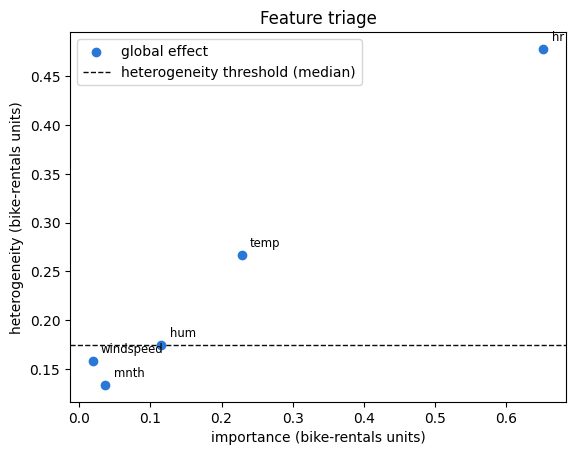
    


```python
# the per-feature look, reusing the same fitted engine
for i in [2, 3, 8, 9, 10]:
    pdp.plot(feature=i, centering=True, scale_x=scale_x_list[i], scale_y=scale_y, show_avg_output=True, nof_ice=200, y_limits=y_limits)
```


    

    


    

    


    

    


    

    


    

    


We observe that features: `hour`, `temperature` and `humidity` have an intersting structure. Out of them `hour` has by far the most influence on the output, so it makes sensce to focus on it further.

## Feature `hour`

### All global methods at a glance

Before diving into each method separately, we can compare them in a single figure with the unified `effector.FeatureEffect` API. It holds the data/model/scaling once and overlays the (centered) mean effect of each method, so differences between methods are immediately visible. `ShapDP` can be added to the list too (it is slower, so it is opt-in).


```python
fe = effector.FeatureEffect(
    X_train.to_numpy(),
    model_forward,
    model_jac=model_jac,
    schema=schema,
    nof_instances=2000,
)
fe.plot(
    feature=3,
    methods=["PDP", "ALE", "RHALE"],
    centering=True,
    scale_x=scale_x,
    scale_y=scale_y,
    y_limits=y_limits,
)
```


    
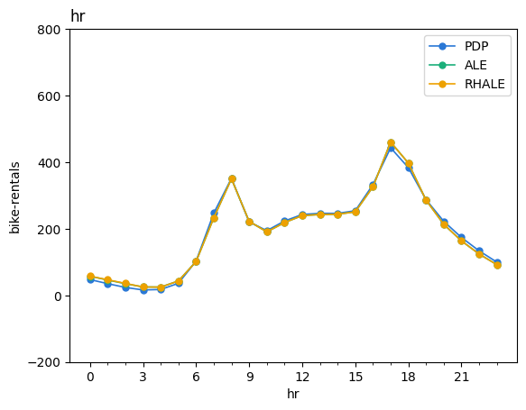
    


### PDP - global


```python
pdp = effector.PDP(data=X_train.to_numpy(), model=model_forward, schema=schema, nof_instances=5000)
pdp.plot(feature="hr", centering=True, scale_x=scale_x, scale_y=scale_y, show_avg_output=True, nof_ice=200)
```


    
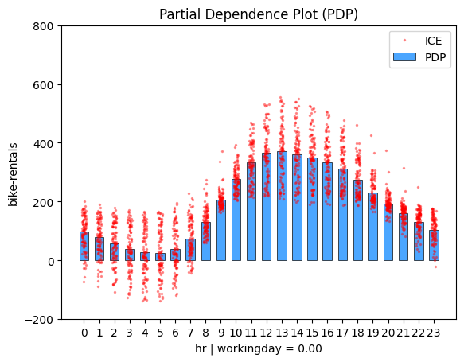
    


### Importance and one-click explanation

Beyond the per-feature effect curves, the fitted global effect exposes an `importances()`
vector (the dispersion of each feature's mean effect — the $\mu$-twin of heterogeneity), and
`effector.explain(...)` runs the whole pipeline once and returns a serializable `Report`.


```python
# per-feature importance = dispersion of the mean effect (mu-twin of heterogeneity)
print("importances:", np.round(pdp.importances(), 3))

# one-click auto-explanation -> Report (serializable; self-contained HTML).
# We let the auto-search condition on the categorical drivers (season, yr, holiday,
# weekday, workingday, weathersit) -- exactly the low-cardinality features the
# regional analysis below splits on.
report = effector.explain(
    X_train.to_numpy(),
    model_forward,
    y=Y_train.to_numpy().squeeze(),
    method="pdp",
    schema=schema,
    nof_instances=2000,
    candidate_conditioning_features=[0, 1, 4, 5, 6, 7],
)
report.show()
```

    importances: [0.09  0.191 0.04  0.663 0.022 0.044 0.041 0.053 0.228 0.112 0.018]


    [effector] global effects reproduce 71.7% of the model's variance; with subregions, 86.5%
    
    PDP report — target: bike-rentals
    ============================================================
    data: 2,000 instances × 11 features (5 nominal · 3 ordinal · 3 continuous) — target bike-rentals
    model output: mean -0.0853, std 0.978, range [-1.31, 4.07] · R² 0.947 (on this subsample)
    explained variance: global effects (GAM) 71.7%
      + split hr (on season, workingday, yr) → 86.5% (+14.8 pts, heter 0.478→0.296)
      rejected: workingday (on workingday) — +0.0 pts, redundant (variance already explained)
    ------------------------------------------------------------
    feature                   importance     heter  #regions
    ------------------------------------------------------------
    hr                            0.7328    0.2958         7
    temp                          0.2281    0.2668         1
    yr                            0.1878    0.2028         1
    hum                           0.1155    0.1743         1
    ============================================================
    the plotted features carry 80% of the total importance mass
    
    
    Feature 3 - Full partition tree:
    🌳 Full Tree Structure:
    ───────────────────────
    hr 🔹 [id: 0 | heter: 0.48 | inst: 2000 | w: 1.00]
        workingday = no 🔹 [id: 1 | heter: 0.37 | inst: 614 | w: 0.31]
            season = winter 🔹 [id: 2 | heter: 0.26 | inst: 154 | w: 0.08]
            season ∈ {spring, summer, fall} 🔹 [id: 3 | heter: 0.34 | inst: 460 | w: 0.23]
        workingday = yes 🔹 [id: 4 | heter: 0.34 | inst: 1386 | w: 0.69]
            yr = 2011 🔹 [id: 5 | heter: 0.25 | inst: 696 | w: 0.35]
            yr = 2012 🔹 [id: 6 | heter: 0.32 | inst: 690 | w: 0.34]
    --------------------------------------------------
    Feature 3 - Statistics per tree level:
    🌳 Tree Summary:
    ─────────────────
    Level 0🔹heter: 0.48
        Level 1🔹heter: 0.35 | 🔻0.13 (26.67%)
            Level 2🔹heter: 0.30 | 🔻0.05 (15.62%)
    
    


### PDP - regional


```python
pdp_reg = effector.PDP(data=X_train.to_numpy(), model=model_forward, schema=schema, nof_instances=5_000)
pdp_reg.fit("hr", centering=True)
part_pdp = pdp_reg.find_regions("hr", finder="best")
part_pdp.show(scale_x_list=scale_x_list)
```

    
    
    Feature 3 - Full partition tree:
    🌳 Full Tree Structure:
    ───────────────────────
    hr 🔹 [id: 0 | heter: 0.48 | inst: 5000 | w: 1.00]
        workingday = no 🔹 [id: 1 | heter: 0.37 | inst: 1563 | w: 0.31]
            temp < 4.50 🔹 [id: 2 | heter: 0.24 | inst: 642 | w: 0.13]
            temp ≥ 4.50 🔹 [id: 3 | heter: 0.33 | inst: 921 | w: 0.18]
        workingday = yes 🔹 [id: 4 | heter: 0.34 | inst: 3437 | w: 0.69]
            yr = 2011 🔹 [id: 5 | heter: 0.25 | inst: 1762 | w: 0.35]
            yr = 2012 🔹 [id: 6 | heter: 0.32 | inst: 1675 | w: 0.34]
    --------------------------------------------------
    Feature 3 - Statistics per tree level:
    🌳 Tree Summary:
    ─────────────────
    Level 0🔹heter: 0.48
        Level 1🔹heter: 0.35 | 🔻0.13 (26.72%)
            Level 2🔹heter: 0.29 | 🔻0.06 (18.37%)
    
    


```python
# plot the level-1 subregions (region idx == old node_idx)
for r in part_pdp:
    if r.level == 1:
        part_pdp.plot(r.idx, centering=True, scale_x_list=scale_x_list, scale_y=scale_y, y_limits=y_limits)
```


    

    


    
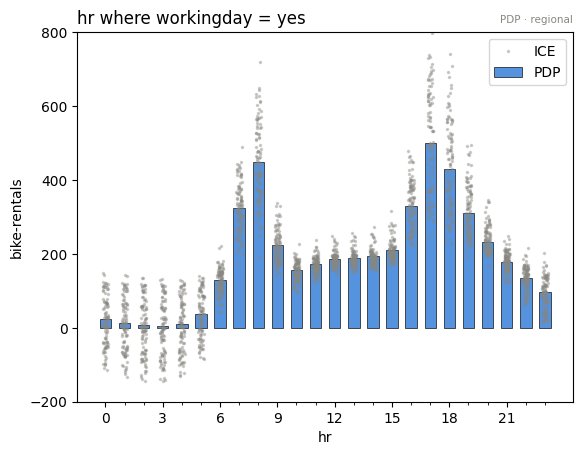
    


The same node, ad hoc: any verb takes `rule=` — here node 1's rule straight from the partition.


```python
pdp_reg.plot("hr", rule=part_pdp[1].rule, centering=True, scale_x=scale_x, scale_y=scale_y, y_limits=y_limits)
```


    
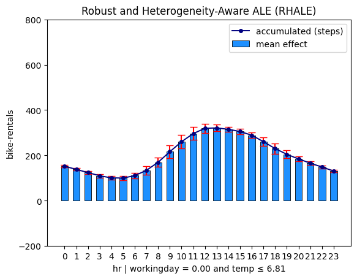
    


```python
# and the level-2 subregions, where the tree splits further
for r in part_pdp:
    if r.level == 2:
        part_pdp.plot(r.idx, centering=True, scale_x_list=scale_x_list, scale_y=scale_y, y_limits=y_limits)
```


    
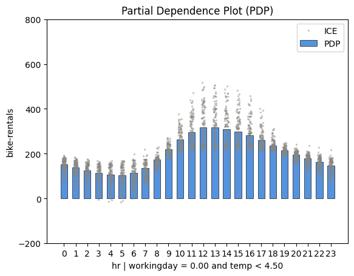
    


    
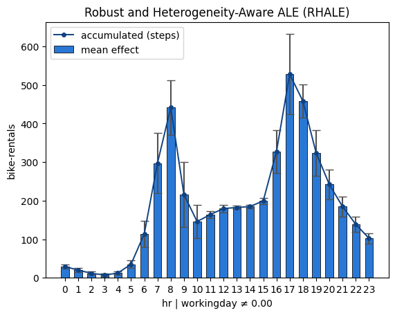
    


    
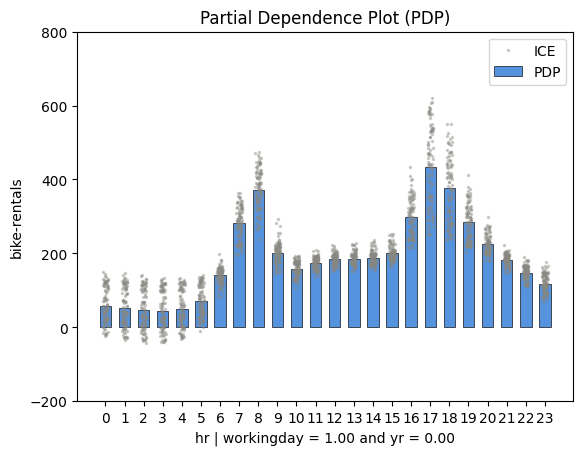
    


    
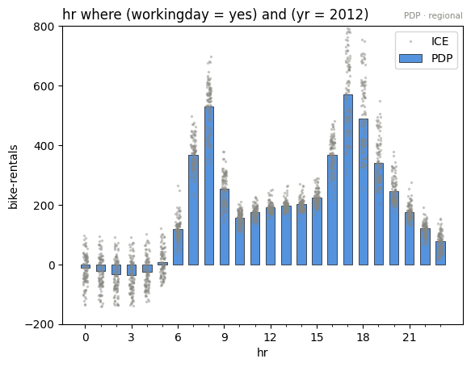
    


## Triage, after: the before/after arrows

The same triage plane, revisited with `partitions=`: for every partitioned feature an arrow runs from its global point to each leaf point (the leaf's importance/heterogeneity under its rule). Leaves of a good partition move right and down — more decisive, less heterogeneous. Here, splitting `hr` on `workingday` does exactly that.


```python
effector.plot_triage(pdp_reg, features=[2, 3, 8, 9, 10], partitions={"hr": part_pdp})
```


    
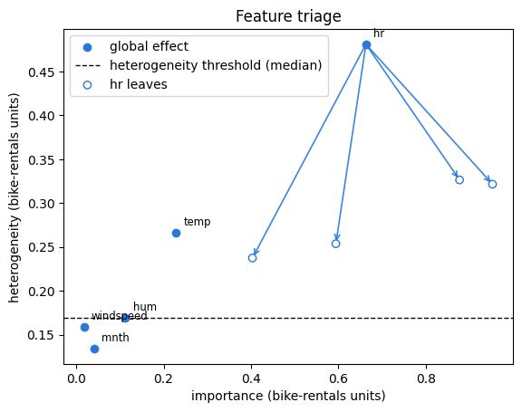
    


### RHALE - global


```python
rhale = effector.RHALE(data=X_train.to_numpy(), model=model_forward, model_jac=model_jac, schema=schema)
rhale.plot(feature="hr", heterogeneity="std", centering=True, scale_x=scale_x, scale_y=scale_y, show_avg_output=True)
```


    

    


### PDP vs RHALE on one axis

`effector.compare` overlays engines you already hold — method disagreement is information. The curves are always centered, so only shape differences remain.


```python
effector.compare(pdp, rhale, feature="hr", scale_x=scale_x_list[3], scale_y=scale_y, y_limits=y_limits)
```


    

    


### RHALE - regional


```python
rhale_reg = effector.RHALE(data=X_train.to_numpy(), model=model_forward, model_jac=model_jac, schema=schema)
rhale_reg.fit("hr", centering=True)
part_rhale = rhale_reg.find_regions("hr", finder="best")
part_rhale.show(scale_x_list=scale_x_list)
```

    
    
    Feature 3 - Full partition tree:
    🌳 Full Tree Structure:
    ───────────────────────
    hr 🔹 [id: 0 | heter: 2.24 | inst: 10000 | w: 1.00]
        workingday = no 🔹 [id: 1 | heter: 0.80 | inst: 3148 | w: 0.31]
            temp < 6.81 🔹 [id: 2 | heter: 0.62 | inst: 1577 | w: 0.16]
            temp ≥ 6.81 🔹 [id: 3 | heter: 0.70 | inst: 1571 | w: 0.16]
        workingday = yes 🔹 [id: 4 | heter: 1.63 | inst: 6852 | w: 0.69]
            yr = 2011 🔹 [id: 5 | heter: 1.15 | inst: 3463 | w: 0.35]
            yr = 2012 🔹 [id: 6 | heter: 1.52 | inst: 3389 | w: 0.34]
    --------------------------------------------------
    Feature 3 - Statistics per tree level:
    🌳 Tree Summary:
    ─────────────────
    Level 0🔹heter: 2.24
        Level 1🔹heter: 1.37 | 🔻0.87 (38.77%)
            Level 2🔹heter: 1.12 | 🔻0.25 (18.48%)
    
    


```python
for r in part_rhale:
    if r.level == 1:
        part_rhale.plot(r.idx, centering=True, scale_x_list=scale_x_list, scale_y=scale_y)
```


    

    


    

    


```python
for r in part_rhale:
    if r.level == 2:
        part_rhale.plot(r.idx, centering=True, scale_x_list=scale_x_list, scale_y=scale_y, y_limits=y_limits)
```


    
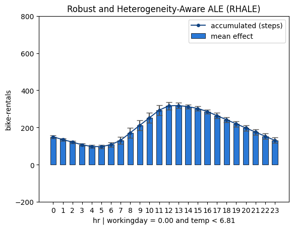
    


    

    


    

    


    

    


### SHAPDP - global


```python
shap_dp = effector.ShapDP(data=X_train.to_numpy(), model=model_forward, schema=schema, nof_instances=500)
shap_dp.plot(feature="hr", centering=True, scale_x=scale_x, scale_y=scale_y, show_avg_output=True)
```


    

    


### SHAPDP - regional


```python
shap_dp_reg = effector.ShapDP(data=X_train.to_numpy(), model=model_forward, schema=schema, nof_instances=500)
shap_dp_reg.fit("hr", centering=True)
part_shap = shap_dp_reg.find_regions("hr", finder="best")
part_shap.show(scale_x_list=scale_x_list)
```

    
    
    Feature 3 - Full partition tree:
    🌳 Full Tree Structure:
    ───────────────────────
    hr 🔹 [id: 0 | heter: 0.23 | inst: 500 | w: 1.00]
        workingday = no 🔹 [id: 1 | heter: 0.13 | inst: 155 | w: 0.31]
            temp < 2.20 🔹 [id: 2 | heter: 0.09 | inst: 59 | w: 0.12]
            temp ≥ 2.20 🔹 [id: 3 | heter: 0.11 | inst: 96 | w: 0.19]
        workingday = yes 🔹 [id: 4 | heter: 0.16 | inst: 345 | w: 0.69]
            yr = 2011 🔹 [id: 5 | heter: 0.11 | inst: 173 | w: 0.35]
            yr = 2012 🔹 [id: 6 | heter: 0.11 | inst: 172 | w: 0.34]
    --------------------------------------------------
    Feature 3 - Statistics per tree level:
    🌳 Tree Summary:
    ─────────────────
    Level 0🔹heter: 0.23
        Level 1🔹heter: 0.15 | 🔻0.08 (34.60%)
            Level 2🔹heter: 0.11 | 🔻0.04 (26.71%)
    
    


```python
for r in part_shap:
    if r.level == 1:
        part_shap.plot(r.idx, centering=True, scale_x_list=scale_x_list, scale_y=scale_y)
```


    

    


    

    


```python
for r in part_shap:
    if r.level == 2:
        part_shap.plot(r.idx, centering=True, scale_x_list=scale_x_list, scale_y=scale_y, y_limits=y_limits)
```


    

    


    
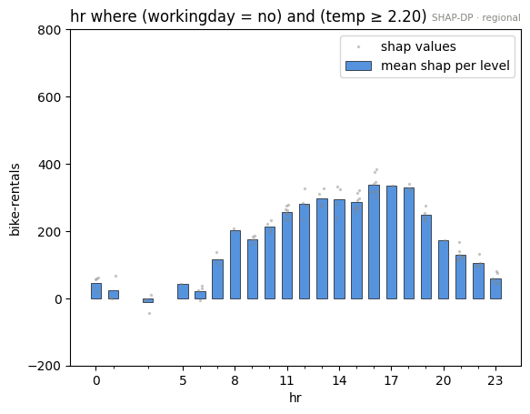
    


    

    


    
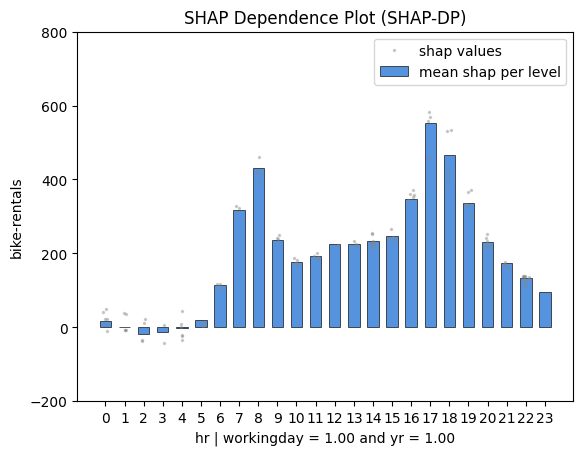
    


## Conclusion

**Global effect of hour**
All methods agree: *hour* has a strong influence on bike rentals, showing two clear peaks—around **8:00** and **17:00**. This likely reflects commute times. But the exact shape of the effect varies between methods, hinting that local (regional) patterns could help explain these differences.

**Regional effect of hour**
When we zoom in using regional methods, two patterns emerge:

* **On working days**, the effect follows the global trend, with peaks at **8:00** and **17:00**—again, probably due to commuting.
* **On non-working days**, we see a single peak around **13:00**, which makes sense if people are out enjoying leisure activities or sightseeing.

All methods agree up to this point.

**Interactions**
Looking deeper, we see some interesting (but weaker) interactions. Most methods highlight either **temperature** or **year** (whether it’s the first or second year of data) as relevant.

For example, RHALE shows that on **non-working days**, the midday peak (12:00–14:00) becomes even stronger when the **temperature is higher**. That fits our intuition—people are more likely to rent bikes when it’s warm and sunny.

**The workflow**
This notebook *is* the canonical effector pipeline: **(a)** scope the features and hand the model over (`adapters.check`), **(b)** triage them on the importance × heterogeneity plane (`plot_triage`), **(c)** look at the effects that matter (`plot`), **(d)** partition the heterogeneous ones (`find_regions` + leaf plots), and **(e)** close the loop with the before/after arrows (`plot_triage(..., partitions=...)`). For the reasoning behind each step, see the mental-model page (`../../quickstart/mental_model.md`).

## Cross-method sanity check

The one-liner `effector.explain` with every engine this notebook's model
supports. Everything must run end to end; the closing table puts the reads
side by side. Where methods disagree — ranking, accepted splits, R² — that is
a property of the data/model worth a closer look, not an error.


```python
from pathlib import Path
_out = Path("reports") / "01_bike_sharing_dataset"
_out.mkdir(parents=True, exist_ok=True)

# === cross-method sweep: effector.explain on every applicable engine ======
sweep_reports = {}
for _m in ["pdp", "derpdp", "ale", "rhale", "shapdp"]:
    _kw = {"nof_instances": 300} if _m == "shapdp" else {}
    print(f"--- {_m} " + "-" * 50)
    sweep_reports[_m] = effector.explain(
        X_train.to_numpy(), model_forward, model_jac,
        y=Y_train.to_numpy().squeeze(), method=_m, schema=schema, **_kw
    )
    sweep_reports[_m].to_html(_out / f"report_{_m}.html")

print()
print(f"{'method':<8} {'ranking (plotted)':<44} {'GAM R2':>8} {'final R2':>9}  splits")
for _m, _r in sweep_reports.items():
    _rank = " > ".join(fr.name for fr in _r.features)
    _ev = _r.explained_variance
    if _ev:
        _sp = "; ".join(f"{s['name']} on {s['on']}" for s in _ev["stages"]) or "none"
        print(f"{_m:<8} {_rank:<44} {_ev['gam_r2']:>7.1%} {_ev['regional_r2']:>8.1%}  {_sp}")
    else:
        print(f"{_m:<8} {_rank:<44} {'-':>7} {'-':>8}  (derivative scale: no variance ledger)")

print(f"\nreports stored in {_out}/")

```

    --- pdp --------------------------------------------------


    [effector] global effects reproduce 71.3% of the model's variance; with subregions, 88.7%


    /home/givasile/github/packages/effector/effector/report.py:422: UserWarning: This figure includes Axes that are not compatible with tight_layout, so results might be incorrect.
      fig.tight_layout()


    --- derpdp --------------------------------------------------


    /home/givasile/github/packages/effector/effector/report.py:422: UserWarning: This figure includes Axes that are not compatible with tight_layout, so results might be incorrect.
      fig.tight_layout()


    --- ale --------------------------------------------------


    [effector] global effects reproduce 71.0% of the model's variance; with subregions, 88.8%


    /home/givasile/github/packages/effector/effector/report.py:422: UserWarning: This figure includes Axes that are not compatible with tight_layout, so results might be incorrect.
      fig.tight_layout()


    --- rhale --------------------------------------------------


    [effector] global effects reproduce 70.6% of the model's variance; with subregions, 88.4%


    /home/givasile/github/packages/effector/effector/report.py:422: UserWarning: This figure includes Axes that are not compatible with tight_layout, so results might be incorrect.
      fig.tight_layout()


    --- shapdp --------------------------------------------------


    [effector] global effects reproduce 75.0% of the model's variance; with subregions, 88.4%


    /home/givasile/github/packages/effector/effector/report.py:422: UserWarning: This figure includes Axes that are not compatible with tight_layout, so results might be incorrect.
      fig.tight_layout()


    
    method   ranking (plotted)                              GAM R2  final R2  splits
    pdp      hr > temp > yr > hum                           71.3%    88.7%  hr on temp, workingday, yr
    derpdp   hr > temp > yr                                     -        -  (derivative scale: no variance ledger)
    ale      hr > yr > temp > season > hum                  71.0%    88.8%  hr on temp, workingday, yr
    rhale    hr > yr > temp > season > hum                  70.6%    88.4%  hr on temp, workingday, yr
    shapdp   hr > temp > yr > hum > season                  75.0%    88.4%  hr on temp, workingday, yr; temp on hum
    
    reports stored in reports/01_bike_sharing_dataset/

