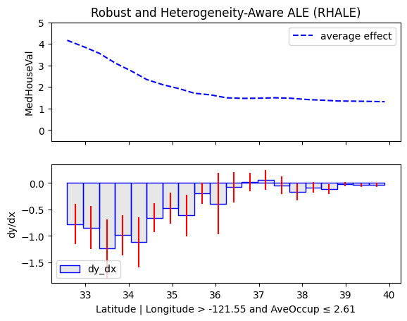
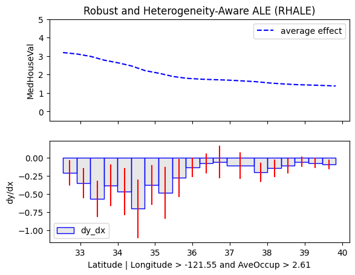

# California Housing

- Author: [givasile](https://givasile.github.io/)
- Runtime: ~35 s
- Description: Global and regional RHALE effects on the California-housing
  dataset, explaining a neural network's predicted house values — with
  regional splits on income, latitude and longitude.


```python
import numpy as np
import keras
import tensorflow as tf
import effector
from sklearn.datasets import fetch_california_housing

california_housing = fetch_california_housing(as_frame=True)
```

    WARNING: All log messages before absl::InitializeLog() is called are written to STDERR
    I0000 00:00:1783103263.772117   42694 cpu_feature_guard.cc:227] This TensorFlow binary is optimized to use available CPU instructions in performance-critical operations.
    To enable the following instructions: AVX2 FMA, in other operations, rebuild TensorFlow with the appropriate compiler flags.


```python
np.random.seed(21)
```


```python
print(california_housing.DESCR)
```

    .. _california_housing_dataset:
    
    California Housing dataset
    --------------------------
    
    **Data Set Characteristics:**
    
    :Number of Instances: 20640
    
    :Number of Attributes: 8 numeric, predictive attributes and the target
    
    :Attribute Information:
        - MedInc        median income in block group
        - HouseAge      median house age in block group
        - AveRooms      average number of rooms per household
        - AveBedrms     average number of bedrooms per household
        - Population    block group population
        - AveOccup      average number of household members
        - Latitude      block group latitude
        - Longitude     block group longitude
    
    :Missing Attribute Values: None
    
    This dataset was obtained from the StatLib repository.
    https://www.dcc.fc.up.pt/~ltorgo/Regression/cal_housing.html
    
    The target variable is the median house value for California districts,
    expressed in hundreds of thousands of dollars ($100,000).
    
    This dataset was derived from the 1990 U.S. census, using one row per census
    block group. A block group is the smallest geographical unit for which the U.S.
    Census Bureau publishes sample data (a block group typically has a population
    of 600 to 3,000 people).
    
    A household is a group of people residing within a home. Since the average
    number of rooms and bedrooms in this dataset are provided per household, these
    columns may take surprisingly large values for block groups with few households
    and many empty houses, such as vacation resorts.
    
    It can be downloaded/loaded using the
    :func:`sklearn.datasets.fetch_california_housing` function.
    
    .. rubric:: References
    
    - Pace, R. Kelley and Ronald Barry, Sparse Spatial Autoregressions,
      Statistics and Probability Letters, 33:291-297, 1997.
    


```python
feature_names = california_housing.feature_names
target_name= california_housing.target_names[0]
df = type(california_housing.frame)
```


```python
X = california_housing.data
y = california_housing.target
```


```python
print("Design matrix shape: {}".format(X.shape))
print("---------------------------------")
for col_name in X.columns:
    print("Feature: {:15}, unique: {:4d}, Mean: {:6.2f}, Std: {:6.2f}, Min: {:6.2f}, Max: {:6.2f}".format(col_name, len(X[col_name].unique()), X[col_name].mean(), X[col_name].std(), X[col_name].min(), X[col_name].max()))
    
print("\nTarget shape: {}".format(y.shape))
print("---------------------------------")
print("Target: {:15}, unique: {:4d}, Mean: {:6.2f}, Std: {:6.2f}, Min: {:6.2f}, Max: {:6.2f}".format(y.name, len(y.unique()), y.mean(), y.std(), y.min(), y.max()))
```

    Design matrix shape: (20640, 8)
    ---------------------------------
    Feature: MedInc         , unique: 12928, Mean:   3.87, Std:   1.90, Min:   0.50, Max:  15.00
    Feature: HouseAge       , unique:   52, Mean:  28.64, Std:  12.59, Min:   1.00, Max:  52.00
    Feature: AveRooms       , unique: 19392, Mean:   5.43, Std:   2.47, Min:   0.85, Max: 141.91
    Feature: AveBedrms      , unique: 14233, Mean:   1.10, Std:   0.47, Min:   0.33, Max:  34.07
    Feature: Population     , unique: 3888, Mean: 1425.48, Std: 1132.46, Min:   3.00, Max: 35682.00
    Feature: AveOccup       , unique: 18841, Mean:   3.07, Std:  10.39, Min:   0.69, Max: 1243.33
    Feature: Latitude       , unique:  862, Mean:  35.63, Std:   2.14, Min:  32.54, Max:  41.95
    Feature: Longitude      , unique:  844, Mean: -119.57, Std:   2.00, Min: -124.35, Max: -114.31
    
    Target shape: (20640,)
    ---------------------------------
    Target: MedHouseVal    , unique: 3842, Mean:   2.07, Std:   1.15, Min:   0.15, Max:   5.00


```python
def preprocess(X, y):
    # Compute mean and std for outlier detection
    X_mean = X.mean()
    X_std = X.std()
    
    # Exclude instances with any feature 2 std away from the mean
    mask = (X - X_mean).abs() <= 2 * X_std
    mask = mask.all(axis=1)
    
    X_filtered = X[mask]
    y_filtered = y[mask]

    # Standardize X
    X_mean = X_filtered.mean()
    X_std = X_filtered.std()
    X_standardized = (X_filtered - X_mean) / X_std

    # Standardize y
    y_mean = y_filtered.mean()
    y_std = y_filtered.std()
    y_standardized = (y_filtered - y_mean) / y_std

    return X_standardized, y_standardized, X_mean, X_std, y_mean, y_std


# shuffle and standarize all features
X_df, Y_df, x_mean, x_std, y_mean, y_std = preprocess(X, y)
```


```python
def split(X_df, Y_df):
    # shuffle indices
    indices = np.arange(len(X_df))
    np.random.shuffle(indices)
    
    # data split
    train_size = int(0.8 * len(X_df))
    
    X_train = X_df.iloc[indices[:train_size]]
    Y_train = Y_df.iloc[indices[:train_size]]
    X_test = X_df.iloc[indices[train_size:]]
    Y_test = Y_df.iloc[indices[train_size:]]
    
    return X_train, Y_train, X_test, Y_test

# train/test split
X_train, Y_train, X_test, Y_test = split(X_df, Y_df)
```


```python
# Train - Evaluate - Explain a neural network
model = keras.Sequential([
    keras.layers.Dense(1024, activation="relu"),
    keras.layers.Dense(512, activation="relu"),
    keras.layers.Dense(256, activation="relu"),
    keras.layers.Dense(1)
])

optimizer = keras.optimizers.Adam(learning_rate=0.001)
model.compile(optimizer=optimizer, loss="mse", metrics=["mae", keras.metrics.RootMeanSquaredError()])
model.fit(X_train, Y_train, batch_size=1024, epochs=20, verbose=1)
model.evaluate(X_train, Y_train, verbose=1)
model.evaluate(X_test, Y_test, verbose=1)
```

    Epoch 1/20


    
 1/15 ━━━━━━━━━━━━━━━━━━━━ 12s 861ms/step - loss: 0.9581 - mae: 0.7726 - root_mean_squared_error: 0.9788

    
 4/15 ━━━━━━━━━━━━━━━━━━━━ 0s 20ms/step - loss: 0.7932 - mae: 0.6872 - root_mean_squared_error: 0.8885  

    
 7/15 ━━━━━━━━━━━━━━━━━━━━ 0s 19ms/step - loss: 0.7040 - mae: 0.6400 - root_mean_squared_error: 0.8355

    
11/15 ━━━━━━━━━━━━━━━━━━━━ 0s 18ms/step - loss: 0.6348 - mae: 0.6007 - root_mean_squared_error: 0.7922

    
15/15 ━━━━━━━━━━━━━━━━━━━━ 0s 17ms/step - loss: 0.5899 - mae: 0.5746 - root_mean_squared_error: 0.7631

    
15/15 ━━━━━━━━━━━━━━━━━━━━ 1s 18ms/step - loss: 0.4578 - mae: 0.4973 - root_mean_squared_error: 0.6766


    Epoch 2/20


    
 1/15 ━━━━━━━━━━━━━━━━━━━━ 0s 29ms/step - loss: 0.3356 - mae: 0.4224 - root_mean_squared_error: 0.5793

    
 4/15 ━━━━━━━━━━━━━━━━━━━━ 0s 17ms/step - loss: 0.3423 - mae: 0.4261 - root_mean_squared_error: 0.5850

    
 8/15 ━━━━━━━━━━━━━━━━━━━━ 0s 16ms/step - loss: 0.3355 - mae: 0.4199 - root_mean_squared_error: 0.5792

    
12/15 ━━━━━━━━━━━━━━━━━━━━ 0s 16ms/step - loss: 0.3326 - mae: 0.4166 - root_mean_squared_error: 0.5767

    
15/15 ━━━━━━━━━━━━━━━━━━━━ 0s 16ms/step - loss: 0.3144 - mae: 0.4022 - root_mean_squared_error: 0.5607


    Epoch 3/20


    
 1/15 ━━━━━━━━━━━━━━━━━━━━ 0s 29ms/step - loss: 0.2673 - mae: 0.3745 - root_mean_squared_error: 0.5171

    
 4/15 ━━━━━━━━━━━━━━━━━━━━ 0s 17ms/step - loss: 0.2897 - mae: 0.3914 - root_mean_squared_error: 0.5381

    
 7/15 ━━━━━━━━━━━━━━━━━━━━ 0s 17ms/step - loss: 0.2934 - mae: 0.3923 - root_mean_squared_error: 0.5416

    
11/15 ━━━━━━━━━━━━━━━━━━━━ 0s 17ms/step - loss: 0.2944 - mae: 0.3916 - root_mean_squared_error: 0.5425

    
14/15 ━━━━━━━━━━━━━━━━━━━━ 0s 17ms/step - loss: 0.2950 - mae: 0.3913 - root_mean_squared_error: 0.5430

    
15/15 ━━━━━━━━━━━━━━━━━━━━ 0s 17ms/step - loss: 0.2984 - mae: 0.3908 - root_mean_squared_error: 0.5462


    Epoch 4/20


    
 1/15 ━━━━━━━━━━━━━━━━━━━━ 0s 29ms/step - loss: 0.3180 - mae: 0.3818 - root_mean_squared_error: 0.5640

    
 5/15 ━━━━━━━━━━━━━━━━━━━━ 0s 16ms/step - loss: 0.2975 - mae: 0.3840 - root_mean_squared_error: 0.5453

    
 9/15 ━━━━━━━━━━━━━━━━━━━━ 0s 16ms/step - loss: 0.2933 - mae: 0.3831 - root_mean_squared_error: 0.5415

    
13/15 ━━━━━━━━━━━━━━━━━━━━ 0s 16ms/step - loss: 0.2914 - mae: 0.3826 - root_mean_squared_error: 0.5397

    
15/15 ━━━━━━━━━━━━━━━━━━━━ 0s 17ms/step - loss: 0.2871 - mae: 0.3812 - root_mean_squared_error: 0.5359


    Epoch 5/20


    
 1/15 ━━━━━━━━━━━━━━━━━━━━ 0s 31ms/step - loss: 0.2921 - mae: 0.3758 - root_mean_squared_error: 0.5405

    
 5/15 ━━━━━━━━━━━━━━━━━━━━ 0s 16ms/step - loss: 0.2821 - mae: 0.3735 - root_mean_squared_error: 0.5311

    
 9/15 ━━━━━━━━━━━━━━━━━━━━ 0s 16ms/step - loss: 0.2825 - mae: 0.3751 - root_mean_squared_error: 0.5315

    
13/15 ━━━━━━━━━━━━━━━━━━━━ 0s 16ms/step - loss: 0.2825 - mae: 0.3752 - root_mean_squared_error: 0.5315

    
15/15 ━━━━━━━━━━━━━━━━━━━━ 0s 16ms/step - loss: 0.2807 - mae: 0.3749 - root_mean_squared_error: 0.5298


    Epoch 6/20


    
 1/15 ━━━━━━━━━━━━━━━━━━━━ 0s 28ms/step - loss: 0.2616 - mae: 0.3720 - root_mean_squared_error: 0.5115

    
 5/15 ━━━━━━━━━━━━━━━━━━━━ 0s 17ms/step - loss: 0.2821 - mae: 0.3744 - root_mean_squared_error: 0.5310

    
 9/15 ━━━━━━━━━━━━━━━━━━━━ 0s 16ms/step - loss: 0.2844 - mae: 0.3775 - root_mean_squared_error: 0.5333

    
13/15 ━━━━━━━━━━━━━━━━━━━━ 0s 16ms/step - loss: 0.2829 - mae: 0.3768 - root_mean_squared_error: 0.5319

    
15/15 ━━━━━━━━━━━━━━━━━━━━ 0s 16ms/step - loss: 0.2763 - mae: 0.3719 - root_mean_squared_error: 0.5257


    Epoch 7/20


    
 1/15 ━━━━━━━━━━━━━━━━━━━━ 0s 29ms/step - loss: 0.2616 - mae: 0.3751 - root_mean_squared_error: 0.5114

    
 5/15 ━━━━━━━━━━━━━━━━━━━━ 0s 16ms/step - loss: 0.2693 - mae: 0.3716 - root_mean_squared_error: 0.5189

    
 9/15 ━━━━━━━━━━━━━━━━━━━━ 0s 16ms/step - loss: 0.2705 - mae: 0.3709 - root_mean_squared_error: 0.5201

    
13/15 ━━━━━━━━━━━━━━━━━━━━ 0s 16ms/step - loss: 0.2694 - mae: 0.3693 - root_mean_squared_error: 0.5191

    
15/15 ━━━━━━━━━━━━━━━━━━━━ 0s 16ms/step - loss: 0.2661 - mae: 0.3654 - root_mean_squared_error: 0.5159


    Epoch 8/20


    
 1/15 ━━━━━━━━━━━━━━━━━━━━ 0s 31ms/step - loss: 0.2811 - mae: 0.3701 - root_mean_squared_error: 0.5302

    
 4/15 ━━━━━━━━━━━━━━━━━━━━ 0s 17ms/step - loss: 0.2824 - mae: 0.3708 - root_mean_squared_error: 0.5314

    
 8/15 ━━━━━━━━━━━━━━━━━━━━ 0s 16ms/step - loss: 0.2771 - mae: 0.3685 - root_mean_squared_error: 0.5263

    
12/15 ━━━━━━━━━━━━━━━━━━━━ 0s 16ms/step - loss: 0.2729 - mae: 0.3662 - root_mean_squared_error: 0.5223

    
15/15 ━━━━━━━━━━━━━━━━━━━━ 0s 16ms/step - loss: 0.2631 - mae: 0.3604 - root_mean_squared_error: 0.5130


    Epoch 9/20


    
 1/15 ━━━━━━━━━━━━━━━━━━━━ 0s 30ms/step - loss: 0.2354 - mae: 0.3472 - root_mean_squared_error: 0.4852

    
 5/15 ━━━━━━━━━━━━━━━━━━━━ 0s 15ms/step - loss: 0.2552 - mae: 0.3547 - root_mean_squared_error: 0.5051

    
 9/15 ━━━━━━━━━━━━━━━━━━━━ 0s 15ms/step - loss: 0.2574 - mae: 0.3559 - root_mean_squared_error: 0.5073

    
13/15 ━━━━━━━━━━━━━━━━━━━━ 0s 15ms/step - loss: 0.2568 - mae: 0.3555 - root_mean_squared_error: 0.5067

    
15/15 ━━━━━━━━━━━━━━━━━━━━ 0s 15ms/step - loss: 0.2535 - mae: 0.3538 - root_mean_squared_error: 0.5035


    Epoch 10/20


    
 1/15 ━━━━━━━━━━━━━━━━━━━━ 0s 28ms/step - loss: 0.2433 - mae: 0.3463 - root_mean_squared_error: 0.4933

    
 5/15 ━━━━━━━━━━━━━━━━━━━━ 0s 16ms/step - loss: 0.2402 - mae: 0.3423 - root_mean_squared_error: 0.4901

    
 9/15 ━━━━━━━━━━━━━━━━━━━━ 0s 16ms/step - loss: 0.2417 - mae: 0.3428 - root_mean_squared_error: 0.4917

    
13/15 ━━━━━━━━━━━━━━━━━━━━ 0s 16ms/step - loss: 0.2423 - mae: 0.3435 - root_mean_squared_error: 0.4922

    
15/15 ━━━━━━━━━━━━━━━━━━━━ 0s 16ms/step - loss: 0.2447 - mae: 0.3457 - root_mean_squared_error: 0.4946


    Epoch 11/20


    
 1/15 ━━━━━━━━━━━━━━━━━━━━ 0s 28ms/step - loss: 0.2249 - mae: 0.3342 - root_mean_squared_error: 0.4743

    
 5/15 ━━━━━━━━━━━━━━━━━━━━ 0s 15ms/step - loss: 0.2403 - mae: 0.3420 - root_mean_squared_error: 0.4901

    
 9/15 ━━━━━━━━━━━━━━━━━━━━ 0s 15ms/step - loss: 0.2400 - mae: 0.3421 - root_mean_squared_error: 0.4898

    
13/15 ━━━━━━━━━━━━━━━━━━━━ 0s 15ms/step - loss: 0.2404 - mae: 0.3428 - root_mean_squared_error: 0.4903

    
15/15 ━━━━━━━━━━━━━━━━━━━━ 0s 16ms/step - loss: 0.2442 - mae: 0.3478 - root_mean_squared_error: 0.4941


    Epoch 12/20


    
 1/15 ━━━━━━━━━━━━━━━━━━━━ 0s 30ms/step - loss: 0.2934 - mae: 0.3673 - root_mean_squared_error: 0.5417

    
 5/15 ━━━━━━━━━━━━━━━━━━━━ 0s 16ms/step - loss: 0.2696 - mae: 0.3550 - root_mean_squared_error: 0.5191

    
 9/15 ━━━━━━━━━━━━━━━━━━━━ 0s 15ms/step - loss: 0.2602 - mae: 0.3503 - root_mean_squared_error: 0.5099

    
13/15 ━━━━━━━━━━━━━━━━━━━━ 0s 15ms/step - loss: 0.2553 - mae: 0.3485 - root_mean_squared_error: 0.5051

    
15/15 ━━━━━━━━━━━━━━━━━━━━ 0s 16ms/step - loss: 0.2423 - mae: 0.3428 - root_mean_squared_error: 0.4922


    Epoch 13/20


    
 1/15 ━━━━━━━━━━━━━━━━━━━━ 0s 33ms/step - loss: 0.2144 - mae: 0.3292 - root_mean_squared_error: 0.4630

    
 5/15 ━━━━━━━━━━━━━━━━━━━━ 0s 16ms/step - loss: 0.2245 - mae: 0.3310 - root_mean_squared_error: 0.4738

    
 9/15 ━━━━━━━━━━━━━━━━━━━━ 0s 15ms/step - loss: 0.2289 - mae: 0.3336 - root_mean_squared_error: 0.4784

    
13/15 ━━━━━━━━━━━━━━━━━━━━ 0s 15ms/step - loss: 0.2320 - mae: 0.3356 - root_mean_squared_error: 0.4816

    
15/15 ━━━━━━━━━━━━━━━━━━━━ 0s 16ms/step - loss: 0.2371 - mae: 0.3396 - root_mean_squared_error: 0.4869


    Epoch 14/20


    
 1/15 ━━━━━━━━━━━━━━━━━━━━ 0s 28ms/step - loss: 0.2347 - mae: 0.3275 - root_mean_squared_error: 0.4844

    
 5/15 ━━━━━━━━━━━━━━━━━━━━ 0s 16ms/step - loss: 0.2346 - mae: 0.3333 - root_mean_squared_error: 0.4843

    
 9/15 ━━━━━━━━━━━━━━━━━━━━ 0s 16ms/step - loss: 0.2344 - mae: 0.3334 - root_mean_squared_error: 0.4841

    
13/15 ━━━━━━━━━━━━━━━━━━━━ 0s 16ms/step - loss: 0.2332 - mae: 0.3330 - root_mean_squared_error: 0.4829

    
15/15 ━━━━━━━━━━━━━━━━━━━━ 0s 16ms/step - loss: 0.2272 - mae: 0.3310 - root_mean_squared_error: 0.4766


    Epoch 15/20


    
 1/15 ━━━━━━━━━━━━━━━━━━━━ 0s 32ms/step - loss: 0.2250 - mae: 0.3347 - root_mean_squared_error: 0.4743

    
 4/15 ━━━━━━━━━━━━━━━━━━━━ 0s 17ms/step - loss: 0.2239 - mae: 0.3319 - root_mean_squared_error: 0.4732

    
 7/15 ━━━━━━━━━━━━━━━━━━━━ 0s 17ms/step - loss: 0.2247 - mae: 0.3310 - root_mean_squared_error: 0.4740

    
11/15 ━━━━━━━━━━━━━━━━━━━━ 0s 17ms/step - loss: 0.2243 - mae: 0.3300 - root_mean_squared_error: 0.4736

    
15/15 ━━━━━━━━━━━━━━━━━━━━ 0s 16ms/step - loss: 0.2242 - mae: 0.3294 - root_mean_squared_error: 0.4734

    
15/15 ━━━━━━━━━━━━━━━━━━━━ 0s 17ms/step - loss: 0.2231 - mae: 0.3272 - root_mean_squared_error: 0.4724


    Epoch 16/20


    
 1/15 ━━━━━━━━━━━━━━━━━━━━ 0s 31ms/step - loss: 0.2187 - mae: 0.3239 - root_mean_squared_error: 0.4677

    
 4/15 ━━━━━━━━━━━━━━━━━━━━ 0s 18ms/step - loss: 0.2186 - mae: 0.3229 - root_mean_squared_error: 0.4675

    
 8/15 ━━━━━━━━━━━━━━━━━━━━ 0s 17ms/step - loss: 0.2174 - mae: 0.3221 - root_mean_squared_error: 0.4663

    
12/15 ━━━━━━━━━━━━━━━━━━━━ 0s 16ms/step - loss: 0.2190 - mae: 0.3235 - root_mean_squared_error: 0.4679

    
15/15 ━━━━━━━━━━━━━━━━━━━━ 0s 16ms/step - loss: 0.2219 - mae: 0.3268 - root_mean_squared_error: 0.4711


    Epoch 17/20


    
 1/15 ━━━━━━━━━━━━━━━━━━━━ 0s 30ms/step - loss: 0.1995 - mae: 0.3288 - root_mean_squared_error: 0.4466

    
 4/15 ━━━━━━━━━━━━━━━━━━━━ 0s 17ms/step - loss: 0.2197 - mae: 0.3336 - root_mean_squared_error: 0.4686

    
 8/15 ━━━━━━━━━━━━━━━━━━━━ 0s 16ms/step - loss: 0.2214 - mae: 0.3325 - root_mean_squared_error: 0.4704

    
12/15 ━━━━━━━━━━━━━━━━━━━━ 0s 16ms/step - loss: 0.2209 - mae: 0.3306 - root_mean_squared_error: 0.4699

    
15/15 ━━━━━━━━━━━━━━━━━━━━ 0s 16ms/step - loss: 0.2218 - mae: 0.3273 - root_mean_squared_error: 0.4709


    Epoch 18/20


    
 1/15 ━━━━━━━━━━━━━━━━━━━━ 0s 30ms/step - loss: 0.2497 - mae: 0.3380 - root_mean_squared_error: 0.4997

    
 5/15 ━━━━━━━━━━━━━━━━━━━━ 0s 16ms/step - loss: 0.2248 - mae: 0.3285 - root_mean_squared_error: 0.4740

    
 9/15 ━━━━━━━━━━━━━━━━━━━━ 0s 15ms/step - loss: 0.2216 - mae: 0.3265 - root_mean_squared_error: 0.4707

    
13/15 ━━━━━━━━━━━━━━━━━━━━ 0s 15ms/step - loss: 0.2201 - mae: 0.3253 - root_mean_squared_error: 0.4690

    
15/15 ━━━━━━━━━━━━━━━━━━━━ 0s 16ms/step - loss: 0.2152 - mae: 0.3214 - root_mean_squared_error: 0.4639


    Epoch 19/20


    
 1/15 ━━━━━━━━━━━━━━━━━━━━ 0s 30ms/step - loss: 0.1866 - mae: 0.3097 - root_mean_squared_error: 0.4320

    
 4/15 ━━━━━━━━━━━━━━━━━━━━ 0s 17ms/step - loss: 0.1913 - mae: 0.3082 - root_mean_squared_error: 0.4373

    
 8/15 ━━━━━━━━━━━━━━━━━━━━ 0s 16ms/step - loss: 0.2005 - mae: 0.3138 - root_mean_squared_error: 0.4476

    
12/15 ━━━━━━━━━━━━━━━━━━━━ 0s 16ms/step - loss: 0.2057 - mae: 0.3182 - root_mean_squared_error: 0.4533

    
15/15 ━━━━━━━━━━━━━━━━━━━━ 0s 16ms/step - loss: 0.2216 - mae: 0.3289 - root_mean_squared_error: 0.4708


    Epoch 20/20


    
 1/15 ━━━━━━━━━━━━━━━━━━━━ 0s 31ms/step - loss: 0.2015 - mae: 0.3144 - root_mean_squared_error: 0.4488

    
 5/15 ━━━━━━━━━━━━━━━━━━━━ 0s 15ms/step - loss: 0.2058 - mae: 0.3163 - root_mean_squared_error: 0.4536

    
 9/15 ━━━━━━━━━━━━━━━━━━━━ 0s 15ms/step - loss: 0.2095 - mae: 0.3199 - root_mean_squared_error: 0.4577

    
12/15 ━━━━━━━━━━━━━━━━━━━━ 0s 16ms/step - loss: 0.2107 - mae: 0.3209 - root_mean_squared_error: 0.4590

    
15/15 ━━━━━━━━━━━━━━━━━━━━ 0s 16ms/step - loss: 0.2137 - mae: 0.3231 - root_mean_squared_error: 0.4623


    
  1/456 ━━━━━━━━━━━━━━━━━━━━ 48s 107ms/step - loss: 0.1588 - mae: 0.2725 - root_mean_squared_error: 0.3984

    
 26/456 ━━━━━━━━━━━━━━━━━━━━ 0s 2ms/step - loss: 0.2116 - mae: 0.3194 - root_mean_squared_error: 0.4596   

    
 54/456 ━━━━━━━━━━━━━━━━━━━━ 0s 2ms/step - loss: 0.2151 - mae: 0.3215 - root_mean_squared_error: 0.4636

    
 84/456 ━━━━━━━━━━━━━━━━━━━━ 0s 2ms/step - loss: 0.2142 - mae: 0.3218 - root_mean_squared_error: 0.4626

    
114/456 ━━━━━━━━━━━━━━━━━━━━ 0s 2ms/step - loss: 0.2134 - mae: 0.3221 - root_mean_squared_error: 0.4618

    
144/456 ━━━━━━━━━━━━━━━━━━━━ 0s 2ms/step - loss: 0.2123 - mae: 0.3220 - root_mean_squared_error: 0.4607

    
176/456 ━━━━━━━━━━━━━━━━━━━━ 0s 2ms/step - loss: 0.2121 - mae: 0.3220 - root_mean_squared_error: 0.4604

    
208/456 ━━━━━━━━━━━━━━━━━━━━ 0s 2ms/step - loss: 0.2118 - mae: 0.3219 - root_mean_squared_error: 0.4601

    
238/456 ━━━━━━━━━━━━━━━━━━━━ 0s 2ms/step - loss: 0.2119 - mae: 0.3218 - root_mean_squared_error: 0.4602

    
270/456 ━━━━━━━━━━━━━━━━━━━━ 0s 2ms/step - loss: 0.2115 - mae: 0.3216 - root_mean_squared_error: 0.4599

    
300/456 ━━━━━━━━━━━━━━━━━━━━ 0s 2ms/step - loss: 0.2111 - mae: 0.3214 - root_mean_squared_error: 0.4594

    
331/456 ━━━━━━━━━━━━━━━━━━━━ 0s 2ms/step - loss: 0.2107 - mae: 0.3211 - root_mean_squared_error: 0.4590

    
362/456 ━━━━━━━━━━━━━━━━━━━━ 0s 2ms/step - loss: 0.2104 - mae: 0.3208 - root_mean_squared_error: 0.4587

    
394/456 ━━━━━━━━━━━━━━━━━━━━ 0s 2ms/step - loss: 0.2100 - mae: 0.3205 - root_mean_squared_error: 0.4582

    
425/456 ━━━━━━━━━━━━━━━━━━━━ 0s 2ms/step - loss: 0.2097 - mae: 0.3202 - root_mean_squared_error: 0.4578

    
456/456 ━━━━━━━━━━━━━━━━━━━━ 1s 2ms/step - loss: 0.2080 - mae: 0.3184 - root_mean_squared_error: 0.4561


    
  1/114 ━━━━━━━━━━━━━━━━━━━━ 1s 14ms/step - loss: 0.2018 - mae: 0.3423 - root_mean_squared_error: 0.4492

    
 30/114 ━━━━━━━━━━━━━━━━━━━━ 0s 2ms/step - loss: 0.3451 - mae: 0.3919 - root_mean_squared_error: 0.5866 

    
 61/114 ━━━━━━━━━━━━━━━━━━━━ 0s 2ms/step - loss: 0.3323 - mae: 0.3842 - root_mean_squared_error: 0.5759

    
 91/114 ━━━━━━━━━━━━━━━━━━━━ 0s 2ms/step - loss: 0.3199 - mae: 0.3789 - root_mean_squared_error: 0.5650

    
114/114 ━━━━━━━━━━━━━━━━━━━━ 0s 2ms/step - loss: 0.2844 - mae: 0.3611 - root_mean_squared_error: 0.5333


    [0.2844383716583252, 0.3610815405845642, 0.5333276391029358]


```python
def model_jac(x):
    x_tensor = tf.convert_to_tensor(x, dtype=tf.float32)
    with tf.GradientTape() as t:
        t.watch(x_tensor)
        pred = model(x_tensor)
        grads = t.gradient(pred, x_tensor)
    return grads.numpy()

def model_forward(x):
    return model(x).numpy().squeeze()
```


```python
scale_y = {"mean": y_mean, "std": y_std}
scale_x_list =[{"mean": x_mean.iloc[i], "std": x_std.iloc[i]} for i in range(len(x_mean))]
```


```python
y_limits = [-0.5, 5]
dy_limits = [-3, 3]
```

## Global effects


```python
rhale = effector.RHALE(data=X_train.to_numpy(), model=model_forward, model_jac=model_jac, feature_names=feature_names, target_name=target_name, nof_instances="all")
for i in range(len(feature_names)):
    rhale.plot(feature=i, centering=True, scale_x=scale_x_list[i], scale_y=scale_y, y_limits=y_limits, dy_limits=dy_limits)
```


    

    


    

    


    

    


    

    


    

    


    

    


    

    


    

    


## Regional Effects


```python
reg_rhale = effector.RegionalRHALE(data=X_train.to_numpy(), model=model_forward, model_jac=model_jac, feature_names=feature_names, target_name=target_name, nof_instances="all")
reg_rhale.fit("all", space_partitioner=effector.space_partitioning.Best(min_heterogeneity_decrease_pcg=0.25))
reg_rhale.summary(features="all", scale_x_list=scale_x_list)
```

    
  0%|          | 0/8 [00:00<?, ?it/s]

    
 12%|█▎        | 1/8 [00:01<00:10,  1.49s/it]

    
 25%|██▌       | 2/8 [00:02<00:08,  1.49s/it]

    
 38%|███▊      | 3/8 [00:06<00:11,  2.26s/it]

    
 50%|█████     | 4/8 [00:09<00:10,  2.54s/it]

    
 62%|██████▎   | 5/8 [00:10<00:06,  2.14s/it]

    
 75%|███████▌  | 6/8 [00:13<00:04,  2.35s/it]

    
 88%|████████▊ | 7/8 [00:16<00:02,  2.58s/it]

    
100%|██████████| 8/8 [00:19<00:00,  2.75s/it]

    
100%|██████████| 8/8 [00:19<00:00,  2.44s/it]

    
    
    Feature 0 - Full partition tree:
    🌳 Full Tree Structure:
    ───────────────────────
    MedInc 🔹 [id: 0 | heter: 0.06 | inst: 14576 | w: 1.00]
    --------------------------------------------------
    Feature 0 - Statistics per tree level:
    🌳 Tree Summary:
    ─────────────────
    Level 0🔹heter: 0.06
    
    
    
    
    Feature 1 - Full partition tree:
    🌳 Full Tree Structure:
    ───────────────────────
    HouseAge 🔹 [id: 0 | heter: 0.06 | inst: 14576 | w: 1.00]
    --------------------------------------------------
    Feature 1 - Statistics per tree level:
    🌳 Tree Summary:
    ─────────────────
    Level 0🔹heter: 0.06
    
    
    
    
    Feature 2 - Full partition tree:
    🌳 Full Tree Structure:
    ───────────────────────
    AveRooms 🔹 [id: 0 | heter: 0.04 | inst: 14576 | w: 1.00]
        MedInc ≤ 3.73 🔹 [id: 1 | heter: 0.03 | inst: 8289 | w: 0.57]
        MedInc > 3.73 🔹 [id: 2 | heter: 0.02 | inst: 6287 | w: 0.43]
    --------------------------------------------------
    Feature 2 - Statistics per tree level:
    🌳 Tree Summary:
    ─────────────────
    Level 0🔹heter: 0.04
        Level 1🔹heter: 0.03 | 🔻0.01 (27.35%)
    
    
    
    
    Feature 3 - Full partition tree:
    🌳 Full Tree Structure:
    ───────────────────────
    AveBedrms 🔹 [id: 0 | heter: 0.01 | inst: 14576 | w: 1.00]
        Population ≤ 556.05 🔹 [id: 1 | heter: 0.02 | inst: 1689 | w: 0.12]
        Population > 556.05 🔹 [id: 2 | heter: 0.01 | inst: 12887 | w: 0.88]
    --------------------------------------------------
    Feature 3 - Statistics per tree level:
    🌳 Tree Summary:
    ─────────────────
    Level 0🔹heter: 0.01
        Level 1🔹heter: 0.01 | 🔻0.00 (28.08%)
    
    
    
    
    Feature 4 - Full partition tree:
    🌳 Full Tree Structure:
    ───────────────────────
    Population 🔹 [id: 0 | heter: 0.02 | inst: 14576 | w: 1.00]
    --------------------------------------------------
    Feature 4 - Statistics per tree level:
    🌳 Tree Summary:
    ─────────────────
    Level 0🔹heter: 0.02
    
    
    
    
    Feature 5 - Full partition tree:
    🌳 Full Tree Structure:
    ───────────────────────
    AveOccup 🔹 [id: 0 | heter: 0.06 | inst: 14576 | w: 1.00]
        HouseAge ≤ 28.00 🔹 [id: 1 | heter: 0.03 | inst: 6394 | w: 0.44]
        HouseAge > 28.00 🔹 [id: 2 | heter: 0.05 | inst: 8182 | w: 0.56]
            MedInc ≤ 2.65 🔹 [id: 3 | heter: 0.03 | inst: 2547 | w: 0.17]
            MedInc > 2.65 🔹 [id: 4 | heter: 0.03 | inst: 5635 | w: 0.39]
    --------------------------------------------------
    Feature 5 - Statistics per tree level:
    🌳 Tree Summary:
    ─────────────────
    Level 0🔹heter: 0.06
        Level 1🔹heter: 0.04 | 🔻0.02 (38.13%)
            Level 2🔹heter: 0.02 | 🔻0.02 (55.02%)
    
    
    
    
    Feature 6 - Full partition tree:
    🌳 Full Tree Structure:
    ───────────────────────
    Latitude 🔹 [id: 0 | heter: 0.85 | inst: 14576 | w: 1.00]
        Longitude ≤ -121.55 🔹 [id: 1 | heter: 0.71 | inst: 3810 | w: 0.26]
            AveBedrms ≤ 1.37 🔹 [id: 2 | heter: 0.51 | inst: 3737 | w: 0.26]
            AveBedrms > 1.37 🔹 [id: 3 | heter: 0.49 | inst: 73 | w: 0.01]
        Longitude > -121.55 🔹 [id: 4 | heter: 0.34 | inst: 10766 | w: 0.74]
            AveOccup ≤ 2.61 🔹 [id: 5 | heter: 0.36 | inst: 3485 | w: 0.24]
            AveOccup > 2.61 🔹 [id: 6 | heter: 0.17 | inst: 7281 | w: 0.50]
    --------------------------------------------------
    Feature 6 - Statistics per tree level:
    🌳 Tree Summary:
    ─────────────────
    Level 0🔹heter: 0.85
        Level 1🔹heter: 0.43 | 🔻0.42 (48.99%)
            Level 2🔹heter: 0.30 | 🔻0.13 (29.77%)
    
    
    
    
    Feature 7 - Full partition tree:
    🌳 Full Tree Structure:
    ───────────────────────
    Longitude 🔹 [id: 0 | heter: 0.63 | inst: 14576 | w: 1.00]
        Latitude ≤ 35.48 🔹 [id: 1 | heter: 0.27 | inst: 8352 | w: 0.57]
            AveOccup ≤ 2.61 🔹 [id: 2 | heter: 0.27 | inst: 2686 | w: 0.18]
            AveOccup > 2.61 🔹 [id: 3 | heter: 0.15 | inst: 5666 | w: 0.39]
        Latitude > 35.48 🔹 [id: 4 | heter: 0.40 | inst: 6224 | w: 0.43]
            Latitude ≤ 38.43 🔹 [id: 5 | heter: 0.33 | inst: 4938 | w: 0.34]
            Latitude > 38.43 🔹 [id: 6 | heter: 0.12 | inst: 1286 | w: 0.09]
    --------------------------------------------------
    Feature 7 - Statistics per tree level:
    🌳 Tree Summary:
    ─────────────────
    Level 0🔹heter: 0.63
        Level 1🔹heter: 0.33 | 🔻0.30 (48.01%)
            Level 2🔹heter: 0.23 | 🔻0.10 (29.92%)
    
    


    


**AveOccup: average number of people residing in a house**


```python
reg_rhale.plot(feature=5, node_idx=0, centering=True, scale_x_list=scale_x_list, scale_y=scale_y, y_limits=y_limits)
```


    

    


**Global Trend:** House prices decrease as the average number of people residing in a house increases with the highest slop in the lowest average occupancy values


```python
# plot the level-1 subregions (node ids depend on the fitted tree)
for node in reg_rhale.tree["feature_5"].nodes:
    if node.info["level"] == 1:
        reg_rhale.plot(feature=5, node_idx=node.idx, centering=True, scale_x_list=scale_x_list, scale_y=scale_y, y_limits=y_limits)
```


    

    


    

    


```python
for node in reg_rhale.tree["feature_5"].nodes:
    if node.info["level"] == 2:
        reg_rhale.plot(feature=5, node_idx=node.idx, centering=True, scale_x_list=scale_x_list, scale_y=scale_y, y_limits=y_limits)
```


    

    


    

    


**Global Trend:** House prices decrease as the average number of people per household (AveOccup) increases, with the steepest drop at low occupancy levels. This suggests that even small increases in crowding can significantly reduce home values, especially in less crowded areas.

**Regional Trends:**  
- **Low-Income Areas (MedInc ≤ 3.73):** The initial slope (at low AveOccup) becomes smoother, indicating that house prices decrease more gradually with crowding in poorer regions.
- **High-Income Areas (MedInc > 3.73):** The initial slope becomes steeper, and starts from higher house values.
  - **Newer homes (HouseAge ≤ 18.40):** The slope remains smoother, starting from lower prices.
  - **Older homes (HouseAge > 18.40)** The slope becomes even steeper, and starts from higher house values, meaning older homes in high-income areas lose value rapidly as they become crowded.

## Latitude (south to north)


```python
reg_rhale.plot(feature=6, node_idx=0, centering=True, scale_x_list=scale_x_list, scale_y=scale_y, y_limits=y_limits)
```


    

    


**Global Trend:** House prices decrease as we move north.  


```python
for node in reg_rhale.tree["feature_6"].nodes:
    if node.info["level"] == 1:
        reg_rhale.plot(feature=6, node_idx=node.idx, centering=True, scale_x_list=scale_x_list, scale_y=scale_y, y_limits=y_limits)
```


    

    


    

    


```python
for node in reg_rhale.tree["feature_6"].nodes:
    if node.info["level"] == 2:
        reg_rhale.plot(feature=6, node_idx=node.idx, centering=True, scale_x_list=scale_x_list, scale_y=scale_y, y_limits=y_limits)
```


    

    


    

    


    

    


    

    


**Global Trend:** House prices decrease as we move north.  

**Regional Trends:** Moreorless the same, with minor different curves.

## Longitude (west to east)


```python
reg_rhale.plot(feature=7, node_idx=0, centering=True, scale_x_list=scale_x_list, scale_y=scale_y)
```


    

    


**Global Trend:** House prices decrease as we move east.  


```python
for node in reg_rhale.tree["feature_7"].nodes:
    if node.info["level"] == 1:
        reg_rhale.plot(feature=7, node_idx=node.idx, centering=True, scale_x_list=scale_x_list, scale_y=scale_y, y_limits=y_limits)
```


    

    


    

    


```python
for node in reg_rhale.tree["feature_7"].nodes:
    if node.info["level"] == 2:
        reg_rhale.plot(feature=7, node_idx=node.idx, centering=True, scale_x_list=scale_x_list, scale_y=scale_y, y_limits=y_limits)
```


    

    


    

    


    

    


    

    


**Global Trend:** House prices decrease as we move east.  

**Regional Trends:**  
- **South (latitude <= 35.85):** Prices drop more sharply in the second half from west to east.
  - **AveOccup <= 2.61:** Prices drop even more steeper, suggesting that in less crowded southern areas, housing demand or value drops off more quickly as you move east.
  - **AveOccup > 2.61:** Patterns resemble the broader subregion (latitude <= 35.85), with no significant change in trend.
- **North (latitude > 35.85):** The steepest price decline happens in the western half (closer to the coast).  
  - **Latitude <= 38.43:** The sharp west-to-east price drop remains the same
  - **Latitude > 38.43:** The decline flattens, since the eastern part of far-northern California starts from lower prices
