# California Housing

- Author: [givasile](https://givasile.github.io/)
- Runtime: ~1 min
- Description: Global and regional RHALE effects on the California-housing
  dataset, explaining a neural network's predicted house values — with
  regional splits on income, latitude and longitude.


```python
import numpy as np
import keras
import tensorflow as tf
import effector
from sklearn.datasets import fetch_california_housing

california_housing = fetch_california_housing(as_frame=True)
```

    WARNING: All log messages before absl::InitializeLog() is called are written to STDERR
    I0000 00:00:1783081087.758235   51140 cpu_feature_guard.cc:227] This TensorFlow binary is optimized to use available CPU instructions in performance-critical operations.
    To enable the following instructions: AVX2 FMA, in other operations, rebuild TensorFlow with the appropriate compiler flags.


```python
np.random.seed(21)
```


```python
print(california_housing.DESCR)
```

    .. _california_housing_dataset:
    
    California Housing dataset
    --------------------------
    
    **Data Set Characteristics:**
    
    :Number of Instances: 20640
    
    :Number of Attributes: 8 numeric, predictive attributes and the target
    
    :Attribute Information:
        - MedInc        median income in block group
        - HouseAge      median house age in block group
        - AveRooms      average number of rooms per household
        - AveBedrms     average number of bedrooms per household
        - Population    block group population
        - AveOccup      average number of household members
        - Latitude      block group latitude
        - Longitude     block group longitude
    
    :Missing Attribute Values: None
    
    This dataset was obtained from the StatLib repository.
    https://www.dcc.fc.up.pt/~ltorgo/Regression/cal_housing.html
    
    The target variable is the median house value for California districts,
    expressed in hundreds of thousands of dollars ($100,000).
    
    This dataset was derived from the 1990 U.S. census, using one row per census
    block group. A block group is the smallest geographical unit for which the U.S.
    Census Bureau publishes sample data (a block group typically has a population
    of 600 to 3,000 people).
    
    A household is a group of people residing within a home. Since the average
    number of rooms and bedrooms in this dataset are provided per household, these
    columns may take surprisingly large values for block groups with few households
    and many empty houses, such as vacation resorts.
    
    It can be downloaded/loaded using the
    :func:`sklearn.datasets.fetch_california_housing` function.
    
    .. rubric:: References
    
    - Pace, R. Kelley and Ronald Barry, Sparse Spatial Autoregressions,
      Statistics and Probability Letters, 33:291-297, 1997.
    


```python
feature_names = california_housing.feature_names
target_name= california_housing.target_names[0]
df = type(california_housing.frame)
```


```python
X = california_housing.data
y = california_housing.target
```


```python
print("Design matrix shape: {}".format(X.shape))
print("---------------------------------")
for col_name in X.columns:
    print("Feature: {:15}, unique: {:4d}, Mean: {:6.2f}, Std: {:6.2f}, Min: {:6.2f}, Max: {:6.2f}".format(col_name, len(X[col_name].unique()), X[col_name].mean(), X[col_name].std(), X[col_name].min(), X[col_name].max()))
    
print("\nTarget shape: {}".format(y.shape))
print("---------------------------------")
print("Target: {:15}, unique: {:4d}, Mean: {:6.2f}, Std: {:6.2f}, Min: {:6.2f}, Max: {:6.2f}".format(y.name, len(y.unique()), y.mean(), y.std(), y.min(), y.max()))
```

    Design matrix shape: (20640, 8)
    ---------------------------------
    Feature: MedInc         , unique: 12928, Mean:   3.87, Std:   1.90, Min:   0.50, Max:  15.00
    Feature: HouseAge       , unique:   52, Mean:  28.64, Std:  12.59, Min:   1.00, Max:  52.00
    Feature: AveRooms       , unique: 19392, Mean:   5.43, Std:   2.47, Min:   0.85, Max: 141.91
    Feature: AveBedrms      , unique: 14233, Mean:   1.10, Std:   0.47, Min:   0.33, Max:  34.07
    Feature: Population     , unique: 3888, Mean: 1425.48, Std: 1132.46, Min:   3.00, Max: 35682.00
    Feature: AveOccup       , unique: 18841, Mean:   3.07, Std:  10.39, Min:   0.69, Max: 1243.33
    Feature: Latitude       , unique:  862, Mean:  35.63, Std:   2.14, Min:  32.54, Max:  41.95
    Feature: Longitude      , unique:  844, Mean: -119.57, Std:   2.00, Min: -124.35, Max: -114.31
    
    Target shape: (20640,)
    ---------------------------------
    Target: MedHouseVal    , unique: 3842, Mean:   2.07, Std:   1.15, Min:   0.15, Max:   5.00


```python
def preprocess(X, y):
    # Compute mean and std for outlier detection
    X_mean = X.mean()
    X_std = X.std()
    
    # Exclude instances with any feature 2 std away from the mean
    mask = (X - X_mean).abs() <= 2 * X_std
    mask = mask.all(axis=1)
    
    X_filtered = X[mask]
    y_filtered = y[mask]

    # Standardize X
    X_mean = X_filtered.mean()
    X_std = X_filtered.std()
    X_standardized = (X_filtered - X_mean) / X_std

    # Standardize y
    y_mean = y_filtered.mean()
    y_std = y_filtered.std()
    y_standardized = (y_filtered - y_mean) / y_std

    return X_standardized, y_standardized, X_mean, X_std, y_mean, y_std


# shuffle and standarize all features
X_df, Y_df, x_mean, x_std, y_mean, y_std = preprocess(X, y)
```


```python
def split(X_df, Y_df):
    # shuffle indices
    indices = np.arange(len(X_df))
    np.random.shuffle(indices)
    
    # data split
    train_size = int(0.8 * len(X_df))
    
    X_train = X_df.iloc[indices[:train_size]]
    Y_train = Y_df.iloc[indices[:train_size]]
    X_test = X_df.iloc[indices[train_size:]]
    Y_test = Y_df.iloc[indices[train_size:]]
    
    return X_train, Y_train, X_test, Y_test

# train/test split
X_train, Y_train, X_test, Y_test = split(X_df, Y_df)
```


```python
# Train - Evaluate - Explain a neural network
model = keras.Sequential([
    keras.layers.Dense(1024, activation="relu"),
    keras.layers.Dense(512, activation="relu"),
    keras.layers.Dense(256, activation="relu"),
    keras.layers.Dense(1)
])

optimizer = keras.optimizers.Adam(learning_rate=0.001)
model.compile(optimizer=optimizer, loss="mse", metrics=["mae", keras.metrics.RootMeanSquaredError()])
model.fit(X_train, Y_train, batch_size=1024, epochs=20, verbose=1)
model.evaluate(X_train, Y_train, verbose=1)
model.evaluate(X_test, Y_test, verbose=1)
```

    Epoch 1/20


    
 1/15 ━━━━━━━━━━━━━━━━━━━━ 13s 969ms/step - loss: 1.0259 - mae: 0.8083 - root_mean_squared_error: 1.0129

    
 4/15 ━━━━━━━━━━━━━━━━━━━━ 0s 19ms/step - loss: 0.8285 - mae: 0.7013 - root_mean_squared_error: 0.9076  

    
 7/15 ━━━━━━━━━━━━━━━━━━━━ 0s 19ms/step - loss: 0.7318 - mae: 0.6514 - root_mean_squared_error: 0.8513

    
10/15 ━━━━━━━━━━━━━━━━━━━━ 0s 18ms/step - loss: 0.6689 - mae: 0.6174 - root_mean_squared_error: 0.8126

    
13/15 ━━━━━━━━━━━━━━━━━━━━ 0s 18ms/step - loss: 0.6267 - mae: 0.5935 - root_mean_squared_error: 0.7860

    
15/15 ━━━━━━━━━━━━━━━━━━━━ 1s 19ms/step - loss: 0.4664 - mae: 0.5005 - root_mean_squared_error: 0.6829


    Epoch 2/20


    
 1/15 ━━━━━━━━━━━━━━━━━━━━ 0s 32ms/step - loss: 0.3184 - mae: 0.4064 - root_mean_squared_error: 0.5642

    
 4/15 ━━━━━━━━━━━━━━━━━━━━ 0s 17ms/step - loss: 0.3168 - mae: 0.4048 - root_mean_squared_error: 0.5628

    
 7/15 ━━━━━━━━━━━━━━━━━━━━ 0s 17ms/step - loss: 0.3158 - mae: 0.4039 - root_mean_squared_error: 0.5619

    
10/15 ━━━━━━━━━━━━━━━━━━━━ 0s 17ms/step - loss: 0.3169 - mae: 0.4042 - root_mean_squared_error: 0.5629

    
13/15 ━━━━━━━━━━━━━━━━━━━━ 0s 17ms/step - loss: 0.3179 - mae: 0.4048 - root_mean_squared_error: 0.5638

    
15/15 ━━━━━━━━━━━━━━━━━━━━ 0s 18ms/step - loss: 0.3171 - mae: 0.4047 - root_mean_squared_error: 0.5631


    Epoch 3/20


    
 1/15 ━━━━━━━━━━━━━━━━━━━━ 0s 32ms/step - loss: 0.2775 - mae: 0.3719 - root_mean_squared_error: 0.5268

    
 4/15 ━━━━━━━━━━━━━━━━━━━━ 0s 17ms/step - loss: 0.2947 - mae: 0.3869 - root_mean_squared_error: 0.5428

    
 7/15 ━━━━━━━━━━━━━━━━━━━━ 0s 18ms/step - loss: 0.2968 - mae: 0.3893 - root_mean_squared_error: 0.5447

    
10/15 ━━━━━━━━━━━━━━━━━━━━ 0s 18ms/step - loss: 0.2956 - mae: 0.3888 - root_mean_squared_error: 0.5436

    
13/15 ━━━━━━━━━━━━━━━━━━━━ 0s 18ms/step - loss: 0.2957 - mae: 0.3888 - root_mean_squared_error: 0.5438

    
15/15 ━━━━━━━━━━━━━━━━━━━━ 0s 19ms/step - loss: 0.2987 - mae: 0.3897 - root_mean_squared_error: 0.5465


    Epoch 4/20


    
 1/15 ━━━━━━━━━━━━━━━━━━━━ 0s 31ms/step - loss: 0.2972 - mae: 0.3854 - root_mean_squared_error: 0.5451

    
 4/15 ━━━━━━━━━━━━━━━━━━━━ 0s 18ms/step - loss: 0.2955 - mae: 0.3826 - root_mean_squared_error: 0.5436

    
 7/15 ━━━━━━━━━━━━━━━━━━━━ 0s 17ms/step - loss: 0.2985 - mae: 0.3848 - root_mean_squared_error: 0.5463

    
10/15 ━━━━━━━━━━━━━━━━━━━━ 0s 17ms/step - loss: 0.2997 - mae: 0.3857 - root_mean_squared_error: 0.5474

    
13/15 ━━━━━━━━━━━━━━━━━━━━ 0s 17ms/step - loss: 0.2986 - mae: 0.3856 - root_mean_squared_error: 0.5464

    
15/15 ━━━━━━━━━━━━━━━━━━━━ 0s 18ms/step - loss: 0.2933 - mae: 0.3843 - root_mean_squared_error: 0.5416


    Epoch 5/20


    
 1/15 ━━━━━━━━━━━━━━━━━━━━ 0s 31ms/step - loss: 0.2761 - mae: 0.3882 - root_mean_squared_error: 0.5255

    
 4/15 ━━━━━━━━━━━━━━━━━━━━ 0s 18ms/step - loss: 0.2808 - mae: 0.3841 - root_mean_squared_error: 0.5299

    
 7/15 ━━━━━━━━━━━━━━━━━━━━ 0s 18ms/step - loss: 0.2823 - mae: 0.3827 - root_mean_squared_error: 0.5312

    
10/15 ━━━━━━━━━━━━━━━━━━━━ 0s 18ms/step - loss: 0.2835 - mae: 0.3821 - root_mean_squared_error: 0.5324

    
13/15 ━━━━━━━━━━━━━━━━━━━━ 0s 18ms/step - loss: 0.2827 - mae: 0.3807 - root_mean_squared_error: 0.5317

    
15/15 ━━━━━━━━━━━━━━━━━━━━ 0s 18ms/step - loss: 0.2781 - mae: 0.3734 - root_mean_squared_error: 0.5274


    Epoch 6/20


    
 1/15 ━━━━━━━━━━━━━━━━━━━━ 0s 31ms/step - loss: 0.2771 - mae: 0.3860 - root_mean_squared_error: 0.5264

    
 4/15 ━━━━━━━━━━━━━━━━━━━━ 0s 17ms/step - loss: 0.2813 - mae: 0.3814 - root_mean_squared_error: 0.5304

    
 7/15 ━━━━━━━━━━━━━━━━━━━━ 0s 17ms/step - loss: 0.2789 - mae: 0.3783 - root_mean_squared_error: 0.5281

    
10/15 ━━━━━━━━━━━━━━━━━━━━ 0s 18ms/step - loss: 0.2780 - mae: 0.3764 - root_mean_squared_error: 0.5273

    
13/15 ━━━━━━━━━━━━━━━━━━━━ 0s 18ms/step - loss: 0.2771 - mae: 0.3751 - root_mean_squared_error: 0.5264

    
15/15 ━━━━━━━━━━━━━━━━━━━━ 0s 18ms/step - loss: 0.2713 - mae: 0.3678 - root_mean_squared_error: 0.5209


    Epoch 7/20


    
 1/15 ━━━━━━━━━━━━━━━━━━━━ 0s 33ms/step - loss: 0.2302 - mae: 0.3504 - root_mean_squared_error: 0.4798

    
 4/15 ━━━━━━━━━━━━━━━━━━━━ 0s 18ms/step - loss: 0.2463 - mae: 0.3569 - root_mean_squared_error: 0.4962

    
 7/15 ━━━━━━━━━━━━━━━━━━━━ 0s 17ms/step - loss: 0.2544 - mae: 0.3593 - root_mean_squared_error: 0.5042

    
10/15 ━━━━━━━━━━━━━━━━━━━━ 0s 17ms/step - loss: 0.2590 - mae: 0.3609 - root_mean_squared_error: 0.5088

    
13/15 ━━━━━━━━━━━━━━━━━━━━ 0s 17ms/step - loss: 0.2620 - mae: 0.3625 - root_mean_squared_error: 0.5118

    
15/15 ━━━━━━━━━━━━━━━━━━━━ 0s 18ms/step - loss: 0.2718 - mae: 0.3679 - root_mean_squared_error: 0.5213


    Epoch 8/20


    
 1/15 ━━━━━━━━━━━━━━━━━━━━ 0s 33ms/step - loss: 0.2485 - mae: 0.3517 - root_mean_squared_error: 0.4985

    
 4/15 ━━━━━━━━━━━━━━━━━━━━ 0s 17ms/step - loss: 0.2531 - mae: 0.3559 - root_mean_squared_error: 0.5031

    
 7/15 ━━━━━━━━━━━━━━━━━━━━ 0s 18ms/step - loss: 0.2564 - mae: 0.3573 - root_mean_squared_error: 0.5064

    
10/15 ━━━━━━━━━━━━━━━━━━━━ 0s 18ms/step - loss: 0.2584 - mae: 0.3583 - root_mean_squared_error: 0.5083

    
13/15 ━━━━━━━━━━━━━━━━━━━━ 0s 18ms/step - loss: 0.2593 - mae: 0.3588 - root_mean_squared_error: 0.5092

    
15/15 ━━━━━━━━━━━━━━━━━━━━ 0s 18ms/step - loss: 0.2656 - mae: 0.3638 - root_mean_squared_error: 0.5154


    Epoch 9/20


    
 1/15 ━━━━━━━━━━━━━━━━━━━━ 0s 33ms/step - loss: 0.2338 - mae: 0.3418 - root_mean_squared_error: 0.4836

    
 4/15 ━━━━━━━━━━━━━━━━━━━━ 0s 18ms/step - loss: 0.2501 - mae: 0.3497 - root_mean_squared_error: 0.4999

    
 8/15 ━━━━━━━━━━━━━━━━━━━━ 0s 17ms/step - loss: 0.2581 - mae: 0.3582 - root_mean_squared_error: 0.5079

    
11/15 ━━━━━━━━━━━━━━━━━━━━ 0s 17ms/step - loss: 0.2604 - mae: 0.3598 - root_mean_squared_error: 0.5102

    
14/15 ━━━━━━━━━━━━━━━━━━━━ 0s 17ms/step - loss: 0.2615 - mae: 0.3605 - root_mean_squared_error: 0.5112

    
15/15 ━━━━━━━━━━━━━━━━━━━━ 0s 18ms/step - loss: 0.2643 - mae: 0.3612 - root_mean_squared_error: 0.5141


    Epoch 10/20


    
 1/15 ━━━━━━━━━━━━━━━━━━━━ 0s 31ms/step - loss: 0.2673 - mae: 0.3659 - root_mean_squared_error: 0.5170

    
 4/15 ━━━━━━━━━━━━━━━━━━━━ 0s 17ms/step - loss: 0.2626 - mae: 0.3607 - root_mean_squared_error: 0.5125

    
 7/15 ━━━━━━━━━━━━━━━━━━━━ 0s 17ms/step - loss: 0.2608 - mae: 0.3584 - root_mean_squared_error: 0.5106

    
10/15 ━━━━━━━━━━━━━━━━━━━━ 0s 17ms/step - loss: 0.2580 - mae: 0.3562 - root_mean_squared_error: 0.5079

    
13/15 ━━━━━━━━━━━━━━━━━━━━ 0s 17ms/step - loss: 0.2563 - mae: 0.3550 - root_mean_squared_error: 0.5062

    
15/15 ━━━━━━━━━━━━━━━━━━━━ 0s 18ms/step - loss: 0.2502 - mae: 0.3510 - root_mean_squared_error: 0.5002


    Epoch 11/20


    
 1/15 ━━━━━━━━━━━━━━━━━━━━ 0s 31ms/step - loss: 0.2253 - mae: 0.3403 - root_mean_squared_error: 0.4746

    
 4/15 ━━━━━━━━━━━━━━━━━━━━ 0s 17ms/step - loss: 0.2252 - mae: 0.3388 - root_mean_squared_error: 0.4745

    
 7/15 ━━━━━━━━━━━━━━━━━━━━ 0s 17ms/step - loss: 0.2276 - mae: 0.3396 - root_mean_squared_error: 0.4770

    
10/15 ━━━━━━━━━━━━━━━━━━━━ 0s 17ms/step - loss: 0.2299 - mae: 0.3401 - root_mean_squared_error: 0.4794

    
13/15 ━━━━━━━━━━━━━━━━━━━━ 0s 17ms/step - loss: 0.2326 - mae: 0.3411 - root_mean_squared_error: 0.4822

    
15/15 ━━━━━━━━━━━━━━━━━━━━ 0s 18ms/step - loss: 0.2436 - mae: 0.3444 - root_mean_squared_error: 0.4936


    Epoch 12/20


    
 1/15 ━━━━━━━━━━━━━━━━━━━━ 0s 30ms/step - loss: 0.2210 - mae: 0.3357 - root_mean_squared_error: 0.4701

    
 4/15 ━━━━━━━━━━━━━━━━━━━━ 0s 17ms/step - loss: 0.2401 - mae: 0.3419 - root_mean_squared_error: 0.4898

    
 7/15 ━━━━━━━━━━━━━━━━━━━━ 0s 17ms/step - loss: 0.2403 - mae: 0.3414 - root_mean_squared_error: 0.4901

    
10/15 ━━━━━━━━━━━━━━━━━━━━ 0s 17ms/step - loss: 0.2398 - mae: 0.3409 - root_mean_squared_error: 0.4896

    
13/15 ━━━━━━━━━━━━━━━━━━━━ 0s 17ms/step - loss: 0.2395 - mae: 0.3407 - root_mean_squared_error: 0.4893

    
15/15 ━━━━━━━━━━━━━━━━━━━━ 0s 17ms/step - loss: 0.2374 - mae: 0.3393 - root_mean_squared_error: 0.4872


    Epoch 13/20


    
 1/15 ━━━━━━━━━━━━━━━━━━━━ 0s 29ms/step - loss: 0.2417 - mae: 0.3532 - root_mean_squared_error: 0.4916

    
 4/15 ━━━━━━━━━━━━━━━━━━━━ 0s 17ms/step - loss: 0.2343 - mae: 0.3433 - root_mean_squared_error: 0.4840

    
 7/15 ━━━━━━━━━━━━━━━━━━━━ 0s 17ms/step - loss: 0.2343 - mae: 0.3414 - root_mean_squared_error: 0.4840

    
10/15 ━━━━━━━━━━━━━━━━━━━━ 0s 18ms/step - loss: 0.2365 - mae: 0.3421 - root_mean_squared_error: 0.4862

    
13/15 ━━━━━━━━━━━━━━━━━━━━ 0s 18ms/step - loss: 0.2364 - mae: 0.3416 - root_mean_squared_error: 0.4862

    
15/15 ━━━━━━━━━━━━━━━━━━━━ 0s 18ms/step - loss: 0.2346 - mae: 0.3384 - root_mean_squared_error: 0.4843


    Epoch 14/20


    
 1/15 ━━━━━━━━━━━━━━━━━━━━ 0s 31ms/step - loss: 0.2218 - mae: 0.3310 - root_mean_squared_error: 0.4709

    
 4/15 ━━━━━━━━━━━━━━━━━━━━ 0s 18ms/step - loss: 0.2245 - mae: 0.3320 - root_mean_squared_error: 0.4737

    
 7/15 ━━━━━━━━━━━━━━━━━━━━ 0s 18ms/step - loss: 0.2248 - mae: 0.3306 - root_mean_squared_error: 0.4741

    
10/15 ━━━━━━━━━━━━━━━━━━━━ 0s 18ms/step - loss: 0.2273 - mae: 0.3323 - root_mean_squared_error: 0.4768

    
13/15 ━━━━━━━━━━━━━━━━━━━━ 0s 18ms/step - loss: 0.2292 - mae: 0.3340 - root_mean_squared_error: 0.4788

    
15/15 ━━━━━━━━━━━━━━━━━━━━ 0s 19ms/step - loss: 0.2366 - mae: 0.3417 - root_mean_squared_error: 0.4864


    Epoch 15/20


    
 1/15 ━━━━━━━━━━━━━━━━━━━━ 0s 40ms/step - loss: 0.2387 - mae: 0.3358 - root_mean_squared_error: 0.4885

    
 4/15 ━━━━━━━━━━━━━━━━━━━━ 0s 20ms/step - loss: 0.2315 - mae: 0.3340 - root_mean_squared_error: 0.4811

    
 7/15 ━━━━━━━━━━━━━━━━━━━━ 0s 19ms/step - loss: 0.2321 - mae: 0.3350 - root_mean_squared_error: 0.4818

    
10/15 ━━━━━━━━━━━━━━━━━━━━ 0s 20ms/step - loss: 0.2327 - mae: 0.3365 - root_mean_squared_error: 0.4823

    
13/15 ━━━━━━━━━━━━━━━━━━━━ 0s 20ms/step - loss: 0.2334 - mae: 0.3372 - root_mean_squared_error: 0.4831

    
15/15 ━━━━━━━━━━━━━━━━━━━━ 0s 20ms/step - loss: 0.2394 - mae: 0.3443 - root_mean_squared_error: 0.4893


    Epoch 16/20


    
 1/15 ━━━━━━━━━━━━━━━━━━━━ 0s 41ms/step - loss: 0.2141 - mae: 0.3301 - root_mean_squared_error: 0.4627

    
 4/15 ━━━━━━━━━━━━━━━━━━━━ 0s 21ms/step - loss: 0.2258 - mae: 0.3306 - root_mean_squared_error: 0.4751

    
 7/15 ━━━━━━━━━━━━━━━━━━━━ 0s 20ms/step - loss: 0.2267 - mae: 0.3303 - root_mean_squared_error: 0.4761

    
10/15 ━━━━━━━━━━━━━━━━━━━━ 0s 20ms/step - loss: 0.2269 - mae: 0.3300 - root_mean_squared_error: 0.4763

    
13/15 ━━━━━━━━━━━━━━━━━━━━ 0s 20ms/step - loss: 0.2268 - mae: 0.3299 - root_mean_squared_error: 0.4762

    
15/15 ━━━━━━━━━━━━━━━━━━━━ 0s 21ms/step - loss: 0.2279 - mae: 0.3300 - root_mean_squared_error: 0.4774


    Epoch 17/20


    
 1/15 ━━━━━━━━━━━━━━━━━━━━ 0s 40ms/step - loss: 0.2519 - mae: 0.3664 - root_mean_squared_error: 0.5019

    
 4/15 ━━━━━━━━━━━━━━━━━━━━ 0s 20ms/step - loss: 0.2320 - mae: 0.3459 - root_mean_squared_error: 0.4815

    
 7/15 ━━━━━━━━━━━━━━━━━━━━ 0s 21ms/step - loss: 0.2280 - mae: 0.3397 - root_mean_squared_error: 0.4774

    
10/15 ━━━━━━━━━━━━━━━━━━━━ 0s 21ms/step - loss: 0.2268 - mae: 0.3384 - root_mean_squared_error: 0.4762

    
13/15 ━━━━━━━━━━━━━━━━━━━━ 0s 21ms/step - loss: 0.2263 - mae: 0.3370 - root_mean_squared_error: 0.4757

    
15/15 ━━━━━━━━━━━━━━━━━━━━ 0s 22ms/step - loss: 0.2241 - mae: 0.3311 - root_mean_squared_error: 0.4734


    Epoch 18/20


    
 1/15 ━━━━━━━━━━━━━━━━━━━━ 0s 39ms/step - loss: 0.1842 - mae: 0.2986 - root_mean_squared_error: 0.4292

    
 4/15 ━━━━━━━━━━━━━━━━━━━━ 0s 21ms/step - loss: 0.1932 - mae: 0.3056 - root_mean_squared_error: 0.4394

    
 7/15 ━━━━━━━━━━━━━━━━━━━━ 0s 20ms/step - loss: 0.1985 - mae: 0.3097 - root_mean_squared_error: 0.4454

    
10/15 ━━━━━━━━━━━━━━━━━━━━ 0s 20ms/step - loss: 0.2028 - mae: 0.3125 - root_mean_squared_error: 0.4502

    
13/15 ━━━━━━━━━━━━━━━━━━━━ 0s 20ms/step - loss: 0.2065 - mae: 0.3152 - root_mean_squared_error: 0.4542

    
15/15 ━━━━━━━━━━━━━━━━━━━━ 0s 21ms/step - loss: 0.2200 - mae: 0.3246 - root_mean_squared_error: 0.4691


    Epoch 19/20


    
 1/15 ━━━━━━━━━━━━━━━━━━━━ 0s 42ms/step - loss: 0.2303 - mae: 0.3342 - root_mean_squared_error: 0.4799

    
 4/15 ━━━━━━━━━━━━━━━━━━━━ 0s 21ms/step - loss: 0.2259 - mae: 0.3287 - root_mean_squared_error: 0.4753

    
 7/15 ━━━━━━━━━━━━━━━━━━━━ 0s 21ms/step - loss: 0.2226 - mae: 0.3267 - root_mean_squared_error: 0.4717

    
10/15 ━━━━━━━━━━━━━━━━━━━━ 0s 21ms/step - loss: 0.2214 - mae: 0.3263 - root_mean_squared_error: 0.4706

    
13/15 ━━━━━━━━━━━━━━━━━━━━ 0s 21ms/step - loss: 0.2214 - mae: 0.3263 - root_mean_squared_error: 0.4705

    
15/15 ━━━━━━━━━━━━━━━━━━━━ 0s 21ms/step - loss: 0.2193 - mae: 0.3261 - root_mean_squared_error: 0.4683


    Epoch 20/20


    
 1/15 ━━━━━━━━━━━━━━━━━━━━ 0s 40ms/step - loss: 0.2014 - mae: 0.3048 - root_mean_squared_error: 0.4487

    
 4/15 ━━━━━━━━━━━━━━━━━━━━ 0s 20ms/step - loss: 0.2090 - mae: 0.3151 - root_mean_squared_error: 0.4571

    
 7/15 ━━━━━━━━━━━━━━━━━━━━ 0s 20ms/step - loss: 0.2106 - mae: 0.3186 - root_mean_squared_error: 0.4589

    
10/15 ━━━━━━━━━━━━━━━━━━━━ 0s 20ms/step - loss: 0.2105 - mae: 0.3189 - root_mean_squared_error: 0.4588

    
13/15 ━━━━━━━━━━━━━━━━━━━━ 0s 20ms/step - loss: 0.2107 - mae: 0.3189 - root_mean_squared_error: 0.4590

    
15/15 ━━━━━━━━━━━━━━━━━━━━ 0s 21ms/step - loss: 0.2101 - mae: 0.3173 - root_mean_squared_error: 0.4584


    
  1/456 ━━━━━━━━━━━━━━━━━━━━ 55s 122ms/step - loss: 0.1672 - mae: 0.2877 - root_mean_squared_error: 0.4088

    
 25/456 ━━━━━━━━━━━━━━━━━━━━ 0s 2ms/step - loss: 0.2039 - mae: 0.3229 - root_mean_squared_error: 0.4513   

    
 51/456 ━━━━━━━━━━━━━━━━━━━━ 0s 2ms/step - loss: 0.2108 - mae: 0.3264 - root_mean_squared_error: 0.4589

    
 76/456 ━━━━━━━━━━━━━━━━━━━━ 0s 2ms/step - loss: 0.2118 - mae: 0.3272 - root_mean_squared_error: 0.4601

    
102/456 ━━━━━━━━━━━━━━━━━━━━ 0s 2ms/step - loss: 0.2129 - mae: 0.3286 - root_mean_squared_error: 0.4613

    
131/456 ━━━━━━━━━━━━━━━━━━━━ 0s 2ms/step - loss: 0.2123 - mae: 0.3288 - root_mean_squared_error: 0.4607

    
160/456 ━━━━━━━━━━━━━━━━━━━━ 0s 2ms/step - loss: 0.2123 - mae: 0.3290 - root_mean_squared_error: 0.4607

    
189/456 ━━━━━━━━━━━━━━━━━━━━ 0s 2ms/step - loss: 0.2120 - mae: 0.3289 - root_mean_squared_error: 0.4604

    
218/456 ━━━━━━━━━━━━━━━━━━━━ 0s 2ms/step - loss: 0.2122 - mae: 0.3290 - root_mean_squared_error: 0.4606

    
246/456 ━━━━━━━━━━━━━━━━━━━━ 0s 2ms/step - loss: 0.2122 - mae: 0.3289 - root_mean_squared_error: 0.4606

    
274/456 ━━━━━━━━━━━━━━━━━━━━ 0s 2ms/step - loss: 0.2119 - mae: 0.3288 - root_mean_squared_error: 0.4603

    
303/456 ━━━━━━━━━━━━━━━━━━━━ 0s 2ms/step - loss: 0.2116 - mae: 0.3287 - root_mean_squared_error: 0.4599

    
332/456 ━━━━━━━━━━━━━━━━━━━━ 0s 2ms/step - loss: 0.2113 - mae: 0.3286 - root_mean_squared_error: 0.4596

    
360/456 ━━━━━━━━━━━━━━━━━━━━ 0s 2ms/step - loss: 0.2111 - mae: 0.3284 - root_mean_squared_error: 0.4594

    
388/456 ━━━━━━━━━━━━━━━━━━━━ 0s 2ms/step - loss: 0.2108 - mae: 0.3282 - root_mean_squared_error: 0.4591

    
417/456 ━━━━━━━━━━━━━━━━━━━━ 0s 2ms/step - loss: 0.2105 - mae: 0.3280 - root_mean_squared_error: 0.4588

    
445/456 ━━━━━━━━━━━━━━━━━━━━ 0s 2ms/step - loss: 0.2103 - mae: 0.3279 - root_mean_squared_error: 0.4586

    
456/456 ━━━━━━━━━━━━━━━━━━━━ 1s 2ms/step - loss: 0.2092 - mae: 0.3271 - root_mean_squared_error: 0.4574


    
  1/114 ━━━━━━━━━━━━━━━━━━━━ 1s 15ms/step - loss: 0.1840 - mae: 0.3518 - root_mean_squared_error: 0.4290

    
 29/114 ━━━━━━━━━━━━━━━━━━━━ 0s 2ms/step - loss: 0.3301 - mae: 0.3915 - root_mean_squared_error: 0.5735 

    
 59/114 ━━━━━━━━━━━━━━━━━━━━ 0s 2ms/step - loss: 0.3197 - mae: 0.3842 - root_mean_squared_error: 0.5648

    
 88/114 ━━━━━━━━━━━━━━━━━━━━ 0s 2ms/step - loss: 0.3093 - mae: 0.3798 - root_mean_squared_error: 0.5556

    
114/114 ━━━━━━━━━━━━━━━━━━━━ 0s 2ms/step - loss: 0.2776 - mae: 0.3648 - root_mean_squared_error: 0.5269


    [0.27763843536376953, 0.364793986082077, 0.5269140601158142]


```python
def model_jac(x):
    x_tensor = tf.convert_to_tensor(x, dtype=tf.float32)
    with tf.GradientTape() as t:
        t.watch(x_tensor)
        pred = model(x_tensor)
        grads = t.gradient(pred, x_tensor)
    return grads.numpy()

def model_forward(x):
    return model(x).numpy().squeeze()
```


```python
scale_y = {"mean": y_mean, "std": y_std}
scale_x_list =[{"mean": x_mean.iloc[i], "std": x_std.iloc[i]} for i in range(len(x_mean))]
```


```python
y_limits = [-0.5, 5]
dy_limits = [-3, 3]
```

## Global effects


```python
rhale = effector.RHALE(data=X_train.to_numpy(), model=model_forward, model_jac=model_jac, feature_names=feature_names, target_name=target_name, nof_instances="all")
for i in range(len(feature_names)):
    rhale.plot(feature=i, centering=True, scale_x=scale_x_list[i], scale_y=scale_y, y_limits=y_limits, dy_limits=dy_limits)
```


    

    


    

    


    

    


    

    


    

    


    

    


    

    


    

    


## Regional Effects


```python
reg_rhale = effector.RegionalRHALE(data=X_train.to_numpy(), model=model_forward, model_jac=model_jac, feature_names=feature_names, target_name=target_name, nof_instances="all")
reg_rhale.fit("all", space_partitioner=effector.space_partitioning.Best(min_heterogeneity_decrease_pcg=0.25))
reg_rhale.summary(features="all", scale_x_list=scale_x_list)
```

    
  0%|          | 0/8 [00:00<?, ?it/s]

    
 12%|█▎        | 1/8 [00:01<00:11,  1.63s/it]

    
 25%|██▌       | 2/8 [00:03<00:09,  1.61s/it]

    
 38%|███▊      | 3/8 [00:06<00:12,  2.43s/it]

    
 50%|█████     | 4/8 [00:08<00:08,  2.03s/it]

    
 62%|██████▎   | 5/8 [00:09<00:05,  1.89s/it]

    
 75%|███████▌  | 6/8 [00:12<00:04,  2.26s/it]

    
 88%|████████▊ | 7/8 [00:16<00:02,  2.65s/it]

    
100%|██████████| 8/8 [00:19<00:00,  2.93s/it]

    
100%|██████████| 8/8 [00:19<00:00,  2.46s/it]

    
    
    Feature 0 - Full partition tree:
    🌳 Full Tree Structure:
    ───────────────────────
    MedInc 🔹 [id: 0 | heter: 0.05 | inst: 14576 | w: 1.00]
    --------------------------------------------------
    Feature 0 - Statistics per tree level:
    🌳 Tree Summary:
    ─────────────────
    Level 0🔹heter: 0.05
    
    
    
    
    Feature 1 - Full partition tree:
    🌳 Full Tree Structure:
    ───────────────────────
    HouseAge 🔹 [id: 0 | heter: 0.05 | inst: 14576 | w: 1.00]
    --------------------------------------------------
    Feature 1 - Statistics per tree level:
    🌳 Tree Summary:
    ─────────────────
    Level 0🔹heter: 0.05
    
    
    
    
    Feature 2 - Full partition tree:
    🌳 Full Tree Structure:
    ───────────────────────
    AveRooms 🔹 [id: 0 | heter: 0.04 | inst: 14576 | w: 1.00]
        MedInc ≤ 3.73 🔹 [id: 1 | heter: 0.04 | inst: 8289 | w: 0.57]
        MedInc > 3.73 🔹 [id: 2 | heter: 0.02 | inst: 6287 | w: 0.43]
    --------------------------------------------------
    Feature 2 - Statistics per tree level:
    🌳 Tree Summary:
    ─────────────────
    Level 0🔹heter: 0.04
        Level 1🔹heter: 0.03 | 🔻0.01 (30.10%)
    
    
    
    
    Feature 3 - Full partition tree:
    🌳 Full Tree Structure:
    ───────────────────────
    AveBedrms 🔹 [id: 0 | heter: 0.01 | inst: 14576 | w: 1.00]
    --------------------------------------------------
    Feature 3 - Statistics per tree level:
    🌳 Tree Summary:
    ─────────────────
    Level 0🔹heter: 0.01
    
    
    
    
    Feature 4 - Full partition tree:
    🌳 Full Tree Structure:
    ───────────────────────
    Population 🔹 [id: 0 | heter: 0.02 | inst: 14576 | w: 1.00]
    --------------------------------------------------
    Feature 4 - Statistics per tree level:
    🌳 Tree Summary:
    ─────────────────
    Level 0🔹heter: 0.02
    
    
    
    
    Feature 5 - Full partition tree:
    🌳 Full Tree Structure:
    ───────────────────────
    AveOccup 🔹 [id: 0 | heter: 0.05 | inst: 14576 | w: 1.00]
        MedInc ≤ 3.73 🔹 [id: 1 | heter: 0.03 | inst: 8289 | w: 0.57]
        MedInc > 3.73 🔹 [id: 2 | heter: 0.04 | inst: 6287 | w: 0.43]
            HouseAge ≤ 20.80 🔹 [id: 3 | heter: 0.02 | inst: 2025 | w: 0.14]
            HouseAge > 20.80 🔹 [id: 4 | heter: 0.02 | inst: 4262 | w: 0.29]
    --------------------------------------------------
    Feature 5 - Statistics per tree level:
    🌳 Tree Summary:
    ─────────────────
    Level 0🔹heter: 0.05
        Level 1🔹heter: 0.03 | 🔻0.02 (35.02%)
            Level 2🔹heter: 0.01 | 🔻0.02 (71.13%)
    
    
    
    
    Feature 6 - Full partition tree:
    🌳 Full Tree Structure:
    ───────────────────────
    Latitude 🔹 [id: 0 | heter: 0.60 | inst: 14576 | w: 1.00]
        Longitude ≤ -121.55 🔹 [id: 1 | heter: 0.43 | inst: 3810 | w: 0.26]
        Longitude > -121.55 🔹 [id: 2 | heter: 0.26 | inst: 10766 | w: 0.74]
            AveOccup ≤ 2.61 🔹 [id: 3 | heter: 0.26 | inst: 3485 | w: 0.24]
            AveOccup > 2.61 🔹 [id: 4 | heter: 0.15 | inst: 7281 | w: 0.50]
    --------------------------------------------------
    Feature 6 - Statistics per tree level:
    🌳 Tree Summary:
    ─────────────────
    Level 0🔹heter: 0.60
        Level 1🔹heter: 0.30 | 🔻0.30 (49.25%)
            Level 2🔹heter: 0.14 | 🔻0.17 (54.61%)
    
    
    
    
    Feature 7 - Full partition tree:
    🌳 Full Tree Structure:
    ───────────────────────
    Longitude 🔹 [id: 0 | heter: 0.47 | inst: 14576 | w: 1.00]
        Latitude ≤ 36.96 🔹 [id: 1 | heter: 0.23 | inst: 9316 | w: 0.64]
            Latitude ≤ 34.38 🔹 [id: 2 | heter: 0.17 | inst: 7600 | w: 0.52]
            Latitude > 34.38 🔹 [id: 3 | heter: 0.14 | inst: 1716 | w: 0.12]
        Latitude > 36.96 🔹 [id: 4 | heter: 0.30 | inst: 5260 | w: 0.36]
            Latitude ≤ 38.43 🔹 [id: 5 | heter: 0.23 | inst: 3974 | w: 0.27]
            Latitude > 38.43 🔹 [id: 6 | heter: 0.12 | inst: 1286 | w: 0.09]
    --------------------------------------------------
    Feature 7 - Statistics per tree level:
    🌳 Tree Summary:
    ─────────────────
    Level 0🔹heter: 0.47
        Level 1🔹heter: 0.26 | 🔻0.21 (44.48%)
            Level 2🔹heter: 0.18 | 🔻0.08 (31.21%)
    
    


    


**AveOccup: average number of people residing in a house**


```python
reg_rhale.plot(feature=5, node_idx=0, centering=True, scale_x_list=scale_x_list, scale_y=scale_y, y_limits=y_limits)
```


    
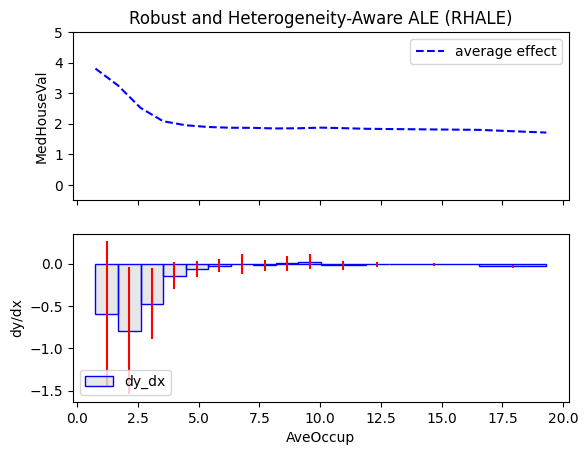
    


**Global Trend:** House prices decrease as the average number of people residing in a house increases with the highest slop in the lowest average occupancy values


```python
# plot the level-1 subregions (node ids depend on the fitted tree)
for node in reg_rhale.tree["feature_5"].nodes:
    if node.info["level"] == 1:
        reg_rhale.plot(feature=5, node_idx=node.idx, centering=True, scale_x_list=scale_x_list, scale_y=scale_y, y_limits=y_limits)
```


    

    


    
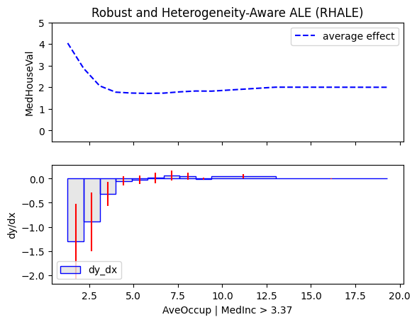
    


```python
for node in reg_rhale.tree["feature_5"].nodes:
    if node.info["level"] == 2:
        reg_rhale.plot(feature=5, node_idx=node.idx, centering=True, scale_x_list=scale_x_list, scale_y=scale_y, y_limits=y_limits)
```


    
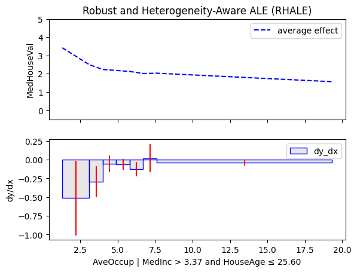
    


    
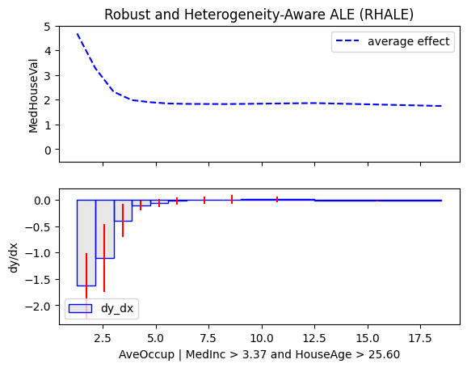
    


**Global Trend:** House prices decrease as the average number of people per household (AveOccup) increases, with the steepest drop at low occupancy levels. This suggests that even small increases in crowding can significantly reduce home values, especially in less crowded areas.

**Regional Trends:**  
- **Low-Income Areas (MedInc ≤ 3.73):** The initial slope (at low AveOccup) becomes smoother, indicating that house prices decrease more gradually with crowding in poorer regions.
- **High-Income Areas (MedInc > 3.73):** The initial slope becomes steeper, and starts from higher house values.
  - **Newer homes (HouseAge ≤ 18.40):** The slope remains smoother, starting from lower prices.
  - **Older homes (HouseAge > 18.40)** The slope becomes even steeper, and starts from higher house values, meaning older homes in high-income areas lose value rapidly as they become crowded.

## Latitude (south to north)


```python
reg_rhale.plot(feature=6, node_idx=0, centering=True, scale_x_list=scale_x_list, scale_y=scale_y, y_limits=y_limits)
```


    
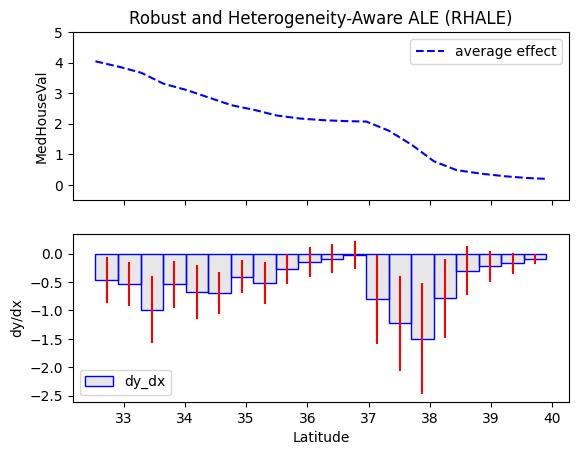
    


**Global Trend:** House prices decrease as we move north.  


```python
for node in reg_rhale.tree["feature_6"].nodes:
    if node.info["level"] == 1:
        reg_rhale.plot(feature=6, node_idx=node.idx, centering=True, scale_x_list=scale_x_list, scale_y=scale_y, y_limits=y_limits)
```


    

    


    
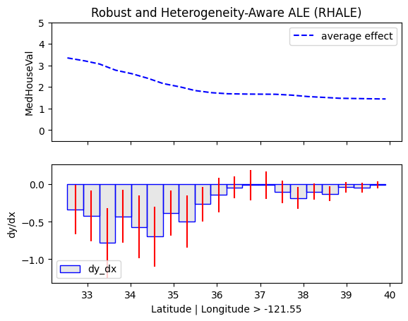
    


```python
for node in reg_rhale.tree["feature_6"].nodes:
    if node.info["level"] == 2:
        reg_rhale.plot(feature=6, node_idx=node.idx, centering=True, scale_x_list=scale_x_list, scale_y=scale_y, y_limits=y_limits)
```


    
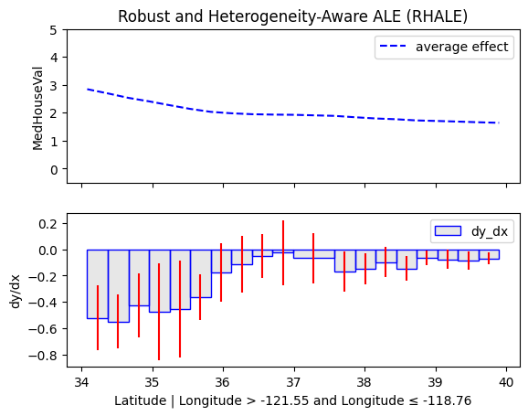
    


    
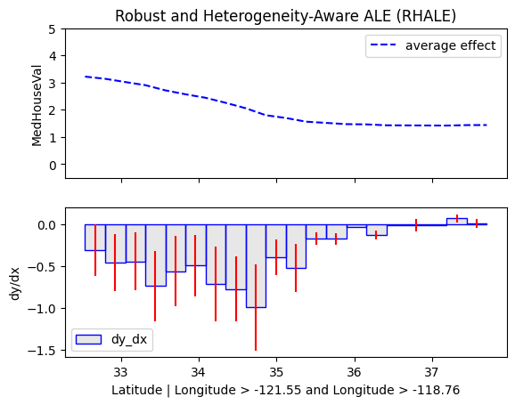
    


**Global Trend:** House prices decrease as we move north.  

**Regional Trends:** Moreorless the same, with minor different curves.

## Longitude (west to east)


```python
reg_rhale.plot(feature=7, node_idx=0, centering=True, scale_x_list=scale_x_list, scale_y=scale_y)
```


    
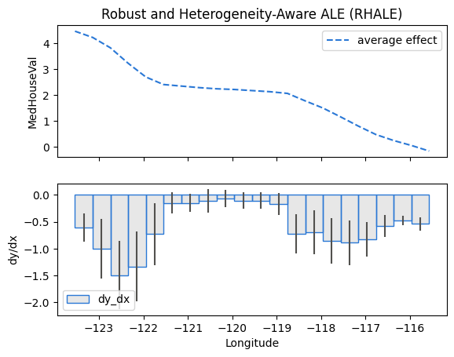
    


**Global Trend:** House prices decrease as we move east.  


```python
for node in reg_rhale.tree["feature_7"].nodes:
    if node.info["level"] == 1:
        reg_rhale.plot(feature=7, node_idx=node.idx, centering=True, scale_x_list=scale_x_list, scale_y=scale_y, y_limits=y_limits)
```


    

    


    
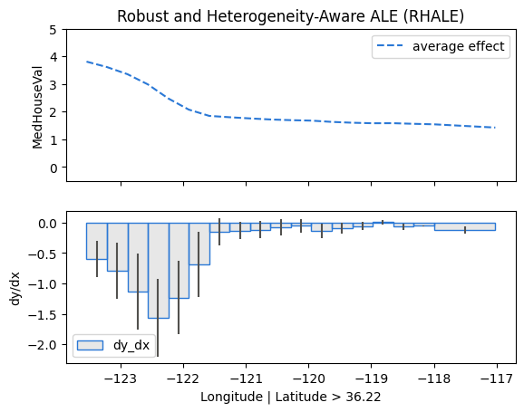
    


```python
for node in reg_rhale.tree["feature_7"].nodes:
    if node.info["level"] == 2:
        reg_rhale.plot(feature=7, node_idx=node.idx, centering=True, scale_x_list=scale_x_list, scale_y=scale_y, y_limits=y_limits)
```


    
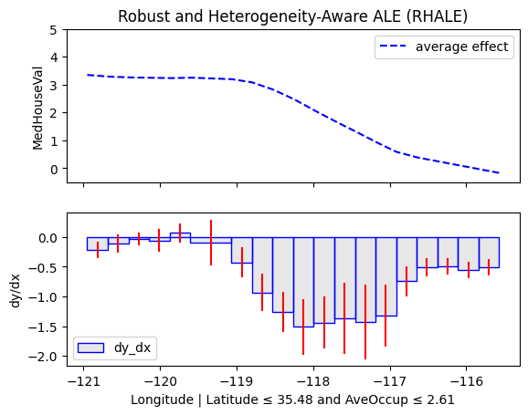
    


    
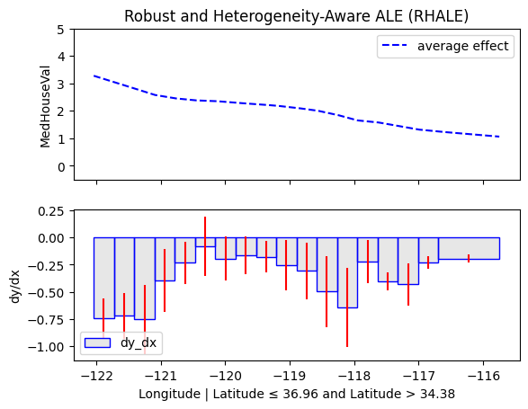
    


    
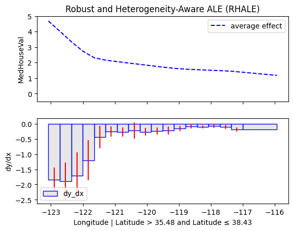
    


    
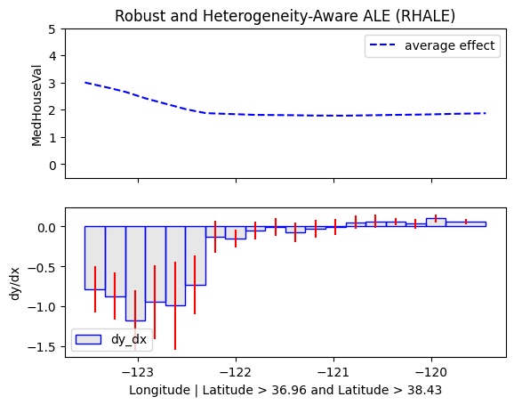
    


**Global Trend:** House prices decrease as we move east.  

**Regional Trends:**  
- **South (latitude <= 35.85):** Prices drop more sharply in the second half from west to east.
  - **AveOccup <= 2.61:** Prices drop even more steeper, suggesting that in less crowded southern areas, housing demand or value drops off more quickly as you move east.
  - **AveOccup > 2.61:** Patterns resemble the broader subregion (latitude <= 35.85), with no significant change in trend.
- **North (latitude > 35.85):** The steepest price decline happens in the western half (closer to the coast).  
  - **Latitude <= 38.43:** The sharp west-to-east price drop remains the same
  - **Latitude > 38.43:** The decline flattens, since the eastern part of far-northern California starts from lower prices
