# California Housing

- Author: [givasile](https://givasile.github.io/)
- Runtime: ~35 s
- Description: Global and regional RHALE effects on the California-housing
  dataset, explaining a neural network's predicted house values — with
  regional splits on income, latitude and longitude.


```python
import numpy as np
import keras
import tensorflow as tf
import effector
from sklearn.datasets import fetch_california_housing

california_housing = fetch_california_housing(as_frame=True)
```

    WARNING: All log messages before absl::InitializeLog() is called are written to STDERR
    I0000 00:00:1783470137.669786  117873 cpu_feature_guard.cc:227] This TensorFlow binary is optimized to use available CPU instructions in performance-critical operations.
    To enable the following instructions: AVX2 FMA, in other operations, rebuild TensorFlow with the appropriate compiler flags.


```python
np.random.seed(21)
```


```python
print(california_housing.DESCR)
```

    .. _california_housing_dataset:
    
    California Housing dataset
    --------------------------
    
    **Data Set Characteristics:**
    
    :Number of Instances: 20640
    
    :Number of Attributes: 8 numeric, predictive attributes and the target
    
    :Attribute Information:
        - MedInc        median income in block group
        - HouseAge      median house age in block group
        - AveRooms      average number of rooms per household
        - AveBedrms     average number of bedrooms per household
        - Population    block group population
        - AveOccup      average number of household members
        - Latitude      block group latitude
        - Longitude     block group longitude
    
    :Missing Attribute Values: None
    
    This dataset was obtained from the StatLib repository.
    https://www.dcc.fc.up.pt/~ltorgo/Regression/cal_housing.html
    
    The target variable is the median house value for California districts,
    expressed in hundreds of thousands of dollars ($100,000).
    
    This dataset was derived from the 1990 U.S. census, using one row per census
    block group. A block group is the smallest geographical unit for which the U.S.
    Census Bureau publishes sample data (a block group typically has a population
    of 600 to 3,000 people).
    
    A household is a group of people residing within a home. Since the average
    number of rooms and bedrooms in this dataset are provided per household, these
    columns may take surprisingly large values for block groups with few households
    and many empty houses, such as vacation resorts.
    
    It can be downloaded/loaded using the
    :func:`sklearn.datasets.fetch_california_housing` function.
    
    .. rubric:: References
    
    - Pace, R. Kelley and Ronald Barry, Sparse Spatial Autoregressions,
      Statistics and Probability Letters, 33:291-297, 1997.
    


```python
feature_names = california_housing.feature_names
target_name= california_housing.target_names[0]
df = type(california_housing.frame)
```


```python
X = california_housing.data
y = california_housing.target
```


```python
print("Design matrix shape: {}".format(X.shape))
print("---------------------------------")
for col_name in X.columns:
    print("Feature: {:15}, unique: {:4d}, Mean: {:6.2f}, Std: {:6.2f}, Min: {:6.2f}, Max: {:6.2f}".format(col_name, len(X[col_name].unique()), X[col_name].mean(), X[col_name].std(), X[col_name].min(), X[col_name].max()))
    
print("\nTarget shape: {}".format(y.shape))
print("---------------------------------")
print("Target: {:15}, unique: {:4d}, Mean: {:6.2f}, Std: {:6.2f}, Min: {:6.2f}, Max: {:6.2f}".format(y.name, len(y.unique()), y.mean(), y.std(), y.min(), y.max()))
```

    Design matrix shape: (20640, 8)
    ---------------------------------
    Feature: MedInc         , unique: 12928, Mean:   3.87, Std:   1.90, Min:   0.50, Max:  15.00
    Feature: HouseAge       , unique:   52, Mean:  28.64, Std:  12.59, Min:   1.00, Max:  52.00
    Feature: AveRooms       , unique: 19392, Mean:   5.43, Std:   2.47, Min:   0.85, Max: 141.91
    Feature: AveBedrms      , unique: 14233, Mean:   1.10, Std:   0.47, Min:   0.33, Max:  34.07
    Feature: Population     , unique: 3888, Mean: 1425.48, Std: 1132.46, Min:   3.00, Max: 35682.00
    Feature: AveOccup       , unique: 18841, Mean:   3.07, Std:  10.39, Min:   0.69, Max: 1243.33
    Feature: Latitude       , unique:  862, Mean:  35.63, Std:   2.14, Min:  32.54, Max:  41.95
    Feature: Longitude      , unique:  844, Mean: -119.57, Std:   2.00, Min: -124.35, Max: -114.31
    
    Target shape: (20640,)
    ---------------------------------
    Target: MedHouseVal    , unique: 3842, Mean:   2.07, Std:   1.15, Min:   0.15, Max:   5.00


```python
def preprocess(X, y):
    # Compute mean and std for outlier detection
    X_mean = X.mean()
    X_std = X.std()
    
    # Exclude instances with any feature 2 std away from the mean
    mask = (X - X_mean).abs() <= 2 * X_std
    mask = mask.all(axis=1)
    
    X_filtered = X[mask]
    y_filtered = y[mask]

    # Standardize X
    X_mean = X_filtered.mean()
    X_std = X_filtered.std()
    X_standardized = (X_filtered - X_mean) / X_std

    # Standardize y
    y_mean = y_filtered.mean()
    y_std = y_filtered.std()
    y_standardized = (y_filtered - y_mean) / y_std

    return X_standardized, y_standardized, X_mean, X_std, y_mean, y_std


# shuffle and standarize all features
X_df, Y_df, x_mean, x_std, y_mean, y_std = preprocess(X, y)
```


```python
def split(X_df, Y_df):
    # shuffle indices
    indices = np.arange(len(X_df))
    np.random.shuffle(indices)
    
    # data split
    train_size = int(0.8 * len(X_df))
    
    X_train = X_df.iloc[indices[:train_size]]
    Y_train = Y_df.iloc[indices[:train_size]]
    X_test = X_df.iloc[indices[train_size:]]
    Y_test = Y_df.iloc[indices[train_size:]]
    
    return X_train, Y_train, X_test, Y_test

# train/test split
X_train, Y_train, X_test, Y_test = split(X_df, Y_df)
```


```python
# Train - Evaluate - Explain a neural network
model = keras.Sequential([
    keras.layers.Dense(1024, activation="relu"),
    keras.layers.Dense(512, activation="relu"),
    keras.layers.Dense(256, activation="relu"),
    keras.layers.Dense(1)
])

optimizer = keras.optimizers.Adam(learning_rate=0.001)
model.compile(optimizer=optimizer, loss="mse", metrics=["mae", keras.metrics.RootMeanSquaredError()])
model.fit(X_train, Y_train, batch_size=1024, epochs=20, verbose=1)
model.evaluate(X_train, Y_train, verbose=1)
model.evaluate(X_test, Y_test, verbose=1)
```

    Epoch 1/20


    
 1/15 ━━━━━━━━━━━━━━━━━━━━ 19s 1s/step - loss: 1.0212 - mae: 0.7944 - root_mean_squared_error: 1.0105

    
 3/15 ━━━━━━━━━━━━━━━━━━━━ 0s 46ms/step - loss: 0.8742 - mae: 0.7243 - root_mean_squared_error: 0.9329

    
 5/15 ━━━━━━━━━━━━━━━━━━━━ 0s 39ms/step - loss: 0.7907 - mae: 0.6821 - root_mean_squared_error: 0.8860

    
 7/15 ━━━━━━━━━━━━━━━━━━━━ 0s 37ms/step - loss: 0.7347 - mae: 0.6522 - root_mean_squared_error: 0.8532

    
 8/15 ━━━━━━━━━━━━━━━━━━━━ 0s 39ms/step - loss: 0.7121 - mae: 0.6398 - root_mean_squared_error: 0.8396

    
10/15 ━━━━━━━━━━━━━━━━━━━━ 0s 37ms/step - loss: 0.6747 - mae: 0.6193 - root_mean_squared_error: 0.8166

    
12/15 ━━━━━━━━━━━━━━━━━━━━ 0s 37ms/step - loss: 0.6449 - mae: 0.6027 - root_mean_squared_error: 0.7979

    
14/15 ━━━━━━━━━━━━━━━━━━━━ 0s 37ms/step - loss: 0.6202 - mae: 0.5888 - root_mean_squared_error: 0.7820

    
15/15 ━━━━━━━━━━━━━━━━━━━━ 2s 38ms/step - loss: 0.4646 - mae: 0.5005 - root_mean_squared_error: 0.6816


    Epoch 2/20


    
 1/15 ━━━━━━━━━━━━━━━━━━━━ 1s 72ms/step - loss: 0.3481 - mae: 0.4118 - root_mean_squared_error: 0.5900

    
 3/15 ━━━━━━━━━━━━━━━━━━━━ 0s 38ms/step - loss: 0.3443 - mae: 0.4159 - root_mean_squared_error: 0.5867

    
 5/15 ━━━━━━━━━━━━━━━━━━━━ 0s 36ms/step - loss: 0.3378 - mae: 0.4148 - root_mean_squared_error: 0.5812

    
 7/15 ━━━━━━━━━━━━━━━━━━━━ 0s 37ms/step - loss: 0.3355 - mae: 0.4141 - root_mean_squared_error: 0.5792

    
 8/15 ━━━━━━━━━━━━━━━━━━━━ 0s 40ms/step - loss: 0.3338 - mae: 0.4134 - root_mean_squared_error: 0.5777

    
10/15 ━━━━━━━━━━━━━━━━━━━━ 0s 38ms/step - loss: 0.3317 - mae: 0.4121 - root_mean_squared_error: 0.5758

    
12/15 ━━━━━━━━━━━━━━━━━━━━ 0s 38ms/step - loss: 0.3302 - mae: 0.4114 - root_mean_squared_error: 0.5745

    
14/15 ━━━━━━━━━━━━━━━━━━━━ 0s 38ms/step - loss: 0.3289 - mae: 0.4108 - root_mean_squared_error: 0.5735

    
15/15 ━━━━━━━━━━━━━━━━━━━━ 1s 38ms/step - loss: 0.3199 - mae: 0.4064 - root_mean_squared_error: 0.5656


    Epoch 3/20


    
 1/15 ━━━━━━━━━━━━━━━━━━━━ 0s 61ms/step - loss: 0.2692 - mae: 0.3798 - root_mean_squared_error: 0.5188

    
 3/15 ━━━━━━━━━━━━━━━━━━━━ 0s 27ms/step - loss: 0.2789 - mae: 0.3875 - root_mean_squared_error: 0.5281

    
 4/15 ━━━━━━━━━━━━━━━━━━━━ 0s 36ms/step - loss: 0.2796 - mae: 0.3880 - root_mean_squared_error: 0.5287

    
 6/15 ━━━━━━━━━━━━━━━━━━━━ 0s 33ms/step - loss: 0.2834 - mae: 0.3889 - root_mean_squared_error: 0.5323

    
 8/15 ━━━━━━━━━━━━━━━━━━━━ 0s 36ms/step - loss: 0.2864 - mae: 0.3893 - root_mean_squared_error: 0.5351

    
10/15 ━━━━━━━━━━━━━━━━━━━━ 0s 35ms/step - loss: 0.2891 - mae: 0.3900 - root_mean_squared_error: 0.5376

    
12/15 ━━━━━━━━━━━━━━━━━━━━ 0s 36ms/step - loss: 0.2912 - mae: 0.3903 - root_mean_squared_error: 0.5396

    
14/15 ━━━━━━━━━━━━━━━━━━━━ 0s 35ms/step - loss: 0.2928 - mae: 0.3908 - root_mean_squared_error: 0.5410

    
15/15 ━━━━━━━━━━━━━━━━━━━━ 1s 36ms/step - loss: 0.3031 - mae: 0.3936 - root_mean_squared_error: 0.5505


    Epoch 4/20


    
 1/15 ━━━━━━━━━━━━━━━━━━━━ 0s 69ms/step - loss: 0.2806 - mae: 0.3877 - root_mean_squared_error: 0.5297

    
 3/15 ━━━━━━━━━━━━━━━━━━━━ 0s 45ms/step - loss: 0.2894 - mae: 0.3863 - root_mean_squared_error: 0.5380

    
 5/15 ━━━━━━━━━━━━━━━━━━━━ 0s 38ms/step - loss: 0.2951 - mae: 0.3891 - root_mean_squared_error: 0.5432

    
 7/15 ━━━━━━━━━━━━━━━━━━━━ 0s 40ms/step - loss: 0.2953 - mae: 0.3890 - root_mean_squared_error: 0.5434

    
 9/15 ━━━━━━━━━━━━━━━━━━━━ 0s 38ms/step - loss: 0.2947 - mae: 0.3883 - root_mean_squared_error: 0.5428

    
11/15 ━━━━━━━━━━━━━━━━━━━━ 0s 39ms/step - loss: 0.2940 - mae: 0.3874 - root_mean_squared_error: 0.5422

    
13/15 ━━━━━━━━━━━━━━━━━━━━ 0s 38ms/step - loss: 0.2934 - mae: 0.3867 - root_mean_squared_error: 0.5416

    
15/15 ━━━━━━━━━━━━━━━━━━━━ 1s 37ms/step - loss: 0.2884 - mae: 0.3826 - root_mean_squared_error: 0.5370


    Epoch 5/20


    
 1/15 ━━━━━━━━━━━━━━━━━━━━ 1s 130ms/step - loss: 0.3008 - mae: 0.3749 - root_mean_squared_error: 0.5485

    
 3/15 ━━━━━━━━━━━━━━━━━━━━ 0s 38ms/step - loss: 0.2980 - mae: 0.3736 - root_mean_squared_error: 0.5459 

    
 4/15 ━━━━━━━━━━━━━━━━━━━━ 0s 43ms/step - loss: 0.2944 - mae: 0.3732 - root_mean_squared_error: 0.5425

    
 6/15 ━━━━━━━━━━━━━━━━━━━━ 0s 39ms/step - loss: 0.2898 - mae: 0.3732 - root_mean_squared_error: 0.5382

    
 8/15 ━━━━━━━━━━━━━━━━━━━━ 0s 39ms/step - loss: 0.2872 - mae: 0.3728 - root_mean_squared_error: 0.5359

    
10/15 ━━━━━━━━━━━━━━━━━━━━ 0s 38ms/step - loss: 0.2855 - mae: 0.3727 - root_mean_squared_error: 0.5343

    
12/15 ━━━━━━━━━━━━━━━━━━━━ 0s 37ms/step - loss: 0.2848 - mae: 0.3728 - root_mean_squared_error: 0.5336

    
14/15 ━━━━━━━━━━━━━━━━━━━━ 0s 37ms/step - loss: 0.2841 - mae: 0.3729 - root_mean_squared_error: 0.5330

    
15/15 ━━━━━━━━━━━━━━━━━━━━ 1s 38ms/step - loss: 0.2809 - mae: 0.3746 - root_mean_squared_error: 0.5300


    Epoch 6/20


    
 1/15 ━━━━━━━━━━━━━━━━━━━━ 1s 82ms/step - loss: 0.3171 - mae: 0.3752 - root_mean_squared_error: 0.5631

    
 3/15 ━━━━━━━━━━━━━━━━━━━━ 0s 40ms/step - loss: 0.3027 - mae: 0.3764 - root_mean_squared_error: 0.5501

    
 5/15 ━━━━━━━━━━━━━━━━━━━━ 0s 38ms/step - loss: 0.2912 - mae: 0.3742 - root_mean_squared_error: 0.5394

    
 7/15 ━━━━━━━━━━━━━━━━━━━━ 0s 35ms/step - loss: 0.2854 - mae: 0.3726 - root_mean_squared_error: 0.5340

    
 9/15 ━━━━━━━━━━━━━━━━━━━━ 0s 36ms/step - loss: 0.2826 - mae: 0.3720 - root_mean_squared_error: 0.5314

    
11/15 ━━━━━━━━━━━━━━━━━━━━ 0s 35ms/step - loss: 0.2809 - mae: 0.3721 - root_mean_squared_error: 0.5298

    
13/15 ━━━━━━━━━━━━━━━━━━━━ 0s 36ms/step - loss: 0.2803 - mae: 0.3724 - root_mean_squared_error: 0.5293

    
15/15 ━━━━━━━━━━━━━━━━━━━━ 1s 36ms/step - loss: 0.2789 - mae: 0.3732 - root_mean_squared_error: 0.5281


    Epoch 7/20


    
 1/15 ━━━━━━━━━━━━━━━━━━━━ 1s 74ms/step - loss: 0.2495 - mae: 0.3532 - root_mean_squared_error: 0.4995

    
 3/15 ━━━━━━━━━━━━━━━━━━━━ 0s 37ms/step - loss: 0.2532 - mae: 0.3570 - root_mean_squared_error: 0.5032

    
 5/15 ━━━━━━━━━━━━━━━━━━━━ 0s 34ms/step - loss: 0.2605 - mae: 0.3614 - root_mean_squared_error: 0.5103

    
 7/15 ━━━━━━━━━━━━━━━━━━━━ 0s 33ms/step - loss: 0.2631 - mae: 0.3626 - root_mean_squared_error: 0.5129

    
 9/15 ━━━━━━━━━━━━━━━━━━━━ 0s 35ms/step - loss: 0.2639 - mae: 0.3634 - root_mean_squared_error: 0.5136

    
11/15 ━━━━━━━━━━━━━━━━━━━━ 0s 34ms/step - loss: 0.2643 - mae: 0.3639 - root_mean_squared_error: 0.5141

    
13/15 ━━━━━━━━━━━━━━━━━━━━ 0s 34ms/step - loss: 0.2646 - mae: 0.3640 - root_mean_squared_error: 0.5144

    
15/15 ━━━━━━━━━━━━━━━━━━━━ 1s 34ms/step - loss: 0.2667 - mae: 0.3642 - root_mean_squared_error: 0.5164


    Epoch 8/20


    
 1/15 ━━━━━━━━━━━━━━━━━━━━ 2s 167ms/step - loss: 0.2683 - mae: 0.3604 - root_mean_squared_error: 0.5179

    
 3/15 ━━━━━━━━━━━━━━━━━━━━ 0s 29ms/step - loss: 0.2686 - mae: 0.3613 - root_mean_squared_error: 0.5182 

    
 5/15 ━━━━━━━━━━━━━━━━━━━━ 0s 33ms/step - loss: 0.2667 - mae: 0.3617 - root_mean_squared_error: 0.5164

    
 8/15 ━━━━━━━━━━━━━━━━━━━━ 0s 30ms/step - loss: 0.2660 - mae: 0.3621 - root_mean_squared_error: 0.5158

    
10/15 ━━━━━━━━━━━━━━━━━━━━ 0s 32ms/step - loss: 0.2655 - mae: 0.3618 - root_mean_squared_error: 0.5153

    
12/15 ━━━━━━━━━━━━━━━━━━━━ 0s 31ms/step - loss: 0.2652 - mae: 0.3616 - root_mean_squared_error: 0.5149

    
13/15 ━━━━━━━━━━━━━━━━━━━━ 0s 33ms/step - loss: 0.2652 - mae: 0.3616 - root_mean_squared_error: 0.5149

    
15/15 ━━━━━━━━━━━━━━━━━━━━ 1s 33ms/step - loss: 0.2625 - mae: 0.3595 - root_mean_squared_error: 0.5124


    Epoch 9/20


    
 1/15 ━━━━━━━━━━━━━━━━━━━━ 2s 169ms/step - loss: 0.2686 - mae: 0.3573 - root_mean_squared_error: 0.5183

    
 3/15 ━━━━━━━━━━━━━━━━━━━━ 0s 32ms/step - loss: 0.2759 - mae: 0.3590 - root_mean_squared_error: 0.5252 

    
 5/15 ━━━━━━━━━━━━━━━━━━━━ 0s 34ms/step - loss: 0.2743 - mae: 0.3595 - root_mean_squared_error: 0.5237

    
 7/15 ━━━━━━━━━━━━━━━━━━━━ 0s 32ms/step - loss: 0.2706 - mae: 0.3592 - root_mean_squared_error: 0.5201

    
 8/15 ━━━━━━━━━━━━━━━━━━━━ 0s 35ms/step - loss: 0.2686 - mae: 0.3584 - root_mean_squared_error: 0.5182

    
10/15 ━━━━━━━━━━━━━━━━━━━━ 0s 34ms/step - loss: 0.2661 - mae: 0.3575 - root_mean_squared_error: 0.5158

    
12/15 ━━━━━━━━━━━━━━━━━━━━ 0s 34ms/step - loss: 0.2643 - mae: 0.3569 - root_mean_squared_error: 0.5141

    
14/15 ━━━━━━━━━━━━━━━━━━━━ 0s 33ms/step - loss: 0.2628 - mae: 0.3564 - root_mean_squared_error: 0.5125

    
15/15 ━━━━━━━━━━━━━━━━━━━━ 1s 35ms/step - loss: 0.2552 - mae: 0.3540 - root_mean_squared_error: 0.5052


    Epoch 10/20


    
 1/15 ━━━━━━━━━━━━━━━━━━━━ 0s 45ms/step - loss: 0.2508 - mae: 0.3614 - root_mean_squared_error: 0.5008

    
 3/15 ━━━━━━━━━━━━━━━━━━━━ 0s 41ms/step - loss: 0.2448 - mae: 0.3522 - root_mean_squared_error: 0.4947

    
 5/15 ━━━━━━━━━━━━━━━━━━━━ 0s 34ms/step - loss: 0.2473 - mae: 0.3515 - root_mean_squared_error: 0.4972

    
 7/15 ━━━━━━━━━━━━━━━━━━━━ 0s 33ms/step - loss: 0.2491 - mae: 0.3517 - root_mean_squared_error: 0.4991

    
 9/15 ━━━━━━━━━━━━━━━━━━━━ 0s 34ms/step - loss: 0.2490 - mae: 0.3513 - root_mean_squared_error: 0.4990

    
11/15 ━━━━━━━━━━━━━━━━━━━━ 0s 34ms/step - loss: 0.2488 - mae: 0.3510 - root_mean_squared_error: 0.4988

    
13/15 ━━━━━━━━━━━━━━━━━━━━ 0s 34ms/step - loss: 0.2483 - mae: 0.3506 - root_mean_squared_error: 0.4983

    
15/15 ━━━━━━━━━━━━━━━━━━━━ 1s 33ms/step - loss: 0.2468 - mae: 0.3485 - root_mean_squared_error: 0.4968


    Epoch 11/20


    
 1/15 ━━━━━━━━━━━━━━━━━━━━ 0s 66ms/step - loss: 0.2265 - mae: 0.3371 - root_mean_squared_error: 0.4759

    
 3/15 ━━━━━━━━━━━━━━━━━━━━ 0s 39ms/step - loss: 0.2392 - mae: 0.3416 - root_mean_squared_error: 0.4890

    
 5/15 ━━━━━━━━━━━━━━━━━━━━ 0s 35ms/step - loss: 0.2440 - mae: 0.3428 - root_mean_squared_error: 0.4938

    
 7/15 ━━━━━━━━━━━━━━━━━━━━ 0s 37ms/step - loss: 0.2450 - mae: 0.3433 - root_mean_squared_error: 0.4949

    
 9/15 ━━━━━━━━━━━━━━━━━━━━ 0s 35ms/step - loss: 0.2448 - mae: 0.3438 - root_mean_squared_error: 0.4947

    
11/15 ━━━━━━━━━━━━━━━━━━━━ 0s 34ms/step - loss: 0.2450 - mae: 0.3441 - root_mean_squared_error: 0.4949

    
13/15 ━━━━━━━━━━━━━━━━━━━━ 0s 33ms/step - loss: 0.2445 - mae: 0.3441 - root_mean_squared_error: 0.4944

    
15/15 ━━━━━━━━━━━━━━━━━━━━ 1s 33ms/step - loss: 0.2423 - mae: 0.3436 - root_mean_squared_error: 0.4922


    Epoch 12/20


    
 1/15 ━━━━━━━━━━━━━━━━━━━━ 0s 62ms/step - loss: 0.2401 - mae: 0.3434 - root_mean_squared_error: 0.4900

    
 3/15 ━━━━━━━━━━━━━━━━━━━━ 0s 35ms/step - loss: 0.2335 - mae: 0.3365 - root_mean_squared_error: 0.4832

    
 4/15 ━━━━━━━━━━━━━━━━━━━━ 0s 40ms/step - loss: 0.2332 - mae: 0.3358 - root_mean_squared_error: 0.4829

    
 6/15 ━━━━━━━━━━━━━━━━━━━━ 0s 35ms/step - loss: 0.2335 - mae: 0.3354 - root_mean_squared_error: 0.4832

    
 8/15 ━━━━━━━━━━━━━━━━━━━━ 0s 35ms/step - loss: 0.2340 - mae: 0.3355 - root_mean_squared_error: 0.4837

    
10/15 ━━━━━━━━━━━━━━━━━━━━ 0s 33ms/step - loss: 0.2343 - mae: 0.3356 - root_mean_squared_error: 0.4841

    
12/15 ━━━━━━━━━━━━━━━━━━━━ 0s 34ms/step - loss: 0.2344 - mae: 0.3356 - root_mean_squared_error: 0.4841

    
14/15 ━━━━━━━━━━━━━━━━━━━━ 0s 33ms/step - loss: 0.2345 - mae: 0.3356 - root_mean_squared_error: 0.4842

    
15/15 ━━━━━━━━━━━━━━━━━━━━ 1s 34ms/step - loss: 0.2355 - mae: 0.3362 - root_mean_squared_error: 0.4853


    Epoch 13/20


    
 1/15 ━━━━━━━━━━━━━━━━━━━━ 0s 63ms/step - loss: 0.2656 - mae: 0.3694 - root_mean_squared_error: 0.5154

    
 3/15 ━━━━━━━━━━━━━━━━━━━━ 0s 35ms/step - loss: 0.2565 - mae: 0.3565 - root_mean_squared_error: 0.5064

    
 4/15 ━━━━━━━━━━━━━━━━━━━━ 0s 41ms/step - loss: 0.2536 - mae: 0.3530 - root_mean_squared_error: 0.5035

    
 6/15 ━━━━━━━━━━━━━━━━━━━━ 0s 35ms/step - loss: 0.2517 - mae: 0.3523 - root_mean_squared_error: 0.5016

    
 8/15 ━━━━━━━━━━━━━━━━━━━━ 0s 36ms/step - loss: 0.2520 - mae: 0.3526 - root_mean_squared_error: 0.5020

    
11/15 ━━━━━━━━━━━━━━━━━━━━ 0s 33ms/step - loss: 0.2519 - mae: 0.3524 - root_mean_squared_error: 0.5018

    
12/15 ━━━━━━━━━━━━━━━━━━━━ 0s 35ms/step - loss: 0.2518 - mae: 0.3523 - root_mean_squared_error: 0.5017

    
14/15 ━━━━━━━━━━━━━━━━━━━━ 0s 34ms/step - loss: 0.2510 - mae: 0.3517 - root_mean_squared_error: 0.5010

    
15/15 ━━━━━━━━━━━━━━━━━━━━ 1s 35ms/step - loss: 0.2470 - mae: 0.3480 - root_mean_squared_error: 0.4970


    Epoch 14/20


    
 1/15 ━━━━━━━━━━━━━━━━━━━━ 0s 56ms/step - loss: 0.2371 - mae: 0.3511 - root_mean_squared_error: 0.4869

    
 3/15 ━━━━━━━━━━━━━━━━━━━━ 0s 38ms/step - loss: 0.2407 - mae: 0.3446 - root_mean_squared_error: 0.4906

    
 5/15 ━━━━━━━━━━━━━━━━━━━━ 0s 32ms/step - loss: 0.2408 - mae: 0.3442 - root_mean_squared_error: 0.4907

    
 7/15 ━━━━━━━━━━━━━━━━━━━━ 0s 32ms/step - loss: 0.2401 - mae: 0.3437 - root_mean_squared_error: 0.4899

    
 9/15 ━━━━━━━━━━━━━━━━━━━━ 0s 33ms/step - loss: 0.2407 - mae: 0.3438 - root_mean_squared_error: 0.4906

    
11/15 ━━━━━━━━━━━━━━━━━━━━ 0s 33ms/step - loss: 0.2405 - mae: 0.3435 - root_mean_squared_error: 0.4904

    
13/15 ━━━━━━━━━━━━━━━━━━━━ 0s 34ms/step - loss: 0.2404 - mae: 0.3434 - root_mean_squared_error: 0.4903

    
15/15 ━━━━━━━━━━━━━━━━━━━━ 1s 34ms/step - loss: 0.2419 - mae: 0.3435 - root_mean_squared_error: 0.4919


    Epoch 15/20


    
 1/15 ━━━━━━━━━━━━━━━━━━━━ 0s 47ms/step - loss: 0.2296 - mae: 0.3437 - root_mean_squared_error: 0.4791

    
 3/15 ━━━━━━━━━━━━━━━━━━━━ 0s 40ms/step - loss: 0.2223 - mae: 0.3361 - root_mean_squared_error: 0.4714

    
 5/15 ━━━━━━━━━━━━━━━━━━━━ 0s 37ms/step - loss: 0.2224 - mae: 0.3354 - root_mean_squared_error: 0.4716

    
 7/15 ━━━━━━━━━━━━━━━━━━━━ 0s 36ms/step - loss: 0.2244 - mae: 0.3360 - root_mean_squared_error: 0.4737

    
 9/15 ━━━━━━━━━━━━━━━━━━━━ 0s 35ms/step - loss: 0.2261 - mae: 0.3365 - root_mean_squared_error: 0.4755

    
11/15 ━━━━━━━━━━━━━━━━━━━━ 0s 36ms/step - loss: 0.2267 - mae: 0.3361 - root_mean_squared_error: 0.4761

    
13/15 ━━━━━━━━━━━━━━━━━━━━ 0s 36ms/step - loss: 0.2272 - mae: 0.3358 - root_mean_squared_error: 0.4766

    
15/15 ━━━━━━━━━━━━━━━━━━━━ 0s 34ms/step - loss: 0.2279 - mae: 0.3360 - root_mean_squared_error: 0.4774

    
15/15 ━━━━━━━━━━━━━━━━━━━━ 1s 36ms/step - loss: 0.2328 - mae: 0.3371 - root_mean_squared_error: 0.4825


    Epoch 16/20


    
 1/15 ━━━━━━━━━━━━━━━━━━━━ 0s 56ms/step - loss: 0.2117 - mae: 0.3109 - root_mean_squared_error: 0.4601

    
 2/15 ━━━━━━━━━━━━━━━━━━━━ 0s 63ms/step - loss: 0.2154 - mae: 0.3160 - root_mean_squared_error: 0.4641

    
 4/15 ━━━━━━━━━━━━━━━━━━━━ 0s 43ms/step - loss: 0.2193 - mae: 0.3208 - root_mean_squared_error: 0.4683

    
 6/15 ━━━━━━━━━━━━━━━━━━━━ 0s 44ms/step - loss: 0.2230 - mae: 0.3244 - root_mean_squared_error: 0.4722

    
 8/15 ━━━━━━━━━━━━━━━━━━━━ 0s 39ms/step - loss: 0.2240 - mae: 0.3255 - root_mean_squared_error: 0.4733

    
10/15 ━━━━━━━━━━━━━━━━━━━━ 0s 38ms/step - loss: 0.2247 - mae: 0.3262 - root_mean_squared_error: 0.4739

    
12/15 ━━━━━━━━━━━━━━━━━━━━ 0s 37ms/step - loss: 0.2247 - mae: 0.3265 - root_mean_squared_error: 0.4740

    
14/15 ━━━━━━━━━━━━━━━━━━━━ 0s 38ms/step - loss: 0.2249 - mae: 0.3268 - root_mean_squared_error: 0.4742

    
15/15 ━━━━━━━━━━━━━━━━━━━━ 1s 38ms/step - loss: 0.2242 - mae: 0.3273 - root_mean_squared_error: 0.4735


    Epoch 17/20


    
 1/15 ━━━━━━━━━━━━━━━━━━━━ 1s 78ms/step - loss: 0.2292 - mae: 0.3229 - root_mean_squared_error: 0.4788

    
 3/15 ━━━━━━━━━━━━━━━━━━━━ 0s 30ms/step - loss: 0.2206 - mae: 0.3207 - root_mean_squared_error: 0.4697

    
 5/15 ━━━━━━━━━━━━━━━━━━━━ 0s 32ms/step - loss: 0.2188 - mae: 0.3212 - root_mean_squared_error: 0.4677

    
 7/15 ━━━━━━━━━━━━━━━━━━━━ 0s 31ms/step - loss: 0.2175 - mae: 0.3206 - root_mean_squared_error: 0.4663

    
 9/15 ━━━━━━━━━━━━━━━━━━━━ 0s 30ms/step - loss: 0.2172 - mae: 0.3201 - root_mean_squared_error: 0.4660

    
11/15 ━━━━━━━━━━━━━━━━━━━━ 0s 32ms/step - loss: 0.2163 - mae: 0.3195 - root_mean_squared_error: 0.4650

    
13/15 ━━━━━━━━━━━━━━━━━━━━ 0s 31ms/step - loss: 0.2165 - mae: 0.3197 - root_mean_squared_error: 0.4653

    
15/15 ━━━━━━━━━━━━━━━━━━━━ 0s 31ms/step - loss: 0.2169 - mae: 0.3200 - root_mean_squared_error: 0.4657

    
15/15 ━━━━━━━━━━━━━━━━━━━━ 1s 32ms/step - loss: 0.2188 - mae: 0.3220 - root_mean_squared_error: 0.4678


    Epoch 18/20


    
 1/15 ━━━━━━━━━━━━━━━━━━━━ 2s 180ms/step - loss: 0.2203 - mae: 0.3259 - root_mean_squared_error: 0.4694

    
 3/15 ━━━━━━━━━━━━━━━━━━━━ 0s 26ms/step - loss: 0.2174 - mae: 0.3247 - root_mean_squared_error: 0.4663 

    
 4/15 ━━━━━━━━━━━━━━━━━━━━ 0s 36ms/step - loss: 0.2157 - mae: 0.3232 - root_mean_squared_error: 0.4644

    
 6/15 ━━━━━━━━━━━━━━━━━━━━ 0s 33ms/step - loss: 0.2147 - mae: 0.3220 - root_mean_squared_error: 0.4634

    
 8/15 ━━━━━━━━━━━━━━━━━━━━ 0s 33ms/step - loss: 0.2144 - mae: 0.3207 - root_mean_squared_error: 0.4630

    
10/15 ━━━━━━━━━━━━━━━━━━━━ 0s 33ms/step - loss: 0.2149 - mae: 0.3202 - root_mean_squared_error: 0.4635

    
12/15 ━━━━━━━━━━━━━━━━━━━━ 0s 32ms/step - loss: 0.2151 - mae: 0.3200 - root_mean_squared_error: 0.4638

    
14/15 ━━━━━━━━━━━━━━━━━━━━ 0s 33ms/step - loss: 0.2150 - mae: 0.3198 - root_mean_squared_error: 0.4637

    
15/15 ━━━━━━━━━━━━━━━━━━━━ 1s 33ms/step - loss: 0.2145 - mae: 0.3187 - root_mean_squared_error: 0.4631


    Epoch 19/20


    
 1/15 ━━━━━━━━━━━━━━━━━━━━ 2s 154ms/step - loss: 0.2382 - mae: 0.3346 - root_mean_squared_error: 0.4881

    
 3/15 ━━━━━━━━━━━━━━━━━━━━ 0s 28ms/step - loss: 0.2302 - mae: 0.3315 - root_mean_squared_error: 0.4797 

    
 5/15 ━━━━━━━━━━━━━━━━━━━━ 0s 33ms/step - loss: 0.2230 - mae: 0.3267 - root_mean_squared_error: 0.4721

    
 7/15 ━━━━━━━━━━━━━━━━━━━━ 0s 32ms/step - loss: 0.2198 - mae: 0.3246 - root_mean_squared_error: 0.4687

    
 9/15 ━━━━━━━━━━━━━━━━━━━━ 0s 31ms/step - loss: 0.2186 - mae: 0.3237 - root_mean_squared_error: 0.4675

    
10/15 ━━━━━━━━━━━━━━━━━━━━ 0s 34ms/step - loss: 0.2184 - mae: 0.3238 - root_mean_squared_error: 0.4673

    
12/15 ━━━━━━━━━━━━━━━━━━━━ 0s 34ms/step - loss: 0.2182 - mae: 0.3239 - root_mean_squared_error: 0.4670

    
14/15 ━━━━━━━━━━━━━━━━━━━━ 0s 34ms/step - loss: 0.2179 - mae: 0.3238 - root_mean_squared_error: 0.4667

    
15/15 ━━━━━━━━━━━━━━━━━━━━ 1s 34ms/step - loss: 0.2157 - mae: 0.3232 - root_mean_squared_error: 0.4644


    Epoch 20/20


    
 1/15 ━━━━━━━━━━━━━━━━━━━━ 1s 88ms/step - loss: 0.2230 - mae: 0.3340 - root_mean_squared_error: 0.4722

    
 3/15 ━━━━━━━━━━━━━━━━━━━━ 0s 29ms/step - loss: 0.2203 - mae: 0.3252 - root_mean_squared_error: 0.4693

    
 5/15 ━━━━━━━━━━━━━━━━━━━━ 0s 32ms/step - loss: 0.2143 - mae: 0.3205 - root_mean_squared_error: 0.4628

    
 7/15 ━━━━━━━━━━━━━━━━━━━━ 0s 30ms/step - loss: 0.2136 - mae: 0.3194 - root_mean_squared_error: 0.4621

    
 9/15 ━━━━━━━━━━━━━━━━━━━━ 0s 29ms/step - loss: 0.2130 - mae: 0.3188 - root_mean_squared_error: 0.4615

    
10/15 ━━━━━━━━━━━━━━━━━━━━ 0s 32ms/step - loss: 0.2128 - mae: 0.3187 - root_mean_squared_error: 0.4613

    
12/15 ━━━━━━━━━━━━━━━━━━━━ 0s 31ms/step - loss: 0.2123 - mae: 0.3182 - root_mean_squared_error: 0.4607

    
14/15 ━━━━━━━━━━━━━━━━━━━━ 0s 32ms/step - loss: 0.2121 - mae: 0.3181 - root_mean_squared_error: 0.4605

    
15/15 ━━━━━━━━━━━━━━━━━━━━ 1s 32ms/step - loss: 0.2115 - mae: 0.3179 - root_mean_squared_error: 0.4598


    
  1/456 ━━━━━━━━━━━━━━━━━━━━ 1:33 206ms/step - loss: 0.1545 - mae: 0.2641 - root_mean_squared_error: 0.3931

    
 17/456 ━━━━━━━━━━━━━━━━━━━━ 1s 3ms/step - loss: 0.1999 - mae: 0.3058 - root_mean_squared_error: 0.4467    

    
 26/456 ━━━━━━━━━━━━━━━━━━━━ 1s 4ms/step - loss: 0.2019 - mae: 0.3085 - root_mean_squared_error: 0.4490

    
 39/456 ━━━━━━━━━━━━━━━━━━━━ 1s 4ms/step - loss: 0.2056 - mae: 0.3113 - root_mean_squared_error: 0.4532

    
 49/456 ━━━━━━━━━━━━━━━━━━━━ 1s 4ms/step - loss: 0.2067 - mae: 0.3124 - root_mean_squared_error: 0.4545

    
 62/456 ━━━━━━━━━━━━━━━━━━━━ 1s 4ms/step - loss: 0.2070 - mae: 0.3130 - root_mean_squared_error: 0.4549

    
 72/456 ━━━━━━━━━━━━━━━━━━━━ 1s 4ms/step - loss: 0.2073 - mae: 0.3136 - root_mean_squared_error: 0.4552

    
 82/456 ━━━━━━━━━━━━━━━━━━━━ 1s 5ms/step - loss: 0.2077 - mae: 0.3141 - root_mean_squared_error: 0.4556

    
 94/456 ━━━━━━━━━━━━━━━━━━━━ 1s 5ms/step - loss: 0.2081 - mae: 0.3147 - root_mean_squared_error: 0.4561

    
104/456 ━━━━━━━━━━━━━━━━━━━━ 1s 5ms/step - loss: 0.2085 - mae: 0.3153 - root_mean_squared_error: 0.4565

    
117/456 ━━━━━━━━━━━━━━━━━━━━ 1s 5ms/step - loss: 0.2084 - mae: 0.3155 - root_mean_squared_error: 0.4564

    
127/456 ━━━━━━━━━━━━━━━━━━━━ 1s 5ms/step - loss: 0.2081 - mae: 0.3156 - root_mean_squared_error: 0.4561

    
136/456 ━━━━━━━━━━━━━━━━━━━━ 1s 5ms/step - loss: 0.2081 - mae: 0.3158 - root_mean_squared_error: 0.4561

    
146/456 ━━━━━━━━━━━━━━━━━━━━ 1s 5ms/step - loss: 0.2081 - mae: 0.3159 - root_mean_squared_error: 0.4561

    
159/456 ━━━━━━━━━━━━━━━━━━━━ 1s 5ms/step - loss: 0.2082 - mae: 0.3161 - root_mean_squared_error: 0.4562

    
171/456 ━━━━━━━━━━━━━━━━━━━━ 1s 5ms/step - loss: 0.2081 - mae: 0.3161 - root_mean_squared_error: 0.4561

    
180/456 ━━━━━━━━━━━━━━━━━━━━ 1s 5ms/step - loss: 0.2081 - mae: 0.3162 - root_mean_squared_error: 0.4561

    
191/456 ━━━━━━━━━━━━━━━━━━━━ 1s 5ms/step - loss: 0.2080 - mae: 0.3162 - root_mean_squared_error: 0.4560

    
199/456 ━━━━━━━━━━━━━━━━━━━━ 1s 5ms/step - loss: 0.2080 - mae: 0.3162 - root_mean_squared_error: 0.4560

    
214/456 ━━━━━━━━━━━━━━━━━━━━ 1s 5ms/step - loss: 0.2080 - mae: 0.3162 - root_mean_squared_error: 0.4560

    
224/456 ━━━━━━━━━━━━━━━━━━━━ 1s 5ms/step - loss: 0.2081 - mae: 0.3163 - root_mean_squared_error: 0.4562

    
237/456 ━━━━━━━━━━━━━━━━━━━━ 1s 5ms/step - loss: 0.2082 - mae: 0.3163 - root_mean_squared_error: 0.4562

    
249/456 ━━━━━━━━━━━━━━━━━━━━ 0s 5ms/step - loss: 0.2081 - mae: 0.3162 - root_mean_squared_error: 0.4561

    
258/456 ━━━━━━━━━━━━━━━━━━━━ 0s 5ms/step - loss: 0.2080 - mae: 0.3162 - root_mean_squared_error: 0.4561

    
268/456 ━━━━━━━━━━━━━━━━━━━━ 0s 5ms/step - loss: 0.2079 - mae: 0.3161 - root_mean_squared_error: 0.4559

    
282/456 ━━━━━━━━━━━━━━━━━━━━ 0s 5ms/step - loss: 0.2078 - mae: 0.3161 - root_mean_squared_error: 0.4558

    
294/456 ━━━━━━━━━━━━━━━━━━━━ 0s 5ms/step - loss: 0.2076 - mae: 0.3160 - root_mean_squared_error: 0.4556

    
304/456 ━━━━━━━━━━━━━━━━━━━━ 0s 5ms/step - loss: 0.2075 - mae: 0.3160 - root_mean_squared_error: 0.4555

    
315/456 ━━━━━━━━━━━━━━━━━━━━ 0s 5ms/step - loss: 0.2075 - mae: 0.3159 - root_mean_squared_error: 0.4554

    
327/456 ━━━━━━━━━━━━━━━━━━━━ 0s 5ms/step - loss: 0.2073 - mae: 0.3158 - root_mean_squared_error: 0.4553

    
340/456 ━━━━━━━━━━━━━━━━━━━━ 0s 5ms/step - loss: 0.2072 - mae: 0.3157 - root_mean_squared_error: 0.4552

    
351/456 ━━━━━━━━━━━━━━━━━━━━ 0s 5ms/step - loss: 0.2072 - mae: 0.3157 - root_mean_squared_error: 0.4551

    
365/456 ━━━━━━━━━━━━━━━━━━━━ 0s 5ms/step - loss: 0.2070 - mae: 0.3155 - root_mean_squared_error: 0.4550

    
375/456 ━━━━━━━━━━━━━━━━━━━━ 0s 5ms/step - loss: 0.2069 - mae: 0.3155 - root_mean_squared_error: 0.4548

    
388/456 ━━━━━━━━━━━━━━━━━━━━ 0s 5ms/step - loss: 0.2068 - mae: 0.3154 - root_mean_squared_error: 0.4547

    
398/456 ━━━━━━━━━━━━━━━━━━━━ 0s 5ms/step - loss: 0.2067 - mae: 0.3153 - root_mean_squared_error: 0.4546

    
410/456 ━━━━━━━━━━━━━━━━━━━━ 0s 5ms/step - loss: 0.2066 - mae: 0.3152 - root_mean_squared_error: 0.4545

    
420/456 ━━━━━━━━━━━━━━━━━━━━ 0s 5ms/step - loss: 0.2065 - mae: 0.3152 - root_mean_squared_error: 0.4544

    
434/456 ━━━━━━━━━━━━━━━━━━━━ 0s 5ms/step - loss: 0.2064 - mae: 0.3151 - root_mean_squared_error: 0.4543

    
444/456 ━━━━━━━━━━━━━━━━━━━━ 0s 5ms/step - loss: 0.2063 - mae: 0.3151 - root_mean_squared_error: 0.4542

    
456/456 ━━━━━━━━━━━━━━━━━━━━ 2s 5ms/step - loss: 0.2057 - mae: 0.3147 - root_mean_squared_error: 0.4535


    
  1/114 ━━━━━━━━━━━━━━━━━━━━ 4s 39ms/step - loss: 0.1878 - mae: 0.3263 - root_mean_squared_error: 0.4333

    
 13/114 ━━━━━━━━━━━━━━━━━━━━ 0s 4ms/step - loss: 0.3311 - mae: 0.3817 - root_mean_squared_error: 0.5732 

    
 20/114 ━━━━━━━━━━━━━━━━━━━━ 0s 6ms/step - loss: 0.3353 - mae: 0.3824 - root_mean_squared_error: 0.5776

    
 34/114 ━━━━━━━━━━━━━━━━━━━━ 0s 5ms/step - loss: 0.3411 - mae: 0.3821 - root_mean_squared_error: 0.5831

    
 40/114 ━━━━━━━━━━━━━━━━━━━━ 0s 6ms/step - loss: 0.3403 - mae: 0.3813 - root_mean_squared_error: 0.5826

    
 54/114 ━━━━━━━━━━━━━━━━━━━━ 0s 5ms/step - loss: 0.3333 - mae: 0.3777 - root_mean_squared_error: 0.5766

    
 61/114 ━━━━━━━━━━━━━━━━━━━━ 0s 5ms/step - loss: 0.3297 - mae: 0.3761 - root_mean_squared_error: 0.5736

    
 70/114 ━━━━━━━━━━━━━━━━━━━━ 0s 5ms/step - loss: 0.3258 - mae: 0.3746 - root_mean_squared_error: 0.5701

    
 84/114 ━━━━━━━━━━━━━━━━━━━━ 0s 5ms/step - loss: 0.3206 - mae: 0.3727 - root_mean_squared_error: 0.5655

    
 92/114 ━━━━━━━━━━━━━━━━━━━━ 0s 5ms/step - loss: 0.3174 - mae: 0.3713 - root_mean_squared_error: 0.5627

    
106/114 ━━━━━━━━━━━━━━━━━━━━ 0s 5ms/step - loss: 0.3128 - mae: 0.3693 - root_mean_squared_error: 0.5586

    
114/114 ━━━━━━━━━━━━━━━━━━━━ 1s 5ms/step - loss: 0.2818 - mae: 0.3551 - root_mean_squared_error: 0.5308


    [0.2817879617214203, 0.3551441729068756, 0.5308370590209961]


```python
def model_jac(x):
    x_tensor = tf.convert_to_tensor(x, dtype=tf.float32)
    with tf.GradientTape() as t:
        t.watch(x_tensor)
        pred = model(x_tensor)
        grads = t.gradient(pred, x_tensor)
    return grads.numpy()

def model_forward(x):
    return model(x).numpy().squeeze()
```


```python
scale_y = {"mean": y_mean, "std": y_std}
scale_x_list =[{"mean": x_mean.iloc[i], "std": x_std.iloc[i]} for i in range(len(x_mean))]
```


```python
y_limits = [-0.5, 5]
dy_limits = [-3, 3]
```

## Global effects


```python
rhale = effector.RHALE(data=X_train.to_numpy(), model=model_forward, model_jac=model_jac, schema={"feature_names": feature_names, "target_name": target_name}, nof_instances="all")
for i in range(len(feature_names)):
    rhale.plot(feature=i, centering=True, scale_x=scale_x_list[i], scale_y=scale_y, y_limits=y_limits, dy_limits=dy_limits)
```


    
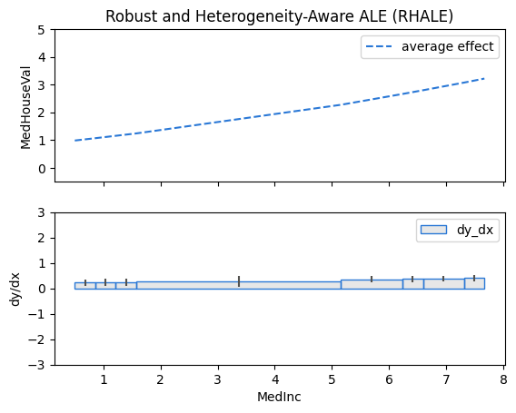
    


    
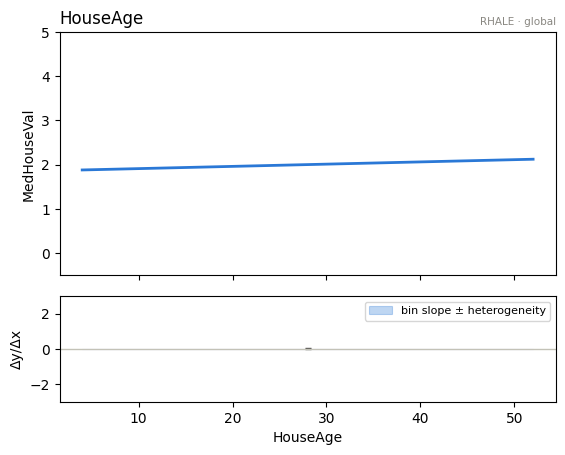
    


    
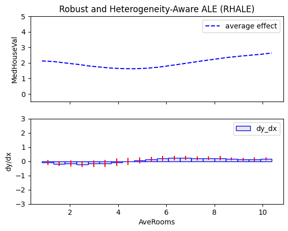
    


    
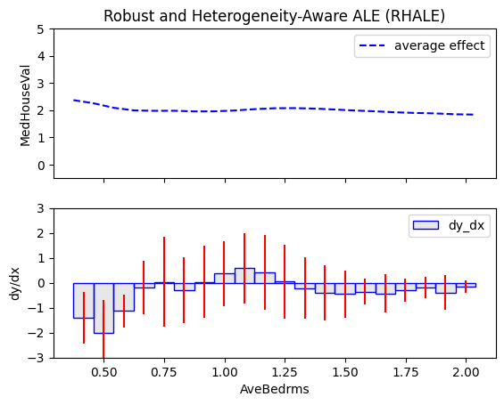
    


    
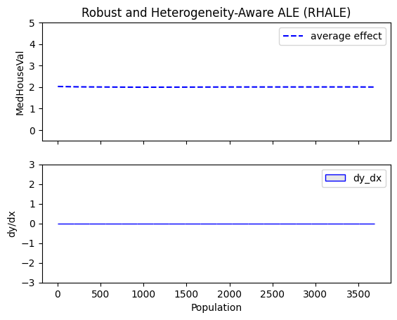
    


    
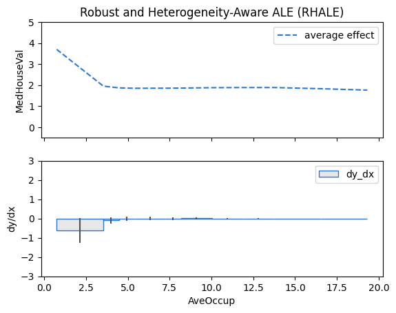
    


    
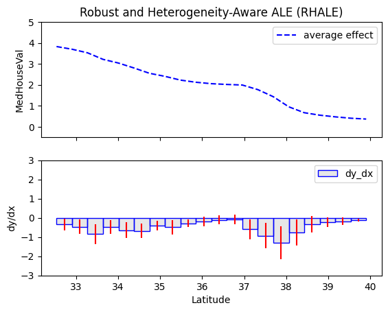
    


    
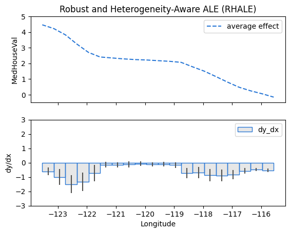
    


### Importance & one-click report

`importances()` ranks features by the dispersion of their mean effect (the
mu-twin of heterogeneity), and `effector.explain(...)` runs the whole
pipeline (fit -> rank -> regions) into a single serializable `Report`.


```python
# per-feature importance = dispersion of the mean effect (mu-twin of heterogeneity)
print("importances:", np.round(rhale.importances(), 3))

# one-click auto-explanation -> Report (serializable; self-contained HTML)
report = effector.explain(
    X_train.to_numpy(), model_forward, model_jac=model_jac,
    method="rhale",
    schema={"feature_names": feature_names, "target_name": target_name},
    nof_instances=2000,
)
report.show()
```

    importances: [0.612 0.073 0.343 0.112 0.044 0.518 1.106 1.321]


    
    RHALE report — target: MedHouseVal
    ============================================================
    feature                   importance     heter  #regions
    ------------------------------------------------------------
    Longitude                     1.2939    0.5281         7
    Latitude                      1.1172    0.7023         7
    MedInc                        0.6156    0.0549         7
    AveOccup                      0.4739    0.0485         1
    AveRooms                      0.3052    0.0326         1
    ============================================================
    
    
    Feature 7 - Full partition tree:
    🌳 Full Tree Structure:
    ───────────────────────
    Longitude 🔹 [id: 0 | heter: 0.53 | inst: 2000 | w: 1.00]
        Latitude ≤ 0.15 🔹 [id: 1 | heter: 0.20 | inst: 1155 | w: 0.58]
            Latitude ≤ -0.94 🔹 [id: 2 | heter: 0.15 | inst: 210 | w: 0.10]
            Latitude > -0.94 🔹 [id: 3 | heter: 0.14 | inst: 945 | w: 0.47]
        Latitude > 0.15 🔹 [id: 4 | heter: 0.34 | inst: 845 | w: 0.42]
            Latitude ≤ 1.42 🔹 [id: 5 | heter: 0.25 | inst: 661 | w: 0.33]
            Latitude > 1.42 🔹 [id: 6 | heter: 0.10 | inst: 184 | w: 0.09]
    --------------------------------------------------
    Feature 7 - Statistics per tree level:
    🌳 Tree Summary:
    ─────────────────
    Level 0🔹heter: 0.53
        Level 1🔹heter: 0.26 | 🔻0.27 (50.58%)
            Level 2🔹heter: 0.17 | 🔻0.09 (33.00%)
    
    
    
    
    Feature 6 - Full partition tree:
    🌳 Full Tree Structure:
    ───────────────────────
    Latitude 🔹 [id: 0 | heter: 0.70 | inst: 2000 | w: 1.00]
        Longitude ≤ -0.62 🔹 [id: 1 | heter: 0.48 | inst: 714 | w: 0.36]
            MedInc ≤ -0.69 🔹 [id: 2 | heter: 0.18 | inst: 175 | w: 0.09]
            MedInc > -0.69 🔹 [id: 3 | heter: 0.46 | inst: 539 | w: 0.27]
        Longitude > -0.62 🔹 [id: 4 | heter: 0.28 | inst: 1286 | w: 0.64]
            AveOccup ≤ -0.38 🔹 [id: 5 | heter: 0.26 | inst: 402 | w: 0.20]
            AveOccup > -0.38 🔹 [id: 6 | heter: 0.11 | inst: 884 | w: 0.44]
    --------------------------------------------------
    Feature 6 - Statistics per tree level:
    🌳 Tree Summary:
    ─────────────────
    Level 0🔹heter: 0.70
        Level 1🔹heter: 0.35 | 🔻0.35 (49.48%)
            Level 2🔹heter: 0.24 | 🔻0.11 (32.29%)
    
    
    
    
    Feature 0 - Full partition tree:
    🌳 Full Tree Structure:
    ───────────────────────
    MedInc 🔹 [id: 0 | heter: 0.05 | inst: 2000 | w: 1.00]
        AveRooms ≤ -0.44 🔹 [id: 1 | heter: 0.05 | inst: 646 | w: 0.32]
            AveOccup ≤ -0.38 🔹 [id: 2 | heter: 0.08 | inst: 263 | w: 0.13]
            AveOccup > -0.38 🔹 [id: 3 | heter: 0.02 | inst: 383 | w: 0.19]
        AveRooms > -0.44 🔹 [id: 4 | heter: 0.04 | inst: 1354 | w: 0.68]
            HouseAge ≤ 0.85 🔹 [id: 5 | heter: 0.03 | inst: 1112 | w: 0.56]
            HouseAge > 0.85 🔹 [id: 6 | heter: 0.06 | inst: 242 | w: 0.12]
    --------------------------------------------------
    Feature 0 - Statistics per tree level:
    🌳 Tree Summary:
    ─────────────────
    Level 0🔹heter: 0.05
        Level 1🔹heter: 0.05 | 🔻0.01 (14.47%)
            Level 2🔹heter: 0.04 | 🔻0.01 (16.34%)
    
    


## Regional Effects


```python
reg_rhale = effector.RHALE(data=X_train.to_numpy(), model=model_forward, model_jac=model_jac, schema={"feature_names": feature_names, "target_name": target_name}, nof_instances="all")
reg_rhale.fit("all", centering=True)
finder = effector.space_partitioning.Best(min_heterogeneity_decrease_pcg=0.25)
partitions = {feat: reg_rhale.find_regions(feat, finder=finder) for feat in range(len(feature_names))}
for feat in range(len(feature_names)):
    partitions[feat].show(scale_x_list=scale_x_list)
```

    
    
    Feature 0 - Full partition tree:
    No splits found for feature 0
    --------------------------------------------------
    Feature 0 - Statistics per tree level:
    No splits found for feature 0
    
    
    
    
    Feature 1 - Full partition tree:
    No splits found for feature 1
    --------------------------------------------------
    Feature 1 - Statistics per tree level:
    No splits found for feature 1
    
    
    
    
    Feature 2 - Full partition tree:
    🌳 Full Tree Structure:
    ───────────────────────
    AveRooms 🔹 [id: 0 | heter: 0.05 | inst: 14576 | w: 1.00]
        MedInc ≤ 3.73 🔹 [id: 1 | heter: 0.04 | inst: 8289 | w: 0.57]
        MedInc > 3.73 🔹 [id: 2 | heter: 0.03 | inst: 6287 | w: 0.43]
    --------------------------------------------------
    Feature 2 - Statistics per tree level:
    🌳 Tree Summary:
    ─────────────────
    Level 0🔹heter: 0.05
        Level 1🔹heter: 0.03 | 🔻0.02 (32.64%)
    
    
    
    
    Feature 3 - Full partition tree:
    No splits found for feature 3
    --------------------------------------------------
    Feature 3 - Statistics per tree level:
    No splits found for feature 3
    
    
    
    
    Feature 4 - Full partition tree:
    No splits found for feature 4
    --------------------------------------------------
    Feature 4 - Statistics per tree level:
    No splits found for feature 4
    
    
    
    
    Feature 5 - Full partition tree:
    🌳 Full Tree Structure:
    ───────────────────────
    AveOccup 🔹 [id: 0 | heter: 0.05 | inst: 14576 | w: 1.00]
        HouseAge ≤ 28.00 🔹 [id: 1 | heter: 0.03 | inst: 6394 | w: 0.44]
        HouseAge > 28.00 🔹 [id: 2 | heter: 0.04 | inst: 8182 | w: 0.56]
            MedInc ≤ 2.65 🔹 [id: 3 | heter: 0.02 | inst: 2547 | w: 0.17]
            MedInc > 2.65 🔹 [id: 4 | heter: 0.03 | inst: 5635 | w: 0.39]
    --------------------------------------------------
    Feature 5 - Statistics per tree level:
    🌳 Tree Summary:
    ─────────────────
    Level 0🔹heter: 0.05
        Level 1🔹heter: 0.04 | 🔻0.01 (25.90%)
            Level 2🔹heter: 0.02 | 🔻0.02 (54.34%)
    
    
    
    
    Feature 6 - Full partition tree:
    🌳 Full Tree Structure:
    ───────────────────────
    Latitude 🔹 [id: 0 | heter: 0.68 | inst: 14576 | w: 1.00]
        Longitude ≤ -121.15 🔹 [id: 1 | heter: 0.37 | inst: 4775 | w: 0.33]
        Longitude > -121.15 🔹 [id: 2 | heter: 0.27 | inst: 9801 | w: 0.67]
            AveOccup ≤ 2.61 🔹 [id: 3 | heter: 0.29 | inst: 3096 | w: 0.21]
            AveOccup > 2.61 🔹 [id: 4 | heter: 0.13 | inst: 6705 | w: 0.46]
    --------------------------------------------------
    Feature 6 - Statistics per tree level:
    🌳 Tree Summary:
    ─────────────────
    Level 0🔹heter: 0.68
        Level 1🔹heter: 0.30 | 🔻0.37 (55.46%)
            Level 2🔹heter: 0.12 | 🔻0.18 (59.96%)
    
    
    
    
    Feature 7 - Full partition tree:
    🌳 Full Tree Structure:
    ───────────────────────
    Longitude 🔹 [id: 0 | heter: 0.52 | inst: 14576 | w: 1.00]
        Latitude ≤ 36.22 🔹 [id: 1 | heter: 0.22 | inst: 8566 | w: 0.59]
        Latitude > 36.22 🔹 [id: 2 | heter: 0.33 | inst: 6010 | w: 0.41]
            Latitude ≤ 38.43 🔹 [id: 3 | heter: 0.27 | inst: 4724 | w: 0.32]
            Latitude > 38.43 🔹 [id: 4 | heter: 0.10 | inst: 1286 | w: 0.09]
    --------------------------------------------------
    Feature 7 - Statistics per tree level:
    🌳 Tree Summary:
    ─────────────────
    Level 0🔹heter: 0.52
        Level 1🔹heter: 0.26 | 🔻0.26 (49.46%)
            Level 2🔹heter: 0.10 | 🔻0.17 (63.70%)
    
    


**AveOccup: average number of people residing in a house**


```python
partitions[5].plot(0, centering=True, scale_x_list=scale_x_list, scale_y=scale_y, y_limits=y_limits)
```


    
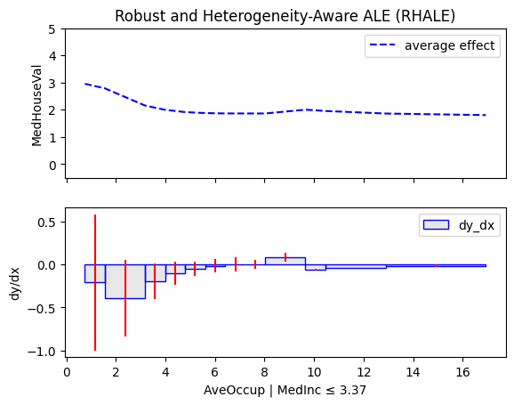
    


**Global Trend:** House prices decrease as the average number of people residing in a house increases with the highest slop in the lowest average occupancy values


```python
# plot the level-1 subregions (region ids depend on the fitted tree)
for r in partitions[5]:
    if r.level == 1:
        partitions[5].plot(r.idx, centering=True, scale_x_list=scale_x_list, scale_y=scale_y, y_limits=y_limits)
```


    
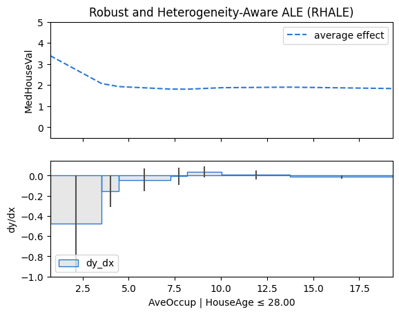
    


    
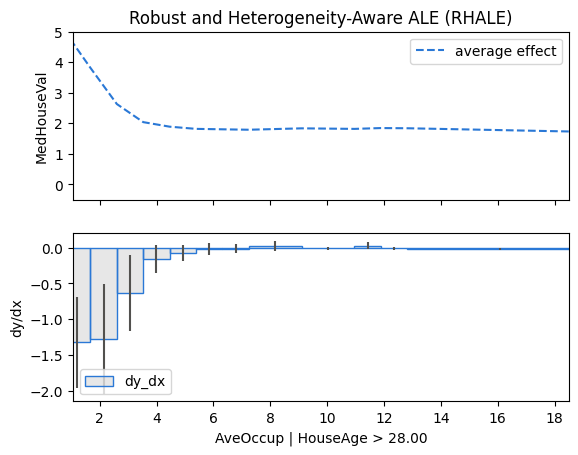
    


```python
for r in partitions[5]:
    if r.level == 2:
        partitions[5].plot(r.idx, centering=True, scale_x_list=scale_x_list, scale_y=scale_y, y_limits=y_limits)
```


    
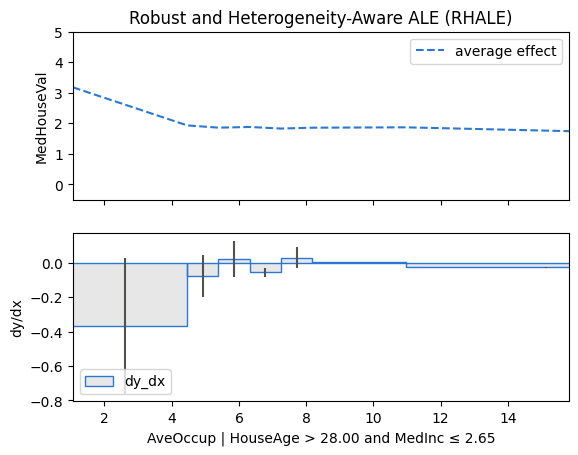
    


    
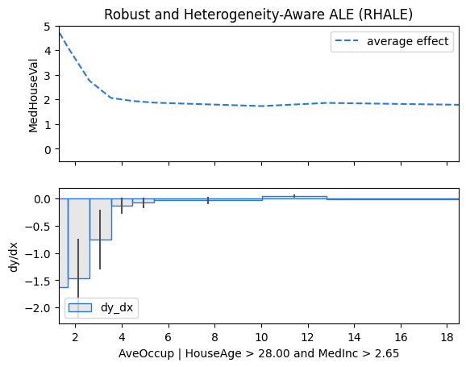
    


**Global Trend:** House prices decrease as the average number of people per household (AveOccup) increases, with the steepest drop at low occupancy levels. This suggests that even small increases in crowding can significantly reduce home values, especially in less crowded areas.

**Regional Trends:**  
- **Low-Income Areas (MedInc ≤ 3.73):** The initial slope (at low AveOccup) becomes smoother, indicating that house prices decrease more gradually with crowding in poorer regions.
- **High-Income Areas (MedInc > 3.73):** The initial slope becomes steeper, and starts from higher house values.
  - **Newer homes (HouseAge ≤ 18.40):** The slope remains smoother, starting from lower prices.
  - **Older homes (HouseAge > 18.40)** The slope becomes even steeper, and starts from higher house values, meaning older homes in high-income areas lose value rapidly as they become crowded.

## Latitude (south to north)


```python
partitions[6].plot(0, centering=True, scale_x_list=scale_x_list, scale_y=scale_y, y_limits=y_limits)
```


    
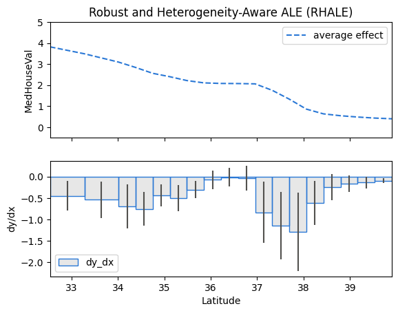
    


**Global Trend:** House prices decrease as we move north.  


```python
for r in partitions[6]:
    if r.level == 1:
        partitions[6].plot(r.idx, centering=True, scale_x_list=scale_x_list, scale_y=scale_y, y_limits=y_limits)
```


    
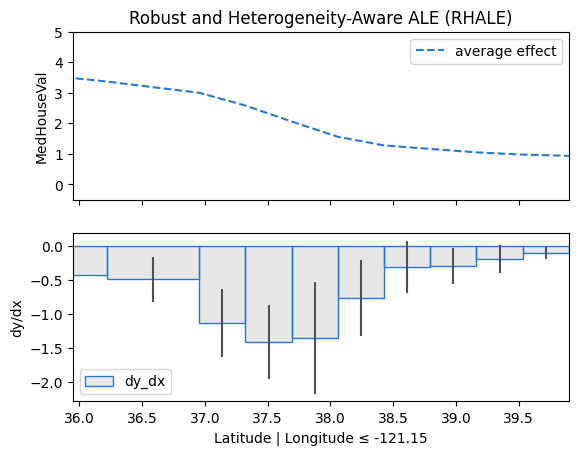
    


    
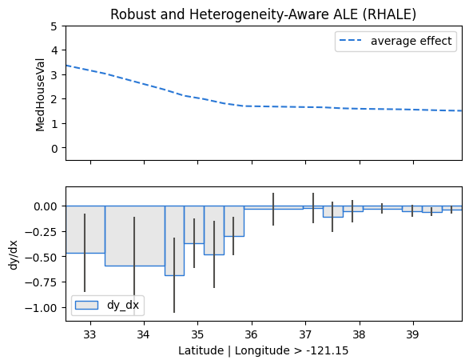
    


```python
for r in partitions[6]:
    if r.level == 2:
        partitions[6].plot(r.idx, centering=True, scale_x_list=scale_x_list, scale_y=scale_y, y_limits=y_limits)
```


    
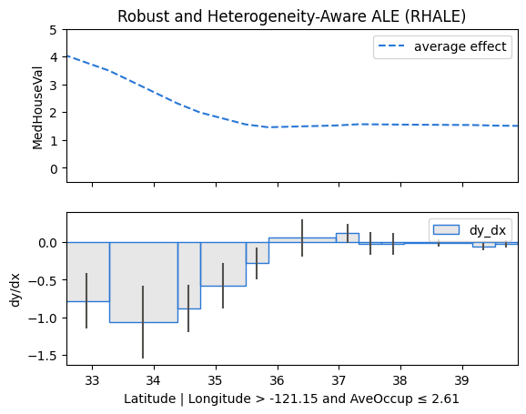
    


    
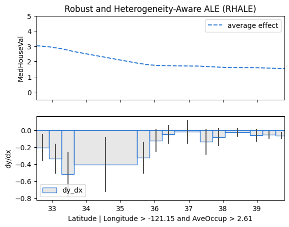
    


**Global Trend:** House prices decrease as we move north.  

**Regional Trends:** Moreorless the same, with minor different curves.

## Longitude (west to east)


```python
partitions[7].plot(0, centering=True, scale_x_list=scale_x_list, scale_y=scale_y)
```


    
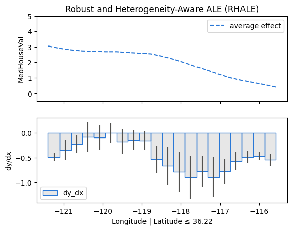
    


**Global Trend:** House prices decrease as we move east.  


```python
for r in partitions[7]:
    if r.level == 1:
        partitions[7].plot(r.idx, centering=True, scale_x_list=scale_x_list, scale_y=scale_y, y_limits=y_limits)
```


    
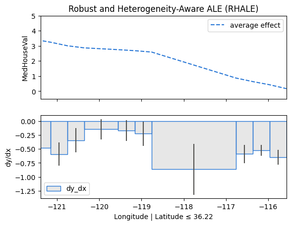
    


    
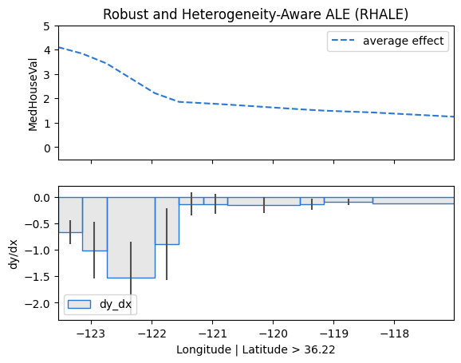
    


```python
for r in partitions[7]:
    if r.level == 2:
        partitions[7].plot(r.idx, centering=True, scale_x_list=scale_x_list, scale_y=scale_y, y_limits=y_limits)
```


    
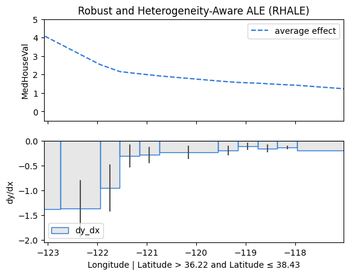
    


    
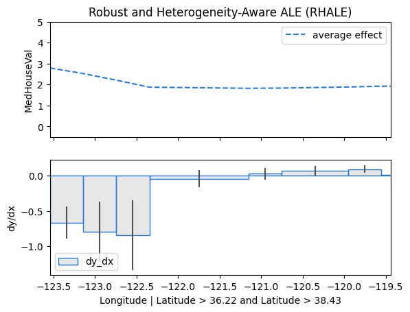
    


**Global Trend:** House prices decrease as we move east.  

**Regional Trends:**  
- **South (latitude <= 35.85):** Prices drop more sharply in the second half from west to east.
  - **AveOccup <= 2.61:** Prices drop even more steeper, suggesting that in less crowded southern areas, housing demand or value drops off more quickly as you move east.
  - **AveOccup > 2.61:** Patterns resemble the broader subregion (latitude <= 35.85), with no significant change in trend.
- **North (latitude > 35.85):** The steepest price decline happens in the western half (closer to the coast).  
  - **Latitude <= 38.43:** The sharp west-to-east price drop remains the same
  - **Latitude > 38.43:** The decline flattens, since the eastern part of far-northern California starts from lower prices
