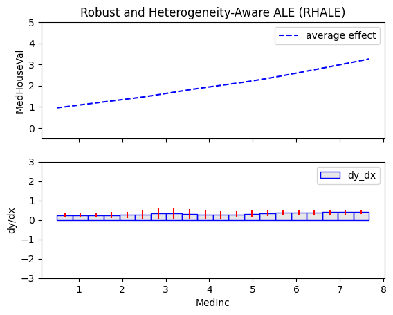
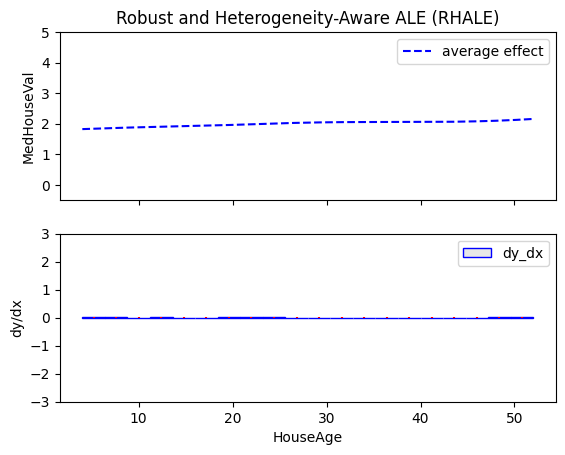
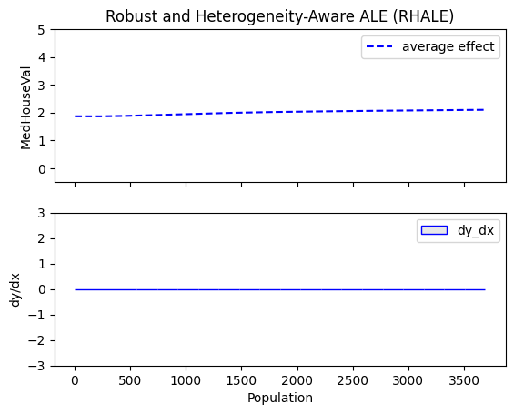
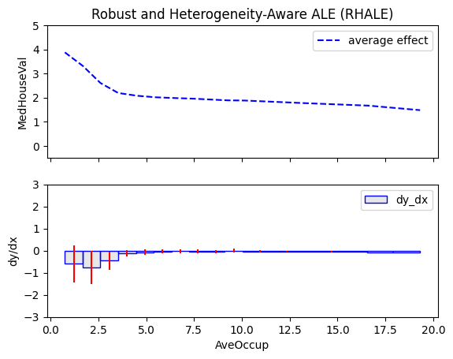

```python
import numpy as np
import keras
import tensorflow as tf
import effector
from sklearn.datasets import fetch_california_housing

california_housing = fetch_california_housing(as_frame=True)
```

    2025-02-26 11:16:08.667707: I tensorflow/core/platform/cpu_feature_guard.cc:210] This TensorFlow binary is optimized to use available CPU instructions in performance-critical operations.
    To enable the following instructions: AVX2 FMA, in other operations, rebuild TensorFlow with the appropriate compiler flags.


```python
np.random.seed(21)
```


```python
print(california_housing.DESCR)
```

    .. _california_housing_dataset:
    
    California Housing dataset
    --------------------------
    
    **Data Set Characteristics:**
    
    :Number of Instances: 20640
    
    :Number of Attributes: 8 numeric, predictive attributes and the target
    
    :Attribute Information:
        - MedInc        median income in block group
        - HouseAge      median house age in block group
        - AveRooms      average number of rooms per household
        - AveBedrms     average number of bedrooms per household
        - Population    block group population
        - AveOccup      average number of household members
        - Latitude      block group latitude
        - Longitude     block group longitude
    
    :Missing Attribute Values: None
    
    This dataset was obtained from the StatLib repository.
    https://www.dcc.fc.up.pt/~ltorgo/Regression/cal_housing.html
    
    The target variable is the median house value for California districts,
    expressed in hundreds of thousands of dollars ($100,000).
    
    This dataset was derived from the 1990 U.S. census, using one row per census
    block group. A block group is the smallest geographical unit for which the U.S.
    Census Bureau publishes sample data (a block group typically has a population
    of 600 to 3,000 people).
    
    A household is a group of people residing within a home. Since the average
    number of rooms and bedrooms in this dataset are provided per household, these
    columns may take surprisingly large values for block groups with few households
    and many empty houses, such as vacation resorts.
    
    It can be downloaded/loaded using the
    :func:`sklearn.datasets.fetch_california_housing` function.
    
    .. rubric:: References
    
    - Pace, R. Kelley and Ronald Barry, Sparse Spatial Autoregressions,
      Statistics and Probability Letters, 33 (1997) 291-297
    


```python
feature_names = california_housing.feature_names
target_name= california_housing.target_names[0]
df = type(california_housing.frame)
```


```python
X = california_housing.data
y = california_housing.target
```


```python
print("Design matrix shape: {}".format(X.shape))
print("---------------------------------")
for col_name in X.columns:
    print("Feature: {:15}, unique: {:4d}, Mean: {:6.2f}, Std: {:6.2f}, Min: {:6.2f}, Max: {:6.2f}".format(col_name, len(X[col_name].unique()), X[col_name].mean(), X[col_name].std(), X[col_name].min(), X[col_name].max()))
    
print("\nTarget shape: {}".format(y.shape))
print("---------------------------------")
print("Target: {:15}, unique: {:4d}, Mean: {:6.2f}, Std: {:6.2f}, Min: {:6.2f}, Max: {:6.2f}".format(y.name, len(y.unique()), y.mean(), y.std(), y.min(), y.max()))
```

    Design matrix shape: (20640, 8)
    ---------------------------------
    Feature: MedInc         , unique: 12928, Mean:   3.87, Std:   1.90, Min:   0.50, Max:  15.00
    Feature: HouseAge       , unique:   52, Mean:  28.64, Std:  12.59, Min:   1.00, Max:  52.00
    Feature: AveRooms       , unique: 19392, Mean:   5.43, Std:   2.47, Min:   0.85, Max: 141.91
    Feature: AveBedrms      , unique: 14233, Mean:   1.10, Std:   0.47, Min:   0.33, Max:  34.07
    Feature: Population     , unique: 3888, Mean: 1425.48, Std: 1132.46, Min:   3.00, Max: 35682.00
    Feature: AveOccup       , unique: 18841, Mean:   3.07, Std:  10.39, Min:   0.69, Max: 1243.33
    Feature: Latitude       , unique:  862, Mean:  35.63, Std:   2.14, Min:  32.54, Max:  41.95
    Feature: Longitude      , unique:  844, Mean: -119.57, Std:   2.00, Min: -124.35, Max: -114.31
    
    Target shape: (20640,)
    ---------------------------------
    Target: MedHouseVal    , unique: 3842, Mean:   2.07, Std:   1.15, Min:   0.15, Max:   5.00


```python
def preprocess(X, y):
    # Compute mean and std for outlier detection
    X_mean = X.mean()
    X_std = X.std()
    
    # Exclude instances with any feature 2 std away from the mean
    mask = (X - X_mean).abs() <= 2 * X_std
    mask = mask.all(axis=1)
    
    X_filtered = X[mask]
    y_filtered = y[mask]

    # Standardize X
    X_mean = X_filtered.mean()
    X_std = X_filtered.std()
    X_standardized = (X_filtered - X_mean) / X_std

    # Standardize y
    y_mean = y_filtered.mean()
    y_std = y_filtered.std()
    y_standardized = (y_filtered - y_mean) / y_std

    return X_standardized, y_standardized, X_mean, X_std, y_mean, y_std


# shuffle and standarize all features
X_df, Y_df, x_mean, x_std, y_mean, y_std = preprocess(X, y)
```


```python
def split(X_df, Y_df):
    # shuffle indices
    indices = np.arange(len(X_df))
    np.random.shuffle(indices)
    
    # data split
    train_size = int(0.8 * len(X_df))
    
    X_train = X_df.iloc[indices[:train_size]]
    Y_train = Y_df.iloc[indices[:train_size]]
    X_test = X_df.iloc[indices[train_size:]]
    Y_test = Y_df.iloc[indices[train_size:]]
    
    return X_train, Y_train, X_test, Y_test

# train/test split
X_train, Y_train, X_test, Y_test = split(X_df, Y_df)
```


```python
# Train - Evaluate - Explain a neural network
model = keras.Sequential([
    keras.layers.Dense(1024, activation="relu"),
    keras.layers.Dense(512, activation="relu"),
    keras.layers.Dense(256, activation="relu"),
    keras.layers.Dense(1)
])

optimizer = keras.optimizers.Adam(learning_rate=0.001)
model.compile(optimizer=optimizer, loss="mse", metrics=["mae", keras.metrics.RootMeanSquaredError()])
model.fit(X_train, Y_train, batch_size=1024, epochs=20, verbose=1)
model.evaluate(X_train, Y_train, verbose=1)
model.evaluate(X_test, Y_test, verbose=1)
```

    Epoch 1/20
    15/15 ━━━━━━━━━━━━━━━━━━━━ 2s 19ms/step - loss: 0.5963 - mae: 0.5775 - root_mean_squared_error: 0.7677
    Epoch 2/20
    15/15 ━━━━━━━━━━━━━━━━━━━━ 0s 20ms/step - loss: 0.3338 - mae: 0.4156 - root_mean_squared_error: 0.5777
    Epoch 3/20
    15/15 ━━━━━━━━━━━━━━━━━━━━ 0s 19ms/step - loss: 0.2985 - mae: 0.3941 - root_mean_squared_error: 0.5463
    Epoch 4/20
    15/15 ━━━━━━━━━━━━━━━━━━━━ 0s 20ms/step - loss: 0.2891 - mae: 0.3813 - root_mean_squared_error: 0.5377
    Epoch 5/20
    15/15 ━━━━━━━━━━━━━━━━━━━━ 0s 20ms/step - loss: 0.2772 - mae: 0.3718 - root_mean_squared_error: 0.5265
    Epoch 6/20
    15/15 ━━━━━━━━━━━━━━━━━━━━ 0s 18ms/step - loss: 0.2798 - mae: 0.3762 - root_mean_squared_error: 0.5289
    Epoch 7/20
    15/15 ━━━━━━━━━━━━━━━━━━━━ 0s 20ms/step - loss: 0.2643 - mae: 0.3626 - root_mean_squared_error: 0.5140
    Epoch 8/20
    15/15 ━━━━━━━━━━━━━━━━━━━━ 0s 19ms/step - loss: 0.2650 - mae: 0.3613 - root_mean_squared_error: 0.5148
    Epoch 9/20
    15/15 ━━━━━━━━━━━━━━━━━━━━ 0s 19ms/step - loss: 0.2559 - mae: 0.3569 - root_mean_squared_error: 0.5058
    Epoch 10/20
    15/15 ━━━━━━━━━━━━━━━━━━━━ 0s 20ms/step - loss: 0.2578 - mae: 0.3547 - root_mean_squared_error: 0.5077
    Epoch 11/20
    15/15 ━━━━━━━━━━━━━━━━━━━━ 0s 20ms/step - loss: 0.2499 - mae: 0.3488 - root_mean_squared_error: 0.4998
    Epoch 12/20
    15/15 ━━━━━━━━━━━━━━━━━━━━ 0s 18ms/step - loss: 0.2500 - mae: 0.3488 - root_mean_squared_error: 0.4999
    Epoch 13/20
    15/15 ━━━━━━━━━━━━━━━━━━━━ 0s 19ms/step - loss: 0.2405 - mae: 0.3424 - root_mean_squared_error: 0.4903
    Epoch 14/20
    15/15 ━━━━━━━━━━━━━━━━━━━━ 0s 19ms/step - loss: 0.2378 - mae: 0.3383 - root_mean_squared_error: 0.4876
    Epoch 15/20
    15/15 ━━━━━━━━━━━━━━━━━━━━ 0s 18ms/step - loss: 0.2382 - mae: 0.3391 - root_mean_squared_error: 0.4879
    Epoch 16/20
    15/15 ━━━━━━━━━━━━━━━━━━━━ 0s 18ms/step - loss: 0.2360 - mae: 0.3422 - root_mean_squared_error: 0.4858
    Epoch 17/20
    15/15 ━━━━━━━━━━━━━━━━━━━━ 0s 17ms/step - loss: 0.2246 - mae: 0.3293 - root_mean_squared_error: 0.4739
    Epoch 18/20
    15/15 ━━━━━━━━━━━━━━━━━━━━ 0s 18ms/step - loss: 0.2233 - mae: 0.3259 - root_mean_squared_error: 0.4725
    Epoch 19/20
    15/15 ━━━━━━━━━━━━━━━━━━━━ 0s 18ms/step - loss: 0.2144 - mae: 0.3216 - root_mean_squared_error: 0.4631
    Epoch 20/20
    15/15 ━━━━━━━━━━━━━━━━━━━━ 0s 18ms/step - loss: 0.2099 - mae: 0.3204 - root_mean_squared_error: 0.4581
    456/456 ━━━━━━━━━━━━━━━━━━━━ 1s 1ms/step - loss: 0.2090 - mae: 0.3247 - root_mean_squared_error: 0.4572
    114/114 ━━━━━━━━━━━━━━━━━━━━ 0s 1ms/step - loss: 0.3026 - mae: 0.3725 - root_mean_squared_error: 0.5495


    [0.2769879102706909, 0.36055105924606323, 0.5262964367866516]


```python
def model_jac(x):
    x_tensor = tf.convert_to_tensor(x, dtype=tf.float32)
    with tf.GradientTape() as t:
        t.watch(x_tensor)
        pred = model(x_tensor)
        grads = t.gradient(pred, x_tensor)
    return grads.numpy()

def model_forward(x):
    return model(x).numpy().squeeze()
```


```python
scale_y = {"mean": y_mean, "std": y_std}
scale_x_list =[{"mean": x_mean.iloc[i], "std": x_std.iloc[i]} for i in range(len(x_mean))]
```


```python
y_limits = [0, 4]
dy_limits = [-3, 3]
```

## Global effects


```python
rhale = effector.RHALE(data=X_train.to_numpy(), model=model_forward, model_jac=model_jac, feature_names=feature_names, target_name=target_name, nof_instances="all")
for i in range(len(feature_names)):
    rhale.plot(feature=i, centering=True, scale_x=scale_x_list[i], scale_y=scale_y, y_limits=y_limits, dy_limits=dy_limits)
```


    

    


    

    


    

    


    

    


    

    


    

    


    

    


    

    


## Regional Effects


```python
reg_rhale = effector.RegionalRHALE(data=X_train.to_numpy(), model=model_forward, model_jac=model_jac, feature_names=feature_names, target_name=target_name, nof_instances="all")
reg_rhale.fit("all", space_partitioner=effector.space_partitioning.Best(min_heterogeneity_decrease_pcg=0.25))
reg_rhale.summary(features="all", scale_x_list=scale_x_list)
```

    100%|██████████| 8/8 [00:34<00:00,  4.30s/it]

    
    
    Feature 0 - Full partition tree:
    🌳 Full Tree Structure:
    ───────────────────────
    MedInc 🔹 [id: 0 | heter: 0.05 | inst: 14576 | w: 1.00]
    --------------------------------------------------
    Feature 0 - Statistics per tree level:
    🌳 Tree Summary:
    ─────────────────
    Level 0🔹heter: 0.05
    
    
    
    
    Feature 1 - Full partition tree:
    🌳 Full Tree Structure:
    ───────────────────────
    HouseAge 🔹 [id: 0 | heter: 0.05 | inst: 14576 | w: 1.00]
    --------------------------------------------------
    Feature 1 - Statistics per tree level:
    🌳 Tree Summary:
    ─────────────────
    Level 0🔹heter: 0.05
    
    
    
    
    Feature 2 - Full partition tree:
    🌳 Full Tree Structure:
    ───────────────────────
    AveRooms 🔹 [id: 0 | heter: 0.04 | inst: 14576 | w: 1.00]
    --------------------------------------------------
    Feature 2 - Statistics per tree level:
    🌳 Tree Summary:
    ─────────────────
    Level 0🔹heter: 0.04
    
    
    
    
    Feature 3 - Full partition tree:
    🌳 Full Tree Structure:
    ───────────────────────
    AveBedrms 🔹 [id: 0 | heter: 0.01 | inst: 14576 | w: 1.00]
    --------------------------------------------------
    Feature 3 - Statistics per tree level:
    🌳 Tree Summary:
    ─────────────────
    Level 0🔹heter: 0.01
    
    
    
    
    Feature 4 - Full partition tree:
    🌳 Full Tree Structure:
    ───────────────────────
    Population 🔹 [id: 0 | heter: 0.02 | inst: 14576 | w: 1.00]
    --------------------------------------------------
    Feature 4 - Statistics per tree level:
    🌳 Tree Summary:
    ─────────────────
    Level 0🔹heter: 0.02
    
    
    
    
    Feature 5 - Full partition tree:
    🌳 Full Tree Structure:
    ───────────────────────
    AveOccup 🔹 [id: 0 | heter: 0.05 | inst: 14576 | w: 1.00]
        HouseAge ≤ 25.60 🔹 [id: 1 | heter: 0.02 | inst: 5587 | w: 0.38]
        HouseAge > 25.60 🔹 [id: 2 | heter: 0.04 | inst: 8989 | w: 0.62]
    --------------------------------------------------
    Feature 5 - Statistics per tree level:
    🌳 Tree Summary:
    ─────────────────
    Level 0🔹heter: 0.05
        Level 1🔹heter: 0.03 | 🔻0.01 (30.28%)
    
    
    
    
    Feature 6 - Full partition tree:
    🌳 Full Tree Structure:
    ───────────────────────
    Latitude 🔹 [id: 0 | heter: 0.67 | inst: 14576 | w: 1.00]
        Longitude ≤ -121.55 🔹 [id: 1 | heter: 0.44 | inst: 3810 | w: 0.26]
        Longitude > -121.55 🔹 [id: 2 | heter: 0.30 | inst: 10766 | w: 0.74]
    --------------------------------------------------
    Feature 6 - Statistics per tree level:
    🌳 Tree Summary:
    ─────────────────
    Level 0🔹heter: 0.67
        Level 1🔹heter: 0.34 | 🔻0.33 (49.37%)
    
    
    
    
    Feature 7 - Full partition tree:
    🌳 Full Tree Structure:
    ───────────────────────
    Longitude 🔹 [id: 0 | heter: 0.50 | inst: 14576 | w: 1.00]
        Latitude ≤ 36.22 🔹 [id: 1 | heter: 0.23 | inst: 8566 | w: 0.59]
        Latitude > 36.22 🔹 [id: 2 | heter: 0.30 | inst: 6010 | w: 0.41]
    --------------------------------------------------
    Feature 7 - Statistics per tree level:
    🌳 Tree Summary:
    ─────────────────
    Level 0🔹heter: 0.50
        Level 1🔹heter: 0.26 | 🔻0.24 (47.85%)
    
    


    


**AveOccup: average number of people residing in a house**


```python
reg_rhale.plot(feature=5, node_idx=0, centering=True, scale_x_list=scale_x_list, scale_y=scale_y, y_limits=y_limits)
```


    

    


```python
for node_idx in [1, 2]:
    reg_rhale.plot(feature=5, node_idx=node_idx, centering=True, scale_x_list=scale_x_list, scale_y=scale_y, y_limits=y_limits)
```


    

    


    

    


## Latitude (south to north)


```python
reg_rhale.plot(feature=6, node_idx=0, centering=True, scale_x_list=scale_x_list, scale_y=scale_y, y_limits=y_limits)
```


    

    


**Global Trend:** House prices decrease as we move north.  


```python
for node_idx in [1, 2]:
    reg_rhale.plot(feature=6, node_idx=node_idx, centering=True, scale_x_list=scale_x_list, scale_y=scale_y, y_limits=y_limits)
```


    

    


    

    


**Global Trend:** House prices decrease as we move north.  

**Regional Trends:** Moreorless the same, with minor different curves.

## Longitude (west to east)


```python
reg_rhale.plot(feature=7, node_idx=0, centering=True, scale_x_list=scale_x_list, scale_y=scale_y)
```


    

    


**Global Trend:** House prices decrease as we move east.  


```python
for node_idx in [1, 2]:
    reg_rhale.plot(feature=7, node_idx=node_idx, centering=True, scale_x_list=scale_x_list, scale_y=scale_y, y_limits=y_limits)
```


    

    


    

    


**Global Trend:** House prices decrease as we move east.  

**Regional Trends:**  
- **North (latitude > 35.85):** Prices drop more sharply in the first half from east to west.  
- **South (latitude < 35.85):** Prices drop more sharply in the second half from east to west.


```python

```
