# NO2

- Author: [givasile](https://givasile.github.io/)
- Runtime: ~1.5 min
- Description: Global and regional effects (PDP, RHALE, SHAP-DP) of wind
  speed on NO₂ concentration in Oslo, explaining a neural network and
  revealing interactions with wind direction and traffic volume.

The [NO2](https://www.openml.org/search?type=data&sort=version&status=any&order=asc&exact_name=no2&id=547) is a subsample of 500 observations from a data set that originate in a study where air pollution at a road is related to traffic volume and meteorological variables, collected by the Norwegian Public Roads Administration. The response variable (column 1) consist of hourly values of the logarithm of the concentration of NO2 (particles), measured at Alnabru in Oslo, Norway, between October 2001 and August 2003.

The predictor variables (columns 2 to 8) are the logarithm of the number of cars per hour, temperature 2 meter above ground (degree C), wind speed (meters/second), the temperature difference between 25 and 2 meters above ground (degree C), wind direction (degrees between 0 and 360), hour of day and day number from October 1. 2001.


```python
import effector
import numpy as np
import tensorflow as tf
from tensorflow import keras
import random

np.random.seed(42)
tf.random.set_seed(42)
random.seed(42)
```

    WARNING: All log messages before absl::InitializeLog() is called are written to STDERR
    I0000 00:00:1783725738.003712   17481 cpu_feature_guard.cc:227] This TensorFlow binary is optimized to use available CPU instructions in performance-critical operations.
    To enable the following instructions: AVX2 FMA, in other operations, rebuild TensorFlow with the appropriate compiler flags.


## Preprocess the data


```python
import openml

no2 = openml.datasets.get_dataset(547)

X, y, categorical_indicator, attribute_names = no2.get_data(
    target=no2.default_target_attribute
)
```


```python
print("Design matrix shape: {}".format(X.shape))
print("---------------------------------")
for col_name in X.columns:
    print("Feature: {:15}, unique: {:4d}, Mean: {:6.2f}, Std: {:6.2f}, Min: {:6.2f}, Max: {:6.2f}".format(col_name, len(X[col_name].unique()), X[col_name].mean(), X[col_name].std(), X[col_name].min(), X[col_name].max()))
    
print("\nTarget shape: {}".format(y.shape))
print("---------------------------------")
print("Target: {:15}, unique: {:4d}, Mean: {:6.2f}, Std: {:6.2f}, Min: {:6.2f}, Max: {:6.2f}".format("no2_concentration", len(y.unique()), y.mean(), y.std(), y.min(), y.max()))
```

    Design matrix shape: (500, 7)
    ---------------------------------
    Feature: cars_per_hour  , unique:  464, Mean:   6.97, Std:   1.09, Min:   4.13, Max:   8.35
    Feature: temperature_at_2m, unique:  223, Mean:   0.85, Std:   6.52, Min: -18.60, Max:  21.10
    Feature: wind_speed     , unique:   78, Mean:   3.06, Std:   1.78, Min:   0.30, Max:   9.90
    Feature: temperature_diff_2m_25m, unique:   61, Mean:   0.15, Std:   1.07, Min:  -5.40, Max:   4.30
    Feature: wind_direction , unique:  373, Mean: 143.37, Std:  86.51, Min:   2.00, Max: 359.00
    Feature: hour_of_day    , unique:   24, Mean:  12.38, Std:   6.80, Min:   1.00, Max:  24.00
    Feature: day            , unique:  287, Mean: 310.47, Std: 200.98, Min:  32.00, Max: 608.00
    
    Target shape: (500,)
    ---------------------------------
    Target: no2_concentration, unique:  385, Mean:   3.70, Std:   0.75, Min:   1.22, Max:   6.40


```python
def preprocess(X, y):
    # Standarize X
    X_df = X
    x_mean = X_df.mean()
    x_std = X_df.std()
    X_df = (X_df - X_df.mean()) / X_df.std()

    # Standarize Y
    Y_df = y
    y_mean = Y_df.mean()
    y_std = Y_df.std()
    Y_df = (Y_df - Y_df.mean()) / Y_df.std()
    return X_df, Y_df, x_mean, x_std, y_mean, y_std

# shuffle and standarize all features
X_df, Y_df, x_mean, x_std, y_mean, y_std = preprocess(X, y)
```


```python
def split(X_df, Y_df):
    # shuffle indices
    indices = X_df.index.tolist()
    np.random.shuffle(indices)
    
    # data split
    train_size = int(0.8 * len(X_df))
    
    X_train = X_df.iloc[indices[:train_size]]
    Y_train = Y_df.iloc[indices[:train_size]]
    X_test = X_df.iloc[indices[train_size:]]
    Y_test = Y_df.iloc[indices[train_size:]]
    
    return X_train, Y_train, X_test, Y_test

# train/test split
X_train, Y_train, X_test, Y_test = split(X_df, Y_df)

```

## Fit a Neural Network

We train a deep fully-connected Neural Network with 3 hidden layers for \(10\) epochs. 
The model achieves a root mean squared error on the test of about $0.7$ units.


```python
# Train - Evaluate - Explain a neural network
model = keras.Sequential([
    keras.layers.Dense(1024, activation="relu"),
    keras.layers.Dense(512, activation="relu"),
    keras.layers.Dense(256, activation="relu"),
    keras.layers.Dense(1)
])

optimizer = keras.optimizers.Adam(learning_rate=0.001)
model.compile(optimizer=optimizer, loss="mse", metrics=["mae", keras.metrics.RootMeanSquaredError()])
model.fit(X_train, Y_train, batch_size=512, epochs=10, verbose=1)
model.evaluate(X_train, Y_train, verbose=1)
model.evaluate(X_test, Y_test, verbose=1)
```

    Epoch 1/10


    
1/1 ━━━━━━━━━━━━━━━━━━━━ 0s 852ms/step - loss: 0.9584 - mae: 0.7906 - root_mean_squared_error: 0.9790

    
1/1 ━━━━━━━━━━━━━━━━━━━━ 1s 868ms/step - loss: 0.9584 - mae: 0.7906 - root_mean_squared_error: 0.9790


    Epoch 2/10


    
1/1 ━━━━━━━━━━━━━━━━━━━━ 0s 25ms/step - loss: 0.6712 - mae: 0.6472 - root_mean_squared_error: 0.8192

    
1/1 ━━━━━━━━━━━━━━━━━━━━ 0s 37ms/step - loss: 0.6712 - mae: 0.6472 - root_mean_squared_error: 0.8192


    Epoch 3/10


    
1/1 ━━━━━━━━━━━━━━━━━━━━ 0s 25ms/step - loss: 0.5145 - mae: 0.5716 - root_mean_squared_error: 0.7173

    
1/1 ━━━━━━━━━━━━━━━━━━━━ 0s 37ms/step - loss: 0.5145 - mae: 0.5716 - root_mean_squared_error: 0.7173


    Epoch 4/10


    
1/1 ━━━━━━━━━━━━━━━━━━━━ 0s 27ms/step - loss: 0.4573 - mae: 0.5309 - root_mean_squared_error: 0.6763

    
1/1 ━━━━━━━━━━━━━━━━━━━━ 0s 40ms/step - loss: 0.4573 - mae: 0.5309 - root_mean_squared_error: 0.6763


    Epoch 5/10


    
1/1 ━━━━━━━━━━━━━━━━━━━━ 0s 25ms/step - loss: 0.4320 - mae: 0.5061 - root_mean_squared_error: 0.6572

    
1/1 ━━━━━━━━━━━━━━━━━━━━ 0s 37ms/step - loss: 0.4320 - mae: 0.5061 - root_mean_squared_error: 0.6572


    Epoch 6/10


    
1/1 ━━━━━━━━━━━━━━━━━━━━ 0s 24ms/step - loss: 0.4075 - mae: 0.4871 - root_mean_squared_error: 0.6384

    
1/1 ━━━━━━━━━━━━━━━━━━━━ 0s 36ms/step - loss: 0.4075 - mae: 0.4871 - root_mean_squared_error: 0.6384


    Epoch 7/10


    
1/1 ━━━━━━━━━━━━━━━━━━━━ 0s 25ms/step - loss: 0.3981 - mae: 0.4815 - root_mean_squared_error: 0.6309

    
1/1 ━━━━━━━━━━━━━━━━━━━━ 0s 38ms/step - loss: 0.3981 - mae: 0.4815 - root_mean_squared_error: 0.6309


    Epoch 8/10


    
1/1 ━━━━━━━━━━━━━━━━━━━━ 0s 25ms/step - loss: 0.3882 - mae: 0.4777 - root_mean_squared_error: 0.6231

    
1/1 ━━━━━━━━━━━━━━━━━━━━ 0s 37ms/step - loss: 0.3882 - mae: 0.4777 - root_mean_squared_error: 0.6231


    Epoch 9/10


    
1/1 ━━━━━━━━━━━━━━━━━━━━ 0s 24ms/step - loss: 0.3707 - mae: 0.4679 - root_mean_squared_error: 0.6089

    
1/1 ━━━━━━━━━━━━━━━━━━━━ 0s 36ms/step - loss: 0.3707 - mae: 0.4679 - root_mean_squared_error: 0.6089


    Epoch 10/10


    
1/1 ━━━━━━━━━━━━━━━━━━━━ 0s 25ms/step - loss: 0.3507 - mae: 0.4533 - root_mean_squared_error: 0.5922

    
1/1 ━━━━━━━━━━━━━━━━━━━━ 0s 39ms/step - loss: 0.3507 - mae: 0.4533 - root_mean_squared_error: 0.5922


    
 1/13 ━━━━━━━━━━━━━━━━━━━━ 1s 99ms/step - loss: 0.4061 - mae: 0.4523 - root_mean_squared_error: 0.6372

    
13/13 ━━━━━━━━━━━━━━━━━━━━ 0s 3ms/step - loss: 0.3362 - mae: 0.4484 - root_mean_squared_error: 0.5798 


    
1/4 ━━━━━━━━━━━━━━━━━━━━ 0s 15ms/step - loss: 0.6244 - mae: 0.6522 - root_mean_squared_error: 0.7902

    
4/4 ━━━━━━━━━━━━━━━━━━━━ 0s 6ms/step - loss: 0.4984 - mae: 0.5615 - root_mean_squared_error: 0.7060 


    [0.4984276592731476, 0.5615400075912476, 0.7059940695762634]


## Explain

We will focus on the feature `wind_speed` (wind speed) because its global effect is quite heterogeneous and the heterogeneity can be further explained using regional effects.


```python
def model_jac(x):
    x_tensor = tf.convert_to_tensor(x, dtype=tf.float32)
    with tf.GradientTape() as t:
        t.watch(x_tensor)
        pred = model(x_tensor)
        grads = t.gradient(pred, x_tensor)
    return grads.numpy()

def model_forward(x):
    return model(x).numpy().squeeze()
```


```python
scale_y = {"mean": y_mean, "std": y_std}
scale_x_list =[{"mean": x_mean.iloc[i], "std": x_std.iloc[i]} for i in range(len(x_mean))]
feature_names = X_df.columns.to_list()
target_name = "no2_concentration"
y_limits=(2.5,5.5)
dy_limits = (-0.3,0.1)
foi = 2
```

## Global Effect  

**Overview of All Features**

We start by examining all features. Feature effect methods are generally more meaningful for numerical features. To compare effects across features more easily, we standardize the `y_limits`.  


```python
pdp = effector.PDP(data=X_train.to_numpy(), model=model_forward, schema={"feature_names": feature_names, "target_name": target_name}, nof_instances=2000)
for i in range(len(feature_names)):
    pdp.plot(feature=i, centering=True, scale_x=scale_x_list[i], scale_y=scale_y, show_avg_output=True, nof_ice=200, y_limits=y_limits)
```


    
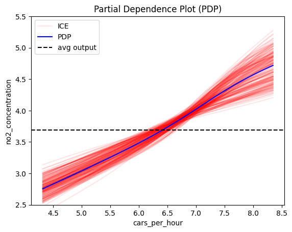
    


    
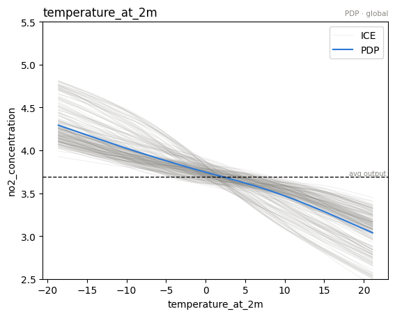
    


    
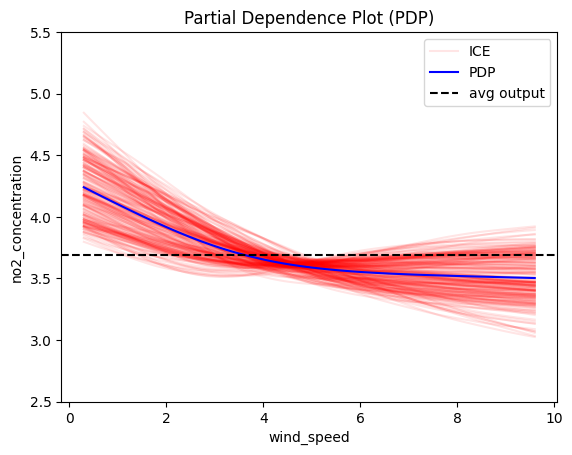
    


    
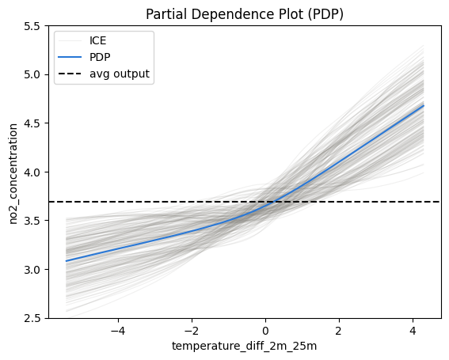
    


    
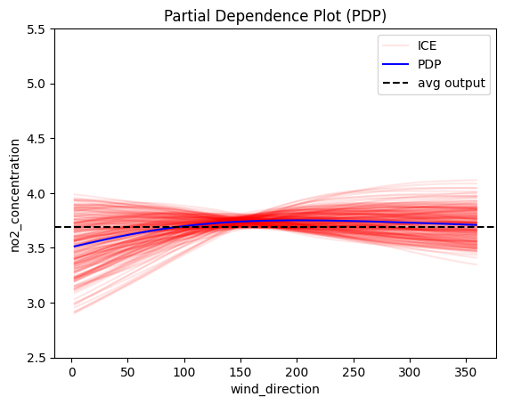
    


    
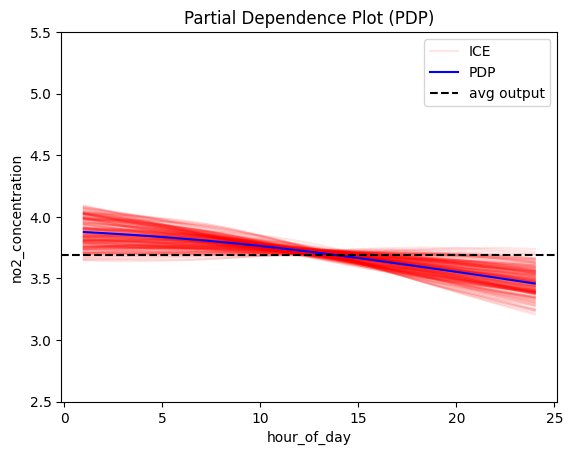
    


    
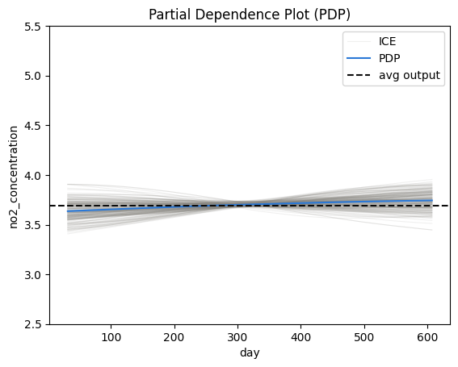
    


```python
y_limits = (3,4.5)
```

### PDP 


```python
pdp = effector.PDP(data=X_train.to_numpy(), model=model_forward, schema={"feature_names": feature_names, "target_name": target_name}, nof_instances=5000)
pdp.plot(feature=foi, centering=True, scale_x=scale_x_list[foi], scale_y=scale_y, show_avg_output=True, nof_ice=200, y_limits=y_limits)
```


    
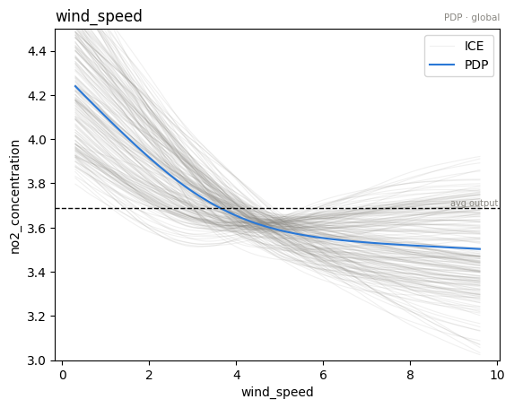
    


### RHALE


```python
rhale = effector.RHALE(data=X_train.to_numpy(), model=model_forward, model_jac=model_jac, schema={"feature_names": feature_names, "target_name": target_name})
rhale.plot(feature=foi, heterogeneity="std", centering=True, scale_x=scale_x_list[foi], scale_y=scale_y, show_avg_output=True, y_limits=y_limits, dy_limits=dy_limits)
```


    
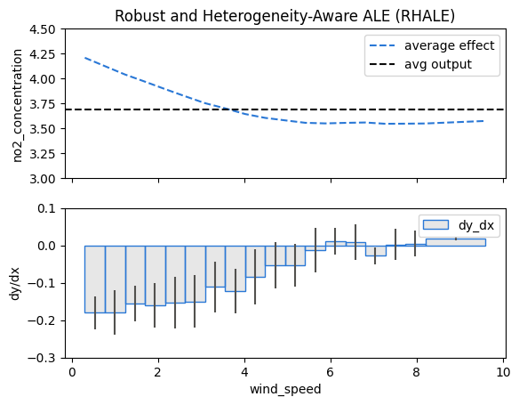
    


```python
shap_dp = effector.ShapDP(data=X_train.to_numpy(), model=model_forward, schema={"feature_names": feature_names, "target_name": target_name}, nof_instances=500)
shap_dp.plot(feature=foi, centering=True, scale_x=scale_x_list[foi], scale_y=scale_y, show_avg_output=True, y_limits=y_limits)
```

    
ExactExplainer explainer:  12%|█▏        | 46/400 [00:00<?, ?it/s]

    
ExactExplainer explainer:  12%|█▏        | 48/400 [00:10<00:17, 19.88it/s]

    
ExactExplainer explainer:  12%|█▎        | 50/400 [00:10<00:29, 12.04it/s]

    
ExactExplainer explainer:  13%|█▎        | 52/400 [00:10<00:32, 10.83it/s]

    
ExactExplainer explainer:  14%|█▎        | 54/400 [00:10<00:33, 10.36it/s]

    
ExactExplainer explainer:  14%|█▍        | 56/400 [00:11<00:35,  9.70it/s]

    
ExactExplainer explainer:  14%|█▍        | 58/400 [00:11<00:35,  9.51it/s]

    
ExactExplainer explainer:  15%|█▍        | 59/400 [00:11<00:35,  9.48it/s]

    
ExactExplainer explainer:  15%|█▌        | 60/400 [00:11<00:36,  9.33it/s]

    
ExactExplainer explainer:  15%|█▌        | 61/400 [00:11<00:36,  9.27it/s]

    
ExactExplainer explainer:  16%|█▌        | 62/400 [00:11<00:36,  9.21it/s]

    
ExactExplainer explainer:  16%|█▌        | 63/400 [00:11<00:36,  9.19it/s]

    
ExactExplainer explainer:  16%|█▌        | 64/400 [00:11<00:37,  8.98it/s]

    
ExactExplainer explainer:  16%|█▋        | 65/400 [00:12<00:38,  8.67it/s]

    
ExactExplainer explainer:  16%|█▋        | 66/400 [00:12<00:38,  8.67it/s]

    
ExactExplainer explainer:  17%|█▋        | 67/400 [00:12<00:38,  8.64it/s]

    
ExactExplainer explainer:  17%|█▋        | 68/400 [00:12<00:38,  8.69it/s]

    
ExactExplainer explainer:  17%|█▋        | 69/400 [00:12<00:37,  8.72it/s]

    
ExactExplainer explainer:  18%|█▊        | 70/400 [00:12<00:37,  8.81it/s]

    
ExactExplainer explainer:  18%|█▊        | 71/400 [00:12<00:37,  8.72it/s]

    
ExactExplainer explainer:  18%|█▊        | 72/400 [00:12<00:37,  8.75it/s]

    
ExactExplainer explainer:  18%|█▊        | 73/400 [00:12<00:37,  8.68it/s]

    
ExactExplainer explainer:  18%|█▊        | 74/400 [00:13<00:38,  8.50it/s]

    
ExactExplainer explainer:  19%|█▉        | 75/400 [00:13<00:38,  8.45it/s]

    
ExactExplainer explainer:  19%|█▉        | 76/400 [00:13<00:37,  8.53it/s]

    
ExactExplainer explainer:  19%|█▉        | 77/400 [00:13<00:37,  8.61it/s]

    
ExactExplainer explainer:  20%|█▉        | 78/400 [00:13<00:37,  8.65it/s]

    
ExactExplainer explainer:  20%|█▉        | 79/400 [00:13<00:37,  8.57it/s]

    
ExactExplainer explainer:  20%|██        | 80/400 [00:13<00:37,  8.50it/s]

    
ExactExplainer explainer:  20%|██        | 81/400 [00:13<00:37,  8.46it/s]

    
ExactExplainer explainer:  20%|██        | 82/400 [00:13<00:37,  8.53it/s]

    
ExactExplainer explainer:  21%|██        | 83/400 [00:14<00:38,  8.28it/s]

    
ExactExplainer explainer:  21%|██        | 84/400 [00:14<00:37,  8.35it/s]

    
ExactExplainer explainer:  21%|██▏       | 85/400 [00:14<00:37,  8.39it/s]

    
ExactExplainer explainer:  22%|██▏       | 86/400 [00:14<00:36,  8.55it/s]

    
ExactExplainer explainer:  22%|██▏       | 87/400 [00:14<00:36,  8.60it/s]

    
ExactExplainer explainer:  22%|██▏       | 88/400 [00:14<00:36,  8.57it/s]

    
ExactExplainer explainer:  22%|██▏       | 89/400 [00:14<00:36,  8.56it/s]

    
ExactExplainer explainer:  22%|██▎       | 90/400 [00:14<00:36,  8.60it/s]

    
ExactExplainer explainer:  23%|██▎       | 91/400 [00:15<00:36,  8.43it/s]

    
ExactExplainer explainer:  23%|██▎       | 92/400 [00:15<00:37,  8.18it/s]

    
ExactExplainer explainer:  23%|██▎       | 93/400 [00:15<00:37,  8.24it/s]

    
ExactExplainer explainer:  24%|██▎       | 94/400 [00:15<00:36,  8.34it/s]

    
ExactExplainer explainer:  24%|██▍       | 95/400 [00:15<00:36,  8.41it/s]

    
ExactExplainer explainer:  24%|██▍       | 96/400 [00:15<00:36,  8.33it/s]

    
ExactExplainer explainer:  24%|██▍       | 97/400 [00:15<00:36,  8.32it/s]

    
ExactExplainer explainer:  24%|██▍       | 98/400 [00:15<00:35,  8.49it/s]

    
ExactExplainer explainer:  25%|██▍       | 99/400 [00:16<00:35,  8.58it/s]

    
ExactExplainer explainer:  25%|██▌       | 100/400 [00:16<00:34,  8.61it/s]

    
ExactExplainer explainer:  25%|██▌       | 101/400 [00:16<00:35,  8.45it/s]

    
ExactExplainer explainer:  26%|██▌       | 102/400 [00:16<00:35,  8.42it/s]

    
ExactExplainer explainer:  26%|██▌       | 103/400 [00:16<00:34,  8.49it/s]

    
ExactExplainer explainer:  26%|██▌       | 104/400 [00:16<00:34,  8.62it/s]

    
ExactExplainer explainer:  26%|██▋       | 105/400 [00:16<00:34,  8.65it/s]

    
ExactExplainer explainer:  26%|██▋       | 106/400 [00:16<00:33,  8.74it/s]

    
ExactExplainer explainer:  27%|██▋       | 107/400 [00:16<00:33,  8.84it/s]

    
ExactExplainer explainer:  27%|██▋       | 108/400 [00:17<00:33,  8.64it/s]

    
ExactExplainer explainer:  27%|██▋       | 109/400 [00:17<00:33,  8.69it/s]

    
ExactExplainer explainer:  28%|██▊       | 110/400 [00:17<00:33,  8.71it/s]

    
ExactExplainer explainer:  28%|██▊       | 111/400 [00:17<00:33,  8.65it/s]

    
ExactExplainer explainer:  28%|██▊       | 112/400 [00:17<00:32,  8.77it/s]

    
ExactExplainer explainer:  28%|██▊       | 113/400 [00:17<00:32,  8.89it/s]

    
ExactExplainer explainer:  28%|██▊       | 114/400 [00:17<00:33,  8.51it/s]

    
ExactExplainer explainer:  29%|██▉       | 115/400 [00:17<00:32,  8.71it/s]

    
ExactExplainer explainer:  29%|██▉       | 116/400 [00:17<00:32,  8.80it/s]

    
ExactExplainer explainer:  29%|██▉       | 117/400 [00:18<00:32,  8.79it/s]

    
ExactExplainer explainer:  30%|██▉       | 118/400 [00:18<00:31,  8.86it/s]

    
ExactExplainer explainer:  30%|██▉       | 119/400 [00:18<00:31,  8.82it/s]

    
ExactExplainer explainer:  30%|███       | 120/400 [00:18<00:32,  8.58it/s]

    
ExactExplainer explainer:  30%|███       | 121/400 [00:18<00:34,  8.15it/s]

    
ExactExplainer explainer:  30%|███       | 122/400 [00:18<00:33,  8.32it/s]

    
ExactExplainer explainer:  31%|███       | 123/400 [00:18<00:32,  8.45it/s]

    
ExactExplainer explainer:  31%|███       | 124/400 [00:18<00:32,  8.60it/s]

    
ExactExplainer explainer:  31%|███▏      | 125/400 [00:19<00:31,  8.74it/s]

    
ExactExplainer explainer:  32%|███▏      | 126/400 [00:19<00:30,  8.89it/s]

    
ExactExplainer explainer:  32%|███▏      | 127/400 [00:19<00:30,  8.85it/s]

    
ExactExplainer explainer:  32%|███▏      | 128/400 [00:19<00:30,  8.92it/s]

    
ExactExplainer explainer:  32%|███▏      | 129/400 [00:19<00:30,  8.81it/s]

    
ExactExplainer explainer:  32%|███▎      | 130/400 [00:19<00:31,  8.69it/s]

    
ExactExplainer explainer:  33%|███▎      | 131/400 [00:19<00:31,  8.64it/s]

    
ExactExplainer explainer:  33%|███▎      | 132/400 [00:19<00:30,  8.73it/s]

    
ExactExplainer explainer:  33%|███▎      | 133/400 [00:19<00:30,  8.78it/s]

    
ExactExplainer explainer:  34%|███▎      | 134/400 [00:20<00:30,  8.68it/s]

    
ExactExplainer explainer:  34%|███▍      | 135/400 [00:20<00:30,  8.75it/s]

    
ExactExplainer explainer:  34%|███▍      | 136/400 [00:20<00:30,  8.77it/s]

    
ExactExplainer explainer:  34%|███▍      | 137/400 [00:20<00:30,  8.63it/s]

    
ExactExplainer explainer:  34%|███▍      | 138/400 [00:20<00:30,  8.53it/s]

    
ExactExplainer explainer:  35%|███▍      | 139/400 [00:20<00:32,  7.92it/s]

    
ExactExplainer explainer:  35%|███▌      | 140/400 [00:20<00:32,  7.90it/s]

    
ExactExplainer explainer:  35%|███▌      | 141/400 [00:20<00:32,  8.06it/s]

    
ExactExplainer explainer:  36%|███▌      | 142/400 [00:21<00:31,  8.18it/s]

    
ExactExplainer explainer:  36%|███▌      | 143/400 [00:21<00:30,  8.41it/s]

    
ExactExplainer explainer:  36%|███▌      | 144/400 [00:21<00:30,  8.51it/s]

    
ExactExplainer explainer:  36%|███▋      | 145/400 [00:21<00:29,  8.53it/s]

    
ExactExplainer explainer:  36%|███▋      | 146/400 [00:21<00:29,  8.62it/s]

    
ExactExplainer explainer:  37%|███▋      | 147/400 [00:21<00:29,  8.59it/s]

    
ExactExplainer explainer:  37%|███▋      | 148/400 [00:21<00:29,  8.56it/s]

    
ExactExplainer explainer:  37%|███▋      | 149/400 [00:21<00:29,  8.65it/s]

    
ExactExplainer explainer:  38%|███▊      | 150/400 [00:21<00:28,  8.71it/s]

    
ExactExplainer explainer:  38%|███▊      | 151/400 [00:22<00:28,  8.72it/s]

    
ExactExplainer explainer:  38%|███▊      | 152/400 [00:22<00:28,  8.67it/s]

    
ExactExplainer explainer:  38%|███▊      | 153/400 [00:22<00:28,  8.81it/s]

    
ExactExplainer explainer:  38%|███▊      | 154/400 [00:22<00:28,  8.74it/s]

    
ExactExplainer explainer:  39%|███▉      | 155/400 [00:22<00:28,  8.73it/s]

    
ExactExplainer explainer:  39%|███▉      | 156/400 [00:22<00:27,  8.89it/s]

    
ExactExplainer explainer:  39%|███▉      | 157/400 [00:22<00:27,  8.74it/s]

    
ExactExplainer explainer:  40%|███▉      | 158/400 [00:22<00:28,  8.63it/s]

    
ExactExplainer explainer:  40%|███▉      | 159/400 [00:22<00:27,  8.77it/s]

    
ExactExplainer explainer:  40%|████      | 160/400 [00:23<00:27,  8.89it/s]

    
ExactExplainer explainer:  40%|████      | 161/400 [00:23<00:26,  8.90it/s]

    
ExactExplainer explainer:  40%|████      | 162/400 [00:23<00:26,  8.88it/s]

    
ExactExplainer explainer:  41%|████      | 163/400 [00:23<00:27,  8.70it/s]

    
ExactExplainer explainer:  41%|████      | 164/400 [00:23<00:26,  8.77it/s]

    
ExactExplainer explainer:  41%|████▏     | 165/400 [00:23<00:27,  8.48it/s]

    
ExactExplainer explainer:  42%|████▏     | 166/400 [00:23<00:27,  8.54it/s]

    
ExactExplainer explainer:  42%|████▏     | 167/400 [00:23<00:27,  8.50it/s]

    
ExactExplainer explainer:  42%|████▏     | 168/400 [00:24<00:26,  8.63it/s]

    
ExactExplainer explainer:  42%|████▏     | 169/400 [00:24<00:26,  8.73it/s]

    
ExactExplainer explainer:  42%|████▎     | 170/400 [00:24<00:26,  8.69it/s]

    
ExactExplainer explainer:  43%|████▎     | 171/400 [00:24<00:26,  8.75it/s]

    
ExactExplainer explainer:  43%|████▎     | 172/400 [00:24<00:26,  8.70it/s]

    
ExactExplainer explainer:  43%|████▎     | 173/400 [00:24<00:26,  8.73it/s]

    
ExactExplainer explainer:  44%|████▎     | 174/400 [00:24<00:26,  8.59it/s]

    
ExactExplainer explainer:  44%|████▍     | 175/400 [00:24<00:25,  8.66it/s]

    
ExactExplainer explainer:  44%|████▍     | 176/400 [00:24<00:27,  8.25it/s]

    
ExactExplainer explainer:  44%|████▍     | 177/400 [00:25<00:26,  8.37it/s]

    
ExactExplainer explainer:  44%|████▍     | 178/400 [00:25<00:26,  8.41it/s]

    
ExactExplainer explainer:  45%|████▍     | 179/400 [00:25<00:25,  8.56it/s]

    
ExactExplainer explainer:  45%|████▌     | 180/400 [00:25<00:25,  8.74it/s]

    
ExactExplainer explainer:  45%|████▌     | 181/400 [00:25<00:24,  8.90it/s]

    
ExactExplainer explainer:  46%|████▌     | 182/400 [00:25<00:24,  8.90it/s]

    
ExactExplainer explainer:  46%|████▌     | 183/400 [00:25<00:25,  8.47it/s]

    
ExactExplainer explainer:  46%|████▌     | 184/400 [00:25<00:25,  8.51it/s]

    
ExactExplainer explainer:  46%|████▋     | 185/400 [00:26<00:26,  8.04it/s]

    
ExactExplainer explainer:  46%|████▋     | 186/400 [00:26<00:26,  7.93it/s]

    
ExactExplainer explainer:  47%|████▋     | 187/400 [00:26<00:26,  8.12it/s]

    
ExactExplainer explainer:  47%|████▋     | 188/400 [00:26<00:25,  8.24it/s]

    
ExactExplainer explainer:  47%|████▋     | 189/400 [00:26<00:24,  8.47it/s]

    
ExactExplainer explainer:  48%|████▊     | 190/400 [00:26<00:24,  8.50it/s]

    
ExactExplainer explainer:  48%|████▊     | 191/400 [00:26<00:24,  8.41it/s]

    
ExactExplainer explainer:  48%|████▊     | 192/400 [00:26<00:24,  8.51it/s]

    
ExactExplainer explainer:  48%|████▊     | 193/400 [00:26<00:23,  8.68it/s]

    
ExactExplainer explainer:  48%|████▊     | 194/400 [00:27<00:24,  8.49it/s]

    
ExactExplainer explainer:  49%|████▉     | 195/400 [00:27<00:23,  8.63it/s]

    
ExactExplainer explainer:  49%|████▉     | 196/400 [00:27<00:23,  8.72it/s]

    
ExactExplainer explainer:  49%|████▉     | 197/400 [00:27<00:24,  8.37it/s]

    
ExactExplainer explainer:  50%|████▉     | 198/400 [00:27<00:23,  8.56it/s]

    
ExactExplainer explainer:  50%|████▉     | 199/400 [00:27<00:23,  8.68it/s]

    
ExactExplainer explainer:  50%|█████     | 200/400 [00:27<00:22,  8.74it/s]

    
ExactExplainer explainer:  50%|█████     | 201/400 [00:27<00:22,  8.84it/s]

    
ExactExplainer explainer:  50%|█████     | 202/400 [00:27<00:22,  8.85it/s]

    
ExactExplainer explainer:  51%|█████     | 203/400 [00:28<00:23,  8.52it/s]

    
ExactExplainer explainer:  51%|█████     | 204/400 [00:28<00:23,  8.52it/s]

    
ExactExplainer explainer:  51%|█████▏    | 205/400 [00:28<00:23,  8.42it/s]

    
ExactExplainer explainer:  52%|█████▏    | 206/400 [00:28<00:22,  8.58it/s]

    
ExactExplainer explainer:  52%|█████▏    | 207/400 [00:28<00:22,  8.73it/s]

    
ExactExplainer explainer:  52%|█████▏    | 208/400 [00:28<00:21,  8.79it/s]

    
ExactExplainer explainer:  52%|█████▏    | 209/400 [00:28<00:21,  8.85it/s]

    
ExactExplainer explainer:  52%|█████▎    | 210/400 [00:28<00:21,  8.95it/s]

    
ExactExplainer explainer:  53%|█████▎    | 211/400 [00:29<00:21,  8.87it/s]

    
ExactExplainer explainer:  53%|█████▎    | 212/400 [00:29<00:21,  8.88it/s]

    
ExactExplainer explainer:  53%|█████▎    | 213/400 [00:29<00:21,  8.68it/s]

    
ExactExplainer explainer:  54%|█████▎    | 214/400 [00:29<00:21,  8.70it/s]

    
ExactExplainer explainer:  54%|█████▍    | 215/400 [00:29<00:21,  8.64it/s]

    
ExactExplainer explainer:  54%|█████▍    | 216/400 [00:29<00:20,  8.78it/s]

    
ExactExplainer explainer:  54%|█████▍    | 217/400 [00:29<00:20,  8.76it/s]

    
ExactExplainer explainer:  55%|█████▍    | 218/400 [00:29<00:21,  8.64it/s]

    
ExactExplainer explainer:  55%|█████▍    | 219/400 [00:29<00:21,  8.56it/s]

    
ExactExplainer explainer:  55%|█████▌    | 220/400 [00:30<00:21,  8.55it/s]

    
ExactExplainer explainer:  55%|█████▌    | 221/400 [00:30<00:20,  8.62it/s]

    
ExactExplainer explainer:  56%|█████▌    | 222/400 [00:30<00:20,  8.61it/s]

    
ExactExplainer explainer:  56%|█████▌    | 223/400 [00:30<00:20,  8.75it/s]

    
ExactExplainer explainer:  56%|█████▌    | 224/400 [00:30<00:19,  8.86it/s]

    
ExactExplainer explainer:  56%|█████▋    | 225/400 [00:30<00:19,  8.82it/s]

    
ExactExplainer explainer:  56%|█████▋    | 226/400 [00:30<00:19,  8.84it/s]

    
ExactExplainer explainer:  57%|█████▋    | 227/400 [00:30<00:19,  8.95it/s]

    
ExactExplainer explainer:  57%|█████▋    | 228/400 [00:30<00:19,  8.94it/s]

    
ExactExplainer explainer:  57%|█████▋    | 229/400 [00:31<00:19,  8.94it/s]

    
ExactExplainer explainer:  57%|█████▊    | 230/400 [00:31<00:18,  9.01it/s]

    
ExactExplainer explainer:  58%|█████▊    | 231/400 [00:31<00:18,  8.96it/s]

    
ExactExplainer explainer:  58%|█████▊    | 232/400 [00:31<00:19,  8.79it/s]

    
ExactExplainer explainer:  58%|█████▊    | 233/400 [00:31<00:18,  8.80it/s]

    
ExactExplainer explainer:  58%|█████▊    | 234/400 [00:31<00:18,  8.76it/s]

    
ExactExplainer explainer:  59%|█████▉    | 235/400 [00:31<00:18,  8.82it/s]

    
ExactExplainer explainer:  59%|█████▉    | 236/400 [00:31<00:18,  8.89it/s]

    
ExactExplainer explainer:  59%|█████▉    | 237/400 [00:31<00:18,  8.93it/s]

    
ExactExplainer explainer:  60%|█████▉    | 238/400 [00:32<00:18,  8.93it/s]

    
ExactExplainer explainer:  60%|█████▉    | 239/400 [00:32<00:18,  8.52it/s]

    
ExactExplainer explainer:  60%|██████    | 240/400 [00:32<00:18,  8.65it/s]

    
ExactExplainer explainer:  60%|██████    | 241/400 [00:32<00:19,  8.33it/s]

    
ExactExplainer explainer:  60%|██████    | 242/400 [00:32<00:18,  8.48it/s]

    
ExactExplainer explainer:  61%|██████    | 243/400 [00:32<00:18,  8.45it/s]

    
ExactExplainer explainer:  61%|██████    | 244/400 [00:32<00:18,  8.61it/s]

    
ExactExplainer explainer:  61%|██████▏   | 245/400 [00:32<00:17,  8.70it/s]

    
ExactExplainer explainer:  62%|██████▏   | 246/400 [00:33<00:17,  8.67it/s]

    
ExactExplainer explainer:  62%|██████▏   | 247/400 [00:33<00:17,  8.57it/s]

    
ExactExplainer explainer:  62%|██████▏   | 248/400 [00:33<00:17,  8.64it/s]

    
ExactExplainer explainer:  62%|██████▏   | 249/400 [00:33<00:17,  8.77it/s]

    
ExactExplainer explainer:  62%|██████▎   | 250/400 [00:33<00:17,  8.80it/s]

    
ExactExplainer explainer:  63%|██████▎   | 251/400 [00:33<00:17,  8.75it/s]

    
ExactExplainer explainer:  63%|██████▎   | 252/400 [00:33<00:16,  8.72it/s]

    
ExactExplainer explainer:  63%|██████▎   | 253/400 [00:33<00:16,  8.83it/s]

    
ExactExplainer explainer:  64%|██████▎   | 254/400 [00:33<00:16,  8.92it/s]

    
ExactExplainer explainer:  64%|██████▍   | 255/400 [00:34<00:16,  8.97it/s]

    
ExactExplainer explainer:  64%|██████▍   | 256/400 [00:34<00:16,  8.96it/s]

    
ExactExplainer explainer:  64%|██████▍   | 257/400 [00:34<00:15,  8.97it/s]

    
ExactExplainer explainer:  64%|██████▍   | 258/400 [00:34<00:16,  8.79it/s]

    
ExactExplainer explainer:  65%|██████▍   | 259/400 [00:34<00:16,  8.79it/s]

    
ExactExplainer explainer:  65%|██████▌   | 260/400 [00:34<00:16,  8.51it/s]

    
ExactExplainer explainer:  65%|██████▌   | 261/400 [00:34<00:16,  8.28it/s]

    
ExactExplainer explainer:  66%|██████▌   | 262/400 [00:34<00:16,  8.37it/s]

    
ExactExplainer explainer:  66%|██████▌   | 263/400 [00:34<00:16,  8.51it/s]

    
ExactExplainer explainer:  66%|██████▌   | 264/400 [00:35<00:15,  8.52it/s]

    
ExactExplainer explainer:  66%|██████▋   | 265/400 [00:35<00:15,  8.63it/s]

    
ExactExplainer explainer:  66%|██████▋   | 266/400 [00:35<00:15,  8.60it/s]

    
ExactExplainer explainer:  67%|██████▋   | 267/400 [00:35<00:15,  8.61it/s]

    
ExactExplainer explainer:  67%|██████▋   | 268/400 [00:35<00:15,  8.69it/s]

    
ExactExplainer explainer:  67%|██████▋   | 269/400 [00:35<00:15,  8.51it/s]

    
ExactExplainer explainer:  68%|██████▊   | 270/400 [00:35<00:15,  8.52it/s]

    
ExactExplainer explainer:  68%|██████▊   | 271/400 [00:35<00:15,  8.28it/s]

    
ExactExplainer explainer:  68%|██████▊   | 272/400 [00:36<00:15,  8.26it/s]

    
ExactExplainer explainer:  68%|██████▊   | 273/400 [00:36<00:15,  8.31it/s]

    
ExactExplainer explainer:  68%|██████▊   | 274/400 [00:36<00:15,  8.38it/s]

    
ExactExplainer explainer:  69%|██████▉   | 275/400 [00:36<00:14,  8.46it/s]

    
ExactExplainer explainer:  69%|██████▉   | 276/400 [00:36<00:14,  8.45it/s]

    
ExactExplainer explainer:  69%|██████▉   | 277/400 [00:36<00:14,  8.22it/s]

    
ExactExplainer explainer:  70%|██████▉   | 278/400 [00:36<00:15,  8.09it/s]

    
ExactExplainer explainer:  70%|██████▉   | 279/400 [00:36<00:14,  8.12it/s]

    
ExactExplainer explainer:  70%|███████   | 280/400 [00:37<00:14,  8.21it/s]

    
ExactExplainer explainer:  70%|███████   | 281/400 [00:37<00:14,  8.25it/s]

    
ExactExplainer explainer:  70%|███████   | 282/400 [00:37<00:13,  8.47it/s]

    
ExactExplainer explainer:  71%|███████   | 283/400 [00:37<00:13,  8.40it/s]

    
ExactExplainer explainer:  71%|███████   | 284/400 [00:37<00:13,  8.64it/s]

    
ExactExplainer explainer:  71%|███████▏  | 285/400 [00:37<00:13,  8.63it/s]

    
ExactExplainer explainer:  72%|███████▏  | 286/400 [00:37<00:12,  8.82it/s]

    
ExactExplainer explainer:  72%|███████▏  | 287/400 [00:37<00:13,  8.39it/s]

    
ExactExplainer explainer:  72%|███████▏  | 288/400 [00:37<00:13,  8.55it/s]

    
ExactExplainer explainer:  72%|███████▏  | 289/400 [00:38<00:12,  8.65it/s]

    
ExactExplainer explainer:  72%|███████▎  | 290/400 [00:38<00:12,  8.67it/s]

    
ExactExplainer explainer:  73%|███████▎  | 291/400 [00:38<00:12,  8.78it/s]

    
ExactExplainer explainer:  73%|███████▎  | 292/400 [00:38<00:12,  8.90it/s]

    
ExactExplainer explainer:  73%|███████▎  | 293/400 [00:38<00:11,  8.97it/s]

    
ExactExplainer explainer:  74%|███████▎  | 294/400 [00:38<00:11,  8.89it/s]

    
ExactExplainer explainer:  74%|███████▍  | 295/400 [00:38<00:11,  8.89it/s]

    
ExactExplainer explainer:  74%|███████▍  | 296/400 [00:38<00:11,  8.74it/s]

    
ExactExplainer explainer:  74%|███████▍  | 297/400 [00:38<00:12,  8.43it/s]

    
ExactExplainer explainer:  74%|███████▍  | 298/400 [00:39<00:12,  8.30it/s]

    
ExactExplainer explainer:  75%|███████▍  | 299/400 [00:39<00:12,  8.42it/s]

    
ExactExplainer explainer:  75%|███████▌  | 300/400 [00:39<00:11,  8.38it/s]

    
ExactExplainer explainer:  75%|███████▌  | 301/400 [00:39<00:11,  8.43it/s]

    
ExactExplainer explainer:  76%|███████▌  | 302/400 [00:39<00:11,  8.48it/s]

    
ExactExplainer explainer:  76%|███████▌  | 303/400 [00:39<00:11,  8.37it/s]

    
ExactExplainer explainer:  76%|███████▌  | 304/400 [00:39<00:11,  8.31it/s]

    
ExactExplainer explainer:  76%|███████▋  | 305/400 [00:39<00:11,  8.45it/s]

    
ExactExplainer explainer:  76%|███████▋  | 306/400 [00:40<00:11,  8.47it/s]

    
ExactExplainer explainer:  77%|███████▋  | 307/400 [00:40<00:10,  8.49it/s]

    
ExactExplainer explainer:  77%|███████▋  | 308/400 [00:40<00:11,  8.28it/s]

    
ExactExplainer explainer:  77%|███████▋  | 309/400 [00:40<00:10,  8.29it/s]

    
ExactExplainer explainer:  78%|███████▊  | 310/400 [00:40<00:10,  8.43it/s]

    
ExactExplainer explainer:  78%|███████▊  | 311/400 [00:40<00:10,  8.37it/s]

    
ExactExplainer explainer:  78%|███████▊  | 312/400 [00:40<00:10,  8.47it/s]

    
ExactExplainer explainer:  78%|███████▊  | 313/400 [00:40<00:10,  8.25it/s]

    
ExactExplainer explainer:  78%|███████▊  | 314/400 [00:41<00:10,  8.38it/s]

    
ExactExplainer explainer:  79%|███████▉  | 315/400 [00:41<00:09,  8.53it/s]

    
ExactExplainer explainer:  79%|███████▉  | 316/400 [00:41<00:09,  8.47it/s]

    
ExactExplainer explainer:  79%|███████▉  | 317/400 [00:41<00:09,  8.64it/s]

    
ExactExplainer explainer:  80%|███████▉  | 318/400 [00:41<00:09,  8.63it/s]

    
ExactExplainer explainer:  80%|███████▉  | 319/400 [00:41<00:09,  8.58it/s]

    
ExactExplainer explainer:  80%|████████  | 320/400 [00:41<00:09,  8.61it/s]

    
ExactExplainer explainer:  80%|████████  | 321/400 [00:41<00:09,  8.62it/s]

    
ExactExplainer explainer:  80%|████████  | 322/400 [00:41<00:09,  8.59it/s]

    
ExactExplainer explainer:  81%|████████  | 323/400 [00:42<00:09,  8.47it/s]

    
ExactExplainer explainer:  81%|████████  | 324/400 [00:42<00:09,  8.31it/s]

    
ExactExplainer explainer:  81%|████████▏ | 325/400 [00:42<00:08,  8.45it/s]

    
ExactExplainer explainer:  82%|████████▏ | 326/400 [00:42<00:08,  8.60it/s]

    
ExactExplainer explainer:  82%|████████▏ | 327/400 [00:42<00:08,  8.53it/s]

    
ExactExplainer explainer:  82%|████████▏ | 328/400 [00:42<00:09,  7.72it/s]

    
ExactExplainer explainer:  82%|████████▏ | 329/400 [00:42<00:09,  7.76it/s]

    
ExactExplainer explainer:  82%|████████▎ | 330/400 [00:42<00:08,  8.05it/s]

    
ExactExplainer explainer:  83%|████████▎ | 331/400 [00:43<00:08,  8.29it/s]

    
ExactExplainer explainer:  83%|████████▎ | 332/400 [00:43<00:08,  8.26it/s]

    
ExactExplainer explainer:  83%|████████▎ | 333/400 [00:43<00:08,  8.32it/s]

    
ExactExplainer explainer:  84%|████████▎ | 334/400 [00:43<00:07,  8.39it/s]

    
ExactExplainer explainer:  84%|████████▍ | 335/400 [00:43<00:07,  8.57it/s]

    
ExactExplainer explainer:  84%|████████▍ | 336/400 [00:43<00:07,  8.68it/s]

    
ExactExplainer explainer:  84%|████████▍ | 337/400 [00:43<00:07,  8.72it/s]

    
ExactExplainer explainer:  84%|████████▍ | 338/400 [00:43<00:07,  8.85it/s]

    
ExactExplainer explainer:  85%|████████▍ | 339/400 [00:43<00:06,  8.85it/s]

    
ExactExplainer explainer:  85%|████████▌ | 340/400 [00:44<00:06,  8.97it/s]

    
ExactExplainer explainer:  85%|████████▌ | 341/400 [00:44<00:06,  8.76it/s]

    
ExactExplainer explainer:  86%|████████▌ | 342/400 [00:44<00:06,  8.59it/s]

    
ExactExplainer explainer:  86%|████████▌ | 343/400 [00:44<00:06,  8.63it/s]

    
ExactExplainer explainer:  86%|████████▌ | 344/400 [00:44<00:06,  8.75it/s]

    
ExactExplainer explainer:  86%|████████▋ | 345/400 [00:44<00:06,  8.86it/s]

    
ExactExplainer explainer:  86%|████████▋ | 346/400 [00:44<00:06,  8.87it/s]

    
ExactExplainer explainer:  87%|████████▋ | 347/400 [00:44<00:06,  8.66it/s]

    
ExactExplainer explainer:  87%|████████▋ | 348/400 [00:44<00:06,  8.47it/s]

    
ExactExplainer explainer:  87%|████████▋ | 349/400 [00:45<00:05,  8.64it/s]

    
ExactExplainer explainer:  88%|████████▊ | 350/400 [00:45<00:05,  8.72it/s]

    
ExactExplainer explainer:  88%|████████▊ | 351/400 [00:45<00:05,  8.59it/s]

    
ExactExplainer explainer:  88%|████████▊ | 352/400 [00:45<00:05,  8.49it/s]

    
ExactExplainer explainer:  88%|████████▊ | 353/400 [00:45<00:05,  8.36it/s]

    
ExactExplainer explainer:  88%|████████▊ | 354/400 [00:45<00:05,  8.08it/s]

    
ExactExplainer explainer:  89%|████████▉ | 355/400 [00:45<00:05,  7.93it/s]

    
ExactExplainer explainer:  89%|████████▉ | 356/400 [00:45<00:05,  7.72it/s]

    
ExactExplainer explainer:  89%|████████▉ | 357/400 [00:46<00:05,  7.99it/s]

    
ExactExplainer explainer:  90%|████████▉ | 358/400 [00:46<00:05,  8.20it/s]

    
ExactExplainer explainer:  90%|████████▉ | 359/400 [00:46<00:04,  8.44it/s]

    
ExactExplainer explainer:  90%|█████████ | 360/400 [00:46<00:04,  8.36it/s]

    
ExactExplainer explainer:  90%|█████████ | 361/400 [00:46<00:04,  8.30it/s]

    
ExactExplainer explainer:  90%|█████████ | 362/400 [00:46<00:04,  8.35it/s]

    
ExactExplainer explainer:  91%|█████████ | 363/400 [00:46<00:04,  8.44it/s]

    
ExactExplainer explainer:  91%|█████████ | 364/400 [00:46<00:04,  8.31it/s]

    
ExactExplainer explainer:  91%|█████████▏| 365/400 [00:47<00:04,  8.33it/s]

    
ExactExplainer explainer:  92%|█████████▏| 366/400 [00:47<00:04,  8.39it/s]

    
ExactExplainer explainer:  92%|█████████▏| 367/400 [00:47<00:03,  8.32it/s]

    
ExactExplainer explainer:  92%|█████████▏| 368/400 [00:47<00:03,  8.43it/s]

    
ExactExplainer explainer:  92%|█████████▏| 369/400 [00:47<00:03,  8.48it/s]

    
ExactExplainer explainer:  92%|█████████▎| 370/400 [00:47<00:03,  8.56it/s]

    
ExactExplainer explainer:  93%|█████████▎| 371/400 [00:47<00:03,  8.35it/s]

    
ExactExplainer explainer:  93%|█████████▎| 372/400 [00:47<00:03,  8.16it/s]

    
ExactExplainer explainer:  93%|█████████▎| 373/400 [00:47<00:03,  8.34it/s]

    
ExactExplainer explainer:  94%|█████████▎| 374/400 [00:48<00:03,  8.52it/s]

    
ExactExplainer explainer:  94%|█████████▍| 375/400 [00:48<00:02,  8.55it/s]

    
ExactExplainer explainer:  94%|█████████▍| 376/400 [00:48<00:02,  8.56it/s]

    
ExactExplainer explainer:  94%|█████████▍| 377/400 [00:48<00:02,  8.62it/s]

    
ExactExplainer explainer:  94%|█████████▍| 378/400 [00:48<00:02,  8.43it/s]

    
ExactExplainer explainer:  95%|█████████▍| 379/400 [00:48<00:02,  8.62it/s]

    
ExactExplainer explainer:  95%|█████████▌| 380/400 [00:48<00:02,  8.60it/s]

    
ExactExplainer explainer:  95%|█████████▌| 381/400 [00:48<00:02,  8.64it/s]

    
ExactExplainer explainer:  96%|█████████▌| 382/400 [00:49<00:02,  8.78it/s]

    
ExactExplainer explainer:  96%|█████████▌| 383/400 [00:49<00:01,  8.77it/s]

    
ExactExplainer explainer:  96%|█████████▌| 384/400 [00:49<00:01,  8.71it/s]

    
ExactExplainer explainer:  96%|█████████▋| 385/400 [00:49<00:01,  8.72it/s]

    
ExactExplainer explainer:  96%|█████████▋| 386/400 [00:49<00:01,  8.69it/s]

    
ExactExplainer explainer:  97%|█████████▋| 387/400 [00:49<00:01,  8.53it/s]

    
ExactExplainer explainer:  97%|█████████▋| 388/400 [00:49<00:01,  8.34it/s]

    
ExactExplainer explainer:  97%|█████████▋| 389/400 [00:49<00:01,  8.20it/s]

    
ExactExplainer explainer:  98%|█████████▊| 390/400 [00:50<00:01,  7.97it/s]

    
ExactExplainer explainer:  98%|█████████▊| 391/400 [00:50<00:01,  7.99it/s]

    
ExactExplainer explainer:  98%|█████████▊| 392/400 [00:50<00:01,  7.97it/s]

    
ExactExplainer explainer:  98%|█████████▊| 393/400 [00:50<00:00,  8.05it/s]

    
ExactExplainer explainer:  98%|█████████▊| 394/400 [00:50<00:00,  8.03it/s]

    
ExactExplainer explainer:  99%|█████████▉| 395/400 [00:50<00:00,  7.86it/s]

    
ExactExplainer explainer:  99%|█████████▉| 396/400 [00:50<00:00,  7.85it/s]

    
ExactExplainer explainer:  99%|█████████▉| 397/400 [00:50<00:00,  7.77it/s]

    
ExactExplainer explainer: 100%|█████████▉| 398/400 [00:51<00:00,  8.09it/s]

    
ExactExplainer explainer: 100%|█████████▉| 399/400 [00:51<00:00,  8.36it/s]

    
ExactExplainer explainer: 100%|██████████| 400/400 [00:51<00:00,  8.39it/s]

    
ExactExplainer explainer: 401it [00:51,  8.46it/s]                         

    
ExactExplainer explainer: 401it [00:51,  6.91it/s]

    


    
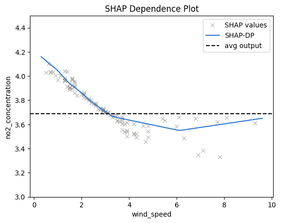
    


### Importance and one-click explanation

Beyond per-feature curves, every global effect exposes an `importance` score
(the dispersion of the *mean* effect — the μ-twin of heterogeneity), and
`effector.explain(...)` runs the whole pipeline (fit → rank → regional search)
and returns a self-contained `Report`.


```python
# per-feature importance = dispersion of the mean effect (mu-twin of heterogeneity)
pdp_imp = effector.PDP(data=X_train.to_numpy(), model=model_forward, schema={"feature_names": feature_names, "target_name": target_name}, nof_instances=2000)
print("importances:", dict(zip(feature_names, np.round(pdp_imp.importances(), 3))))

# one-click auto-explanation -> Report (serializable; self-contained HTML)
report = effector.explain(X_train.to_numpy(), model_forward, method="pdp", schema={"feature_names": feature_names, "target_name": target_name}, nof_instances=2000)
report.show()
```

    importances: {'cars_per_hour': np.float64(0.741), 'temperature_at_2m': np.float64(0.255), 'wind_speed': np.float64(0.259), 'temperature_diff_2m_25m': np.float64(0.245), 'wind_direction': np.float64(0.073), 'hour_of_day': np.float64(0.169), 'day': np.float64(0.051)}


    [effector] global effects reproduce 89.3% of the model's variance; with subregions, 95.5%
    
    PDP report — target: no2_concentration
    ============================================================
    feature                   importance     heter  #regions
    ------------------------------------------------------------
    cars_per_hour                 0.7413    0.1999         7
    wind_speed                    0.2594    0.1934         7
    temperature_at_2m             0.2547    0.1472         1
    temperature_diff_2m_25m       0.2453    0.1577         7
    hour_of_day                   0.1694    0.0940         1
    ============================================================
    global effects reproduce 89.3% of the model's variance; with subregions, 95.5%
      splitting cars_per_hour (on hour_of_day, temperature_at_2m, temperature_diff_2m_25m) recovers +2.3 pts
      splitting wind_speed (on cars_per_hour, wind_direction) recovers +4.0 pts
      splitting temperature_diff_2m_25m (on cars_per_hour, wind_direction, wind_speed) recovers +3.6 pts
    
    
    Feature 0 - Full partition tree:
    🌳 Full Tree Structure:
    ───────────────────────
    cars_per_hour 🔹 [id: 0 | heter: 0.20 | inst: 400 | w: 1.00]
        temperature_diff_2m_25m < 0.25 🔹 [id: 1 | heter: 0.18 | inst: 288 | w: 0.72]
            hour_of_day < 0.36 🔹 [id: 2 | heter: 0.16 | inst: 179 | w: 0.45]
            hour_of_day ≥ 0.36 🔹 [id: 3 | heter: 0.15 | inst: 109 | w: 0.27]
        temperature_diff_2m_25m ≥ 0.25 🔹 [id: 4 | heter: 0.13 | inst: 112 | w: 0.28]
            temperature_at_2m < 0.06 🔹 [id: 5 | heter: 0.10 | inst: 63 | w: 0.16]
            temperature_at_2m ≥ 0.06 🔹 [id: 6 | heter: 0.13 | inst: 49 | w: 0.12]
    --------------------------------------------------
    Feature 0 - Statistics per tree level:
    🌳 Tree Summary:
    ─────────────────
    Level 0🔹heter: 0.20
        Level 1🔹heter: 0.16 | 🔻0.04 (18.83%)
            Level 2🔹heter: 0.14 | 🔻0.02 (11.86%)
    
    
    
    
    Feature 2 - Full partition tree:
    🌳 Full Tree Structure:
    ───────────────────────
    wind_speed 🔹 [id: 0 | heter: 0.19 | inst: 400 | w: 1.00]
        wind_direction < -0.18 🔹 [id: 1 | heter: 0.12 | inst: 210 | w: 0.53]
            cars_per_hour < 0.52 🔹 [id: 2 | heter: 0.11 | inst: 124 | w: 0.31]
            cars_per_hour ≥ 0.52 🔹 [id: 3 | heter: 0.08 | inst: 86 | w: 0.21]
        wind_direction ≥ -0.18 🔹 [id: 4 | heter: 0.13 | inst: 190 | w: 0.47]
            cars_per_hour < -0.22 🔹 [id: 5 | heter: 0.13 | inst: 57 | w: 0.14]
            cars_per_hour ≥ -0.22 🔹 [id: 6 | heter: 0.09 | inst: 133 | w: 0.33]
    --------------------------------------------------
    Feature 2 - Statistics per tree level:
    🌳 Tree Summary:
    ─────────────────
    Level 0🔹heter: 0.19
        Level 1🔹heter: 0.12 | 🔻0.07 (36.06%)
            Level 2🔹heter: 0.10 | 🔻0.03 (20.99%)
    
    
    
    
    Feature 3 - Full partition tree:
    🌳 Full Tree Structure:
    ───────────────────────
    temperature_diff_2m_25m 🔹 [id: 0 | heter: 0.16 | inst: 400 | w: 1.00]
        cars_per_hour < 0.34 🔹 [id: 1 | heter: 0.15 | inst: 193 | w: 0.48]
            wind_speed < 0.02 🔹 [id: 2 | heter: 0.13 | inst: 113 | w: 0.28]
            wind_speed ≥ 0.02 🔹 [id: 3 | heter: 0.14 | inst: 80 | w: 0.20]
        cars_per_hour ≥ 0.34 🔹 [id: 4 | heter: 0.12 | inst: 207 | w: 0.52]
            wind_direction < 0.23 🔹 [id: 5 | heter: 0.09 | inst: 104 | w: 0.26]
            wind_direction ≥ 0.23 🔹 [id: 6 | heter: 0.11 | inst: 103 | w: 0.26]
    --------------------------------------------------
    Feature 3 - Statistics per tree level:
    🌳 Tree Summary:
    ─────────────────
    Level 0🔹heter: 0.16
        Level 1🔹heter: 0.13 | 🔻0.03 (16.24%)
            Level 2🔹heter: 0.12 | 🔻0.02 (11.72%)
    
    


### Conclusion  

All methods consistently indicate that `NO₂` concentration decreases as `wind speed` increases. This aligns with physical intuition: higher wind speeds help disperse pollutants more effectively.

The steepest drop occurs at low to moderate wind speeds, where even small increases in wind can significantly improve dispersion.

At high wind speeds, the behavior varies slightly by method:

- PDP shows the decline gradually slowing.

- rHALE suggests a flattening effect—indicating a threshold beyond which additional wind has minimal extra impact.

- SHAP sometimes even shows a slight uptick at the highest wind speeds, possibly due to interactions with other features like wind direction or traffic.

## Regional Effect


```python
y_limits = (3,4.5)
```

### Regional PDP


```python
pdp_reg = effector.PDP(data=X_train.to_numpy(), model=model_forward, schema={"feature_names": feature_names, "target_name": target_name}, nof_instances=5_000)
pdp_reg.fit("all", centering=True)
part_pdp = pdp_reg.find_regions(foi, finder="best")
part_pdp.show(scale_x_list=scale_x_list)
```

    
    
    Feature 2 - Full partition tree:
    🌳 Full Tree Structure:
    ───────────────────────
    wind_speed 🔹 [id: 0 | heter: 0.19 | inst: 400 | w: 1.00]
        wind_direction < 127.60 🔹 [id: 1 | heter: 0.12 | inst: 210 | w: 0.53]
            cars_per_hour < 7.54 🔹 [id: 2 | heter: 0.11 | inst: 124 | w: 0.31]
            cars_per_hour ≥ 7.54 🔹 [id: 3 | heter: 0.08 | inst: 86 | w: 0.21]
        wind_direction ≥ 127.60 🔹 [id: 4 | heter: 0.13 | inst: 190 | w: 0.47]
            cars_per_hour < 6.74 🔹 [id: 5 | heter: 0.13 | inst: 57 | w: 0.14]
            cars_per_hour ≥ 6.74 🔹 [id: 6 | heter: 0.09 | inst: 133 | w: 0.33]
    --------------------------------------------------
    Feature 2 - Statistics per tree level:
    🌳 Tree Summary:
    ─────────────────
    Level 0🔹heter: 0.19
        Level 1🔹heter: 0.12 | 🔻0.07 (36.06%)
            Level 2🔹heter: 0.10 | 🔻0.03 (20.99%)
    
    


```python
# plot the level-1 subregions (region ids depend on the fitted tree)
for r in part_pdp:
    if r.level == 1:
        part_pdp.plot(r.idx, centering=True, scale_x_list=scale_x_list, scale_y=scale_y, y_limits=y_limits)
```


    
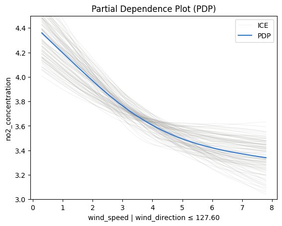
    


    
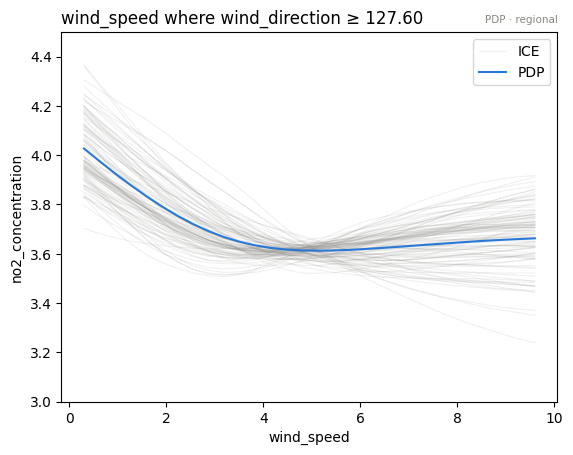
    


```python
for r in part_pdp:
    if r.level == 2:
        part_pdp.plot(r.idx, centering=True, scale_x_list=scale_x_list, scale_y=scale_y, y_limits=y_limits)
```


    
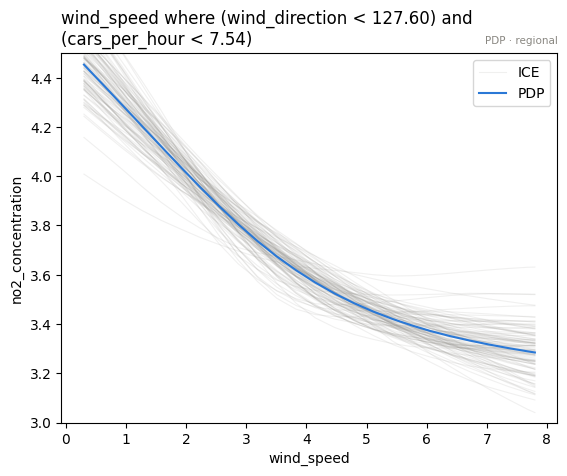
    


    
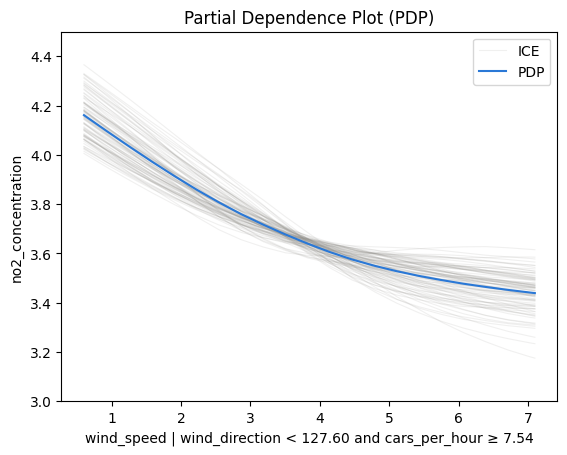
    


    
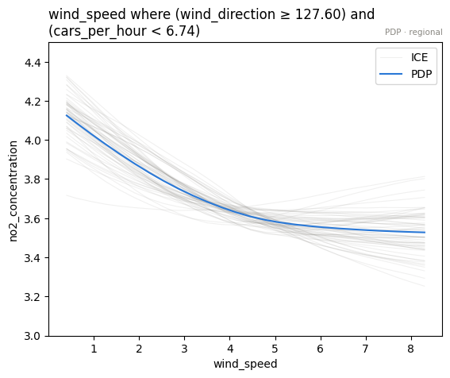
    


    
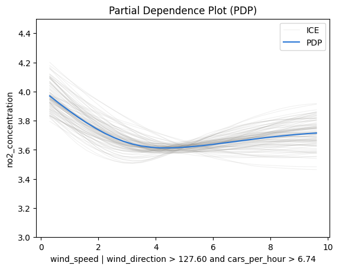
    


### Regional RHALE


```python
rhale_reg = effector.RHALE(data=X_train.to_numpy(), model=model_forward, model_jac=model_jac, schema={"feature_names": feature_names, "target_name": target_name})
rhale_reg.fit("all", centering=True)
part_rhale = rhale_reg.find_regions(foi, finder="best")
part_rhale.show(scale_x_list=scale_x_list)
```

    
    
    Feature 2 - Full partition tree:
    🌳 Full Tree Structure:
    ───────────────────────
    wind_speed 🔹 [id: 0 | heter: 0.15 | inst: 400 | w: 1.00]
        wind_direction < 127.60 🔹 [id: 1 | heter: 0.11 | inst: 210 | w: 0.53]
            cars_per_hour < 7.54 🔹 [id: 2 | heter: 0.09 | inst: 124 | w: 0.31]
            cars_per_hour ≥ 7.54 🔹 [id: 3 | heter: 0.07 | inst: 86 | w: 0.21]
        wind_direction ≥ 127.60 🔹 [id: 4 | heter: 0.08 | inst: 190 | w: 0.47]
            cars_per_hour < 6.94 🔹 [id: 5 | heter: 0.07 | inst: 63 | w: 0.16]
            cars_per_hour ≥ 6.94 🔹 [id: 6 | heter: 0.06 | inst: 127 | w: 0.32]
    --------------------------------------------------
    Feature 2 - Statistics per tree level:
    🌳 Tree Summary:
    ─────────────────
    Level 0🔹heter: 0.15
        Level 1🔹heter: 0.09 | 🔻0.05 (36.12%)
            Level 2🔹heter: 0.07 | 🔻0.02 (20.36%)
    
    


```python
for r in part_rhale:
    if r.level == 1:
        part_rhale.plot(r.idx, centering=True, scale_x_list=scale_x_list, scale_y=scale_y, y_limits=y_limits, dy_limits=dy_limits)
```


    
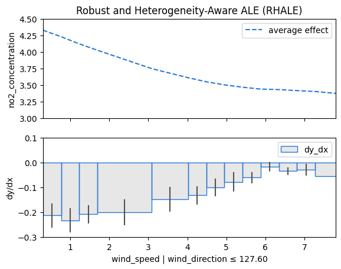
    


    
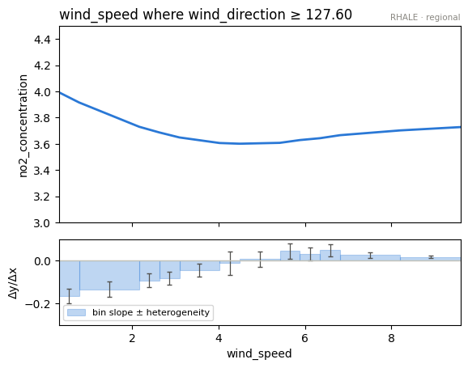
    


```python
for r in part_rhale:
    if r.level == 2:
        part_rhale.plot(r.idx, centering=True, scale_x_list=scale_x_list, scale_y=scale_y, y_limits=y_limits, dy_limits=dy_limits)
```


    
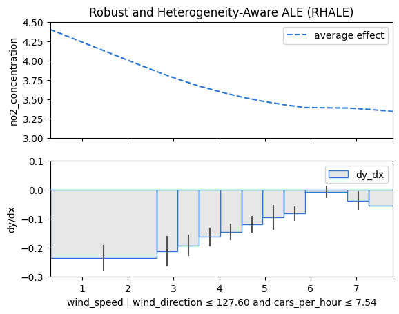
    


    
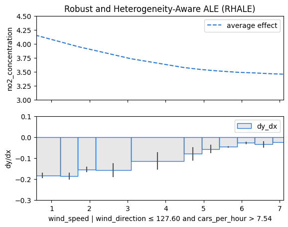
    


    
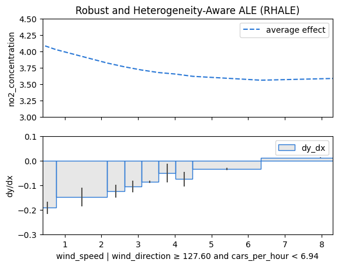
    


    
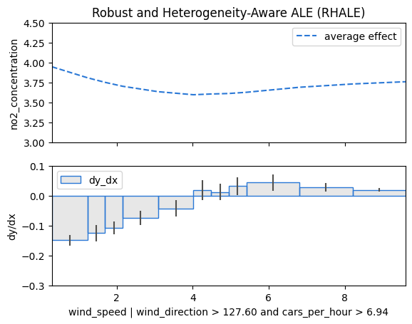
    


### Regional SHAP-DP


```python
shap_dp_reg = effector.ShapDP(data=X_train.to_numpy(), model=model_forward, schema={"feature_names": feature_names, "target_name": target_name}, nof_instances=500)
shap_dp_reg.fit("all", centering=True)
part_shap = shap_dp_reg.find_regions(foi, finder="best")
part_shap.show(scale_x_list=scale_x_list)
```

    
ExactExplainer explainer:  22%|██▏       | 89/400 [00:00<?, ?it/s]

    
ExactExplainer explainer:  23%|██▎       | 91/400 [00:10<00:17, 17.18it/s]

    
ExactExplainer explainer:  23%|██▎       | 93/400 [00:10<00:29, 10.52it/s]

    
ExactExplainer explainer:  24%|██▍       | 95/400 [00:10<00:32,  9.42it/s]

    
ExactExplainer explainer:  24%|██▍       | 97/400 [00:10<00:34,  8.87it/s]

    
ExactExplainer explainer:  24%|██▍       | 98/400 [00:11<00:34,  8.67it/s]

    
ExactExplainer explainer:  25%|██▍       | 99/400 [00:11<00:35,  8.57it/s]

    
ExactExplainer explainer:  25%|██▌       | 100/400 [00:11<00:35,  8.52it/s]

    
ExactExplainer explainer:  25%|██▌       | 101/400 [00:11<00:35,  8.39it/s]

    
ExactExplainer explainer:  26%|██▌       | 102/400 [00:11<00:34,  8.51it/s]

    
ExactExplainer explainer:  26%|██▌       | 103/400 [00:11<00:35,  8.46it/s]

    
ExactExplainer explainer:  26%|██▌       | 104/400 [00:11<00:34,  8.49it/s]

    
ExactExplainer explainer:  26%|██▋       | 105/400 [00:11<00:34,  8.51it/s]

    
ExactExplainer explainer:  26%|██▋       | 106/400 [00:11<00:34,  8.51it/s]

    
ExactExplainer explainer:  27%|██▋       | 107/400 [00:12<00:34,  8.46it/s]

    
ExactExplainer explainer:  27%|██▋       | 108/400 [00:12<00:34,  8.45it/s]

    
ExactExplainer explainer:  27%|██▋       | 109/400 [00:12<00:34,  8.42it/s]

    
ExactExplainer explainer:  28%|██▊       | 110/400 [00:12<00:34,  8.43it/s]

    
ExactExplainer explainer:  28%|██▊       | 111/400 [00:12<00:34,  8.46it/s]

    
ExactExplainer explainer:  28%|██▊       | 112/400 [00:12<00:34,  8.29it/s]

    
ExactExplainer explainer:  28%|██▊       | 113/400 [00:12<00:35,  8.20it/s]

    
ExactExplainer explainer:  28%|██▊       | 114/400 [00:12<00:35,  8.08it/s]

    
ExactExplainer explainer:  29%|██▉       | 115/400 [00:13<00:34,  8.15it/s]

    
ExactExplainer explainer:  29%|██▉       | 116/400 [00:13<00:34,  8.20it/s]

    
ExactExplainer explainer:  29%|██▉       | 117/400 [00:13<00:34,  8.13it/s]

    
ExactExplainer explainer:  30%|██▉       | 118/400 [00:13<00:34,  8.21it/s]

    
ExactExplainer explainer:  30%|██▉       | 119/400 [00:13<00:34,  8.23it/s]

    
ExactExplainer explainer:  30%|███       | 120/400 [00:13<00:34,  8.02it/s]

    
ExactExplainer explainer:  30%|███       | 121/400 [00:13<00:34,  8.16it/s]

    
ExactExplainer explainer:  30%|███       | 122/400 [00:13<00:34,  8.15it/s]

    
ExactExplainer explainer:  31%|███       | 123/400 [00:14<00:34,  7.96it/s]

    
ExactExplainer explainer:  31%|███       | 124/400 [00:14<00:34,  8.10it/s]

    
ExactExplainer explainer:  31%|███▏      | 125/400 [00:14<00:33,  8.29it/s]

    
ExactExplainer explainer:  32%|███▏      | 126/400 [00:14<00:32,  8.40it/s]

    
ExactExplainer explainer:  32%|███▏      | 127/400 [00:14<00:32,  8.49it/s]

    
ExactExplainer explainer:  32%|███▏      | 128/400 [00:14<00:31,  8.50it/s]

    
ExactExplainer explainer:  32%|███▏      | 129/400 [00:14<00:31,  8.56it/s]

    
ExactExplainer explainer:  32%|███▎      | 130/400 [00:14<00:31,  8.55it/s]

    
ExactExplainer explainer:  33%|███▎      | 131/400 [00:14<00:31,  8.51it/s]

    
ExactExplainer explainer:  33%|███▎      | 132/400 [00:15<00:31,  8.51it/s]

    
ExactExplainer explainer:  33%|███▎      | 133/400 [00:15<00:31,  8.54it/s]

    
ExactExplainer explainer:  34%|███▎      | 134/400 [00:15<00:30,  8.59it/s]

    
ExactExplainer explainer:  34%|███▍      | 135/400 [00:15<00:30,  8.66it/s]

    
ExactExplainer explainer:  34%|███▍      | 136/400 [00:15<00:30,  8.65it/s]

    
ExactExplainer explainer:  34%|███▍      | 137/400 [00:15<00:30,  8.71it/s]

    
ExactExplainer explainer:  34%|███▍      | 138/400 [00:15<00:30,  8.66it/s]

    
ExactExplainer explainer:  35%|███▍      | 139/400 [00:15<00:30,  8.60it/s]

    
ExactExplainer explainer:  35%|███▌      | 140/400 [00:16<00:30,  8.67it/s]

    
ExactExplainer explainer:  35%|███▌      | 141/400 [00:16<00:30,  8.62it/s]

    
ExactExplainer explainer:  36%|███▌      | 142/400 [00:16<00:30,  8.52it/s]

    
ExactExplainer explainer:  36%|███▌      | 143/400 [00:16<00:30,  8.56it/s]

    
ExactExplainer explainer:  36%|███▌      | 144/400 [00:16<00:29,  8.67it/s]

    
ExactExplainer explainer:  36%|███▋      | 145/400 [00:16<00:29,  8.63it/s]

    
ExactExplainer explainer:  36%|███▋      | 146/400 [00:16<00:29,  8.69it/s]

    
ExactExplainer explainer:  37%|███▋      | 147/400 [00:16<00:29,  8.71it/s]

    
ExactExplainer explainer:  37%|███▋      | 148/400 [00:16<00:29,  8.63it/s]

    
ExactExplainer explainer:  37%|███▋      | 149/400 [00:17<00:29,  8.63it/s]

    
ExactExplainer explainer:  38%|███▊      | 150/400 [00:17<00:29,  8.52it/s]

    
ExactExplainer explainer:  38%|███▊      | 151/400 [00:17<00:30,  8.26it/s]

    
ExactExplainer explainer:  38%|███▊      | 152/400 [00:17<00:29,  8.35it/s]

    
ExactExplainer explainer:  38%|███▊      | 153/400 [00:17<00:29,  8.38it/s]

    
ExactExplainer explainer:  38%|███▊      | 154/400 [00:17<00:28,  8.49it/s]

    
ExactExplainer explainer:  39%|███▉      | 155/400 [00:17<00:29,  8.44it/s]

    
ExactExplainer explainer:  39%|███▉      | 156/400 [00:17<00:28,  8.49it/s]

    
ExactExplainer explainer:  39%|███▉      | 157/400 [00:18<00:28,  8.60it/s]

    
ExactExplainer explainer:  40%|███▉      | 158/400 [00:18<00:28,  8.63it/s]

    
ExactExplainer explainer:  40%|███▉      | 159/400 [00:18<00:28,  8.59it/s]

    
ExactExplainer explainer:  40%|████      | 160/400 [00:18<00:28,  8.34it/s]

    
ExactExplainer explainer:  40%|████      | 161/400 [00:18<00:28,  8.31it/s]

    
ExactExplainer explainer:  40%|████      | 162/400 [00:18<00:28,  8.30it/s]

    
ExactExplainer explainer:  41%|████      | 163/400 [00:18<00:28,  8.32it/s]

    
ExactExplainer explainer:  41%|████      | 164/400 [00:18<00:28,  8.39it/s]

    
ExactExplainer explainer:  41%|████▏     | 165/400 [00:18<00:27,  8.46it/s]

    
ExactExplainer explainer:  42%|████▏     | 166/400 [00:19<00:27,  8.55it/s]

    
ExactExplainer explainer:  42%|████▏     | 167/400 [00:19<00:28,  8.23it/s]

    
ExactExplainer explainer:  42%|████▏     | 168/400 [00:19<00:28,  8.13it/s]

    
ExactExplainer explainer:  42%|████▏     | 169/400 [00:19<00:28,  8.13it/s]

    
ExactExplainer explainer:  42%|████▎     | 170/400 [00:19<00:27,  8.27it/s]

    
ExactExplainer explainer:  43%|████▎     | 171/400 [00:19<00:27,  8.27it/s]

    
ExactExplainer explainer:  43%|████▎     | 172/400 [00:19<00:27,  8.25it/s]

    
ExactExplainer explainer:  43%|████▎     | 173/400 [00:19<00:26,  8.41it/s]

    
ExactExplainer explainer:  44%|████▎     | 174/400 [00:20<00:26,  8.49it/s]

    
ExactExplainer explainer:  44%|████▍     | 175/400 [00:20<00:26,  8.38it/s]

    
ExactExplainer explainer:  44%|████▍     | 176/400 [00:20<00:26,  8.42it/s]

    
ExactExplainer explainer:  44%|████▍     | 177/400 [00:20<00:26,  8.34it/s]

    
ExactExplainer explainer:  44%|████▍     | 178/400 [00:20<00:26,  8.27it/s]

    
ExactExplainer explainer:  45%|████▍     | 179/400 [00:20<00:26,  8.33it/s]

    
ExactExplainer explainer:  45%|████▌     | 180/400 [00:20<00:26,  8.31it/s]

    
ExactExplainer explainer:  45%|████▌     | 181/400 [00:20<00:26,  8.34it/s]

    
ExactExplainer explainer:  46%|████▌     | 182/400 [00:21<00:25,  8.40it/s]

    
ExactExplainer explainer:  46%|████▌     | 183/400 [00:21<00:25,  8.50it/s]

    
ExactExplainer explainer:  46%|████▌     | 184/400 [00:21<00:25,  8.56it/s]

    
ExactExplainer explainer:  46%|████▋     | 185/400 [00:21<00:24,  8.60it/s]

    
ExactExplainer explainer:  46%|████▋     | 186/400 [00:21<00:24,  8.64it/s]

    
ExactExplainer explainer:  47%|████▋     | 187/400 [00:21<00:24,  8.57it/s]

    
ExactExplainer explainer:  47%|████▋     | 188/400 [00:21<00:24,  8.52it/s]

    
ExactExplainer explainer:  47%|████▋     | 189/400 [00:21<00:24,  8.60it/s]

    
ExactExplainer explainer:  48%|████▊     | 190/400 [00:21<00:24,  8.59it/s]

    
ExactExplainer explainer:  48%|████▊     | 191/400 [00:22<00:24,  8.54it/s]

    
ExactExplainer explainer:  48%|████▊     | 192/400 [00:22<00:24,  8.52it/s]

    
ExactExplainer explainer:  48%|████▊     | 193/400 [00:22<00:24,  8.54it/s]

    
ExactExplainer explainer:  48%|████▊     | 194/400 [00:22<00:24,  8.36it/s]

    
ExactExplainer explainer:  49%|████▉     | 195/400 [00:22<00:24,  8.41it/s]

    
ExactExplainer explainer:  49%|████▉     | 196/400 [00:22<00:24,  8.24it/s]

    
ExactExplainer explainer:  49%|████▉     | 197/400 [00:22<00:25,  8.09it/s]

    
ExactExplainer explainer:  50%|████▉     | 198/400 [00:22<00:24,  8.26it/s]

    
ExactExplainer explainer:  50%|████▉     | 199/400 [00:23<00:24,  8.34it/s]

    
ExactExplainer explainer:  50%|█████     | 200/400 [00:23<00:23,  8.42it/s]

    
ExactExplainer explainer:  50%|█████     | 201/400 [00:23<00:23,  8.65it/s]

    
ExactExplainer explainer:  50%|█████     | 202/400 [00:23<00:23,  8.59it/s]

    
ExactExplainer explainer:  51%|█████     | 203/400 [00:23<00:22,  8.61it/s]

    
ExactExplainer explainer:  51%|█████     | 204/400 [00:23<00:22,  8.64it/s]

    
ExactExplainer explainer:  51%|█████▏    | 205/400 [00:23<00:22,  8.65it/s]

    
ExactExplainer explainer:  52%|█████▏    | 206/400 [00:23<00:22,  8.45it/s]

    
ExactExplainer explainer:  52%|█████▏    | 207/400 [00:23<00:22,  8.54it/s]

    
ExactExplainer explainer:  52%|█████▏    | 208/400 [00:24<00:22,  8.58it/s]

    
ExactExplainer explainer:  52%|█████▏    | 209/400 [00:24<00:22,  8.62it/s]

    
ExactExplainer explainer:  52%|█████▎    | 210/400 [00:24<00:21,  8.69it/s]

    
ExactExplainer explainer:  53%|█████▎    | 211/400 [00:24<00:21,  8.72it/s]

    
ExactExplainer explainer:  53%|█████▎    | 212/400 [00:24<00:21,  8.74it/s]

    
ExactExplainer explainer:  53%|█████▎    | 213/400 [00:24<00:21,  8.73it/s]

    
ExactExplainer explainer:  54%|█████▎    | 214/400 [00:24<00:21,  8.77it/s]

    
ExactExplainer explainer:  54%|█████▍    | 215/400 [00:24<00:21,  8.59it/s]

    
ExactExplainer explainer:  54%|█████▍    | 216/400 [00:25<00:21,  8.62it/s]

    
ExactExplainer explainer:  54%|█████▍    | 217/400 [00:25<00:21,  8.71it/s]

    
ExactExplainer explainer:  55%|█████▍    | 218/400 [00:25<00:20,  8.71it/s]

    
ExactExplainer explainer:  55%|█████▍    | 219/400 [00:25<00:20,  8.74it/s]

    
ExactExplainer explainer:  55%|█████▌    | 220/400 [00:25<00:20,  8.70it/s]

    
ExactExplainer explainer:  55%|█████▌    | 221/400 [00:25<00:20,  8.77it/s]

    
ExactExplainer explainer:  56%|█████▌    | 222/400 [00:25<00:20,  8.72it/s]

    
ExactExplainer explainer:  56%|█████▌    | 223/400 [00:25<00:20,  8.46it/s]

    
ExactExplainer explainer:  56%|█████▌    | 224/400 [00:25<00:21,  8.35it/s]

    
ExactExplainer explainer:  56%|█████▋    | 225/400 [00:26<00:20,  8.36it/s]

    
ExactExplainer explainer:  56%|█████▋    | 226/400 [00:26<00:20,  8.43it/s]

    
ExactExplainer explainer:  57%|█████▋    | 227/400 [00:26<00:20,  8.40it/s]

    
ExactExplainer explainer:  57%|█████▋    | 228/400 [00:26<00:20,  8.49it/s]

    
ExactExplainer explainer:  57%|█████▋    | 229/400 [00:26<00:20,  8.53it/s]

    
ExactExplainer explainer:  57%|█████▊    | 230/400 [00:26<00:19,  8.58it/s]

    
ExactExplainer explainer:  58%|█████▊    | 231/400 [00:26<00:19,  8.62it/s]

    
ExactExplainer explainer:  58%|█████▊    | 232/400 [00:26<00:19,  8.64it/s]

    
ExactExplainer explainer:  58%|█████▊    | 233/400 [00:26<00:19,  8.57it/s]

    
ExactExplainer explainer:  58%|█████▊    | 234/400 [00:27<00:19,  8.56it/s]

    
ExactExplainer explainer:  59%|█████▉    | 235/400 [00:27<00:19,  8.59it/s]

    
ExactExplainer explainer:  59%|█████▉    | 236/400 [00:27<00:18,  8.65it/s]

    
ExactExplainer explainer:  59%|█████▉    | 237/400 [00:27<00:18,  8.68it/s]

    
ExactExplainer explainer:  60%|█████▉    | 238/400 [00:27<00:18,  8.70it/s]

    
ExactExplainer explainer:  60%|█████▉    | 239/400 [00:27<00:18,  8.66it/s]

    
ExactExplainer explainer:  60%|██████    | 240/400 [00:27<00:18,  8.55it/s]

    
ExactExplainer explainer:  60%|██████    | 241/400 [00:27<00:18,  8.64it/s]

    
ExactExplainer explainer:  60%|██████    | 242/400 [00:28<00:18,  8.65it/s]

    
ExactExplainer explainer:  61%|██████    | 243/400 [00:28<00:18,  8.43it/s]

    
ExactExplainer explainer:  61%|██████    | 244/400 [00:28<00:18,  8.36it/s]

    
ExactExplainer explainer:  61%|██████▏   | 245/400 [00:28<00:18,  8.52it/s]

    
ExactExplainer explainer:  62%|██████▏   | 246/400 [00:28<00:17,  8.66it/s]

    
ExactExplainer explainer:  62%|██████▏   | 247/400 [00:28<00:17,  8.60it/s]

    
ExactExplainer explainer:  62%|██████▏   | 248/400 [00:28<00:17,  8.58it/s]

    
ExactExplainer explainer:  62%|██████▏   | 249/400 [00:28<00:17,  8.60it/s]

    
ExactExplainer explainer:  62%|██████▎   | 250/400 [00:28<00:17,  8.47it/s]

    
ExactExplainer explainer:  63%|██████▎   | 251/400 [00:29<00:17,  8.51it/s]

    
ExactExplainer explainer:  63%|██████▎   | 252/400 [00:29<00:17,  8.34it/s]

    
ExactExplainer explainer:  63%|██████▎   | 253/400 [00:29<00:17,  8.41it/s]

    
ExactExplainer explainer:  64%|██████▎   | 254/400 [00:29<00:17,  8.47it/s]

    
ExactExplainer explainer:  64%|██████▍   | 255/400 [00:29<00:17,  8.42it/s]

    
ExactExplainer explainer:  64%|██████▍   | 256/400 [00:29<00:16,  8.51it/s]

    
ExactExplainer explainer:  64%|██████▍   | 257/400 [00:29<00:16,  8.58it/s]

    
ExactExplainer explainer:  64%|██████▍   | 258/400 [00:29<00:16,  8.59it/s]

    
ExactExplainer explainer:  65%|██████▍   | 259/400 [00:30<00:16,  8.61it/s]

    
ExactExplainer explainer:  65%|██████▌   | 260/400 [00:30<00:16,  8.65it/s]

    
ExactExplainer explainer:  65%|██████▌   | 261/400 [00:30<00:16,  8.48it/s]

    
ExactExplainer explainer:  66%|██████▌   | 262/400 [00:30<00:16,  8.53it/s]

    
ExactExplainer explainer:  66%|██████▌   | 263/400 [00:30<00:15,  8.62it/s]

    
ExactExplainer explainer:  66%|██████▌   | 264/400 [00:30<00:15,  8.58it/s]

    
ExactExplainer explainer:  66%|██████▋   | 265/400 [00:30<00:15,  8.63it/s]

    
ExactExplainer explainer:  66%|██████▋   | 266/400 [00:30<00:15,  8.66it/s]

    
ExactExplainer explainer:  67%|██████▋   | 267/400 [00:30<00:15,  8.69it/s]

    
ExactExplainer explainer:  67%|██████▋   | 268/400 [00:31<00:15,  8.63it/s]

    
ExactExplainer explainer:  67%|██████▋   | 269/400 [00:31<00:14,  8.74it/s]

    
ExactExplainer explainer:  68%|██████▊   | 270/400 [00:31<00:14,  8.69it/s]

    
ExactExplainer explainer:  68%|██████▊   | 271/400 [00:31<00:15,  8.51it/s]

    
ExactExplainer explainer:  68%|██████▊   | 272/400 [00:31<00:15,  8.42it/s]

    
ExactExplainer explainer:  68%|██████▊   | 273/400 [00:31<00:15,  8.47it/s]

    
ExactExplainer explainer:  68%|██████▊   | 274/400 [00:31<00:14,  8.56it/s]

    
ExactExplainer explainer:  69%|██████▉   | 275/400 [00:31<00:14,  8.67it/s]

    
ExactExplainer explainer:  69%|██████▉   | 276/400 [00:32<00:14,  8.71it/s]

    
ExactExplainer explainer:  69%|██████▉   | 277/400 [00:32<00:14,  8.69it/s]

    
ExactExplainer explainer:  70%|██████▉   | 278/400 [00:32<00:14,  8.60it/s]

    
ExactExplainer explainer:  70%|██████▉   | 279/400 [00:32<00:14,  8.64it/s]

    
ExactExplainer explainer:  70%|███████   | 280/400 [00:32<00:14,  8.57it/s]

    
ExactExplainer explainer:  70%|███████   | 281/400 [00:32<00:13,  8.61it/s]

    
ExactExplainer explainer:  70%|███████   | 282/400 [00:32<00:13,  8.65it/s]

    
ExactExplainer explainer:  71%|███████   | 283/400 [00:32<00:13,  8.60it/s]

    
ExactExplainer explainer:  71%|███████   | 284/400 [00:32<00:13,  8.74it/s]

    
ExactExplainer explainer:  71%|███████▏  | 285/400 [00:33<00:13,  8.73it/s]

    
ExactExplainer explainer:  72%|███████▏  | 286/400 [00:33<00:13,  8.73it/s]

    
ExactExplainer explainer:  72%|███████▏  | 287/400 [00:33<00:13,  8.69it/s]

    
ExactExplainer explainer:  72%|███████▏  | 288/400 [00:33<00:12,  8.72it/s]

    
ExactExplainer explainer:  72%|███████▏  | 289/400 [00:33<00:12,  8.59it/s]

    
ExactExplainer explainer:  72%|███████▎  | 290/400 [00:33<00:12,  8.61it/s]

    
ExactExplainer explainer:  73%|███████▎  | 291/400 [00:33<00:12,  8.60it/s]

    
ExactExplainer explainer:  73%|███████▎  | 292/400 [00:33<00:12,  8.66it/s]

    
ExactExplainer explainer:  73%|███████▎  | 293/400 [00:33<00:12,  8.82it/s]

    
ExactExplainer explainer:  74%|███████▎  | 294/400 [00:34<00:11,  8.84it/s]

    
ExactExplainer explainer:  74%|███████▍  | 295/400 [00:34<00:11,  8.83it/s]

    
ExactExplainer explainer:  74%|███████▍  | 296/400 [00:34<00:12,  8.65it/s]

    
ExactExplainer explainer:  74%|███████▍  | 297/400 [00:34<00:12,  8.45it/s]

    
ExactExplainer explainer:  74%|███████▍  | 298/400 [00:34<00:12,  8.31it/s]

    
ExactExplainer explainer:  75%|███████▍  | 299/400 [00:34<00:12,  8.40it/s]

    
ExactExplainer explainer:  75%|███████▌  | 300/400 [00:34<00:11,  8.49it/s]

    
ExactExplainer explainer:  75%|███████▌  | 301/400 [00:34<00:11,  8.52it/s]

    
ExactExplainer explainer:  76%|███████▌  | 302/400 [00:35<00:11,  8.64it/s]

    
ExactExplainer explainer:  76%|███████▌  | 303/400 [00:35<00:11,  8.70it/s]

    
ExactExplainer explainer:  76%|███████▌  | 304/400 [00:35<00:11,  8.66it/s]

    
ExactExplainer explainer:  76%|███████▋  | 305/400 [00:35<00:10,  8.66it/s]

    
ExactExplainer explainer:  76%|███████▋  | 306/400 [00:35<00:10,  8.56it/s]

    
ExactExplainer explainer:  77%|███████▋  | 307/400 [00:35<00:11,  8.44it/s]

    
ExactExplainer explainer:  77%|███████▋  | 308/400 [00:35<00:10,  8.42it/s]

    
ExactExplainer explainer:  77%|███████▋  | 309/400 [00:35<00:10,  8.44it/s]

    
ExactExplainer explainer:  78%|███████▊  | 310/400 [00:35<00:10,  8.56it/s]

    
ExactExplainer explainer:  78%|███████▊  | 311/400 [00:36<00:10,  8.60it/s]

    
ExactExplainer explainer:  78%|███████▊  | 312/400 [00:36<00:10,  8.59it/s]

    
ExactExplainer explainer:  78%|███████▊  | 313/400 [00:36<00:10,  8.51it/s]

    
ExactExplainer explainer:  78%|███████▊  | 314/400 [00:36<00:10,  8.53it/s]

    
ExactExplainer explainer:  79%|███████▉  | 315/400 [00:36<00:09,  8.60it/s]

    
ExactExplainer explainer:  79%|███████▉  | 316/400 [00:36<00:09,  8.56it/s]

    
ExactExplainer explainer:  79%|███████▉  | 317/400 [00:36<00:09,  8.52it/s]

    
ExactExplainer explainer:  80%|███████▉  | 318/400 [00:36<00:09,  8.45it/s]

    
ExactExplainer explainer:  80%|███████▉  | 319/400 [00:37<00:09,  8.54it/s]

    
ExactExplainer explainer:  80%|████████  | 320/400 [00:37<00:09,  8.56it/s]

    
ExactExplainer explainer:  80%|████████  | 321/400 [00:37<00:09,  8.54it/s]

    
ExactExplainer explainer:  80%|████████  | 322/400 [00:37<00:09,  8.57it/s]

    
ExactExplainer explainer:  81%|████████  | 323/400 [00:37<00:09,  8.52it/s]

    
ExactExplainer explainer:  81%|████████  | 324/400 [00:37<00:08,  8.57it/s]

    
ExactExplainer explainer:  81%|████████▏ | 325/400 [00:37<00:08,  8.56it/s]

    
ExactExplainer explainer:  82%|████████▏ | 326/400 [00:37<00:08,  8.43it/s]

    
ExactExplainer explainer:  82%|████████▏ | 327/400 [00:37<00:08,  8.53it/s]

    
ExactExplainer explainer:  82%|████████▏ | 328/400 [00:38<00:08,  8.47it/s]

    
ExactExplainer explainer:  82%|████████▏ | 329/400 [00:38<00:08,  8.47it/s]

    
ExactExplainer explainer:  82%|████████▎ | 330/400 [00:38<00:08,  8.45it/s]

    
ExactExplainer explainer:  83%|████████▎ | 331/400 [00:38<00:08,  8.52it/s]

    
ExactExplainer explainer:  83%|████████▎ | 332/400 [00:38<00:08,  8.48it/s]

    
ExactExplainer explainer:  83%|████████▎ | 333/400 [00:38<00:07,  8.53it/s]

    
ExactExplainer explainer:  84%|████████▎ | 334/400 [00:38<00:07,  8.50it/s]

    
ExactExplainer explainer:  84%|████████▍ | 335/400 [00:38<00:07,  8.41it/s]

    
ExactExplainer explainer:  84%|████████▍ | 336/400 [00:39<00:07,  8.47it/s]

    
ExactExplainer explainer:  84%|████████▍ | 337/400 [00:39<00:07,  8.45it/s]

    
ExactExplainer explainer:  84%|████████▍ | 338/400 [00:39<00:07,  8.42it/s]

    
ExactExplainer explainer:  85%|████████▍ | 339/400 [00:39<00:07,  8.50it/s]

    
ExactExplainer explainer:  85%|████████▌ | 340/400 [00:39<00:07,  8.52it/s]

    
ExactExplainer explainer:  85%|████████▌ | 341/400 [00:39<00:06,  8.53it/s]

    
ExactExplainer explainer:  86%|████████▌ | 342/400 [00:39<00:06,  8.47it/s]

    
ExactExplainer explainer:  86%|████████▌ | 343/400 [00:39<00:06,  8.51it/s]

    
ExactExplainer explainer:  86%|████████▌ | 344/400 [00:39<00:06,  8.36it/s]

    
ExactExplainer explainer:  86%|████████▋ | 345/400 [00:40<00:06,  8.41it/s]

    
ExactExplainer explainer:  86%|████████▋ | 346/400 [00:40<00:06,  8.51it/s]

    
ExactExplainer explainer:  87%|████████▋ | 347/400 [00:40<00:06,  8.53it/s]

    
ExactExplainer explainer:  87%|████████▋ | 348/400 [00:40<00:06,  8.56it/s]

    
ExactExplainer explainer:  87%|████████▋ | 349/400 [00:40<00:05,  8.54it/s]

    
ExactExplainer explainer:  88%|████████▊ | 350/400 [00:40<00:05,  8.60it/s]

    
ExactExplainer explainer:  88%|████████▊ | 351/400 [00:40<00:05,  8.61it/s]

    
ExactExplainer explainer:  88%|████████▊ | 352/400 [00:40<00:05,  8.63it/s]

    
ExactExplainer explainer:  88%|████████▊ | 353/400 [00:41<00:05,  8.44it/s]

    
ExactExplainer explainer:  88%|████████▊ | 354/400 [00:41<00:05,  8.46it/s]

    
ExactExplainer explainer:  89%|████████▉ | 355/400 [00:41<00:05,  8.50it/s]

    
ExactExplainer explainer:  89%|████████▉ | 356/400 [00:41<00:05,  8.16it/s]

    
ExactExplainer explainer:  89%|████████▉ | 357/400 [00:41<00:05,  7.87it/s]

    
ExactExplainer explainer:  90%|████████▉ | 358/400 [00:41<00:05,  7.82it/s]

    
ExactExplainer explainer:  90%|████████▉ | 359/400 [00:41<00:05,  7.77it/s]

    
ExactExplainer explainer:  90%|█████████ | 360/400 [00:41<00:05,  7.88it/s]

    
ExactExplainer explainer:  90%|█████████ | 361/400 [00:42<00:05,  7.76it/s]

    
ExactExplainer explainer:  90%|█████████ | 362/400 [00:42<00:04,  7.70it/s]

    
ExactExplainer explainer:  91%|█████████ | 363/400 [00:42<00:04,  7.96it/s]

    
ExactExplainer explainer:  91%|█████████ | 364/400 [00:42<00:04,  8.18it/s]

    
ExactExplainer explainer:  91%|█████████▏| 365/400 [00:42<00:04,  8.28it/s]

    
ExactExplainer explainer:  92%|█████████▏| 366/400 [00:42<00:04,  8.32it/s]

    
ExactExplainer explainer:  92%|█████████▏| 367/400 [00:42<00:03,  8.27it/s]

    
ExactExplainer explainer:  92%|█████████▏| 368/400 [00:42<00:03,  8.30it/s]

    
ExactExplainer explainer:  92%|█████████▏| 369/400 [00:42<00:03,  8.30it/s]

    
ExactExplainer explainer:  92%|█████████▎| 370/400 [00:43<00:03,  8.44it/s]

    
ExactExplainer explainer:  93%|█████████▎| 371/400 [00:43<00:03,  8.27it/s]

    
ExactExplainer explainer:  93%|█████████▎| 372/400 [00:43<00:03,  8.43it/s]

    
ExactExplainer explainer:  93%|█████████▎| 373/400 [00:43<00:03,  8.52it/s]

    
ExactExplainer explainer:  94%|█████████▎| 374/400 [00:43<00:03,  8.62it/s]

    
ExactExplainer explainer:  94%|█████████▍| 375/400 [00:43<00:02,  8.38it/s]

    
ExactExplainer explainer:  94%|█████████▍| 376/400 [00:43<00:02,  8.28it/s]

    
ExactExplainer explainer:  94%|█████████▍| 377/400 [00:43<00:02,  8.31it/s]

    
ExactExplainer explainer:  94%|█████████▍| 378/400 [00:44<00:02,  8.43it/s]

    
ExactExplainer explainer:  95%|█████████▍| 379/400 [00:44<00:02,  8.55it/s]

    
ExactExplainer explainer:  95%|█████████▌| 380/400 [00:44<00:02,  8.39it/s]

    
ExactExplainer explainer:  95%|█████████▌| 381/400 [00:44<00:02,  8.40it/s]

    
ExactExplainer explainer:  96%|█████████▌| 382/400 [00:44<00:02,  8.49it/s]

    
ExactExplainer explainer:  96%|█████████▌| 383/400 [00:44<00:01,  8.57it/s]

    
ExactExplainer explainer:  96%|█████████▌| 384/400 [00:44<00:01,  8.59it/s]

    
ExactExplainer explainer:  96%|█████████▋| 385/400 [00:44<00:01,  8.61it/s]

    
ExactExplainer explainer:  96%|█████████▋| 386/400 [00:44<00:01,  8.58it/s]

    
ExactExplainer explainer:  97%|█████████▋| 387/400 [00:45<00:01,  8.67it/s]

    
ExactExplainer explainer:  97%|█████████▋| 388/400 [00:45<00:01,  8.64it/s]

    
ExactExplainer explainer:  97%|█████████▋| 389/400 [00:45<00:01,  8.53it/s]

    
ExactExplainer explainer:  98%|█████████▊| 390/400 [00:45<00:01,  8.54it/s]

    
ExactExplainer explainer:  98%|█████████▊| 391/400 [00:45<00:01,  8.61it/s]

    
ExactExplainer explainer:  98%|█████████▊| 392/400 [00:45<00:00,  8.66it/s]

    
ExactExplainer explainer:  98%|█████████▊| 393/400 [00:45<00:00,  8.71it/s]

    
ExactExplainer explainer:  98%|█████████▊| 394/400 [00:45<00:00,  8.67it/s]

    
ExactExplainer explainer:  99%|█████████▉| 395/400 [00:46<00:00,  8.75it/s]

    
ExactExplainer explainer:  99%|█████████▉| 396/400 [00:46<00:00,  8.78it/s]

    
ExactExplainer explainer:  99%|█████████▉| 397/400 [00:46<00:00,  8.75it/s]

    
ExactExplainer explainer: 100%|█████████▉| 398/400 [00:46<00:00,  8.73it/s]

    
ExactExplainer explainer: 100%|█████████▉| 399/400 [00:46<00:00,  8.63it/s]

    
ExactExplainer explainer: 100%|██████████| 400/400 [00:46<00:00,  8.62it/s]

    
ExactExplainer explainer: 401it [00:46,  8.60it/s]                         

    
ExactExplainer explainer: 401it [00:46,  6.68it/s]

    


    
    
    Feature 2 - Full partition tree:
    🌳 Full Tree Structure:
    ───────────────────────
    wind_speed 🔹 [id: 0 | heter: 0.06 | inst: 400 | w: 1.00]
        wind_direction < 145.40 🔹 [id: 1 | heter: 0.05 | inst: 213 | w: 0.53]
            cars_per_hour < 7.34 🔹 [id: 2 | heter: 0.04 | inst: 115 | w: 0.29]
            cars_per_hour ≥ 7.34 🔹 [id: 3 | heter: 0.03 | inst: 98 | w: 0.24]
        wind_direction ≥ 145.40 🔹 [id: 4 | heter: 0.04 | inst: 187 | w: 0.47]
            temperature_diff_2m_25m < -0.07 🔹 [id: 5 | heter: 0.02 | inst: 72 | w: 0.18]
            temperature_diff_2m_25m ≥ -0.07 🔹 [id: 6 | heter: 0.04 | inst: 115 | w: 0.29]
    --------------------------------------------------
    Feature 2 - Statistics per tree level:
    🌳 Tree Summary:
    ─────────────────
    Level 0🔹heter: 0.06
        Level 1🔹heter: 0.05 | 🔻0.02 (30.71%)
            Level 2🔹heter: 0.04 | 🔻0.01 (19.89%)
    
    


```python
for r in part_shap:
    if r.level == 1:
        part_shap.plot(r.idx, centering=True, scale_x_list=scale_x_list, scale_y=scale_y, y_limits=y_limits)
```


    
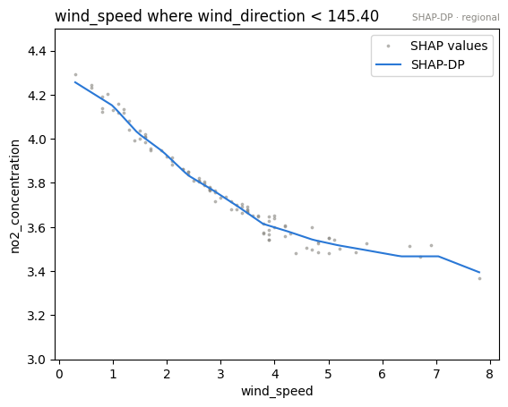
    


    
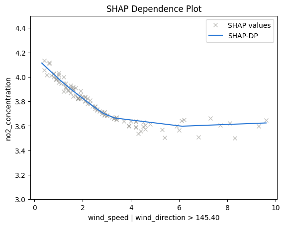
    


```python
for r in part_shap:
    if r.level == 2:
        part_shap.plot(r.idx, centering=True, scale_x_list=scale_x_list, scale_y=scale_y, y_limits=y_limits)
```


    
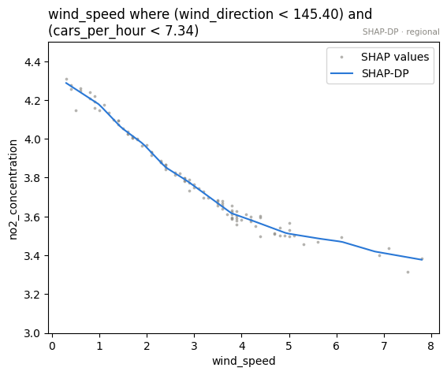
    


    
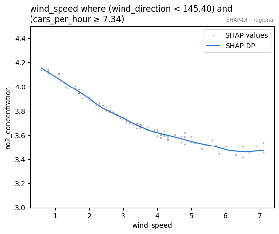
    


    
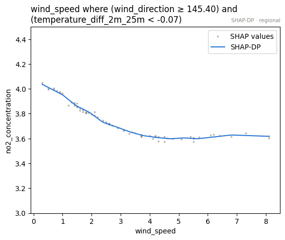
    


    
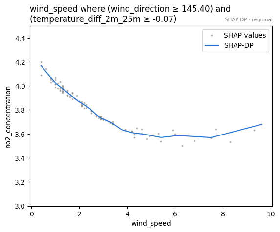
    


### Conclusion  

Regional methods reveal two distinct patterns: 

- **Low wind directions (≤ ~127–145°):**, the dispersion appears more effective
- **High wind directions (> ~127–145°):**, NO₂ remains steady or even slightly increases with stronger winds. This may be due to topographical blocking or pollutant recirculation depending on the local layout.

Diving deeper we observe that the relationship between `wind speed` and NO₂ further depends on `traffic volume`, revealing interaction effects:

- At **low wind directions:**:
  - If **cars/hour ≤ 8**, the drop in NO₂ with wind is more pronounced.
  - If **cars/hour > 8**, the drop becomes smoother, suggesting higher emissions dampen the wind’s dispersive power.
- At **high wind directions:** 
  - If **cars/hour ≤ 7**, NO₂ still decreases slightly even with higher wind.
  - If **cars/hour > 7**, the trend either flattens (SHAP-DP) or shows a slight increase (PDP, rHALE), potentially due to congestion-induced buildup or ineffective dispersal under certain wind conditions.

