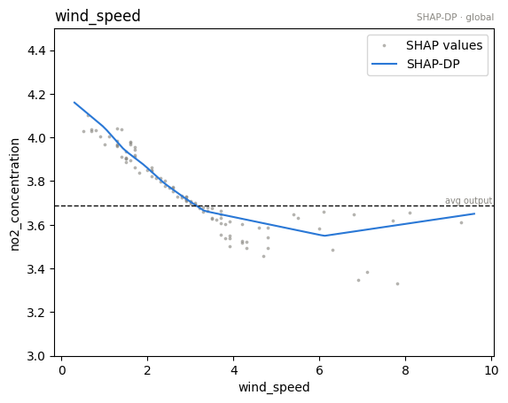

# NO2

- Author: [givasile](https://givasile.github.io/)
- Runtime: ~1.5 min
- Description: Global and regional effects (PDP, RHALE, SHAP-DP) of wind
  speed on NO₂ concentration in Oslo, explaining a neural network and
  revealing interactions with wind direction and traffic volume.
- 📄 The whole notebook in one page: [PDP report](https://xai-effector.github.io/static/reports/04_no2_pdp.html)

The [NO2](https://www.openml.org/search?type=data&sort=version&status=any&order=asc&exact_name=no2&id=547) is a subsample of 500 observations from a data set that originate in a study where air pollution at a road is related to traffic volume and meteorological variables, collected by the Norwegian Public Roads Administration. The response variable (column 1) consist of hourly values of the logarithm of the concentration of NO2 (particles), measured at Alnabru in Oslo, Norway, between October 2001 and August 2003.

The predictor variables (columns 2 to 8) are the logarithm of the number of cars per hour, temperature 2 meter above ground (degree C), wind speed (meters/second), the temperature difference between 25 and 2 meters above ground (degree C), wind direction (degrees between 0 and 360), hour of day and day number from October 1. 2001.


```python
import effector
import numpy as np
import tensorflow as tf
from tensorflow import keras
import random

np.random.seed(42)
tf.random.set_seed(42)
random.seed(42)
```

    WARNING: All log messages before absl::InitializeLog() is called are written to STDERR
    I0000 00:00:1784066952.812651   23030 cpu_feature_guard.cc:227] This TensorFlow binary is optimized to use available CPU instructions in performance-critical operations.
    To enable the following instructions: AVX2 FMA, in other operations, rebuild TensorFlow with the appropriate compiler flags.


## Preprocess the data


```python
import openml

no2 = openml.datasets.get_dataset(547)

X, y, categorical_indicator, attribute_names = no2.get_data(
    target=no2.default_target_attribute
)
```


```python
print("Design matrix shape: {}".format(X.shape))
print("---------------------------------")
for col_name in X.columns:
    print("Feature: {:15}, unique: {:4d}, Mean: {:6.2f}, Std: {:6.2f}, Min: {:6.2f}, Max: {:6.2f}".format(col_name, len(X[col_name].unique()), X[col_name].mean(), X[col_name].std(), X[col_name].min(), X[col_name].max()))
    
print("\nTarget shape: {}".format(y.shape))
print("---------------------------------")
print("Target: {:15}, unique: {:4d}, Mean: {:6.2f}, Std: {:6.2f}, Min: {:6.2f}, Max: {:6.2f}".format("no2_concentration", len(y.unique()), y.mean(), y.std(), y.min(), y.max()))
```

    Design matrix shape: (500, 7)
    ---------------------------------
    Feature: cars_per_hour  , unique:  464, Mean:   6.97, Std:   1.09, Min:   4.13, Max:   8.35
    Feature: temperature_at_2m, unique:  223, Mean:   0.85, Std:   6.52, Min: -18.60, Max:  21.10
    Feature: wind_speed     , unique:   78, Mean:   3.06, Std:   1.78, Min:   0.30, Max:   9.90
    Feature: temperature_diff_2m_25m, unique:   61, Mean:   0.15, Std:   1.07, Min:  -5.40, Max:   4.30
    Feature: wind_direction , unique:  373, Mean: 143.37, Std:  86.51, Min:   2.00, Max: 359.00
    Feature: hour_of_day    , unique:   24, Mean:  12.38, Std:   6.80, Min:   1.00, Max:  24.00
    Feature: day            , unique:  287, Mean: 310.47, Std: 200.98, Min:  32.00, Max: 608.00
    
    Target shape: (500,)
    ---------------------------------
    Target: no2_concentration, unique:  385, Mean:   3.70, Std:   0.75, Min:   1.22, Max:   6.40


```python
def preprocess(X, y):
    # Standarize X
    X_df = X
    x_mean = X_df.mean()
    x_std = X_df.std()
    X_df = (X_df - X_df.mean()) / X_df.std()

    # Standarize Y
    Y_df = y
    y_mean = Y_df.mean()
    y_std = Y_df.std()
    Y_df = (Y_df - Y_df.mean()) / Y_df.std()
    return X_df, Y_df, x_mean, x_std, y_mean, y_std

# shuffle and standarize all features
X_df, Y_df, x_mean, x_std, y_mean, y_std = preprocess(X, y)
```


```python
def split(X_df, Y_df):
    # shuffle indices
    indices = X_df.index.tolist()
    np.random.shuffle(indices)
    
    # data split
    train_size = int(0.8 * len(X_df))
    
    X_train = X_df.iloc[indices[:train_size]]
    Y_train = Y_df.iloc[indices[:train_size]]
    X_test = X_df.iloc[indices[train_size:]]
    Y_test = Y_df.iloc[indices[train_size:]]
    
    return X_train, Y_train, X_test, Y_test

# train/test split
X_train, Y_train, X_test, Y_test = split(X_df, Y_df)

```

## Fit a Neural Network

We train a deep fully-connected Neural Network with 3 hidden layers for \(10\) epochs. 
The model achieves a root mean squared error on the test of about $0.7$ units.


```python
# Train - Evaluate - Explain a neural network
model = keras.Sequential([
    keras.layers.Dense(1024, activation="relu"),
    keras.layers.Dense(512, activation="relu"),
    keras.layers.Dense(256, activation="relu"),
    keras.layers.Dense(1)
])

optimizer = keras.optimizers.Adam(learning_rate=0.001)
model.compile(optimizer=optimizer, loss="mse", metrics=["mae", keras.metrics.RootMeanSquaredError()])
model.fit(X_train, Y_train, batch_size=512, epochs=10, verbose=0)
print("train [mse, mae, rmse]:", [round(v, 3) for v in model.evaluate(X_train, Y_train, verbose=0)])
print("test  [mse, mae, rmse]:", [round(v, 3) for v in model.evaluate(X_test, Y_test, verbose=0)])
```

    train [mse, mae, rmse]: [0.336, 0.448, 0.58]
    test  [mse, mae, rmse]: [0.498, 0.562, 0.706]


## Explain

We will focus on the feature `wind_speed` (wind speed) because its global effect is quite heterogeneous and the heterogeneity can be further explained using regional effects.


```python
def model_jac(x):
    x_tensor = tf.convert_to_tensor(x, dtype=tf.float32)
    with tf.GradientTape() as t:
        t.watch(x_tensor)
        pred = model(x_tensor)
        grads = t.gradient(pred, x_tensor)
    return grads.numpy()

def model_forward(x):
    return model(x).numpy().squeeze()
```


```python
scale_y = {"mean": y_mean, "std": y_std}
scale_x_list =[{"mean": x_mean.iloc[i], "std": x_std.iloc[i]} for i in range(len(x_mean))]
feature_names = X_df.columns.to_list()
target_name = "no2_concentration"
y_limits=(2.5,5.5)
dy_limits = (-0.3,0.1)
foi = 2

# the full schema: names and the inverse scaling — reports and rules
# render in raw units automatically
schema = effector.Schema(
    feature_names=feature_names,
    scale_x_list=scale_x_list,
    scale_y=scale_y,
    target_name=target_name,
)

```

## Global Effect  

**Overview of All Features**

We start by examining all features. Feature effect methods are generally more meaningful for numerical features. To compare effects across features more easily, we standardize the `y_limits`.  


```python
pdp = effector.PDP(data=X_train.to_numpy(), model=model_forward, schema=schema, nof_instances=2000)
for i in range(len(feature_names)):
    pdp.plot(feature=i, centering=True, scale_x=scale_x_list[i], scale_y=scale_y, show_avg_output=True, nof_ice=200, y_limits=y_limits)
```


    

    


    

    


    

    


    

    


    

    


    

    


    

    


```python
y_limits = (3,4.5)
```

### PDP 


```python
pdp = effector.PDP(data=X_train.to_numpy(), model=model_forward, schema=schema, nof_instances=5000)
pdp.plot(feature=foi, centering=True, scale_x=scale_x_list[foi], scale_y=scale_y, show_avg_output=True, nof_ice=200, y_limits=y_limits)
```


    

    


### RHALE


```python
rhale = effector.RHALE(data=X_train.to_numpy(), model=model_forward, model_jac=model_jac, schema=schema)
rhale.plot(feature=foi, heterogeneity="std", centering=True, scale_x=scale_x_list[foi], scale_y=scale_y, show_avg_output=True, y_limits=y_limits, dy_limits=dy_limits)
```


    

    


```python
shap_dp = effector.ShapDP(data=X_train.to_numpy(), model=model_forward, schema=schema, nof_instances=500)
shap_dp.plot(feature=foi, centering=True, scale_x=scale_x_list[foi], scale_y=scale_y, show_avg_output=True, y_limits=y_limits)
```


    

    


### Importance and one-click explanation

Beyond per-feature curves, every global effect exposes an `importance` score
(the dispersion of the *mean* effect — the μ-twin of heterogeneity), and
`effector.explain(...)` runs the whole pipeline (fit → rank → regional search)
and returns a self-contained `Report`.


```python
# per-feature importance = dispersion of the mean effect (mu-twin of heterogeneity)
pdp_imp = effector.PDP(data=X_train.to_numpy(), model=model_forward, schema=schema, nof_instances=2000)
print("importances:", dict(zip(feature_names, np.round(pdp_imp.importances(), 3))))

# one-click auto-explanation -> Report (serializable; self-contained HTML)
report = effector.explain(X_train.to_numpy(), model_forward, y=np.asarray(Y_train).squeeze(), method="pdp", schema=schema, nof_instances=2000)
report.show()

# the whole notebook, in one page: the report published with this example
from pathlib import Path
_out = Path("reports") / "04_no2"
_out.mkdir(parents=True, exist_ok=True)
report.to_html(_out / "report_pdp.html")

```

    importances: {'cars_per_hour': np.float64(0.741), 'temperature_at_2m': np.float64(0.255), 'wind_speed': np.float64(0.259), 'temperature_diff_2m_25m': np.float64(0.245), 'wind_direction': np.float64(0.073), 'hour_of_day': np.float64(0.169), 'day': np.float64(0.051)}


    [effector] global effects   (GAM)  -> 89.3% of the model's variance
               regional effects (CALM) -> 95.5%
    
      ════════════════════════════════════════════════════════════════════════
      PDP report  ·  target: no2_concentration
      ════════════════════════════════════════════════════════════════════════
    
      DATA & MODEL
      ────────────────────────────────────────────────────────────────────────
        instances     400
        features      7  ·  7 continuous
        model output  mean 3.69 · std 0.585 · range [2.03, 4.86]
        model R²      0.656  (on this subsample)
    
      EXPLAINED VARIANCE
      ────────────────────────────────────────────────────────────────────────
        step         split on                 solo     ΔR²      R²       heter
        ──────────────────────────────────────────────────────────────────────
        GAM          (all features global)       —       —   89.3%           —
      + wind_speed   cars_per_hour, wind…    +4.0%   +4.0%   93.3% 0.19 → 0.10
      + temperature_dcars_per_hour, wind…    +3.6%   +2.2%   95.5% 0.16 → 0.12
        ──────────────────────────────────────────────────────────────────────
        FINAL                                                95.5%
    
      REJECTED SPLITS                                            min gain 1.0%
      ────────────────────────────────────────────────────────────────────────
        feature      split on                 solo     ΔR²    reason
        ──────────────────────────────────────────────────────────────────────
      ✗ cars_per_hourhour_of_day, temper…    +2.3%   -0.8%    redundant
      ✗ wind_directiocars_per_hour, temp…    +3.7%   -1.3%    redundant
    
        ✗ redundant: it would explain variance on its own (see solo),
          but the accepted splits already account for it.
    
      FEATURES                                ranked, in the selected snapshot
      ────────────────────────────────────────────────────────────────────────
        feature        importance                          heter      #regions
        ──────────────────────────────────────────────────────────────────────
        cars_per_hour      0.7413  ██████████████████     0.1999             1
        temperature_at     0.2547  ██████                 0.1472             1
        wind_speed         0.2443  ██████                 0.0977             4
        temperature_di     0.2076  █████                  0.1166             4
        ──────────────────────────────────────────────────────────────────────
        the features above carry 83% of the total importance mass
    
    
    
    Feature 2 - Full partition tree:
    🌳 Full Tree Structure:
    ───────────────────────
    wind_speed 🔹 [id: 0 | heter: 0.19 | inst: 400 | w: 1.00]
        wind_direction < 127.60 🔹 [id: 1 | heter: 0.12 | inst: 210 | w: 0.53]
            cars_per_hour < 7.54 🔹 [id: 2 | heter: 0.11 | inst: 124 | w: 0.31]
            cars_per_hour ≥ 7.54 🔹 [id: 3 | heter: 0.08 | inst: 86 | w: 0.21]
        wind_direction ≥ 127.60 🔹 [id: 4 | heter: 0.13 | inst: 190 | w: 0.47]
            cars_per_hour < 6.74 🔹 [id: 5 | heter: 0.13 | inst: 57 | w: 0.14]
            cars_per_hour ≥ 6.74 🔹 [id: 6 | heter: 0.09 | inst: 133 | w: 0.33]
    --------------------------------------------------
    Feature 2 - Statistics per tree level:
    🌳 Tree Summary:
    ─────────────────
    Level 0🔹heter: 0.19
        Level 1🔹heter: 0.12 | 🔻0.07 (36.06%)
            Level 2🔹heter: 0.10 | 🔻0.03 (20.99%)
    
    
    
    
    Feature 3 - Full partition tree:
    🌳 Full Tree Structure:
    ───────────────────────
    temperature_diff_2m_25m 🔹 [id: 0 | heter: 0.16 | inst: 400 | w: 1.00]
        cars_per_hour < 7.34 🔹 [id: 1 | heter: 0.15 | inst: 193 | w: 0.48]
            wind_speed < 3.09 🔹 [id: 2 | heter: 0.13 | inst: 113 | w: 0.28]
            wind_speed ≥ 3.09 🔹 [id: 3 | heter: 0.14 | inst: 80 | w: 0.20]
        cars_per_hour ≥ 7.34 🔹 [id: 4 | heter: 0.12 | inst: 207 | w: 0.52]
            wind_direction < 163.20 🔹 [id: 5 | heter: 0.09 | inst: 104 | w: 0.26]
            wind_direction ≥ 163.20 🔹 [id: 6 | heter: 0.11 | inst: 103 | w: 0.26]
    --------------------------------------------------
    Feature 3 - Statistics per tree level:
    🌳 Tree Summary:
    ─────────────────
    Level 0🔹heter: 0.16
        Level 1🔹heter: 0.13 | 🔻0.03 (16.24%)
            Level 2🔹heter: 0.12 | 🔻0.02 (11.72%)
    
    


    /home/givasile/github/packages/effector/effector/report.py:606: UserWarning: This figure includes Axes that are not compatible with tight_layout, so results might be incorrect.
      fig.tight_layout()


### Conclusion  

All methods consistently indicate that `NO₂` concentration decreases as `wind speed` increases. This aligns with physical intuition: higher wind speeds help disperse pollutants more effectively.

The steepest drop occurs at low to moderate wind speeds, where even small increases in wind can significantly improve dispersion.

At high wind speeds, the behavior varies slightly by method:

- PDP shows the decline gradually slowing.

- rHALE suggests a flattening effect—indicating a threshold beyond which additional wind has minimal extra impact.

- SHAP sometimes even shows a slight uptick at the highest wind speeds, possibly due to interactions with other features like wind direction or traffic.

## Regional Effect


```python
y_limits = (3,4.5)
```

### Regional PDP


```python
pdp_reg = effector.PDP(data=X_train.to_numpy(), model=model_forward, schema=schema, nof_instances=5_000)
pdp_reg.fit("all", centering=True)
part_pdp = pdp_reg.find_regions(foi, finder="best")
part_pdp.show(scale_x_list=scale_x_list)
```

    
    
    Feature 2 - Full partition tree:
    🌳 Full Tree Structure:
    ───────────────────────
    wind_speed 🔹 [id: 0 | heter: 0.19 | inst: 400 | w: 1.00]
        wind_direction < 127.60 🔹 [id: 1 | heter: 0.12 | inst: 210 | w: 0.53]
            cars_per_hour < 7.54 🔹 [id: 2 | heter: 0.11 | inst: 124 | w: 0.31]
            cars_per_hour ≥ 7.54 🔹 [id: 3 | heter: 0.08 | inst: 86 | w: 0.21]
        wind_direction ≥ 127.60 🔹 [id: 4 | heter: 0.13 | inst: 190 | w: 0.47]
            cars_per_hour < 6.74 🔹 [id: 5 | heter: 0.13 | inst: 57 | w: 0.14]
            cars_per_hour ≥ 6.74 🔹 [id: 6 | heter: 0.09 | inst: 133 | w: 0.33]
    --------------------------------------------------
    Feature 2 - Statistics per tree level:
    🌳 Tree Summary:
    ─────────────────
    Level 0🔹heter: 0.19
        Level 1🔹heter: 0.12 | 🔻0.07 (36.06%)
            Level 2🔹heter: 0.10 | 🔻0.03 (20.99%)
    
    


```python
# plot the level-1 subregions (region ids depend on the fitted tree)
for r in part_pdp:
    if r.level == 1:
        part_pdp.plot(r.idx, centering=True, scale_x_list=scale_x_list, scale_y=scale_y, y_limits=y_limits)
```


    

    


    

    


```python
for r in part_pdp:
    if r.level == 2:
        part_pdp.plot(r.idx, centering=True, scale_x_list=scale_x_list, scale_y=scale_y, y_limits=y_limits)
```


    

    


    

    


    

    


    

    


### Regional RHALE


```python
rhale_reg = effector.RHALE(data=X_train.to_numpy(), model=model_forward, model_jac=model_jac, schema=schema)
rhale_reg.fit("all", centering=True)
part_rhale = rhale_reg.find_regions(foi, finder="best")
part_rhale.show(scale_x_list=scale_x_list)
```

    
    
    Feature 2 - Full partition tree:
    🌳 Full Tree Structure:
    ───────────────────────
    wind_speed 🔹 [id: 0 | heter: 0.15 | inst: 400 | w: 1.00]
        wind_direction < 127.60 🔹 [id: 1 | heter: 0.11 | inst: 210 | w: 0.53]
            cars_per_hour < 7.54 🔹 [id: 2 | heter: 0.09 | inst: 124 | w: 0.31]
            cars_per_hour ≥ 7.54 🔹 [id: 3 | heter: 0.07 | inst: 86 | w: 0.21]
        wind_direction ≥ 127.60 🔹 [id: 4 | heter: 0.08 | inst: 190 | w: 0.47]
            cars_per_hour < 6.94 🔹 [id: 5 | heter: 0.07 | inst: 63 | w: 0.16]
            cars_per_hour ≥ 6.94 🔹 [id: 6 | heter: 0.06 | inst: 127 | w: 0.32]
    --------------------------------------------------
    Feature 2 - Statistics per tree level:
    🌳 Tree Summary:
    ─────────────────
    Level 0🔹heter: 0.15
        Level 1🔹heter: 0.09 | 🔻0.05 (36.12%)
            Level 2🔹heter: 0.07 | 🔻0.02 (20.36%)
    
    


```python
for r in part_rhale:
    if r.level == 1:
        part_rhale.plot(r.idx, centering=True, scale_x_list=scale_x_list, scale_y=scale_y, y_limits=y_limits, dy_limits=dy_limits)
```


    

    


    

    


```python
for r in part_rhale:
    if r.level == 2:
        part_rhale.plot(r.idx, centering=True, scale_x_list=scale_x_list, scale_y=scale_y, y_limits=y_limits, dy_limits=dy_limits)
```


    

    


    

    


    

    


    

    


### Regional SHAP-DP


```python
shap_dp_reg = effector.ShapDP(data=X_train.to_numpy(), model=model_forward, schema=schema, nof_instances=500)
shap_dp_reg.fit("all", centering=True)
part_shap = shap_dp_reg.find_regions(foi, finder="best")
part_shap.show(scale_x_list=scale_x_list)
```

    
    
    Feature 2 - Full partition tree:
    🌳 Full Tree Structure:
    ───────────────────────
    wind_speed 🔹 [id: 0 | heter: 0.06 | inst: 400 | w: 1.00]
        wind_direction < 145.40 🔹 [id: 1 | heter: 0.05 | inst: 213 | w: 0.53]
            cars_per_hour < 7.34 🔹 [id: 2 | heter: 0.04 | inst: 115 | w: 0.29]
            cars_per_hour ≥ 7.34 🔹 [id: 3 | heter: 0.03 | inst: 98 | w: 0.24]
        wind_direction ≥ 145.40 🔹 [id: 4 | heter: 0.04 | inst: 187 | w: 0.47]
            temperature_diff_2m_25m < -0.07 🔹 [id: 5 | heter: 0.02 | inst: 72 | w: 0.18]
            temperature_diff_2m_25m ≥ -0.07 🔹 [id: 6 | heter: 0.04 | inst: 115 | w: 0.29]
    --------------------------------------------------
    Feature 2 - Statistics per tree level:
    🌳 Tree Summary:
    ─────────────────
    Level 0🔹heter: 0.06
        Level 1🔹heter: 0.05 | 🔻0.02 (30.71%)
            Level 2🔹heter: 0.04 | 🔻0.01 (19.89%)
    
    


```python
for r in part_shap:
    if r.level == 1:
        part_shap.plot(r.idx, centering=True, scale_x_list=scale_x_list, scale_y=scale_y, y_limits=y_limits)
```


    

    


    

    


```python
for r in part_shap:
    if r.level == 2:
        part_shap.plot(r.idx, centering=True, scale_x_list=scale_x_list, scale_y=scale_y, y_limits=y_limits)
```


    

    


    

    


    

    


    

    


### Conclusion  

Regional methods reveal two distinct patterns: 

- **Low wind directions (≤ ~127–145°):**, the dispersion appears more effective
- **High wind directions (> ~127–145°):**, NO₂ remains steady or even slightly increases with stronger winds. This may be due to topographical blocking or pollutant recirculation depending on the local layout.

Diving deeper we observe that the relationship between `wind speed` and NO₂ further depends on `traffic volume`, revealing interaction effects:

- At **low wind directions:**:
  - If **cars/hour ≤ 8**, the drop in NO₂ with wind is more pronounced.
  - If **cars/hour > 8**, the drop becomes smoother, suggesting higher emissions dampen the wind’s dispersive power.
- At **high wind directions:** 
  - If **cars/hour ≤ 7**, NO₂ still decreases slightly even with higher wind.
  - If **cars/hour > 7**, the trend either flattens (SHAP-DP) or shows a slight increase (PDP, rHALE), potentially due to congestion-induced buildup or ineffective dispersal under certain wind conditions.


## Cross-method sanity check

The one-liner `effector.explain` with every engine this notebook's model
supports. Everything must run end to end; the closing table puts the reads
side by side. Where methods disagree — ranking, accepted splits, R² — that is
a property of the data/model worth a closer look, not an error.


```python
from pathlib import Path
_out = Path("reports") / "04_no2"
_out.mkdir(parents=True, exist_ok=True)

# === cross-method sweep: effector.explain on every applicable engine ======
sweep_reports = {}
for _m in ["pdp", "derpdp", "ale", "rhale", "shapdp"]:
    _kw = {"nof_instances": 300} if _m == "shapdp" else {}
    print(f"--- {_m} " + "-" * 50)
    sweep_reports[_m] = effector.explain(
        X_train.to_numpy(), model_forward, model_jac,
        y=np.asarray(Y_train).squeeze(), method=_m, schema=schema, **_kw
    )
    if _m != "pdp":  # the published report is the narrated one above
        sweep_reports[_m].to_html(_out / f"report_{_m}.html")

print()
print(f"{'method':<8} {'ranking (plotted)':<44} {'GAM R2':>8} {'final R2':>9}  splits")
for _m, _r in sweep_reports.items():
    _rank = " > ".join(fr.name for fr in _r.features)
    _ev = _r.explained_variance
    if _ev:
        _sp = "; ".join(f"{s['name']} on {s['on']}" for s in _ev["stages"]) or "none"
        print(f"{_m:<8} {_rank:<44} {_ev['gam_r2']:>7.1%} {_ev['regional_r2']:>8.1%}  {_sp}")
    else:
        print(f"{_m:<8} {_rank:<44} {'-':>7} {'-':>8}  (derivative scale: no variance ledger)")

print(f"\nreports stored in {_out}/")

```

    --- pdp --------------------------------------------------


    [effector] global effects   (GAM)  -> 89.3% of the model's variance
               regional effects (CALM) -> 95.5%
    --- derpdp --------------------------------------------------


    /home/givasile/github/packages/effector/effector/report.py:606: UserWarning: This figure includes Axes that are not compatible with tight_layout, so results might be incorrect.
      fig.tight_layout()


    --- ale --------------------------------------------------


    [effector] global effects   (GAM)  -> 87.6% of the model's variance
               regional effects (CALM) -> 95.5%


    /home/givasile/github/packages/effector/effector/report.py:606: UserWarning: This figure includes Axes that are not compatible with tight_layout, so results might be incorrect.
      fig.tight_layout()


    --- rhale --------------------------------------------------


    [effector] global effects   (GAM)  -> 86.9% of the model's variance
               regional effects (CALM) -> 95.5%


    /home/givasile/github/packages/effector/effector/report.py:606: UserWarning: This figure includes Axes that are not compatible with tight_layout, so results might be incorrect.
      fig.tight_layout()


    --- shapdp --------------------------------------------------


    [effector] global effects   (GAM)  -> 90.2% of the model's variance
               regional effects (CALM) -> 95.3%


    /home/givasile/github/packages/effector/effector/report.py:606: UserWarning: This figure includes Axes that are not compatible with tight_layout, so results might be incorrect.
      fig.tight_layout()


    
    method   ranking (plotted)                              GAM R2  final R2  splits
    pdp      cars_per_hour > temperature_at_2m > wind_speed > temperature_diff_2m_25m   89.3%    95.5%  wind_speed on cars_per_hour, wind_direction; temperature_diff_2m_25m on cars_per_hour, wind_direction, wind_speed
    derpdp   cars_per_hour > wind_speed > temperature_diff_2m_25m > temperature_at_2m       -        -  (derivative scale: no variance ledger)
    ale      cars_per_hour > temperature_at_2m > temperature_diff_2m_25m > wind_speed   87.6%    95.5%  wind_speed on cars_per_hour, wind_direction; temperature_at_2m on day, hour_of_day
    rhale    cars_per_hour > temperature_at_2m > wind_speed > temperature_diff_2m_25m   86.9%    95.5%  wind_speed on cars_per_hour, wind_direction; temperature_at_2m on day, hour_of_day
    shapdp   cars_per_hour > temperature_at_2m > wind_speed > temperature_diff_2m_25m   90.2%    95.3%  wind_speed on cars_per_hour, temperature_diff_2m_25m, wind_direction; cars_per_hour on temperature_at_2m, temperature_diff_2m_25m
    
    reports stored in reports/04_no2/

