# Global Effect - An in-depth tutorial

- Author: [givasile](https://givasile.github.io/)
- Runtime: ~10 s
- Description: An in-depth comparison of the global effect methods (ALE,
  RHALE, PDP-ICE, d-PDP-ICE, SHAP-DP) on a synthetic example with correlated
  features and known closed-form effects, showing why ALE-based methods are
  preferable under correlation and how RHALE's automatic binning helps.

In this tutorial, we use the synthetic example from [(Gkolemis et al., 2023)](https://arxiv.org/abs/2309.11193) and apply various global effect methods (ALE, RHALE, PDP-ICE, d-PDP-ICE, and SHAP Dependence Plots) to reproduce its results.  

This example serves two main purposes:  
- **Demonstrate that ALE and RHALE are preferable when input features are correlated.**  
- **Show that RHALE improves ALE by automatically adjusting bin splitting for greater robustness.**  


```python
import numpy as np
import effector
import matplotlib.pyplot as plt
```

## Problem setup

We will generate $N=170$ examples with $D=3$ features. The setup — data
distribution, black-box function and all closed-form effects — lives in
`effector.benchmarks.CorrelatedInteraction`: the SAME object the test suite
asserts against (`tests/test_functional_correlated_features.py`), so this
notebook and the tests can never disagree about the right answer.

The features:

- $x_1$: mixture-uniform on $[-0.5, 0.5]$ with $5/6$ of the mass below zero,
- $x_2 \sim \mathcal{N}(0, \sigma_2^2), \; \sigma_2 = 2$,
- $x_3 = x_1 + \epsilon, \; \epsilon \sim \mathcal{N}(0, \sigma_3^2), \; \sigma_3 = 0.01$ —
  **strongly correlated** with $x_1$; this correlation is what makes the
  methods provably differ.


```python
bench = effector.benchmarks.CorrelatedInteraction()
axis_limits = bench.axis_limits
sigma_2 = bench.sigma_2

x = bench.generate_data(170, seed=21)
```

The _black-box_ function is:

$$
f(x) = \sin(2\pi x_1) (\mathbb{1}_{x_1<0} - 2 \mathbb{1}_{x_3<0}) + x_1 x_2 + x_2
$$

For estimating RHALE we also need the jacobian of $f$:

$$
\frac{\partial f}{\partial x} = \begin{bmatrix} \frac{\partial f}{\partial x_1} \\ \frac{\partial f}{\partial x_2} \\ \frac{\partial f}{\partial x_3} \end{bmatrix} = \begin{bmatrix} 2\pi x_1 \cos(2\pi x_1) (\mathbb{1}_{x_1<0} - 2 \mathbb{1}_{x_3<0}) + x_2 \\ x_1 + 1 \\ 0 \end{bmatrix}
$$


```python
# f(x) = sin(2*pi*x1) * (1{x1<0} - 2 * 1{x3<0}) + x1*x2 + x2
f = bench.predict
```


```python
# df/dx1 = 2*pi*cos(2*pi*x1) * (1{x1<0} - 2 * 1{x3<0}) + x2
# df/dx2 = x1 + 1
# df/dx3 = 0
dfdx = bench.jacobian
```

## ALE-based methods

### ALE Definition

ALE defines the feature effect as:

$$\text{ALE}(x_s) = \int_{z=0}^{x_s} \mathbb{E}_{x_c|x_s=z}\left [ \frac{\partial f}{\partial x_s} (z, x_c) \right ] \partial z $$

where $x_s$ is the feature of interest and $x_c$ are the other features. In our case, $x_1$ is the feature of interest and $x_2, x_3$ are the other features.
In the example, given that $x_3 \approx x_1$, it holds that:
 
$$
\mathbb{E}_{x_2, x_3|x_1=z} \left [ \frac{\partial f}{\partial x_1} (z, x_2, x_3) \right ] \approx - 2 \pi z \cos(2 \pi z) \mathbb{1}_{z<0}$, 
$$

and therefore the ALE and RHALE effect is defined as:

$$\text{ALE}(x_1) = \int_{z=0}^{x_1} \mathbb{E}_{x_2, x_3|x_1=z} \left [ \frac{\partial f}{\partial x_1} (z, x_2, x_3) \right ] \partial z
\approx - \sin(2\pi x_1) \mathbb{1}_{x_1<0} + c$$


```python
ale_gt = bench.ale_gt
```


```python
plt.figure()
plt.ylim(-2, 2)
xx = np.linspace(-0.5, 0.5, 100)
plt.plot(xx, ale_gt(xx), "--", label="ALE effect")
plt.title("ALE and RHALE definition")
plt.xlabel("$x_1$")
plt.ylabel("$y$")
plt.legend()
plt.show()
```


    
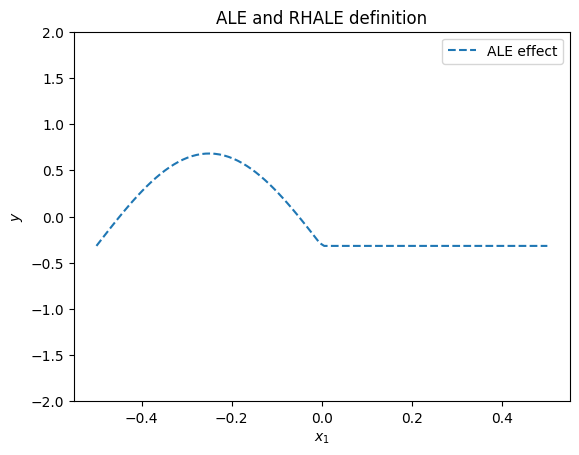
    


### RHALE definition

RHALE extends ALE definition, adding an heterogeneity term. For visualizing the heterogeneity, RHALE proposes two plots one below the other. The top plot is the RHALE effect which is identical to the ALE effect. The bottom plot is the derivative of the ALE effect and the heterogeneity is the standard deviation of the derivative effect.

RHALE quantifies the heterogeneity as the standard deviation of the derivative of the model with respect to the feature of interest:

$$
\sigma(z) = \sigma_{x_c|x_s=z} \left [ \frac{\partial f}{\partial x_s} (z, x_c) \right ]
$$

The heterogeneity is visualized on top of the ALE effect in two ways. First, as a shaded $\pm$ area around the ALE plot where the area is given by $\pm \sigma(x_s)*x_s$ (aggregated standard deviation). Second, as a shaded area around the derivative of the ALE plot which is defined as $\pm \sigma(x_s)$. In our example, the heterogeneity is:

$$
\sigma(x_1) = \sigma_{x_2, x_3|x_1=z} \left [ \frac{\partial f}{\partial x_1} (z, x_2, x_3) \right ] = \sigma_2
$$

The heterogeneity informs that the instance-level effects are deviating from the average effect by $\pm \sigma_2$.


```python
rhale_gt = bench.rhale_gt              # mean effect (identical to ALE)
rhale_heter_gt = bench.rhale_heter_gt  # effect-space heterogeneity band


def rhale_gt_derivative_effect(x):
    # derivative-space view, used only for the illustration below
    dydx = np.zeros_like(x)
    ind = x < 0
    dydx[ind] = -2 * np.pi * np.cos(2 * np.pi * x[ind])
    return dydx, sigma_2
```


```python
plt.figure()
plt.ylim(-2, 2)
xx = np.linspace(-.5, .5, 100)
plt.plot(xx, rhale_gt(xx), "b--", label="average effect")
plt.fill_between(xx, rhale_gt(xx) - rhale_heter_gt(xx), rhale_gt(xx) + rhale_heter_gt(xx),
                 alpha=0.2, color="red", label="$\pm$ heterogeneity")
plt.title("RHALE and ALE: ground truth main effect")
plt.xlabel("$x_1$")
plt.ylabel("y")
plt.legend()
plt.show()
```


    
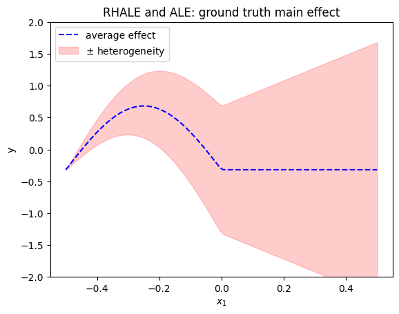
    


```python
plt.figure()
xx = np.linspace(-0.5, 0.5, 100)
plt.plot(xx, rhale_gt_derivative_effect(xx)[0], "b--", label="derivative effect")
plt.fill_between(xx, rhale_gt_derivative_effect(xx)[0] - rhale_gt_derivative_effect(xx)[1], rhale_gt_derivative_effect(xx)[0] + rhale_gt_derivative_effect(xx)[1], alpha=0.2, label="$\pm$ heterogeneity", color="red")
plt.title("RHALE: ground truth derivative effect")
plt.xlabel("$x_1$")
plt.ylabel("$y$")
plt.legend()
plt.show()
```


    
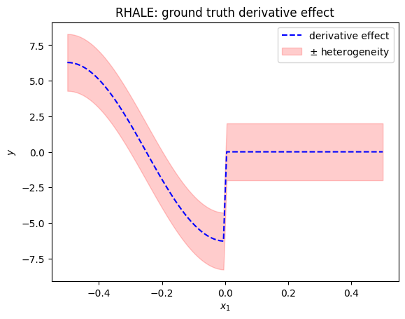
    


### ALE approximation

Bin splitting is a major limitation of ALE. The user has to choose the number of bins, where different number of bins can lead to very different results. In terms of the main ALE effect, a wrong bin-splitting may lead to unstable results. In terms of the heterogeneity, a wrong bin-splitting may lead to a biased estimation of the heterogeneity. More information can be found at the [RHALE paper](https://arxiv.org/abs/2309.11193).

In our example, if setting a low number of bins (wide bins), e.g., 5, we get the following approximation:


```python
feat = 0
xx = np.linspace(-.5, .5, 100)

# ale 5 bins
nof_bins = 5
# dale = effector.RHALE(data=x, model=f, model_jac=dfdx, axis_limits=axis_limits)
ale = effector.ALE(data=x, model=f, axis_limits=axis_limits)
binning = effector.axis_partitioning.Fixed(nof_bins=nof_bins, min_points_per_bin=0)
ale.fit([feat], binning_method=binning)
ale.plot(feature=feat, heterogeneity=True, centering=True)

```


    
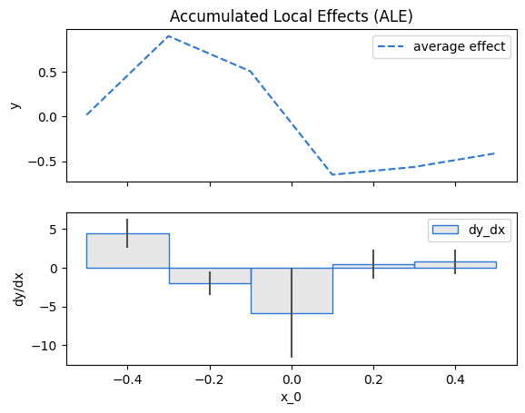
    


The approximation with wide bins has two drawbacks:

* the average ale effect is of low resolution; for example the change in the effect at $x_1=0$ is not captured
* the heterogeneity is biased; for example, the central bin show heterogeneity of $\sigma \approx 4$, where the ground-truth heterogeneity is $\approx 2$.

Let's see what happens with a high number of bins (narrow bins), e.g., 50:


```python
# ale 50 bins
nof_bins = 50
# dale = effector.RHALE(data=x, model=f, model_jac=dfdx, axis_limits=axis_limits)
ale = effector.ALE(data=x, model=f, axis_limits=axis_limits)
binning = effector.axis_partitioning.Fixed(nof_bins=nof_bins, min_points_per_bin=0)
ale.fit([feat], binning_method=binning)
ale.plot(feature=feat, heterogeneity="std", centering=True)
```


    
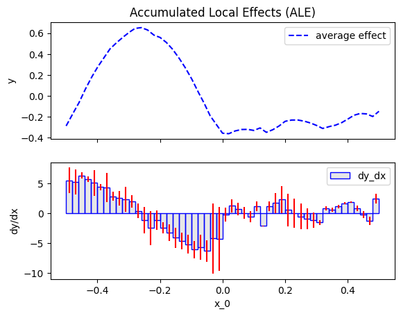
    


The approximation with narrow bins has two drawbacks:

- the average ale effect is noisy; for example, the effect at $x_1>0$ in not zero.
- the heterogeneity is even more noisy. It has many spikes that are not present in the ground-truth heterogeneity.

In real-world problems, the user has to choose the number of bins without any guidance. This is a major drawback of ALE, because the user does not know which approximation to trust, the one with wide bins or the one with narrow bins. 


### RHALE approximation

RHALE proposes an automatic bin-splitting approach to resolve the issue. Let's first see it practice:


```python
# rhale
feat = 0
rhale = effector.RHALE(data=x, model=f, model_jac=dfdx, axis_limits=axis_limits)
binning = effector.axis_partitioning.DynamicProgramming(max_nof_bins=30, min_points_per_bin=10, discount=0.2)
rhale.fit([feat], binning_method=binning, centering=True)
rhale.plot(feature=feat, heterogeneity="std")
```


    
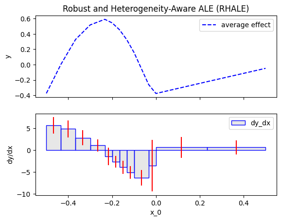
    


The approximation is much better, both in terms of the average effect and the heterogeneity. For example, the heterogeneity is almost constant around $2$ and the spikes are gone.
This happens due to the automatic bin-splitting, which creates bins of different sizes. In the beginning, area $[-0.5, 0]$, the bins are smaller for a good trade-off between bias and variance. In the end, area $[0, 0.5]$, a single bin is created to limit the variance without adding bias.

### More about the automatic bin-splitting

So, how is the automatic bin-splitting working? 
Before we delve into the details, intutivelly, a wide bin does not (a) sacrifice resolution of the ALE plot and (b) does not introduce bias in the heterogeneity, only in case the effect is linear inside the bin (or the derivative-effect is constant). In our example, this happens in the area, $[0, 0.5]$. Intuitively, bin splitting algorithms search for such areas (to create a single bin there) and in all other cases they try to minimize the bias-variance trade-off.

In `Effector`, there are two automatic bin-splitting methods:

- `Greedy`: the user has to choose the maximum number of bins and the minimum number of samples per bin
- `DynamicProgramming`: the user has to choose the maximum number of bins and the minimum number of samples per bin

#### Greedy approach

`Greedy` has three parameters; `init_nof_bins`, `min_points_per_bin` and `discount`. `max_nof_bins` is the initial (and maximum) number of bins. The algorithm then tries to merge bins in a greedy way, i.e., it moves along the axis (from left to right) and if merging with the next bin leads to a similar variance then it merges the bins. In fact, discount expresses to what extent the algorithm favors the creation of wider bins. The higher the discount the more the algorithm tries to minimize the variance, sacrificing some bias and vice versa. `min_points_per_bin` is the minimum number of samples each bin should have. 


```python
# Greedy
feat = 0
rhale = effector.RHALE(data=x, model=f, model_jac=dfdx, axis_limits=axis_limits)
binning = effector.axis_partitioning.Greedy(init_nof_bins=100, min_points_per_bin=10, discount=0.2)
rhale.fit([feat], binning_method=binning)
rhale.plot(feature=feat, heterogeneity="std", show_avg_output=False)
```


    
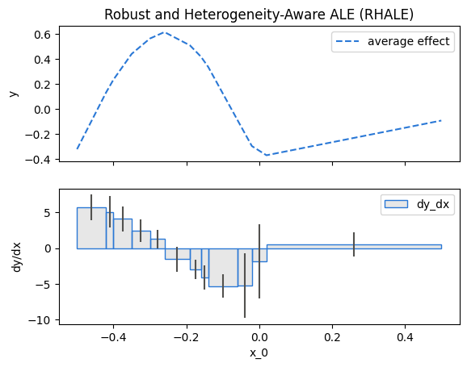
    


#### Dynamic Programming approach

`DynamicProgramming` has three parameters; `max_nof_bins`, `min_points_per_bin` and `discount`. `max_nof_bins` is the maximum number of bins. The algorithm then tries to find the optimal binning, i.e., the binning that minimizes the bias-variance trade-off. `min_points_per_bin` is the minimum number of samples each bin should have. `discount` is the discount factor of the algorithm. The higher the discount the more the algorithm tries to minimize the variance, sacrificing some bias and vice versa. For more details, we refer the reader to the [RHALE paper](https://arxiv.org/abs/2309.11193).


```python
# DynamicProgramming
feat = 0
rhale = effector.RHALE(data=x, model=f, model_jac=dfdx, axis_limits=axis_limits)
binning = effector.axis_partitioning.DynamicProgramming(max_nof_bins=20, min_points_per_bin=10, discount=0.2)
rhale.fit([feat], binning_method=binning)
rhale.plot(feature=feat, heterogeneity="std", show_avg_output=False)
```


    
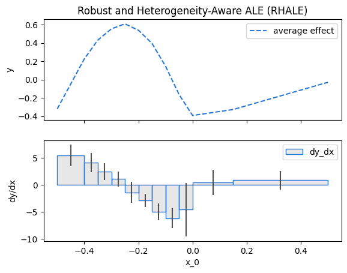
    


## PDP family of methods

We have invested a significant amount of time in exploring ALE and RHALE, attempting to achieve the most accurate approximation of the ALE definition. Is it worthwhile? For instance, PDP-ICE is a widely used method for both average effect and heterogeneity. So, why not opt for PDP-ICE instead of delving into these sophisticated ALE approximations?

In short, yes, especially in scenarios where the features exhibit correlation. Both PDP and ICE operate under the implicit assumption of feature independence. In cases where this assumption is substantially violated, relying on PDP and ICE may result in erroneous conclusions, stemming from extrapolation into unobserved regions.

In our example, it is evident that $x_3$ is highly dependent on $x_1$. Therefore, let's examine the implications of employing PDP-ICE.


### PDP and ICE definition

The PDP is defined as **_the average prediction over the entire dataset when setting the feature of interest at a specific value._**:

$$ \text{PDP}(x_s) = \mathbb{E}_{x_c}[f(x_s, x_c)] $$ 

The ICE plots show the ouput of instance $i$ if changing the feature of interest $x_s$:

$$\text{ICE}^{(i)}(x_s, x^{(i)}_c) = f(x_s, x^{(i)}_c)$$

ICE plots are plotted of the PDP.

In our example, the PDP and ICE plots are:

$$\text{PDP}(x_1) = \mathbb{E}_{x_2, x_3}[f(x_1, x_2, x_3)] = \sin(2\pi x_1) \mathbb{1}_{x_1<0} - \frac{5}{3} \sin(2\pi x_1)$$

$$\text{ICE}^{(i)}(x_1, x^{(i)}_2, x^{(i)}_3) = f(x_1, x^{(i)}_2, x^{(i)}_3) = \sin(2\pi x_1) (\mathbb{1}_{x_1<0} - 2 \mathbb{1}_{x_3^{(i)}} < 0) + x_1 x_2^{(i)}$$
 


```python
gt_pdp = bench.pdp_gt

def gt_ice(x, N):
    K = x.shape[0]
    x3 = np.random.uniform(0, 6, N)
    ind_1 = x3 < 5
    x_2_i = np.random.normal(0, 2, N)
    
    y = np.stack([np.sin(2 * np.pi * x) * (x < 0) for _ in range(N)], 0)
    y[ind_1, :] -= np.stack([2 * np.sin(2 * np.pi * x) for _ in range(N)], 0)[ind_1, :]
    y += np.stack([x * x_2_i[i] for i in range(N)], 0)
    return y
```


```python
plt.figure()
plt.ylim(-3, 3)
xx = np.linspace(-.5, .5, 100)
plt.plot(xx, gt_pdp(xx), "b", label="ground truth")
plt.plot(xx, gt_ice(xx, 50)[0], color="red", label="ground truth", alpha=0.1)
plt.plot(xx, gt_ice(xx, 50)[1:].T, color="red", alpha=0.1)
plt.title("PDP: ground-truth effect")
plt.xlabel("$x_1$")
plt.ylabel("$y$")
plt.legend()
plt.show()
```


    
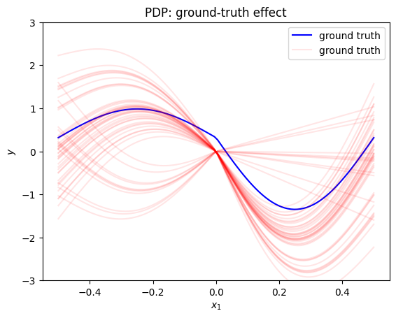
    


```python
effector.PDP(data=x, model=f, nof_instances=100).plot(feature=0, centering=True, heterogeneity="ice")
```


    
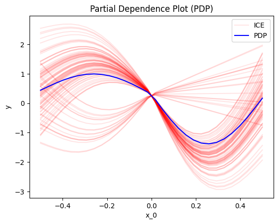
    


It is crucial to recognize that heterogeneity arises from extrapolation into regions with low density. For instance, considering the data-generating distribution, it is highly improbable to observe a scenario where x_1<0 and x_3>0. However, PDP-ICE disrupts this correlation, leading some individual conditional expectations (ICEs) to trace $-\sin(2\pi x_1)$ within the interval $[-0.5, 0]$.

### d-PDP and d-ICE definition and approximation

The d-PDP and d-ICE are the derivative of the PDP and ICE, respectively. The d-PDP is the effect of the feature of interest on the model output. The d-ICE is the effect of the feature of interest on the model output for a specific instance.

In our example, the d-PDP and d-ICE plots are:

$$\text{d-PDP}(x_1) = \frac{\partial}{\partial x_1} \mathbb{E}_{x_2, x_3}[f(x_1, x_2, x_3)] = - 2 \pi \cos(2 \pi x_1) \mathbb{1}_{x_1<0} - \frac{10 \pi}{3} \cos(2 \pi x_1)$$

$$\text{d-ICE}^{(i)}(x_1, x^{(i)}_2, x^{(i)}_3) = \frac{\partial}{\partial x_1} f(x_1, x^{(i)}_2, x^{(i)}_3) = 2 \pi \cos(2 \pi x_1) (\mathbb{1}_{x_1<0} - 2 \mathbb{1}_{x_3^{(i)}} < 0) + x_2^{(i)}$$


```python
# (the earlier version of this notebook carried a spurious `+1` here —
#  a slip of dy/dx2 = x1 + 1; the corrected closed form lives in benchmarks)
gt_d_pdp = bench.d_pdp_gt

def gt_d_ice(x, N):
    K = x.shape[0]
    x3 = np.random.uniform(0, 6, N)
    ind_1 = x3 < 5
    x_2_i = np.random.normal(0, 2, N)

    y = np.stack([2 * np.pi * np.cos(2 * np.pi * x) * (x < 0) for _ in range(N)], 0)
    y[ind_1, :] -= np.stack([4 * np.pi * np.cos(2 * np.pi * x) for _ in range(N)], 0)[ind_1, :]
    y += np.expand_dims(x_2_i, -1)
    return y
```


```python
plt.figure()
plt.ylim(-20, 20)
xx = np.linspace(-.5, .5, 100)
plt.plot(xx, gt_d_pdp(xx), "b", label="ground truth")
plt.plot(xx, gt_d_ice(xx, 50)[0], color="red", label="ground truth", alpha=0.1)
plt.plot(xx, gt_d_ice(xx, 50)[1:].T, color="red", alpha=0.1)
plt.title("d-PDP: ground-truth")
plt.xlabel("$x_1$")
plt.ylabel("$dy_dx1$")
plt.legend()
plt.show()
```


    
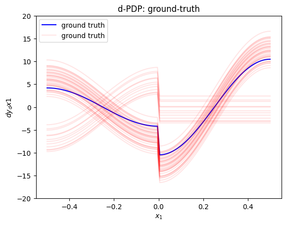
    


```python
effector.DerPDP(data=x, model=f, model_jac=dfdx, nof_instances=50).plot(feature=0, centering=False, heterogeneity="ice", y_limits=[-20, 20])
```


    
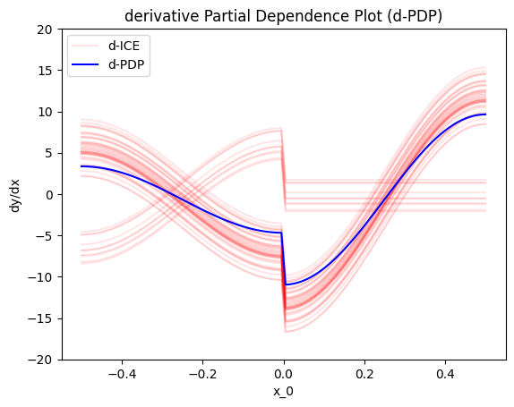
    


## SHAP Dependence Plots

> **Note (2026-07):** the closed form below ($-\frac{5}{6}\sin(2\pi x_1)$), as
> derived in the paper's era, does **not** match what interventional Shapley
> values (the quantity the `shap` package computes) converge to: an exact
> brute-force coalition computation and `shap` agree with each other and both
> sit $\approx 0.3$ away from this curve, independent of the sample size. The
> derivation is being revisited; until then the curve is shown for reference
> and is *not* asserted (the corresponding test is skipped).


```python
gt_shape = bench.shap_gt  # DISPUTED — see the note above

def gt_shap_values(N):
    N1 = int(5*N/6)
    N2 = N - N1
    x = bench.generate_data(N1 + N2, seed=7)
    
    # drop when x_1 < 0.5 or > 0.5
    x = x[np.logical_and(x[:, 0] >= -0.5, x[:, 0] <= 0.5), :]
    
    y = -5/6 * np.sin(2 * np.pi * x[:, 0])
    y += 1/2 * x[:, 0] * x[:, 1] 
    y += 1/32 * x[:, 2]
    return x[:, 0], y
    
```


```python
x_shap, y_shap = gt_shap_values(200)
plt.figure()
plt.ylim(-3, 3)
xx = np.linspace(-.5, .5, 100)
plt.plot(xx, gt_shape(xx), "b", label="ground truth")
plt.plot(x_shap[0], y_shap[0], "rx", label="ground truth", alpha=.5)
plt.plot(x_shap[1:], y_shap[1:], "rx", alpha=0.5)
plt.title("SHAP: ground-truth effect")
plt.xlabel("$x_1$")
plt.ylabel("$y$")
plt.legend()
plt.show()

```


    
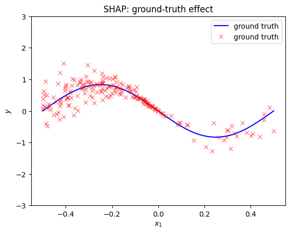
    


```python
shap_dp = effector.ShapDP(data=x, model=f, nof_instances="all")
shap_dp.fit(features=0, binning_method=effector.axis_partitioning.Greedy(init_nof_bins=30, min_points_per_bin=10, discount=0.2))
shap_dp.plot(feature=0, centering=True, heterogeneity="shap_values", y_limits=[-3, 3])
```


    
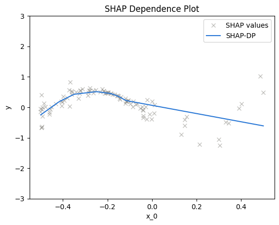
    


## Feature importance and one-click explanation

Every global effect exposes a per-feature **importance** — the dispersion of the
mean effect (the $\mu$-twin of heterogeneity) — so features can be ranked without
reading every plot. On top of that, `effector.explain(...)` runs the whole
pipeline once and returns a serializable `Report` with a self-contained HTML view.

For PDP, importance is the spread of the mean effect. $x_2$ enters through the
near-linear term $(x_1{+}1)\,x_2$ over a wide $\mathcal{N}(0, 2^2)$ range, so its
mean effect spans the largest amplitude and ranks highest; $x_1$ carries the
non-linear $\sin$ signal but over the narrow $[-0.5, 0.5]$ support, and $x_3$
(nearly collinear with $x_1$) ranks lowest.


```python
schema = {"feature_names": ["x1", "x2", "x3"]}

# per-feature importance = dispersion of the mean effect (mu-twin of heterogeneity)
fx = effector.PDP(data=x, model=f, axis_limits=axis_limits, schema=schema, nof_instances="all")
fx.fit("all", centering=True)
print("importances:", np.round(fx.importances(), 3))

# one-click auto-explanation -> Report (serializable; self-contained HTML)
report = effector.explain(x, f, method="pdp", schema=schema, nof_instances="all")
report.show()
```

    importances: [0.835 2.491 0.423]
    
    PDP report — target: y
    ============================================================
    feature                   importance     heter  #regions
    ------------------------------------------------------------
    x2                            2.3408    0.4213         7
    x1                            0.8407    0.6356         7
    x3                            0.4184    0.2985         1
    ============================================================
    
    
    Feature 1 - Full partition tree:
    🌳 Full Tree Structure:
    ───────────────────────
    x2 🔹 [id: 0 | heter: 0.42 | inst: 170 | w: 1.00]
        x1 ≤ -0.10 🔹 [id: 1 | heter: 0.12 | inst: 115 | w: 0.68]
            x1 ≤ -0.30 🔹 [id: 2 | heter: 0.03 | inst: 54 | w: 0.32]
            x1 > -0.30 🔹 [id: 3 | heter: 0.02 | inst: 61 | w: 0.36]
        x1 > -0.10 🔹 [id: 4 | heter: 0.25 | inst: 55 | w: 0.32]
            x1 ≤ 0.20 🔹 [id: 5 | heter: 0.05 | inst: 41 | w: 0.24]
            x1 > 0.20 🔹 [id: 6 | heter: 0.07 | inst: 14 | w: 0.08]
    --------------------------------------------------
    Feature 1 - Statistics per tree level:
    🌳 Tree Summary:
    ─────────────────
    Level 0🔹heter: 0.42
        Level 1🔹heter: 0.16 | 🔻0.26 (61.18%)
            Level 2🔹heter: 0.04 | 🔻0.13 (78.17%)
    
    
    
    
    Feature 0 - Full partition tree:
    🌳 Full Tree Structure:
    ───────────────────────
    x1 🔹 [id: 0 | heter: 0.64 | inst: 170 | w: 1.00]
        x3 ≤ 0.00 🔹 [id: 1 | heter: 0.33 | inst: 142 | w: 0.84]
            x2 ≤ -0.25 🔹 [id: 2 | heter: 0.12 | inst: 69 | w: 0.41]
            x2 > -0.25 🔹 [id: 3 | heter: 0.18 | inst: 73 | w: 0.43]
        x3 > 0.00 🔹 [id: 4 | heter: 0.24 | inst: 28 | w: 0.16]
            x2 ≤ -0.25 🔹 [id: 5 | heter: 0.04 | inst: 10 | w: 0.06]
            x2 > -0.25 🔹 [id: 6 | heter: 0.07 | inst: 18 | w: 0.11]
    --------------------------------------------------
    Feature 0 - Statistics per tree level:
    🌳 Tree Summary:
    ─────────────────
    Level 0🔹heter: 0.64
        Level 1🔹heter: 0.31 | 🔻0.32 (50.60%)
            Level 2🔹heter: 0.13 | 🔻0.18 (57.75%)
    
    


## Tests

The asserts below mirror `tests/test_functional_correlated_features.py` — the
tolerances are per-half because only $1/6$ of the $x_1$ mass lies above zero,
so estimates there are intrinsically noisier.


```python
xx = np.linspace(-0.5, 0.5, 100)
dense = xx <= 0  # 5/6 of the x1 mass


def assert_per_half(y, gt, atol_dense, atol_sparse):
    np.testing.assert_allclose(y[dense], gt[dense], atol=atol_dense)
    np.testing.assert_allclose(y[~dense], gt[~dense], atol=atol_sparse)


# PDP
pdp = effector.PDP(data=x, model=f, axis_limits=axis_limits)
np.testing.assert_allclose(pdp.eval(feature=0, xs=xx, centering=True), gt_pdp(xx), atol=1e-1)

# d-PDP
dpdp = effector.DerPDP(data=x, model=f, model_jac=dfdx, axis_limits=axis_limits)
np.testing.assert_allclose(dpdp.eval(feature=0, xs=xx, centering=False), gt_d_pdp(xx), atol=5e-1)

# ALE
ale = effector.ALE(data=x, model=f, axis_limits=axis_limits)
ale.fit(features=0, binning_method=effector.axis_partitioning.Fixed(nof_bins=31))
assert_per_half(ale.eval(feature=0, xs=xx, centering=True), ale_gt(xx), 1.5e-1, 3e-1)

# RHALE
rhale = effector.RHALE(data=x, model=f, model_jac=dfdx, axis_limits=axis_limits)
rhale.fit(features=0)
assert_per_half(rhale.eval(feature=0, xs=xx, centering=True), rhale_gt(xx), 2e-1, 4e-1)

print("all closed-form checks passed")
```

    all closed-form checks passed

