# Regional Effects (unknown black-box function)

This tutorial use the same dataset with the previous [tutorial](./03_regional_effects_synthetic_f/), but instead of explaining the known (synthetic) predictive function, we fit a neural network on the data and explain the neural network. This is a more realistic scenario, since in real-world applications we do not know the underlying function and we only have access to the data. We advise the reader to first read the previous tutorial.


```python
import numpy as np
import effector
import keras
import tensorflow as tf

np.random.seed(12345)
tf.random.set_seed(12345)
```

<!-- ## Simulation example

### Data Generating Distribution

We will generate $N=1000$ examples with $D=3$ features, which are in the uncorrelated setting all uniformly distributed as follows:

<center>

| Feature | Description                                | Distribution                 |
|---------|--------------------------------------------|------------------------------|
| $x_1$   | Uniformly distributed between $-1$ and $1$ | $x_1 \sim \mathcal{U}(-1,1)$ |
| $x_2$   | Uniformly distributed between $-1$ and $1$ | $x_2 \sim \mathcal{U}(-1,1)$ |
| $x_3$   | Uniformly distributed between $-1$ and $1$ | $x_3 \sim \mathcal{U}(-1,1)$ |

</center>

For the correlated setting we keep the distributional assumptions for $x_2$ and $x_3$ but define $x_1$ such that it is highly correlated with $x_3$ by: $x_1 = x_3 + \delta$ with $\delta \sim \mathcal{N}(0,0.0625)$. -->

## Simulation example

### Data Generating Distribution

We will generate $N=1000$ examples with $D=3$ features, which are in the uncorrelated setting all uniformly distributed as follows:

| Feature | Description                                | Distribution                 |
|---------|--------------------------------------------|------------------------------|
| $x_1$   | Uniformly distributed between $-1$ and $1$ | $x_1 \sim \mathcal{U}(-1,1)$ |
| $x_2$   | Uniformly distributed between $-1$ and $1$ | $x_2 \sim \mathcal{U}(-1,1)$ |
| $x_3$   | Uniformly distributed between $-1$ and $1$ | $x_3 \sim \mathcal{U}(-1,1)$ |

For the correlated setting, we keep the distributional assumptions for $x_2$ and $x_3$, but define $x_1$ such that it is highly correlated with $x_3$ by:  
$x_1 = x_3 + \delta$ with $\delta \sim \mathcal{N}(0,0.0625)$.


```python
def generate_dataset_uncorrelated(N):
    x1 = np.random.uniform(-1, 1, size=N)
    x2 = np.random.uniform(-1, 1, size=N)
    x3 = np.random.uniform(-1, 1, size=N)
    return np.stack((x1, x2, x3), axis=-1)

def generate_dataset_correlated(N):
    x3 = np.random.uniform(-1, 1, size=N)
    x2 = np.random.uniform(-1, 1, size=N)
    x1 = x3 + np.random.normal(loc = np.zeros_like(x3), scale = 0.25)
    return np.stack((x1, x2, x3), axis=-1)

# generate the dataset for the uncorrelated and correlated setting
N = 1000
X_uncor_train = generate_dataset_uncorrelated(N)
X_uncor_test = generate_dataset_uncorrelated(10000)
X_cor_train = generate_dataset_correlated(N)
X_cor_test = generate_dataset_correlated(10000)
```

### Black-box function

We will use the following linear model with a subgroup-specific interaction term:
 $$ y = 3x_1I_{x_3>0} - 3x_1I_{x_3\leq0} + x_3$$ 
 
On a global level, there is a high heterogeneity for the features $x_1$ and $x_3$ due to their interaction with each other. However, this heterogeneity vanishes to 0 if the feature space is separated into subregions:

<center>

| Feature | Region      | Average Effect | Heterogeneity |
|---------|-------------|----------------|---------------|
| $x_1$   | $x_3>0$     | $3x_1$         | 0             |
| $x_1$   | $x_3\leq 0$ | $-3x_1$        | 0             |
| $x_2$   | all         | 0              | 0             |
| $x_3$   | $x_3>0$     | $x_3$          | 0             |
| $x_3$   | $x_3\leq 0$ | $x_3$          | 0             |

</center>


```python
def generate_target(X):
    f = np.where(X[:,2] > 0, 3*X[:,0] + X[:,2], -3*X[:,0] + X[:,2])
    epsilon = np.random.normal(loc = np.zeros_like(X[:,0]), scale = 0.1)
    Y = f + epsilon
    return(Y)

# generate target for uncorrelated and correlated setting
Y_uncor_train = generate_target(X_uncor_train)
Y_uncor_test = generate_target(X_uncor_test)
Y_cor_train = generate_target(X_cor_train)
Y_cor_test = generate_target(X_cor_test)      
```

### Fit a Neural Network

We create a two-layer feedforward Neural Network, a weight decay of 0.01 for 100 epochs. We train two instances of this NN, one on the uncorrelated and one on the correlated setting. In both cases, the NN achieves a Mean Squared Error of about $0.17$ units.


```python
# Train - Evaluate - Explain a neural network
model_uncor = keras.Sequential([
    keras.layers.Dense(10, activation="relu", input_shape=(3,)),
    keras.layers.Dense(10, activation="relu", input_shape=(3,)),
    keras.layers.Dense(1)
])

optimizer = keras.optimizers.Adam(learning_rate=0.01)
model_uncor.compile(optimizer=optimizer, loss="mse")
model_uncor.fit(X_uncor_train, Y_uncor_train, epochs=100)
model_uncor.evaluate(X_uncor_test, Y_uncor_test)
```

    Epoch 1/100


    /Users/dimitriskyriakopoulos/Documents/ath/Effector/Code/eff-env/lib/python3.10/site-packages/keras/src/layers/core/dense.py:93: UserWarning: Do not pass an `input_shape`/`input_dim` argument to a layer. When using Sequential models, prefer using an `Input(shape)` object as the first layer in the model instead.
      super().__init__(activity_regularizer=activity_regularizer, **kwargs)


    32/32 ━━━━━━━━━━━━━━━━━━━━ 0s 1ms/step - loss: 3.0840   
    Epoch 2/100
    32/32 ━━━━━━━━━━━━━━━━━━━━ 0s 974us/step - loss: 1.3322
    Epoch 3/100
    32/32 ━━━━━━━━━━━━━━━━━━━━ 0s 934us/step - loss: 0.4866
    Epoch 4/100
    32/32 ━━━━━━━━━━━━━━━━━━━━ 0s 858us/step - loss: 0.3436
    Epoch 5/100
    32/32 ━━━━━━━━━━━━━━━━━━━━ 0s 864us/step - loss: 0.2711
    Epoch 6/100
    32/32 ━━━━━━━━━━━━━━━━━━━━ 0s 889us/step - loss: 0.2239
    Epoch 7/100
    32/32 ━━━━━━━━━━━━━━━━━━━━ 0s 876us/step - loss: 0.1959
    Epoch 8/100
    32/32 ━━━━━━━━━━━━━━━━━━━━ 0s 860us/step - loss: 0.1755
    Epoch 9/100
    32/32 ━━━━━━━━━━━━━━━━━━━━ 0s 858us/step - loss: 0.1605
    Epoch 10/100
    32/32 ━━━━━━━━━━━━━━━━━━━━ 0s 853us/step - loss: 0.1474
    Epoch 11/100
    32/32 ━━━━━━━━━━━━━━━━━━━━ 0s 863us/step - loss: 0.1367
    Epoch 12/100
    32/32 ━━━━━━━━━━━━━━━━━━━━ 0s 855us/step - loss: 0.1280
    Epoch 13/100
    32/32 ━━━━━━━━━━━━━━━━━━━━ 0s 881us/step - loss: 0.1213
    Epoch 14/100
    32/32 ━━━━━━━━━━━━━━━━━━━━ 0s 872us/step - loss: 0.1154
    Epoch 15/100
    32/32 ━━━━━━━━━━━━━━━━━━━━ 0s 864us/step - loss: 0.1106
    Epoch 16/100
    32/32 ━━━━━━━━━━━━━━━━━━━━ 0s 871us/step - loss: 0.1068
    Epoch 17/100
    32/32 ━━━━━━━━━━━━━━━━━━━━ 0s 871us/step - loss: 0.1035
    Epoch 18/100
    32/32 ━━━━━━━━━━━━━━━━━━━━ 0s 857us/step - loss: 0.0995
    Epoch 19/100
    32/32 ━━━━━━━━━━━━━━━━━━━━ 0s 860us/step - loss: 0.0963
    Epoch 20/100
    32/32 ━━━━━━━━━━━━━━━━━━━━ 0s 864us/step - loss: 0.0923
    Epoch 21/100
    32/32 ━━━━━━━━━━━━━━━━━━━━ 0s 888us/step - loss: 0.0886
    Epoch 22/100
    32/32 ━━━━━━━━━━━━━━━━━━━━ 0s 845us/step - loss: 0.0845
    Epoch 23/100
    32/32 ━━━━━━━━━━━━━━━━━━━━ 0s 852us/step - loss: 0.0810
    Epoch 24/100
    32/32 ━━━━━━━━━━━━━━━━━━━━ 0s 868us/step - loss: 0.0790
    Epoch 25/100
    32/32 ━━━━━━━━━━━━━━━━━━━━ 0s 871us/step - loss: 0.0757
    Epoch 26/100
    32/32 ━━━━━━━━━━━━━━━━━━━━ 0s 871us/step - loss: 0.0745
    Epoch 27/100
    32/32 ━━━━━━━━━━━━━━━━━━━━ 0s 856us/step - loss: 0.0722
    Epoch 28/100
    32/32 ━━━━━━━━━━━━━━━━━━━━ 0s 858us/step - loss: 0.0715
    Epoch 29/100
    32/32 ━━━━━━━━━━━━━━━━━━━━ 0s 860us/step - loss: 0.0692
    Epoch 30/100
    32/32 ━━━━━━━━━━━━━━━━━━━━ 0s 880us/step - loss: 0.0681
    Epoch 31/100
    32/32 ━━━━━━━━━━━━━━━━━━━━ 0s 853us/step - loss: 0.0670
    Epoch 32/100
    32/32 ━━━━━━━━━━━━━━━━━━━━ 0s 851us/step - loss: 0.0656
    Epoch 33/100
    32/32 ━━━━━━━━━━━━━━━━━━━━ 0s 862us/step - loss: 0.0643
    Epoch 34/100
    32/32 ━━━━━━━━━━━━━━━━━━━━ 0s 865us/step - loss: 0.0643
    Epoch 35/100
    32/32 ━━━━━━━━━━━━━━━━━━━━ 0s 2ms/step - loss: 0.0628
    Epoch 36/100
    32/32 ━━━━━━━━━━━━━━━━━━━━ 0s 868us/step - loss: 0.0627
    Epoch 37/100
    32/32 ━━━━━━━━━━━━━━━━━━━━ 0s 854us/step - loss: 0.0611
    Epoch 38/100
    32/32 ━━━━━━━━━━━━━━━━━━━━ 0s 850us/step - loss: 0.0616
    Epoch 39/100
    32/32 ━━━━━━━━━━━━━━━━━━━━ 0s 840us/step - loss: 0.0610
    Epoch 40/100
    32/32 ━━━━━━━━━━━━━━━━━━━━ 0s 880us/step - loss: 0.0601
    Epoch 41/100
    32/32 ━━━━━━━━━━━━━━━━━━━━ 0s 858us/step - loss: 0.0606
    Epoch 42/100
    32/32 ━━━━━━━━━━━━━━━━━━━━ 0s 842us/step - loss: 0.0598
    Epoch 43/100
    32/32 ━━━━━━━━━━━━━━━━━━━━ 0s 854us/step - loss: 0.0597
    Epoch 44/100
    32/32 ━━━━━━━━━━━━━━━━━━━━ 0s 858us/step - loss: 0.0599
    Epoch 45/100
    32/32 ━━━━━━━━━━━━━━━━━━━━ 0s 844us/step - loss: 0.0596
    Epoch 46/100
    32/32 ━━━━━━━━━━━━━━━━━━━━ 0s 843us/step - loss: 0.0581
    Epoch 47/100
    32/32 ━━━━━━━━━━━━━━━━━━━━ 0s 839us/step - loss: 0.0583
    Epoch 48/100
    32/32 ━━━━━━━━━━━━━━━━━━━━ 0s 858us/step - loss: 0.0575
    Epoch 49/100
    32/32 ━━━━━━━━━━━━━━━━━━━━ 0s 865us/step - loss: 0.0564
    Epoch 50/100
    32/32 ━━━━━━━━━━━━━━━━━━━━ 0s 852us/step - loss: 0.0564
    Epoch 51/100
    32/32 ━━━━━━━━━━━━━━━━━━━━ 0s 866us/step - loss: 0.0567
    Epoch 52/100
    32/32 ━━━━━━━━━━━━━━━━━━━━ 0s 873us/step - loss: 0.0561
    Epoch 53/100
    32/32 ━━━━━━━━━━━━━━━━━━━━ 0s 855us/step - loss: 0.0556
    Epoch 54/100
    32/32 ━━━━━━━━━━━━━━━━━━━━ 0s 856us/step - loss: 0.0553
    Epoch 55/100
    32/32 ━━━━━━━━━━━━━━━━━━━━ 0s 858us/step - loss: 0.0552
    Epoch 56/100
    32/32 ━━━━━━━━━━━━━━━━━━━━ 0s 862us/step - loss: 0.0546
    Epoch 57/100
    32/32 ━━━━━━━━━━━━━━━━━━━━ 0s 847us/step - loss: 0.0542
    Epoch 58/100
    32/32 ━━━━━━━━━━━━━━━━━━━━ 0s 869us/step - loss: 0.0545
    Epoch 59/100
    32/32 ━━━━━━━━━━━━━━━━━━━━ 0s 864us/step - loss: 0.0539
    Epoch 60/100
    32/32 ━━━━━━━━━━━━━━━━━━━━ 0s 876us/step - loss: 0.0543
    Epoch 61/100
    32/32 ━━━━━━━━━━━━━━━━━━━━ 0s 847us/step - loss: 0.0532
    Epoch 62/100
    32/32 ━━━━━━━━━━━━━━━━━━━━ 0s 927us/step - loss: 0.0545
    Epoch 63/100
    32/32 ━━━━━━━━━━━━━━━━━━━━ 0s 890us/step - loss: 0.0537
    Epoch 64/100
    32/32 ━━━━━━━━━━━━━━━━━━━━ 0s 891us/step - loss: 0.0536
    Epoch 65/100
    32/32 ━━━━━━━━━━━━━━━━━━━━ 0s 875us/step - loss: 0.0531
    Epoch 66/100
    32/32 ━━━━━━━━━━━━━━━━━━━━ 0s 876us/step - loss: 0.0531
    Epoch 67/100
    32/32 ━━━━━━━━━━━━━━━━━━━━ 0s 865us/step - loss: 0.0552
    Epoch 68/100
    32/32 ━━━━━━━━━━━━━━━━━━━━ 0s 899us/step - loss: 0.0534
    Epoch 69/100
    32/32 ━━━━━━━━━━━━━━━━━━━━ 0s 920us/step - loss: 0.0523
    Epoch 70/100
    32/32 ━━━━━━━━━━━━━━━━━━━━ 0s 1ms/step - loss: 0.0525 
    Epoch 71/100
    32/32 ━━━━━━━━━━━━━━━━━━━━ 0s 1ms/step - loss: 0.0542 
    Epoch 72/100
    32/32 ━━━━━━━━━━━━━━━━━━━━ 0s 870us/step - loss: 0.0540
    Epoch 73/100
    32/32 ━━━━━━━━━━━━━━━━━━━━ 0s 883us/step - loss: 0.0521
    Epoch 74/100
    32/32 ━━━━━━━━━━━━━━━━━━━━ 0s 867us/step - loss: 0.0535
    Epoch 75/100
    32/32 ━━━━━━━━━━━━━━━━━━━━ 0s 879us/step - loss: 0.0525
    Epoch 76/100
    32/32 ━━━━━━━━━━━━━━━━━━━━ 0s 853us/step - loss: 0.0530
    Epoch 77/100
    32/32 ━━━━━━━━━━━━━━━━━━━━ 0s 858us/step - loss: 0.0538
    Epoch 78/100
    32/32 ━━━━━━━━━━━━━━━━━━━━ 0s 867us/step - loss: 0.0532
    Epoch 79/100
    32/32 ━━━━━━━━━━━━━━━━━━━━ 0s 864us/step - loss: 0.0530
    Epoch 80/100
    32/32 ━━━━━━━━━━━━━━━━━━━━ 0s 869us/step - loss: 0.0536
    Epoch 81/100
    32/32 ━━━━━━━━━━━━━━━━━━━━ 0s 848us/step - loss: 0.0534
    Epoch 82/100
    32/32 ━━━━━━━━━━━━━━━━━━━━ 0s 1ms/step - loss: 0.0533 
    Epoch 83/100
    32/32 ━━━━━━━━━━━━━━━━━━━━ 0s 893us/step - loss: 0.0530
    Epoch 84/100
    32/32 ━━━━━━━━━━━━━━━━━━━━ 0s 889us/step - loss: 0.0521
    Epoch 85/100
    32/32 ━━━━━━━━━━━━━━━━━━━━ 0s 877us/step - loss: 0.0537
    Epoch 86/100
    32/32 ━━━━━━━━━━━━━━━━━━━━ 0s 896us/step - loss: 0.0537
    Epoch 87/100
    32/32 ━━━━━━━━━━━━━━━━━━━━ 0s 893us/step - loss: 0.0514
    Epoch 88/100
    32/32 ━━━━━━━━━━━━━━━━━━━━ 0s 886us/step - loss: 0.0525
    Epoch 89/100
    32/32 ━━━━━━━━━━━━━━━━━━━━ 0s 898us/step - loss: 0.0531
    Epoch 90/100
    32/32 ━━━━━━━━━━━━━━━━━━━━ 0s 875us/step - loss: 0.0515
    Epoch 91/100
    32/32 ━━━━━━━━━━━━━━━━━━━━ 0s 884us/step - loss: 0.0514
    Epoch 92/100
    32/32 ━━━━━━━━━━━━━━━━━━━━ 0s 874us/step - loss: 0.0507
    Epoch 93/100
    32/32 ━━━━━━━━━━━━━━━━━━━━ 0s 2ms/step - loss: 0.0518
    Epoch 94/100
    32/32 ━━━━━━━━━━━━━━━━━━━━ 0s 891us/step - loss: 0.0518
    Epoch 95/100
    32/32 ━━━━━━━━━━━━━━━━━━━━ 0s 881us/step - loss: 0.0507
    Epoch 96/100
    32/32 ━━━━━━━━━━━━━━━━━━━━ 0s 915us/step - loss: 0.0510
    Epoch 97/100
    32/32 ━━━━━━━━━━━━━━━━━━━━ 0s 885us/step - loss: 0.0502
    Epoch 98/100
    32/32 ━━━━━━━━━━━━━━━━━━━━ 0s 897us/step - loss: 0.0511
    Epoch 99/100
    32/32 ━━━━━━━━━━━━━━━━━━━━ 0s 852us/step - loss: 0.0502
    Epoch 100/100
    32/32 ━━━━━━━━━━━━━━━━━━━━ 0s 848us/step - loss: 0.0508
    313/313 ━━━━━━━━━━━━━━━━━━━━ 0s 440us/step - loss: 0.0729


    0.06930544227361679


```python
model_cor = keras.Sequential([
    keras.layers.Dense(10, activation="relu", input_shape=(3,)),
    keras.layers.Dense(10, activation="relu", input_shape=(3,)),
    keras.layers.Dense(1)
])

optimizer = keras.optimizers.Adam(learning_rate=0.01)
model_cor.compile(optimizer=optimizer, loss="mse")
model_cor.fit(X_cor_train, Y_cor_train, epochs=100)
model_cor.evaluate(X_cor_test, Y_cor_test)
```

    Epoch 1/100
    32/32 ━━━━━━━━━━━━━━━━━━━━ 0s 1ms/step - loss: 3.7841   
    Epoch 2/100
    32/32 ━━━━━━━━━━━━━━━━━━━━ 0s 961us/step - loss: 0.7420
    Epoch 3/100
    32/32 ━━━━━━━━━━━━━━━━━━━━ 0s 937us/step - loss: 0.2709
    Epoch 4/100
    32/32 ━━━━━━━━━━━━━━━━━━━━ 0s 865us/step - loss: 0.1657
    Epoch 5/100
    32/32 ━━━━━━━━━━━━━━━━━━━━ 0s 869us/step - loss: 0.1346
    Epoch 6/100
    32/32 ━━━━━━━━━━━━━━━━━━━━ 0s 856us/step - loss: 0.1218
    Epoch 7/100
    32/32 ━━━━━━━━━━━━━━━━━━━━ 0s 864us/step - loss: 0.1147
    Epoch 8/100
    32/32 ━━━━━━━━━━━━━━━━━━━━ 0s 838us/step - loss: 0.1112
    Epoch 9/100
    32/32 ━━━━━━━━━━━━━━━━━━━━ 0s 877us/step - loss: 0.1089
    Epoch 10/100
    32/32 ━━━━━━━━━━━━━━━━━━━━ 0s 842us/step - loss: 0.1071
    Epoch 11/100
    32/32 ━━━━━━━━━━━━━━━━━━━━ 0s 859us/step - loss: 0.1050
    Epoch 12/100
    32/32 ━━━━━━━━━━━━━━━━━━━━ 0s 853us/step - loss: 0.1031
    Epoch 13/100
    32/32 ━━━━━━━━━━━━━━━━━━━━ 0s 857us/step - loss: 0.0995
    Epoch 14/100
    32/32 ━━━━━━━━━━━━━━━━━━━━ 0s 855us/step - loss: 0.0954
    Epoch 15/100
    32/32 ━━━━━━━━━━━━━━━━━━━━ 0s 850us/step - loss: 0.0904
    Epoch 16/100
    32/32 ━━━━━━━━━━━━━━━━━━━━ 0s 864us/step - loss: 0.0852
    Epoch 17/100
    32/32 ━━━━━━━━━━━━━━━━━━━━ 0s 869us/step - loss: 0.0805
    Epoch 18/100
    32/32 ━━━━━━━━━━━━━━━━━━━━ 0s 833us/step - loss: 0.0753
    Epoch 19/100
    32/32 ━━━━━━━━━━━━━━━━━━━━ 0s 854us/step - loss: 0.0675
    Epoch 20/100
    32/32 ━━━━━━━━━━━━━━━━━━━━ 0s 846us/step - loss: 0.0602
    Epoch 21/100
    32/32 ━━━━━━━━━━━━━━━━━━━━ 0s 862us/step - loss: 0.0560
    Epoch 22/100
    32/32 ━━━━━━━━━━━━━━━━━━━━ 0s 850us/step - loss: 0.0536
    Epoch 23/100
    32/32 ━━━━━━━━━━━━━━━━━━━━ 0s 1ms/step - loss: 0.0503 
    Epoch 24/100
    32/32 ━━━━━━━━━━━━━━━━━━━━ 0s 874us/step - loss: 0.0484
    Epoch 25/100
    32/32 ━━━━━━━━━━━━━━━━━━━━ 0s 878us/step - loss: 0.0464
    Epoch 26/100
    32/32 ━━━━━━━━━━━━━━━━━━━━ 0s 845us/step - loss: 0.0440
    Epoch 27/100
    32/32 ━━━━━━━━━━━━━━━━━━━━ 0s 824us/step - loss: 0.0422
    Epoch 28/100
    32/32 ━━━━━━━━━━━━━━━━━━━━ 0s 855us/step - loss: 0.0410
    Epoch 29/100
    32/32 ━━━━━━━━━━━━━━━━━━━━ 0s 855us/step - loss: 0.0391
    Epoch 30/100
    32/32 ━━━━━━━━━━━━━━━━━━━━ 0s 847us/step - loss: 0.0377
    Epoch 31/100
    32/32 ━━━━━━━━━━━━━━━━━━━━ 0s 851us/step - loss: 0.0367
    Epoch 32/100
    32/32 ━━━━━━━━━━━━━━━━━━━━ 0s 853us/step - loss: 0.0350
    Epoch 33/100
    32/32 ━━━━━━━━━━━━━━━━━━━━ 0s 858us/step - loss: 0.0341
    Epoch 34/100
    32/32 ━━━━━━━━━━━━━━━━━━━━ 0s 854us/step - loss: 0.0323
    Epoch 35/100
    32/32 ━━━━━━━━━━━━━━━━━━━━ 0s 832us/step - loss: 0.0306
    Epoch 36/100
    32/32 ━━━━━━━━━━━━━━━━━━━━ 0s 855us/step - loss: 0.0300
    Epoch 37/100
    32/32 ━━━━━━━━━━━━━━━━━━━━ 0s 856us/step - loss: 0.0286
    Epoch 38/100
    32/32 ━━━━━━━━━━━━━━━━━━━━ 0s 847us/step - loss: 0.0274
    Epoch 39/100
    32/32 ━━━━━━━━━━━━━━━━━━━━ 0s 858us/step - loss: 0.0274
    Epoch 40/100
    32/32 ━━━━━━━━━━━━━━━━━━━━ 0s 862us/step - loss: 0.0259
    Epoch 41/100
    32/32 ━━━━━━━━━━━━━━━━━━━━ 0s 856us/step - loss: 0.0253
    Epoch 42/100
    32/32 ━━━━━━━━━━━━━━━━━━━━ 0s 857us/step - loss: 0.0250
    Epoch 43/100
    32/32 ━━━━━━━━━━━━━━━━━━━━ 0s 834us/step - loss: 0.0240
    Epoch 44/100
    32/32 ━━━━━━━━━━━━━━━━━━━━ 0s 859us/step - loss: 0.0240
    Epoch 45/100
    32/32 ━━━━━━━━━━━━━━━━━━━━ 0s 849us/step - loss: 0.0230
    Epoch 46/100
    32/32 ━━━━━━━━━━━━━━━━━━━━ 0s 843us/step - loss: 0.0233
    Epoch 47/100
    32/32 ━━━━━━━━━━━━━━━━━━━━ 0s 855us/step - loss: 0.0232
    Epoch 48/100
    32/32 ━━━━━━━━━━━━━━━━━━━━ 0s 869us/step - loss: 0.0229
    Epoch 49/100
    32/32 ━━━━━━━━━━━━━━━━━━━━ 0s 858us/step - loss: 0.0217
    Epoch 50/100
    32/32 ━━━━━━━━━━━━━━━━━━━━ 0s 864us/step - loss: 0.0225
    Epoch 51/100
    32/32 ━━━━━━━━━━━━━━━━━━━━ 0s 857us/step - loss: 0.0210
    Epoch 52/100
    32/32 ━━━━━━━━━━━━━━━━━━━━ 0s 856us/step - loss: 0.0221
    Epoch 53/100
    32/32 ━━━━━━━━━━━━━━━━━━━━ 0s 864us/step - loss: 0.0212
    Epoch 54/100
    32/32 ━━━━━━━━━━━━━━━━━━━━ 0s 853us/step - loss: 0.0220
    Epoch 55/100
    32/32 ━━━━━━━━━━━━━━━━━━━━ 0s 847us/step - loss: 0.0202
    Epoch 56/100
    32/32 ━━━━━━━━━━━━━━━━━━━━ 0s 860us/step - loss: 0.0211
    Epoch 57/100
    32/32 ━━━━━━━━━━━━━━━━━━━━ 0s 859us/step - loss: 0.0207
    Epoch 58/100
    32/32 ━━━━━━━━━━━━━━━━━━━━ 0s 2ms/step - loss: 0.0193
    Epoch 59/100
    32/32 ━━━━━━━━━━━━━━━━━━━━ 0s 855us/step - loss: 0.0206
    Epoch 60/100
    32/32 ━━━━━━━━━━━━━━━━━━━━ 0s 877us/step - loss: 0.0194
    Epoch 61/100
    32/32 ━━━━━━━━━━━━━━━━━━━━ 0s 852us/step - loss: 0.0204
    Epoch 62/100
    32/32 ━━━━━━━━━━━━━━━━━━━━ 0s 846us/step - loss: 0.0190
    Epoch 63/100
    32/32 ━━━━━━━━━━━━━━━━━━━━ 0s 854us/step - loss: 0.0196
    Epoch 64/100
    32/32 ━━━━━━━━━━━━━━━━━━━━ 0s 901us/step - loss: 0.0192
    Epoch 65/100
    32/32 ━━━━━━━━━━━━━━━━━━━━ 0s 870us/step - loss: 0.0193
    Epoch 66/100
    32/32 ━━━━━━━━━━━━━━━━━━━━ 0s 845us/step - loss: 0.0187
    Epoch 67/100
    32/32 ━━━━━━━━━━━━━━━━━━━━ 0s 844us/step - loss: 0.0188
    Epoch 68/100
    32/32 ━━━━━━━━━━━━━━━━━━━━ 0s 857us/step - loss: 0.0185
    Epoch 69/100
    32/32 ━━━━━━━━━━━━━━━━━━━━ 0s 851us/step - loss: 0.0189
    Epoch 70/100
    32/32 ━━━━━━━━━━━━━━━━━━━━ 0s 853us/step - loss: 0.0183
    Epoch 71/100
    32/32 ━━━━━━━━━━━━━━━━━━━━ 0s 856us/step - loss: 0.0187
    Epoch 72/100
    32/32 ━━━━━━━━━━━━━━━━━━━━ 0s 848us/step - loss: 0.0183
    Epoch 73/100
    32/32 ━━━━━━━━━━━━━━━━━━━━ 0s 840us/step - loss: 0.0184
    Epoch 74/100
    32/32 ━━━━━━━━━━━━━━━━━━━━ 0s 862us/step - loss: 0.0184
    Epoch 75/100
    32/32 ━━━━━━━━━━━━━━━━━━━━ 0s 861us/step - loss: 0.0180
    Epoch 76/100
    32/32 ━━━━━━━━━━━━━━━━━━━━ 0s 861us/step - loss: 0.0182
    Epoch 77/100
    32/32 ━━━━━━━━━━━━━━━━━━━━ 0s 854us/step - loss: 0.0179
    Epoch 78/100
    32/32 ━━━━━━━━━━━━━━━━━━━━ 0s 852us/step - loss: 0.0177
    Epoch 79/100
    32/32 ━━━━━━━━━━━━━━━━━━━━ 0s 846us/step - loss: 0.0178
    Epoch 80/100
    32/32 ━━━━━━━━━━━━━━━━━━━━ 0s 860us/step - loss: 0.0172
    Epoch 81/100
    32/32 ━━━━━━━━━━━━━━━━━━━━ 0s 848us/step - loss: 0.0186
    Epoch 82/100
    32/32 ━━━━━━━━━━━━━━━━━━━━ 0s 845us/step - loss: 0.0172
    Epoch 83/100
    32/32 ━━━━━━━━━━━━━━━━━━━━ 0s 842us/step - loss: 0.0184
    Epoch 84/100
    32/32 ━━━━━━━━━━━━━━━━━━━━ 0s 855us/step - loss: 0.0171
    Epoch 85/100
    32/32 ━━━━━━━━━━━━━━━━━━━━ 0s 849us/step - loss: 0.0172
    Epoch 86/100
    32/32 ━━━━━━━━━━━━━━━━━━━━ 0s 840us/step - loss: 0.0176
    Epoch 87/100
    32/32 ━━━━━━━━━━━━━━━━━━━━ 0s 830us/step - loss: 0.0174
    Epoch 88/100
    32/32 ━━━━━━━━━━━━━━━━━━━━ 0s 845us/step - loss: 0.0176
    Epoch 89/100
    32/32 ━━━━━━━━━━━━━━━━━━━━ 0s 832us/step - loss: 0.0173
    Epoch 90/100
    32/32 ━━━━━━━━━━━━━━━━━━━━ 0s 844us/step - loss: 0.0170
    Epoch 91/100
    32/32 ━━━━━━━━━━━━━━━━━━━━ 0s 839us/step - loss: 0.0173
    Epoch 92/100
    32/32 ━━━━━━━━━━━━━━━━━━━━ 0s 860us/step - loss: 0.0172
    Epoch 93/100
    32/32 ━━━━━━━━━━━━━━━━━━━━ 0s 864us/step - loss: 0.0174
    Epoch 94/100
    32/32 ━━━━━━━━━━━━━━━━━━━━ 0s 836us/step - loss: 0.0170
    Epoch 95/100
    32/32 ━━━━━━━━━━━━━━━━━━━━ 0s 841us/step - loss: 0.0174
    Epoch 96/100
    32/32 ━━━━━━━━━━━━━━━━━━━━ 0s 860us/step - loss: 0.0167
    Epoch 97/100
    32/32 ━━━━━━━━━━━━━━━━━━━━ 0s 848us/step - loss: 0.0173
    Epoch 98/100
    32/32 ━━━━━━━━━━━━━━━━━━━━ 0s 849us/step - loss: 0.0165
    Epoch 99/100
    32/32 ━━━━━━━━━━━━━━━━━━━━ 0s 857us/step - loss: 0.0171
    Epoch 100/100
    32/32 ━━━━━━━━━━━━━━━━━━━━ 0s 861us/step - loss: 0.0167
    313/313 ━━━━━━━━━━━━━━━━━━━━ 0s 433us/step - loss: 0.0285


    0.0264066681265831


---
## PDP
### Uncorrelated setting
#### Global PDP


```python
pdp = effector.PDP(data=X_uncor_train, model=model_uncor, feature_names=['x1','x2','x3'], target_name="Y")
pdp.plot(feature=0, centering=True, show_avg_output=False, heterogeneity="ice", y_limits=[-5, 5])
pdp.plot(feature=1, centering=True, show_avg_output=False, heterogeneity="ice", y_limits=[-5, 5])
pdp.plot(feature=2, centering=True, show_avg_output=False, heterogeneity="ice", y_limits=[-5, 5])
```


    
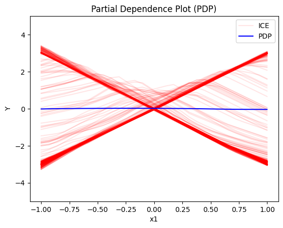
    


    
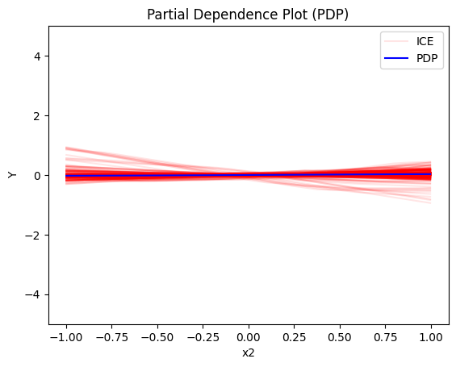
    


    
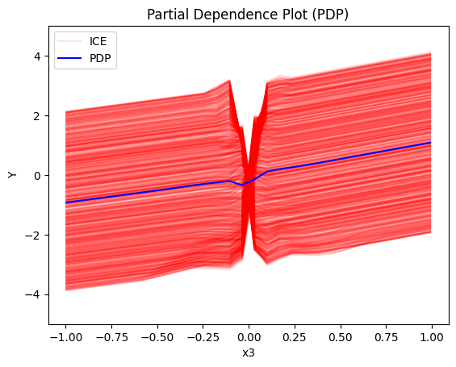
    


#### Regional PDP


```python
regional_pdp = effector.RegionalPDP(data=X_uncor_train, model=model_uncor, feature_names=['x1','x2','x3'], axis_limits=np.array([[-1,1],[-1,1],[-1,1]]).T)
space_partitioner = effector.space_partitioning.Best(min_heterogeneity_decrease_pcg=0.3, numerical_features_grid_size=10)
regional_pdp.fit(features="all", space_partitioner=space_partitioner)
```

    100%|██████████| 3/3 [00:00<00:00, 67.34it/s]


```python
regional_pdp.summary(features=0)
```

    
    
    Feature 0 - Full partition tree:
    🌳 Full Tree Structure:
    ───────────────────────
    x1 🔹 [id: 0 | heter: 3.15 | inst: 1000 | w: 1.00]
        x3 ≤ 0.00 🔹 [id: 1 | heter: 0.05 | inst: 500 | w: 0.50]
        x3 > 0.00 🔹 [id: 2 | heter: 0.07 | inst: 500 | w: 0.50]
    --------------------------------------------------
    Feature 0 - Statistics per tree level:
    🌳 Tree Summary:
    ─────────────────
    Level 0🔹heter: 3.15
        Level 1🔹heter: 0.06 | 🔻3.09 (98.09%)
    
    


```python
regional_pdp.plot(feature=0, node_idx=1, heterogeneity="ice", y_limits=[-5, 5])
regional_pdp.plot(feature=0, node_idx=2, heterogeneity="ice", y_limits=[-5, 5])
```


    
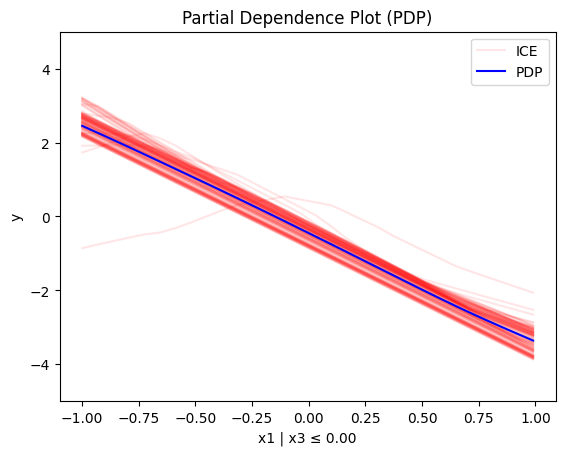
    


    
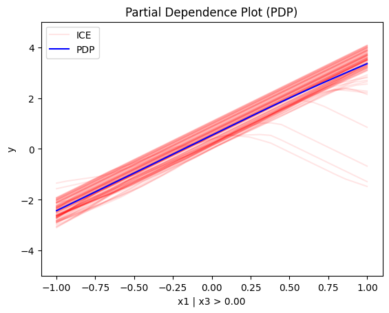
    


```python
regional_pdp.summary(features=1)
```

    
    
    Feature 1 - Full partition tree:
    🌳 Full Tree Structure:
    ───────────────────────
    x2 🔹 [id: 0 | heter: 0.00 | inst: 1000 | w: 1.00]
    --------------------------------------------------
    Feature 1 - Statistics per tree level:
    🌳 Tree Summary:
    ─────────────────
    Level 0🔹heter: 0.00
    
    


```python
regional_pdp.summary(features=2)
```

    
    
    Feature 2 - Full partition tree:
    🌳 Full Tree Structure:
    ───────────────────────
    x3 🔹 [id: 0 | heter: 2.95 | inst: 1000 | w: 1.00]
        x1 ≤ 0.00 🔹 [id: 1 | heter: 0.73 | inst: 494 | w: 0.49]
            x1 ≤ -0.60 🔹 [id: 2 | heter: 0.13 | inst: 196 | w: 0.20]
            x1 > -0.60 🔹 [id: 3 | heter: 0.27 | inst: 298 | w: 0.30]
        x1 > 0.00 🔹 [id: 4 | heter: 0.71 | inst: 506 | w: 0.51]
            x1 ≤ 0.40 🔹 [id: 5 | heter: 0.13 | inst: 199 | w: 0.20]
            x1 > 0.40 🔹 [id: 6 | heter: 0.26 | inst: 307 | w: 0.31]
    --------------------------------------------------
    Feature 2 - Statistics per tree level:
    🌳 Tree Summary:
    ─────────────────
    Level 0🔹heter: 2.95
        Level 1🔹heter: 0.72 | 🔻2.22 (75.50%)
            Level 2🔹heter: 0.21 | 🔻0.51 (70.90%)
    
    


```python
regional_pdp.plot(feature=2, node_idx=1, heterogeneity="ice", centering=True, y_limits=[-5, 5])
regional_pdp.plot(feature=2, node_idx=4, heterogeneity="ice", centering=True, y_limits=[-5, 5])
```


    
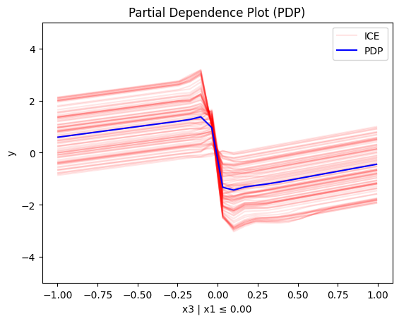
    


    
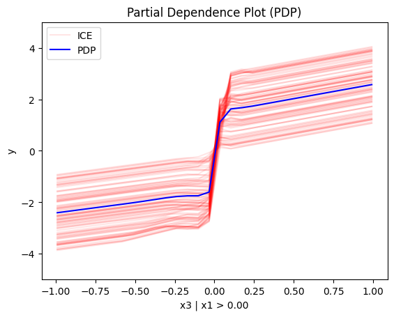
    


#### Conclusion

For the Global PDP:

   * the average effect of $x_1$ is $0$ with some heterogeneity implied by the interaction with $x_1$. The heterogeneity is expressed with two opposite lines; $-3x_1$ when $x_1 \leq 0$ and $3x_1$ when $x_1 >0$
   * the average effect of $x_2$ to be $0$ without heterogeneity
   * the average effect of $x_3$ to be $x_3$ with some heterogeneity due to the interaction with $x_1$. The heterogeneity is expressed with a discontinuity around $x_3=0$, with either a positive or a negative offset depending on the value of $x_1^i$

--- 

For the Regional PDP:

* For $x_1$, the algorithm finds two regions, one for $x_3 \leq 0$ and one for $x_3 > 0$
  * when $x_3>0$ the effect is $3x_1$
  * when $x_3 \leq 0$, the effect is $-3x_1$
* For $x_2$ the algorithm does not find any subregion 
* For $x_3$, there is a change in the offset:
  * when $x_1>0$ the line is $x_3 - 3x_1^i$ in the first half and $x_3 + 3x_1^i$ later
  * when $x_1<0$ the line is $x_3 + 3x_1^i$ in the first half and $x_3 - 3x_1^i$ later

### Correlated setting


#### Global PDP


```python
pdp = effector.PDP(data=X_cor_train, model=model_cor, feature_names=['x1','x2','x3'], target_name="Y")
pdp.plot(feature=0, centering=True, show_avg_output=False, heterogeneity="ice", y_limits=[-5, 5])
pdp.plot(feature=1, centering=True, show_avg_output=False, heterogeneity="ice", y_limits=[-5, 5])
pdp.plot(feature=2, centering=True, show_avg_output=False, heterogeneity="ice", y_limits=[-5, 5])
```


    
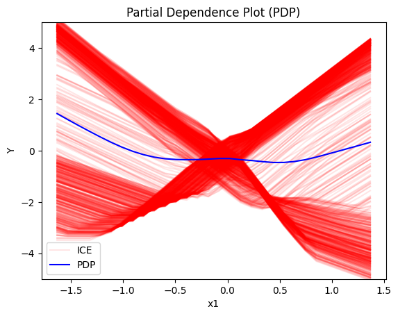
    


    
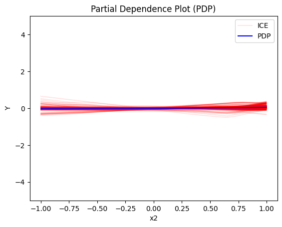
    


    
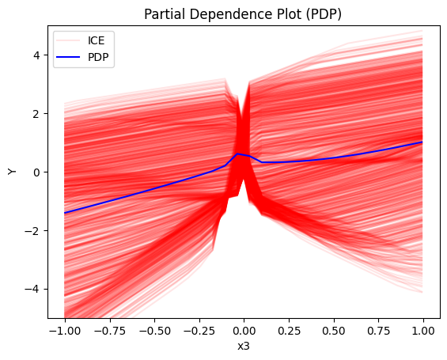
    


#### Regional-PDP


```python
regional_pdp = effector.RegionalPDP(data=X_cor_train, model=model_cor, feature_names=['x1','x2','x3'], axis_limits=np.array([[-1,1],[-1,1],[-1,1]]).T)
space_partitioner = effector.space_partitioning.Best(min_heterogeneity_decrease_pcg=0.4, numerical_features_grid_size=10)
regional_pdp.fit(features="all", space_partitioner=space_partitioner)
```

    100%|██████████| 3/3 [00:00<00:00, 89.17it/s]


```python
regional_pdp.summary(features=0)
```

    
    
    Feature 0 - Full partition tree:
    🌳 Full Tree Structure:
    ───────────────────────
    x1 🔹 [id: 0 | heter: 2.82 | inst: 900 | w: 1.00]
        x3 ≤ 0.00 🔹 [id: 1 | heter: 0.28 | inst: 436 | w: 0.48]
            x3 ≤ -0.20 🔹 [id: 2 | heter: 0.08 | inst: 337 | w: 0.37]
            x3 > -0.20 🔹 [id: 3 | heter: 0.22 | inst: 99 | w: 0.11]
        x3 > 0.00 🔹 [id: 4 | heter: 0.13 | inst: 464 | w: 0.52]
            x3 ≤ 0.20 🔹 [id: 5 | heter: 0.13 | inst: 115 | w: 0.13]
            x3 > 0.20 🔹 [id: 6 | heter: 0.04 | inst: 349 | w: 0.39]
    --------------------------------------------------
    Feature 0 - Statistics per tree level:
    🌳 Tree Summary:
    ─────────────────
    Level 0🔹heter: 2.82
        Level 1🔹heter: 0.20 | 🔻2.62 (92.84%)
            Level 2🔹heter: 0.09 | 🔻0.12 (57.09%)
    
    


```python
regional_pdp.plot(feature=0, node_idx=1, heterogeneity="ice", centering=True, y_limits=[-5, 5])
regional_pdp.plot(feature=0, node_idx=4, heterogeneity="ice", centering=True, y_limits=[-5, 5])
```


    
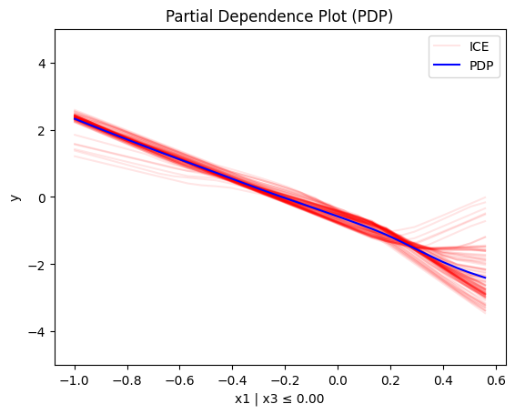
    


    
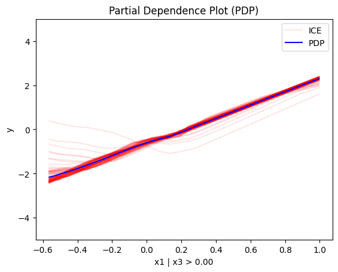
    


```python
regional_pdp.summary(features=1)
```

    
    
    Feature 1 - Full partition tree:
    🌳 Full Tree Structure:
    ───────────────────────
    x2 🔹 [id: 0 | heter: 0.00 | inst: 900 | w: 1.00]
    --------------------------------------------------
    Feature 1 - Statistics per tree level:
    🌳 Tree Summary:
    ─────────────────
    Level 0🔹heter: 0.00
    
    


```python
regional_pdp.summary(features=2)
```

    
    
    Feature 2 - Full partition tree:
    🌳 Full Tree Structure:
    ───────────────────────
    x3 🔹 [id: 0 | heter: 2.48 | inst: 900 | w: 1.00]
        x1 ≤ 0.00 🔹 [id: 1 | heter: 0.62 | inst: 463 | w: 0.51]
            x1 ≤ -0.40 🔹 [id: 2 | heter: 0.21 | inst: 246 | w: 0.27]
            x1 > -0.40 🔹 [id: 3 | heter: 0.11 | inst: 217 | w: 0.24]
        x1 > 0.00 🔹 [id: 4 | heter: 0.76 | inst: 437 | w: 0.49]
            x1 ≤ 0.40 🔹 [id: 5 | heter: 0.16 | inst: 189 | w: 0.21]
            x1 > 0.40 🔹 [id: 6 | heter: 0.21 | inst: 248 | w: 0.28]
    --------------------------------------------------
    Feature 2 - Statistics per tree level:
    🌳 Tree Summary:
    ─────────────────
    Level 0🔹heter: 2.48
        Level 1🔹heter: 0.69 | 🔻1.79 (72.25%)
            Level 2🔹heter: 0.18 | 🔻0.51 (74.47%)
    
    


```python
regional_pdp.plot(feature=2, node_idx=1, heterogeneity="ice", centering=True, y_limits=[-5, 5])
regional_pdp.plot(feature=2, node_idx=4, heterogeneity="ice", centering=True, y_limits=[-5, 5])
```


    
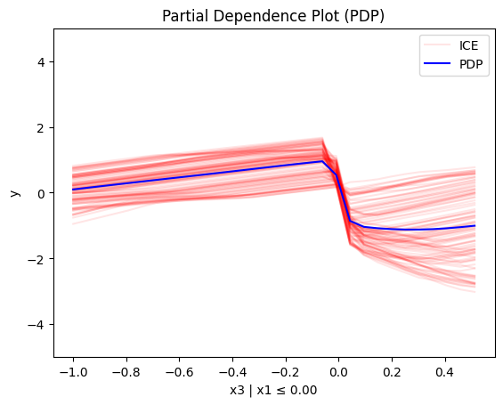
    


    
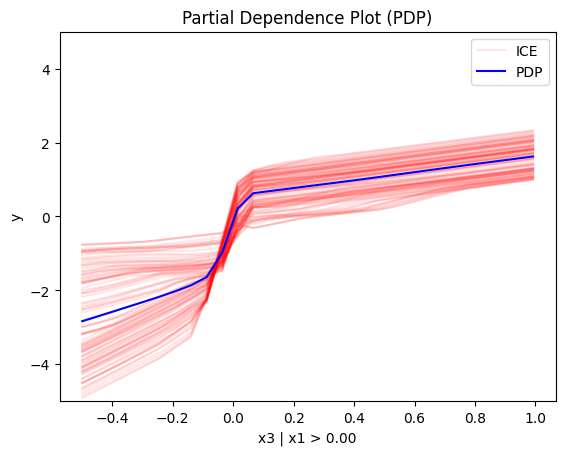
    


#### Conclusion

## (RH)ALE


```python
def model_uncor_jac(x):
    x_tensor = tf.convert_to_tensor(x, dtype=tf.float32)
    with tf.GradientTape() as t:
        t.watch(x_tensor)
        pred = model_uncor(x_tensor)
        grads = t.gradient(pred, x_tensor)
    return grads.numpy()

def model_cor_jac(x):
    x_tensor = tf.convert_to_tensor(x, dtype=tf.float32)
    with tf.GradientTape() as t:
        t.watch(x_tensor)
        pred = model_cor(x_tensor)
        grads = t.gradient(pred, x_tensor)
    return grads.numpy()
```

### Uncorrelated setting

#### Global RHALE


```python
rhale = effector.RHALE(data=X_uncor_train, model=model_uncor, model_jac=model_uncor_jac, feature_names=['x1','x2','x3'], target_name="Y")

binning_method = effector.axis_partitioning.Fixed(10, min_points_per_bin=0)
rhale.fit(features="all", binning_method=binning_method, centering=True)

rhale.plot(feature=0, centering=True, heterogeneity="std", show_avg_output=False, y_limits=[-5, 5], dy_limits=[-5, 5])
rhale.plot(feature=1, centering=True, heterogeneity="std", show_avg_output=False, y_limits=[-5, 5], dy_limits=[-5, 5])
rhale.plot(feature=2, centering=True, heterogeneity="std", show_avg_output=False, y_limits=[-5, 5], dy_limits=[-5, 5])
```


    
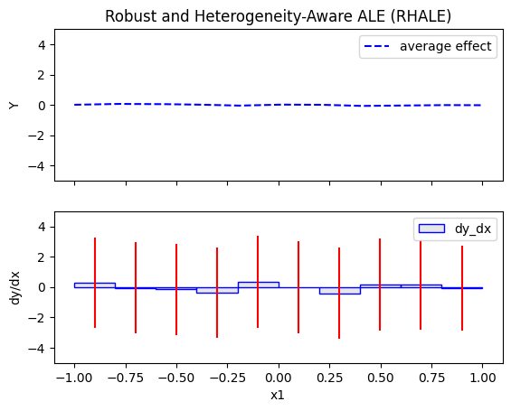
    


    
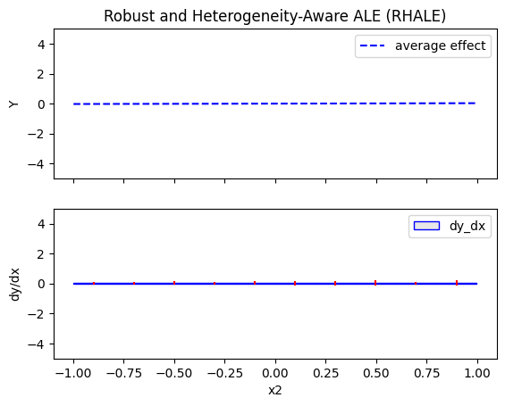
    


    
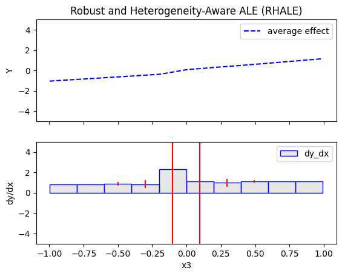
    


#### Regional RHALE


```python
regional_rhale = effector.RegionalRHALE(
    data=X_uncor_train, 
    model=model_uncor, 
    model_jac= model_uncor_jac, 
    feature_names=['x1', 'x2', 'x3'],
    axis_limits=np.array([[-1, 1], [-1, 1], [-1, 1]]).T) 

binning_method = effector.axis_partitioning.Fixed(11, min_points_per_bin=0)
space_partitioner = effector.space_partitioning.Best(min_heterogeneity_decrease_pcg=0.6, numerical_features_grid_size=10)
regional_rhale.fit(
    features="all",
    binning_method=binning_method,
    space_partitioner=space_partitioner
)

```

    100%|██████████| 3/3 [00:00<00:00, 53.67it/s]


```python
regional_rhale.summary(features=0)
```

    
    
    Feature 0 - Full partition tree:
    🌳 Full Tree Structure:
    ───────────────────────
    x1 🔹 [id: 0 | heter: 8.82 | inst: 1000 | w: 1.00]
        x3 ≤ 0.00 🔹 [id: 1 | heter: 0.30 | inst: 500 | w: 0.50]
        x3 > 0.00 🔹 [id: 2 | heter: 0.45 | inst: 500 | w: 0.50]
    --------------------------------------------------
    Feature 0 - Statistics per tree level:
    🌳 Tree Summary:
    ─────────────────
    Level 0🔹heter: 8.82
        Level 1🔹heter: 0.37 | 🔻8.45 (95.76%)
    
    


```python
regional_rhale.plot(feature=0, node_idx=1, heterogeneity="std", centering=True, y_limits=[-5, 5])
regional_rhale.plot(feature=0, node_idx=2, heterogeneity="std", centering=True, y_limits=[-5, 5])
```


    
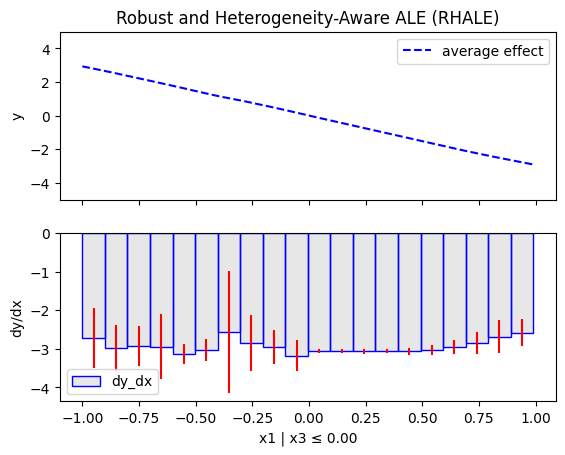
    


    
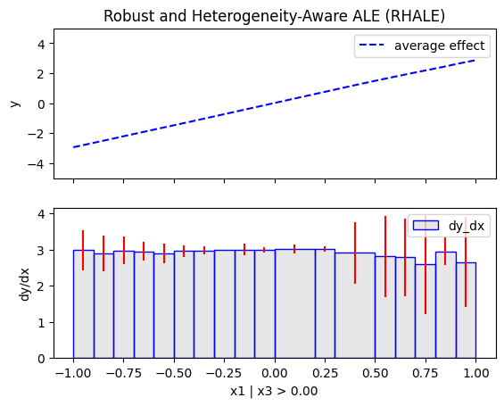
    


```python
regional_rhale.summary(features=1)
```

    
    
    Feature 1 - Full partition tree:
    🌳 Full Tree Structure:
    ───────────────────────
    x2 🔹 [id: 0 | heter: 0.02 | inst: 1000 | w: 1.00]
    --------------------------------------------------
    Feature 1 - Statistics per tree level:
    🌳 Tree Summary:
    ─────────────────
    Level 0🔹heter: 0.02
    
    


```python
regional_rhale.summary(features=2)
```

    
    
    Feature 2 - Full partition tree:
    🌳 Full Tree Structure:
    ───────────────────────
    x3 🔹 [id: 0 | heter: 55.57 | inst: 1000 | w: 1.00]
    --------------------------------------------------
    Feature 2 - Statistics per tree level:
    🌳 Tree Summary:
    ─────────────────
    Level 0🔹heter: 55.57
    
    


#### Conclusion

### Correlated setting

#### Global RHALE


```python
rhale = effector.RHALE(data=X_cor_train, model=model_cor, model_jac=model_cor_jac, feature_names=['x1','x2','x3'], target_name="Y")

binning_method = effector.axis_partitioning.Fixed(10, min_points_per_bin=0)
rhale.fit(features="all", binning_method=binning_method, centering=True)
```


```python
rhale.plot(feature=0, centering=True, heterogeneity="std", show_avg_output=False, y_limits=[-5, 5], dy_limits=[-5, 5])
rhale.plot(feature=1, centering=True, heterogeneity="std", show_avg_output=False, y_limits=[-5, 5], dy_limits=[-5, 5])
rhale.plot(feature=2, centering=True, heterogeneity="std", show_avg_output=False, y_limits=[-5, 5], dy_limits=[-5, 5])
```


    
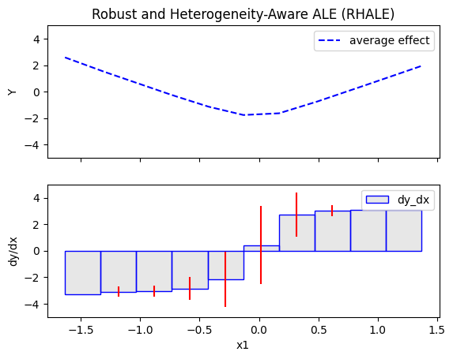
    


    
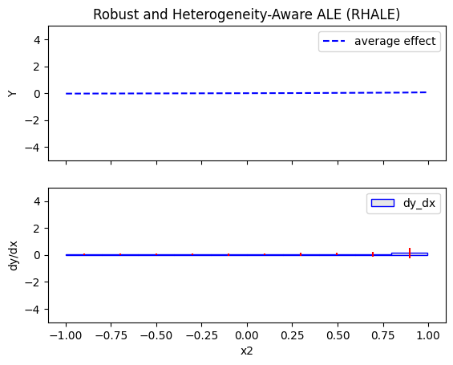
    


    

    


#### Regional RHALE


```python
regional_rhale = effector.RegionalRHALE(
    data=X_cor_train, 
    model=model_cor, 
    model_jac= model_cor_jac, 
    feature_names=['x1', 'x2', 'x3'],
    axis_limits=np.array([[-1, 1], [-1, 1], [-1, 1]]).T) 

binning_method = effector.axis_partitioning.Fixed(11, min_points_per_bin=0)
space_partitioner = effector.space_partitioning.Best(min_heterogeneity_decrease_pcg=0.6, numerical_features_grid_size=10)
regional_rhale.fit(
    features="all",
    space_partitioner=space_partitioner,
)
```

    100%|██████████| 3/3 [00:00<00:00, 21.03it/s]


```python
regional_rhale.summary(features=0)
```

    
    
    Feature 0 - Full partition tree:
    🌳 Full Tree Structure:
    ───────────────────────
    x1 🔹 [id: 0 | heter: 2.13 | inst: 900 | w: 1.00]
    --------------------------------------------------
    Feature 0 - Statistics per tree level:
    🌳 Tree Summary:
    ─────────────────
    Level 0🔹heter: 2.13
    
    


```python
regional_rhale.summary(features=1)
```

    
    
    Feature 1 - Full partition tree:
    🌳 Full Tree Structure:
    ───────────────────────
    x2 🔹 [id: 0 | heter: 0.03 | inst: 900 | w: 1.00]
    --------------------------------------------------
    Feature 1 - Statistics per tree level:
    🌳 Tree Summary:
    ─────────────────
    Level 0🔹heter: 0.03
    
    


```python
regional_rhale.summary(features=2)
```

    
    
    Feature 2 - Full partition tree:
    🌳 Full Tree Structure:
    ───────────────────────
    x3 🔹 [id: 0 | heter: 14.00 | inst: 900 | w: 1.00]
    --------------------------------------------------
    Feature 2 - Statistics per tree level:
    🌳 Tree Summary:
    ─────────────────
    Level 0🔹heter: 14.00
    
    


#### Conclusion

## SHAP DP
### Uncorrelated setting
#### Global SHAP DP


```python
shap = effector.ShapDP(data=X_uncor_train, model=model_uncor, feature_names=['x1', 'x2', 'x3'], target_name="Y")
binning_method = effector.axis_partitioning.Fixed(nof_bins=5, min_points_per_bin=0)
shap.fit(features="all", binning_method=binning_method, centering=True)
shap.plot(feature=0, centering=True, heterogeneity="shap_values", show_avg_output=False, y_limits=[-3, 3])
shap.plot(feature=1, centering=True, heterogeneity="shap_values", show_avg_output=False, y_limits=[-3, 3])
shap.plot(feature=2, centering=True, heterogeneity="shap_values", show_avg_output=False, y_limits=[-3, 3])

```


    
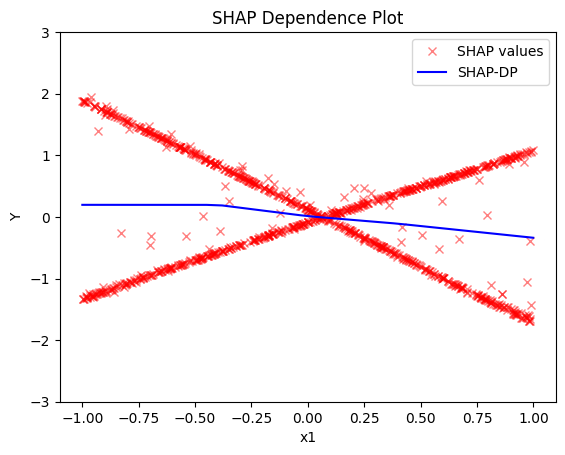
    


    

    


    
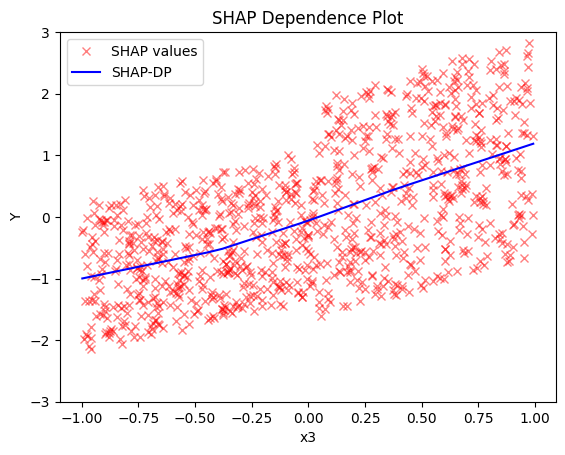
    


#### Regional SHAP-DP


```python
regional_shap = effector.RegionalShapDP(
    data=X_uncor_train,
    model=model_uncor,
    feature_names=['x1', 'x2', 'x3'],
    axis_limits=np.array([[-1, 1], [-1, 1], [-1, 1]]).T)

space_partitioner = effector.space_partitioning.Best(min_heterogeneity_decrease_pcg=0.6, numerical_features_grid_size=10)
regional_shap.fit(
    features="all",
    space_partitioner=space_partitioner,
    binning_method = effector.axis_partitioning.Fixed(nof_bins=5, min_points_per_bin=0)
)

```

    100%|██████████| 3/3 [00:02<00:00,  1.04it/s]


```python
regional_shap.summary(0)
```

    
    
    Feature 0 - Full partition tree:
    🌳 Full Tree Structure:
    ───────────────────────
    x1 🔹 [id: 0 | heter: 0.84 | inst: 1000 | w: 1.00]
        x3 ≤ 0.00 🔹 [id: 1 | heter: 0.04 | inst: 500 | w: 0.50]
        x3 > 0.00 🔹 [id: 2 | heter: 0.03 | inst: 500 | w: 0.50]
    --------------------------------------------------
    Feature 0 - Statistics per tree level:
    🌳 Tree Summary:
    ─────────────────
    Level 0🔹heter: 0.84
        Level 1🔹heter: 0.04 | 🔻0.80 (95.39%)
    
    


```python
regional_shap.plot(feature=0, node_idx=1, heterogeneity="std", centering=True, y_limits=[-5, 5])
regional_shap.plot(feature=0, node_idx=2, heterogeneity="std", centering=True, y_limits=[-5, 5])
```


    
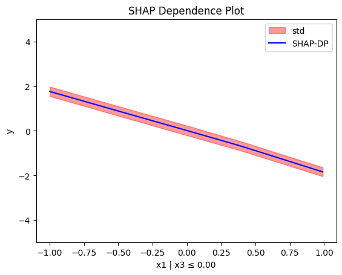
    


    
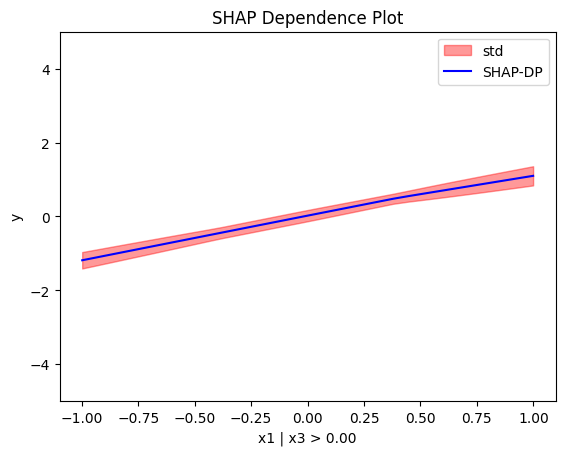
    


```python
regional_shap.summary(features=1)
```

    
    
    Feature 1 - Full partition tree:
    🌳 Full Tree Structure:
    ───────────────────────
    x2 🔹 [id: 0 | heter: 0.00 | inst: 1000 | w: 1.00]
    --------------------------------------------------
    Feature 1 - Statistics per tree level:
    🌳 Tree Summary:
    ─────────────────
    Level 0🔹heter: 0.00
    
    


```python
regional_shap.summary(features=2)
```

    
    
    Feature 2 - Full partition tree:
    🌳 Full Tree Structure:
    ───────────────────────
    x3 🔹 [id: 0 | heter: 0.79 | inst: 1000 | w: 1.00]
        x1 ≤ 0.00 🔹 [id: 1 | heter: 0.25 | inst: 494 | w: 0.49]
        x1 > 0.00 🔹 [id: 2 | heter: 0.37 | inst: 506 | w: 0.51]
    --------------------------------------------------
    Feature 2 - Statistics per tree level:
    🌳 Tree Summary:
    ─────────────────
    Level 0🔹heter: 0.79
        Level 1🔹heter: 0.31 | 🔻0.48 (60.80%)
    
    


#### Conclusion

### Correlated setting

#### Global SHAP-DP


```python

shap = effector.ShapDP(data=X_cor_train, model=model_cor, feature_names=['x1', 'x2', 'x3'], target_name="Y")
binning_method = effector.axis_partitioning.Fixed(nof_bins=5, min_points_per_bin=0)
shap.fit(features="all", binning_method=binning_method, centering=True)
shap.plot(feature=0, centering=True, heterogeneity="shap_values", show_avg_output=False, y_limits=[-3, 3])
shap.plot(feature=1, centering=True, heterogeneity="shap_values", show_avg_output=False, y_limits=[-3, 3])
shap.plot(feature=2, centering=True, heterogeneity="shap_values", show_avg_output=False, y_limits=[-3, 3])

```


    
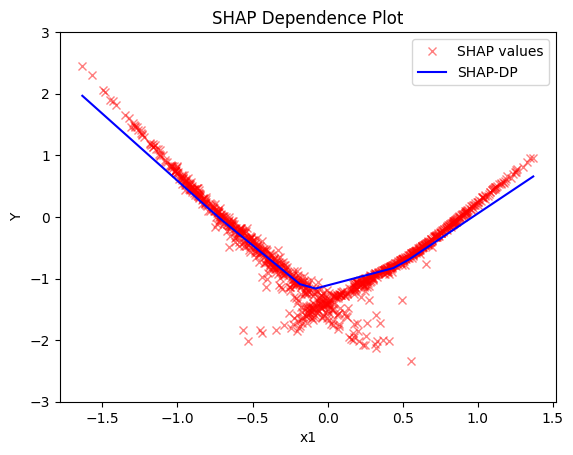
    


    
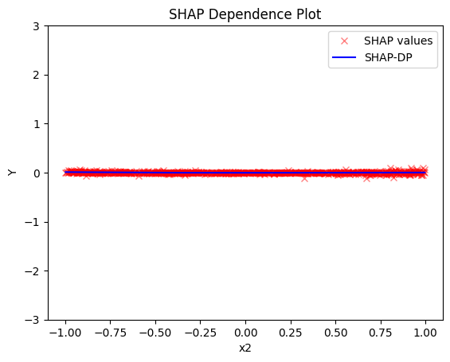
    


    
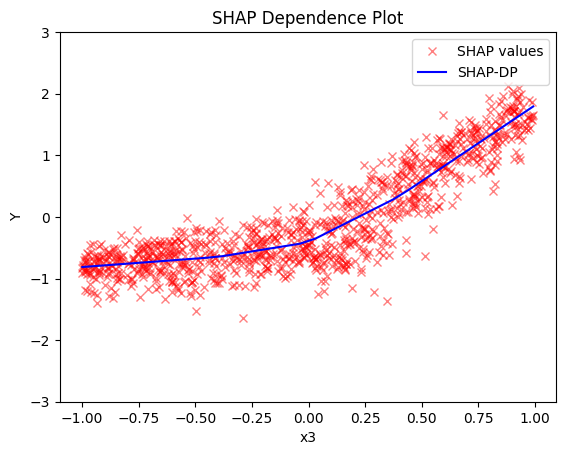
    


#### Regional SHAP


```python
regional_shap = effector.RegionalShapDP(
    data=X_cor_train,
    model=model_cor,
    feature_names=['x1', 'x2', 'x3'],
    axis_limits=np.array([[-1, 1], [-1, 1], [-1, 1]]).T)

space_partitioner = effector.space_partitioning.Best(min_heterogeneity_decrease_pcg=0.6, numerical_features_grid_size=10)
regional_shap.fit(
    features="all",
    space_partitioner=space_partitioner,
    binning_method = effector.axis_partitioning.Fixed(nof_bins=5, min_points_per_bin=0)
)
```

    100%|██████████| 3/3 [00:02<00:00,  1.17it/s]


```python
regional_shap.summary(0)
regional_shap.summary(1)
regional_shap.summary(2)
```

    
    
    Feature 0 - Full partition tree:
    🌳 Full Tree Structure:
    ───────────────────────
    x1 🔹 [id: 0 | heter: 0.08 | inst: 900 | w: 1.00]
    --------------------------------------------------
    Feature 0 - Statistics per tree level:
    🌳 Tree Summary:
    ─────────────────
    Level 0🔹heter: 0.08
    
    
    
    
    Feature 1 - Full partition tree:
    🌳 Full Tree Structure:
    ───────────────────────
    x2 🔹 [id: 0 | heter: 0.00 | inst: 900 | w: 1.00]
    --------------------------------------------------
    Feature 1 - Statistics per tree level:
    🌳 Tree Summary:
    ─────────────────
    Level 0🔹heter: 0.00
    
    
    
    
    Feature 2 - Full partition tree:
    🌳 Full Tree Structure:
    ───────────────────────
    x3 🔹 [id: 0 | heter: 0.11 | inst: 900 | w: 1.00]
    --------------------------------------------------
    Feature 2 - Statistics per tree level:
    🌳 Tree Summary:
    ─────────────────
    Level 0🔹heter: 0.11
    
    


#### Conclusion


```python

```
