# Regional Effects (unknown black-box function)

This tutorial use the same dataset with the previous [tutorial](./03_regional_effects_synthetic_f/), but instead of explaining the known (synthetic) predictive function, we fit a neural network on the data and explain the neural network. This is a more realistic scenario, since in real-world applications we do not know the underlying function and we only have access to the data. We advise the reader to first read the previous tutorial.


```python
import numpy as np
import effector
import keras
import tensorflow as tf

np.random.seed(12345)
tf.random.set_seed(12345)
```

    2025-02-26 11:26:23.961349: I tensorflow/core/platform/cpu_feature_guard.cc:210] This TensorFlow binary is optimized to use available CPU instructions in performance-critical operations.
    To enable the following instructions: AVX2 FMA, in other operations, rebuild TensorFlow with the appropriate compiler flags.


## Simulation example

### Data Generating Distribution

We will generate $N=500$ examples with $D=3$ features, which are in the uncorrelated setting all uniformly distributed as follows:

<center>

| Feature | Description                                | Distribution                 |
|---------|--------------------------------------------|------------------------------|
| $x_1$   | Uniformly distributed between $-1$ and $1$ | $x_1 \sim \mathcal{U}(-1,1)$ |
| $x_2$   | Uniformly distributed between $-1$ and $1$ | $x_2 \sim \mathcal{U}(-1,1)$ |
| $x_3$   | Uniformly distributed between $-1$ and $1$ | $x_3 \sim \mathcal{U}(-1,1)$ |

</center>

For the correlated setting we keep the distributional assumptions for $x_2$ and $x_3$ but define $x_1$ such that it is highly correlated with $x_3$ by: $x_1 = x_3 + \delta$ with $\delta \sim \mathcal{N}(0,0.0625)$.


```python
def generate_dataset_uncorrelated(N):
    x1 = np.random.uniform(-1, 1, size=N)
    x2 = np.random.uniform(-1, 1, size=N)
    x3 = np.random.uniform(-1, 1, size=N)
    return np.stack((x1, x2, x3), axis=-1)

def generate_dataset_correlated(N):
    x3 = np.random.uniform(-1, 1, size=N)
    x2 = np.random.uniform(-1, 1, size=N)
    x1 = x3 + np.random.normal(loc = np.zeros_like(x3), scale = 0.25)
    return np.stack((x1, x2, x3), axis=-1)

# generate the dataset for the uncorrelated and correlated setting
N = 1000
X_uncor_train = generate_dataset_uncorrelated(N)
X_uncor_test = generate_dataset_uncorrelated(10000)
X_cor_train = generate_dataset_correlated(N)
X_cor_test = generate_dataset_correlated(10000)
```

### Black-box function

We will use the following linear model with a subgroup-specific interaction term:
 $$ y = 3x_1I_{x_3>0} - 3x_1I_{x_3\leq0} + x_3$$ 
 
On a global level, there is a high heterogeneity for the features $x_1$ and $x_3$ due to their interaction with each other. However, this heterogeneity vanishes to 0 if the feature space is separated into subregions:

<center>

| Feature | Region      | Average Effect | Heterogeneity |
|---------|-------------|----------------|---------------|
| $x_1$   | $x_3>0$     | $3x_1$         | 0             |
| $x_1$   | $x_3\leq 0$ | $-3x_1$        | 0             |
| $x_2$   | all         | 0              | 0             |
| $x_3$   | $x_3>0$     | $x_3$          | 0             |
| $x_3$   | $x_3\leq 0$ | $x_3$          | 0             |

</center>


```python
def generate_target(X):
    f = np.where(X[:,2] > 0, 3*X[:,0] + X[:,2], -3*X[:,0] + X[:,2])
    epsilon = np.random.normal(loc = np.zeros_like(X[:,0]), scale = 0.1)
    Y = f + epsilon
    return(Y)

# generate target for uncorrelated and correlated setting
Y_uncor_train = generate_target(X_uncor_train)
Y_uncor_test = generate_target(X_uncor_test)
Y_cor_train = generate_target(X_cor_train)
Y_cor_test = generate_target(X_cor_test)      
```

### Fit a Neural Network

We create a two-layer feedforward Neural Network, a weight decay of 0.01 for 100 epochs. We train two instances of this NN, one on the uncorrelated and one on the correlated setting. In both cases, the NN achieves a Mean Squared Error of about $0.17$ units.


```python
# Train - Evaluate - Explain a neural network
model_uncor = keras.Sequential([
    keras.layers.Dense(10, activation="relu", input_shape=(3,)),
    keras.layers.Dense(10, activation="relu", input_shape=(3,)),
    keras.layers.Dense(1)
])

optimizer = keras.optimizers.Adam(learning_rate=0.01)
model_uncor.compile(optimizer=optimizer, loss="mse")
model_uncor.fit(X_uncor_train, Y_uncor_train, epochs=100)
model_uncor.evaluate(X_uncor_test, Y_uncor_test)
```

    Epoch 1/100


    /home/givasile/miniconda3/envs/effector-dev/lib/python3.10/site-packages/keras/src/layers/core/dense.py:87: UserWarning: Do not pass an `input_shape`/`input_dim` argument to a layer. When using Sequential models, prefer using an `Input(shape)` object as the first layer in the model instead.
      super().__init__(activity_regularizer=activity_regularizer, **kwargs)


    32/32 ━━━━━━━━━━━━━━━━━━━━ 1s 3ms/step - loss: 3.1056
    Epoch 2/100
    32/32 ━━━━━━━━━━━━━━━━━━━━ 0s 2ms/step - loss: 1.0435
    Epoch 3/100
    32/32 ━━━━━━━━━━━━━━━━━━━━ 0s 3ms/step - loss: 0.4445
    Epoch 4/100
    32/32 ━━━━━━━━━━━━━━━━━━━━ 0s 1ms/step - loss: 0.3043
    Epoch 5/100
    32/32 ━━━━━━━━━━━━━━━━━━━━ 0s 1ms/step - loss: 0.2314
    Epoch 6/100
    32/32 ━━━━━━━━━━━━━━━━━━━━ 0s 2ms/step - loss: 0.1921
    Epoch 7/100
    32/32 ━━━━━━━━━━━━━━━━━━━━ 0s 1ms/step - loss: 0.1674
    Epoch 8/100
    32/32 ━━━━━━━━━━━━━━━━━━━━ 0s 1ms/step - loss: 0.1468
    Epoch 9/100
    32/32 ━━━━━━━━━━━━━━━━━━━━ 0s 1ms/step - loss: 0.1294 
    Epoch 10/100
    32/32 ━━━━━━━━━━━━━━━━━━━━ 0s 1ms/step - loss: 0.1176
    Epoch 11/100
    32/32 ━━━━━━━━━━━━━━━━━━━━ 0s 910us/step - loss: 0.1098
    Epoch 12/100
    32/32 ━━━━━━━━━━━━━━━━━━━━ 0s 2ms/step - loss: 0.1042
    Epoch 13/100
    32/32 ━━━━━━━━━━━━━━━━━━━━ 0s 2ms/step - loss: 0.1007 
    Epoch 14/100
    32/32 ━━━━━━━━━━━━━━━━━━━━ 0s 1ms/step - loss: 0.0952
    Epoch 15/100
    32/32 ━━━━━━━━━━━━━━━━━━━━ 0s 2ms/step - loss: 0.0922
    Epoch 16/100
    32/32 ━━━━━━━━━━━━━━━━━━━━ 0s 2ms/step - loss: 0.0873
    Epoch 17/100
    32/32 ━━━━━━━━━━━━━━━━━━━━ 0s 959us/step - loss: 0.0801
    Epoch 18/100
    32/32 ━━━━━━━━━━━━━━━━━━━━ 0s 1ms/step - loss: 0.0775
    Epoch 19/100
    32/32 ━━━━━━━━━━━━━━━━━━━━ 0s 1ms/step - loss: 0.0741
    Epoch 20/100
    32/32 ━━━━━━━━━━━━━━━━━━━━ 0s 2ms/step - loss: 0.0710
    Epoch 21/100
    32/32 ━━━━━━━━━━━━━━━━━━━━ 0s 2ms/step - loss: 0.0689
    Epoch 22/100
    32/32 ━━━━━━━━━━━━━━━━━━━━ 0s 2ms/step - loss: 0.0675
    Epoch 23/100
    32/32 ━━━━━━━━━━━━━━━━━━━━ 0s 2ms/step - loss: 0.0663
    Epoch 24/100
    32/32 ━━━━━━━━━━━━━━━━━━━━ 0s 2ms/step - loss: 0.0656
    Epoch 25/100
    32/32 ━━━━━━━━━━━━━━━━━━━━ 0s 3ms/step - loss: 0.0647
    Epoch 26/100
    32/32 ━━━━━━━━━━━━━━━━━━━━ 0s 2ms/step - loss: 0.0633
    Epoch 27/100
    32/32 ━━━━━━━━━━━━━━━━━━━━ 0s 2ms/step - loss: 0.0629
    Epoch 28/100
    32/32 ━━━━━━━━━━━━━━━━━━━━ 0s 1ms/step - loss: 0.0632
    Epoch 29/100
    32/32 ━━━━━━━━━━━━━━━━━━━━ 0s 1ms/step - loss: 0.0624 
    Epoch 30/100
    32/32 ━━━━━━━━━━━━━━━━━━━━ 0s 1ms/step - loss: 0.0613
    Epoch 31/100
    32/32 ━━━━━━━━━━━━━━━━━━━━ 0s 2ms/step - loss: 0.0599
    Epoch 32/100
    32/32 ━━━━━━━━━━━━━━━━━━━━ 0s 1ms/step - loss: 0.0576
    Epoch 33/100
    32/32 ━━━━━━━━━━━━━━━━━━━━ 0s 2ms/step - loss: 0.0567
    Epoch 34/100
    32/32 ━━━━━━━━━━━━━━━━━━━━ 0s 1ms/step - loss: 0.0584
    Epoch 35/100
    32/32 ━━━━━━━━━━━━━━━━━━━━ 0s 3ms/step - loss: 0.0565
    Epoch 36/100
    32/32 ━━━━━━━━━━━━━━━━━━━━ 0s 2ms/step - loss: 0.0562
    Epoch 37/100
    32/32 ━━━━━━━━━━━━━━━━━━━━ 0s 1ms/step - loss: 0.0570
    Epoch 38/100
    32/32 ━━━━━━━━━━━━━━━━━━━━ 0s 1ms/step - loss: 0.0557
    Epoch 39/100
    32/32 ━━━━━━━━━━━━━━━━━━━━ 0s 2ms/step - loss: 0.0570
    Epoch 40/100
    32/32 ━━━━━━━━━━━━━━━━━━━━ 0s 2ms/step - loss: 0.0532 
    Epoch 41/100
    32/32 ━━━━━━━━━━━━━━━━━━━━ 0s 1ms/step - loss: 0.0558
    Epoch 42/100
    32/32 ━━━━━━━━━━━━━━━━━━━━ 0s 2ms/step - loss: 0.0554
    Epoch 43/100
    32/32 ━━━━━━━━━━━━━━━━━━━━ 0s 3ms/step - loss: 0.0547
    Epoch 44/100
    32/32 ━━━━━━━━━━━━━━━━━━━━ 0s 1ms/step - loss: 0.0543 
    Epoch 45/100
    32/32 ━━━━━━━━━━━━━━━━━━━━ 0s 2ms/step - loss: 0.0539
    Epoch 46/100
    32/32 ━━━━━━━━━━━━━━━━━━━━ 0s 1ms/step - loss: 0.0554
    Epoch 47/100
    32/32 ━━━━━━━━━━━━━━━━━━━━ 0s 1ms/step - loss: 0.0523
    Epoch 48/100
    32/32 ━━━━━━━━━━━━━━━━━━━━ 0s 1ms/step - loss: 0.0518
    Epoch 49/100
    32/32 ━━━━━━━━━━━━━━━━━━━━ 0s 1ms/step - loss: 0.0519
    Epoch 50/100
    32/32 ━━━━━━━━━━━━━━━━━━━━ 0s 1ms/step - loss: 0.0517
    Epoch 51/100
    32/32 ━━━━━━━━━━━━━━━━━━━━ 0s 1ms/step - loss: 0.0509
    Epoch 52/100
    32/32 ━━━━━━━━━━━━━━━━━━━━ 0s 2ms/step - loss: 0.0522
    Epoch 53/100
    32/32 ━━━━━━━━━━━━━━━━━━━━ 0s 1ms/step - loss: 0.0505
    Epoch 54/100
    32/32 ━━━━━━━━━━━━━━━━━━━━ 0s 1ms/step - loss: 0.0526
    Epoch 55/100
    32/32 ━━━━━━━━━━━━━━━━━━━━ 0s 1ms/step - loss: 0.0535
    Epoch 56/100
    32/32 ━━━━━━━━━━━━━━━━━━━━ 0s 1ms/step - loss: 0.0526
    Epoch 57/100
    32/32 ━━━━━━━━━━━━━━━━━━━━ 0s 1ms/step - loss: 0.0505
    Epoch 58/100
    32/32 ━━━━━━━━━━━━━━━━━━━━ 0s 1ms/step - loss: 0.0503
    Epoch 59/100
    32/32 ━━━━━━━━━━━━━━━━━━━━ 0s 956us/step - loss: 0.0497
    Epoch 60/100
    32/32 ━━━━━━━━━━━━━━━━━━━━ 0s 1ms/step - loss: 0.0491
    Epoch 61/100
    32/32 ━━━━━━━━━━━━━━━━━━━━ 0s 1ms/step - loss: 0.0497
    Epoch 62/100
    32/32 ━━━━━━━━━━━━━━━━━━━━ 0s 1ms/step - loss: 0.0496
    Epoch 63/100
    32/32 ━━━━━━━━━━━━━━━━━━━━ 0s 1ms/step - loss: 0.0482
    Epoch 64/100
    32/32 ━━━━━━━━━━━━━━━━━━━━ 0s 1ms/step - loss: 0.0465
    Epoch 65/100
    32/32 ━━━━━━━━━━━━━━━━━━━━ 0s 959us/step - loss: 0.0473
    Epoch 66/100
    32/32 ━━━━━━━━━━━━━━━━━━━━ 0s 1ms/step - loss: 0.0476
    Epoch 67/100
    32/32 ━━━━━━━━━━━━━━━━━━━━ 0s 1ms/step - loss: 0.0461
    Epoch 68/100
    32/32 ━━━━━━━━━━━━━━━━━━━━ 0s 909us/step - loss: 0.0462
    Epoch 69/100
    32/32 ━━━━━━━━━━━━━━━━━━━━ 0s 839us/step - loss: 0.0459
    Epoch 70/100
    32/32 ━━━━━━━━━━━━━━━━━━━━ 0s 857us/step - loss: 0.0453
    Epoch 71/100
    32/32 ━━━━━━━━━━━━━━━━━━━━ 0s 999us/step - loss: 0.0448
    Epoch 72/100
    32/32 ━━━━━━━━━━━━━━━━━━━━ 0s 963us/step - loss: 0.0435
    Epoch 73/100
    32/32 ━━━━━━━━━━━━━━━━━━━━ 0s 997us/step - loss: 0.0452
    Epoch 74/100
    32/32 ━━━━━━━━━━━━━━━━━━━━ 0s 955us/step - loss: 0.0434
    Epoch 75/100
    32/32 ━━━━━━━━━━━━━━━━━━━━ 0s 934us/step - loss: 0.0454
    Epoch 76/100
    32/32 ━━━━━━━━━━━━━━━━━━━━ 0s 910us/step - loss: 0.0434
    Epoch 77/100
    32/32 ━━━━━━━━━━━━━━━━━━━━ 0s 1ms/step - loss: 0.0439
    Epoch 78/100
    32/32 ━━━━━━━━━━━━━━━━━━━━ 0s 1ms/step - loss: 0.0431
    Epoch 79/100
    32/32 ━━━━━━━━━━━━━━━━━━━━ 0s 917us/step - loss: 0.0434
    Epoch 80/100
    32/32 ━━━━━━━━━━━━━━━━━━━━ 0s 899us/step - loss: 0.0431
    Epoch 81/100
    32/32 ━━━━━━━━━━━━━━━━━━━━ 0s 1ms/step - loss: 0.0425
    Epoch 82/100
    32/32 ━━━━━━━━━━━━━━━━━━━━ 0s 935us/step - loss: 0.0423
    Epoch 83/100
    32/32 ━━━━━━━━━━━━━━━━━━━━ 0s 1ms/step - loss: 0.0416
    Epoch 84/100
    32/32 ━━━━━━━━━━━━━━━━━━━━ 0s 1ms/step - loss: 0.0420
    Epoch 85/100
    32/32 ━━━━━━━━━━━━━━━━━━━━ 0s 1ms/step - loss: 0.0412
    Epoch 86/100
    32/32 ━━━━━━━━━━━━━━━━━━━━ 0s 1ms/step - loss: 0.0416
    Epoch 87/100
    32/32 ━━━━━━━━━━━━━━━━━━━━ 0s 1ms/step - loss: 0.0406
    Epoch 88/100
    32/32 ━━━━━━━━━━━━━━━━━━━━ 0s 1ms/step - loss: 0.0404
    Epoch 89/100
    32/32 ━━━━━━━━━━━━━━━━━━━━ 0s 986us/step - loss: 0.0414
    Epoch 90/100
    32/32 ━━━━━━━━━━━━━━━━━━━━ 0s 1ms/step - loss: 0.0401
    Epoch 91/100
    32/32 ━━━━━━━━━━━━━━━━━━━━ 0s 983us/step - loss: 0.0391
    Epoch 92/100
    32/32 ━━━━━━━━━━━━━━━━━━━━ 0s 1ms/step - loss: 0.0405
    Epoch 93/100
    32/32 ━━━━━━━━━━━━━━━━━━━━ 0s 927us/step - loss: 0.0394
    Epoch 94/100
    32/32 ━━━━━━━━━━━━━━━━━━━━ 0s 858us/step - loss: 0.0396
    Epoch 95/100
    32/32 ━━━━━━━━━━━━━━━━━━━━ 0s 847us/step - loss: 0.0383
    Epoch 96/100
    32/32 ━━━━━━━━━━━━━━━━━━━━ 0s 895us/step - loss: 0.0384
    Epoch 97/100
    32/32 ━━━━━━━━━━━━━━━━━━━━ 0s 840us/step - loss: 0.0381
    Epoch 98/100
    32/32 ━━━━━━━━━━━━━━━━━━━━ 0s 896us/step - loss: 0.0386
    Epoch 99/100
    32/32 ━━━━━━━━━━━━━━━━━━━━ 0s 875us/step - loss: 0.0378
    Epoch 100/100
    32/32 ━━━━━━━━━━━━━━━━━━━━ 0s 938us/step - loss: 0.0391
    313/313 ━━━━━━━━━━━━━━━━━━━━ 0s 745us/step - loss: 0.0631


    0.0614858940243721


```python
model_cor = keras.Sequential([
    keras.layers.Dense(10, activation="relu", input_shape=(3,)),
    keras.layers.Dense(10, activation="relu", input_shape=(3,)),
    keras.layers.Dense(1)
])

optimizer = keras.optimizers.Adam(learning_rate=0.01)
model_cor.compile(optimizer=optimizer, loss="mse")
model_cor.fit(X_cor_train, Y_cor_train, epochs=100)
model_cor.evaluate(X_cor_test, Y_cor_test)
```

    Epoch 1/100
    32/32 ━━━━━━━━━━━━━━━━━━━━ 1s 959us/step - loss: 2.1464
    Epoch 2/100
    32/32 ━━━━━━━━━━━━━━━━━━━━ 0s 989us/step - loss: 0.4442
    Epoch 3/100
    32/32 ━━━━━━━━━━━━━━━━━━━━ 0s 915us/step - loss: 0.2055
    Epoch 4/100
    32/32 ━━━━━━━━━━━━━━━━━━━━ 0s 1ms/step - loss: 0.1394
    Epoch 5/100
    32/32 ━━━━━━━━━━━━━━━━━━━━ 0s 978us/step - loss: 0.1068
    Epoch 6/100
    32/32 ━━━━━━━━━━━━━━━━━━━━ 0s 1ms/step - loss: 0.0945
    Epoch 7/100
    32/32 ━━━━━━━━━━━━━━━━━━━━ 0s 771us/step - loss: 0.0892
    Epoch 8/100
    32/32 ━━━━━━━━━━━━━━━━━━━━ 0s 929us/step - loss: 0.0851
    Epoch 9/100
    32/32 ━━━━━━━━━━━━━━━━━━━━ 0s 971us/step - loss: 0.0818
    Epoch 10/100
    32/32 ━━━━━━━━━━━━━━━━━━━━ 0s 863us/step - loss: 0.0795
    Epoch 11/100
    32/32 ━━━━━━━━━━━━━━━━━━━━ 0s 908us/step - loss: 0.0759
    Epoch 12/100
    32/32 ━━━━━━━━━━━━━━━━━━━━ 0s 869us/step - loss: 0.0731
    Epoch 13/100
    32/32 ━━━━━━━━━━━━━━━━━━━━ 0s 959us/step - loss: 0.0707
    Epoch 14/100
    32/32 ━━━━━━━━━━━━━━━━━━━━ 0s 964us/step - loss: 0.0684
    Epoch 15/100
    32/32 ━━━━━━━━━━━━━━━━━━━━ 0s 870us/step - loss: 0.0667
    Epoch 16/100
    32/32 ━━━━━━━━━━━━━━━━━━━━ 0s 1ms/step - loss: 0.0645
    Epoch 17/100
    32/32 ━━━━━━━━━━━━━━━━━━━━ 0s 916us/step - loss: 0.0624
    Epoch 18/100
    32/32 ━━━━━━━━━━━━━━━━━━━━ 0s 852us/step - loss: 0.0587
    Epoch 19/100
    32/32 ━━━━━━━━━━━━━━━━━━━━ 0s 800us/step - loss: 0.0563
    Epoch 20/100
    32/32 ━━━━━━━━━━━━━━━━━━━━ 0s 1ms/step - loss: 0.0526
    Epoch 21/100
    32/32 ━━━━━━━━━━━━━━━━━━━━ 0s 821us/step - loss: 0.0513
    Epoch 22/100
    32/32 ━━━━━━━━━━━━━━━━━━━━ 0s 798us/step - loss: 0.0498
    Epoch 23/100
    32/32 ━━━━━━━━━━━━━━━━━━━━ 0s 793us/step - loss: 0.0481
    Epoch 24/100
    32/32 ━━━━━━━━━━━━━━━━━━━━ 0s 766us/step - loss: 0.0457
    Epoch 25/100
    32/32 ━━━━━━━━━━━━━━━━━━━━ 0s 816us/step - loss: 0.0445
    Epoch 26/100
    32/32 ━━━━━━━━━━━━━━━━━━━━ 0s 865us/step - loss: 0.0424
    Epoch 27/100
    32/32 ━━━━━━━━━━━━━━━━━━━━ 0s 968us/step - loss: 0.0416
    Epoch 28/100
    32/32 ━━━━━━━━━━━━━━━━━━━━ 0s 1ms/step - loss: 0.0382
    Epoch 29/100
    32/32 ━━━━━━━━━━━━━━━━━━━━ 0s 972us/step - loss: 0.0372
    Epoch 30/100
    32/32 ━━━━━━━━━━━━━━━━━━━━ 0s 929us/step - loss: 0.0372
    Epoch 31/100
    32/32 ━━━━━━━━━━━━━━━━━━━━ 0s 806us/step - loss: 0.0358
    Epoch 32/100
    32/32 ━━━━━━━━━━━━━━━━━━━━ 0s 913us/step - loss: 0.0340
    Epoch 33/100
    32/32 ━━━━━━━━━━━━━━━━━━━━ 0s 953us/step - loss: 0.0330
    Epoch 34/100
    32/32 ━━━━━━━━━━━━━━━━━━━━ 0s 925us/step - loss: 0.0313
    Epoch 35/100
    32/32 ━━━━━━━━━━━━━━━━━━━━ 0s 861us/step - loss: 0.0308
    Epoch 36/100
    32/32 ━━━━━━━━━━━━━━━━━━━━ 0s 898us/step - loss: 0.0298
    Epoch 37/100
    32/32 ━━━━━━━━━━━━━━━━━━━━ 0s 827us/step - loss: 0.0290
    Epoch 38/100
    32/32 ━━━━━━━━━━━━━━━━━━━━ 0s 993us/step - loss: 0.0283
    Epoch 39/100
    32/32 ━━━━━━━━━━━━━━━━━━━━ 0s 803us/step - loss: 0.0282
    Epoch 40/100
    32/32 ━━━━━━━━━━━━━━━━━━━━ 0s 933us/step - loss: 0.0269
    Epoch 41/100
    32/32 ━━━━━━━━━━━━━━━━━━━━ 0s 822us/step - loss: 0.0263
    Epoch 42/100
    32/32 ━━━━━━━━━━━━━━━━━━━━ 0s 841us/step - loss: 0.0274
    Epoch 43/100
    32/32 ━━━━━━━━━━━━━━━━━━━━ 0s 836us/step - loss: 0.0272
    Epoch 44/100
    32/32 ━━━━━━━━━━━━━━━━━━━━ 0s 810us/step - loss: 0.0259
    Epoch 45/100
    32/32 ━━━━━━━━━━━━━━━━━━━━ 0s 764us/step - loss: 0.0245
    Epoch 46/100
    32/32 ━━━━━━━━━━━━━━━━━━━━ 0s 866us/step - loss: 0.0252
    Epoch 47/100
    32/32 ━━━━━━━━━━━━━━━━━━━━ 0s 798us/step - loss: 0.0248
    Epoch 48/100
    32/32 ━━━━━━━━━━━━━━━━━━━━ 0s 808us/step - loss: 0.0246
    Epoch 49/100
    32/32 ━━━━━━━━━━━━━━━━━━━━ 0s 865us/step - loss: 0.0242
    Epoch 50/100
    32/32 ━━━━━━━━━━━━━━━━━━━━ 0s 881us/step - loss: 0.0231
    Epoch 51/100
    32/32 ━━━━━━━━━━━━━━━━━━━━ 0s 739us/step - loss: 0.0227
    Epoch 52/100
    32/32 ━━━━━━━━━━━━━━━━━━━━ 0s 784us/step - loss: 0.0218
    Epoch 53/100
    32/32 ━━━━━━━━━━━━━━━━━━━━ 0s 846us/step - loss: 0.0227
    Epoch 54/100
    32/32 ━━━━━━━━━━━━━━━━━━━━ 0s 777us/step - loss: 0.0228
    Epoch 55/100
    32/32 ━━━━━━━━━━━━━━━━━━━━ 0s 767us/step - loss: 0.0227
    Epoch 56/100
    32/32 ━━━━━━━━━━━━━━━━━━━━ 0s 778us/step - loss: 0.0215
    Epoch 57/100
    32/32 ━━━━━━━━━━━━━━━━━━━━ 0s 808us/step - loss: 0.0216
    Epoch 58/100
    32/32 ━━━━━━━━━━━━━━━━━━━━ 0s 831us/step - loss: 0.0227
    Epoch 59/100
    32/32 ━━━━━━━━━━━━━━━━━━━━ 0s 1ms/step - loss: 0.0212
    Epoch 60/100
    32/32 ━━━━━━━━━━━━━━━━━━━━ 0s 768us/step - loss: 0.0213
    Epoch 61/100
    32/32 ━━━━━━━━━━━━━━━━━━━━ 0s 830us/step - loss: 0.0206
    Epoch 62/100
    32/32 ━━━━━━━━━━━━━━━━━━━━ 0s 862us/step - loss: 0.0203
    Epoch 63/100
    32/32 ━━━━━━━━━━━━━━━━━━━━ 0s 868us/step - loss: 0.0201
    Epoch 64/100
    32/32 ━━━━━━━━━━━━━━━━━━━━ 0s 795us/step - loss: 0.0202
    Epoch 65/100
    32/32 ━━━━━━━━━━━━━━━━━━━━ 0s 930us/step - loss: 0.0205
    Epoch 66/100
    32/32 ━━━━━━━━━━━━━━━━━━━━ 0s 989us/step - loss: 0.0200
    Epoch 67/100
    32/32 ━━━━━━━━━━━━━━━━━━━━ 0s 806us/step - loss: 0.0205
    Epoch 68/100
    32/32 ━━━━━━━━━━━━━━━━━━━━ 0s 856us/step - loss: 0.0202
    Epoch 69/100
    32/32 ━━━━━━━━━━━━━━━━━━━━ 0s 797us/step - loss: 0.0199
    Epoch 70/100
    32/32 ━━━━━━━━━━━━━━━━━━━━ 0s 763us/step - loss: 0.0191
    Epoch 71/100
    32/32 ━━━━━━━━━━━━━━━━━━━━ 0s 801us/step - loss: 0.0194
    Epoch 72/100
    32/32 ━━━━━━━━━━━━━━━━━━━━ 0s 876us/step - loss: 0.0198
    Epoch 73/100
    32/32 ━━━━━━━━━━━━━━━━━━━━ 0s 805us/step - loss: 0.0197
    Epoch 74/100
    32/32 ━━━━━━━━━━━━━━━━━━━━ 0s 813us/step - loss: 0.0191
    Epoch 75/100
    32/32 ━━━━━━━━━━━━━━━━━━━━ 0s 794us/step - loss: 0.0190
    Epoch 76/100
    32/32 ━━━━━━━━━━━━━━━━━━━━ 0s 784us/step - loss: 0.0199
    Epoch 77/100
    32/32 ━━━━━━━━━━━━━━━━━━━━ 0s 766us/step - loss: 0.0200
    Epoch 78/100
    32/32 ━━━━━━━━━━━━━━━━━━━━ 0s 772us/step - loss: 0.0182
    Epoch 79/100
    32/32 ━━━━━━━━━━━━━━━━━━━━ 0s 817us/step - loss: 0.0193
    Epoch 80/100
    32/32 ━━━━━━━━━━━━━━━━━━━━ 0s 985us/step - loss: 0.0193
    Epoch 81/100
    32/32 ━━━━━━━━━━━━━━━━━━━━ 0s 992us/step - loss: 0.0186
    Epoch 82/100
    32/32 ━━━━━━━━━━━━━━━━━━━━ 0s 816us/step - loss: 0.0183
    Epoch 83/100
    32/32 ━━━━━━━━━━━━━━━━━━━━ 0s 812us/step - loss: 0.0190
    Epoch 84/100
    32/32 ━━━━━━━━━━━━━━━━━━━━ 0s 816us/step - loss: 0.0194
    Epoch 85/100
    32/32 ━━━━━━━━━━━━━━━━━━━━ 0s 849us/step - loss: 0.0182
    Epoch 86/100
    32/32 ━━━━━━━━━━━━━━━━━━━━ 0s 804us/step - loss: 0.0183
    Epoch 87/100
    32/32 ━━━━━━━━━━━━━━━━━━━━ 0s 813us/step - loss: 0.0187
    Epoch 88/100
    32/32 ━━━━━━━━━━━━━━━━━━━━ 0s 799us/step - loss: 0.0191
    Epoch 89/100
    32/32 ━━━━━━━━━━━━━━━━━━━━ 0s 802us/step - loss: 0.0178
    Epoch 90/100
    32/32 ━━━━━━━━━━━━━━━━━━━━ 0s 840us/step - loss: 0.0178
    Epoch 91/100
    32/32 ━━━━━━━━━━━━━━━━━━━━ 0s 848us/step - loss: 0.0184
    Epoch 92/100
    32/32 ━━━━━━━━━━━━━━━━━━━━ 0s 1ms/step - loss: 0.0176
    Epoch 93/100
    32/32 ━━━━━━━━━━━━━━━━━━━━ 0s 915us/step - loss: 0.0185
    Epoch 94/100
    32/32 ━━━━━━━━━━━━━━━━━━━━ 0s 1ms/step - loss: 0.0177
    Epoch 95/100
    32/32 ━━━━━━━━━━━━━━━━━━━━ 0s 955us/step - loss: 0.0179
    Epoch 96/100
    32/32 ━━━━━━━━━━━━━━━━━━━━ 0s 790us/step - loss: 0.0179
    Epoch 97/100
    32/32 ━━━━━━━━━━━━━━━━━━━━ 0s 760us/step - loss: 0.0178
    Epoch 98/100
    32/32 ━━━━━━━━━━━━━━━━━━━━ 0s 762us/step - loss: 0.0177
    Epoch 99/100
    32/32 ━━━━━━━━━━━━━━━━━━━━ 0s 777us/step - loss: 0.0178
    Epoch 100/100
    32/32 ━━━━━━━━━━━━━━━━━━━━ 0s 769us/step - loss: 0.0178
    313/313 ━━━━━━━━━━━━━━━━━━━━ 0s 627us/step - loss: 0.0250


    0.023643650114536285


---
## PDP
### Uncorrelated setting
#### Global PDP


```python
pdp = effector.PDP(data=X_uncor_train, model=model_uncor, feature_names=['x1','x2','x3'], target_name="Y")
pdp.plot(feature=0, centering=True, show_avg_output=False, heterogeneity="ice", y_limits=[-5, 5])
pdp.plot(feature=1, centering=True, show_avg_output=False, heterogeneity="ice", y_limits=[-5, 5])
pdp.plot(feature=2, centering=True, show_avg_output=False, heterogeneity="ice", y_limits=[-5, 5])
```


    
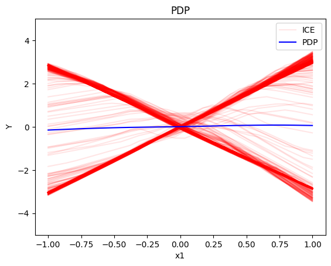
    


    
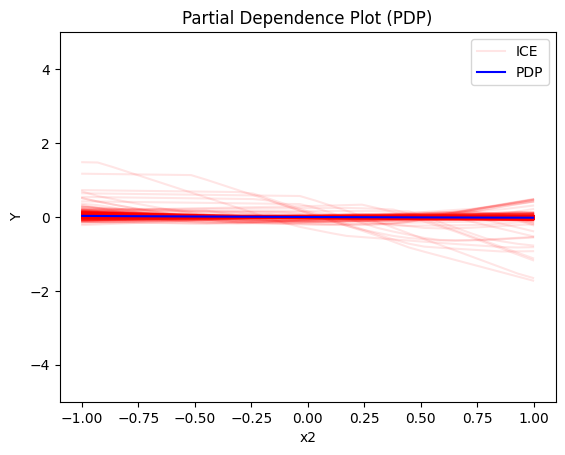
    


    

    


#### Regional PDP


```python
regional_pdp = effector.RegionalPDP(data=X_uncor_train, model=model_uncor, feature_names=['x1','x2','x3'], axis_limits=np.array([[-1,1],[-1,1],[-1,1]]).T)
space_partitioner = effector.space_partitioning.Best(min_heterogeneity_decrease_pcg=0.3, numerical_features_grid_size=10)
regional_pdp.fit(features="all", space_partitioner=space_partitioner)
```

    100%|██████████| 3/3 [00:00<00:00, 39.83it/s]


```python
regional_pdp.summary(features=0)
```

    
    
    Feature 0 - Full partition tree:
    🌳 Full Tree Structure:
    ───────────────────────
    x1 🔹 [id: 0 | heter: 3.38 | inst: 1000 | w: 1.00]
        x3 ≤ 0.00 🔹 [id: 1 | heter: 0.10 | inst: 500 | w: 0.50]
        x3 > 0.00 🔹 [id: 2 | heter: 0.16 | inst: 500 | w: 0.50]
    --------------------------------------------------
    Feature 0 - Statistics per tree level:
    🌳 Tree Summary:
    ─────────────────
    Level 0🔹heter: 3.38
        Level 1🔹heter: 0.13 | 🔻3.26 (96.20%)
    
    


```python
regional_pdp.plot(feature=0, node_idx=1, heterogeneity="ice", y_limits=[-5, 5])
regional_pdp.plot(feature=0, node_idx=2, heterogeneity="ice", y_limits=[-5, 5])
```


    

    


    
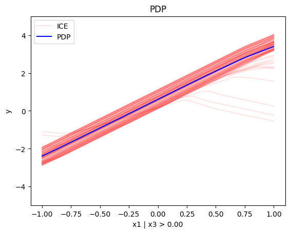
    


```python
regional_pdp.summary(features=1)
```

    
    
    Feature 1 - Full partition tree:
    🌳 Full Tree Structure:
    ───────────────────────
    x2 🔹 [id: 0 | heter: 3.22 | inst: 1000 | w: 1.00]
    --------------------------------------------------
    Feature 1 - Statistics per tree level:
    🌳 Tree Summary:
    ─────────────────
    Level 0🔹heter: 3.22
    
    


```python
regional_pdp.summary(features=2)
```

    
    
    Feature 2 - Full partition tree:
    🌳 Full Tree Structure:
    ───────────────────────
    x3 🔹 [id: 0 | heter: 2.90 | inst: 1000 | w: 1.00]
        x1 ≤ 0.00 🔹 [id: 1 | heter: 0.71 | inst: 494 | w: 0.49]
        x1 > 0.00 🔹 [id: 2 | heter: 0.71 | inst: 506 | w: 0.51]
    --------------------------------------------------
    Feature 2 - Statistics per tree level:
    🌳 Tree Summary:
    ─────────────────
    Level 0🔹heter: 2.90
        Level 1🔹heter: 0.71 | 🔻2.19 (75.41%)
    
    


```python
regional_pdp.plot(feature=2, node_idx=1, heterogeneity="ice", centering=True, y_limits=[-5, 5])
regional_pdp.plot(feature=2, node_idx=2, heterogeneity="ice", centering=True, y_limits=[-5, 5])
```


    

    


    
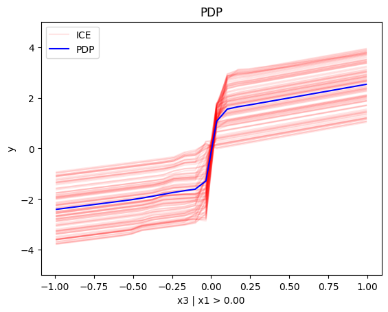
    


#### Conclusion

For the Global PDP:

   * the average effect of $x_1$ is $0$ with some heterogeneity implied by the interaction with $x_1$. The heterogeneity is expressed with two opposite lines; $-3x_1$ when $x_1 \leq 0$ and $3x_1$ when $x_1 >0$
   * the average effect of $x_2$ to be $0$ without heterogeneity
   * the average effect of $x_3$ to be $x_3$ with some heterogeneity due to the interaction with $x_1$. The heterogeneity is expressed with a discontinuity around $x_3=0$, with either a positive or a negative offset depending on the value of $x_1^i$

--- 

For the Regional PDP:

* For $x_1$, the algorithm finds two regions, one for $x_3 \leq 0$ and one for $x_3 > 0$
  * when $x_3>0$ the effect is $3x_1$
  * when $x_3 \leq 0$, the effect is $-3x_1$
* For $x_2$ the algorithm does not find any subregion 
* For $x_3$, there is a change in the offset:
  * when $x_1>0$ the line is $x_3 - 3x_1^i$ in the first half and $x_3 + 3x_1^i$ later
  * when $x_1<0$ the line is $x_3 + 3x_1^i$ in the first half and $x_3 - 3x_1^i$ later

### Correlated setting


#### Global PDP


```python
pdp = effector.PDP(data=X_cor_train, model=model_cor, feature_names=['x1','x2','x3'], target_name="Y")
pdp.plot(feature=0, centering=True, show_avg_output=False, heterogeneity="ice", y_limits=[-5, 5])
pdp.plot(feature=1, centering=True, show_avg_output=False, heterogeneity="ice", y_limits=[-5, 5])
pdp.plot(feature=2, centering=True, show_avg_output=False, heterogeneity="ice", y_limits=[-5, 5])
```


    
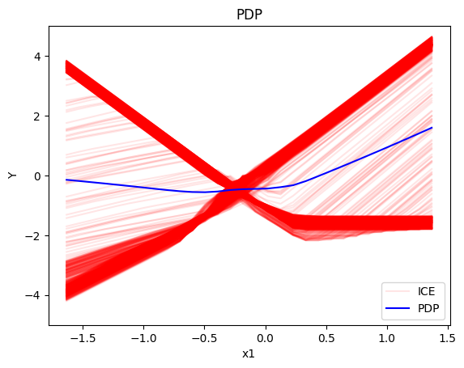
    


    

    


    
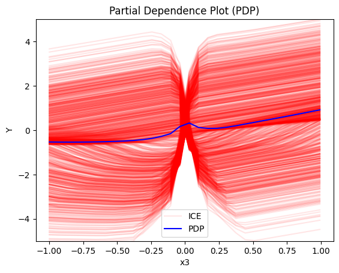
    


#### Regional-PDP


```python
regional_pdp = effector.RegionalPDP(data=X_cor_train, model=model_cor, feature_names=['x1','x2','x3'], axis_limits=np.array([[-1,1],[-1,1],[-1,1]]).T)
space_partitioner = effector.space_partitioning.Best(min_heterogeneity_decrease_pcg=0.4, numerical_features_grid_size=10)
regional_pdp.fit(features="all", space_partitioner=space_partitioner)
```

    100%|██████████| 3/3 [00:00<00:00, 54.75it/s]


```python
regional_pdp.summary(features=0)
```

    
    
    Feature 0 - Full partition tree:
    🌳 Full Tree Structure:
    ───────────────────────
    x1 🔹 [id: 0 | heter: 3.25 | inst: 900 | w: 1.00]
        x3 ≤ 0.00 🔹 [id: 1 | heter: 0.17 | inst: 436 | w: 0.48]
        x3 > 0.00 🔹 [id: 2 | heter: 0.20 | inst: 464 | w: 0.52]
    --------------------------------------------------
    Feature 0 - Statistics per tree level:
    🌳 Tree Summary:
    ─────────────────
    Level 0🔹heter: 3.25
        Level 1🔹heter: 0.18 | 🔻3.07 (94.40%)
    
    


```python
regional_pdp.plot(feature=0, node_idx=1, heterogeneity="ice", centering=True, y_limits=[-5, 5])
regional_pdp.plot(feature=0, node_idx=2, heterogeneity="ice", centering=True, y_limits=[-5, 5])
```


    
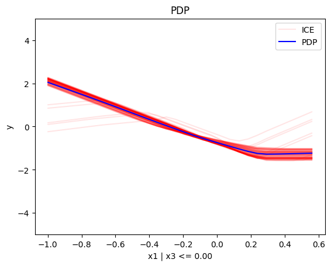
    


    
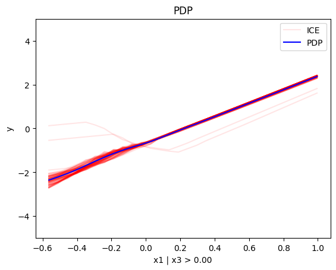
    


```python
regional_pdp.summary(features=1)
```

    
    
    Feature 1 - Full partition tree:
    🌳 Full Tree Structure:
    ───────────────────────
    x2 🔹 [id: 0 | heter: 1.22 | inst: 900 | w: 1.00]
        x1 ≤ 0.40 🔹 [id: 1 | heter: 0.57 | inst: 652 | w: 0.72]
        x1 > 0.40 🔹 [id: 2 | heter: 0.55 | inst: 248 | w: 0.28]
    --------------------------------------------------
    Feature 1 - Statistics per tree level:
    🌳 Tree Summary:
    ─────────────────
    Level 0🔹heter: 1.22
        Level 1🔹heter: 0.56 | 🔻0.66 (54.17%)
    
    


```python
regional_pdp.summary(features=2)
```

    
    
    Feature 2 - Full partition tree:
    🌳 Full Tree Structure:
    ───────────────────────
    x3 🔹 [id: 0 | heter: 2.44 | inst: 900 | w: 1.00]
        x1 ≤ 0.00 🔹 [id: 1 | heter: 0.74 | inst: 463 | w: 0.51]
        x1 > 0.00 🔹 [id: 2 | heter: 0.81 | inst: 437 | w: 0.49]
    --------------------------------------------------
    Feature 2 - Statistics per tree level:
    🌳 Tree Summary:
    ─────────────────
    Level 0🔹heter: 2.44
        Level 1🔹heter: 0.77 | 🔻1.67 (68.34%)
    
    


```python
regional_pdp.plot(feature=2, node_idx=1, heterogeneity="ice", centering=True, y_limits=[-5, 5])
regional_pdp.plot(feature=2, node_idx=2, heterogeneity="ice", centering=True, y_limits=[-5, 5])
```


    
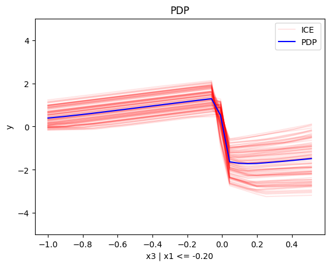
    


    
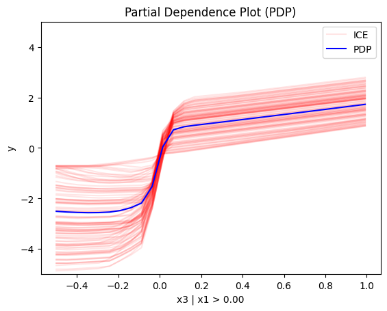
    


#### Conclusion

## (RH)ALE


```python
def model_uncor_jac(x):
    x_tensor = tf.convert_to_tensor(x, dtype=tf.float32)
    with tf.GradientTape() as t:
        t.watch(x_tensor)
        pred = model_uncor(x_tensor)
        grads = t.gradient(pred, x_tensor)
    return grads.numpy()

def model_cor_jac(x):
    x_tensor = tf.convert_to_tensor(x, dtype=tf.float32)
    with tf.GradientTape() as t:
        t.watch(x_tensor)
        pred = model_cor(x_tensor)
        grads = t.gradient(pred, x_tensor)
    return grads.numpy()
```

### Uncorrelated setting

#### Global RHALE


```python
rhale = effector.RHALE(data=X_uncor_train, model=model_uncor, model_jac=model_uncor_jac, feature_names=['x1','x2','x3'], target_name="Y")

binning_method = effector.axis_partitioning.Fixed(10, min_points_per_bin=0)
rhale.fit(features="all", binning_method=binning_method, centering=True)

rhale.plot(feature=0, centering=True, heterogeneity="std", show_avg_output=False, y_limits=[-5, 5], dy_limits=[-5, 5])
rhale.plot(feature=1, centering=True, heterogeneity="std", show_avg_output=False, y_limits=[-5, 5], dy_limits=[-5, 5])
rhale.plot(feature=2, centering=True, heterogeneity="std", show_avg_output=False, y_limits=[-5, 5], dy_limits=[-5, 5])
```


    
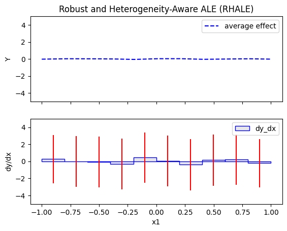
    


    
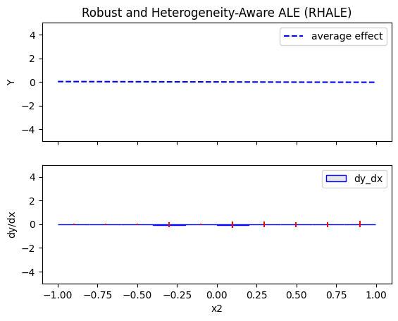
    


    
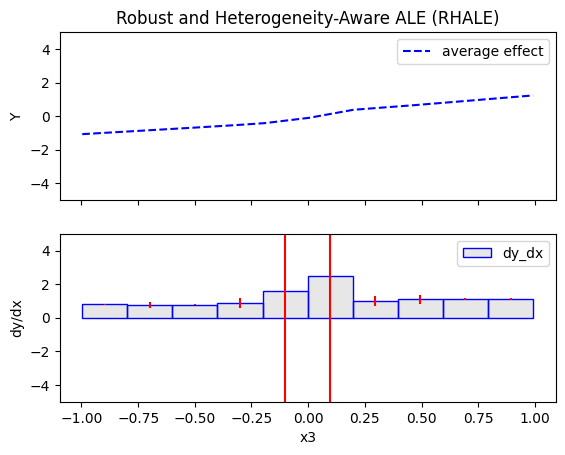
    


#### Regional RHALE


```python
regional_rhale = effector.RegionalRHALE(
    data=X_uncor_train, 
    model=model_uncor, 
    model_jac= model_uncor_jac, 
    feature_names=['x1', 'x2', 'x3'],
    axis_limits=np.array([[-1, 1], [-1, 1], [-1, 1]]).T) 

binning_method = effector.axis_partitioning.Fixed(11, min_points_per_bin=0)
space_partitioner = effector.space_partitioning.Best(min_heterogeneity_decrease_pcg=0.6, numerical_features_grid_size=10)
regional_rhale.fit(
    features="all",
    binning_method=binning_method,
    space_partitioner=space_partitioner
)

```

    100%|██████████| 3/3 [00:00<00:00, 17.88it/s]


```python
regional_rhale.summary(features=0)
```

    
    
    Feature 0 - Full partition tree:
    🌳 Full Tree Structure:
    ───────────────────────
    x1 🔹 [id: 0 | heter: 8.64 | inst: 1000 | w: 1.00]
        x3 ≤ 0.00 🔹 [id: 1 | heter: 0.26 | inst: 500 | w: 0.50]
        x3 > 0.00 🔹 [id: 2 | heter: 0.47 | inst: 500 | w: 0.50]
    --------------------------------------------------
    Feature 0 - Statistics per tree level:
    🌳 Tree Summary:
    ─────────────────
    Level 0🔹heter: 8.64
        Level 1🔹heter: 0.37 | 🔻8.28 (95.77%)
    
    


```python
regional_rhale.plot(feature=0, node_idx=1, heterogeneity="std", centering=True, y_limits=[-5, 5])
regional_rhale.plot(feature=0, node_idx=2, heterogeneity="std", centering=True, y_limits=[-5, 5])
```


    
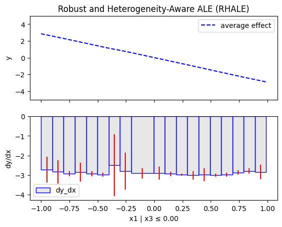
    


    
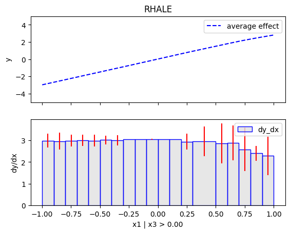
    


```python
regional_rhale.summary(features=1)
```

    
    
    Feature 1 - Full partition tree:
    🌳 Full Tree Structure:
    ───────────────────────
    x2 🔹 [id: 0 | heter: 0.03 | inst: 1000 | w: 1.00]
    --------------------------------------------------
    Feature 1 - Statistics per tree level:
    🌳 Tree Summary:
    ─────────────────
    Level 0🔹heter: 0.03
    
    


```python
regional_rhale.summary(features=2)
```

    
    
    Feature 2 - Full partition tree:
    🌳 Full Tree Structure:
    ───────────────────────
    x3 🔹 [id: 0 | heter: 73.33 | inst: 1000 | w: 1.00]
    --------------------------------------------------
    Feature 2 - Statistics per tree level:
    🌳 Tree Summary:
    ─────────────────
    Level 0🔹heter: 73.33
    
    


#### Conclusion

### Correlated setting

#### Global RHALE


```python
rhale = effector.RHALE(data=X_cor_train, model=model_cor, model_jac=model_cor_jac, feature_names=['x1','x2','x3'], target_name="Y")

binning_method = effector.axis_partitioning.Fixed(10, min_points_per_bin=0)
rhale.fit(features="all", binning_method=binning_method, centering=True)
```


```python
rhale.plot(feature=0, centering=True, heterogeneity="std", show_avg_output=False, y_limits=[-5, 5], dy_limits=[-5, 5])
rhale.plot(feature=1, centering=True, heterogeneity="std", show_avg_output=False, y_limits=[-5, 5], dy_limits=[-5, 5])
rhale.plot(feature=2, centering=True, heterogeneity="std", show_avg_output=False, y_limits=[-5, 5], dy_limits=[-5, 5])
```


    
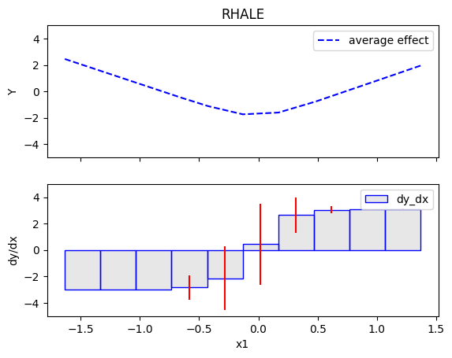
    


    

    


    
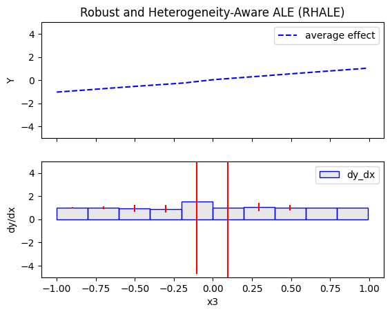
    


#### Regional RHALE


```python
regional_rhale = effector.RegionalRHALE(
    data=X_cor_train, 
    model=model_cor, 
    model_jac= model_cor_jac, 
    feature_names=['x1', 'x2', 'x3'],
    axis_limits=np.array([[-1, 1], [-1, 1], [-1, 1]]).T) 

binning_method = effector.axis_partitioning.Fixed(11, min_points_per_bin=0)
space_partitioner = effector.space_partitioning.Best(min_heterogeneity_decrease_pcg=0.6, numerical_features_grid_size=10)
regional_rhale.fit(
    features="all",
    space_partitioner=space_partitioner,
)
```

    100%|██████████| 3/3 [00:00<00:00,  5.06it/s]


```python
regional_rhale.summary(features=0)
```

    
    
    Feature 0 - Full partition tree:
    🌳 Full Tree Structure:
    ───────────────────────
    x1 🔹 [id: 0 | heter: 2.50 | inst: 900 | w: 1.00]
    --------------------------------------------------
    Feature 0 - Statistics per tree level:
    🌳 Tree Summary:
    ─────────────────
    Level 0🔹heter: 2.50
    
    


```python
regional_rhale.summary(features=1)
```

    
    
    Feature 1 - Full partition tree:
    🌳 Full Tree Structure:
    ───────────────────────
    x2 🔹 [id: 0 | heter: 0.01 | inst: 900 | w: 1.00]
    --------------------------------------------------
    Feature 1 - Statistics per tree level:
    🌳 Tree Summary:
    ─────────────────
    Level 0🔹heter: 0.01
    
    


```python
regional_rhale.summary(features=2)
```

    
    
    Feature 2 - Full partition tree:
    🌳 Full Tree Structure:
    ───────────────────────
    x3 🔹 [id: 0 | heter: 13.57 | inst: 900 | w: 1.00]
    --------------------------------------------------
    Feature 2 - Statistics per tree level:
    🌳 Tree Summary:
    ─────────────────
    Level 0🔹heter: 13.57
    
    


#### Conclusion

## SHAP DP
### Uncorrelated setting
#### Global SHAP DP


```python
shap = effector.ShapDP(data=X_uncor_train, model=model_uncor, feature_names=['x1', 'x2', 'x3'], target_name="Y")
binning_method = effector.axis_partitioning.Fixed(nof_bins=5, min_points_per_bin=0)
shap.fit(features="all", binning_method=binning_method, centering=True)
shap.plot(feature=0, centering=True, heterogeneity="shap_values", show_avg_output=False, y_limits=[-3, 3])
shap.plot(feature=1, centering=True, heterogeneity="shap_values", show_avg_output=False, y_limits=[-3, 3])
shap.plot(feature=2, centering=True, heterogeneity="shap_values", show_avg_output=False, y_limits=[-3, 3])

```


    
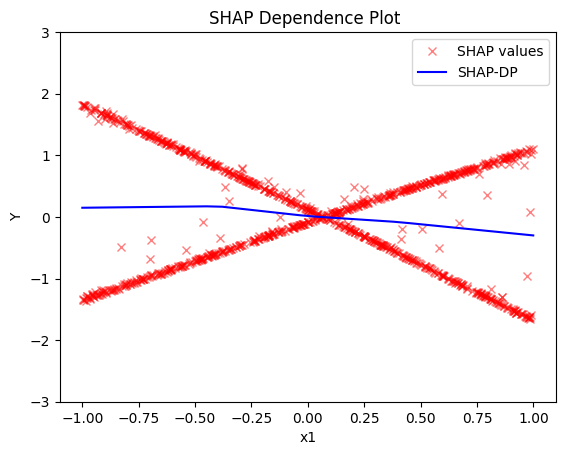
    


    
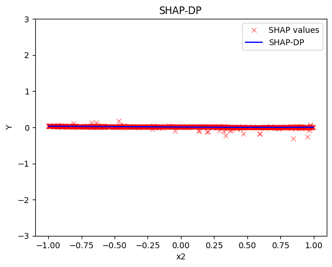
    


    
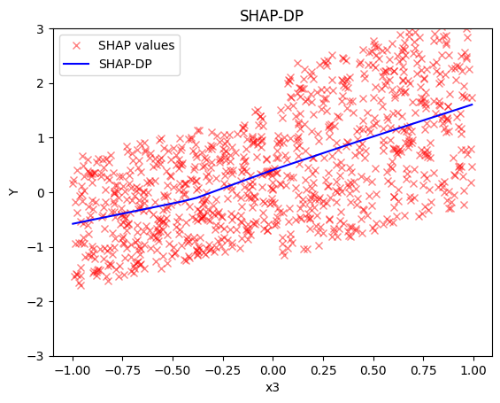
    


#### Regional SHAP-DP


```python
regional_shap = effector.RegionalShapDP(
    data=X_uncor_train,
    model=model_uncor,
    feature_names=['x1', 'x2', 'x3'],
    axis_limits=np.array([[-1, 1], [-1, 1], [-1, 1]]).T)

space_partitioner = effector.space_partitioning.Best(min_heterogeneity_decrease_pcg=0.6, numerical_features_grid_size=10)
regional_shap.fit(
    features="all",
    space_partitioner=space_partitioner,
    binning_method = effector.axis_partitioning.Fixed(nof_bins=5, min_points_per_bin=0)
)

```

    100%|██████████| 3/3 [00:04<00:00,  1.59s/it]


```python
regional_shap.summary(0)
```

    
    
    Feature 0 - Full partition tree:
    🌳 Full Tree Structure:
    ───────────────────────
    x1 🔹 [id: 0 | heter: 0.83 | inst: 1000 | w: 1.00]
        x3 ≤ 0.00 🔹 [id: 1 | heter: 0.04 | inst: 500 | w: 0.50]
        x3 > 0.00 🔹 [id: 2 | heter: 0.03 | inst: 500 | w: 0.50]
    --------------------------------------------------
    Feature 0 - Statistics per tree level:
    🌳 Tree Summary:
    ─────────────────
    Level 0🔹heter: 0.83
        Level 1🔹heter: 0.03 | 🔻0.79 (95.81%)
    
    


```python
regional_shap.plot(feature=0, node_idx=1, heterogeneity="std", centering=True, y_limits=[-5, 5])
regional_shap.plot(feature=0, node_idx=2, heterogeneity="std", centering=True, y_limits=[-5, 5])
```


    
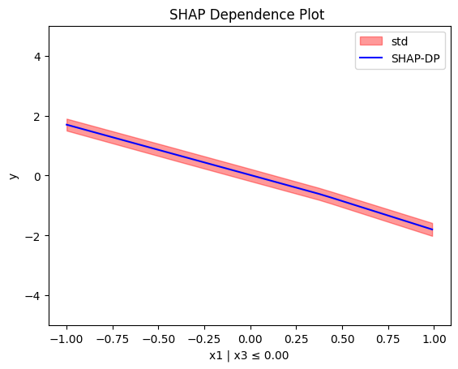
    


    
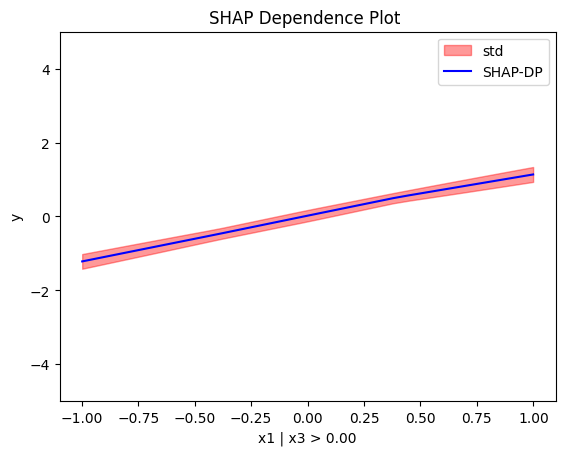
    


```python
regional_shap.summary(features=1)
```

    
    
    Feature 1 - Full partition tree:
    🌳 Full Tree Structure:
    ───────────────────────
    x2 🔹 [id: 0 | heter: 0.00 | inst: 1000 | w: 1.00]
    --------------------------------------------------
    Feature 1 - Statistics per tree level:
    🌳 Tree Summary:
    ─────────────────
    Level 0🔹heter: 0.00
    
    


```python
regional_shap.summary(features=2)
```

    
    
    Feature 2 - Full partition tree:
    🌳 Full Tree Structure:
    ───────────────────────
    x3 🔹 [id: 0 | heter: 0.77 | inst: 1000 | w: 1.00]
        x1 ≤ 0.00 🔹 [id: 1 | heter: 0.25 | inst: 494 | w: 0.49]
        x1 > 0.00 🔹 [id: 2 | heter: 0.34 | inst: 506 | w: 0.51]
    --------------------------------------------------
    Feature 2 - Statistics per tree level:
    🌳 Tree Summary:
    ─────────────────
    Level 0🔹heter: 0.77
        Level 1🔹heter: 0.30 | 🔻0.47 (60.94%)
    
    


#### Conclusion

### Correlated setting

#### Global SHAP-DP


```python

shap = effector.ShapDP(data=X_cor_train, model=model_cor, feature_names=['x1', 'x2', 'x3'], target_name="Y")
binning_method = effector.axis_partitioning.Fixed(nof_bins=5, min_points_per_bin=0)
shap.fit(features="all", binning_method=binning_method, centering=True)
shap.plot(feature=0, centering=True, heterogeneity="shap_values", show_avg_output=False, y_limits=[-3, 3])
shap.plot(feature=1, centering=True, heterogeneity="shap_values", show_avg_output=False, y_limits=[-3, 3])
shap.plot(feature=2, centering=True, heterogeneity="shap_values", show_avg_output=False, y_limits=[-3, 3])

```


    
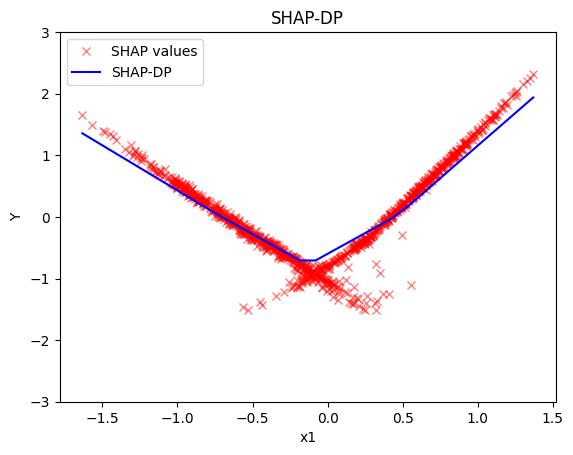
    


    
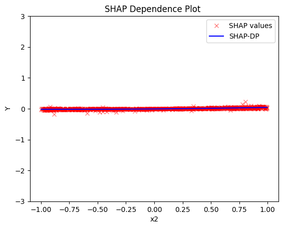
    


    
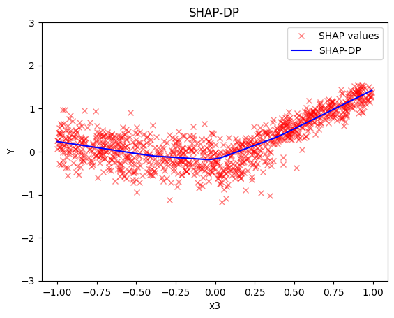
    


#### Regional SHAP


```python
regional_shap = effector.RegionalShapDP(
    data=X_cor_train,
    model=model_cor,
    feature_names=['x1', 'x2', 'x3'],
    axis_limits=np.array([[-1, 1], [-1, 1], [-1, 1]]).T)

space_partitioner = effector.space_partitioning.Best(min_heterogeneity_decrease_pcg=0.6, numerical_features_grid_size=10)
regional_shap.fit(
    features="all",
    space_partitioner=space_partitioner,
    binning_method = effector.axis_partitioning.Fixed(nof_bins=5, min_points_per_bin=0)
)
```

    100%|██████████| 3/3 [00:04<00:00,  1.40s/it]


```python
regional_shap.summary(0)
regional_shap.summary(1)
regional_shap.summary(2)
```

    
    
    Feature 0 - Full partition tree:
    🌳 Full Tree Structure:
    ───────────────────────
    x1 🔹 [id: 0 | heter: 0.06 | inst: 900 | w: 1.00]
    --------------------------------------------------
    Feature 0 - Statistics per tree level:
    🌳 Tree Summary:
    ─────────────────
    Level 0🔹heter: 0.06
    
    
    
    
    Feature 1 - Full partition tree:
    🌳 Full Tree Structure:
    ───────────────────────
    x2 🔹 [id: 0 | heter: 0.00 | inst: 900 | w: 1.00]
    --------------------------------------------------
    Feature 1 - Statistics per tree level:
    🌳 Tree Summary:
    ─────────────────
    Level 0🔹heter: 0.00
    
    
    
    
    Feature 2 - Full partition tree:
    🌳 Full Tree Structure:
    ───────────────────────
    x3 🔹 [id: 0 | heter: 0.14 | inst: 900 | w: 1.00]
    --------------------------------------------------
    Feature 2 - Statistics per tree level:
    🌳 Tree Summary:
    ─────────────────
    Level 0🔹heter: 0.14
    
    


#### Conclusion


