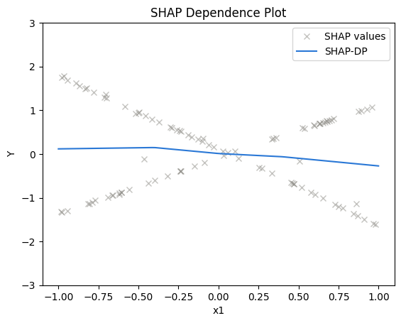
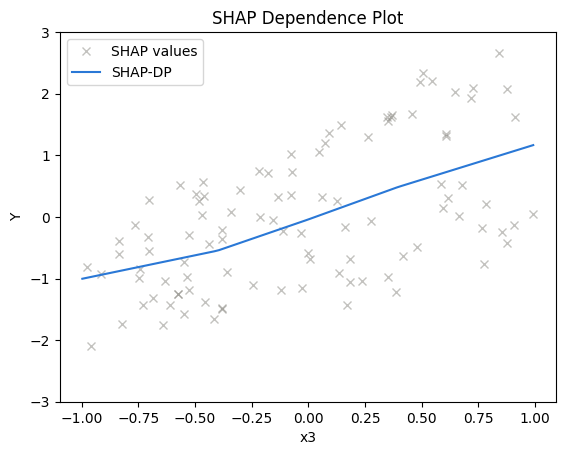
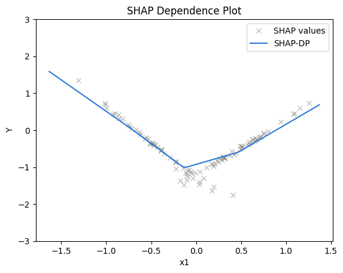
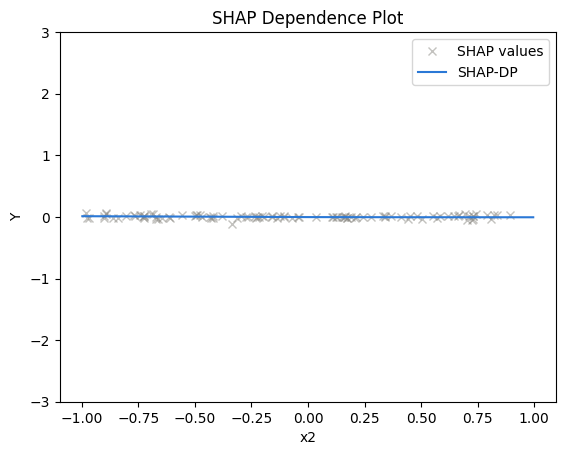
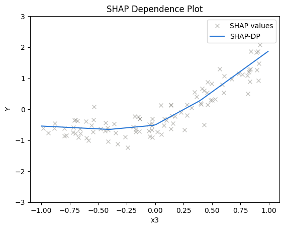

# Regional Effects (unknown black-box function)

- Author: [givasile](https://givasile.github.io/)
- Runtime: ~55 s
- Description: The realistic follow-up to tutorial 03: a neural network is
  fitted on the data and explained with regional PDP, RHALE and SHAP-DP,
  under uncorrelated and correlated features.

This tutorial use the same dataset with the previous [tutorial](./03_regional_effects_synthetic_f/), but instead of explaining the known (synthetic) predictive function, we fit a neural network on the data and explain the neural network. This is a more realistic scenario, since in real-world applications we do not know the underlying function and we only have access to the data. We advise the reader to first read the previous tutorial.


```python
import numpy as np
import effector
import keras
import tensorflow as tf

np.random.seed(12345)
tf.random.set_seed(12345)
```

    WARNING: All log messages before absl::InitializeLog() is called are written to STDERR
    I0000 00:00:1783470127.087951  115781 cpu_feature_guard.cc:227] This TensorFlow binary is optimized to use available CPU instructions in performance-critical operations.
    To enable the following instructions: AVX2 FMA, in other operations, rebuild TensorFlow with the appropriate compiler flags.


<!-- ## Simulation example

### Data Generating Distribution

We will generate $N=1000$ examples with $D=3$ features, which are in the uncorrelated setting all uniformly distributed as follows:

<center>

| Feature | Description                                | Distribution                 |
|---------|--------------------------------------------|------------------------------|
| $x_1$   | Uniformly distributed between $-1$ and $1$ | $x_1 \sim \mathcal{U}(-1,1)$ |
| $x_2$   | Uniformly distributed between $-1$ and $1$ | $x_2 \sim \mathcal{U}(-1,1)$ |
| $x_3$   | Uniformly distributed between $-1$ and $1$ | $x_3 \sim \mathcal{U}(-1,1)$ |

</center>

For the correlated setting we keep the distributional assumptions for $x_2$ and $x_3$ but define $x_1$ such that it is highly correlated with $x_3$ by: $x_1 = x_3 + \delta$ with $\delta \sim \mathcal{N}(0,0.0625)$. -->

## Simulation example

### Data Generating Distribution

We will generate $N=1000$ examples with $D=3$ features, which are in the uncorrelated setting all uniformly distributed as follows:

| Feature | Description                                | Distribution                 |
|---------|--------------------------------------------|------------------------------|
| $x_1$   | Uniformly distributed between $-1$ and $1$ | $x_1 \sim \mathcal{U}(-1,1)$ |
| $x_2$   | Uniformly distributed between $-1$ and $1$ | $x_2 \sim \mathcal{U}(-1,1)$ |
| $x_3$   | Uniformly distributed between $-1$ and $1$ | $x_3 \sim \mathcal{U}(-1,1)$ |

For the correlated setting, we keep the distributional assumptions for $x_2$ and $x_3$, but define $x_1$ such that it is highly correlated with $x_3$ by:  
$x_1 = x_3 + \delta$ with $\delta \sim \mathcal{N}(0,0.0625)$.


```python
def generate_dataset_uncorrelated(N):
    x1 = np.random.uniform(-1, 1, size=N)
    x2 = np.random.uniform(-1, 1, size=N)
    x3 = np.random.uniform(-1, 1, size=N)
    return np.stack((x1, x2, x3), axis=-1)

def generate_dataset_correlated(N):
    x3 = np.random.uniform(-1, 1, size=N)
    x2 = np.random.uniform(-1, 1, size=N)
    x1 = x3 + np.random.normal(loc = np.zeros_like(x3), scale = 0.25)
    return np.stack((x1, x2, x3), axis=-1)

# generate the dataset for the uncorrelated and correlated setting
N = 1000
X_uncor_train = generate_dataset_uncorrelated(N)
X_uncor_test = generate_dataset_uncorrelated(10000)
X_cor_train = generate_dataset_correlated(N)
X_cor_test = generate_dataset_correlated(10000)
```

### Black-box function

We will use the following linear model with a subgroup-specific interaction term:
 $$ y = 3x_1I_{x_3>0} - 3x_1I_{x_3\leq0} + x_3$$ 
 
On a global level, there is a high heterogeneity for the features $x_1$ and $x_3$ due to their interaction with each other. However, this heterogeneity vanishes to 0 if the feature space is separated into subregions:

<center>

| Feature | Region      | Average Effect | Heterogeneity |
|---------|-------------|----------------|---------------|
| $x_1$   | $x_3>0$     | $3x_1$         | 0             |
| $x_1$   | $x_3\leq 0$ | $-3x_1$        | 0             |
| $x_2$   | all         | 0              | 0             |
| $x_3$   | $x_3>0$     | $x_3$          | 0             |
| $x_3$   | $x_3\leq 0$ | $x_3$          | 0             |

</center>


```python
def generate_target(X):
    f = np.where(X[:,2] > 0, 3*X[:,0] + X[:,2], -3*X[:,0] + X[:,2])
    epsilon = np.random.normal(loc = np.zeros_like(X[:,0]), scale = 0.1)
    Y = f + epsilon
    return(Y)

# generate target for uncorrelated and correlated setting
Y_uncor_train = generate_target(X_uncor_train)
Y_uncor_test = generate_target(X_uncor_test)
Y_cor_train = generate_target(X_cor_train)
Y_cor_test = generate_target(X_cor_test)      
```

### Fit a Neural Network

We create a two-layer feedforward Neural Network, a weight decay of 0.01 for 100 epochs. We train two instances of this NN, one on the uncorrelated and one on the correlated setting. In both cases, the NN achieves a Mean Squared Error of about $0.17$ units.


```python
# Train - Evaluate - Explain a neural network
model_uncor = keras.Sequential([
    keras.layers.Dense(10, activation="relu", input_shape=(3,)),
    keras.layers.Dense(10, activation="relu", input_shape=(3,)),
    keras.layers.Dense(1)
])

optimizer = keras.optimizers.Adam(learning_rate=0.01)
model_uncor.compile(optimizer=optimizer, loss="mse")
model_uncor.fit(X_uncor_train, Y_uncor_train, epochs=100)
model_uncor.evaluate(X_uncor_test, Y_uncor_test)
```

    Epoch 1/100


    /home/givasile/github/packages/effector/.venv/lib/python3.10/site-packages/keras/src/layers/core/dense.py:95: UserWarning: Do not pass an `input_shape`/`input_dim` argument to a layer. When using Sequential models, prefer using an `Input(shape)` object as the first layer in the model instead.
      super().__init__(activity_regularizer=activity_regularizer, **kwargs)


    
 1/32 ━━━━━━━━━━━━━━━━━━━━ 22s 724ms/step - loss: 3.4809

    
10/32 ━━━━━━━━━━━━━━━━━━━━ 0s 6ms/step - loss: 3.0852   

    
24/32 ━━━━━━━━━━━━━━━━━━━━ 0s 5ms/step - loss: 2.9449

    
32/32 ━━━━━━━━━━━━━━━━━━━━ 1s 6ms/step - loss: 2.4600


    Epoch 2/100


    
 1/32 ━━━━━━━━━━━━━━━━━━━━ 1s 55ms/step - loss: 1.6344

    
23/32 ━━━━━━━━━━━━━━━━━━━━ 0s 2ms/step - loss: 1.1684 

    
32/32 ━━━━━━━━━━━━━━━━━━━━ 0s 3ms/step - loss: 0.8606


    Epoch 3/100


    
 1/32 ━━━━━━━━━━━━━━━━━━━━ 0s 19ms/step - loss: 0.5574

    
24/32 ━━━━━━━━━━━━━━━━━━━━ 0s 2ms/step - loss: 0.4308 

    
32/32 ━━━━━━━━━━━━━━━━━━━━ 0s 3ms/step - loss: 0.4036


    Epoch 4/100


    
 1/32 ━━━━━━━━━━━━━━━━━━━━ 0s 22ms/step - loss: 0.4276

    
32/32 ━━━━━━━━━━━━━━━━━━━━ 0s 2ms/step - loss: 0.3069 


    Epoch 5/100


    
 1/32 ━━━━━━━━━━━━━━━━━━━━ 0s 17ms/step - loss: 0.3374

    
32/32 ━━━━━━━━━━━━━━━━━━━━ 0s 2ms/step - loss: 0.2473 


    Epoch 6/100


    
 1/32 ━━━━━━━━━━━━━━━━━━━━ 0s 17ms/step - loss: 0.2808

    
32/32 ━━━━━━━━━━━━━━━━━━━━ 0s 2ms/step - loss: 0.2171 


    Epoch 7/100


    
 1/32 ━━━━━━━━━━━━━━━━━━━━ 0s 28ms/step - loss: 0.2301

    
19/32 ━━━━━━━━━━━━━━━━━━━━ 0s 3ms/step - loss: 0.1692 

    
31/32 ━━━━━━━━━━━━━━━━━━━━ 0s 3ms/step - loss: 0.1802

    
32/32 ━━━━━━━━━━━━━━━━━━━━ 0s 4ms/step - loss: 0.1932


    Epoch 8/100


    
 1/32 ━━━━━━━━━━━━━━━━━━━━ 1s 53ms/step - loss: 0.1979

    
13/32 ━━━━━━━━━━━━━━━━━━━━ 0s 4ms/step - loss: 0.1341 

    
29/32 ━━━━━━━━━━━━━━━━━━━━ 0s 4ms/step - loss: 0.1560

    
32/32 ━━━━━━━━━━━━━━━━━━━━ 0s 4ms/step - loss: 0.1721


    Epoch 9/100


    
 1/32 ━━━━━━━━━━━━━━━━━━━━ 0s 17ms/step - loss: 0.1717

    
32/32 ━━━━━━━━━━━━━━━━━━━━ 0s 1ms/step - loss: 0.1583 


    Epoch 10/100


    
 1/32 ━━━━━━━━━━━━━━━━━━━━ 0s 17ms/step - loss: 0.1551

    
32/32 ━━━━━━━━━━━━━━━━━━━━ 0s 2ms/step - loss: 0.1489 


    Epoch 11/100


    
 1/32 ━━━━━━━━━━━━━━━━━━━━ 0s 18ms/step - loss: 0.1475

    
32/32 ━━━━━━━━━━━━━━━━━━━━ 0s 2ms/step - loss: 0.1406 


    Epoch 12/100


    
 1/32 ━━━━━━━━━━━━━━━━━━━━ 0s 18ms/step - loss: 0.1431

    
32/32 ━━━━━━━━━━━━━━━━━━━━ 0s 2ms/step - loss: 0.1329 


    Epoch 13/100


    
 1/32 ━━━━━━━━━━━━━━━━━━━━ 0s 18ms/step - loss: 0.1390

    
32/32 ━━━━━━━━━━━━━━━━━━━━ 0s 2ms/step - loss: 0.1255 


    Epoch 14/100


    
 1/32 ━━━━━━━━━━━━━━━━━━━━ 0s 16ms/step - loss: 0.1290

    
32/32 ━━━━━━━━━━━━━━━━━━━━ 0s 2ms/step - loss: 0.1184 


    Epoch 15/100


    
 1/32 ━━━━━━━━━━━━━━━━━━━━ 0s 17ms/step - loss: 0.1209

    
23/32 ━━━━━━━━━━━━━━━━━━━━ 0s 2ms/step - loss: 0.0968 

    
32/32 ━━━━━━━━━━━━━━━━━━━━ 0s 4ms/step - loss: 0.1126


    Epoch 16/100


    
 1/32 ━━━━━━━━━━━━━━━━━━━━ 1s 38ms/step - loss: 0.1137

    
11/32 ━━━━━━━━━━━━━━━━━━━━ 0s 5ms/step - loss: 0.0803 

    
30/32 ━━━━━━━━━━━━━━━━━━━━ 0s 4ms/step - loss: 0.0978

    
32/32 ━━━━━━━━━━━━━━━━━━━━ 0s 4ms/step - loss: 0.1077


    Epoch 17/100


    
 1/32 ━━━━━━━━━━━━━━━━━━━━ 5s 179ms/step - loss: 0.1065

    
32/32 ━━━━━━━━━━━━━━━━━━━━ 0s 2ms/step - loss: 0.1031  


    Epoch 18/100


    
 1/32 ━━━━━━━━━━━━━━━━━━━━ 0s 19ms/step - loss: 0.0993

    
32/32 ━━━━━━━━━━━━━━━━━━━━ 0s 1ms/step - loss: 0.0991 


    Epoch 19/100


    
 1/32 ━━━━━━━━━━━━━━━━━━━━ 0s 18ms/step - loss: 0.0965

    
22/32 ━━━━━━━━━━━━━━━━━━━━ 0s 2ms/step - loss: 0.0840 

    
32/32 ━━━━━━━━━━━━━━━━━━━━ 0s 4ms/step - loss: 0.0956


    Epoch 20/100


    
 1/32 ━━━━━━━━━━━━━━━━━━━━ 1s 50ms/step - loss: 0.0873

    
25/32 ━━━━━━━━━━━━━━━━━━━━ 0s 2ms/step - loss: 0.0828 

    
32/32 ━━━━━━━━━━━━━━━━━━━━ 0s 3ms/step - loss: 0.0917


    Epoch 21/100


    
 1/32 ━━━━━━━━━━━━━━━━━━━━ 1s 56ms/step - loss: 0.0815

    
27/32 ━━━━━━━━━━━━━━━━━━━━ 0s 2ms/step - loss: 0.0807 

    
32/32 ━━━━━━━━━━━━━━━━━━━━ 0s 2ms/step - loss: 0.0881


    Epoch 22/100


    
 1/32 ━━━━━━━━━━━━━━━━━━━━ 0s 18ms/step - loss: 0.0774

    
32/32 ━━━━━━━━━━━━━━━━━━━━ 0s 2ms/step - loss: 0.0853 


    Epoch 23/100


    
 1/32 ━━━━━━━━━━━━━━━━━━━━ 0s 19ms/step - loss: 0.0717

    
32/32 ━━━━━━━━━━━━━━━━━━━━ 0s 2ms/step - loss: 0.0832 


    Epoch 24/100


    
 1/32 ━━━━━━━━━━━━━━━━━━━━ 0s 18ms/step - loss: 0.0686

    
32/32 ━━━━━━━━━━━━━━━━━━━━ 0s 2ms/step - loss: 0.0818 


    Epoch 25/100


    
 1/32 ━━━━━━━━━━━━━━━━━━━━ 0s 18ms/step - loss: 0.0653

    
23/32 ━━━━━━━━━━━━━━━━━━━━ 0s 2ms/step - loss: 0.0698 

    
32/32 ━━━━━━━━━━━━━━━━━━━━ 0s 4ms/step - loss: 0.0800


    Epoch 26/100


    
 1/32 ━━━━━━━━━━━━━━━━━━━━ 0s 31ms/step - loss: 0.0601

    
12/32 ━━━━━━━━━━━━━━━━━━━━ 0s 5ms/step - loss: 0.0559 

    
26/32 ━━━━━━━━━━━━━━━━━━━━ 0s 4ms/step - loss: 0.0692

    
32/32 ━━━━━━━━━━━━━━━━━━━━ 0s 5ms/step - loss: 0.0771


    Epoch 27/100


    
 1/32 ━━━━━━━━━━━━━━━━━━━━ 1s 38ms/step - loss: 0.0570

    
12/32 ━━━━━━━━━━━━━━━━━━━━ 0s 5ms/step - loss: 0.0523 

    
32/32 ━━━━━━━━━━━━━━━━━━━━ 0s 3ms/step - loss: 0.0747


    Epoch 28/100


    
 1/32 ━━━━━━━━━━━━━━━━━━━━ 0s 16ms/step - loss: 0.0524

    
32/32 ━━━━━━━━━━━━━━━━━━━━ 0s 2ms/step - loss: 0.0736 


    Epoch 29/100


    
 1/32 ━━━━━━━━━━━━━━━━━━━━ 0s 17ms/step - loss: 0.0506

    
32/32 ━━━━━━━━━━━━━━━━━━━━ 0s 2ms/step - loss: 0.0723 


    Epoch 30/100


    
 1/32 ━━━━━━━━━━━━━━━━━━━━ 0s 17ms/step - loss: 0.0466

    
32/32 ━━━━━━━━━━━━━━━━━━━━ 0s 2ms/step - loss: 0.0708 


    Epoch 31/100


    
 1/32 ━━━━━━━━━━━━━━━━━━━━ 0s 17ms/step - loss: 0.0445

    
32/32 ━━━━━━━━━━━━━━━━━━━━ 0s 2ms/step - loss: 0.0618 

    
32/32 ━━━━━━━━━━━━━━━━━━━━ 0s 2ms/step - loss: 0.0703


    Epoch 32/100


    
 1/32 ━━━━━━━━━━━━━━━━━━━━ 1s 34ms/step - loss: 0.0439

    
11/32 ━━━━━━━━━━━━━━━━━━━━ 0s 5ms/step - loss: 0.0434 

    
26/32 ━━━━━━━━━━━━━━━━━━━━ 0s 4ms/step - loss: 0.0605

    
32/32 ━━━━━━━━━━━━━━━━━━━━ 0s 6ms/step - loss: 0.0711


    Epoch 33/100


    
 1/32 ━━━━━━━━━━━━━━━━━━━━ 0s 29ms/step - loss: 0.0425

    
18/32 ━━━━━━━━━━━━━━━━━━━━ 0s 3ms/step - loss: 0.0513 

    
32/32 ━━━━━━━━━━━━━━━━━━━━ 0s 3ms/step - loss: 0.0701


    Epoch 34/100


    
 1/32 ━━━━━━━━━━━━━━━━━━━━ 0s 18ms/step - loss: 0.0421

    
32/32 ━━━━━━━━━━━━━━━━━━━━ 0s 2ms/step - loss: 0.0706 


    Epoch 35/100


    
 1/32 ━━━━━━━━━━━━━━━━━━━━ 0s 17ms/step - loss: 0.0419

    
32/32 ━━━━━━━━━━━━━━━━━━━━ 0s 2ms/step - loss: 0.0698 


    Epoch 36/100


    
 1/32 ━━━━━━━━━━━━━━━━━━━━ 0s 24ms/step - loss: 0.0413

    
32/32 ━━━━━━━━━━━━━━━━━━━━ 0s 2ms/step - loss: 0.0695 


    Epoch 37/100


    
 1/32 ━━━━━━━━━━━━━━━━━━━━ 0s 17ms/step - loss: 0.0398

    
32/32 ━━━━━━━━━━━━━━━━━━━━ 0s 2ms/step - loss: 0.0700 


    Epoch 38/100


    
 1/32 ━━━━━━━━━━━━━━━━━━━━ 1s 62ms/step - loss: 0.0401

    
15/32 ━━━━━━━━━━━━━━━━━━━━ 0s 4ms/step - loss: 0.0480 

    
32/32 ━━━━━━━━━━━━━━━━━━━━ 0s 3ms/step - loss: 0.0616

    
32/32 ━━━━━━━━━━━━━━━━━━━━ 0s 4ms/step - loss: 0.0692


    Epoch 39/100


    
 1/32 ━━━━━━━━━━━━━━━━━━━━ 5s 183ms/step - loss: 0.0398

    
32/32 ━━━━━━━━━━━━━━━━━━━━ 0s 2ms/step - loss: 0.0690  


    Epoch 40/100


    
 1/32 ━━━━━━━━━━━━━━━━━━━━ 0s 19ms/step - loss: 0.0408

    
32/32 ━━━━━━━━━━━━━━━━━━━━ 0s 2ms/step - loss: 0.0699 


    Epoch 41/100


    
 1/32 ━━━━━━━━━━━━━━━━━━━━ 0s 19ms/step - loss: 0.0395

    
32/32 ━━━━━━━━━━━━━━━━━━━━ 0s 2ms/step - loss: 0.0702 


    Epoch 42/100


    
 1/32 ━━━━━━━━━━━━━━━━━━━━ 0s 16ms/step - loss: 0.0402

    
20/32 ━━━━━━━━━━━━━━━━━━━━ 0s 3ms/step - loss: 0.0545 

    
32/32 ━━━━━━━━━━━━━━━━━━━━ 0s 4ms/step - loss: 0.0695


    Epoch 43/100


    
 1/32 ━━━━━━━━━━━━━━━━━━━━ 1s 37ms/step - loss: 0.0382

    
14/32 ━━━━━━━━━━━━━━━━━━━━ 0s 4ms/step - loss: 0.0447 

    
24/32 ━━━━━━━━━━━━━━━━━━━━ 0s 5ms/step - loss: 0.0567

    
32/32 ━━━━━━━━━━━━━━━━━━━━ 0s 5ms/step - loss: 0.0689


    Epoch 44/100


    
 1/32 ━━━━━━━━━━━━━━━━━━━━ 0s 29ms/step - loss: 0.0404

    
31/32 ━━━━━━━━━━━━━━━━━━━━ 0s 2ms/step - loss: 0.0601 

    
32/32 ━━━━━━━━━━━━━━━━━━━━ 0s 2ms/step - loss: 0.0687


    Epoch 45/100


    
 1/32 ━━━━━━━━━━━━━━━━━━━━ 0s 18ms/step - loss: 0.0370

    
32/32 ━━━━━━━━━━━━━━━━━━━━ 0s 2ms/step - loss: 0.0688 


    Epoch 46/100


    
 1/32 ━━━━━━━━━━━━━━━━━━━━ 0s 19ms/step - loss: 0.0387

    
32/32 ━━━━━━━━━━━━━━━━━━━━ 0s 2ms/step - loss: 0.0687 


    Epoch 47/100


    
 1/32 ━━━━━━━━━━━━━━━━━━━━ 0s 19ms/step - loss: 0.0366

    
32/32 ━━━━━━━━━━━━━━━━━━━━ 0s 2ms/step - loss: 0.0578 

    
32/32 ━━━━━━━━━━━━━━━━━━━━ 0s 2ms/step - loss: 0.0674


    Epoch 48/100


    
 1/32 ━━━━━━━━━━━━━━━━━━━━ 0s 18ms/step - loss: 0.0387

    
32/32 ━━━━━━━━━━━━━━━━━━━━ 0s 2ms/step - loss: 0.0648 


    Epoch 49/100


    
 1/32 ━━━━━━━━━━━━━━━━━━━━ 0s 21ms/step - loss: 0.0395

    
32/32 ━━━━━━━━━━━━━━━━━━━━ 0s 2ms/step - loss: 0.0679 


    Epoch 50/100


    
 1/32 ━━━━━━━━━━━━━━━━━━━━ 0s 18ms/step - loss: 0.0361

    
32/32 ━━━━━━━━━━━━━━━━━━━━ 0s 2ms/step - loss: 0.0642 


    Epoch 51/100


    
 1/32 ━━━━━━━━━━━━━━━━━━━━ 0s 19ms/step - loss: 0.0396

    
32/32 ━━━━━━━━━━━━━━━━━━━━ 0s 2ms/step - loss: 0.0641 


    Epoch 52/100


    
 1/32 ━━━━━━━━━━━━━━━━━━━━ 0s 17ms/step - loss: 0.0382

    
32/32 ━━━━━━━━━━━━━━━━━━━━ 0s 2ms/step - loss: 0.0656 


    Epoch 53/100


    
 1/32 ━━━━━━━━━━━━━━━━━━━━ 0s 19ms/step - loss: 0.0357

    
32/32 ━━━━━━━━━━━━━━━━━━━━ 0s 2ms/step - loss: 0.0633 


    Epoch 54/100


    
 1/32 ━━━━━━━━━━━━━━━━━━━━ 0s 20ms/step - loss: 0.0375

    
31/32 ━━━━━━━━━━━━━━━━━━━━ 0s 2ms/step - loss: 0.0552 

    
32/32 ━━━━━━━━━━━━━━━━━━━━ 0s 2ms/step - loss: 0.0638


    Epoch 55/100


    
 1/32 ━━━━━━━━━━━━━━━━━━━━ 0s 19ms/step - loss: 0.0344

    
32/32 ━━━━━━━━━━━━━━━━━━━━ 0s 2ms/step - loss: 0.0634 


    Epoch 56/100


    
 1/32 ━━━━━━━━━━━━━━━━━━━━ 0s 18ms/step - loss: 0.0370

    
32/32 ━━━━━━━━━━━━━━━━━━━━ 0s 2ms/step - loss: 0.0635 


    Epoch 57/100


    
 1/32 ━━━━━━━━━━━━━━━━━━━━ 0s 18ms/step - loss: 0.0346

    
32/32 ━━━━━━━━━━━━━━━━━━━━ 0s 2ms/step - loss: 0.0629 


    Epoch 58/100


    
 1/32 ━━━━━━━━━━━━━━━━━━━━ 0s 17ms/step - loss: 0.0363

    
32/32 ━━━━━━━━━━━━━━━━━━━━ 0s 2ms/step - loss: 0.0632 


    Epoch 59/100


    
 1/32 ━━━━━━━━━━━━━━━━━━━━ 0s 20ms/step - loss: 0.0342

    
32/32 ━━━━━━━━━━━━━━━━━━━━ 0s 2ms/step - loss: 0.0636 


    Epoch 60/100


    
 1/32 ━━━━━━━━━━━━━━━━━━━━ 0s 19ms/step - loss: 0.0384

    
32/32 ━━━━━━━━━━━━━━━━━━━━ 0s 2ms/step - loss: 0.0638 


    Epoch 61/100


    
 1/32 ━━━━━━━━━━━━━━━━━━━━ 0s 18ms/step - loss: 0.0340

    
30/32 ━━━━━━━━━━━━━━━━━━━━ 0s 2ms/step - loss: 0.0541 

    
32/32 ━━━━━━━━━━━━━━━━━━━━ 0s 2ms/step - loss: 0.0627


    Epoch 62/100


    
 1/32 ━━━━━━━━━━━━━━━━━━━━ 0s 18ms/step - loss: 0.0359

    
32/32 ━━━━━━━━━━━━━━━━━━━━ 0s 2ms/step - loss: 0.0625 


    Epoch 63/100


    
 1/32 ━━━━━━━━━━━━━━━━━━━━ 0s 19ms/step - loss: 0.0357

    
31/32 ━━━━━━━━━━━━━━━━━━━━ 0s 2ms/step - loss: 0.0532 

    
32/32 ━━━━━━━━━━━━━━━━━━━━ 0s 2ms/step - loss: 0.0612


    Epoch 64/100


    
 1/32 ━━━━━━━━━━━━━━━━━━━━ 0s 18ms/step - loss: 0.0364

    
32/32 ━━━━━━━━━━━━━━━━━━━━ 0s 2ms/step - loss: 0.0595 


    Epoch 65/100


    
 1/32 ━━━━━━━━━━━━━━━━━━━━ 0s 18ms/step - loss: 0.0356

    
32/32 ━━━━━━━━━━━━━━━━━━━━ 0s 2ms/step - loss: 0.0585 


    Epoch 66/100


    
 1/32 ━━━━━━━━━━━━━━━━━━━━ 0s 20ms/step - loss: 0.0357

    
32/32 ━━━━━━━━━━━━━━━━━━━━ 0s 2ms/step - loss: 0.0587 


    Epoch 67/100


    
 1/32 ━━━━━━━━━━━━━━━━━━━━ 0s 18ms/step - loss: 0.0360

    
32/32 ━━━━━━━━━━━━━━━━━━━━ 0s 2ms/step - loss: 0.0593 


    Epoch 68/100


    
 1/32 ━━━━━━━━━━━━━━━━━━━━ 0s 18ms/step - loss: 0.0346

    
32/32 ━━━━━━━━━━━━━━━━━━━━ 0s 2ms/step - loss: 0.0594 


    Epoch 69/100


    
 1/32 ━━━━━━━━━━━━━━━━━━━━ 0s 18ms/step - loss: 0.0374

    
32/32 ━━━━━━━━━━━━━━━━━━━━ 0s 2ms/step - loss: 0.0579 


    Epoch 70/100


    
 1/32 ━━━━━━━━━━━━━━━━━━━━ 0s 27ms/step - loss: 0.0363

    
32/32 ━━━━━━━━━━━━━━━━━━━━ 0s 2ms/step - loss: 0.0555 


    Epoch 71/100


    
 1/32 ━━━━━━━━━━━━━━━━━━━━ 0s 17ms/step - loss: 0.0367

    
32/32 ━━━━━━━━━━━━━━━━━━━━ 0s 2ms/step - loss: 0.0559 


    Epoch 72/100


    
 1/32 ━━━━━━━━━━━━━━━━━━━━ 0s 17ms/step - loss: 0.0351

    
32/32 ━━━━━━━━━━━━━━━━━━━━ 0s 2ms/step - loss: 0.0563 


    Epoch 73/100


    
 1/32 ━━━━━━━━━━━━━━━━━━━━ 0s 24ms/step - loss: 0.0357

    
32/32 ━━━━━━━━━━━━━━━━━━━━ 0s 2ms/step - loss: 0.0562 


    Epoch 74/100


    
 1/32 ━━━━━━━━━━━━━━━━━━━━ 0s 19ms/step - loss: 0.0371

    
32/32 ━━━━━━━━━━━━━━━━━━━━ 0s 2ms/step - loss: 0.0572 


    Epoch 75/100


    
 1/32 ━━━━━━━━━━━━━━━━━━━━ 0s 20ms/step - loss: 0.0362

    
32/32 ━━━━━━━━━━━━━━━━━━━━ 0s 2ms/step - loss: 0.0554 


    Epoch 76/100


    
 1/32 ━━━━━━━━━━━━━━━━━━━━ 0s 18ms/step - loss: 0.0396

    
32/32 ━━━━━━━━━━━━━━━━━━━━ 0s 2ms/step - loss: 0.0597 


    Epoch 77/100


    
 1/32 ━━━━━━━━━━━━━━━━━━━━ 0s 17ms/step - loss: 0.0393

    
32/32 ━━━━━━━━━━━━━━━━━━━━ 0s 2ms/step - loss: 0.0582 


    Epoch 78/100


    
 1/32 ━━━━━━━━━━━━━━━━━━━━ 0s 19ms/step - loss: 0.0383

    
32/32 ━━━━━━━━━━━━━━━━━━━━ 0s 2ms/step - loss: 0.0542 


    Epoch 79/100


    
 1/32 ━━━━━━━━━━━━━━━━━━━━ 0s 20ms/step - loss: 0.0383

    
28/32 ━━━━━━━━━━━━━━━━━━━━ 0s 2ms/step - loss: 0.0466 

    
32/32 ━━━━━━━━━━━━━━━━━━━━ 0s 3ms/step - loss: 0.0537


    Epoch 80/100


    
 1/32 ━━━━━━━━━━━━━━━━━━━━ 1s 44ms/step - loss: 0.0377

    
32/32 ━━━━━━━━━━━━━━━━━━━━ 0s 2ms/step - loss: 0.0531 


    Epoch 81/100


    
 1/32 ━━━━━━━━━━━━━━━━━━━━ 0s 20ms/step - loss: 0.0391

    
32/32 ━━━━━━━━━━━━━━━━━━━━ 0s 2ms/step - loss: 0.0567 


    Epoch 82/100


    
 1/32 ━━━━━━━━━━━━━━━━━━━━ 0s 19ms/step - loss: 0.0380

    
32/32 ━━━━━━━━━━━━━━━━━━━━ 0s 2ms/step - loss: 0.0542 


    Epoch 83/100


    
 1/32 ━━━━━━━━━━━━━━━━━━━━ 0s 17ms/step - loss: 0.0380

    
32/32 ━━━━━━━━━━━━━━━━━━━━ 0s 2ms/step - loss: 0.0544 


    Epoch 84/100


    
 1/32 ━━━━━━━━━━━━━━━━━━━━ 0s 18ms/step - loss: 0.0382

    
32/32 ━━━━━━━━━━━━━━━━━━━━ 0s 2ms/step - loss: 0.0548 


    Epoch 85/100


    
 1/32 ━━━━━━━━━━━━━━━━━━━━ 0s 20ms/step - loss: 0.0379

    
32/32 ━━━━━━━━━━━━━━━━━━━━ 0s 2ms/step - loss: 0.0557 


    Epoch 86/100


    
 1/32 ━━━━━━━━━━━━━━━━━━━━ 0s 18ms/step - loss: 0.0375

    
32/32 ━━━━━━━━━━━━━━━━━━━━ 0s 2ms/step - loss: 0.0535 


    Epoch 87/100


    
 1/32 ━━━━━━━━━━━━━━━━━━━━ 0s 23ms/step - loss: 0.0387

    
32/32 ━━━━━━━━━━━━━━━━━━━━ 0s 2ms/step - loss: 0.0543 


    Epoch 88/100


    
 1/32 ━━━━━━━━━━━━━━━━━━━━ 0s 20ms/step - loss: 0.0370

    
27/32 ━━━━━━━━━━━━━━━━━━━━ 0s 2ms/step - loss: 0.0455 

    
32/32 ━━━━━━━━━━━━━━━━━━━━ 0s 2ms/step - loss: 0.0524


    Epoch 89/100


    
 1/32 ━━━━━━━━━━━━━━━━━━━━ 0s 20ms/step - loss: 0.0382

    
32/32 ━━━━━━━━━━━━━━━━━━━━ 0s 2ms/step - loss: 0.0530 


    Epoch 90/100


    
 1/32 ━━━━━━━━━━━━━━━━━━━━ 0s 17ms/step - loss: 0.0362

    
32/32 ━━━━━━━━━━━━━━━━━━━━ 0s 2ms/step - loss: 0.0513 


    Epoch 91/100


    
 1/32 ━━━━━━━━━━━━━━━━━━━━ 0s 19ms/step - loss: 0.0385

    
32/32 ━━━━━━━━━━━━━━━━━━━━ 0s 2ms/step - loss: 0.0522 


    Epoch 92/100


    
 1/32 ━━━━━━━━━━━━━━━━━━━━ 0s 18ms/step - loss: 0.0369

    
32/32 ━━━━━━━━━━━━━━━━━━━━ 0s 2ms/step - loss: 0.0564 


    Epoch 93/100


    
 1/32 ━━━━━━━━━━━━━━━━━━━━ 0s 20ms/step - loss: 0.0388

    
32/32 ━━━━━━━━━━━━━━━━━━━━ 0s 2ms/step - loss: 0.0486 


    Epoch 94/100


    
 1/32 ━━━━━━━━━━━━━━━━━━━━ 0s 19ms/step - loss: 0.0382

    
32/32 ━━━━━━━━━━━━━━━━━━━━ 0s 2ms/step - loss: 0.0509 


    Epoch 95/100


    
 1/32 ━━━━━━━━━━━━━━━━━━━━ 0s 18ms/step - loss: 0.0384

    
32/32 ━━━━━━━━━━━━━━━━━━━━ 0s 2ms/step - loss: 0.0487 


    Epoch 96/100


    
 1/32 ━━━━━━━━━━━━━━━━━━━━ 0s 18ms/step - loss: 0.0388

    
32/32 ━━━━━━━━━━━━━━━━━━━━ 0s 2ms/step - loss: 0.0546 


    Epoch 97/100


    
 1/32 ━━━━━━━━━━━━━━━━━━━━ 0s 18ms/step - loss: 0.0381

    
32/32 ━━━━━━━━━━━━━━━━━━━━ 0s 2ms/step - loss: 0.0483 


    Epoch 98/100


    
 1/32 ━━━━━━━━━━━━━━━━━━━━ 0s 17ms/step - loss: 0.0373

    
29/32 ━━━━━━━━━━━━━━━━━━━━ 0s 2ms/step - loss: 0.0450 

    
32/32 ━━━━━━━━━━━━━━━━━━━━ 0s 2ms/step - loss: 0.0505


    Epoch 99/100


    
 1/32 ━━━━━━━━━━━━━━━━━━━━ 0s 23ms/step - loss: 0.0392

    
23/32 ━━━━━━━━━━━━━━━━━━━━ 0s 2ms/step - loss: 0.0432 

    
32/32 ━━━━━━━━━━━━━━━━━━━━ 0s 3ms/step - loss: 0.0487


    Epoch 100/100


    
 1/32 ━━━━━━━━━━━━━━━━━━━━ 0s 26ms/step - loss: 0.0379

    
22/32 ━━━━━━━━━━━━━━━━━━━━ 0s 2ms/step - loss: 0.0421 

    
32/32 ━━━━━━━━━━━━━━━━━━━━ 0s 3ms/step - loss: 0.0497


    
  1/313 ━━━━━━━━━━━━━━━━━━━━ 41s 133ms/step - loss: 0.0311

    
 15/313 ━━━━━━━━━━━━━━━━━━━━ 1s 4ms/step - loss: 0.0376   

    
 39/313 ━━━━━━━━━━━━━━━━━━━━ 0s 3ms/step - loss: 0.0547

    
 67/313 ━━━━━━━━━━━━━━━━━━━━ 0s 2ms/step - loss: 0.0608

    
 91/313 ━━━━━━━━━━━━━━━━━━━━ 0s 2ms/step - loss: 0.0656

    
123/313 ━━━━━━━━━━━━━━━━━━━━ 0s 2ms/step - loss: 0.0698

    
156/313 ━━━━━━━━━━━━━━━━━━━━ 0s 2ms/step - loss: 0.0728

    
180/313 ━━━━━━━━━━━━━━━━━━━━ 0s 2ms/step - loss: 0.0739

    
211/313 ━━━━━━━━━━━━━━━━━━━━ 0s 2ms/step - loss: 0.0755

    
242/313 ━━━━━━━━━━━━━━━━━━━━ 0s 2ms/step - loss: 0.0763

    
274/313 ━━━━━━━━━━━━━━━━━━━━ 0s 2ms/step - loss: 0.0765

    
306/313 ━━━━━━━━━━━━━━━━━━━━ 0s 2ms/step - loss: 0.0766

    
313/313 ━━━━━━━━━━━━━━━━━━━━ 1s 2ms/step - loss: 0.0770


    0.07702790200710297


```python
model_cor = keras.Sequential([
    keras.layers.Dense(10, activation="relu", input_shape=(3,)),
    keras.layers.Dense(10, activation="relu", input_shape=(3,)),
    keras.layers.Dense(1)
])

optimizer = keras.optimizers.Adam(learning_rate=0.01)
model_cor.compile(optimizer=optimizer, loss="mse")
model_cor.fit(X_cor_train, Y_cor_train, epochs=100)
model_cor.evaluate(X_cor_test, Y_cor_test)
```

    Epoch 1/100


    
 1/32 ━━━━━━━━━━━━━━━━━━━━ 20s 670ms/step - loss: 3.0720

    
27/32 ━━━━━━━━━━━━━━━━━━━━ 0s 2ms/step - loss: 2.3375   

    
32/32 ━━━━━━━━━━━━━━━━━━━━ 1s 2ms/step - loss: 1.5256


    Epoch 2/100


    
 1/32 ━━━━━━━━━━━━━━━━━━━━ 0s 26ms/step - loss: 0.6579

    
28/32 ━━━━━━━━━━━━━━━━━━━━ 0s 2ms/step - loss: 0.5311 

    
32/32 ━━━━━━━━━━━━━━━━━━━━ 0s 2ms/step - loss: 0.3791


    Epoch 3/100


    
 1/32 ━━━━━━━━━━━━━━━━━━━━ 0s 21ms/step - loss: 0.2336

    
29/32 ━━━━━━━━━━━━━━━━━━━━ 0s 2ms/step - loss: 0.1672 

    
32/32 ━━━━━━━━━━━━━━━━━━━━ 0s 2ms/step - loss: 0.1430


    Epoch 4/100


    
 1/32 ━━━━━━━━━━━━━━━━━━━━ 0s 17ms/step - loss: 0.1839

    
32/32 ━━━━━━━━━━━━━━━━━━━━ 0s 2ms/step - loss: 0.0994 


    Epoch 5/100


    
 1/32 ━━━━━━━━━━━━━━━━━━━━ 0s 19ms/step - loss: 0.1763

    
32/32 ━━━━━━━━━━━━━━━━━━━━ 0s 2ms/step - loss: 0.0925 

    
32/32 ━━━━━━━━━━━━━━━━━━━━ 0s 2ms/step - loss: 0.0835


    Epoch 6/100


    
 1/32 ━━━━━━━━━━━━━━━━━━━━ 0s 19ms/step - loss: 0.1665

    
32/32 ━━━━━━━━━━━━━━━━━━━━ 0s 2ms/step - loss: 0.0770 


    Epoch 7/100


    
 1/32 ━━━━━━━━━━━━━━━━━━━━ 0s 18ms/step - loss: 0.1628

    
32/32 ━━━━━━━━━━━━━━━━━━━━ 0s 2ms/step - loss: 0.0730 


    Epoch 8/100


    
 1/32 ━━━━━━━━━━━━━━━━━━━━ 0s 17ms/step - loss: 0.1578

    
32/32 ━━━━━━━━━━━━━━━━━━━━ 0s 2ms/step - loss: 0.0701 


    Epoch 9/100


    
 1/32 ━━━━━━━━━━━━━━━━━━━━ 0s 28ms/step - loss: 0.1520

    
32/32 ━━━━━━━━━━━━━━━━━━━━ 0s 2ms/step - loss: 0.0675 


    Epoch 10/100


    
 1/32 ━━━━━━━━━━━━━━━━━━━━ 2s 74ms/step - loss: 0.1468

    
32/32 ━━━━━━━━━━━━━━━━━━━━ 0s 2ms/step - loss: 0.0645 


    Epoch 11/100


    
 1/32 ━━━━━━━━━━━━━━━━━━━━ 0s 18ms/step - loss: 0.1431

    
32/32 ━━━━━━━━━━━━━━━━━━━━ 0s 2ms/step - loss: 0.0615 


    Epoch 12/100


    
 1/32 ━━━━━━━━━━━━━━━━━━━━ 0s 21ms/step - loss: 0.1392

    
32/32 ━━━━━━━━━━━━━━━━━━━━ 0s 2ms/step - loss: 0.0624 

    
32/32 ━━━━━━━━━━━━━━━━━━━━ 0s 2ms/step - loss: 0.0581


    Epoch 13/100


    
 1/32 ━━━━━━━━━━━━━━━━━━━━ 0s 19ms/step - loss: 0.1374

    
32/32 ━━━━━━━━━━━━━━━━━━━━ 0s 2ms/step - loss: 0.0597 

    
32/32 ━━━━━━━━━━━━━━━━━━━━ 0s 2ms/step - loss: 0.0557


    Epoch 14/100


    
 1/32 ━━━━━━━━━━━━━━━━━━━━ 0s 22ms/step - loss: 0.1341

    
32/32 ━━━━━━━━━━━━━━━━━━━━ 0s 2ms/step - loss: 0.0573 

    
32/32 ━━━━━━━━━━━━━━━━━━━━ 0s 2ms/step - loss: 0.0534


    Epoch 15/100


    
 1/32 ━━━━━━━━━━━━━━━━━━━━ 0s 18ms/step - loss: 0.1322

    
32/32 ━━━━━━━━━━━━━━━━━━━━ 0s 2ms/step - loss: 0.0518 


    Epoch 16/100


    
 1/32 ━━━━━━━━━━━━━━━━━━━━ 0s 21ms/step - loss: 0.1296

    
31/32 ━━━━━━━━━━━━━━━━━━━━ 0s 2ms/step - loss: 0.0545 

    
32/32 ━━━━━━━━━━━━━━━━━━━━ 0s 2ms/step - loss: 0.0508


    Epoch 17/100


    
 1/32 ━━━━━━━━━━━━━━━━━━━━ 0s 31ms/step - loss: 0.1266

    
10/32 ━━━━━━━━━━━━━━━━━━━━ 0s 6ms/step - loss: 0.0650 

    
32/32 ━━━━━━━━━━━━━━━━━━━━ 0s 3ms/step - loss: 0.0495


    Epoch 18/100


    
 1/32 ━━━━━━━━━━━━━━━━━━━━ 0s 18ms/step - loss: 0.1234

    
32/32 ━━━━━━━━━━━━━━━━━━━━ 0s 2ms/step - loss: 0.0489 


    Epoch 19/100


    
 1/32 ━━━━━━━━━━━━━━━━━━━━ 0s 18ms/step - loss: 0.1206

    
32/32 ━━━━━━━━━━━━━━━━━━━━ 0s 2ms/step - loss: 0.0481 


    Epoch 20/100


    
 1/32 ━━━━━━━━━━━━━━━━━━━━ 0s 20ms/step - loss: 0.1182

    
32/32 ━━━━━━━━━━━━━━━━━━━━ 0s 2ms/step - loss: 0.0476 


    Epoch 21/100


    
 1/32 ━━━━━━━━━━━━━━━━━━━━ 0s 17ms/step - loss: 0.1146

    
32/32 ━━━━━━━━━━━━━━━━━━━━ 0s 2ms/step - loss: 0.0466 


    Epoch 22/100


    
 1/32 ━━━━━━━━━━━━━━━━━━━━ 0s 17ms/step - loss: 0.1131

    
32/32 ━━━━━━━━━━━━━━━━━━━━ 0s 2ms/step - loss: 0.0456 


    Epoch 23/100


    
 1/32 ━━━━━━━━━━━━━━━━━━━━ 0s 18ms/step - loss: 0.1099

    
32/32 ━━━━━━━━━━━━━━━━━━━━ 0s 2ms/step - loss: 0.0448 


    Epoch 24/100


    
 1/32 ━━━━━━━━━━━━━━━━━━━━ 0s 21ms/step - loss: 0.1072

    
32/32 ━━━━━━━━━━━━━━━━━━━━ 0s 2ms/step - loss: 0.0442 


    Epoch 25/100


    
 1/32 ━━━━━━━━━━━━━━━━━━━━ 0s 18ms/step - loss: 0.1045

    
32/32 ━━━━━━━━━━━━━━━━━━━━ 0s 2ms/step - loss: 0.0435 


    Epoch 26/100


    
 1/32 ━━━━━━━━━━━━━━━━━━━━ 0s 18ms/step - loss: 0.1016

    
32/32 ━━━━━━━━━━━━━━━━━━━━ 0s 2ms/step - loss: 0.0428 


    Epoch 27/100


    
 1/32 ━━━━━━━━━━━━━━━━━━━━ 0s 17ms/step - loss: 0.0990

    
32/32 ━━━━━━━━━━━━━━━━━━━━ 0s 2ms/step - loss: 0.0422 


    Epoch 28/100


    
 1/32 ━━━━━━━━━━━━━━━━━━━━ 0s 25ms/step - loss: 0.0965

    
30/32 ━━━━━━━━━━━━━━━━━━━━ 0s 2ms/step - loss: 0.0431 

    
32/32 ━━━━━━━━━━━━━━━━━━━━ 0s 2ms/step - loss: 0.0413


    Epoch 29/100


    
 1/32 ━━━━━━━━━━━━━━━━━━━━ 0s 22ms/step - loss: 0.0950

    
32/32 ━━━━━━━━━━━━━━━━━━━━ 0s 2ms/step - loss: 0.0404 


    Epoch 30/100


    
 1/32 ━━━━━━━━━━━━━━━━━━━━ 0s 19ms/step - loss: 0.0930

    
32/32 ━━━━━━━━━━━━━━━━━━━━ 0s 2ms/step - loss: 0.0391 


    Epoch 31/100


    
 1/32 ━━━━━━━━━━━━━━━━━━━━ 1s 41ms/step - loss: 0.0918

    
15/32 ━━━━━━━━━━━━━━━━━━━━ 0s 4ms/step - loss: 0.0423 

    
28/32 ━━━━━━━━━━━━━━━━━━━━ 0s 4ms/step - loss: 0.0388

    
32/32 ━━━━━━━━━━━━━━━━━━━━ 0s 6ms/step - loss: 0.0384


    Epoch 32/100


    
 1/32 ━━━━━━━━━━━━━━━━━━━━ 1s 34ms/step - loss: 0.0892

    
13/32 ━━━━━━━━━━━━━━━━━━━━ 0s 5ms/step - loss: 0.0420 

    
24/32 ━━━━━━━━━━━━━━━━━━━━ 0s 5ms/step - loss: 0.0373

    
32/32 ━━━━━━━━━━━━━━━━━━━━ 0s 5ms/step - loss: 0.0376


    Epoch 33/100


    
 1/32 ━━━━━━━━━━━━━━━━━━━━ 1s 53ms/step - loss: 0.0871

    
 7/32 ━━━━━━━━━━━━━━━━━━━━ 0s 9ms/step - loss: 0.0470 

    
16/32 ━━━━━━━━━━━━━━━━━━━━ 0s 7ms/step - loss: 0.0389

    
29/32 ━━━━━━━━━━━━━━━━━━━━ 0s 6ms/step - loss: 0.0364

    
32/32 ━━━━━━━━━━━━━━━━━━━━ 0s 7ms/step - loss: 0.0369


    Epoch 34/100


    
 1/32 ━━━━━━━━━━━━━━━━━━━━ 1s 40ms/step - loss: 0.0875

    
14/32 ━━━━━━━━━━━━━━━━━━━━ 0s 5ms/step - loss: 0.0402 

    
26/32 ━━━━━━━━━━━━━━━━━━━━ 0s 4ms/step - loss: 0.0362

    
32/32 ━━━━━━━━━━━━━━━━━━━━ 0s 6ms/step - loss: 0.0369


    Epoch 35/100


    
 1/32 ━━━━━━━━━━━━━━━━━━━━ 4s 138ms/step - loss: 0.0850

    
11/32 ━━━━━━━━━━━━━━━━━━━━ 0s 5ms/step - loss: 0.0419  

    
22/32 ━━━━━━━━━━━━━━━━━━━━ 0s 5ms/step - loss: 0.0362

    
32/32 ━━━━━━━━━━━━━━━━━━━━ 0s 6ms/step - loss: 0.0366


    Epoch 36/100


    
 1/32 ━━━━━━━━━━━━━━━━━━━━ 1s 62ms/step - loss: 0.0847

    
13/32 ━━━━━━━━━━━━━━━━━━━━ 0s 4ms/step - loss: 0.0405 

    
25/32 ━━━━━━━━━━━━━━━━━━━━ 0s 4ms/step - loss: 0.0359

    
32/32 ━━━━━━━━━━━━━━━━━━━━ 0s 5ms/step - loss: 0.0364


    Epoch 37/100


    
 1/32 ━━━━━━━━━━━━━━━━━━━━ 0s 32ms/step - loss: 0.0820

    
10/32 ━━━━━━━━━━━━━━━━━━━━ 0s 6ms/step - loss: 0.0422 

    
19/32 ━━━━━━━━━━━━━━━━━━━━ 0s 6ms/step - loss: 0.0366

    
32/32 ━━━━━━━━━━━━━━━━━━━━ 0s 6ms/step - loss: 0.0363


    Epoch 38/100


    
 1/32 ━━━━━━━━━━━━━━━━━━━━ 4s 142ms/step - loss: 0.0803

    
14/32 ━━━━━━━━━━━━━━━━━━━━ 0s 4ms/step - loss: 0.0381  

    
27/32 ━━━━━━━━━━━━━━━━━━━━ 0s 4ms/step - loss: 0.0346

    
32/32 ━━━━━━━━━━━━━━━━━━━━ 0s 5ms/step - loss: 0.0358


    Epoch 39/100


    
 1/32 ━━━━━━━━━━━━━━━━━━━━ 1s 40ms/step - loss: 0.0792

    
13/32 ━━━━━━━━━━━━━━━━━━━━ 0s 4ms/step - loss: 0.0393 

    
24/32 ━━━━━━━━━━━━━━━━━━━━ 0s 5ms/step - loss: 0.0350

    
32/32 ━━━━━━━━━━━━━━━━━━━━ 0s 6ms/step - loss: 0.0360


    Epoch 40/100


    
 1/32 ━━━━━━━━━━━━━━━━━━━━ 3s 124ms/step - loss: 0.0773

    
18/32 ━━━━━━━━━━━━━━━━━━━━ 0s 3ms/step - loss: 0.0357  

    
32/32 ━━━━━━━━━━━━━━━━━━━━ 0s 3ms/step - loss: 0.0346

    
32/32 ━━━━━━━━━━━━━━━━━━━━ 0s 4ms/step - loss: 0.0356


    Epoch 41/100


    
 1/32 ━━━━━━━━━━━━━━━━━━━━ 0s 26ms/step - loss: 0.0759

    
19/32 ━━━━━━━━━━━━━━━━━━━━ 0s 3ms/step - loss: 0.0350 

    
29/32 ━━━━━━━━━━━━━━━━━━━━ 0s 4ms/step - loss: 0.0341

    
32/32 ━━━━━━━━━━━━━━━━━━━━ 0s 4ms/step - loss: 0.0352


    Epoch 42/100


    
 1/32 ━━━━━━━━━━━━━━━━━━━━ 5s 183ms/step - loss: 0.0745

    
12/32 ━━━━━━━━━━━━━━━━━━━━ 0s 5ms/step - loss: 0.0384  

    
23/32 ━━━━━━━━━━━━━━━━━━━━ 0s 5ms/step - loss: 0.0340

    
30/32 ━━━━━━━━━━━━━━━━━━━━ 0s 6ms/step - loss: 0.0342

    
32/32 ━━━━━━━━━━━━━━━━━━━━ 0s 7ms/step - loss: 0.0354


    Epoch 43/100


    
 1/32 ━━━━━━━━━━━━━━━━━━━━ 1s 34ms/step - loss: 0.0727

    
19/32 ━━━━━━━━━━━━━━━━━━━━ 0s 3ms/step - loss: 0.0340 

    
32/32 ━━━━━━━━━━━━━━━━━━━━ 0s 4ms/step - loss: 0.0347


    Epoch 44/100


    
 1/32 ━━━━━━━━━━━━━━━━━━━━ 1s 34ms/step - loss: 0.0727

    
 9/32 ━━━━━━━━━━━━━━━━━━━━ 0s 6ms/step - loss: 0.0398 

    
19/32 ━━━━━━━━━━━━━━━━━━━━ 0s 6ms/step - loss: 0.0338

    
32/32 ━━━━━━━━━━━━━━━━━━━━ 0s 6ms/step - loss: 0.0346


    Epoch 45/100


    
 1/32 ━━━━━━━━━━━━━━━━━━━━ 1s 52ms/step - loss: 0.0709

    
16/32 ━━━━━━━━━━━━━━━━━━━━ 0s 3ms/step - loss: 0.0345 

    
29/32 ━━━━━━━━━━━━━━━━━━━━ 0s 4ms/step - loss: 0.0328

    
32/32 ━━━━━━━━━━━━━━━━━━━━ 0s 5ms/step - loss: 0.0342


    Epoch 46/100


    
 1/32 ━━━━━━━━━━━━━━━━━━━━ 1s 42ms/step - loss: 0.0696

    
13/32 ━━━━━━━━━━━━━━━━━━━━ 0s 5ms/step - loss: 0.0357 

    
24/32 ━━━━━━━━━━━━━━━━━━━━ 0s 5ms/step - loss: 0.0322

    
32/32 ━━━━━━━━━━━━━━━━━━━━ 0s 6ms/step - loss: 0.0341


    Epoch 47/100


    
 1/32 ━━━━━━━━━━━━━━━━━━━━ 3s 127ms/step - loss: 0.0673

    
 6/32 ━━━━━━━━━━━━━━━━━━━━ 0s 11ms/step - loss: 0.0409 

    
18/32 ━━━━━━━━━━━━━━━━━━━━ 0s 6ms/step - loss: 0.0324 

    
27/32 ━━━━━━━━━━━━━━━━━━━━ 0s 6ms/step - loss: 0.0314

    
32/32 ━━━━━━━━━━━━━━━━━━━━ 0s 6ms/step - loss: 0.0335


    Epoch 48/100


    
 1/32 ━━━━━━━━━━━━━━━━━━━━ 3s 120ms/step - loss: 0.0673

    
17/32 ━━━━━━━━━━━━━━━━━━━━ 0s 3ms/step - loss: 0.0330  

    
29/32 ━━━━━━━━━━━━━━━━━━━━ 0s 4ms/step - loss: 0.0319

    
32/32 ━━━━━━━━━━━━━━━━━━━━ 0s 5ms/step - loss: 0.0335


    Epoch 49/100


    
 1/32 ━━━━━━━━━━━━━━━━━━━━ 4s 139ms/step - loss: 0.0641

    
15/32 ━━━━━━━━━━━━━━━━━━━━ 0s 4ms/step - loss: 0.0328  

    
29/32 ━━━━━━━━━━━━━━━━━━━━ 0s 4ms/step - loss: 0.0311

    
32/32 ━━━━━━━━━━━━━━━━━━━━ 0s 5ms/step - loss: 0.0329


    Epoch 50/100


    
 1/32 ━━━━━━━━━━━━━━━━━━━━ 2s 76ms/step - loss: 0.0637

    
15/32 ━━━━━━━━━━━━━━━━━━━━ 0s 4ms/step - loss: 0.0327 

    
29/32 ━━━━━━━━━━━━━━━━━━━━ 0s 4ms/step - loss: 0.0312

    
32/32 ━━━━━━━━━━━━━━━━━━━━ 0s 4ms/step - loss: 0.0332


    Epoch 51/100


    
 1/32 ━━━━━━━━━━━━━━━━━━━━ 0s 25ms/step - loss: 0.0605

    
15/32 ━━━━━━━━━━━━━━━━━━━━ 0s 4ms/step - loss: 0.0316 

    
31/32 ━━━━━━━━━━━━━━━━━━━━ 0s 4ms/step - loss: 0.0305

    
32/32 ━━━━━━━━━━━━━━━━━━━━ 0s 5ms/step - loss: 0.0323


    Epoch 52/100


    
 1/32 ━━━━━━━━━━━━━━━━━━━━ 5s 166ms/step - loss: 0.0563

    
16/32 ━━━━━━━━━━━━━━━━━━━━ 0s 3ms/step - loss: 0.0307  

    
27/32 ━━━━━━━━━━━━━━━━━━━━ 0s 4ms/step - loss: 0.0297

    
32/32 ━━━━━━━━━━━━━━━━━━━━ 0s 5ms/step - loss: 0.0322


    Epoch 53/100


    
 1/32 ━━━━━━━━━━━━━━━━━━━━ 5s 164ms/step - loss: 0.0528

    
14/32 ━━━━━━━━━━━━━━━━━━━━ 0s 4ms/step - loss: 0.0305  

    
26/32 ━━━━━━━━━━━━━━━━━━━━ 0s 4ms/step - loss: 0.0289

    
32/32 ━━━━━━━━━━━━━━━━━━━━ 0s 4ms/step - loss: 0.0317


    Epoch 54/100


    
 1/32 ━━━━━━━━━━━━━━━━━━━━ 1s 45ms/step - loss: 0.0542

    
 9/32 ━━━━━━━━━━━━━━━━━━━━ 0s 7ms/step - loss: 0.0330 

    
23/32 ━━━━━━━━━━━━━━━━━━━━ 0s 5ms/step - loss: 0.0286

    
32/32 ━━━━━━━━━━━━━━━━━━━━ 0s 6ms/step - loss: 0.0316


    Epoch 55/100


    
 1/32 ━━━━━━━━━━━━━━━━━━━━ 1s 38ms/step - loss: 0.0500

    
15/32 ━━━━━━━━━━━━━━━━━━━━ 0s 4ms/step - loss: 0.0283 

    
28/32 ━━━━━━━━━━━━━━━━━━━━ 0s 4ms/step - loss: 0.0277

    
32/32 ━━━━━━━━━━━━━━━━━━━━ 0s 5ms/step - loss: 0.0307


    Epoch 56/100


    
 1/32 ━━━━━━━━━━━━━━━━━━━━ 1s 47ms/step - loss: 0.0467

    
13/32 ━━━━━━━━━━━━━━━━━━━━ 0s 4ms/step - loss: 0.0287 

    
27/32 ━━━━━━━━━━━━━━━━━━━━ 0s 4ms/step - loss: 0.0273

    
32/32 ━━━━━━━━━━━━━━━━━━━━ 0s 5ms/step - loss: 0.0303


    Epoch 57/100


    
 1/32 ━━━━━━━━━━━━━━━━━━━━ 1s 35ms/step - loss: 0.0469

    
11/32 ━━━━━━━━━━━━━━━━━━━━ 0s 5ms/step - loss: 0.0290 

    
19/32 ━━━━━━━━━━━━━━━━━━━━ 0s 6ms/step - loss: 0.0269

    
32/32 ━━━━━━━━━━━━━━━━━━━━ 0s 5ms/step - loss: 0.0275

    
32/32 ━━━━━━━━━━━━━━━━━━━━ 0s 6ms/step - loss: 0.0299


    Epoch 58/100


    
 1/32 ━━━━━━━━━━━━━━━━━━━━ 1s 44ms/step - loss: 0.0438

    
19/32 ━━━━━━━━━━━━━━━━━━━━ 0s 3ms/step - loss: 0.0260 

    
32/32 ━━━━━━━━━━━━━━━━━━━━ 0s 3ms/step - loss: 0.0267

    
32/32 ━━━━━━━━━━━━━━━━━━━━ 0s 4ms/step - loss: 0.0292


    Epoch 59/100


    
 1/32 ━━━━━━━━━━━━━━━━━━━━ 1s 32ms/step - loss: 0.0408

    
11/32 ━━━━━━━━━━━━━━━━━━━━ 0s 5ms/step - loss: 0.0270 

    
22/32 ━━━━━━━━━━━━━━━━━━━━ 0s 5ms/step - loss: 0.0252

    
31/32 ━━━━━━━━━━━━━━━━━━━━ 0s 5ms/step - loss: 0.0261

    
32/32 ━━━━━━━━━━━━━━━━━━━━ 0s 6ms/step - loss: 0.0288


    Epoch 60/100


    
 1/32 ━━━━━━━━━━━━━━━━━━━━ 2s 67ms/step - loss: 0.0413

    
20/32 ━━━━━━━━━━━━━━━━━━━━ 0s 3ms/step - loss: 0.0253 

    
30/32 ━━━━━━━━━━━━━━━━━━━━ 0s 4ms/step - loss: 0.0259

    
32/32 ━━━━━━━━━━━━━━━━━━━━ 0s 5ms/step - loss: 0.0288


    Epoch 61/100


    
 1/32 ━━━━━━━━━━━━━━━━━━━━ 1s 43ms/step - loss: 0.0391

    
16/32 ━━━━━━━━━━━━━━━━━━━━ 0s 3ms/step - loss: 0.0249 

    
28/32 ━━━━━━━━━━━━━━━━━━━━ 0s 4ms/step - loss: 0.0251

    
32/32 ━━━━━━━━━━━━━━━━━━━━ 0s 4ms/step - loss: 0.0286


    Epoch 62/100


    
 1/32 ━━━━━━━━━━━━━━━━━━━━ 1s 59ms/step - loss: 0.0390

    
11/32 ━━━━━━━━━━━━━━━━━━━━ 0s 5ms/step - loss: 0.0261 

    
24/32 ━━━━━━━━━━━━━━━━━━━━ 0s 5ms/step - loss: 0.0244

    
32/32 ━━━━━━━━━━━━━━━━━━━━ 0s 5ms/step - loss: 0.0281


    Epoch 63/100


    
 1/32 ━━━━━━━━━━━━━━━━━━━━ 1s 36ms/step - loss: 0.0367

    
14/32 ━━━━━━━━━━━━━━━━━━━━ 0s 4ms/step - loss: 0.0250 

    
27/32 ━━━━━━━━━━━━━━━━━━━━ 0s 4ms/step - loss: 0.0247

    
32/32 ━━━━━━━━━━━━━━━━━━━━ 0s 5ms/step - loss: 0.0281


    Epoch 64/100


    
 1/32 ━━━━━━━━━━━━━━━━━━━━ 5s 175ms/step - loss: 0.0363

    
10/32 ━━━━━━━━━━━━━━━━━━━━ 0s 6ms/step - loss: 0.0255  

    
21/32 ━━━━━━━━━━━━━━━━━━━━ 0s 5ms/step - loss: 0.0238

    
27/32 ━━━━━━━━━━━━━━━━━━━━ 0s 6ms/step - loss: 0.0242

    
32/32 ━━━━━━━━━━━━━━━━━━━━ 0s 6ms/step - loss: 0.0274


    Epoch 65/100


    
 1/32 ━━━━━━━━━━━━━━━━━━━━ 1s 43ms/step - loss: 0.0331

    
16/32 ━━━━━━━━━━━━━━━━━━━━ 0s 4ms/step - loss: 0.0237 

    
32/32 ━━━━━━━━━━━━━━━━━━━━ 0s 4ms/step - loss: 0.0245

    
32/32 ━━━━━━━━━━━━━━━━━━━━ 0s 4ms/step - loss: 0.0272


    Epoch 66/100


    
 1/32 ━━━━━━━━━━━━━━━━━━━━ 1s 49ms/step - loss: 0.0345

    
13/32 ━━━━━━━━━━━━━━━━━━━━ 0s 4ms/step - loss: 0.0241 

    
27/32 ━━━━━━━━━━━━━━━━━━━━ 0s 4ms/step - loss: 0.0237

    
32/32 ━━━━━━━━━━━━━━━━━━━━ 0s 5ms/step - loss: 0.0270


    Epoch 67/100


    
 1/32 ━━━━━━━━━━━━━━━━━━━━ 1s 34ms/step - loss: 0.0307

    
13/32 ━━━━━━━━━━━━━━━━━━━━ 0s 4ms/step - loss: 0.0230 

    
21/32 ━━━━━━━━━━━━━━━━━━━━ 0s 5ms/step - loss: 0.0224

    
32/32 ━━━━━━━━━━━━━━━━━━━━ 0s 6ms/step - loss: 0.0265


    Epoch 68/100


    
 1/32 ━━━━━━━━━━━━━━━━━━━━ 1s 50ms/step - loss: 0.0290

    
15/32 ━━━━━━━━━━━━━━━━━━━━ 0s 4ms/step - loss: 0.0229 

    
26/32 ━━━━━━━━━━━━━━━━━━━━ 0s 4ms/step - loss: 0.0230

    
32/32 ━━━━━━━━━━━━━━━━━━━━ 0s 5ms/step - loss: 0.0261


    Epoch 69/100


    
 1/32 ━━━━━━━━━━━━━━━━━━━━ 2s 75ms/step - loss: 0.0273

    
17/32 ━━━━━━━━━━━━━━━━━━━━ 0s 3ms/step - loss: 0.0221 

    
28/32 ━━━━━━━━━━━━━━━━━━━━ 0s 4ms/step - loss: 0.0227

    
32/32 ━━━━━━━━━━━━━━━━━━━━ 0s 5ms/step - loss: 0.0260


    Epoch 70/100


    
 1/32 ━━━━━━━━━━━━━━━━━━━━ 1s 43ms/step - loss: 0.0281

    
13/32 ━━━━━━━━━━━━━━━━━━━━ 0s 5ms/step - loss: 0.0226 

    
21/32 ━━━━━━━━━━━━━━━━━━━━ 0s 5ms/step - loss: 0.0220

    
32/32 ━━━━━━━━━━━━━━━━━━━━ 0s 5ms/step - loss: 0.0259


    Epoch 71/100


    
 1/32 ━━━━━━━━━━━━━━━━━━━━ 1s 49ms/step - loss: 0.0254

    
16/32 ━━━━━━━━━━━━━━━━━━━━ 0s 4ms/step - loss: 0.0219 

    
23/32 ━━━━━━━━━━━━━━━━━━━━ 0s 5ms/step - loss: 0.0219

    
32/32 ━━━━━━━━━━━━━━━━━━━━ 0s 6ms/step - loss: 0.0257


    Epoch 72/100


    
 1/32 ━━━━━━━━━━━━━━━━━━━━ 3s 114ms/step - loss: 0.0265

    
14/32 ━━━━━━━━━━━━━━━━━━━━ 0s 4ms/step - loss: 0.0222  

    
23/32 ━━━━━━━━━━━━━━━━━━━━ 0s 5ms/step - loss: 0.0219

    
32/32 ━━━━━━━━━━━━━━━━━━━━ 0s 5ms/step - loss: 0.0256


    Epoch 73/100


    
 1/32 ━━━━━━━━━━━━━━━━━━━━ 4s 154ms/step - loss: 0.0257

    
12/32 ━━━━━━━━━━━━━━━━━━━━ 0s 5ms/step - loss: 0.0221  

    
28/32 ━━━━━━━━━━━━━━━━━━━━ 0s 4ms/step - loss: 0.0221

    
32/32 ━━━━━━━━━━━━━━━━━━━━ 0s 5ms/step - loss: 0.0251


    Epoch 74/100


    
 1/32 ━━━━━━━━━━━━━━━━━━━━ 0s 32ms/step - loss: 0.0236

    
13/32 ━━━━━━━━━━━━━━━━━━━━ 0s 5ms/step - loss: 0.0219 

    
21/32 ━━━━━━━━━━━━━━━━━━━━ 0s 6ms/step - loss: 0.0214

    
32/32 ━━━━━━━━━━━━━━━━━━━━ 0s 5ms/step - loss: 0.0226

    
32/32 ━━━━━━━━━━━━━━━━━━━━ 0s 6ms/step - loss: 0.0253


    Epoch 75/100


    
 1/32 ━━━━━━━━━━━━━━━━━━━━ 1s 40ms/step - loss: 0.0228

    
15/32 ━━━━━━━━━━━━━━━━━━━━ 0s 4ms/step - loss: 0.0219 

    
30/32 ━━━━━━━━━━━━━━━━━━━━ 0s 3ms/step - loss: 0.0226

    
32/32 ━━━━━━━━━━━━━━━━━━━━ 0s 4ms/step - loss: 0.0251


    Epoch 76/100


    
 1/32 ━━━━━━━━━━━━━━━━━━━━ 0s 31ms/step - loss: 0.0236

    
14/32 ━━━━━━━━━━━━━━━━━━━━ 0s 4ms/step - loss: 0.0222 

    
29/32 ━━━━━━━━━━━━━━━━━━━━ 0s 4ms/step - loss: 0.0224

    
32/32 ━━━━━━━━━━━━━━━━━━━━ 0s 5ms/step - loss: 0.0248


    Epoch 77/100


    
 1/32 ━━━━━━━━━━━━━━━━━━━━ 1s 60ms/step - loss: 0.0217

    
12/32 ━━━━━━━━━━━━━━━━━━━━ 0s 5ms/step - loss: 0.0215 

    
24/32 ━━━━━━━━━━━━━━━━━━━━ 0s 4ms/step - loss: 0.0212

    
32/32 ━━━━━━━━━━━━━━━━━━━━ 0s 6ms/step - loss: 0.0245


    Epoch 78/100


    
 1/32 ━━━━━━━━━━━━━━━━━━━━ 1s 47ms/step - loss: 0.0234

    
 9/32 ━━━━━━━━━━━━━━━━━━━━ 0s 6ms/step - loss: 0.0220 

    
20/32 ━━━━━━━━━━━━━━━━━━━━ 0s 5ms/step - loss: 0.0212

    
32/32 ━━━━━━━━━━━━━━━━━━━━ 0s 5ms/step - loss: 0.0243


    Epoch 79/100


    
 1/32 ━━━━━━━━━━━━━━━━━━━━ 1s 48ms/step - loss: 0.0243

    
14/32 ━━━━━━━━━━━━━━━━━━━━ 0s 4ms/step - loss: 0.0215 

    
23/32 ━━━━━━━━━━━━━━━━━━━━ 0s 5ms/step - loss: 0.0211

    
32/32 ━━━━━━━━━━━━━━━━━━━━ 0s 6ms/step - loss: 0.0240


    Epoch 80/100


    
 1/32 ━━━━━━━━━━━━━━━━━━━━ 3s 129ms/step - loss: 0.0228

    
12/32 ━━━━━━━━━━━━━━━━━━━━ 0s 5ms/step - loss: 0.0211  

    
26/32 ━━━━━━━━━━━━━━━━━━━━ 0s 4ms/step - loss: 0.0208

    
32/32 ━━━━━━━━━━━━━━━━━━━━ 0s 5ms/step - loss: 0.0234


    Epoch 81/100


    
 1/32 ━━━━━━━━━━━━━━━━━━━━ 4s 160ms/step - loss: 0.0235

    
21/32 ━━━━━━━━━━━━━━━━━━━━ 0s 3ms/step - loss: 0.0212  

    
32/32 ━━━━━━━━━━━━━━━━━━━━ 0s 4ms/step - loss: 0.0239


    Epoch 82/100


    
 1/32 ━━━━━━━━━━━━━━━━━━━━ 1s 44ms/step - loss: 0.0212

    
22/32 ━━━━━━━━━━━━━━━━━━━━ 0s 3ms/step - loss: 0.0211 

    
32/32 ━━━━━━━━━━━━━━━━━━━━ 0s 4ms/step - loss: 0.0238


    Epoch 83/100


    
 1/32 ━━━━━━━━━━━━━━━━━━━━ 5s 171ms/step - loss: 0.0231

    
19/32 ━━━━━━━━━━━━━━━━━━━━ 0s 3ms/step - loss: 0.0212  

    
31/32 ━━━━━━━━━━━━━━━━━━━━ 0s 3ms/step - loss: 0.0218

    
32/32 ━━━━━━━━━━━━━━━━━━━━ 0s 4ms/step - loss: 0.0236


    Epoch 84/100


    
 1/32 ━━━━━━━━━━━━━━━━━━━━ 1s 39ms/step - loss: 0.0197

    
13/32 ━━━━━━━━━━━━━━━━━━━━ 0s 4ms/step - loss: 0.0211 

    
28/32 ━━━━━━━━━━━━━━━━━━━━ 0s 4ms/step - loss: 0.0213

    
32/32 ━━━━━━━━━━━━━━━━━━━━ 0s 5ms/step - loss: 0.0235


    Epoch 85/100


    
 1/32 ━━━━━━━━━━━━━━━━━━━━ 0s 22ms/step - loss: 0.0210

    
14/32 ━━━━━━━━━━━━━━━━━━━━ 0s 4ms/step - loss: 0.0211 

    
30/32 ━━━━━━━━━━━━━━━━━━━━ 0s 4ms/step - loss: 0.0213

    
32/32 ━━━━━━━━━━━━━━━━━━━━ 0s 4ms/step - loss: 0.0230


    Epoch 86/100


    
 1/32 ━━━━━━━━━━━━━━━━━━━━ 1s 57ms/step - loss: 0.0187

    
22/32 ━━━━━━━━━━━━━━━━━━━━ 0s 2ms/step - loss: 0.0201 

    
32/32 ━━━━━━━━━━━━━━━━━━━━ 0s 4ms/step - loss: 0.0228


    Epoch 87/100


    
 1/32 ━━━━━━━━━━━━━━━━━━━━ 0s 22ms/step - loss: 0.0199

    
13/32 ━━━━━━━━━━━━━━━━━━━━ 0s 5ms/step - loss: 0.0209 

    
32/32 ━━━━━━━━━━━━━━━━━━━━ 0s 4ms/step - loss: 0.0212

    
32/32 ━━━━━━━━━━━━━━━━━━━━ 0s 5ms/step - loss: 0.0228


    Epoch 88/100


    
 1/32 ━━━━━━━━━━━━━━━━━━━━ 1s 40ms/step - loss: 0.0180

    
17/32 ━━━━━━━━━━━━━━━━━━━━ 0s 3ms/step - loss: 0.0202 

    
30/32 ━━━━━━━━━━━━━━━━━━━━ 0s 4ms/step - loss: 0.0209

    
32/32 ━━━━━━━━━━━━━━━━━━━━ 0s 4ms/step - loss: 0.0229


    Epoch 89/100


    
 1/32 ━━━━━━━━━━━━━━━━━━━━ 1s 51ms/step - loss: 0.0195

    
17/32 ━━━━━━━━━━━━━━━━━━━━ 0s 3ms/step - loss: 0.0203 

    
28/32 ━━━━━━━━━━━━━━━━━━━━ 0s 4ms/step - loss: 0.0207

    
32/32 ━━━━━━━━━━━━━━━━━━━━ 0s 4ms/step - loss: 0.0229


    Epoch 90/100


    
 1/32 ━━━━━━━━━━━━━━━━━━━━ 1s 39ms/step - loss: 0.0181

    
15/32 ━━━━━━━━━━━━━━━━━━━━ 0s 4ms/step - loss: 0.0202 

    
29/32 ━━━━━━━━━━━━━━━━━━━━ 0s 4ms/step - loss: 0.0208

    
32/32 ━━━━━━━━━━━━━━━━━━━━ 0s 5ms/step - loss: 0.0231


    Epoch 91/100


    
 1/32 ━━━━━━━━━━━━━━━━━━━━ 0s 28ms/step - loss: 0.0164

    
14/32 ━━━━━━━━━━━━━━━━━━━━ 0s 4ms/step - loss: 0.0201 

    
32/32 ━━━━━━━━━━━━━━━━━━━━ 0s 4ms/step - loss: 0.0230


    Epoch 92/100


    
 1/32 ━━━━━━━━━━━━━━━━━━━━ 1s 40ms/step - loss: 0.0185

    
18/32 ━━━━━━━━━━━━━━━━━━━━ 0s 3ms/step - loss: 0.0201 

    
32/32 ━━━━━━━━━━━━━━━━━━━━ 0s 4ms/step - loss: 0.0227


    Epoch 93/100


    
 1/32 ━━━━━━━━━━━━━━━━━━━━ 0s 23ms/step - loss: 0.0201

    
14/32 ━━━━━━━━━━━━━━━━━━━━ 0s 4ms/step - loss: 0.0205 

    
32/32 ━━━━━━━━━━━━━━━━━━━━ 0s 4ms/step - loss: 0.0227


    Epoch 94/100


    
 1/32 ━━━━━━━━━━━━━━━━━━━━ 5s 193ms/step - loss: 0.0218

    
13/32 ━━━━━━━━━━━━━━━━━━━━ 0s 4ms/step - loss: 0.0208  

    
28/32 ━━━━━━━━━━━━━━━━━━━━ 0s 4ms/step - loss: 0.0205

    
32/32 ━━━━━━━━━━━━━━━━━━━━ 0s 5ms/step - loss: 0.0221


    Epoch 95/100


    
 1/32 ━━━━━━━━━━━━━━━━━━━━ 1s 36ms/step - loss: 0.0219

    
17/32 ━━━━━━━━━━━━━━━━━━━━ 0s 3ms/step - loss: 0.0207 

    
30/32 ━━━━━━━━━━━━━━━━━━━━ 0s 4ms/step - loss: 0.0209

    
32/32 ━━━━━━━━━━━━━━━━━━━━ 0s 4ms/step - loss: 0.0220


    Epoch 96/100


    
 1/32 ━━━━━━━━━━━━━━━━━━━━ 6s 200ms/step - loss: 0.0197

    
10/32 ━━━━━━━━━━━━━━━━━━━━ 0s 6ms/step - loss: 0.0204  

    
20/32 ━━━━━━━━━━━━━━━━━━━━ 0s 6ms/step - loss: 0.0198

    
32/32 ━━━━━━━━━━━━━━━━━━━━ 0s 5ms/step - loss: 0.0204

    
32/32 ━━━━━━━━━━━━━━━━━━━━ 0s 6ms/step - loss: 0.0216


    Epoch 97/100


    
 1/32 ━━━━━━━━━━━━━━━━━━━━ 3s 101ms/step - loss: 0.0196

    
12/32 ━━━━━━━━━━━━━━━━━━━━ 0s 5ms/step - loss: 0.0204  

    
23/32 ━━━━━━━━━━━━━━━━━━━━ 0s 5ms/step - loss: 0.0198

    
32/32 ━━━━━━━━━━━━━━━━━━━━ 0s 6ms/step - loss: 0.0216


    Epoch 98/100


    
 1/32 ━━━━━━━━━━━━━━━━━━━━ 3s 98ms/step - loss: 0.0173

    
17/32 ━━━━━━━━━━━━━━━━━━━━ 0s 3ms/step - loss: 0.0197 

    
31/32 ━━━━━━━━━━━━━━━━━━━━ 0s 4ms/step - loss: 0.0203

    
32/32 ━━━━━━━━━━━━━━━━━━━━ 0s 4ms/step - loss: 0.0217


    Epoch 99/100


    
 1/32 ━━━━━━━━━━━━━━━━━━━━ 1s 48ms/step - loss: 0.0198

    
16/32 ━━━━━━━━━━━━━━━━━━━━ 0s 4ms/step - loss: 0.0200 

    
24/32 ━━━━━━━━━━━━━━━━━━━━ 0s 5ms/step - loss: 0.0198

    
32/32 ━━━━━━━━━━━━━━━━━━━━ 0s 5ms/step - loss: 0.0219


    Epoch 100/100


    
 1/32 ━━━━━━━━━━━━━━━━━━━━ 2s 69ms/step - loss: 0.0196

    
17/32 ━━━━━━━━━━━━━━━━━━━━ 0s 3ms/step - loss: 0.0202 

    
28/32 ━━━━━━━━━━━━━━━━━━━━ 0s 4ms/step - loss: 0.0203

    
32/32 ━━━━━━━━━━━━━━━━━━━━ 0s 5ms/step - loss: 0.0215


    
  1/313 ━━━━━━━━━━━━━━━━━━━━ 37s 122ms/step - loss: 0.0195

    
 22/313 ━━━━━━━━━━━━━━━━━━━━ 0s 2ms/step - loss: 0.0406   

    
 36/313 ━━━━━━━━━━━━━━━━━━━━ 0s 3ms/step - loss: 0.0385

    
 54/313 ━━━━━━━━━━━━━━━━━━━━ 0s 3ms/step - loss: 0.0356

    
 69/313 ━━━━━━━━━━━━━━━━━━━━ 0s 3ms/step - loss: 0.0345

    
 86/313 ━━━━━━━━━━━━━━━━━━━━ 0s 3ms/step - loss: 0.0332

    
104/313 ━━━━━━━━━━━━━━━━━━━━ 0s 3ms/step - loss: 0.0323

    
122/313 ━━━━━━━━━━━━━━━━━━━━ 0s 3ms/step - loss: 0.0316

    
134/313 ━━━━━━━━━━━━━━━━━━━━ 0s 3ms/step - loss: 0.0313

    
154/313 ━━━━━━━━━━━━━━━━━━━━ 0s 3ms/step - loss: 0.0308

    
173/313 ━━━━━━━━━━━━━━━━━━━━ 0s 3ms/step - loss: 0.0304

    
189/313 ━━━━━━━━━━━━━━━━━━━━ 0s 3ms/step - loss: 0.0301

    
200/313 ━━━━━━━━━━━━━━━━━━━━ 0s 3ms/step - loss: 0.0300

    
220/313 ━━━━━━━━━━━━━━━━━━━━ 0s 3ms/step - loss: 0.0297

    
235/313 ━━━━━━━━━━━━━━━━━━━━ 0s 3ms/step - loss: 0.0296

    
249/313 ━━━━━━━━━━━━━━━━━━━━ 0s 3ms/step - loss: 0.0295

    
266/313 ━━━━━━━━━━━━━━━━━━━━ 0s 3ms/step - loss: 0.0294

    
282/313 ━━━━━━━━━━━━━━━━━━━━ 0s 3ms/step - loss: 0.0293

    
301/313 ━━━━━━━━━━━━━━━━━━━━ 0s 3ms/step - loss: 0.0292

    
313/313 ━━━━━━━━━━━━━━━━━━━━ 1s 3ms/step - loss: 0.0276


    0.027556397020816803


---
## PDP
### Uncorrelated setting
#### Global PDP


```python
pdp = effector.PDP(data=X_uncor_train, model=model_uncor, schema={"feature_names": ['x1','x2','x3'], "target_name": "Y"})
pdp.plot(feature=0, centering=True, show_avg_output=False, heterogeneity="ice", y_limits=[-5, 5])
pdp.plot(feature=1, centering=True, show_avg_output=False, heterogeneity="ice", y_limits=[-5, 5])
pdp.plot(feature=2, centering=True, show_avg_output=False, heterogeneity="ice", y_limits=[-5, 5])
```


    

    


    

    


    

    


#### Feature importance and one-click explanation

Beyond the plots, every global effect exposes `importances()` (the dispersion of the
mean effect, the $\mu$-twin of heterogeneity), and `effector.explain(...)` produces a
self-contained `Report` in one call.


```python
# per-feature importance = dispersion of the mean effect (mu-twin of heterogeneity)
print("importances:", np.round(pdp.importances(), 3))

# one-click auto-explanation -> Report (serializable; self-contained HTML)
report = effector.explain(
    X_uncor_train, model_uncor, method="pdp",
    schema={"feature_names": ['x1', 'x2', 'x3'], "target_name": "Y"},
    nof_instances="all",
)
report.show()
```

    importances: [0.037 0.011 0.616]
    
    PDP report — target: Y
    ============================================================
    feature                   importance     heter  #regions
    ------------------------------------------------------------
    x3                            0.6165    2.8451         7
    x1                            0.0372    3.0457         7
    x2                            0.0105    0.0111         1
    ============================================================
    
    
    Feature 2 - Full partition tree:
    🌳 Full Tree Structure:
    ───────────────────────
    x3 🔹 [id: 0 | heter: 2.85 | inst: 1000 | w: 1.00]
        x1 ≤ -0.00 🔹 [id: 1 | heter: 0.70 | inst: 494 | w: 0.49]
            x1 ≤ -0.50 🔹 [id: 2 | heter: 0.18 | inst: 240 | w: 0.24]
            x1 > -0.50 🔹 [id: 3 | heter: 0.19 | inst: 254 | w: 0.25]
        x1 > -0.00 🔹 [id: 4 | heter: 0.71 | inst: 506 | w: 0.51]
            x1 ≤ 0.50 🔹 [id: 5 | heter: 0.18 | inst: 252 | w: 0.25]
            x1 > 0.50 🔹 [id: 6 | heter: 0.19 | inst: 254 | w: 0.25]
    --------------------------------------------------
    Feature 2 - Statistics per tree level:
    🌳 Tree Summary:
    ─────────────────
    Level 0🔹heter: 2.85
        Level 1🔹heter: 0.70 | 🔻2.14 (75.25%)
            Level 2🔹heter: 0.19 | 🔻0.52 (73.43%)
    
    
    
    
    Feature 0 - Full partition tree:
    🌳 Full Tree Structure:
    ───────────────────────
    x1 🔹 [id: 0 | heter: 3.05 | inst: 1000 | w: 1.00]
        x3 ≤ -0.00 🔹 [id: 1 | heter: 0.03 | inst: 498 | w: 0.50]
            x3 ≤ -0.10 🔹 [id: 2 | heter: 0.00 | inst: 450 | w: 0.45]
            x3 > -0.10 🔹 [id: 3 | heter: 0.23 | inst: 48 | w: 0.05]
        x3 > -0.00 🔹 [id: 4 | heter: 0.08 | inst: 502 | w: 0.50]
            x3 ≤ 0.10 🔹 [id: 5 | heter: 0.52 | inst: 50 | w: 0.05]
            x3 > 0.10 🔹 [id: 6 | heter: 0.00 | inst: 452 | w: 0.45]
    --------------------------------------------------
    Feature 0 - Statistics per tree level:
    🌳 Tree Summary:
    ─────────────────
    Level 0🔹heter: 3.05
        Level 1🔹heter: 0.06 | 🔻2.99 (98.13%)
            Level 2🔹heter: 0.04 | 🔻0.02 (34.66%)
    
    


#### Regional PDP


```python
pdp = effector.PDP(
    data=X_uncor_train, model=model_uncor,
    schema={"feature_names": ['x1', 'x2', 'x3']},
    axis_limits=np.array([[-1, 1], [-1, 1], [-1, 1]]).T,
    nof_instances="all",
)
pdp.fit("all", centering=True)
finder = effector.space_partitioning.Best(min_heterogeneity_decrease_pcg=0.3, numerical_features_grid_size=10)
partitions = {feat: pdp.find_regions(feat, finder=finder) for feat in range(3)}
```


```python
partitions[0].show()
```

    
    
    Feature 0 - Full partition tree:
    🌳 Full Tree Structure:
    ───────────────────────
    x1 🔹 [id: 0 | heter: 3.05 | inst: 1000 | w: 1.00]
        x3 ≤ 0.00 🔹 [id: 1 | heter: 0.04 | inst: 500 | w: 0.50]
        x3 > 0.00 🔹 [id: 2 | heter: 0.07 | inst: 500 | w: 0.50]
    --------------------------------------------------
    Feature 0 - Statistics per tree level:
    🌳 Tree Summary:
    ─────────────────
    Level 0🔹heter: 3.05
        Level 1🔹heter: 0.05 | 🔻3.00 (98.21%)
    
    


```python
# plot the two level-1 subregions (region idx == old node_idx)
part = partitions[0]
for r in part:
    if r.level == 1:
        part.plot(r.idx, heterogeneity="ice", y_limits=[-5, 5])
```


    

    


    

    


```python
partitions[1].show()
```

    
    
    Feature 1 - Full partition tree:
    No splits found for feature 1
    --------------------------------------------------
    Feature 1 - Statistics per tree level:
    No splits found for feature 1
    
    


```python
partitions[2].show()
```

    
    
    Feature 2 - Full partition tree:
    🌳 Full Tree Structure:
    ───────────────────────
    x3 🔹 [id: 0 | heter: 2.85 | inst: 1000 | w: 1.00]
        x1 ≤ 0.00 🔹 [id: 1 | heter: 0.70 | inst: 494 | w: 0.49]
            x1 ≤ -0.60 🔹 [id: 2 | heter: 0.13 | inst: 196 | w: 0.20]
            x1 > -0.60 🔹 [id: 3 | heter: 0.26 | inst: 298 | w: 0.30]
        x1 > 0.00 🔹 [id: 4 | heter: 0.71 | inst: 506 | w: 0.51]
            x1 ≤ 0.40 🔹 [id: 5 | heter: 0.12 | inst: 199 | w: 0.20]
            x1 > 0.40 🔹 [id: 6 | heter: 0.27 | inst: 307 | w: 0.31]
    --------------------------------------------------
    Feature 2 - Statistics per tree level:
    🌳 Tree Summary:
    ─────────────────
    Level 0🔹heter: 2.85
        Level 1🔹heter: 0.70 | 🔻2.14 (75.26%)
            Level 2🔹heter: 0.21 | 🔻0.50 (70.56%)
    
    


```python
part = partitions[2]
for r in part:
    if r.level == 1:
        part.plot(r.idx, heterogeneity="ice", centering=True, y_limits=[-5, 5])
```


    

    


    

    


#### Conclusion

For the Global PDP:

   * the average effect of $x_1$ is $0$ with some heterogeneity implied by the interaction with $x_1$. The heterogeneity is expressed with two opposite lines; $-3x_1$ when $x_1 \leq 0$ and $3x_1$ when $x_1 >0$
   * the average effect of $x_2$ to be $0$ without heterogeneity
   * the average effect of $x_3$ to be $x_3$ with some heterogeneity due to the interaction with $x_1$. The heterogeneity is expressed with a discontinuity around $x_3=0$, with either a positive or a negative offset depending on the value of $x_1^i$

--- 

For the Regional PDP:

* For $x_1$, the algorithm finds two regions, one for $x_3 \leq 0$ and one for $x_3 > 0$
  * when $x_3>0$ the effect is $3x_1$
  * when $x_3 \leq 0$, the effect is $-3x_1$
* For $x_2$ the algorithm does not find any subregion 
* For $x_3$, there is a change in the offset:
  * when $x_1>0$ the line is $x_3 - 3x_1^i$ in the first half and $x_3 + 3x_1^i$ later
  * when $x_1<0$ the line is $x_3 + 3x_1^i$ in the first half and $x_3 - 3x_1^i$ later

### Correlated setting


#### Global PDP


```python
pdp = effector.PDP(data=X_cor_train, model=model_cor, schema={"feature_names": ['x1','x2','x3'], "target_name": "Y"})
pdp.plot(feature=0, centering=True, show_avg_output=False, heterogeneity="ice", y_limits=[-5, 5])
pdp.plot(feature=1, centering=True, show_avg_output=False, heterogeneity="ice", y_limits=[-5, 5])
pdp.plot(feature=2, centering=True, show_avg_output=False, heterogeneity="ice", y_limits=[-5, 5])
```


    

    


    

    


    

    


#### Regional-PDP


```python
pdp = effector.PDP(
    data=X_cor_train, model=model_cor,
    schema={"feature_names": ['x1', 'x2', 'x3']},
    axis_limits=np.array([[-1, 1], [-1, 1], [-1, 1]]).T,
    nof_instances="all",
)
pdp.fit("all", centering=True)
finder = effector.space_partitioning.Best(min_heterogeneity_decrease_pcg=0.4, numerical_features_grid_size=10)
partitions = {feat: pdp.find_regions(feat, finder=finder) for feat in range(3)}
```


```python
partitions[0].show()
```

    
    
    Feature 0 - Full partition tree:
    🌳 Full Tree Structure:
    ───────────────────────
    x1 🔹 [id: 0 | heter: 2.31 | inst: 900 | w: 1.00]
        x3 ≤ 0.00 🔹 [id: 1 | heter: 0.12 | inst: 436 | w: 0.48]
        x3 > 0.00 🔹 [id: 2 | heter: 0.08 | inst: 464 | w: 0.52]
    --------------------------------------------------
    Feature 0 - Statistics per tree level:
    🌳 Tree Summary:
    ─────────────────
    Level 0🔹heter: 2.31
        Level 1🔹heter: 0.10 | 🔻2.21 (95.60%)
    
    


```python
part = partitions[0]
for r in part:
    if r.level == 1:
        part.plot(r.idx, heterogeneity="ice", centering=True, y_limits=[-5, 5])
```


    

    


    

    


```python
partitions[1].show()
```

    
    
    Feature 1 - Full partition tree:
    No splits found for feature 1
    --------------------------------------------------
    Feature 1 - Statistics per tree level:
    No splits found for feature 1
    
    


```python
partitions[2].show()
```

    
    
    Feature 2 - Full partition tree:
    🌳 Full Tree Structure:
    ───────────────────────
    x3 🔹 [id: 0 | heter: 1.90 | inst: 900 | w: 1.00]
        x1 ≤ 0.00 🔹 [id: 1 | heter: 0.46 | inst: 463 | w: 0.51]
            x1 ≤ -0.40 🔹 [id: 2 | heter: 0.15 | inst: 246 | w: 0.27]
            x1 > -0.40 🔹 [id: 3 | heter: 0.11 | inst: 217 | w: 0.24]
        x1 > 0.00 🔹 [id: 4 | heter: 0.54 | inst: 437 | w: 0.49]
            x1 ≤ 0.40 🔹 [id: 5 | heter: 0.10 | inst: 189 | w: 0.21]
            x1 > 0.40 🔹 [id: 6 | heter: 0.20 | inst: 248 | w: 0.28]
    --------------------------------------------------
    Feature 2 - Statistics per tree level:
    🌳 Tree Summary:
    ─────────────────
    Level 0🔹heter: 1.90
        Level 1🔹heter: 0.50 | 🔻1.40 (73.84%)
            Level 2🔹heter: 0.14 | 🔻0.35 (71.39%)
    
    


```python
part = partitions[2]
for r in part:
    if r.level == 1:
        part.plot(r.idx, heterogeneity="ice", centering=True, y_limits=[-5, 5])
```


    

    


    

    


#### Conclusion

## (RH)ALE


```python
def model_uncor_jac(x):
    x_tensor = tf.convert_to_tensor(x, dtype=tf.float32)
    with tf.GradientTape() as t:
        t.watch(x_tensor)
        pred = model_uncor(x_tensor)
        grads = t.gradient(pred, x_tensor)
    return grads.numpy()

def model_cor_jac(x):
    x_tensor = tf.convert_to_tensor(x, dtype=tf.float32)
    with tf.GradientTape() as t:
        t.watch(x_tensor)
        pred = model_cor(x_tensor)
        grads = t.gradient(pred, x_tensor)
    return grads.numpy()
```

### Uncorrelated setting

#### Global RHALE


```python
rhale = effector.RHALE(data=X_uncor_train, model=model_uncor, model_jac=model_uncor_jac, schema={"feature_names": ['x1','x2','x3'], "target_name": "Y"})

binning_method = effector.axis_partitioning.Fixed(10, min_points_per_bin=0)
rhale.fit(features="all", binning_method=binning_method, centering=True)

rhale.plot(feature=0, centering=True, heterogeneity="std", show_avg_output=False, y_limits=[-5, 5], dy_limits=[-5, 5])
rhale.plot(feature=1, centering=True, heterogeneity="std", show_avg_output=False, y_limits=[-5, 5], dy_limits=[-5, 5])
rhale.plot(feature=2, centering=True, heterogeneity="std", show_avg_output=False, y_limits=[-5, 5], dy_limits=[-5, 5])
```


    

    


    

    


    

    


#### Regional RHALE


```python
rhale = effector.RHALE(
    data=X_uncor_train, model=model_uncor, model_jac=model_uncor_jac,
    schema={"feature_names": ['x1', 'x2', 'x3']},
    axis_limits=np.array([[-1, 1], [-1, 1], [-1, 1]]).T,
    nof_instances="all",
)
binning_method = effector.axis_partitioning.Fixed(11, min_points_per_bin=0)
rhale.fit("all", binning_method=binning_method, centering=True)
finder = effector.space_partitioning.Best(min_heterogeneity_decrease_pcg=0.6, numerical_features_grid_size=10)
partitions = {feat: rhale.find_regions(feat, finder=finder) for feat in range(3)}
```


```python
partitions[0].show()
```

    
    
    Feature 0 - Full partition tree:
    🌳 Full Tree Structure:
    ───────────────────────
    x1 🔹 [id: 0 | heter: 8.62 | inst: 1000 | w: 1.00]
        x3 ≤ 0.00 🔹 [id: 1 | heter: 0.28 | inst: 500 | w: 0.50]
        x3 > 0.00 🔹 [id: 2 | heter: 0.52 | inst: 500 | w: 0.50]
    --------------------------------------------------
    Feature 0 - Statistics per tree level:
    🌳 Tree Summary:
    ─────────────────
    Level 0🔹heter: 8.62
        Level 1🔹heter: 0.40 | 🔻8.23 (95.39%)
    
    


```python
part = partitions[0]
for r in part:
    if r.level == 1:
        part.plot(r.idx, heterogeneity="std", centering=True, y_limits=[-5, 5])
```


    

    


    

    


```python
partitions[1].show()
```

    
    
    Feature 1 - Full partition tree:
    No splits found for feature 1
    --------------------------------------------------
    Feature 1 - Statistics per tree level:
    No splits found for feature 1
    
    


```python
partitions[2].show()
```

    
    
    Feature 2 - Full partition tree:
    No splits found for feature 2
    --------------------------------------------------
    Feature 2 - Statistics per tree level:
    No splits found for feature 2
    
    


#### Conclusion

### Correlated setting

#### Global RHALE


```python
rhale = effector.RHALE(data=X_cor_train, model=model_cor, model_jac=model_cor_jac, schema={"feature_names": ['x1','x2','x3'], "target_name": "Y"})

binning_method = effector.axis_partitioning.Fixed(10, min_points_per_bin=0)
rhale.fit(features="all", binning_method=binning_method, centering=True)
```


```python
rhale.plot(feature=0, centering=True, heterogeneity="std", show_avg_output=False, y_limits=[-5, 5], dy_limits=[-5, 5])
rhale.plot(feature=1, centering=True, heterogeneity="std", show_avg_output=False, y_limits=[-5, 5], dy_limits=[-5, 5])
rhale.plot(feature=2, centering=True, heterogeneity="std", show_avg_output=False, y_limits=[-5, 5], dy_limits=[-5, 5])
```


    

    


    

    


    

    


#### Regional RHALE


```python
rhale = effector.RHALE(
    data=X_cor_train, model=model_cor, model_jac=model_cor_jac,
    schema={"feature_names": ['x1', 'x2', 'x3']},
    axis_limits=np.array([[-1, 1], [-1, 1], [-1, 1]]).T,
    nof_instances="all",
)
binning_method = effector.axis_partitioning.Fixed(11, min_points_per_bin=0)
rhale.fit("all", binning_method=binning_method, centering=True)
finder = effector.space_partitioning.Best(min_heterogeneity_decrease_pcg=0.6, numerical_features_grid_size=10)
partitions = {feat: rhale.find_regions(feat, finder=finder) for feat in range(3)}
```


```python
partitions[0].show()
```

    
    
    Feature 0 - Full partition tree:
    No splits found for feature 0
    --------------------------------------------------
    Feature 0 - Statistics per tree level:
    No splits found for feature 0
    
    


```python
partitions[1].show()
```

    
    
    Feature 1 - Full partition tree:
    No splits found for feature 1
    --------------------------------------------------
    Feature 1 - Statistics per tree level:
    No splits found for feature 1
    
    


```python
partitions[2].show()
```

    
    
    Feature 2 - Full partition tree:
    No splits found for feature 2
    --------------------------------------------------
    Feature 2 - Statistics per tree level:
    No splits found for feature 2
    
    


#### Conclusion

## SHAP DP
### Uncorrelated setting
#### Global SHAP DP


```python
shap = effector.ShapDP(data=X_uncor_train, model=model_uncor, schema={"feature_names": ['x1', 'x2', 'x3'], "target_name": "Y"})
binning_method = effector.axis_partitioning.Fixed(nof_bins=5, min_points_per_bin=0)
shap.fit(features="all", binning_method=binning_method, centering=True)
shap.plot(feature=0, centering=True, heterogeneity="shap_values", show_avg_output=False, y_limits=[-3, 3])
shap.plot(feature=1, centering=True, heterogeneity="shap_values", show_avg_output=False, y_limits=[-3, 3])
shap.plot(feature=2, centering=True, heterogeneity="shap_values", show_avg_output=False, y_limits=[-3, 3])

```

    
ExactExplainer explainer:   0%|          | 1/1000 [00:00<?, ?it/s]

    
ExactExplainer explainer:   1%|          | 10/1000 [00:12<00:11, 87.60it/s]

    
ExactExplainer explainer:   2%|▏         | 19/1000 [00:12<00:11, 82.34it/s]

    
ExactExplainer explainer:   3%|▎         | 28/1000 [00:12<00:12, 80.85it/s]

    
ExactExplainer explainer:   4%|▎         | 37/1000 [00:12<00:11, 83.62it/s]

    
ExactExplainer explainer:   5%|▍         | 46/1000 [00:12<00:11, 80.99it/s]

    
ExactExplainer explainer:   6%|▌         | 55/1000 [00:12<00:11, 80.98it/s]

    
ExactExplainer explainer:   6%|▋         | 64/1000 [00:12<00:11, 81.54it/s]

    
ExactExplainer explainer:   7%|▋         | 73/1000 [00:13<00:11, 78.36it/s]

    
ExactExplainer explainer:   8%|▊         | 82/1000 [00:13<00:11, 79.69it/s]

    
ExactExplainer explainer:   9%|▉         | 90/1000 [00:13<00:11, 79.72it/s]

    
ExactExplainer explainer:  10%|█         | 100/1000 [00:13<00:10, 83.67it/s]

    
ExactExplainer explainer:  11%|█         | 109/1000 [00:13<00:10, 81.34it/s]

    
ExactExplainer explainer:  12%|█▏        | 119/1000 [00:13<00:10, 83.94it/s]

    
ExactExplainer explainer:  13%|█▎        | 128/1000 [00:13<00:10, 82.69it/s]

    
ExactExplainer explainer:  14%|█▎        | 137/1000 [00:13<00:10, 80.63it/s]

    
ExactExplainer explainer:  15%|█▍        | 146/1000 [00:14<00:10, 80.34it/s]

    
ExactExplainer explainer:  16%|█▌        | 156/1000 [00:14<00:09, 84.43it/s]

    
ExactExplainer explainer:  16%|█▋        | 165/1000 [00:14<00:10, 82.22it/s]

    
ExactExplainer explainer:  17%|█▋        | 174/1000 [00:14<00:10, 81.75it/s]

    
ExactExplainer explainer:  18%|█▊        | 183/1000 [00:14<00:10, 79.93it/s]

    
ExactExplainer explainer:  19%|█▉        | 192/1000 [00:14<00:10, 77.18it/s]

    
ExactExplainer explainer:  20%|██        | 202/1000 [00:14<00:09, 82.72it/s]

    
ExactExplainer explainer:  21%|██        | 211/1000 [00:14<00:09, 81.72it/s]

    
ExactExplainer explainer:  22%|██▏       | 221/1000 [00:14<00:09, 84.19it/s]

    
ExactExplainer explainer:  23%|██▎       | 230/1000 [00:15<00:09, 82.45it/s]

    
ExactExplainer explainer:  24%|██▍       | 239/1000 [00:15<00:09, 82.94it/s]

    
ExactExplainer explainer:  25%|██▍       | 248/1000 [00:15<00:09, 82.00it/s]

    
ExactExplainer explainer:  26%|██▌       | 257/1000 [00:15<00:09, 82.10it/s]

    
ExactExplainer explainer:  27%|██▋       | 266/1000 [00:15<00:09, 80.18it/s]

    
ExactExplainer explainer:  28%|██▊       | 275/1000 [00:15<00:09, 79.63it/s]

    
ExactExplainer explainer:  28%|██▊       | 283/1000 [00:15<00:09, 71.99it/s]

    
ExactExplainer explainer:  29%|██▉       | 291/1000 [00:15<00:09, 73.94it/s]

    
ExactExplainer explainer:  30%|██▉       | 299/1000 [00:15<00:09, 74.51it/s]

    
ExactExplainer explainer:  31%|███       | 308/1000 [00:16<00:08, 77.76it/s]

    
ExactExplainer explainer:  32%|███▏      | 316/1000 [00:16<00:09, 74.76it/s]

    
ExactExplainer explainer:  32%|███▏      | 324/1000 [00:16<00:09, 72.21it/s]

    
ExactExplainer explainer:  33%|███▎      | 332/1000 [00:16<00:09, 70.54it/s]

    
ExactExplainer explainer:  34%|███▍      | 340/1000 [00:16<00:09, 66.29it/s]

    
ExactExplainer explainer:  35%|███▍      | 347/1000 [00:16<00:09, 65.94it/s]

    
ExactExplainer explainer:  35%|███▌      | 354/1000 [00:16<00:09, 65.30it/s]

    
ExactExplainer explainer:  36%|███▋      | 364/1000 [00:16<00:08, 73.08it/s]

    
ExactExplainer explainer:  37%|███▋      | 372/1000 [00:16<00:08, 74.27it/s]

    
ExactExplainer explainer:  38%|███▊      | 380/1000 [00:17<00:08, 75.29it/s]

    
ExactExplainer explainer:  39%|███▉      | 389/1000 [00:17<00:07, 76.72it/s]

    
ExactExplainer explainer:  40%|███▉      | 398/1000 [00:17<00:07, 80.00it/s]

    
ExactExplainer explainer:  41%|████      | 407/1000 [00:17<00:07, 81.61it/s]

    
ExactExplainer explainer:  42%|████▏     | 416/1000 [00:17<00:07, 83.09it/s]

    
ExactExplainer explainer:  42%|████▎     | 425/1000 [00:17<00:07, 81.33it/s]

    
ExactExplainer explainer:  44%|████▍     | 441/1000 [00:17<00:05, 101.71it/s]

    
ExactExplainer explainer:  45%|████▌     | 453/1000 [00:17<00:05, 103.64it/s]

    
ExactExplainer explainer:  46%|████▋     | 464/1000 [00:17<00:05, 91.57it/s] 

    
ExactExplainer explainer:  47%|████▋     | 474/1000 [00:18<00:05, 87.76it/s]

    
ExactExplainer explainer:  48%|████▊     | 483/1000 [00:18<00:06, 84.35it/s]

    
ExactExplainer explainer:  49%|████▉     | 492/1000 [00:18<00:06, 83.28it/s]

    
ExactExplainer explainer:  50%|█████     | 501/1000 [00:18<00:06, 79.93it/s]

    
ExactExplainer explainer:  51%|█████     | 510/1000 [00:18<00:06, 75.71it/s]

    
ExactExplainer explainer:  52%|█████▏    | 518/1000 [00:18<00:06, 74.73it/s]

    
ExactExplainer explainer:  53%|█████▎    | 527/1000 [00:18<00:06, 78.26it/s]

    
ExactExplainer explainer:  54%|█████▎    | 535/1000 [00:18<00:06, 75.55it/s]

    
ExactExplainer explainer:  55%|█████▌    | 551/1000 [00:19<00:04, 97.35it/s]

    
ExactExplainer explainer:  57%|█████▋    | 568/1000 [00:19<00:03, 115.61it/s]

    
ExactExplainer explainer:  58%|█████▊    | 582/1000 [00:19<00:03, 119.21it/s]

    
ExactExplainer explainer:  60%|█████▉    | 595/1000 [00:19<00:03, 103.51it/s]

    
ExactExplainer explainer:  61%|██████    | 606/1000 [00:19<00:04, 96.21it/s] 

    
ExactExplainer explainer:  62%|██████▏   | 616/1000 [00:19<00:04, 84.39it/s]

    
ExactExplainer explainer:  62%|██████▎   | 625/1000 [00:19<00:04, 81.33it/s]

    
ExactExplainer explainer:  64%|██████▍   | 638/1000 [00:19<00:03, 92.56it/s]

    
ExactExplainer explainer:  65%|██████▌   | 654/1000 [00:20<00:03, 108.96it/s]

    
ExactExplainer explainer:  67%|██████▋   | 671/1000 [00:20<00:02, 124.13it/s]

    
ExactExplainer explainer:  68%|██████▊   | 684/1000 [00:20<00:02, 121.80it/s]

    
ExactExplainer explainer:  70%|███████   | 700/1000 [00:20<00:02, 130.98it/s]

    
ExactExplainer explainer:  72%|███████▏  | 717/1000 [00:20<00:02, 140.18it/s]

    
ExactExplainer explainer:  73%|███████▎  | 734/1000 [00:20<00:01, 147.18it/s]

    
ExactExplainer explainer:  75%|███████▌  | 751/1000 [00:20<00:01, 151.67it/s]

    
ExactExplainer explainer:  77%|███████▋  | 767/1000 [00:20<00:01, 153.17it/s]

    
ExactExplainer explainer:  78%|███████▊  | 783/1000 [00:20<00:01, 154.97it/s]

    
ExactExplainer explainer:  80%|███████▉  | 799/1000 [00:20<00:01, 154.94it/s]

    
ExactExplainer explainer:  82%|████████▏ | 816/1000 [00:21<00:01, 157.71it/s]

    
ExactExplainer explainer:  83%|████████▎ | 833/1000 [00:21<00:01, 160.49it/s]

    
ExactExplainer explainer:  85%|████████▌ | 850/1000 [00:21<00:00, 162.89it/s]

    
ExactExplainer explainer:  87%|████████▋ | 867/1000 [00:21<00:00, 162.37it/s]

    
ExactExplainer explainer:  88%|████████▊ | 884/1000 [00:21<00:00, 162.06it/s]

    
ExactExplainer explainer:  90%|█████████ | 901/1000 [00:21<00:00, 163.47it/s]

    
ExactExplainer explainer:  92%|█████████▏| 919/1000 [00:21<00:00, 165.75it/s]

    
ExactExplainer explainer:  94%|█████████▎| 936/1000 [00:21<00:00, 164.23it/s]

    
ExactExplainer explainer:  95%|█████████▌| 953/1000 [00:21<00:00, 161.91it/s]

    
ExactExplainer explainer:  97%|█████████▋| 970/1000 [00:22<00:00, 158.26it/s]

    
ExactExplainer explainer:  99%|█████████▊| 986/1000 [00:22<00:00, 149.38it/s]

    
ExactExplainer explainer: 1001it [00:22, 44.91it/s]                          

    


    

    


    

    


    

    


#### Regional SHAP-DP


```python
shap = effector.ShapDP(
    data=X_uncor_train, model=model_uncor,
    schema={"feature_names": ['x1', 'x2', 'x3']},
    axis_limits=np.array([[-1, 1], [-1, 1], [-1, 1]]).T,
    nof_instances="all",
)
binning_method = effector.axis_partitioning.Fixed(nof_bins=5, min_points_per_bin=0)
shap.fit("all", binning_method=binning_method, centering=True)
finder = effector.space_partitioning.Best(min_heterogeneity_decrease_pcg=0.6, numerical_features_grid_size=10)
partitions = {feat: shap.find_regions(feat, finder=finder) for feat in range(3)}
```

    
ExactExplainer explainer:  78%|███████▊  | 779/1000 [00:00<?, ?it/s]

    
ExactExplainer explainer:  79%|███████▉  | 789/1000 [00:10<00:02, 98.65it/s]

    
ExactExplainer explainer:  80%|███████▉  | 799/1000 [00:10<00:02, 90.96it/s]

    
ExactExplainer explainer:  81%|████████  | 809/1000 [00:10<00:02, 85.45it/s]

    
ExactExplainer explainer:  82%|████████▏ | 818/1000 [00:10<00:02, 84.29it/s]

    
ExactExplainer explainer:  83%|████████▎ | 827/1000 [00:10<00:02, 81.93it/s]

    
ExactExplainer explainer:  84%|████████▎ | 836/1000 [00:10<00:02, 75.13it/s]

    
ExactExplainer explainer:  84%|████████▍ | 845/1000 [00:10<00:01, 78.47it/s]

    
ExactExplainer explainer:  85%|████████▌ | 853/1000 [00:10<00:01, 78.86it/s]

    
ExactExplainer explainer:  86%|████████▌ | 861/1000 [00:11<00:01, 77.55it/s]

    
ExactExplainer explainer:  87%|████████▋ | 871/1000 [00:11<00:01, 83.75it/s]

    
ExactExplainer explainer:  88%|████████▊ | 880/1000 [00:11<00:01, 82.33it/s]

    
ExactExplainer explainer:  89%|████████▉ | 889/1000 [00:11<00:01, 81.13it/s]

    
ExactExplainer explainer:  90%|████████▉ | 898/1000 [00:11<00:01, 81.76it/s]

    
ExactExplainer explainer:  91%|█████████ | 907/1000 [00:11<00:01, 82.06it/s]

    
ExactExplainer explainer:  92%|█████████▏| 916/1000 [00:11<00:01, 78.96it/s]

    
ExactExplainer explainer:  93%|█████████▎| 926/1000 [00:11<00:00, 82.89it/s]

    
ExactExplainer explainer:  94%|█████████▎| 935/1000 [00:11<00:00, 83.94it/s]

    
ExactExplainer explainer:  94%|█████████▍| 944/1000 [00:12<00:00, 84.20it/s]

    
ExactExplainer explainer:  95%|█████████▌| 953/1000 [00:12<00:00, 82.45it/s]

    
ExactExplainer explainer:  96%|█████████▌| 962/1000 [00:12<00:00, 81.80it/s]

    
ExactExplainer explainer:  97%|█████████▋| 971/1000 [00:12<00:00, 82.17it/s]

    
ExactExplainer explainer:  98%|█████████▊| 980/1000 [00:12<00:00, 82.36it/s]

    
ExactExplainer explainer:  99%|█████████▉| 989/1000 [00:12<00:00, 82.29it/s]

    
ExactExplainer explainer: 100%|█████████▉| 998/1000 [00:12<00:00, 82.10it/s]

    
ExactExplainer explainer: 1001it [00:12, 17.45it/s]                         

    


```python
partitions[0].show()
```

    
    
    Feature 0 - Full partition tree:
    🌳 Full Tree Structure:
    ───────────────────────
    x1 🔹 [id: 0 | heter: 0.82 | inst: 1000 | w: 1.00]
        x3 ≤ 0.00 🔹 [id: 1 | heter: 0.04 | inst: 500 | w: 0.50]
        x3 > 0.00 🔹 [id: 2 | heter: 0.03 | inst: 500 | w: 0.50]
    --------------------------------------------------
    Feature 0 - Statistics per tree level:
    🌳 Tree Summary:
    ─────────────────
    Level 0🔹heter: 0.82
        Level 1🔹heter: 0.04 | 🔻0.78 (95.51%)
    
    


```python
part = partitions[0]
for r in part:
    if r.level == 1:
        part.plot(r.idx, heterogeneity="std", centering=True, y_limits=[-5, 5])
```


    

    


    

    


```python
partitions[1].show()
```

    
    
    Feature 1 - Full partition tree:
    No splits found for feature 1
    --------------------------------------------------
    Feature 1 - Statistics per tree level:
    No splits found for feature 1
    
    


```python
partitions[2].show()
```

    
    
    Feature 2 - Full partition tree:
    🌳 Full Tree Structure:
    ───────────────────────
    x3 🔹 [id: 0 | heter: 0.76 | inst: 1000 | w: 1.00]
        x1 ≤ 0.00 🔹 [id: 1 | heter: 0.24 | inst: 494 | w: 0.49]
        x1 > 0.00 🔹 [id: 2 | heter: 0.35 | inst: 506 | w: 0.51]
    --------------------------------------------------
    Feature 2 - Statistics per tree level:
    🌳 Tree Summary:
    ─────────────────
    Level 0🔹heter: 0.76
        Level 1🔹heter: 0.30 | 🔻0.46 (60.64%)
    
    


#### Conclusion

### Correlated setting

#### Global SHAP-DP


```python

shap = effector.ShapDP(data=X_cor_train, model=model_cor, schema={"feature_names": ['x1', 'x2', 'x3'], "target_name": "Y"})
binning_method = effector.axis_partitioning.Fixed(nof_bins=5, min_points_per_bin=0)
shap.fit(features="all", binning_method=binning_method, centering=True)
shap.plot(feature=0, centering=True, heterogeneity="shap_values", show_avg_output=False, y_limits=[-3, 3])
shap.plot(feature=1, centering=True, heterogeneity="shap_values", show_avg_output=False, y_limits=[-3, 3])
shap.plot(feature=2, centering=True, heterogeneity="shap_values", show_avg_output=False, y_limits=[-3, 3])

```

    
ExactExplainer explainer:  82%|████████▏ | 818/1000 [00:00<?, ?it/s]

    
ExactExplainer explainer:  83%|████████▎ | 828/1000 [00:10<00:01, 94.35it/s]

    
ExactExplainer explainer:  84%|████████▍ | 838/1000 [00:10<00:01, 87.08it/s]

    
ExactExplainer explainer:  85%|████████▍ | 847/1000 [00:10<00:01, 83.28it/s]

    
ExactExplainer explainer:  86%|████████▌ | 857/1000 [00:10<00:01, 86.46it/s]

    
ExactExplainer explainer:  87%|████████▋ | 866/1000 [00:10<00:01, 83.42it/s]

    
ExactExplainer explainer:  88%|████████▊ | 875/1000 [00:10<00:01, 83.55it/s]

    
ExactExplainer explainer:  88%|████████▊ | 884/1000 [00:10<00:01, 83.06it/s]

    
ExactExplainer explainer:  89%|████████▉ | 893/1000 [00:10<00:01, 80.52it/s]

    
ExactExplainer explainer:  90%|█████████ | 902/1000 [00:11<00:01, 78.14it/s]

    
ExactExplainer explainer:  91%|█████████ | 910/1000 [00:11<00:01, 76.29it/s]

    
ExactExplainer explainer:  92%|█████████▏| 918/1000 [00:11<00:01, 76.45it/s]

    
ExactExplainer explainer:  93%|█████████▎| 926/1000 [00:11<00:00, 76.74it/s]

    
ExactExplainer explainer:  94%|█████████▎| 935/1000 [00:11<00:00, 79.80it/s]

    
ExactExplainer explainer:  94%|█████████▍| 944/1000 [00:11<00:00, 78.38it/s]

    
ExactExplainer explainer:  95%|█████████▌| 952/1000 [00:11<00:00, 74.60it/s]

    
ExactExplainer explainer:  96%|█████████▌| 961/1000 [00:11<00:00, 76.66it/s]

    
ExactExplainer explainer:  97%|█████████▋| 969/1000 [00:11<00:00, 74.13it/s]

    
ExactExplainer explainer:  98%|█████████▊| 979/1000 [00:12<00:00, 79.75it/s]

    
ExactExplainer explainer:  99%|█████████▉| 988/1000 [00:12<00:00, 82.35it/s]

    
ExactExplainer explainer: 100%|█████████▉| 997/1000 [00:12<00:00, 83.56it/s]

    
ExactExplainer explainer: 1001it [00:12, 14.90it/s]                         

    


    

    


    

    


    

    


#### Regional SHAP


```python
shap = effector.ShapDP(
    data=X_cor_train, model=model_cor,
    schema={"feature_names": ['x1', 'x2', 'x3']},
    axis_limits=np.array([[-1, 1], [-1, 1], [-1, 1]]).T,
    nof_instances="all",
)
binning_method = effector.axis_partitioning.Fixed(nof_bins=5, min_points_per_bin=0)
shap.fit("all", binning_method=binning_method, centering=True)
finder = effector.space_partitioning.Best(min_heterogeneity_decrease_pcg=0.6, numerical_features_grid_size=10)
partitions = {feat: shap.find_regions(feat, finder=finder) for feat in range(3)}
```

    
ExactExplainer explainer:  95%|█████████▍| 851/900 [00:00<?, ?it/s]

    
ExactExplainer explainer:  96%|█████████▌| 861/900 [00:10<00:00, 91.19it/s]

    
ExactExplainer explainer:  97%|█████████▋| 871/900 [00:10<00:00, 81.93it/s]

    
ExactExplainer explainer:  98%|█████████▊| 880/900 [00:10<00:00, 82.18it/s]

    
ExactExplainer explainer:  99%|█████████▉| 889/900 [00:10<00:00, 79.79it/s]

    
ExactExplainer explainer: 100%|█████████▉| 898/900 [00:10<00:00, 79.32it/s]

    
ExactExplainer explainer: 901it [00:10,  4.71it/s]                         

    


```python
partitions[0].show()
partitions[1].show()
partitions[2].show()
```

    
    
    Feature 0 - Full partition tree:
    No splits found for feature 0
    --------------------------------------------------
    Feature 0 - Statistics per tree level:
    No splits found for feature 0
    
    
    
    
    Feature 1 - Full partition tree:
    No splits found for feature 1
    --------------------------------------------------
    Feature 1 - Statistics per tree level:
    No splits found for feature 1
    
    
    
    
    Feature 2 - Full partition tree:
    No splits found for feature 2
    --------------------------------------------------
    Feature 2 - Statistics per tree level:
    No splits found for feature 2
    
    


#### Conclusion


```python

```
