# Regional Effects (unknown black-box function)

- Author: [givasile](https://givasile.github.io/)
- Runtime: ~55 s
- Description: The realistic follow-up to tutorial 03: a neural network is
  fitted on the data and explained with regional PDP, RHALE and SHAP-DP,
  under uncorrelated and correlated features.

This tutorial use the same dataset with the previous [tutorial](./03_regional_effects_synthetic_f/), but instead of explaining the known (synthetic) predictive function, we fit a neural network on the data and explain the neural network. This is a more realistic scenario, since in real-world applications we do not know the underlying function and we only have access to the data. We advise the reader to first read the previous tutorial.


```python
import numpy as np
import effector
import keras
import tensorflow as tf

np.random.seed(12345)
tf.random.set_seed(12345)
```

    WARNING: All log messages before absl::InitializeLog() is called are written to STDERR
    I0000 00:00:1783182623.396412   71248 cpu_feature_guard.cc:227] This TensorFlow binary is optimized to use available CPU instructions in performance-critical operations.
    To enable the following instructions: AVX2 FMA, in other operations, rebuild TensorFlow with the appropriate compiler flags.


<!-- ## Simulation example

### Data Generating Distribution

We will generate $N=1000$ examples with $D=3$ features, which are in the uncorrelated setting all uniformly distributed as follows:

<center>

| Feature | Description                                | Distribution                 |
|---------|--------------------------------------------|------------------------------|
| $x_1$   | Uniformly distributed between $-1$ and $1$ | $x_1 \sim \mathcal{U}(-1,1)$ |
| $x_2$   | Uniformly distributed between $-1$ and $1$ | $x_2 \sim \mathcal{U}(-1,1)$ |
| $x_3$   | Uniformly distributed between $-1$ and $1$ | $x_3 \sim \mathcal{U}(-1,1)$ |

</center>

For the correlated setting we keep the distributional assumptions for $x_2$ and $x_3$ but define $x_1$ such that it is highly correlated with $x_3$ by: $x_1 = x_3 + \delta$ with $\delta \sim \mathcal{N}(0,0.0625)$. -->

## Simulation example

### Data Generating Distribution

We will generate $N=1000$ examples with $D=3$ features, which are in the uncorrelated setting all uniformly distributed as follows:

| Feature | Description                                | Distribution                 |
|---------|--------------------------------------------|------------------------------|
| $x_1$   | Uniformly distributed between $-1$ and $1$ | $x_1 \sim \mathcal{U}(-1,1)$ |
| $x_2$   | Uniformly distributed between $-1$ and $1$ | $x_2 \sim \mathcal{U}(-1,1)$ |
| $x_3$   | Uniformly distributed between $-1$ and $1$ | $x_3 \sim \mathcal{U}(-1,1)$ |

For the correlated setting, we keep the distributional assumptions for $x_2$ and $x_3$, but define $x_1$ such that it is highly correlated with $x_3$ by:  
$x_1 = x_3 + \delta$ with $\delta \sim \mathcal{N}(0,0.0625)$.


```python
def generate_dataset_uncorrelated(N):
    x1 = np.random.uniform(-1, 1, size=N)
    x2 = np.random.uniform(-1, 1, size=N)
    x3 = np.random.uniform(-1, 1, size=N)
    return np.stack((x1, x2, x3), axis=-1)

def generate_dataset_correlated(N):
    x3 = np.random.uniform(-1, 1, size=N)
    x2 = np.random.uniform(-1, 1, size=N)
    x1 = x3 + np.random.normal(loc = np.zeros_like(x3), scale = 0.25)
    return np.stack((x1, x2, x3), axis=-1)

# generate the dataset for the uncorrelated and correlated setting
N = 1000
X_uncor_train = generate_dataset_uncorrelated(N)
X_uncor_test = generate_dataset_uncorrelated(10000)
X_cor_train = generate_dataset_correlated(N)
X_cor_test = generate_dataset_correlated(10000)
```

### Black-box function

We will use the following linear model with a subgroup-specific interaction term:
 $$ y = 3x_1I_{x_3>0} - 3x_1I_{x_3\leq0} + x_3$$ 
 
On a global level, there is a high heterogeneity for the features $x_1$ and $x_3$ due to their interaction with each other. However, this heterogeneity vanishes to 0 if the feature space is separated into subregions:

<center>

| Feature | Region      | Average Effect | Heterogeneity |
|---------|-------------|----------------|---------------|
| $x_1$   | $x_3>0$     | $3x_1$         | 0             |
| $x_1$   | $x_3\leq 0$ | $-3x_1$        | 0             |
| $x_2$   | all         | 0              | 0             |
| $x_3$   | $x_3>0$     | $x_3$          | 0             |
| $x_3$   | $x_3\leq 0$ | $x_3$          | 0             |

</center>


```python
def generate_target(X):
    f = np.where(X[:,2] > 0, 3*X[:,0] + X[:,2], -3*X[:,0] + X[:,2])
    epsilon = np.random.normal(loc = np.zeros_like(X[:,0]), scale = 0.1)
    Y = f + epsilon
    return(Y)

# generate target for uncorrelated and correlated setting
Y_uncor_train = generate_target(X_uncor_train)
Y_uncor_test = generate_target(X_uncor_test)
Y_cor_train = generate_target(X_cor_train)
Y_cor_test = generate_target(X_cor_test)      
```

### Fit a Neural Network

We create a two-layer feedforward Neural Network, a weight decay of 0.01 for 100 epochs. We train two instances of this NN, one on the uncorrelated and one on the correlated setting. In both cases, the NN achieves a Mean Squared Error of about $0.17$ units.


```python
# Train - Evaluate - Explain a neural network
model_uncor = keras.Sequential([
    keras.layers.Dense(10, activation="relu", input_shape=(3,)),
    keras.layers.Dense(10, activation="relu", input_shape=(3,)),
    keras.layers.Dense(1)
])

optimizer = keras.optimizers.Adam(learning_rate=0.01)
model_uncor.compile(optimizer=optimizer, loss="mse")
model_uncor.fit(X_uncor_train, Y_uncor_train, epochs=100)
model_uncor.evaluate(X_uncor_test, Y_uncor_test)
```

    Epoch 1/100


    /home/givasile/github/packages/effector/.venv/lib/python3.10/site-packages/keras/src/layers/core/dense.py:95: UserWarning: Do not pass an `input_shape`/`input_dim` argument to a layer. When using Sequential models, prefer using an `Input(shape)` object as the first layer in the model instead.
      super().__init__(activity_regularizer=activity_regularizer, **kwargs)


    
 1/32 ━━━━━━━━━━━━━━━━━━━━ 26s 852ms/step - loss: 3.9036

    
19/32 ━━━━━━━━━━━━━━━━━━━━ 0s 3ms/step - loss: 3.2638   

    
32/32 ━━━━━━━━━━━━━━━━━━━━ 1s 4ms/step - loss: 2.6903


    Epoch 2/100


    
 1/32 ━━━━━━━━━━━━━━━━━━━━ 0s 28ms/step - loss: 1.7611

    
20/32 ━━━━━━━━━━━━━━━━━━━━ 0s 3ms/step - loss: 1.3799 

    
32/32 ━━━━━━━━━━━━━━━━━━━━ 0s 3ms/step - loss: 1.0229


    Epoch 3/100


    
 1/32 ━━━━━━━━━━━━━━━━━━━━ 0s 23ms/step - loss: 0.6421

    
19/32 ━━━━━━━━━━━━━━━━━━━━ 0s 3ms/step - loss: 0.5165 

    
32/32 ━━━━━━━━━━━━━━━━━━━━ 0s 3ms/step - loss: 0.5074


    Epoch 4/100


    
 1/32 ━━━━━━━━━━━━━━━━━━━━ 0s 22ms/step - loss: 0.4958

    
28/32 ━━━━━━━━━━━━━━━━━━━━ 0s 2ms/step - loss: 0.3953 

    
32/32 ━━━━━━━━━━━━━━━━━━━━ 0s 3ms/step - loss: 0.3857


    Epoch 5/100


    
 1/32 ━━━━━━━━━━━━━━━━━━━━ 0s 22ms/step - loss: 0.4054

    
24/32 ━━━━━━━━━━━━━━━━━━━━ 0s 2ms/step - loss: 0.3008 

    
32/32 ━━━━━━━━━━━━━━━━━━━━ 0s 3ms/step - loss: 0.3028


    Epoch 6/100


    
 1/32 ━━━━━━━━━━━━━━━━━━━━ 0s 26ms/step - loss: 0.3380

    
21/32 ━━━━━━━━━━━━━━━━━━━━ 0s 3ms/step - loss: 0.2409 

    
32/32 ━━━━━━━━━━━━━━━━━━━━ 0s 3ms/step - loss: 0.2522


    Epoch 7/100


    
 1/32 ━━━━━━━━━━━━━━━━━━━━ 0s 26ms/step - loss: 0.2830

    
24/32 ━━━━━━━━━━━━━━━━━━━━ 0s 2ms/step - loss: 0.2053 

    
32/32 ━━━━━━━━━━━━━━━━━━━━ 0s 3ms/step - loss: 0.2188


    Epoch 8/100


    
 1/32 ━━━━━━━━━━━━━━━━━━━━ 0s 22ms/step - loss: 0.2353

    
25/32 ━━━━━━━━━━━━━━━━━━━━ 0s 2ms/step - loss: 0.1791 

    
32/32 ━━━━━━━━━━━━━━━━━━━━ 0s 3ms/step - loss: 0.1949


    Epoch 9/100


    
 1/32 ━━━━━━━━━━━━━━━━━━━━ 0s 26ms/step - loss: 0.2003

    
27/32 ━━━━━━━━━━━━━━━━━━━━ 0s 2ms/step - loss: 0.1590 

    
32/32 ━━━━━━━━━━━━━━━━━━━━ 0s 3ms/step - loss: 0.1749


    Epoch 10/100


    
 1/32 ━━━━━━━━━━━━━━━━━━━━ 0s 25ms/step - loss: 0.1786

    
28/32 ━━━━━━━━━━━━━━━━━━━━ 0s 2ms/step - loss: 0.1444 

    
32/32 ━━━━━━━━━━━━━━━━━━━━ 0s 3ms/step - loss: 0.1604


    Epoch 11/100


    
 1/32 ━━━━━━━━━━━━━━━━━━━━ 0s 25ms/step - loss: 0.1659

    
26/32 ━━━━━━━━━━━━━━━━━━━━ 0s 2ms/step - loss: 0.1349 

    
32/32 ━━━━━━━━━━━━━━━━━━━━ 0s 3ms/step - loss: 0.1507


    Epoch 12/100


    
 1/32 ━━━━━━━━━━━━━━━━━━━━ 0s 29ms/step - loss: 0.1566

    
29/32 ━━━━━━━━━━━━━━━━━━━━ 0s 2ms/step - loss: 0.1277 

    
32/32 ━━━━━━━━━━━━━━━━━━━━ 0s 2ms/step - loss: 0.1415


    Epoch 13/100


    
 1/32 ━━━━━━━━━━━━━━━━━━━━ 0s 23ms/step - loss: 0.1486

    
24/32 ━━━━━━━━━━━━━━━━━━━━ 0s 2ms/step - loss: 0.1165 

    
32/32 ━━━━━━━━━━━━━━━━━━━━ 0s 3ms/step - loss: 0.1339


    Epoch 14/100


    
 1/32 ━━━━━━━━━━━━━━━━━━━━ 0s 28ms/step - loss: 0.1396

    
26/32 ━━━━━━━━━━━━━━━━━━━━ 0s 2ms/step - loss: 0.1109 

    
32/32 ━━━━━━━━━━━━━━━━━━━━ 0s 3ms/step - loss: 0.1269


    Epoch 15/100


    
 1/32 ━━━━━━━━━━━━━━━━━━━━ 0s 26ms/step - loss: 0.1304

    
24/32 ━━━━━━━━━━━━━━━━━━━━ 0s 2ms/step - loss: 0.1034 

    
32/32 ━━━━━━━━━━━━━━━━━━━━ 0s 3ms/step - loss: 0.1213


    Epoch 16/100


    
 1/32 ━━━━━━━━━━━━━━━━━━━━ 0s 24ms/step - loss: 0.1206

    
28/32 ━━━━━━━━━━━━━━━━━━━━ 0s 2ms/step - loss: 0.1016 

    
32/32 ━━━━━━━━━━━━━━━━━━━━ 0s 2ms/step - loss: 0.1158


    Epoch 17/100


    
 1/32 ━━━━━━━━━━━━━━━━━━━━ 0s 23ms/step - loss: 0.1112

    
25/32 ━━━━━━━━━━━━━━━━━━━━ 0s 2ms/step - loss: 0.0946 

    
32/32 ━━━━━━━━━━━━━━━━━━━━ 0s 3ms/step - loss: 0.1109


    Epoch 18/100


    
 1/32 ━━━━━━━━━━━━━━━━━━━━ 0s 28ms/step - loss: 0.1030

    
26/32 ━━━━━━━━━━━━━━━━━━━━ 0s 2ms/step - loss: 0.0909 

    
32/32 ━━━━━━━━━━━━━━━━━━━━ 0s 3ms/step - loss: 0.1056


    Epoch 19/100


    
 1/32 ━━━━━━━━━━━━━━━━━━━━ 0s 23ms/step - loss: 0.0955

    
29/32 ━━━━━━━━━━━━━━━━━━━━ 0s 2ms/step - loss: 0.0881 

    
32/32 ━━━━━━━━━━━━━━━━━━━━ 0s 2ms/step - loss: 0.1011


    Epoch 20/100


    
 1/32 ━━━━━━━━━━━━━━━━━━━━ 0s 27ms/step - loss: 0.0877

    
27/32 ━━━━━━━━━━━━━━━━━━━━ 0s 2ms/step - loss: 0.0823 

    
32/32 ━━━━━━━━━━━━━━━━━━━━ 0s 3ms/step - loss: 0.0966


    Epoch 21/100


    
 1/32 ━━━━━━━━━━━━━━━━━━━━ 0s 24ms/step - loss: 0.0828

    
24/32 ━━━━━━━━━━━━━━━━━━━━ 0s 2ms/step - loss: 0.0764 

    
32/32 ━━━━━━━━━━━━━━━━━━━━ 0s 3ms/step - loss: 0.0926


    Epoch 22/100


    
 1/32 ━━━━━━━━━━━━━━━━━━━━ 0s 30ms/step - loss: 0.0764

    
22/32 ━━━━━━━━━━━━━━━━━━━━ 0s 2ms/step - loss: 0.0708 

    
32/32 ━━━━━━━━━━━━━━━━━━━━ 0s 3ms/step - loss: 0.0893


    Epoch 23/100


    
 1/32 ━━━━━━━━━━━━━━━━━━━━ 0s 31ms/step - loss: 0.0685

    
23/32 ━━━━━━━━━━━━━━━━━━━━ 0s 2ms/step - loss: 0.0676 

    
32/32 ━━━━━━━━━━━━━━━━━━━━ 0s 3ms/step - loss: 0.0876


    Epoch 24/100


    
 1/32 ━━━━━━━━━━━━━━━━━━━━ 0s 27ms/step - loss: 0.0635

    
23/32 ━━━━━━━━━━━━━━━━━━━━ 0s 2ms/step - loss: 0.0664 

    
32/32 ━━━━━━━━━━━━━━━━━━━━ 0s 3ms/step - loss: 0.0871


    Epoch 25/100


    
 1/32 ━━━━━━━━━━━━━━━━━━━━ 0s 30ms/step - loss: 0.0587

    
22/32 ━━━━━━━━━━━━━━━━━━━━ 0s 2ms/step - loss: 0.0648 

    
32/32 ━━━━━━━━━━━━━━━━━━━━ 0s 3ms/step - loss: 0.0863


    Epoch 26/100


    
 1/32 ━━━━━━━━━━━━━━━━━━━━ 0s 26ms/step - loss: 0.0560

    
28/32 ━━━━━━━━━━━━━━━━━━━━ 0s 2ms/step - loss: 0.0683 

    
32/32 ━━━━━━━━━━━━━━━━━━━━ 0s 3ms/step - loss: 0.0843


    Epoch 27/100


    
 1/32 ━━━━━━━━━━━━━━━━━━━━ 0s 25ms/step - loss: 0.0531

    
25/32 ━━━━━━━━━━━━━━━━━━━━ 0s 2ms/step - loss: 0.0634 

    
32/32 ━━━━━━━━━━━━━━━━━━━━ 0s 3ms/step - loss: 0.0801


    Epoch 28/100


    
 1/32 ━━━━━━━━━━━━━━━━━━━━ 0s 26ms/step - loss: 0.0524

    
25/32 ━━━━━━━━━━━━━━━━━━━━ 0s 2ms/step - loss: 0.0621 

    
32/32 ━━━━━━━━━━━━━━━━━━━━ 0s 3ms/step - loss: 0.0773


    Epoch 29/100


    
 1/32 ━━━━━━━━━━━━━━━━━━━━ 0s 27ms/step - loss: 0.0493

    
25/32 ━━━━━━━━━━━━━━━━━━━━ 0s 2ms/step - loss: 0.0602 

    
32/32 ━━━━━━━━━━━━━━━━━━━━ 0s 3ms/step - loss: 0.0754


    Epoch 30/100


    
 1/32 ━━━━━━━━━━━━━━━━━━━━ 0s 24ms/step - loss: 0.0458

    
25/32 ━━━━━━━━━━━━━━━━━━━━ 0s 2ms/step - loss: 0.0595 

    
32/32 ━━━━━━━━━━━━━━━━━━━━ 0s 3ms/step - loss: 0.0749


    Epoch 31/100


    
 1/32 ━━━━━━━━━━━━━━━━━━━━ 0s 21ms/step - loss: 0.0464

    
27/32 ━━━━━━━━━━━━━━━━━━━━ 0s 2ms/step - loss: 0.0603 

    
32/32 ━━━━━━━━━━━━━━━━━━━━ 0s 3ms/step - loss: 0.0734


    Epoch 32/100


    
 1/32 ━━━━━━━━━━━━━━━━━━━━ 0s 25ms/step - loss: 0.0416

    
26/32 ━━━━━━━━━━━━━━━━━━━━ 0s 2ms/step - loss: 0.0586 

    
32/32 ━━━━━━━━━━━━━━━━━━━━ 0s 3ms/step - loss: 0.0734


    Epoch 33/100


    
 1/32 ━━━━━━━━━━━━━━━━━━━━ 0s 22ms/step - loss: 0.0430

    
27/32 ━━━━━━━━━━━━━━━━━━━━ 0s 2ms/step - loss: 0.0592 

    
32/32 ━━━━━━━━━━━━━━━━━━━━ 0s 3ms/step - loss: 0.0727


    Epoch 34/100


    
 1/32 ━━━━━━━━━━━━━━━━━━━━ 0s 32ms/step - loss: 0.0393

    
21/32 ━━━━━━━━━━━━━━━━━━━━ 0s 3ms/step - loss: 0.0521 

    
32/32 ━━━━━━━━━━━━━━━━━━━━ 0s 3ms/step - loss: 0.0712


    Epoch 35/100


    
 1/32 ━━━━━━━━━━━━━━━━━━━━ 0s 24ms/step - loss: 0.0379

    
26/32 ━━━━━━━━━━━━━━━━━━━━ 0s 2ms/step - loss: 0.0572 

    
32/32 ━━━━━━━━━━━━━━━━━━━━ 0s 3ms/step - loss: 0.0722


    Epoch 36/100


    
 1/32 ━━━━━━━━━━━━━━━━━━━━ 0s 26ms/step - loss: 0.0380

    
25/32 ━━━━━━━━━━━━━━━━━━━━ 0s 2ms/step - loss: 0.0552 

    
32/32 ━━━━━━━━━━━━━━━━━━━━ 0s 3ms/step - loss: 0.0701


    Epoch 37/100


    
 1/32 ━━━━━━━━━━━━━━━━━━━━ 0s 26ms/step - loss: 0.0348

    
24/32 ━━━━━━━━━━━━━━━━━━━━ 0s 2ms/step - loss: 0.0532 

    
32/32 ━━━━━━━━━━━━━━━━━━━━ 0s 3ms/step - loss: 0.0710


    Epoch 38/100


    
 1/32 ━━━━━━━━━━━━━━━━━━━━ 0s 27ms/step - loss: 0.0380

    
21/32 ━━━━━━━━━━━━━━━━━━━━ 0s 3ms/step - loss: 0.0523 

    
32/32 ━━━━━━━━━━━━━━━━━━━━ 0s 3ms/step - loss: 0.0704


    Epoch 39/100


    
 1/32 ━━━━━━━━━━━━━━━━━━━━ 0s 30ms/step - loss: 0.0357

    
22/32 ━━━━━━━━━━━━━━━━━━━━ 0s 2ms/step - loss: 0.0517 

    
32/32 ━━━━━━━━━━━━━━━━━━━━ 0s 3ms/step - loss: 0.0704


    Epoch 40/100


    
 1/32 ━━━━━━━━━━━━━━━━━━━━ 0s 29ms/step - loss: 0.0376

    
20/32 ━━━━━━━━━━━━━━━━━━━━ 0s 3ms/step - loss: 0.0504 

    
32/32 ━━━━━━━━━━━━━━━━━━━━ 0s 3ms/step - loss: 0.0693


    Epoch 41/100


    
 1/32 ━━━━━━━━━━━━━━━━━━━━ 0s 30ms/step - loss: 0.0346

    
25/32 ━━━━━━━━━━━━━━━━━━━━ 0s 2ms/step - loss: 0.0527 

    
32/32 ━━━━━━━━━━━━━━━━━━━━ 0s 3ms/step - loss: 0.0683


    Epoch 42/100


    
 1/32 ━━━━━━━━━━━━━━━━━━━━ 0s 28ms/step - loss: 0.0346

    
22/32 ━━━━━━━━━━━━━━━━━━━━ 0s 2ms/step - loss: 0.0503 

    
32/32 ━━━━━━━━━━━━━━━━━━━━ 0s 3ms/step - loss: 0.0673


    Epoch 43/100


    
 1/32 ━━━━━━━━━━━━━━━━━━━━ 0s 24ms/step - loss: 0.0328

    
25/32 ━━━━━━━━━━━━━━━━━━━━ 0s 2ms/step - loss: 0.0521 

    
32/32 ━━━━━━━━━━━━━━━━━━━━ 0s 3ms/step - loss: 0.0679


    Epoch 44/100


    
 1/32 ━━━━━━━━━━━━━━━━━━━━ 0s 29ms/step - loss: 0.0371

    
21/32 ━━━━━━━━━━━━━━━━━━━━ 0s 3ms/step - loss: 0.0530 

    
32/32 ━━━━━━━━━━━━━━━━━━━━ 0s 3ms/step - loss: 0.0681


    Epoch 45/100


    
 1/32 ━━━━━━━━━━━━━━━━━━━━ 0s 26ms/step - loss: 0.0324

    
20/32 ━━━━━━━━━━━━━━━━━━━━ 0s 3ms/step - loss: 0.0482 

    
32/32 ━━━━━━━━━━━━━━━━━━━━ 0s 3ms/step - loss: 0.0695


    Epoch 46/100


    
 1/32 ━━━━━━━━━━━━━━━━━━━━ 0s 32ms/step - loss: 0.0348

    
22/32 ━━━━━━━━━━━━━━━━━━━━ 0s 2ms/step - loss: 0.0537 

    
32/32 ━━━━━━━━━━━━━━━━━━━━ 0s 3ms/step - loss: 0.0701


    Epoch 47/100


    
 1/32 ━━━━━━━━━━━━━━━━━━━━ 1s 34ms/step - loss: 0.0335

    
20/32 ━━━━━━━━━━━━━━━━━━━━ 0s 3ms/step - loss: 0.0505 

    
32/32 ━━━━━━━━━━━━━━━━━━━━ 0s 3ms/step - loss: 0.0686


    Epoch 48/100


    
 1/32 ━━━━━━━━━━━━━━━━━━━━ 0s 26ms/step - loss: 0.0345

    
22/32 ━━━━━━━━━━━━━━━━━━━━ 0s 2ms/step - loss: 0.0520 

    
32/32 ━━━━━━━━━━━━━━━━━━━━ 0s 3ms/step - loss: 0.0656


    Epoch 49/100


    
 1/32 ━━━━━━━━━━━━━━━━━━━━ 0s 30ms/step - loss: 0.0276

    
20/32 ━━━━━━━━━━━━━━━━━━━━ 0s 3ms/step - loss: 0.0441 

    
32/32 ━━━━━━━━━━━━━━━━━━━━ 0s 3ms/step - loss: 0.0640


    Epoch 50/100


    
 1/32 ━━━━━━━━━━━━━━━━━━━━ 0s 31ms/step - loss: 0.0343

    
22/32 ━━━━━━━━━━━━━━━━━━━━ 0s 2ms/step - loss: 0.0514 

    
32/32 ━━━━━━━━━━━━━━━━━━━━ 0s 3ms/step - loss: 0.0655


    Epoch 51/100


    
 1/32 ━━━━━━━━━━━━━━━━━━━━ 1s 35ms/step - loss: 0.0279

    
21/32 ━━━━━━━━━━━━━━━━━━━━ 0s 3ms/step - loss: 0.0474 

    
32/32 ━━━━━━━━━━━━━━━━━━━━ 0s 3ms/step - loss: 0.0616


    Epoch 52/100


    
 1/32 ━━━━━━━━━━━━━━━━━━━━ 1s 41ms/step - loss: 0.0301

    
20/32 ━━━━━━━━━━━━━━━━━━━━ 0s 3ms/step - loss: 0.0477 

    
32/32 ━━━━━━━━━━━━━━━━━━━━ 0s 3ms/step - loss: 0.0664


    Epoch 53/100


    
 1/32 ━━━━━━━━━━━━━━━━━━━━ 0s 29ms/step - loss: 0.0386

    
20/32 ━━━━━━━━━━━━━━━━━━━━ 0s 3ms/step - loss: 0.0543 

    
32/32 ━━━━━━━━━━━━━━━━━━━━ 0s 3ms/step - loss: 0.0669


    Epoch 54/100


    
 1/32 ━━━━━━━━━━━━━━━━━━━━ 0s 30ms/step - loss: 0.0347

    
28/32 ━━━━━━━━━━━━━━━━━━━━ 0s 2ms/step - loss: 0.0556 

    
32/32 ━━━━━━━━━━━━━━━━━━━━ 0s 3ms/step - loss: 0.0645


    Epoch 55/100


    
 1/32 ━━━━━━━━━━━━━━━━━━━━ 0s 22ms/step - loss: 0.0296

    
24/32 ━━━━━━━━━━━━━━━━━━━━ 0s 2ms/step - loss: 0.0510 

    
32/32 ━━━━━━━━━━━━━━━━━━━━ 0s 3ms/step - loss: 0.0639


    Epoch 56/100


    
 1/32 ━━━━━━━━━━━━━━━━━━━━ 0s 24ms/step - loss: 0.0376

    
23/32 ━━━━━━━━━━━━━━━━━━━━ 0s 2ms/step - loss: 0.0578 

    
32/32 ━━━━━━━━━━━━━━━━━━━━ 0s 3ms/step - loss: 0.0663


    Epoch 57/100


    
 1/32 ━━━━━━━━━━━━━━━━━━━━ 0s 25ms/step - loss: 0.0348

    
23/32 ━━━━━━━━━━━━━━━━━━━━ 0s 2ms/step - loss: 0.0586 

    
32/32 ━━━━━━━━━━━━━━━━━━━━ 0s 3ms/step - loss: 0.0711


    Epoch 58/100


    
 1/32 ━━━━━━━━━━━━━━━━━━━━ 0s 25ms/step - loss: 0.0372

    
24/32 ━━━━━━━━━━━━━━━━━━━━ 0s 2ms/step - loss: 0.0635 

    
32/32 ━━━━━━━━━━━━━━━━━━━━ 0s 3ms/step - loss: 0.0698


    Epoch 59/100


    
 1/32 ━━━━━━━━━━━━━━━━━━━━ 0s 24ms/step - loss: 0.0328

    
22/32 ━━━━━━━━━━━━━━━━━━━━ 0s 2ms/step - loss: 0.0609 

    
32/32 ━━━━━━━━━━━━━━━━━━━━ 0s 3ms/step - loss: 0.0688


    Epoch 60/100


    
 1/32 ━━━━━━━━━━━━━━━━━━━━ 0s 22ms/step - loss: 0.0266

    
24/32 ━━━━━━━━━━━━━━━━━━━━ 0s 2ms/step - loss: 0.0541 

    
32/32 ━━━━━━━━━━━━━━━━━━━━ 0s 3ms/step - loss: 0.0646


    Epoch 61/100


    
 1/32 ━━━━━━━━━━━━━━━━━━━━ 0s 22ms/step - loss: 0.0262

    
26/32 ━━━━━━━━━━━━━━━━━━━━ 0s 2ms/step - loss: 0.0531 

    
32/32 ━━━━━━━━━━━━━━━━━━━━ 0s 3ms/step - loss: 0.0654


    Epoch 62/100


    
 1/32 ━━━━━━━━━━━━━━━━━━━━ 0s 23ms/step - loss: 0.0291

    
25/32 ━━━━━━━━━━━━━━━━━━━━ 0s 2ms/step - loss: 0.0545 

    
32/32 ━━━━━━━━━━━━━━━━━━━━ 0s 3ms/step - loss: 0.0661


    Epoch 63/100


    
 1/32 ━━━━━━━━━━━━━━━━━━━━ 0s 25ms/step - loss: 0.0240

    
26/32 ━━━━━━━━━━━━━━━━━━━━ 0s 2ms/step - loss: 0.0515 

    
32/32 ━━━━━━━━━━━━━━━━━━━━ 0s 3ms/step - loss: 0.0609


    Epoch 64/100


    
 1/32 ━━━━━━━━━━━━━━━━━━━━ 0s 24ms/step - loss: 0.0217

    
25/32 ━━━━━━━━━━━━━━━━━━━━ 0s 2ms/step - loss: 0.0466 

    
32/32 ━━━━━━━━━━━━━━━━━━━━ 0s 3ms/step - loss: 0.0607


    Epoch 65/100


    
 1/32 ━━━━━━━━━━━━━━━━━━━━ 0s 27ms/step - loss: 0.0288

    
24/32 ━━━━━━━━━━━━━━━━━━━━ 0s 2ms/step - loss: 0.0547 

    
32/32 ━━━━━━━━━━━━━━━━━━━━ 0s 3ms/step - loss: 0.0679


    Epoch 66/100


    
 1/32 ━━━━━━━━━━━━━━━━━━━━ 0s 29ms/step - loss: 0.0240

    
26/32 ━━━━━━━━━━━━━━━━━━━━ 0s 2ms/step - loss: 0.0542 

    
32/32 ━━━━━━━━━━━━━━━━━━━━ 0s 3ms/step - loss: 0.0653


    Epoch 67/100


    
 1/32 ━━━━━━━━━━━━━━━━━━━━ 0s 21ms/step - loss: 0.0223

    
27/32 ━━━━━━━━━━━━━━━━━━━━ 0s 2ms/step - loss: 0.0500 

    
32/32 ━━━━━━━━━━━━━━━━━━━━ 0s 3ms/step - loss: 0.0613


    Epoch 68/100


    
 1/32 ━━━━━━━━━━━━━━━━━━━━ 0s 26ms/step - loss: 0.0274

    
24/32 ━━━━━━━━━━━━━━━━━━━━ 0s 2ms/step - loss: 0.0525 

    
32/32 ━━━━━━━━━━━━━━━━━━━━ 0s 3ms/step - loss: 0.0664


    Epoch 69/100


    
 1/32 ━━━━━━━━━━━━━━━━━━━━ 0s 29ms/step - loss: 0.0254

    
23/32 ━━━━━━━━━━━━━━━━━━━━ 0s 2ms/step - loss: 0.0530 

    
32/32 ━━━━━━━━━━━━━━━━━━━━ 0s 3ms/step - loss: 0.0666


    Epoch 70/100


    
 1/32 ━━━━━━━━━━━━━━━━━━━━ 0s 24ms/step - loss: 0.0246

    
25/32 ━━━━━━━━━━━━━━━━━━━━ 0s 2ms/step - loss: 0.0551 

    
32/32 ━━━━━━━━━━━━━━━━━━━━ 0s 3ms/step - loss: 0.0655


    Epoch 71/100


    
 1/32 ━━━━━━━━━━━━━━━━━━━━ 0s 27ms/step - loss: 0.0222

    
28/32 ━━━━━━━━━━━━━━━━━━━━ 0s 2ms/step - loss: 0.0510 

    
32/32 ━━━━━━━━━━━━━━━━━━━━ 0s 3ms/step - loss: 0.0621


    Epoch 72/100


    
 1/32 ━━━━━━━━━━━━━━━━━━━━ 0s 25ms/step - loss: 0.0260

    
23/32 ━━━━━━━━━━━━━━━━━━━━ 0s 2ms/step - loss: 0.0508 

    
32/32 ━━━━━━━━━━━━━━━━━━━━ 0s 3ms/step - loss: 0.0667


    Epoch 73/100


    
 1/32 ━━━━━━━━━━━━━━━━━━━━ 0s 23ms/step - loss: 0.0264

    
25/32 ━━━━━━━━━━━━━━━━━━━━ 0s 2ms/step - loss: 0.0546 

    
32/32 ━━━━━━━━━━━━━━━━━━━━ 0s 3ms/step - loss: 0.0681


    Epoch 74/100


    
 1/32 ━━━━━━━━━━━━━━━━━━━━ 0s 24ms/step - loss: 0.0231

    
22/32 ━━━━━━━━━━━━━━━━━━━━ 0s 2ms/step - loss: 0.0500 

    
32/32 ━━━━━━━━━━━━━━━━━━━━ 0s 3ms/step - loss: 0.0684


    Epoch 75/100


    
 1/32 ━━━━━━━━━━━━━━━━━━━━ 0s 26ms/step - loss: 0.0263

    
24/32 ━━━━━━━━━━━━━━━━━━━━ 0s 2ms/step - loss: 0.0536 

    
32/32 ━━━━━━━━━━━━━━━━━━━━ 0s 3ms/step - loss: 0.0703


    Epoch 76/100


    
 1/32 ━━━━━━━━━━━━━━━━━━━━ 0s 23ms/step - loss: 0.0263

    
24/32 ━━━━━━━━━━━━━━━━━━━━ 0s 2ms/step - loss: 0.0521 

    
32/32 ━━━━━━━━━━━━━━━━━━━━ 0s 3ms/step - loss: 0.0669


    Epoch 77/100


    
 1/32 ━━━━━━━━━━━━━━━━━━━━ 0s 26ms/step - loss: 0.0267

    
20/32 ━━━━━━━━━━━━━━━━━━━━ 0s 3ms/step - loss: 0.0501 

    
32/32 ━━━━━━━━━━━━━━━━━━━━ 0s 3ms/step - loss: 0.0693


    Epoch 78/100


    
 1/32 ━━━━━━━━━━━━━━━━━━━━ 0s 28ms/step - loss: 0.0271

    
26/32 ━━━━━━━━━━━━━━━━━━━━ 0s 2ms/step - loss: 0.0529 

    
32/32 ━━━━━━━━━━━━━━━━━━━━ 0s 3ms/step - loss: 0.0664


    Epoch 79/100


    
 1/32 ━━━━━━━━━━━━━━━━━━━━ 0s 26ms/step - loss: 0.0273

    
26/32 ━━━━━━━━━━━━━━━━━━━━ 0s 2ms/step - loss: 0.0530 

    
32/32 ━━━━━━━━━━━━━━━━━━━━ 0s 3ms/step - loss: 0.0667


    Epoch 80/100


    
 1/32 ━━━━━━━━━━━━━━━━━━━━ 0s 25ms/step - loss: 0.0318

    
25/32 ━━━━━━━━━━━━━━━━━━━━ 0s 2ms/step - loss: 0.0546 

    
32/32 ━━━━━━━━━━━━━━━━━━━━ 0s 3ms/step - loss: 0.0694


    Epoch 81/100


    
 1/32 ━━━━━━━━━━━━━━━━━━━━ 0s 25ms/step - loss: 0.0331

    
20/32 ━━━━━━━━━━━━━━━━━━━━ 0s 3ms/step - loss: 0.0499 

    
32/32 ━━━━━━━━━━━━━━━━━━━━ 0s 3ms/step - loss: 0.0705


    Epoch 82/100


    
 1/32 ━━━━━━━━━━━━━━━━━━━━ 0s 23ms/step - loss: 0.0348

    
21/32 ━━━━━━━━━━━━━━━━━━━━ 0s 3ms/step - loss: 0.0506 

    
32/32 ━━━━━━━━━━━━━━━━━━━━ 0s 3ms/step - loss: 0.0691


    Epoch 83/100


    
 1/32 ━━━━━━━━━━━━━━━━━━━━ 0s 30ms/step - loss: 0.0372

    
24/32 ━━━━━━━━━━━━━━━━━━━━ 0s 2ms/step - loss: 0.0536 

    
32/32 ━━━━━━━━━━━━━━━━━━━━ 0s 3ms/step - loss: 0.0660


    Epoch 84/100


    
 1/32 ━━━━━━━━━━━━━━━━━━━━ 0s 28ms/step - loss: 0.0350

    
24/32 ━━━━━━━━━━━━━━━━━━━━ 0s 2ms/step - loss: 0.0515 

    
32/32 ━━━━━━━━━━━━━━━━━━━━ 0s 3ms/step - loss: 0.0652


    Epoch 85/100


    
 1/32 ━━━━━━━━━━━━━━━━━━━━ 0s 29ms/step - loss: 0.0367

    
19/32 ━━━━━━━━━━━━━━━━━━━━ 0s 3ms/step - loss: 0.0455 

    
32/32 ━━━━━━━━━━━━━━━━━━━━ 0s 3ms/step - loss: 0.0654


    Epoch 86/100


    
 1/32 ━━━━━━━━━━━━━━━━━━━━ 0s 26ms/step - loss: 0.0411

    
23/32 ━━━━━━━━━━━━━━━━━━━━ 0s 2ms/step - loss: 0.0520 

    
32/32 ━━━━━━━━━━━━━━━━━━━━ 0s 3ms/step - loss: 0.0638


    Epoch 87/100


    
 1/32 ━━━━━━━━━━━━━━━━━━━━ 0s 30ms/step - loss: 0.0366

    
21/32 ━━━━━━━━━━━━━━━━━━━━ 0s 3ms/step - loss: 0.0485 

    
32/32 ━━━━━━━━━━━━━━━━━━━━ 0s 3ms/step - loss: 0.0659


    Epoch 88/100


    
 1/32 ━━━━━━━━━━━━━━━━━━━━ 0s 29ms/step - loss: 0.0419

    
20/32 ━━━━━━━━━━━━━━━━━━━━ 0s 3ms/step - loss: 0.0505 

    
32/32 ━━━━━━━━━━━━━━━━━━━━ 0s 3ms/step - loss: 0.0689


    Epoch 89/100


    
 1/32 ━━━━━━━━━━━━━━━━━━━━ 0s 26ms/step - loss: 0.0439

    
23/32 ━━━━━━━━━━━━━━━━━━━━ 0s 2ms/step - loss: 0.0523 

    
32/32 ━━━━━━━━━━━━━━━━━━━━ 0s 3ms/step - loss: 0.0652


    Epoch 90/100


    
 1/32 ━━━━━━━━━━━━━━━━━━━━ 0s 25ms/step - loss: 0.0375

    
22/32 ━━━━━━━━━━━━━━━━━━━━ 0s 2ms/step - loss: 0.0508 

    
32/32 ━━━━━━━━━━━━━━━━━━━━ 0s 3ms/step - loss: 0.0640


    Epoch 91/100


    
 1/32 ━━━━━━━━━━━━━━━━━━━━ 0s 28ms/step - loss: 0.0358

    
23/32 ━━━━━━━━━━━━━━━━━━━━ 0s 2ms/step - loss: 0.0448 

    
32/32 ━━━━━━━━━━━━━━━━━━━━ 0s 3ms/step - loss: 0.0617


    Epoch 92/100


    
 1/32 ━━━━━━━━━━━━━━━━━━━━ 0s 29ms/step - loss: 0.0418

    
22/32 ━━━━━━━━━━━━━━━━━━━━ 0s 2ms/step - loss: 0.0507 

    
32/32 ━━━━━━━━━━━━━━━━━━━━ 0s 3ms/step - loss: 0.0667


    Epoch 93/100


    
 1/32 ━━━━━━━━━━━━━━━━━━━━ 0s 26ms/step - loss: 0.0430

    
21/32 ━━━━━━━━━━━━━━━━━━━━ 0s 3ms/step - loss: 0.0495 

    
32/32 ━━━━━━━━━━━━━━━━━━━━ 0s 3ms/step - loss: 0.0613


    Epoch 94/100


    
 1/32 ━━━━━━━━━━━━━━━━━━━━ 0s 27ms/step - loss: 0.0378

    
21/32 ━━━━━━━━━━━━━━━━━━━━ 0s 3ms/step - loss: 0.0478 

    
32/32 ━━━━━━━━━━━━━━━━━━━━ 0s 3ms/step - loss: 0.0629


    Epoch 95/100


    
 1/32 ━━━━━━━━━━━━━━━━━━━━ 0s 32ms/step - loss: 0.0411

    
23/32 ━━━━━━━━━━━━━━━━━━━━ 0s 2ms/step - loss: 0.0482 

    
32/32 ━━━━━━━━━━━━━━━━━━━━ 0s 3ms/step - loss: 0.0616


    Epoch 96/100


    
 1/32 ━━━━━━━━━━━━━━━━━━━━ 0s 30ms/step - loss: 0.0383

    
24/32 ━━━━━━━━━━━━━━━━━━━━ 0s 2ms/step - loss: 0.0467 

    
32/32 ━━━━━━━━━━━━━━━━━━━━ 0s 3ms/step - loss: 0.0596


    Epoch 97/100


    
 1/32 ━━━━━━━━━━━━━━━━━━━━ 0s 25ms/step - loss: 0.0394

    
23/32 ━━━━━━━━━━━━━━━━━━━━ 0s 2ms/step - loss: 0.0482 

    
32/32 ━━━━━━━━━━━━━━━━━━━━ 0s 3ms/step - loss: 0.0619


    Epoch 98/100


    
 1/32 ━━━━━━━━━━━━━━━━━━━━ 0s 30ms/step - loss: 0.0427

    
23/32 ━━━━━━━━━━━━━━━━━━━━ 0s 2ms/step - loss: 0.0524 

    
32/32 ━━━━━━━━━━━━━━━━━━━━ 0s 3ms/step - loss: 0.0654


    Epoch 99/100


    
 1/32 ━━━━━━━━━━━━━━━━━━━━ 0s 27ms/step - loss: 0.0409

    
22/32 ━━━━━━━━━━━━━━━━━━━━ 0s 2ms/step - loss: 0.0487 

    
32/32 ━━━━━━━━━━━━━━━━━━━━ 0s 3ms/step - loss: 0.0649


    Epoch 100/100


    
 1/32 ━━━━━━━━━━━━━━━━━━━━ 0s 27ms/step - loss: 0.0415

    
21/32 ━━━━━━━━━━━━━━━━━━━━ 0s 3ms/step - loss: 0.0501 

    
32/32 ━━━━━━━━━━━━━━━━━━━━ 0s 3ms/step - loss: 0.0639


    
  1/313 ━━━━━━━━━━━━━━━━━━━━ 35s 114ms/step - loss: 0.0303

    
 27/313 ━━━━━━━━━━━━━━━━━━━━ 0s 2ms/step - loss: 0.0616   

    
 52/313 ━━━━━━━━━━━━━━━━━━━━ 0s 2ms/step - loss: 0.0683

    
 72/313 ━━━━━━━━━━━━━━━━━━━━ 0s 2ms/step - loss: 0.0736

    
 98/313 ━━━━━━━━━━━━━━━━━━━━ 0s 2ms/step - loss: 0.0782

    
124/313 ━━━━━━━━━━━━━━━━━━━━ 0s 2ms/step - loss: 0.0800

    
147/313 ━━━━━━━━━━━━━━━━━━━━ 0s 2ms/step - loss: 0.0813

    
168/313 ━━━━━━━━━━━━━━━━━━━━ 0s 2ms/step - loss: 0.0820

    
193/313 ━━━━━━━━━━━━━━━━━━━━ 0s 2ms/step - loss: 0.0826

    
218/313 ━━━━━━━━━━━━━━━━━━━━ 0s 2ms/step - loss: 0.0828

    
243/313 ━━━━━━━━━━━━━━━━━━━━ 0s 2ms/step - loss: 0.0829

    
265/313 ━━━━━━━━━━━━━━━━━━━━ 0s 2ms/step - loss: 0.0827

    
294/313 ━━━━━━━━━━━━━━━━━━━━ 0s 2ms/step - loss: 0.0823

    
313/313 ━━━━━━━━━━━━━━━━━━━━ 1s 2ms/step - loss: 0.0776


    0.07761722058057785


```python
model_cor = keras.Sequential([
    keras.layers.Dense(10, activation="relu", input_shape=(3,)),
    keras.layers.Dense(10, activation="relu", input_shape=(3,)),
    keras.layers.Dense(1)
])

optimizer = keras.optimizers.Adam(learning_rate=0.01)
model_cor.compile(optimizer=optimizer, loss="mse")
model_cor.fit(X_cor_train, Y_cor_train, epochs=100)
model_cor.evaluate(X_cor_test, Y_cor_test)
```

    Epoch 1/100


    
 1/32 ━━━━━━━━━━━━━━━━━━━━ 28s 923ms/step - loss: 6.8656

    
18/32 ━━━━━━━━━━━━━━━━━━━━ 0s 3ms/step - loss: 5.0696   

    
32/32 ━━━━━━━━━━━━━━━━━━━━ 1s 3ms/step - loss: 2.9438


    Epoch 2/100


    
 1/32 ━━━━━━━━━━━━━━━━━━━━ 0s 27ms/step - loss: 1.1708

    
20/32 ━━━━━━━━━━━━━━━━━━━━ 0s 3ms/step - loss: 0.8809 

    
32/32 ━━━━━━━━━━━━━━━━━━━━ 0s 3ms/step - loss: 0.5091


    Epoch 3/100


    
 1/32 ━━━━━━━━━━━━━━━━━━━━ 0s 29ms/step - loss: 0.2112

    
18/32 ━━━━━━━━━━━━━━━━━━━━ 0s 3ms/step - loss: 0.1665 

    
32/32 ━━━━━━━━━━━━━━━━━━━━ 0s 3ms/step - loss: 0.1494


    Epoch 4/100


    
 1/32 ━━━━━━━━━━━━━━━━━━━━ 0s 26ms/step - loss: 0.1681

    
22/32 ━━━━━━━━━━━━━━━━━━━━ 0s 2ms/step - loss: 0.1315 

    
32/32 ━━━━━━━━━━━━━━━━━━━━ 0s 3ms/step - loss: 0.1252


    Epoch 5/100


    
 1/32 ━━━━━━━━━━━━━━━━━━━━ 0s 25ms/step - loss: 0.1671

    
22/32 ━━━━━━━━━━━━━━━━━━━━ 0s 3ms/step - loss: 0.1201 

    
32/32 ━━━━━━━━━━━━━━━━━━━━ 0s 3ms/step - loss: 0.1135


    Epoch 6/100


    
 1/32 ━━━━━━━━━━━━━━━━━━━━ 0s 29ms/step - loss: 0.1710

    
20/32 ━━━━━━━━━━━━━━━━━━━━ 0s 3ms/step - loss: 0.1145 

    
32/32 ━━━━━━━━━━━━━━━━━━━━ 0s 3ms/step - loss: 0.1064


    Epoch 7/100


    
 1/32 ━━━━━━━━━━━━━━━━━━━━ 1s 33ms/step - loss: 0.1772

    
18/32 ━━━━━━━━━━━━━━━━━━━━ 0s 3ms/step - loss: 0.1131 

    
32/32 ━━━━━━━━━━━━━━━━━━━━ 0s 3ms/step - loss: 0.1023


    Epoch 8/100


    
 1/32 ━━━━━━━━━━━━━━━━━━━━ 0s 28ms/step - loss: 0.1828

    
23/32 ━━━━━━━━━━━━━━━━━━━━ 0s 2ms/step - loss: 0.1080 

    
32/32 ━━━━━━━━━━━━━━━━━━━━ 0s 3ms/step - loss: 0.0990


    Epoch 9/100


    
 1/32 ━━━━━━━━━━━━━━━━━━━━ 1s 46ms/step - loss: 0.1869

    
23/32 ━━━━━━━━━━━━━━━━━━━━ 0s 2ms/step - loss: 0.1061 

    
32/32 ━━━━━━━━━━━━━━━━━━━━ 0s 3ms/step - loss: 0.0959


    Epoch 10/100


    
 1/32 ━━━━━━━━━━━━━━━━━━━━ 0s 24ms/step - loss: 0.1884

    
21/32 ━━━━━━━━━━━━━━━━━━━━ 0s 3ms/step - loss: 0.1045 

    
32/32 ━━━━━━━━━━━━━━━━━━━━ 0s 3ms/step - loss: 0.0922


    Epoch 11/100


    
 1/32 ━━━━━━━━━━━━━━━━━━━━ 0s 29ms/step - loss: 0.1869

    
23/32 ━━━━━━━━━━━━━━━━━━━━ 0s 2ms/step - loss: 0.0979 

    
32/32 ━━━━━━━━━━━━━━━━━━━━ 0s 3ms/step - loss: 0.0873


    Epoch 12/100


    
 1/32 ━━━━━━━━━━━━━━━━━━━━ 1s 45ms/step - loss: 0.1840

    
22/32 ━━━━━━━━━━━━━━━━━━━━ 0s 2ms/step - loss: 0.0926 

    
32/32 ━━━━━━━━━━━━━━━━━━━━ 0s 3ms/step - loss: 0.0816


    Epoch 13/100


    
 1/32 ━━━━━━━━━━━━━━━━━━━━ 0s 24ms/step - loss: 0.1813

    
20/32 ━━━━━━━━━━━━━━━━━━━━ 0s 3ms/step - loss: 0.0884 

    
32/32 ━━━━━━━━━━━━━━━━━━━━ 0s 3ms/step - loss: 0.0762


    Epoch 14/100


    
 1/32 ━━━━━━━━━━━━━━━━━━━━ 0s 30ms/step - loss: 0.1746

    
22/32 ━━━━━━━━━━━━━━━━━━━━ 0s 2ms/step - loss: 0.0811 

    
32/32 ━━━━━━━━━━━━━━━━━━━━ 0s 3ms/step - loss: 0.0713


    Epoch 15/100


    
 1/32 ━━━━━━━━━━━━━━━━━━━━ 0s 25ms/step - loss: 0.1703

    
23/32 ━━━━━━━━━━━━━━━━━━━━ 0s 2ms/step - loss: 0.0758 

    
32/32 ━━━━━━━━━━━━━━━━━━━━ 0s 3ms/step - loss: 0.0669


    Epoch 16/100


    
 1/32 ━━━━━━━━━━━━━━━━━━━━ 0s 29ms/step - loss: 0.1653

    
21/32 ━━━━━━━━━━━━━━━━━━━━ 0s 3ms/step - loss: 0.0720 

    
32/32 ━━━━━━━━━━━━━━━━━━━━ 0s 3ms/step - loss: 0.0623


    Epoch 17/100


    
 1/32 ━━━━━━━━━━━━━━━━━━━━ 0s 30ms/step - loss: 0.1551

    
25/32 ━━━━━━━━━━━━━━━━━━━━ 0s 2ms/step - loss: 0.0653 

    
32/32 ━━━━━━━━━━━━━━━━━━━━ 0s 3ms/step - loss: 0.0584


    Epoch 18/100


    
 1/32 ━━━━━━━━━━━━━━━━━━━━ 0s 28ms/step - loss: 0.1362

    
23/32 ━━━━━━━━━━━━━━━━━━━━ 0s 2ms/step - loss: 0.0607 

    
32/32 ━━━━━━━━━━━━━━━━━━━━ 0s 3ms/step - loss: 0.0551


    Epoch 19/100


    
 1/32 ━━━━━━━━━━━━━━━━━━━━ 0s 27ms/step - loss: 0.1171

    
24/32 ━━━━━━━━━━━━━━━━━━━━ 0s 2ms/step - loss: 0.0547 

    
32/32 ━━━━━━━━━━━━━━━━━━━━ 0s 3ms/step - loss: 0.0520


    Epoch 20/100


    
 1/32 ━━━━━━━━━━━━━━━━━━━━ 0s 28ms/step - loss: 0.1057

    
23/32 ━━━━━━━━━━━━━━━━━━━━ 0s 2ms/step - loss: 0.0512 

    
32/32 ━━━━━━━━━━━━━━━━━━━━ 0s 3ms/step - loss: 0.0495


    Epoch 21/100


    
 1/32 ━━━━━━━━━━━━━━━━━━━━ 0s 26ms/step - loss: 0.0963

    
22/32 ━━━━━━━━━━━━━━━━━━━━ 0s 2ms/step - loss: 0.0482 

    
32/32 ━━━━━━━━━━━━━━━━━━━━ 0s 3ms/step - loss: 0.0473


    Epoch 22/100


    
 1/32 ━━━━━━━━━━━━━━━━━━━━ 0s 27ms/step - loss: 0.0895

    
24/32 ━━━━━━━━━━━━━━━━━━━━ 0s 2ms/step - loss: 0.0447 

    
32/32 ━━━━━━━━━━━━━━━━━━━━ 0s 3ms/step - loss: 0.0452


    Epoch 23/100


    
 1/32 ━━━━━━━━━━━━━━━━━━━━ 0s 26ms/step - loss: 0.0804

    
24/32 ━━━━━━━━━━━━━━━━━━━━ 0s 2ms/step - loss: 0.0411 

    
32/32 ━━━━━━━━━━━━━━━━━━━━ 0s 3ms/step - loss: 0.0429


    Epoch 24/100


    
 1/32 ━━━━━━━━━━━━━━━━━━━━ 0s 26ms/step - loss: 0.0755

    
22/32 ━━━━━━━━━━━━━━━━━━━━ 0s 2ms/step - loss: 0.0389 

    
32/32 ━━━━━━━━━━━━━━━━━━━━ 0s 3ms/step - loss: 0.0412


    Epoch 25/100


    
 1/32 ━━━━━━━━━━━━━━━━━━━━ 0s 25ms/step - loss: 0.0713

    
24/32 ━━━━━━━━━━━━━━━━━━━━ 0s 2ms/step - loss: 0.0364 

    
32/32 ━━━━━━━━━━━━━━━━━━━━ 0s 3ms/step - loss: 0.0396


    Epoch 26/100


    
 1/32 ━━━━━━━━━━━━━━━━━━━━ 0s 26ms/step - loss: 0.0626

    
23/32 ━━━━━━━━━━━━━━━━━━━━ 0s 2ms/step - loss: 0.0342 

    
32/32 ━━━━━━━━━━━━━━━━━━━━ 0s 3ms/step - loss: 0.0382


    Epoch 27/100


    
 1/32 ━━━━━━━━━━━━━━━━━━━━ 0s 29ms/step - loss: 0.0578

    
22/32 ━━━━━━━━━━━━━━━━━━━━ 0s 2ms/step - loss: 0.0324 

    
32/32 ━━━━━━━━━━━━━━━━━━━━ 0s 3ms/step - loss: 0.0369


    Epoch 28/100


    
 1/32 ━━━━━━━━━━━━━━━━━━━━ 0s 26ms/step - loss: 0.0537

    
23/32 ━━━━━━━━━━━━━━━━━━━━ 0s 2ms/step - loss: 0.0312 

    
32/32 ━━━━━━━━━━━━━━━━━━━━ 0s 3ms/step - loss: 0.0360


    Epoch 29/100


    
 1/32 ━━━━━━━━━━━━━━━━━━━━ 0s 25ms/step - loss: 0.0518

    
25/32 ━━━━━━━━━━━━━━━━━━━━ 0s 2ms/step - loss: 0.0299 

    
32/32 ━━━━━━━━━━━━━━━━━━━━ 0s 3ms/step - loss: 0.0348


    Epoch 30/100


    
 1/32 ━━━━━━━━━━━━━━━━━━━━ 0s 25ms/step - loss: 0.0427

    
22/32 ━━━━━━━━━━━━━━━━━━━━ 0s 2ms/step - loss: 0.0277 

    
32/32 ━━━━━━━━━━━━━━━━━━━━ 0s 3ms/step - loss: 0.0338


    Epoch 31/100


    
 1/32 ━━━━━━━━━━━━━━━━━━━━ 0s 31ms/step - loss: 0.0410

    
23/32 ━━━━━━━━━━━━━━━━━━━━ 0s 2ms/step - loss: 0.0274 

    
32/32 ━━━━━━━━━━━━━━━━━━━━ 0s 3ms/step - loss: 0.0333


    Epoch 32/100


    
 1/32 ━━━━━━━━━━━━━━━━━━━━ 0s 25ms/step - loss: 0.0414

    
22/32 ━━━━━━━━━━━━━━━━━━━━ 0s 2ms/step - loss: 0.0266 

    
32/32 ━━━━━━━━━━━━━━━━━━━━ 0s 3ms/step - loss: 0.0322


    Epoch 33/100


    
 1/32 ━━━━━━━━━━━━━━━━━━━━ 0s 26ms/step - loss: 0.0321

    
23/32 ━━━━━━━━━━━━━━━━━━━━ 0s 2ms/step - loss: 0.0245 

    
32/32 ━━━━━━━━━━━━━━━━━━━━ 0s 3ms/step - loss: 0.0312


    Epoch 34/100


    
 1/32 ━━━━━━━━━━━━━━━━━━━━ 0s 27ms/step - loss: 0.0319

    
24/32 ━━━━━━━━━━━━━━━━━━━━ 0s 2ms/step - loss: 0.0245 

    
32/32 ━━━━━━━━━━━━━━━━━━━━ 0s 3ms/step - loss: 0.0306


    Epoch 35/100


    
 1/32 ━━━━━━━━━━━━━━━━━━━━ 0s 25ms/step - loss: 0.0296

    
24/32 ━━━━━━━━━━━━━━━━━━━━ 0s 2ms/step - loss: 0.0236 

    
32/32 ━━━━━━━━━━━━━━━━━━━━ 0s 3ms/step - loss: 0.0299


    Epoch 36/100


    
 1/32 ━━━━━━━━━━━━━━━━━━━━ 0s 24ms/step - loss: 0.0326

    
22/32 ━━━━━━━━━━━━━━━━━━━━ 0s 2ms/step - loss: 0.0233 

    
32/32 ━━━━━━━━━━━━━━━━━━━━ 0s 3ms/step - loss: 0.0290


    Epoch 37/100


    
 1/32 ━━━━━━━━━━━━━━━━━━━━ 0s 22ms/step - loss: 0.0254

    
25/32 ━━━━━━━━━━━━━━━━━━━━ 0s 2ms/step - loss: 0.0222 

    
32/32 ━━━━━━━━━━━━━━━━━━━━ 0s 3ms/step - loss: 0.0283


    Epoch 38/100


    
 1/32 ━━━━━━━━━━━━━━━━━━━━ 0s 28ms/step - loss: 0.0256

    
24/32 ━━━━━━━━━━━━━━━━━━━━ 0s 2ms/step - loss: 0.0219 

    
32/32 ━━━━━━━━━━━━━━━━━━━━ 0s 3ms/step - loss: 0.0280


    Epoch 39/100


    
 1/32 ━━━━━━━━━━━━━━━━━━━━ 0s 26ms/step - loss: 0.0262

    
23/32 ━━━━━━━━━━━━━━━━━━━━ 0s 2ms/step - loss: 0.0212 

    
32/32 ━━━━━━━━━━━━━━━━━━━━ 0s 3ms/step - loss: 0.0271


    Epoch 40/100


    
 1/32 ━━━━━━━━━━━━━━━━━━━━ 0s 30ms/step - loss: 0.0217

    
20/32 ━━━━━━━━━━━━━━━━━━━━ 0s 3ms/step - loss: 0.0198 

    
32/32 ━━━━━━━━━━━━━━━━━━━━ 0s 3ms/step - loss: 0.0266


    Epoch 41/100


    
 1/32 ━━━━━━━━━━━━━━━━━━━━ 0s 27ms/step - loss: 0.0217

    
21/32 ━━━━━━━━━━━━━━━━━━━━ 0s 3ms/step - loss: 0.0200 

    
32/32 ━━━━━━━━━━━━━━━━━━━━ 0s 3ms/step - loss: 0.0262


    Epoch 42/100


    
 1/32 ━━━━━━━━━━━━━━━━━━━━ 0s 27ms/step - loss: 0.0228

    
20/32 ━━━━━━━━━━━━━━━━━━━━ 0s 3ms/step - loss: 0.0195 

    
32/32 ━━━━━━━━━━━━━━━━━━━━ 0s 3ms/step - loss: 0.0256


    Epoch 43/100


    
 1/32 ━━━━━━━━━━━━━━━━━━━━ 0s 32ms/step - loss: 0.0196

    
21/32 ━━━━━━━━━━━━━━━━━━━━ 0s 3ms/step - loss: 0.0187 

    
32/32 ━━━━━━━━━━━━━━━━━━━━ 0s 3ms/step - loss: 0.0253


    Epoch 44/100


    
 1/32 ━━━━━━━━━━━━━━━━━━━━ 0s 28ms/step - loss: 0.0169

    
19/32 ━━━━━━━━━━━━━━━━━━━━ 0s 3ms/step - loss: 0.0180 

    
32/32 ━━━━━━━━━━━━━━━━━━━━ 0s 3ms/step - loss: 0.0248


    Epoch 45/100


    
 1/32 ━━━━━━━━━━━━━━━━━━━━ 0s 27ms/step - loss: 0.0189

    
23/32 ━━━━━━━━━━━━━━━━━━━━ 0s 2ms/step - loss: 0.0186 

    
32/32 ━━━━━━━━━━━━━━━━━━━━ 0s 3ms/step - loss: 0.0249


    Epoch 46/100


    
 1/32 ━━━━━━━━━━━━━━━━━━━━ 0s 26ms/step - loss: 0.0163

    
24/32 ━━━━━━━━━━━━━━━━━━━━ 0s 2ms/step - loss: 0.0180 

    
32/32 ━━━━━━━━━━━━━━━━━━━━ 0s 3ms/step - loss: 0.0242


    Epoch 47/100


    
 1/32 ━━━━━━━━━━━━━━━━━━━━ 0s 28ms/step - loss: 0.0197

    
22/32 ━━━━━━━━━━━━━━━━━━━━ 0s 2ms/step - loss: 0.0184 

    
32/32 ━━━━━━━━━━━━━━━━━━━━ 0s 3ms/step - loss: 0.0244


    Epoch 48/100


    
 1/32 ━━━━━━━━━━━━━━━━━━━━ 1s 32ms/step - loss: 0.0161

    
21/32 ━━━━━━━━━━━━━━━━━━━━ 0s 3ms/step - loss: 0.0172 

    
32/32 ━━━━━━━━━━━━━━━━━━━━ 0s 3ms/step - loss: 0.0237


    Epoch 49/100


    
 1/32 ━━━━━━━━━━━━━━━━━━━━ 1s 36ms/step - loss: 0.0174

    
22/32 ━━━━━━━━━━━━━━━━━━━━ 0s 2ms/step - loss: 0.0174 

    
32/32 ━━━━━━━━━━━━━━━━━━━━ 0s 3ms/step - loss: 0.0238


    Epoch 50/100


    
 1/32 ━━━━━━━━━━━━━━━━━━━━ 0s 28ms/step - loss: 0.0161

    
23/32 ━━━━━━━━━━━━━━━━━━━━ 0s 2ms/step - loss: 0.0170 

    
32/32 ━━━━━━━━━━━━━━━━━━━━ 0s 3ms/step - loss: 0.0231


    Epoch 51/100


    
 1/32 ━━━━━━━━━━━━━━━━━━━━ 0s 26ms/step - loss: 0.0174

    
22/32 ━━━━━━━━━━━━━━━━━━━━ 0s 2ms/step - loss: 0.0172 

    
32/32 ━━━━━━━━━━━━━━━━━━━━ 0s 3ms/step - loss: 0.0233


    Epoch 52/100


    
 1/32 ━━━━━━━━━━━━━━━━━━━━ 0s 25ms/step - loss: 0.0153

    
21/32 ━━━━━━━━━━━━━━━━━━━━ 0s 3ms/step - loss: 0.0163 

    
32/32 ━━━━━━━━━━━━━━━━━━━━ 0s 3ms/step - loss: 0.0226


    Epoch 53/100


    
 1/32 ━━━━━━━━━━━━━━━━━━━━ 0s 28ms/step - loss: 0.0171

    
23/32 ━━━━━━━━━━━━━━━━━━━━ 0s 2ms/step - loss: 0.0169 

    
32/32 ━━━━━━━━━━━━━━━━━━━━ 0s 3ms/step - loss: 0.0228


    Epoch 54/100


    
 1/32 ━━━━━━━━━━━━━━━━━━━━ 0s 28ms/step - loss: 0.0145

    
22/32 ━━━━━━━━━━━━━━━━━━━━ 0s 2ms/step - loss: 0.0160 

    
32/32 ━━━━━━━━━━━━━━━━━━━━ 0s 3ms/step - loss: 0.0222


    Epoch 55/100


    
 1/32 ━━━━━━━━━━━━━━━━━━━━ 0s 30ms/step - loss: 0.0171

    
21/32 ━━━━━━━━━━━━━━━━━━━━ 0s 3ms/step - loss: 0.0163 

    
32/32 ━━━━━━━━━━━━━━━━━━━━ 0s 3ms/step - loss: 0.0224


    Epoch 56/100


    
 1/32 ━━━━━━━━━━━━━━━━━━━━ 0s 29ms/step - loss: 0.0140

    
19/32 ━━━━━━━━━━━━━━━━━━━━ 0s 3ms/step - loss: 0.0153 

    
32/32 ━━━━━━━━━━━━━━━━━━━━ 0s 4ms/step - loss: 0.0219


    Epoch 57/100


    
 1/32 ━━━━━━━━━━━━━━━━━━━━ 0s 28ms/step - loss: 0.0166

    
22/32 ━━━━━━━━━━━━━━━━━━━━ 0s 2ms/step - loss: 0.0161 

    
32/32 ━━━━━━━━━━━━━━━━━━━━ 0s 3ms/step - loss: 0.0221


    Epoch 58/100


    
 1/32 ━━━━━━━━━━━━━━━━━━━━ 0s 31ms/step - loss: 0.0137

    
19/32 ━━━━━━━━━━━━━━━━━━━━ 0s 3ms/step - loss: 0.0150 

    
32/32 ━━━━━━━━━━━━━━━━━━━━ 0s 3ms/step - loss: 0.0215


    Epoch 59/100


    
 1/32 ━━━━━━━━━━━━━━━━━━━━ 0s 27ms/step - loss: 0.0161

    
21/32 ━━━━━━━━━━━━━━━━━━━━ 0s 3ms/step - loss: 0.0157 

    
32/32 ━━━━━━━━━━━━━━━━━━━━ 0s 3ms/step - loss: 0.0218


    Epoch 60/100


    
 1/32 ━━━━━━━━━━━━━━━━━━━━ 0s 30ms/step - loss: 0.0141

    
21/32 ━━━━━━━━━━━━━━━━━━━━ 0s 3ms/step - loss: 0.0150 

    
32/32 ━━━━━━━━━━━━━━━━━━━━ 0s 3ms/step - loss: 0.0213


    Epoch 61/100


    
 1/32 ━━━━━━━━━━━━━━━━━━━━ 1s 34ms/step - loss: 0.0137

    
20/32 ━━━━━━━━━━━━━━━━━━━━ 0s 3ms/step - loss: 0.0151 

    
32/32 ━━━━━━━━━━━━━━━━━━━━ 0s 3ms/step - loss: 0.0212


    Epoch 62/100


    
 1/32 ━━━━━━━━━━━━━━━━━━━━ 1s 34ms/step - loss: 0.0139

    
17/32 ━━━━━━━━━━━━━━━━━━━━ 0s 3ms/step - loss: 0.0146 

    
32/32 ━━━━━━━━━━━━━━━━━━━━ 0s 4ms/step - loss: 0.0211


    Epoch 63/100


    
 1/32 ━━━━━━━━━━━━━━━━━━━━ 0s 31ms/step - loss: 0.0137

    
20/32 ━━━━━━━━━━━━━━━━━━━━ 0s 3ms/step - loss: 0.0149 

    
32/32 ━━━━━━━━━━━━━━━━━━━━ 0s 3ms/step - loss: 0.0209


    Epoch 64/100


    
 1/32 ━━━━━━━━━━━━━━━━━━━━ 0s 30ms/step - loss: 0.0128

    
18/32 ━━━━━━━━━━━━━━━━━━━━ 0s 3ms/step - loss: 0.0144 

    
32/32 ━━━━━━━━━━━━━━━━━━━━ 0s 3ms/step - loss: 0.0206


    Epoch 65/100


    
 1/32 ━━━━━━━━━━━━━━━━━━━━ 0s 26ms/step - loss: 0.0137

    
22/32 ━━━━━━━━━━━━━━━━━━━━ 0s 2ms/step - loss: 0.0153 

    
32/32 ━━━━━━━━━━━━━━━━━━━━ 0s 3ms/step - loss: 0.0206


    Epoch 66/100


    
 1/32 ━━━━━━━━━━━━━━━━━━━━ 0s 29ms/step - loss: 0.0137

    
21/32 ━━━━━━━━━━━━━━━━━━━━ 0s 3ms/step - loss: 0.0149 

    
32/32 ━━━━━━━━━━━━━━━━━━━━ 0s 3ms/step - loss: 0.0206


    Epoch 67/100


    
 1/32 ━━━━━━━━━━━━━━━━━━━━ 0s 29ms/step - loss: 0.0136

    
23/32 ━━━━━━━━━━━━━━━━━━━━ 0s 2ms/step - loss: 0.0151 

    
32/32 ━━━━━━━━━━━━━━━━━━━━ 0s 3ms/step - loss: 0.0204


    Epoch 68/100


    
 1/32 ━━━━━━━━━━━━━━━━━━━━ 0s 27ms/step - loss: 0.0135

    
20/32 ━━━━━━━━━━━━━━━━━━━━ 0s 3ms/step - loss: 0.0147 

    
32/32 ━━━━━━━━━━━━━━━━━━━━ 0s 3ms/step - loss: 0.0202


    Epoch 69/100


    
 1/32 ━━━━━━━━━━━━━━━━━━━━ 0s 24ms/step - loss: 0.0124

    
18/32 ━━━━━━━━━━━━━━━━━━━━ 0s 3ms/step - loss: 0.0147 

    
32/32 ━━━━━━━━━━━━━━━━━━━━ 0s 3ms/step - loss: 0.0202


    Epoch 70/100


    
 1/32 ━━━━━━━━━━━━━━━━━━━━ 0s 27ms/step - loss: 0.0129

    
23/32 ━━━━━━━━━━━━━━━━━━━━ 0s 2ms/step - loss: 0.0149 

    
32/32 ━━━━━━━━━━━━━━━━━━━━ 0s 3ms/step - loss: 0.0202


    Epoch 71/100


    
 1/32 ━━━━━━━━━━━━━━━━━━━━ 0s 30ms/step - loss: 0.0126

    
23/32 ━━━━━━━━━━━━━━━━━━━━ 0s 2ms/step - loss: 0.0151 

    
32/32 ━━━━━━━━━━━━━━━━━━━━ 0s 3ms/step - loss: 0.0199


    Epoch 72/100


    
 1/32 ━━━━━━━━━━━━━━━━━━━━ 0s 26ms/step - loss: 0.0138

    
20/32 ━━━━━━━━━━━━━━━━━━━━ 0s 3ms/step - loss: 0.0150 

    
32/32 ━━━━━━━━━━━━━━━━━━━━ 0s 3ms/step - loss: 0.0202


    Epoch 73/100


    
 1/32 ━━━━━━━━━━━━━━━━━━━━ 0s 24ms/step - loss: 0.0124

    
23/32 ━━━━━━━━━━━━━━━━━━━━ 0s 2ms/step - loss: 0.0146 

    
32/32 ━━━━━━━━━━━━━━━━━━━━ 0s 3ms/step - loss: 0.0197


    Epoch 74/100


    
 1/32 ━━━━━━━━━━━━━━━━━━━━ 0s 27ms/step - loss: 0.0121

    
22/32 ━━━━━━━━━━━━━━━━━━━━ 0s 2ms/step - loss: 0.0149 

    
32/32 ━━━━━━━━━━━━━━━━━━━━ 0s 3ms/step - loss: 0.0198


    Epoch 75/100


    
 1/32 ━━━━━━━━━━━━━━━━━━━━ 0s 25ms/step - loss: 0.0132

    
22/32 ━━━━━━━━━━━━━━━━━━━━ 0s 2ms/step - loss: 0.0148 

    
32/32 ━━━━━━━━━━━━━━━━━━━━ 0s 3ms/step - loss: 0.0197


    Epoch 76/100


    
 1/32 ━━━━━━━━━━━━━━━━━━━━ 0s 23ms/step - loss: 0.0122

    
21/32 ━━━━━━━━━━━━━━━━━━━━ 0s 3ms/step - loss: 0.0146 

    
32/32 ━━━━━━━━━━━━━━━━━━━━ 0s 3ms/step - loss: 0.0196


    Epoch 77/100


    
 1/32 ━━━━━━━━━━━━━━━━━━━━ 1s 56ms/step - loss: 0.0125

    
22/32 ━━━━━━━━━━━━━━━━━━━━ 0s 2ms/step - loss: 0.0148 

    
32/32 ━━━━━━━━━━━━━━━━━━━━ 0s 3ms/step - loss: 0.0194


    Epoch 78/100


    
 1/32 ━━━━━━━━━━━━━━━━━━━━ 0s 27ms/step - loss: 0.0127

    
22/32 ━━━━━━━━━━━━━━━━━━━━ 0s 2ms/step - loss: 0.0149 

    
32/32 ━━━━━━━━━━━━━━━━━━━━ 0s 3ms/step - loss: 0.0194


    Epoch 79/100


    
 1/32 ━━━━━━━━━━━━━━━━━━━━ 1s 49ms/step - loss: 0.0128

    
25/32 ━━━━━━━━━━━━━━━━━━━━ 0s 2ms/step - loss: 0.0152 

    
32/32 ━━━━━━━━━━━━━━━━━━━━ 0s 3ms/step - loss: 0.0194


    Epoch 80/100


    
 1/32 ━━━━━━━━━━━━━━━━━━━━ 0s 23ms/step - loss: 0.0123

    
24/32 ━━━━━━━━━━━━━━━━━━━━ 0s 2ms/step - loss: 0.0148 

    
32/32 ━━━━━━━━━━━━━━━━━━━━ 0s 3ms/step - loss: 0.0193


    Epoch 81/100


    
 1/32 ━━━━━━━━━━━━━━━━━━━━ 0s 31ms/step - loss: 0.0122

    
23/32 ━━━━━━━━━━━━━━━━━━━━ 0s 2ms/step - loss: 0.0148 

    
32/32 ━━━━━━━━━━━━━━━━━━━━ 0s 3ms/step - loss: 0.0192


    Epoch 82/100


    
 1/32 ━━━━━━━━━━━━━━━━━━━━ 0s 29ms/step - loss: 0.0127

    
22/32 ━━━━━━━━━━━━━━━━━━━━ 0s 2ms/step - loss: 0.0149 

    
32/32 ━━━━━━━━━━━━━━━━━━━━ 0s 3ms/step - loss: 0.0192


    Epoch 83/100


    
 1/32 ━━━━━━━━━━━━━━━━━━━━ 0s 25ms/step - loss: 0.0121

    
22/32 ━━━━━━━━━━━━━━━━━━━━ 0s 3ms/step - loss: 0.0147 

    
32/32 ━━━━━━━━━━━━━━━━━━━━ 0s 3ms/step - loss: 0.0191


    Epoch 84/100


    
 1/32 ━━━━━━━━━━━━━━━━━━━━ 0s 25ms/step - loss: 0.0123

    
22/32 ━━━━━━━━━━━━━━━━━━━━ 0s 2ms/step - loss: 0.0146 

    
32/32 ━━━━━━━━━━━━━━━━━━━━ 0s 3ms/step - loss: 0.0189


    Epoch 85/100


    
 1/32 ━━━━━━━━━━━━━━━━━━━━ 0s 28ms/step - loss: 0.0120

    
22/32 ━━━━━━━━━━━━━━━━━━━━ 0s 2ms/step - loss: 0.0146 

    
32/32 ━━━━━━━━━━━━━━━━━━━━ 0s 3ms/step - loss: 0.0191


    Epoch 86/100


    
 1/32 ━━━━━━━━━━━━━━━━━━━━ 0s 24ms/step - loss: 0.0121

    
23/32 ━━━━━━━━━━━━━━━━━━━━ 0s 2ms/step - loss: 0.0147 

    
32/32 ━━━━━━━━━━━━━━━━━━━━ 0s 3ms/step - loss: 0.0189


    Epoch 87/100


    
 1/32 ━━━━━━━━━━━━━━━━━━━━ 0s 24ms/step - loss: 0.0128

    
23/32 ━━━━━━━━━━━━━━━━━━━━ 0s 2ms/step - loss: 0.0149 

    
32/32 ━━━━━━━━━━━━━━━━━━━━ 0s 3ms/step - loss: 0.0189


    Epoch 88/100


    
 1/32 ━━━━━━━━━━━━━━━━━━━━ 0s 25ms/step - loss: 0.0121

    
25/32 ━━━━━━━━━━━━━━━━━━━━ 0s 2ms/step - loss: 0.0150 

    
32/32 ━━━━━━━━━━━━━━━━━━━━ 0s 3ms/step - loss: 0.0188


    Epoch 89/100


    
 1/32 ━━━━━━━━━━━━━━━━━━━━ 0s 23ms/step - loss: 0.0127

    
20/32 ━━━━━━━━━━━━━━━━━━━━ 0s 3ms/step - loss: 0.0147 

    
32/32 ━━━━━━━━━━━━━━━━━━━━ 0s 3ms/step - loss: 0.0189


    Epoch 90/100


    
 1/32 ━━━━━━━━━━━━━━━━━━━━ 0s 29ms/step - loss: 0.0122

    
22/32 ━━━━━━━━━━━━━━━━━━━━ 0s 2ms/step - loss: 0.0146 

    
32/32 ━━━━━━━━━━━━━━━━━━━━ 0s 3ms/step - loss: 0.0186


    Epoch 91/100


    
 1/32 ━━━━━━━━━━━━━━━━━━━━ 0s 28ms/step - loss: 0.0124

    
22/32 ━━━━━━━━━━━━━━━━━━━━ 0s 2ms/step - loss: 0.0149 

    
32/32 ━━━━━━━━━━━━━━━━━━━━ 0s 3ms/step - loss: 0.0187


    Epoch 92/100


    
 1/32 ━━━━━━━━━━━━━━━━━━━━ 0s 24ms/step - loss: 0.0121

    
23/32 ━━━━━━━━━━━━━━━━━━━━ 0s 2ms/step - loss: 0.0148 

    
32/32 ━━━━━━━━━━━━━━━━━━━━ 0s 3ms/step - loss: 0.0185


    Epoch 93/100


    
 1/32 ━━━━━━━━━━━━━━━━━━━━ 0s 26ms/step - loss: 0.0132

    
20/32 ━━━━━━━━━━━━━━━━━━━━ 0s 3ms/step - loss: 0.0151 

    
32/32 ━━━━━━━━━━━━━━━━━━━━ 0s 3ms/step - loss: 0.0188


    Epoch 94/100


    
 1/32 ━━━━━━━━━━━━━━━━━━━━ 0s 27ms/step - loss: 0.0120

    
22/32 ━━━━━━━━━━━━━━━━━━━━ 0s 2ms/step - loss: 0.0145 

    
32/32 ━━━━━━━━━━━━━━━━━━━━ 0s 3ms/step - loss: 0.0185


    Epoch 95/100


    
 1/32 ━━━━━━━━━━━━━━━━━━━━ 0s 27ms/step - loss: 0.0122

    
25/32 ━━━━━━━━━━━━━━━━━━━━ 0s 2ms/step - loss: 0.0149 

    
32/32 ━━━━━━━━━━━━━━━━━━━━ 0s 3ms/step - loss: 0.0183


    Epoch 96/100


    
 1/32 ━━━━━━━━━━━━━━━━━━━━ 0s 29ms/step - loss: 0.0127

    
22/32 ━━━━━━━━━━━━━━━━━━━━ 0s 2ms/step - loss: 0.0148 

    
32/32 ━━━━━━━━━━━━━━━━━━━━ 0s 3ms/step - loss: 0.0184


    Epoch 97/100


    
 1/32 ━━━━━━━━━━━━━━━━━━━━ 0s 26ms/step - loss: 0.0123

    
21/32 ━━━━━━━━━━━━━━━━━━━━ 0s 3ms/step - loss: 0.0143 

    
32/32 ━━━━━━━━━━━━━━━━━━━━ 0s 3ms/step - loss: 0.0182


    Epoch 98/100


    
 1/32 ━━━━━━━━━━━━━━━━━━━━ 1s 33ms/step - loss: 0.0128

    
18/32 ━━━━━━━━━━━━━━━━━━━━ 0s 3ms/step - loss: 0.0145 

    
32/32 ━━━━━━━━━━━━━━━━━━━━ 0s 4ms/step - loss: 0.0183


    Epoch 99/100


    
 1/32 ━━━━━━━━━━━━━━━━━━━━ 0s 32ms/step - loss: 0.0123

    
21/32 ━━━━━━━━━━━━━━━━━━━━ 0s 3ms/step - loss: 0.0146 

    
32/32 ━━━━━━━━━━━━━━━━━━━━ 0s 3ms/step - loss: 0.0182


    Epoch 100/100


    
 1/32 ━━━━━━━━━━━━━━━━━━━━ 0s 26ms/step - loss: 0.0128

    
24/32 ━━━━━━━━━━━━━━━━━━━━ 0s 2ms/step - loss: 0.0148 

    
32/32 ━━━━━━━━━━━━━━━━━━━━ 0s 3ms/step - loss: 0.0180


    
  1/313 ━━━━━━━━━━━━━━━━━━━━ 32s 105ms/step - loss: 0.0173

    
 26/313 ━━━━━━━━━━━━━━━━━━━━ 0s 2ms/step - loss: 0.0386   

    
 52/313 ━━━━━━━━━━━━━━━━━━━━ 0s 2ms/step - loss: 0.0333

    
 77/313 ━━━━━━━━━━━━━━━━━━━━ 0s 2ms/step - loss: 0.0312

    
104/313 ━━━━━━━━━━━━━━━━━━━━ 0s 2ms/step - loss: 0.0296

    
128/313 ━━━━━━━━━━━━━━━━━━━━ 0s 2ms/step - loss: 0.0287

    
152/313 ━━━━━━━━━━━━━━━━━━━━ 0s 2ms/step - loss: 0.0280

    
177/313 ━━━━━━━━━━━━━━━━━━━━ 0s 2ms/step - loss: 0.0275

    
202/313 ━━━━━━━━━━━━━━━━━━━━ 0s 2ms/step - loss: 0.0271

    
226/313 ━━━━━━━━━━━━━━━━━━━━ 0s 2ms/step - loss: 0.0267

    
249/313 ━━━━━━━━━━━━━━━━━━━━ 0s 2ms/step - loss: 0.0265

    
275/313 ━━━━━━━━━━━━━━━━━━━━ 0s 2ms/step - loss: 0.0263

    
299/313 ━━━━━━━━━━━━━━━━━━━━ 0s 2ms/step - loss: 0.0261

    
313/313 ━━━━━━━━━━━━━━━━━━━━ 1s 2ms/step - loss: 0.0239


    0.02390397898852825


---
## PDP
### Uncorrelated setting
#### Global PDP


```python
pdp = effector.PDP(data=X_uncor_train, model=model_uncor, schema={"feature_names": ['x1','x2','x3'], "target_name": "Y"})
pdp.plot(feature=0, centering=True, show_avg_output=False, heterogeneity="ice", y_limits=[-5, 5])
pdp.plot(feature=1, centering=True, show_avg_output=False, heterogeneity="ice", y_limits=[-5, 5])
pdp.plot(feature=2, centering=True, show_avg_output=False, heterogeneity="ice", y_limits=[-5, 5])
```


    

    


    

    


    

    


#### Regional PDP


```python
regional_pdp = effector.RegionalPDP(data=X_uncor_train, model=model_uncor, schema={"feature_names": ['x1','x2','x3']}, axis_limits=np.array([[-1,1],[-1,1],[-1,1]]).T)
space_partitioner = effector.space_partitioning.Best(min_heterogeneity_decrease_pcg=0.3, numerical_features_grid_size=10)
regional_pdp.fit(features="all", space_partitioner=space_partitioner)
```

    
  0%|          | 0/3 [00:00<?, ?it/s]

    
100%|██████████| 3/3 [00:00<00:00, 29.37it/s]

    
100%|██████████| 3/3 [00:00<00:00, 29.11it/s]

    


```python
regional_pdp.summary(features=0)
```

    
    
    Feature 0 - Full partition tree:
    🌳 Full Tree Structure:
    ───────────────────────
    x1 🔹 [id: 0 | heter: 2.90 | inst: 1000 | w: 1.00]
        x3 ≤ 0.00 🔹 [id: 1 | heter: 0.05 | inst: 500 | w: 0.50]
        x3 > 0.00 🔹 [id: 2 | heter: 0.05 | inst: 500 | w: 0.50]
    --------------------------------------------------
    Feature 0 - Statistics per tree level:
    🌳 Tree Summary:
    ─────────────────
    Level 0🔹heter: 2.90
        Level 1🔹heter: 0.05 | 🔻2.85 (98.36%)
    
    


```python
# plot the two level-1 subregions (node ids depend on the fitted tree)
for node in regional_pdp.tree["feature_0"].nodes:
    if node.info["level"] == 1:
        regional_pdp.plot(feature=0, node_idx=node.idx, heterogeneity="ice", y_limits=[-5, 5])
```


    

    


    
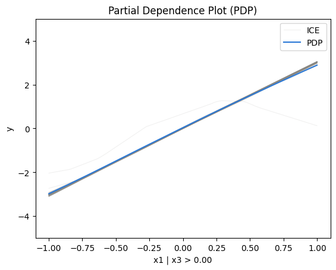
    


```python
regional_pdp.summary(features=1)
```

    
    
    Feature 1 - Full partition tree:
    🌳 Full Tree Structure:
    ───────────────────────
    x2 🔹 [id: 0 | heter: 0.01 | inst: 1000 | w: 1.00]
    --------------------------------------------------
    Feature 1 - Statistics per tree level:
    🌳 Tree Summary:
    ─────────────────
    Level 0🔹heter: 0.01
    
    


```python
regional_pdp.summary(features=2)
```

    
    
    Feature 2 - Full partition tree:
    🌳 Full Tree Structure:
    ───────────────────────
    x3 🔹 [id: 0 | heter: 2.72 | inst: 1000 | w: 1.00]
        x1 ≤ 0.00 🔹 [id: 1 | heter: 0.66 | inst: 494 | w: 0.49]
            x1 ≤ -0.40 🔹 [id: 2 | heter: 0.25 | inst: 301 | w: 0.30]
            x1 > -0.40 🔹 [id: 3 | heter: 0.11 | inst: 193 | w: 0.19]
        x1 > 0.00 🔹 [id: 4 | heter: 0.68 | inst: 506 | w: 0.51]
            x1 ≤ 0.40 🔹 [id: 5 | heter: 0.11 | inst: 199 | w: 0.20]
            x1 > 0.40 🔹 [id: 6 | heter: 0.25 | inst: 307 | w: 0.31]
    --------------------------------------------------
    Feature 2 - Statistics per tree level:
    🌳 Tree Summary:
    ─────────────────
    Level 0🔹heter: 2.72
        Level 1🔹heter: 0.67 | 🔻2.05 (75.44%)
            Level 2🔹heter: 0.19 | 🔻0.47 (70.86%)
    
    


```python
for node in regional_pdp.tree["feature_2"].nodes:
    if node.info["level"] == 1:
        regional_pdp.plot(feature=2, node_idx=node.idx, heterogeneity="ice", centering=True, y_limits=[-5, 5])
```


    
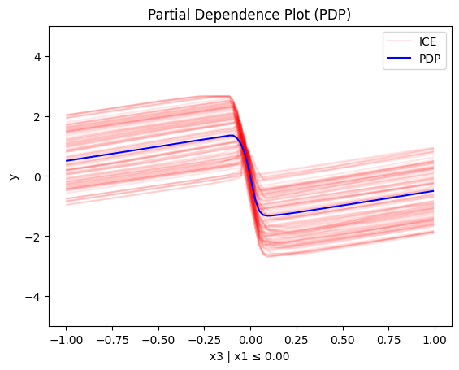
    


    
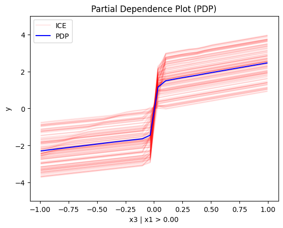
    


#### Conclusion

For the Global PDP:

   * the average effect of $x_1$ is $0$ with some heterogeneity implied by the interaction with $x_1$. The heterogeneity is expressed with two opposite lines; $-3x_1$ when $x_1 \leq 0$ and $3x_1$ when $x_1 >0$
   * the average effect of $x_2$ to be $0$ without heterogeneity
   * the average effect of $x_3$ to be $x_3$ with some heterogeneity due to the interaction with $x_1$. The heterogeneity is expressed with a discontinuity around $x_3=0$, with either a positive or a negative offset depending on the value of $x_1^i$

--- 

For the Regional PDP:

* For $x_1$, the algorithm finds two regions, one for $x_3 \leq 0$ and one for $x_3 > 0$
  * when $x_3>0$ the effect is $3x_1$
  * when $x_3 \leq 0$, the effect is $-3x_1$
* For $x_2$ the algorithm does not find any subregion 
* For $x_3$, there is a change in the offset:
  * when $x_1>0$ the line is $x_3 - 3x_1^i$ in the first half and $x_3 + 3x_1^i$ later
  * when $x_1<0$ the line is $x_3 + 3x_1^i$ in the first half and $x_3 - 3x_1^i$ later

### Correlated setting


#### Global PDP


```python
pdp = effector.PDP(data=X_cor_train, model=model_cor, schema={"feature_names": ['x1','x2','x3'], "target_name": "Y"})
pdp.plot(feature=0, centering=True, show_avg_output=False, heterogeneity="ice", y_limits=[-5, 5])
pdp.plot(feature=1, centering=True, show_avg_output=False, heterogeneity="ice", y_limits=[-5, 5])
pdp.plot(feature=2, centering=True, show_avg_output=False, heterogeneity="ice", y_limits=[-5, 5])
```


    

    


    

    


    
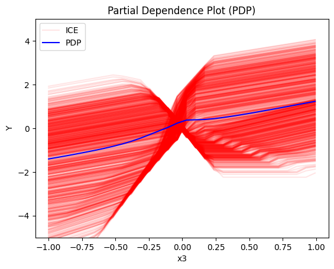
    


#### Regional-PDP


```python
regional_pdp = effector.RegionalPDP(data=X_cor_train, model=model_cor, schema={"feature_names": ['x1','x2','x3']}, axis_limits=np.array([[-1,1],[-1,1],[-1,1]]).T)
space_partitioner = effector.space_partitioning.Best(min_heterogeneity_decrease_pcg=0.4, numerical_features_grid_size=10)
regional_pdp.fit(features="all", space_partitioner=space_partitioner)
```

    
  0%|          | 0/3 [00:00<?, ?it/s]

    
100%|██████████| 3/3 [00:00<00:00, 23.07it/s]

    
100%|██████████| 3/3 [00:00<00:00, 22.69it/s]

    


```python
regional_pdp.summary(features=0)
```

    
    
    Feature 0 - Full partition tree:
    🌳 Full Tree Structure:
    ───────────────────────
    x1 🔹 [id: 0 | heter: 2.89 | inst: 900 | w: 1.00]
        x3 ≤ 0.00 🔹 [id: 1 | heter: 0.21 | inst: 436 | w: 0.48]
            x3 ≤ -0.20 🔹 [id: 2 | heter: 0.05 | inst: 337 | w: 0.37]
            x3 > -0.20 🔹 [id: 3 | heter: 0.14 | inst: 99 | w: 0.11]
        x3 > 0.00 🔹 [id: 4 | heter: 0.12 | inst: 464 | w: 0.52]
            x3 ≤ 0.20 🔹 [id: 5 | heter: 0.24 | inst: 115 | w: 0.13]
            x3 > 0.20 🔹 [id: 6 | heter: 0.01 | inst: 349 | w: 0.39]
    --------------------------------------------------
    Feature 0 - Statistics per tree level:
    🌳 Tree Summary:
    ─────────────────
    Level 0🔹heter: 2.89
        Level 1🔹heter: 0.16 | 🔻2.73 (94.31%)
            Level 2🔹heter: 0.07 | 🔻0.10 (58.75%)
    
    


```python
for node in regional_pdp.tree["feature_0"].nodes:
    if node.info["level"] == 1:
        regional_pdp.plot(feature=0, node_idx=node.idx, heterogeneity="ice", centering=True, y_limits=[-5, 5])
```


    
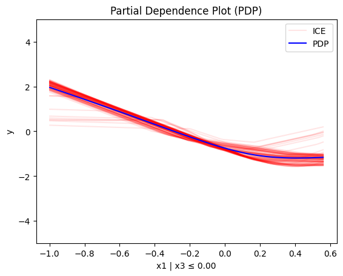
    


    
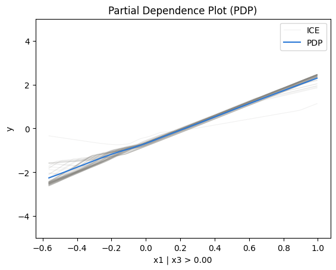
    


```python
regional_pdp.summary(features=1)
```

    
    
    Feature 1 - Full partition tree:
    🌳 Full Tree Structure:
    ───────────────────────
    x2 🔹 [id: 0 | heter: 0.00 | inst: 900 | w: 1.00]
    --------------------------------------------------
    Feature 1 - Statistics per tree level:
    🌳 Tree Summary:
    ─────────────────
    Level 0🔹heter: 0.00
    
    


```python
regional_pdp.summary(features=2)
```

    
    
    Feature 2 - Full partition tree:
    🌳 Full Tree Structure:
    ───────────────────────
    x3 🔹 [id: 0 | heter: 2.47 | inst: 900 | w: 1.00]
        x1 ≤ 0.00 🔹 [id: 1 | heter: 0.77 | inst: 463 | w: 0.51]
            x1 ≤ -0.40 🔹 [id: 2 | heter: 0.30 | inst: 246 | w: 0.27]
            x1 > -0.40 🔹 [id: 3 | heter: 0.12 | inst: 217 | w: 0.24]
        x1 > 0.00 🔹 [id: 4 | heter: 0.55 | inst: 437 | w: 0.49]
            x1 ≤ 0.40 🔹 [id: 5 | heter: 0.12 | inst: 189 | w: 0.21]
            x1 > 0.40 🔹 [id: 6 | heter: 0.17 | inst: 248 | w: 0.28]
    --------------------------------------------------
    Feature 2 - Statistics per tree level:
    🌳 Tree Summary:
    ─────────────────
    Level 0🔹heter: 2.47
        Level 1🔹heter: 0.66 | 🔻1.81 (73.16%)
            Level 2🔹heter: 0.18 | 🔻0.48 (72.37%)
    
    


```python
for node in regional_pdp.tree["feature_2"].nodes:
    if node.info["level"] == 1:
        regional_pdp.plot(feature=2, node_idx=node.idx, heterogeneity="ice", centering=True, y_limits=[-5, 5])
```


    
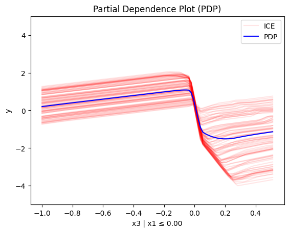
    


    
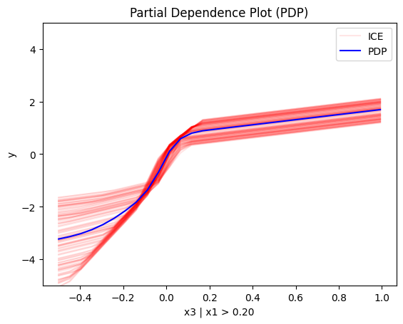
    


#### Conclusion

## (RH)ALE


```python
def model_uncor_jac(x):
    x_tensor = tf.convert_to_tensor(x, dtype=tf.float32)
    with tf.GradientTape() as t:
        t.watch(x_tensor)
        pred = model_uncor(x_tensor)
        grads = t.gradient(pred, x_tensor)
    return grads.numpy()

def model_cor_jac(x):
    x_tensor = tf.convert_to_tensor(x, dtype=tf.float32)
    with tf.GradientTape() as t:
        t.watch(x_tensor)
        pred = model_cor(x_tensor)
        grads = t.gradient(pred, x_tensor)
    return grads.numpy()
```

### Uncorrelated setting

#### Global RHALE


```python
rhale = effector.RHALE(data=X_uncor_train, model=model_uncor, model_jac=model_uncor_jac, schema={"feature_names": ['x1','x2','x3'], "target_name": "Y"})

binning_method = effector.axis_partitioning.Fixed(10, min_points_per_bin=0)
rhale.fit(features="all", binning_method=binning_method, centering=True)

rhale.plot(feature=0, centering=True, heterogeneity="std", show_avg_output=False, y_limits=[-5, 5], dy_limits=[-5, 5])
rhale.plot(feature=1, centering=True, heterogeneity="std", show_avg_output=False, y_limits=[-5, 5], dy_limits=[-5, 5])
rhale.plot(feature=2, centering=True, heterogeneity="std", show_avg_output=False, y_limits=[-5, 5], dy_limits=[-5, 5])
```


    
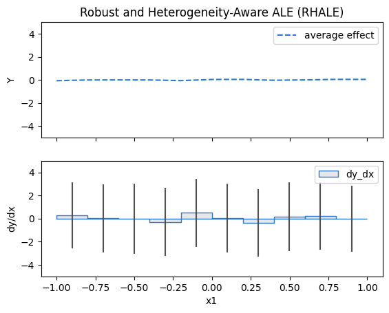
    


    
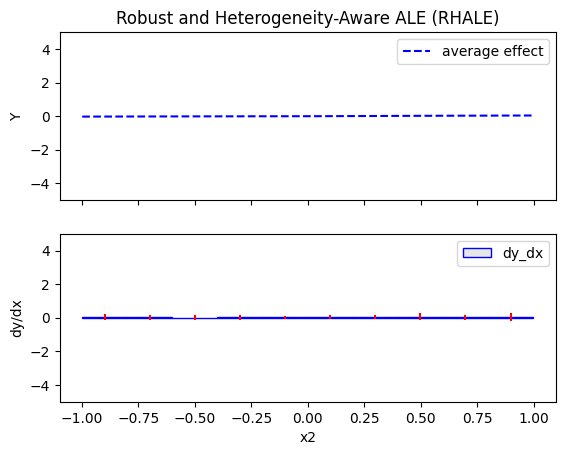
    


    

    


#### Regional RHALE


```python
regional_rhale = effector.RegionalRHALE(
    data=X_uncor_train, 
    model=model_uncor, 
    model_jac= model_uncor_jac, 
    schema={"feature_names": ['x1', 'x2', 'x3']},
    axis_limits=np.array([[-1, 1], [-1, 1], [-1, 1]]).T) 

binning_method = effector.axis_partitioning.Fixed(11, min_points_per_bin=0)
space_partitioner = effector.space_partitioning.Best(min_heterogeneity_decrease_pcg=0.6, numerical_features_grid_size=10)
regional_rhale.fit(
    features="all",
    binning_method=binning_method,
    space_partitioner=space_partitioner
)

```

    
  0%|          | 0/3 [00:00<?, ?it/s]

    
 33%|███▎      | 1/3 [00:00<00:00,  9.58it/s]

    
100%|██████████| 3/3 [00:00<00:00, 14.15it/s]

    
100%|██████████| 3/3 [00:00<00:00, 13.41it/s]

    


```python
regional_rhale.summary(features=0)
```

    
    
    Feature 0 - Full partition tree:
    🌳 Full Tree Structure:
    ───────────────────────
    x1 🔹 [id: 0 | heter: 8.10 | inst: 1000 | w: 1.00]
        x3 ≤ 0.00 🔹 [id: 1 | heter: 0.22 | inst: 500 | w: 0.50]
        x3 > 0.00 🔹 [id: 2 | heter: 0.30 | inst: 500 | w: 0.50]
    --------------------------------------------------
    Feature 0 - Statistics per tree level:
    🌳 Tree Summary:
    ─────────────────
    Level 0🔹heter: 8.10
        Level 1🔹heter: 0.26 | 🔻7.83 (96.74%)
    
    


```python
for node in regional_rhale.tree["feature_0"].nodes:
    if node.info["level"] == 1:
        regional_rhale.plot(feature=0, node_idx=node.idx, heterogeneity="std", centering=True, y_limits=[-5, 5])
```


    
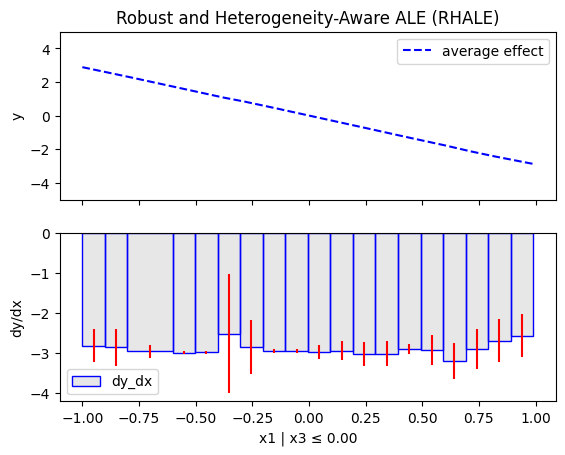
    


    
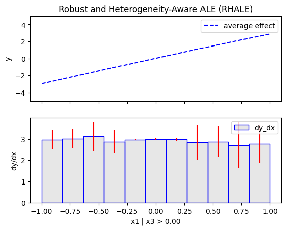
    


```python
regional_rhale.summary(features=1)
```

    
    
    Feature 1 - Full partition tree:
    🌳 Full Tree Structure:
    ───────────────────────
    x2 🔹 [id: 0 | heter: 0.03 | inst: 1000 | w: 1.00]
    --------------------------------------------------
    Feature 1 - Statistics per tree level:
    🌳 Tree Summary:
    ─────────────────
    Level 0🔹heter: 0.03
    
    


```python
regional_rhale.summary(features=2)
```

    
    
    Feature 2 - Full partition tree:
    🌳 Full Tree Structure:
    ───────────────────────
    x3 🔹 [id: 0 | heter: 48.80 | inst: 1000 | w: 1.00]
    --------------------------------------------------
    Feature 2 - Statistics per tree level:
    🌳 Tree Summary:
    ─────────────────
    Level 0🔹heter: 48.80
    
    


#### Conclusion

### Correlated setting

#### Global RHALE


```python
rhale = effector.RHALE(data=X_cor_train, model=model_cor, model_jac=model_cor_jac, schema={"feature_names": ['x1','x2','x3'], "target_name": "Y"})

binning_method = effector.axis_partitioning.Fixed(10, min_points_per_bin=0)
rhale.fit(features="all", binning_method=binning_method, centering=True)
```


```python
rhale.plot(feature=0, centering=True, heterogeneity="std", show_avg_output=False, y_limits=[-5, 5], dy_limits=[-5, 5])
rhale.plot(feature=1, centering=True, heterogeneity="std", show_avg_output=False, y_limits=[-5, 5], dy_limits=[-5, 5])
rhale.plot(feature=2, centering=True, heterogeneity="std", show_avg_output=False, y_limits=[-5, 5], dy_limits=[-5, 5])
```


    

    


    

    


    
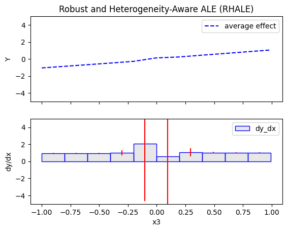
    


#### Regional RHALE


```python
regional_rhale = effector.RegionalRHALE(
    data=X_cor_train, 
    model=model_cor, 
    model_jac= model_cor_jac, 
    schema={"feature_names": ['x1', 'x2', 'x3']},
    axis_limits=np.array([[-1, 1], [-1, 1], [-1, 1]]).T) 

binning_method = effector.axis_partitioning.Fixed(11, min_points_per_bin=0)
space_partitioner = effector.space_partitioning.Best(min_heterogeneity_decrease_pcg=0.6, numerical_features_grid_size=10)
regional_rhale.fit(
    features="all",
    space_partitioner=space_partitioner,
)
```

    
  0%|          | 0/3 [00:00<?, ?it/s]

    
 33%|███▎      | 1/3 [00:00<00:00,  9.56it/s]

    
 67%|██████▋   | 2/3 [00:00<00:00,  8.65it/s]

    
100%|██████████| 3/3 [00:00<00:00,  9.24it/s]

    


```python
regional_rhale.summary(features=0)
```

    
    
    Feature 0 - Full partition tree:
    🌳 Full Tree Structure:
    ───────────────────────
    x1 🔹 [id: 0 | heter: 2.10 | inst: 900 | w: 1.00]
    --------------------------------------------------
    Feature 0 - Statistics per tree level:
    🌳 Tree Summary:
    ─────────────────
    Level 0🔹heter: 2.10
    
    


```python
regional_rhale.summary(features=1)
```

    
    
    Feature 1 - Full partition tree:
    🌳 Full Tree Structure:
    ───────────────────────
    x2 🔹 [id: 0 | heter: 0.01 | inst: 900 | w: 1.00]
    --------------------------------------------------
    Feature 1 - Statistics per tree level:
    🌳 Tree Summary:
    ─────────────────
    Level 0🔹heter: 0.01
    
    


```python
regional_rhale.summary(features=2)
```

    
    
    Feature 2 - Full partition tree:
    🌳 Full Tree Structure:
    ───────────────────────
    x3 🔹 [id: 0 | heter: 13.92 | inst: 900 | w: 1.00]
    --------------------------------------------------
    Feature 2 - Statistics per tree level:
    🌳 Tree Summary:
    ─────────────────
    Level 0🔹heter: 13.92
    
    


#### Conclusion

## SHAP DP
### Uncorrelated setting
#### Global SHAP DP


```python
shap = effector.ShapDP(data=X_uncor_train, model=model_uncor, schema={"feature_names": ['x1', 'x2', 'x3'], "target_name": "Y"})
binning_method = effector.axis_partitioning.Fixed(nof_bins=5, min_points_per_bin=0)
shap.fit(features="all", binning_method=binning_method, centering=True)
shap.plot(feature=0, centering=True, heterogeneity="shap_values", show_avg_output=False, y_limits=[-3, 3])
shap.plot(feature=1, centering=True, heterogeneity="shap_values", show_avg_output=False, y_limits=[-3, 3])
shap.plot(feature=2, centering=True, heterogeneity="shap_values", show_avg_output=False, y_limits=[-3, 3])

```

    
ExactExplainer explainer:   0%|          | 1/1000 [00:00<?, ?it/s]

    
ExactExplainer explainer:   1%|          | 11/1000 [00:10<00:10, 93.30it/s]

    
ExactExplainer explainer:   2%|▏         | 21/1000 [00:10<00:10, 95.40it/s]

    
ExactExplainer explainer:   3%|▎         | 31/1000 [00:10<00:10, 93.94it/s]

    
ExactExplainer explainer:   4%|▍         | 41/1000 [00:10<00:10, 95.75it/s]

    
ExactExplainer explainer:   5%|▌         | 52/1000 [00:10<00:09, 98.19it/s]

    
ExactExplainer explainer:   6%|▌         | 62/1000 [00:10<00:09, 97.53it/s]

    
ExactExplainer explainer:   7%|▋         | 73/1000 [00:11<00:09, 98.90it/s]

    
ExactExplainer explainer:   8%|▊         | 83/1000 [00:11<00:09, 99.12it/s]

    
ExactExplainer explainer:   9%|▉         | 94/1000 [00:11<00:09, 99.70it/s]

    
ExactExplainer explainer:  10%|█         | 104/1000 [00:11<00:09, 95.21it/s]

    
ExactExplainer explainer:  11%|█▏        | 114/1000 [00:11<00:09, 94.76it/s]

    
ExactExplainer explainer:  12%|█▏        | 124/1000 [00:11<00:09, 94.04it/s]

    
ExactExplainer explainer:  14%|█▎        | 135/1000 [00:11<00:09, 95.85it/s]

    
ExactExplainer explainer:  14%|█▍        | 145/1000 [00:11<00:08, 95.89it/s]

    
ExactExplainer explainer:  16%|█▌        | 155/1000 [00:11<00:08, 95.00it/s]

    
ExactExplainer explainer:  16%|█▋        | 165/1000 [00:12<00:08, 94.99it/s]

    
ExactExplainer explainer:  18%|█▊        | 175/1000 [00:12<00:08, 95.86it/s]

    
ExactExplainer explainer:  18%|█▊        | 185/1000 [00:12<00:08, 96.24it/s]

    
ExactExplainer explainer:  20%|█▉        | 195/1000 [00:12<00:08, 96.10it/s]

    
ExactExplainer explainer:  20%|██        | 205/1000 [00:12<00:08, 94.22it/s]

    
ExactExplainer explainer:  22%|██▏       | 215/1000 [00:12<00:08, 93.90it/s]

    
ExactExplainer explainer:  22%|██▎       | 225/1000 [00:12<00:08, 95.49it/s]

    
ExactExplainer explainer:  24%|██▎       | 235/1000 [00:12<00:08, 93.48it/s]

    
ExactExplainer explainer:  24%|██▍       | 245/1000 [00:12<00:08, 93.96it/s]

    
ExactExplainer explainer:  26%|██▌       | 255/1000 [00:13<00:07, 94.23it/s]

    
ExactExplainer explainer:  26%|██▋       | 265/1000 [00:13<00:07, 95.78it/s]

    
ExactExplainer explainer:  28%|██▊       | 275/1000 [00:13<00:07, 96.89it/s]

    
ExactExplainer explainer:  29%|██▊       | 286/1000 [00:13<00:07, 99.87it/s]

    
ExactExplainer explainer:  30%|██▉       | 296/1000 [00:13<00:07, 98.00it/s]

    
ExactExplainer explainer:  31%|███       | 306/1000 [00:13<00:07, 95.68it/s]

    
ExactExplainer explainer:  32%|███▏      | 316/1000 [00:13<00:07, 96.16it/s]

    
ExactExplainer explainer:  33%|███▎      | 326/1000 [00:13<00:07, 95.23it/s]

    
ExactExplainer explainer:  34%|███▎      | 336/1000 [00:13<00:06, 95.80it/s]

    
ExactExplainer explainer:  35%|███▍      | 346/1000 [00:13<00:06, 96.51it/s]

    
ExactExplainer explainer:  36%|███▌      | 357/1000 [00:14<00:06, 98.67it/s]

    
ExactExplainer explainer:  37%|███▋      | 368/1000 [00:14<00:06, 100.51it/s]

    
ExactExplainer explainer:  38%|███▊      | 379/1000 [00:14<00:06, 100.43it/s]

    
ExactExplainer explainer:  39%|███▉      | 390/1000 [00:14<00:06, 99.50it/s] 

    
ExactExplainer explainer:  40%|████      | 401/1000 [00:14<00:06, 99.69it/s]

    
ExactExplainer explainer:  41%|████      | 411/1000 [00:14<00:06, 92.93it/s]

    
ExactExplainer explainer:  42%|████▏     | 421/1000 [00:14<00:06, 91.01it/s]

    
ExactExplainer explainer:  43%|████▎     | 431/1000 [00:14<00:06, 89.38it/s]

    
ExactExplainer explainer:  44%|████▍     | 441/1000 [00:14<00:06, 90.02it/s]

    
ExactExplainer explainer:  45%|████▌     | 451/1000 [00:15<00:06, 89.57it/s]

    
ExactExplainer explainer:  46%|████▌     | 461/1000 [00:15<00:05, 89.86it/s]

    
ExactExplainer explainer:  47%|████▋     | 471/1000 [00:15<00:05, 90.62it/s]

    
ExactExplainer explainer:  48%|████▊     | 481/1000 [00:15<00:05, 88.88it/s]

    
ExactExplainer explainer:  49%|████▉     | 490/1000 [00:15<00:06, 84.60it/s]

    
ExactExplainer explainer:  50%|████▉     | 499/1000 [00:15<00:05, 84.09it/s]

    
ExactExplainer explainer:  51%|█████     | 508/1000 [00:15<00:05, 82.37it/s]

    
ExactExplainer explainer:  52%|█████▏    | 517/1000 [00:15<00:05, 82.98it/s]

    
ExactExplainer explainer:  53%|█████▎    | 527/1000 [00:15<00:05, 85.77it/s]

    
ExactExplainer explainer:  54%|█████▎    | 536/1000 [00:16<00:05, 84.78it/s]

    
ExactExplainer explainer:  55%|█████▍    | 545/1000 [00:16<00:05, 83.22it/s]

    
ExactExplainer explainer:  56%|█████▌    | 555/1000 [00:16<00:05, 87.63it/s]

    
ExactExplainer explainer:  57%|█████▋    | 566/1000 [00:16<00:04, 92.24it/s]

    
ExactExplainer explainer:  58%|█████▊    | 577/1000 [00:16<00:04, 95.30it/s]

    
ExactExplainer explainer:  59%|█████▊    | 587/1000 [00:16<00:04, 95.89it/s]

    
ExactExplainer explainer:  60%|█████▉    | 597/1000 [00:16<00:04, 96.87it/s]

    
ExactExplainer explainer:  61%|██████    | 607/1000 [00:16<00:04, 94.76it/s]

    
ExactExplainer explainer:  62%|██████▏   | 618/1000 [00:16<00:03, 97.25it/s]

    
ExactExplainer explainer:  63%|██████▎   | 629/1000 [00:17<00:03, 99.77it/s]

    
ExactExplainer explainer:  64%|██████▍   | 639/1000 [00:17<00:03, 98.26it/s]

    
ExactExplainer explainer:  65%|██████▍   | 649/1000 [00:17<00:03, 97.87it/s]

    
ExactExplainer explainer:  66%|██████▌   | 659/1000 [00:17<00:03, 93.48it/s]

    
ExactExplainer explainer:  67%|██████▋   | 670/1000 [00:17<00:03, 96.26it/s]

    
ExactExplainer explainer:  68%|██████▊   | 680/1000 [00:17<00:03, 95.15it/s]

    
ExactExplainer explainer:  69%|██████▉   | 690/1000 [00:17<00:03, 95.53it/s]

    
ExactExplainer explainer:  70%|███████   | 700/1000 [00:17<00:03, 92.97it/s]

    
ExactExplainer explainer:  71%|███████   | 710/1000 [00:17<00:03, 93.11it/s]

    
ExactExplainer explainer:  72%|███████▏  | 720/1000 [00:18<00:02, 94.73it/s]

    
ExactExplainer explainer:  73%|███████▎  | 730/1000 [00:18<00:02, 95.84it/s]

    
ExactExplainer explainer:  74%|███████▍  | 740/1000 [00:18<00:02, 94.30it/s]

    
ExactExplainer explainer:  75%|███████▌  | 750/1000 [00:18<00:02, 93.11it/s]

    
ExactExplainer explainer:  76%|███████▌  | 761/1000 [00:18<00:02, 97.02it/s]

    
ExactExplainer explainer:  77%|███████▋  | 772/1000 [00:18<00:02, 97.95it/s]

    
ExactExplainer explainer:  78%|███████▊  | 782/1000 [00:18<00:02, 96.32it/s]

    
ExactExplainer explainer:  79%|███████▉  | 792/1000 [00:18<00:02, 93.93it/s]

    
ExactExplainer explainer:  80%|████████  | 802/1000 [00:18<00:02, 90.17it/s]

    
ExactExplainer explainer:  81%|████████  | 812/1000 [00:18<00:02, 90.37it/s]

    
ExactExplainer explainer:  82%|████████▏ | 823/1000 [00:19<00:01, 94.02it/s]

    
ExactExplainer explainer:  83%|████████▎ | 833/1000 [00:19<00:01, 93.70it/s]

    
ExactExplainer explainer:  84%|████████▍ | 843/1000 [00:19<00:01, 92.73it/s]

    
ExactExplainer explainer:  85%|████████▌ | 853/1000 [00:19<00:01, 91.65it/s]

    
ExactExplainer explainer:  86%|████████▋ | 863/1000 [00:19<00:01, 91.43it/s]

    
ExactExplainer explainer:  87%|████████▋ | 873/1000 [00:19<00:01, 91.19it/s]

    
ExactExplainer explainer:  88%|████████▊ | 883/1000 [00:19<00:01, 90.95it/s]

    
ExactExplainer explainer:  89%|████████▉ | 894/1000 [00:19<00:01, 94.41it/s]

    
ExactExplainer explainer:  90%|█████████ | 904/1000 [00:19<00:01, 91.24it/s]

    
ExactExplainer explainer:  91%|█████████▏| 914/1000 [00:20<00:00, 90.26it/s]

    
ExactExplainer explainer:  92%|█████████▏| 924/1000 [00:20<00:00, 91.89it/s]

    
ExactExplainer explainer:  93%|█████████▎| 934/1000 [00:20<00:00, 89.95it/s]

    
ExactExplainer explainer:  94%|█████████▍| 944/1000 [00:20<00:00, 87.60it/s]

    
ExactExplainer explainer:  95%|█████████▌| 954/1000 [00:20<00:00, 88.28it/s]

    
ExactExplainer explainer:  96%|█████████▋| 964/1000 [00:20<00:00, 90.80it/s]

    
ExactExplainer explainer:  98%|█████████▊| 975/1000 [00:20<00:00, 94.77it/s]

    
ExactExplainer explainer:  98%|█████████▊| 985/1000 [00:20<00:00, 94.88it/s]

    
ExactExplainer explainer: 100%|█████████▉| 995/1000 [00:20<00:00, 92.97it/s]

    
ExactExplainer explainer: 1001it [00:21, 47.52it/s]                         

    


    
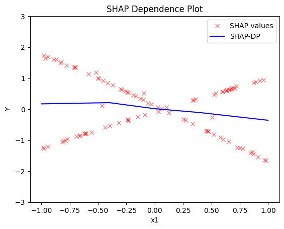
    


    
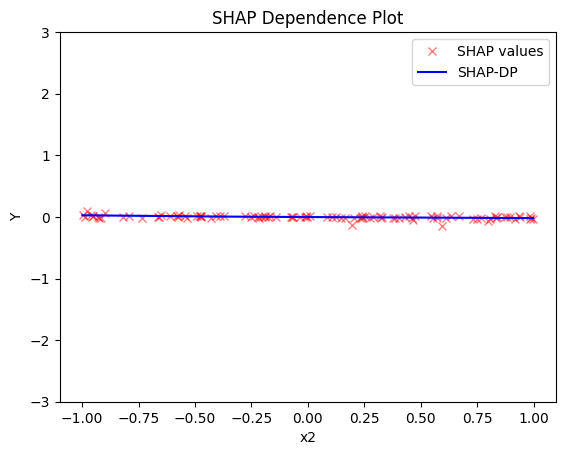
    


    
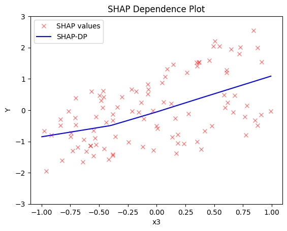
    


#### Regional SHAP-DP


```python
regional_shap = effector.RegionalShapDP(
    data=X_uncor_train,
    model=model_uncor,
    schema={"feature_names": ['x1', 'x2', 'x3']},
    axis_limits=np.array([[-1, 1], [-1, 1], [-1, 1]]).T)

space_partitioner = effector.space_partitioning.Best(min_heterogeneity_decrease_pcg=0.6, numerical_features_grid_size=10)
regional_shap.fit(
    features="all",
    space_partitioner=space_partitioner,
    binning_method = effector.axis_partitioning.Fixed(nof_bins=5, min_points_per_bin=0)
)

```

    
  0%|          | 0/3 [00:00<?, ?it/s]

    
 33%|███▎      | 1/3 [00:10<00:20, 10.04s/it]

    
100%|██████████| 3/3 [00:10<00:00,  3.37s/it]

    


```python
regional_shap.summary(0)
```

    
    
    Feature 0 - Full partition tree:
    🌳 Full Tree Structure:
    ───────────────────────
    x1 🔹 [id: 0 | heter: 0.78 | inst: 1000 | w: 1.00]
        x3 ≤ 0.00 🔹 [id: 1 | heter: 0.04 | inst: 500 | w: 0.50]
        x3 > 0.00 🔹 [id: 2 | heter: 0.03 | inst: 500 | w: 0.50]
    --------------------------------------------------
    Feature 0 - Statistics per tree level:
    🌳 Tree Summary:
    ─────────────────
    Level 0🔹heter: 0.78
        Level 1🔹heter: 0.03 | 🔻0.74 (95.53%)
    
    


```python
for node in regional_shap.tree["feature_0"].nodes:
    if node.info["level"] == 1:
        regional_shap.plot(feature=0, node_idx=node.idx, heterogeneity="std", centering=True, y_limits=[-5, 5])
```


    
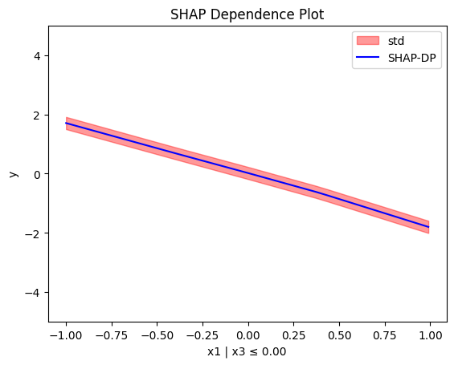
    


    
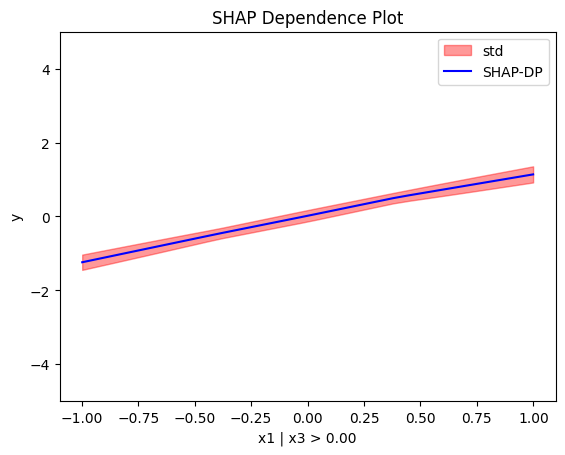
    


```python
regional_shap.summary(features=1)
```

    
    
    Feature 1 - Full partition tree:
    🌳 Full Tree Structure:
    ───────────────────────
    x2 🔹 [id: 0 | heter: 0.00 | inst: 1000 | w: 1.00]
    --------------------------------------------------
    Feature 1 - Statistics per tree level:
    🌳 Tree Summary:
    ─────────────────
    Level 0🔹heter: 0.00
    
    


```python
regional_shap.summary(features=2)
```

    
    
    Feature 2 - Full partition tree:
    🌳 Full Tree Structure:
    ───────────────────────
    x3 🔹 [id: 0 | heter: 0.72 | inst: 1000 | w: 1.00]
        x1 ≤ 0.00 🔹 [id: 1 | heter: 0.23 | inst: 494 | w: 0.49]
        x1 > 0.00 🔹 [id: 2 | heter: 0.33 | inst: 506 | w: 0.51]
    --------------------------------------------------
    Feature 2 - Statistics per tree level:
    🌳 Tree Summary:
    ─────────────────
    Level 0🔹heter: 0.72
        Level 1🔹heter: 0.28 | 🔻0.44 (60.89%)
    
    


#### Conclusion

### Correlated setting

#### Global SHAP-DP


```python

shap = effector.ShapDP(data=X_cor_train, model=model_cor, schema={"feature_names": ['x1', 'x2', 'x3'], "target_name": "Y"})
binning_method = effector.axis_partitioning.Fixed(nof_bins=5, min_points_per_bin=0)
shap.fit(features="all", binning_method=binning_method, centering=True)
shap.plot(feature=0, centering=True, heterogeneity="shap_values", show_avg_output=False, y_limits=[-3, 3])
shap.plot(feature=1, centering=True, heterogeneity="shap_values", show_avg_output=False, y_limits=[-3, 3])
shap.plot(feature=2, centering=True, heterogeneity="shap_values", show_avg_output=False, y_limits=[-3, 3])

```

    
ExactExplainer explainer: 100%|█████████▉| 999/1000 [00:00<?, ?it/s]

    
ExactExplainer explainer: 1001it [00:10,  5.01s/it]                 

    


    
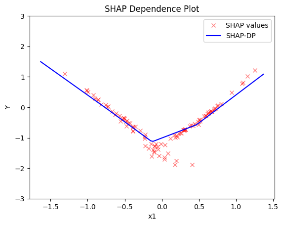
    


    
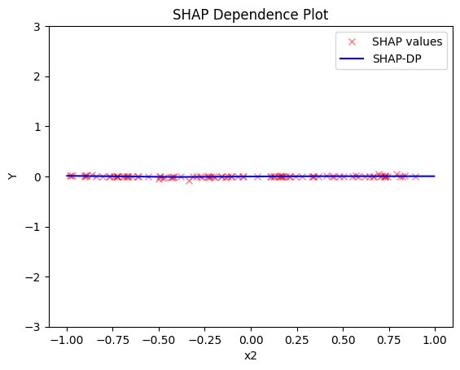
    


    
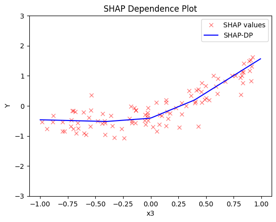
    


#### Regional SHAP


```python
regional_shap = effector.RegionalShapDP(
    data=X_cor_train,
    model=model_cor,
    schema={"feature_names": ['x1', 'x2', 'x3']},
    axis_limits=np.array([[-1, 1], [-1, 1], [-1, 1]]).T)

space_partitioner = effector.space_partitioning.Best(min_heterogeneity_decrease_pcg=0.6, numerical_features_grid_size=10)
regional_shap.fit(
    features="all",
    space_partitioner=space_partitioner,
    binning_method = effector.axis_partitioning.Fixed(nof_bins=5, min_points_per_bin=0)
)
```

    
  0%|          | 0/3 [00:00<?, ?it/s]

    
 33%|███▎      | 1/3 [00:08<00:17,  8.95s/it]

    
100%|██████████| 3/3 [00:08<00:00,  2.99s/it]

    


```python
regional_shap.summary(0)
regional_shap.summary(1)
regional_shap.summary(2)
```

    
    
    Feature 0 - Full partition tree:
    🌳 Full Tree Structure:
    ───────────────────────
    x1 🔹 [id: 0 | heter: 0.08 | inst: 900 | w: 1.00]
    --------------------------------------------------
    Feature 0 - Statistics per tree level:
    🌳 Tree Summary:
    ─────────────────
    Level 0🔹heter: 0.08
    
    
    
    
    Feature 1 - Full partition tree:
    🌳 Full Tree Structure:
    ───────────────────────
    x2 🔹 [id: 0 | heter: 0.00 | inst: 900 | w: 1.00]
    --------------------------------------------------
    Feature 1 - Statistics per tree level:
    🌳 Tree Summary:
    ─────────────────
    Level 0🔹heter: 0.00
    
    
    
    
    Feature 2 - Full partition tree:
    🌳 Full Tree Structure:
    ───────────────────────
    x3 🔹 [id: 0 | heter: 0.12 | inst: 900 | w: 1.00]
    --------------------------------------------------
    Feature 2 - Statistics per tree level:
    🌳 Tree Summary:
    ─────────────────
    Level 0🔹heter: 0.12
    
    


#### Conclusion


```python

```
