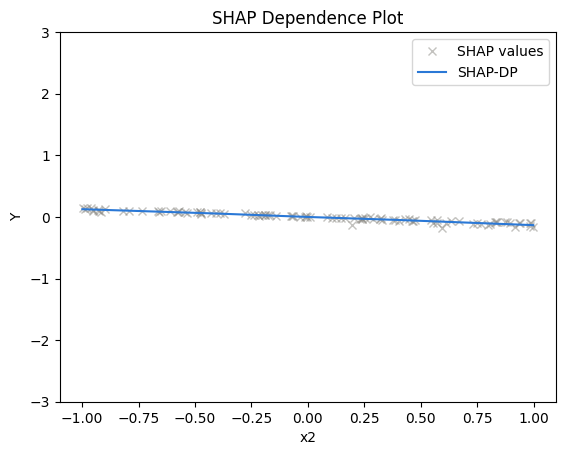

# Regional Effects (unknown black-box function)

- Author: [givasile](https://givasile.github.io/)
- Runtime: ~55 s
- Description: The realistic follow-up to tutorial 03: a neural network is
  fitted on the data and explained with regional PDP, RHALE and SHAP-DP,
  under uncorrelated and correlated features.

This tutorial use the same dataset with the previous [tutorial](./03_regional_effects_synthetic_f/), but instead of explaining the known (synthetic) predictive function, we fit a neural network on the data and explain the neural network. This is a more realistic scenario, since in real-world applications we do not know the underlying function and we only have access to the data. We advise the reader to first read the previous tutorial.


```python
import numpy as np
import effector
import keras
import tensorflow as tf

np.random.seed(12345)
tf.random.set_seed(12345)
```

    WARNING: All log messages before absl::InitializeLog() is called are written to STDERR
    I0000 00:00:1783613913.606351  217817 cpu_feature_guard.cc:227] This TensorFlow binary is optimized to use available CPU instructions in performance-critical operations.
    To enable the following instructions: AVX2 FMA, in other operations, rebuild TensorFlow with the appropriate compiler flags.


<!-- ## Simulation example

### Data Generating Distribution

We will generate $N=1000$ examples with $D=3$ features, which are in the uncorrelated setting all uniformly distributed as follows:

<center>

| Feature | Description                                | Distribution                 |
|---------|--------------------------------------------|------------------------------|
| $x_1$   | Uniformly distributed between $-1$ and $1$ | $x_1 \sim \mathcal{U}(-1,1)$ |
| $x_2$   | Uniformly distributed between $-1$ and $1$ | $x_2 \sim \mathcal{U}(-1,1)$ |
| $x_3$   | Uniformly distributed between $-1$ and $1$ | $x_3 \sim \mathcal{U}(-1,1)$ |

</center>

For the correlated setting we keep the distributional assumptions for $x_2$ and $x_3$ but define $x_1$ such that it is highly correlated with $x_3$ by: $x_1 = x_3 + \delta$ with $\delta \sim \mathcal{N}(0,0.0625)$. -->

## Simulation example

### Data Generating Distribution

We will generate $N=1000$ examples with $D=3$ features, which are in the uncorrelated setting all uniformly distributed as follows:

| Feature | Description                                | Distribution                 |
|---------|--------------------------------------------|------------------------------|
| $x_1$   | Uniformly distributed between $-1$ and $1$ | $x_1 \sim \mathcal{U}(-1,1)$ |
| $x_2$   | Uniformly distributed between $-1$ and $1$ | $x_2 \sim \mathcal{U}(-1,1)$ |
| $x_3$   | Uniformly distributed between $-1$ and $1$ | $x_3 \sim \mathcal{U}(-1,1)$ |

For the correlated setting, we keep the distributional assumptions for $x_2$ and $x_3$, but define $x_1$ such that it is highly correlated with $x_3$ by:  
$x_1 = x_3 + \delta$ with $\delta \sim \mathcal{N}(0,0.0625)$.


```python
def generate_dataset_uncorrelated(N):
    x1 = np.random.uniform(-1, 1, size=N)
    x2 = np.random.uniform(-1, 1, size=N)
    x3 = np.random.uniform(-1, 1, size=N)
    return np.stack((x1, x2, x3), axis=-1)

def generate_dataset_correlated(N):
    x3 = np.random.uniform(-1, 1, size=N)
    x2 = np.random.uniform(-1, 1, size=N)
    x1 = x3 + np.random.normal(loc = np.zeros_like(x3), scale = 0.25)
    return np.stack((x1, x2, x3), axis=-1)

# generate the dataset for the uncorrelated and correlated setting
N = 1000
X_uncor_train = generate_dataset_uncorrelated(N)
X_uncor_test = generate_dataset_uncorrelated(10000)
X_cor_train = generate_dataset_correlated(N)
X_cor_test = generate_dataset_correlated(10000)
```

### Black-box function

We will use the following linear model with a subgroup-specific interaction term:
 $$ y = 3x_1I_{x_3>0} - 3x_1I_{x_3\leq0} + x_3$$ 
 
On a global level, there is a high heterogeneity for the features $x_1$ and $x_3$ due to their interaction with each other. However, this heterogeneity vanishes to 0 if the feature space is separated into subregions:

<center>

| Feature | Region      | Average Effect | Heterogeneity |
|---------|-------------|----------------|---------------|
| $x_1$   | $x_3>0$     | $3x_1$         | 0             |
| $x_1$   | $x_3\leq 0$ | $-3x_1$        | 0             |
| $x_2$   | all         | 0              | 0             |
| $x_3$   | $x_3>0$     | $x_3$          | 0             |
| $x_3$   | $x_3\leq 0$ | $x_3$          | 0             |

</center>


```python
def generate_target(X):
    f = np.where(X[:,2] > 0, 3*X[:,0] + X[:,2], -3*X[:,0] + X[:,2])
    epsilon = np.random.normal(loc = np.zeros_like(X[:,0]), scale = 0.1)
    Y = f + epsilon
    return(Y)

# generate target for uncorrelated and correlated setting
Y_uncor_train = generate_target(X_uncor_train)
Y_uncor_test = generate_target(X_uncor_test)
Y_cor_train = generate_target(X_cor_train)
Y_cor_test = generate_target(X_cor_test)      
```

### Fit a Neural Network

We create a two-layer feedforward Neural Network, a weight decay of 0.01 for 100 epochs. We train two instances of this NN, one on the uncorrelated and one on the correlated setting. In both cases, the NN achieves a Mean Squared Error of about $0.17$ units.


```python
# Train - Evaluate - Explain a neural network
model_uncor = keras.Sequential([
    keras.layers.Dense(10, activation="relu", input_shape=(3,)),
    keras.layers.Dense(10, activation="relu", input_shape=(3,)),
    keras.layers.Dense(1)
])

optimizer = keras.optimizers.Adam(learning_rate=0.01)
model_uncor.compile(optimizer=optimizer, loss="mse")
model_uncor.fit(X_uncor_train, Y_uncor_train, epochs=100)
model_uncor.evaluate(X_uncor_test, Y_uncor_test)
```

    Epoch 1/100


    /home/givasile/github/packages/effector/.venv/lib/python3.10/site-packages/keras/src/layers/core/dense.py:95: UserWarning: Do not pass an `input_shape`/`input_dim` argument to a layer. When using Sequential models, prefer using an `Input(shape)` object as the first layer in the model instead.
      super().__init__(activity_regularizer=activity_regularizer, **kwargs)


    
 1/32 ━━━━━━━━━━━━━━━━━━━━ 20s 658ms/step - loss: 3.5285

    
28/32 ━━━━━━━━━━━━━━━━━━━━ 0s 2ms/step - loss: 2.9950   

    
32/32 ━━━━━━━━━━━━━━━━━━━━ 1s 2ms/step - loss: 2.5834


    Epoch 2/100


    
 1/32 ━━━━━━━━━━━━━━━━━━━━ 0s 18ms/step - loss: 1.8397

    
28/32 ━━━━━━━━━━━━━━━━━━━━ 0s 2ms/step - loss: 1.3296 

    
32/32 ━━━━━━━━━━━━━━━━━━━━ 0s 2ms/step - loss: 1.1174


    Epoch 3/100


    
 1/32 ━━━━━━━━━━━━━━━━━━━━ 0s 27ms/step - loss: 0.7969

    
16/32 ━━━━━━━━━━━━━━━━━━━━ 0s 4ms/step - loss: 0.6378 

    
32/32 ━━━━━━━━━━━━━━━━━━━━ 0s 3ms/step - loss: 0.6125


    Epoch 4/100


    
 1/32 ━━━━━━━━━━━━━━━━━━━━ 0s 24ms/step - loss: 0.5227

    
32/32 ━━━━━━━━━━━━━━━━━━━━ 0s 2ms/step - loss: 0.4320 


    Epoch 5/100


    
 1/32 ━━━━━━━━━━━━━━━━━━━━ 0s 21ms/step - loss: 0.4059

    
32/32 ━━━━━━━━━━━━━━━━━━━━ 0s 2ms/step - loss: 0.3297 


    Epoch 6/100


    
 1/32 ━━━━━━━━━━━━━━━━━━━━ 0s 20ms/step - loss: 0.3317

    
29/32 ━━━━━━━━━━━━━━━━━━━━ 0s 2ms/step - loss: 0.2596 

    
32/32 ━━━━━━━━━━━━━━━━━━━━ 0s 2ms/step - loss: 0.2723


    Epoch 7/100


    
 1/32 ━━━━━━━━━━━━━━━━━━━━ 0s 17ms/step - loss: 0.2753

    
32/32 ━━━━━━━━━━━━━━━━━━━━ 0s 2ms/step - loss: 0.2340 


    Epoch 8/100


    
 1/32 ━━━━━━━━━━━━━━━━━━━━ 0s 17ms/step - loss: 0.2430

    
32/32 ━━━━━━━━━━━━━━━━━━━━ 0s 2ms/step - loss: 0.2069 


    Epoch 9/100


    
 1/32 ━━━━━━━━━━━━━━━━━━━━ 0s 19ms/step - loss: 0.2124

    
32/32 ━━━━━━━━━━━━━━━━━━━━ 0s 2ms/step - loss: 0.1895 


    Epoch 10/100


    
 1/32 ━━━━━━━━━━━━━━━━━━━━ 0s 17ms/step - loss: 0.1904

    
32/32 ━━━━━━━━━━━━━━━━━━━━ 0s 2ms/step - loss: 0.1765 


    Epoch 11/100


    
 1/32 ━━━━━━━━━━━━━━━━━━━━ 0s 25ms/step - loss: 0.1786

    
32/32 ━━━━━━━━━━━━━━━━━━━━ 0s 2ms/step - loss: 0.1650 


    Epoch 12/100


    
 1/32 ━━━━━━━━━━━━━━━━━━━━ 0s 17ms/step - loss: 0.1702

    
32/32 ━━━━━━━━━━━━━━━━━━━━ 0s 2ms/step - loss: 0.1543 


    Epoch 13/100


    
 1/32 ━━━━━━━━━━━━━━━━━━━━ 0s 18ms/step - loss: 0.1565

    
32/32 ━━━━━━━━━━━━━━━━━━━━ 0s 2ms/step - loss: 0.1457 


    Epoch 14/100


    
 1/32 ━━━━━━━━━━━━━━━━━━━━ 0s 21ms/step - loss: 0.1442

    
27/32 ━━━━━━━━━━━━━━━━━━━━ 0s 2ms/step - loss: 0.1182 

    
32/32 ━━━━━━━━━━━━━━━━━━━━ 0s 2ms/step - loss: 0.1401


    Epoch 15/100


    
 1/32 ━━━━━━━━━━━━━━━━━━━━ 0s 20ms/step - loss: 0.1363

    
32/32 ━━━━━━━━━━━━━━━━━━━━ 0s 2ms/step - loss: 0.1360 


    Epoch 16/100


    
 1/32 ━━━━━━━━━━━━━━━━━━━━ 0s 19ms/step - loss: 0.1300

    
32/32 ━━━━━━━━━━━━━━━━━━━━ 0s 2ms/step - loss: 0.1316 


    Epoch 17/100


    
 1/32 ━━━━━━━━━━━━━━━━━━━━ 0s 20ms/step - loss: 0.1244

    
32/32 ━━━━━━━━━━━━━━━━━━━━ 0s 2ms/step - loss: 0.1280 


    Epoch 18/100


    
 1/32 ━━━━━━━━━━━━━━━━━━━━ 0s 19ms/step - loss: 0.1189

    
32/32 ━━━━━━━━━━━━━━━━━━━━ 0s 2ms/step - loss: 0.1247 


    Epoch 19/100


    
 1/32 ━━━━━━━━━━━━━━━━━━━━ 1s 34ms/step - loss: 0.1127

    
24/32 ━━━━━━━━━━━━━━━━━━━━ 0s 2ms/step - loss: 0.0938 

    
32/32 ━━━━━━━━━━━━━━━━━━━━ 0s 3ms/step - loss: 0.1211


    Epoch 20/100


    
 1/32 ━━━━━━━━━━━━━━━━━━━━ 0s 17ms/step - loss: 0.1067

    
32/32 ━━━━━━━━━━━━━━━━━━━━ 0s 2ms/step - loss: 0.1179 


    Epoch 21/100


    
 1/32 ━━━━━━━━━━━━━━━━━━━━ 0s 17ms/step - loss: 0.1001

    
32/32 ━━━━━━━━━━━━━━━━━━━━ 0s 2ms/step - loss: 0.1146 


    Epoch 22/100


    
 1/32 ━━━━━━━━━━━━━━━━━━━━ 0s 20ms/step - loss: 0.0954

    
32/32 ━━━━━━━━━━━━━━━━━━━━ 0s 2ms/step - loss: 0.1117 


    Epoch 23/100


    
 1/32 ━━━━━━━━━━━━━━━━━━━━ 0s 17ms/step - loss: 0.0912

    
32/32 ━━━━━━━━━━━━━━━━━━━━ 0s 2ms/step - loss: 0.1087 


    Epoch 24/100


    
 1/32 ━━━━━━━━━━━━━━━━━━━━ 0s 16ms/step - loss: 0.0871

    
32/32 ━━━━━━━━━━━━━━━━━━━━ 0s 2ms/step - loss: 0.1052 


    Epoch 25/100


    
 1/32 ━━━━━━━━━━━━━━━━━━━━ 0s 16ms/step - loss: 0.0844

    
32/32 ━━━━━━━━━━━━━━━━━━━━ 0s 2ms/step - loss: 0.1031 


    Epoch 26/100


    
 1/32 ━━━━━━━━━━━━━━━━━━━━ 0s 17ms/step - loss: 0.0809

    
32/32 ━━━━━━━━━━━━━━━━━━━━ 0s 2ms/step - loss: 0.0998 


    Epoch 27/100


    
 1/32 ━━━━━━━━━━━━━━━━━━━━ 0s 18ms/step - loss: 0.0777

    
32/32 ━━━━━━━━━━━━━━━━━━━━ 0s 2ms/step - loss: 0.0787 

    
32/32 ━━━━━━━━━━━━━━━━━━━━ 0s 2ms/step - loss: 0.0968


    Epoch 28/100


    
 1/32 ━━━━━━━━━━━━━━━━━━━━ 0s 18ms/step - loss: 0.0770

    
32/32 ━━━━━━━━━━━━━━━━━━━━ 0s 2ms/step - loss: 0.0967 


    Epoch 29/100


    
 1/32 ━━━━━━━━━━━━━━━━━━━━ 0s 16ms/step - loss: 0.0741

    
32/32 ━━━━━━━━━━━━━━━━━━━━ 0s 2ms/step - loss: 0.0930 


    Epoch 30/100


    
 1/32 ━━━━━━━━━━━━━━━━━━━━ 0s 21ms/step - loss: 0.0729

    
32/32 ━━━━━━━━━━━━━━━━━━━━ 0s 2ms/step - loss: 0.0918 


    Epoch 31/100


    
 1/32 ━━━━━━━━━━━━━━━━━━━━ 0s 19ms/step - loss: 0.0735

    
29/32 ━━━━━━━━━━━━━━━━━━━━ 0s 2ms/step - loss: 0.0735 

    
32/32 ━━━━━━━━━━━━━━━━━━━━ 0s 2ms/step - loss: 0.0926


    Epoch 32/100


    
 1/32 ━━━━━━━━━━━━━━━━━━━━ 0s 17ms/step - loss: 0.0759

    
32/32 ━━━━━━━━━━━━━━━━━━━━ 0s 2ms/step - loss: 0.0933 


    Epoch 33/100


    
 1/32 ━━━━━━━━━━━━━━━━━━━━ 0s 19ms/step - loss: 0.0727

    
32/32 ━━━━━━━━━━━━━━━━━━━━ 0s 2ms/step - loss: 0.0908 


    Epoch 34/100


    
 1/32 ━━━━━━━━━━━━━━━━━━━━ 0s 22ms/step - loss: 0.0698

    
27/32 ━━━━━━━━━━━━━━━━━━━━ 0s 2ms/step - loss: 0.0685 

    
32/32 ━━━━━━━━━━━━━━━━━━━━ 0s 3ms/step - loss: 0.0912


    Epoch 35/100


    
 1/32 ━━━━━━━━━━━━━━━━━━━━ 0s 17ms/step - loss: 0.0684

    
32/32 ━━━━━━━━━━━━━━━━━━━━ 0s 2ms/step - loss: 0.0889 


    Epoch 36/100


    
 1/32 ━━━━━━━━━━━━━━━━━━━━ 0s 17ms/step - loss: 0.0642

    
32/32 ━━━━━━━━━━━━━━━━━━━━ 0s 2ms/step - loss: 0.0856 


    Epoch 37/100


    
 1/32 ━━━━━━━━━━━━━━━━━━━━ 0s 21ms/step - loss: 0.0626

    
32/32 ━━━━━━━━━━━━━━━━━━━━ 0s 2ms/step - loss: 0.0872 


    Epoch 38/100


    
 1/32 ━━━━━━━━━━━━━━━━━━━━ 0s 18ms/step - loss: 0.0642

    
32/32 ━━━━━━━━━━━━━━━━━━━━ 0s 2ms/step - loss: 0.0885 


    Epoch 39/100


    
 1/32 ━━━━━━━━━━━━━━━━━━━━ 0s 17ms/step - loss: 0.0599

    
32/32 ━━━━━━━━━━━━━━━━━━━━ 0s 2ms/step - loss: 0.0801 


    Epoch 40/100


    
 1/32 ━━━━━━━━━━━━━━━━━━━━ 0s 17ms/step - loss: 0.0559

    
32/32 ━━━━━━━━━━━━━━━━━━━━ 0s 2ms/step - loss: 0.0843 


    Epoch 41/100


    
 1/32 ━━━━━━━━━━━━━━━━━━━━ 0s 16ms/step - loss: 0.0608

    
32/32 ━━━━━━━━━━━━━━━━━━━━ 0s 2ms/step - loss: 0.0866 


    Epoch 42/100


    
 1/32 ━━━━━━━━━━━━━━━━━━━━ 0s 17ms/step - loss: 0.0565

    
32/32 ━━━━━━━━━━━━━━━━━━━━ 0s 2ms/step - loss: 0.0763 


    Epoch 43/100


    
 1/32 ━━━━━━━━━━━━━━━━━━━━ 0s 21ms/step - loss: 0.0534

    
32/32 ━━━━━━━━━━━━━━━━━━━━ 0s 2ms/step - loss: 0.0854 


    Epoch 44/100


    
 1/32 ━━━━━━━━━━━━━━━━━━━━ 0s 18ms/step - loss: 0.0572

    
32/32 ━━━━━━━━━━━━━━━━━━━━ 0s 2ms/step - loss: 0.0796 


    Epoch 45/100


    
 1/32 ━━━━━━━━━━━━━━━━━━━━ 0s 20ms/step - loss: 0.0513

    
32/32 ━━━━━━━━━━━━━━━━━━━━ 0s 2ms/step - loss: 0.0754 


    Epoch 46/100


    
 1/32 ━━━━━━━━━━━━━━━━━━━━ 0s 17ms/step - loss: 0.0554

    
32/32 ━━━━━━━━━━━━━━━━━━━━ 0s 2ms/step - loss: 0.0880 


    Epoch 47/100


    
 1/32 ━━━━━━━━━━━━━━━━━━━━ 0s 25ms/step - loss: 0.0594

    
32/32 ━━━━━━━━━━━━━━━━━━━━ 0s 2ms/step - loss: 0.0738 


    Epoch 48/100


    
 1/32 ━━━━━━━━━━━━━━━━━━━━ 0s 16ms/step - loss: 0.0675

    
32/32 ━━━━━━━━━━━━━━━━━━━━ 0s 2ms/step - loss: 0.1086 


    Epoch 49/100


    
 1/32 ━━━━━━━━━━━━━━━━━━━━ 0s 19ms/step - loss: 0.1254

    
32/32 ━━━━━━━━━━━━━━━━━━━━ 0s 2ms/step - loss: 0.0882 


    Epoch 50/100


    
 1/32 ━━━━━━━━━━━━━━━━━━━━ 0s 18ms/step - loss: 0.0712

    
32/32 ━━━━━━━━━━━━━━━━━━━━ 0s 2ms/step - loss: 0.0907 


    Epoch 51/100


    
 1/32 ━━━━━━━━━━━━━━━━━━━━ 0s 16ms/step - loss: 0.0533

    
32/32 ━━━━━━━━━━━━━━━━━━━━ 0s 2ms/step - loss: 0.0731 


    Epoch 52/100


    
 1/32 ━━━━━━━━━━━━━━━━━━━━ 0s 18ms/step - loss: 0.0512

    
32/32 ━━━━━━━━━━━━━━━━━━━━ 0s 2ms/step - loss: 0.0756 


    Epoch 53/100


    
 1/32 ━━━━━━━━━━━━━━━━━━━━ 0s 16ms/step - loss: 0.0419

    
32/32 ━━━━━━━━━━━━━━━━━━━━ 0s 2ms/step - loss: 0.0702 


    Epoch 54/100


    
 1/32 ━━━━━━━━━━━━━━━━━━━━ 0s 17ms/step - loss: 0.0452

    
32/32 ━━━━━━━━━━━━━━━━━━━━ 0s 2ms/step - loss: 0.0746 


    Epoch 55/100


    
 1/32 ━━━━━━━━━━━━━━━━━━━━ 0s 17ms/step - loss: 0.0431

    
32/32 ━━━━━━━━━━━━━━━━━━━━ 0s 2ms/step - loss: 0.0682 


    Epoch 56/100


    
 1/32 ━━━━━━━━━━━━━━━━━━━━ 0s 18ms/step - loss: 0.0456

    
32/32 ━━━━━━━━━━━━━━━━━━━━ 0s 2ms/step - loss: 0.0789 


    Epoch 57/100


    
 1/32 ━━━━━━━━━━━━━━━━━━━━ 0s 18ms/step - loss: 0.0484

    
32/32 ━━━━━━━━━━━━━━━━━━━━ 0s 2ms/step - loss: 0.0688 


    Epoch 58/100


    
 1/32 ━━━━━━━━━━━━━━━━━━━━ 0s 18ms/step - loss: 0.0608

    
32/32 ━━━━━━━━━━━━━━━━━━━━ 0s 2ms/step - loss: 0.0917 


    Epoch 59/100


    
 1/32 ━━━━━━━━━━━━━━━━━━━━ 0s 17ms/step - loss: 0.0742

    
29/32 ━━━━━━━━━━━━━━━━━━━━ 0s 2ms/step - loss: 0.0655 

    
32/32 ━━━━━━━━━━━━━━━━━━━━ 0s 3ms/step - loss: 0.0745


    Epoch 60/100


    
 1/32 ━━━━━━━━━━━━━━━━━━━━ 0s 23ms/step - loss: 0.0667

    
32/32 ━━━━━━━━━━━━━━━━━━━━ 0s 2ms/step - loss: 0.0848 


    Epoch 61/100


    
 1/32 ━━━━━━━━━━━━━━━━━━━━ 0s 18ms/step - loss: 0.0473

    
32/32 ━━━━━━━━━━━━━━━━━━━━ 0s 2ms/step - loss: 0.0690 


    Epoch 62/100


    
 1/32 ━━━━━━━━━━━━━━━━━━━━ 0s 20ms/step - loss: 0.0527

    
32/32 ━━━━━━━━━━━━━━━━━━━━ 0s 2ms/step - loss: 0.0759 


    Epoch 63/100


    
 1/32 ━━━━━━━━━━━━━━━━━━━━ 0s 19ms/step - loss: 0.0393

    
32/32 ━━━━━━━━━━━━━━━━━━━━ 0s 2ms/step - loss: 0.0669 


    Epoch 64/100


    
 1/32 ━━━━━━━━━━━━━━━━━━━━ 0s 19ms/step - loss: 0.0465

    
32/32 ━━━━━━━━━━━━━━━━━━━━ 0s 2ms/step - loss: 0.0760 


    Epoch 65/100


    
 1/32 ━━━━━━━━━━━━━━━━━━━━ 0s 19ms/step - loss: 0.0416

    
32/32 ━━━━━━━━━━━━━━━━━━━━ 0s 2ms/step - loss: 0.0661 


    Epoch 66/100


    
 1/32 ━━━━━━━━━━━━━━━━━━━━ 0s 16ms/step - loss: 0.0506

    
32/32 ━━━━━━━━━━━━━━━━━━━━ 0s 2ms/step - loss: 0.0809 


    Epoch 67/100


    
 1/32 ━━━━━━━━━━━━━━━━━━━━ 0s 17ms/step - loss: 0.0499

    
32/32 ━━━━━━━━━━━━━━━━━━━━ 0s 2ms/step - loss: 0.0684 


    Epoch 68/100


    
 1/32 ━━━━━━━━━━━━━━━━━━━━ 0s 17ms/step - loss: 0.0618

    
32/32 ━━━━━━━━━━━━━━━━━━━━ 0s 2ms/step - loss: 0.0837 


    Epoch 69/100


    
 1/32 ━━━━━━━━━━━━━━━━━━━━ 0s 17ms/step - loss: 0.0497

    
32/32 ━━━━━━━━━━━━━━━━━━━━ 0s 2ms/step - loss: 0.0678 


    Epoch 70/100


    
 1/32 ━━━━━━━━━━━━━━━━━━━━ 0s 19ms/step - loss: 0.0553

    
32/32 ━━━━━━━━━━━━━━━━━━━━ 0s 2ms/step - loss: 0.0785 


    Epoch 71/100


    
 1/32 ━━━━━━━━━━━━━━━━━━━━ 0s 18ms/step - loss: 0.0409

    
32/32 ━━━━━━━━━━━━━━━━━━━━ 0s 2ms/step - loss: 0.0648 


    Epoch 72/100


    
 1/32 ━━━━━━━━━━━━━━━━━━━━ 0s 19ms/step - loss: 0.0509

    
32/32 ━━━━━━━━━━━━━━━━━━━━ 0s 2ms/step - loss: 0.0767 


    Epoch 73/100


    
 1/32 ━━━━━━━━━━━━━━━━━━━━ 0s 18ms/step - loss: 0.0397

    
32/32 ━━━━━━━━━━━━━━━━━━━━ 0s 2ms/step - loss: 0.0648 


    Epoch 74/100


    
 1/32 ━━━━━━━━━━━━━━━━━━━━ 0s 18ms/step - loss: 0.0518

    
32/32 ━━━━━━━━━━━━━━━━━━━━ 0s 2ms/step - loss: 0.0771 


    Epoch 75/100


    
 1/32 ━━━━━━━━━━━━━━━━━━━━ 0s 18ms/step - loss: 0.0427

    
32/32 ━━━━━━━━━━━━━━━━━━━━ 0s 2ms/step - loss: 0.0655 


    Epoch 76/100


    
 1/32 ━━━━━━━━━━━━━━━━━━━━ 0s 17ms/step - loss: 0.0528

    
32/32 ━━━━━━━━━━━━━━━━━━━━ 0s 2ms/step - loss: 0.0766 


    Epoch 77/100


    
 1/32 ━━━━━━━━━━━━━━━━━━━━ 0s 24ms/step - loss: 0.0403

    
32/32 ━━━━━━━━━━━━━━━━━━━━ 0s 2ms/step - loss: 0.0648 


    Epoch 78/100


    
 1/32 ━━━━━━━━━━━━━━━━━━━━ 0s 17ms/step - loss: 0.0557

    
32/32 ━━━━━━━━━━━━━━━━━━━━ 0s 2ms/step - loss: 0.0778 


    Epoch 79/100


    
 1/32 ━━━━━━━━━━━━━━━━━━━━ 0s 17ms/step - loss: 0.0388

    
32/32 ━━━━━━━━━━━━━━━━━━━━ 0s 2ms/step - loss: 0.0639 


    Epoch 80/100


    
 1/32 ━━━━━━━━━━━━━━━━━━━━ 0s 18ms/step - loss: 0.0533

    
32/32 ━━━━━━━━━━━━━━━━━━━━ 0s 2ms/step - loss: 0.0759 


    Epoch 81/100


    
 1/32 ━━━━━━━━━━━━━━━━━━━━ 0s 17ms/step - loss: 0.0352

    
32/32 ━━━━━━━━━━━━━━━━━━━━ 0s 2ms/step - loss: 0.0636 


    Epoch 82/100


    
 1/32 ━━━━━━━━━━━━━━━━━━━━ 0s 16ms/step - loss: 0.0551

    
32/32 ━━━━━━━━━━━━━━━━━━━━ 0s 2ms/step - loss: 0.0773 


    Epoch 83/100


    
 1/32 ━━━━━━━━━━━━━━━━━━━━ 0s 16ms/step - loss: 0.0355

    
32/32 ━━━━━━━━━━━━━━━━━━━━ 0s 2ms/step - loss: 0.0638 


    Epoch 84/100


    
 1/32 ━━━━━━━━━━━━━━━━━━━━ 0s 17ms/step - loss: 0.0539

    
32/32 ━━━━━━━━━━━━━━━━━━━━ 0s 2ms/step - loss: 0.0761 


    Epoch 85/100


    
 1/32 ━━━━━━━━━━━━━━━━━━━━ 0s 21ms/step - loss: 0.0332

    
32/32 ━━━━━━━━━━━━━━━━━━━━ 0s 2ms/step - loss: 0.0629 


    Epoch 86/100


    
 1/32 ━━━━━━━━━━━━━━━━━━━━ 0s 19ms/step - loss: 0.0545

    
32/32 ━━━━━━━━━━━━━━━━━━━━ 0s 2ms/step - loss: 0.0755 


    Epoch 87/100


    
 1/32 ━━━━━━━━━━━━━━━━━━━━ 0s 20ms/step - loss: 0.0317

    
32/32 ━━━━━━━━━━━━━━━━━━━━ 0s 2ms/step - loss: 0.0622 


    Epoch 88/100


    
 1/32 ━━━━━━━━━━━━━━━━━━━━ 0s 18ms/step - loss: 0.0552

    
32/32 ━━━━━━━━━━━━━━━━━━━━ 0s 2ms/step - loss: 0.0760 


    Epoch 89/100


    
 1/32 ━━━━━━━━━━━━━━━━━━━━ 0s 18ms/step - loss: 0.0312

    
32/32 ━━━━━━━━━━━━━━━━━━━━ 0s 2ms/step - loss: 0.0619 


    Epoch 90/100


    
 1/32 ━━━━━━━━━━━━━━━━━━━━ 0s 16ms/step - loss: 0.0497

    
32/32 ━━━━━━━━━━━━━━━━━━━━ 0s 2ms/step - loss: 0.0723 


    Epoch 91/100


    
 1/32 ━━━━━━━━━━━━━━━━━━━━ 0s 15ms/step - loss: 0.0297

    
32/32 ━━━━━━━━━━━━━━━━━━━━ 0s 2ms/step - loss: 0.0610 


    Epoch 92/100


    
 1/32 ━━━━━━━━━━━━━━━━━━━━ 0s 19ms/step - loss: 0.0452

    
32/32 ━━━━━━━━━━━━━━━━━━━━ 0s 2ms/step - loss: 0.0714 


    Epoch 93/100


    
 1/32 ━━━━━━━━━━━━━━━━━━━━ 0s 18ms/step - loss: 0.0295

    
32/32 ━━━━━━━━━━━━━━━━━━━━ 0s 2ms/step - loss: 0.0609 


    Epoch 94/100


    
 1/32 ━━━━━━━━━━━━━━━━━━━━ 0s 17ms/step - loss: 0.0450

    
32/32 ━━━━━━━━━━━━━━━━━━━━ 0s 2ms/step - loss: 0.0723 


    Epoch 95/100


    
 1/32 ━━━━━━━━━━━━━━━━━━━━ 0s 17ms/step - loss: 0.0293

    
32/32 ━━━━━━━━━━━━━━━━━━━━ 0s 2ms/step - loss: 0.0610 


    Epoch 96/100


    
 1/32 ━━━━━━━━━━━━━━━━━━━━ 0s 17ms/step - loss: 0.0438

    
32/32 ━━━━━━━━━━━━━━━━━━━━ 0s 2ms/step - loss: 0.0718 


    Epoch 97/100


    
 1/32 ━━━━━━━━━━━━━━━━━━━━ 0s 18ms/step - loss: 0.0296

    
32/32 ━━━━━━━━━━━━━━━━━━━━ 0s 2ms/step - loss: 0.0608 


    Epoch 98/100


    
 1/32 ━━━━━━━━━━━━━━━━━━━━ 0s 17ms/step - loss: 0.0430

    
32/32 ━━━━━━━━━━━━━━━━━━━━ 0s 2ms/step - loss: 0.0720 


    Epoch 99/100


    
 1/32 ━━━━━━━━━━━━━━━━━━━━ 0s 21ms/step - loss: 0.0296

    
32/32 ━━━━━━━━━━━━━━━━━━━━ 0s 2ms/step - loss: 0.0604 


    Epoch 100/100


    
 1/32 ━━━━━━━━━━━━━━━━━━━━ 0s 16ms/step - loss: 0.0420

    
32/32 ━━━━━━━━━━━━━━━━━━━━ 0s 2ms/step - loss: 0.0722 


    
  1/313 ━━━━━━━━━━━━━━━━━━━━ 21s 68ms/step - loss: 0.0170

    
 52/313 ━━━━━━━━━━━━━━━━━━━━ 0s 981us/step - loss: 0.0582

    
105/313 ━━━━━━━━━━━━━━━━━━━━ 0s 969us/step - loss: 0.0690

    
153/313 ━━━━━━━━━━━━━━━━━━━━ 0s 993us/step - loss: 0.0732

    
201/313 ━━━━━━━━━━━━━━━━━━━━ 0s 1ms/step - loss: 0.0754  

    
251/313 ━━━━━━━━━━━━━━━━━━━━ 0s 1ms/step - loss: 0.0762

    
299/313 ━━━━━━━━━━━━━━━━━━━━ 0s 1ms/step - loss: 0.0761

    
313/313 ━━━━━━━━━━━━━━━━━━━━ 0s 1ms/step - loss: 0.0743


    0.07426933199167252


```python
model_cor = keras.Sequential([
    keras.layers.Dense(10, activation="relu", input_shape=(3,)),
    keras.layers.Dense(10, activation="relu", input_shape=(3,)),
    keras.layers.Dense(1)
])

optimizer = keras.optimizers.Adam(learning_rate=0.01)
model_cor.compile(optimizer=optimizer, loss="mse")
model_cor.fit(X_cor_train, Y_cor_train, epochs=100)
model_cor.evaluate(X_cor_test, Y_cor_test)
```

    Epoch 1/100


    
 1/32 ━━━━━━━━━━━━━━━━━━━━ 18s 608ms/step - loss: 3.7717

    
32/32 ━━━━━━━━━━━━━━━━━━━━ 1s 2ms/step - loss: 1.6842   


    Epoch 2/100


    
 1/32 ━━━━━━━━━━━━━━━━━━━━ 0s 16ms/step - loss: 0.7080

    
32/32 ━━━━━━━━━━━━━━━━━━━━ 0s 2ms/step - loss: 0.4459 


    Epoch 3/100


    
 1/32 ━━━━━━━━━━━━━━━━━━━━ 0s 23ms/step - loss: 0.3155

    
28/32 ━━━━━━━━━━━━━━━━━━━━ 0s 2ms/step - loss: 0.2165 

    
32/32 ━━━━━━━━━━━━━━━━━━━━ 0s 2ms/step - loss: 0.1751


    Epoch 4/100


    
 1/32 ━━━━━━━━━━━━━━━━━━━━ 0s 20ms/step - loss: 0.1905

    
32/32 ━━━━━━━━━━━━━━━━━━━━ 0s 2ms/step - loss: 0.1176 


    Epoch 5/100


    
 1/32 ━━━━━━━━━━━━━━━━━━━━ 0s 18ms/step - loss: 0.1773

    
32/32 ━━━━━━━━━━━━━━━━━━━━ 0s 2ms/step - loss: 0.0969 


    Epoch 6/100


    
 1/32 ━━━━━━━━━━━━━━━━━━━━ 0s 18ms/step - loss: 0.1963

    
32/32 ━━━━━━━━━━━━━━━━━━━━ 0s 2ms/step - loss: 0.0865 


    Epoch 7/100


    
 1/32 ━━━━━━━━━━━━━━━━━━━━ 0s 17ms/step - loss: 0.2014

    
32/32 ━━━━━━━━━━━━━━━━━━━━ 0s 2ms/step - loss: 0.0800 


    Epoch 8/100


    
 1/32 ━━━━━━━━━━━━━━━━━━━━ 0s 19ms/step - loss: 0.1916

    
32/32 ━━━━━━━━━━━━━━━━━━━━ 0s 2ms/step - loss: 0.0840 

    
32/32 ━━━━━━━━━━━━━━━━━━━━ 0s 2ms/step - loss: 0.0746


    Epoch 9/100


    
 1/32 ━━━━━━━━━━━━━━━━━━━━ 0s 19ms/step - loss: 0.1759

    
32/32 ━━━━━━━━━━━━━━━━━━━━ 0s 2ms/step - loss: 0.0694 


    Epoch 10/100


    
 1/32 ━━━━━━━━━━━━━━━━━━━━ 0s 17ms/step - loss: 0.1650

    
31/32 ━━━━━━━━━━━━━━━━━━━━ 0s 2ms/step - loss: 0.0714 

    
32/32 ━━━━━━━━━━━━━━━━━━━━ 0s 2ms/step - loss: 0.0658


    Epoch 11/100


    
 1/32 ━━━━━━━━━━━━━━━━━━━━ 0s 20ms/step - loss: 0.1575

    
25/32 ━━━━━━━━━━━━━━━━━━━━ 0s 2ms/step - loss: 0.0685 

    
32/32 ━━━━━━━━━━━━━━━━━━━━ 0s 3ms/step - loss: 0.0631


    Epoch 12/100


    
 1/32 ━━━━━━━━━━━━━━━━━━━━ 0s 23ms/step - loss: 0.1511

    
25/32 ━━━━━━━━━━━━━━━━━━━━ 0s 2ms/step - loss: 0.0655 

    
32/32 ━━━━━━━━━━━━━━━━━━━━ 0s 3ms/step - loss: 0.0612


    Epoch 13/100


    
 1/32 ━━━━━━━━━━━━━━━━━━━━ 0s 22ms/step - loss: 0.1470

    
32/32 ━━━━━━━━━━━━━━━━━━━━ 0s 2ms/step - loss: 0.0597 


    Epoch 14/100


    
 1/32 ━━━━━━━━━━━━━━━━━━━━ 0s 18ms/step - loss: 0.1425

    
32/32 ━━━━━━━━━━━━━━━━━━━━ 0s 2ms/step - loss: 0.0582 


    Epoch 15/100


    
 1/32 ━━━━━━━━━━━━━━━━━━━━ 0s 21ms/step - loss: 0.1384

    
31/32 ━━━━━━━━━━━━━━━━━━━━ 0s 2ms/step - loss: 0.0598 

    
32/32 ━━━━━━━━━━━━━━━━━━━━ 0s 2ms/step - loss: 0.0564


    Epoch 16/100


    
 1/32 ━━━━━━━━━━━━━━━━━━━━ 0s 21ms/step - loss: 0.1352

    
32/32 ━━━━━━━━━━━━━━━━━━━━ 0s 2ms/step - loss: 0.0551 


    Epoch 17/100


    
 1/32 ━━━━━━━━━━━━━━━━━━━━ 0s 19ms/step - loss: 0.1306

    
32/32 ━━━━━━━━━━━━━━━━━━━━ 0s 2ms/step - loss: 0.0529 


    Epoch 18/100


    
 1/32 ━━━━━━━━━━━━━━━━━━━━ 0s 16ms/step - loss: 0.1265

    
32/32 ━━━━━━━━━━━━━━━━━━━━ 0s 2ms/step - loss: 0.0509 


    Epoch 19/100


    
 1/32 ━━━━━━━━━━━━━━━━━━━━ 0s 18ms/step - loss: 0.1207

    
32/32 ━━━━━━━━━━━━━━━━━━━━ 0s 2ms/step - loss: 0.0482 


    Epoch 20/100


    
 1/32 ━━━━━━━━━━━━━━━━━━━━ 0s 19ms/step - loss: 0.1178

    
32/32 ━━━━━━━━━━━━━━━━━━━━ 0s 2ms/step - loss: 0.0463 


    Epoch 21/100


    
 1/32 ━━━━━━━━━━━━━━━━━━━━ 0s 20ms/step - loss: 0.1151

    
32/32 ━━━━━━━━━━━━━━━━━━━━ 0s 2ms/step - loss: 0.0451 


    Epoch 22/100


    
 1/32 ━━━━━━━━━━━━━━━━━━━━ 0s 17ms/step - loss: 0.1112

    
32/32 ━━━━━━━━━━━━━━━━━━━━ 0s 2ms/step - loss: 0.0443 


    Epoch 23/100


    
 1/32 ━━━━━━━━━━━━━━━━━━━━ 0s 19ms/step - loss: 0.1088

    
32/32 ━━━━━━━━━━━━━━━━━━━━ 0s 2ms/step - loss: 0.0437 


    Epoch 24/100


    
 1/32 ━━━━━━━━━━━━━━━━━━━━ 0s 18ms/step - loss: 0.1058

    
32/32 ━━━━━━━━━━━━━━━━━━━━ 0s 2ms/step - loss: 0.0437 


    Epoch 25/100


    
 1/32 ━━━━━━━━━━━━━━━━━━━━ 0s 19ms/step - loss: 0.1034

    
29/32 ━━━━━━━━━━━━━━━━━━━━ 0s 2ms/step - loss: 0.0449 

    
32/32 ━━━━━━━━━━━━━━━━━━━━ 0s 2ms/step - loss: 0.0426


    Epoch 26/100


    
 1/32 ━━━━━━━━━━━━━━━━━━━━ 0s 20ms/step - loss: 0.1024

    
32/32 ━━━━━━━━━━━━━━━━━━━━ 0s 2ms/step - loss: 0.0425 


    Epoch 27/100


    
 1/32 ━━━━━━━━━━━━━━━━━━━━ 0s 17ms/step - loss: 0.1002

    
32/32 ━━━━━━━━━━━━━━━━━━━━ 0s 2ms/step - loss: 0.0410 


    Epoch 28/100


    
 1/32 ━━━━━━━━━━━━━━━━━━━━ 0s 17ms/step - loss: 0.0996

    
32/32 ━━━━━━━━━━━━━━━━━━━━ 0s 2ms/step - loss: 0.0410 


    Epoch 29/100


    
 1/32 ━━━━━━━━━━━━━━━━━━━━ 0s 18ms/step - loss: 0.0964

    
32/32 ━━━━━━━━━━━━━━━━━━━━ 0s 2ms/step - loss: 0.0399 


    Epoch 30/100


    
 1/32 ━━━━━━━━━━━━━━━━━━━━ 0s 19ms/step - loss: 0.0961

    
32/32 ━━━━━━━━━━━━━━━━━━━━ 0s 2ms/step - loss: 0.0398 


    Epoch 31/100


    
 1/32 ━━━━━━━━━━━━━━━━━━━━ 0s 18ms/step - loss: 0.0935

    
32/32 ━━━━━━━━━━━━━━━━━━━━ 0s 2ms/step - loss: 0.0388 


    Epoch 32/100


    
 1/32 ━━━━━━━━━━━━━━━━━━━━ 0s 19ms/step - loss: 0.0934

    
32/32 ━━━━━━━━━━━━━━━━━━━━ 0s 2ms/step - loss: 0.0387 


    Epoch 33/100


    
 1/32 ━━━━━━━━━━━━━━━━━━━━ 0s 16ms/step - loss: 0.0910

    
32/32 ━━━━━━━━━━━━━━━━━━━━ 0s 2ms/step - loss: 0.0376 


    Epoch 34/100


    
 1/32 ━━━━━━━━━━━━━━━━━━━━ 0s 17ms/step - loss: 0.0900

    
32/32 ━━━━━━━━━━━━━━━━━━━━ 0s 2ms/step - loss: 0.0376 


    Epoch 35/100


    
 1/32 ━━━━━━━━━━━━━━━━━━━━ 0s 18ms/step - loss: 0.0877

    
32/32 ━━━━━━━━━━━━━━━━━━━━ 0s 2ms/step - loss: 0.0366 


    Epoch 36/100


    
 1/32 ━━━━━━━━━━━━━━━━━━━━ 0s 17ms/step - loss: 0.0871

    
32/32 ━━━━━━━━━━━━━━━━━━━━ 0s 2ms/step - loss: 0.0372 


    Epoch 37/100


    
 1/32 ━━━━━━━━━━━━━━━━━━━━ 0s 18ms/step - loss: 0.0851

    
32/32 ━━━━━━━━━━━━━━━━━━━━ 0s 2ms/step - loss: 0.0362 


    Epoch 38/100


    
 1/32 ━━━━━━━━━━━━━━━━━━━━ 0s 18ms/step - loss: 0.0847

    
32/32 ━━━━━━━━━━━━━━━━━━━━ 0s 2ms/step - loss: 0.0361 


    Epoch 39/100


    
 1/32 ━━━━━━━━━━━━━━━━━━━━ 0s 20ms/step - loss: 0.0839

    
32/32 ━━━━━━━━━━━━━━━━━━━━ 0s 2ms/step - loss: 0.0365 


    Epoch 40/100


    
 1/32 ━━━━━━━━━━━━━━━━━━━━ 0s 19ms/step - loss: 0.0827

    
32/32 ━━━━━━━━━━━━━━━━━━━━ 0s 2ms/step - loss: 0.0356 


    Epoch 41/100


    
 1/32 ━━━━━━━━━━━━━━━━━━━━ 0s 17ms/step - loss: 0.0823

    
32/32 ━━━━━━━━━━━━━━━━━━━━ 0s 2ms/step - loss: 0.0348 


    Epoch 42/100


    
 1/32 ━━━━━━━━━━━━━━━━━━━━ 0s 19ms/step - loss: 0.0813

    
32/32 ━━━━━━━━━━━━━━━━━━━━ 0s 2ms/step - loss: 0.0352 


    Epoch 43/100


    
 1/32 ━━━━━━━━━━━━━━━━━━━━ 0s 16ms/step - loss: 0.0795

    
32/32 ━━━━━━━━━━━━━━━━━━━━ 0s 2ms/step - loss: 0.0344 


    Epoch 44/100


    
 1/32 ━━━━━━━━━━━━━━━━━━━━ 0s 17ms/step - loss: 0.0792

    
32/32 ━━━━━━━━━━━━━━━━━━━━ 0s 2ms/step - loss: 0.0349 


    Epoch 45/100


    
 1/32 ━━━━━━━━━━━━━━━━━━━━ 0s 16ms/step - loss: 0.0779

    
32/32 ━━━━━━━━━━━━━━━━━━━━ 0s 2ms/step - loss: 0.0341 


    Epoch 46/100


    
 1/32 ━━━━━━━━━━━━━━━━━━━━ 0s 18ms/step - loss: 0.0778

    
32/32 ━━━━━━━━━━━━━━━━━━━━ 0s 2ms/step - loss: 0.0344 


    Epoch 47/100


    
 1/32 ━━━━━━━━━━━━━━━━━━━━ 0s 18ms/step - loss: 0.0766

    
32/32 ━━━━━━━━━━━━━━━━━━━━ 0s 2ms/step - loss: 0.0337 


    Epoch 48/100


    
 1/32 ━━━━━━━━━━━━━━━━━━━━ 0s 19ms/step - loss: 0.0768

    
32/32 ━━━━━━━━━━━━━━━━━━━━ 0s 2ms/step - loss: 0.0343 


    Epoch 49/100


    
 1/32 ━━━━━━━━━━━━━━━━━━━━ 0s 17ms/step - loss: 0.0753

    
32/32 ━━━━━━━━━━━━━━━━━━━━ 0s 2ms/step - loss: 0.0345 

    
32/32 ━━━━━━━━━━━━━━━━━━━━ 0s 2ms/step - loss: 0.0332


    Epoch 50/100


    
 1/32 ━━━━━━━━━━━━━━━━━━━━ 0s 18ms/step - loss: 0.0749

    
32/32 ━━━━━━━━━━━━━━━━━━━━ 0s 2ms/step - loss: 0.0330 


    Epoch 51/100


    
 1/32 ━━━━━━━━━━━━━━━━━━━━ 0s 16ms/step - loss: 0.0739

    
32/32 ━━━━━━━━━━━━━━━━━━━━ 0s 2ms/step - loss: 0.0336 


    Epoch 52/100


    
 1/32 ━━━━━━━━━━━━━━━━━━━━ 0s 16ms/step - loss: 0.0731

    
32/32 ━━━━━━━━━━━━━━━━━━━━ 0s 2ms/step - loss: 0.0327 


    Epoch 53/100


    
 1/32 ━━━━━━━━━━━━━━━━━━━━ 0s 17ms/step - loss: 0.0734

    
32/32 ━━━━━━━━━━━━━━━━━━━━ 0s 2ms/step - loss: 0.0335 


    Epoch 54/100


    
 1/32 ━━━━━━━━━━━━━━━━━━━━ 0s 18ms/step - loss: 0.0727

    
32/32 ━━━━━━━━━━━━━━━━━━━━ 0s 2ms/step - loss: 0.0326 


    Epoch 55/100


    
 1/32 ━━━━━━━━━━━━━━━━━━━━ 0s 17ms/step - loss: 0.0727

    
32/32 ━━━━━━━━━━━━━━━━━━━━ 0s 2ms/step - loss: 0.0330 


    Epoch 56/100


    
 1/32 ━━━━━━━━━━━━━━━━━━━━ 0s 19ms/step - loss: 0.0718

    
32/32 ━━━━━━━━━━━━━━━━━━━━ 0s 2ms/step - loss: 0.0329 


    Epoch 57/100


    
 1/32 ━━━━━━━━━━━━━━━━━━━━ 0s 17ms/step - loss: 0.0715

    
32/32 ━━━━━━━━━━━━━━━━━━━━ 0s 2ms/step - loss: 0.0321 


    Epoch 58/100


    
 1/32 ━━━━━━━━━━━━━━━━━━━━ 0s 17ms/step - loss: 0.0719

    
32/32 ━━━━━━━━━━━━━━━━━━━━ 0s 2ms/step - loss: 0.0318 


    Epoch 59/100


    
 1/32 ━━━━━━━━━━━━━━━━━━━━ 0s 16ms/step - loss: 0.0704

    
32/32 ━━━━━━━━━━━━━━━━━━━━ 0s 2ms/step - loss: 0.0316 


    Epoch 60/100


    
 1/32 ━━━━━━━━━━━━━━━━━━━━ 0s 18ms/step - loss: 0.0694

    
32/32 ━━━━━━━━━━━━━━━━━━━━ 0s 2ms/step - loss: 0.0314 


    Epoch 61/100


    
 1/32 ━━━━━━━━━━━━━━━━━━━━ 0s 17ms/step - loss: 0.0688

    
32/32 ━━━━━━━━━━━━━━━━━━━━ 0s 1ms/step - loss: 0.0321 


    Epoch 62/100


    
 1/32 ━━━━━━━━━━━━━━━━━━━━ 0s 20ms/step - loss: 0.0685

    
32/32 ━━━━━━━━━━━━━━━━━━━━ 0s 2ms/step - loss: 0.0325 


    Epoch 63/100


    
 1/32 ━━━━━━━━━━━━━━━━━━━━ 0s 19ms/step - loss: 0.0678

    
32/32 ━━━━━━━━━━━━━━━━━━━━ 0s 2ms/step - loss: 0.0318 


    Epoch 64/100


    
 1/32 ━━━━━━━━━━━━━━━━━━━━ 0s 17ms/step - loss: 0.0681

    
32/32 ━━━━━━━━━━━━━━━━━━━━ 0s 2ms/step - loss: 0.0308 


    Epoch 65/100


    
 1/32 ━━━━━━━━━━━━━━━━━━━━ 0s 19ms/step - loss: 0.0677

    
32/32 ━━━━━━━━━━━━━━━━━━━━ 0s 2ms/step - loss: 0.0306 


    Epoch 66/100


    
 1/32 ━━━━━━━━━━━━━━━━━━━━ 0s 18ms/step - loss: 0.0664

    
32/32 ━━━━━━━━━━━━━━━━━━━━ 0s 2ms/step - loss: 0.0304 


    Epoch 67/100


    
 1/32 ━━━━━━━━━━━━━━━━━━━━ 0s 18ms/step - loss: 0.0659

    
32/32 ━━━━━━━━━━━━━━━━━━━━ 0s 2ms/step - loss: 0.0301 


    Epoch 68/100


    
 1/32 ━━━━━━━━━━━━━━━━━━━━ 0s 17ms/step - loss: 0.0653

    
32/32 ━━━━━━━━━━━━━━━━━━━━ 0s 2ms/step - loss: 0.0298 


    Epoch 69/100


    
 1/32 ━━━━━━━━━━━━━━━━━━━━ 0s 17ms/step - loss: 0.0646

    
32/32 ━━━━━━━━━━━━━━━━━━━━ 0s 2ms/step - loss: 0.0309 


    Epoch 70/100


    
 1/32 ━━━━━━━━━━━━━━━━━━━━ 0s 18ms/step - loss: 0.0643

    
32/32 ━━━━━━━━━━━━━━━━━━━━ 0s 2ms/step - loss: 0.0309 


    Epoch 71/100


    
 1/32 ━━━━━━━━━━━━━━━━━━━━ 0s 19ms/step - loss: 0.0639

    
32/32 ━━━━━━━━━━━━━━━━━━━━ 0s 2ms/step - loss: 0.0293 


    Epoch 72/100


    
 1/32 ━━━━━━━━━━━━━━━━━━━━ 0s 17ms/step - loss: 0.0640

    
32/32 ━━━━━━━━━━━━━━━━━━━━ 0s 2ms/step - loss: 0.0287 


    Epoch 73/100


    
 1/32 ━━━━━━━━━━━━━━━━━━━━ 0s 18ms/step - loss: 0.0628

    
32/32 ━━━━━━━━━━━━━━━━━━━━ 0s 2ms/step - loss: 0.0282 


    Epoch 74/100


    
 1/32 ━━━━━━━━━━━━━━━━━━━━ 0s 17ms/step - loss: 0.0627

    
32/32 ━━━━━━━━━━━━━━━━━━━━ 0s 2ms/step - loss: 0.0281 


    Epoch 75/100


    
 1/32 ━━━━━━━━━━━━━━━━━━━━ 0s 18ms/step - loss: 0.0619

    
32/32 ━━━━━━━━━━━━━━━━━━━━ 0s 2ms/step - loss: 0.0279 


    Epoch 76/100


    
 1/32 ━━━━━━━━━━━━━━━━━━━━ 0s 17ms/step - loss: 0.0611

    
32/32 ━━━━━━━━━━━━━━━━━━━━ 0s 2ms/step - loss: 0.0277 


    Epoch 77/100


    
 1/32 ━━━━━━━━━━━━━━━━━━━━ 0s 18ms/step - loss: 0.0606

    
32/32 ━━━━━━━━━━━━━━━━━━━━ 0s 2ms/step - loss: 0.0276 


    Epoch 78/100


    
 1/32 ━━━━━━━━━━━━━━━━━━━━ 0s 19ms/step - loss: 0.0595

    
32/32 ━━━━━━━━━━━━━━━━━━━━ 0s 2ms/step - loss: 0.0274 


    Epoch 79/100


    
 1/32 ━━━━━━━━━━━━━━━━━━━━ 0s 17ms/step - loss: 0.0589

    
32/32 ━━━━━━━━━━━━━━━━━━━━ 0s 2ms/step - loss: 0.0275 


    Epoch 80/100


    
 1/32 ━━━━━━━━━━━━━━━━━━━━ 0s 17ms/step - loss: 0.0582

    
32/32 ━━━━━━━━━━━━━━━━━━━━ 0s 2ms/step - loss: 0.0275 


    Epoch 81/100


    
 1/32 ━━━━━━━━━━━━━━━━━━━━ 0s 18ms/step - loss: 0.0576

    
32/32 ━━━━━━━━━━━━━━━━━━━━ 0s 2ms/step - loss: 0.0277 


    Epoch 82/100


    
 1/32 ━━━━━━━━━━━━━━━━━━━━ 0s 18ms/step - loss: 0.0569

    
32/32 ━━━━━━━━━━━━━━━━━━━━ 0s 2ms/step - loss: 0.0277 


    Epoch 83/100


    
 1/32 ━━━━━━━━━━━━━━━━━━━━ 0s 17ms/step - loss: 0.0565

    
32/32 ━━━━━━━━━━━━━━━━━━━━ 0s 2ms/step - loss: 0.0277 


    Epoch 84/100


    
 1/32 ━━━━━━━━━━━━━━━━━━━━ 0s 17ms/step - loss: 0.0561

    
32/32 ━━━━━━━━━━━━━━━━━━━━ 0s 2ms/step - loss: 0.0277 


    Epoch 85/100


    
 1/32 ━━━━━━━━━━━━━━━━━━━━ 0s 17ms/step - loss: 0.0558

    
32/32 ━━━━━━━━━━━━━━━━━━━━ 0s 2ms/step - loss: 0.0276 


    Epoch 86/100


    
 1/32 ━━━━━━━━━━━━━━━━━━━━ 0s 18ms/step - loss: 0.0553

    
32/32 ━━━━━━━━━━━━━━━━━━━━ 0s 2ms/step - loss: 0.0283 


    Epoch 87/100


    
 1/32 ━━━━━━━━━━━━━━━━━━━━ 0s 24ms/step - loss: 0.0553

    
32/32 ━━━━━━━━━━━━━━━━━━━━ 0s 2ms/step - loss: 0.0286 


    Epoch 88/100


    
 1/32 ━━━━━━━━━━━━━━━━━━━━ 0s 19ms/step - loss: 0.0537

    
32/32 ━━━━━━━━━━━━━━━━━━━━ 0s 2ms/step - loss: 0.0278 


    Epoch 89/100


    
 1/32 ━━━━━━━━━━━━━━━━━━━━ 0s 18ms/step - loss: 0.0535

    
32/32 ━━━━━━━━━━━━━━━━━━━━ 0s 2ms/step - loss: 0.0291 


    Epoch 90/100


    
 1/32 ━━━━━━━━━━━━━━━━━━━━ 0s 16ms/step - loss: 0.0526

    
32/32 ━━━━━━━━━━━━━━━━━━━━ 0s 2ms/step - loss: 0.0283 


    Epoch 91/100


    
 1/32 ━━━━━━━━━━━━━━━━━━━━ 0s 18ms/step - loss: 0.0514

    
32/32 ━━━━━━━━━━━━━━━━━━━━ 0s 2ms/step - loss: 0.0273 


    Epoch 92/100


    
 1/32 ━━━━━━━━━━━━━━━━━━━━ 0s 16ms/step - loss: 0.0521

    
32/32 ━━━━━━━━━━━━━━━━━━━━ 0s 2ms/step - loss: 0.0273 


    Epoch 93/100


    
 1/32 ━━━━━━━━━━━━━━━━━━━━ 0s 19ms/step - loss: 0.0516

    
32/32 ━━━━━━━━━━━━━━━━━━━━ 0s 2ms/step - loss: 0.0283 


    Epoch 94/100


    
 1/32 ━━━━━━━━━━━━━━━━━━━━ 0s 17ms/step - loss: 0.0504

    
32/32 ━━━━━━━━━━━━━━━━━━━━ 0s 2ms/step - loss: 0.0274 


    Epoch 95/100


    
 1/32 ━━━━━━━━━━━━━━━━━━━━ 0s 19ms/step - loss: 0.0497

    
32/32 ━━━━━━━━━━━━━━━━━━━━ 0s 2ms/step - loss: 0.0265 


    Epoch 96/100


    
 1/32 ━━━━━━━━━━━━━━━━━━━━ 0s 19ms/step - loss: 0.0500

    
32/32 ━━━━━━━━━━━━━━━━━━━━ 0s 2ms/step - loss: 0.0265 


    Epoch 97/100


    
 1/32 ━━━━━━━━━━━━━━━━━━━━ 0s 16ms/step - loss: 0.0485

    
32/32 ━━━━━━━━━━━━━━━━━━━━ 0s 2ms/step - loss: 0.0265 


    Epoch 98/100


    
 1/32 ━━━━━━━━━━━━━━━━━━━━ 0s 16ms/step - loss: 0.0487

    
32/32 ━━━━━━━━━━━━━━━━━━━━ 0s 2ms/step - loss: 0.0261 


    Epoch 99/100


    
 1/32 ━━━━━━━━━━━━━━━━━━━━ 0s 16ms/step - loss: 0.0483

    
32/32 ━━━━━━━━━━━━━━━━━━━━ 0s 2ms/step - loss: 0.0263 


    Epoch 100/100


    
 1/32 ━━━━━━━━━━━━━━━━━━━━ 0s 18ms/step - loss: 0.0474

    
32/32 ━━━━━━━━━━━━━━━━━━━━ 0s 2ms/step - loss: 0.0259 


    
  1/313 ━━━━━━━━━━━━━━━━━━━━ 22s 73ms/step - loss: 0.0203

    
 49/313 ━━━━━━━━━━━━━━━━━━━━ 0s 1ms/step - loss: 0.0459  

    
101/313 ━━━━━━━━━━━━━━━━━━━━ 0s 1ms/step - loss: 0.0405

    
153/313 ━━━━━━━━━━━━━━━━━━━━ 0s 996us/step - loss: 0.0383

    
206/313 ━━━━━━━━━━━━━━━━━━━━ 0s 986us/step - loss: 0.0373

    
260/313 ━━━━━━━━━━━━━━━━━━━━ 0s 974us/step - loss: 0.0367

    
313/313 ━━━━━━━━━━━━━━━━━━━━ 0s 1ms/step - loss: 0.0344  


    0.03442999720573425


---
## PDP
### Uncorrelated setting
#### Global PDP


```python
pdp = effector.PDP(data=X_uncor_train, model=model_uncor, schema={"feature_names": ['x1','x2','x3'], "target_name": "Y"})
pdp.plot(feature=0, centering=True, show_avg_output=False, heterogeneity="ice", y_limits=[-5, 5])
pdp.plot(feature=1, centering=True, show_avg_output=False, heterogeneity="ice", y_limits=[-5, 5])
pdp.plot(feature=2, centering=True, show_avg_output=False, heterogeneity="ice", y_limits=[-5, 5])
```


    

    


    

    


    

    


#### Feature importance and one-click explanation

Beyond the plots, every global effect exposes `importances()` (the dispersion of the
mean effect, the $\mu$-twin of heterogeneity), and `effector.explain(...)` produces a
self-contained `Report` in one call.


```python
# per-feature importance = dispersion of the mean effect (mu-twin of heterogeneity)
print("importances:", np.round(pdp.importances(), 3))

# one-click auto-explanation -> Report (serializable; self-contained HTML)
report = effector.explain(
    X_uncor_train, model_uncor, method="pdp",
    schema={"feature_names": ['x1', 'x2', 'x3'], "target_name": "Y"},
    nof_instances="all",
)
report.show()
```

    importances: [0.046 0.074 0.619]
    
    PDP report — target: Y
    ============================================================
    feature                   importance     heter  #regions
    ------------------------------------------------------------
    x3                            0.6190    1.7350         7
    x2                            0.0742    0.0721         1
    x1                            0.0464    1.7338         7
    ============================================================
    
    
    Feature 2 - Full partition tree:
    🌳 Full Tree Structure:
    ───────────────────────
    x3 🔹 [id: 0 | heter: 1.73 | inst: 1000 | w: 1.00]
        x1 < -0.00 🔹 [id: 1 | heter: 0.85 | inst: 494 | w: 0.49]
            x1 < -0.50 🔹 [id: 2 | heter: 0.44 | inst: 240 | w: 0.24]
            -0.50 ≤ x1 < -0.00 🔹 [id: 3 | heter: 0.45 | inst: 254 | w: 0.25]
        x1 ≥ -0.00 🔹 [id: 4 | heter: 0.85 | inst: 506 | w: 0.51]
            -0.00 ≤ x1 < 0.50 🔹 [id: 5 | heter: 0.45 | inst: 252 | w: 0.25]
            x1 ≥ 0.50 🔹 [id: 6 | heter: 0.42 | inst: 254 | w: 0.25]
    --------------------------------------------------
    Feature 2 - Statistics per tree level:
    🌳 Tree Summary:
    ─────────────────
    Level 0🔹heter: 1.73
        Level 1🔹heter: 0.85 | 🔻0.88 (50.82%)
            Level 2🔹heter: 0.44 | 🔻0.42 (48.72%)
    
    
    
    
    Feature 0 - Full partition tree:
    🌳 Full Tree Structure:
    ───────────────────────
    x1 🔹 [id: 0 | heter: 1.73 | inst: 1000 | w: 1.00]
        x3 < -0.00 🔹 [id: 1 | heter: 0.18 | inst: 498 | w: 0.50]
            x3 < -0.10 🔹 [id: 2 | heter: 0.05 | inst: 450 | w: 0.45]
            -0.10 ≤ x3 < -0.00 🔹 [id: 3 | heter: 0.40 | inst: 48 | w: 0.05]
        x3 ≥ -0.00 🔹 [id: 4 | heter: 0.27 | inst: 502 | w: 0.50]
            -0.00 ≤ x3 < 0.10 🔹 [id: 5 | heter: 0.69 | inst: 50 | w: 0.05]
            x3 ≥ 0.10 🔹 [id: 6 | heter: 0.03 | inst: 452 | w: 0.45]
    --------------------------------------------------
    Feature 0 - Statistics per tree level:
    🌳 Tree Summary:
    ─────────────────
    Level 0🔹heter: 1.73
        Level 1🔹heter: 0.23 | 🔻1.51 (87.00%)
            Level 2🔹heter: 0.09 | 🔻0.14 (60.11%)
    
    


#### Feature triage

Survey all features at once: `effector.plot_triage` — importance right, heterogeneity up; the top-right corner is the to-do list for `find_regions`.


```python
effector.plot_triage(pdp)
```


    

    


#### Regional PDP


```python
pdp = effector.PDP(
    data=X_uncor_train, model=model_uncor,
    schema={"feature_names": ['x1', 'x2', 'x3']},
    axis_limits=np.array([[-1, 1], [-1, 1], [-1, 1]]).T,
    nof_instances="all",
)
pdp.fit("all", centering=True)
finder = effector.space_partitioning.Best(min_heterogeneity_decrease_pcg=0.3, numerical_features_grid_size=10)
# plural form: one search per feature in a single call -> {feature_name: Partition}
parts = pdp.find_regions(features="all", finder=finder)
partitions = {feat: parts[name] for feat, name in enumerate(['x1', 'x2', 'x3'])}
```


```python
partitions[0].show()
```

    
    
    Feature 0 - Full partition tree:
    🌳 Full Tree Structure:
    ───────────────────────
    x1 🔹 [id: 0 | heter: 1.73 | inst: 1000 | w: 1.00]
        x3 < 0.00 🔹 [id: 1 | heter: 0.21 | inst: 500 | w: 0.50]
            x3 < -0.20 🔹 [id: 2 | heter: 0.05 | inst: 405 | w: 0.41]
            -0.20 ≤ x3 < 0.00 🔹 [id: 3 | heter: 0.40 | inst: 95 | w: 0.10]
        x3 ≥ 0.00 🔹 [id: 4 | heter: 0.24 | inst: 500 | w: 0.50]
            0.00 ≤ x3 < 0.20 🔹 [id: 5 | heter: 0.47 | inst: 106 | w: 0.11]
            x3 ≥ 0.20 🔹 [id: 6 | heter: 0.02 | inst: 394 | w: 0.39]
    --------------------------------------------------
    Feature 0 - Statistics per tree level:
    🌳 Tree Summary:
    ─────────────────
    Level 0🔹heter: 1.73
        Level 1🔹heter: 0.23 | 🔻1.51 (87.01%)
            Level 2🔹heter: 0.12 | 🔻0.11 (47.90%)
    
    


```python
# plot the two level-1 subregions (region idx == old node_idx)
part = partitions[0]
for r in part:
    if r.level == 1:
        part.plot(r.idx, heterogeneity="ice", y_limits=[-5, 5])
```


    

    


    

    


```python
partitions[1].show()
```

    
    
    Feature 1 - Full partition tree:
    No splits found for feature 1
    --------------------------------------------------
    Feature 1 - Statistics per tree level:
    No splits found for feature 1
    
    


```python
partitions[2].show()
```

    
    
    Feature 2 - Full partition tree:
    🌳 Full Tree Structure:
    ───────────────────────
    x3 🔹 [id: 0 | heter: 1.74 | inst: 1000 | w: 1.00]
        x1 < 0.00 🔹 [id: 1 | heter: 0.85 | inst: 494 | w: 0.49]
            x1 < -0.60 🔹 [id: 2 | heter: 0.37 | inst: 196 | w: 0.20]
            -0.60 ≤ x1 < 0.00 🔹 [id: 3 | heter: 0.52 | inst: 298 | w: 0.30]
        x1 ≥ 0.00 🔹 [id: 4 | heter: 0.85 | inst: 506 | w: 0.51]
            0.00 ≤ x1 < 0.40 🔹 [id: 5 | heter: 0.36 | inst: 199 | w: 0.20]
            x1 ≥ 0.40 🔹 [id: 6 | heter: 0.50 | inst: 307 | w: 0.31]
    --------------------------------------------------
    Feature 2 - Statistics per tree level:
    🌳 Tree Summary:
    ─────────────────
    Level 0🔹heter: 1.74
        Level 1🔹heter: 0.85 | 🔻0.88 (50.82%)
            Level 2🔹heter: 0.45 | 🔻0.40 (46.99%)
    
    


```python
part = partitions[2]
for r in part:
    if r.level == 1:
        part.plot(r.idx, heterogeneity="ice", centering=True, y_limits=[-5, 5])
```


    

    


    

    


Back on the triage plane, `partitions=` (the dict returned by the plural `find_regions`) turns it into a before/after story: an arrow runs from each feature's global point to each of its leaf points. Leaves of a good partition land right and down — more decisive, less heterogeneous.


```python
effector.plot_triage(pdp, partitions={"x1": parts["x1"], "x3": parts["x3"]})
```


    

    


#### Conclusion

For the Global PDP:

   * the average effect of $x_1$ is $0$ with some heterogeneity implied by the interaction with $x_1$. The heterogeneity is expressed with two opposite lines; $-3x_1$ when $x_1 \leq 0$ and $3x_1$ when $x_1 >0$
   * the average effect of $x_2$ to be $0$ without heterogeneity
   * the average effect of $x_3$ to be $x_3$ with some heterogeneity due to the interaction with $x_1$. The heterogeneity is expressed with a discontinuity around $x_3=0$, with either a positive or a negative offset depending on the value of $x_1^i$

--- 

For the Regional PDP:

* For $x_1$, the algorithm finds two regions, one for $x_3 \leq 0$ and one for $x_3 > 0$
  * when $x_3>0$ the effect is $3x_1$
  * when $x_3 \leq 0$, the effect is $-3x_1$
* For $x_2$ the algorithm does not find any subregion 
* For $x_3$, there is a change in the offset:
  * when $x_1>0$ the line is $x_3 - 3x_1^i$ in the first half and $x_3 + 3x_1^i$ later
  * when $x_1<0$ the line is $x_3 + 3x_1^i$ in the first half and $x_3 - 3x_1^i$ later

### Correlated setting


#### Global PDP


```python
pdp = effector.PDP(data=X_cor_train, model=model_cor, schema={"feature_names": ['x1','x2','x3'], "target_name": "Y"})
pdp.plot(feature=0, centering=True, show_avg_output=False, heterogeneity="ice", y_limits=[-5, 5])
pdp.plot(feature=1, centering=True, show_avg_output=False, heterogeneity="ice", y_limits=[-5, 5])
pdp.plot(feature=2, centering=True, show_avg_output=False, heterogeneity="ice", y_limits=[-5, 5])
```


    

    


    

    


    

    


#### Regional-PDP


```python
pdp = effector.PDP(
    data=X_cor_train, model=model_cor,
    schema={"feature_names": ['x1', 'x2', 'x3']},
    axis_limits=np.array([[-1, 1], [-1, 1], [-1, 1]]).T,
    nof_instances="all",
)
pdp.fit("all", centering=True)
finder = effector.space_partitioning.Best(min_heterogeneity_decrease_pcg=0.4, numerical_features_grid_size=10)
partitions = {feat: pdp.find_regions(feat, finder=finder) for feat in range(3)}
```


```python
partitions[0].show()
```

    
    
    Feature 0 - Full partition tree:
    🌳 Full Tree Structure:
    ───────────────────────
    x1 🔹 [id: 0 | heter: 1.55 | inst: 900 | w: 1.00]
        x3 < 0.00 🔹 [id: 1 | heter: 0.46 | inst: 436 | w: 0.48]
            x3 < -0.20 🔹 [id: 2 | heter: 0.15 | inst: 337 | w: 0.37]
            -0.20 ≤ x3 < 0.00 🔹 [id: 3 | heter: 0.31 | inst: 99 | w: 0.11]
        x3 ≥ 0.00 🔹 [id: 4 | heter: 0.30 | inst: 464 | w: 0.52]
            0.00 ≤ x3 < 0.20 🔹 [id: 5 | heter: 0.24 | inst: 115 | w: 0.13]
            x3 ≥ 0.20 🔹 [id: 6 | heter: 0.09 | inst: 349 | w: 0.39]
    --------------------------------------------------
    Feature 0 - Statistics per tree level:
    🌳 Tree Summary:
    ─────────────────
    Level 0🔹heter: 1.55
        Level 1🔹heter: 0.38 | 🔻1.17 (75.53%)
            Level 2🔹heter: 0.16 | 🔻0.22 (57.97%)
    
    


```python
part = partitions[0]
for r in part:
    if r.level == 1:
        part.plot(r.idx, heterogeneity="ice", centering=True, y_limits=[-5, 5])
```


    

    


    

    


```python
partitions[1].show()
```

    
    
    Feature 1 - Full partition tree:
    No splits found for feature 1
    --------------------------------------------------
    Feature 1 - Statistics per tree level:
    No splits found for feature 1
    
    


```python
partitions[2].show()
```

    
    
    Feature 2 - Full partition tree:
    🌳 Full Tree Structure:
    ───────────────────────
    x3 🔹 [id: 0 | heter: 1.54 | inst: 900 | w: 1.00]
        x1 < 0.20 🔹 [id: 1 | heter: 0.80 | inst: 552 | w: 0.61]
            x1 < -0.40 🔹 [id: 2 | heter: 0.43 | inst: 246 | w: 0.27]
            -0.40 ≤ x1 < 0.20 🔹 [id: 3 | heter: 0.46 | inst: 306 | w: 0.34]
        x1 ≥ 0.20 🔹 [id: 4 | heter: 0.62 | inst: 348 | w: 0.39]
            0.20 ≤ x1 < 0.60 🔹 [id: 5 | heter: 0.39 | inst: 191 | w: 0.21]
            x1 ≥ 0.60 🔹 [id: 6 | heter: 0.29 | inst: 157 | w: 0.17]
    --------------------------------------------------
    Feature 2 - Statistics per tree level:
    🌳 Tree Summary:
    ─────────────────
    Level 0🔹heter: 1.54
        Level 1🔹heter: 0.73 | 🔻0.81 (52.45%)
            Level 2🔹heter: 0.41 | 🔻0.32 (44.28%)
    
    


```python
part = partitions[2]
for r in part:
    if r.level == 1:
        part.plot(r.idx, heterogeneity="ice", centering=True, y_limits=[-5, 5])
```


    

    


    

    


#### Conclusion

## (RH)ALE


```python
def model_uncor_jac(x):
    x_tensor = tf.convert_to_tensor(x, dtype=tf.float32)
    with tf.GradientTape() as t:
        t.watch(x_tensor)
        pred = model_uncor(x_tensor)
        grads = t.gradient(pred, x_tensor)
    return grads.numpy()

def model_cor_jac(x):
    x_tensor = tf.convert_to_tensor(x, dtype=tf.float32)
    with tf.GradientTape() as t:
        t.watch(x_tensor)
        pred = model_cor(x_tensor)
        grads = t.gradient(pred, x_tensor)
    return grads.numpy()
```

### Uncorrelated setting

#### Global RHALE


```python
rhale = effector.RHALE(data=X_uncor_train, model=model_uncor, model_jac=model_uncor_jac, schema={"feature_names": ['x1','x2','x3'], "target_name": "Y"})

binning_method = effector.axis_partitioning.Fixed(10, min_points_per_bin=0)
rhale.fit(features="all", binning_method=binning_method, centering=True)

rhale.plot(feature=0, centering=True, heterogeneity="std", show_avg_output=False, y_limits=[-5, 5], dy_limits=[-5, 5])
rhale.plot(feature=1, centering=True, heterogeneity="std", show_avg_output=False, y_limits=[-5, 5], dy_limits=[-5, 5])
rhale.plot(feature=2, centering=True, heterogeneity="std", show_avg_output=False, y_limits=[-5, 5], dy_limits=[-5, 5])
```


    

    


    

    


    

    


#### Regional RHALE


```python
rhale = effector.RHALE(
    data=X_uncor_train, model=model_uncor, model_jac=model_uncor_jac,
    schema={"feature_names": ['x1', 'x2', 'x3']},
    axis_limits=np.array([[-1, 1], [-1, 1], [-1, 1]]).T,
    nof_instances="all",
)
binning_method = effector.axis_partitioning.Fixed(11, min_points_per_bin=0)
rhale.fit("all", binning_method=binning_method, centering=True)
finder = effector.space_partitioning.Best(min_heterogeneity_decrease_pcg=0.6, numerical_features_grid_size=10)
partitions = {feat: rhale.find_regions(feat, finder=finder) for feat in range(3)}
```


```python
partitions[0].show()
```

    
    
    Feature 0 - Full partition tree:
    🌳 Full Tree Structure:
    ───────────────────────
    x1 🔹 [id: 0 | heter: 1.72 | inst: 1000 | w: 1.00]
        x3 < 0.00 🔹 [id: 1 | heter: 0.29 | inst: 500 | w: 0.50]
        x3 ≥ 0.00 🔹 [id: 2 | heter: 0.39 | inst: 500 | w: 0.50]
    --------------------------------------------------
    Feature 0 - Statistics per tree level:
    🌳 Tree Summary:
    ─────────────────
    Level 0🔹heter: 1.72
        Level 1🔹heter: 0.34 | 🔻1.38 (80.13%)
    
    


```python
part = partitions[0]
for r in part:
    if r.level == 1:
        part.plot(r.idx, heterogeneity="std", centering=True, y_limits=[-5, 5])
```


    

    


    

    


```python
partitions[1].show()
```

    
    
    Feature 1 - Full partition tree:
    No splits found for feature 1
    --------------------------------------------------
    Feature 1 - Statistics per tree level:
    No splits found for feature 1
    
    


```python
partitions[2].show()
```

    
    
    Feature 2 - Full partition tree:
    No splits found for feature 2
    --------------------------------------------------
    Feature 2 - Statistics per tree level:
    No splits found for feature 2
    
    


#### Conclusion

### Correlated setting

#### Global RHALE


```python
rhale = effector.RHALE(data=X_cor_train, model=model_cor, model_jac=model_cor_jac, schema={"feature_names": ['x1','x2','x3'], "target_name": "Y"})

binning_method = effector.axis_partitioning.Fixed(10, min_points_per_bin=0)
rhale.fit(features="all", binning_method=binning_method, centering=True)
```


```python
rhale.plot(feature=0, centering=True, heterogeneity="std", show_avg_output=False, y_limits=[-5, 5], dy_limits=[-5, 5])
rhale.plot(feature=1, centering=True, heterogeneity="std", show_avg_output=False, y_limits=[-5, 5], dy_limits=[-5, 5])
rhale.plot(feature=2, centering=True, heterogeneity="std", show_avg_output=False, y_limits=[-5, 5], dy_limits=[-5, 5])
```


    

    


    

    


    

    


#### Regional RHALE


```python
rhale = effector.RHALE(
    data=X_cor_train, model=model_cor, model_jac=model_cor_jac,
    schema={"feature_names": ['x1', 'x2', 'x3']},
    axis_limits=np.array([[-1, 1], [-1, 1], [-1, 1]]).T,
    nof_instances="all",
)
binning_method = effector.axis_partitioning.Fixed(11, min_points_per_bin=0)
rhale.fit("all", binning_method=binning_method, centering=True)
finder = effector.space_partitioning.Best(min_heterogeneity_decrease_pcg=0.6, numerical_features_grid_size=10)
partitions = {feat: rhale.find_regions(feat, finder=finder) for feat in range(3)}
```


```python
partitions[0].show()
```

    
    
    Feature 0 - Full partition tree:
    No splits found for feature 0
    --------------------------------------------------
    Feature 0 - Statistics per tree level:
    No splits found for feature 0
    
    


```python
partitions[1].show()
```

    
    
    Feature 1 - Full partition tree:
    No splits found for feature 1
    --------------------------------------------------
    Feature 1 - Statistics per tree level:
    No splits found for feature 1
    
    


```python
partitions[2].show()
```

    
    
    Feature 2 - Full partition tree:
    No splits found for feature 2
    --------------------------------------------------
    Feature 2 - Statistics per tree level:
    No splits found for feature 2
    
    


#### Conclusion

## SHAP DP
### Uncorrelated setting
#### Global SHAP DP


```python
shap = effector.ShapDP(data=X_uncor_train, model=model_uncor, schema={"feature_names": ['x1', 'x2', 'x3'], "target_name": "Y"})
binning_method = effector.axis_partitioning.Fixed(nof_bins=5, min_points_per_bin=0)
shap.fit(features="all", binning_method=binning_method, centering=True)
shap.plot(feature=0, centering=True, heterogeneity="shap_values", show_avg_output=False, y_limits=[-3, 3])
shap.plot(feature=1, centering=True, heterogeneity="shap_values", show_avg_output=False, y_limits=[-3, 3])
shap.plot(feature=2, centering=True, heterogeneity="shap_values", show_avg_output=False, y_limits=[-3, 3])

```

    
ExactExplainer explainer:  59%|█████▉    | 590/1000 [00:00<?, ?it/s]

    
ExactExplainer explainer:  61%|██████    | 610/1000 [00:10<00:01, 195.59it/s]

    
ExactExplainer explainer:  63%|██████▎   | 630/1000 [00:10<00:01, 187.33it/s]

    
ExactExplainer explainer:  65%|██████▍   | 649/1000 [00:10<00:01, 181.52it/s]

    
ExactExplainer explainer:  67%|██████▋   | 668/1000 [00:10<00:01, 175.38it/s]

    
ExactExplainer explainer:  69%|██████▊   | 686/1000 [00:10<00:01, 173.62it/s]

    
ExactExplainer explainer:  70%|███████   | 705/1000 [00:10<00:01, 176.36it/s]

    
ExactExplainer explainer:  72%|███████▏  | 724/1000 [00:10<00:01, 179.38it/s]

    
ExactExplainer explainer:  74%|███████▍  | 743/1000 [00:10<00:01, 180.46it/s]

    
ExactExplainer explainer:  76%|███████▌  | 762/1000 [00:10<00:01, 178.03it/s]

    
ExactExplainer explainer:  78%|███████▊  | 781/1000 [00:11<00:01, 179.11it/s]

    
ExactExplainer explainer:  80%|████████  | 800/1000 [00:11<00:01, 181.50it/s]

    
ExactExplainer explainer:  82%|████████▏ | 819/1000 [00:11<00:01, 179.94it/s]

    
ExactExplainer explainer:  84%|████████▍ | 839/1000 [00:11<00:00, 183.46it/s]

    
ExactExplainer explainer:  86%|████████▌ | 858/1000 [00:11<00:00, 185.32it/s]

    
ExactExplainer explainer:  88%|████████▊ | 877/1000 [00:11<00:00, 183.41it/s]

    
ExactExplainer explainer:  90%|████████▉ | 896/1000 [00:11<00:00, 182.98it/s]

    
ExactExplainer explainer:  92%|█████████▏| 915/1000 [00:11<00:00, 182.67it/s]

    
ExactExplainer explainer:  93%|█████████▎| 934/1000 [00:11<00:00, 183.43it/s]

    
ExactExplainer explainer:  95%|█████████▌| 953/1000 [00:12<00:00, 180.27it/s]

    
ExactExplainer explainer:  97%|█████████▋| 973/1000 [00:12<00:00, 183.46it/s]

    
ExactExplainer explainer:  99%|█████████▉| 993/1000 [00:12<00:00, 185.92it/s]

    
ExactExplainer explainer: 1001it [00:12, 33.51it/s]                          

    


    

    


    

    


    

    


#### Regional SHAP-DP


```python
shap = effector.ShapDP(
    data=X_uncor_train, model=model_uncor,
    schema={"feature_names": ['x1', 'x2', 'x3']},
    axis_limits=np.array([[-1, 1], [-1, 1], [-1, 1]]).T,
    nof_instances="all",
)
binning_method = effector.axis_partitioning.Fixed(nof_bins=5, min_points_per_bin=0)
shap.fit("all", binning_method=binning_method, centering=True)
finder = effector.space_partitioning.Best(min_heterogeneity_decrease_pcg=0.6, numerical_features_grid_size=10)
partitions = {feat: shap.find_regions(feat, finder=finder) for feat in range(3)}
```


```python
partitions[0].show()
```

    
    
    Feature 0 - Full partition tree:
    🌳 Full Tree Structure:
    ───────────────────────
    x1 🔹 [id: 0 | heter: 0.90 | inst: 1000 | w: 1.00]
        x3 < 0.00 🔹 [id: 1 | heter: 0.23 | inst: 500 | w: 0.50]
        x3 ≥ 0.00 🔹 [id: 2 | heter: 0.17 | inst: 500 | w: 0.50]
    --------------------------------------------------
    Feature 0 - Statistics per tree level:
    🌳 Tree Summary:
    ─────────────────
    Level 0🔹heter: 0.90
        Level 1🔹heter: 0.20 | 🔻0.70 (77.77%)
    
    


```python
part = partitions[0]
for r in part:
    if r.level == 1:
        part.plot(r.idx, heterogeneity="std", centering=True, y_limits=[-5, 5])
```


    

    


    

    


```python
partitions[1].show()
```

    
    
    Feature 1 - Full partition tree:
    No splits found for feature 1
    --------------------------------------------------
    Feature 1 - Statistics per tree level:
    No splits found for feature 1
    
    


```python
partitions[2].show()
```

    
    
    Feature 2 - Full partition tree:
    No splits found for feature 2
    --------------------------------------------------
    Feature 2 - Statistics per tree level:
    No splits found for feature 2
    
    


#### Conclusion

### Correlated setting

#### Global SHAP-DP


```python

shap = effector.ShapDP(data=X_cor_train, model=model_cor, schema={"feature_names": ['x1', 'x2', 'x3'], "target_name": "Y"})
binning_method = effector.axis_partitioning.Fixed(nof_bins=5, min_points_per_bin=0)
shap.fit(features="all", binning_method=binning_method, centering=True)
shap.plot(feature=0, centering=True, heterogeneity="shap_values", show_avg_output=False, y_limits=[-3, 3])
shap.plot(feature=1, centering=True, heterogeneity="shap_values", show_avg_output=False, y_limits=[-3, 3])
shap.plot(feature=2, centering=True, heterogeneity="shap_values", show_avg_output=False, y_limits=[-3, 3])

```


    

    


    

    


    

    


#### Regional SHAP


```python
shap = effector.ShapDP(
    data=X_cor_train, model=model_cor,
    schema={"feature_names": ['x1', 'x2', 'x3']},
    axis_limits=np.array([[-1, 1], [-1, 1], [-1, 1]]).T,
    nof_instances="all",
)
binning_method = effector.axis_partitioning.Fixed(nof_bins=5, min_points_per_bin=0)
shap.fit("all", binning_method=binning_method, centering=True)
finder = effector.space_partitioning.Best(min_heterogeneity_decrease_pcg=0.6, numerical_features_grid_size=10)
partitions = {feat: shap.find_regions(feat, finder=finder) for feat in range(3)}
```


```python
partitions[0].show()
partitions[1].show()
partitions[2].show()
```

    
    
    Feature 0 - Full partition tree:
    No splits found for feature 0
    --------------------------------------------------
    Feature 0 - Statistics per tree level:
    No splits found for feature 0
    
    
    
    
    Feature 1 - Full partition tree:
    No splits found for feature 1
    --------------------------------------------------
    Feature 1 - Statistics per tree level:
    No splits found for feature 1
    
    
    
    
    Feature 2 - Full partition tree:
    No splits found for feature 2
    --------------------------------------------------
    Feature 2 - Statistics per tree level:
    No splits found for feature 2
    
    


#### Conclusion


```python

```
