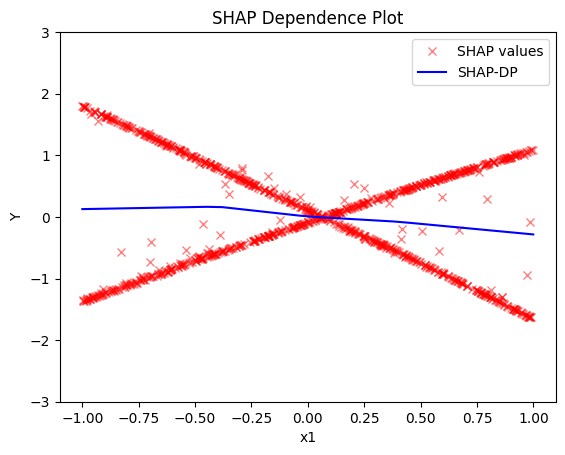
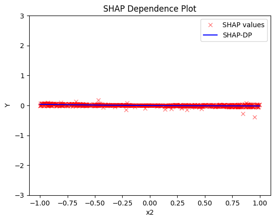
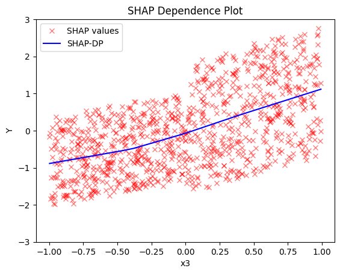

# Regional Effects (unknown black-box function)

- Author: [givasile](https://givasile.github.io/)
- Runtime: ~55 s
- Description: The realistic follow-up to tutorial 03: a neural network is
  fitted on the data and explained with regional PDP, RHALE and SHAP-DP,
  under uncorrelated and correlated features.

This tutorial use the same dataset with the previous [tutorial](./03_regional_effects_synthetic_f/), but instead of explaining the known (synthetic) predictive function, we fit a neural network on the data and explain the neural network. This is a more realistic scenario, since in real-world applications we do not know the underlying function and we only have access to the data. We advise the reader to first read the previous tutorial.


```python
import numpy as np
import effector
import keras
import tensorflow as tf

np.random.seed(12345)
tf.random.set_seed(12345)
```

    WARNING: All log messages before absl::InitializeLog() is called are written to STDERR
    I0000 00:00:1783103021.463122   36794 cpu_feature_guard.cc:227] This TensorFlow binary is optimized to use available CPU instructions in performance-critical operations.
    To enable the following instructions: AVX2 FMA, in other operations, rebuild TensorFlow with the appropriate compiler flags.


<!-- ## Simulation example

### Data Generating Distribution

We will generate $N=1000$ examples with $D=3$ features, which are in the uncorrelated setting all uniformly distributed as follows:

<center>

| Feature | Description                                | Distribution                 |
|---------|--------------------------------------------|------------------------------|
| $x_1$   | Uniformly distributed between $-1$ and $1$ | $x_1 \sim \mathcal{U}(-1,1)$ |
| $x_2$   | Uniformly distributed between $-1$ and $1$ | $x_2 \sim \mathcal{U}(-1,1)$ |
| $x_3$   | Uniformly distributed between $-1$ and $1$ | $x_3 \sim \mathcal{U}(-1,1)$ |

</center>

For the correlated setting we keep the distributional assumptions for $x_2$ and $x_3$ but define $x_1$ such that it is highly correlated with $x_3$ by: $x_1 = x_3 + \delta$ with $\delta \sim \mathcal{N}(0,0.0625)$. -->

## Simulation example

### Data Generating Distribution

We will generate $N=1000$ examples with $D=3$ features, which are in the uncorrelated setting all uniformly distributed as follows:

| Feature | Description                                | Distribution                 |
|---------|--------------------------------------------|------------------------------|
| $x_1$   | Uniformly distributed between $-1$ and $1$ | $x_1 \sim \mathcal{U}(-1,1)$ |
| $x_2$   | Uniformly distributed between $-1$ and $1$ | $x_2 \sim \mathcal{U}(-1,1)$ |
| $x_3$   | Uniformly distributed between $-1$ and $1$ | $x_3 \sim \mathcal{U}(-1,1)$ |

For the correlated setting, we keep the distributional assumptions for $x_2$ and $x_3$, but define $x_1$ such that it is highly correlated with $x_3$ by:  
$x_1 = x_3 + \delta$ with $\delta \sim \mathcal{N}(0,0.0625)$.


```python
def generate_dataset_uncorrelated(N):
    x1 = np.random.uniform(-1, 1, size=N)
    x2 = np.random.uniform(-1, 1, size=N)
    x3 = np.random.uniform(-1, 1, size=N)
    return np.stack((x1, x2, x3), axis=-1)

def generate_dataset_correlated(N):
    x3 = np.random.uniform(-1, 1, size=N)
    x2 = np.random.uniform(-1, 1, size=N)
    x1 = x3 + np.random.normal(loc = np.zeros_like(x3), scale = 0.25)
    return np.stack((x1, x2, x3), axis=-1)

# generate the dataset for the uncorrelated and correlated setting
N = 1000
X_uncor_train = generate_dataset_uncorrelated(N)
X_uncor_test = generate_dataset_uncorrelated(10000)
X_cor_train = generate_dataset_correlated(N)
X_cor_test = generate_dataset_correlated(10000)
```

### Black-box function

We will use the following linear model with a subgroup-specific interaction term:
 $$ y = 3x_1I_{x_3>0} - 3x_1I_{x_3\leq0} + x_3$$ 
 
On a global level, there is a high heterogeneity for the features $x_1$ and $x_3$ due to their interaction with each other. However, this heterogeneity vanishes to 0 if the feature space is separated into subregions:

<center>

| Feature | Region      | Average Effect | Heterogeneity |
|---------|-------------|----------------|---------------|
| $x_1$   | $x_3>0$     | $3x_1$         | 0             |
| $x_1$   | $x_3\leq 0$ | $-3x_1$        | 0             |
| $x_2$   | all         | 0              | 0             |
| $x_3$   | $x_3>0$     | $x_3$          | 0             |
| $x_3$   | $x_3\leq 0$ | $x_3$          | 0             |

</center>


```python
def generate_target(X):
    f = np.where(X[:,2] > 0, 3*X[:,0] + X[:,2], -3*X[:,0] + X[:,2])
    epsilon = np.random.normal(loc = np.zeros_like(X[:,0]), scale = 0.1)
    Y = f + epsilon
    return(Y)

# generate target for uncorrelated and correlated setting
Y_uncor_train = generate_target(X_uncor_train)
Y_uncor_test = generate_target(X_uncor_test)
Y_cor_train = generate_target(X_cor_train)
Y_cor_test = generate_target(X_cor_test)      
```

### Fit a Neural Network

We create a two-layer feedforward Neural Network, a weight decay of 0.01 for 100 epochs. We train two instances of this NN, one on the uncorrelated and one on the correlated setting. In both cases, the NN achieves a Mean Squared Error of about $0.17$ units.


```python
# Train - Evaluate - Explain a neural network
model_uncor = keras.Sequential([
    keras.layers.Dense(10, activation="relu", input_shape=(3,)),
    keras.layers.Dense(10, activation="relu", input_shape=(3,)),
    keras.layers.Dense(1)
])

optimizer = keras.optimizers.Adam(learning_rate=0.01)
model_uncor.compile(optimizer=optimizer, loss="mse")
model_uncor.fit(X_uncor_train, Y_uncor_train, epochs=100)
model_uncor.evaluate(X_uncor_test, Y_uncor_test)
```

    Epoch 1/100


    /home/givasile/github/packages/effector/.venv/lib/python3.10/site-packages/keras/src/layers/core/dense.py:95: UserWarning: Do not pass an `input_shape`/`input_dim` argument to a layer. When using Sequential models, prefer using an `Input(shape)` object as the first layer in the model instead.
      super().__init__(activity_regularizer=activity_regularizer, **kwargs)


    
 1/32 ━━━━━━━━━━━━━━━━━━━━ 16s 522ms/step - loss: 3.8471

    
32/32 ━━━━━━━━━━━━━━━━━━━━ 0s 2ms/step - loss: 3.2196   

    
32/32 ━━━━━━━━━━━━━━━━━━━━ 1s 2ms/step - loss: 2.9352


    Epoch 2/100


    
 1/32 ━━━━━━━━━━━━━━━━━━━━ 0s 16ms/step - loss: 2.3900

    
32/32 ━━━━━━━━━━━━━━━━━━━━ 0s 2ms/step - loss: 1.4768 


    Epoch 3/100


    
 1/32 ━━━━━━━━━━━━━━━━━━━━ 0s 17ms/step - loss: 0.9449

    
32/32 ━━━━━━━━━━━━━━━━━━━━ 0s 2ms/step - loss: 0.6186 


    Epoch 4/100


    
 1/32 ━━━━━━━━━━━━━━━━━━━━ 0s 16ms/step - loss: 0.4650

    
32/32 ━━━━━━━━━━━━━━━━━━━━ 0s 2ms/step - loss: 0.3815 


    Epoch 5/100


    
 1/32 ━━━━━━━━━━━━━━━━━━━━ 0s 16ms/step - loss: 0.3421

    
32/32 ━━━━━━━━━━━━━━━━━━━━ 0s 2ms/step - loss: 0.2856 


    Epoch 6/100


    
 1/32 ━━━━━━━━━━━━━━━━━━━━ 0s 18ms/step - loss: 0.2985

    
32/32 ━━━━━━━━━━━━━━━━━━━━ 0s 1ms/step - loss: 0.2384 


    Epoch 7/100


    
 1/32 ━━━━━━━━━━━━━━━━━━━━ 0s 15ms/step - loss: 0.2565

    
32/32 ━━━━━━━━━━━━━━━━━━━━ 0s 2ms/step - loss: 0.2075 


    Epoch 8/100


    
 1/32 ━━━━━━━━━━━━━━━━━━━━ 0s 17ms/step - loss: 0.2298

    
28/32 ━━━━━━━━━━━━━━━━━━━━ 0s 2ms/step - loss: 0.1701 

    
32/32 ━━━━━━━━━━━━━━━━━━━━ 0s 2ms/step - loss: 0.1846


    Epoch 9/100


    
 1/32 ━━━━━━━━━━━━━━━━━━━━ 0s 30ms/step - loss: 0.2001

    
19/32 ━━━━━━━━━━━━━━━━━━━━ 0s 3ms/step - loss: 0.1402 

    
32/32 ━━━━━━━━━━━━━━━━━━━━ 0s 3ms/step - loss: 0.1654


    Epoch 10/100


    
 1/32 ━━━━━━━━━━━━━━━━━━━━ 0s 16ms/step - loss: 0.1705

    
32/32 ━━━━━━━━━━━━━━━━━━━━ 0s 1ms/step - loss: 0.1505 


    Epoch 11/100


    
 1/32 ━━━━━━━━━━━━━━━━━━━━ 0s 15ms/step - loss: 0.1489

    
32/32 ━━━━━━━━━━━━━━━━━━━━ 0s 2ms/step - loss: 0.1383 


    Epoch 12/100


    
 1/32 ━━━━━━━━━━━━━━━━━━━━ 0s 16ms/step - loss: 0.1293

    
32/32 ━━━━━━━━━━━━━━━━━━━━ 0s 2ms/step - loss: 0.1290 


    Epoch 13/100


    
 1/32 ━━━━━━━━━━━━━━━━━━━━ 0s 17ms/step - loss: 0.1151

    
32/32 ━━━━━━━━━━━━━━━━━━━━ 0s 2ms/step - loss: 0.1216 


    Epoch 14/100


    
 1/32 ━━━━━━━━━━━━━━━━━━━━ 0s 16ms/step - loss: 0.1020

    
32/32 ━━━━━━━━━━━━━━━━━━━━ 0s 2ms/step - loss: 0.1155 


    Epoch 15/100


    
 1/32 ━━━━━━━━━━━━━━━━━━━━ 0s 15ms/step - loss: 0.0904

    
32/32 ━━━━━━━━━━━━━━━━━━━━ 0s 2ms/step - loss: 0.1106 


    Epoch 16/100


    
 1/32 ━━━━━━━━━━━━━━━━━━━━ 0s 16ms/step - loss: 0.0811

    
32/32 ━━━━━━━━━━━━━━━━━━━━ 0s 2ms/step - loss: 0.1053 


    Epoch 17/100


    
 1/32 ━━━━━━━━━━━━━━━━━━━━ 0s 16ms/step - loss: 0.0704

    
32/32 ━━━━━━━━━━━━━━━━━━━━ 0s 2ms/step - loss: 0.1021 


    Epoch 18/100


    
 1/32 ━━━━━━━━━━━━━━━━━━━━ 0s 15ms/step - loss: 0.0675

    
32/32 ━━━━━━━━━━━━━━━━━━━━ 0s 2ms/step - loss: 0.0995 


    Epoch 19/100


    
 1/32 ━━━━━━━━━━━━━━━━━━━━ 0s 17ms/step - loss: 0.0653

    
32/32 ━━━━━━━━━━━━━━━━━━━━ 0s 2ms/step - loss: 0.0955 


    Epoch 20/100


    
 1/32 ━━━━━━━━━━━━━━━━━━━━ 0s 16ms/step - loss: 0.0587

    
32/32 ━━━━━━━━━━━━━━━━━━━━ 0s 1ms/step - loss: 0.0926 


    Epoch 21/100


    
 1/32 ━━━━━━━━━━━━━━━━━━━━ 0s 15ms/step - loss: 0.0594

    
32/32 ━━━━━━━━━━━━━━━━━━━━ 0s 2ms/step - loss: 0.0894 


    Epoch 22/100


    
 1/32 ━━━━━━━━━━━━━━━━━━━━ 0s 16ms/step - loss: 0.0549

    
32/32 ━━━━━━━━━━━━━━━━━━━━ 0s 2ms/step - loss: 0.0861 


    Epoch 23/100


    
 1/32 ━━━━━━━━━━━━━━━━━━━━ 0s 17ms/step - loss: 0.0508

    
32/32 ━━━━━━━━━━━━━━━━━━━━ 0s 2ms/step - loss: 0.0837 


    Epoch 24/100


    
 1/32 ━━━━━━━━━━━━━━━━━━━━ 0s 16ms/step - loss: 0.0508

    
32/32 ━━━━━━━━━━━━━━━━━━━━ 0s 2ms/step - loss: 0.0819 


    Epoch 25/100


    
 1/32 ━━━━━━━━━━━━━━━━━━━━ 0s 17ms/step - loss: 0.0494

    
32/32 ━━━━━━━━━━━━━━━━━━━━ 0s 2ms/step - loss: 0.0787 


    Epoch 26/100


    
 1/32 ━━━━━━━━━━━━━━━━━━━━ 0s 17ms/step - loss: 0.0445

    
32/32 ━━━━━━━━━━━━━━━━━━━━ 0s 2ms/step - loss: 0.0756 


    Epoch 27/100


    
 1/32 ━━━━━━━━━━━━━━━━━━━━ 0s 16ms/step - loss: 0.0444

    
32/32 ━━━━━━━━━━━━━━━━━━━━ 0s 2ms/step - loss: 0.0736 


    Epoch 28/100


    
 1/32 ━━━━━━━━━━━━━━━━━━━━ 0s 15ms/step - loss: 0.0433

    
32/32 ━━━━━━━━━━━━━━━━━━━━ 0s 2ms/step - loss: 0.0724 


    Epoch 29/100


    
 1/32 ━━━━━━━━━━━━━━━━━━━━ 0s 16ms/step - loss: 0.0428

    
32/32 ━━━━━━━━━━━━━━━━━━━━ 0s 2ms/step - loss: 0.0708 


    Epoch 30/100


    
 1/32 ━━━━━━━━━━━━━━━━━━━━ 0s 15ms/step - loss: 0.0398

    
32/32 ━━━━━━━━━━━━━━━━━━━━ 0s 2ms/step - loss: 0.0693 


    Epoch 31/100


    
 1/32 ━━━━━━━━━━━━━━━━━━━━ 0s 16ms/step - loss: 0.0408

    
32/32 ━━━━━━━━━━━━━━━━━━━━ 0s 2ms/step - loss: 0.0684 


    Epoch 32/100


    
 1/32 ━━━━━━━━━━━━━━━━━━━━ 0s 17ms/step - loss: 0.0374

    
32/32 ━━━━━━━━━━━━━━━━━━━━ 0s 2ms/step - loss: 0.0669 


    Epoch 33/100


    
 1/32 ━━━━━━━━━━━━━━━━━━━━ 0s 16ms/step - loss: 0.0409

    
32/32 ━━━━━━━━━━━━━━━━━━━━ 0s 1ms/step - loss: 0.0659 


    Epoch 34/100


    
 1/32 ━━━━━━━━━━━━━━━━━━━━ 0s 16ms/step - loss: 0.0371

    
32/32 ━━━━━━━━━━━━━━━━━━━━ 0s 2ms/step - loss: 0.0646 


    Epoch 35/100


    
 1/32 ━━━━━━━━━━━━━━━━━━━━ 0s 16ms/step - loss: 0.0388

    
32/32 ━━━━━━━━━━━━━━━━━━━━ 0s 2ms/step - loss: 0.0638 


    Epoch 36/100


    
 1/32 ━━━━━━━━━━━━━━━━━━━━ 0s 16ms/step - loss: 0.0378

    
32/32 ━━━━━━━━━━━━━━━━━━━━ 0s 2ms/step - loss: 0.0627 


    Epoch 37/100


    
 1/32 ━━━━━━━━━━━━━━━━━━━━ 0s 17ms/step - loss: 0.0366

    
32/32 ━━━━━━━━━━━━━━━━━━━━ 0s 2ms/step - loss: 0.0623 


    Epoch 38/100


    
 1/32 ━━━━━━━━━━━━━━━━━━━━ 0s 15ms/step - loss: 0.0383

    
32/32 ━━━━━━━━━━━━━━━━━━━━ 0s 1ms/step - loss: 0.0617 


    Epoch 39/100


    
 1/32 ━━━━━━━━━━━━━━━━━━━━ 0s 15ms/step - loss: 0.0369

    
32/32 ━━━━━━━━━━━━━━━━━━━━ 0s 2ms/step - loss: 0.0614 


    Epoch 40/100


    
 1/32 ━━━━━━━━━━━━━━━━━━━━ 0s 16ms/step - loss: 0.0356

    
32/32 ━━━━━━━━━━━━━━━━━━━━ 0s 2ms/step - loss: 0.0605 


    Epoch 41/100


    
 1/32 ━━━━━━━━━━━━━━━━━━━━ 0s 18ms/step - loss: 0.0354

    
32/32 ━━━━━━━━━━━━━━━━━━━━ 0s 2ms/step - loss: 0.0608 


    Epoch 42/100


    
 1/32 ━━━━━━━━━━━━━━━━━━━━ 0s 15ms/step - loss: 0.0368

    
32/32 ━━━━━━━━━━━━━━━━━━━━ 0s 2ms/step - loss: 0.0602 


    Epoch 43/100


    
 1/32 ━━━━━━━━━━━━━━━━━━━━ 0s 16ms/step - loss: 0.0350

    
32/32 ━━━━━━━━━━━━━━━━━━━━ 0s 1ms/step - loss: 0.0597 


    Epoch 44/100


    
 1/32 ━━━━━━━━━━━━━━━━━━━━ 0s 16ms/step - loss: 0.0348

    
32/32 ━━━━━━━━━━━━━━━━━━━━ 0s 2ms/step - loss: 0.0596 


    Epoch 45/100


    
 1/32 ━━━━━━━━━━━━━━━━━━━━ 0s 16ms/step - loss: 0.0346

    
32/32 ━━━━━━━━━━━━━━━━━━━━ 0s 2ms/step - loss: 0.0589 


    Epoch 46/100


    
 1/32 ━━━━━━━━━━━━━━━━━━━━ 0s 16ms/step - loss: 0.0329

    
32/32 ━━━━━━━━━━━━━━━━━━━━ 0s 2ms/step - loss: 0.0592 


    Epoch 47/100


    
 1/32 ━━━━━━━━━━━━━━━━━━━━ 0s 16ms/step - loss: 0.0339

    
32/32 ━━━━━━━━━━━━━━━━━━━━ 0s 2ms/step - loss: 0.0595 


    Epoch 48/100


    
 1/32 ━━━━━━━━━━━━━━━━━━━━ 0s 16ms/step - loss: 0.0367

    
32/32 ━━━━━━━━━━━━━━━━━━━━ 0s 1ms/step - loss: 0.0590 


    Epoch 49/100


    
 1/32 ━━━━━━━━━━━━━━━━━━━━ 0s 15ms/step - loss: 0.0330

    
32/32 ━━━━━━━━━━━━━━━━━━━━ 0s 2ms/step - loss: 0.0581 


    Epoch 50/100


    
 1/32 ━━━━━━━━━━━━━━━━━━━━ 0s 19ms/step - loss: 0.0361

    
32/32 ━━━━━━━━━━━━━━━━━━━━ 0s 1ms/step - loss: 0.0584 


    Epoch 51/100


    
 1/32 ━━━━━━━━━━━━━━━━━━━━ 0s 16ms/step - loss: 0.0323

    
32/32 ━━━━━━━━━━━━━━━━━━━━ 0s 2ms/step - loss: 0.0581 


    Epoch 52/100


    
 1/32 ━━━━━━━━━━━━━━━━━━━━ 0s 15ms/step - loss: 0.0354

    
32/32 ━━━━━━━━━━━━━━━━━━━━ 0s 2ms/step - loss: 0.0579 


    Epoch 53/100


    
 1/32 ━━━━━━━━━━━━━━━━━━━━ 0s 16ms/step - loss: 0.0314

    
32/32 ━━━━━━━━━━━━━━━━━━━━ 0s 1ms/step - loss: 0.0580 


    Epoch 54/100


    
 1/32 ━━━━━━━━━━━━━━━━━━━━ 0s 15ms/step - loss: 0.0355

    
32/32 ━━━━━━━━━━━━━━━━━━━━ 0s 2ms/step - loss: 0.0577 


    Epoch 55/100


    
 1/32 ━━━━━━━━━━━━━━━━━━━━ 0s 16ms/step - loss: 0.0329

    
32/32 ━━━━━━━━━━━━━━━━━━━━ 0s 2ms/step - loss: 0.0569 


    Epoch 56/100


    
 1/32 ━━━━━━━━━━━━━━━━━━━━ 0s 16ms/step - loss: 0.0344

    
32/32 ━━━━━━━━━━━━━━━━━━━━ 0s 2ms/step - loss: 0.0571 


    Epoch 57/100


    
 1/32 ━━━━━━━━━━━━━━━━━━━━ 0s 17ms/step - loss: 0.0351

    
32/32 ━━━━━━━━━━━━━━━━━━━━ 0s 2ms/step - loss: 0.0576 


    Epoch 58/100


    
 1/32 ━━━━━━━━━━━━━━━━━━━━ 0s 16ms/step - loss: 0.0363

    
32/32 ━━━━━━━━━━━━━━━━━━━━ 0s 2ms/step - loss: 0.0567 


    Epoch 59/100


    
 1/32 ━━━━━━━━━━━━━━━━━━━━ 0s 15ms/step - loss: 0.0330

    
32/32 ━━━━━━━━━━━━━━━━━━━━ 0s 2ms/step - loss: 0.0565 


    Epoch 60/100


    
 1/32 ━━━━━━━━━━━━━━━━━━━━ 0s 16ms/step - loss: 0.0351

    
32/32 ━━━━━━━━━━━━━━━━━━━━ 0s 2ms/step - loss: 0.0563 


    Epoch 61/100


    
 1/32 ━━━━━━━━━━━━━━━━━━━━ 0s 16ms/step - loss: 0.0346

    
32/32 ━━━━━━━━━━━━━━━━━━━━ 0s 2ms/step - loss: 0.0560 


    Epoch 62/100


    
 1/32 ━━━━━━━━━━━━━━━━━━━━ 0s 17ms/step - loss: 0.0344

    
32/32 ━━━━━━━━━━━━━━━━━━━━ 0s 1ms/step - loss: 0.0559 


    Epoch 63/100


    
 1/32 ━━━━━━━━━━━━━━━━━━━━ 0s 17ms/step - loss: 0.0338

    
32/32 ━━━━━━━━━━━━━━━━━━━━ 0s 2ms/step - loss: 0.0554 


    Epoch 64/100


    
 1/32 ━━━━━━━━━━━━━━━━━━━━ 0s 15ms/step - loss: 0.0343

    
32/32 ━━━━━━━━━━━━━━━━━━━━ 0s 2ms/step - loss: 0.0550 


    Epoch 65/100


    
 1/32 ━━━━━━━━━━━━━━━━━━━━ 0s 16ms/step - loss: 0.0338

    
32/32 ━━━━━━━━━━━━━━━━━━━━ 0s 2ms/step - loss: 0.0553 


    Epoch 66/100


    
 1/32 ━━━━━━━━━━━━━━━━━━━━ 0s 17ms/step - loss: 0.0344

    
32/32 ━━━━━━━━━━━━━━━━━━━━ 0s 2ms/step - loss: 0.0549 


    Epoch 67/100


    
 1/32 ━━━━━━━━━━━━━━━━━━━━ 0s 16ms/step - loss: 0.0342

    
32/32 ━━━━━━━━━━━━━━━━━━━━ 0s 2ms/step - loss: 0.0547 


    Epoch 68/100


    
 1/32 ━━━━━━━━━━━━━━━━━━━━ 0s 16ms/step - loss: 0.0341

    
32/32 ━━━━━━━━━━━━━━━━━━━━ 0s 2ms/step - loss: 0.0548 


    Epoch 69/100


    
 1/32 ━━━━━━━━━━━━━━━━━━━━ 0s 17ms/step - loss: 0.0347

    
32/32 ━━━━━━━━━━━━━━━━━━━━ 0s 2ms/step - loss: 0.0544 


    Epoch 70/100


    
 1/32 ━━━━━━━━━━━━━━━━━━━━ 0s 15ms/step - loss: 0.0344

    
32/32 ━━━━━━━━━━━━━━━━━━━━ 0s 2ms/step - loss: 0.0541 


    Epoch 71/100


    
 1/32 ━━━━━━━━━━━━━━━━━━━━ 0s 16ms/step - loss: 0.0344

    
32/32 ━━━━━━━━━━━━━━━━━━━━ 0s 2ms/step - loss: 0.0543 


    Epoch 72/100


    
 1/32 ━━━━━━━━━━━━━━━━━━━━ 0s 17ms/step - loss: 0.0353

    
32/32 ━━━━━━━━━━━━━━━━━━━━ 0s 2ms/step - loss: 0.0543 


    Epoch 73/100


    
 1/32 ━━━━━━━━━━━━━━━━━━━━ 2s 95ms/step - loss: 0.0353

    
32/32 ━━━━━━━━━━━━━━━━━━━━ 0s 2ms/step - loss: 0.0542 


    Epoch 74/100


    
 1/32 ━━━━━━━━━━━━━━━━━━━━ 0s 16ms/step - loss: 0.0346

    
32/32 ━━━━━━━━━━━━━━━━━━━━ 0s 2ms/step - loss: 0.0542 


    Epoch 75/100


    
 1/32 ━━━━━━━━━━━━━━━━━━━━ 0s 15ms/step - loss: 0.0352

    
32/32 ━━━━━━━━━━━━━━━━━━━━ 0s 2ms/step - loss: 0.0534 


    Epoch 76/100


    
 1/32 ━━━━━━━━━━━━━━━━━━━━ 0s 16ms/step - loss: 0.0345

    
32/32 ━━━━━━━━━━━━━━━━━━━━ 0s 2ms/step - loss: 0.0534 


    Epoch 77/100


    
 1/32 ━━━━━━━━━━━━━━━━━━━━ 0s 17ms/step - loss: 0.0352

    
32/32 ━━━━━━━━━━━━━━━━━━━━ 0s 1ms/step - loss: 0.0533 


    Epoch 78/100


    
 1/32 ━━━━━━━━━━━━━━━━━━━━ 0s 16ms/step - loss: 0.0349

    
32/32 ━━━━━━━━━━━━━━━━━━━━ 0s 2ms/step - loss: 0.0532 


    Epoch 79/100


    
 1/32 ━━━━━━━━━━━━━━━━━━━━ 0s 16ms/step - loss: 0.0346

    
32/32 ━━━━━━━━━━━━━━━━━━━━ 0s 2ms/step - loss: 0.0530 


    Epoch 80/100


    
 1/32 ━━━━━━━━━━━━━━━━━━━━ 0s 17ms/step - loss: 0.0350

    
32/32 ━━━━━━━━━━━━━━━━━━━━ 0s 1ms/step - loss: 0.0527 


    Epoch 81/100


    
 1/32 ━━━━━━━━━━━━━━━━━━━━ 0s 17ms/step - loss: 0.0346

    
32/32 ━━━━━━━━━━━━━━━━━━━━ 0s 2ms/step - loss: 0.0527 


    Epoch 82/100


    
 1/32 ━━━━━━━━━━━━━━━━━━━━ 0s 16ms/step - loss: 0.0346

    
32/32 ━━━━━━━━━━━━━━━━━━━━ 0s 1ms/step - loss: 0.0524 


    Epoch 83/100


    
 1/32 ━━━━━━━━━━━━━━━━━━━━ 0s 16ms/step - loss: 0.0346

    
32/32 ━━━━━━━━━━━━━━━━━━━━ 0s 2ms/step - loss: 0.0522 


    Epoch 84/100


    
 1/32 ━━━━━━━━━━━━━━━━━━━━ 0s 16ms/step - loss: 0.0349

    
32/32 ━━━━━━━━━━━━━━━━━━━━ 0s 2ms/step - loss: 0.0526 


    Epoch 85/100


    
 1/32 ━━━━━━━━━━━━━━━━━━━━ 0s 16ms/step - loss: 0.0355

    
32/32 ━━━━━━━━━━━━━━━━━━━━ 0s 2ms/step - loss: 0.0522 


    Epoch 86/100


    
 1/32 ━━━━━━━━━━━━━━━━━━━━ 0s 16ms/step - loss: 0.0345

    
32/32 ━━━━━━━━━━━━━━━━━━━━ 0s 2ms/step - loss: 0.0520 


    Epoch 87/100


    
 1/32 ━━━━━━━━━━━━━━━━━━━━ 0s 16ms/step - loss: 0.0346

    
32/32 ━━━━━━━━━━━━━━━━━━━━ 0s 2ms/step - loss: 0.0524 


    Epoch 88/100


    
 1/32 ━━━━━━━━━━━━━━━━━━━━ 0s 16ms/step - loss: 0.0361

    
32/32 ━━━━━━━━━━━━━━━━━━━━ 0s 2ms/step - loss: 0.0519 


    Epoch 89/100


    
 1/32 ━━━━━━━━━━━━━━━━━━━━ 0s 16ms/step - loss: 0.0358

    
32/32 ━━━━━━━━━━━━━━━━━━━━ 0s 2ms/step - loss: 0.0517 


    Epoch 90/100


    
 1/32 ━━━━━━━━━━━━━━━━━━━━ 0s 16ms/step - loss: 0.0352

    
32/32 ━━━━━━━━━━━━━━━━━━━━ 0s 2ms/step - loss: 0.0512 


    Epoch 91/100


    
 1/32 ━━━━━━━━━━━━━━━━━━━━ 0s 16ms/step - loss: 0.0348

    
32/32 ━━━━━━━━━━━━━━━━━━━━ 0s 2ms/step - loss: 0.0512 


    Epoch 92/100


    
 1/32 ━━━━━━━━━━━━━━━━━━━━ 0s 15ms/step - loss: 0.0350

    
32/32 ━━━━━━━━━━━━━━━━━━━━ 0s 2ms/step - loss: 0.0509 


    Epoch 93/100


    
 1/32 ━━━━━━━━━━━━━━━━━━━━ 0s 16ms/step - loss: 0.0356

    
32/32 ━━━━━━━━━━━━━━━━━━━━ 0s 2ms/step - loss: 0.0507 


    Epoch 94/100


    
 1/32 ━━━━━━━━━━━━━━━━━━━━ 0s 16ms/step - loss: 0.0353

    
32/32 ━━━━━━━━━━━━━━━━━━━━ 0s 2ms/step - loss: 0.0504 


    Epoch 95/100


    
 1/32 ━━━━━━━━━━━━━━━━━━━━ 0s 17ms/step - loss: 0.0360

    
32/32 ━━━━━━━━━━━━━━━━━━━━ 0s 2ms/step - loss: 0.0501 


    Epoch 96/100


    
 1/32 ━━━━━━━━━━━━━━━━━━━━ 0s 16ms/step - loss: 0.0351

    
32/32 ━━━━━━━━━━━━━━━━━━━━ 0s 2ms/step - loss: 0.0499 


    Epoch 97/100


    
 1/32 ━━━━━━━━━━━━━━━━━━━━ 0s 17ms/step - loss: 0.0350

    
32/32 ━━━━━━━━━━━━━━━━━━━━ 0s 2ms/step - loss: 0.0496 


    Epoch 98/100


    
 1/32 ━━━━━━━━━━━━━━━━━━━━ 0s 19ms/step - loss: 0.0353

    
32/32 ━━━━━━━━━━━━━━━━━━━━ 0s 1ms/step - loss: 0.0493 


    Epoch 99/100


    
 1/32 ━━━━━━━━━━━━━━━━━━━━ 0s 18ms/step - loss: 0.0348

    
32/32 ━━━━━━━━━━━━━━━━━━━━ 0s 2ms/step - loss: 0.0490 


    Epoch 100/100


    
 1/32 ━━━━━━━━━━━━━━━━━━━━ 0s 16ms/step - loss: 0.0358

    
32/32 ━━━━━━━━━━━━━━━━━━━━ 0s 1ms/step - loss: 0.0488 


    
  1/313 ━━━━━━━━━━━━━━━━━━━━ 21s 70ms/step - loss: 0.0364

    
 49/313 ━━━━━━━━━━━━━━━━━━━━ 0s 1ms/step - loss: 0.0576  

    
100/313 ━━━━━━━━━━━━━━━━━━━━ 0s 1ms/step - loss: 0.0667

    
154/313 ━━━━━━━━━━━━━━━━━━━━ 0s 991us/step - loss: 0.0698

    
210/313 ━━━━━━━━━━━━━━━━━━━━ 0s 967us/step - loss: 0.0714

    
267/313 ━━━━━━━━━━━━━━━━━━━━ 0s 948us/step - loss: 0.0716

    
313/313 ━━━━━━━━━━━━━━━━━━━━ 0s 968us/step - loss: 0.0686


    0.06857308745384216


```python
model_cor = keras.Sequential([
    keras.layers.Dense(10, activation="relu", input_shape=(3,)),
    keras.layers.Dense(10, activation="relu", input_shape=(3,)),
    keras.layers.Dense(1)
])

optimizer = keras.optimizers.Adam(learning_rate=0.01)
model_cor.compile(optimizer=optimizer, loss="mse")
model_cor.fit(X_cor_train, Y_cor_train, epochs=100)
model_cor.evaluate(X_cor_test, Y_cor_test)
```

    Epoch 1/100


    
 1/32 ━━━━━━━━━━━━━━━━━━━━ 15s 493ms/step - loss: 3.6903

    
32/32 ━━━━━━━━━━━━━━━━━━━━ 0s 2ms/step - loss: 2.5710   

    
32/32 ━━━━━━━━━━━━━━━━━━━━ 1s 2ms/step - loss: 1.6964


    Epoch 2/100


    
 1/32 ━━━━━━━━━━━━━━━━━━━━ 0s 17ms/step - loss: 0.7779

    
32/32 ━━━━━━━━━━━━━━━━━━━━ 0s 2ms/step - loss: 0.5817 

    
32/32 ━━━━━━━━━━━━━━━━━━━━ 0s 2ms/step - loss: 0.4537


    Epoch 3/100


    
 1/32 ━━━━━━━━━━━━━━━━━━━━ 0s 16ms/step - loss: 0.3345

    
32/32 ━━━━━━━━━━━━━━━━━━━━ 0s 2ms/step - loss: 0.1944 


    Epoch 4/100


    
 1/32 ━━━━━━━━━━━━━━━━━━━━ 0s 17ms/step - loss: 0.1988

    
32/32 ━━━━━━━━━━━━━━━━━━━━ 0s 1ms/step - loss: 0.1219 


    Epoch 5/100


    
 1/32 ━━━━━━━━━━━━━━━━━━━━ 0s 15ms/step - loss: 0.1686

    
32/32 ━━━━━━━━━━━━━━━━━━━━ 0s 2ms/step - loss: 0.0965 


    Epoch 6/100


    
 1/32 ━━━━━━━━━━━━━━━━━━━━ 0s 16ms/step - loss: 0.1676

    
32/32 ━━━━━━━━━━━━━━━━━━━━ 0s 2ms/step - loss: 0.0864 


    Epoch 7/100


    
 1/32 ━━━━━━━━━━━━━━━━━━━━ 0s 15ms/step - loss: 0.1656

    
32/32 ━━━━━━━━━━━━━━━━━━━━ 0s 2ms/step - loss: 0.0819 


    Epoch 8/100


    
 1/32 ━━━━━━━━━━━━━━━━━━━━ 0s 17ms/step - loss: 0.1630

    
32/32 ━━━━━━━━━━━━━━━━━━━━ 0s 2ms/step - loss: 0.0790 


    Epoch 9/100


    
 1/32 ━━━━━━━━━━━━━━━━━━━━ 0s 16ms/step - loss: 0.1602

    
32/32 ━━━━━━━━━━━━━━━━━━━━ 0s 2ms/step - loss: 0.0765 


    Epoch 10/100


    
 1/32 ━━━━━━━━━━━━━━━━━━━━ 0s 18ms/step - loss: 0.1586

    
32/32 ━━━━━━━━━━━━━━━━━━━━ 0s 2ms/step - loss: 0.0741 


    Epoch 11/100


    
 1/32 ━━━━━━━━━━━━━━━━━━━━ 0s 16ms/step - loss: 0.1572

    
32/32 ━━━━━━━━━━━━━━━━━━━━ 0s 2ms/step - loss: 0.0719 


    Epoch 12/100


    
 1/32 ━━━━━━━━━━━━━━━━━━━━ 0s 16ms/step - loss: 0.1547

    
32/32 ━━━━━━━━━━━━━━━━━━━━ 0s 2ms/step - loss: 0.0697 


    Epoch 13/100


    
 1/32 ━━━━━━━━━━━━━━━━━━━━ 0s 16ms/step - loss: 0.1524

    
32/32 ━━━━━━━━━━━━━━━━━━━━ 0s 2ms/step - loss: 0.0673 


    Epoch 14/100


    
 1/32 ━━━━━━━━━━━━━━━━━━━━ 0s 16ms/step - loss: 0.1496

    
32/32 ━━━━━━━━━━━━━━━━━━━━ 0s 2ms/step - loss: 0.0655 


    Epoch 15/100


    
 1/32 ━━━━━━━━━━━━━━━━━━━━ 0s 16ms/step - loss: 0.1466

    
32/32 ━━━━━━━━━━━━━━━━━━━━ 0s 2ms/step - loss: 0.0638 


    Epoch 16/100


    
 1/32 ━━━━━━━━━━━━━━━━━━━━ 0s 15ms/step - loss: 0.1433

    
32/32 ━━━━━━━━━━━━━━━━━━━━ 0s 2ms/step - loss: 0.0622 


    Epoch 17/100


    
 1/32 ━━━━━━━━━━━━━━━━━━━━ 0s 16ms/step - loss: 0.1398

    
32/32 ━━━━━━━━━━━━━━━━━━━━ 0s 2ms/step - loss: 0.0609 


    Epoch 18/100


    
 1/32 ━━━━━━━━━━━━━━━━━━━━ 0s 16ms/step - loss: 0.1361

    
32/32 ━━━━━━━━━━━━━━━━━━━━ 0s 2ms/step - loss: 0.0598 


    Epoch 19/100


    
 1/32 ━━━━━━━━━━━━━━━━━━━━ 0s 16ms/step - loss: 0.1327

    
32/32 ━━━━━━━━━━━━━━━━━━━━ 0s 2ms/step - loss: 0.0589 


    Epoch 20/100


    
 1/32 ━━━━━━━━━━━━━━━━━━━━ 0s 17ms/step - loss: 0.1301

    
32/32 ━━━━━━━━━━━━━━━━━━━━ 0s 1ms/step - loss: 0.0579 


    Epoch 21/100


    
 1/32 ━━━━━━━━━━━━━━━━━━━━ 0s 16ms/step - loss: 0.1272

    
32/32 ━━━━━━━━━━━━━━━━━━━━ 0s 2ms/step - loss: 0.0570 


    Epoch 22/100


    
 1/32 ━━━━━━━━━━━━━━━━━━━━ 0s 15ms/step - loss: 0.1245

    
32/32 ━━━━━━━━━━━━━━━━━━━━ 0s 2ms/step - loss: 0.0561 


    Epoch 23/100


    
 1/32 ━━━━━━━━━━━━━━━━━━━━ 0s 17ms/step - loss: 0.1228

    
32/32 ━━━━━━━━━━━━━━━━━━━━ 0s 2ms/step - loss: 0.0555 


    Epoch 24/100


    
 1/32 ━━━━━━━━━━━━━━━━━━━━ 0s 16ms/step - loss: 0.1214

    
32/32 ━━━━━━━━━━━━━━━━━━━━ 0s 2ms/step - loss: 0.0548 


    Epoch 25/100


    
 1/32 ━━━━━━━━━━━━━━━━━━━━ 0s 18ms/step - loss: 0.1196

    
32/32 ━━━━━━━━━━━━━━━━━━━━ 0s 2ms/step - loss: 0.0541 


    Epoch 26/100


    
 1/32 ━━━━━━━━━━━━━━━━━━━━ 0s 17ms/step - loss: 0.1181

    
32/32 ━━━━━━━━━━━━━━━━━━━━ 0s 2ms/step - loss: 0.0534 


    Epoch 27/100


    
 1/32 ━━━━━━━━━━━━━━━━━━━━ 0s 16ms/step - loss: 0.1166

    
32/32 ━━━━━━━━━━━━━━━━━━━━ 0s 2ms/step - loss: 0.0532 


    Epoch 28/100


    
 1/32 ━━━━━━━━━━━━━━━━━━━━ 0s 16ms/step - loss: 0.1148

    
32/32 ━━━━━━━━━━━━━━━━━━━━ 0s 2ms/step - loss: 0.0526 


    Epoch 29/100


    
 1/32 ━━━━━━━━━━━━━━━━━━━━ 0s 16ms/step - loss: 0.1135

    
32/32 ━━━━━━━━━━━━━━━━━━━━ 0s 2ms/step - loss: 0.0524 


    Epoch 30/100


    
 1/32 ━━━━━━━━━━━━━━━━━━━━ 0s 16ms/step - loss: 0.1123

    
32/32 ━━━━━━━━━━━━━━━━━━━━ 0s 2ms/step - loss: 0.0523 


    Epoch 31/100


    
 1/32 ━━━━━━━━━━━━━━━━━━━━ 0s 16ms/step - loss: 0.1114

    
32/32 ━━━━━━━━━━━━━━━━━━━━ 0s 2ms/step - loss: 0.0520 


    Epoch 32/100


    
 1/32 ━━━━━━━━━━━━━━━━━━━━ 0s 16ms/step - loss: 0.1101

    
32/32 ━━━━━━━━━━━━━━━━━━━━ 0s 2ms/step - loss: 0.0516 


    Epoch 33/100


    
 1/32 ━━━━━━━━━━━━━━━━━━━━ 0s 16ms/step - loss: 0.1093

    
32/32 ━━━━━━━━━━━━━━━━━━━━ 0s 2ms/step - loss: 0.0511 


    Epoch 34/100


    
 1/32 ━━━━━━━━━━━━━━━━━━━━ 0s 16ms/step - loss: 0.1080

    
32/32 ━━━━━━━━━━━━━━━━━━━━ 0s 2ms/step - loss: 0.0508 


    Epoch 35/100


    
 1/32 ━━━━━━━━━━━━━━━━━━━━ 0s 16ms/step - loss: 0.1066

    
32/32 ━━━━━━━━━━━━━━━━━━━━ 0s 2ms/step - loss: 0.0504 


    Epoch 36/100


    
 1/32 ━━━━━━━━━━━━━━━━━━━━ 0s 16ms/step - loss: 0.1058

    
32/32 ━━━━━━━━━━━━━━━━━━━━ 0s 2ms/step - loss: 0.0500 


    Epoch 37/100


    
 1/32 ━━━━━━━━━━━━━━━━━━━━ 0s 16ms/step - loss: 0.1047

    
32/32 ━━━━━━━━━━━━━━━━━━━━ 0s 2ms/step - loss: 0.0495 


    Epoch 38/100


    
 1/32 ━━━━━━━━━━━━━━━━━━━━ 0s 15ms/step - loss: 0.1039

    
32/32 ━━━━━━━━━━━━━━━━━━━━ 0s 2ms/step - loss: 0.0490 


    Epoch 39/100


    
 1/32 ━━━━━━━━━━━━━━━━━━━━ 0s 16ms/step - loss: 0.1028

    
32/32 ━━━━━━━━━━━━━━━━━━━━ 0s 2ms/step - loss: 0.0485 


    Epoch 40/100


    
 1/32 ━━━━━━━━━━━━━━━━━━━━ 0s 16ms/step - loss: 0.1020

    
32/32 ━━━━━━━━━━━━━━━━━━━━ 0s 2ms/step - loss: 0.0482 


    Epoch 41/100


    
 1/32 ━━━━━━━━━━━━━━━━━━━━ 0s 17ms/step - loss: 0.1012

    
32/32 ━━━━━━━━━━━━━━━━━━━━ 0s 2ms/step - loss: 0.0477 


    Epoch 42/100


    
 1/32 ━━━━━━━━━━━━━━━━━━━━ 0s 16ms/step - loss: 0.1003

    
32/32 ━━━━━━━━━━━━━━━━━━━━ 0s 2ms/step - loss: 0.0473 


    Epoch 43/100


    
 1/32 ━━━━━━━━━━━━━━━━━━━━ 0s 16ms/step - loss: 0.0995

    
32/32 ━━━━━━━━━━━━━━━━━━━━ 0s 2ms/step - loss: 0.0468 


    Epoch 44/100


    
 1/32 ━━━━━━━━━━━━━━━━━━━━ 0s 16ms/step - loss: 0.0986

    
32/32 ━━━━━━━━━━━━━━━━━━━━ 0s 2ms/step - loss: 0.0464 


    Epoch 45/100


    
 1/32 ━━━━━━━━━━━━━━━━━━━━ 0s 16ms/step - loss: 0.0979

    
32/32 ━━━━━━━━━━━━━━━━━━━━ 0s 2ms/step - loss: 0.0461 


    Epoch 46/100


    
 1/32 ━━━━━━━━━━━━━━━━━━━━ 0s 17ms/step - loss: 0.0968

    
32/32 ━━━━━━━━━━━━━━━━━━━━ 0s 2ms/step - loss: 0.0455 


    Epoch 47/100


    
 1/32 ━━━━━━━━━━━━━━━━━━━━ 0s 16ms/step - loss: 0.0962

    
32/32 ━━━━━━━━━━━━━━━━━━━━ 0s 2ms/step - loss: 0.0451 


    Epoch 48/100


    
 1/32 ━━━━━━━━━━━━━━━━━━━━ 0s 17ms/step - loss: 0.0954

    
32/32 ━━━━━━━━━━━━━━━━━━━━ 0s 2ms/step - loss: 0.0445 


    Epoch 49/100


    
 1/32 ━━━━━━━━━━━━━━━━━━━━ 0s 16ms/step - loss: 0.0945

    
32/32 ━━━━━━━━━━━━━━━━━━━━ 0s 2ms/step - loss: 0.0440 


    Epoch 50/100


    
 1/32 ━━━━━━━━━━━━━━━━━━━━ 0s 16ms/step - loss: 0.0937

    
32/32 ━━━━━━━━━━━━━━━━━━━━ 0s 2ms/step - loss: 0.0435 


    Epoch 51/100


    
 1/32 ━━━━━━━━━━━━━━━━━━━━ 0s 16ms/step - loss: 0.0931

    
32/32 ━━━━━━━━━━━━━━━━━━━━ 0s 1ms/step - loss: 0.0429 


    Epoch 52/100


    
 1/32 ━━━━━━━━━━━━━━━━━━━━ 0s 16ms/step - loss: 0.0923

    
32/32 ━━━━━━━━━━━━━━━━━━━━ 0s 2ms/step - loss: 0.0422 


    Epoch 53/100


    
 1/32 ━━━━━━━━━━━━━━━━━━━━ 0s 16ms/step - loss: 0.0916

    
32/32 ━━━━━━━━━━━━━━━━━━━━ 0s 2ms/step - loss: 0.0416 


    Epoch 54/100


    
 1/32 ━━━━━━━━━━━━━━━━━━━━ 0s 16ms/step - loss: 0.0908

    
32/32 ━━━━━━━━━━━━━━━━━━━━ 0s 2ms/step - loss: 0.0410 


    Epoch 55/100


    
 1/32 ━━━━━━━━━━━━━━━━━━━━ 0s 17ms/step - loss: 0.0902

    
32/32 ━━━━━━━━━━━━━━━━━━━━ 0s 2ms/step - loss: 0.0404 


    Epoch 56/100


    
 1/32 ━━━━━━━━━━━━━━━━━━━━ 0s 17ms/step - loss: 0.0890

    
32/32 ━━━━━━━━━━━━━━━━━━━━ 0s 2ms/step - loss: 0.0399 


    Epoch 57/100


    
 1/32 ━━━━━━━━━━━━━━━━━━━━ 0s 16ms/step - loss: 0.0879

    
32/32 ━━━━━━━━━━━━━━━━━━━━ 0s 2ms/step - loss: 0.0395 


    Epoch 58/100


    
 1/32 ━━━━━━━━━━━━━━━━━━━━ 0s 16ms/step - loss: 0.0873

    
32/32 ━━━━━━━━━━━━━━━━━━━━ 0s 2ms/step - loss: 0.0391 


    Epoch 59/100


    
 1/32 ━━━━━━━━━━━━━━━━━━━━ 0s 16ms/step - loss: 0.0864

    
32/32 ━━━━━━━━━━━━━━━━━━━━ 0s 2ms/step - loss: 0.0388 


    Epoch 60/100


    
 1/32 ━━━━━━━━━━━━━━━━━━━━ 0s 27ms/step - loss: 0.0859

    
32/32 ━━━━━━━━━━━━━━━━━━━━ 0s 2ms/step - loss: 0.0384 


    Epoch 61/100


    
 1/32 ━━━━━━━━━━━━━━━━━━━━ 0s 16ms/step - loss: 0.0853

    
32/32 ━━━━━━━━━━━━━━━━━━━━ 0s 2ms/step - loss: 0.0383 


    Epoch 62/100


    
 1/32 ━━━━━━━━━━━━━━━━━━━━ 0s 16ms/step - loss: 0.0840

    
32/32 ━━━━━━━━━━━━━━━━━━━━ 0s 2ms/step - loss: 0.0381 


    Epoch 63/100


    
 1/32 ━━━━━━━━━━━━━━━━━━━━ 0s 16ms/step - loss: 0.0836

    
32/32 ━━━━━━━━━━━━━━━━━━━━ 0s 2ms/step - loss: 0.0381 


    Epoch 64/100


    
 1/32 ━━━━━━━━━━━━━━━━━━━━ 0s 16ms/step - loss: 0.0828

    
32/32 ━━━━━━━━━━━━━━━━━━━━ 0s 2ms/step - loss: 0.0378 


    Epoch 65/100


    
 1/32 ━━━━━━━━━━━━━━━━━━━━ 0s 17ms/step - loss: 0.0824

    
32/32 ━━━━━━━━━━━━━━━━━━━━ 0s 2ms/step - loss: 0.0379 


    Epoch 66/100


    
 1/32 ━━━━━━━━━━━━━━━━━━━━ 0s 18ms/step - loss: 0.0811

    
32/32 ━━━━━━━━━━━━━━━━━━━━ 0s 1ms/step - loss: 0.0377 


    Epoch 67/100


    
 1/32 ━━━━━━━━━━━━━━━━━━━━ 0s 16ms/step - loss: 0.0808

    
32/32 ━━━━━━━━━━━━━━━━━━━━ 0s 2ms/step - loss: 0.0377 


    Epoch 68/100


    
 1/32 ━━━━━━━━━━━━━━━━━━━━ 0s 16ms/step - loss: 0.0799

    
32/32 ━━━━━━━━━━━━━━━━━━━━ 0s 2ms/step - loss: 0.0375 


    Epoch 69/100


    
 1/32 ━━━━━━━━━━━━━━━━━━━━ 0s 16ms/step - loss: 0.0793

    
32/32 ━━━━━━━━━━━━━━━━━━━━ 0s 2ms/step - loss: 0.0373 


    Epoch 70/100


    
 1/32 ━━━━━━━━━━━━━━━━━━━━ 0s 19ms/step - loss: 0.0785

    
32/32 ━━━━━━━━━━━━━━━━━━━━ 0s 2ms/step - loss: 0.0371 


    Epoch 71/100


    
 1/32 ━━━━━━━━━━━━━━━━━━━━ 0s 17ms/step - loss: 0.0770

    
32/32 ━━━━━━━━━━━━━━━━━━━━ 0s 2ms/step - loss: 0.0373 


    Epoch 72/100


    
 1/32 ━━━━━━━━━━━━━━━━━━━━ 0s 16ms/step - loss: 0.0766

    
32/32 ━━━━━━━━━━━━━━━━━━━━ 0s 2ms/step - loss: 0.0370 


    Epoch 73/100


    
 1/32 ━━━━━━━━━━━━━━━━━━━━ 0s 16ms/step - loss: 0.0762

    
32/32 ━━━━━━━━━━━━━━━━━━━━ 0s 2ms/step - loss: 0.0368 


    Epoch 74/100


    
 1/32 ━━━━━━━━━━━━━━━━━━━━ 0s 16ms/step - loss: 0.0756

    
32/32 ━━━━━━━━━━━━━━━━━━━━ 0s 2ms/step - loss: 0.0370 


    Epoch 75/100


    
 1/32 ━━━━━━━━━━━━━━━━━━━━ 0s 17ms/step - loss: 0.0743

    
32/32 ━━━━━━━━━━━━━━━━━━━━ 0s 2ms/step - loss: 0.0366 


    Epoch 76/100


    
 1/32 ━━━━━━━━━━━━━━━━━━━━ 0s 15ms/step - loss: 0.0737

    
32/32 ━━━━━━━━━━━━━━━━━━━━ 0s 2ms/step - loss: 0.0368 


    Epoch 77/100


    
 1/32 ━━━━━━━━━━━━━━━━━━━━ 0s 15ms/step - loss: 0.0731

    
32/32 ━━━━━━━━━━━━━━━━━━━━ 0s 2ms/step - loss: 0.0366 


    Epoch 78/100


    
 1/32 ━━━━━━━━━━━━━━━━━━━━ 0s 17ms/step - loss: 0.0721

    
32/32 ━━━━━━━━━━━━━━━━━━━━ 0s 1ms/step - loss: 0.0364 


    Epoch 79/100


    
 1/32 ━━━━━━━━━━━━━━━━━━━━ 0s 16ms/step - loss: 0.0725

    
32/32 ━━━━━━━━━━━━━━━━━━━━ 0s 2ms/step - loss: 0.0364 


    Epoch 80/100


    
 1/32 ━━━━━━━━━━━━━━━━━━━━ 0s 16ms/step - loss: 0.0716

    
32/32 ━━━━━━━━━━━━━━━━━━━━ 0s 2ms/step - loss: 0.0362 


    Epoch 81/100


    
 1/32 ━━━━━━━━━━━━━━━━━━━━ 0s 16ms/step - loss: 0.0714

    
32/32 ━━━━━━━━━━━━━━━━━━━━ 0s 2ms/step - loss: 0.0361 


    Epoch 82/100


    
 1/32 ━━━━━━━━━━━━━━━━━━━━ 0s 17ms/step - loss: 0.0702

    
32/32 ━━━━━━━━━━━━━━━━━━━━ 0s 1ms/step - loss: 0.0361 


    Epoch 83/100


    
 1/32 ━━━━━━━━━━━━━━━━━━━━ 0s 16ms/step - loss: 0.0699

    
32/32 ━━━━━━━━━━━━━━━━━━━━ 0s 2ms/step - loss: 0.0360 


    Epoch 84/100


    
 1/32 ━━━━━━━━━━━━━━━━━━━━ 0s 17ms/step - loss: 0.0690

    
32/32 ━━━━━━━━━━━━━━━━━━━━ 0s 2ms/step - loss: 0.0359 


    Epoch 85/100


    
 1/32 ━━━━━━━━━━━━━━━━━━━━ 0s 16ms/step - loss: 0.0687

    
32/32 ━━━━━━━━━━━━━━━━━━━━ 0s 2ms/step - loss: 0.0360 


    Epoch 86/100


    
 1/32 ━━━━━━━━━━━━━━━━━━━━ 0s 16ms/step - loss: 0.0687

    
32/32 ━━━━━━━━━━━━━━━━━━━━ 0s 2ms/step - loss: 0.0358 


    Epoch 87/100


    
 1/32 ━━━━━━━━━━━━━━━━━━━━ 0s 16ms/step - loss: 0.0687

    
32/32 ━━━━━━━━━━━━━━━━━━━━ 0s 2ms/step - loss: 0.0358 


    Epoch 88/100


    
 1/32 ━━━━━━━━━━━━━━━━━━━━ 0s 16ms/step - loss: 0.0679

    
32/32 ━━━━━━━━━━━━━━━━━━━━ 0s 2ms/step - loss: 0.0357 


    Epoch 89/100


    
 1/32 ━━━━━━━━━━━━━━━━━━━━ 0s 16ms/step - loss: 0.0680

    
32/32 ━━━━━━━━━━━━━━━━━━━━ 0s 1ms/step - loss: 0.0357 


    Epoch 90/100


    
 1/32 ━━━━━━━━━━━━━━━━━━━━ 0s 16ms/step - loss: 0.0680

    
32/32 ━━━━━━━━━━━━━━━━━━━━ 0s 2ms/step - loss: 0.0355 


    Epoch 91/100


    
 1/32 ━━━━━━━━━━━━━━━━━━━━ 0s 17ms/step - loss: 0.0676

    
32/32 ━━━━━━━━━━━━━━━━━━━━ 0s 2ms/step - loss: 0.0355 


    Epoch 92/100


    
 1/32 ━━━━━━━━━━━━━━━━━━━━ 0s 16ms/step - loss: 0.0673

    
32/32 ━━━━━━━━━━━━━━━━━━━━ 0s 2ms/step - loss: 0.0354 


    Epoch 93/100


    
 1/32 ━━━━━━━━━━━━━━━━━━━━ 0s 17ms/step - loss: 0.0669

    
32/32 ━━━━━━━━━━━━━━━━━━━━ 0s 1ms/step - loss: 0.0354 


    Epoch 94/100


    
 1/32 ━━━━━━━━━━━━━━━━━━━━ 0s 16ms/step - loss: 0.0660

    
32/32 ━━━━━━━━━━━━━━━━━━━━ 0s 2ms/step - loss: 0.0354 


    Epoch 95/100


    
 1/32 ━━━━━━━━━━━━━━━━━━━━ 0s 16ms/step - loss: 0.0657

    
32/32 ━━━━━━━━━━━━━━━━━━━━ 0s 2ms/step - loss: 0.0353 


    Epoch 96/100


    
 1/32 ━━━━━━━━━━━━━━━━━━━━ 0s 15ms/step - loss: 0.0655

    
32/32 ━━━━━━━━━━━━━━━━━━━━ 0s 2ms/step - loss: 0.0353 


    Epoch 97/100


    
 1/32 ━━━━━━━━━━━━━━━━━━━━ 0s 16ms/step - loss: 0.0652

    
32/32 ━━━━━━━━━━━━━━━━━━━━ 0s 2ms/step - loss: 0.0352 


    Epoch 98/100


    
 1/32 ━━━━━━━━━━━━━━━━━━━━ 0s 15ms/step - loss: 0.0649

    
32/32 ━━━━━━━━━━━━━━━━━━━━ 0s 2ms/step - loss: 0.0352 


    Epoch 99/100


    
 1/32 ━━━━━━━━━━━━━━━━━━━━ 0s 17ms/step - loss: 0.0646

    
32/32 ━━━━━━━━━━━━━━━━━━━━ 0s 2ms/step - loss: 0.0351 


    Epoch 100/100


    
 1/32 ━━━━━━━━━━━━━━━━━━━━ 0s 16ms/step - loss: 0.0642

    
32/32 ━━━━━━━━━━━━━━━━━━━━ 0s 2ms/step - loss: 0.0351 


    
  1/313 ━━━━━━━━━━━━━━━━━━━━ 20s 66ms/step - loss: 0.0221

    
 51/313 ━━━━━━━━━━━━━━━━━━━━ 0s 1ms/step - loss: 0.0516  

    
106/313 ━━━━━━━━━━━━━━━━━━━━ 0s 961us/step - loss: 0.0468

    
165/313 ━━━━━━━━━━━━━━━━━━━━ 0s 925us/step - loss: 0.0444

    
223/313 ━━━━━━━━━━━━━━━━━━━━ 0s 910us/step - loss: 0.0432

    
280/313 ━━━━━━━━━━━━━━━━━━━━ 0s 904us/step - loss: 0.0428

    
313/313 ━━━━━━━━━━━━━━━━━━━━ 0s 933us/step - loss: 0.0402


    0.04023178666830063


---
## PDP
### Uncorrelated setting
#### Global PDP


```python
pdp = effector.PDP(data=X_uncor_train, model=model_uncor, feature_names=['x1','x2','x3'], target_name="Y")
pdp.plot(feature=0, centering=True, show_avg_output=False, heterogeneity="ice", y_limits=[-5, 5])
pdp.plot(feature=1, centering=True, show_avg_output=False, heterogeneity="ice", y_limits=[-5, 5])
pdp.plot(feature=2, centering=True, show_avg_output=False, heterogeneity="ice", y_limits=[-5, 5])
```


    

    


    

    


    

    


#### Regional PDP


```python
regional_pdp = effector.RegionalPDP(data=X_uncor_train, model=model_uncor, feature_names=['x1','x2','x3'], axis_limits=np.array([[-1,1],[-1,1],[-1,1]]).T)
space_partitioner = effector.space_partitioning.Best(min_heterogeneity_decrease_pcg=0.3, numerical_features_grid_size=10)
regional_pdp.fit(features="all", space_partitioner=space_partitioner)
```

    
  0%|          | 0/3 [00:00<?, ?it/s]

    
100%|██████████| 3/3 [00:00<00:00, 44.14it/s]

    


```python
regional_pdp.summary(features=0)
```

    
    
    Feature 0 - Full partition tree:
    🌳 Full Tree Structure:
    ───────────────────────
    x1 🔹 [id: 0 | heter: 3.04 | inst: 1000 | w: 1.00]
        x3 ≤ 0.00 🔹 [id: 1 | heter: 0.05 | inst: 500 | w: 0.50]
        x3 > 0.00 🔹 [id: 2 | heter: 0.04 | inst: 500 | w: 0.50]
    --------------------------------------------------
    Feature 0 - Statistics per tree level:
    🌳 Tree Summary:
    ─────────────────
    Level 0🔹heter: 3.04
        Level 1🔹heter: 0.05 | 🔻3.00 (98.44%)
    
    


```python
# plot the two level-1 subregions (node ids depend on the fitted tree)
for node in regional_pdp.tree["feature_0"].nodes:
    if node.info["level"] == 1:
        regional_pdp.plot(feature=0, node_idx=node.idx, heterogeneity="ice", y_limits=[-5, 5])
```


    

    


    

    


```python
regional_pdp.summary(features=1)
```

    
    
    Feature 1 - Full partition tree:
    🌳 Full Tree Structure:
    ───────────────────────
    x2 🔹 [id: 0 | heter: 0.01 | inst: 1000 | w: 1.00]
        x3 ≤ 0.00 🔹 [id: 1 | heter: 0.00 | inst: 500 | w: 0.50]
        x3 > 0.00 🔹 [id: 2 | heter: 0.00 | inst: 500 | w: 0.50]
    --------------------------------------------------
    Feature 1 - Statistics per tree level:
    🌳 Tree Summary:
    ─────────────────
    Level 0🔹heter: 0.01
        Level 1🔹heter: 0.00 | 🔻0.00 (31.47%)
    
    


```python
regional_pdp.summary(features=2)
```

    
    
    Feature 2 - Full partition tree:
    🌳 Full Tree Structure:
    ───────────────────────
    x3 🔹 [id: 0 | heter: 2.84 | inst: 1000 | w: 1.00]
        x1 ≤ 0.00 🔹 [id: 1 | heter: 0.71 | inst: 494 | w: 0.49]
            x1 ≤ -0.60 🔹 [id: 2 | heter: 0.13 | inst: 196 | w: 0.20]
            x1 > -0.60 🔹 [id: 3 | heter: 0.26 | inst: 298 | w: 0.30]
        x1 > 0.00 🔹 [id: 4 | heter: 0.70 | inst: 506 | w: 0.51]
            x1 ≤ 0.60 🔹 [id: 5 | heter: 0.26 | inst: 304 | w: 0.30]
            x1 > 0.60 🔹 [id: 6 | heter: 0.12 | inst: 202 | w: 0.20]
    --------------------------------------------------
    Feature 2 - Statistics per tree level:
    🌳 Tree Summary:
    ─────────────────
    Level 0🔹heter: 2.84
        Level 1🔹heter: 0.70 | 🔻2.14 (75.18%)
            Level 2🔹heter: 0.21 | 🔻0.50 (70.87%)
    
    


```python
for node in regional_pdp.tree["feature_2"].nodes:
    if node.info["level"] == 1:
        regional_pdp.plot(feature=2, node_idx=node.idx, heterogeneity="ice", centering=True, y_limits=[-5, 5])
```


    

    


    

    


#### Conclusion

For the Global PDP:

   * the average effect of $x_1$ is $0$ with some heterogeneity implied by the interaction with $x_1$. The heterogeneity is expressed with two opposite lines; $-3x_1$ when $x_1 \leq 0$ and $3x_1$ when $x_1 >0$
   * the average effect of $x_2$ to be $0$ without heterogeneity
   * the average effect of $x_3$ to be $x_3$ with some heterogeneity due to the interaction with $x_1$. The heterogeneity is expressed with a discontinuity around $x_3=0$, with either a positive or a negative offset depending on the value of $x_1^i$

--- 

For the Regional PDP:

* For $x_1$, the algorithm finds two regions, one for $x_3 \leq 0$ and one for $x_3 > 0$
  * when $x_3>0$ the effect is $3x_1$
  * when $x_3 \leq 0$, the effect is $-3x_1$
* For $x_2$ the algorithm does not find any subregion 
* For $x_3$, there is a change in the offset:
  * when $x_1>0$ the line is $x_3 - 3x_1^i$ in the first half and $x_3 + 3x_1^i$ later
  * when $x_1<0$ the line is $x_3 + 3x_1^i$ in the first half and $x_3 - 3x_1^i$ later

### Correlated setting


#### Global PDP


```python
pdp = effector.PDP(data=X_cor_train, model=model_cor, feature_names=['x1','x2','x3'], target_name="Y")
pdp.plot(feature=0, centering=True, show_avg_output=False, heterogeneity="ice", y_limits=[-5, 5])
pdp.plot(feature=1, centering=True, show_avg_output=False, heterogeneity="ice", y_limits=[-5, 5])
pdp.plot(feature=2, centering=True, show_avg_output=False, heterogeneity="ice", y_limits=[-5, 5])
```


    

    


    

    


    

    


#### Regional-PDP


```python
regional_pdp = effector.RegionalPDP(data=X_cor_train, model=model_cor, feature_names=['x1','x2','x3'], axis_limits=np.array([[-1,1],[-1,1],[-1,1]]).T)
space_partitioner = effector.space_partitioning.Best(min_heterogeneity_decrease_pcg=0.4, numerical_features_grid_size=10)
regional_pdp.fit(features="all", space_partitioner=space_partitioner)
```

    
  0%|          | 0/3 [00:00<?, ?it/s]

    
100%|██████████| 3/3 [00:00<00:00, 45.40it/s]

    


```python
regional_pdp.summary(features=0)
```

    
    
    Feature 0 - Full partition tree:
    🌳 Full Tree Structure:
    ───────────────────────
    x1 🔹 [id: 0 | heter: 1.81 | inst: 900 | w: 1.00]
        x3 ≤ 0.00 🔹 [id: 1 | heter: 0.32 | inst: 436 | w: 0.48]
            x3 ≤ -0.20 🔹 [id: 2 | heter: 0.04 | inst: 337 | w: 0.37]
            x3 > -0.20 🔹 [id: 3 | heter: 0.23 | inst: 99 | w: 0.11]
        x3 > 0.00 🔹 [id: 4 | heter: 0.05 | inst: 464 | w: 0.52]
            x3 ≤ 0.20 🔹 [id: 5 | heter: 0.09 | inst: 115 | w: 0.13]
            x3 > 0.20 🔹 [id: 6 | heter: 0.00 | inst: 349 | w: 0.39]
    --------------------------------------------------
    Feature 0 - Statistics per tree level:
    🌳 Tree Summary:
    ─────────────────
    Level 0🔹heter: 1.81
        Level 1🔹heter: 0.18 | 🔻1.63 (90.08%)
            Level 2🔹heter: 0.05 | 🔻0.13 (69.79%)
    
    


```python
for node in regional_pdp.tree["feature_0"].nodes:
    if node.info["level"] == 1:
        regional_pdp.plot(feature=0, node_idx=node.idx, heterogeneity="ice", centering=True, y_limits=[-5, 5])
```


    

    


    

    


```python
regional_pdp.summary(features=1)
```

    
    
    Feature 1 - Full partition tree:
    🌳 Full Tree Structure:
    ───────────────────────
    x2 🔹 [id: 0 | heter: 0.00 | inst: 900 | w: 1.00]
        x3 ≤ 0.00 🔹 [id: 1 | heter: 0.00 | inst: 436 | w: 0.48]
        x3 > 0.00 🔹 [id: 2 | heter: 0.00 | inst: 464 | w: 0.52]
    --------------------------------------------------
    Feature 1 - Statistics per tree level:
    🌳 Tree Summary:
    ─────────────────
    Level 0🔹heter: 0.00
        Level 1🔹heter: 0.00 | 🔻0.00 (43.71%)
    
    


```python
regional_pdp.summary(features=2)
```

    
    
    Feature 2 - Full partition tree:
    🌳 Full Tree Structure:
    ───────────────────────
    x3 🔹 [id: 0 | heter: 1.56 | inst: 900 | w: 1.00]
        x1 ≤ 0.20 🔹 [id: 1 | heter: 0.40 | inst: 552 | w: 0.61]
            x1 ≤ -0.40 🔹 [id: 2 | heter: 0.08 | inst: 246 | w: 0.27]
            x1 > -0.40 🔹 [id: 3 | heter: 0.15 | inst: 306 | w: 0.34]
        x1 > 0.20 🔹 [id: 4 | heter: 0.34 | inst: 348 | w: 0.39]
            x1 ≤ 0.60 🔹 [id: 5 | heter: 0.11 | inst: 191 | w: 0.21]
            x1 > 0.60 🔹 [id: 6 | heter: 0.08 | inst: 157 | w: 0.17]
    --------------------------------------------------
    Feature 2 - Statistics per tree level:
    🌳 Tree Summary:
    ─────────────────
    Level 0🔹heter: 1.56
        Level 1🔹heter: 0.38 | 🔻1.18 (75.62%)
            Level 2🔹heter: 0.11 | 🔻0.27 (70.65%)
    
    


```python
for node in regional_pdp.tree["feature_2"].nodes:
    if node.info["level"] == 1:
        regional_pdp.plot(feature=2, node_idx=node.idx, heterogeneity="ice", centering=True, y_limits=[-5, 5])
```


    

    


    

    


#### Conclusion

## (RH)ALE


```python
def model_uncor_jac(x):
    x_tensor = tf.convert_to_tensor(x, dtype=tf.float32)
    with tf.GradientTape() as t:
        t.watch(x_tensor)
        pred = model_uncor(x_tensor)
        grads = t.gradient(pred, x_tensor)
    return grads.numpy()

def model_cor_jac(x):
    x_tensor = tf.convert_to_tensor(x, dtype=tf.float32)
    with tf.GradientTape() as t:
        t.watch(x_tensor)
        pred = model_cor(x_tensor)
        grads = t.gradient(pred, x_tensor)
    return grads.numpy()
```

### Uncorrelated setting

#### Global RHALE


```python
rhale = effector.RHALE(data=X_uncor_train, model=model_uncor, model_jac=model_uncor_jac, feature_names=['x1','x2','x3'], target_name="Y")

binning_method = effector.axis_partitioning.Fixed(10, min_points_per_bin=0)
rhale.fit(features="all", binning_method=binning_method, centering=True)

rhale.plot(feature=0, centering=True, heterogeneity="std", show_avg_output=False, y_limits=[-5, 5], dy_limits=[-5, 5])
rhale.plot(feature=1, centering=True, heterogeneity="std", show_avg_output=False, y_limits=[-5, 5], dy_limits=[-5, 5])
rhale.plot(feature=2, centering=True, heterogeneity="std", show_avg_output=False, y_limits=[-5, 5], dy_limits=[-5, 5])
```


    

    


    

    


    

    


#### Regional RHALE


```python
regional_rhale = effector.RegionalRHALE(
    data=X_uncor_train, 
    model=model_uncor, 
    model_jac= model_uncor_jac, 
    feature_names=['x1', 'x2', 'x3'],
    axis_limits=np.array([[-1, 1], [-1, 1], [-1, 1]]).T) 

binning_method = effector.axis_partitioning.Fixed(11, min_points_per_bin=0)
space_partitioner = effector.space_partitioning.Best(min_heterogeneity_decrease_pcg=0.6, numerical_features_grid_size=10)
regional_rhale.fit(
    features="all",
    binning_method=binning_method,
    space_partitioner=space_partitioner
)

```

    
  0%|          | 0/3 [00:00<?, ?it/s]

    
100%|██████████| 3/3 [00:00<00:00, 37.77it/s]

    


```python
regional_rhale.summary(features=0)
```

    
    
    Feature 0 - Full partition tree:
    🌳 Full Tree Structure:
    ───────────────────────
    x1 🔹 [id: 0 | heter: 8.66 | inst: 1000 | w: 1.00]
        x3 ≤ 0.00 🔹 [id: 1 | heter: 0.24 | inst: 500 | w: 0.50]
        x3 > 0.00 🔹 [id: 2 | heter: 0.40 | inst: 500 | w: 0.50]
    --------------------------------------------------
    Feature 0 - Statistics per tree level:
    🌳 Tree Summary:
    ─────────────────
    Level 0🔹heter: 8.66
        Level 1🔹heter: 0.32 | 🔻8.34 (96.32%)
    
    


```python
for node in regional_rhale.tree["feature_0"].nodes:
    if node.info["level"] == 1:
        regional_rhale.plot(feature=0, node_idx=node.idx, heterogeneity="std", centering=True, y_limits=[-5, 5])
```


    

    


    

    


```python
regional_rhale.summary(features=1)
```

    
    
    Feature 1 - Full partition tree:
    🌳 Full Tree Structure:
    ───────────────────────
    x2 🔹 [id: 0 | heter: 0.03 | inst: 1000 | w: 1.00]
    --------------------------------------------------
    Feature 1 - Statistics per tree level:
    🌳 Tree Summary:
    ─────────────────
    Level 0🔹heter: 0.03
    
    


```python
regional_rhale.summary(features=2)
```

    
    
    Feature 2 - Full partition tree:
    🌳 Full Tree Structure:
    ───────────────────────
    x3 🔹 [id: 0 | heter: 61.01 | inst: 1000 | w: 1.00]
    --------------------------------------------------
    Feature 2 - Statistics per tree level:
    🌳 Tree Summary:
    ─────────────────
    Level 0🔹heter: 61.01
    
    


#### Conclusion

### Correlated setting

#### Global RHALE


```python
rhale = effector.RHALE(data=X_cor_train, model=model_cor, model_jac=model_cor_jac, feature_names=['x1','x2','x3'], target_name="Y")

binning_method = effector.axis_partitioning.Fixed(10, min_points_per_bin=0)
rhale.fit(features="all", binning_method=binning_method, centering=True)
```


```python
rhale.plot(feature=0, centering=True, heterogeneity="std", show_avg_output=False, y_limits=[-5, 5], dy_limits=[-5, 5])
rhale.plot(feature=1, centering=True, heterogeneity="std", show_avg_output=False, y_limits=[-5, 5], dy_limits=[-5, 5])
rhale.plot(feature=2, centering=True, heterogeneity="std", show_avg_output=False, y_limits=[-5, 5], dy_limits=[-5, 5])
```


    

    


    

    


    

    


#### Regional RHALE


```python
regional_rhale = effector.RegionalRHALE(
    data=X_cor_train, 
    model=model_cor, 
    model_jac= model_cor_jac, 
    feature_names=['x1', 'x2', 'x3'],
    axis_limits=np.array([[-1, 1], [-1, 1], [-1, 1]]).T) 

binning_method = effector.axis_partitioning.Fixed(11, min_points_per_bin=0)
space_partitioner = effector.space_partitioning.Best(min_heterogeneity_decrease_pcg=0.6, numerical_features_grid_size=10)
regional_rhale.fit(
    features="all",
    space_partitioner=space_partitioner,
)
```

    
  0%|          | 0/3 [00:00<?, ?it/s]

    
 67%|██████▋   | 2/3 [00:00<00:00, 16.09it/s]

    
100%|██████████| 3/3 [00:00<00:00, 16.25it/s]

    


```python
regional_rhale.summary(features=0)
```

    
    
    Feature 0 - Full partition tree:
    🌳 Full Tree Structure:
    ───────────────────────
    x1 🔹 [id: 0 | heter: 1.36 | inst: 900 | w: 1.00]
    --------------------------------------------------
    Feature 0 - Statistics per tree level:
    🌳 Tree Summary:
    ─────────────────
    Level 0🔹heter: 1.36
    
    


```python
regional_rhale.summary(features=1)
```

    
    
    Feature 1 - Full partition tree:
    🌳 Full Tree Structure:
    ───────────────────────
    x2 🔹 [id: 0 | heter: 0.00 | inst: 900 | w: 1.00]
    --------------------------------------------------
    Feature 1 - Statistics per tree level:
    🌳 Tree Summary:
    ─────────────────
    Level 0🔹heter: 0.00
    
    


```python
regional_rhale.summary(features=2)
```

    
    
    Feature 2 - Full partition tree:
    🌳 Full Tree Structure:
    ───────────────────────
    x3 🔹 [id: 0 | heter: 3.64 | inst: 900 | w: 1.00]
    --------------------------------------------------
    Feature 2 - Statistics per tree level:
    🌳 Tree Summary:
    ─────────────────
    Level 0🔹heter: 3.64
    
    


#### Conclusion

## SHAP DP
### Uncorrelated setting
#### Global SHAP DP


```python
shap = effector.ShapDP(data=X_uncor_train, model=model_uncor, feature_names=['x1', 'x2', 'x3'], target_name="Y")
binning_method = effector.axis_partitioning.Fixed(nof_bins=5, min_points_per_bin=0)
shap.fit(features="all", binning_method=binning_method, centering=True)
shap.plot(feature=0, centering=True, heterogeneity="shap_values", show_avg_output=False, y_limits=[-3, 3])
shap.plot(feature=1, centering=True, heterogeneity="shap_values", show_avg_output=False, y_limits=[-3, 3])
shap.plot(feature=2, centering=True, heterogeneity="shap_values", show_avg_output=False, y_limits=[-3, 3])

```

    
ExactExplainer explainer:  75%|███████▌  | 750/1000 [00:00<?, ?it/s]

    
ExactExplainer explainer:  77%|███████▋  | 771/1000 [00:10<00:01, 202.31it/s]

    
ExactExplainer explainer:  79%|███████▉  | 792/1000 [00:10<00:01, 190.55it/s]

    
ExactExplainer explainer:  81%|████████  | 812/1000 [00:10<00:00, 189.30it/s]

    
ExactExplainer explainer:  83%|████████▎ | 831/1000 [00:10<00:00, 183.74it/s]

    
ExactExplainer explainer:  85%|████████▌ | 850/1000 [00:10<00:00, 181.82it/s]

    
ExactExplainer explainer:  87%|████████▋ | 869/1000 [00:10<00:00, 180.32it/s]

    
ExactExplainer explainer:  89%|████████▉ | 889/1000 [00:10<00:00, 185.54it/s]

    
ExactExplainer explainer:  91%|█████████ | 908/1000 [00:10<00:00, 183.32it/s]

    
ExactExplainer explainer:  93%|█████████▎| 927/1000 [00:10<00:00, 184.28it/s]

    
ExactExplainer explainer:  95%|█████████▍| 946/1000 [00:11<00:00, 185.79it/s]

    
ExactExplainer explainer:  97%|█████████▋| 966/1000 [00:11<00:00, 188.92it/s]

    
ExactExplainer explainer:  98%|█████████▊| 985/1000 [00:11<00:00, 188.85it/s]

    
ExactExplainer explainer: 1001it [00:11, 22.12it/s]                          

    


    

    


    

    


    

    


#### Regional SHAP-DP


```python
regional_shap = effector.RegionalShapDP(
    data=X_uncor_train,
    model=model_uncor,
    feature_names=['x1', 'x2', 'x3'],
    axis_limits=np.array([[-1, 1], [-1, 1], [-1, 1]]).T)

space_partitioner = effector.space_partitioning.Best(min_heterogeneity_decrease_pcg=0.6, numerical_features_grid_size=10)
regional_shap.fit(
    features="all",
    space_partitioner=space_partitioner,
    binning_method = effector.axis_partitioning.Fixed(nof_bins=5, min_points_per_bin=0)
)

```

    
  0%|          | 0/3 [00:00<?, ?it/s]

    
 33%|███▎      | 1/3 [00:05<00:10,  5.34s/it]

    
100%|██████████| 3/3 [00:05<00:00,  1.80s/it]

    


```python
regional_shap.summary(0)
```

    
    
    Feature 0 - Full partition tree:
    🌳 Full Tree Structure:
    ───────────────────────
    x1 🔹 [id: 0 | heter: 0.81 | inst: 1000 | w: 1.00]
        x3 ≤ 0.00 🔹 [id: 1 | heter: 0.04 | inst: 500 | w: 0.50]
        x3 > 0.00 🔹 [id: 2 | heter: 0.03 | inst: 500 | w: 0.50]
    --------------------------------------------------
    Feature 0 - Statistics per tree level:
    🌳 Tree Summary:
    ─────────────────
    Level 0🔹heter: 0.81
        Level 1🔹heter: 0.03 | 🔻0.78 (95.72%)
    
    


```python
for node in regional_shap.tree["feature_0"].nodes:
    if node.info["level"] == 1:
        regional_shap.plot(feature=0, node_idx=node.idx, heterogeneity="std", centering=True, y_limits=[-5, 5])
```


    

    


    

    


```python
regional_shap.summary(features=1)
```

    
    
    Feature 1 - Full partition tree:
    🌳 Full Tree Structure:
    ───────────────────────
    x2 🔹 [id: 0 | heter: 0.00 | inst: 1000 | w: 1.00]
    --------------------------------------------------
    Feature 1 - Statistics per tree level:
    🌳 Tree Summary:
    ─────────────────
    Level 0🔹heter: 0.00
    
    


```python
regional_shap.summary(features=2)
```

    
    
    Feature 2 - Full partition tree:
    🌳 Full Tree Structure:
    ───────────────────────
    x3 🔹 [id: 0 | heter: 0.75 | inst: 1000 | w: 1.00]
        x1 ≤ 0.00 🔹 [id: 1 | heter: 0.25 | inst: 494 | w: 0.49]
        x1 > 0.00 🔹 [id: 2 | heter: 0.34 | inst: 506 | w: 0.51]
    --------------------------------------------------
    Feature 2 - Statistics per tree level:
    🌳 Tree Summary:
    ─────────────────
    Level 0🔹heter: 0.75
        Level 1🔹heter: 0.29 | 🔻0.46 (60.93%)
    
    


#### Conclusion

### Correlated setting

#### Global SHAP-DP


```python

shap = effector.ShapDP(data=X_cor_train, model=model_cor, feature_names=['x1', 'x2', 'x3'], target_name="Y")
binning_method = effector.axis_partitioning.Fixed(nof_bins=5, min_points_per_bin=0)
shap.fit(features="all", binning_method=binning_method, centering=True)
shap.plot(feature=0, centering=True, heterogeneity="shap_values", show_avg_output=False, y_limits=[-3, 3])
shap.plot(feature=1, centering=True, heterogeneity="shap_values", show_avg_output=False, y_limits=[-3, 3])
shap.plot(feature=2, centering=True, heterogeneity="shap_values", show_avg_output=False, y_limits=[-3, 3])

```


    

    


    

    


    

    


#### Regional SHAP


```python
regional_shap = effector.RegionalShapDP(
    data=X_cor_train,
    model=model_cor,
    feature_names=['x1', 'x2', 'x3'],
    axis_limits=np.array([[-1, 1], [-1, 1], [-1, 1]]).T)

space_partitioner = effector.space_partitioning.Best(min_heterogeneity_decrease_pcg=0.6, numerical_features_grid_size=10)
regional_shap.fit(
    features="all",
    space_partitioner=space_partitioner,
    binning_method = effector.axis_partitioning.Fixed(nof_bins=5, min_points_per_bin=0)
)
```

    
  0%|          | 0/3 [00:00<?, ?it/s]

    
 33%|███▎      | 1/3 [00:04<00:09,  4.96s/it]

    
100%|██████████| 3/3 [00:04<00:00,  1.66s/it]

    


```python
regional_shap.summary(0)
regional_shap.summary(1)
regional_shap.summary(2)
```

    
    
    Feature 0 - Full partition tree:
    🌳 Full Tree Structure:
    ───────────────────────
    x1 🔹 [id: 0 | heter: 0.07 | inst: 900 | w: 1.00]
    --------------------------------------------------
    Feature 0 - Statistics per tree level:
    🌳 Tree Summary:
    ─────────────────
    Level 0🔹heter: 0.07
    
    
    
    
    Feature 1 - Full partition tree:
    🌳 Full Tree Structure:
    ───────────────────────
    x2 🔹 [id: 0 | heter: 0.00 | inst: 900 | w: 1.00]
    --------------------------------------------------
    Feature 1 - Statistics per tree level:
    🌳 Tree Summary:
    ─────────────────
    Level 0🔹heter: 0.00
    
    
    
    
    Feature 2 - Full partition tree:
    🌳 Full Tree Structure:
    ───────────────────────
    x3 🔹 [id: 0 | heter: 0.08 | inst: 900 | w: 1.00]
    --------------------------------------------------
    Feature 2 - Statistics per tree level:
    🌳 Tree Summary:
    ─────────────────
    Level 0🔹heter: 0.08
    
    


#### Conclusion


```python

```
