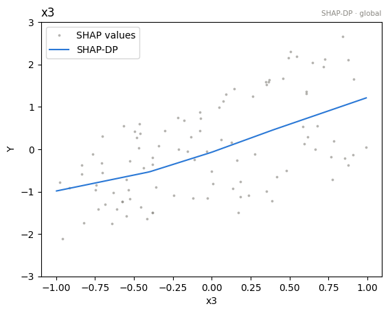

# Regional Effects (unknown black-box function)

- Author: [givasile](https://givasile.github.io/)
- Runtime: ~55 s
- Description: The realistic follow-up to tutorial 03: a neural network is
  fitted on the data and explained with regional PDP, RHALE and SHAP-DP,
  under uncorrelated and correlated features.

This tutorial use the same dataset with the previous [tutorial](./03_regional_effects_synthetic_f/), but instead of explaining the known (synthetic) predictive function, we fit a neural network on the data and explain the neural network. This is a more realistic scenario, since in real-world applications we do not know the underlying function and we only have access to the data. We advise the reader to first read the previous tutorial.


```python
import numpy as np
import effector
import keras
import tensorflow as tf

np.random.seed(12345)
tf.random.set_seed(12345)
```

    WARNING: All log messages before absl::InitializeLog() is called are written to STDERR
    I0000 00:00:1783956777.625801   68836 cpu_feature_guard.cc:227] This TensorFlow binary is optimized to use available CPU instructions in performance-critical operations.
    To enable the following instructions: AVX2 FMA, in other operations, rebuild TensorFlow with the appropriate compiler flags.


<!-- ## Simulation example

### Data Generating Distribution

We will generate $N=1000$ examples with $D=3$ features, which are in the uncorrelated setting all uniformly distributed as follows:

<center>

| Feature | Description                                | Distribution                 |
|---------|--------------------------------------------|------------------------------|
| $x_1$   | Uniformly distributed between $-1$ and $1$ | $x_1 \sim \mathcal{U}(-1,1)$ |
| $x_2$   | Uniformly distributed between $-1$ and $1$ | $x_2 \sim \mathcal{U}(-1,1)$ |
| $x_3$   | Uniformly distributed between $-1$ and $1$ | $x_3 \sim \mathcal{U}(-1,1)$ |

</center>

For the correlated setting we keep the distributional assumptions for $x_2$ and $x_3$ but define $x_1$ such that it is highly correlated with $x_3$ by: $x_1 = x_3 + \delta$ with $\delta \sim \mathcal{N}(0,0.0625)$. -->

## Simulation example

### Data Generating Distribution

We will generate $N=1000$ examples with $D=3$ features, which are in the uncorrelated setting all uniformly distributed as follows:

| Feature | Description                                | Distribution                 |
|---------|--------------------------------------------|------------------------------|
| $x_1$   | Uniformly distributed between $-1$ and $1$ | $x_1 \sim \mathcal{U}(-1,1)$ |
| $x_2$   | Uniformly distributed between $-1$ and $1$ | $x_2 \sim \mathcal{U}(-1,1)$ |
| $x_3$   | Uniformly distributed between $-1$ and $1$ | $x_3 \sim \mathcal{U}(-1,1)$ |

For the correlated setting, we keep the distributional assumptions for $x_2$ and $x_3$, but define $x_1$ such that it is highly correlated with $x_3$ by:  
$x_1 = x_3 + \delta$ with $\delta \sim \mathcal{N}(0,0.0625)$.


```python
def generate_dataset_uncorrelated(N):
    x1 = np.random.uniform(-1, 1, size=N)
    x2 = np.random.uniform(-1, 1, size=N)
    x3 = np.random.uniform(-1, 1, size=N)
    return np.stack((x1, x2, x3), axis=-1)

def generate_dataset_correlated(N):
    x3 = np.random.uniform(-1, 1, size=N)
    x2 = np.random.uniform(-1, 1, size=N)
    x1 = x3 + np.random.normal(loc = np.zeros_like(x3), scale = 0.25)
    return np.stack((x1, x2, x3), axis=-1)

# generate the dataset for the uncorrelated and correlated setting
N = 1000
X_uncor_train = generate_dataset_uncorrelated(N)
X_uncor_test = generate_dataset_uncorrelated(10000)
X_cor_train = generate_dataset_correlated(N)
X_cor_test = generate_dataset_correlated(10000)
```

### Black-box function

We will use the following linear model with a subgroup-specific interaction term:
 $$ y = 3x_1I_{x_3>0} - 3x_1I_{x_3\leq0} + x_3$$ 
 
On a global level, there is a high heterogeneity for the features $x_1$ and $x_3$ due to their interaction with each other. However, this heterogeneity vanishes to 0 if the feature space is separated into subregions:

<center>

| Feature | Region      | Average Effect | Heterogeneity |
|---------|-------------|----------------|---------------|
| $x_1$   | $x_3>0$     | $3x_1$         | 0             |
| $x_1$   | $x_3\leq 0$ | $-3x_1$        | 0             |
| $x_2$   | all         | 0              | 0             |
| $x_3$   | $x_3>0$     | $x_3$          | 0             |
| $x_3$   | $x_3\leq 0$ | $x_3$          | 0             |

</center>


```python
def generate_target(X):
    f = np.where(X[:,2] > 0, 3*X[:,0] + X[:,2], -3*X[:,0] + X[:,2])
    epsilon = np.random.normal(loc = np.zeros_like(X[:,0]), scale = 0.1)
    Y = f + epsilon
    return(Y)

# generate target for uncorrelated and correlated setting
Y_uncor_train = generate_target(X_uncor_train)
Y_uncor_test = generate_target(X_uncor_test)
Y_cor_train = generate_target(X_cor_train)
Y_cor_test = generate_target(X_cor_test)      
```

### Fit a Neural Network

We create a two-layer feedforward Neural Network, a weight decay of 0.01 for 100 epochs. We train two instances of this NN, one on the uncorrelated and one on the correlated setting. In both cases, the NN achieves a Mean Squared Error of about $0.17$ units.


```python
# Train - Evaluate - Explain a neural network
model_uncor = keras.Sequential([
    keras.layers.Dense(10, activation="relu", input_shape=(3,)),
    keras.layers.Dense(10, activation="relu", input_shape=(3,)),
    keras.layers.Dense(1)
])

optimizer = keras.optimizers.Adam(learning_rate=0.01)
model_uncor.compile(optimizer=optimizer, loss="mse")
model_uncor.fit(X_uncor_train, Y_uncor_train, epochs=100)
model_uncor.evaluate(X_uncor_test, Y_uncor_test)
```

    Epoch 1/100


    /home/givasile/github/packages/effector/.venv/lib/python3.10/site-packages/keras/src/layers/core/dense.py:95: UserWarning: Do not pass an `input_shape`/`input_dim` argument to a layer. When using Sequential models, prefer using an `Input(shape)` object as the first layer in the model instead.
      super().__init__(activity_regularizer=activity_regularizer, **kwargs)


    
 1/32 ━━━━━━━━━━━━━━━━━━━━ 30s 996ms/step - loss: 3.7811

    
16/32 ━━━━━━━━━━━━━━━━━━━━ 0s 3ms/step - loss: 3.1733   

    
30/32 ━━━━━━━━━━━━━━━━━━━━ 0s 4ms/step - loss: 2.9814

    
32/32 ━━━━━━━━━━━━━━━━━━━━ 1s 5ms/step - loss: 2.5244


    Epoch 2/100


    
 1/32 ━━━━━━━━━━━━━━━━━━━━ 4s 136ms/step - loss: 1.3338

    
18/32 ━━━━━━━━━━━━━━━━━━━━ 0s 3ms/step - loss: 1.1221  

    
32/32 ━━━━━━━━━━━━━━━━━━━━ 0s 3ms/step - loss: 1.0049

    
32/32 ━━━━━━━━━━━━━━━━━━━━ 0s 4ms/step - loss: 0.7845


    Epoch 3/100


    
 1/32 ━━━━━━━━━━━━━━━━━━━━ 0s 28ms/step - loss: 0.5876

    
16/32 ━━━━━━━━━━━━━━━━━━━━ 0s 3ms/step - loss: 0.4412 

    
32/32 ━━━━━━━━━━━━━━━━━━━━ 0s 4ms/step - loss: 0.4298


    Epoch 4/100


    
 1/32 ━━━━━━━━━━━━━━━━━━━━ 0s 31ms/step - loss: 0.4332

    
18/32 ━━━━━━━━━━━━━━━━━━━━ 0s 3ms/step - loss: 0.3443 

    
32/32 ━━━━━━━━━━━━━━━━━━━━ 0s 4ms/step - loss: 0.3438


    Epoch 5/100


    
 1/32 ━━━━━━━━━━━━━━━━━━━━ 0s 30ms/step - loss: 0.3764

    
19/32 ━━━━━━━━━━━━━━━━━━━━ 0s 3ms/step - loss: 0.2835 

    
32/32 ━━━━━━━━━━━━━━━━━━━━ 0s 4ms/step - loss: 0.2893


    Epoch 6/100


    
 1/32 ━━━━━━━━━━━━━━━━━━━━ 0s 28ms/step - loss: 0.3231

    
17/32 ━━━━━━━━━━━━━━━━━━━━ 0s 3ms/step - loss: 0.2271 

    
31/32 ━━━━━━━━━━━━━━━━━━━━ 0s 3ms/step - loss: 0.2396

    
32/32 ━━━━━━━━━━━━━━━━━━━━ 0s 4ms/step - loss: 0.2465


    Epoch 7/100


    
 1/32 ━━━━━━━━━━━━━━━━━━━━ 1s 35ms/step - loss: 0.2652

    
19/32 ━━━━━━━━━━━━━━━━━━━━ 0s 3ms/step - loss: 0.1969 

    
32/32 ━━━━━━━━━━━━━━━━━━━━ 0s 3ms/step - loss: 0.2167


    Epoch 8/100


    
 1/32 ━━━━━━━━━━━━━━━━━━━━ 1s 37ms/step - loss: 0.2344

    
19/32 ━━━━━━━━━━━━━━━━━━━━ 0s 3ms/step - loss: 0.1715 

    
32/32 ━━━━━━━━━━━━━━━━━━━━ 0s 4ms/step - loss: 0.1936


    Epoch 9/100


    
 1/32 ━━━━━━━━━━━━━━━━━━━━ 5s 192ms/step - loss: 0.1968

    
19/32 ━━━━━━━━━━━━━━━━━━━━ 0s 3ms/step - loss: 0.1502  

    
32/32 ━━━━━━━━━━━━━━━━━━━━ 0s 3ms/step - loss: 0.1776


    Epoch 10/100


    
 1/32 ━━━━━━━━━━━━━━━━━━━━ 1s 37ms/step - loss: 0.1674

    
20/32 ━━━━━━━━━━━━━━━━━━━━ 0s 3ms/step - loss: 0.1359 

    
32/32 ━━━━━━━━━━━━━━━━━━━━ 0s 4ms/step - loss: 0.1634


    Epoch 11/100


    
 1/32 ━━━━━━━━━━━━━━━━━━━━ 0s 29ms/step - loss: 0.1527

    
22/32 ━━━━━━━━━━━━━━━━━━━━ 0s 3ms/step - loss: 0.1275 

    
32/32 ━━━━━━━━━━━━━━━━━━━━ 0s 3ms/step - loss: 0.1529


    Epoch 12/100


    
 1/32 ━━━━━━━━━━━━━━━━━━━━ 1s 41ms/step - loss: 0.1397

    
18/32 ━━━━━━━━━━━━━━━━━━━━ 0s 3ms/step - loss: 0.1119 

    
32/32 ━━━━━━━━━━━━━━━━━━━━ 0s 4ms/step - loss: 0.1444


    Epoch 13/100


    
 1/32 ━━━━━━━━━━━━━━━━━━━━ 1s 35ms/step - loss: 0.1274

    
19/32 ━━━━━━━━━━━━━━━━━━━━ 0s 3ms/step - loss: 0.1070 

    
32/32 ━━━━━━━━━━━━━━━━━━━━ 0s 4ms/step - loss: 0.1374


    Epoch 14/100


    
 1/32 ━━━━━━━━━━━━━━━━━━━━ 1s 36ms/step - loss: 0.1189

    
17/32 ━━━━━━━━━━━━━━━━━━━━ 0s 3ms/step - loss: 0.0951 

    
32/32 ━━━━━━━━━━━━━━━━━━━━ 0s 4ms/step - loss: 0.1295


    Epoch 15/100


    
 1/32 ━━━━━━━━━━━━━━━━━━━━ 0s 32ms/step - loss: 0.1107

    
20/32 ━━━━━━━━━━━━━━━━━━━━ 0s 3ms/step - loss: 0.0959 

    
32/32 ━━━━━━━━━━━━━━━━━━━━ 0s 3ms/step - loss: 0.1226


    Epoch 16/100


    
 1/32 ━━━━━━━━━━━━━━━━━━━━ 1s 32ms/step - loss: 0.1045

    
20/32 ━━━━━━━━━━━━━━━━━━━━ 0s 3ms/step - loss: 0.0907 

    
32/32 ━━━━━━━━━━━━━━━━━━━━ 0s 3ms/step - loss: 0.1161


    Epoch 17/100


    
 1/32 ━━━━━━━━━━━━━━━━━━━━ 1s 34ms/step - loss: 0.0995

    
21/32 ━━━━━━━━━━━━━━━━━━━━ 0s 3ms/step - loss: 0.0875 

    
32/32 ━━━━━━━━━━━━━━━━━━━━ 0s 3ms/step - loss: 0.1094


    Epoch 18/100


    
 1/32 ━━━━━━━━━━━━━━━━━━━━ 1s 36ms/step - loss: 0.0952

    
20/32 ━━━━━━━━━━━━━━━━━━━━ 0s 3ms/step - loss: 0.0825 

    
32/32 ━━━━━━━━━━━━━━━━━━━━ 0s 3ms/step - loss: 0.1039


    Epoch 19/100


    
 1/32 ━━━━━━━━━━━━━━━━━━━━ 0s 27ms/step - loss: 0.0913

    
20/32 ━━━━━━━━━━━━━━━━━━━━ 0s 3ms/step - loss: 0.0776 

    
32/32 ━━━━━━━━━━━━━━━━━━━━ 0s 3ms/step - loss: 0.0980


    Epoch 20/100


    
 1/32 ━━━━━━━━━━━━━━━━━━━━ 6s 200ms/step - loss: 0.0844

    
20/32 ━━━━━━━━━━━━━━━━━━━━ 0s 3ms/step - loss: 0.0731  

    
32/32 ━━━━━━━━━━━━━━━━━━━━ 0s 3ms/step - loss: 0.0934


    Epoch 21/100


    
 1/32 ━━━━━━━━━━━━━━━━━━━━ 0s 26ms/step - loss: 0.0786

    
20/32 ━━━━━━━━━━━━━━━━━━━━ 0s 3ms/step - loss: 0.0698 

    
32/32 ━━━━━━━━━━━━━━━━━━━━ 0s 3ms/step - loss: 0.0904


    Epoch 22/100


    
 1/32 ━━━━━━━━━━━━━━━━━━━━ 0s 31ms/step - loss: 0.0772

    
20/32 ━━━━━━━━━━━━━━━━━━━━ 0s 3ms/step - loss: 0.0694 

    
32/32 ━━━━━━━━━━━━━━━━━━━━ 0s 4ms/step - loss: 0.0878


    Epoch 23/100


    
 1/32 ━━━━━━━━━━━━━━━━━━━━ 0s 27ms/step - loss: 0.0701

    
20/32 ━━━━━━━━━━━━━━━━━━━━ 0s 3ms/step - loss: 0.0660 

    
32/32 ━━━━━━━━━━━━━━━━━━━━ 0s 3ms/step - loss: 0.0852


    Epoch 24/100


    
 1/32 ━━━━━━━━━━━━━━━━━━━━ 1s 37ms/step - loss: 0.0652

    
19/32 ━━━━━━━━━━━━━━━━━━━━ 0s 3ms/step - loss: 0.0618 

    
32/32 ━━━━━━━━━━━━━━━━━━━━ 0s 3ms/step - loss: 0.0841


    Epoch 25/100


    
 1/32 ━━━━━━━━━━━━━━━━━━━━ 0s 25ms/step - loss: 0.0602

    
18/32 ━━━━━━━━━━━━━━━━━━━━ 0s 3ms/step - loss: 0.0589 

    
32/32 ━━━━━━━━━━━━━━━━━━━━ 0s 4ms/step - loss: 0.0842


    Epoch 26/100


    
 1/32 ━━━━━━━━━━━━━━━━━━━━ 0s 32ms/step - loss: 0.0563

    
15/32 ━━━━━━━━━━━━━━━━━━━━ 0s 4ms/step - loss: 0.0536 

    
32/32 ━━━━━━━━━━━━━━━━━━━━ 0s 4ms/step - loss: 0.0840


    Epoch 27/100


    
 1/32 ━━━━━━━━━━━━━━━━━━━━ 1s 32ms/step - loss: 0.0536

    
21/32 ━━━━━━━━━━━━━━━━━━━━ 0s 3ms/step - loss: 0.0625 

    
32/32 ━━━━━━━━━━━━━━━━━━━━ 0s 3ms/step - loss: 0.0832


    Epoch 28/100


    
 1/32 ━━━━━━━━━━━━━━━━━━━━ 1s 35ms/step - loss: 0.0541

    
20/32 ━━━━━━━━━━━━━━━━━━━━ 0s 3ms/step - loss: 0.0611 

    
32/32 ━━━━━━━━━━━━━━━━━━━━ 0s 3ms/step - loss: 0.0811


    Epoch 29/100


    
 1/32 ━━━━━━━━━━━━━━━━━━━━ 0s 32ms/step - loss: 0.0511

    
20/32 ━━━━━━━━━━━━━━━━━━━━ 0s 3ms/step - loss: 0.0607 

    
32/32 ━━━━━━━━━━━━━━━━━━━━ 0s 4ms/step - loss: 0.0801


    Epoch 30/100


    
 1/32 ━━━━━━━━━━━━━━━━━━━━ 1s 33ms/step - loss: 0.0496

    
19/32 ━━━━━━━━━━━━━━━━━━━━ 0s 3ms/step - loss: 0.0584 

    
32/32 ━━━━━━━━━━━━━━━━━━━━ 0s 3ms/step - loss: 0.0788


    Epoch 31/100


    
 1/32 ━━━━━━━━━━━━━━━━━━━━ 1s 38ms/step - loss: 0.0470

    
18/32 ━━━━━━━━━━━━━━━━━━━━ 0s 3ms/step - loss: 0.0541 

    
32/32 ━━━━━━━━━━━━━━━━━━━━ 0s 3ms/step - loss: 0.0657

    
32/32 ━━━━━━━━━━━━━━━━━━━━ 0s 4ms/step - loss: 0.0764


    Epoch 32/100


    
 1/32 ━━━━━━━━━━━━━━━━━━━━ 5s 181ms/step - loss: 0.0430

    
18/32 ━━━━━━━━━━━━━━━━━━━━ 0s 3ms/step - loss: 0.0542  

    
32/32 ━━━━━━━━━━━━━━━━━━━━ 0s 4ms/step - loss: 0.0771


    Epoch 33/100


    
 1/32 ━━━━━━━━━━━━━━━━━━━━ 1s 36ms/step - loss: 0.0418

    
19/32 ━━━━━━━━━━━━━━━━━━━━ 0s 3ms/step - loss: 0.0559 

    
32/32 ━━━━━━━━━━━━━━━━━━━━ 0s 4ms/step - loss: 0.0772


    Epoch 34/100


    
 1/32 ━━━━━━━━━━━━━━━━━━━━ 1s 39ms/step - loss: 0.0392

    
17/32 ━━━━━━━━━━━━━━━━━━━━ 0s 3ms/step - loss: 0.0515 

    
32/32 ━━━━━━━━━━━━━━━━━━━━ 0s 4ms/step - loss: 0.0760


    Epoch 35/100


    
 1/32 ━━━━━━━━━━━━━━━━━━━━ 1s 33ms/step - loss: 0.0408

    
18/32 ━━━━━━━━━━━━━━━━━━━━ 0s 3ms/step - loss: 0.0534 

    
32/32 ━━━━━━━━━━━━━━━━━━━━ 0s 3ms/step - loss: 0.0735


    Epoch 36/100


    
 1/32 ━━━━━━━━━━━━━━━━━━━━ 0s 29ms/step - loss: 0.0373

    
21/32 ━━━━━━━━━━━━━━━━━━━━ 0s 3ms/step - loss: 0.0555 

    
32/32 ━━━━━━━━━━━━━━━━━━━━ 0s 3ms/step - loss: 0.0737


    Epoch 37/100


    
 1/32 ━━━━━━━━━━━━━━━━━━━━ 0s 28ms/step - loss: 0.0369

    
18/32 ━━━━━━━━━━━━━━━━━━━━ 0s 3ms/step - loss: 0.0527 

    
32/32 ━━━━━━━━━━━━━━━━━━━━ 0s 3ms/step - loss: 0.0752


    Epoch 38/100


    
 1/32 ━━━━━━━━━━━━━━━━━━━━ 0s 28ms/step - loss: 0.0367

    
19/32 ━━━━━━━━━━━━━━━━━━━━ 0s 3ms/step - loss: 0.0529 

    
32/32 ━━━━━━━━━━━━━━━━━━━━ 0s 3ms/step - loss: 0.0738


    Epoch 39/100


    
 1/32 ━━━━━━━━━━━━━━━━━━━━ 0s 30ms/step - loss: 0.0375

    
22/32 ━━━━━━━━━━━━━━━━━━━━ 0s 2ms/step - loss: 0.0581 

    
32/32 ━━━━━━━━━━━━━━━━━━━━ 0s 3ms/step - loss: 0.0724


    Epoch 40/100


    
 1/32 ━━━━━━━━━━━━━━━━━━━━ 1s 39ms/step - loss: 0.0331

    
17/32 ━━━━━━━━━━━━━━━━━━━━ 0s 3ms/step - loss: 0.0477 

    
32/32 ━━━━━━━━━━━━━━━━━━━━ 0s 4ms/step - loss: 0.0717


    Epoch 41/100


    
 1/32 ━━━━━━━━━━━━━━━━━━━━ 1s 35ms/step - loss: 0.0355

    
18/32 ━━━━━━━━━━━━━━━━━━━━ 0s 3ms/step - loss: 0.0516 

    
32/32 ━━━━━━━━━━━━━━━━━━━━ 0s 4ms/step - loss: 0.0733


    Epoch 42/100


    
 1/32 ━━━━━━━━━━━━━━━━━━━━ 0s 32ms/step - loss: 0.0360

    
19/32 ━━━━━━━━━━━━━━━━━━━━ 0s 3ms/step - loss: 0.0536 

    
32/32 ━━━━━━━━━━━━━━━━━━━━ 0s 4ms/step - loss: 0.0710


    Epoch 43/100


    
 1/32 ━━━━━━━━━━━━━━━━━━━━ 0s 29ms/step - loss: 0.0324

    
18/32 ━━━━━━━━━━━━━━━━━━━━ 0s 3ms/step - loss: 0.0482 

    
32/32 ━━━━━━━━━━━━━━━━━━━━ 0s 4ms/step - loss: 0.0687


    Epoch 44/100


    
 1/32 ━━━━━━━━━━━━━━━━━━━━ 1s 36ms/step - loss: 0.0333

    
19/32 ━━━━━━━━━━━━━━━━━━━━ 0s 3ms/step - loss: 0.0515 

    
32/32 ━━━━━━━━━━━━━━━━━━━━ 0s 4ms/step - loss: 0.0716


    Epoch 45/100


    
 1/32 ━━━━━━━━━━━━━━━━━━━━ 1s 34ms/step - loss: 0.0357

    
15/32 ━━━━━━━━━━━━━━━━━━━━ 0s 4ms/step - loss: 0.0490 

    
29/32 ━━━━━━━━━━━━━━━━━━━━ 0s 4ms/step - loss: 0.0621

    
32/32 ━━━━━━━━━━━━━━━━━━━━ 0s 4ms/step - loss: 0.0722


    Epoch 46/100


    
 1/32 ━━━━━━━━━━━━━━━━━━━━ 0s 29ms/step - loss: 0.0321

    
19/32 ━━━━━━━━━━━━━━━━━━━━ 0s 3ms/step - loss: 0.0517 

    
32/32 ━━━━━━━━━━━━━━━━━━━━ 0s 4ms/step - loss: 0.0688


    Epoch 47/100


    
 1/32 ━━━━━━━━━━━━━━━━━━━━ 1s 39ms/step - loss: 0.0304

    
21/32 ━━━━━━━━━━━━━━━━━━━━ 0s 3ms/step - loss: 0.0530 

    
32/32 ━━━━━━━━━━━━━━━━━━━━ 0s 3ms/step - loss: 0.0692


    Epoch 48/100


    
 1/32 ━━━━━━━━━━━━━━━━━━━━ 1s 35ms/step - loss: 0.0323

    
20/32 ━━━━━━━━━━━━━━━━━━━━ 0s 3ms/step - loss: 0.0539 

    
32/32 ━━━━━━━━━━━━━━━━━━━━ 0s 3ms/step - loss: 0.0701


    Epoch 49/100


    
 1/32 ━━━━━━━━━━━━━━━━━━━━ 0s 32ms/step - loss: 0.0321

    
21/32 ━━━━━━━━━━━━━━━━━━━━ 0s 3ms/step - loss: 0.0550 

    
32/32 ━━━━━━━━━━━━━━━━━━━━ 0s 3ms/step - loss: 0.0700


    Epoch 50/100


    
 1/32 ━━━━━━━━━━━━━━━━━━━━ 0s 29ms/step - loss: 0.0314

    
19/32 ━━━━━━━━━━━━━━━━━━━━ 0s 3ms/step - loss: 0.0513 

    
32/32 ━━━━━━━━━━━━━━━━━━━━ 0s 3ms/step - loss: 0.0701


    Epoch 51/100


    
 1/32 ━━━━━━━━━━━━━━━━━━━━ 0s 28ms/step - loss: 0.0310

    
20/32 ━━━━━━━━━━━━━━━━━━━━ 0s 3ms/step - loss: 0.0532 

    
32/32 ━━━━━━━━━━━━━━━━━━━━ 0s 3ms/step - loss: 0.0679


    Epoch 52/100


    
 1/32 ━━━━━━━━━━━━━━━━━━━━ 0s 24ms/step - loss: 0.0294

    
19/32 ━━━━━━━━━━━━━━━━━━━━ 0s 3ms/step - loss: 0.0501 

    
32/32 ━━━━━━━━━━━━━━━━━━━━ 0s 3ms/step - loss: 0.0668


    Epoch 53/100


    
 1/32 ━━━━━━━━━━━━━━━━━━━━ 0s 26ms/step - loss: 0.0307

    
21/32 ━━━━━━━━━━━━━━━━━━━━ 0s 3ms/step - loss: 0.0530 

    
32/32 ━━━━━━━━━━━━━━━━━━━━ 0s 3ms/step - loss: 0.0700


    Epoch 54/100


    
 1/32 ━━━━━━━━━━━━━━━━━━━━ 1s 38ms/step - loss: 0.0310

    
21/32 ━━━━━━━━━━━━━━━━━━━━ 0s 3ms/step - loss: 0.0543 

    
32/32 ━━━━━━━━━━━━━━━━━━━━ 0s 4ms/step - loss: 0.0685


    Epoch 55/100


    
 1/32 ━━━━━━━━━━━━━━━━━━━━ 1s 36ms/step - loss: 0.0304

    
20/32 ━━━━━━━━━━━━━━━━━━━━ 0s 3ms/step - loss: 0.0539 

    
32/32 ━━━━━━━━━━━━━━━━━━━━ 0s 3ms/step - loss: 0.0675


    Epoch 56/100


    
 1/32 ━━━━━━━━━━━━━━━━━━━━ 0s 32ms/step - loss: 0.0253

    
21/32 ━━━━━━━━━━━━━━━━━━━━ 0s 3ms/step - loss: 0.0543 

    
32/32 ━━━━━━━━━━━━━━━━━━━━ 0s 3ms/step - loss: 0.0696


    Epoch 57/100


    
 1/32 ━━━━━━━━━━━━━━━━━━━━ 0s 26ms/step - loss: 0.0317

    
20/32 ━━━━━━━━━━━━━━━━━━━━ 0s 3ms/step - loss: 0.0495 

    
32/32 ━━━━━━━━━━━━━━━━━━━━ 0s 4ms/step - loss: 0.0630


    Epoch 58/100


    
 1/32 ━━━━━━━━━━━━━━━━━━━━ 0s 30ms/step - loss: 0.0270

    
18/32 ━━━━━━━━━━━━━━━━━━━━ 0s 3ms/step - loss: 0.0489 

    
32/32 ━━━━━━━━━━━━━━━━━━━━ 0s 4ms/step - loss: 0.0685


    Epoch 59/100


    
 1/32 ━━━━━━━━━━━━━━━━━━━━ 0s 29ms/step - loss: 0.0340

    
19/32 ━━━━━━━━━━━━━━━━━━━━ 0s 3ms/step - loss: 0.0524 

    
32/32 ━━━━━━━━━━━━━━━━━━━━ 0s 3ms/step - loss: 0.0690


    Epoch 60/100


    
 1/32 ━━━━━━━━━━━━━━━━━━━━ 0s 28ms/step - loss: 0.0269

    
19/32 ━━━━━━━━━━━━━━━━━━━━ 0s 3ms/step - loss: 0.0520 

    
32/32 ━━━━━━━━━━━━━━━━━━━━ 0s 3ms/step - loss: 0.0669


    Epoch 61/100


    
 1/32 ━━━━━━━━━━━━━━━━━━━━ 0s 30ms/step - loss: 0.0296

    
18/32 ━━━━━━━━━━━━━━━━━━━━ 0s 3ms/step - loss: 0.0453 

    
32/32 ━━━━━━━━━━━━━━━━━━━━ 0s 3ms/step - loss: 0.0620


    Epoch 62/100


    
 1/32 ━━━━━━━━━━━━━━━━━━━━ 1s 34ms/step - loss: 0.0321

    
20/32 ━━━━━━━━━━━━━━━━━━━━ 0s 3ms/step - loss: 0.0504 

    
32/32 ━━━━━━━━━━━━━━━━━━━━ 0s 3ms/step - loss: 0.0633


    Epoch 63/100


    
 1/32 ━━━━━━━━━━━━━━━━━━━━ 1s 33ms/step - loss: 0.0244

    
21/32 ━━━━━━━━━━━━━━━━━━━━ 0s 3ms/step - loss: 0.0495 

    
32/32 ━━━━━━━━━━━━━━━━━━━━ 0s 3ms/step - loss: 0.0637


    Epoch 64/100


    
 1/32 ━━━━━━━━━━━━━━━━━━━━ 1s 33ms/step - loss: 0.0273

    
22/32 ━━━━━━━━━━━━━━━━━━━━ 0s 2ms/step - loss: 0.0536 

    
32/32 ━━━━━━━━━━━━━━━━━━━━ 0s 3ms/step - loss: 0.0687


    Epoch 65/100


    
 1/32 ━━━━━━━━━━━━━━━━━━━━ 0s 28ms/step - loss: 0.0363

    
20/32 ━━━━━━━━━━━━━━━━━━━━ 0s 3ms/step - loss: 0.0525 

    
32/32 ━━━━━━━━━━━━━━━━━━━━ 0s 3ms/step - loss: 0.0627


    Epoch 66/100


    
 1/32 ━━━━━━━━━━━━━━━━━━━━ 0s 28ms/step - loss: 0.0235

    
20/32 ━━━━━━━━━━━━━━━━━━━━ 0s 3ms/step - loss: 0.0490 

    
32/32 ━━━━━━━━━━━━━━━━━━━━ 0s 3ms/step - loss: 0.0669


    Epoch 67/100


    
 1/32 ━━━━━━━━━━━━━━━━━━━━ 0s 32ms/step - loss: 0.0300

    
20/32 ━━━━━━━━━━━━━━━━━━━━ 0s 3ms/step - loss: 0.0505 

    
32/32 ━━━━━━━━━━━━━━━━━━━━ 0s 3ms/step - loss: 0.0602


    Epoch 68/100


    
 1/32 ━━━━━━━━━━━━━━━━━━━━ 0s 27ms/step - loss: 0.0248

    
23/32 ━━━━━━━━━━━━━━━━━━━━ 0s 2ms/step - loss: 0.0449 

    
32/32 ━━━━━━━━━━━━━━━━━━━━ 0s 3ms/step - loss: 0.0568


    Epoch 69/100


    
 1/32 ━━━━━━━━━━━━━━━━━━━━ 1s 33ms/step - loss: 0.0284

    
22/32 ━━━━━━━━━━━━━━━━━━━━ 0s 2ms/step - loss: 0.0548 

    
32/32 ━━━━━━━━━━━━━━━━━━━━ 0s 3ms/step - loss: 0.0700


    Epoch 70/100


    
 1/32 ━━━━━━━━━━━━━━━━━━━━ 0s 28ms/step - loss: 0.0308

    
17/32 ━━━━━━━━━━━━━━━━━━━━ 0s 3ms/step - loss: 0.0448 

    
32/32 ━━━━━━━━━━━━━━━━━━━━ 0s 4ms/step - loss: 0.0590


    Epoch 71/100


    
 1/32 ━━━━━━━━━━━━━━━━━━━━ 0s 28ms/step - loss: 0.0297

    
18/32 ━━━━━━━━━━━━━━━━━━━━ 0s 3ms/step - loss: 0.0462 

    
32/32 ━━━━━━━━━━━━━━━━━━━━ 0s 4ms/step - loss: 0.0656


    Epoch 72/100


    
 1/32 ━━━━━━━━━━━━━━━━━━━━ 0s 25ms/step - loss: 0.0329

    
22/32 ━━━━━━━━━━━━━━━━━━━━ 0s 2ms/step - loss: 0.0522 

    
32/32 ━━━━━━━━━━━━━━━━━━━━ 0s 3ms/step - loss: 0.0625


    Epoch 73/100


    
 1/32 ━━━━━━━━━━━━━━━━━━━━ 0s 28ms/step - loss: 0.0239

    
20/32 ━━━━━━━━━━━━━━━━━━━━ 0s 3ms/step - loss: 0.0521 

    
32/32 ━━━━━━━━━━━━━━━━━━━━ 0s 3ms/step - loss: 0.0664


    Epoch 74/100


    
 1/32 ━━━━━━━━━━━━━━━━━━━━ 0s 29ms/step - loss: 0.0296

    
21/32 ━━━━━━━━━━━━━━━━━━━━ 0s 3ms/step - loss: 0.0471 

    
32/32 ━━━━━━━━━━━━━━━━━━━━ 0s 3ms/step - loss: 0.0561


    Epoch 75/100


    
 1/32 ━━━━━━━━━━━━━━━━━━━━ 0s 28ms/step - loss: 0.0264

    
20/32 ━━━━━━━━━━━━━━━━━━━━ 0s 3ms/step - loss: 0.0461 

    
32/32 ━━━━━━━━━━━━━━━━━━━━ 0s 3ms/step - loss: 0.0610


    Epoch 76/100


    
 1/32 ━━━━━━━━━━━━━━━━━━━━ 0s 29ms/step - loss: 0.0271

    
21/32 ━━━━━━━━━━━━━━━━━━━━ 0s 3ms/step - loss: 0.0538 

    
32/32 ━━━━━━━━━━━━━━━━━━━━ 0s 3ms/step - loss: 0.0656


    Epoch 77/100


    
 1/32 ━━━━━━━━━━━━━━━━━━━━ 1s 35ms/step - loss: 0.0271

    
19/32 ━━━━━━━━━━━━━━━━━━━━ 0s 3ms/step - loss: 0.0422 

    
32/32 ━━━━━━━━━━━━━━━━━━━━ 0s 3ms/step - loss: 0.0520


    Epoch 78/100


    
 1/32 ━━━━━━━━━━━━━━━━━━━━ 1s 32ms/step - loss: 0.0232

    
18/32 ━━━━━━━━━━━━━━━━━━━━ 0s 3ms/step - loss: 0.0403 

    
32/32 ━━━━━━━━━━━━━━━━━━━━ 0s 3ms/step - loss: 0.0649


    Epoch 79/100


    
 1/32 ━━━━━━━━━━━━━━━━━━━━ 1s 33ms/step - loss: 0.0345

    
21/32 ━━━━━━━━━━━━━━━━━━━━ 0s 3ms/step - loss: 0.0581 

    
32/32 ━━━━━━━━━━━━━━━━━━━━ 0s 3ms/step - loss: 0.0656


    Epoch 80/100


    
 1/32 ━━━━━━━━━━━━━━━━━━━━ 1s 33ms/step - loss: 0.0279

    
18/32 ━━━━━━━━━━━━━━━━━━━━ 0s 3ms/step - loss: 0.0418 

    
32/32 ━━━━━━━━━━━━━━━━━━━━ 0s 4ms/step - loss: 0.0563


    Epoch 81/100


    
 1/32 ━━━━━━━━━━━━━━━━━━━━ 1s 36ms/step - loss: 0.0294

    
19/32 ━━━━━━━━━━━━━━━━━━━━ 0s 3ms/step - loss: 0.0431 

    
32/32 ━━━━━━━━━━━━━━━━━━━━ 0s 4ms/step - loss: 0.0571


    Epoch 82/100


    
 1/32 ━━━━━━━━━━━━━━━━━━━━ 1s 35ms/step - loss: 0.0247

    
18/32 ━━━━━━━━━━━━━━━━━━━━ 0s 3ms/step - loss: 0.0467 

    
32/32 ━━━━━━━━━━━━━━━━━━━━ 0s 3ms/step - loss: 0.0624


    Epoch 83/100


    
 1/32 ━━━━━━━━━━━━━━━━━━━━ 0s 26ms/step - loss: 0.0268

    
20/32 ━━━━━━━━━━━━━━━━━━━━ 0s 3ms/step - loss: 0.0430 

    
32/32 ━━━━━━━━━━━━━━━━━━━━ 0s 3ms/step - loss: 0.0511


    Epoch 84/100


    
 1/32 ━━━━━━━━━━━━━━━━━━━━ 1s 34ms/step - loss: 0.0222

    
18/32 ━━━━━━━━━━━━━━━━━━━━ 0s 3ms/step - loss: 0.0394 

    
32/32 ━━━━━━━━━━━━━━━━━━━━ 0s 4ms/step - loss: 0.0635


    Epoch 85/100


    
 1/32 ━━━━━━━━━━━━━━━━━━━━ 1s 36ms/step - loss: 0.0323

    
15/32 ━━━━━━━━━━━━━━━━━━━━ 0s 4ms/step - loss: 0.0518 

    
31/32 ━━━━━━━━━━━━━━━━━━━━ 0s 3ms/step - loss: 0.0596

    
32/32 ━━━━━━━━━━━━━━━━━━━━ 0s 4ms/step - loss: 0.0624


    Epoch 86/100


    
 1/32 ━━━━━━━━━━━━━━━━━━━━ 5s 174ms/step - loss: 0.0233

    
18/32 ━━━━━━━━━━━━━━━━━━━━ 0s 3ms/step - loss: 0.0391  

    
32/32 ━━━━━━━━━━━━━━━━━━━━ 0s 4ms/step - loss: 0.0544


    Epoch 87/100


    
 1/32 ━━━━━━━━━━━━━━━━━━━━ 5s 178ms/step - loss: 0.0271

    
13/32 ━━━━━━━━━━━━━━━━━━━━ 0s 4ms/step - loss: 0.0366  

    
26/32 ━━━━━━━━━━━━━━━━━━━━ 0s 4ms/step - loss: 0.0456

    
32/32 ━━━━━━━━━━━━━━━━━━━━ 0s 5ms/step - loss: 0.0534


    Epoch 88/100


    
 1/32 ━━━━━━━━━━━━━━━━━━━━ 1s 39ms/step - loss: 0.0306

    
15/32 ━━━━━━━━━━━━━━━━━━━━ 0s 4ms/step - loss: 0.0426 

    
32/32 ━━━━━━━━━━━━━━━━━━━━ 0s 4ms/step - loss: 0.0599


    Epoch 89/100


    
 1/32 ━━━━━━━━━━━━━━━━━━━━ 1s 45ms/step - loss: 0.0278

    
20/32 ━━━━━━━━━━━━━━━━━━━━ 0s 3ms/step - loss: 0.0488 

    
31/32 ━━━━━━━━━━━━━━━━━━━━ 0s 3ms/step - loss: 0.0538

    
32/32 ━━━━━━━━━━━━━━━━━━━━ 0s 4ms/step - loss: 0.0606


    Epoch 90/100


    
 1/32 ━━━━━━━━━━━━━━━━━━━━ 1s 41ms/step - loss: 0.0275

    
14/32 ━━━━━━━━━━━━━━━━━━━━ 0s 4ms/step - loss: 0.0412 

    
26/32 ━━━━━━━━━━━━━━━━━━━━ 0s 4ms/step - loss: 0.0511

    
32/32 ━━━━━━━━━━━━━━━━━━━━ 0s 5ms/step - loss: 0.0621


    Epoch 91/100


    
 1/32 ━━━━━━━━━━━━━━━━━━━━ 1s 46ms/step - loss: 0.0292

    
14/32 ━━━━━━━━━━━━━━━━━━━━ 0s 4ms/step - loss: 0.0469 

    
30/32 ━━━━━━━━━━━━━━━━━━━━ 0s 4ms/step - loss: 0.0551

    
32/32 ━━━━━━━━━━━━━━━━━━━━ 0s 4ms/step - loss: 0.0580


    Epoch 92/100


    
 1/32 ━━━━━━━━━━━━━━━━━━━━ 1s 45ms/step - loss: 0.0204

    
12/32 ━━━━━━━━━━━━━━━━━━━━ 0s 5ms/step - loss: 0.0291 

    
22/32 ━━━━━━━━━━━━━━━━━━━━ 0s 5ms/step - loss: 0.0392

    
32/32 ━━━━━━━━━━━━━━━━━━━━ 0s 5ms/step - loss: 0.0538


    Epoch 93/100


    
 1/32 ━━━━━━━━━━━━━━━━━━━━ 1s 44ms/step - loss: 0.0338

    
20/32 ━━━━━━━━━━━━━━━━━━━━ 0s 3ms/step - loss: 0.0455 

    
32/32 ━━━━━━━━━━━━━━━━━━━━ 0s 3ms/step - loss: 0.0560


    Epoch 94/100


    
 1/32 ━━━━━━━━━━━━━━━━━━━━ 1s 45ms/step - loss: 0.0297

    
15/32 ━━━━━━━━━━━━━━━━━━━━ 0s 4ms/step - loss: 0.0448 

    
31/32 ━━━━━━━━━━━━━━━━━━━━ 0s 3ms/step - loss: 0.0536

    
32/32 ━━━━━━━━━━━━━━━━━━━━ 0s 4ms/step - loss: 0.0569


    Epoch 95/100


    
 1/32 ━━━━━━━━━━━━━━━━━━━━ 1s 51ms/step - loss: 0.0238

    
12/32 ━━━━━━━━━━━━━━━━━━━━ 0s 5ms/step - loss: 0.0306 

    
23/32 ━━━━━━━━━━━━━━━━━━━━ 0s 5ms/step - loss: 0.0391

    
32/32 ━━━━━━━━━━━━━━━━━━━━ 0s 6ms/step - loss: 0.0524


    Epoch 96/100


    
 1/32 ━━━━━━━━━━━━━━━━━━━━ 1s 56ms/step - loss: 0.0301

    
14/32 ━━━━━━━━━━━━━━━━━━━━ 0s 4ms/step - loss: 0.0467 

    
26/32 ━━━━━━━━━━━━━━━━━━━━ 0s 4ms/step - loss: 0.0552

    
32/32 ━━━━━━━━━━━━━━━━━━━━ 0s 6ms/step - loss: 0.0584


    Epoch 97/100


    
 1/32 ━━━━━━━━━━━━━━━━━━━━ 1s 45ms/step - loss: 0.0190

    
13/32 ━━━━━━━━━━━━━━━━━━━━ 0s 4ms/step - loss: 0.0271 

    
25/32 ━━━━━━━━━━━━━━━━━━━━ 0s 4ms/step - loss: 0.0355

    
32/32 ━━━━━━━━━━━━━━━━━━━━ 0s 5ms/step - loss: 0.0484


    Epoch 98/100


    
 1/32 ━━━━━━━━━━━━━━━━━━━━ 1s 44ms/step - loss: 0.0342

    
11/32 ━━━━━━━━━━━━━━━━━━━━ 0s 5ms/step - loss: 0.0474 

    
23/32 ━━━━━━━━━━━━━━━━━━━━ 0s 5ms/step - loss: 0.0578

    
32/32 ━━━━━━━━━━━━━━━━━━━━ 0s 6ms/step - loss: 0.0666


    Epoch 99/100


    
 1/32 ━━━━━━━━━━━━━━━━━━━━ 1s 38ms/step - loss: 0.0246

    
14/32 ━━━━━━━━━━━━━━━━━━━━ 0s 4ms/step - loss: 0.0468 

    
25/32 ━━━━━━━━━━━━━━━━━━━━ 0s 5ms/step - loss: 0.0563

    
32/32 ━━━━━━━━━━━━━━━━━━━━ 0s 6ms/step - loss: 0.0643


    Epoch 100/100


    
 1/32 ━━━━━━━━━━━━━━━━━━━━ 1s 47ms/step - loss: 0.0210

    
13/32 ━━━━━━━━━━━━━━━━━━━━ 0s 5ms/step - loss: 0.0298 

    
22/32 ━━━━━━━━━━━━━━━━━━━━ 0s 5ms/step - loss: 0.0357

    
32/32 ━━━━━━━━━━━━━━━━━━━━ 0s 7ms/step - loss: 0.0423


    
  1/313 ━━━━━━━━━━━━━━━━━━━━ 1:01 196ms/step - loss: 0.0296

    
 18/313 ━━━━━━━━━━━━━━━━━━━━ 0s 3ms/step - loss: 0.0372    

    
 27/313 ━━━━━━━━━━━━━━━━━━━━ 1s 4ms/step - loss: 0.0462

    
 38/313 ━━━━━━━━━━━━━━━━━━━━ 1s 4ms/step - loss: 0.0510

    
 52/313 ━━━━━━━━━━━━━━━━━━━━ 1s 4ms/step - loss: 0.0532

    
 68/313 ━━━━━━━━━━━━━━━━━━━━ 0s 4ms/step - loss: 0.0578

    
 82/313 ━━━━━━━━━━━━━━━━━━━━ 0s 4ms/step - loss: 0.0607

    
 97/313 ━━━━━━━━━━━━━━━━━━━━ 0s 4ms/step - loss: 0.0640

    
110/313 ━━━━━━━━━━━━━━━━━━━━ 0s 4ms/step - loss: 0.0658

    
121/313 ━━━━━━━━━━━━━━━━━━━━ 0s 4ms/step - loss: 0.0667

    
130/313 ━━━━━━━━━━━━━━━━━━━━ 0s 4ms/step - loss: 0.0675

    
142/313 ━━━━━━━━━━━━━━━━━━━━ 0s 4ms/step - loss: 0.0683

    
158/313 ━━━━━━━━━━━━━━━━━━━━ 0s 4ms/step - loss: 0.0692

    
169/313 ━━━━━━━━━━━━━━━━━━━━ 0s 4ms/step - loss: 0.0696

    
179/313 ━━━━━━━━━━━━━━━━━━━━ 0s 4ms/step - loss: 0.0699

    
194/313 ━━━━━━━━━━━━━━━━━━━━ 0s 4ms/step - loss: 0.0704

    
207/313 ━━━━━━━━━━━━━━━━━━━━ 0s 4ms/step - loss: 0.0707

    
223/313 ━━━━━━━━━━━━━━━━━━━━ 0s 4ms/step - loss: 0.0709

    
241/313 ━━━━━━━━━━━━━━━━━━━━ 0s 4ms/step - loss: 0.0711

    
255/313 ━━━━━━━━━━━━━━━━━━━━ 0s 4ms/step - loss: 0.0711

    
269/313 ━━━━━━━━━━━━━━━━━━━━ 0s 4ms/step - loss: 0.0711

    
284/313 ━━━━━━━━━━━━━━━━━━━━ 0s 4ms/step - loss: 0.0710

    
296/313 ━━━━━━━━━━━━━━━━━━━━ 0s 4ms/step - loss: 0.0709

    
313/313 ━━━━━━━━━━━━━━━━━━━━ 0s 4ms/step - loss: 0.0707

    
313/313 ━━━━━━━━━━━━━━━━━━━━ 1s 4ms/step - loss: 0.0679


    0.06786616891622543


```python
model_cor = keras.Sequential([
    keras.layers.Dense(10, activation="relu", input_shape=(3,)),
    keras.layers.Dense(10, activation="relu", input_shape=(3,)),
    keras.layers.Dense(1)
])

optimizer = keras.optimizers.Adam(learning_rate=0.01)
model_cor.compile(optimizer=optimizer, loss="mse")
model_cor.fit(X_cor_train, Y_cor_train, epochs=100)
model_cor.evaluate(X_cor_test, Y_cor_test)
```

    Epoch 1/100


    
 1/32 ━━━━━━━━━━━━━━━━━━━━ 39s 1s/step - loss: 3.1869

    
14/32 ━━━━━━━━━━━━━━━━━━━━ 0s 4ms/step - loss: 2.7241

    
24/32 ━━━━━━━━━━━━━━━━━━━━ 0s 4ms/step - loss: 2.3074

    
32/32 ━━━━━━━━━━━━━━━━━━━━ 1s 6ms/step - loss: 1.2629


    Epoch 2/100


    
 1/32 ━━━━━━━━━━━━━━━━━━━━ 4s 141ms/step - loss: 0.4295

    
11/32 ━━━━━━━━━━━━━━━━━━━━ 0s 5ms/step - loss: 0.4262  

    
26/32 ━━━━━━━━━━━━━━━━━━━━ 0s 4ms/step - loss: 0.3808

    
32/32 ━━━━━━━━━━━━━━━━━━━━ 0s 5ms/step - loss: 0.2992


    Epoch 3/100


    
 1/32 ━━━━━━━━━━━━━━━━━━━━ 1s 43ms/step - loss: 0.2085

    
14/32 ━━━━━━━━━━━━━━━━━━━━ 0s 4ms/step - loss: 0.1849 

    
26/32 ━━━━━━━━━━━━━━━━━━━━ 0s 4ms/step - loss: 0.1774

    
32/32 ━━━━━━━━━━━━━━━━━━━━ 0s 6ms/step - loss: 0.1703


    Epoch 4/100


    
 1/32 ━━━━━━━━━━━━━━━━━━━━ 1s 44ms/step - loss: 0.1650

    
19/32 ━━━━━━━━━━━━━━━━━━━━ 0s 3ms/step - loss: 0.1436 

    
32/32 ━━━━━━━━━━━━━━━━━━━━ 0s 4ms/step - loss: 0.1424


    Epoch 5/100


    
 1/32 ━━━━━━━━━━━━━━━━━━━━ 1s 38ms/step - loss: 0.1598

    
15/32 ━━━━━━━━━━━━━━━━━━━━ 0s 4ms/step - loss: 0.1262 

    
26/32 ━━━━━━━━━━━━━━━━━━━━ 0s 4ms/step - loss: 0.1222

    
32/32 ━━━━━━━━━━━━━━━━━━━━ 0s 5ms/step - loss: 0.1226


    Epoch 6/100


    
 1/32 ━━━━━━━━━━━━━━━━━━━━ 4s 139ms/step - loss: 0.1546

    
14/32 ━━━━━━━━━━━━━━━━━━━━ 0s 4ms/step - loss: 0.1131  

    
27/32 ━━━━━━━━━━━━━━━━━━━━ 0s 4ms/step - loss: 0.1082

    
32/32 ━━━━━━━━━━━━━━━━━━━━ 0s 5ms/step - loss: 0.1075


    Epoch 7/100


    
 1/32 ━━━━━━━━━━━━━━━━━━━━ 5s 171ms/step - loss: 0.1485

    
11/32 ━━━━━━━━━━━━━━━━━━━━ 0s 5ms/step - loss: 0.1035  

    
25/32 ━━━━━━━━━━━━━━━━━━━━ 0s 4ms/step - loss: 0.0962

    
32/32 ━━━━━━━━━━━━━━━━━━━━ 0s 5ms/step - loss: 0.0949


    Epoch 8/100


    
 1/32 ━━━━━━━━━━━━━━━━━━━━ 1s 40ms/step - loss: 0.1397

    
13/32 ━━━━━━━━━━━━━━━━━━━━ 0s 4ms/step - loss: 0.0912 

    
26/32 ━━━━━━━━━━━━━━━━━━━━ 0s 4ms/step - loss: 0.0855

    
32/32 ━━━━━━━━━━━━━━━━━━━━ 0s 5ms/step - loss: 0.0842


    Epoch 9/100


    
 1/32 ━━━━━━━━━━━━━━━━━━━━ 1s 50ms/step - loss: 0.1356

    
15/32 ━━━━━━━━━━━━━━━━━━━━ 0s 4ms/step - loss: 0.0820 

    
29/32 ━━━━━━━━━━━━━━━━━━━━ 0s 4ms/step - loss: 0.0775

    
32/32 ━━━━━━━━━━━━━━━━━━━━ 0s 5ms/step - loss: 0.0758


    Epoch 10/100


    
 1/32 ━━━━━━━━━━━━━━━━━━━━ 1s 59ms/step - loss: 0.1297

    
18/32 ━━━━━━━━━━━━━━━━━━━━ 0s 3ms/step - loss: 0.0732 

    
32/32 ━━━━━━━━━━━━━━━━━━━━ 0s 4ms/step - loss: 0.0691


    Epoch 11/100


    
 1/32 ━━━━━━━━━━━━━━━━━━━━ 1s 45ms/step - loss: 0.1184

    
17/32 ━━━━━━━━━━━━━━━━━━━━ 0s 3ms/step - loss: 0.0674 

    
30/32 ━━━━━━━━━━━━━━━━━━━━ 0s 4ms/step - loss: 0.0648

    
32/32 ━━━━━━━━━━━━━━━━━━━━ 0s 5ms/step - loss: 0.0641


    Epoch 12/100


    
 1/32 ━━━━━━━━━━━━━━━━━━━━ 1s 44ms/step - loss: 0.1141

    
15/32 ━━━━━━━━━━━━━━━━━━━━ 0s 4ms/step - loss: 0.0637 

    
28/32 ━━━━━━━━━━━━━━━━━━━━ 0s 4ms/step - loss: 0.0600

    
32/32 ━━━━━━━━━━━━━━━━━━━━ 0s 5ms/step - loss: 0.0595


    Epoch 13/100


    
 1/32 ━━━━━━━━━━━━━━━━━━━━ 4s 156ms/step - loss: 0.1051

    
19/32 ━━━━━━━━━━━━━━━━━━━━ 0s 3ms/step - loss: 0.0565  

    
32/32 ━━━━━━━━━━━━━━━━━━━━ 0s 4ms/step - loss: 0.0551


    Epoch 14/100


    
 1/32 ━━━━━━━━━━━━━━━━━━━━ 0s 27ms/step - loss: 0.1003

    
24/32 ━━━━━━━━━━━━━━━━━━━━ 0s 2ms/step - loss: 0.0508 

    
32/32 ━━━━━━━━━━━━━━━━━━━━ 0s 3ms/step - loss: 0.0513


    Epoch 15/100


    
 1/32 ━━━━━━━━━━━━━━━━━━━━ 0s 28ms/step - loss: 0.0946

    
21/32 ━━━━━━━━━━━━━━━━━━━━ 0s 3ms/step - loss: 0.0478 

    
32/32 ━━━━━━━━━━━━━━━━━━━━ 0s 3ms/step - loss: 0.0483


    Epoch 16/100


    
 1/32 ━━━━━━━━━━━━━━━━━━━━ 0s 24ms/step - loss: 0.0889

    
21/32 ━━━━━━━━━━━━━━━━━━━━ 0s 3ms/step - loss: 0.0445 

    
32/32 ━━━━━━━━━━━━━━━━━━━━ 0s 3ms/step - loss: 0.0457


    Epoch 17/100


    
 1/32 ━━━━━━━━━━━━━━━━━━━━ 0s 30ms/step - loss: 0.0791

    
18/32 ━━━━━━━━━━━━━━━━━━━━ 0s 3ms/step - loss: 0.0414 

    
32/32 ━━━━━━━━━━━━━━━━━━━━ 0s 4ms/step - loss: 0.0431


    Epoch 18/100


    
 1/32 ━━━━━━━━━━━━━━━━━━━━ 1s 33ms/step - loss: 0.0731

    
21/32 ━━━━━━━━━━━━━━━━━━━━ 0s 3ms/step - loss: 0.0374 

    
32/32 ━━━━━━━━━━━━━━━━━━━━ 0s 3ms/step - loss: 0.0406


    Epoch 19/100


    
 1/32 ━━━━━━━━━━━━━━━━━━━━ 1s 38ms/step - loss: 0.0684

    
20/32 ━━━━━━━━━━━━━━━━━━━━ 0s 3ms/step - loss: 0.0353 

    
32/32 ━━━━━━━━━━━━━━━━━━━━ 0s 3ms/step - loss: 0.0389


    Epoch 20/100


    
 1/32 ━━━━━━━━━━━━━━━━━━━━ 0s 28ms/step - loss: 0.0638

    
22/32 ━━━━━━━━━━━━━━━━━━━━ 0s 2ms/step - loss: 0.0324 

    
32/32 ━━━━━━━━━━━━━━━━━━━━ 0s 3ms/step - loss: 0.0372


    Epoch 21/100


    
 1/32 ━━━━━━━━━━━━━━━━━━━━ 0s 30ms/step - loss: 0.0613

    
19/32 ━━━━━━━━━━━━━━━━━━━━ 0s 3ms/step - loss: 0.0314 

    
32/32 ━━━━━━━━━━━━━━━━━━━━ 0s 4ms/step - loss: 0.0357


    Epoch 22/100


    
 1/32 ━━━━━━━━━━━━━━━━━━━━ 1s 33ms/step - loss: 0.0557

    
19/32 ━━━━━━━━━━━━━━━━━━━━ 0s 3ms/step - loss: 0.0292 

    
32/32 ━━━━━━━━━━━━━━━━━━━━ 0s 4ms/step - loss: 0.0343


    Epoch 23/100


    
 1/32 ━━━━━━━━━━━━━━━━━━━━ 1s 35ms/step - loss: 0.0445

    
18/32 ━━━━━━━━━━━━━━━━━━━━ 0s 3ms/step - loss: 0.0265 

    
32/32 ━━━━━━━━━━━━━━━━━━━━ 0s 4ms/step - loss: 0.0326


    Epoch 24/100


    
 1/32 ━━━━━━━━━━━━━━━━━━━━ 0s 26ms/step - loss: 0.0419

    
15/32 ━━━━━━━━━━━━━━━━━━━━ 0s 4ms/step - loss: 0.0256 

    
29/32 ━━━━━━━━━━━━━━━━━━━━ 0s 4ms/step - loss: 0.0264

    
32/32 ━━━━━━━━━━━━━━━━━━━━ 0s 4ms/step - loss: 0.0313


    Epoch 25/100


    
 1/32 ━━━━━━━━━━━━━━━━━━━━ 0s 31ms/step - loss: 0.0391

    
19/32 ━━━━━━━━━━━━━━━━━━━━ 0s 3ms/step - loss: 0.0246 

    
32/32 ━━━━━━━━━━━━━━━━━━━━ 0s 4ms/step - loss: 0.0306


    Epoch 26/100


    
 1/32 ━━━━━━━━━━━━━━━━━━━━ 0s 30ms/step - loss: 0.0349

    
19/32 ━━━━━━━━━━━━━━━━━━━━ 0s 3ms/step - loss: 0.0236 

    
32/32 ━━━━━━━━━━━━━━━━━━━━ 0s 4ms/step - loss: 0.0299


    Epoch 27/100


    
 1/32 ━━━━━━━━━━━━━━━━━━━━ 5s 190ms/step - loss: 0.0321

    
18/32 ━━━━━━━━━━━━━━━━━━━━ 0s 3ms/step - loss: 0.0233  

    
32/32 ━━━━━━━━━━━━━━━━━━━━ 0s 3ms/step - loss: 0.0298


    Epoch 28/100


    
 1/32 ━━━━━━━━━━━━━━━━━━━━ 0s 22ms/step - loss: 0.0292

    
31/32 ━━━━━━━━━━━━━━━━━━━━ 0s 2ms/step - loss: 0.0240 

    
32/32 ━━━━━━━━━━━━━━━━━━━━ 0s 2ms/step - loss: 0.0290


    Epoch 29/100


    
 1/32 ━━━━━━━━━━━━━━━━━━━━ 0s 21ms/step - loss: 0.0261

    
32/32 ━━━━━━━━━━━━━━━━━━━━ 0s 2ms/step - loss: 0.0238 

    
32/32 ━━━━━━━━━━━━━━━━━━━━ 0s 2ms/step - loss: 0.0284


    Epoch 30/100


    
 1/32 ━━━━━━━━━━━━━━━━━━━━ 0s 28ms/step - loss: 0.0230

    
29/32 ━━━━━━━━━━━━━━━━━━━━ 0s 2ms/step - loss: 0.0225 

    
32/32 ━━━━━━━━━━━━━━━━━━━━ 0s 2ms/step - loss: 0.0277


    Epoch 31/100


    
 1/32 ━━━━━━━━━━━━━━━━━━━━ 0s 31ms/step - loss: 0.0213

    
21/32 ━━━━━━━━━━━━━━━━━━━━ 0s 3ms/step - loss: 0.0213 

    
32/32 ━━━━━━━━━━━━━━━━━━━━ 0s 4ms/step - loss: 0.0277


    Epoch 32/100


    
 1/32 ━━━━━━━━━━━━━━━━━━━━ 1s 35ms/step - loss: 0.0183

    
21/32 ━━━━━━━━━━━━━━━━━━━━ 0s 3ms/step - loss: 0.0204 

    
32/32 ━━━━━━━━━━━━━━━━━━━━ 0s 3ms/step - loss: 0.0271


    Epoch 33/100


    
 1/32 ━━━━━━━━━━━━━━━━━━━━ 1s 35ms/step - loss: 0.0164

    
17/32 ━━━━━━━━━━━━━━━━━━━━ 0s 3ms/step - loss: 0.0195 

    
32/32 ━━━━━━━━━━━━━━━━━━━━ 0s 4ms/step - loss: 0.0265


    Epoch 34/100


    
 1/32 ━━━━━━━━━━━━━━━━━━━━ 1s 36ms/step - loss: 0.0149

    
17/32 ━━━━━━━━━━━━━━━━━━━━ 0s 3ms/step - loss: 0.0184 

    
32/32 ━━━━━━━━━━━━━━━━━━━━ 0s 4ms/step - loss: 0.0260


    Epoch 35/100


    
 1/32 ━━━━━━━━━━━━━━━━━━━━ 1s 36ms/step - loss: 0.0136

    
16/32 ━━━━━━━━━━━━━━━━━━━━ 0s 3ms/step - loss: 0.0184 

    
32/32 ━━━━━━━━━━━━━━━━━━━━ 0s 4ms/step - loss: 0.0256


    Epoch 36/100


    
 1/32 ━━━━━━━━━━━━━━━━━━━━ 1s 33ms/step - loss: 0.0136

    
17/32 ━━━━━━━━━━━━━━━━━━━━ 0s 3ms/step - loss: 0.0178 

    
32/32 ━━━━━━━━━━━━━━━━━━━━ 0s 4ms/step - loss: 0.0251


    Epoch 37/100


    
 1/32 ━━━━━━━━━━━━━━━━━━━━ 1s 32ms/step - loss: 0.0130

    
18/32 ━━━━━━━━━━━━━━━━━━━━ 0s 3ms/step - loss: 0.0183 

    
32/32 ━━━━━━━━━━━━━━━━━━━━ 0s 4ms/step - loss: 0.0253


    Epoch 38/100


    
 1/32 ━━━━━━━━━━━━━━━━━━━━ 1s 32ms/step - loss: 0.0129

    
17/32 ━━━━━━━━━━━━━━━━━━━━ 0s 3ms/step - loss: 0.0182 

    
32/32 ━━━━━━━━━━━━━━━━━━━━ 0s 4ms/step - loss: 0.0248


    Epoch 39/100


    
 1/32 ━━━━━━━━━━━━━━━━━━━━ 0s 27ms/step - loss: 0.0124

    
19/32 ━━━━━━━━━━━━━━━━━━━━ 0s 3ms/step - loss: 0.0182 

    
32/32 ━━━━━━━━━━━━━━━━━━━━ 0s 4ms/step - loss: 0.0247


    Epoch 40/100


    
 1/32 ━━━━━━━━━━━━━━━━━━━━ 1s 37ms/step - loss: 0.0124

    
19/32 ━━━━━━━━━━━━━━━━━━━━ 0s 3ms/step - loss: 0.0183 

    
32/32 ━━━━━━━━━━━━━━━━━━━━ 0s 4ms/step - loss: 0.0245


    Epoch 41/100


    
 1/32 ━━━━━━━━━━━━━━━━━━━━ 1s 38ms/step - loss: 0.0123

    
18/32 ━━━━━━━━━━━━━━━━━━━━ 0s 3ms/step - loss: 0.0180 

    
32/32 ━━━━━━━━━━━━━━━━━━━━ 0s 4ms/step - loss: 0.0241


    Epoch 42/100


    
 1/32 ━━━━━━━━━━━━━━━━━━━━ 1s 37ms/step - loss: 0.0121

    
19/32 ━━━━━━━━━━━━━━━━━━━━ 0s 3ms/step - loss: 0.0179 

    
32/32 ━━━━━━━━━━━━━━━━━━━━ 0s 4ms/step - loss: 0.0238


    Epoch 43/100


    
 1/32 ━━━━━━━━━━━━━━━━━━━━ 0s 31ms/step - loss: 0.0122

    
19/32 ━━━━━━━━━━━━━━━━━━━━ 0s 3ms/step - loss: 0.0181 

    
32/32 ━━━━━━━━━━━━━━━━━━━━ 0s 4ms/step - loss: 0.0238


    Epoch 44/100


    
 1/32 ━━━━━━━━━━━━━━━━━━━━ 1s 39ms/step - loss: 0.0119

    
18/32 ━━━━━━━━━━━━━━━━━━━━ 0s 3ms/step - loss: 0.0176 

    
32/32 ━━━━━━━━━━━━━━━━━━━━ 0s 4ms/step - loss: 0.0232


    Epoch 45/100


    
 1/32 ━━━━━━━━━━━━━━━━━━━━ 1s 37ms/step - loss: 0.0122

    
15/32 ━━━━━━━━━━━━━━━━━━━━ 0s 4ms/step - loss: 0.0177 

    
31/32 ━━━━━━━━━━━━━━━━━━━━ 0s 3ms/step - loss: 0.0196

    
32/32 ━━━━━━━━━━━━━━━━━━━━ 0s 4ms/step - loss: 0.0233


    Epoch 46/100


    
 1/32 ━━━━━━━━━━━━━━━━━━━━ 1s 35ms/step - loss: 0.0120

    
19/32 ━━━━━━━━━━━━━━━━━━━━ 0s 3ms/step - loss: 0.0174 

    
32/32 ━━━━━━━━━━━━━━━━━━━━ 0s 3ms/step - loss: 0.0228


    Epoch 47/100


    
 1/32 ━━━━━━━━━━━━━━━━━━━━ 1s 34ms/step - loss: 0.0119

    
17/32 ━━━━━━━━━━━━━━━━━━━━ 0s 3ms/step - loss: 0.0174 

    
32/32 ━━━━━━━━━━━━━━━━━━━━ 0s 4ms/step - loss: 0.0227


    Epoch 48/100


    
 1/32 ━━━━━━━━━━━━━━━━━━━━ 0s 29ms/step - loss: 0.0116

    
17/32 ━━━━━━━━━━━━━━━━━━━━ 0s 3ms/step - loss: 0.0177 

    
32/32 ━━━━━━━━━━━━━━━━━━━━ 0s 4ms/step - loss: 0.0227


    Epoch 49/100


    
 1/32 ━━━━━━━━━━━━━━━━━━━━ 1s 32ms/step - loss: 0.0112

    
19/32 ━━━━━━━━━━━━━━━━━━━━ 0s 3ms/step - loss: 0.0177 

    
32/32 ━━━━━━━━━━━━━━━━━━━━ 0s 4ms/step - loss: 0.0226


    Epoch 50/100


    
 1/32 ━━━━━━━━━━━━━━━━━━━━ 0s 28ms/step - loss: 0.0112

    
18/32 ━━━━━━━━━━━━━━━━━━━━ 0s 3ms/step - loss: 0.0176 

    
32/32 ━━━━━━━━━━━━━━━━━━━━ 0s 4ms/step - loss: 0.0225


    Epoch 51/100


    
 1/32 ━━━━━━━━━━━━━━━━━━━━ 6s 196ms/step - loss: 0.0115

    
13/32 ━━━━━━━━━━━━━━━━━━━━ 0s 4ms/step - loss: 0.0178  

    
31/32 ━━━━━━━━━━━━━━━━━━━━ 0s 3ms/step - loss: 0.0193

    
32/32 ━━━━━━━━━━━━━━━━━━━━ 0s 4ms/step - loss: 0.0222


    Epoch 52/100


    
 1/32 ━━━━━━━━━━━━━━━━━━━━ 0s 31ms/step - loss: 0.0117

    
16/32 ━━━━━━━━━━━━━━━━━━━━ 0s 4ms/step - loss: 0.0177 

    
32/32 ━━━━━━━━━━━━━━━━━━━━ 0s 4ms/step - loss: 0.0221


    Epoch 53/100


    
 1/32 ━━━━━━━━━━━━━━━━━━━━ 0s 32ms/step - loss: 0.0116

    
18/32 ━━━━━━━━━━━━━━━━━━━━ 0s 3ms/step - loss: 0.0177 

    
32/32 ━━━━━━━━━━━━━━━━━━━━ 0s 3ms/step - loss: 0.0192

    
32/32 ━━━━━━━━━━━━━━━━━━━━ 0s 4ms/step - loss: 0.0218


    Epoch 54/100


    
 1/32 ━━━━━━━━━━━━━━━━━━━━ 0s 32ms/step - loss: 0.0111

    
18/32 ━━━━━━━━━━━━━━━━━━━━ 0s 3ms/step - loss: 0.0174 

    
32/32 ━━━━━━━━━━━━━━━━━━━━ 0s 4ms/step - loss: 0.0214


    Epoch 55/100


    
 1/32 ━━━━━━━━━━━━━━━━━━━━ 1s 32ms/step - loss: 0.0116

    
17/32 ━━━━━━━━━━━━━━━━━━━━ 0s 3ms/step - loss: 0.0177 

    
32/32 ━━━━━━━━━━━━━━━━━━━━ 0s 3ms/step - loss: 0.0191

    
32/32 ━━━━━━━━━━━━━━━━━━━━ 0s 4ms/step - loss: 0.0214


    Epoch 56/100


    
 1/32 ━━━━━━━━━━━━━━━━━━━━ 1s 32ms/step - loss: 0.0112

    
16/32 ━━━━━━━━━━━━━━━━━━━━ 0s 3ms/step - loss: 0.0173 

    
30/32 ━━━━━━━━━━━━━━━━━━━━ 0s 4ms/step - loss: 0.0186

    
32/32 ━━━━━━━━━━━━━━━━━━━━ 0s 5ms/step - loss: 0.0212


    Epoch 57/100


    
 1/32 ━━━━━━━━━━━━━━━━━━━━ 1s 40ms/step - loss: 0.0107

    
18/32 ━━━━━━━━━━━━━━━━━━━━ 0s 3ms/step - loss: 0.0177 

    
32/32 ━━━━━━━━━━━━━━━━━━━━ 0s 4ms/step - loss: 0.0212


    Epoch 58/100


    
 1/32 ━━━━━━━━━━━━━━━━━━━━ 1s 39ms/step - loss: 0.0109

    
18/32 ━━━━━━━━━━━━━━━━━━━━ 0s 3ms/step - loss: 0.0175 

    
32/32 ━━━━━━━━━━━━━━━━━━━━ 0s 4ms/step - loss: 0.0211


    Epoch 59/100


    
 1/32 ━━━━━━━━━━━━━━━━━━━━ 1s 41ms/step - loss: 0.0109

    
13/32 ━━━━━━━━━━━━━━━━━━━━ 0s 4ms/step - loss: 0.0179 

    
24/32 ━━━━━━━━━━━━━━━━━━━━ 0s 5ms/step - loss: 0.0182

    
32/32 ━━━━━━━━━━━━━━━━━━━━ 0s 5ms/step - loss: 0.0213


    Epoch 60/100


    
 1/32 ━━━━━━━━━━━━━━━━━━━━ 4s 155ms/step - loss: 0.0108

    
10/32 ━━━━━━━━━━━━━━━━━━━━ 0s 6ms/step - loss: 0.0176  

    
24/32 ━━━━━━━━━━━━━━━━━━━━ 0s 5ms/step - loss: 0.0184

    
32/32 ━━━━━━━━━━━━━━━━━━━━ 0s 5ms/step - loss: 0.0213


    Epoch 61/100


    
 1/32 ━━━━━━━━━━━━━━━━━━━━ 1s 54ms/step - loss: 0.0111

    
18/32 ━━━━━━━━━━━━━━━━━━━━ 0s 3ms/step - loss: 0.0174 

    
32/32 ━━━━━━━━━━━━━━━━━━━━ 0s 4ms/step - loss: 0.0206


    Epoch 62/100


    
 1/32 ━━━━━━━━━━━━━━━━━━━━ 6s 202ms/step - loss: 0.0108

    
15/32 ━━━━━━━━━━━━━━━━━━━━ 0s 4ms/step - loss: 0.0172  

    
31/32 ━━━━━━━━━━━━━━━━━━━━ 0s 3ms/step - loss: 0.0184

    
32/32 ━━━━━━━━━━━━━━━━━━━━ 0s 5ms/step - loss: 0.0204


    Epoch 63/100


    
 1/32 ━━━━━━━━━━━━━━━━━━━━ 1s 38ms/step - loss: 0.0107

    
13/32 ━━━━━━━━━━━━━━━━━━━━ 0s 4ms/step - loss: 0.0172 

    
23/32 ━━━━━━━━━━━━━━━━━━━━ 0s 5ms/step - loss: 0.0175

    
32/32 ━━━━━━━━━━━━━━━━━━━━ 0s 6ms/step - loss: 0.0203


    Epoch 64/100


    
 1/32 ━━━━━━━━━━━━━━━━━━━━ 1s 40ms/step - loss: 0.0108

    
16/32 ━━━━━━━━━━━━━━━━━━━━ 0s 3ms/step - loss: 0.0176 

    
29/32 ━━━━━━━━━━━━━━━━━━━━ 0s 4ms/step - loss: 0.0186

    
32/32 ━━━━━━━━━━━━━━━━━━━━ 0s 4ms/step - loss: 0.0206


    Epoch 65/100


    
 1/32 ━━━━━━━━━━━━━━━━━━━━ 5s 180ms/step - loss: 0.0107

    
14/32 ━━━━━━━━━━━━━━━━━━━━ 0s 4ms/step - loss: 0.0171  

    
24/32 ━━━━━━━━━━━━━━━━━━━━ 0s 5ms/step - loss: 0.0173

    
32/32 ━━━━━━━━━━━━━━━━━━━━ 0s 6ms/step - loss: 0.0201


    Epoch 66/100


    
 1/32 ━━━━━━━━━━━━━━━━━━━━ 1s 49ms/step - loss: 0.0106

    
11/32 ━━━━━━━━━━━━━━━━━━━━ 0s 5ms/step - loss: 0.0173 

    
21/32 ━━━━━━━━━━━━━━━━━━━━ 0s 5ms/step - loss: 0.0176

    
32/32 ━━━━━━━━━━━━━━━━━━━━ 0s 6ms/step - loss: 0.0205


    Epoch 67/100


    
 1/32 ━━━━━━━━━━━━━━━━━━━━ 3s 119ms/step - loss: 0.0106

    
18/32 ━━━━━━━━━━━━━━━━━━━━ 0s 3ms/step - loss: 0.0173  

    
29/32 ━━━━━━━━━━━━━━━━━━━━ 0s 4ms/step - loss: 0.0182

    
32/32 ━━━━━━━━━━━━━━━━━━━━ 0s 5ms/step - loss: 0.0204


    Epoch 68/100


    
 1/32 ━━━━━━━━━━━━━━━━━━━━ 4s 147ms/step - loss: 0.0110

    
13/32 ━━━━━━━━━━━━━━━━━━━━ 0s 4ms/step - loss: 0.0177  

    
26/32 ━━━━━━━━━━━━━━━━━━━━ 0s 4ms/step - loss: 0.0183

    
32/32 ━━━━━━━━━━━━━━━━━━━━ 0s 5ms/step - loss: 0.0207


    Epoch 69/100


    
 1/32 ━━━━━━━━━━━━━━━━━━━━ 1s 46ms/step - loss: 0.0111

    
15/32 ━━━━━━━━━━━━━━━━━━━━ 0s 4ms/step - loss: 0.0174 

    
30/32 ━━━━━━━━━━━━━━━━━━━━ 0s 4ms/step - loss: 0.0184

    
32/32 ━━━━━━━━━━━━━━━━━━━━ 0s 5ms/step - loss: 0.0205


    Epoch 70/100


    
 1/32 ━━━━━━━━━━━━━━━━━━━━ 5s 176ms/step - loss: 0.0112

    
11/32 ━━━━━━━━━━━━━━━━━━━━ 0s 5ms/step - loss: 0.0172  

    
22/32 ━━━━━━━━━━━━━━━━━━━━ 0s 5ms/step - loss: 0.0174

    
32/32 ━━━━━━━━━━━━━━━━━━━━ 0s 6ms/step - loss: 0.0202


    Epoch 71/100


    
 1/32 ━━━━━━━━━━━━━━━━━━━━ 1s 43ms/step - loss: 0.0116

    
11/32 ━━━━━━━━━━━━━━━━━━━━ 0s 5ms/step - loss: 0.0174 

    
20/32 ━━━━━━━━━━━━━━━━━━━━ 0s 5ms/step - loss: 0.0175

    
32/32 ━━━━━━━━━━━━━━━━━━━━ 0s 5ms/step - loss: 0.0185

    
32/32 ━━━━━━━━━━━━━━━━━━━━ 0s 6ms/step - loss: 0.0202


    Epoch 72/100


    
 1/32 ━━━━━━━━━━━━━━━━━━━━ 1s 41ms/step - loss: 0.0113

    
14/32 ━━━━━━━━━━━━━━━━━━━━ 0s 4ms/step - loss: 0.0171 

    
25/32 ━━━━━━━━━━━━━━━━━━━━ 0s 4ms/step - loss: 0.0175

    
32/32 ━━━━━━━━━━━━━━━━━━━━ 0s 6ms/step - loss: 0.0200


    Epoch 73/100


    
 1/32 ━━━━━━━━━━━━━━━━━━━━ 3s 123ms/step - loss: 0.0111

    
13/32 ━━━━━━━━━━━━━━━━━━━━ 0s 4ms/step - loss: 0.0171  

    
26/32 ━━━━━━━━━━━━━━━━━━━━ 0s 4ms/step - loss: 0.0176

    
32/32 ━━━━━━━━━━━━━━━━━━━━ 0s 5ms/step - loss: 0.0200


    Epoch 74/100


    
 1/32 ━━━━━━━━━━━━━━━━━━━━ 1s 38ms/step - loss: 0.0110

    
16/32 ━━━━━━━━━━━━━━━━━━━━ 0s 3ms/step - loss: 0.0168 

    
32/32 ━━━━━━━━━━━━━━━━━━━━ 0s 4ms/step - loss: 0.0195


    Epoch 75/100


    
 1/32 ━━━━━━━━━━━━━━━━━━━━ 1s 43ms/step - loss: 0.0113

    
13/32 ━━━━━━━━━━━━━━━━━━━━ 0s 4ms/step - loss: 0.0168 

    
26/32 ━━━━━━━━━━━━━━━━━━━━ 0s 4ms/step - loss: 0.0173

    
32/32 ━━━━━━━━━━━━━━━━━━━━ 0s 5ms/step - loss: 0.0197


    Epoch 76/100


    
 1/32 ━━━━━━━━━━━━━━━━━━━━ 1s 59ms/step - loss: 0.0115

    
14/32 ━━━━━━━━━━━━━━━━━━━━ 0s 4ms/step - loss: 0.0174 

    
30/32 ━━━━━━━━━━━━━━━━━━━━ 0s 4ms/step - loss: 0.0183

    
32/32 ━━━━━━━━━━━━━━━━━━━━ 0s 4ms/step - loss: 0.0205


    Epoch 77/100


    
 1/32 ━━━━━━━━━━━━━━━━━━━━ 5s 168ms/step - loss: 0.0114

    
16/32 ━━━━━━━━━━━━━━━━━━━━ 0s 3ms/step - loss: 0.0167  

    
30/32 ━━━━━━━━━━━━━━━━━━━━ 0s 4ms/step - loss: 0.0177

    
32/32 ━━━━━━━━━━━━━━━━━━━━ 0s 5ms/step - loss: 0.0199


    Epoch 78/100


    
 1/32 ━━━━━━━━━━━━━━━━━━━━ 5s 178ms/step - loss: 0.0113

    
13/32 ━━━━━━━━━━━━━━━━━━━━ 0s 4ms/step - loss: 0.0167  

    
25/32 ━━━━━━━━━━━━━━━━━━━━ 0s 4ms/step - loss: 0.0171

    
32/32 ━━━━━━━━━━━━━━━━━━━━ 0s 5ms/step - loss: 0.0199


    Epoch 79/100


    
 1/32 ━━━━━━━━━━━━━━━━━━━━ 1s 33ms/step - loss: 0.0111

    
12/32 ━━━━━━━━━━━━━━━━━━━━ 0s 5ms/step - loss: 0.0171 

    
25/32 ━━━━━━━━━━━━━━━━━━━━ 0s 4ms/step - loss: 0.0175

    
32/32 ━━━━━━━━━━━━━━━━━━━━ 0s 5ms/step - loss: 0.0201


    Epoch 80/100


    
 1/32 ━━━━━━━━━━━━━━━━━━━━ 0s 31ms/step - loss: 0.0108

    
18/32 ━━━━━━━━━━━━━━━━━━━━ 0s 3ms/step - loss: 0.0166 

    
30/32 ━━━━━━━━━━━━━━━━━━━━ 0s 4ms/step - loss: 0.0176

    
32/32 ━━━━━━━━━━━━━━━━━━━━ 0s 5ms/step - loss: 0.0198


    Epoch 81/100


    
 1/32 ━━━━━━━━━━━━━━━━━━━━ 1s 57ms/step - loss: 0.0110

    
19/32 ━━━━━━━━━━━━━━━━━━━━ 0s 3ms/step - loss: 0.0168 

    
31/32 ━━━━━━━━━━━━━━━━━━━━ 0s 3ms/step - loss: 0.0178

    
32/32 ━━━━━━━━━━━━━━━━━━━━ 0s 4ms/step - loss: 0.0196


    Epoch 82/100


    
 1/32 ━━━━━━━━━━━━━━━━━━━━ 1s 39ms/step - loss: 0.0108

    
14/32 ━━━━━━━━━━━━━━━━━━━━ 0s 4ms/step - loss: 0.0160 

    
31/32 ━━━━━━━━━━━━━━━━━━━━ 0s 3ms/step - loss: 0.0171

    
32/32 ━━━━━━━━━━━━━━━━━━━━ 0s 4ms/step - loss: 0.0193


    Epoch 83/100


    
 1/32 ━━━━━━━━━━━━━━━━━━━━ 1s 36ms/step - loss: 0.0111

    
14/32 ━━━━━━━━━━━━━━━━━━━━ 0s 4ms/step - loss: 0.0166 

    
24/32 ━━━━━━━━━━━━━━━━━━━━ 0s 4ms/step - loss: 0.0168

    
32/32 ━━━━━━━━━━━━━━━━━━━━ 0s 5ms/step - loss: 0.0194


    Epoch 84/100


    
 1/32 ━━━━━━━━━━━━━━━━━━━━ 1s 44ms/step - loss: 0.0108

    
18/32 ━━━━━━━━━━━━━━━━━━━━ 0s 3ms/step - loss: 0.0161 

    
30/32 ━━━━━━━━━━━━━━━━━━━━ 0s 3ms/step - loss: 0.0172

    
32/32 ━━━━━━━━━━━━━━━━━━━━ 0s 4ms/step - loss: 0.0194


    Epoch 85/100


    
 1/32 ━━━━━━━━━━━━━━━━━━━━ 5s 177ms/step - loss: 0.0110

    
14/32 ━━━━━━━━━━━━━━━━━━━━ 0s 4ms/step - loss: 0.0161  

    
31/32 ━━━━━━━━━━━━━━━━━━━━ 0s 3ms/step - loss: 0.0171

    
32/32 ━━━━━━━━━━━━━━━━━━━━ 0s 4ms/step - loss: 0.0189


    Epoch 86/100


    
 1/32 ━━━━━━━━━━━━━━━━━━━━ 1s 37ms/step - loss: 0.0110

    
17/32 ━━━━━━━━━━━━━━━━━━━━ 0s 3ms/step - loss: 0.0161 

    
29/32 ━━━━━━━━━━━━━━━━━━━━ 0s 4ms/step - loss: 0.0170

    
32/32 ━━━━━━━━━━━━━━━━━━━━ 0s 4ms/step - loss: 0.0190


    Epoch 87/100


    
 1/32 ━━━━━━━━━━━━━━━━━━━━ 1s 44ms/step - loss: 0.0116

    
15/32 ━━━━━━━━━━━━━━━━━━━━ 0s 4ms/step - loss: 0.0163 

    
31/32 ━━━━━━━━━━━━━━━━━━━━ 0s 3ms/step - loss: 0.0172

    
32/32 ━━━━━━━━━━━━━━━━━━━━ 0s 4ms/step - loss: 0.0189


    Epoch 88/100


    
 1/32 ━━━━━━━━━━━━━━━━━━━━ 1s 46ms/step - loss: 0.0108

    
16/32 ━━━━━━━━━━━━━━━━━━━━ 0s 3ms/step - loss: 0.0158 

    
29/32 ━━━━━━━━━━━━━━━━━━━━ 0s 4ms/step - loss: 0.0168

    
32/32 ━━━━━━━━━━━━━━━━━━━━ 0s 5ms/step - loss: 0.0188


    Epoch 89/100


    
 1/32 ━━━━━━━━━━━━━━━━━━━━ 1s 52ms/step - loss: 0.0114

    
14/32 ━━━━━━━━━━━━━━━━━━━━ 0s 4ms/step - loss: 0.0160 

    
31/32 ━━━━━━━━━━━━━━━━━━━━ 0s 3ms/step - loss: 0.0169

    
32/32 ━━━━━━━━━━━━━━━━━━━━ 0s 4ms/step - loss: 0.0186


    Epoch 90/100


    
 1/32 ━━━━━━━━━━━━━━━━━━━━ 4s 160ms/step - loss: 0.0113

    
15/32 ━━━━━━━━━━━━━━━━━━━━ 0s 4ms/step - loss: 0.0156  

    
27/32 ━━━━━━━━━━━━━━━━━━━━ 0s 4ms/step - loss: 0.0164

    
32/32 ━━━━━━━━━━━━━━━━━━━━ 0s 5ms/step - loss: 0.0187


    Epoch 91/100


    
 1/32 ━━━━━━━━━━━━━━━━━━━━ 1s 45ms/step - loss: 0.0116

    
14/32 ━━━━━━━━━━━━━━━━━━━━ 0s 4ms/step - loss: 0.0160 

    
32/32 ━━━━━━━━━━━━━━━━━━━━ 0s 4ms/step - loss: 0.0184


    Epoch 92/100


    
 1/32 ━━━━━━━━━━━━━━━━━━━━ 1s 39ms/step - loss: 0.0114

    
15/32 ━━━━━━━━━━━━━━━━━━━━ 0s 4ms/step - loss: 0.0154 

    
30/32 ━━━━━━━━━━━━━━━━━━━━ 0s 4ms/step - loss: 0.0165

    
32/32 ━━━━━━━━━━━━━━━━━━━━ 0s 5ms/step - loss: 0.0185


    Epoch 93/100


    
 1/32 ━━━━━━━━━━━━━━━━━━━━ 1s 49ms/step - loss: 0.0119

    
18/32 ━━━━━━━━━━━━━━━━━━━━ 0s 3ms/step - loss: 0.0156 

    
32/32 ━━━━━━━━━━━━━━━━━━━━ 0s 4ms/step - loss: 0.0183


    Epoch 94/100


    
 1/32 ━━━━━━━━━━━━━━━━━━━━ 1s 41ms/step - loss: 0.0115

    
18/32 ━━━━━━━━━━━━━━━━━━━━ 0s 3ms/step - loss: 0.0155 

    
32/32 ━━━━━━━━━━━━━━━━━━━━ 0s 4ms/step - loss: 0.0181


    Epoch 95/100


    
 1/32 ━━━━━━━━━━━━━━━━━━━━ 1s 45ms/step - loss: 0.0122

    
12/32 ━━━━━━━━━━━━━━━━━━━━ 0s 5ms/step - loss: 0.0151 

    
20/32 ━━━━━━━━━━━━━━━━━━━━ 0s 5ms/step - loss: 0.0152

    
32/32 ━━━━━━━━━━━━━━━━━━━━ 0s 6ms/step - loss: 0.0182


    Epoch 96/100


    
 1/32 ━━━━━━━━━━━━━━━━━━━━ 1s 54ms/step - loss: 0.0116

    
13/32 ━━━━━━━━━━━━━━━━━━━━ 0s 4ms/step - loss: 0.0158 

    
25/32 ━━━━━━━━━━━━━━━━━━━━ 0s 4ms/step - loss: 0.0163

    
32/32 ━━━━━━━━━━━━━━━━━━━━ 0s 5ms/step - loss: 0.0183


    Epoch 97/100


    
 1/32 ━━━━━━━━━━━━━━━━━━━━ 1s 51ms/step - loss: 0.0114

    
12/32 ━━━━━━━━━━━━━━━━━━━━ 0s 5ms/step - loss: 0.0146 

    
25/32 ━━━━━━━━━━━━━━━━━━━━ 0s 4ms/step - loss: 0.0152

    
32/32 ━━━━━━━━━━━━━━━━━━━━ 0s 5ms/step - loss: 0.0157

    
32/32 ━━━━━━━━━━━━━━━━━━━━ 0s 7ms/step - loss: 0.0173


    Epoch 98/100


    
 1/32 ━━━━━━━━━━━━━━━━━━━━ 1s 52ms/step - loss: 0.0128

    
12/32 ━━━━━━━━━━━━━━━━━━━━ 0s 5ms/step - loss: 0.0145 

    
26/32 ━━━━━━━━━━━━━━━━━━━━ 0s 4ms/step - loss: 0.0150

    
32/32 ━━━━━━━━━━━━━━━━━━━━ 0s 5ms/step - loss: 0.0172


    Epoch 99/100


    
 1/32 ━━━━━━━━━━━━━━━━━━━━ 1s 51ms/step - loss: 0.0122

    
13/32 ━━━━━━━━━━━━━━━━━━━━ 0s 4ms/step - loss: 0.0149 

    
25/32 ━━━━━━━━━━━━━━━━━━━━ 0s 4ms/step - loss: 0.0154

    
32/32 ━━━━━━━━━━━━━━━━━━━━ 0s 6ms/step - loss: 0.0177


    Epoch 100/100


    
 1/32 ━━━━━━━━━━━━━━━━━━━━ 1s 46ms/step - loss: 0.0123

    
12/32 ━━━━━━━━━━━━━━━━━━━━ 0s 5ms/step - loss: 0.0151 

    
23/32 ━━━━━━━━━━━━━━━━━━━━ 0s 5ms/step - loss: 0.0152

    
32/32 ━━━━━━━━━━━━━━━━━━━━ 0s 6ms/step - loss: 0.0174


    
  1/313 ━━━━━━━━━━━━━━━━━━━━ 50s 162ms/step - loss: 0.0115

    
 17/313 ━━━━━━━━━━━━━━━━━━━━ 0s 3ms/step - loss: 0.0404   

    
 34/313 ━━━━━━━━━━━━━━━━━━━━ 0s 3ms/step - loss: 0.0383

    
 50/313 ━━━━━━━━━━━━━━━━━━━━ 0s 3ms/step - loss: 0.0359

    
 66/313 ━━━━━━━━━━━━━━━━━━━━ 0s 3ms/step - loss: 0.0346

    
 82/313 ━━━━━━━━━━━━━━━━━━━━ 0s 3ms/step - loss: 0.0335

    
 99/313 ━━━━━━━━━━━━━━━━━━━━ 0s 3ms/step - loss: 0.0325

    
114/313 ━━━━━━━━━━━━━━━━━━━━ 0s 3ms/step - loss: 0.0318

    
130/313 ━━━━━━━━━━━━━━━━━━━━ 0s 3ms/step - loss: 0.0313

    
149/313 ━━━━━━━━━━━━━━━━━━━━ 0s 3ms/step - loss: 0.0307

    
164/313 ━━━━━━━━━━━━━━━━━━━━ 0s 3ms/step - loss: 0.0303

    
180/313 ━━━━━━━━━━━━━━━━━━━━ 0s 3ms/step - loss: 0.0300

    
195/313 ━━━━━━━━━━━━━━━━━━━━ 0s 3ms/step - loss: 0.0297

    
211/313 ━━━━━━━━━━━━━━━━━━━━ 0s 3ms/step - loss: 0.0293

    
226/313 ━━━━━━━━━━━━━━━━━━━━ 0s 3ms/step - loss: 0.0291

    
243/313 ━━━━━━━━━━━━━━━━━━━━ 0s 3ms/step - loss: 0.0289

    
261/313 ━━━━━━━━━━━━━━━━━━━━ 0s 3ms/step - loss: 0.0287

    
276/313 ━━━━━━━━━━━━━━━━━━━━ 0s 3ms/step - loss: 0.0286

    
292/313 ━━━━━━━━━━━━━━━━━━━━ 0s 3ms/step - loss: 0.0285

    
308/313 ━━━━━━━━━━━━━━━━━━━━ 0s 3ms/step - loss: 0.0283

    
313/313 ━━━━━━━━━━━━━━━━━━━━ 1s 3ms/step - loss: 0.0263


    0.026275714859366417


---
## PDP
### Uncorrelated setting
#### Global PDP


```python
pdp = effector.PDP(data=X_uncor_train, model=model_uncor, schema={"feature_names": ['x1','x2','x3'], "target_name": "Y"})
pdp.plot(feature=0, centering=True, show_avg_output=False, heterogeneity="ice", y_limits=[-5, 5])
pdp.plot(feature=1, centering=True, show_avg_output=False, heterogeneity="ice", y_limits=[-5, 5])
pdp.plot(feature=2, centering=True, show_avg_output=False, heterogeneity="ice", y_limits=[-5, 5])
```


    

    


    

    


    

    


#### Feature importance and one-click explanation

Beyond the plots, every global effect exposes `importances()` (the dispersion of the
mean effect, the $\mu$-twin of heterogeneity), and `effector.explain(...)` produces a
self-contained `Report` in one call.


```python
# per-feature importance = dispersion of the mean effect (mu-twin of heterogeneity)
print("importances:", np.round(pdp.importances(), 3))

# one-click auto-explanation -> Report (serializable; self-contained HTML)
report = effector.explain(
    X_uncor_train, model_uncor, method="pdp",
    schema={"feature_names": ['x1', 'x2', 'x3'], "target_name": "Y"},
    nof_instances="all",
)
report.show()
```

    importances: [0.04  0.008 0.61 ]


    [effector] global effects reproduce 11.4% of the model's variance; with subregions, 99.3%
    
    PDP report — target: Y
    ============================================================
    data: 1,000 instances × 3 features (3 continuous) — target Y
    model output: mean 0.026, std 1.81, range [-3.84, 3.81]
    explained variance: global effects (GAM) 11.4%
      + split x1 (on x3) → 99.3% (+88.0 pts, heter 1.705→0.084)
      rejected: x3 (on x1) — -79.6 pts, redundant (variance already explained)
    ------------------------------------------------------------
    feature                   importance     heter  #regions
    ------------------------------------------------------------
    x1                            1.6861    0.0842         7
    x3                            0.6099    1.7060         1
    ============================================================
    the plotted features carry 100% of the total importance mass
    
    
    Feature 0 - Full partition tree:
    🌳 Full Tree Structure:
    ───────────────────────
    x1 🔹 [id: 0 | heter: 1.70 | inst: 1000 | w: 1.00]
        x3 < -0.00 🔹 [id: 1 | heter: 0.18 | inst: 498 | w: 0.50]
            x3 < -0.10 🔹 [id: 2 | heter: 0.03 | inst: 450 | w: 0.45]
            -0.10 ≤ x3 < -0.00 🔹 [id: 3 | heter: 0.51 | inst: 48 | w: 0.05]
        x3 ≥ -0.00 🔹 [id: 4 | heter: 0.25 | inst: 502 | w: 0.50]
            -0.00 ≤ x3 < 0.10 🔹 [id: 5 | heter: 0.67 | inst: 50 | w: 0.05]
            x3 ≥ 0.10 🔹 [id: 6 | heter: 0.03 | inst: 452 | w: 0.45]
    --------------------------------------------------
    Feature 0 - Statistics per tree level:
    🌳 Tree Summary:
    ─────────────────
    Level 0🔹heter: 1.70
        Level 1🔹heter: 0.22 | 🔻1.49 (87.26%)
            Level 2🔹heter: 0.08 | 🔻0.13 (61.24%)
    
    


#### Feature triage

Survey all features at once: `effector.plot_triage` — importance right, heterogeneity up; the top-right corner is the to-do list for `find_regions`.


```python
effector.plot_triage(pdp)
```


    

    


#### Regional PDP


```python
pdp = effector.PDP(
    data=X_uncor_train, model=model_uncor,
    schema={"feature_names": ['x1', 'x2', 'x3']},
    axis_limits=np.array([[-1, 1], [-1, 1], [-1, 1]]).T,
    nof_instances="all",
)
pdp.fit("all", centering=True)
finder = effector.space_partitioning.Best(min_heterogeneity_decrease_pcg=0.3, numerical_features_grid_size=10)
# plural form: one search per feature in a single call -> {feature_name: Partition}
parts = pdp.find_regions(features="all", finder=finder)
partitions = {feat: parts[name] for feat, name in enumerate(['x1', 'x2', 'x3'])}
```


```python
partitions[0].show()
```

    
    
    Feature 0 - Full partition tree:
    🌳 Full Tree Structure:
    ───────────────────────
    x1 🔹 [id: 0 | heter: 1.70 | inst: 1000 | w: 1.00]
        x3 < 0.00 🔹 [id: 1 | heter: 0.22 | inst: 500 | w: 0.50]
            x3 < -0.20 🔹 [id: 2 | heter: 0.01 | inst: 405 | w: 0.41]
            -0.20 ≤ x3 < 0.00 🔹 [id: 3 | heter: 0.47 | inst: 95 | w: 0.10]
        x3 ≥ 0.00 🔹 [id: 4 | heter: 0.22 | inst: 500 | w: 0.50]
            0.00 ≤ x3 < 0.20 🔹 [id: 5 | heter: 0.45 | inst: 106 | w: 0.11]
            x3 ≥ 0.20 🔹 [id: 6 | heter: 0.01 | inst: 394 | w: 0.39]
    --------------------------------------------------
    Feature 0 - Statistics per tree level:
    🌳 Tree Summary:
    ─────────────────
    Level 0🔹heter: 1.70
        Level 1🔹heter: 0.22 | 🔻1.48 (87.06%)
            Level 2🔹heter: 0.10 | 🔻0.12 (54.79%)
    
    


```python
# plot the two level-1 subregions (region idx == old node_idx)
part = partitions[0]
for r in part:
    if r.level == 1:
        part.plot(r.idx, heterogeneity="ice", y_limits=[-5, 5])
```


    

    


    

    


```python
partitions[1].show()
```

    
    
    Feature 1 - Full partition tree:
    No splits found for feature 1
    --------------------------------------------------
    Feature 1 - Statistics per tree level:
    No splits found for feature 1
    
    


```python
partitions[2].show()
```

    
    
    Feature 2 - Full partition tree:
    🌳 Full Tree Structure:
    ───────────────────────
    x3 🔹 [id: 0 | heter: 1.71 | inst: 1000 | w: 1.00]
        x1 < 0.00 🔹 [id: 1 | heter: 0.84 | inst: 494 | w: 0.49]
            x1 < -0.60 🔹 [id: 2 | heter: 0.36 | inst: 196 | w: 0.20]
            -0.60 ≤ x1 < 0.00 🔹 [id: 3 | heter: 0.51 | inst: 298 | w: 0.30]
        x1 ≥ 0.00 🔹 [id: 4 | heter: 0.84 | inst: 506 | w: 0.51]
            0.00 ≤ x1 < 0.40 🔹 [id: 5 | heter: 0.35 | inst: 199 | w: 0.20]
            x1 ≥ 0.40 🔹 [id: 6 | heter: 0.51 | inst: 307 | w: 0.31]
    --------------------------------------------------
    Feature 2 - Statistics per tree level:
    🌳 Tree Summary:
    ─────────────────
    Level 0🔹heter: 1.71
        Level 1🔹heter: 0.84 | 🔻0.86 (50.54%)
            Level 2🔹heter: 0.45 | 🔻0.40 (46.82%)
    
    


```python
part = partitions[2]
for r in part:
    if r.level == 1:
        part.plot(r.idx, heterogeneity="ice", centering=True, y_limits=[-5, 5])
```


    

    


    

    


Back on the triage plane, `partitions=` (the dict returned by the plural `find_regions`) turns it into a before/after story: an arrow runs from each feature's global point to each of its leaf points. Leaves of a good partition land right and down — more decisive, less heterogeneous.


```python
effector.plot_triage(pdp, partitions={"x1": parts["x1"], "x3": parts["x3"]})
```


    

    


#### Conclusion

For the Global PDP:

   * the average effect of $x_1$ is $0$ with some heterogeneity implied by the interaction with $x_1$. The heterogeneity is expressed with two opposite lines; $-3x_1$ when $x_1 \leq 0$ and $3x_1$ when $x_1 >0$
   * the average effect of $x_2$ to be $0$ without heterogeneity
   * the average effect of $x_3$ to be $x_3$ with some heterogeneity due to the interaction with $x_1$. The heterogeneity is expressed with a discontinuity around $x_3=0$, with either a positive or a negative offset depending on the value of $x_1^i$

--- 

For the Regional PDP:

* For $x_1$, the algorithm finds two regions, one for $x_3 \leq 0$ and one for $x_3 > 0$
  * when $x_3>0$ the effect is $3x_1$
  * when $x_3 \leq 0$, the effect is $-3x_1$
* For $x_2$ the algorithm does not find any subregion 
* For $x_3$, there is a change in the offset:
  * when $x_1>0$ the line is $x_3 - 3x_1^i$ in the first half and $x_3 + 3x_1^i$ later
  * when $x_1<0$ the line is $x_3 + 3x_1^i$ in the first half and $x_3 - 3x_1^i$ later

### Correlated setting


#### Global PDP


```python
pdp = effector.PDP(data=X_cor_train, model=model_cor, schema={"feature_names": ['x1','x2','x3'], "target_name": "Y"})
pdp.plot(feature=0, centering=True, show_avg_output=False, heterogeneity="ice", y_limits=[-5, 5])
pdp.plot(feature=1, centering=True, show_avg_output=False, heterogeneity="ice", y_limits=[-5, 5])
pdp.plot(feature=2, centering=True, show_avg_output=False, heterogeneity="ice", y_limits=[-5, 5])
```


    

    


    

    


    

    


#### Regional-PDP


```python
pdp = effector.PDP(
    data=X_cor_train, model=model_cor,
    schema={"feature_names": ['x1', 'x2', 'x3']},
    axis_limits=np.array([[-1, 1], [-1, 1], [-1, 1]]).T,
    nof_instances="all",
)
pdp.fit("all", centering=True)
finder = effector.space_partitioning.Best(min_heterogeneity_decrease_pcg=0.4, numerical_features_grid_size=10)
partitions = {feat: pdp.find_regions(feat, finder=finder) for feat in range(3)}
```


```python
partitions[0].show()
```

    
    
    Feature 0 - Full partition tree:
    🌳 Full Tree Structure:
    ───────────────────────
    x1 🔹 [id: 0 | heter: 1.44 | inst: 900 | w: 1.00]
        x3 < 0.00 🔹 [id: 1 | heter: 0.25 | inst: 436 | w: 0.48]
        x3 ≥ 0.00 🔹 [id: 2 | heter: 0.25 | inst: 464 | w: 0.52]
    --------------------------------------------------
    Feature 0 - Statistics per tree level:
    🌳 Tree Summary:
    ─────────────────
    Level 0🔹heter: 1.44
        Level 1🔹heter: 0.25 | 🔻1.19 (82.68%)
    
    


```python
part = partitions[0]
for r in part:
    if r.level == 1:
        part.plot(r.idx, heterogeneity="ice", centering=True, y_limits=[-5, 5])
```


    

    


    

    


```python
partitions[1].show()
```

    
    
    Feature 1 - Full partition tree:
    No splits found for feature 1
    --------------------------------------------------
    Feature 1 - Statistics per tree level:
    No splits found for feature 1
    
    


```python
partitions[2].show()
```

    
    
    Feature 2 - Full partition tree:
    🌳 Full Tree Structure:
    ───────────────────────
    x3 🔹 [id: 0 | heter: 1.44 | inst: 900 | w: 1.00]
        x1 < 0.00 🔹 [id: 1 | heter: 0.78 | inst: 463 | w: 0.51]
            x1 < -0.40 🔹 [id: 2 | heter: 0.49 | inst: 246 | w: 0.27]
            -0.40 ≤ x1 < 0.00 🔹 [id: 3 | heter: 0.34 | inst: 217 | w: 0.24]
        x1 ≥ 0.00 🔹 [id: 4 | heter: 0.71 | inst: 437 | w: 0.49]
            0.00 ≤ x1 < 0.40 🔹 [id: 5 | heter: 0.36 | inst: 189 | w: 0.21]
            x1 ≥ 0.40 🔹 [id: 6 | heter: 0.41 | inst: 248 | w: 0.28]
    --------------------------------------------------
    Feature 2 - Statistics per tree level:
    🌳 Tree Summary:
    ─────────────────
    Level 0🔹heter: 1.44
        Level 1🔹heter: 0.74 | 🔻0.70 (48.37%)
            Level 2🔹heter: 0.41 | 🔻0.34 (45.58%)
    
    


```python
part = partitions[2]
for r in part:
    if r.level == 1:
        part.plot(r.idx, heterogeneity="ice", centering=True, y_limits=[-5, 5])
```


    

    


    

    


#### Conclusion

## (RH)ALE


```python
def model_uncor_jac(x):
    x_tensor = tf.convert_to_tensor(x, dtype=tf.float32)
    with tf.GradientTape() as t:
        t.watch(x_tensor)
        pred = model_uncor(x_tensor)
        grads = t.gradient(pred, x_tensor)
    return grads.numpy()

def model_cor_jac(x):
    x_tensor = tf.convert_to_tensor(x, dtype=tf.float32)
    with tf.GradientTape() as t:
        t.watch(x_tensor)
        pred = model_cor(x_tensor)
        grads = t.gradient(pred, x_tensor)
    return grads.numpy()
```

### Uncorrelated setting

#### Global RHALE


```python
rhale = effector.RHALE(data=X_uncor_train, model=model_uncor, model_jac=model_uncor_jac, schema={"feature_names": ['x1','x2','x3'], "target_name": "Y"})

binning_method = effector.axis_partitioning.Fixed(10, min_points_per_bin=0)
rhale.fit(features="all", binning_method=binning_method, centering=True)

rhale.plot(feature=0, centering=True, heterogeneity="std", show_avg_output=False, y_limits=[-5, 5], dy_limits=[-5, 5])
rhale.plot(feature=1, centering=True, heterogeneity="std", show_avg_output=False, y_limits=[-5, 5], dy_limits=[-5, 5])
rhale.plot(feature=2, centering=True, heterogeneity="std", show_avg_output=False, y_limits=[-5, 5], dy_limits=[-5, 5])
```


    

    


    

    


    

    


#### Regional RHALE


```python
rhale = effector.RHALE(
    data=X_uncor_train, model=model_uncor, model_jac=model_uncor_jac,
    schema={"feature_names": ['x1', 'x2', 'x3']},
    axis_limits=np.array([[-1, 1], [-1, 1], [-1, 1]]).T,
    nof_instances="all",
)
binning_method = effector.axis_partitioning.Fixed(11, min_points_per_bin=0)
rhale.fit("all", binning_method=binning_method, centering=True)
finder = effector.space_partitioning.Best(min_heterogeneity_decrease_pcg=0.6, numerical_features_grid_size=10)
partitions = {feat: rhale.find_regions(feat, finder=finder) for feat in range(3)}
```


```python
partitions[0].show()
```

    
    
    Feature 0 - Full partition tree:
    🌳 Full Tree Structure:
    ───────────────────────
    x1 🔹 [id: 0 | heter: 1.71 | inst: 1000 | w: 1.00]
        x3 < 0.00 🔹 [id: 1 | heter: 0.39 | inst: 500 | w: 0.50]
        x3 ≥ 0.00 🔹 [id: 2 | heter: 0.38 | inst: 500 | w: 0.50]
    --------------------------------------------------
    Feature 0 - Statistics per tree level:
    🌳 Tree Summary:
    ─────────────────
    Level 0🔹heter: 1.71
        Level 1🔹heter: 0.39 | 🔻1.32 (77.34%)
    
    


```python
part = partitions[0]
for r in part:
    if r.level == 1:
        part.plot(r.idx, heterogeneity="std", centering=True, y_limits=[-5, 5])
```


    

    


    

    


```python
partitions[1].show()
```

    
    
    Feature 1 - Full partition tree:
    No splits found for feature 1
    --------------------------------------------------
    Feature 1 - Statistics per tree level:
    No splits found for feature 1
    
    


```python
partitions[2].show()
```

    
    
    Feature 2 - Full partition tree:
    No splits found for feature 2
    --------------------------------------------------
    Feature 2 - Statistics per tree level:
    No splits found for feature 2
    
    


#### Conclusion

### Correlated setting

#### Global RHALE


```python
rhale = effector.RHALE(data=X_cor_train, model=model_cor, model_jac=model_cor_jac, schema={"feature_names": ['x1','x2','x3'], "target_name": "Y"})

binning_method = effector.axis_partitioning.Fixed(10, min_points_per_bin=0)
rhale.fit(features="all", binning_method=binning_method, centering=True)
```


```python
rhale.plot(feature=0, centering=True, heterogeneity="std", show_avg_output=False, y_limits=[-5, 5], dy_limits=[-5, 5])
rhale.plot(feature=1, centering=True, heterogeneity="std", show_avg_output=False, y_limits=[-5, 5], dy_limits=[-5, 5])
rhale.plot(feature=2, centering=True, heterogeneity="std", show_avg_output=False, y_limits=[-5, 5], dy_limits=[-5, 5])
```


    

    


    

    


    

    


#### Regional RHALE


```python
rhale = effector.RHALE(
    data=X_cor_train, model=model_cor, model_jac=model_cor_jac,
    schema={"feature_names": ['x1', 'x2', 'x3']},
    axis_limits=np.array([[-1, 1], [-1, 1], [-1, 1]]).T,
    nof_instances="all",
)
binning_method = effector.axis_partitioning.Fixed(11, min_points_per_bin=0)
rhale.fit("all", binning_method=binning_method, centering=True)
finder = effector.space_partitioning.Best(min_heterogeneity_decrease_pcg=0.6, numerical_features_grid_size=10)
partitions = {feat: rhale.find_regions(feat, finder=finder) for feat in range(3)}
```


```python
partitions[0].show()
```

    
    
    Feature 0 - Full partition tree:
    🌳 Full Tree Structure:
    ───────────────────────
    x1 🔹 [id: 0 | heter: 0.95 | inst: 900 | w: 1.00]
        x3 < 0.00 🔹 [id: 1 | heter: 0.34 | inst: 436 | w: 0.48]
        x3 ≥ 0.00 🔹 [id: 2 | heter: 0.42 | inst: 464 | w: 0.52]
    --------------------------------------------------
    Feature 0 - Statistics per tree level:
    🌳 Tree Summary:
    ─────────────────
    Level 0🔹heter: 0.95
        Level 1🔹heter: 0.38 | 🔻0.57 (60.01%)
    
    


```python
partitions[1].show()
```

    
    
    Feature 1 - Full partition tree:
    No splits found for feature 1
    --------------------------------------------------
    Feature 1 - Statistics per tree level:
    No splits found for feature 1
    
    


```python
partitions[2].show()
```

    
    
    Feature 2 - Full partition tree:
    No splits found for feature 2
    --------------------------------------------------
    Feature 2 - Statistics per tree level:
    No splits found for feature 2
    
    


#### Conclusion

## SHAP DP
### Uncorrelated setting
#### Global SHAP DP


```python
shap = effector.ShapDP(data=X_uncor_train, model=model_uncor, schema={"feature_names": ['x1', 'x2', 'x3'], "target_name": "Y"})
binning_method = effector.axis_partitioning.Fixed(nof_bins=5, min_points_per_bin=0)
shap.fit(features="all", binning_method=binning_method, centering=True)
shap.plot(feature=0, centering=True, heterogeneity="shap_values", show_avg_output=False, y_limits=[-3, 3])
shap.plot(feature=1, centering=True, heterogeneity="shap_values", show_avg_output=False, y_limits=[-3, 3])
shap.plot(feature=2, centering=True, heterogeneity="shap_values", show_avg_output=False, y_limits=[-3, 3])

```


    

    


    

    


    

    


#### Regional SHAP-DP


```python
shap = effector.ShapDP(
    data=X_uncor_train, model=model_uncor,
    schema={"feature_names": ['x1', 'x2', 'x3']},
    axis_limits=np.array([[-1, 1], [-1, 1], [-1, 1]]).T,
    nof_instances="all",
)
binning_method = effector.axis_partitioning.Fixed(nof_bins=5, min_points_per_bin=0)
shap.fit("all", binning_method=binning_method, centering=True)
finder = effector.space_partitioning.Best(min_heterogeneity_decrease_pcg=0.6, numerical_features_grid_size=10)
partitions = {feat: shap.find_regions(feat, finder=finder) for feat in range(3)}
```


```python
partitions[0].show()
```

    
    
    Feature 0 - Full partition tree:
    🌳 Full Tree Structure:
    ───────────────────────
    x1 🔹 [id: 0 | heter: 0.89 | inst: 1000 | w: 1.00]
        x3 < 0.00 🔹 [id: 1 | heter: 0.21 | inst: 500 | w: 0.50]
        x3 ≥ 0.00 🔹 [id: 2 | heter: 0.16 | inst: 500 | w: 0.50]
    --------------------------------------------------
    Feature 0 - Statistics per tree level:
    🌳 Tree Summary:
    ─────────────────
    Level 0🔹heter: 0.89
        Level 1🔹heter: 0.19 | 🔻0.70 (78.59%)
    
    


```python
part = partitions[0]
for r in part:
    if r.level == 1:
        part.plot(r.idx, heterogeneity="std", centering=True, y_limits=[-5, 5])
```


    

    


    

    


```python
partitions[1].show()
```

    
    
    Feature 1 - Full partition tree:
    No splits found for feature 1
    --------------------------------------------------
    Feature 1 - Statistics per tree level:
    No splits found for feature 1
    
    


```python
partitions[2].show()
```

    
    
    Feature 2 - Full partition tree:
    No splits found for feature 2
    --------------------------------------------------
    Feature 2 - Statistics per tree level:
    No splits found for feature 2
    
    


#### Conclusion

### Correlated setting

#### Global SHAP-DP


```python

shap = effector.ShapDP(data=X_cor_train, model=model_cor, schema={"feature_names": ['x1', 'x2', 'x3'], "target_name": "Y"})
binning_method = effector.axis_partitioning.Fixed(nof_bins=5, min_points_per_bin=0)
shap.fit(features="all", binning_method=binning_method, centering=True)
shap.plot(feature=0, centering=True, heterogeneity="shap_values", show_avg_output=False, y_limits=[-3, 3])
shap.plot(feature=1, centering=True, heterogeneity="shap_values", show_avg_output=False, y_limits=[-3, 3])
shap.plot(feature=2, centering=True, heterogeneity="shap_values", show_avg_output=False, y_limits=[-3, 3])

```


    

    


    

    


    

    


#### Regional SHAP


```python
shap = effector.ShapDP(
    data=X_cor_train, model=model_cor,
    schema={"feature_names": ['x1', 'x2', 'x3']},
    axis_limits=np.array([[-1, 1], [-1, 1], [-1, 1]]).T,
    nof_instances="all",
)
binning_method = effector.axis_partitioning.Fixed(nof_bins=5, min_points_per_bin=0)
shap.fit("all", binning_method=binning_method, centering=True)
finder = effector.space_partitioning.Best(min_heterogeneity_decrease_pcg=0.6, numerical_features_grid_size=10)
partitions = {feat: shap.find_regions(feat, finder=finder) for feat in range(3)}
```


```python
partitions[0].show()
partitions[1].show()
partitions[2].show()
```

    
    
    Feature 0 - Full partition tree:
    No splits found for feature 0
    --------------------------------------------------
    Feature 0 - Statistics per tree level:
    No splits found for feature 0
    
    
    
    
    Feature 1 - Full partition tree:
    No splits found for feature 1
    --------------------------------------------------
    Feature 1 - Statistics per tree level:
    No splits found for feature 1
    
    
    
    
    Feature 2 - Full partition tree:
    No splits found for feature 2
    --------------------------------------------------
    Feature 2 - Statistics per tree level:
    No splits found for feature 2
    
    


#### Conclusion


```python

```

## Cross-method sanity check

The one-liner `effector.explain` with every engine this notebook's model
supports. Everything must run end to end; the closing table puts the reads
side by side. Where methods disagree — ranking, accepted splits, R² — that is
a property of the data/model worth a closer look, not an error.


```python
from pathlib import Path
_out = Path("reports") / "04_regional_effects_real_f"
_out.mkdir(parents=True, exist_ok=True)

# === cross-method sweep: effector.explain on every applicable engine ======
sweep_reports = {}
for _m in ["pdp", "ale", "rhale", "shapdp"]:
    _kw = {"nof_instances": 300} if _m == "shapdp" else {}
    print(f"--- {_m} " + "-" * 50)
    sweep_reports[_m] = effector.explain(
        X_uncor_train, model_uncor, None, method=_m, schema={"feature_names": ['x1','x2','x3'], "target_name": "Y"}, **_kw
    )
    sweep_reports[_m].to_html(_out / f"report_{_m}.html")

print()
print(f"{'method':<8} {'ranking (plotted)':<44} {'GAM R2':>8} {'final R2':>9}  splits")
for _m, _r in sweep_reports.items():
    _rank = " > ".join(fr.name for fr in _r.features)
    _ev = _r.explained_variance
    if _ev:
        _sp = "; ".join(f"{s['name']} on {s['on']}" for s in _ev["stages"]) or "none"
        print(f"{_m:<8} {_rank:<44} {_ev['gam_r2']:>7.1%} {_ev['regional_r2']:>8.1%}  {_sp}")
    else:
        print(f"{_m:<8} {_rank:<44} {'-':>7} {'-':>8}  (derivative scale: no variance ledger)")

print(f"\nreports stored in {_out}/")

```

    --- pdp --------------------------------------------------


    [effector] global effects reproduce 11.4% of the model's variance; with subregions, 99.3%


    /home/givasile/github/packages/effector/effector/report.py:422: UserWarning: This figure includes Axes that are not compatible with tight_layout, so results might be incorrect.
      fig.tight_layout()


    --- ale --------------------------------------------------


    [effector] global effects reproduce 10.5% of the model's variance; with subregions, 99.4%


    /home/givasile/github/packages/effector/effector/report.py:422: UserWarning: This figure includes Axes that are not compatible with tight_layout, so results might be incorrect.
      fig.tight_layout()


    --- rhale --------------------------------------------------


    [effector] global effects reproduce 11.5% of the model's variance; with subregions, 99.4%


    /home/givasile/github/packages/effector/effector/report.py:422: UserWarning: This figure includes Axes that are not compatible with tight_layout, so results might be incorrect.
      fig.tight_layout()


    --- shapdp --------------------------------------------------


    [effector] global effects reproduce 9.8% of the model's variance; with subregions, 98.6%


    /home/givasile/github/packages/effector/effector/report.py:422: UserWarning: This figure includes Axes that are not compatible with tight_layout, so results might be incorrect.
      fig.tight_layout()


    
    method   ranking (plotted)                              GAM R2  final R2  splits
    pdp      x1 > x3                                        11.4%    99.3%  x1 on x3
    ale      x1 > x3                                        10.5%    99.4%  x1 on x3
    rhale    x1 > x3                                        11.5%    99.4%  x1 on x3
    shapdp   x3 > x1                                         9.8%    98.6%  x1 on x3; x3 on x1
    
    reports stored in reports/04_regional_effects_real_f/

