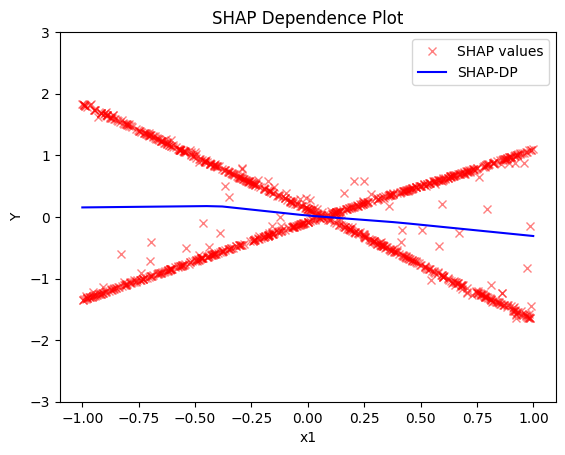
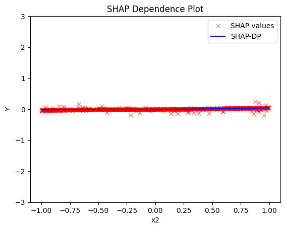
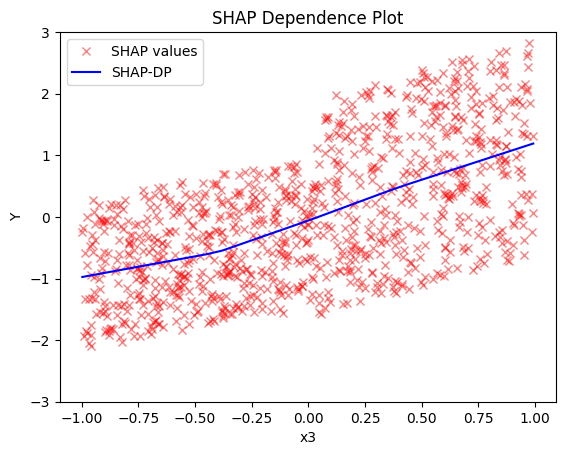
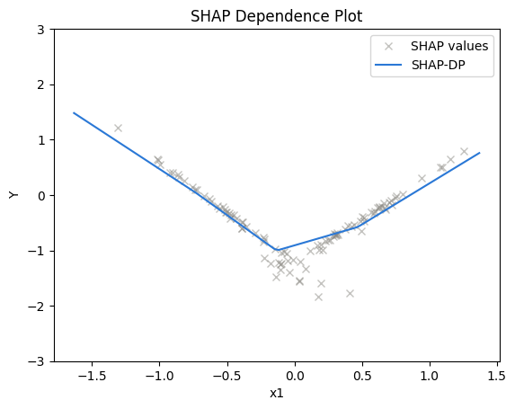
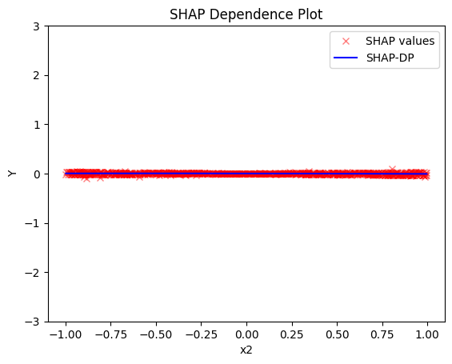
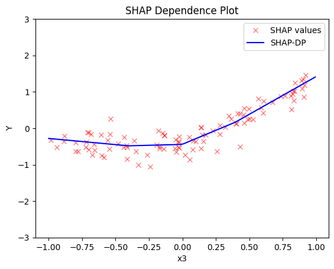

# Regional Effects (unknown black-box function)

- Author: [givasile](https://givasile.github.io/)
- Runtime: ~1.5 min
- Description: The realistic follow-up to tutorial 03: a neural network is
  fitted on the data and explained with regional PDP, RHALE and SHAP-DP,
  under uncorrelated and correlated features.

This tutorial use the same dataset with the previous [tutorial](./03_regional_effects_synthetic_f/), but instead of explaining the known (synthetic) predictive function, we fit a neural network on the data and explain the neural network. This is a more realistic scenario, since in real-world applications we do not know the underlying function and we only have access to the data. We advise the reader to first read the previous tutorial.


```python
import numpy as np
import effector
import keras
import tensorflow as tf

np.random.seed(12345)
tf.random.set_seed(12345)
```

    WARNING: All log messages before absl::InitializeLog() is called are written to STDERR
    I0000 00:00:1783080339.906805   42696 cpu_feature_guard.cc:227] This TensorFlow binary is optimized to use available CPU instructions in performance-critical operations.
    To enable the following instructions: AVX2 FMA, in other operations, rebuild TensorFlow with the appropriate compiler flags.


<!-- ## Simulation example

### Data Generating Distribution

We will generate $N=1000$ examples with $D=3$ features, which are in the uncorrelated setting all uniformly distributed as follows:

<center>

| Feature | Description                                | Distribution                 |
|---------|--------------------------------------------|------------------------------|
| $x_1$   | Uniformly distributed between $-1$ and $1$ | $x_1 \sim \mathcal{U}(-1,1)$ |
| $x_2$   | Uniformly distributed between $-1$ and $1$ | $x_2 \sim \mathcal{U}(-1,1)$ |
| $x_3$   | Uniformly distributed between $-1$ and $1$ | $x_3 \sim \mathcal{U}(-1,1)$ |

</center>

For the correlated setting we keep the distributional assumptions for $x_2$ and $x_3$ but define $x_1$ such that it is highly correlated with $x_3$ by: $x_1 = x_3 + \delta$ with $\delta \sim \mathcal{N}(0,0.0625)$. -->

## Simulation example

### Data Generating Distribution

We will generate $N=1000$ examples with $D=3$ features, which are in the uncorrelated setting all uniformly distributed as follows:

| Feature | Description                                | Distribution                 |
|---------|--------------------------------------------|------------------------------|
| $x_1$   | Uniformly distributed between $-1$ and $1$ | $x_1 \sim \mathcal{U}(-1,1)$ |
| $x_2$   | Uniformly distributed between $-1$ and $1$ | $x_2 \sim \mathcal{U}(-1,1)$ |
| $x_3$   | Uniformly distributed between $-1$ and $1$ | $x_3 \sim \mathcal{U}(-1,1)$ |

For the correlated setting, we keep the distributional assumptions for $x_2$ and $x_3$, but define $x_1$ such that it is highly correlated with $x_3$ by:  
$x_1 = x_3 + \delta$ with $\delta \sim \mathcal{N}(0,0.0625)$.


```python
def generate_dataset_uncorrelated(N):
    x1 = np.random.uniform(-1, 1, size=N)
    x2 = np.random.uniform(-1, 1, size=N)
    x3 = np.random.uniform(-1, 1, size=N)
    return np.stack((x1, x2, x3), axis=-1)

def generate_dataset_correlated(N):
    x3 = np.random.uniform(-1, 1, size=N)
    x2 = np.random.uniform(-1, 1, size=N)
    x1 = x3 + np.random.normal(loc = np.zeros_like(x3), scale = 0.25)
    return np.stack((x1, x2, x3), axis=-1)

# generate the dataset for the uncorrelated and correlated setting
N = 1000
X_uncor_train = generate_dataset_uncorrelated(N)
X_uncor_test = generate_dataset_uncorrelated(10000)
X_cor_train = generate_dataset_correlated(N)
X_cor_test = generate_dataset_correlated(10000)
```

### Black-box function

We will use the following linear model with a subgroup-specific interaction term:
 $$ y = 3x_1I_{x_3>0} - 3x_1I_{x_3\leq0} + x_3$$ 
 
On a global level, there is a high heterogeneity for the features $x_1$ and $x_3$ due to their interaction with each other. However, this heterogeneity vanishes to 0 if the feature space is separated into subregions:

<center>

| Feature | Region      | Average Effect | Heterogeneity |
|---------|-------------|----------------|---------------|
| $x_1$   | $x_3>0$     | $3x_1$         | 0             |
| $x_1$   | $x_3\leq 0$ | $-3x_1$        | 0             |
| $x_2$   | all         | 0              | 0             |
| $x_3$   | $x_3>0$     | $x_3$          | 0             |
| $x_3$   | $x_3\leq 0$ | $x_3$          | 0             |

</center>


```python
def generate_target(X):
    f = np.where(X[:,2] > 0, 3*X[:,0] + X[:,2], -3*X[:,0] + X[:,2])
    epsilon = np.random.normal(loc = np.zeros_like(X[:,0]), scale = 0.1)
    Y = f + epsilon
    return(Y)

# generate target for uncorrelated and correlated setting
Y_uncor_train = generate_target(X_uncor_train)
Y_uncor_test = generate_target(X_uncor_test)
Y_cor_train = generate_target(X_cor_train)
Y_cor_test = generate_target(X_cor_test)      
```

### Fit a Neural Network

We create a two-layer feedforward Neural Network, a weight decay of 0.01 for 100 epochs. We train two instances of this NN, one on the uncorrelated and one on the correlated setting. In both cases, the NN achieves a Mean Squared Error of about $0.17$ units.


```python
# Train - Evaluate - Explain a neural network
model_uncor = keras.Sequential([
    keras.layers.Dense(10, activation="relu", input_shape=(3,)),
    keras.layers.Dense(10, activation="relu", input_shape=(3,)),
    keras.layers.Dense(1)
])

optimizer = keras.optimizers.Adam(learning_rate=0.01)
model_uncor.compile(optimizer=optimizer, loss="mse")
model_uncor.fit(X_uncor_train, Y_uncor_train, epochs=100)
model_uncor.evaluate(X_uncor_test, Y_uncor_test)
```

    Epoch 1/100


    /home/givasile/github/packages/effector/.venv/lib/python3.10/site-packages/keras/src/layers/core/dense.py:95: UserWarning: Do not pass an `input_shape`/`input_dim` argument to a layer. When using Sequential models, prefer using an `Input(shape)` object as the first layer in the model instead.
      super().__init__(activity_regularizer=activity_regularizer, **kwargs)


    
 1/32 ━━━━━━━━━━━━━━━━━━━━ 19s 636ms/step - loss: 3.9259

    
26/32 ━━━━━━━━━━━━━━━━━━━━ 0s 2ms/step - loss: 3.4437   

    
32/32 ━━━━━━━━━━━━━━━━━━━━ 1s 3ms/step - loss: 2.9634


    Epoch 2/100


    
 1/32 ━━━━━━━━━━━━━━━━━━━━ 0s 19ms/step - loss: 2.1485

    
30/32 ━━━━━━━━━━━━━━━━━━━━ 0s 2ms/step - loss: 1.6456 

    
32/32 ━━━━━━━━━━━━━━━━━━━━ 0s 2ms/step - loss: 1.2905


    Epoch 3/100


    
 1/32 ━━━━━━━━━━━━━━━━━━━━ 0s 21ms/step - loss: 0.6965

    
23/32 ━━━━━━━━━━━━━━━━━━━━ 0s 2ms/step - loss: 0.5629 

    
32/32 ━━━━━━━━━━━━━━━━━━━━ 0s 3ms/step - loss: 0.5312


    Epoch 4/100


    
 1/32 ━━━━━━━━━━━━━━━━━━━━ 0s 19ms/step - loss: 0.5435

    
32/32 ━━━━━━━━━━━━━━━━━━━━ 0s 2ms/step - loss: 0.3841 


    Epoch 5/100


    
 1/32 ━━━━━━━━━━━━━━━━━━━━ 0s 19ms/step - loss: 0.4020

    
32/32 ━━━━━━━━━━━━━━━━━━━━ 0s 2ms/step - loss: 0.3016 


    Epoch 6/100


    
 1/32 ━━━━━━━━━━━━━━━━━━━━ 0s 19ms/step - loss: 0.3073

    
32/32 ━━━━━━━━━━━━━━━━━━━━ 0s 2ms/step - loss: 0.2460 


    Epoch 7/100


    
 1/32 ━━━━━━━━━━━━━━━━━━━━ 0s 17ms/step - loss: 0.2544

    
32/32 ━━━━━━━━━━━━━━━━━━━━ 0s 2ms/step - loss: 0.2144 


    Epoch 8/100


    
 1/32 ━━━━━━━━━━━━━━━━━━━━ 0s 19ms/step - loss: 0.2260

    
32/32 ━━━━━━━━━━━━━━━━━━━━ 0s 2ms/step - loss: 0.1929 


    Epoch 9/100


    
 1/32 ━━━━━━━━━━━━━━━━━━━━ 0s 20ms/step - loss: 0.1973

    
32/32 ━━━━━━━━━━━━━━━━━━━━ 0s 2ms/step - loss: 0.1759 


    Epoch 10/100


    
 1/32 ━━━━━━━━━━━━━━━━━━━━ 0s 18ms/step - loss: 0.1768

    
32/32 ━━━━━━━━━━━━━━━━━━━━ 0s 2ms/step - loss: 0.1637 


    Epoch 11/100


    
 1/32 ━━━━━━━━━━━━━━━━━━━━ 0s 21ms/step - loss: 0.1610

    
32/32 ━━━━━━━━━━━━━━━━━━━━ 0s 2ms/step - loss: 0.1540 


    Epoch 12/100


    
 1/32 ━━━━━━━━━━━━━━━━━━━━ 0s 19ms/step - loss: 0.1439

    
32/32 ━━━━━━━━━━━━━━━━━━━━ 0s 2ms/step - loss: 0.1446 


    Epoch 13/100


    
 1/32 ━━━━━━━━━━━━━━━━━━━━ 0s 18ms/step - loss: 0.1308

    
32/32 ━━━━━━━━━━━━━━━━━━━━ 0s 2ms/step - loss: 0.1371 


    Epoch 14/100


    
 1/32 ━━━━━━━━━━━━━━━━━━━━ 0s 23ms/step - loss: 0.1156

    
32/32 ━━━━━━━━━━━━━━━━━━━━ 0s 2ms/step - loss: 0.1299 


    Epoch 15/100


    
 1/32 ━━━━━━━━━━━━━━━━━━━━ 0s 20ms/step - loss: 0.1048

    
32/32 ━━━━━━━━━━━━━━━━━━━━ 0s 2ms/step - loss: 0.1240 


    Epoch 16/100


    
 1/32 ━━━━━━━━━━━━━━━━━━━━ 0s 18ms/step - loss: 0.0954

    
32/32 ━━━━━━━━━━━━━━━━━━━━ 0s 2ms/step - loss: 0.1178 


    Epoch 17/100


    
 1/32 ━━━━━━━━━━━━━━━━━━━━ 0s 19ms/step - loss: 0.0840

    
32/32 ━━━━━━━━━━━━━━━━━━━━ 0s 2ms/step - loss: 0.1116 


    Epoch 18/100


    
 1/32 ━━━━━━━━━━━━━━━━━━━━ 0s 18ms/step - loss: 0.0709

    
32/32 ━━━━━━━━━━━━━━━━━━━━ 0s 2ms/step - loss: 0.1047 


    Epoch 19/100


    
 1/32 ━━━━━━━━━━━━━━━━━━━━ 0s 19ms/step - loss: 0.0625

    
32/32 ━━━━━━━━━━━━━━━━━━━━ 0s 2ms/step - loss: 0.0999 


    Epoch 20/100


    
 1/32 ━━━━━━━━━━━━━━━━━━━━ 0s 18ms/step - loss: 0.0551

    
32/32 ━━━━━━━━━━━━━━━━━━━━ 0s 2ms/step - loss: 0.0958 


    Epoch 21/100


    
 1/32 ━━━━━━━━━━━━━━━━━━━━ 0s 18ms/step - loss: 0.0510

    
32/32 ━━━━━━━━━━━━━━━━━━━━ 0s 2ms/step - loss: 0.0920 


    Epoch 22/100


    
 1/32 ━━━━━━━━━━━━━━━━━━━━ 0s 18ms/step - loss: 0.0449

    
32/32 ━━━━━━━━━━━━━━━━━━━━ 0s 2ms/step - loss: 0.0891 


    Epoch 23/100


    
 1/32 ━━━━━━━━━━━━━━━━━━━━ 0s 19ms/step - loss: 0.0411

    
32/32 ━━━━━━━━━━━━━━━━━━━━ 0s 2ms/step - loss: 0.0862 


    Epoch 24/100


    
 1/32 ━━━━━━━━━━━━━━━━━━━━ 0s 18ms/step - loss: 0.0420

    
32/32 ━━━━━━━━━━━━━━━━━━━━ 0s 2ms/step - loss: 0.0837 


    Epoch 25/100


    
 1/32 ━━━━━━━━━━━━━━━━━━━━ 0s 17ms/step - loss: 0.0392

    
32/32 ━━━━━━━━━━━━━━━━━━━━ 0s 2ms/step - loss: 0.0813 


    Epoch 26/100


    
 1/32 ━━━━━━━━━━━━━━━━━━━━ 0s 18ms/step - loss: 0.0390

    
32/32 ━━━━━━━━━━━━━━━━━━━━ 0s 2ms/step - loss: 0.0795 


    Epoch 27/100


    
 1/32 ━━━━━━━━━━━━━━━━━━━━ 0s 18ms/step - loss: 0.0358

    
32/32 ━━━━━━━━━━━━━━━━━━━━ 0s 2ms/step - loss: 0.0773 


    Epoch 28/100


    
 1/32 ━━━━━━━━━━━━━━━━━━━━ 0s 19ms/step - loss: 0.0361

    
32/32 ━━━━━━━━━━━━━━━━━━━━ 0s 2ms/step - loss: 0.0758 


    Epoch 29/100


    
 1/32 ━━━━━━━━━━━━━━━━━━━━ 0s 17ms/step - loss: 0.0340

    
32/32 ━━━━━━━━━━━━━━━━━━━━ 0s 2ms/step - loss: 0.0741 


    Epoch 30/100


    
 1/32 ━━━━━━━━━━━━━━━━━━━━ 0s 19ms/step - loss: 0.0327

    
32/32 ━━━━━━━━━━━━━━━━━━━━ 0s 2ms/step - loss: 0.0725 


    Epoch 31/100


    
 1/32 ━━━━━━━━━━━━━━━━━━━━ 0s 18ms/step - loss: 0.0324

    
32/32 ━━━━━━━━━━━━━━━━━━━━ 0s 2ms/step - loss: 0.0720 


    Epoch 32/100


    
 1/32 ━━━━━━━━━━━━━━━━━━━━ 0s 20ms/step - loss: 0.0345

    
32/32 ━━━━━━━━━━━━━━━━━━━━ 0s 2ms/step - loss: 0.0704 


    Epoch 33/100


    
 1/32 ━━━━━━━━━━━━━━━━━━━━ 0s 17ms/step - loss: 0.0338

    
32/32 ━━━━━━━━━━━━━━━━━━━━ 0s 2ms/step - loss: 0.0694 


    Epoch 34/100


    
 1/32 ━━━━━━━━━━━━━━━━━━━━ 0s 18ms/step - loss: 0.0344

    
32/32 ━━━━━━━━━━━━━━━━━━━━ 0s 2ms/step - loss: 0.0689 


    Epoch 35/100


    
 1/32 ━━━━━━━━━━━━━━━━━━━━ 0s 19ms/step - loss: 0.0334

    
32/32 ━━━━━━━━━━━━━━━━━━━━ 0s 2ms/step - loss: 0.0677 


    Epoch 36/100


    
 1/32 ━━━━━━━━━━━━━━━━━━━━ 0s 18ms/step - loss: 0.0326

    
32/32 ━━━━━━━━━━━━━━━━━━━━ 0s 2ms/step - loss: 0.0671 


    Epoch 37/100


    
 1/32 ━━━━━━━━━━━━━━━━━━━━ 0s 20ms/step - loss: 0.0340

    
32/32 ━━━━━━━━━━━━━━━━━━━━ 0s 2ms/step - loss: 0.0667 


    Epoch 38/100


    
 1/32 ━━━━━━━━━━━━━━━━━━━━ 0s 17ms/step - loss: 0.0321

    
32/32 ━━━━━━━━━━━━━━━━━━━━ 0s 2ms/step - loss: 0.0651 


    Epoch 39/100


    
 1/32 ━━━━━━━━━━━━━━━━━━━━ 0s 17ms/step - loss: 0.0312

    
32/32 ━━━━━━━━━━━━━━━━━━━━ 0s 2ms/step - loss: 0.0651 


    Epoch 40/100


    
 1/32 ━━━━━━━━━━━━━━━━━━━━ 0s 18ms/step - loss: 0.0320

    
32/32 ━━━━━━━━━━━━━━━━━━━━ 0s 2ms/step - loss: 0.0646 


    Epoch 41/100


    
 1/32 ━━━━━━━━━━━━━━━━━━━━ 0s 18ms/step - loss: 0.0308

    
32/32 ━━━━━━━━━━━━━━━━━━━━ 0s 2ms/step - loss: 0.0638 


    Epoch 42/100


    
 1/32 ━━━━━━━━━━━━━━━━━━━━ 0s 19ms/step - loss: 0.0307

    
32/32 ━━━━━━━━━━━━━━━━━━━━ 0s 2ms/step - loss: 0.0639 


    Epoch 43/100


    
 1/32 ━━━━━━━━━━━━━━━━━━━━ 0s 18ms/step - loss: 0.0299

    
32/32 ━━━━━━━━━━━━━━━━━━━━ 0s 2ms/step - loss: 0.0630 


    Epoch 44/100


    
 1/32 ━━━━━━━━━━━━━━━━━━━━ 0s 19ms/step - loss: 0.0289

    
31/32 ━━━━━━━━━━━━━━━━━━━━ 0s 2ms/step - loss: 0.0552 

    
32/32 ━━━━━━━━━━━━━━━━━━━━ 0s 2ms/step - loss: 0.0627


    Epoch 45/100


    
 1/32 ━━━━━━━━━━━━━━━━━━━━ 0s 18ms/step - loss: 0.0313

    
32/32 ━━━━━━━━━━━━━━━━━━━━ 0s 2ms/step - loss: 0.0617 


    Epoch 46/100


    
 1/32 ━━━━━━━━━━━━━━━━━━━━ 0s 18ms/step - loss: 0.0294

    
32/32 ━━━━━━━━━━━━━━━━━━━━ 0s 2ms/step - loss: 0.0611 


    Epoch 47/100


    
 1/32 ━━━━━━━━━━━━━━━━━━━━ 0s 18ms/step - loss: 0.0300

    
32/32 ━━━━━━━━━━━━━━━━━━━━ 0s 2ms/step - loss: 0.0612 


    Epoch 48/100


    
 1/32 ━━━━━━━━━━━━━━━━━━━━ 0s 22ms/step - loss: 0.0301

    
28/32 ━━━━━━━━━━━━━━━━━━━━ 0s 2ms/step - loss: 0.0531 

    
32/32 ━━━━━━━━━━━━━━━━━━━━ 0s 2ms/step - loss: 0.0602


    Epoch 49/100


    
 1/32 ━━━━━━━━━━━━━━━━━━━━ 0s 25ms/step - loss: 0.0287

    
32/32 ━━━━━━━━━━━━━━━━━━━━ 0s 2ms/step - loss: 0.0603 


    Epoch 50/100


    
 1/32 ━━━━━━━━━━━━━━━━━━━━ 0s 19ms/step - loss: 0.0299

    
32/32 ━━━━━━━━━━━━━━━━━━━━ 0s 2ms/step - loss: 0.0614 


    Epoch 51/100


    
 1/32 ━━━━━━━━━━━━━━━━━━━━ 0s 18ms/step - loss: 0.0283

    
32/32 ━━━━━━━━━━━━━━━━━━━━ 0s 2ms/step - loss: 0.0615 


    Epoch 52/100


    
 1/32 ━━━━━━━━━━━━━━━━━━━━ 0s 19ms/step - loss: 0.0279

    
32/32 ━━━━━━━━━━━━━━━━━━━━ 0s 2ms/step - loss: 0.0592 


    Epoch 53/100


    
 1/32 ━━━━━━━━━━━━━━━━━━━━ 0s 19ms/step - loss: 0.0275

    
32/32 ━━━━━━━━━━━━━━━━━━━━ 0s 2ms/step - loss: 0.0599 


    Epoch 54/100


    
 1/32 ━━━━━━━━━━━━━━━━━━━━ 0s 19ms/step - loss: 0.0272

    
32/32 ━━━━━━━━━━━━━━━━━━━━ 0s 2ms/step - loss: 0.0583 


    Epoch 55/100


    
 1/32 ━━━━━━━━━━━━━━━━━━━━ 0s 21ms/step - loss: 0.0271

    
32/32 ━━━━━━━━━━━━━━━━━━━━ 0s 2ms/step - loss: 0.0605 


    Epoch 56/100


    
 1/32 ━━━━━━━━━━━━━━━━━━━━ 0s 17ms/step - loss: 0.0267

    
32/32 ━━━━━━━━━━━━━━━━━━━━ 0s 2ms/step - loss: 0.0586 


    Epoch 57/100


    
 1/32 ━━━━━━━━━━━━━━━━━━━━ 0s 18ms/step - loss: 0.0274

    
32/32 ━━━━━━━━━━━━━━━━━━━━ 0s 2ms/step - loss: 0.0579 


    Epoch 58/100


    
 1/32 ━━━━━━━━━━━━━━━━━━━━ 0s 17ms/step - loss: 0.0265

    
32/32 ━━━━━━━━━━━━━━━━━━━━ 0s 2ms/step - loss: 0.0589 


    Epoch 59/100


    
 1/32 ━━━━━━━━━━━━━━━━━━━━ 0s 16ms/step - loss: 0.0268

    
32/32 ━━━━━━━━━━━━━━━━━━━━ 0s 2ms/step - loss: 0.0583 


    Epoch 60/100


    
 1/32 ━━━━━━━━━━━━━━━━━━━━ 0s 22ms/step - loss: 0.0268

    
32/32 ━━━━━━━━━━━━━━━━━━━━ 0s 2ms/step - loss: 0.0578 


    Epoch 61/100


    
 1/32 ━━━━━━━━━━━━━━━━━━━━ 0s 18ms/step - loss: 0.0275

    
32/32 ━━━━━━━━━━━━━━━━━━━━ 0s 2ms/step - loss: 0.0587 


    Epoch 62/100


    
 1/32 ━━━━━━━━━━━━━━━━━━━━ 0s 20ms/step - loss: 0.0253

    
32/32 ━━━━━━━━━━━━━━━━━━━━ 0s 2ms/step - loss: 0.0571 


    Epoch 63/100


    
 1/32 ━━━━━━━━━━━━━━━━━━━━ 0s 17ms/step - loss: 0.0277

    
32/32 ━━━━━━━━━━━━━━━━━━━━ 0s 2ms/step - loss: 0.0597 


    Epoch 64/100


    
 1/32 ━━━━━━━━━━━━━━━━━━━━ 0s 18ms/step - loss: 0.0265

    
32/32 ━━━━━━━━━━━━━━━━━━━━ 0s 2ms/step - loss: 0.0572 


    Epoch 65/100


    
 1/32 ━━━━━━━━━━━━━━━━━━━━ 0s 17ms/step - loss: 0.0271

    
32/32 ━━━━━━━━━━━━━━━━━━━━ 0s 2ms/step - loss: 0.0579 


    Epoch 66/100


    
 1/32 ━━━━━━━━━━━━━━━━━━━━ 0s 18ms/step - loss: 0.0251

    
32/32 ━━━━━━━━━━━━━━━━━━━━ 0s 2ms/step - loss: 0.0567 


    Epoch 67/100


    
 1/32 ━━━━━━━━━━━━━━━━━━━━ 0s 17ms/step - loss: 0.0283

    
32/32 ━━━━━━━━━━━━━━━━━━━━ 0s 2ms/step - loss: 0.0578 


    Epoch 68/100


    
 1/32 ━━━━━━━━━━━━━━━━━━━━ 0s 21ms/step - loss: 0.0254

    
32/32 ━━━━━━━━━━━━━━━━━━━━ 0s 2ms/step - loss: 0.0566 


    Epoch 69/100


    
 1/32 ━━━━━━━━━━━━━━━━━━━━ 0s 18ms/step - loss: 0.0255

    
32/32 ━━━━━━━━━━━━━━━━━━━━ 0s 2ms/step - loss: 0.0575 


    Epoch 70/100


    
 1/32 ━━━━━━━━━━━━━━━━━━━━ 0s 18ms/step - loss: 0.0266

    
32/32 ━━━━━━━━━━━━━━━━━━━━ 0s 2ms/step - loss: 0.0559 


    Epoch 71/100


    
 1/32 ━━━━━━━━━━━━━━━━━━━━ 0s 17ms/step - loss: 0.0260

    
32/32 ━━━━━━━━━━━━━━━━━━━━ 0s 2ms/step - loss: 0.0573 


    Epoch 72/100


    
 1/32 ━━━━━━━━━━━━━━━━━━━━ 0s 21ms/step - loss: 0.0288

    
32/32 ━━━━━━━━━━━━━━━━━━━━ 0s 2ms/step - loss: 0.0565 


    Epoch 73/100


    
 1/32 ━━━━━━━━━━━━━━━━━━━━ 0s 20ms/step - loss: 0.0256

    
32/32 ━━━━━━━━━━━━━━━━━━━━ 0s 2ms/step - loss: 0.0564 


    Epoch 74/100


    
 1/32 ━━━━━━━━━━━━━━━━━━━━ 0s 18ms/step - loss: 0.0273

    
28/32 ━━━━━━━━━━━━━━━━━━━━ 0s 2ms/step - loss: 0.0511 

    
32/32 ━━━━━━━━━━━━━━━━━━━━ 0s 3ms/step - loss: 0.0573


    Epoch 75/100


    
 1/32 ━━━━━━━━━━━━━━━━━━━━ 0s 20ms/step - loss: 0.0278

    
32/32 ━━━━━━━━━━━━━━━━━━━━ 0s 2ms/step - loss: 0.0561 


    Epoch 76/100


    
 1/32 ━━━━━━━━━━━━━━━━━━━━ 0s 18ms/step - loss: 0.0259

    
32/32 ━━━━━━━━━━━━━━━━━━━━ 0s 2ms/step - loss: 0.0556 


    Epoch 77/100


    
 1/32 ━━━━━━━━━━━━━━━━━━━━ 0s 16ms/step - loss: 0.0286

    
32/32 ━━━━━━━━━━━━━━━━━━━━ 0s 2ms/step - loss: 0.0569 


    Epoch 78/100


    
 1/32 ━━━━━━━━━━━━━━━━━━━━ 0s 18ms/step - loss: 0.0267

    
32/32 ━━━━━━━━━━━━━━━━━━━━ 0s 2ms/step - loss: 0.0549 


    Epoch 79/100


    
 1/32 ━━━━━━━━━━━━━━━━━━━━ 0s 18ms/step - loss: 0.0276

    
32/32 ━━━━━━━━━━━━━━━━━━━━ 0s 2ms/step - loss: 0.0565 


    Epoch 80/100


    
 1/32 ━━━━━━━━━━━━━━━━━━━━ 0s 19ms/step - loss: 0.0274

    
32/32 ━━━━━━━━━━━━━━━━━━━━ 0s 2ms/step - loss: 0.0551 


    Epoch 81/100


    
 1/32 ━━━━━━━━━━━━━━━━━━━━ 0s 19ms/step - loss: 0.0275

    
32/32 ━━━━━━━━━━━━━━━━━━━━ 0s 2ms/step - loss: 0.0559 


    Epoch 82/100


    
 1/32 ━━━━━━━━━━━━━━━━━━━━ 0s 17ms/step - loss: 0.0280

    
32/32 ━━━━━━━━━━━━━━━━━━━━ 0s 2ms/step - loss: 0.0553 


    Epoch 83/100


    
 1/32 ━━━━━━━━━━━━━━━━━━━━ 0s 18ms/step - loss: 0.0272

    
32/32 ━━━━━━━━━━━━━━━━━━━━ 0s 2ms/step - loss: 0.0553 


    Epoch 84/100


    
 1/32 ━━━━━━━━━━━━━━━━━━━━ 0s 17ms/step - loss: 0.0274

    
32/32 ━━━━━━━━━━━━━━━━━━━━ 0s 2ms/step - loss: 0.0544 


    Epoch 85/100


    
 1/32 ━━━━━━━━━━━━━━━━━━━━ 0s 23ms/step - loss: 0.0276

    
32/32 ━━━━━━━━━━━━━━━━━━━━ 0s 2ms/step - loss: 0.0551 


    Epoch 86/100


    
 1/32 ━━━━━━━━━━━━━━━━━━━━ 0s 20ms/step - loss: 0.0276

    
32/32 ━━━━━━━━━━━━━━━━━━━━ 0s 2ms/step - loss: 0.0547 


    Epoch 87/100


    
 1/32 ━━━━━━━━━━━━━━━━━━━━ 0s 23ms/step - loss: 0.0285

    
32/32 ━━━━━━━━━━━━━━━━━━━━ 0s 2ms/step - loss: 0.0553 


    Epoch 88/100


    
 1/32 ━━━━━━━━━━━━━━━━━━━━ 0s 19ms/step - loss: 0.0281

    
32/32 ━━━━━━━━━━━━━━━━━━━━ 0s 2ms/step - loss: 0.0547 


    Epoch 89/100


    
 1/32 ━━━━━━━━━━━━━━━━━━━━ 0s 21ms/step - loss: 0.0279

    
32/32 ━━━━━━━━━━━━━━━━━━━━ 0s 2ms/step - loss: 0.0548 


    Epoch 90/100


    
 1/32 ━━━━━━━━━━━━━━━━━━━━ 0s 20ms/step - loss: 0.0282

    
27/32 ━━━━━━━━━━━━━━━━━━━━ 0s 2ms/step - loss: 0.0486 

    
32/32 ━━━━━━━━━━━━━━━━━━━━ 0s 2ms/step - loss: 0.0541


    Epoch 91/100


    
 1/32 ━━━━━━━━━━━━━━━━━━━━ 0s 20ms/step - loss: 0.0285

    
32/32 ━━━━━━━━━━━━━━━━━━━━ 0s 2ms/step - loss: 0.0541 


    Epoch 92/100


    
 1/32 ━━━━━━━━━━━━━━━━━━━━ 0s 26ms/step - loss: 0.0279

    
25/32 ━━━━━━━━━━━━━━━━━━━━ 0s 2ms/step - loss: 0.0471 

    
32/32 ━━━━━━━━━━━━━━━━━━━━ 0s 2ms/step - loss: 0.0539


    Epoch 93/100


    
 1/32 ━━━━━━━━━━━━━━━━━━━━ 0s 21ms/step - loss: 0.0288

    
32/32 ━━━━━━━━━━━━━━━━━━━━ 0s 2ms/step - loss: 0.0543 


    Epoch 94/100


    
 1/32 ━━━━━━━━━━━━━━━━━━━━ 0s 18ms/step - loss: 0.0291

    
32/32 ━━━━━━━━━━━━━━━━━━━━ 0s 2ms/step - loss: 0.0529 


    Epoch 95/100


    
 1/32 ━━━━━━━━━━━━━━━━━━━━ 0s 18ms/step - loss: 0.0272

    
32/32 ━━━━━━━━━━━━━━━━━━━━ 0s 2ms/step - loss: 0.0534 


    Epoch 96/100


    
 1/32 ━━━━━━━━━━━━━━━━━━━━ 0s 18ms/step - loss: 0.0300

    
32/32 ━━━━━━━━━━━━━━━━━━━━ 0s 2ms/step - loss: 0.0541 


    Epoch 97/100


    
 1/32 ━━━━━━━━━━━━━━━━━━━━ 0s 20ms/step - loss: 0.0272

    
32/32 ━━━━━━━━━━━━━━━━━━━━ 0s 2ms/step - loss: 0.0524 


    Epoch 98/100


    
 1/32 ━━━━━━━━━━━━━━━━━━━━ 0s 20ms/step - loss: 0.0295

    
32/32 ━━━━━━━━━━━━━━━━━━━━ 0s 2ms/step - loss: 0.0522 


    Epoch 99/100


    
 1/32 ━━━━━━━━━━━━━━━━━━━━ 0s 21ms/step - loss: 0.0278

    
32/32 ━━━━━━━━━━━━━━━━━━━━ 0s 2ms/step - loss: 0.0514 


    Epoch 100/100


    
 1/32 ━━━━━━━━━━━━━━━━━━━━ 0s 17ms/step - loss: 0.0280

    
32/32 ━━━━━━━━━━━━━━━━━━━━ 0s 2ms/step - loss: 0.0506 


    
  1/313 ━━━━━━━━━━━━━━━━━━━━ 22s 73ms/step - loss: 0.0252

    
 49/313 ━━━━━━━━━━━━━━━━━━━━ 0s 1ms/step - loss: 0.0570  

    
 98/313 ━━━━━━━━━━━━━━━━━━━━ 0s 1ms/step - loss: 0.0663

    
148/313 ━━━━━━━━━━━━━━━━━━━━ 0s 1ms/step - loss: 0.0695

    
194/313 ━━━━━━━━━━━━━━━━━━━━ 0s 1ms/step - loss: 0.0705

    
242/313 ━━━━━━━━━━━━━━━━━━━━ 0s 1ms/step - loss: 0.0707

    
293/313 ━━━━━━━━━━━━━━━━━━━━ 0s 1ms/step - loss: 0.0702

    
313/313 ━━━━━━━━━━━━━━━━━━━━ 0s 1ms/step - loss: 0.0662


    0.06615323573350906


```python
model_cor = keras.Sequential([
    keras.layers.Dense(10, activation="relu", input_shape=(3,)),
    keras.layers.Dense(10, activation="relu", input_shape=(3,)),
    keras.layers.Dense(1)
])

optimizer = keras.optimizers.Adam(learning_rate=0.01)
model_cor.compile(optimizer=optimizer, loss="mse")
model_cor.fit(X_cor_train, Y_cor_train, epochs=100)
model_cor.evaluate(X_cor_test, Y_cor_test)
```

    Epoch 1/100


    
 1/32 ━━━━━━━━━━━━━━━━━━━━ 18s 602ms/step - loss: 2.8068

    
32/32 ━━━━━━━━━━━━━━━━━━━━ 1s 2ms/step - loss: 1.0082   


    Epoch 2/100


    
 1/32 ━━━━━━━━━━━━━━━━━━━━ 0s 18ms/step - loss: 0.3705

    
32/32 ━━━━━━━━━━━━━━━━━━━━ 0s 2ms/step - loss: 0.1935 


    Epoch 3/100


    
 1/32 ━━━━━━━━━━━━━━━━━━━━ 0s 20ms/step - loss: 0.1712

    
32/32 ━━━━━━━━━━━━━━━━━━━━ 0s 2ms/step - loss: 0.1130 


    Epoch 4/100


    
 1/32 ━━━━━━━━━━━━━━━━━━━━ 0s 18ms/step - loss: 0.1639

    
32/32 ━━━━━━━━━━━━━━━━━━━━ 0s 2ms/step - loss: 0.0898 


    Epoch 5/100


    
 1/32 ━━━━━━━━━━━━━━━━━━━━ 0s 18ms/step - loss: 0.1711

    
32/32 ━━━━━━━━━━━━━━━━━━━━ 0s 2ms/step - loss: 0.0781 


    Epoch 6/100


    
 1/32 ━━━━━━━━━━━━━━━━━━━━ 0s 20ms/step - loss: 0.1694

    
32/32 ━━━━━━━━━━━━━━━━━━━━ 0s 2ms/step - loss: 0.0716 


    Epoch 7/100


    
 1/32 ━━━━━━━━━━━━━━━━━━━━ 0s 18ms/step - loss: 0.1671

    
32/32 ━━━━━━━━━━━━━━━━━━━━ 0s 2ms/step - loss: 0.0683 


    Epoch 8/100


    
 1/32 ━━━━━━━━━━━━━━━━━━━━ 0s 19ms/step - loss: 0.1624

    
32/32 ━━━━━━━━━━━━━━━━━━━━ 0s 2ms/step - loss: 0.0657 


    Epoch 9/100


    
 1/32 ━━━━━━━━━━━━━━━━━━━━ 0s 18ms/step - loss: 0.1586

    
32/32 ━━━━━━━━━━━━━━━━━━━━ 0s 2ms/step - loss: 0.0636 


    Epoch 10/100


    
 1/32 ━━━━━━━━━━━━━━━━━━━━ 0s 21ms/step - loss: 0.1544

    
32/32 ━━━━━━━━━━━━━━━━━━━━ 0s 2ms/step - loss: 0.0616 


    Epoch 11/100


    
 1/32 ━━━━━━━━━━━━━━━━━━━━ 0s 19ms/step - loss: 0.1491

    
32/32 ━━━━━━━━━━━━━━━━━━━━ 0s 2ms/step - loss: 0.0597 


    Epoch 12/100


    
 1/32 ━━━━━━━━━━━━━━━━━━━━ 0s 19ms/step - loss: 0.1439

    
32/32 ━━━━━━━━━━━━━━━━━━━━ 0s 2ms/step - loss: 0.0578 


    Epoch 13/100


    
 1/32 ━━━━━━━━━━━━━━━━━━━━ 0s 19ms/step - loss: 0.1388

    
32/32 ━━━━━━━━━━━━━━━━━━━━ 0s 2ms/step - loss: 0.0560 


    Epoch 14/100


    
 1/32 ━━━━━━━━━━━━━━━━━━━━ 0s 19ms/step - loss: 0.1330

    
32/32 ━━━━━━━━━━━━━━━━━━━━ 0s 2ms/step - loss: 0.0540 


    Epoch 15/100


    
 1/32 ━━━━━━━━━━━━━━━━━━━━ 0s 18ms/step - loss: 0.1284

    
32/32 ━━━━━━━━━━━━━━━━━━━━ 0s 2ms/step - loss: 0.0519 


    Epoch 16/100


    
 1/32 ━━━━━━━━━━━━━━━━━━━━ 0s 18ms/step - loss: 0.1233

    
32/32 ━━━━━━━━━━━━━━━━━━━━ 0s 2ms/step - loss: 0.0495 


    Epoch 17/100


    
 1/32 ━━━━━━━━━━━━━━━━━━━━ 0s 21ms/step - loss: 0.1186

    
32/32 ━━━━━━━━━━━━━━━━━━━━ 0s 2ms/step - loss: 0.0471 


    Epoch 18/100


    
 1/32 ━━━━━━━━━━━━━━━━━━━━ 0s 17ms/step - loss: 0.1150

    
32/32 ━━━━━━━━━━━━━━━━━━━━ 0s 2ms/step - loss: 0.0448 


    Epoch 19/100


    
 1/32 ━━━━━━━━━━━━━━━━━━━━ 0s 19ms/step - loss: 0.1114

    
32/32 ━━━━━━━━━━━━━━━━━━━━ 0s 2ms/step - loss: 0.0429 


    Epoch 20/100


    
 1/32 ━━━━━━━━━━━━━━━━━━━━ 0s 18ms/step - loss: 0.1078

    
32/32 ━━━━━━━━━━━━━━━━━━━━ 0s 2ms/step - loss: 0.0414 


    Epoch 21/100


    
 1/32 ━━━━━━━━━━━━━━━━━━━━ 0s 17ms/step - loss: 0.1045

    
32/32 ━━━━━━━━━━━━━━━━━━━━ 0s 2ms/step - loss: 0.0402 


    Epoch 22/100


    
 1/32 ━━━━━━━━━━━━━━━━━━━━ 0s 25ms/step - loss: 0.1007

    
32/32 ━━━━━━━━━━━━━━━━━━━━ 0s 2ms/step - loss: 0.0393 


    Epoch 23/100


    
 1/32 ━━━━━━━━━━━━━━━━━━━━ 0s 19ms/step - loss: 0.0970

    
32/32 ━━━━━━━━━━━━━━━━━━━━ 0s 2ms/step - loss: 0.0385 


    Epoch 24/100


    
 1/32 ━━━━━━━━━━━━━━━━━━━━ 0s 19ms/step - loss: 0.0936

    
32/32 ━━━━━━━━━━━━━━━━━━━━ 0s 2ms/step - loss: 0.0379 


    Epoch 25/100


    
 1/32 ━━━━━━━━━━━━━━━━━━━━ 0s 18ms/step - loss: 0.0904

    
32/32 ━━━━━━━━━━━━━━━━━━━━ 0s 2ms/step - loss: 0.0376 


    Epoch 26/100


    
 1/32 ━━━━━━━━━━━━━━━━━━━━ 0s 18ms/step - loss: 0.0875

    
32/32 ━━━━━━━━━━━━━━━━━━━━ 0s 2ms/step - loss: 0.0371 


    Epoch 27/100


    
 1/32 ━━━━━━━━━━━━━━━━━━━━ 0s 17ms/step - loss: 0.0863

    
32/32 ━━━━━━━━━━━━━━━━━━━━ 0s 2ms/step - loss: 0.0371 


    Epoch 28/100


    
 1/32 ━━━━━━━━━━━━━━━━━━━━ 0s 19ms/step - loss: 0.0810

    
32/32 ━━━━━━━━━━━━━━━━━━━━ 0s 2ms/step - loss: 0.0363 


    Epoch 29/100


    
 1/32 ━━━━━━━━━━━━━━━━━━━━ 0s 19ms/step - loss: 0.0796

    
32/32 ━━━━━━━━━━━━━━━━━━━━ 0s 2ms/step - loss: 0.0361 


    Epoch 30/100


    
 1/32 ━━━━━━━━━━━━━━━━━━━━ 0s 17ms/step - loss: 0.0765

    
32/32 ━━━━━━━━━━━━━━━━━━━━ 0s 2ms/step - loss: 0.0355 


    Epoch 31/100


    
 1/32 ━━━━━━━━━━━━━━━━━━━━ 0s 18ms/step - loss: 0.0736

    
32/32 ━━━━━━━━━━━━━━━━━━━━ 0s 2ms/step - loss: 0.0352 


    Epoch 32/100


    
 1/32 ━━━━━━━━━━━━━━━━━━━━ 0s 18ms/step - loss: 0.0704

    
32/32 ━━━━━━━━━━━━━━━━━━━━ 0s 2ms/step - loss: 0.0347 


    Epoch 33/100


    
 1/32 ━━━━━━━━━━━━━━━━━━━━ 0s 19ms/step - loss: 0.0684

    
32/32 ━━━━━━━━━━━━━━━━━━━━ 0s 2ms/step - loss: 0.0345 


    Epoch 34/100


    
 1/32 ━━━━━━━━━━━━━━━━━━━━ 0s 17ms/step - loss: 0.0657

    
32/32 ━━━━━━━━━━━━━━━━━━━━ 0s 2ms/step - loss: 0.0339 


    Epoch 35/100


    
 1/32 ━━━━━━━━━━━━━━━━━━━━ 2s 85ms/step - loss: 0.0634

    
32/32 ━━━━━━━━━━━━━━━━━━━━ 0s 2ms/step - loss: 0.0336 


    Epoch 36/100


    
 1/32 ━━━━━━━━━━━━━━━━━━━━ 0s 20ms/step - loss: 0.0607

    
32/32 ━━━━━━━━━━━━━━━━━━━━ 0s 2ms/step - loss: 0.0333 


    Epoch 37/100


    
 1/32 ━━━━━━━━━━━━━━━━━━━━ 0s 21ms/step - loss: 0.0577

    
32/32 ━━━━━━━━━━━━━━━━━━━━ 0s 2ms/step - loss: 0.0328 


    Epoch 38/100


    
 1/32 ━━━━━━━━━━━━━━━━━━━━ 0s 18ms/step - loss: 0.0568

    
32/32 ━━━━━━━━━━━━━━━━━━━━ 0s 2ms/step - loss: 0.0325 


    Epoch 39/100


    
 1/32 ━━━━━━━━━━━━━━━━━━━━ 0s 19ms/step - loss: 0.0542

    
32/32 ━━━━━━━━━━━━━━━━━━━━ 0s 2ms/step - loss: 0.0322 


    Epoch 40/100


    
 1/32 ━━━━━━━━━━━━━━━━━━━━ 0s 19ms/step - loss: 0.0518

    
32/32 ━━━━━━━━━━━━━━━━━━━━ 0s 2ms/step - loss: 0.0319 


    Epoch 41/100


    
 1/32 ━━━━━━━━━━━━━━━━━━━━ 0s 19ms/step - loss: 0.0506

    
32/32 ━━━━━━━━━━━━━━━━━━━━ 0s 2ms/step - loss: 0.0314 


    Epoch 42/100


    
 1/32 ━━━━━━━━━━━━━━━━━━━━ 0s 18ms/step - loss: 0.0492

    
32/32 ━━━━━━━━━━━━━━━━━━━━ 0s 2ms/step - loss: 0.0310 


    Epoch 43/100


    
 1/32 ━━━━━━━━━━━━━━━━━━━━ 0s 18ms/step - loss: 0.0482

    
32/32 ━━━━━━━━━━━━━━━━━━━━ 0s 2ms/step - loss: 0.0308 


    Epoch 44/100


    
 1/32 ━━━━━━━━━━━━━━━━━━━━ 0s 19ms/step - loss: 0.0466

    
32/32 ━━━━━━━━━━━━━━━━━━━━ 0s 2ms/step - loss: 0.0305 


    Epoch 45/100


    
 1/32 ━━━━━━━━━━━━━━━━━━━━ 0s 20ms/step - loss: 0.0458

    
32/32 ━━━━━━━━━━━━━━━━━━━━ 0s 2ms/step - loss: 0.0301 


    Epoch 46/100


    
 1/32 ━━━━━━━━━━━━━━━━━━━━ 0s 20ms/step - loss: 0.0440

    
31/32 ━━━━━━━━━━━━━━━━━━━━ 0s 2ms/step - loss: 0.0264 

    
32/32 ━━━━━━━━━━━━━━━━━━━━ 0s 2ms/step - loss: 0.0298


    Epoch 47/100


    
 1/32 ━━━━━━━━━━━━━━━━━━━━ 0s 20ms/step - loss: 0.0428

    
32/32 ━━━━━━━━━━━━━━━━━━━━ 0s 2ms/step - loss: 0.0297 


    Epoch 48/100


    
 1/32 ━━━━━━━━━━━━━━━━━━━━ 0s 19ms/step - loss: 0.0420

    
32/32 ━━━━━━━━━━━━━━━━━━━━ 0s 2ms/step - loss: 0.0296 


    Epoch 49/100


    
 1/32 ━━━━━━━━━━━━━━━━━━━━ 0s 20ms/step - loss: 0.0401

    
32/32 ━━━━━━━━━━━━━━━━━━━━ 0s 2ms/step - loss: 0.0293 


    Epoch 50/100


    
 1/32 ━━━━━━━━━━━━━━━━━━━━ 0s 17ms/step - loss: 0.0397

    
32/32 ━━━━━━━━━━━━━━━━━━━━ 0s 2ms/step - loss: 0.0292 


    Epoch 51/100


    
 1/32 ━━━━━━━━━━━━━━━━━━━━ 0s 18ms/step - loss: 0.0382

    
32/32 ━━━━━━━━━━━━━━━━━━━━ 0s 2ms/step - loss: 0.0288 


    Epoch 52/100


    
 1/32 ━━━━━━━━━━━━━━━━━━━━ 0s 18ms/step - loss: 0.0369

    
32/32 ━━━━━━━━━━━━━━━━━━━━ 0s 2ms/step - loss: 0.0286 


    Epoch 53/100


    
 1/32 ━━━━━━━━━━━━━━━━━━━━ 0s 21ms/step - loss: 0.0366

    
32/32 ━━━━━━━━━━━━━━━━━━━━ 0s 2ms/step - loss: 0.0283 


    Epoch 54/100


    
 1/32 ━━━━━━━━━━━━━━━━━━━━ 0s 17ms/step - loss: 0.0360

    
32/32 ━━━━━━━━━━━━━━━━━━━━ 0s 2ms/step - loss: 0.0285 


    Epoch 55/100


    
 1/32 ━━━━━━━━━━━━━━━━━━━━ 0s 19ms/step - loss: 0.0341

    
32/32 ━━━━━━━━━━━━━━━━━━━━ 0s 2ms/step - loss: 0.0280 


    Epoch 56/100


    
 1/32 ━━━━━━━━━━━━━━━━━━━━ 0s 20ms/step - loss: 0.0331

    
32/32 ━━━━━━━━━━━━━━━━━━━━ 0s 2ms/step - loss: 0.0278 


    Epoch 57/100


    
 1/32 ━━━━━━━━━━━━━━━━━━━━ 0s 19ms/step - loss: 0.0329

    
32/32 ━━━━━━━━━━━━━━━━━━━━ 0s 2ms/step - loss: 0.0272 


    Epoch 58/100


    
 1/32 ━━━━━━━━━━━━━━━━━━━━ 0s 17ms/step - loss: 0.0333

    
32/32 ━━━━━━━━━━━━━━━━━━━━ 0s 2ms/step - loss: 0.0275 


    Epoch 59/100


    
 1/32 ━━━━━━━━━━━━━━━━━━━━ 0s 19ms/step - loss: 0.0311

    
32/32 ━━━━━━━━━━━━━━━━━━━━ 0s 2ms/step - loss: 0.0273 


    Epoch 60/100


    
 1/32 ━━━━━━━━━━━━━━━━━━━━ 0s 18ms/step - loss: 0.0306

    
32/32 ━━━━━━━━━━━━━━━━━━━━ 0s 2ms/step - loss: 0.0267 


    Epoch 61/100


    
 1/32 ━━━━━━━━━━━━━━━━━━━━ 0s 19ms/step - loss: 0.0306

    
32/32 ━━━━━━━━━━━━━━━━━━━━ 0s 2ms/step - loss: 0.0269 


    Epoch 62/100


    
 1/32 ━━━━━━━━━━━━━━━━━━━━ 0s 19ms/step - loss: 0.0289

    
32/32 ━━━━━━━━━━━━━━━━━━━━ 0s 2ms/step - loss: 0.0266 


    Epoch 63/100


    
 1/32 ━━━━━━━━━━━━━━━━━━━━ 0s 18ms/step - loss: 0.0294

    
32/32 ━━━━━━━━━━━━━━━━━━━━ 0s 2ms/step - loss: 0.0266 


    Epoch 64/100


    
 1/32 ━━━━━━━━━━━━━━━━━━━━ 0s 17ms/step - loss: 0.0282

    
32/32 ━━━━━━━━━━━━━━━━━━━━ 0s 2ms/step - loss: 0.0261 


    Epoch 65/100


    
 1/32 ━━━━━━━━━━━━━━━━━━━━ 0s 19ms/step - loss: 0.0280

    
32/32 ━━━━━━━━━━━━━━━━━━━━ 0s 2ms/step - loss: 0.0264 


    Epoch 66/100


    
 1/32 ━━━━━━━━━━━━━━━━━━━━ 0s 18ms/step - loss: 0.0272

    
32/32 ━━━━━━━━━━━━━━━━━━━━ 0s 2ms/step - loss: 0.0258 


    Epoch 67/100


    
 1/32 ━━━━━━━━━━━━━━━━━━━━ 0s 18ms/step - loss: 0.0276

    
32/32 ━━━━━━━━━━━━━━━━━━━━ 0s 2ms/step - loss: 0.0262 


    Epoch 68/100


    
 1/32 ━━━━━━━━━━━━━━━━━━━━ 0s 18ms/step - loss: 0.0266

    
32/32 ━━━━━━━━━━━━━━━━━━━━ 0s 2ms/step - loss: 0.0256 


    Epoch 69/100


    
 1/32 ━━━━━━━━━━━━━━━━━━━━ 0s 17ms/step - loss: 0.0266

    
32/32 ━━━━━━━━━━━━━━━━━━━━ 0s 2ms/step - loss: 0.0254 


    Epoch 70/100


    
 1/32 ━━━━━━━━━━━━━━━━━━━━ 0s 18ms/step - loss: 0.0260

    
32/32 ━━━━━━━━━━━━━━━━━━━━ 0s 2ms/step - loss: 0.0253 


    Epoch 71/100


    
 1/32 ━━━━━━━━━━━━━━━━━━━━ 0s 18ms/step - loss: 0.0271

    
32/32 ━━━━━━━━━━━━━━━━━━━━ 0s 2ms/step - loss: 0.0257 


    Epoch 72/100


    
 1/32 ━━━━━━━━━━━━━━━━━━━━ 0s 21ms/step - loss: 0.0245

    
32/32 ━━━━━━━━━━━━━━━━━━━━ 0s 2ms/step - loss: 0.0248 


    Epoch 73/100


    
 1/32 ━━━━━━━━━━━━━━━━━━━━ 0s 16ms/step - loss: 0.0246

    
32/32 ━━━━━━━━━━━━━━━━━━━━ 0s 2ms/step - loss: 0.0248 


    Epoch 74/100


    
 1/32 ━━━━━━━━━━━━━━━━━━━━ 0s 18ms/step - loss: 0.0241

    
32/32 ━━━━━━━━━━━━━━━━━━━━ 0s 2ms/step - loss: 0.0252 


    Epoch 75/100


    
 1/32 ━━━━━━━━━━━━━━━━━━━━ 0s 19ms/step - loss: 0.0229

    
32/32 ━━━━━━━━━━━━━━━━━━━━ 0s 2ms/step - loss: 0.0247 


    Epoch 76/100


    
 1/32 ━━━━━━━━━━━━━━━━━━━━ 0s 20ms/step - loss: 0.0231

    
32/32 ━━━━━━━━━━━━━━━━━━━━ 0s 2ms/step - loss: 0.0248 


    Epoch 77/100


    
 1/32 ━━━━━━━━━━━━━━━━━━━━ 0s 18ms/step - loss: 0.0236

    
31/32 ━━━━━━━━━━━━━━━━━━━━ 0s 2ms/step - loss: 0.0212 

    
32/32 ━━━━━━━━━━━━━━━━━━━━ 0s 2ms/step - loss: 0.0245


    Epoch 78/100


    
 1/32 ━━━━━━━━━━━━━━━━━━━━ 0s 22ms/step - loss: 0.0221

    
32/32 ━━━━━━━━━━━━━━━━━━━━ 0s 2ms/step - loss: 0.0246 


    Epoch 79/100


    
 1/32 ━━━━━━━━━━━━━━━━━━━━ 0s 17ms/step - loss: 0.0216

    
32/32 ━━━━━━━━━━━━━━━━━━━━ 0s 2ms/step - loss: 0.0241 


    Epoch 80/100


    
 1/32 ━━━━━━━━━━━━━━━━━━━━ 0s 19ms/step - loss: 0.0219

    
32/32 ━━━━━━━━━━━━━━━━━━━━ 0s 2ms/step - loss: 0.0243 


    Epoch 81/100


    
 1/32 ━━━━━━━━━━━━━━━━━━━━ 0s 18ms/step - loss: 0.0218

    
30/32 ━━━━━━━━━━━━━━━━━━━━ 0s 2ms/step - loss: 0.0206 

    
32/32 ━━━━━━━━━━━━━━━━━━━━ 0s 2ms/step - loss: 0.0241


    Epoch 82/100


    
 1/32 ━━━━━━━━━━━━━━━━━━━━ 0s 21ms/step - loss: 0.0207

    
32/32 ━━━━━━━━━━━━━━━━━━━━ 0s 2ms/step - loss: 0.0240 


    Epoch 83/100


    
 1/32 ━━━━━━━━━━━━━━━━━━━━ 0s 17ms/step - loss: 0.0214

    
32/32 ━━━━━━━━━━━━━━━━━━━━ 0s 2ms/step - loss: 0.0239 


    Epoch 84/100


    
 1/32 ━━━━━━━━━━━━━━━━━━━━ 0s 20ms/step - loss: 0.0197

    
32/32 ━━━━━━━━━━━━━━━━━━━━ 0s 2ms/step - loss: 0.0233 


    Epoch 85/100


    
 1/32 ━━━━━━━━━━━━━━━━━━━━ 0s 17ms/step - loss: 0.0196

    
32/32 ━━━━━━━━━━━━━━━━━━━━ 0s 2ms/step - loss: 0.0238 


    Epoch 86/100


    
 1/32 ━━━━━━━━━━━━━━━━━━━━ 0s 17ms/step - loss: 0.0190

    
32/32 ━━━━━━━━━━━━━━━━━━━━ 0s 2ms/step - loss: 0.0233 


    Epoch 87/100


    
 1/32 ━━━━━━━━━━━━━━━━━━━━ 0s 17ms/step - loss: 0.0191

    
32/32 ━━━━━━━━━━━━━━━━━━━━ 0s 2ms/step - loss: 0.0230 


    Epoch 88/100


    
 1/32 ━━━━━━━━━━━━━━━━━━━━ 0s 18ms/step - loss: 0.0183

    
32/32 ━━━━━━━━━━━━━━━━━━━━ 0s 2ms/step - loss: 0.0236 


    Epoch 89/100


    
 1/32 ━━━━━━━━━━━━━━━━━━━━ 0s 18ms/step - loss: 0.0185

    
32/32 ━━━━━━━━━━━━━━━━━━━━ 0s 2ms/step - loss: 0.0230 


    Epoch 90/100


    
 1/32 ━━━━━━━━━━━━━━━━━━━━ 0s 21ms/step - loss: 0.0194

    
32/32 ━━━━━━━━━━━━━━━━━━━━ 0s 2ms/step - loss: 0.0230 


    Epoch 91/100


    
 1/32 ━━━━━━━━━━━━━━━━━━━━ 0s 19ms/step - loss: 0.0181

    
32/32 ━━━━━━━━━━━━━━━━━━━━ 0s 2ms/step - loss: 0.0231 


    Epoch 92/100


    
 1/32 ━━━━━━━━━━━━━━━━━━━━ 0s 18ms/step - loss: 0.0182

    
32/32 ━━━━━━━━━━━━━━━━━━━━ 0s 2ms/step - loss: 0.0227 


    Epoch 93/100


    
 1/32 ━━━━━━━━━━━━━━━━━━━━ 0s 18ms/step - loss: 0.0172

    
32/32 ━━━━━━━━━━━━━━━━━━━━ 0s 2ms/step - loss: 0.0230 


    Epoch 94/100


    
 1/32 ━━━━━━━━━━━━━━━━━━━━ 0s 18ms/step - loss: 0.0162

    
32/32 ━━━━━━━━━━━━━━━━━━━━ 0s 2ms/step - loss: 0.0225 


    Epoch 95/100


    
 1/32 ━━━━━━━━━━━━━━━━━━━━ 0s 19ms/step - loss: 0.0166

    
32/32 ━━━━━━━━━━━━━━━━━━━━ 0s 2ms/step - loss: 0.0225 


    Epoch 96/100


    
 1/32 ━━━━━━━━━━━━━━━━━━━━ 0s 19ms/step - loss: 0.0164

    
32/32 ━━━━━━━━━━━━━━━━━━━━ 0s 2ms/step - loss: 0.0223 


    Epoch 97/100


    
 1/32 ━━━━━━━━━━━━━━━━━━━━ 0s 19ms/step - loss: 0.0164

    
32/32 ━━━━━━━━━━━━━━━━━━━━ 0s 2ms/step - loss: 0.0225 


    Epoch 98/100


    
 1/32 ━━━━━━━━━━━━━━━━━━━━ 0s 19ms/step - loss: 0.0171

    
32/32 ━━━━━━━━━━━━━━━━━━━━ 0s 2ms/step - loss: 0.0220 


    Epoch 99/100


    
 1/32 ━━━━━━━━━━━━━━━━━━━━ 0s 18ms/step - loss: 0.0157

    
32/32 ━━━━━━━━━━━━━━━━━━━━ 0s 2ms/step - loss: 0.0224 


    Epoch 100/100


    
 1/32 ━━━━━━━━━━━━━━━━━━━━ 0s 19ms/step - loss: 0.0151

    
32/32 ━━━━━━━━━━━━━━━━━━━━ 0s 2ms/step - loss: 0.0215 


    
  1/313 ━━━━━━━━━━━━━━━━━━━━ 24s 78ms/step - loss: 0.0214

    
 35/313 ━━━━━━━━━━━━━━━━━━━━ 0s 2ms/step - loss: 0.0378  

    
 77/313 ━━━━━━━━━━━━━━━━━━━━ 0s 1ms/step - loss: 0.0330

    
112/313 ━━━━━━━━━━━━━━━━━━━━ 0s 1ms/step - loss: 0.0311

    
157/313 ━━━━━━━━━━━━━━━━━━━━ 0s 1ms/step - loss: 0.0299

    
207/313 ━━━━━━━━━━━━━━━━━━━━ 0s 1ms/step - loss: 0.0291

    
258/313 ━━━━━━━━━━━━━━━━━━━━ 0s 1ms/step - loss: 0.0286

    
309/313 ━━━━━━━━━━━━━━━━━━━━ 0s 1ms/step - loss: 0.0283

    
313/313 ━━━━━━━━━━━━━━━━━━━━ 0s 1ms/step - loss: 0.0268


    0.02675437554717064


---
## PDP
### Uncorrelated setting
#### Global PDP


```python
pdp = effector.PDP(data=X_uncor_train, model=model_uncor, feature_names=['x1','x2','x3'], target_name="Y")
pdp.plot(feature=0, centering=True, show_avg_output=False, heterogeneity="ice", y_limits=[-5, 5])
pdp.plot(feature=1, centering=True, show_avg_output=False, heterogeneity="ice", y_limits=[-5, 5])
pdp.plot(feature=2, centering=True, show_avg_output=False, heterogeneity="ice", y_limits=[-5, 5])
```


    

    


    

    


    

    


#### Regional PDP


```python
regional_pdp = effector.RegionalPDP(data=X_uncor_train, model=model_uncor, feature_names=['x1','x2','x3'], axis_limits=np.array([[-1,1],[-1,1],[-1,1]]).T)
space_partitioner = effector.space_partitioning.Best(min_heterogeneity_decrease_pcg=0.3, numerical_features_grid_size=10)
regional_pdp.fit(features="all", space_partitioner=space_partitioner)
```

    
  0%|          | 0/3 [00:00<?, ?it/s]

    
100%|██████████| 3/3 [00:00<00:00, 37.58it/s]

    


```python
regional_pdp.summary(features=0)
```

    
    
    Feature 0 - Full partition tree:
    🌳 Full Tree Structure:
    ───────────────────────
    x1 🔹 [id: 0 | heter: 3.07 | inst: 1000 | w: 1.00]
        x3 ≤ 0.00 🔹 [id: 1 | heter: 0.06 | inst: 500 | w: 0.50]
        x3 > 0.00 🔹 [id: 2 | heter: 0.05 | inst: 500 | w: 0.50]
    --------------------------------------------------
    Feature 0 - Statistics per tree level:
    🌳 Tree Summary:
    ─────────────────
    Level 0🔹heter: 3.07
        Level 1🔹heter: 0.05 | 🔻3.02 (98.23%)
    
    


```python
# plot the two level-1 subregions (node ids depend on the fitted tree)
for node in regional_pdp.tree["feature_0"].nodes:
    if node.info["level"] == 1:
        regional_pdp.plot(feature=0, node_idx=node.idx, heterogeneity="ice", y_limits=[-5, 5])
```


    

    


    

    


```python
regional_pdp.summary(features=1)
```

    
    
    Feature 1 - Full partition tree:
    🌳 Full Tree Structure:
    ───────────────────────
    x2 🔹 [id: 0 | heter: 0.00 | inst: 1000 | w: 1.00]
    --------------------------------------------------
    Feature 1 - Statistics per tree level:
    🌳 Tree Summary:
    ─────────────────
    Level 0🔹heter: 0.00
    
    


```python
regional_pdp.summary(features=2)
```

    
    
    Feature 2 - Full partition tree:
    🌳 Full Tree Structure:
    ───────────────────────
    x3 🔹 [id: 0 | heter: 2.88 | inst: 1000 | w: 1.00]
        x1 ≤ 0.00 🔹 [id: 1 | heter: 0.72 | inst: 494 | w: 0.49]
            x1 ≤ -0.60 🔹 [id: 2 | heter: 0.13 | inst: 196 | w: 0.20]
            x1 > -0.60 🔹 [id: 3 | heter: 0.26 | inst: 298 | w: 0.30]
        x1 > 0.00 🔹 [id: 4 | heter: 0.70 | inst: 506 | w: 0.51]
            x1 ≤ 0.40 🔹 [id: 5 | heter: 0.12 | inst: 199 | w: 0.20]
            x1 > 0.40 🔹 [id: 6 | heter: 0.26 | inst: 307 | w: 0.31]
    --------------------------------------------------
    Feature 2 - Statistics per tree level:
    🌳 Tree Summary:
    ─────────────────
    Level 0🔹heter: 2.88
        Level 1🔹heter: 0.71 | 🔻2.17 (75.38%)
            Level 2🔹heter: 0.21 | 🔻0.50 (71.03%)
    
    


```python
for node in regional_pdp.tree["feature_2"].nodes:
    if node.info["level"] == 1:
        regional_pdp.plot(feature=2, node_idx=node.idx, heterogeneity="ice", centering=True, y_limits=[-5, 5])
```


    

    


    

    


#### Conclusion

For the Global PDP:

   * the average effect of $x_1$ is $0$ with some heterogeneity implied by the interaction with $x_1$. The heterogeneity is expressed with two opposite lines; $-3x_1$ when $x_1 \leq 0$ and $3x_1$ when $x_1 >0$
   * the average effect of $x_2$ to be $0$ without heterogeneity
   * the average effect of $x_3$ to be $x_3$ with some heterogeneity due to the interaction with $x_1$. The heterogeneity is expressed with a discontinuity around $x_3=0$, with either a positive or a negative offset depending on the value of $x_1^i$

--- 

For the Regional PDP:

* For $x_1$, the algorithm finds two regions, one for $x_3 \leq 0$ and one for $x_3 > 0$
  * when $x_3>0$ the effect is $3x_1$
  * when $x_3 \leq 0$, the effect is $-3x_1$
* For $x_2$ the algorithm does not find any subregion 
* For $x_3$, there is a change in the offset:
  * when $x_1>0$ the line is $x_3 - 3x_1^i$ in the first half and $x_3 + 3x_1^i$ later
  * when $x_1<0$ the line is $x_3 + 3x_1^i$ in the first half and $x_3 - 3x_1^i$ later

### Correlated setting


#### Global PDP


```python
pdp = effector.PDP(data=X_cor_train, model=model_cor, feature_names=['x1','x2','x3'], target_name="Y")
pdp.plot(feature=0, centering=True, show_avg_output=False, heterogeneity="ice", y_limits=[-5, 5])
pdp.plot(feature=1, centering=True, show_avg_output=False, heterogeneity="ice", y_limits=[-5, 5])
pdp.plot(feature=2, centering=True, show_avg_output=False, heterogeneity="ice", y_limits=[-5, 5])
```


    

    


    

    


    

    


#### Regional-PDP


```python
regional_pdp = effector.RegionalPDP(data=X_cor_train, model=model_cor, feature_names=['x1','x2','x3'], axis_limits=np.array([[-1,1],[-1,1],[-1,1]]).T)
space_partitioner = effector.space_partitioning.Best(min_heterogeneity_decrease_pcg=0.4, numerical_features_grid_size=10)
regional_pdp.fit(features="all", space_partitioner=space_partitioner)
```

    
  0%|          | 0/3 [00:00<?, ?it/s]

    
100%|██████████| 3/3 [00:00<00:00, 38.31it/s]

    


```python
regional_pdp.summary(features=0)
```

    
    
    Feature 0 - Full partition tree:
    🌳 Full Tree Structure:
    ───────────────────────
    x1 🔹 [id: 0 | heter: 2.82 | inst: 900 | w: 1.00]
        x3 ≤ 0.00 🔹 [id: 1 | heter: 0.17 | inst: 436 | w: 0.48]
            x3 ≤ -0.20 🔹 [id: 2 | heter: 0.01 | inst: 337 | w: 0.37]
            x3 > -0.20 🔹 [id: 3 | heter: 0.31 | inst: 99 | w: 0.11]
        x3 > 0.00 🔹 [id: 4 | heter: 0.13 | inst: 464 | w: 0.52]
            x3 ≤ 0.20 🔹 [id: 5 | heter: 0.22 | inst: 115 | w: 0.13]
            x3 > 0.20 🔹 [id: 6 | heter: 0.02 | inst: 349 | w: 0.39]
    --------------------------------------------------
    Feature 0 - Statistics per tree level:
    🌳 Tree Summary:
    ─────────────────
    Level 0🔹heter: 2.82
        Level 1🔹heter: 0.15 | 🔻2.67 (94.62%)
            Level 2🔹heter: 0.07 | 🔻0.08 (51.62%)
    
    


```python
for node in regional_pdp.tree["feature_0"].nodes:
    if node.info["level"] == 1:
        regional_pdp.plot(feature=0, node_idx=node.idx, heterogeneity="ice", centering=True, y_limits=[-5, 5])
```


    

    


    

    


```python
regional_pdp.summary(features=1)
```

    
    
    Feature 1 - Full partition tree:
    🌳 Full Tree Structure:
    ───────────────────────
    x2 🔹 [id: 0 | heter: 0.00 | inst: 900 | w: 1.00]
    --------------------------------------------------
    Feature 1 - Statistics per tree level:
    🌳 Tree Summary:
    ─────────────────
    Level 0🔹heter: 0.00
    
    


```python
regional_pdp.summary(features=2)
```

    
    
    Feature 2 - Full partition tree:
    🌳 Full Tree Structure:
    ───────────────────────
    x3 🔹 [id: 0 | heter: 2.31 | inst: 900 | w: 1.00]
        x1 ≤ 0.00 🔹 [id: 1 | heter: 0.63 | inst: 463 | w: 0.51]
            x1 ≤ -0.40 🔹 [id: 2 | heter: 0.24 | inst: 246 | w: 0.27]
            x1 > -0.40 🔹 [id: 3 | heter: 0.10 | inst: 217 | w: 0.24]
        x1 > 0.00 🔹 [id: 4 | heter: 0.65 | inst: 437 | w: 0.49]
            x1 ≤ 0.40 🔹 [id: 5 | heter: 0.11 | inst: 189 | w: 0.21]
            x1 > 0.40 🔹 [id: 6 | heter: 0.24 | inst: 248 | w: 0.28]
    --------------------------------------------------
    Feature 2 - Statistics per tree level:
    🌳 Tree Summary:
    ─────────────────
    Level 0🔹heter: 2.31
        Level 1🔹heter: 0.64 | 🔻1.67 (72.39%)
            Level 2🔹heter: 0.18 | 🔻0.46 (71.77%)
    
    


```python
for node in regional_pdp.tree["feature_2"].nodes:
    if node.info["level"] == 1:
        regional_pdp.plot(feature=2, node_idx=node.idx, heterogeneity="ice", centering=True, y_limits=[-5, 5])
```


    

    


    

    


#### Conclusion

## (RH)ALE


```python
def model_uncor_jac(x):
    x_tensor = tf.convert_to_tensor(x, dtype=tf.float32)
    with tf.GradientTape() as t:
        t.watch(x_tensor)
        pred = model_uncor(x_tensor)
        grads = t.gradient(pred, x_tensor)
    return grads.numpy()

def model_cor_jac(x):
    x_tensor = tf.convert_to_tensor(x, dtype=tf.float32)
    with tf.GradientTape() as t:
        t.watch(x_tensor)
        pred = model_cor(x_tensor)
        grads = t.gradient(pred, x_tensor)
    return grads.numpy()
```

### Uncorrelated setting

#### Global RHALE


```python
rhale = effector.RHALE(data=X_uncor_train, model=model_uncor, model_jac=model_uncor_jac, feature_names=['x1','x2','x3'], target_name="Y")

binning_method = effector.axis_partitioning.Fixed(10, min_points_per_bin=0)
rhale.fit(features="all", binning_method=binning_method, centering=True)

rhale.plot(feature=0, centering=True, heterogeneity="std", show_avg_output=False, y_limits=[-5, 5], dy_limits=[-5, 5])
rhale.plot(feature=1, centering=True, heterogeneity="std", show_avg_output=False, y_limits=[-5, 5], dy_limits=[-5, 5])
rhale.plot(feature=2, centering=True, heterogeneity="std", show_avg_output=False, y_limits=[-5, 5], dy_limits=[-5, 5])
```


    

    


    

    


    

    


#### Regional RHALE


```python
regional_rhale = effector.RegionalRHALE(
    data=X_uncor_train, 
    model=model_uncor, 
    model_jac= model_uncor_jac, 
    feature_names=['x1', 'x2', 'x3'],
    axis_limits=np.array([[-1, 1], [-1, 1], [-1, 1]]).T) 

binning_method = effector.axis_partitioning.Fixed(11, min_points_per_bin=0)
space_partitioner = effector.space_partitioning.Best(min_heterogeneity_decrease_pcg=0.6, numerical_features_grid_size=10)
regional_rhale.fit(
    features="all",
    binning_method=binning_method,
    space_partitioner=space_partitioner
)

```

    
  0%|          | 0/3 [00:00<?, ?it/s]

    
100%|██████████| 3/3 [00:00<00:00, 29.49it/s]

    
100%|██████████| 3/3 [00:00<00:00, 29.25it/s]

    


```python
regional_rhale.summary(features=0)
```

    
    
    Feature 0 - Full partition tree:
    🌳 Full Tree Structure:
    ───────────────────────
    x1 🔹 [id: 0 | heter: 8.60 | inst: 1000 | w: 1.00]
        x3 ≤ 0.00 🔹 [id: 1 | heter: 0.24 | inst: 500 | w: 0.50]
        x3 > 0.00 🔹 [id: 2 | heter: 0.34 | inst: 500 | w: 0.50]
    --------------------------------------------------
    Feature 0 - Statistics per tree level:
    🌳 Tree Summary:
    ─────────────────
    Level 0🔹heter: 8.60
        Level 1🔹heter: 0.29 | 🔻8.31 (96.62%)
    
    


```python
for node in regional_rhale.tree["feature_0"].nodes:
    if node.info["level"] == 1:
        regional_rhale.plot(feature=0, node_idx=node.idx, heterogeneity="std", centering=True, y_limits=[-5, 5])
```


    

    


    

    


```python
regional_rhale.summary(features=1)
```

    
    
    Feature 1 - Full partition tree:
    🌳 Full Tree Structure:
    ───────────────────────
    x2 🔹 [id: 0 | heter: 0.03 | inst: 1000 | w: 1.00]
    --------------------------------------------------
    Feature 1 - Statistics per tree level:
    🌳 Tree Summary:
    ─────────────────
    Level 0🔹heter: 0.03
    
    


```python
regional_rhale.summary(features=2)
```

    
    
    Feature 2 - Full partition tree:
    🌳 Full Tree Structure:
    ───────────────────────
    x3 🔹 [id: 0 | heter: 50.82 | inst: 1000 | w: 1.00]
    --------------------------------------------------
    Feature 2 - Statistics per tree level:
    🌳 Tree Summary:
    ─────────────────
    Level 0🔹heter: 50.82
    
    


#### Conclusion

### Correlated setting

#### Global RHALE


```python
rhale = effector.RHALE(data=X_cor_train, model=model_cor, model_jac=model_cor_jac, feature_names=['x1','x2','x3'], target_name="Y")

binning_method = effector.axis_partitioning.Fixed(10, min_points_per_bin=0)
rhale.fit(features="all", binning_method=binning_method, centering=True)
```


```python
rhale.plot(feature=0, centering=True, heterogeneity="std", show_avg_output=False, y_limits=[-5, 5], dy_limits=[-5, 5])
rhale.plot(feature=1, centering=True, heterogeneity="std", show_avg_output=False, y_limits=[-5, 5], dy_limits=[-5, 5])
rhale.plot(feature=2, centering=True, heterogeneity="std", show_avg_output=False, y_limits=[-5, 5], dy_limits=[-5, 5])
```


    

    


    

    


    

    


#### Regional RHALE


```python
regional_rhale = effector.RegionalRHALE(
    data=X_cor_train, 
    model=model_cor, 
    model_jac= model_cor_jac, 
    feature_names=['x1', 'x2', 'x3'],
    axis_limits=np.array([[-1, 1], [-1, 1], [-1, 1]]).T) 

binning_method = effector.axis_partitioning.Fixed(11, min_points_per_bin=0)
space_partitioner = effector.space_partitioning.Best(min_heterogeneity_decrease_pcg=0.6, numerical_features_grid_size=10)
regional_rhale.fit(
    features="all",
    space_partitioner=space_partitioner,
)
```

    
  0%|          | 0/3 [00:00<?, ?it/s]

    
 67%|██████▋   | 2/3 [00:00<00:00, 13.61it/s]

    
100%|██████████| 3/3 [00:00<00:00, 13.80it/s]

    


```python
regional_rhale.summary(features=0)
```

    
    
    Feature 0 - Full partition tree:
    🌳 Full Tree Structure:
    ───────────────────────
    x1 🔹 [id: 0 | heter: 2.09 | inst: 900 | w: 1.00]
    --------------------------------------------------
    Feature 0 - Statistics per tree level:
    🌳 Tree Summary:
    ─────────────────
    Level 0🔹heter: 2.09
    
    


```python
regional_rhale.summary(features=1)
```

    
    
    Feature 1 - Full partition tree:
    🌳 Full Tree Structure:
    ───────────────────────
    x2 🔹 [id: 0 | heter: 0.01 | inst: 900 | w: 1.00]
    --------------------------------------------------
    Feature 1 - Statistics per tree level:
    🌳 Tree Summary:
    ─────────────────
    Level 0🔹heter: 0.01
    
    


```python
regional_rhale.summary(features=2)
```

    
    
    Feature 2 - Full partition tree:
    🌳 Full Tree Structure:
    ───────────────────────
    x3 🔹 [id: 0 | heter: 9.88 | inst: 900 | w: 1.00]
    --------------------------------------------------
    Feature 2 - Statistics per tree level:
    🌳 Tree Summary:
    ─────────────────
    Level 0🔹heter: 9.88
    
    


#### Conclusion

## SHAP DP
### Uncorrelated setting
#### Global SHAP DP


```python
shap = effector.ShapDP(data=X_uncor_train, model=model_uncor, feature_names=['x1', 'x2', 'x3'], target_name="Y")
binning_method = effector.axis_partitioning.Fixed(nof_bins=5, min_points_per_bin=0)
shap.fit(features="all", binning_method=binning_method, centering=True)
shap.plot(feature=0, centering=True, heterogeneity="shap_values", show_avg_output=False, y_limits=[-3, 3])
shap.plot(feature=1, centering=True, heterogeneity="shap_values", show_avg_output=False, y_limits=[-3, 3])
shap.plot(feature=2, centering=True, heterogeneity="shap_values", show_avg_output=False, y_limits=[-3, 3])

```

    
ExactExplainer explainer:  40%|████      | 403/1000 [00:00<?, ?it/s]

    
ExactExplainer explainer:  42%|████▏     | 419/1000 [00:10<00:03, 153.18it/s]

    
ExactExplainer explainer:  44%|████▎     | 435/1000 [00:10<00:04, 114.89it/s]

    
ExactExplainer explainer:  45%|████▍     | 448/1000 [00:10<00:04, 120.44it/s]

    
ExactExplainer explainer:  46%|████▋     | 464/1000 [00:10<00:04, 131.70it/s]

    
ExactExplainer explainer:  48%|████▊     | 478/1000 [00:10<00:03, 133.49it/s]

    
ExactExplainer explainer:  49%|████▉     | 494/1000 [00:10<00:03, 141.27it/s]

    
ExactExplainer explainer:  51%|█████     | 509/1000 [00:10<00:03, 140.94it/s]

    
ExactExplainer explainer:  52%|█████▏    | 524/1000 [00:10<00:03, 142.45it/s]

    
ExactExplainer explainer:  54%|█████▍    | 540/1000 [00:10<00:03, 145.65it/s]

    
ExactExplainer explainer:  56%|█████▌    | 555/1000 [00:11<00:03, 144.28it/s]

    
ExactExplainer explainer:  57%|█████▋    | 570/1000 [00:11<00:03, 142.52it/s]

    
ExactExplainer explainer:  58%|█████▊    | 585/1000 [00:11<00:02, 140.24it/s]

    
ExactExplainer explainer:  60%|██████    | 600/1000 [00:11<00:02, 139.87it/s]

    
ExactExplainer explainer:  62%|██████▏   | 615/1000 [00:11<00:02, 141.12it/s]

    
ExactExplainer explainer:  63%|██████▎   | 630/1000 [00:11<00:02, 142.54it/s]

    
ExactExplainer explainer:  64%|██████▍   | 645/1000 [00:11<00:02, 141.77it/s]

    
ExactExplainer explainer:  66%|██████▌   | 660/1000 [00:11<00:02, 143.45it/s]

    
ExactExplainer explainer:  68%|██████▊   | 675/1000 [00:11<00:02, 142.31it/s]

    
ExactExplainer explainer:  69%|██████▉   | 690/1000 [00:12<00:02, 143.68it/s]

    
ExactExplainer explainer:  70%|███████   | 705/1000 [00:12<00:02, 144.06it/s]

    
ExactExplainer explainer:  72%|███████▏  | 720/1000 [00:12<00:01, 141.44it/s]

    
ExactExplainer explainer:  74%|███████▎  | 735/1000 [00:12<00:01, 142.04it/s]

    
ExactExplainer explainer:  75%|███████▌  | 750/1000 [00:12<00:01, 141.72it/s]

    
ExactExplainer explainer:  77%|███████▋  | 766/1000 [00:12<00:01, 146.64it/s]

    
ExactExplainer explainer:  78%|███████▊  | 781/1000 [00:12<00:01, 146.90it/s]

    
ExactExplainer explainer:  80%|███████▉  | 796/1000 [00:12<00:01, 143.73it/s]

    
ExactExplainer explainer:  81%|████████  | 812/1000 [00:12<00:01, 147.58it/s]

    
ExactExplainer explainer:  83%|████████▎ | 828/1000 [00:13<00:01, 148.85it/s]

    
ExactExplainer explainer:  84%|████████▍ | 843/1000 [00:13<00:01, 146.24it/s]

    
ExactExplainer explainer:  86%|████████▌ | 858/1000 [00:13<00:00, 146.89it/s]

    
ExactExplainer explainer:  87%|████████▋ | 873/1000 [00:13<00:00, 141.85it/s]

    
ExactExplainer explainer:  89%|████████▉ | 888/1000 [00:13<00:00, 140.86it/s]

    
ExactExplainer explainer:  90%|█████████ | 903/1000 [00:13<00:00, 143.15it/s]

    
ExactExplainer explainer:  92%|█████████▏| 918/1000 [00:13<00:00, 133.58it/s]

    
ExactExplainer explainer:  93%|█████████▎| 932/1000 [00:13<00:00, 126.07it/s]

    
ExactExplainer explainer:  95%|█████████▍| 947/1000 [00:13<00:00, 130.95it/s]

    
ExactExplainer explainer:  96%|█████████▋| 963/1000 [00:13<00:00, 136.57it/s]

    
ExactExplainer explainer:  98%|█████████▊| 977/1000 [00:14<00:00, 130.68it/s]

    
ExactExplainer explainer:  99%|█████████▉| 992/1000 [00:14<00:00, 135.19it/s]

    
ExactExplainer explainer: 1001it [00:14, 41.88it/s]                          

    


    

    


    

    


    

    


#### Regional SHAP-DP


```python
regional_shap = effector.RegionalShapDP(
    data=X_uncor_train,
    model=model_uncor,
    feature_names=['x1', 'x2', 'x3'],
    axis_limits=np.array([[-1, 1], [-1, 1], [-1, 1]]).T)

space_partitioner = effector.space_partitioning.Best(min_heterogeneity_decrease_pcg=0.6, numerical_features_grid_size=10)
regional_shap.fit(
    features="all",
    space_partitioner=space_partitioner,
    binning_method = effector.axis_partitioning.Fixed(nof_bins=5, min_points_per_bin=0)
)

```

    
  0%|          | 0/3 [00:00<?, ?it/s]

    
 33%|███▎      | 1/3 [00:07<00:14,  7.25s/it]

    
100%|██████████| 3/3 [00:07<00:00,  2.44s/it]

    


```python
regional_shap.summary(0)
```

    
    
    Feature 0 - Full partition tree:
    🌳 Full Tree Structure:
    ───────────────────────
    x1 🔹 [id: 0 | heter: 0.82 | inst: 1000 | w: 1.00]
        x3 ≤ 0.00 🔹 [id: 1 | heter: 0.04 | inst: 500 | w: 0.50]
        x3 > 0.00 🔹 [id: 2 | heter: 0.03 | inst: 500 | w: 0.50]
    --------------------------------------------------
    Feature 0 - Statistics per tree level:
    🌳 Tree Summary:
    ─────────────────
    Level 0🔹heter: 0.82
        Level 1🔹heter: 0.04 | 🔻0.79 (95.65%)
    
    


```python
for node in regional_shap.tree["feature_0"].nodes:
    if node.info["level"] == 1:
        regional_shap.plot(feature=0, node_idx=node.idx, heterogeneity="std", centering=True, y_limits=[-5, 5])
```


    

    


    

    


```python
regional_shap.summary(features=1)
```

    
    
    Feature 1 - Full partition tree:
    🌳 Full Tree Structure:
    ───────────────────────
    x2 🔹 [id: 0 | heter: 0.00 | inst: 1000 | w: 1.00]
    --------------------------------------------------
    Feature 1 - Statistics per tree level:
    🌳 Tree Summary:
    ─────────────────
    Level 0🔹heter: 0.00
    
    


```python
regional_shap.summary(features=2)
```

    
    
    Feature 2 - Full partition tree:
    🌳 Full Tree Structure:
    ───────────────────────
    x3 🔹 [id: 0 | heter: 0.77 | inst: 1000 | w: 1.00]
        x1 ≤ 0.00 🔹 [id: 1 | heter: 0.25 | inst: 494 | w: 0.49]
        x1 > 0.00 🔹 [id: 2 | heter: 0.35 | inst: 506 | w: 0.51]
    --------------------------------------------------
    Feature 2 - Statistics per tree level:
    🌳 Tree Summary:
    ─────────────────
    Level 0🔹heter: 0.77
        Level 1🔹heter: 0.30 | 🔻0.47 (60.91%)
    
    


#### Conclusion

### Correlated setting

#### Global SHAP-DP


```python

shap = effector.ShapDP(data=X_cor_train, model=model_cor, feature_names=['x1', 'x2', 'x3'], target_name="Y")
binning_method = effector.axis_partitioning.Fixed(nof_bins=5, min_points_per_bin=0)
shap.fit(features="all", binning_method=binning_method, centering=True)
shap.plot(feature=0, centering=True, heterogeneity="shap_values", show_avg_output=False, y_limits=[-3, 3])
shap.plot(feature=1, centering=True, heterogeneity="shap_values", show_avg_output=False, y_limits=[-3, 3])
shap.plot(feature=2, centering=True, heterogeneity="shap_values", show_avg_output=False, y_limits=[-3, 3])

```


    

    


    

    


    

    


#### Regional SHAP


```python
regional_shap = effector.RegionalShapDP(
    data=X_cor_train,
    model=model_cor,
    feature_names=['x1', 'x2', 'x3'],
    axis_limits=np.array([[-1, 1], [-1, 1], [-1, 1]]).T)

space_partitioner = effector.space_partitioning.Best(min_heterogeneity_decrease_pcg=0.6, numerical_features_grid_size=10)
regional_shap.fit(
    features="all",
    space_partitioner=space_partitioner,
    binning_method = effector.axis_partitioning.Fixed(nof_bins=5, min_points_per_bin=0)
)
```

    
  0%|          | 0/3 [00:00<?, ?it/s]

    
 33%|███▎      | 1/3 [00:06<00:12,  6.25s/it]

    
100%|██████████| 3/3 [00:06<00:00,  2.09s/it]

    


```python
regional_shap.summary(0)
regional_shap.summary(1)
regional_shap.summary(2)
```

    
    
    Feature 0 - Full partition tree:
    🌳 Full Tree Structure:
    ───────────────────────
    x1 🔹 [id: 0 | heter: 0.06 | inst: 900 | w: 1.00]
    --------------------------------------------------
    Feature 0 - Statistics per tree level:
    🌳 Tree Summary:
    ─────────────────
    Level 0🔹heter: 0.06
    
    
    
    
    Feature 1 - Full partition tree:
    🌳 Full Tree Structure:
    ───────────────────────
    x2 🔹 [id: 0 | heter: 0.00 | inst: 900 | w: 1.00]
    --------------------------------------------------
    Feature 1 - Statistics per tree level:
    🌳 Tree Summary:
    ─────────────────
    Level 0🔹heter: 0.00
    
    
    
    
    Feature 2 - Full partition tree:
    🌳 Full Tree Structure:
    ───────────────────────
    x3 🔹 [id: 0 | heter: 0.12 | inst: 900 | w: 1.00]
    --------------------------------------------------
    Feature 2 - Statistics per tree level:
    🌳 Tree Summary:
    ─────────────────
    Level 0🔹heter: 0.12
    
    


#### Conclusion


```python

```
