# Regional Effects (unknown black-box function)

- Author: [givasile](https://givasile.github.io/)
- Runtime: ~55 s
- Description: The realistic follow-up to tutorial 03: a neural network is
  fitted on the data and explained with regional PDP, RHALE and SHAP-DP,
  under uncorrelated and correlated features.

This tutorial use the same dataset with the previous [tutorial](./03_regional_effects_synthetic_f/), but instead of explaining the known (synthetic) predictive function, we fit a neural network on the data and explain the neural network. This is a more realistic scenario, since in real-world applications we do not know the underlying function and we only have access to the data. We advise the reader to first read the previous tutorial.


```python
import numpy as np
import effector
import keras
import tensorflow as tf

np.random.seed(12345)
tf.random.set_seed(12345)
```

    WARNING: All log messages before absl::InitializeLog() is called are written to STDERR
    I0000 00:00:1783520203.140743   44249 cpu_feature_guard.cc:227] This TensorFlow binary is optimized to use available CPU instructions in performance-critical operations.
    To enable the following instructions: AVX2 FMA, in other operations, rebuild TensorFlow with the appropriate compiler flags.


<!-- ## Simulation example

### Data Generating Distribution

We will generate $N=1000$ examples with $D=3$ features, which are in the uncorrelated setting all uniformly distributed as follows:

<center>

| Feature | Description                                | Distribution                 |
|---------|--------------------------------------------|------------------------------|
| $x_1$   | Uniformly distributed between $-1$ and $1$ | $x_1 \sim \mathcal{U}(-1,1)$ |
| $x_2$   | Uniformly distributed between $-1$ and $1$ | $x_2 \sim \mathcal{U}(-1,1)$ |
| $x_3$   | Uniformly distributed between $-1$ and $1$ | $x_3 \sim \mathcal{U}(-1,1)$ |

</center>

For the correlated setting we keep the distributional assumptions for $x_2$ and $x_3$ but define $x_1$ such that it is highly correlated with $x_3$ by: $x_1 = x_3 + \delta$ with $\delta \sim \mathcal{N}(0,0.0625)$. -->

## Simulation example

### Data Generating Distribution

We will generate $N=1000$ examples with $D=3$ features, which are in the uncorrelated setting all uniformly distributed as follows:

| Feature | Description                                | Distribution                 |
|---------|--------------------------------------------|------------------------------|
| $x_1$   | Uniformly distributed between $-1$ and $1$ | $x_1 \sim \mathcal{U}(-1,1)$ |
| $x_2$   | Uniformly distributed between $-1$ and $1$ | $x_2 \sim \mathcal{U}(-1,1)$ |
| $x_3$   | Uniformly distributed between $-1$ and $1$ | $x_3 \sim \mathcal{U}(-1,1)$ |

For the correlated setting, we keep the distributional assumptions for $x_2$ and $x_3$, but define $x_1$ such that it is highly correlated with $x_3$ by:  
$x_1 = x_3 + \delta$ with $\delta \sim \mathcal{N}(0,0.0625)$.


```python
def generate_dataset_uncorrelated(N):
    x1 = np.random.uniform(-1, 1, size=N)
    x2 = np.random.uniform(-1, 1, size=N)
    x3 = np.random.uniform(-1, 1, size=N)
    return np.stack((x1, x2, x3), axis=-1)

def generate_dataset_correlated(N):
    x3 = np.random.uniform(-1, 1, size=N)
    x2 = np.random.uniform(-1, 1, size=N)
    x1 = x3 + np.random.normal(loc = np.zeros_like(x3), scale = 0.25)
    return np.stack((x1, x2, x3), axis=-1)

# generate the dataset for the uncorrelated and correlated setting
N = 1000
X_uncor_train = generate_dataset_uncorrelated(N)
X_uncor_test = generate_dataset_uncorrelated(10000)
X_cor_train = generate_dataset_correlated(N)
X_cor_test = generate_dataset_correlated(10000)
```

### Black-box function

We will use the following linear model with a subgroup-specific interaction term:
 $$ y = 3x_1I_{x_3>0} - 3x_1I_{x_3\leq0} + x_3$$ 
 
On a global level, there is a high heterogeneity for the features $x_1$ and $x_3$ due to their interaction with each other. However, this heterogeneity vanishes to 0 if the feature space is separated into subregions:

<center>

| Feature | Region      | Average Effect | Heterogeneity |
|---------|-------------|----------------|---------------|
| $x_1$   | $x_3>0$     | $3x_1$         | 0             |
| $x_1$   | $x_3\leq 0$ | $-3x_1$        | 0             |
| $x_2$   | all         | 0              | 0             |
| $x_3$   | $x_3>0$     | $x_3$          | 0             |
| $x_3$   | $x_3\leq 0$ | $x_3$          | 0             |

</center>


```python
def generate_target(X):
    f = np.where(X[:,2] > 0, 3*X[:,0] + X[:,2], -3*X[:,0] + X[:,2])
    epsilon = np.random.normal(loc = np.zeros_like(X[:,0]), scale = 0.1)
    Y = f + epsilon
    return(Y)

# generate target for uncorrelated and correlated setting
Y_uncor_train = generate_target(X_uncor_train)
Y_uncor_test = generate_target(X_uncor_test)
Y_cor_train = generate_target(X_cor_train)
Y_cor_test = generate_target(X_cor_test)      
```

### Fit a Neural Network

We create a two-layer feedforward Neural Network, a weight decay of 0.01 for 100 epochs. We train two instances of this NN, one on the uncorrelated and one on the correlated setting. In both cases, the NN achieves a Mean Squared Error of about $0.17$ units.


```python
# Train - Evaluate - Explain a neural network
model_uncor = keras.Sequential([
    keras.layers.Dense(10, activation="relu", input_shape=(3,)),
    keras.layers.Dense(10, activation="relu", input_shape=(3,)),
    keras.layers.Dense(1)
])

optimizer = keras.optimizers.Adam(learning_rate=0.01)
model_uncor.compile(optimizer=optimizer, loss="mse")
model_uncor.fit(X_uncor_train, Y_uncor_train, epochs=100)
model_uncor.evaluate(X_uncor_test, Y_uncor_test)
```

    Epoch 1/100


    /home/givasile/github/packages/effector/.venv/lib/python3.10/site-packages/keras/src/layers/core/dense.py:95: UserWarning: Do not pass an `input_shape`/`input_dim` argument to a layer. When using Sequential models, prefer using an `Input(shape)` object as the first layer in the model instead.
      super().__init__(activity_regularizer=activity_regularizer, **kwargs)


    
 1/32 ━━━━━━━━━━━━━━━━━━━━ 16s 538ms/step - loss: 3.4156

    
32/32 ━━━━━━━━━━━━━━━━━━━━ 1s 2ms/step - loss: 2.7620   


    Epoch 2/100


    
 1/32 ━━━━━━━━━━━━━━━━━━━━ 0s 16ms/step - loss: 1.8011

    
32/32 ━━━━━━━━━━━━━━━━━━━━ 0s 2ms/step - loss: 1.1489 


    Epoch 3/100


    
 1/32 ━━━━━━━━━━━━━━━━━━━━ 0s 16ms/step - loss: 0.6716

    
32/32 ━━━━━━━━━━━━━━━━━━━━ 0s 2ms/step - loss: 0.5197 


    Epoch 4/100


    
 1/32 ━━━━━━━━━━━━━━━━━━━━ 0s 15ms/step - loss: 0.4745

    
32/32 ━━━━━━━━━━━━━━━━━━━━ 0s 2ms/step - loss: 0.3578 


    Epoch 5/100


    
 1/32 ━━━━━━━━━━━━━━━━━━━━ 0s 16ms/step - loss: 0.3518

    
32/32 ━━━━━━━━━━━━━━━━━━━━ 0s 2ms/step - loss: 0.2798 


    Epoch 6/100


    
 1/32 ━━━━━━━━━━━━━━━━━━━━ 0s 16ms/step - loss: 0.2714

    
32/32 ━━━━━━━━━━━━━━━━━━━━ 0s 2ms/step - loss: 0.2326 


    Epoch 7/100


    
 1/32 ━━━━━━━━━━━━━━━━━━━━ 0s 15ms/step - loss: 0.2284

    
32/32 ━━━━━━━━━━━━━━━━━━━━ 0s 2ms/step - loss: 0.2046 


    Epoch 8/100


    
 1/32 ━━━━━━━━━━━━━━━━━━━━ 0s 17ms/step - loss: 0.1989

    
32/32 ━━━━━━━━━━━━━━━━━━━━ 0s 1ms/step - loss: 0.1858 


    Epoch 9/100


    
 1/32 ━━━━━━━━━━━━━━━━━━━━ 0s 16ms/step - loss: 0.1791

    
32/32 ━━━━━━━━━━━━━━━━━━━━ 0s 2ms/step - loss: 0.1703 


    Epoch 10/100


    
 1/32 ━━━━━━━━━━━━━━━━━━━━ 0s 18ms/step - loss: 0.1608

    
32/32 ━━━━━━━━━━━━━━━━━━━━ 0s 1ms/step - loss: 0.1560 


    Epoch 11/100


    
 1/32 ━━━━━━━━━━━━━━━━━━━━ 0s 15ms/step - loss: 0.1438

    
32/32 ━━━━━━━━━━━━━━━━━━━━ 0s 1ms/step - loss: 0.1456 


    Epoch 12/100


    
 1/32 ━━━━━━━━━━━━━━━━━━━━ 0s 16ms/step - loss: 0.1256

    
32/32 ━━━━━━━━━━━━━━━━━━━━ 0s 1ms/step - loss: 0.1370 


    Epoch 13/100


    
 1/32 ━━━━━━━━━━━━━━━━━━━━ 0s 17ms/step - loss: 0.1132

    
32/32 ━━━━━━━━━━━━━━━━━━━━ 0s 1ms/step - loss: 0.1293 


    Epoch 14/100


    
 1/32 ━━━━━━━━━━━━━━━━━━━━ 0s 17ms/step - loss: 0.1020

    
32/32 ━━━━━━━━━━━━━━━━━━━━ 0s 1ms/step - loss: 0.1229 


    Epoch 15/100


    
 1/32 ━━━━━━━━━━━━━━━━━━━━ 0s 16ms/step - loss: 0.0944

    
32/32 ━━━━━━━━━━━━━━━━━━━━ 0s 1ms/step - loss: 0.1178 


    Epoch 16/100


    
 1/32 ━━━━━━━━━━━━━━━━━━━━ 0s 16ms/step - loss: 0.0879

    
32/32 ━━━━━━━━━━━━━━━━━━━━ 0s 1ms/step - loss: 0.1137 


    Epoch 17/100


    
 1/32 ━━━━━━━━━━━━━━━━━━━━ 0s 17ms/step - loss: 0.0841

    
32/32 ━━━━━━━━━━━━━━━━━━━━ 0s 1ms/step - loss: 0.1099 


    Epoch 18/100


    
 1/32 ━━━━━━━━━━━━━━━━━━━━ 0s 15ms/step - loss: 0.0776

    
32/32 ━━━━━━━━━━━━━━━━━━━━ 0s 2ms/step - loss: 0.1063 


    Epoch 19/100


    
 1/32 ━━━━━━━━━━━━━━━━━━━━ 0s 16ms/step - loss: 0.0759

    
32/32 ━━━━━━━━━━━━━━━━━━━━ 0s 2ms/step - loss: 0.1026 


    Epoch 20/100


    
 1/32 ━━━━━━━━━━━━━━━━━━━━ 0s 15ms/step - loss: 0.0686

    
32/32 ━━━━━━━━━━━━━━━━━━━━ 0s 2ms/step - loss: 0.0997 


    Epoch 21/100


    
 1/32 ━━━━━━━━━━━━━━━━━━━━ 0s 15ms/step - loss: 0.0676

    
32/32 ━━━━━━━━━━━━━━━━━━━━ 0s 2ms/step - loss: 0.0966 


    Epoch 22/100


    
 1/32 ━━━━━━━━━━━━━━━━━━━━ 0s 17ms/step - loss: 0.0622

    
32/32 ━━━━━━━━━━━━━━━━━━━━ 0s 1ms/step - loss: 0.0934 


    Epoch 23/100


    
 1/32 ━━━━━━━━━━━━━━━━━━━━ 0s 16ms/step - loss: 0.0591

    
32/32 ━━━━━━━━━━━━━━━━━━━━ 0s 2ms/step - loss: 0.0909 


    Epoch 24/100


    
 1/32 ━━━━━━━━━━━━━━━━━━━━ 0s 16ms/step - loss: 0.0549

    
32/32 ━━━━━━━━━━━━━━━━━━━━ 0s 2ms/step - loss: 0.0883 


    Epoch 25/100


    
 1/32 ━━━━━━━━━━━━━━━━━━━━ 0s 17ms/step - loss: 0.0505

    
32/32 ━━━━━━━━━━━━━━━━━━━━ 0s 1ms/step - loss: 0.0861 


    Epoch 26/100


    
 1/32 ━━━━━━━━━━━━━━━━━━━━ 0s 16ms/step - loss: 0.0470

    
32/32 ━━━━━━━━━━━━━━━━━━━━ 0s 1ms/step - loss: 0.0837 


    Epoch 27/100


    
 1/32 ━━━━━━━━━━━━━━━━━━━━ 0s 17ms/step - loss: 0.0432

    
32/32 ━━━━━━━━━━━━━━━━━━━━ 0s 2ms/step - loss: 0.0820 


    Epoch 28/100


    
 1/32 ━━━━━━━━━━━━━━━━━━━━ 0s 16ms/step - loss: 0.0407

    
32/32 ━━━━━━━━━━━━━━━━━━━━ 0s 1ms/step - loss: 0.0800 


    Epoch 29/100


    
 1/32 ━━━━━━━━━━━━━━━━━━━━ 0s 17ms/step - loss: 0.0384

    
32/32 ━━━━━━━━━━━━━━━━━━━━ 0s 2ms/step - loss: 0.0789 


    Epoch 30/100


    
 1/32 ━━━━━━━━━━━━━━━━━━━━ 0s 16ms/step - loss: 0.0365

    
32/32 ━━━━━━━━━━━━━━━━━━━━ 0s 2ms/step - loss: 0.0769 


    Epoch 31/100


    
 1/32 ━━━━━━━━━━━━━━━━━━━━ 0s 16ms/step - loss: 0.0356

    
32/32 ━━━━━━━━━━━━━━━━━━━━ 0s 2ms/step - loss: 0.0760 


    Epoch 32/100


    
 1/32 ━━━━━━━━━━━━━━━━━━━━ 0s 15ms/step - loss: 0.0355

    
32/32 ━━━━━━━━━━━━━━━━━━━━ 0s 2ms/step - loss: 0.0744 


    Epoch 33/100


    
 1/32 ━━━━━━━━━━━━━━━━━━━━ 0s 15ms/step - loss: 0.0346

    
32/32 ━━━━━━━━━━━━━━━━━━━━ 0s 1ms/step - loss: 0.0730 


    Epoch 34/100


    
 1/32 ━━━━━━━━━━━━━━━━━━━━ 0s 16ms/step - loss: 0.0350

    
32/32 ━━━━━━━━━━━━━━━━━━━━ 0s 1ms/step - loss: 0.0714 


    Epoch 35/100


    
 1/32 ━━━━━━━━━━━━━━━━━━━━ 0s 16ms/step - loss: 0.0341

    
32/32 ━━━━━━━━━━━━━━━━━━━━ 0s 1ms/step - loss: 0.0698 


    Epoch 36/100


    
 1/32 ━━━━━━━━━━━━━━━━━━━━ 0s 16ms/step - loss: 0.0341

    
32/32 ━━━━━━━━━━━━━━━━━━━━ 0s 1ms/step - loss: 0.0687 


    Epoch 37/100


    
 1/32 ━━━━━━━━━━━━━━━━━━━━ 0s 15ms/step - loss: 0.0336

    
32/32 ━━━━━━━━━━━━━━━━━━━━ 0s 2ms/step - loss: 0.0675 


    Epoch 38/100


    
 1/32 ━━━━━━━━━━━━━━━━━━━━ 0s 17ms/step - loss: 0.0334

    
32/32 ━━━━━━━━━━━━━━━━━━━━ 0s 1ms/step - loss: 0.0676 


    Epoch 39/100


    
 1/32 ━━━━━━━━━━━━━━━━━━━━ 0s 16ms/step - loss: 0.0347

    
32/32 ━━━━━━━━━━━━━━━━━━━━ 0s 1ms/step - loss: 0.0667 


    Epoch 40/100


    
 1/32 ━━━━━━━━━━━━━━━━━━━━ 0s 16ms/step - loss: 0.0339

    
32/32 ━━━━━━━━━━━━━━━━━━━━ 0s 2ms/step - loss: 0.0670 


    Epoch 41/100


    
 1/32 ━━━━━━━━━━━━━━━━━━━━ 0s 16ms/step - loss: 0.0341

    
32/32 ━━━━━━━━━━━━━━━━━━━━ 0s 2ms/step - loss: 0.0660 


    Epoch 42/100


    
 1/32 ━━━━━━━━━━━━━━━━━━━━ 0s 16ms/step - loss: 0.0330

    
32/32 ━━━━━━━━━━━━━━━━━━━━ 0s 1ms/step - loss: 0.0664 


    Epoch 43/100


    
 1/32 ━━━━━━━━━━━━━━━━━━━━ 0s 16ms/step - loss: 0.0323

    
32/32 ━━━━━━━━━━━━━━━━━━━━ 0s 1ms/step - loss: 0.0643 


    Epoch 44/100


    
 1/32 ━━━━━━━━━━━━━━━━━━━━ 0s 16ms/step - loss: 0.0334

    
32/32 ━━━━━━━━━━━━━━━━━━━━ 0s 2ms/step - loss: 0.0646 


    Epoch 45/100


    
 1/32 ━━━━━━━━━━━━━━━━━━━━ 0s 16ms/step - loss: 0.0376

    
32/32 ━━━━━━━━━━━━━━━━━━━━ 0s 1ms/step - loss: 0.0632 


    Epoch 46/100


    
 1/32 ━━━━━━━━━━━━━━━━━━━━ 0s 16ms/step - loss: 0.0374

    
32/32 ━━━━━━━━━━━━━━━━━━━━ 0s 2ms/step - loss: 0.0636 


    Epoch 47/100


    
 1/32 ━━━━━━━━━━━━━━━━━━━━ 0s 16ms/step - loss: 0.0393

    
32/32 ━━━━━━━━━━━━━━━━━━━━ 0s 1ms/step - loss: 0.0621 


    Epoch 48/100


    
 1/32 ━━━━━━━━━━━━━━━━━━━━ 0s 15ms/step - loss: 0.0376

    
32/32 ━━━━━━━━━━━━━━━━━━━━ 0s 1ms/step - loss: 0.0633 


    Epoch 49/100


    
 1/32 ━━━━━━━━━━━━━━━━━━━━ 0s 15ms/step - loss: 0.0407

    
32/32 ━━━━━━━━━━━━━━━━━━━━ 0s 1ms/step - loss: 0.0616 


    Epoch 50/100


    
 1/32 ━━━━━━━━━━━━━━━━━━━━ 0s 16ms/step - loss: 0.0367

    
32/32 ━━━━━━━━━━━━━━━━━━━━ 0s 1ms/step - loss: 0.0622 


    Epoch 51/100


    
 1/32 ━━━━━━━━━━━━━━━━━━━━ 0s 16ms/step - loss: 0.0416

    
32/32 ━━━━━━━━━━━━━━━━━━━━ 0s 2ms/step - loss: 0.0611 


    Epoch 52/100


    
 1/32 ━━━━━━━━━━━━━━━━━━━━ 0s 16ms/step - loss: 0.0360

    
32/32 ━━━━━━━━━━━━━━━━━━━━ 0s 1ms/step - loss: 0.0609 


    Epoch 53/100


    
 1/32 ━━━━━━━━━━━━━━━━━━━━ 0s 16ms/step - loss: 0.0377

    
32/32 ━━━━━━━━━━━━━━━━━━━━ 0s 1ms/step - loss: 0.0599 


    Epoch 54/100


    
 1/32 ━━━━━━━━━━━━━━━━━━━━ 0s 17ms/step - loss: 0.0350

    
32/32 ━━━━━━━━━━━━━━━━━━━━ 0s 1ms/step - loss: 0.0605 


    Epoch 55/100


    
 1/32 ━━━━━━━━━━━━━━━━━━━━ 0s 15ms/step - loss: 0.0366

    
32/32 ━━━━━━━━━━━━━━━━━━━━ 0s 2ms/step - loss: 0.0590 


    Epoch 56/100


    
 1/32 ━━━━━━━━━━━━━━━━━━━━ 0s 16ms/step - loss: 0.0354

    
32/32 ━━━━━━━━━━━━━━━━━━━━ 0s 1ms/step - loss: 0.0613 


    Epoch 57/100


    
 1/32 ━━━━━━━━━━━━━━━━━━━━ 0s 16ms/step - loss: 0.0373

    
32/32 ━━━━━━━━━━━━━━━━━━━━ 0s 2ms/step - loss: 0.0594 


    Epoch 58/100


    
 1/32 ━━━━━━━━━━━━━━━━━━━━ 0s 16ms/step - loss: 0.0346

    
32/32 ━━━━━━━━━━━━━━━━━━━━ 0s 1ms/step - loss: 0.0592 


    Epoch 59/100


    
 1/32 ━━━━━━━━━━━━━━━━━━━━ 0s 16ms/step - loss: 0.0361

    
32/32 ━━━━━━━━━━━━━━━━━━━━ 0s 2ms/step - loss: 0.0590 


    Epoch 60/100


    
 1/32 ━━━━━━━━━━━━━━━━━━━━ 0s 16ms/step - loss: 0.0336

    
32/32 ━━━━━━━━━━━━━━━━━━━━ 0s 1ms/step - loss: 0.0585 


    Epoch 61/100


    
 1/32 ━━━━━━━━━━━━━━━━━━━━ 0s 18ms/step - loss: 0.0332

    
32/32 ━━━━━━━━━━━━━━━━━━━━ 0s 1ms/step - loss: 0.0589 


    Epoch 62/100


    
 1/32 ━━━━━━━━━━━━━━━━━━━━ 0s 16ms/step - loss: 0.0322

    
32/32 ━━━━━━━━━━━━━━━━━━━━ 0s 1ms/step - loss: 0.0578 


    Epoch 63/100


    
 1/32 ━━━━━━━━━━━━━━━━━━━━ 0s 15ms/step - loss: 0.0318

    
32/32 ━━━━━━━━━━━━━━━━━━━━ 0s 1ms/step - loss: 0.0584 


    Epoch 64/100


    
 1/32 ━━━━━━━━━━━━━━━━━━━━ 0s 15ms/step - loss: 0.0337

    
32/32 ━━━━━━━━━━━━━━━━━━━━ 0s 2ms/step - loss: 0.0596 


    Epoch 65/100


    
 1/32 ━━━━━━━━━━━━━━━━━━━━ 0s 16ms/step - loss: 0.0310

    
32/32 ━━━━━━━━━━━━━━━━━━━━ 0s 1ms/step - loss: 0.0562 


    Epoch 66/100


    
 1/32 ━━━━━━━━━━━━━━━━━━━━ 0s 16ms/step - loss: 0.0294

    
32/32 ━━━━━━━━━━━━━━━━━━━━ 0s 1ms/step - loss: 0.0538 


    Epoch 67/100


    
 1/32 ━━━━━━━━━━━━━━━━━━━━ 0s 17ms/step - loss: 0.0326

    
32/32 ━━━━━━━━━━━━━━━━━━━━ 0s 1ms/step - loss: 0.0539 


    Epoch 68/100


    
 1/32 ━━━━━━━━━━━━━━━━━━━━ 0s 16ms/step - loss: 0.0295

    
32/32 ━━━━━━━━━━━━━━━━━━━━ 0s 1ms/step - loss: 0.0556 


    Epoch 69/100


    
 1/32 ━━━━━━━━━━━━━━━━━━━━ 0s 16ms/step - loss: 0.0297

    
32/32 ━━━━━━━━━━━━━━━━━━━━ 0s 1ms/step - loss: 0.0529 


    Epoch 70/100


    
 1/32 ━━━━━━━━━━━━━━━━━━━━ 0s 16ms/step - loss: 0.0308

    
32/32 ━━━━━━━━━━━━━━━━━━━━ 0s 2ms/step - loss: 0.0532 


    Epoch 71/100


    
 1/32 ━━━━━━━━━━━━━━━━━━━━ 0s 16ms/step - loss: 0.0298

    
32/32 ━━━━━━━━━━━━━━━━━━━━ 0s 1ms/step - loss: 0.0543 


    Epoch 72/100


    
 1/32 ━━━━━━━━━━━━━━━━━━━━ 0s 16ms/step - loss: 0.0277

    
32/32 ━━━━━━━━━━━━━━━━━━━━ 0s 1ms/step - loss: 0.0521 


    Epoch 73/100


    
 1/32 ━━━━━━━━━━━━━━━━━━━━ 0s 16ms/step - loss: 0.0298

    
32/32 ━━━━━━━━━━━━━━━━━━━━ 0s 2ms/step - loss: 0.0533 


    Epoch 74/100


    
 1/32 ━━━━━━━━━━━━━━━━━━━━ 0s 15ms/step - loss: 0.0282

    
32/32 ━━━━━━━━━━━━━━━━━━━━ 0s 1ms/step - loss: 0.0517 


    Epoch 75/100


    
 1/32 ━━━━━━━━━━━━━━━━━━━━ 0s 16ms/step - loss: 0.0301

    
32/32 ━━━━━━━━━━━━━━━━━━━━ 0s 2ms/step - loss: 0.0519 


    Epoch 76/100


    
 1/32 ━━━━━━━━━━━━━━━━━━━━ 0s 15ms/step - loss: 0.0278

    
32/32 ━━━━━━━━━━━━━━━━━━━━ 0s 1ms/step - loss: 0.0533 


    Epoch 77/100


    
 1/32 ━━━━━━━━━━━━━━━━━━━━ 0s 16ms/step - loss: 0.0295

    
32/32 ━━━━━━━━━━━━━━━━━━━━ 0s 1ms/step - loss: 0.0516 


    Epoch 78/100


    
 1/32 ━━━━━━━━━━━━━━━━━━━━ 0s 16ms/step - loss: 0.0268

    
32/32 ━━━━━━━━━━━━━━━━━━━━ 0s 2ms/step - loss: 0.0507 


    Epoch 79/100


    
 1/32 ━━━━━━━━━━━━━━━━━━━━ 0s 17ms/step - loss: 0.0271

    
32/32 ━━━━━━━━━━━━━━━━━━━━ 0s 1ms/step - loss: 0.0501 


    Epoch 80/100


    
 1/32 ━━━━━━━━━━━━━━━━━━━━ 0s 16ms/step - loss: 0.0277

    
32/32 ━━━━━━━━━━━━━━━━━━━━ 0s 1ms/step - loss: 0.0515 


    Epoch 81/100


    
 1/32 ━━━━━━━━━━━━━━━━━━━━ 0s 15ms/step - loss: 0.0261

    
32/32 ━━━━━━━━━━━━━━━━━━━━ 0s 1ms/step - loss: 0.0487 


    Epoch 82/100


    
 1/32 ━━━━━━━━━━━━━━━━━━━━ 0s 15ms/step - loss: 0.0271

    
32/32 ━━━━━━━━━━━━━━━━━━━━ 0s 2ms/step - loss: 0.0512 


    Epoch 83/100


    
 1/32 ━━━━━━━━━━━━━━━━━━━━ 0s 16ms/step - loss: 0.0243

    
32/32 ━━━━━━━━━━━━━━━━━━━━ 0s 1ms/step - loss: 0.0474 


    Epoch 84/100


    
 1/32 ━━━━━━━━━━━━━━━━━━━━ 0s 16ms/step - loss: 0.0272

    
32/32 ━━━━━━━━━━━━━━━━━━━━ 0s 1ms/step - loss: 0.0526 


    Epoch 85/100


    
 1/32 ━━━━━━━━━━━━━━━━━━━━ 0s 15ms/step - loss: 0.0239

    
32/32 ━━━━━━━━━━━━━━━━━━━━ 0s 1ms/step - loss: 0.0498 


    Epoch 86/100


    
 1/32 ━━━━━━━━━━━━━━━━━━━━ 0s 16ms/step - loss: 0.0246

    
32/32 ━━━━━━━━━━━━━━━━━━━━ 0s 1ms/step - loss: 0.0456 


    Epoch 87/100


    
 1/32 ━━━━━━━━━━━━━━━━━━━━ 0s 16ms/step - loss: 0.0277

    
32/32 ━━━━━━━━━━━━━━━━━━━━ 0s 1ms/step - loss: 0.0468 


    Epoch 88/100


    
 1/32 ━━━━━━━━━━━━━━━━━━━━ 0s 16ms/step - loss: 0.0234

    
32/32 ━━━━━━━━━━━━━━━━━━━━ 0s 2ms/step - loss: 0.0498 


    Epoch 89/100


    
 1/32 ━━━━━━━━━━━━━━━━━━━━ 0s 16ms/step - loss: 0.0254

    
32/32 ━━━━━━━━━━━━━━━━━━━━ 0s 2ms/step - loss: 0.0455 


    Epoch 90/100


    
 1/32 ━━━━━━━━━━━━━━━━━━━━ 0s 16ms/step - loss: 0.0250

    
32/32 ━━━━━━━━━━━━━━━━━━━━ 0s 1ms/step - loss: 0.0456 


    Epoch 91/100


    
 1/32 ━━━━━━━━━━━━━━━━━━━━ 0s 17ms/step - loss: 0.0235

    
32/32 ━━━━━━━━━━━━━━━━━━━━ 0s 1ms/step - loss: 0.0496 


    Epoch 92/100


    
 1/32 ━━━━━━━━━━━━━━━━━━━━ 0s 16ms/step - loss: 0.0250

    
32/32 ━━━━━━━━━━━━━━━━━━━━ 0s 1ms/step - loss: 0.0487 


    Epoch 93/100


    
 1/32 ━━━━━━━━━━━━━━━━━━━━ 0s 15ms/step - loss: 0.0274

    
32/32 ━━━━━━━━━━━━━━━━━━━━ 0s 2ms/step - loss: 0.0492 


    Epoch 94/100


    
 1/32 ━━━━━━━━━━━━━━━━━━━━ 0s 16ms/step - loss: 0.0246

    
32/32 ━━━━━━━━━━━━━━━━━━━━ 0s 1ms/step - loss: 0.0463 


    Epoch 95/100


    
 1/32 ━━━━━━━━━━━━━━━━━━━━ 0s 15ms/step - loss: 0.0265

    
32/32 ━━━━━━━━━━━━━━━━━━━━ 0s 1ms/step - loss: 0.0436 


    Epoch 96/100


    
 1/32 ━━━━━━━━━━━━━━━━━━━━ 0s 15ms/step - loss: 0.0206

    
32/32 ━━━━━━━━━━━━━━━━━━━━ 0s 2ms/step - loss: 0.0441 


    Epoch 97/100


    
 1/32 ━━━━━━━━━━━━━━━━━━━━ 0s 15ms/step - loss: 0.0237

    
32/32 ━━━━━━━━━━━━━━━━━━━━ 0s 1ms/step - loss: 0.0429 


    Epoch 98/100


    
 1/32 ━━━━━━━━━━━━━━━━━━━━ 0s 16ms/step - loss: 0.0211

    
32/32 ━━━━━━━━━━━━━━━━━━━━ 0s 2ms/step - loss: 0.0465 


    Epoch 99/100


    
 1/32 ━━━━━━━━━━━━━━━━━━━━ 0s 16ms/step - loss: 0.0248

    
32/32 ━━━━━━━━━━━━━━━━━━━━ 0s 1ms/step - loss: 0.0443 


    Epoch 100/100


    
 1/32 ━━━━━━━━━━━━━━━━━━━━ 0s 16ms/step - loss: 0.0197

    
32/32 ━━━━━━━━━━━━━━━━━━━━ 0s 1ms/step - loss: 0.0463 


    
  1/313 ━━━━━━━━━━━━━━━━━━━━ 19s 62ms/step - loss: 0.0282

    
 55/313 ━━━━━━━━━━━━━━━━━━━━ 0s 936us/step - loss: 0.0643

    
111/313 ━━━━━━━━━━━━━━━━━━━━ 0s 916us/step - loss: 0.0752

    
172/313 ━━━━━━━━━━━━━━━━━━━━ 0s 885us/step - loss: 0.0788

    
233/313 ━━━━━━━━━━━━━━━━━━━━ 0s 871us/step - loss: 0.0803

    
293/313 ━━━━━━━━━━━━━━━━━━━━ 0s 865us/step - loss: 0.0802

    
313/313 ━━━━━━━━━━━━━━━━━━━━ 0s 897us/step - loss: 0.0780


    0.07798855751752853


```python
model_cor = keras.Sequential([
    keras.layers.Dense(10, activation="relu", input_shape=(3,)),
    keras.layers.Dense(10, activation="relu", input_shape=(3,)),
    keras.layers.Dense(1)
])

optimizer = keras.optimizers.Adam(learning_rate=0.01)
model_cor.compile(optimizer=optimizer, loss="mse")
model_cor.fit(X_cor_train, Y_cor_train, epochs=100)
model_cor.evaluate(X_cor_test, Y_cor_test)
```

    Epoch 1/100


    
 1/32 ━━━━━━━━━━━━━━━━━━━━ 14s 479ms/step - loss: 5.0308

    
32/32 ━━━━━━━━━━━━━━━━━━━━ 1s 2ms/step - loss: 2.0689   


    Epoch 2/100


    
 1/32 ━━━━━━━━━━━━━━━━━━━━ 0s 16ms/step - loss: 0.7909

    
32/32 ━━━━━━━━━━━━━━━━━━━━ 0s 2ms/step - loss: 0.6234 


    Epoch 3/100


    
 1/32 ━━━━━━━━━━━━━━━━━━━━ 0s 15ms/step - loss: 0.4265

    
32/32 ━━━━━━━━━━━━━━━━━━━━ 0s 2ms/step - loss: 0.2561 


    Epoch 4/100


    
 1/32 ━━━━━━━━━━━━━━━━━━━━ 0s 16ms/step - loss: 0.2084

    
32/32 ━━━━━━━━━━━━━━━━━━━━ 0s 2ms/step - loss: 0.1163 


    Epoch 5/100


    
 1/32 ━━━━━━━━━━━━━━━━━━━━ 0s 17ms/step - loss: 0.1579

    
32/32 ━━━━━━━━━━━━━━━━━━━━ 0s 1ms/step - loss: 0.0775 


    Epoch 6/100


    
 1/32 ━━━━━━━━━━━━━━━━━━━━ 0s 16ms/step - loss: 0.1509

    
32/32 ━━━━━━━━━━━━━━━━━━━━ 0s 1ms/step - loss: 0.0671 


    Epoch 7/100


    
 1/32 ━━━━━━━━━━━━━━━━━━━━ 0s 17ms/step - loss: 0.1488

    
32/32 ━━━━━━━━━━━━━━━━━━━━ 0s 1ms/step - loss: 0.0651 


    Epoch 8/100


    
 1/32 ━━━━━━━━━━━━━━━━━━━━ 0s 15ms/step - loss: 0.1470

    
32/32 ━━━━━━━━━━━━━━━━━━━━ 0s 2ms/step - loss: 0.0632 


    Epoch 9/100


    
 1/32 ━━━━━━━━━━━━━━━━━━━━ 0s 16ms/step - loss: 0.1450

    
32/32 ━━━━━━━━━━━━━━━━━━━━ 0s 1ms/step - loss: 0.0620 


    Epoch 10/100


    
 1/32 ━━━━━━━━━━━━━━━━━━━━ 0s 16ms/step - loss: 0.1429

    
32/32 ━━━━━━━━━━━━━━━━━━━━ 0s 2ms/step - loss: 0.0613 


    Epoch 11/100


    
 1/32 ━━━━━━━━━━━━━━━━━━━━ 0s 17ms/step - loss: 0.1406

    
32/32 ━━━━━━━━━━━━━━━━━━━━ 0s 1ms/step - loss: 0.0604 


    Epoch 12/100


    
 1/32 ━━━━━━━━━━━━━━━━━━━━ 0s 16ms/step - loss: 0.1366

    
32/32 ━━━━━━━━━━━━━━━━━━━━ 0s 2ms/step - loss: 0.0596 


    Epoch 13/100


    
 1/32 ━━━━━━━━━━━━━━━━━━━━ 0s 16ms/step - loss: 0.1328

    
32/32 ━━━━━━━━━━━━━━━━━━━━ 0s 1ms/step - loss: 0.0585 


    Epoch 14/100


    
 1/32 ━━━━━━━━━━━━━━━━━━━━ 0s 17ms/step - loss: 0.1286

    
32/32 ━━━━━━━━━━━━━━━━━━━━ 0s 1ms/step - loss: 0.0581 


    Epoch 15/100


    
 1/32 ━━━━━━━━━━━━━━━━━━━━ 0s 16ms/step - loss: 0.1257

    
32/32 ━━━━━━━━━━━━━━━━━━━━ 0s 2ms/step - loss: 0.0569 


    Epoch 16/100


    
 1/32 ━━━━━━━━━━━━━━━━━━━━ 0s 16ms/step - loss: 0.1216

    
32/32 ━━━━━━━━━━━━━━━━━━━━ 0s 2ms/step - loss: 0.0559 


    Epoch 17/100


    
 1/32 ━━━━━━━━━━━━━━━━━━━━ 0s 16ms/step - loss: 0.1192

    
32/32 ━━━━━━━━━━━━━━━━━━━━ 0s 1ms/step - loss: 0.0546 


    Epoch 18/100


    
 1/32 ━━━━━━━━━━━━━━━━━━━━ 0s 16ms/step - loss: 0.1160

    
32/32 ━━━━━━━━━━━━━━━━━━━━ 0s 1ms/step - loss: 0.0540 


    Epoch 19/100


    
 1/32 ━━━━━━━━━━━━━━━━━━━━ 0s 16ms/step - loss: 0.1138

    
32/32 ━━━━━━━━━━━━━━━━━━━━ 0s 1ms/step - loss: 0.0526 


    Epoch 20/100


    
 1/32 ━━━━━━━━━━━━━━━━━━━━ 0s 16ms/step - loss: 0.1102

    
32/32 ━━━━━━━━━━━━━━━━━━━━ 0s 1ms/step - loss: 0.0517 


    Epoch 21/100


    
 1/32 ━━━━━━━━━━━━━━━━━━━━ 0s 16ms/step - loss: 0.1093

    
32/32 ━━━━━━━━━━━━━━━━━━━━ 0s 1ms/step - loss: 0.0506 


    Epoch 22/100


    
 1/32 ━━━━━━━━━━━━━━━━━━━━ 0s 16ms/step - loss: 0.1074

    
32/32 ━━━━━━━━━━━━━━━━━━━━ 0s 2ms/step - loss: 0.0498 


    Epoch 23/100


    
 1/32 ━━━━━━━━━━━━━━━━━━━━ 0s 16ms/step - loss: 0.1056

    
32/32 ━━━━━━━━━━━━━━━━━━━━ 0s 2ms/step - loss: 0.0486 


    Epoch 24/100


    
 1/32 ━━━━━━━━━━━━━━━━━━━━ 0s 18ms/step - loss: 0.1028

    
32/32 ━━━━━━━━━━━━━━━━━━━━ 0s 2ms/step - loss: 0.0475 


    Epoch 25/100


    
 1/32 ━━━━━━━━━━━━━━━━━━━━ 0s 17ms/step - loss: 0.1011

    
32/32 ━━━━━━━━━━━━━━━━━━━━ 0s 1ms/step - loss: 0.0470 


    Epoch 26/100


    
 1/32 ━━━━━━━━━━━━━━━━━━━━ 0s 16ms/step - loss: 0.0990

    
32/32 ━━━━━━━━━━━━━━━━━━━━ 0s 1ms/step - loss: 0.0462 


    Epoch 27/100


    
 1/32 ━━━━━━━━━━━━━━━━━━━━ 0s 16ms/step - loss: 0.0963

    
32/32 ━━━━━━━━━━━━━━━━━━━━ 0s 1ms/step - loss: 0.0454 


    Epoch 28/100


    
 1/32 ━━━━━━━━━━━━━━━━━━━━ 0s 16ms/step - loss: 0.0934

    
32/32 ━━━━━━━━━━━━━━━━━━━━ 0s 2ms/step - loss: 0.0449 


    Epoch 29/100


    
 1/32 ━━━━━━━━━━━━━━━━━━━━ 0s 16ms/step - loss: 0.0916

    
32/32 ━━━━━━━━━━━━━━━━━━━━ 0s 2ms/step - loss: 0.0442 


    Epoch 30/100


    
 1/32 ━━━━━━━━━━━━━━━━━━━━ 0s 15ms/step - loss: 0.0900

    
32/32 ━━━━━━━━━━━━━━━━━━━━ 0s 2ms/step - loss: 0.0439 


    Epoch 31/100


    
 1/32 ━━━━━━━━━━━━━━━━━━━━ 0s 16ms/step - loss: 0.0880

    
32/32 ━━━━━━━━━━━━━━━━━━━━ 0s 2ms/step - loss: 0.0433 


    Epoch 32/100


    
 1/32 ━━━━━━━━━━━━━━━━━━━━ 0s 17ms/step - loss: 0.0861

    
32/32 ━━━━━━━━━━━━━━━━━━━━ 0s 1ms/step - loss: 0.0429 


    Epoch 33/100


    
 1/32 ━━━━━━━━━━━━━━━━━━━━ 0s 16ms/step - loss: 0.0853

    
32/32 ━━━━━━━━━━━━━━━━━━━━ 0s 2ms/step - loss: 0.0425 


    Epoch 34/100


    
 1/32 ━━━━━━━━━━━━━━━━━━━━ 0s 16ms/step - loss: 0.0842

    
32/32 ━━━━━━━━━━━━━━━━━━━━ 0s 1ms/step - loss: 0.0419 


    Epoch 35/100


    
 1/32 ━━━━━━━━━━━━━━━━━━━━ 0s 17ms/step - loss: 0.0825

    
32/32 ━━━━━━━━━━━━━━━━━━━━ 0s 1ms/step - loss: 0.0414 


    Epoch 36/100


    
 1/32 ━━━━━━━━━━━━━━━━━━━━ 0s 18ms/step - loss: 0.0814

    
32/32 ━━━━━━━━━━━━━━━━━━━━ 0s 2ms/step - loss: 0.0410 


    Epoch 37/100


    
 1/32 ━━━━━━━━━━━━━━━━━━━━ 0s 19ms/step - loss: 0.0798

    
32/32 ━━━━━━━━━━━━━━━━━━━━ 0s 1ms/step - loss: 0.0407 


    Epoch 38/100


    
 1/32 ━━━━━━━━━━━━━━━━━━━━ 0s 16ms/step - loss: 0.0796

    
32/32 ━━━━━━━━━━━━━━━━━━━━ 0s 2ms/step - loss: 0.0404 


    Epoch 39/100


    
 1/32 ━━━━━━━━━━━━━━━━━━━━ 0s 17ms/step - loss: 0.0773

    
32/32 ━━━━━━━━━━━━━━━━━━━━ 0s 2ms/step - loss: 0.0400 


    Epoch 40/100


    
 1/32 ━━━━━━━━━━━━━━━━━━━━ 0s 17ms/step - loss: 0.0767

    
32/32 ━━━━━━━━━━━━━━━━━━━━ 0s 1ms/step - loss: 0.0398 


    Epoch 41/100


    
 1/32 ━━━━━━━━━━━━━━━━━━━━ 0s 16ms/step - loss: 0.0742

    
32/32 ━━━━━━━━━━━━━━━━━━━━ 0s 2ms/step - loss: 0.0395 


    Epoch 42/100


    
 1/32 ━━━━━━━━━━━━━━━━━━━━ 0s 17ms/step - loss: 0.0738

    
32/32 ━━━━━━━━━━━━━━━━━━━━ 0s 2ms/step - loss: 0.0393 


    Epoch 43/100


    
 1/32 ━━━━━━━━━━━━━━━━━━━━ 0s 16ms/step - loss: 0.0713

    
32/32 ━━━━━━━━━━━━━━━━━━━━ 0s 2ms/step - loss: 0.0389 


    Epoch 44/100


    
 1/32 ━━━━━━━━━━━━━━━━━━━━ 0s 19ms/step - loss: 0.0700

    
32/32 ━━━━━━━━━━━━━━━━━━━━ 0s 1ms/step - loss: 0.0389 


    Epoch 45/100


    
 1/32 ━━━━━━━━━━━━━━━━━━━━ 0s 17ms/step - loss: 0.0675

    
32/32 ━━━━━━━━━━━━━━━━━━━━ 0s 1ms/step - loss: 0.0387 


    Epoch 46/100


    
 1/32 ━━━━━━━━━━━━━━━━━━━━ 0s 16ms/step - loss: 0.0667

    
32/32 ━━━━━━━━━━━━━━━━━━━━ 0s 2ms/step - loss: 0.0386 


    Epoch 47/100


    
 1/32 ━━━━━━━━━━━━━━━━━━━━ 0s 17ms/step - loss: 0.0650

    
32/32 ━━━━━━━━━━━━━━━━━━━━ 0s 1ms/step - loss: 0.0385 


    Epoch 48/100


    
 1/32 ━━━━━━━━━━━━━━━━━━━━ 0s 16ms/step - loss: 0.0643

    
32/32 ━━━━━━━━━━━━━━━━━━━━ 0s 2ms/step - loss: 0.0383 


    Epoch 49/100


    
 1/32 ━━━━━━━━━━━━━━━━━━━━ 0s 16ms/step - loss: 0.0635

    
32/32 ━━━━━━━━━━━━━━━━━━━━ 0s 1ms/step - loss: 0.0379 


    Epoch 50/100


    
 1/32 ━━━━━━━━━━━━━━━━━━━━ 0s 16ms/step - loss: 0.0629

    
32/32 ━━━━━━━━━━━━━━━━━━━━ 0s 2ms/step - loss: 0.0374 


    Epoch 51/100


    
 1/32 ━━━━━━━━━━━━━━━━━━━━ 0s 16ms/step - loss: 0.0620

    
32/32 ━━━━━━━━━━━━━━━━━━━━ 0s 2ms/step - loss: 0.0371 


    Epoch 52/100


    
 1/32 ━━━━━━━━━━━━━━━━━━━━ 0s 16ms/step - loss: 0.0613

    
32/32 ━━━━━━━━━━━━━━━━━━━━ 0s 2ms/step - loss: 0.0368 


    Epoch 53/100


    
 1/32 ━━━━━━━━━━━━━━━━━━━━ 0s 16ms/step - loss: 0.0600

    
32/32 ━━━━━━━━━━━━━━━━━━━━ 0s 1ms/step - loss: 0.0367 


    Epoch 54/100


    
 1/32 ━━━━━━━━━━━━━━━━━━━━ 0s 17ms/step - loss: 0.0595

    
32/32 ━━━━━━━━━━━━━━━━━━━━ 0s 1ms/step - loss: 0.0364 


    Epoch 55/100


    
 1/32 ━━━━━━━━━━━━━━━━━━━━ 0s 16ms/step - loss: 0.0581

    
32/32 ━━━━━━━━━━━━━━━━━━━━ 0s 2ms/step - loss: 0.0362 


    Epoch 56/100


    
 1/32 ━━━━━━━━━━━━━━━━━━━━ 0s 17ms/step - loss: 0.0565

    
32/32 ━━━━━━━━━━━━━━━━━━━━ 0s 1ms/step - loss: 0.0360 


    Epoch 57/100


    
 1/32 ━━━━━━━━━━━━━━━━━━━━ 0s 16ms/step - loss: 0.0567

    
32/32 ━━━━━━━━━━━━━━━━━━━━ 0s 1ms/step - loss: 0.0349 


    Epoch 58/100


    
 1/32 ━━━━━━━━━━━━━━━━━━━━ 0s 16ms/step - loss: 0.0577

    
32/32 ━━━━━━━━━━━━━━━━━━━━ 0s 1ms/step - loss: 0.0337 


    Epoch 59/100


    
 1/32 ━━━━━━━━━━━━━━━━━━━━ 0s 16ms/step - loss: 0.0562

    
32/32 ━━━━━━━━━━━━━━━━━━━━ 0s 1ms/step - loss: 0.0332 


    Epoch 60/100


    
 1/32 ━━━━━━━━━━━━━━━━━━━━ 0s 15ms/step - loss: 0.0543

    
32/32 ━━━━━━━━━━━━━━━━━━━━ 0s 2ms/step - loss: 0.0331 


    Epoch 61/100


    
 1/32 ━━━━━━━━━━━━━━━━━━━━ 0s 17ms/step - loss: 0.0526

    
32/32 ━━━━━━━━━━━━━━━━━━━━ 0s 1ms/step - loss: 0.0330 


    Epoch 62/100


    
 1/32 ━━━━━━━━━━━━━━━━━━━━ 0s 17ms/step - loss: 0.0511

    
32/32 ━━━━━━━━━━━━━━━━━━━━ 0s 2ms/step - loss: 0.0328 


    Epoch 63/100


    
 1/32 ━━━━━━━━━━━━━━━━━━━━ 0s 17ms/step - loss: 0.0506

    
32/32 ━━━━━━━━━━━━━━━━━━━━ 0s 1ms/step - loss: 0.0329 


    Epoch 64/100


    
 1/32 ━━━━━━━━━━━━━━━━━━━━ 0s 16ms/step - loss: 0.0488

    
32/32 ━━━━━━━━━━━━━━━━━━━━ 0s 1ms/step - loss: 0.0327 


    Epoch 65/100


    
 1/32 ━━━━━━━━━━━━━━━━━━━━ 0s 15ms/step - loss: 0.0484

    
32/32 ━━━━━━━━━━━━━━━━━━━━ 0s 2ms/step - loss: 0.0327 


    Epoch 66/100


    
 1/32 ━━━━━━━━━━━━━━━━━━━━ 0s 15ms/step - loss: 0.0471

    
32/32 ━━━━━━━━━━━━━━━━━━━━ 0s 2ms/step - loss: 0.0326 


    Epoch 67/100


    
 1/32 ━━━━━━━━━━━━━━━━━━━━ 0s 16ms/step - loss: 0.0467

    
32/32 ━━━━━━━━━━━━━━━━━━━━ 0s 2ms/step - loss: 0.0326 


    Epoch 68/100


    
 1/32 ━━━━━━━━━━━━━━━━━━━━ 0s 15ms/step - loss: 0.0458

    
32/32 ━━━━━━━━━━━━━━━━━━━━ 0s 1ms/step - loss: 0.0326 


    Epoch 69/100


    
 1/32 ━━━━━━━━━━━━━━━━━━━━ 0s 15ms/step - loss: 0.0451

    
32/32 ━━━━━━━━━━━━━━━━━━━━ 0s 2ms/step - loss: 0.0325 


    Epoch 70/100


    
 1/32 ━━━━━━━━━━━━━━━━━━━━ 0s 16ms/step - loss: 0.0446

    
32/32 ━━━━━━━━━━━━━━━━━━━━ 0s 2ms/step - loss: 0.0325 


    Epoch 71/100


    
 1/32 ━━━━━━━━━━━━━━━━━━━━ 0s 17ms/step - loss: 0.0441

    
32/32 ━━━━━━━━━━━━━━━━━━━━ 0s 2ms/step - loss: 0.0324 


    Epoch 72/100


    
 1/32 ━━━━━━━━━━━━━━━━━━━━ 0s 16ms/step - loss: 0.0434

    
32/32 ━━━━━━━━━━━━━━━━━━━━ 0s 2ms/step - loss: 0.0323 


    Epoch 73/100


    
 1/32 ━━━━━━━━━━━━━━━━━━━━ 0s 16ms/step - loss: 0.0431

    
32/32 ━━━━━━━━━━━━━━━━━━━━ 0s 2ms/step - loss: 0.0322 


    Epoch 74/100


    
 1/32 ━━━━━━━━━━━━━━━━━━━━ 0s 17ms/step - loss: 0.0423

    
32/32 ━━━━━━━━━━━━━━━━━━━━ 0s 2ms/step - loss: 0.0321 


    Epoch 75/100


    
 1/32 ━━━━━━━━━━━━━━━━━━━━ 0s 16ms/step - loss: 0.0422

    
32/32 ━━━━━━━━━━━━━━━━━━━━ 0s 1ms/step - loss: 0.0320 


    Epoch 76/100


    
 1/32 ━━━━━━━━━━━━━━━━━━━━ 0s 16ms/step - loss: 0.0418

    
32/32 ━━━━━━━━━━━━━━━━━━━━ 0s 2ms/step - loss: 0.0320 


    Epoch 77/100


    
 1/32 ━━━━━━━━━━━━━━━━━━━━ 0s 16ms/step - loss: 0.0407

    
32/32 ━━━━━━━━━━━━━━━━━━━━ 0s 2ms/step - loss: 0.0317 


    Epoch 78/100


    
 1/32 ━━━━━━━━━━━━━━━━━━━━ 0s 16ms/step - loss: 0.0408

    
32/32 ━━━━━━━━━━━━━━━━━━━━ 0s 2ms/step - loss: 0.0316 


    Epoch 79/100


    
 1/32 ━━━━━━━━━━━━━━━━━━━━ 0s 16ms/step - loss: 0.0401

    
32/32 ━━━━━━━━━━━━━━━━━━━━ 0s 2ms/step - loss: 0.0314 


    Epoch 80/100


    
 1/32 ━━━━━━━━━━━━━━━━━━━━ 0s 16ms/step - loss: 0.0397

    
32/32 ━━━━━━━━━━━━━━━━━━━━ 0s 2ms/step - loss: 0.0314 


    Epoch 81/100


    
 1/32 ━━━━━━━━━━━━━━━━━━━━ 0s 16ms/step - loss: 0.0392

    
32/32 ━━━━━━━━━━━━━━━━━━━━ 0s 2ms/step - loss: 0.0312 


    Epoch 82/100


    
 1/32 ━━━━━━━━━━━━━━━━━━━━ 0s 17ms/step - loss: 0.0389

    
32/32 ━━━━━━━━━━━━━━━━━━━━ 0s 1ms/step - loss: 0.0311 


    Epoch 83/100


    
 1/32 ━━━━━━━━━━━━━━━━━━━━ 0s 17ms/step - loss: 0.0383

    
32/32 ━━━━━━━━━━━━━━━━━━━━ 0s 2ms/step - loss: 0.0308 


    Epoch 84/100


    
 1/32 ━━━━━━━━━━━━━━━━━━━━ 0s 17ms/step - loss: 0.0382

    
32/32 ━━━━━━━━━━━━━━━━━━━━ 0s 1ms/step - loss: 0.0308 


    Epoch 85/100


    
 1/32 ━━━━━━━━━━━━━━━━━━━━ 0s 17ms/step - loss: 0.0384

    
32/32 ━━━━━━━━━━━━━━━━━━━━ 0s 1ms/step - loss: 0.0310 


    Epoch 86/100


    
 1/32 ━━━━━━━━━━━━━━━━━━━━ 0s 16ms/step - loss: 0.0379

    
32/32 ━━━━━━━━━━━━━━━━━━━━ 0s 1ms/step - loss: 0.0308 


    Epoch 87/100


    
 1/32 ━━━━━━━━━━━━━━━━━━━━ 0s 18ms/step - loss: 0.0379

    
32/32 ━━━━━━━━━━━━━━━━━━━━ 0s 1ms/step - loss: 0.0308 


    Epoch 88/100


    
 1/32 ━━━━━━━━━━━━━━━━━━━━ 0s 16ms/step - loss: 0.0376

    
32/32 ━━━━━━━━━━━━━━━━━━━━ 0s 2ms/step - loss: 0.0309 


    Epoch 89/100


    
 1/32 ━━━━━━━━━━━━━━━━━━━━ 0s 16ms/step - loss: 0.0371

    
32/32 ━━━━━━━━━━━━━━━━━━━━ 0s 1ms/step - loss: 0.0305 


    Epoch 90/100


    
 1/32 ━━━━━━━━━━━━━━━━━━━━ 0s 16ms/step - loss: 0.0367

    
32/32 ━━━━━━━━━━━━━━━━━━━━ 0s 2ms/step - loss: 0.0305 


    Epoch 91/100


    
 1/32 ━━━━━━━━━━━━━━━━━━━━ 0s 16ms/step - loss: 0.0363

    
32/32 ━━━━━━━━━━━━━━━━━━━━ 0s 1ms/step - loss: 0.0304 


    Epoch 92/100


    
 1/32 ━━━━━━━━━━━━━━━━━━━━ 0s 16ms/step - loss: 0.0363

    
32/32 ━━━━━━━━━━━━━━━━━━━━ 0s 2ms/step - loss: 0.0303 


    Epoch 93/100


    
 1/32 ━━━━━━━━━━━━━━━━━━━━ 0s 15ms/step - loss: 0.0358

    
32/32 ━━━━━━━━━━━━━━━━━━━━ 0s 2ms/step - loss: 0.0302 


    Epoch 94/100


    
 1/32 ━━━━━━━━━━━━━━━━━━━━ 0s 16ms/step - loss: 0.0356

    
32/32 ━━━━━━━━━━━━━━━━━━━━ 0s 2ms/step - loss: 0.0301 


    Epoch 95/100


    
 1/32 ━━━━━━━━━━━━━━━━━━━━ 0s 15ms/step - loss: 0.0351

    
32/32 ━━━━━━━━━━━━━━━━━━━━ 0s 2ms/step - loss: 0.0300 


    Epoch 96/100


    
 1/32 ━━━━━━━━━━━━━━━━━━━━ 0s 16ms/step - loss: 0.0347

    
32/32 ━━━━━━━━━━━━━━━━━━━━ 0s 1ms/step - loss: 0.0300 


    Epoch 97/100


    
 1/32 ━━━━━━━━━━━━━━━━━━━━ 0s 16ms/step - loss: 0.0343

    
32/32 ━━━━━━━━━━━━━━━━━━━━ 0s 2ms/step - loss: 0.0297 


    Epoch 98/100


    
 1/32 ━━━━━━━━━━━━━━━━━━━━ 0s 16ms/step - loss: 0.0340

    
32/32 ━━━━━━━━━━━━━━━━━━━━ 0s 2ms/step - loss: 0.0297 


    Epoch 99/100


    
 1/32 ━━━━━━━━━━━━━━━━━━━━ 0s 16ms/step - loss: 0.0337

    
32/32 ━━━━━━━━━━━━━━━━━━━━ 0s 2ms/step - loss: 0.0297 


    Epoch 100/100


    
 1/32 ━━━━━━━━━━━━━━━━━━━━ 0s 16ms/step - loss: 0.0334

    
32/32 ━━━━━━━━━━━━━━━━━━━━ 0s 2ms/step - loss: 0.0296 


    
  1/313 ━━━━━━━━━━━━━━━━━━━━ 20s 65ms/step - loss: 0.0163

    
 55/313 ━━━━━━━━━━━━━━━━━━━━ 0s 929us/step - loss: 0.0384

    
114/313 ━━━━━━━━━━━━━━━━━━━━ 0s 889us/step - loss: 0.0342

    
172/313 ━━━━━━━━━━━━━━━━━━━━ 0s 881us/step - loss: 0.0327

    
229/313 ━━━━━━━━━━━━━━━━━━━━ 0s 883us/step - loss: 0.0319

    
286/313 ━━━━━━━━━━━━━━━━━━━━ 0s 883us/step - loss: 0.0316

    
313/313 ━━━━━━━━━━━━━━━━━━━━ 0s 914us/step - loss: 0.0302


    0.030179347842931747


---
## PDP
### Uncorrelated setting
#### Global PDP


```python
pdp = effector.PDP(data=X_uncor_train, model=model_uncor, schema={"feature_names": ['x1','x2','x3'], "target_name": "Y"})
pdp.plot(feature=0, centering=True, show_avg_output=False, heterogeneity="ice", y_limits=[-5, 5])
pdp.plot(feature=1, centering=True, show_avg_output=False, heterogeneity="ice", y_limits=[-5, 5])
pdp.plot(feature=2, centering=True, show_avg_output=False, heterogeneity="ice", y_limits=[-5, 5])
```


    

    


    

    


    

    


#### Feature importance and one-click explanation

Beyond the plots, every global effect exposes `importances()` (the dispersion of the
mean effect, the $\mu$-twin of heterogeneity), and `effector.explain(...)` produces a
self-contained `Report` in one call.


```python
# per-feature importance = dispersion of the mean effect (mu-twin of heterogeneity)
print("importances:", np.round(pdp.importances(), 3))

# one-click auto-explanation -> Report (serializable; self-contained HTML)
report = effector.explain(
    X_uncor_train, model_uncor, method="pdp",
    schema={"feature_names": ['x1', 'x2', 'x3'], "target_name": "Y"},
    nof_instances="all",
)
report.show()
```

    importances: [0.047 0.015 0.652]
    
    PDP report — target: Y
    ============================================================
    feature                   importance     heter  #regions
    ------------------------------------------------------------
    x3                            0.6520    2.9551         7
    x1                            0.0474    3.1507         7
    x2                            0.0147    0.0078         1
    ============================================================
    
    
    Feature 2 - Full partition tree:
    🌳 Full Tree Structure:
    ───────────────────────
    x3 🔹 [id: 0 | heter: 2.96 | inst: 1000 | w: 1.00]
        x1 ≤ -0.00 🔹 [id: 1 | heter: 0.73 | inst: 494 | w: 0.49]
            x1 ≤ -0.50 🔹 [id: 2 | heter: 0.19 | inst: 240 | w: 0.24]
            x1 > -0.50 🔹 [id: 3 | heter: 0.20 | inst: 254 | w: 0.25]
        x1 > -0.00 🔹 [id: 4 | heter: 0.73 | inst: 506 | w: 0.51]
            x1 ≤ 0.50 🔹 [id: 5 | heter: 0.19 | inst: 252 | w: 0.25]
            x1 > 0.50 🔹 [id: 6 | heter: 0.19 | inst: 254 | w: 0.25]
    --------------------------------------------------
    Feature 2 - Statistics per tree level:
    🌳 Tree Summary:
    ─────────────────
    Level 0🔹heter: 2.96
        Level 1🔹heter: 0.73 | 🔻2.23 (75.30%)
            Level 2🔹heter: 0.19 | 🔻0.54 (73.62%)
    
    
    
    
    Feature 0 - Full partition tree:
    🌳 Full Tree Structure:
    ───────────────────────
    x1 🔹 [id: 0 | heter: 3.15 | inst: 1000 | w: 1.00]
        x3 ≤ -0.00 🔹 [id: 1 | heter: 0.05 | inst: 498 | w: 0.50]
            x3 ≤ -0.10 🔹 [id: 2 | heter: 0.00 | inst: 450 | w: 0.45]
            x3 > -0.10 🔹 [id: 3 | heter: 0.34 | inst: 48 | w: 0.05]
        x3 > -0.00 🔹 [id: 4 | heter: 0.07 | inst: 502 | w: 0.50]
            x3 ≤ 0.10 🔹 [id: 5 | heter: 0.43 | inst: 50 | w: 0.05]
            x3 > 0.10 🔹 [id: 6 | heter: 0.00 | inst: 452 | w: 0.45]
    --------------------------------------------------
    Feature 0 - Statistics per tree level:
    🌳 Tree Summary:
    ─────────────────
    Level 0🔹heter: 3.15
        Level 1🔹heter: 0.06 | 🔻3.09 (98.09%)
            Level 2🔹heter: 0.04 | 🔻0.02 (35.79%)
    
    


#### Regional PDP


```python
pdp = effector.PDP(
    data=X_uncor_train, model=model_uncor,
    schema={"feature_names": ['x1', 'x2', 'x3']},
    axis_limits=np.array([[-1, 1], [-1, 1], [-1, 1]]).T,
    nof_instances="all",
)
pdp.fit("all", centering=True)
finder = effector.space_partitioning.Best(min_heterogeneity_decrease_pcg=0.3, numerical_features_grid_size=10)
partitions = {feat: pdp.find_regions(feat, finder=finder) for feat in range(3)}
```


```python
partitions[0].show()
```

    
    
    Feature 0 - Full partition tree:
    🌳 Full Tree Structure:
    ───────────────────────
    x1 🔹 [id: 0 | heter: 3.15 | inst: 1000 | w: 1.00]
        x3 ≤ 0.00 🔹 [id: 1 | heter: 0.06 | inst: 500 | w: 0.50]
        x3 > 0.00 🔹 [id: 2 | heter: 0.06 | inst: 500 | w: 0.50]
    --------------------------------------------------
    Feature 0 - Statistics per tree level:
    🌳 Tree Summary:
    ─────────────────
    Level 0🔹heter: 3.15
        Level 1🔹heter: 0.06 | 🔻3.10 (98.12%)
    
    


```python
# plot the two level-1 subregions (region idx == old node_idx)
part = partitions[0]
for r in part:
    if r.level == 1:
        part.plot(r.idx, heterogeneity="ice", y_limits=[-5, 5])
```


    
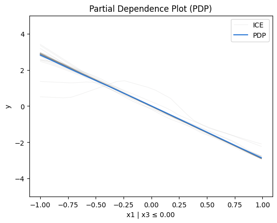
    


    
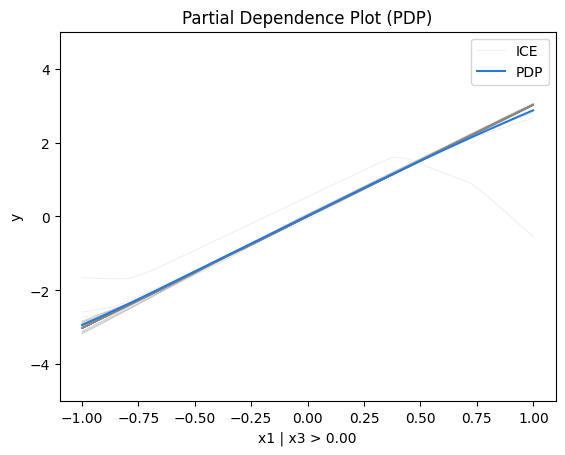
    


```python
partitions[1].show()
```

    
    
    Feature 1 - Full partition tree:
    No splits found for feature 1
    --------------------------------------------------
    Feature 1 - Statistics per tree level:
    No splits found for feature 1
    
    


```python
partitions[2].show()
```

    
    
    Feature 2 - Full partition tree:
    🌳 Full Tree Structure:
    ───────────────────────
    x3 🔹 [id: 0 | heter: 2.96 | inst: 1000 | w: 1.00]
        x1 ≤ 0.00 🔹 [id: 1 | heter: 0.73 | inst: 494 | w: 0.49]
            x1 ≤ -0.60 🔹 [id: 2 | heter: 0.13 | inst: 196 | w: 0.20]
            x1 > -0.60 🔹 [id: 3 | heter: 0.27 | inst: 298 | w: 0.30]
        x1 > 0.00 🔹 [id: 4 | heter: 0.73 | inst: 506 | w: 0.51]
            x1 ≤ 0.40 🔹 [id: 5 | heter: 0.12 | inst: 199 | w: 0.20]
            x1 > 0.40 🔹 [id: 6 | heter: 0.27 | inst: 307 | w: 0.31]
    --------------------------------------------------
    Feature 2 - Statistics per tree level:
    🌳 Tree Summary:
    ─────────────────
    Level 0🔹heter: 2.96
        Level 1🔹heter: 0.73 | 🔻2.23 (75.30%)
            Level 2🔹heter: 0.22 | 🔻0.51 (70.51%)
    
    


```python
part = partitions[2]
for r in part:
    if r.level == 1:
        part.plot(r.idx, heterogeneity="ice", centering=True, y_limits=[-5, 5])
```


    
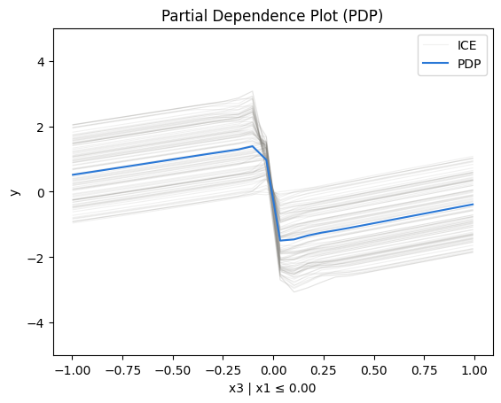
    


    
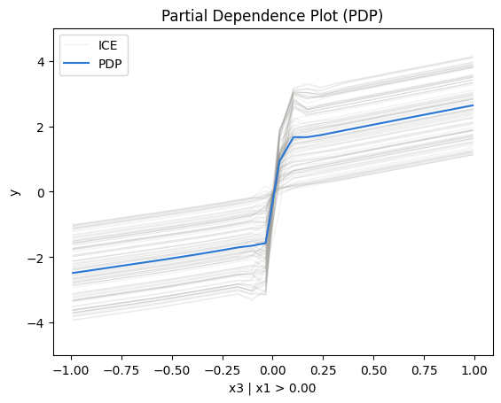
    


#### Conclusion

For the Global PDP:

   * the average effect of $x_1$ is $0$ with some heterogeneity implied by the interaction with $x_1$. The heterogeneity is expressed with two opposite lines; $-3x_1$ when $x_1 \leq 0$ and $3x_1$ when $x_1 >0$
   * the average effect of $x_2$ to be $0$ without heterogeneity
   * the average effect of $x_3$ to be $x_3$ with some heterogeneity due to the interaction with $x_1$. The heterogeneity is expressed with a discontinuity around $x_3=0$, with either a positive or a negative offset depending on the value of $x_1^i$

--- 

For the Regional PDP:

* For $x_1$, the algorithm finds two regions, one for $x_3 \leq 0$ and one for $x_3 > 0$
  * when $x_3>0$ the effect is $3x_1$
  * when $x_3 \leq 0$, the effect is $-3x_1$
* For $x_2$ the algorithm does not find any subregion 
* For $x_3$, there is a change in the offset:
  * when $x_1>0$ the line is $x_3 - 3x_1^i$ in the first half and $x_3 + 3x_1^i$ later
  * when $x_1<0$ the line is $x_3 + 3x_1^i$ in the first half and $x_3 - 3x_1^i$ later

### Correlated setting


#### Global PDP


```python
pdp = effector.PDP(data=X_cor_train, model=model_cor, schema={"feature_names": ['x1','x2','x3'], "target_name": "Y"})
pdp.plot(feature=0, centering=True, show_avg_output=False, heterogeneity="ice", y_limits=[-5, 5])
pdp.plot(feature=1, centering=True, show_avg_output=False, heterogeneity="ice", y_limits=[-5, 5])
pdp.plot(feature=2, centering=True, show_avg_output=False, heterogeneity="ice", y_limits=[-5, 5])
```


    

    


    
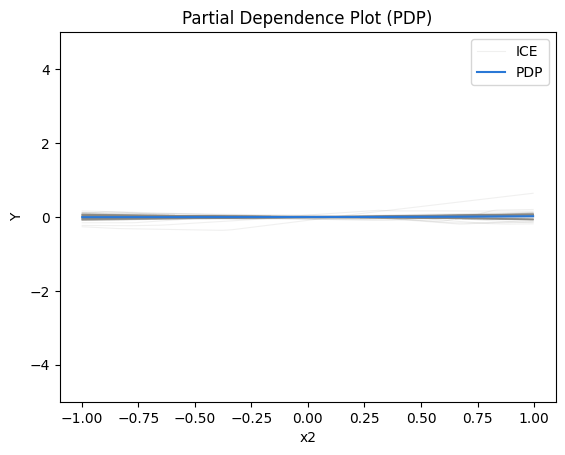
    


    
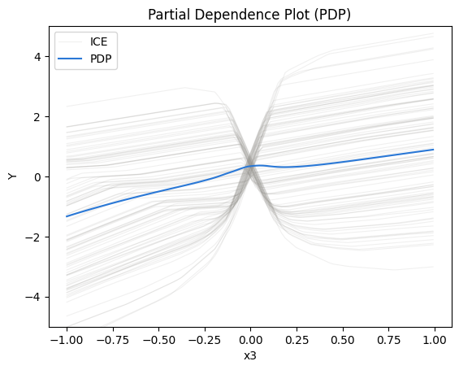
    


#### Regional-PDP


```python
pdp = effector.PDP(
    data=X_cor_train, model=model_cor,
    schema={"feature_names": ['x1', 'x2', 'x3']},
    axis_limits=np.array([[-1, 1], [-1, 1], [-1, 1]]).T,
    nof_instances="all",
)
pdp.fit("all", centering=True)
finder = effector.space_partitioning.Best(min_heterogeneity_decrease_pcg=0.4, numerical_features_grid_size=10)
partitions = {feat: pdp.find_regions(feat, finder=finder) for feat in range(3)}
```


```python
partitions[0].show()
```

    
    
    Feature 0 - Full partition tree:
    🌳 Full Tree Structure:
    ───────────────────────
    x1 🔹 [id: 0 | heter: 2.79 | inst: 900 | w: 1.00]
        x3 ≤ 0.00 🔹 [id: 1 | heter: 0.21 | inst: 436 | w: 0.48]
            x3 ≤ -0.20 🔹 [id: 2 | heter: 0.03 | inst: 337 | w: 0.37]
            x3 > -0.20 🔹 [id: 3 | heter: 0.25 | inst: 99 | w: 0.11]
        x3 > 0.00 🔹 [id: 4 | heter: 0.17 | inst: 464 | w: 0.52]
            x3 ≤ 0.20 🔹 [id: 5 | heter: 0.25 | inst: 115 | w: 0.13]
            x3 > 0.20 🔹 [id: 6 | heter: 0.01 | inst: 349 | w: 0.39]
    --------------------------------------------------
    Feature 0 - Statistics per tree level:
    🌳 Tree Summary:
    ─────────────────
    Level 0🔹heter: 2.79
        Level 1🔹heter: 0.19 | 🔻2.60 (93.20%)
            Level 2🔹heter: 0.07 | 🔻0.12 (61.03%)
    
    


```python
part = partitions[0]
for r in part:
    if r.level == 1:
        part.plot(r.idx, heterogeneity="ice", centering=True, y_limits=[-5, 5])
```


    

    


    

    


```python
partitions[1].show()
```

    
    
    Feature 1 - Full partition tree:
    No splits found for feature 1
    --------------------------------------------------
    Feature 1 - Statistics per tree level:
    No splits found for feature 1
    
    


```python
partitions[2].show()
```

    
    
    Feature 2 - Full partition tree:
    🌳 Full Tree Structure:
    ───────────────────────
    x3 🔹 [id: 0 | heter: 2.44 | inst: 900 | w: 1.00]
        x1 ≤ 0.00 🔹 [id: 1 | heter: 0.56 | inst: 463 | w: 0.51]
            x1 ≤ -0.40 🔹 [id: 2 | heter: 0.16 | inst: 246 | w: 0.27]
            x1 > -0.40 🔹 [id: 3 | heter: 0.12 | inst: 217 | w: 0.24]
        x1 > 0.00 🔹 [id: 4 | heter: 0.66 | inst: 437 | w: 0.49]
            x1 ≤ 0.40 🔹 [id: 5 | heter: 0.14 | inst: 189 | w: 0.21]
            x1 > 0.40 🔹 [id: 6 | heter: 0.21 | inst: 248 | w: 0.28]
    --------------------------------------------------
    Feature 2 - Statistics per tree level:
    🌳 Tree Summary:
    ─────────────────
    Level 0🔹heter: 2.44
        Level 1🔹heter: 0.61 | 🔻1.83 (75.09%)
            Level 2🔹heter: 0.16 | 🔻0.45 (73.53%)
    
    


```python
part = partitions[2]
for r in part:
    if r.level == 1:
        part.plot(r.idx, heterogeneity="ice", centering=True, y_limits=[-5, 5])
```


    
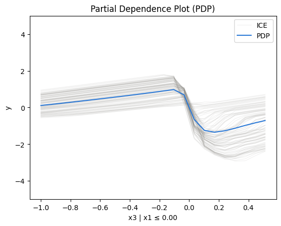
    


    
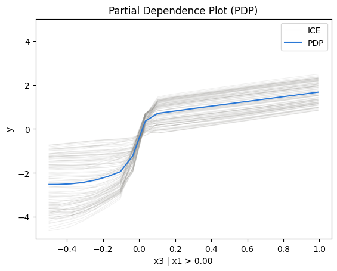
    


#### Conclusion

## (RH)ALE


```python
def model_uncor_jac(x):
    x_tensor = tf.convert_to_tensor(x, dtype=tf.float32)
    with tf.GradientTape() as t:
        t.watch(x_tensor)
        pred = model_uncor(x_tensor)
        grads = t.gradient(pred, x_tensor)
    return grads.numpy()

def model_cor_jac(x):
    x_tensor = tf.convert_to_tensor(x, dtype=tf.float32)
    with tf.GradientTape() as t:
        t.watch(x_tensor)
        pred = model_cor(x_tensor)
        grads = t.gradient(pred, x_tensor)
    return grads.numpy()
```

### Uncorrelated setting

#### Global RHALE


```python
rhale = effector.RHALE(data=X_uncor_train, model=model_uncor, model_jac=model_uncor_jac, schema={"feature_names": ['x1','x2','x3'], "target_name": "Y"})

binning_method = effector.axis_partitioning.Fixed(10, min_points_per_bin=0)
rhale.fit(features="all", binning_method=binning_method, centering=True)

rhale.plot(feature=0, centering=True, heterogeneity="std", show_avg_output=False, y_limits=[-5, 5], dy_limits=[-5, 5])
rhale.plot(feature=1, centering=True, heterogeneity="std", show_avg_output=False, y_limits=[-5, 5], dy_limits=[-5, 5])
rhale.plot(feature=2, centering=True, heterogeneity="std", show_avg_output=False, y_limits=[-5, 5], dy_limits=[-5, 5])
```


    
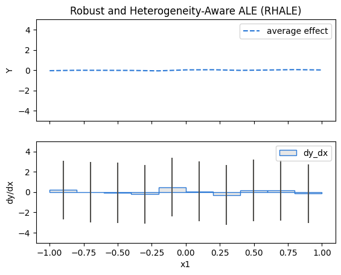
    


    
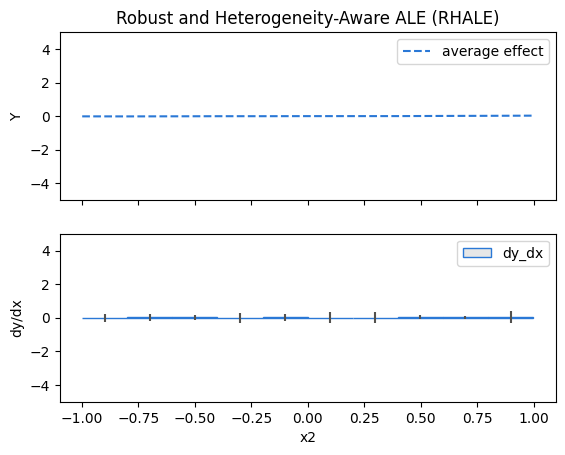
    


    
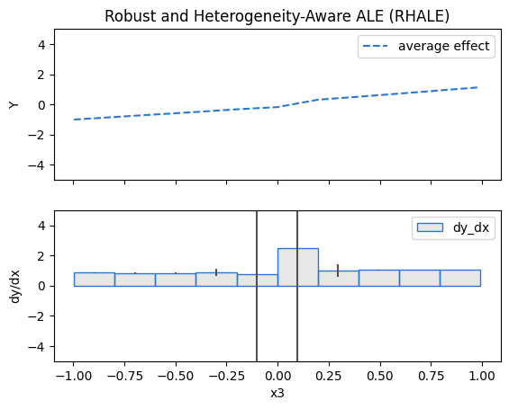
    


#### Regional RHALE


```python
rhale = effector.RHALE(
    data=X_uncor_train, model=model_uncor, model_jac=model_uncor_jac,
    schema={"feature_names": ['x1', 'x2', 'x3']},
    axis_limits=np.array([[-1, 1], [-1, 1], [-1, 1]]).T,
    nof_instances="all",
)
binning_method = effector.axis_partitioning.Fixed(11, min_points_per_bin=0)
rhale.fit("all", binning_method=binning_method, centering=True)
finder = effector.space_partitioning.Best(min_heterogeneity_decrease_pcg=0.6, numerical_features_grid_size=10)
partitions = {feat: rhale.find_regions(feat, finder=finder) for feat in range(3)}
```


```python
partitions[0].show()
```

    
    
    Feature 0 - Full partition tree:
    🌳 Full Tree Structure:
    ───────────────────────
    x1 🔹 [id: 0 | heter: 8.93 | inst: 1000 | w: 1.00]
        x3 ≤ 0.00 🔹 [id: 1 | heter: 0.51 | inst: 500 | w: 0.50]
        x3 > 0.00 🔹 [id: 2 | heter: 0.48 | inst: 500 | w: 0.50]
    --------------------------------------------------
    Feature 0 - Statistics per tree level:
    🌳 Tree Summary:
    ─────────────────
    Level 0🔹heter: 8.93
        Level 1🔹heter: 0.50 | 🔻8.44 (94.46%)
    
    


```python
part = partitions[0]
for r in part:
    if r.level == 1:
        part.plot(r.idx, heterogeneity="std", centering=True, y_limits=[-5, 5])
```


    

    


    

    


```python
partitions[1].show()
```

    
    
    Feature 1 - Full partition tree:
    No splits found for feature 1
    --------------------------------------------------
    Feature 1 - Statistics per tree level:
    No splits found for feature 1
    
    


```python
partitions[2].show()
```

    
    
    Feature 2 - Full partition tree:
    No splits found for feature 2
    --------------------------------------------------
    Feature 2 - Statistics per tree level:
    No splits found for feature 2
    
    


#### Conclusion

### Correlated setting

#### Global RHALE


```python
rhale = effector.RHALE(data=X_cor_train, model=model_cor, model_jac=model_cor_jac, schema={"feature_names": ['x1','x2','x3'], "target_name": "Y"})

binning_method = effector.axis_partitioning.Fixed(10, min_points_per_bin=0)
rhale.fit(features="all", binning_method=binning_method, centering=True)
```


```python
rhale.plot(feature=0, centering=True, heterogeneity="std", show_avg_output=False, y_limits=[-5, 5], dy_limits=[-5, 5])
rhale.plot(feature=1, centering=True, heterogeneity="std", show_avg_output=False, y_limits=[-5, 5], dy_limits=[-5, 5])
rhale.plot(feature=2, centering=True, heterogeneity="std", show_avg_output=False, y_limits=[-5, 5], dy_limits=[-5, 5])
```


    
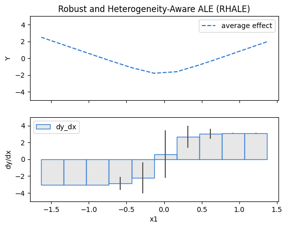
    


    
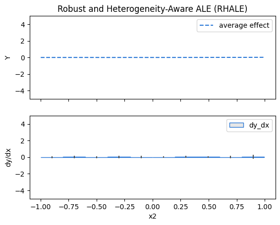
    


    
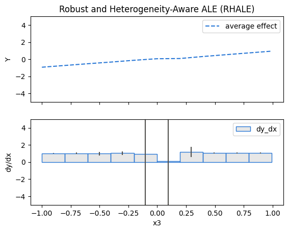
    


#### Regional RHALE


```python
rhale = effector.RHALE(
    data=X_cor_train, model=model_cor, model_jac=model_cor_jac,
    schema={"feature_names": ['x1', 'x2', 'x3']},
    axis_limits=np.array([[-1, 1], [-1, 1], [-1, 1]]).T,
    nof_instances="all",
)
binning_method = effector.axis_partitioning.Fixed(11, min_points_per_bin=0)
rhale.fit("all", binning_method=binning_method, centering=True)
finder = effector.space_partitioning.Best(min_heterogeneity_decrease_pcg=0.6, numerical_features_grid_size=10)
partitions = {feat: rhale.find_regions(feat, finder=finder) for feat in range(3)}
```


```python
partitions[0].show()
```

    
    
    Feature 0 - Full partition tree:
    No splits found for feature 0
    --------------------------------------------------
    Feature 0 - Statistics per tree level:
    No splits found for feature 0
    
    


```python
partitions[1].show()
```

    
    
    Feature 1 - Full partition tree:
    No splits found for feature 1
    --------------------------------------------------
    Feature 1 - Statistics per tree level:
    No splits found for feature 1
    
    


```python
partitions[2].show()
```

    
    
    Feature 2 - Full partition tree:
    No splits found for feature 2
    --------------------------------------------------
    Feature 2 - Statistics per tree level:
    No splits found for feature 2
    
    


#### Conclusion

## SHAP DP
### Uncorrelated setting
#### Global SHAP DP


```python
shap = effector.ShapDP(data=X_uncor_train, model=model_uncor, schema={"feature_names": ['x1', 'x2', 'x3'], "target_name": "Y"})
binning_method = effector.axis_partitioning.Fixed(nof_bins=5, min_points_per_bin=0)
shap.fit(features="all", binning_method=binning_method, centering=True)
shap.plot(feature=0, centering=True, heterogeneity="shap_values", show_avg_output=False, y_limits=[-3, 3])
shap.plot(feature=1, centering=True, heterogeneity="shap_values", show_avg_output=False, y_limits=[-3, 3])
shap.plot(feature=2, centering=True, heterogeneity="shap_values", show_avg_output=False, y_limits=[-3, 3])

```

    
ExactExplainer explainer:  70%|███████   | 700/1000 [00:00<?, ?it/s]

    
ExactExplainer explainer:  72%|███████▏  | 719/1000 [00:10<00:01, 189.82it/s]

    
ExactExplainer explainer:  74%|███████▍  | 738/1000 [00:10<00:01, 187.00it/s]

    
ExactExplainer explainer:  76%|███████▌  | 757/1000 [00:10<00:01, 188.02it/s]

    
ExactExplainer explainer:  78%|███████▊  | 776/1000 [00:10<00:01, 185.98it/s]

    
ExactExplainer explainer:  80%|███████▉  | 795/1000 [00:10<00:01, 183.07it/s]

    
ExactExplainer explainer:  81%|████████▏ | 814/1000 [00:10<00:01, 184.01it/s]

    
ExactExplainer explainer:  83%|████████▎ | 833/1000 [00:10<00:00, 178.55it/s]

    
ExactExplainer explainer:  85%|████████▌ | 852/1000 [00:10<00:00, 180.28it/s]

    
ExactExplainer explainer:  87%|████████▋ | 872/1000 [00:10<00:00, 183.99it/s]

    
ExactExplainer explainer:  89%|████████▉ | 891/1000 [00:11<00:00, 182.58it/s]

    
ExactExplainer explainer:  91%|█████████ | 910/1000 [00:11<00:00, 181.09it/s]

    
ExactExplainer explainer:  93%|█████████▎| 929/1000 [00:11<00:00, 181.40it/s]

    
ExactExplainer explainer:  95%|█████████▍| 949/1000 [00:11<00:00, 184.77it/s]

    
ExactExplainer explainer:  97%|█████████▋| 968/1000 [00:11<00:00, 181.52it/s]

    
ExactExplainer explainer:  99%|█████████▊| 987/1000 [00:11<00:00, 182.05it/s]

    
ExactExplainer explainer: 1001it [00:11, 25.84it/s]                          

    


    

    


    

    


    

    


#### Regional SHAP-DP


```python
shap = effector.ShapDP(
    data=X_uncor_train, model=model_uncor,
    schema={"feature_names": ['x1', 'x2', 'x3']},
    axis_limits=np.array([[-1, 1], [-1, 1], [-1, 1]]).T,
    nof_instances="all",
)
binning_method = effector.axis_partitioning.Fixed(nof_bins=5, min_points_per_bin=0)
shap.fit("all", binning_method=binning_method, centering=True)
finder = effector.space_partitioning.Best(min_heterogeneity_decrease_pcg=0.6, numerical_features_grid_size=10)
partitions = {feat: shap.find_regions(feat, finder=finder) for feat in range(3)}
```


```python
partitions[0].show()
```

    
    
    Feature 0 - Full partition tree:
    🌳 Full Tree Structure:
    ───────────────────────
    x1 🔹 [id: 0 | heter: 0.84 | inst: 1000 | w: 1.00]
        x3 ≤ 0.00 🔹 [id: 1 | heter: 0.04 | inst: 500 | w: 0.50]
        x3 > 0.00 🔹 [id: 2 | heter: 0.03 | inst: 500 | w: 0.50]
    --------------------------------------------------
    Feature 0 - Statistics per tree level:
    🌳 Tree Summary:
    ─────────────────
    Level 0🔹heter: 0.84
        Level 1🔹heter: 0.04 | 🔻0.81 (95.79%)
    
    


```python
part = partitions[0]
for r in part:
    if r.level == 1:
        part.plot(r.idx, heterogeneity="std", centering=True, y_limits=[-5, 5])
```


    

    


    
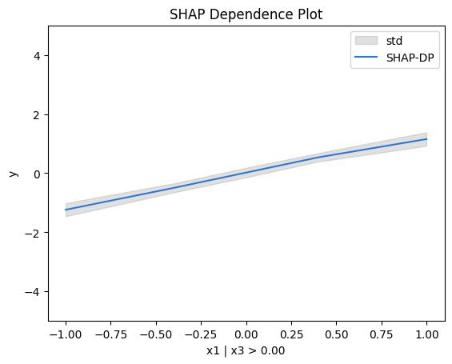
    


```python
partitions[1].show()
```

    
    
    Feature 1 - Full partition tree:
    No splits found for feature 1
    --------------------------------------------------
    Feature 1 - Statistics per tree level:
    No splits found for feature 1
    
    


```python
partitions[2].show()
```

    
    
    Feature 2 - Full partition tree:
    🌳 Full Tree Structure:
    ───────────────────────
    x3 🔹 [id: 0 | heter: 0.79 | inst: 1000 | w: 1.00]
        x1 ≤ 0.00 🔹 [id: 1 | heter: 0.26 | inst: 494 | w: 0.49]
        x1 > 0.00 🔹 [id: 2 | heter: 0.35 | inst: 506 | w: 0.51]
    --------------------------------------------------
    Feature 2 - Statistics per tree level:
    🌳 Tree Summary:
    ─────────────────
    Level 0🔹heter: 0.79
        Level 1🔹heter: 0.31 | 🔻0.48 (60.83%)
    
    


#### Conclusion

### Correlated setting

#### Global SHAP-DP


```python

shap = effector.ShapDP(data=X_cor_train, model=model_cor, schema={"feature_names": ['x1', 'x2', 'x3'], "target_name": "Y"})
binning_method = effector.axis_partitioning.Fixed(nof_bins=5, min_points_per_bin=0)
shap.fit(features="all", binning_method=binning_method, centering=True)
shap.plot(feature=0, centering=True, heterogeneity="shap_values", show_avg_output=False, y_limits=[-3, 3])
shap.plot(feature=1, centering=True, heterogeneity="shap_values", show_avg_output=False, y_limits=[-3, 3])
shap.plot(feature=2, centering=True, heterogeneity="shap_values", show_avg_output=False, y_limits=[-3, 3])

```


    
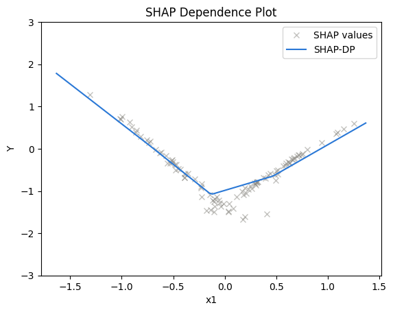
    


    
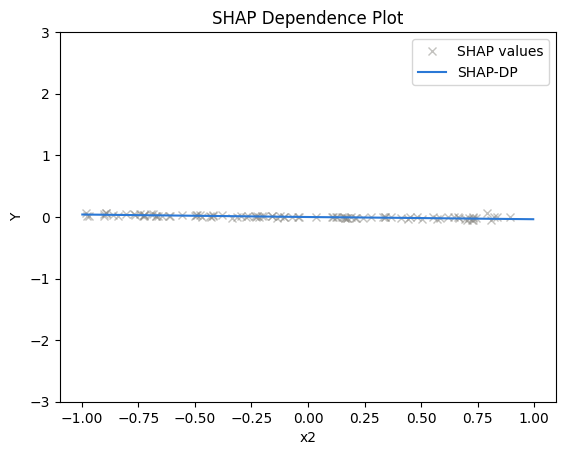
    


    
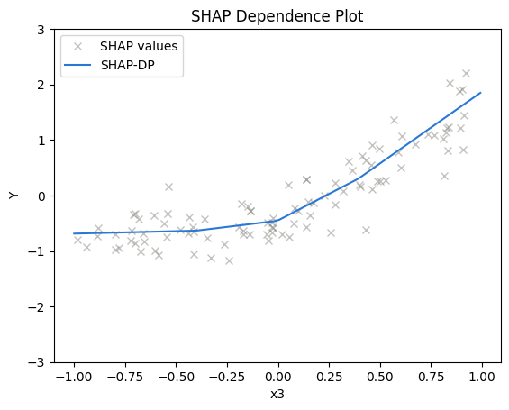
    


#### Regional SHAP


```python
shap = effector.ShapDP(
    data=X_cor_train, model=model_cor,
    schema={"feature_names": ['x1', 'x2', 'x3']},
    axis_limits=np.array([[-1, 1], [-1, 1], [-1, 1]]).T,
    nof_instances="all",
)
binning_method = effector.axis_partitioning.Fixed(nof_bins=5, min_points_per_bin=0)
shap.fit("all", binning_method=binning_method, centering=True)
finder = effector.space_partitioning.Best(min_heterogeneity_decrease_pcg=0.6, numerical_features_grid_size=10)
partitions = {feat: shap.find_regions(feat, finder=finder) for feat in range(3)}
```


```python
partitions[0].show()
partitions[1].show()
partitions[2].show()
```

    
    
    Feature 0 - Full partition tree:
    No splits found for feature 0
    --------------------------------------------------
    Feature 0 - Statistics per tree level:
    No splits found for feature 0
    
    
    
    
    Feature 1 - Full partition tree:
    No splits found for feature 1
    --------------------------------------------------
    Feature 1 - Statistics per tree level:
    No splits found for feature 1
    
    
    
    
    Feature 2 - Full partition tree:
    No splits found for feature 2
    --------------------------------------------------
    Feature 2 - Statistics per tree level:
    No splits found for feature 2
    
    


#### Conclusion


```python

```
