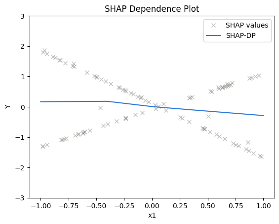
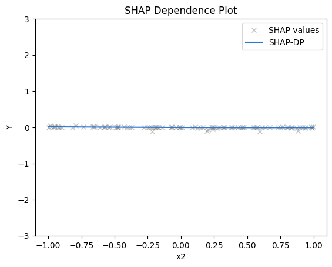
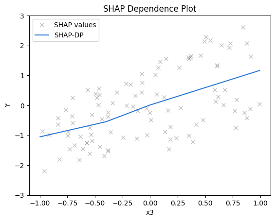

# Regional Effects (unknown black-box function)

- Author: [givasile](https://givasile.github.io/)
- Runtime: ~55 s
- Description: The realistic follow-up to tutorial 03: a neural network is
  fitted on the data and explained with regional PDP, RHALE and SHAP-DP,
  under uncorrelated and correlated features.

This tutorial use the same dataset with the previous [tutorial](./03_regional_effects_synthetic_f/), but instead of explaining the known (synthetic) predictive function, we fit a neural network on the data and explain the neural network. This is a more realistic scenario, since in real-world applications we do not know the underlying function and we only have access to the data. We advise the reader to first read the previous tutorial.


```python
import numpy as np
import effector
import keras
import tensorflow as tf

np.random.seed(12345)
tf.random.set_seed(12345)
```

    WARNING: All log messages before absl::InitializeLog() is called are written to STDERR
    I0000 00:00:1783555438.141205  102864 cpu_feature_guard.cc:227] This TensorFlow binary is optimized to use available CPU instructions in performance-critical operations.
    To enable the following instructions: AVX2 FMA, in other operations, rebuild TensorFlow with the appropriate compiler flags.


<!-- ## Simulation example

### Data Generating Distribution

We will generate $N=1000$ examples with $D=3$ features, which are in the uncorrelated setting all uniformly distributed as follows:

<center>

| Feature | Description                                | Distribution                 |
|---------|--------------------------------------------|------------------------------|
| $x_1$   | Uniformly distributed between $-1$ and $1$ | $x_1 \sim \mathcal{U}(-1,1)$ |
| $x_2$   | Uniformly distributed between $-1$ and $1$ | $x_2 \sim \mathcal{U}(-1,1)$ |
| $x_3$   | Uniformly distributed between $-1$ and $1$ | $x_3 \sim \mathcal{U}(-1,1)$ |

</center>

For the correlated setting we keep the distributional assumptions for $x_2$ and $x_3$ but define $x_1$ such that it is highly correlated with $x_3$ by: $x_1 = x_3 + \delta$ with $\delta \sim \mathcal{N}(0,0.0625)$. -->

## Simulation example

### Data Generating Distribution

We will generate $N=1000$ examples with $D=3$ features, which are in the uncorrelated setting all uniformly distributed as follows:

| Feature | Description                                | Distribution                 |
|---------|--------------------------------------------|------------------------------|
| $x_1$   | Uniformly distributed between $-1$ and $1$ | $x_1 \sim \mathcal{U}(-1,1)$ |
| $x_2$   | Uniformly distributed between $-1$ and $1$ | $x_2 \sim \mathcal{U}(-1,1)$ |
| $x_3$   | Uniformly distributed between $-1$ and $1$ | $x_3 \sim \mathcal{U}(-1,1)$ |

For the correlated setting, we keep the distributional assumptions for $x_2$ and $x_3$, but define $x_1$ such that it is highly correlated with $x_3$ by:  
$x_1 = x_3 + \delta$ with $\delta \sim \mathcal{N}(0,0.0625)$.


```python
def generate_dataset_uncorrelated(N):
    x1 = np.random.uniform(-1, 1, size=N)
    x2 = np.random.uniform(-1, 1, size=N)
    x3 = np.random.uniform(-1, 1, size=N)
    return np.stack((x1, x2, x3), axis=-1)

def generate_dataset_correlated(N):
    x3 = np.random.uniform(-1, 1, size=N)
    x2 = np.random.uniform(-1, 1, size=N)
    x1 = x3 + np.random.normal(loc = np.zeros_like(x3), scale = 0.25)
    return np.stack((x1, x2, x3), axis=-1)

# generate the dataset for the uncorrelated and correlated setting
N = 1000
X_uncor_train = generate_dataset_uncorrelated(N)
X_uncor_test = generate_dataset_uncorrelated(10000)
X_cor_train = generate_dataset_correlated(N)
X_cor_test = generate_dataset_correlated(10000)
```

### Black-box function

We will use the following linear model with a subgroup-specific interaction term:
 $$ y = 3x_1I_{x_3>0} - 3x_1I_{x_3\leq0} + x_3$$ 
 
On a global level, there is a high heterogeneity for the features $x_1$ and $x_3$ due to their interaction with each other. However, this heterogeneity vanishes to 0 if the feature space is separated into subregions:

<center>

| Feature | Region      | Average Effect | Heterogeneity |
|---------|-------------|----------------|---------------|
| $x_1$   | $x_3>0$     | $3x_1$         | 0             |
| $x_1$   | $x_3\leq 0$ | $-3x_1$        | 0             |
| $x_2$   | all         | 0              | 0             |
| $x_3$   | $x_3>0$     | $x_3$          | 0             |
| $x_3$   | $x_3\leq 0$ | $x_3$          | 0             |

</center>


```python
def generate_target(X):
    f = np.where(X[:,2] > 0, 3*X[:,0] + X[:,2], -3*X[:,0] + X[:,2])
    epsilon = np.random.normal(loc = np.zeros_like(X[:,0]), scale = 0.1)
    Y = f + epsilon
    return(Y)

# generate target for uncorrelated and correlated setting
Y_uncor_train = generate_target(X_uncor_train)
Y_uncor_test = generate_target(X_uncor_test)
Y_cor_train = generate_target(X_cor_train)
Y_cor_test = generate_target(X_cor_test)      
```

### Fit a Neural Network

We create a two-layer feedforward Neural Network, a weight decay of 0.01 for 100 epochs. We train two instances of this NN, one on the uncorrelated and one on the correlated setting. In both cases, the NN achieves a Mean Squared Error of about $0.17$ units.


```python
# Train - Evaluate - Explain a neural network
model_uncor = keras.Sequential([
    keras.layers.Dense(10, activation="relu", input_shape=(3,)),
    keras.layers.Dense(10, activation="relu", input_shape=(3,)),
    keras.layers.Dense(1)
])

optimizer = keras.optimizers.Adam(learning_rate=0.01)
model_uncor.compile(optimizer=optimizer, loss="mse")
model_uncor.fit(X_uncor_train, Y_uncor_train, epochs=100)
model_uncor.evaluate(X_uncor_test, Y_uncor_test)
```

    Epoch 1/100


    /home/givasile/github/packages/effector/.venv/lib/python3.10/site-packages/keras/src/layers/core/dense.py:95: UserWarning: Do not pass an `input_shape`/`input_dim` argument to a layer. When using Sequential models, prefer using an `Input(shape)` object as the first layer in the model instead.
      super().__init__(activity_regularizer=activity_regularizer, **kwargs)


    
 1/32 ━━━━━━━━━━━━━━━━━━━━ 16s 527ms/step - loss: 3.7567

    
32/32 ━━━━━━━━━━━━━━━━━━━━ 1s 2ms/step - loss: 3.0351   


    Epoch 2/100


    
 1/32 ━━━━━━━━━━━━━━━━━━━━ 0s 17ms/step - loss: 2.3162

    
32/32 ━━━━━━━━━━━━━━━━━━━━ 0s 2ms/step - loss: 1.7728 


    Epoch 3/100


    
 1/32 ━━━━━━━━━━━━━━━━━━━━ 0s 17ms/step - loss: 1.0081

    
32/32 ━━━━━━━━━━━━━━━━━━━━ 0s 2ms/step - loss: 0.9238 


    Epoch 4/100


    
 1/32 ━━━━━━━━━━━━━━━━━━━━ 0s 17ms/step - loss: 0.6222

    
32/32 ━━━━━━━━━━━━━━━━━━━━ 0s 2ms/step - loss: 0.5510 


    Epoch 5/100


    
 1/32 ━━━━━━━━━━━━━━━━━━━━ 0s 17ms/step - loss: 0.4080

    
32/32 ━━━━━━━━━━━━━━━━━━━━ 0s 1ms/step - loss: 0.3363 


    Epoch 6/100


    
 1/32 ━━━━━━━━━━━━━━━━━━━━ 0s 17ms/step - loss: 0.3077

    
32/32 ━━━━━━━━━━━━━━━━━━━━ 0s 2ms/step - loss: 0.2526 


    Epoch 7/100


    
 1/32 ━━━━━━━━━━━━━━━━━━━━ 0s 16ms/step - loss: 0.2605

    
32/32 ━━━━━━━━━━━━━━━━━━━━ 0s 2ms/step - loss: 0.2185 


    Epoch 8/100


    
 1/32 ━━━━━━━━━━━━━━━━━━━━ 0s 16ms/step - loss: 0.2332

    
32/32 ━━━━━━━━━━━━━━━━━━━━ 0s 2ms/step - loss: 0.1982 


    Epoch 9/100


    
 1/32 ━━━━━━━━━━━━━━━━━━━━ 0s 16ms/step - loss: 0.2112

    
32/32 ━━━━━━━━━━━━━━━━━━━━ 0s 2ms/step - loss: 0.1838 


    Epoch 10/100


    
 1/32 ━━━━━━━━━━━━━━━━━━━━ 0s 15ms/step - loss: 0.1954

    
32/32 ━━━━━━━━━━━━━━━━━━━━ 0s 2ms/step - loss: 0.1730 


    Epoch 11/100


    
 1/32 ━━━━━━━━━━━━━━━━━━━━ 0s 16ms/step - loss: 0.1775

    
32/32 ━━━━━━━━━━━━━━━━━━━━ 0s 2ms/step - loss: 0.1633 


    Epoch 12/100


    
 1/32 ━━━━━━━━━━━━━━━━━━━━ 0s 15ms/step - loss: 0.1623

    
32/32 ━━━━━━━━━━━━━━━━━━━━ 0s 2ms/step - loss: 0.1536 


    Epoch 13/100


    
 1/32 ━━━━━━━━━━━━━━━━━━━━ 0s 16ms/step - loss: 0.1465

    
32/32 ━━━━━━━━━━━━━━━━━━━━ 0s 1ms/step - loss: 0.1448 


    Epoch 14/100


    
 1/32 ━━━━━━━━━━━━━━━━━━━━ 0s 16ms/step - loss: 0.1312

    
32/32 ━━━━━━━━━━━━━━━━━━━━ 0s 2ms/step - loss: 0.1361 


    Epoch 15/100


    
 1/32 ━━━━━━━━━━━━━━━━━━━━ 0s 17ms/step - loss: 0.1172

    
32/32 ━━━━━━━━━━━━━━━━━━━━ 0s 1ms/step - loss: 0.1292 


    Epoch 16/100


    
 1/32 ━━━━━━━━━━━━━━━━━━━━ 0s 17ms/step - loss: 0.1044

    
32/32 ━━━━━━━━━━━━━━━━━━━━ 0s 2ms/step - loss: 0.1222 


    Epoch 17/100


    
 1/32 ━━━━━━━━━━━━━━━━━━━━ 0s 16ms/step - loss: 0.0931

    
32/32 ━━━━━━━━━━━━━━━━━━━━ 0s 2ms/step - loss: 0.1179 


    Epoch 18/100


    
 1/32 ━━━━━━━━━━━━━━━━━━━━ 0s 16ms/step - loss: 0.0800

    
32/32 ━━━━━━━━━━━━━━━━━━━━ 0s 1ms/step - loss: 0.1136 


    Epoch 19/100


    
 1/32 ━━━━━━━━━━━━━━━━━━━━ 0s 15ms/step - loss: 0.0672

    
32/32 ━━━━━━━━━━━━━━━━━━━━ 0s 2ms/step - loss: 0.1104 


    Epoch 20/100


    
 1/32 ━━━━━━━━━━━━━━━━━━━━ 0s 17ms/step - loss: 0.0555

    
32/32 ━━━━━━━━━━━━━━━━━━━━ 0s 1ms/step - loss: 0.1070 


    Epoch 21/100


    
 1/32 ━━━━━━━━━━━━━━━━━━━━ 0s 15ms/step - loss: 0.0468

    
32/32 ━━━━━━━━━━━━━━━━━━━━ 0s 2ms/step - loss: 0.1039 


    Epoch 22/100


    
 1/32 ━━━━━━━━━━━━━━━━━━━━ 0s 17ms/step - loss: 0.0400

    
32/32 ━━━━━━━━━━━━━━━━━━━━ 0s 1ms/step - loss: 0.1005 


    Epoch 23/100


    
 1/32 ━━━━━━━━━━━━━━━━━━━━ 0s 16ms/step - loss: 0.0363

    
32/32 ━━━━━━━━━━━━━━━━━━━━ 0s 1ms/step - loss: 0.0972 


    Epoch 24/100


    
 1/32 ━━━━━━━━━━━━━━━━━━━━ 0s 17ms/step - loss: 0.0318

    
32/32 ━━━━━━━━━━━━━━━━━━━━ 0s 2ms/step - loss: 0.0939 


    Epoch 25/100


    
 1/32 ━━━━━━━━━━━━━━━━━━━━ 0s 18ms/step - loss: 0.0288

    
32/32 ━━━━━━━━━━━━━━━━━━━━ 0s 1ms/step - loss: 0.0909 


    Epoch 26/100


    
 1/32 ━━━━━━━━━━━━━━━━━━━━ 0s 17ms/step - loss: 0.0257

    
32/32 ━━━━━━━━━━━━━━━━━━━━ 0s 2ms/step - loss: 0.0886 


    Epoch 27/100


    
 1/32 ━━━━━━━━━━━━━━━━━━━━ 0s 17ms/step - loss: 0.0230

    
32/32 ━━━━━━━━━━━━━━━━━━━━ 0s 2ms/step - loss: 0.0867 


    Epoch 28/100


    
 1/32 ━━━━━━━━━━━━━━━━━━━━ 0s 18ms/step - loss: 0.0221

    
32/32 ━━━━━━━━━━━━━━━━━━━━ 0s 2ms/step - loss: 0.0848 


    Epoch 29/100


    
 1/32 ━━━━━━━━━━━━━━━━━━━━ 0s 16ms/step - loss: 0.0207

    
32/32 ━━━━━━━━━━━━━━━━━━━━ 0s 2ms/step - loss: 0.0834 


    Epoch 30/100


    
 1/32 ━━━━━━━━━━━━━━━━━━━━ 0s 18ms/step - loss: 0.0218

    
32/32 ━━━━━━━━━━━━━━━━━━━━ 0s 2ms/step - loss: 0.0820 


    Epoch 31/100


    
 1/32 ━━━━━━━━━━━━━━━━━━━━ 0s 17ms/step - loss: 0.0214

    
32/32 ━━━━━━━━━━━━━━━━━━━━ 0s 1ms/step - loss: 0.0801 


    Epoch 32/100


    
 1/32 ━━━━━━━━━━━━━━━━━━━━ 0s 17ms/step - loss: 0.0225

    
32/32 ━━━━━━━━━━━━━━━━━━━━ 0s 1ms/step - loss: 0.0791 


    Epoch 33/100


    
 1/32 ━━━━━━━━━━━━━━━━━━━━ 0s 17ms/step - loss: 0.0223

    
32/32 ━━━━━━━━━━━━━━━━━━━━ 0s 2ms/step - loss: 0.0776 


    Epoch 34/100


    
 1/32 ━━━━━━━━━━━━━━━━━━━━ 0s 16ms/step - loss: 0.0234

    
32/32 ━━━━━━━━━━━━━━━━━━━━ 0s 2ms/step - loss: 0.0760 


    Epoch 35/100


    
 1/32 ━━━━━━━━━━━━━━━━━━━━ 0s 17ms/step - loss: 0.0242

    
32/32 ━━━━━━━━━━━━━━━━━━━━ 0s 2ms/step - loss: 0.0745 


    Epoch 36/100


    
 1/32 ━━━━━━━━━━━━━━━━━━━━ 0s 16ms/step - loss: 0.0256

    
32/32 ━━━━━━━━━━━━━━━━━━━━ 0s 1ms/step - loss: 0.0734 


    Epoch 37/100


    
 1/32 ━━━━━━━━━━━━━━━━━━━━ 0s 17ms/step - loss: 0.0261

    
32/32 ━━━━━━━━━━━━━━━━━━━━ 0s 1ms/step - loss: 0.0718 


    Epoch 38/100


    
 1/32 ━━━━━━━━━━━━━━━━━━━━ 0s 15ms/step - loss: 0.0275

    
32/32 ━━━━━━━━━━━━━━━━━━━━ 0s 2ms/step - loss: 0.0703 


    Epoch 39/100


    
 1/32 ━━━━━━━━━━━━━━━━━━━━ 0s 16ms/step - loss: 0.0270

    
32/32 ━━━━━━━━━━━━━━━━━━━━ 0s 1ms/step - loss: 0.0690 


    Epoch 40/100


    
 1/32 ━━━━━━━━━━━━━━━━━━━━ 0s 17ms/step - loss: 0.0280

    
32/32 ━━━━━━━━━━━━━━━━━━━━ 0s 1ms/step - loss: 0.0684 


    Epoch 41/100


    
 1/32 ━━━━━━━━━━━━━━━━━━━━ 0s 16ms/step - loss: 0.0272

    
32/32 ━━━━━━━━━━━━━━━━━━━━ 0s 2ms/step - loss: 0.0666 


    Epoch 42/100


    
 1/32 ━━━━━━━━━━━━━━━━━━━━ 0s 18ms/step - loss: 0.0260

    
32/32 ━━━━━━━━━━━━━━━━━━━━ 0s 2ms/step - loss: 0.0657 


    Epoch 43/100


    
 1/32 ━━━━━━━━━━━━━━━━━━━━ 0s 16ms/step - loss: 0.0243

    
32/32 ━━━━━━━━━━━━━━━━━━━━ 0s 1ms/step - loss: 0.0656 


    Epoch 44/100


    
 1/32 ━━━━━━━━━━━━━━━━━━━━ 0s 17ms/step - loss: 0.0234

    
32/32 ━━━━━━━━━━━━━━━━━━━━ 0s 1ms/step - loss: 0.0643 


    Epoch 45/100


    
 1/32 ━━━━━━━━━━━━━━━━━━━━ 0s 16ms/step - loss: 0.0220

    
32/32 ━━━━━━━━━━━━━━━━━━━━ 0s 2ms/step - loss: 0.0638 


    Epoch 46/100


    
 1/32 ━━━━━━━━━━━━━━━━━━━━ 0s 21ms/step - loss: 0.0213

    
32/32 ━━━━━━━━━━━━━━━━━━━━ 0s 2ms/step - loss: 0.0629 


    Epoch 47/100


    
 1/32 ━━━━━━━━━━━━━━━━━━━━ 0s 17ms/step - loss: 0.0206

    
32/32 ━━━━━━━━━━━━━━━━━━━━ 0s 2ms/step - loss: 0.0622 


    Epoch 48/100


    
 1/32 ━━━━━━━━━━━━━━━━━━━━ 0s 16ms/step - loss: 0.0210

    
32/32 ━━━━━━━━━━━━━━━━━━━━ 0s 1ms/step - loss: 0.0616 


    Epoch 49/100


    
 1/32 ━━━━━━━━━━━━━━━━━━━━ 0s 15ms/step - loss: 0.0204

    
32/32 ━━━━━━━━━━━━━━━━━━━━ 0s 2ms/step - loss: 0.0611 


    Epoch 50/100


    
 1/32 ━━━━━━━━━━━━━━━━━━━━ 0s 17ms/step - loss: 0.0210

    
32/32 ━━━━━━━━━━━━━━━━━━━━ 0s 1ms/step - loss: 0.0606 


    Epoch 51/100


    
 1/32 ━━━━━━━━━━━━━━━━━━━━ 0s 18ms/step - loss: 0.0203

    
32/32 ━━━━━━━━━━━━━━━━━━━━ 0s 1ms/step - loss: 0.0598 


    Epoch 52/100


    
 1/32 ━━━━━━━━━━━━━━━━━━━━ 0s 17ms/step - loss: 0.0212

    
32/32 ━━━━━━━━━━━━━━━━━━━━ 0s 1ms/step - loss: 0.0593 


    Epoch 53/100


    
 1/32 ━━━━━━━━━━━━━━━━━━━━ 0s 17ms/step - loss: 0.0219

    
32/32 ━━━━━━━━━━━━━━━━━━━━ 0s 1ms/step - loss: 0.0587 


    Epoch 54/100


    
 1/32 ━━━━━━━━━━━━━━━━━━━━ 0s 17ms/step - loss: 0.0220

    
32/32 ━━━━━━━━━━━━━━━━━━━━ 0s 1ms/step - loss: 0.0586 


    Epoch 55/100


    
 1/32 ━━━━━━━━━━━━━━━━━━━━ 0s 16ms/step - loss: 0.0226

    
32/32 ━━━━━━━━━━━━━━━━━━━━ 0s 1ms/step - loss: 0.0581 


    Epoch 56/100


    
 1/32 ━━━━━━━━━━━━━━━━━━━━ 0s 15ms/step - loss: 0.0223

    
32/32 ━━━━━━━━━━━━━━━━━━━━ 0s 2ms/step - loss: 0.0579 


    Epoch 57/100


    
 1/32 ━━━━━━━━━━━━━━━━━━━━ 0s 16ms/step - loss: 0.0216

    
32/32 ━━━━━━━━━━━━━━━━━━━━ 0s 2ms/step - loss: 0.0576 


    Epoch 58/100


    
 1/32 ━━━━━━━━━━━━━━━━━━━━ 0s 16ms/step - loss: 0.0224

    
32/32 ━━━━━━━━━━━━━━━━━━━━ 0s 1ms/step - loss: 0.0579 


    Epoch 59/100


    
 1/32 ━━━━━━━━━━━━━━━━━━━━ 0s 16ms/step - loss: 0.0234

    
32/32 ━━━━━━━━━━━━━━━━━━━━ 0s 1ms/step - loss: 0.0576 


    Epoch 60/100


    
 1/32 ━━━━━━━━━━━━━━━━━━━━ 0s 17ms/step - loss: 0.0215

    
32/32 ━━━━━━━━━━━━━━━━━━━━ 0s 2ms/step - loss: 0.0566 


    Epoch 61/100


    
 1/32 ━━━━━━━━━━━━━━━━━━━━ 0s 17ms/step - loss: 0.0237

    
32/32 ━━━━━━━━━━━━━━━━━━━━ 0s 2ms/step - loss: 0.0566 


    Epoch 62/100


    
 1/32 ━━━━━━━━━━━━━━━━━━━━ 0s 16ms/step - loss: 0.0232

    
32/32 ━━━━━━━━━━━━━━━━━━━━ 0s 1ms/step - loss: 0.0564 


    Epoch 63/100


    
 1/32 ━━━━━━━━━━━━━━━━━━━━ 0s 16ms/step - loss: 0.0235

    
32/32 ━━━━━━━━━━━━━━━━━━━━ 0s 1ms/step - loss: 0.0559 


    Epoch 64/100


    
 1/32 ━━━━━━━━━━━━━━━━━━━━ 0s 15ms/step - loss: 0.0245

    
32/32 ━━━━━━━━━━━━━━━━━━━━ 0s 1ms/step - loss: 0.0557 


    Epoch 65/100


    
 1/32 ━━━━━━━━━━━━━━━━━━━━ 0s 16ms/step - loss: 0.0227

    
32/32 ━━━━━━━━━━━━━━━━━━━━ 0s 2ms/step - loss: 0.0553 


    Epoch 66/100


    
 1/32 ━━━━━━━━━━━━━━━━━━━━ 0s 16ms/step - loss: 0.0235

    
32/32 ━━━━━━━━━━━━━━━━━━━━ 0s 2ms/step - loss: 0.0553 


    Epoch 67/100


    
 1/32 ━━━━━━━━━━━━━━━━━━━━ 0s 16ms/step - loss: 0.0215

    
32/32 ━━━━━━━━━━━━━━━━━━━━ 0s 1ms/step - loss: 0.0553 


    Epoch 68/100


    
 1/32 ━━━━━━━━━━━━━━━━━━━━ 0s 18ms/step - loss: 0.0224

    
32/32 ━━━━━━━━━━━━━━━━━━━━ 0s 1ms/step - loss: 0.0554 


    Epoch 69/100


    
 1/32 ━━━━━━━━━━━━━━━━━━━━ 0s 16ms/step - loss: 0.0235

    
32/32 ━━━━━━━━━━━━━━━━━━━━ 0s 2ms/step - loss: 0.0551 


    Epoch 70/100


    
 1/32 ━━━━━━━━━━━━━━━━━━━━ 0s 16ms/step - loss: 0.0227

    
32/32 ━━━━━━━━━━━━━━━━━━━━ 0s 1ms/step - loss: 0.0550 


    Epoch 71/100


    
 1/32 ━━━━━━━━━━━━━━━━━━━━ 0s 16ms/step - loss: 0.0233

    
32/32 ━━━━━━━━━━━━━━━━━━━━ 0s 1ms/step - loss: 0.0547 


    Epoch 72/100


    
 1/32 ━━━━━━━━━━━━━━━━━━━━ 0s 16ms/step - loss: 0.0230

    
32/32 ━━━━━━━━━━━━━━━━━━━━ 0s 2ms/step - loss: 0.0547 


    Epoch 73/100


    
 1/32 ━━━━━━━━━━━━━━━━━━━━ 0s 16ms/step - loss: 0.0235

    
32/32 ━━━━━━━━━━━━━━━━━━━━ 0s 2ms/step - loss: 0.0544 


    Epoch 74/100


    
 1/32 ━━━━━━━━━━━━━━━━━━━━ 0s 16ms/step - loss: 0.0255

    
32/32 ━━━━━━━━━━━━━━━━━━━━ 0s 1ms/step - loss: 0.0543 


    Epoch 75/100


    
 1/32 ━━━━━━━━━━━━━━━━━━━━ 0s 15ms/step - loss: 0.0242

    
32/32 ━━━━━━━━━━━━━━━━━━━━ 0s 2ms/step - loss: 0.0542 


    Epoch 76/100


    
 1/32 ━━━━━━━━━━━━━━━━━━━━ 0s 16ms/step - loss: 0.0250

    
32/32 ━━━━━━━━━━━━━━━━━━━━ 0s 1ms/step - loss: 0.0546 


    Epoch 77/100


    
 1/32 ━━━━━━━━━━━━━━━━━━━━ 0s 16ms/step - loss: 0.0244

    
32/32 ━━━━━━━━━━━━━━━━━━━━ 0s 1ms/step - loss: 0.0537 


    Epoch 78/100


    
 1/32 ━━━━━━━━━━━━━━━━━━━━ 0s 16ms/step - loss: 0.0269

    
32/32 ━━━━━━━━━━━━━━━━━━━━ 0s 1ms/step - loss: 0.0536 


    Epoch 79/100


    
 1/32 ━━━━━━━━━━━━━━━━━━━━ 0s 15ms/step - loss: 0.0258

    
32/32 ━━━━━━━━━━━━━━━━━━━━ 0s 1ms/step - loss: 0.0535 


    Epoch 80/100


    
 1/32 ━━━━━━━━━━━━━━━━━━━━ 0s 16ms/step - loss: 0.0276

    
32/32 ━━━━━━━━━━━━━━━━━━━━ 0s 1ms/step - loss: 0.0533 


    Epoch 81/100


    
 1/32 ━━━━━━━━━━━━━━━━━━━━ 0s 16ms/step - loss: 0.0270

    
32/32 ━━━━━━━━━━━━━━━━━━━━ 0s 2ms/step - loss: 0.0532 


    Epoch 82/100


    
 1/32 ━━━━━━━━━━━━━━━━━━━━ 0s 17ms/step - loss: 0.0294

    
32/32 ━━━━━━━━━━━━━━━━━━━━ 0s 1ms/step - loss: 0.0530 


    Epoch 83/100


    
 1/32 ━━━━━━━━━━━━━━━━━━━━ 0s 17ms/step - loss: 0.0281

    
32/32 ━━━━━━━━━━━━━━━━━━━━ 0s 2ms/step - loss: 0.0528 


    Epoch 84/100


    
 1/32 ━━━━━━━━━━━━━━━━━━━━ 0s 16ms/step - loss: 0.0304

    
32/32 ━━━━━━━━━━━━━━━━━━━━ 0s 1ms/step - loss: 0.0534 


    Epoch 85/100


    
 1/32 ━━━━━━━━━━━━━━━━━━━━ 0s 17ms/step - loss: 0.0306

    
32/32 ━━━━━━━━━━━━━━━━━━━━ 0s 1ms/step - loss: 0.0531 


    Epoch 86/100


    
 1/32 ━━━━━━━━━━━━━━━━━━━━ 0s 16ms/step - loss: 0.0309

    
32/32 ━━━━━━━━━━━━━━━━━━━━ 0s 1ms/step - loss: 0.0524 


    Epoch 87/100


    
 1/32 ━━━━━━━━━━━━━━━━━━━━ 0s 15ms/step - loss: 0.0308

    
32/32 ━━━━━━━━━━━━━━━━━━━━ 0s 2ms/step - loss: 0.0521 


    Epoch 88/100


    
 1/32 ━━━━━━━━━━━━━━━━━━━━ 0s 16ms/step - loss: 0.0335

    
32/32 ━━━━━━━━━━━━━━━━━━━━ 0s 1ms/step - loss: 0.0523 


    Epoch 89/100


    
 1/32 ━━━━━━━━━━━━━━━━━━━━ 0s 15ms/step - loss: 0.0305

    
32/32 ━━━━━━━━━━━━━━━━━━━━ 0s 2ms/step - loss: 0.0513 


    Epoch 90/100


    
 1/32 ━━━━━━━━━━━━━━━━━━━━ 0s 16ms/step - loss: 0.0313

    
32/32 ━━━━━━━━━━━━━━━━━━━━ 0s 1ms/step - loss: 0.0525 


    Epoch 91/100


    
 1/32 ━━━━━━━━━━━━━━━━━━━━ 0s 15ms/step - loss: 0.0294

    
32/32 ━━━━━━━━━━━━━━━━━━━━ 0s 1ms/step - loss: 0.0541 


    Epoch 92/100


    
 1/32 ━━━━━━━━━━━━━━━━━━━━ 0s 16ms/step - loss: 0.0296

    
32/32 ━━━━━━━━━━━━━━━━━━━━ 0s 1ms/step - loss: 0.0550 


    Epoch 93/100


    
 1/32 ━━━━━━━━━━━━━━━━━━━━ 0s 16ms/step - loss: 0.0312

    
32/32 ━━━━━━━━━━━━━━━━━━━━ 0s 1ms/step - loss: 0.0532 


    Epoch 94/100


    
 1/32 ━━━━━━━━━━━━━━━━━━━━ 0s 15ms/step - loss: 0.0345

    
32/32 ━━━━━━━━━━━━━━━━━━━━ 0s 1ms/step - loss: 0.0531 


    Epoch 95/100


    
 1/32 ━━━━━━━━━━━━━━━━━━━━ 0s 15ms/step - loss: 0.0358

    
32/32 ━━━━━━━━━━━━━━━━━━━━ 0s 1ms/step - loss: 0.0533 


    Epoch 96/100


    
 1/32 ━━━━━━━━━━━━━━━━━━━━ 0s 15ms/step - loss: 0.0371

    
32/32 ━━━━━━━━━━━━━━━━━━━━ 0s 2ms/step - loss: 0.0517 


    Epoch 97/100


    
 1/32 ━━━━━━━━━━━━━━━━━━━━ 0s 16ms/step - loss: 0.0358

    
32/32 ━━━━━━━━━━━━━━━━━━━━ 0s 1ms/step - loss: 0.0501 


    Epoch 98/100


    
 1/32 ━━━━━━━━━━━━━━━━━━━━ 0s 15ms/step - loss: 0.0364

    
32/32 ━━━━━━━━━━━━━━━━━━━━ 0s 2ms/step - loss: 0.0509 


    Epoch 99/100


    
 1/32 ━━━━━━━━━━━━━━━━━━━━ 0s 17ms/step - loss: 0.0320

    
32/32 ━━━━━━━━━━━━━━━━━━━━ 0s 2ms/step - loss: 0.0507 


    Epoch 100/100


    
 1/32 ━━━━━━━━━━━━━━━━━━━━ 0s 17ms/step - loss: 0.0345

    
32/32 ━━━━━━━━━━━━━━━━━━━━ 0s 1ms/step - loss: 0.0510 


    
  1/313 ━━━━━━━━━━━━━━━━━━━━ 19s 63ms/step - loss: 0.0384

    
 52/313 ━━━━━━━━━━━━━━━━━━━━ 0s 987us/step - loss: 0.0635

    
108/313 ━━━━━━━━━━━━━━━━━━━━ 0s 941us/step - loss: 0.0704

    
165/313 ━━━━━━━━━━━━━━━━━━━━ 0s 920us/step - loss: 0.0731

    
219/313 ━━━━━━━━━━━━━━━━━━━━ 0s 922us/step - loss: 0.0742

    
278/313 ━━━━━━━━━━━━━━━━━━━━ 0s 908us/step - loss: 0.0746

    
313/313 ━━━━━━━━━━━━━━━━━━━━ 0s 934us/step - loss: 0.0732


    0.07316635549068451


```python
model_cor = keras.Sequential([
    keras.layers.Dense(10, activation="relu", input_shape=(3,)),
    keras.layers.Dense(10, activation="relu", input_shape=(3,)),
    keras.layers.Dense(1)
])

optimizer = keras.optimizers.Adam(learning_rate=0.01)
model_cor.compile(optimizer=optimizer, loss="mse")
model_cor.fit(X_cor_train, Y_cor_train, epochs=100)
model_cor.evaluate(X_cor_test, Y_cor_test)
```

    Epoch 1/100


    
 1/32 ━━━━━━━━━━━━━━━━━━━━ 15s 489ms/step - loss: 4.3288

    
32/32 ━━━━━━━━━━━━━━━━━━━━ 1s 2ms/step - loss: 1.7997   


    Epoch 2/100


    
 1/32 ━━━━━━━━━━━━━━━━━━━━ 0s 16ms/step - loss: 0.7539

    
32/32 ━━━━━━━━━━━━━━━━━━━━ 0s 2ms/step - loss: 0.4211 


    Epoch 3/100


    
 1/32 ━━━━━━━━━━━━━━━━━━━━ 0s 17ms/step - loss: 0.2606

    
32/32 ━━━━━━━━━━━━━━━━━━━━ 0s 2ms/step - loss: 0.1780 


    Epoch 4/100


    
 1/32 ━━━━━━━━━━━━━━━━━━━━ 0s 15ms/step - loss: 0.1829

    
32/32 ━━━━━━━━━━━━━━━━━━━━ 0s 2ms/step - loss: 0.1425 


    Epoch 5/100


    
 1/32 ━━━━━━━━━━━━━━━━━━━━ 0s 16ms/step - loss: 0.1685

    
32/32 ━━━━━━━━━━━━━━━━━━━━ 0s 2ms/step - loss: 0.1249 


    Epoch 6/100


    
 1/32 ━━━━━━━━━━━━━━━━━━━━ 0s 16ms/step - loss: 0.1651

    
32/32 ━━━━━━━━━━━━━━━━━━━━ 0s 1ms/step - loss: 0.1125 


    Epoch 7/100


    
 1/32 ━━━━━━━━━━━━━━━━━━━━ 0s 16ms/step - loss: 0.1700

    
32/32 ━━━━━━━━━━━━━━━━━━━━ 0s 2ms/step - loss: 0.1033 


    Epoch 8/100


    
 1/32 ━━━━━━━━━━━━━━━━━━━━ 0s 16ms/step - loss: 0.1783

    
32/32 ━━━━━━━━━━━━━━━━━━━━ 0s 2ms/step - loss: 0.0935 


    Epoch 9/100


    
 1/32 ━━━━━━━━━━━━━━━━━━━━ 0s 16ms/step - loss: 0.1873

    
32/32 ━━━━━━━━━━━━━━━━━━━━ 0s 1ms/step - loss: 0.0865 


    Epoch 10/100


    
 1/32 ━━━━━━━━━━━━━━━━━━━━ 0s 16ms/step - loss: 0.1848

    
32/32 ━━━━━━━━━━━━━━━━━━━━ 0s 1ms/step - loss: 0.0794 


    Epoch 11/100


    
 1/32 ━━━━━━━━━━━━━━━━━━━━ 0s 16ms/step - loss: 0.1722

    
32/32 ━━━━━━━━━━━━━━━━━━━━ 0s 1ms/step - loss: 0.0727 


    Epoch 12/100


    
 1/32 ━━━━━━━━━━━━━━━━━━━━ 0s 16ms/step - loss: 0.1582

    
32/32 ━━━━━━━━━━━━━━━━━━━━ 0s 1ms/step - loss: 0.0656 


    Epoch 13/100


    
 1/32 ━━━━━━━━━━━━━━━━━━━━ 0s 16ms/step - loss: 0.1443

    
32/32 ━━━━━━━━━━━━━━━━━━━━ 0s 2ms/step - loss: 0.0598 


    Epoch 14/100


    
 1/32 ━━━━━━━━━━━━━━━━━━━━ 0s 17ms/step - loss: 0.1308

    
32/32 ━━━━━━━━━━━━━━━━━━━━ 0s 1ms/step - loss: 0.0560 


    Epoch 15/100


    
 1/32 ━━━━━━━━━━━━━━━━━━━━ 0s 17ms/step - loss: 0.1229

    
32/32 ━━━━━━━━━━━━━━━━━━━━ 0s 1ms/step - loss: 0.0525 


    Epoch 16/100


    
 1/32 ━━━━━━━━━━━━━━━━━━━━ 0s 17ms/step - loss: 0.1164

    
32/32 ━━━━━━━━━━━━━━━━━━━━ 0s 2ms/step - loss: 0.0500 


    Epoch 17/100


    
 1/32 ━━━━━━━━━━━━━━━━━━━━ 0s 18ms/step - loss: 0.1108

    
32/32 ━━━━━━━━━━━━━━━━━━━━ 0s 1ms/step - loss: 0.0481 


    Epoch 18/100


    
 1/32 ━━━━━━━━━━━━━━━━━━━━ 0s 15ms/step - loss: 0.1060

    
32/32 ━━━━━━━━━━━━━━━━━━━━ 0s 2ms/step - loss: 0.0466 


    Epoch 19/100


    
 1/32 ━━━━━━━━━━━━━━━━━━━━ 0s 16ms/step - loss: 0.1027

    
32/32 ━━━━━━━━━━━━━━━━━━━━ 0s 2ms/step - loss: 0.0454 


    Epoch 20/100


    
 1/32 ━━━━━━━━━━━━━━━━━━━━ 0s 16ms/step - loss: 0.0994

    
32/32 ━━━━━━━━━━━━━━━━━━━━ 0s 2ms/step - loss: 0.0441 


    Epoch 21/100


    
 1/32 ━━━━━━━━━━━━━━━━━━━━ 0s 16ms/step - loss: 0.0966

    
32/32 ━━━━━━━━━━━━━━━━━━━━ 0s 2ms/step - loss: 0.0430 


    Epoch 22/100


    
 1/32 ━━━━━━━━━━━━━━━━━━━━ 0s 16ms/step - loss: 0.0933

    
32/32 ━━━━━━━━━━━━━━━━━━━━ 0s 1ms/step - loss: 0.0420 


    Epoch 23/100


    
 1/32 ━━━━━━━━━━━━━━━━━━━━ 0s 16ms/step - loss: 0.0916

    
32/32 ━━━━━━━━━━━━━━━━━━━━ 0s 2ms/step - loss: 0.0412 


    Epoch 24/100


    
 1/32 ━━━━━━━━━━━━━━━━━━━━ 0s 16ms/step - loss: 0.0889

    
32/32 ━━━━━━━━━━━━━━━━━━━━ 0s 2ms/step - loss: 0.0404 


    Epoch 25/100


    
 1/32 ━━━━━━━━━━━━━━━━━━━━ 0s 16ms/step - loss: 0.0868

    
32/32 ━━━━━━━━━━━━━━━━━━━━ 0s 2ms/step - loss: 0.0400 


    Epoch 26/100


    
 1/32 ━━━━━━━━━━━━━━━━━━━━ 0s 16ms/step - loss: 0.0846

    
32/32 ━━━━━━━━━━━━━━━━━━━━ 0s 2ms/step - loss: 0.0394 


    Epoch 27/100


    
 1/32 ━━━━━━━━━━━━━━━━━━━━ 0s 16ms/step - loss: 0.0828

    
32/32 ━━━━━━━━━━━━━━━━━━━━ 0s 1ms/step - loss: 0.0390 


    Epoch 28/100


    
 1/32 ━━━━━━━━━━━━━━━━━━━━ 0s 16ms/step - loss: 0.0815

    
32/32 ━━━━━━━━━━━━━━━━━━━━ 0s 1ms/step - loss: 0.0382 


    Epoch 29/100


    
 1/32 ━━━━━━━━━━━━━━━━━━━━ 0s 17ms/step - loss: 0.0797

    
32/32 ━━━━━━━━━━━━━━━━━━━━ 0s 2ms/step - loss: 0.0377 


    Epoch 30/100


    
 1/32 ━━━━━━━━━━━━━━━━━━━━ 0s 16ms/step - loss: 0.0791

    
32/32 ━━━━━━━━━━━━━━━━━━━━ 0s 2ms/step - loss: 0.0371 


    Epoch 31/100


    
 1/32 ━━━━━━━━━━━━━━━━━━━━ 0s 16ms/step - loss: 0.0766

    
32/32 ━━━━━━━━━━━━━━━━━━━━ 0s 2ms/step - loss: 0.0366 


    Epoch 32/100


    
 1/32 ━━━━━━━━━━━━━━━━━━━━ 0s 16ms/step - loss: 0.0749

    
32/32 ━━━━━━━━━━━━━━━━━━━━ 0s 1ms/step - loss: 0.0361 


    Epoch 33/100


    
 1/32 ━━━━━━━━━━━━━━━━━━━━ 0s 16ms/step - loss: 0.0737

    
32/32 ━━━━━━━━━━━━━━━━━━━━ 0s 1ms/step - loss: 0.0357 


    Epoch 34/100


    
 1/32 ━━━━━━━━━━━━━━━━━━━━ 0s 17ms/step - loss: 0.0718

    
32/32 ━━━━━━━━━━━━━━━━━━━━ 0s 1ms/step - loss: 0.0350 


    Epoch 35/100


    
 1/32 ━━━━━━━━━━━━━━━━━━━━ 0s 16ms/step - loss: 0.0707

    
32/32 ━━━━━━━━━━━━━━━━━━━━ 0s 1ms/step - loss: 0.0345 


    Epoch 36/100


    
 1/32 ━━━━━━━━━━━━━━━━━━━━ 0s 16ms/step - loss: 0.0693

    
32/32 ━━━━━━━━━━━━━━━━━━━━ 0s 2ms/step - loss: 0.0340 


    Epoch 37/100


    
 1/32 ━━━━━━━━━━━━━━━━━━━━ 0s 16ms/step - loss: 0.0678

    
32/32 ━━━━━━━━━━━━━━━━━━━━ 0s 2ms/step - loss: 0.0334 


    Epoch 38/100


    
 1/32 ━━━━━━━━━━━━━━━━━━━━ 0s 16ms/step - loss: 0.0671

    
32/32 ━━━━━━━━━━━━━━━━━━━━ 0s 2ms/step - loss: 0.0328 


    Epoch 39/100


    
 1/32 ━━━━━━━━━━━━━━━━━━━━ 0s 16ms/step - loss: 0.0653

    
32/32 ━━━━━━━━━━━━━━━━━━━━ 0s 2ms/step - loss: 0.0324 


    Epoch 40/100


    
 1/32 ━━━━━━━━━━━━━━━━━━━━ 0s 16ms/step - loss: 0.0644

    
32/32 ━━━━━━━━━━━━━━━━━━━━ 0s 2ms/step - loss: 0.0319 


    Epoch 41/100


    
 1/32 ━━━━━━━━━━━━━━━━━━━━ 0s 15ms/step - loss: 0.0625

    
32/32 ━━━━━━━━━━━━━━━━━━━━ 0s 2ms/step - loss: 0.0312 


    Epoch 42/100


    
 1/32 ━━━━━━━━━━━━━━━━━━━━ 0s 16ms/step - loss: 0.0607

    
32/32 ━━━━━━━━━━━━━━━━━━━━ 0s 2ms/step - loss: 0.0309 


    Epoch 43/100


    
 1/32 ━━━━━━━━━━━━━━━━━━━━ 0s 16ms/step - loss: 0.0593

    
32/32 ━━━━━━━━━━━━━━━━━━━━ 0s 2ms/step - loss: 0.0306 


    Epoch 44/100


    
 1/32 ━━━━━━━━━━━━━━━━━━━━ 0s 16ms/step - loss: 0.0578

    
32/32 ━━━━━━━━━━━━━━━━━━━━ 0s 2ms/step - loss: 0.0302 


    Epoch 45/100


    
 1/32 ━━━━━━━━━━━━━━━━━━━━ 0s 16ms/step - loss: 0.0571

    
32/32 ━━━━━━━━━━━━━━━━━━━━ 0s 1ms/step - loss: 0.0299 


    Epoch 46/100


    
 1/32 ━━━━━━━━━━━━━━━━━━━━ 0s 16ms/step - loss: 0.0556

    
32/32 ━━━━━━━━━━━━━━━━━━━━ 0s 2ms/step - loss: 0.0296 


    Epoch 47/100


    
 1/32 ━━━━━━━━━━━━━━━━━━━━ 0s 16ms/step - loss: 0.0548

    
32/32 ━━━━━━━━━━━━━━━━━━━━ 0s 2ms/step - loss: 0.0296 


    Epoch 48/100


    
 1/32 ━━━━━━━━━━━━━━━━━━━━ 0s 16ms/step - loss: 0.0534

    
32/32 ━━━━━━━━━━━━━━━━━━━━ 0s 2ms/step - loss: 0.0292 


    Epoch 49/100


    
 1/32 ━━━━━━━━━━━━━━━━━━━━ 0s 16ms/step - loss: 0.0525

    
32/32 ━━━━━━━━━━━━━━━━━━━━ 0s 2ms/step - loss: 0.0293 


    Epoch 50/100


    
 1/32 ━━━━━━━━━━━━━━━━━━━━ 0s 16ms/step - loss: 0.0511

    
32/32 ━━━━━━━━━━━━━━━━━━━━ 0s 2ms/step - loss: 0.0289 


    Epoch 51/100


    
 1/32 ━━━━━━━━━━━━━━━━━━━━ 0s 16ms/step - loss: 0.0510

    
32/32 ━━━━━━━━━━━━━━━━━━━━ 0s 1ms/step - loss: 0.0288 


    Epoch 52/100


    
 1/32 ━━━━━━━━━━━━━━━━━━━━ 0s 17ms/step - loss: 0.0497

    
32/32 ━━━━━━━━━━━━━━━━━━━━ 0s 2ms/step - loss: 0.0287 


    Epoch 53/100


    
 1/32 ━━━━━━━━━━━━━━━━━━━━ 0s 17ms/step - loss: 0.0492

    
32/32 ━━━━━━━━━━━━━━━━━━━━ 0s 2ms/step - loss: 0.0286 


    Epoch 54/100


    
 1/32 ━━━━━━━━━━━━━━━━━━━━ 0s 17ms/step - loss: 0.0481

    
32/32 ━━━━━━━━━━━━━━━━━━━━ 0s 2ms/step - loss: 0.0284 


    Epoch 55/100


    
 1/32 ━━━━━━━━━━━━━━━━━━━━ 0s 15ms/step - loss: 0.0476

    
32/32 ━━━━━━━━━━━━━━━━━━━━ 0s 2ms/step - loss: 0.0282 


    Epoch 56/100


    
 1/32 ━━━━━━━━━━━━━━━━━━━━ 0s 16ms/step - loss: 0.0468

    
32/32 ━━━━━━━━━━━━━━━━━━━━ 0s 1ms/step - loss: 0.0286 


    Epoch 57/100


    
 1/32 ━━━━━━━━━━━━━━━━━━━━ 0s 16ms/step - loss: 0.0459

    
32/32 ━━━━━━━━━━━━━━━━━━━━ 0s 2ms/step - loss: 0.0285 


    Epoch 58/100


    
 1/32 ━━━━━━━━━━━━━━━━━━━━ 0s 15ms/step - loss: 0.0451

    
32/32 ━━━━━━━━━━━━━━━━━━━━ 0s 2ms/step - loss: 0.0283 


    Epoch 59/100


    
 1/32 ━━━━━━━━━━━━━━━━━━━━ 0s 16ms/step - loss: 0.0449

    
32/32 ━━━━━━━━━━━━━━━━━━━━ 0s 2ms/step - loss: 0.0282 


    Epoch 60/100


    
 1/32 ━━━━━━━━━━━━━━━━━━━━ 0s 17ms/step - loss: 0.0435

    
32/32 ━━━━━━━━━━━━━━━━━━━━ 0s 1ms/step - loss: 0.0278 


    Epoch 61/100


    
 1/32 ━━━━━━━━━━━━━━━━━━━━ 0s 16ms/step - loss: 0.0432

    
32/32 ━━━━━━━━━━━━━━━━━━━━ 0s 2ms/step - loss: 0.0278 


    Epoch 62/100


    
 1/32 ━━━━━━━━━━━━━━━━━━━━ 0s 16ms/step - loss: 0.0425

    
32/32 ━━━━━━━━━━━━━━━━━━━━ 0s 2ms/step - loss: 0.0276 


    Epoch 63/100


    
 1/32 ━━━━━━━━━━━━━━━━━━━━ 0s 17ms/step - loss: 0.0415

    
32/32 ━━━━━━━━━━━━━━━━━━━━ 0s 1ms/step - loss: 0.0272 


    Epoch 64/100


    
 1/32 ━━━━━━━━━━━━━━━━━━━━ 0s 16ms/step - loss: 0.0414

    
32/32 ━━━━━━━━━━━━━━━━━━━━ 0s 2ms/step - loss: 0.0273 


    Epoch 65/100


    
 1/32 ━━━━━━━━━━━━━━━━━━━━ 0s 17ms/step - loss: 0.0409

    
32/32 ━━━━━━━━━━━━━━━━━━━━ 0s 1ms/step - loss: 0.0271 


    Epoch 66/100


    
 1/32 ━━━━━━━━━━━━━━━━━━━━ 0s 15ms/step - loss: 0.0401

    
32/32 ━━━━━━━━━━━━━━━━━━━━ 0s 2ms/step - loss: 0.0267 


    Epoch 67/100


    
 1/32 ━━━━━━━━━━━━━━━━━━━━ 0s 16ms/step - loss: 0.0393

    
32/32 ━━━━━━━━━━━━━━━━━━━━ 0s 2ms/step - loss: 0.0268 


    Epoch 68/100


    
 1/32 ━━━━━━━━━━━━━━━━━━━━ 0s 16ms/step - loss: 0.0393

    
32/32 ━━━━━━━━━━━━━━━━━━━━ 0s 2ms/step - loss: 0.0266 


    Epoch 69/100


    
 1/32 ━━━━━━━━━━━━━━━━━━━━ 0s 16ms/step - loss: 0.0378

    
32/32 ━━━━━━━━━━━━━━━━━━━━ 0s 2ms/step - loss: 0.0265 


    Epoch 70/100


    
 1/32 ━━━━━━━━━━━━━━━━━━━━ 0s 16ms/step - loss: 0.0382

    
32/32 ━━━━━━━━━━━━━━━━━━━━ 0s 1ms/step - loss: 0.0262 


    Epoch 71/100


    
 1/32 ━━━━━━━━━━━━━━━━━━━━ 0s 16ms/step - loss: 0.0369

    
32/32 ━━━━━━━━━━━━━━━━━━━━ 0s 2ms/step - loss: 0.0263 


    Epoch 72/100


    
 1/32 ━━━━━━━━━━━━━━━━━━━━ 0s 17ms/step - loss: 0.0369

    
32/32 ━━━━━━━━━━━━━━━━━━━━ 0s 1ms/step - loss: 0.0258 


    Epoch 73/100


    
 1/32 ━━━━━━━━━━━━━━━━━━━━ 0s 15ms/step - loss: 0.0352

    
32/32 ━━━━━━━━━━━━━━━━━━━━ 0s 2ms/step - loss: 0.0262 


    Epoch 74/100


    
 1/32 ━━━━━━━━━━━━━━━━━━━━ 0s 16ms/step - loss: 0.0357

    
32/32 ━━━━━━━━━━━━━━━━━━━━ 0s 1ms/step - loss: 0.0258 


    Epoch 75/100


    
 1/32 ━━━━━━━━━━━━━━━━━━━━ 0s 16ms/step - loss: 0.0352

    
32/32 ━━━━━━━━━━━━━━━━━━━━ 0s 2ms/step - loss: 0.0260 


    Epoch 76/100


    
 1/32 ━━━━━━━━━━━━━━━━━━━━ 0s 17ms/step - loss: 0.0353

    
32/32 ━━━━━━━━━━━━━━━━━━━━ 0s 1ms/step - loss: 0.0256 


    Epoch 77/100


    
 1/32 ━━━━━━━━━━━━━━━━━━━━ 0s 16ms/step - loss: 0.0343

    
32/32 ━━━━━━━━━━━━━━━━━━━━ 0s 1ms/step - loss: 0.0256 


    Epoch 78/100


    
 1/32 ━━━━━━━━━━━━━━━━━━━━ 0s 16ms/step - loss: 0.0339

    
32/32 ━━━━━━━━━━━━━━━━━━━━ 0s 2ms/step - loss: 0.0255 


    Epoch 79/100


    
 1/32 ━━━━━━━━━━━━━━━━━━━━ 0s 16ms/step - loss: 0.0323

    
32/32 ━━━━━━━━━━━━━━━━━━━━ 0s 2ms/step - loss: 0.0254 


    Epoch 80/100


    
 1/32 ━━━━━━━━━━━━━━━━━━━━ 0s 16ms/step - loss: 0.0332

    
32/32 ━━━━━━━━━━━━━━━━━━━━ 0s 2ms/step - loss: 0.0254 


    Epoch 81/100


    
 1/32 ━━━━━━━━━━━━━━━━━━━━ 0s 17ms/step - loss: 0.0319

    
32/32 ━━━━━━━━━━━━━━━━━━━━ 0s 1ms/step - loss: 0.0252 


    Epoch 82/100


    
 1/32 ━━━━━━━━━━━━━━━━━━━━ 0s 16ms/step - loss: 0.0314

    
32/32 ━━━━━━━━━━━━━━━━━━━━ 0s 2ms/step - loss: 0.0250 


    Epoch 83/100


    
 1/32 ━━━━━━━━━━━━━━━━━━━━ 0s 16ms/step - loss: 0.0313

    
32/32 ━━━━━━━━━━━━━━━━━━━━ 0s 2ms/step - loss: 0.0250 


    Epoch 84/100


    
 1/32 ━━━━━━━━━━━━━━━━━━━━ 0s 16ms/step - loss: 0.0304

    
32/32 ━━━━━━━━━━━━━━━━━━━━ 0s 2ms/step - loss: 0.0248 


    Epoch 85/100


    
 1/32 ━━━━━━━━━━━━━━━━━━━━ 0s 16ms/step - loss: 0.0294

    
32/32 ━━━━━━━━━━━━━━━━━━━━ 0s 2ms/step - loss: 0.0247 


    Epoch 86/100


    
 1/32 ━━━━━━━━━━━━━━━━━━━━ 0s 16ms/step - loss: 0.0295

    
32/32 ━━━━━━━━━━━━━━━━━━━━ 0s 2ms/step - loss: 0.0247 


    Epoch 87/100


    
 1/32 ━━━━━━━━━━━━━━━━━━━━ 0s 16ms/step - loss: 0.0285

    
32/32 ━━━━━━━━━━━━━━━━━━━━ 0s 1ms/step - loss: 0.0244 


    Epoch 88/100


    
 1/32 ━━━━━━━━━━━━━━━━━━━━ 0s 16ms/step - loss: 0.0284

    
32/32 ━━━━━━━━━━━━━━━━━━━━ 0s 2ms/step - loss: 0.0245 


    Epoch 89/100


    
 1/32 ━━━━━━━━━━━━━━━━━━━━ 0s 15ms/step - loss: 0.0286

    
32/32 ━━━━━━━━━━━━━━━━━━━━ 0s 2ms/step - loss: 0.0243 


    Epoch 90/100


    
 1/32 ━━━━━━━━━━━━━━━━━━━━ 0s 17ms/step - loss: 0.0273

    
32/32 ━━━━━━━━━━━━━━━━━━━━ 0s 2ms/step - loss: 0.0243 


    Epoch 91/100


    
 1/32 ━━━━━━━━━━━━━━━━━━━━ 0s 23ms/step - loss: 0.0284

    
32/32 ━━━━━━━━━━━━━━━━━━━━ 0s 2ms/step - loss: 0.0241 


    Epoch 92/100


    
 1/32 ━━━━━━━━━━━━━━━━━━━━ 0s 16ms/step - loss: 0.0275

    
32/32 ━━━━━━━━━━━━━━━━━━━━ 0s 2ms/step - loss: 0.0238 


    Epoch 93/100


    
 1/32 ━━━━━━━━━━━━━━━━━━━━ 0s 17ms/step - loss: 0.0273

    
32/32 ━━━━━━━━━━━━━━━━━━━━ 0s 2ms/step - loss: 0.0240 


    Epoch 94/100


    
 1/32 ━━━━━━━━━━━━━━━━━━━━ 0s 16ms/step - loss: 0.0269

    
32/32 ━━━━━━━━━━━━━━━━━━━━ 0s 1ms/step - loss: 0.0237 


    Epoch 95/100


    
 1/32 ━━━━━━━━━━━━━━━━━━━━ 0s 16ms/step - loss: 0.0262

    
32/32 ━━━━━━━━━━━━━━━━━━━━ 0s 2ms/step - loss: 0.0237 


    Epoch 96/100


    
 1/32 ━━━━━━━━━━━━━━━━━━━━ 0s 17ms/step - loss: 0.0261

    
32/32 ━━━━━━━━━━━━━━━━━━━━ 0s 2ms/step - loss: 0.0235 


    Epoch 97/100


    
 1/32 ━━━━━━━━━━━━━━━━━━━━ 0s 17ms/step - loss: 0.0254

    
32/32 ━━━━━━━━━━━━━━━━━━━━ 0s 1ms/step - loss: 0.0235 


    Epoch 98/100


    
 1/32 ━━━━━━━━━━━━━━━━━━━━ 0s 16ms/step - loss: 0.0251

    
32/32 ━━━━━━━━━━━━━━━━━━━━ 0s 2ms/step - loss: 0.0234 


    Epoch 99/100


    
 1/32 ━━━━━━━━━━━━━━━━━━━━ 0s 15ms/step - loss: 0.0245

    
32/32 ━━━━━━━━━━━━━━━━━━━━ 0s 1ms/step - loss: 0.0233 


    Epoch 100/100


    
 1/32 ━━━━━━━━━━━━━━━━━━━━ 0s 16ms/step - loss: 0.0248

    
32/32 ━━━━━━━━━━━━━━━━━━━━ 0s 2ms/step - loss: 0.0232 


    
  1/313 ━━━━━━━━━━━━━━━━━━━━ 20s 66ms/step - loss: 0.0188

    
 51/313 ━━━━━━━━━━━━━━━━━━━━ 0s 1ms/step - loss: 0.0375  

    
105/313 ━━━━━━━━━━━━━━━━━━━━ 0s 967us/step - loss: 0.0330

    
163/313 ━━━━━━━━━━━━━━━━━━━━ 0s 932us/step - loss: 0.0310

    
221/313 ━━━━━━━━━━━━━━━━━━━━ 0s 914us/step - loss: 0.0299

    
280/313 ━━━━━━━━━━━━━━━━━━━━ 0s 902us/step - loss: 0.0295

    
313/313 ━━━━━━━━━━━━━━━━━━━━ 0s 931us/step - loss: 0.0279


    0.02790391631424427


---
## PDP
### Uncorrelated setting
#### Global PDP


```python
pdp = effector.PDP(data=X_uncor_train, model=model_uncor, schema={"feature_names": ['x1','x2','x3'], "target_name": "Y"})
pdp.plot(feature=0, centering=True, show_avg_output=False, heterogeneity="ice", y_limits=[-5, 5])
pdp.plot(feature=1, centering=True, show_avg_output=False, heterogeneity="ice", y_limits=[-5, 5])
pdp.plot(feature=2, centering=True, show_avg_output=False, heterogeneity="ice", y_limits=[-5, 5])
```


    

    


    

    


    

    


#### Feature importance and one-click explanation

Beyond the plots, every global effect exposes `importances()` (the dispersion of the
mean effect, the $\mu$-twin of heterogeneity), and `effector.explain(...)` produces a
self-contained `Report` in one call.


```python
# per-feature importance = dispersion of the mean effect (mu-twin of heterogeneity)
print("importances:", np.round(pdp.importances(), 3))

# one-click auto-explanation -> Report (serializable; self-contained HTML)
report = effector.explain(
    X_uncor_train, model_uncor, method="pdp",
    schema={"feature_names": ['x1', 'x2', 'x3'], "target_name": "Y"},
    nof_instances="all",
)
report.show()
```

    importances: [0.014 0.009 0.621]
    
    PDP report — target: Y
    ============================================================
    feature                   importance     heter  #regions
    ------------------------------------------------------------
    x3                            0.6214    2.8625         7
    x1                            0.0137    3.0547         7
    x2                            0.0090    0.0041         1
    ============================================================
    
    
    Feature 2 - Full partition tree:
    🌳 Full Tree Structure:
    ───────────────────────
    x3 🔹 [id: 0 | heter: 2.86 | inst: 1000 | w: 1.00]
        x1 < -0.00 🔹 [id: 1 | heter: 0.72 | inst: 494 | w: 0.49]
            x1 < -0.50 🔹 [id: 2 | heter: 0.18 | inst: 240 | w: 0.24]
            -0.50 ≤ x1 < -0.00 🔹 [id: 3 | heter: 0.20 | inst: 254 | w: 0.25]
        x1 ≥ -0.00 🔹 [id: 4 | heter: 0.69 | inst: 506 | w: 0.51]
            -0.00 ≤ x1 < 0.50 🔹 [id: 5 | heter: 0.18 | inst: 252 | w: 0.25]
            x1 ≥ 0.50 🔹 [id: 6 | heter: 0.17 | inst: 254 | w: 0.25]
    --------------------------------------------------
    Feature 2 - Statistics per tree level:
    🌳 Tree Summary:
    ─────────────────
    Level 0🔹heter: 2.86
        Level 1🔹heter: 0.70 | 🔻2.16 (75.38%)
            Level 2🔹heter: 0.18 | 🔻0.52 (74.07%)
    
    
    
    
    Feature 0 - Full partition tree:
    🌳 Full Tree Structure:
    ───────────────────────
    x1 🔹 [id: 0 | heter: 3.05 | inst: 1000 | w: 1.00]
        x3 < -0.00 🔹 [id: 1 | heter: 0.04 | inst: 498 | w: 0.50]
            x3 < -0.10 🔹 [id: 2 | heter: 0.00 | inst: 450 | w: 0.45]
            -0.10 ≤ x3 < -0.00 🔹 [id: 3 | heter: 0.33 | inst: 48 | w: 0.05]
        x3 ≥ -0.00 🔹 [id: 4 | heter: 0.05 | inst: 502 | w: 0.50]
            -0.00 ≤ x3 < 0.10 🔹 [id: 5 | heter: 0.32 | inst: 50 | w: 0.05]
            x3 ≥ 0.10 🔹 [id: 6 | heter: 0.00 | inst: 452 | w: 0.45]
    --------------------------------------------------
    Feature 0 - Statistics per tree level:
    🌳 Tree Summary:
    ─────────────────
    Level 0🔹heter: 3.05
        Level 1🔹heter: 0.05 | 🔻3.01 (98.47%)
            Level 2🔹heter: 0.03 | 🔻0.01 (29.72%)
    
    


#### Feature triage

Survey all features at once: `effector.plot_triage` — importance right, heterogeneity up; the top-right corner is the to-do list for `find_regions`.


```python
effector.plot_triage(pdp)
```


    

    


#### Regional PDP


```python
pdp = effector.PDP(
    data=X_uncor_train, model=model_uncor,
    schema={"feature_names": ['x1', 'x2', 'x3']},
    axis_limits=np.array([[-1, 1], [-1, 1], [-1, 1]]).T,
    nof_instances="all",
)
pdp.fit("all", centering=True)
finder = effector.space_partitioning.Best(min_heterogeneity_decrease_pcg=0.3, numerical_features_grid_size=10)
# plural form: one search per feature in a single call -> {feature_name: Partition}
parts = pdp.find_regions(features="all", finder=finder)
partitions = {feat: parts[name] for feat, name in enumerate(['x1', 'x2', 'x3'])}
```


```python
partitions[0].show()
```

    
    
    Feature 0 - Full partition tree:
    🌳 Full Tree Structure:
    ───────────────────────
    x1 🔹 [id: 0 | heter: 3.06 | inst: 1000 | w: 1.00]
        x3 < 0.00 🔹 [id: 1 | heter: 0.06 | inst: 500 | w: 0.50]
        x3 ≥ 0.00 🔹 [id: 2 | heter: 0.04 | inst: 500 | w: 0.50]
    --------------------------------------------------
    Feature 0 - Statistics per tree level:
    🌳 Tree Summary:
    ─────────────────
    Level 0🔹heter: 3.06
        Level 1🔹heter: 0.05 | 🔻3.01 (98.40%)
    
    


```python
# plot the two level-1 subregions (region idx == old node_idx)
part = partitions[0]
for r in part:
    if r.level == 1:
        part.plot(r.idx, heterogeneity="ice", y_limits=[-5, 5])
```


    

    


    

    


```python
partitions[1].show()
```

    
    
    Feature 1 - Full partition tree:
    No splits found for feature 1
    --------------------------------------------------
    Feature 1 - Statistics per tree level:
    No splits found for feature 1
    
    


```python
partitions[2].show()
```

    
    
    Feature 2 - Full partition tree:
    🌳 Full Tree Structure:
    ───────────────────────
    x3 🔹 [id: 0 | heter: 2.86 | inst: 1000 | w: 1.00]
        x1 < 0.00 🔹 [id: 1 | heter: 0.72 | inst: 494 | w: 0.49]
            x1 < -0.40 🔹 [id: 2 | heter: 0.27 | inst: 301 | w: 0.30]
            -0.40 ≤ x1 < 0.00 🔹 [id: 3 | heter: 0.12 | inst: 193 | w: 0.19]
        x1 ≥ 0.00 🔹 [id: 4 | heter: 0.69 | inst: 506 | w: 0.51]
            0.00 ≤ x1 < 0.40 🔹 [id: 5 | heter: 0.12 | inst: 199 | w: 0.20]
            x1 ≥ 0.40 🔹 [id: 6 | heter: 0.25 | inst: 307 | w: 0.31]
    --------------------------------------------------
    Feature 2 - Statistics per tree level:
    🌳 Tree Summary:
    ─────────────────
    Level 0🔹heter: 2.86
        Level 1🔹heter: 0.70 | 🔻2.16 (75.41%)
            Level 2🔹heter: 0.21 | 🔻0.50 (70.87%)
    
    


```python
part = partitions[2]
for r in part:
    if r.level == 1:
        part.plot(r.idx, heterogeneity="ice", centering=True, y_limits=[-5, 5])
```


    

    


    

    


Back on the triage plane, `partitions=` (the dict returned by the plural `find_regions`) turns it into a before/after story: an arrow runs from each feature's global point to each of its leaf points. Leaves of a good partition land right and down — more decisive, less heterogeneous.


```python
effector.plot_triage(pdp, partitions={"x1": parts["x1"], "x3": parts["x3"]})
```


    

    


#### Conclusion

For the Global PDP:

   * the average effect of $x_1$ is $0$ with some heterogeneity implied by the interaction with $x_1$. The heterogeneity is expressed with two opposite lines; $-3x_1$ when $x_1 \leq 0$ and $3x_1$ when $x_1 >0$
   * the average effect of $x_2$ to be $0$ without heterogeneity
   * the average effect of $x_3$ to be $x_3$ with some heterogeneity due to the interaction with $x_1$. The heterogeneity is expressed with a discontinuity around $x_3=0$, with either a positive or a negative offset depending on the value of $x_1^i$

--- 

For the Regional PDP:

* For $x_1$, the algorithm finds two regions, one for $x_3 \leq 0$ and one for $x_3 > 0$
  * when $x_3>0$ the effect is $3x_1$
  * when $x_3 \leq 0$, the effect is $-3x_1$
* For $x_2$ the algorithm does not find any subregion 
* For $x_3$, there is a change in the offset:
  * when $x_1>0$ the line is $x_3 - 3x_1^i$ in the first half and $x_3 + 3x_1^i$ later
  * when $x_1<0$ the line is $x_3 + 3x_1^i$ in the first half and $x_3 - 3x_1^i$ later

### Correlated setting


#### Global PDP


```python
pdp = effector.PDP(data=X_cor_train, model=model_cor, schema={"feature_names": ['x1','x2','x3'], "target_name": "Y"})
pdp.plot(feature=0, centering=True, show_avg_output=False, heterogeneity="ice", y_limits=[-5, 5])
pdp.plot(feature=1, centering=True, show_avg_output=False, heterogeneity="ice", y_limits=[-5, 5])
pdp.plot(feature=2, centering=True, show_avg_output=False, heterogeneity="ice", y_limits=[-5, 5])
```


    

    


    

    


    

    


#### Regional-PDP


```python
pdp = effector.PDP(
    data=X_cor_train, model=model_cor,
    schema={"feature_names": ['x1', 'x2', 'x3']},
    axis_limits=np.array([[-1, 1], [-1, 1], [-1, 1]]).T,
    nof_instances="all",
)
pdp.fit("all", centering=True)
finder = effector.space_partitioning.Best(min_heterogeneity_decrease_pcg=0.4, numerical_features_grid_size=10)
partitions = {feat: pdp.find_regions(feat, finder=finder) for feat in range(3)}
```


```python
partitions[0].show()
```

    
    
    Feature 0 - Full partition tree:
    🌳 Full Tree Structure:
    ───────────────────────
    x1 🔹 [id: 0 | heter: 2.64 | inst: 900 | w: 1.00]
        x3 < 0.00 🔹 [id: 1 | heter: 0.16 | inst: 436 | w: 0.48]
            x3 < -0.20 🔹 [id: 2 | heter: 0.01 | inst: 337 | w: 0.37]
            -0.20 ≤ x3 < 0.00 🔹 [id: 3 | heter: 0.26 | inst: 99 | w: 0.11]
        x3 ≥ 0.00 🔹 [id: 4 | heter: 0.15 | inst: 464 | w: 0.52]
            0.00 ≤ x3 < 0.20 🔹 [id: 5 | heter: 0.21 | inst: 115 | w: 0.13]
            x3 ≥ 0.20 🔹 [id: 6 | heter: 0.02 | inst: 349 | w: 0.39]
    --------------------------------------------------
    Feature 0 - Statistics per tree level:
    🌳 Tree Summary:
    ─────────────────
    Level 0🔹heter: 2.64
        Level 1🔹heter: 0.15 | 🔻2.49 (94.27%)
            Level 2🔹heter: 0.07 | 🔻0.09 (56.76%)
    
    


```python
part = partitions[0]
for r in part:
    if r.level == 1:
        part.plot(r.idx, heterogeneity="ice", centering=True, y_limits=[-5, 5])
```


    

    


    

    


```python
partitions[1].show()
```

    
    
    Feature 1 - Full partition tree:
    No splits found for feature 1
    --------------------------------------------------
    Feature 1 - Statistics per tree level:
    No splits found for feature 1
    
    


```python
partitions[2].show()
```

    
    
    Feature 2 - Full partition tree:
    🌳 Full Tree Structure:
    ───────────────────────
    x3 🔹 [id: 0 | heter: 2.27 | inst: 900 | w: 1.00]
        x1 < 0.00 🔹 [id: 1 | heter: 0.57 | inst: 463 | w: 0.51]
            x1 < -0.40 🔹 [id: 2 | heter: 0.17 | inst: 246 | w: 0.27]
            -0.40 ≤ x1 < 0.00 🔹 [id: 3 | heter: 0.11 | inst: 217 | w: 0.24]
        x1 ≥ 0.00 🔹 [id: 4 | heter: 0.60 | inst: 437 | w: 0.49]
            0.00 ≤ x1 < 0.40 🔹 [id: 5 | heter: 0.12 | inst: 189 | w: 0.21]
            x1 ≥ 0.40 🔹 [id: 6 | heter: 0.20 | inst: 248 | w: 0.28]
    --------------------------------------------------
    Feature 2 - Statistics per tree level:
    🌳 Tree Summary:
    ─────────────────
    Level 0🔹heter: 2.27
        Level 1🔹heter: 0.58 | 🔻1.68 (74.31%)
            Level 2🔹heter: 0.15 | 🔻0.43 (73.55%)
    
    


```python
part = partitions[2]
for r in part:
    if r.level == 1:
        part.plot(r.idx, heterogeneity="ice", centering=True, y_limits=[-5, 5])
```


    

    


    

    


#### Conclusion

## (RH)ALE


```python
def model_uncor_jac(x):
    x_tensor = tf.convert_to_tensor(x, dtype=tf.float32)
    with tf.GradientTape() as t:
        t.watch(x_tensor)
        pred = model_uncor(x_tensor)
        grads = t.gradient(pred, x_tensor)
    return grads.numpy()

def model_cor_jac(x):
    x_tensor = tf.convert_to_tensor(x, dtype=tf.float32)
    with tf.GradientTape() as t:
        t.watch(x_tensor)
        pred = model_cor(x_tensor)
        grads = t.gradient(pred, x_tensor)
    return grads.numpy()
```

### Uncorrelated setting

#### Global RHALE


```python
rhale = effector.RHALE(data=X_uncor_train, model=model_uncor, model_jac=model_uncor_jac, schema={"feature_names": ['x1','x2','x3'], "target_name": "Y"})

binning_method = effector.axis_partitioning.Fixed(10, min_points_per_bin=0)
rhale.fit(features="all", binning_method=binning_method, centering=True)

rhale.plot(feature=0, centering=True, heterogeneity="std", show_avg_output=False, y_limits=[-5, 5], dy_limits=[-5, 5])
rhale.plot(feature=1, centering=True, heterogeneity="std", show_avg_output=False, y_limits=[-5, 5], dy_limits=[-5, 5])
rhale.plot(feature=2, centering=True, heterogeneity="std", show_avg_output=False, y_limits=[-5, 5], dy_limits=[-5, 5])
```


    

    


    

    


    

    


#### Regional RHALE


```python
rhale = effector.RHALE(
    data=X_uncor_train, model=model_uncor, model_jac=model_uncor_jac,
    schema={"feature_names": ['x1', 'x2', 'x3']},
    axis_limits=np.array([[-1, 1], [-1, 1], [-1, 1]]).T,
    nof_instances="all",
)
binning_method = effector.axis_partitioning.Fixed(11, min_points_per_bin=0)
rhale.fit("all", binning_method=binning_method, centering=True)
finder = effector.space_partitioning.Best(min_heterogeneity_decrease_pcg=0.6, numerical_features_grid_size=10)
partitions = {feat: rhale.find_regions(feat, finder=finder) for feat in range(3)}
```


```python
partitions[0].show()
```

    
    
    Feature 0 - Full partition tree:
    🌳 Full Tree Structure:
    ───────────────────────
    x1 🔹 [id: 0 | heter: 8.67 | inst: 1000 | w: 1.00]
        x3 < 0.00 🔹 [id: 1 | heter: 0.34 | inst: 500 | w: 0.50]
        x3 ≥ 0.00 🔹 [id: 2 | heter: 0.27 | inst: 500 | w: 0.50]
    --------------------------------------------------
    Feature 0 - Statistics per tree level:
    🌳 Tree Summary:
    ─────────────────
    Level 0🔹heter: 8.67
        Level 1🔹heter: 0.31 | 🔻8.37 (96.48%)
    
    


```python
part = partitions[0]
for r in part:
    if r.level == 1:
        part.plot(r.idx, heterogeneity="std", centering=True, y_limits=[-5, 5])
```


    

    


    

    


```python
partitions[1].show()
```

    
    
    Feature 1 - Full partition tree:
    No splits found for feature 1
    --------------------------------------------------
    Feature 1 - Statistics per tree level:
    No splits found for feature 1
    
    


```python
partitions[2].show()
```

    
    
    Feature 2 - Full partition tree:
    No splits found for feature 2
    --------------------------------------------------
    Feature 2 - Statistics per tree level:
    No splits found for feature 2
    
    


#### Conclusion

### Correlated setting

#### Global RHALE


```python
rhale = effector.RHALE(data=X_cor_train, model=model_cor, model_jac=model_cor_jac, schema={"feature_names": ['x1','x2','x3'], "target_name": "Y"})

binning_method = effector.axis_partitioning.Fixed(10, min_points_per_bin=0)
rhale.fit(features="all", binning_method=binning_method, centering=True)
```


```python
rhale.plot(feature=0, centering=True, heterogeneity="std", show_avg_output=False, y_limits=[-5, 5], dy_limits=[-5, 5])
rhale.plot(feature=1, centering=True, heterogeneity="std", show_avg_output=False, y_limits=[-5, 5], dy_limits=[-5, 5])
rhale.plot(feature=2, centering=True, heterogeneity="std", show_avg_output=False, y_limits=[-5, 5], dy_limits=[-5, 5])
```


    

    


    

    


    

    


#### Regional RHALE


```python
rhale = effector.RHALE(
    data=X_cor_train, model=model_cor, model_jac=model_cor_jac,
    schema={"feature_names": ['x1', 'x2', 'x3']},
    axis_limits=np.array([[-1, 1], [-1, 1], [-1, 1]]).T,
    nof_instances="all",
)
binning_method = effector.axis_partitioning.Fixed(11, min_points_per_bin=0)
rhale.fit("all", binning_method=binning_method, centering=True)
finder = effector.space_partitioning.Best(min_heterogeneity_decrease_pcg=0.6, numerical_features_grid_size=10)
partitions = {feat: rhale.find_regions(feat, finder=finder) for feat in range(3)}
```


```python
partitions[0].show()
```

    
    
    Feature 0 - Full partition tree:
    No splits found for feature 0
    --------------------------------------------------
    Feature 0 - Statistics per tree level:
    No splits found for feature 0
    
    


```python
partitions[1].show()
```

    
    
    Feature 1 - Full partition tree:
    No splits found for feature 1
    --------------------------------------------------
    Feature 1 - Statistics per tree level:
    No splits found for feature 1
    
    


```python
partitions[2].show()
```

    
    
    Feature 2 - Full partition tree:
    No splits found for feature 2
    --------------------------------------------------
    Feature 2 - Statistics per tree level:
    No splits found for feature 2
    
    


#### Conclusion

## SHAP DP
### Uncorrelated setting
#### Global SHAP DP


```python
shap = effector.ShapDP(data=X_uncor_train, model=model_uncor, schema={"feature_names": ['x1', 'x2', 'x3'], "target_name": "Y"})
binning_method = effector.axis_partitioning.Fixed(nof_bins=5, min_points_per_bin=0)
shap.fit(features="all", binning_method=binning_method, centering=True)
shap.plot(feature=0, centering=True, heterogeneity="shap_values", show_avg_output=False, y_limits=[-3, 3])
shap.plot(feature=1, centering=True, heterogeneity="shap_values", show_avg_output=False, y_limits=[-3, 3])
shap.plot(feature=2, centering=True, heterogeneity="shap_values", show_avg_output=False, y_limits=[-3, 3])

```

    
ExactExplainer explainer:  65%|██████▍   | 649/1000 [00:00<?, ?it/s]

    
ExactExplainer explainer:  67%|██████▋   | 668/1000 [00:10<00:01, 182.16it/s]

    
ExactExplainer explainer:  69%|██████▊   | 687/1000 [00:10<00:02, 156.15it/s]

    
ExactExplainer explainer:  70%|███████   | 703/1000 [00:10<00:01, 155.14it/s]

    
ExactExplainer explainer:  72%|███████▏  | 719/1000 [00:10<00:01, 153.79it/s]

    
ExactExplainer explainer:  74%|███████▎  | 737/1000 [00:10<00:01, 161.36it/s]

    
ExactExplainer explainer:  75%|███████▌  | 754/1000 [00:10<00:01, 160.51it/s]

    
ExactExplainer explainer:  77%|███████▋  | 772/1000 [00:10<00:01, 164.64it/s]

    
ExactExplainer explainer:  79%|███████▉  | 789/1000 [00:10<00:01, 164.71it/s]

    
ExactExplainer explainer:  81%|████████  | 807/1000 [00:10<00:01, 168.19it/s]

    
ExactExplainer explainer:  83%|████████▎ | 826/1000 [00:11<00:01, 171.53it/s]

    
ExactExplainer explainer:  84%|████████▍ | 844/1000 [00:11<00:00, 173.95it/s]

    
ExactExplainer explainer:  86%|████████▌ | 862/1000 [00:11<00:00, 174.66it/s]

    
ExactExplainer explainer:  88%|████████▊ | 880/1000 [00:11<00:00, 173.74it/s]

    
ExactExplainer explainer:  90%|████████▉ | 899/1000 [00:11<00:00, 178.33it/s]

    
ExactExplainer explainer:  92%|█████████▏| 919/1000 [00:11<00:00, 182.25it/s]

    
ExactExplainer explainer:  94%|█████████▍| 938/1000 [00:11<00:00, 180.56it/s]

    
ExactExplainer explainer:  96%|█████████▌| 957/1000 [00:11<00:00, 180.48it/s]

    
ExactExplainer explainer:  98%|█████████▊| 976/1000 [00:11<00:00, 180.22it/s]

    
ExactExplainer explainer: 100%|█████████▉| 995/1000 [00:12<00:00, 178.16it/s]

    
ExactExplainer explainer: 1001it [00:12, 29.20it/s]                          

    


    

    


    

    


    

    


#### Regional SHAP-DP


```python
shap = effector.ShapDP(
    data=X_uncor_train, model=model_uncor,
    schema={"feature_names": ['x1', 'x2', 'x3']},
    axis_limits=np.array([[-1, 1], [-1, 1], [-1, 1]]).T,
    nof_instances="all",
)
binning_method = effector.axis_partitioning.Fixed(nof_bins=5, min_points_per_bin=0)
shap.fit("all", binning_method=binning_method, centering=True)
finder = effector.space_partitioning.Best(min_heterogeneity_decrease_pcg=0.6, numerical_features_grid_size=10)
partitions = {feat: shap.find_regions(feat, finder=finder) for feat in range(3)}
```


```python
partitions[0].show()
```

    
    
    Feature 0 - Full partition tree:
    🌳 Full Tree Structure:
    ───────────────────────
    x1 🔹 [id: 0 | heter: 0.82 | inst: 1000 | w: 1.00]
        x3 < 0.00 🔹 [id: 1 | heter: 0.04 | inst: 500 | w: 0.50]
        x3 ≥ 0.00 🔹 [id: 2 | heter: 0.03 | inst: 500 | w: 0.50]
    --------------------------------------------------
    Feature 0 - Statistics per tree level:
    🌳 Tree Summary:
    ─────────────────
    Level 0🔹heter: 0.82
        Level 1🔹heter: 0.04 | 🔻0.78 (95.70%)
    
    


```python
part = partitions[0]
for r in part:
    if r.level == 1:
        part.plot(r.idx, heterogeneity="std", centering=True, y_limits=[-5, 5])
```


    

    


    

    


```python
partitions[1].show()
```

    
    
    Feature 1 - Full partition tree:
    No splits found for feature 1
    --------------------------------------------------
    Feature 1 - Statistics per tree level:
    No splits found for feature 1
    
    


```python
partitions[2].show()
```

    
    
    Feature 2 - Full partition tree:
    🌳 Full Tree Structure:
    ───────────────────────
    x3 🔹 [id: 0 | heter: 0.76 | inst: 1000 | w: 1.00]
        x1 < 0.00 🔹 [id: 1 | heter: 0.25 | inst: 494 | w: 0.49]
        x1 ≥ 0.00 🔹 [id: 2 | heter: 0.34 | inst: 506 | w: 0.51]
    --------------------------------------------------
    Feature 2 - Statistics per tree level:
    🌳 Tree Summary:
    ─────────────────
    Level 0🔹heter: 0.76
        Level 1🔹heter: 0.30 | 🔻0.46 (60.88%)
    
    


#### Conclusion

### Correlated setting

#### Global SHAP-DP


```python

shap = effector.ShapDP(data=X_cor_train, model=model_cor, schema={"feature_names": ['x1', 'x2', 'x3'], "target_name": "Y"})
binning_method = effector.axis_partitioning.Fixed(nof_bins=5, min_points_per_bin=0)
shap.fit(features="all", binning_method=binning_method, centering=True)
shap.plot(feature=0, centering=True, heterogeneity="shap_values", show_avg_output=False, y_limits=[-3, 3])
shap.plot(feature=1, centering=True, heterogeneity="shap_values", show_avg_output=False, y_limits=[-3, 3])
shap.plot(feature=2, centering=True, heterogeneity="shap_values", show_avg_output=False, y_limits=[-3, 3])

```


    

    


    

    


    

    


#### Regional SHAP


```python
shap = effector.ShapDP(
    data=X_cor_train, model=model_cor,
    schema={"feature_names": ['x1', 'x2', 'x3']},
    axis_limits=np.array([[-1, 1], [-1, 1], [-1, 1]]).T,
    nof_instances="all",
)
binning_method = effector.axis_partitioning.Fixed(nof_bins=5, min_points_per_bin=0)
shap.fit("all", binning_method=binning_method, centering=True)
finder = effector.space_partitioning.Best(min_heterogeneity_decrease_pcg=0.6, numerical_features_grid_size=10)
partitions = {feat: shap.find_regions(feat, finder=finder) for feat in range(3)}
```


```python
partitions[0].show()
partitions[1].show()
partitions[2].show()
```

    
    
    Feature 0 - Full partition tree:
    No splits found for feature 0
    --------------------------------------------------
    Feature 0 - Statistics per tree level:
    No splits found for feature 0
    
    
    
    
    Feature 1 - Full partition tree:
    No splits found for feature 1
    --------------------------------------------------
    Feature 1 - Statistics per tree level:
    No splits found for feature 1
    
    
    
    
    Feature 2 - Full partition tree:
    No splits found for feature 2
    --------------------------------------------------
    Feature 2 - Statistics per tree level:
    No splits found for feature 2
    
    


#### Conclusion


```python

```
