# Model with conditional interaction

- Author: [givasile](https://givasile.github.io/)
- Runtime: ~25 s
- Description: How PDP, ALE and RHALE quantify the heterogeneity introduced
  by a conditional interaction; each heterogeneity estimate is derived
  analytically and tested against `effector.benchmarks`.

In this example, we show the heterogeneity of the global effects, using PDP, ALE, and RHALE, on a model with conditional interactions.
We will use the following model: 

$$ 
f(x_1, x_2, x_3) = -x_1^2 \mathbb{1}_{x_2 <0} + x_1^2 \mathbb{1}_{x_2 \geq 0} + e^{x_3} 
$$

where the features $x_1, x_2, x_3$ are independent and uniformly distributed in the interval $[-1, 1]$.
The model has an _interaction_ between $x_1$ and $x_2$ caused by the terms: 
$f_{1,2}(x_1, x_2) = -x_1^2 \mathbb{1}_{x_2 <0} + x_1^2 \mathbb{1}_{x_2 \geq 0}$.
This means that the effect of $x_1$ on the output $y$ depends on the value of $x_2$ and vice versa.
Terms like this introduce heterogeneity.
Each global effect method has a different formula for qunatifying such heterogeneity; below, we will see how PDP, ALE, and RHALE handles it.

In contrast, $x_3$ does not interact with any other feature, so its global effect has zero heterogeneity.


```python
import numpy as np
import matplotlib.pyplot as plt
import effector

np.random.seed(21)

bench = effector.benchmarks.ConditionalInteractionUniform()
model = bench.model
dataset = bench.dataset
x = bench.generate_data(10_000)
```

## PDP

### Effector

Let's see below the PDP heterogeneity for each feature, using `effector`.


```python
pdp = effector.PDP(x, model.predict, axis_limits=dataset.axis_limits)
pdp.fit(features="all", centering=True)
for feature in [0, 1, 2]:
    pdp.plot(feature=feature, centering=True, heterogeneity=True, y_limits=[-2, 2])
```


    
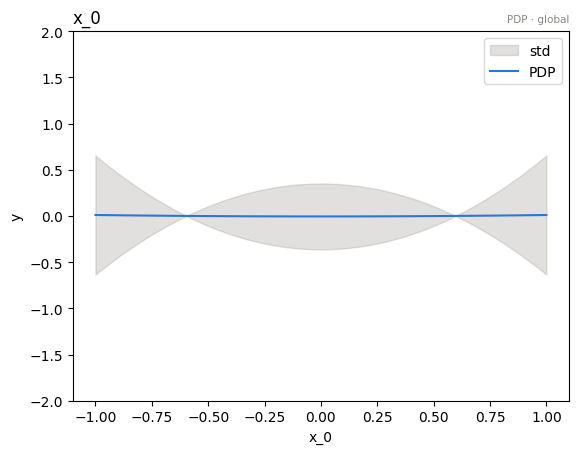
    


    
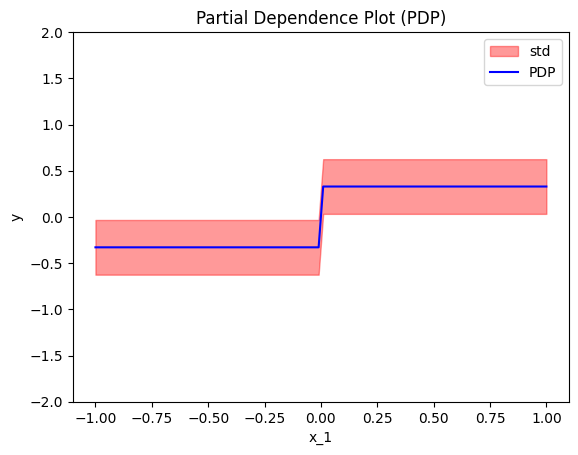
    


    
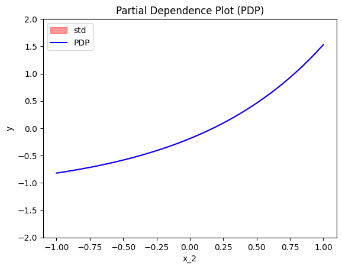
    


```python
for feature in [0, 1, 2]:
    pdp.plot(feature=feature, centering=True, heterogeneity="ice", y_limits=[-2, 2])
```


    
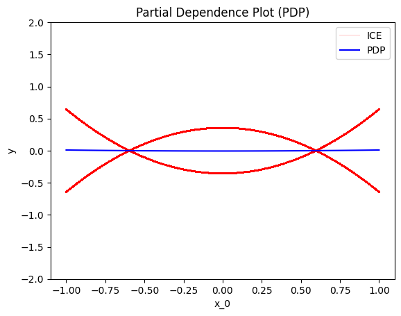
    


    
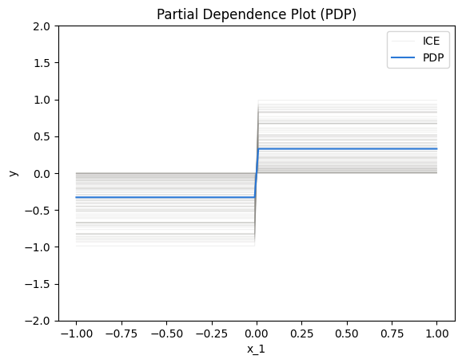
    


    

    


```python
pdp = effector.PDP(x, model.predict, axis_limits=dataset.axis_limits, nof_instances="all")
pdp.fit(features="all", centering=True)
heter_per_feat = []
for feature in [0, 1, 2]:
    y_var = pdp.eval_heter(feature=feature, xs=np.linspace(-1, 1, 100))
    print(f"Heterogeneity of x_{feature}: {y_var.mean():.3f}")
    heter_per_feat.append(y_var.mean())
```

    Heterogeneity of x_0: 0.094
    Heterogeneity of x_1: 0.088
    Heterogeneity of x_2: 0.000


### Importance & one-click report (new API)

`importances()` is the $\mu$-twin of the heterogeneity above: instead of the dispersion of the *local* effects, it summarises the dispersion of the *mean* effect per feature (how much signal each feature carries). We also call `effector.explain(...)`, which fits once, ranks features by importance, and returns a self-contained `Report`.


```python
# per-feature importance = dispersion of the mean effect (the mu-twin of the
# heterogeneity we studied above); x_1 and x_2 should rank equally, x_3 near zero.
print("PDP importances:", np.round(pdp.importances(), 3))

# one-click auto-explanation -> Report (serializable; self-contained HTML)
report = effector.explain(
    x,
    model.predict,
    method="pdp",
    schema={"feature_names": ["x1", "x2", "x3"]},
    nof_instances="all",
)
report.show()
```

    PDP importances: [0.005 0.329 0.686]


    
    PDP report — target: y
    ============================================================
    feature                   importance     heter  #regions
    ------------------------------------------------------------
    x3                            0.6851    0.0000         1
    x2                            0.3290    0.0876         7
    x1                            0.0050    0.1011         3
    ============================================================
    
    
    Feature 1 - Full partition tree:
    🌳 Full Tree Structure:
    ───────────────────────
    x2 🔹 [id: 0 | heter: 0.09 | inst: 10000 | w: 1.00]
        x1 ≤ 0.70 🔹 [id: 1 | heter: 0.07 | inst: 8521 | w: 0.85]
            x1 ≤ -0.60 🔹 [id: 2 | heter: 0.03 | inst: 1920 | w: 0.19]
            x1 > -0.60 🔹 [id: 3 | heter: 0.02 | inst: 6601 | w: 0.66]
        x1 > 0.70 🔹 [id: 4 | heter: 0.02 | inst: 1479 | w: 0.15]
            x1 ≤ 0.90 🔹 [id: 5 | heter: 0.01 | inst: 963 | w: 0.10]
            x1 > 0.90 🔹 [id: 6 | heter: 0.00 | inst: 516 | w: 0.05]
    --------------------------------------------------
    Feature 1 - Statistics per tree level:
    🌳 Tree Summary:
    ─────────────────
    Level 0🔹heter: 0.09
        Level 1🔹heter: 0.06 | 🔻0.03 (32.22%)
            Level 2🔹heter: 0.02 | 🔻0.04 (68.02%)
    
    
    
    
    Feature 0 - Full partition tree:
    🌳 Full Tree Structure:
    ───────────────────────
    x1 🔹 [id: 0 | heter: 0.10 | inst: 10000 | w: 1.00]
        x2 ≤ -0.00 🔹 [id: 1 | heter: 0.00 | inst: 4922 | w: 0.49]
        x2 > -0.00 🔹 [id: 2 | heter: 0.00 | inst: 5078 | w: 0.51]
    --------------------------------------------------
    Feature 0 - Statistics per tree level:
    🌳 Tree Summary:
    ─────────────────
    Level 0🔹heter: 0.10
        Level 1🔹heter: 0.00 | 🔻0.10 (100.00%)
    
    


Conclusions:

* The global effect of $x_1$ arises from heterogenous local effects, as $h(x_1) > 0$ for all $x_1$. The std margins (red area of height $\pm h(x_1)$ around the global effect) musleadingly suggest that the heterogeneity is minimized at $x_1 = \pm \frac{2}{3}$. ICE provide a clearer picture; they reveal two groups of effects, $-x_1^2 + c_1$ and $x_1^2 + c_2$. The heterogeneity as a scalar value is $H_{x_1} \approx 0.9$.
* Similar to $x_1$, the global effect of $x_2$ arises from heterogeneous local effects. However, unlike $x_1$, both std margins and ICE plots indicate a constant heterogeneity along all the axis, i.e., $h(x_2) \approx 0.9 \forall x_2$. ICE plots further show a smooth range of varying local effects around the global effect, without distinct groups. The heterogeneity as a scalar is $ H_{x_2} \approx 0.9 $, which is identical to $ H_{x_1} $. This is consistent, as heterogeneity measures the interaction between a feature and all other features. In this case, since only $ x_1 $ and $ x_2 $ interact, their heterogeneity values should be the same.
* $x_3$ shows no heteregeneity; all local effects align perfectly with the global effect.

### Derivations

How PDP (and effector) reached such hetergoneity functions?

For $x_1$:

The average effect is $f^{PDP}(x_1) = 0$. ICE plots are: $-x_1^2 + \frac{1}{3} $ when $x_2^i <0$ and $x_1^2 - \frac{1}{3} $ when $x_2^i \geq 0$. Due to the square, they both create the same deviation from the average effect: $ \left ( x_1^2 - \frac{1}{3} \right )^2 $.

\begin{align}
h(x_1) &= \frac{1}{N} \sum_i^N \left ( f^{ICE,i}_c(x_1) - f^{PDP}_c(x_1) \right )^2 \\
&= \frac{1}{N} \sum_i^N \left ( x_1^2 - \frac{1}{3} \right )^2 \\
&=  x_1^4 - \frac{2}{3} x_1^2 + \frac{1}{9} \\
\end{align}

The heterogeneity as a scalar is simply the mean of the heterogeneity function:

\begin{align}
H_{x_1} &= \frac{ \int_{-1}^{1} \left ( x_1^4 - \frac{2}{3} x_1^2 + \frac{1}{9} \right ) \partial x_1}{2} = \frac{4}{45} \approx 0.9
\end{align}

For $x_2$:

The average effect is $f^{PDP}(x_2) = -\frac{1}{3} \mathbb{1}_{x_2 < 0} + \frac{1}{3} \mathbb{1}_{x_2 \geq 0}$ and the ICE plots are $f^{ICE,i}(x_2) = - (x_1^i)^2 \mathbb{1}_{x_2 < 0} + (x_1^i)^2 \mathbb{1}_{x_2 \geq 0}$.

\begin{align}
h(x_2)  &= \frac{1}{N} \sum_i^N \left ( f^{ICE,i}_c(x_2) - f^{PDP}_c(x_2) \right )^2 \\
&= \frac{1}{N} \sum_i^N \left ( \mathbb{1}_{x_2 < 0} \left ( -\frac{1}{3} + (x_1^i)^2 \right )^2 + \mathbb{1}_{x_2 \geq 0} \left ( -\frac{1}{3} + (x_1^i)^2 \right )^2 \right ) \\
&= \frac{1}{N} \sum_i^N  \left ( -\frac{1}{3} + (x_1^i)^2 \right )^2 \\
&= \frac{4}{45} \approx 0.9
\end{align}

The heterogeneity as a scalar is simply the mean of the heterogeneity function, so:

$$H_{x_2} \approx 0.9$$.

For $x_3$, there is no heterogeneity so $h(x_3)=0$ and $H_{x_3} = 0$.

### Conclusions
PDP heterogeneity provides intuitive insights:

- The global effects of $x_1$ and $x_2$ arise from heterogeneous local effects, while $x_3$ shows no heterogeneity.
- The heterogeneity of $x_1$ and $x_2$ is quantified at the same level (0.99), which makes sense since only these two features interact.
- However, the heterogeneity of $x_1$ appears misleading when centering ICE plots, as it falsely suggests minimized heterogeneity at $\pm \frac{2}{3}$, which is not accurate.


```python
# The closed form below lives in `effector.benchmarks` — the SAME function the
# test suite asserts against (tests/test_functional_conditional_interaction.py),
# so this notebook and the tests can never disagree about the right answer.
pdp_ground_truth = bench.pdp_heter_gt
```


```python
# make a test
xx = np.linspace(-1, 1, 100)
for feature in [0, 1, 2]:
    pdp_mean = pdp.eval(feature=feature, xs=xx, centering=True)
    pdp_heter = pdp.eval_heter(feature=feature, xs=xx)
    y_heter = pdp_ground_truth(feature, xx)
    np.testing.assert_allclose(pdp_heter, y_heter, atol=1e-1)
```

## ALE

### Effector

Let's see below the PDP effects for each feature, using `effector`.


```python
ale = effector.ALE(x, model.predict, axis_limits=dataset.axis_limits)
ale.fit(features="all", centering=True, binning_method=effector.axis_partitioning.Fixed(nof_bins=31))

for feature in [0, 1, 2]:
    ale.plot(feature=feature, centering=True, heterogeneity=True, y_limits=[-2, 2])
```


    
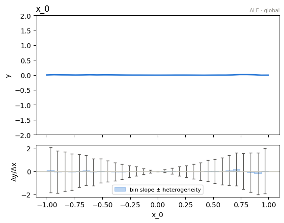
    


    
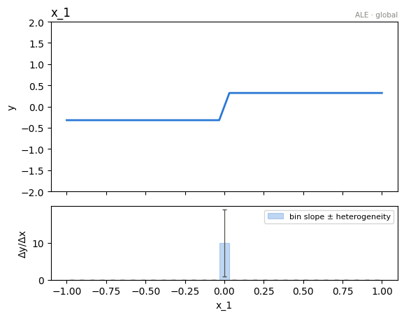
    


    
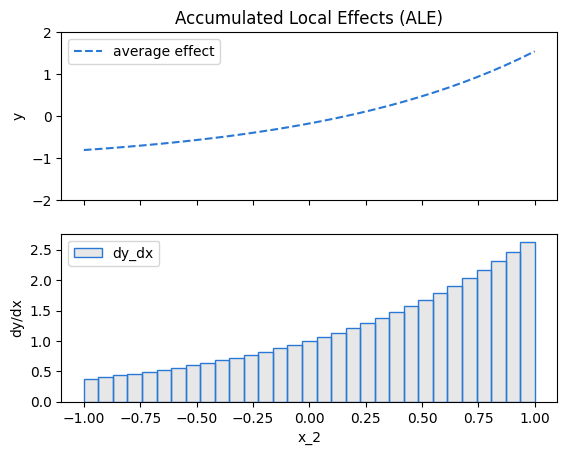
    


ALE states that:

- **Feature $x_1$**:  
  The heterogeneity varies across all values of $x_1$. It starts large at $x_1 = -1$, decreases until it becomes zero at $x_1 = 0$, and then increases again until $x_1 = 1$.  
  This behavior contrasts with the heterogeneity observed in the PDP, which has two zero-points at $x_1 = \pm \frac{2}{3}$.  

- **Feature $x_2$**:  
  Heterogeneity is observed only around $x_2 = 0$. This behavior also contrasts PDP's heterogeneity which is constant for all values of $x_2$

- **Feature $x_3$**:  
  No heterogeneity is present for this feature.  


### Derivations

For x_1:

The $x_1$-axis is divided into $K$ equal bins, indexed by $k = 1, \ldots, K$, with the center of the $k$-th bin denoted as $c_k$. 
In each bin: if $x_2 < 0$, the local effects is $-2c_k$, and if $x_2 \geq 0$ the local effect is $2 c_k$. 
This gives a variance of $4c_k^2$ within each bin.
Therefore, $h(x_1) = 4c_k^2$ where $k$ is the index of the bin that contains $x_1$. 

\begin{align}
h(x_1) &= \frac{1}{|\mathcal{S}_k|} \sum_{\mathbf{x}^i \in \mathcal{S}_k} \left ( \frac{f(z_k, x_2^i, x_3^i) - f(z_{k-1}, x_2^i, x_3^i)}{z_k - z_{k-1}} - \hat{\mu}_k^{ALE}  \right )^2 \\
&=  \frac{1}{|\mathcal{S}_k|} \sum_{\mathbf{x}^i \in \mathcal{S}_k} \left ( \frac{-2c_k(z_k - z_{k-1}) \mathbb{1}_{x_2^i < 0} + 2c_k(z_k - z_{k-1}) \mathbb{1}_{x_2^i \geq 0}}{z_k - z_{k-1}} \right )^2 \\
&=  \frac{1}{|\mathcal{S}_k|} \sum_{\mathbf{x}^i \in \mathcal{S}_k} 4 c_k^2 \\
&=  4 c_k^2
\end{align}

For $x_2$:

In all bins except the central one, the local effects are zero. In the central bin, however, the local effects are $ 2(x_1^i)^2 $, which introduces some heterogeneity.
So, if $ x_2 $ is not in the central bin $ k = K/2 $, $h(x_2) = 0$.
If $ x_2 $ is in the central bin $ k = K/2 $:

\begin{align}
h(x_2) &= \frac{1}{|\mathcal{S}_k|} \sum_{\mathbf{x}^i \in \mathcal{S}_k} \left( \frac{f(z_k, x_2^i, x_3^i) - f(z_{k-1}, x_2^i, x_3^i)}{z_k - z_{k-1}} - \hat{\mu}_k^{ALE} \right)^2 \\
&= \frac{2}{z_k - z_{k-1}} \frac{1}{|\mathcal{S}_k|} \sum_{\mathbf{x}^i \in \mathcal{S}_k} (x_1^i)^2 \\
&= \frac{2}{3}(z_k - z_{k-1}) \\
&\approx 10 \text{ for } K=31
\end{align}

So: 
\begin{align}
h(x_2)
&=  \begin{cases} 
0, & \text{if } x_2 \text{ is not in the central bin (}\ k = K/2\text{)}, \\
\frac{31}{3} \approx 10 & \text{if } x_2 \text{ is in the central bin (}\ k = K/2\text{)}. 
\end{cases} \\
\end{align}

For $x_3$:

The effect is zero everywehere.


```python
# The closed form below lives in `effector.benchmarks` — the SAME function the
# test suite asserts against (tests/test_functional_conditional_interaction.py),
# so this notebook and the tests can never disagree about the right answer.
ale_ground_truth = bench.ale_bin_variance_gt
```


```python
# make a test
K = 31
bin_centers = np.linspace(-1 + 1/K, 1 - 1/K, K)
for feature in [0, 1, 2]:
    bin_var = ale.payload(feature)["bin_variance"]
    gt_var = ale_ground_truth(feature)
    mask = ~np.isnan(gt_var)
    np.testing.assert_allclose(bin_var[mask], gt_var[mask], atol=1e-1)
```

### Conclusions

Is the heterogeneity implied by the ALE plots meaningful?
It is

## RHALE

### Effector

Let's see below the RHALE effects for each feature, using `effector`.


```python
rhale = effector.RHALE(x, model.predict, model.jacobian, axis_limits=dataset.axis_limits)
rhale.fit(features="all", centering=True, binning_method=effector.axis_partitioning.Fixed(nof_bins=31))

for feature in [0, 1, 2]:
    rhale.plot(feature=feature, centering=True, heterogeneity=True, y_limits=[-2, 2])
```


    
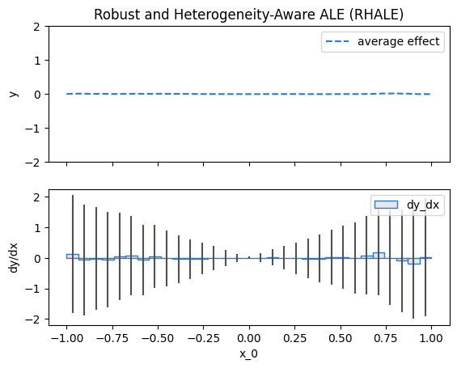
    


    
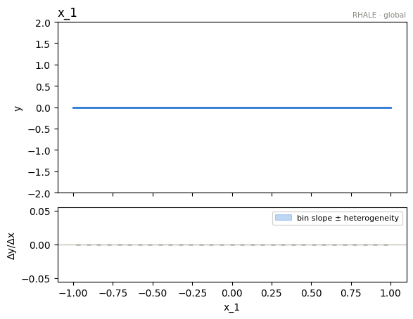
    


    
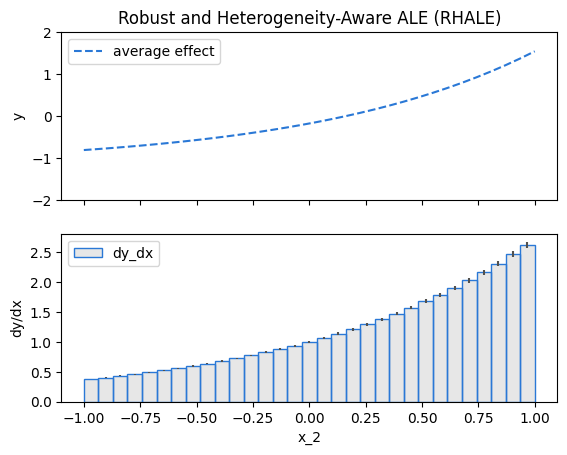
    


RHALE states that:

- **Feature $x_1$**:
  As in ALE, the heterogeneity varies across all values of $x_1$. It starts large at $x_1 = -1$, decreases until it becomes zero at $x_1 = 0$, and then increases again until $x_1 = 1$.  

- **Feature $x_2$**:  
  No heterogeneity is present for this feature.

- **Feature $x_3$**:  
  No heterogeneity is present for this feature.  


### Derivations

For $x_1$: within a bin centered at $c_k$, the derivatives are
$\frac{\partial f}{\partial x_1} = -2x_1 \mathbb{1}_{x_2<0} + 2x_1 \mathbb{1}_{x_2 \geq 0}$,
i.e. $\pm 2 x_1$ with equal probability, so their per-bin variance is

$$H_k(x_1) = \mathbb{E}[(\pm 2 c_k)^2] - \underbrace{\mathbb{E}[\pm 2 c_k]^2}_{=0} = 4 c_k^2.$$

For $x_2$: $\frac{\partial f}{\partial x_2} = 0$ almost everywhere, so every bin
has zero variance:

$$H_k(x_2) = 0.$$

Note the contrast with ALE: the ALE bin containing $x_2 = 0$ shows a large
variance spike (the finite differences straddle the jump), while the derivative
never sees the jump at all.

For $x_3$: $\frac{\partial f}{\partial x_3} = e^{x_3}$ is deterministic — all
instances in a bin have (nearly) the same derivative, so

$$H_k(x_3) \approx 0.$$

### Tests


```python
# make a test
for feature in [0, 1, 2]:
    bin_var = rhale.payload(feature)["bin_variance"]
    gt_var = bench.rhale_bin_variance_gt(feature)
    np.testing.assert_allclose(bin_var, gt_var, atol=1e-1)
```

### Conclusions

RHALE agrees with ALE on where the heterogeneity is ($x_1$) and where it is not
($x_3$), and it is *cleaner* on $x_2$: the ALE spike at the jump bin is an
artifact of finite differences straddling the discontinuity, whereas the
derivative-based RHALE correctly reports zero heterogeneity everywhere.
