# Model with conditional interaction

- Author: [givasile](https://givasile.github.io/)
- Runtime: ~5 s
- Description: Global effects (PDP, ALE, RHALE) on a model whose three-way
  conditional interaction defines four regions; the estimates are derived
  analytically and tested against `effector.benchmarks`.

In this example, we show global effects of a model with conditional interactions using PDP, ALE, and RHALE.
In particular, we:

1. show how to use `effector` to estimate the global effects using PDP, ALE, and RHALE
2. provide the analytical formulas for the global effects
3. test that (1) and (2) match

We will use the following model:

$$
f(x_1, x_2, x_3, x_4) = 
\begin{cases} 
-x_1^2 & \text{if } x_2 < 0 \text{ and } x_3 < 0, \\ 
x_1^2 & \text{if } x_2 < 0 \text{ and } x_3 \geq 0, \\ 
-x_1^4 & \text{if } x_2 \geq 0 \text{ and } x_3 < 0, \\ 
x_1^4 & \text{if } x_2 \geq 0 \text{ and } x_3 \geq 0 
\end{cases} 
+ e^{x_4}.
$$

Here, the features $x_1$, $x_2$, $x_3$, $x_4$ are independent and uniformly distributed in the interval $[-1, 1]$.

The model exhibits _interactions_ between $x_1$, $x_2$, and $x_3$, caused by the piecewise terms. 

This means the effect of $x_1$ on the output $y$ depends on the values of both $x_2$ and $x_3$, and vice versa. These interactions make it challenging to isolate the individual contributions of $x_1$, $x_2$, and $x_3$. Each global effect method has a different strategy to handle such multi-way interactions.

On the other hand, $x_4$ does not interact with any other feature, so its effect can be easily computed as $e^{x_4}$.

Below, we will see how methods like PDP, ALE, and RHALE handle these interactions and compute feature effects in this updated model.


```python
import numpy as np
import matplotlib.pyplot as plt
import effector

np.random.seed(21)

bench = effector.benchmarks.ConditionalInteraction4RegionsUniform()
model = bench.model
dataset = bench.dataset
x = bench.generate_data(1000)
```

## PDP

### Effector

Let's see below the PDP effects for each feature, using `effector`.


```python
pdp = effector.PDP(x, model.predict, axis_limits=dataset.axis_limits)
pdp.fit(features="all", centering=True)
for feature in [0, 1, 2, 3]:
    pdp.plot(feature=feature, centering=True, y_limits=[-2, 2], heterogeneity=False)
```


    
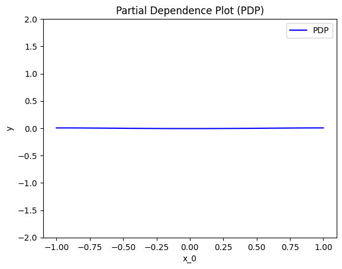
    


    
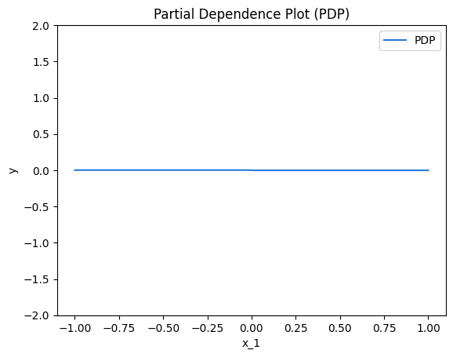
    


    
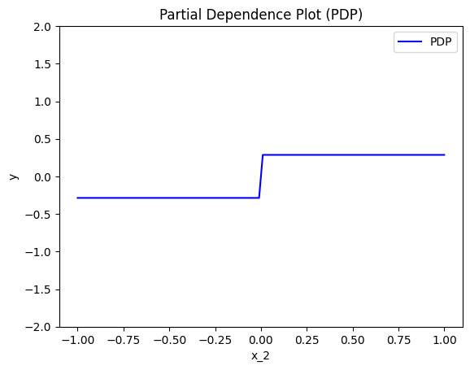
    


    
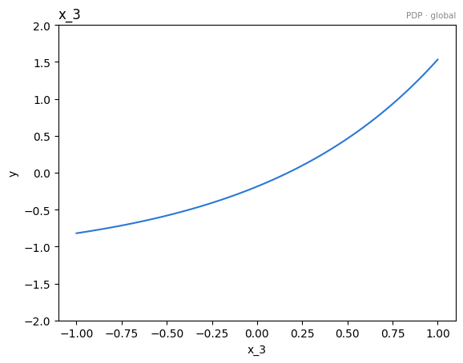
    


PDP states that:

$x_1$ has a zero average effect on the model output because the symmetric contributions of its positive and negative terms cancel each other out.

$x_2$ has a constant effect close to zero for both $x_2 < 0$ and $x_2 \geq 0$. There is no significant change in $y$ when moving between $x_2^-$ and $x_2^+$, as the average effects cancel out.

$x_3$ has a stepwise effect on the model output:  
- For $x_3 < 0$, the average contribution is $-\frac{4}{15}$.  
- For $x_3 \geq 0$, the average contribution is $+\frac{4}{15}$.  

$x_4$ has an effect of $e^{x_4}$


### Derivations

How PDP leads to these explanations? Are they meaningfull? Let's have some analytical derivations.
If you don't care about the derivations, skip the following three cells and go directly to the coclusions.

For $x_1$:

$$
\begin{align}
PDP(x_1) &\propto \frac{1}{N} \sum_{i=1}^{N} f(x_1, \mathbf{x}^i_{/1}) \\
&\propto \frac{1}{N} \sum_{i=1}^{N} \Big( -x_1^2 \mathbb{1}_{x_2^i < 0 \land x_3^i < 0} 
+ x_1^2 \mathbb{1}_{x_2^i < 0 \land x_3^i \geq 0} \\
&\quad -x_1^4 \mathbb{1}_{x_2^i \geq 0 \land x_3^i < 0} 
+ x_1^4 \mathbb{1}_{x_2^i \geq 0 \land x_3^i \geq 0} + e^{x_4^i} \Big) \\
&\propto \frac{1}{N} \Big( x_1^2 \sum_{i=1}^{N} \big( -\mathbb{1}_{x_2^i < 0 \land x_3^i < 0} 
+ \mathbb{1}_{x_2^i < 0 \land x_3^i \geq 0} \big) \\
&\quad + x_1^4 \sum_{i=1}^{N} \big( -\mathbb{1}_{x_2^i \geq 0 \land x_3^i < 0} 
+ \mathbb{1}_{x_2^i \geq 0 \land x_3^i \geq 0} \big) 
+ \sum_{i=1}^{N} e^{x_4^i} \Big) \\
&\approx c
\end{align}
$$


For $x_2$:

$$
PDP(x_2) \propto \frac{1}{N} \sum_{i=1}^N f(\mathbf{x}_{/2}^i, x_2),
$$

Taking the expectation over $x_1, x_3, x_4$, we find:

1. For $x_2 < 0$:

$$
PDP(x_2 < 0) \propto 0.5 \cdot \mathbb{E}[-x_1^2] + 0.5 \cdot \mathbb{E}[x_1^2] \approx 0,
$$


2. For $x_2 \geq 0$:

$$
PDP(x_2 \geq 0) \propto 0.5 \cdot \mathbb{E}[-x_1^4] + 0.5 \cdot \mathbb{E}[x_1^4] \approx 0,
$$


Thus:

$$
PDP(x_2) \approx c.
$$


For $x_3$:

$$
PDP(x_3) \propto \frac{1}{N} \sum_{i=1}^N f(\mathbf{x}_{/3}^i, x_3),
$$

Taking the expectation over $x_1, x_2, x_4$, we find:

1. For $x_3 < 0$:

$$
PDP(x_3 < 0) \propto 0.5 \cdot \mathbb{E}[-x_1^2] + 0.5 \cdot \mathbb{E}[-x_1^4],
$$

$$
PDP(x_3 < 0) \propto -\frac{4}{15}.
$$

2. For $x_3 \geq 0$:

$$
PDP(x_3 \geq 0) \propto 0.5 \cdot \mathbb{E}[x_1^2] + 0.5 \cdot \mathbb{E}[x_1^4],
$$

$$
PDP(x_3 \geq 0) \propto \frac{4}{15}.
$$

Thus, the global PDP for $x_3$ is a step function:

$$
PDP(x_3) = 
\begin{cases} 
-\frac{4}{15} & \text{if } x_3 < 0, \\ 
\frac{4}{15} & \text{if } x_3 \geq 0.
\end{cases}
$$


For $x_4$:

\begin{align}
PDP(x_4) &\propto \frac{1}{N} \sum_{i=1}^{n} f(x_4, x_{/4}^i) \\
&\propto e^{x_4} + c\\
\end{align}

### Conclusions

Are the PDP effects intuitive?

- For $x_1$:  
  The effect is zero. The terms related to $x_1$ are $-x_1^2 \mathbb{1}_{x_3 < 0} + x_1^2 \mathbb{1}_{x_3 \geq 0}$ when $x_2 < 0$, and $-x_1^4 \mathbb{1}_{x_3 < 0} + x_1^4 \mathbb{1}_{x_3 \geq 0}$ when $x_2 \geq 0$. Since $x_2, x_3 \sim \mathcal{U}(-1,1)$, the symmetric distribution of these variables ensures that, on average, the positive and negative contributions of $x_1$ cancel out.

- For $x_2$:  
  The effect is constant and close to zero for both $x_2 < 0$ and $x_2 \geq 0$. The terms involving $x_2$ are $-x_1^2 \mathbb{1}_{x_3 < 0} + x_1^2 \mathbb{1}_{x_3 \geq 0}$ for $x_2 < 0$, and $-x_1^4 \mathbb{1}_{x_3 < 0} + x_1^4 \mathbb{1}_{x_3 \geq 0}$ for $x_2 \geq 0$. These terms cancel on average due to the uniform distribution of $x_1$ and $x_3$. 

- For $x_3$:  
  The effect is stepwise:  
  - For $x_3 < 0$, the terms $-x_1^2 \mathbb{1}_{x_2 < 0} - x_1^4 \mathbb{1}_{x_2 \geq 0}$ contribute an average of $-\frac{4}{15}$.  
  - For $x_3 \geq 0$, the terms $x_1^2 \mathbb{1}_{x_2 < 0} + x_1^4 \mathbb{1}_{x_2 \geq 0}$ contribute an average of $+\frac{4}{15}$.  

- For $x_4$:  
  The effect is $e^{x_4}$, as expected, since the $e^{x_4}$ term is independent of other variables and directly contributes to the output.


```python
# The closed form below lives in `effector.benchmarks` — the SAME function the
# test suite asserts against (tests/test_functional_four_regions.py),
# so this notebook and the tests can never disagree about the right answer.
pdp_ground_truth = bench.pdp_gt
```


```python
xx = np.linspace(-1, 1, 100)
y_pdp = []
for feature in [0, 1, 2, 3]:
    y_pdp.append(pdp_ground_truth(feature, xx))

plt.figure()
plt.title("PDP effects (ground truth)")
color_pallette = ["blue", "red", "green", "black"]
feature_labels = ["Feature x1", "Feature x2", "Feature x3", "Feature x4"]
for feature in [0, 1, 2, 3]:
    plt.plot(
        xx, 
        y_pdp[feature], 
        color=color_pallette[feature], 
        linestyle="--" if feature !=0 else "-",
        label=feature_labels[feature]
    )
plt.legend()
plt.xlim([-1.1, 1.1])
plt.ylim([-2, 2])
plt.xlabel("Feature Value")
plt.ylabel("PDP Effect")
plt.show()
```


    

    


```python
# make a test
xx = np.linspace(-1, 1, 100)
for feature in [0, 1, 2, 3]:
    y_pdp = pdp.eval(feature=feature, xs=xx, centering=True)
    y_gt = pdp_ground_truth(feature, xx)
    np.testing.assert_allclose(y_pdp, y_gt, atol=1e-1)
```

## ALE

### Effector

Let's see below the PDP effects for each feature, using `effector`.


```python
ale = effector.ALE(x, model.predict, axis_limits=dataset.axis_limits)
ale.fit(features="all", centering=True, binning_method=effector.axis_partitioning.Fixed(nof_bins=31))

for feature in [0, 1, 2, 3]:
    ale.plot(feature=feature, centering=True, y_limits=[-2, 2], heterogeneity=False)
```


    
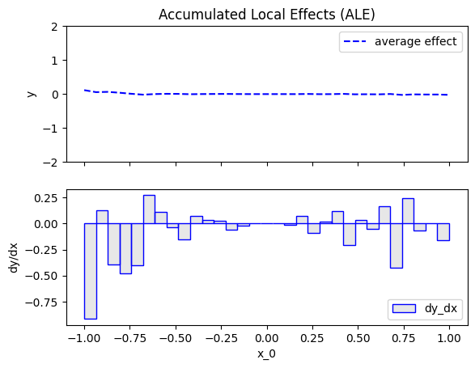
    


    
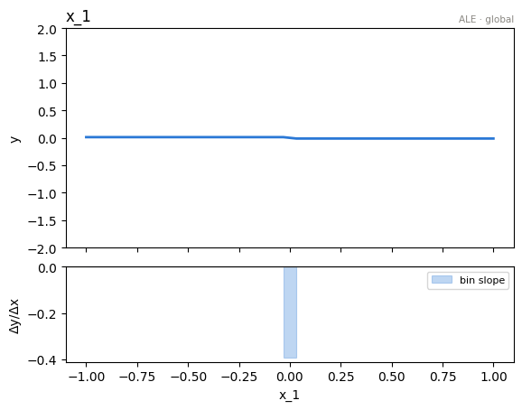
    


    
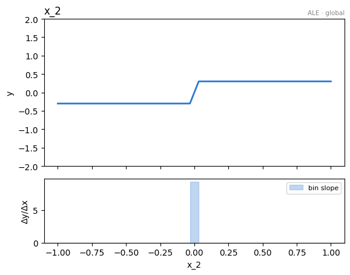
    


    
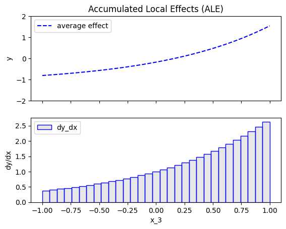
    


ALE states that:


### Derivations

For $x_1$:

$$
\begin{align}
ALE(x_1) &\propto \sum_{k=1}^{k_{x_1}} \frac{1}{| \mathcal{S}_k |} \sum_{i: x^{(i)} \in \mathcal{S}_k} \left[ f(z_k, x_2^i, x_3^i, x_4^i) - f(z_{k-1}, x_2^i, x_3^i, x_4^i) \right] \\
&\propto \sum_{k=1}^{k_{x_1}} \frac{1}{| \mathcal{S}_k |} \sum_{i: x^{(i)} \in \mathcal{S}_k} \Big[ 
(-z_k^2 \mathbb{1}_{x_2^i < 0 \land x_3^i < 0} + z_k^2 \mathbb{1}_{x_2^i < 0 \land x_3^i \geq 0} \\
&\quad - z_k^4 \mathbb{1}_{x_2^i \geq 0 \land x_3^i < 0} + z_k^4 \mathbb{1}_{x_2^i \geq 0 \land x_3^i \geq 0} + e^{x_4^i}) \\
&\quad - \big( -z_{k-1}^2 \mathbb{1}_{x_2^i < 0 \land x_3^i < 0} + z_{k-1}^2 \mathbb{1}_{x_2^i < 0 \land x_3^i \geq 0} \\
&\quad - z_{k-1}^4 \mathbb{1}_{x_2^i \geq 0 \land x_3^i < 0} + z_{k-1}^4 \mathbb{1}_{x_2^i \geq 0 \land x_3^i \geq 0} + e^{x_4^i}) \Big] \\
&\propto \sum_{k=1}^{k_{x_1}} \frac{1}{| \mathcal{S}_k |} \sum_{i: x^{(i)} \in \mathcal{S}_k} \Big[ 
- z_k^2 (\mathbb{1}_{x_2^i < 0 \land x_3^i < 0} - \mathbb{1}_{x_2^i < 0 \land x_3^i \geq 0}) \\
&\quad + z_k^4 (\mathbb{1}_{x_2^i \geq 0 \land x_3^i \geq 0} - \mathbb{1}_{x_2^i \geq 0 \land x_3^i < 0}) \\
&\quad + z_{k-1}^2 (\mathbb{1}_{x_2^i < 0 \land x_3^i < 0} - \mathbb{1}_{x_2^i < 0 \land x_3^i \geq 0}) \\
&\quad - z_{k-1}^4 (\mathbb{1}_{x_2^i \geq 0 \land x_3^i \geq 0} - \mathbb{1}_{x_2^i \geq 0 \land x_3^i < 0}) \Big] \\
&\propto \sum_{k=1}^{k_{x_1}} \frac{1}{| \mathcal{S}_k |} \sum_{i: x^{(i)} \in \mathcal{S}_k} \Big[ 0 \Big] \\
&\approx 0.
\end{align}
$$


For $x_2$:

$$
\begin{align}
ALE(x_2) &\propto \sum_{k=1}^{k_{x_2}} \frac{1}{| \mathcal{S}_k |} \sum_{i: x^{(i)} \in \mathcal{S}_k} \left[ f(x^i_1, z_k, x^i_3, x^i_4) - f(x^i_1, z_{k-1}, x^i_3, x^i_4) \right] \\
&\propto \sum_{k=1}^{k_{x_2}} \frac{1}{| \mathcal{S}_k |} \sum_{i: x^{(i)} \in \mathcal{S}_k} \Big[ (-x_1^2 \mathbb{1}_{z_k < 0} + x_1^2 \mathbb{1}_{z_k \geq 0} + e^{x_4^i}) \\
&\quad - (-x_1^2 \mathbb{1}_{z_{k-1} < 0} + x_1^2 \mathbb{1}_{z_{k-1} \geq 0} + e^{x_4^i}) \Big] \\
&\propto \sum_{k=1}^{k_{x_2}} \frac{1}{| \mathcal{S}_k |} \sum_{i: x^{(i)} \in \mathcal{S}_k} \Big[ -x_1^2 (\mathbb{1}_{z_k < 0} - \mathbb{1}_{z_{k-1} < 0}) 
+ x_1^2 (\mathbb{1}_{z_k \geq 0} - \mathbb{1}_{z_{k-1} \geq 0}) \Big] \\
&\propto \sum_{k=1}^{k_{x_2}} \frac{1}{| \mathcal{S}_k |} \sum_{i: x^{(i)} \in \mathcal{S}_k} \Big[ -x_1^2 \underbrace{(\mathbb{1}_{z_k < 0} - \mathbb{1}_{z_{k-1} < 0})}_{\approx 0} 
+ x_1^2 \underbrace{(\mathbb{1}_{z_k \geq 0} - \mathbb{1}_{z_{k-1} \geq 0})}_{\approx 0} \Big] \\
&\approx \sum_{k=1}^{k_{x_2}} \frac{1}{| \mathcal{S}_k |} \sum_{i: x^{(i)} \in \mathcal{S}_k} 0 \\
&\approx 0.
\end{align}
$$


For $x_3$:

\begin{align}
ALE(x_3) &\propto \sum_{k=1}^{k_{x_3}} \frac{1}{| \mathcal{S}_k |} \sum_{i: x^{(i)} \in \mathcal{S}_k} \left[ f(x_1^i, x_2^i, z_k, x_4^i) - f(x_1^i, x_2^i, z_{k-1}, x_4^i) \right] \\
&= \sum_{k=1}^{k_{x_3}} \frac{1}{| \mathcal{S}_k |} \bigg[ \sum_{i: x^{(i)} \in \mathcal{S}_k, x_2^i < 0} -{x_1^i}^2 \mathbb{1}_{z_k < 0} + {x_1^i}^2 \mathbb{1}_{z_k \geq 0} + {x_1^i}^2 \mathbb{1}_{z_{k-1} < 0} - {x_1^i}^2 \mathbb{1}_{z_{k-1} \geq 0} \\
&\quad + \sum_{i: x^{(i)} \in \mathcal{S}_k, x_2^i \geq 0} -{x_1^i}^4 \mathbb{1}_{z_k < 0} + {x_1^i}^4 \mathbb{1}_{z_k \geq 0} + {x_1^i}^4 \mathbb{1}_{z_{k-1} < 0} - {x_1^i}^4 \mathbb{1}_{z_{k-1} \geq 0} \bigg]
\end{align}

In the inner expression, if $z_k, z_{k-1}$ are both positive or both negative, then it can be seen that the corresponding terms cancel each other out, thus the contribution to the outer sum is 0. Only when $z_k > 0 > z_{k-1}$ is the inner expression nonzero, and specifically equal to:

\begin{align}
& \frac{1}{| \mathcal{S}_k |} \left[ \sum_{i: x^{(i)} \in \mathcal{S}_k, x_2^i < 0} {x_1^i}^2 + {x_1^i}^2 
+ \sum_{i: x^{(i)} \in \mathcal{S}_k, x_2^i \geq 0} {x_1^i}^4 + {x_1^i}^4 \right] \\
\approx \ & 2 \mathbb{E}[ x_1^2 \mathbb{1}_{x_2 < 0} + x_1^4 \mathbb{1}_{x_2 \geq 0} ] \\
= \ & 2 (\frac{1}{2} \mathbb{E}[x_1^2] + \frac{1}{2} \mathbb{E}[x_1^4]) = \frac{8}{15}
\end{align}

So:
\begin{equation}
ALE(x_3) \propto
\begin{cases}
c & x_3 < 0 \\
c + \frac{8}{15} & x_3 \geq 0
\end{cases}
\end{equation}

For $x_4$:

\begin{align}
ALE(x_4) &\propto \sum_{k=1}^{k_{x_4}} \frac{1}{| \mathcal{S}_k |} \sum_{i: x^{(i)} \in \mathcal{S}_k} \left[ f(x_i^1, x_i^2, x_i^3, z_k) - f(x_i^1, x_i^2, x_i^3, z_{k-1}) \right] \\
&\propto \sum_{k=1}^{k_{x_4}} \frac{1}{| \mathcal{S}_k |} \sum_{i: x^{(i)} \in \mathcal{S}_k} \left[ e^{z_k} - e^{z_{k-1}} \right] \\
&\approx e^{x_3}
\end{align}


```python
# The closed form below lives in `effector.benchmarks` — the SAME function the
# test suite asserts against (tests/test_functional_four_regions.py),
# so this notebook and the tests can never disagree about the right answer.
ale_ground_truth = bench.ale_gt
```


```python
xx = np.linspace(-1, 1, 100)
y_ale = []
for feature in [0, 1, 2, 3]:
    y_ale.append(ale_ground_truth(feature, xx))
    
plt.figure()
plt.title("ALE effects (ground truth)")
color_pallette = ["blue", "red", "green", "black"]
feature_labels = ["Feature x1", "Feature x2", "Feature x3", "Feature x4"]
for feature in [0, 1, 2, 3]:
    plt.plot(
        xx, 
        y_ale[feature], 
        color=color_pallette[feature], 
        linestyle="--" if feature !=0 else "-",
        label=feature_labels[feature]
    )
plt.legend()
plt.xlim([-1.1, 1.1])
plt.ylim([-2, 2])
plt.xlabel("Feature Value")
plt.ylabel("ALE Effect")
plt.show()
```


    
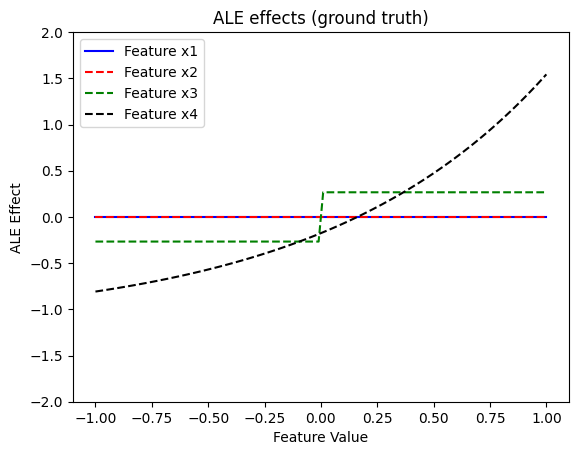
    


```python
xx = np.linspace(-1, 1, 100)
# atol per feature, mirroring tests/test_functional_four_regions.py: x1's ALE is
# 0 only in expectation — its finite-difference bin means carry O(1/sqrt(N))
# sampling noise (~0.11 at N=1000)
atols = {0: 1.5e-1, 1: 1e-1, 2: 1e-1, 3: 1e-1}
for feature in [0, 1, 2, 3]:
    y_ale = ale.eval(feature=feature, xs=xx, centering=True)
    y_gt = ale_ground_truth(feature, xx)

    # mask the bin containing the discontinuity of x3's step effect: inside it
    # the binned estimate interpolates the jump — an artifact, not an error
    if feature == 2:
        K = 31
        ind = np.logical_and(xx > -1/K, xx < 1/K)
        y_ale[ind] = 0
        y_gt[ind] = 0

    np.testing.assert_allclose(y_ale, y_gt, atol=atols[feature])
```

### Conclusions

Are the ALE effects intuitive?

ALE effects are identical to PDP effects which, as discussed above, can be considered intutive.

## RHALE

### Effector

Let's see below the RHALE effects for each feature, using `effector`.


```python
rhale = effector.RHALE(x, model.predict, model.jacobian, axis_limits=dataset.axis_limits)
rhale.fit(features="all", centering=True, binning_method=effector.axis_partitioning.Fixed(nof_bins=31))

for feature in [0, 1, 2, 3]:
    rhale.plot(feature=feature, centering=True, y_limits=[-2, 2], heterogeneity=False)
```


    
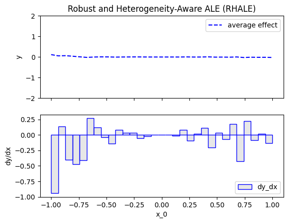
    


    

    


    
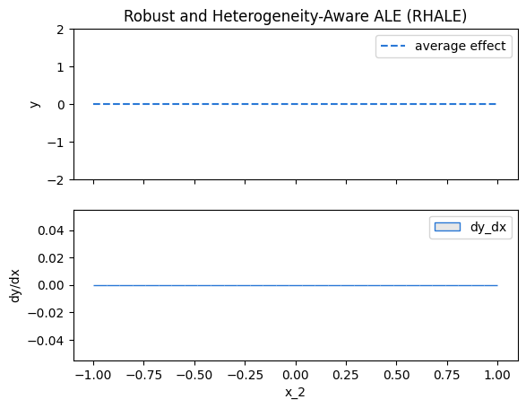
    


    
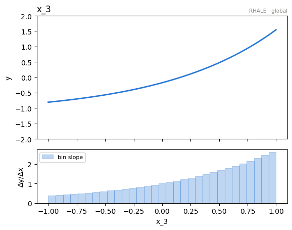
    


RHALE states that:


### Derivations

For $x_1$:

$$
\begin{align}
RHALE(x_1) &= \sum_{k=1}^{k_{x_1}} (z_k - z_{k-1}) \frac{1}{| \mathcal{S}_k |} \sum_{i: x^{(i)} \in \mathcal{S}_k} \left[ \frac{\partial f}{\partial x_1}(x_1, x_{-1}^{(i)}) \right] \\
&= \sum_{k=1}^{k_{x_1}} (z_k - z_{k-1}) \frac{1}{| \mathcal{S}_k |} \sum_{i: x^{(i)} \in \mathcal{S}_k} 
\left[ - 2 x_1 \mathbb{1}_{x_2^i, x_3^i < 0} + 2 x_1 \mathbb{1}_{x_2^i < 0, x_3^i \geq 0} - 4 {x_1}^3 \mathbb{1}_{x_2^i \geq 0, x_3^i < 0} + 4 {x_1}^3 \mathbb{1}_{x_2^i \geq 0, x_3^i \geq 0} \right] \\
&\approx \sum_{k=1}^{k_{x_1}} (z_k - z_{k-1}) \mathbb{E}_{X_2, X_3} \left[ - 2 x_1 \mathbb{1}_{X_2, X_3 < 0} + 2 x_1 \mathbb{1}_{X_2 < 0, X_3 \geq 0} - 4 {x_1}^3 \mathbb{1}_{X_2 \geq 0, X_3 < 0} + 4 {x_1}^3 \mathbb{1}_{X_2 \geq 0, X_3 \geq 0} \right] \\
&= 0
\end{align}
$$

since the variables are distributed uniformly in $[-1, 1]$.

For $x_2$:

$$
\begin{align}
RHALE(x_2) &= \sum_{k=1}^{k_{x_2}} (z_k - z_{k-1}) \frac{1}{| \mathcal{S}_k |} \sum_{i: x^{(i)} \in \mathcal{S}_k} \left[ \frac{\partial f}{\partial x_2}(x_2, x_{-2}^{(i)}) \right] \\
&\approx 0
\end{align}
$$

For $x_3$:

$$
\begin{align}
RHALE(x_3) &= \sum_{k=1}^{k_{x_3}} (z_k - z_{k-1}) \frac{1}{| \mathcal{S}_k |} \sum_{i: x^{(i)} \in \mathcal{S}_k} \left[ \frac{\partial f}{\partial x_3}(x_3, x_{-3}^{(i)}) \right] \\
&\approx 0
\end{align}
$$

For $x_4$:

$$
\begin{align}
RHALE(x_4) &= \sum_{k=1}^{k_{x_4}} (z_k - z_{k-1}) \frac{1}{| \mathcal{S}_k |} \sum_{i: x^{(i)} \in \mathcal{S}_k} \left[ \frac{\partial f}{\partial x_4}(x_4, x_{-4}^{(i)}) \right] \\
&= \sum_{k=1}^{k_{x_4}} (z_k - z_{k-1}) \frac{1}{| \mathcal{S}_k |} \sum_{i: x^{(i)} \in \mathcal{S}_k} \left[ e^{x_4} \right] \\
&\approx e^{x_4}
\end{align}
$$


```python
# The closed form below lives in `effector.benchmarks` — the SAME function the
# test suite asserts against (tests/test_functional_four_regions.py),
# so this notebook and the tests can never disagree about the right answer.
rhale_ground_truth = bench.rhale_gt
```


```python
xx = np.linspace(-1, 1, 100)
y_rhale = []
for feature in [0, 1, 2, 3]:
    y_rhale.append(rhale_ground_truth(feature, xx))
    
plt.figure()
plt.title("RHALE effects (ground truth)")
color_pallette = ["blue", "red", "green", "black"]
feature_labels = ["Feature x1", "Feature x2", "Feature x3", "Feature x4"]
for feature in [0, 1, 2, 3]:
    plt.plot(
        xx, 
        y_rhale[feature], 
        color=color_pallette[feature], 
        linestyle="-" if feature in [0,1] else "--",
        linewidth=6 if feature == 0 else 3,
        label=feature_labels[feature]
    )
plt.legend()
plt.xlim([-1.1, 1.1])
plt.ylim([-2, 2])
plt.xlabel("Feature Value")
plt.ylabel("RHALE Effect")
plt.show()


```


    
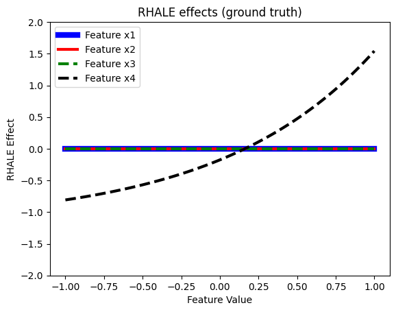
    


```python
# atol per feature: x1's RHALE is 0 only in expectation — the per-bin means of
# +-2x / +-4x^3 carry O(1/sqrt(N)) sampling noise that accumulates through the
# integration (~0.11 at N=1000, shrinking ~1/sqrt(N)). The other features'
# ground truths are deterministic and stay tight.
atols = {0: 1.5e-1, 1: 1e-2, 2: 1e-2, 3: 1e-2}
for feature in [0, 1, 2, 3]:
    y_rhale = rhale.eval(feature=feature, xs=xx, centering=True)
    y_gt = rhale_ground_truth(feature, xx)
    np.testing.assert_allclose(y_rhale, y_gt, atol=atols[feature])
```

### Conclusions

Are the RHALE effects intuitive?

Yes, we could safely say that they are intuitive. All are the same as in the previous methods (which we already discussed), the only exception being $x_3$, for which the RHALE is now flat, instead of having a step at 0 like before. This can be explained, since RHALE plots work with the derivatives and all derivatives with respect to $x_3$ are zero, provided we do not evaluate them at exactly 0, which we probably do not.

## Feature importance and one-click explanation

Beyond the per-feature effect curves, `effector` exposes two convenience layers on top of
the same global effects:

- `fx.importances()` returns a per-feature importance score — the dispersion of the mean
  effect (the $\mu$-twin of heterogeneity). Here $x_3$ (the stepwise feature) and $x_4$
  (the $e^{x_4}$ term) should score highest, while $x_1$ and $x_2$ are near zero.
- `effector.explain(...)` runs the whole pipeline and returns a serializable `Report` with a
  self-contained HTML rendering.


```python
# per-feature importance = dispersion of the mean effect (mu-twin of heterogeneity)
print("importances:", np.round(pdp.importances(), 3))

# one-click auto-explanation -> Report (serializable; self-contained HTML)
report = effector.explain(x, model.predict, method="pdp", nof_instances="all")
report.show()
```

    importances: [0.004 0.002 0.282 0.65 ]
    [effector] global effects reproduce 84.9% of the model's variance; with subregions, 99.8%
    
    PDP report — target: y
    ============================================================
    feature                   importance     heter  #regions
    ------------------------------------------------------------
    x_3                           0.6500    0.0000         1
    x_2                           0.2817    0.2993         7
    x_0                           0.0043    0.2927         7
    x_1                           0.0015    0.0808         1
    ============================================================
    global effects reproduce 84.9% of the model's variance; with subregions, 99.8%
      splitting x_2 (on x_0) recovers +10.0 pts
      splitting x_0 (on x_1, x_2) recovers +14.9 pts
    
    
    Feature 2 - Full partition tree:
    🌳 Full Tree Structure:
    ───────────────────────
    x_2 🔹 [id: 0 | heter: 0.30 | inst: 1000 | w: 1.00]
        x_0 < -0.80 🔹 [id: 1 | heter: 0.15 | inst: 112 | w: 0.11]
            x_0 < -0.90 🔹 [id: 2 | heter: 0.10 | inst: 58 | w: 0.06]
            -0.90 ≤ x_0 < -0.80 🔹 [id: 3 | heter: 0.11 | inst: 54 | w: 0.05]
        x_0 ≥ -0.80 🔹 [id: 4 | heter: 0.26 | inst: 888 | w: 0.89]
            -0.80 ≤ x_0 < 0.70 🔹 [id: 5 | heter: 0.16 | inst: 728 | w: 0.73]
            x_0 ≥ 0.70 🔹 [id: 6 | heter: 0.21 | inst: 160 | w: 0.16]
    --------------------------------------------------
    Feature 2 - Statistics per tree level:
    🌳 Tree Summary:
    ─────────────────
    Level 0🔹heter: 0.30
        Level 1🔹heter: 0.25 | 🔻0.05 (17.76%)
            Level 2🔹heter: 0.16 | 🔻0.08 (33.07%)
    
    
    
    
    Feature 0 - Full partition tree:
    🌳 Full Tree Structure:
    ───────────────────────
    x_0 🔹 [id: 0 | heter: 0.29 | inst: 1000 | w: 1.00]
        x_2 < -0.00 🔹 [id: 1 | heter: 0.05 | inst: 494 | w: 0.49]
            x_1 < -0.00 🔹 [id: 2 | heter: 0.00 | inst: 243 | w: 0.24]
            x_1 ≥ -0.00 🔹 [id: 3 | heter: 0.00 | inst: 251 | w: 0.25]
        x_2 ≥ -0.00 🔹 [id: 4 | heter: 0.05 | inst: 506 | w: 0.51]
            x_1 < -0.00 🔹 [id: 5 | heter: 0.00 | inst: 268 | w: 0.27]
            x_1 ≥ -0.00 🔹 [id: 6 | heter: 0.00 | inst: 238 | w: 0.24]
    --------------------------------------------------
    Feature 0 - Statistics per tree level:
    🌳 Tree Summary:
    ─────────────────
    Level 0🔹heter: 0.29
        Level 1🔹heter: 0.05 | 🔻0.25 (84.50%)
            Level 2🔹heter: 0.00 | 🔻0.05 (100.00%)
    
    

