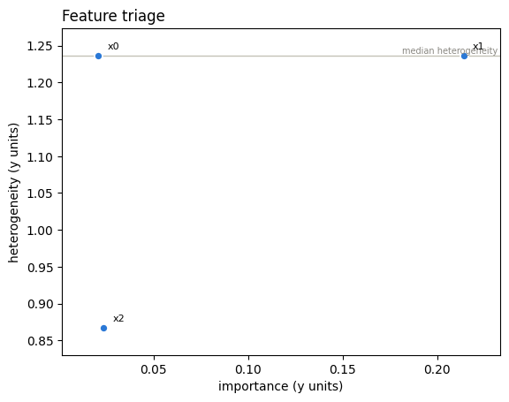
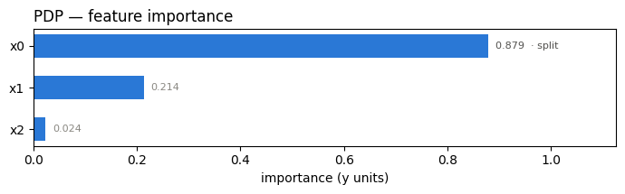
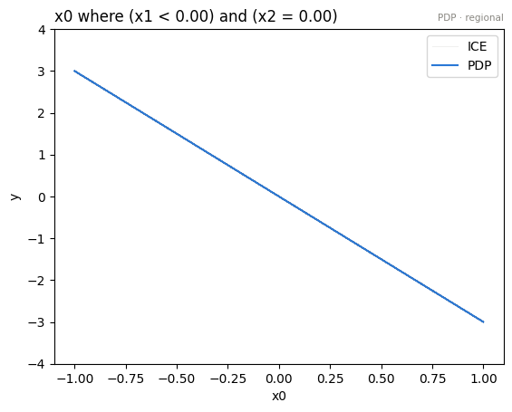
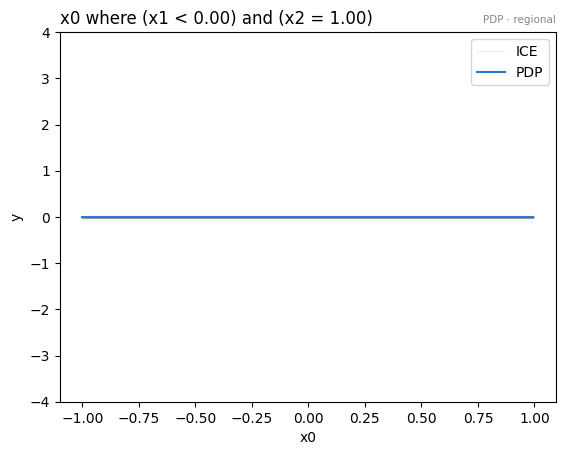
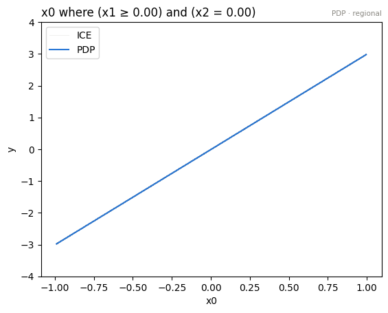
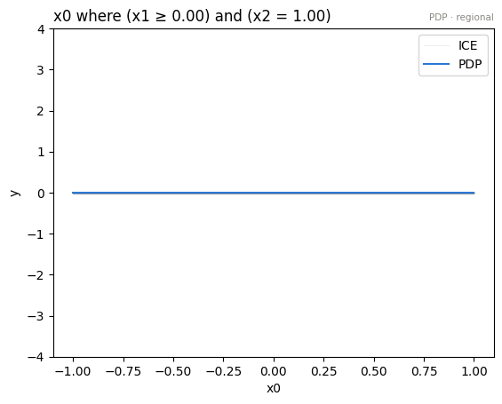
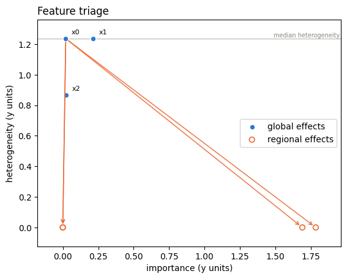

# One-click explanations: importance, `explain`, and the `Report`

- Author: [givasile](https://givasile.github.io/)
- Runtime: ~10 s
- Description: A tour of the new high-level API on a known synthetic model:
  per-feature **importance**, the one-click **`effector.explain(...)`** orchestrator, the
  serializable **`Report`** value object (`show` / `plot_importance` / `to_html`), and drilling
  into a heterogeneous feature with **`find_regions` → `Partition`**.

In the earlier tutorials we constructed each effect method by hand, fitted it, and read the
plots one feature at a time. `effector` now offers a high-level layer that automates the whole
triage: **rank features by importance → plot the important ones → automatically split the
*heterogeneous* ones into regions**, all returned as a single serializable `Report`.


```python
import numpy as np
import effector
```

## A known black-box model

We use a gated interaction on $D=3$ features, $x_0,x_1\sim\mathcal{U}(-1,1)$ and
$x_2\in\{0,1\}$:

$$ f(x) = \underbrace{\mathbb{1}[x_2=0]}_{\text{gate}} \cdot \operatorname{sign}(x_1)\cdot 3x_0 \; + \; 0.4\,x_1 $$

- $x_0$ has a **strong but heterogeneous** effect: its slope flips with $\operatorname{sign}(x_1)$
  and switches off when $x_2=1$. Globally its mean effect nearly cancels, but it splits cleanly
  into regions.
- $x_1$ has a **weak, homogeneous** effect ($0.4x_1$).
- $x_2$ only gates — no direct additive effect.

This is exactly the situation the report is meant to triage.


```python
rng = np.random.default_rng(0)
N = 3000
x0 = rng.uniform(-1, 1, N)
x1 = rng.uniform(-1, 1, N)
x2 = rng.integers(0, 2, N).astype(float)
X = np.stack([x0, x1, x2], axis=1)

def model(X):
    gate = np.where(X[:, 2] == 0, 1.0, 0.0)
    return gate * np.where(X[:, 1] > 0, 1.0, -1.0) * X[:, 0] * 3.0 + 0.4 * X[:, 1]

def model_jac(X):
    g = np.zeros_like(X)
    gate = np.where(X[:, 2] == 0, 1.0, 0.0)
    g[:, 0] = gate * np.where(X[:, 1] > 0, 1.0, -1.0) * 3.0
    g[:, 1] = 0.4
    return g

# x2 is a binary gate -> declare it nominal so derivative/binning methods treat it as a category
schema = {"feature_names": ["x0", "x1", "x2"],
          "feature_types": ["continuous", "continuous", "nominal"],
          "target_name": "y"}
```

## 1. Feature importance

`importance(feature, mask=None)` is the **dispersion of the mean effect** of a feature — the
$\mu$-twin of `heter_score` (which measures the spread of the *per-instance* effect). It is
model-free (re-summarised from the cached local effects), centering-invariant, and data-weighted.
`importances()` returns the whole per-feature vector.


```python
pdp = effector.PDP(X, model, schema=schema, nof_instances="all")
pdp.fit("all")

for f, name in enumerate(schema["feature_names"]):
    print(f"{name}:  importance={pdp.importance(f):.3f}   heter_score={pdp.heter_score(f):.3f}")

print("\nimportances() vector:", np.round(pdp.importances(), 3))
```

    x0:  importance=0.021   heter_score=1.236
    x1:  importance=0.214   heter_score=1.237
    x2:  importance=0.024   heter_score=0.867
    
    importances() vector: [0.021 0.214 0.024]


**Importance and heterogeneity are orthogonal axes.** Note that $x_0$ scores *low* importance
but *high* `heter_score`: because its slope flips with $\operatorname{sign}(x_1)$, the **mean**
effect nearly cancels over the data (low dispersion of the mean = low importance), yet the
**per-instance** effects are wildly spread (high heterogeneity). This is precisely the feature a
global average hides and a **regional** analysis reveals. $x_1$ carries a genuine mean effect;
$x_2$ only gates. `explain` uses both axes: it plots the features with the largest mean effect and
automatically runs `find_regions` on the ones whose heterogeneity is high.

`effector.plot_triage` draws this survey as one picture — the manual counterpart of what `explain` automates. Importance right, heterogeneity up: the top-right corner is where the mean effect hides something.


```python
effector.plot_triage(pdp)
```


    

    


## 2. `effector.explain(...)` → `Report`

`explain` runs the entire pipeline in **one model-touch**: fit → rank by importance → build the
top-$k$ curves → `find_regions` on the features whose heterogeneity exceeds a threshold. It
returns a `Report` — a serializable **value** (it owns the computed arrays, not a live reference
to the estimator).


```python
report = effector.explain(X, model, method="pdp", schema=schema,
                          top_k=3, nof_instances="all")
report.show()
```

    [effector] global effects reproduce 2.7% of the model's variance; with subregions, 100.0%
    
    PDP report — target: y
    ============================================================
    data: 3,000 instances × 3 features (2 continuous · 1 nominal) — target y
    model output: mean 0.0223, std 1.25, range [-3.31, 3.29]
    explained variance: global effects (GAM) 2.7%
      + split x0 (on x1, x2) → 100.0% (+97.3 pts, heter 1.236→0.000)
      rejected: x1 (on x0, x2) — -71.0 pts, redundant (variance already explained)
    ------------------------------------------------------------
    feature                   importance     heter  #regions
    ------------------------------------------------------------
    x0                            0.8794    0.0000         7
    x1                            0.2141    1.2365         1
    ============================================================
    the plotted features carry 98% of the total importance mass
    
    
    Feature 0 - Full partition tree:
    🌳 Full Tree Structure:
    ───────────────────────
    x0 🔹 [id: 0 | heter: 1.24 | inst: 3000 | w: 1.00]
        x1 < 0.00 🔹 [id: 1 | heter: 0.89 | inst: 1480 | w: 0.49]
            x2 = 0.00 🔹 [id: 2 | heter: 0.00 | inst: 742 | w: 0.25]
            x2 = 1.00 🔹 [id: 3 | heter: 0.00 | inst: 738 | w: 0.25]
        x1 ≥ 0.00 🔹 [id: 4 | heter: 0.85 | inst: 1520 | w: 0.51]
            x2 = 0.00 🔹 [id: 5 | heter: 0.00 | inst: 778 | w: 0.26]
            x2 = 1.00 🔹 [id: 6 | heter: 0.00 | inst: 742 | w: 0.25]
    --------------------------------------------------
    Feature 0 - Statistics per tree level:
    🌳 Tree Summary:
    ─────────────────
    Level 0🔹heter: 1.24
        Level 1🔹heter: 0.87 | 🔻0.37 (29.77%)
            Level 2🔹heter: 0.00 | 🔻0.87 (100.00%)
    
    


```python
# horizontal importance bar chart (returns (fig, ax) when show_plot=False)
report.plot_importance()
```


    

    


### Self-contained HTML report

`to_html` renders the whole thing to a **single self-contained page** — every figure is inlined
as a base64 PNG, so there are no external assets. This is the artefact you would share with a
stakeholder. With a `path` it writes the file and returns `None` (so your shell isn't flooded
with a megabyte of markup); call it with no arguments to get the HTML string instead.


```python
from pathlib import Path
_out = Path("reports") / "09_explain_importance_report"
_out.mkdir(parents=True, exist_ok=True)

report.to_html(_out / "explain_report.html")        # writes the file, returns None
html = open(_out / "explain_report.html").read()  # the raw markup, if you want to poke at it
print("inlined figures:", "data:image/png;base64" in html)
print("no external assets:", "http://" not in html and "https://" not in html)
print("length (chars):", len(html))
```

    /home/givasile/github/packages/effector/effector/report.py:422: UserWarning: This figure includes Axes that are not compatible with tight_layout, so results might be incorrect.
      fig.tight_layout()


    inlined figures: True
    no external assets: True
    length (chars): 478591


### The `Report` is a value: it round-trips without the model

`to_dict` / `from_dict` serialise the report; a reloaded report can still render its text and the
importance chart (the live-plot sugar that needs the estimator raises a clear error when unbound).


```python
from effector import Report

reloaded = Report.from_dict(report.to_dict())
print("feature order preserved:", [fr.name for fr in reloaded.features])
reloaded.show()
```

    feature order preserved: ['x0', 'x1']
    
    PDP report — target: y
    ============================================================
    data: 3,000 instances × 3 features (2 continuous · 1 nominal) — target y
    model output: mean 0.0223, std 1.25, range [-3.31, 3.29]
    explained variance: global effects (GAM) 2.7%
      + split x0 (on x1, x2) → 100.0% (+97.3 pts, heter 1.236→0.000)
      rejected: x1 (on x0, x2) — -71.0 pts, redundant (variance already explained)
    ------------------------------------------------------------
    feature                   importance     heter  #regions
    ------------------------------------------------------------
    x0                            0.8794    0.0000         7
    x1                            0.2141    1.2365         1
    ============================================================
    the plotted features carry 98% of the total importance mass
    
    
    Feature 0 - Full partition tree:
    🌳 Full Tree Structure:
    ───────────────────────
    x0 🔹 [id: 0 | heter: 1.24 | inst: 3000 | w: 1.00]
        x1 < 0.00 🔹 [id: 1 | heter: 0.89 | inst: 1480 | w: 0.49]
            x2 = 0.00 🔹 [id: 2 | heter: 0.00 | inst: 742 | w: 0.25]
            x2 = 1.00 🔹 [id: 3 | heter: 0.00 | inst: 738 | w: 0.25]
        x1 ≥ 0.00 🔹 [id: 4 | heter: 0.85 | inst: 1520 | w: 0.51]
            x2 = 0.00 🔹 [id: 5 | heter: 0.00 | inst: 778 | w: 0.26]
            x2 = 1.00 🔹 [id: 6 | heter: 0.00 | inst: 742 | w: 0.25]
    --------------------------------------------------
    Feature 0 - Statistics per tree level:
    🌳 Tree Summary:
    ─────────────────
    Level 0🔹heter: 1.24
        Level 1🔹heter: 0.87 | 🔻0.37 (29.77%)
            Level 2🔹heter: 0.00 | 🔻0.87 (100.00%)
    
    


## 3. Drilling into a heterogeneous feature: `find_regions` → `Partition`

The report already ran `find_regions` on the heterogeneous features. We can also call it directly:
it returns a `Partition` (a value object) and stores nothing on the effect. The heterogeneity a
`Partition` reports **is** `heter_score(feature, mask)` on each region's mask.


```python
part = pdp.find_regions(0, finder="best")
part.show()
```

    
    
    Feature 0 - Full partition tree:
    🌳 Full Tree Structure:
    ───────────────────────
    x0 🔹 [id: 0 | heter: 1.24 | inst: 3000 | w: 1.00]
        x1 < 0.00 🔹 [id: 1 | heter: 0.89 | inst: 1480 | w: 0.49]
            x2 = 0.00 🔹 [id: 2 | heter: 0.00 | inst: 742 | w: 0.25]
            x2 = 1.00 🔹 [id: 3 | heter: 0.00 | inst: 738 | w: 0.25]
        x1 ≥ 0.00 🔹 [id: 4 | heter: 0.85 | inst: 1520 | w: 0.51]
            x2 = 0.00 🔹 [id: 5 | heter: 0.00 | inst: 778 | w: 0.26]
            x2 = 1.00 🔹 [id: 6 | heter: 0.00 | inst: 742 | w: 0.25]
    --------------------------------------------------
    Feature 0 - Statistics per tree level:
    🌳 Tree Summary:
    ─────────────────
    Level 0🔹heter: 1.24
        Level 1🔹heter: 0.87 | 🔻0.37 (29.77%)
            Level 2🔹heter: 0.00 | 🔻0.87 (100.00%)
    
    


```python
# a Partition supports len / iteration / indexing; regions carry mask, heterogeneity, weight, ...
print("number of regions:", len(part))
print("leaves:", [r.idx for r in part.leaves])
for r in part:
    print(f"  region {r.idx}: level={r.level}  inst={r.nof_instances}  heter={r.heterogeneity:.3f}")
```

    number of regions: 7
    leaves: [2, 3, 5, 6]
      region 0: level=0  inst=3000  heter=1.236
      region 1: level=1  inst=1480  heter=0.888
      region 2: level=2  inst=742  heter=0.000
      region 3: level=2  inst=738  heter=0.000
      region 4: level=1  inst=1520  heter=0.849
      region 5: level=2  inst=778  heter=0.000
      region 6: level=2  inst=742  heter=0.000


```python
# plot each leaf region: the gated interaction resolves into clean, homogeneous lines
for r in part.leaves:
    part.plot(r.idx, heterogeneity="ice", centering=True, y_limits=[-4, 4])
```


    

    


    

    


    

    


    

    


And the before/after in one figure: arrows from the global point to the leaves — right and down, importance up, heterogeneity explained.


```python
effector.plot_triage(pdp, partitions={"x0": part})
```


    

    


## 4. Same pipeline, any method

`explain` accepts `method="pdp" | "ale" | "rhale" | "shapdp"` (and `"derpdp"`); pass
`model_jac=` for the derivative-based methods. The importance ranking is method-agnostic — the
important feature stays on top.


```python
for method in ["pdp", "ale", "rhale", "shapdp"]:
    kw = {"schema": schema, "top_k": 3, "nof_instances": "all"}
    if method in ("rhale",):
        kw["model_jac"] = model_jac
    if method == "shapdp":
        kw["nof_instances"] = 500  # keep SHAP cheap
    rep = effector.explain(X, model, method=method, **kw)
    ranked = [(fr.name, round(fr.importance, 3)) for fr in rep.features]
    print(f"{method:7s} -> {ranked}")
```

    [effector] global effects reproduce 2.7% of the model's variance; with subregions, 100.0%
    pdp     -> [('x0', 0.879), ('x1', 0.214)]
    [effector] global effects reproduce 2.5% of the model's variance; with subregions, 100.0%
    ale     -> [('x0', 0.879), ('x1', 0.228)]


    [effector] global effects reproduce 2.7% of the model's variance; with subregions, 100.0%
    rhale   -> [('x0', 0.879), ('x1', 0.231)]


    [effector] global effects reproduce 0.1% of the model's variance; with subregions, 87.1%
    shapdp  -> [('x0', 0.435), ('x1', 0.408)]


## Takeaways

- `importance(feature)` / `importances()` give a method-agnostic ranking of feature effect strength.
- `effector.explain(...)` triages a model in one call and returns a serializable `Report`.
- `Report.to_html(path)` produces a single self-contained page to share.
- `find_regions(feature) -> Partition` is the queryable, value-based regional API: `show`, `plot`,
  `eval`, `leaves`, `to_dict` — nothing is stored on the estimator.

## Cross-method sanity check

The one-liner `effector.explain` with every engine this notebook's model
supports. Everything must run end to end; the closing table puts the reads
side by side. Where methods disagree — ranking, accepted splits, R² — that is
a property of the data/model worth a closer look, not an error.


```python
from pathlib import Path
_out = Path("reports") / "09_explain_importance_report"
_out.mkdir(parents=True, exist_ok=True)

# === cross-method sweep: effector.explain on every applicable engine ======
sweep_reports = {}
for _m in ["pdp", "derpdp", "ale", "rhale", "shapdp"]:
    _kw = {"nof_instances": 300} if _m == "shapdp" else {}
    print(f"--- {_m} " + "-" * 50)
    sweep_reports[_m] = effector.explain(
        X, model, model_jac, method=_m, schema=schema, **_kw
    )
    sweep_reports[_m].to_html(_out / f"report_{_m}.html")

print()
print(f"{'method':<8} {'ranking (plotted)':<44} {'GAM R2':>8} {'final R2':>9}  splits")
for _m, _r in sweep_reports.items():
    _rank = " > ".join(fr.name for fr in _r.features)
    _ev = _r.explained_variance
    if _ev:
        _sp = "; ".join(f"{s['name']} on {s['on']}" for s in _ev["stages"]) or "none"
        print(f"{_m:<8} {_rank:<44} {_ev['gam_r2']:>7.1%} {_ev['regional_r2']:>8.1%}  {_sp}")
    else:
        print(f"{_m:<8} {_rank:<44} {'-':>7} {'-':>8}  (derivative scale: no variance ledger)")

print(f"\nreports stored in {_out}/")

```

    --- pdp --------------------------------------------------
    [effector] global effects reproduce 2.7% of the model's variance; with subregions, 100.0%


    /home/givasile/github/packages/effector/effector/report.py:422: UserWarning: This figure includes Axes that are not compatible with tight_layout, so results might be incorrect.
      fig.tight_layout()


    --- derpdp --------------------------------------------------


    /home/givasile/github/packages/effector/effector/report.py:422: UserWarning: This figure includes Axes that are not compatible with tight_layout, so results might be incorrect.
      fig.tight_layout()


    --- ale --------------------------------------------------
    [effector] global effects reproduce 2.5% of the model's variance; with subregions, 100.0%


    /home/givasile/github/packages/effector/effector/report.py:422: UserWarning: This figure includes Axes that are not compatible with tight_layout, so results might be incorrect.
      fig.tight_layout()


    --- rhale --------------------------------------------------
    [effector] global effects reproduce 2.7% of the model's variance; with subregions, 100.0%


    /home/givasile/github/packages/effector/effector/report.py:422: UserWarning: This figure includes Axes that are not compatible with tight_layout, so results might be incorrect.
      fig.tight_layout()


    --- shapdp --------------------------------------------------


    [effector] global effects reproduce -0.6% of the model's variance; with subregions, 87.3%


    /home/givasile/github/packages/effector/effector/report.py:422: UserWarning: This figure includes Axes that are not compatible with tight_layout, so results might be incorrect.
      fig.tight_layout()


    
    method   ranking (plotted)                              GAM R2  final R2  splits
    pdp      x0 > x1                                         2.7%   100.0%  x0 on x1, x2
    derpdp   x1                                                 -        -  (derivative scale: no variance ledger)
    ale      x0 > x1                                         2.5%   100.0%  x0 on x1, x2
    rhale    x0 > x1                                         2.7%   100.0%  x0 on x1, x2
    shapdp   x0 > x1                                        -0.6%    87.3%  x0 on x1, x2; x1 on x0, x2
    
    reports stored in reports/09_explain_importance_report/

