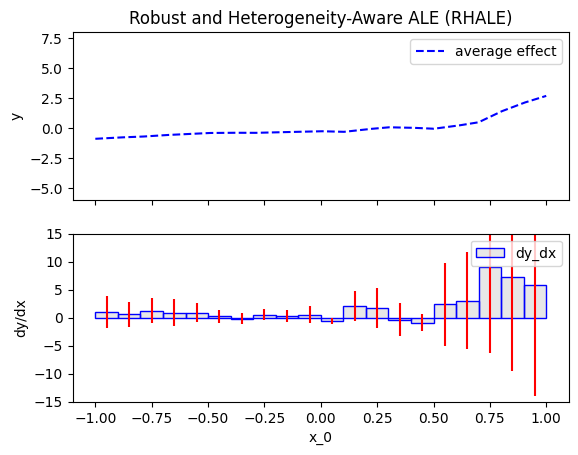
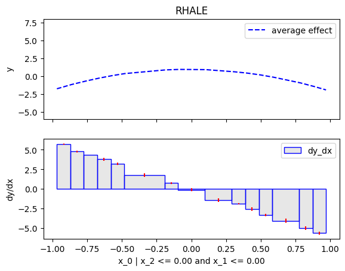
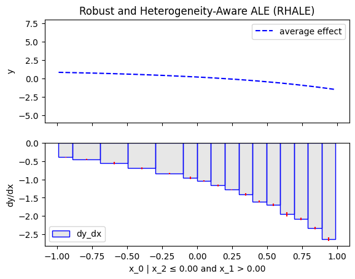
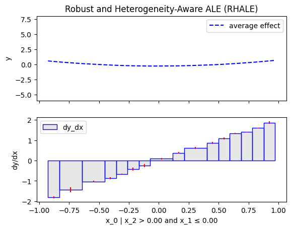
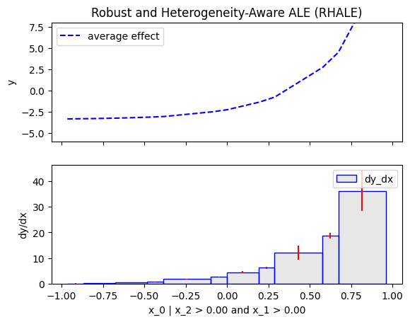
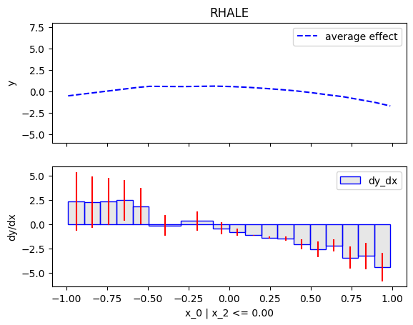
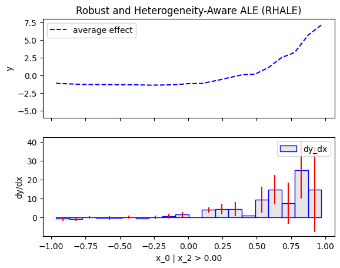

# Customize `.fit()`

`Effector` is designed to work well with its default settings, 
but it also allows for customization if the user needs more control over the processing steps.
This flexibility is achieved through the use of the `.fit()` routine, 
which offers a range of options for customizing each global or regional effect method


## Dataset

Create a dataset with 3 features, uniformly distributed in the range [-1, 1].
     
```python
dist = effector.datasets.IndependentUniform(dim=3, low=-1, high=1)
X_test = dist.generate_data(n=200)
axis_limits = dist.axis_limits
```

## Black-box model and Jacobian

Construct a black-box model with a double conditional interaction: $x_1$ effect interacts with $x_2$ and $x_3$.

$$
f(x_1, x_2, x_3) = -3x_1^2\mathbb{1}_{x_2 < 0}\mathbb{1}_{x_3 < 0} \
                   +x_1^2\mathbb{1}_{x_2 < 0}\mathbb{1}_{x_3 \geq 0} \
                   -e^{x_1}\mathbb{1}_{x_2 \geq 0}\mathbb{1}_{x_3 < 0} \
                   +e^{3x_1}\mathbb{1}_{x_2 \geq 0}\mathbb{1}_{x_3 \geq 0}
$$


```python
model = effector.models.DoubleConditionalInteraction()
predict = model.predict
jacobian = model.jacobian
```

## Global Effect

We will compute the global effect of the first feature using the `RHALE` method.
First, we will use the default settings of the `.fit()` routine, which automatically partitions the feature space into bins.
Then, we will customize the `.fit()` routine to use a number of 5 equal-width bins.

### RHALE

=== "Default settings"

    ```python
    rhale = effector.RHALE(X_test, predict, jacobian, axis_limits=axis_limits, nof_instances="all")
    rhale.plot(feature=0, y_limits=y_limits, dy_limits=dy_limits)
    ```
    { align=center }

=== "Customized `.fit()`"

    ```python
    rhale = effector.RHALE(X_test, predict, jacobian, axis_limits=axis_limits, nof_instances="all")
    rhale.fit(features=0, binning_method=effector.axis_partitioning.Fixed(nof_bins=5))
    rhale.plot(feature=0, y_limits=y_limits, dy_limits=dy_limits)
    ```
    
    { align=center }

## Regional Effect

Similarly, we will compute the regional effect of the first feature using the `RHALE` method.
We will first use the default settings of the `.fit()` routine, which automatically partitions the feature space into bins
and goes until `depth=2` of the partition tree.
Then, we will customize the `.fit()` routine to use a number of 5 equal-width bins and go until `depth=1` of the partition tree.


### RHALE

`init()`

=== "Default settings"

    ```python
    r_rhale = effector.RegionalRHALE(X_test, predict, jacobian, axis_limits=axis_limits, nof_instances="all")
    r_rhale.summary(0)
    ```

=== "Customized `.fit()`"

    ```python
    rhale = effector.RHALE(X_test, predict, jacobian, axis_limits=axis_limits, nof_instances="all")
    rhale.fit(features=0, binning_method=effector.axis_partitioning.Fixed(nof_bins=5))
    rhale.plot(feature=0, y_limits=y_limits, dy_limits=dy_limits)
    ```

`.summary()` output

=== "Default settings"
    ```python
    Feature 0 - Full partition tree:
    🌳 Full Tree Structure:
    ───────────────────────
    x_0 🔹 [id: 0 | heter: 60.47 | inst: 200 | w: 1.00]
        x_2 ≤ 0.00 🔹 [id: 1 | heter: 2.36 | inst: 105 | w: 0.53]
            x_1 ≤ 0.00 🔹 [id: 2 | heter: 0.06 | inst: 45 | w: 0.23]
            x_1 > 0.00 🔹 [id: 3 | heter: 0.00 | inst: 60 | w: 0.30]
        x_2 > 0.00 🔹 [id: 4 | heter: 70.28 | inst: 95 | w: 0.47]
            x_1 ≤ 0.00 🔹 [id: 5 | heter: 0.00 | inst: 45 | w: 0.23]
            x_1 > 0.00 🔹 [id: 6 | heter: 8.08 | inst: 50 | w: 0.25]
    ```

=== "Customized `.fit()`"
    ```python
    Feature 0 - Full partition tree:
    Node id: 0, name: x_0, heter: 53.64 || nof_instances:   200 || weight: 1.00
            Node id: 1, name: x_0 | x_2 <= 0.0, heter: 2.42 || nof_instances:   105 || weight: 0.53
            Node id: 2, name: x_0 | x_2  > 0.0, heter: 61.95 || nof_instances:    95 || weight: 0.47
    --------------------------------------------------
    Feature 0 - Statistics per tree level:
    Level 0, heter: 53.64
            Level 1, heter: 30.70 || heter drop : 22.94 (units), 42.77% (pcg)
    ```

`.plot()`

=== "Default settings"
     | `node_idx=3`: $x_0$ when $x_1 \leq 0$ and $x_2 \leq 0$ | `node_idx=4`: $x_0$ when $x_1 > 0$ and $x_2 \leq 0$|
     |:---------:|:---------:|
     |  |  |
     | `node_idx=5`: $x_0$ when $x_1 \leq 0$ and $x_2 > 0$ | `node_idx=6`: $x_0$ when $x_1 > 0$ and $x_2 > 0$|
     |  |  |

=== "Customized `.fit()`"

    ```python
    rhale.plot(feature=0, node_idx=1, y_limits=y_limits, dy_limits=dy_limits)
    rhale.plot(feature=0, node_idx=2, y_limits=y_limits, dy_limits=dy_limits)
    ```

     | `node_idx=1`: $x_0$ when $x_2 \leq 0$ | `node_idx=2`: $x_0$ when $x_2 > 0$ |
     |:---------:|:---------:|
     |  |  |