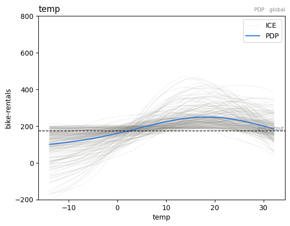
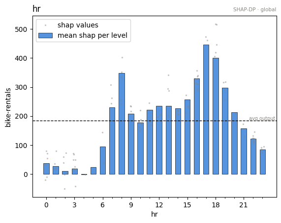
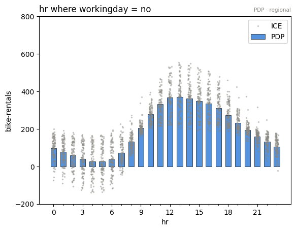
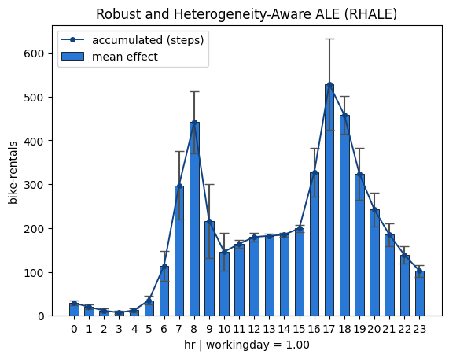
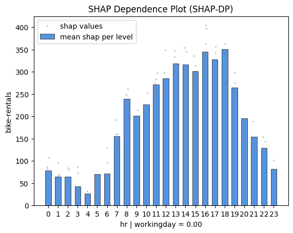
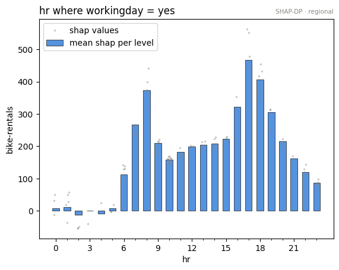
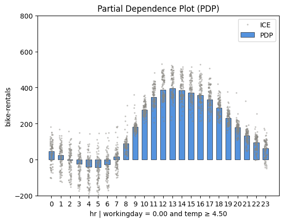
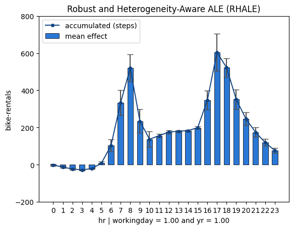
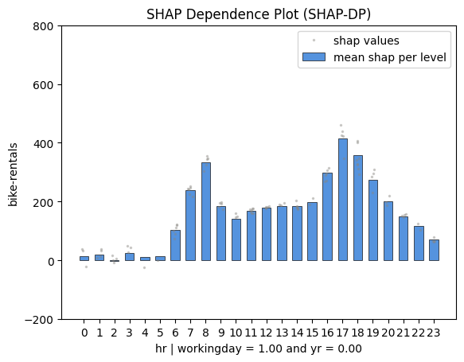

???+ success "Description"

    A conceptual introduction to global and regional effects: what they are,
    why they are a good choice for interpreting models trained on tabular
    data, and how to compute them with `effector`.

???+ note "Reading time"

	Approx. 10' to read.

???+ note "Glossary"

    - **Feature effect** or **feature effect plot**: a visual representation of how a feature influences the model's output.
      Refers to both global and regional effects.
    - **Global effect** or **global effect plot**: a 1D plot $x_i \rightarrow y$ that shows how a feature $x_i$ influences the model's output $y$ across the entire dataset.
    - **Regional effect** or **regional effect plot**: a 1D plot $x_i \rightarrow y$ that shows how a feature $x_i$ influences the model's output $y$ across a subset of the dataset, defined by a condition on other features.
      To fully understand the effect of a feature, you need to inspect all regional effects for the particular feature.

## Global effects

???+ question "Why do we care about global effects?"

     Because they are super simple.

✅ Suppose that you have trained a neural network (1) to predict hourly bike rentals using historical data.
  The dataset includes features like `hour`, `weekday`, `workingday`, `temperature`, `humidity`, and, of course,
  the target variable: `bike-rentals`.
{ .annotate }

1. 📌 You can find the full notebook [here](./../../notebooks/real-examples/01_bike_sharing_dataset/).

🚀 The model has a test error of about $\pm47$ bikes (RMSE).
    This means that the model is quite accurate, as the target variable
    has an average value of about $189$ bikes per hour and a standard deviation of about $181$ bikes per hour.

📊 After training, you want to understand how the model makes predictions.
   Feature effect plots provide a visual way to see how each feature influences the model's output.

=== "`month`"
    

=== "`hour`"
    

=== "`temperature`"
    

=== "`humidity`"
    

=== "`windspeed`"
    

Interesting! The model has "learned" that:

- 🔍 month, humidity, and windspeed have little impact on bike rentals.
- 🌡️ Temperature has a stronger positive effect on bike rentals, with a peak at around 20°C.
- ⏰ hour is the most important feature; let's focus on that!

---

Let's focus on feature `hour`. (Every verb takes the feature by index or by
name: `plot(feature=3)` and `plot("hr")` are the same call. To survey all
features at once, importance against heterogeneity, use
`effector.plot_triage(effect)`.) We will compute the global effect of the
`hour` feature using three different methods provided by `effector`:

=== "PDP"
    ```python
    effector.PDP(X, model, schema=schema).plot("hr")
    ```
    

=== "RHALE"
    ```python
    effector.RHALE(X, model, model_jac, schema=schema).plot("hr", heterogeneity="std")
    ```
    

=== "SHAP-DP"

    ```python
    effector.ShapDP(X, model, schema=schema).plot("hr")
    ```
    


All methods agree on the general trend:
there is an abrupt increase in the number of bike rentals at about 8:00 AM (beginning of the workday)
and at about 5:00 PM (end of the workday).
The following table provides a more detailed interpretation of the plot:

???+ note "Interpretation: Move along the axis and interpret"

    | Interval  | Description                                                                              |
    |-----------|------------------------------------------------------------------------------------------|
    | 0-6       | Bike rentals are almost constant and much lower than the average, which is $\approx 189$ |
    | 6-8.30    | Rapid increase; at about 7.00 we are at the average rentals and then even more.          |
    | 8.30-9.30 | Sudden drop; rentals move back to the average.                                           |
    | 9.30-15   | Small increase.                                                                          |
    | 15.00-17.00     | High increase; at 17.00 bike rentals reach the maximum.                                     |
    | 17.00-24.00     | A constant drop; at 19.00 rentals reach the average and keep decreasing.                 |

---

Global feature effect plots provide an immediate *interpretation* of the model's inner workings.


???+ question "Criticism 1: Does it make sense?"

     It seems reasonable. On a typical workday, people commute between 6:00–8:30 AM and return between 3:00–5:00 PM. But a city transportation expert might have a better perspective.

???+ question "Criticism 2: Is the explanation valid in all cases?"

    An expert might point out that this pattern makes sense only on working days. On weekends and holidays, an early peak at about 7:30 AM wouldn't be as logical.

---

## Heterogeneity

Criticism 2 questions whether the explanation applies to the entire dataset.
A simple way to check this is to look at the heterogeneity of the global effect;
each method draws it in its native view, on by default:

- ⚪ **the ICE curves around the PDP**
- 📊 **the std band and the per bin `dy/dx` bars in RHALE**
- ⚪ **the per instance SHAP values around the SHAP-DP curve**

Let's take a look again:

=== "PDP"
    

=== "RHALE"
    

=== "SHAP-DP"
    

They all indicate a high heterogeneity; there are cases that deviate from the average pattern.
Moreover, PDP-ICE analysis highlights two distinct patterns:

- There is one cluster, that follows the global pattern.
- There is a second cluster that behaves differently, with a rise starting at 9:00 AM, a peak at midday and a decline after 6:00 PM.

???+ danger "Don't rush to conclusions"

    What do these two patterns mean?
    One could guess that the first pattern is related to the working days, and the second pattern is related to the weekends and holidays.
    But this is just a guess. We need to confirm it with the data.
    If there is a condition that can be used to separate the two patterns, the regional effect analysis will find it.
    Hopefully, there is the `workingday` feature, so if our guess is correct, we will see two distinct patterns for the `hour` feature, depending on the value of the `workingday` feature.

---

## Regional effects

???+ question "Why do we care about regional effects?"

    Because they are super simple and provide richer information than global effects.

???+ note "The global effect is sometimes a weak explanation"

    When the global effect has a high heterogeneity, it is useful to analyze the regional effect.
    When many instances behave differently from the average pattern,
    it means that the global effect may hide some important information behind average values.
    In these cases, regional effect analysis can provide a more detailed explanation.

???+ note "Regional effects build a partition tree per feature"

    Regional effects build a partition tree for each feature.
    In each node of the partition tree, the instances are separated based on a condition on another feature.
    In each node, the instances are clustered into subregions where the instances behave similarly.

???+ note "When regional effects can provide a good solution"

    Unfortunately, it does not mean we will always find regional effects that provide a better explanation.
    That depends on whether conditioning on a feature can separate the instances into subregions where the instances behave similarly.
    If such a feature exists, regional effect analysis will provide a better explanation.
    If not, the regional effect analysis will not manage to do something better than the global effect analysis.

So let's apply regional effect analysis to the $\mathtt{hour}$ feature.
To print the partition tree, we call `.find_regions()` on the global effect object and `show()` the returned `Partition`.
Notice the rules: they speak the schema (`workingday = no`, `temp < 4.50` in °C), never internal codes.

=== "PDP"
    ```python
    partition = effector.PDP(X, model, schema=schema, nof_instances=5_000).find_regions("hr")
    partition.show()
    ```

    ```
    🌳 Full Tree Structure:
    ───────────────────────
    hr 🔹 [id: 0 | heter: 0.48 | inst: 5000 | w: 1.00]
        workingday = no 🔹 [id: 1 | heter: 0.37 | inst: 1563 | w: 0.31]
            temp < 4.50 🔹 [id: 2 | heter: 0.24 | inst: 642 | w: 0.13]
            temp ≥ 4.50 🔹 [id: 3 | heter: 0.33 | inst: 921 | w: 0.18]
        workingday = yes 🔹 [id: 4 | heter: 0.34 | inst: 3437 | w: 0.69]
            yr = 2011 🔹 [id: 5 | heter: 0.25 | inst: 1762 | w: 0.35]
            yr = 2012 🔹 [id: 6 | heter: 0.32 | inst: 1675 | w: 0.34]
    ```

=== "RHALE"
    ```python
    partition = effector.RHALE(X, model, model_jac, schema=schema).find_regions("hr")
    partition.show()
    ```

    ```
    🌳 Full Tree Structure:
    ───────────────────────
    hr 🔹 [id: 0 | heter: 2.24 | inst: 10000 | w: 1.00]
        workingday = no 🔹 [id: 1 | heter: 0.80 | inst: 3148 | w: 0.31]
            temp < 6.81 🔹 [id: 2 | heter: 0.62 | inst: 1577 | w: 0.16]
            temp ≥ 6.81 🔹 [id: 3 | heter: 0.70 | inst: 1571 | w: 0.16]
        workingday = yes 🔹 [id: 4 | heter: 1.63 | inst: 6852 | w: 0.69]
            yr = 2011 🔹 [id: 5 | heter: 1.15 | inst: 3463 | w: 0.35]
            yr = 2012 🔹 [id: 6 | heter: 1.52 | inst: 3389 | w: 0.34]
    ```

=== "SHAP-DP"
    ```python
    partition = effector.ShapDP(X, model, schema=schema, nof_instances=500).find_regions("hr")
    partition.show()
    ```

    ```
    🌳 Full Tree Structure:
    ───────────────────────
    hr 🔹 [id: 0 | heter: 0.23 | inst: 500 | w: 1.00]
        workingday = no 🔹 [id: 1 | heter: 0.13 | inst: 155 | w: 0.31]
            temp < 2.20 🔹 [id: 2 | heter: 0.09 | inst: 59 | w: 0.12]
            temp ≥ 2.20 🔹 [id: 3 | heter: 0.11 | inst: 96 | w: 0.19]
        workingday = yes 🔹 [id: 4 | heter: 0.16 | inst: 345 | w: 0.69]
            yr = 2011 🔹 [id: 5 | heter: 0.11 | inst: 173 | w: 0.35]
            yr = 2012 🔹 [id: 6 | heter: 0.11 | inst: 172 | w: 0.34]
    ```


???+ question "That is quite interesting"

    All methods confirm our intuition, and this time they even agree on the whole tree:
    the first and most important split is on the `workingday` feature;
    below it, non working days split further on `temperature` and working days on the `year`.
    Let's focus on the first level splits first.

### Depth = 1

=== "PDP"

     | non-working day | workingday |
     |:---------:|:---------:|
     |  |  |

=== "RHALE"

     | non-working day | workingday |
     |:---------:|:---------:|
     |  |  |

=== "SHAP-DP"

    | non-working day | workingday |
    |:---------:|:---------:|
    |  |  |


???+ success "Let's reach some conclusions"

    The regional effect analysis confirms our intuition: the data shows two distinct patterns.

    📅 **Workdays:** Rentals rise at **8:30 AM** and **5:00 PM**, matching commute times.
    🌴 **Weekends & Holidays:** Rentals increase at **9:00 AM**, peak at **12:00 PM**, and decline around **4:00 PM**: a typical leisure pattern.

---

### Depth = 2


=== "PDP"

     | non-working day and cold | non-working day and hot |
     |:---------:|:---------:|
     |  |  |
     | **working day and first year** | **working day and second year** |
     |  |  |


=== "RHALE"

     | non-working day and cold | non-working day and hot |
     |:---------:|:---------:|
     |  |  |
     | **working day and first year** | **working day and second year** |
     |  |  |


=== "SHAP-DP"

     | non-working day and cold | non-working day and hot |
     |:---------:|:---------:|
     |  |  |
     | **working day and first year** | **working day and second year** |
     |  |  |


???+ success "Let's reach some conclusions"

    One level deeper, all methods keep agreeing, and each refinement has a story:

    🌡️ **Non working days split on temperature.** The leisure pattern needs decent weather;
    on cold days the midday dome flattens. Temperature matters for sightseeing, not for commuting.

    📈 **Working days split on the year.** The commute peaks ride visibly higher in 2012 than
    in 2011: the service grew, and the model has encoded that growth as an interaction with `hour`.

---

## Under the hood: a regional effect is a masked global effect

???+ note "Regional plots are global-frame views"

    A regional node is **not** a new effect fitted from scratch on a data subset.
    `effector` fits the global effect **once** (one pass over the model) and every
    node plot is that same object's summary restricted to the node's instances:
    the axis limits, the PDP grid, and the ALE bin edges stay on the global frame,
    while means, heterogeneity bands, and centering are re-computed from the
    node's instances only, with **zero extra model calls**. The heterogeneity
    printed in the partition tree and the band drawn in the node plot come from
    the same computation.

You can use the same mechanism ad hoc, with any condition you like, without
fitting a regional object at all: every global method's `eval` and `plot`
accept a `rule` (a predicate string or an `effector.Rule`), or a raw boolean
`mask`:

```python
pdp = effector.PDP(X, model, schema=schema)
pdp.fit("hr")

# the effect of `hour`, only over working days
pdp.plot("hr", rule="workingday == yes")

# or straight from a node of a found partition
parts = pdp.find_regions(features="heterogeneous")   # {feature_name: Partition}
pdp.plot("hr", rule=parts["hr"][1].rule)
```

`partition.plot(node_idx)` does exactly this, with the node's mask
and label. See [the design contract](./../guides/design.md) (R11) and
[the methods reference](./../guides/methods.md) for what is re-computed
versus frozen per method.

---

## Where to next

- [`effector`'s API](./simple_api.md): the whole API in 3 minutes
- [`find_regions`](./interactive/find_regions.md): grow these trees yourself
- [effector's report](./report.md): the same analysis, one call
