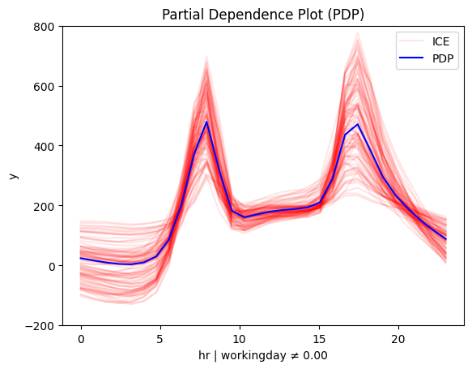

## Global effects

???+ question "Why do we care about global effects?"
     
     Because they are super simple.

✅ You trained a neural network (1) to predict hourly bike rentals using historical data. The dataset includes features like `hour`, `weekday`, `workingday`, `temperature`, `humidity`, and, of course, the `bike-rentals`.
{ .annotate }  

1. 📌 You can find the full notebook [here](./../../notebooks/real-examples/01_bike_sharing_dataset/).

🚀 The model performs well, with an average prediction error of about 43 bikes. Now, you want to understand how it makes predictions.

📊 Feature effect plots provide a visual way to see how each feature influences the model's output.

=== "`month`"
    

=== "`hour`"
    
    
=== "`temperature`"
    
    
=== "`humidity`"
    
    
=== "`windspeed`"
    

Interesting! The model has a meaningful behavior:

- 🔍 month, humidity, and windspeed have little impact 
- 🌡️ Temperature has a stronger positive effect
- ⏰ hour is the most important feature; let's focus on that!

---

Let's focus on feature `hour`:

=== "PDP"
    ```python
    effector.PDP(X, model).plot(feature=3)
    ```

    

=== "RHALE"
    ```python
    effector.RHALE(X, model, model_jac).plot(feature=3)
    ```

    

=== "SHAP-DP"

    ```python
    effector.ShapDP(X, model).plot(feature=3)
    ```

    


All methods agree on the general trend:
there is an abrupt increase in the number of bike rentals at about 8:00 AM (beginning of the workday)
and at about 5:00 PM (end of the workday). 
The following table provides a more detailed interpretation of the plot: 

???+ note "Interpretation: Move along the axis and interpret"
     
    | Interval  | Description                                                                              |
    |-----------|------------------------------------------------------------------------------------------|
    | 0-6       | Bike rentals are almost constant and much lower than the average, which is $\approx 189$ |
    | 6-8.30    | Rapid increase; at about 7.00 we are at the average rentals and then even more.          |
    | 8.30-9.30 | Sudden drop; rentals move back to the average.                                           |
    | 9.30-15   | Small increase.                                                                          |
    | 15.00-17.00     | High increase; at 17.00 bike rentals reach the maximum.                                     |
    | 17.00-24.00     | A constant drop; at 19.00 rentals reach the average and keep decreasing.                 |

--- 

Global feature effect plots provide an immediate *interpretation* of the model's inner workings.


???+ question "Criticism 1: Does it make sense?"

     It seems reasonable. On a typical workday, people commute between 6:00–8:30 AM and return between 3:00–5:00 PM. But a city transportation expert might have a better perspective.

???+ question "Criticism 2: Is the explanation valid in all cases?"

    An expert might point out that this pattern makes sense only on working days. On weekends and holidays, an early peak at about 7:30 AM wouldn't be as logical.

---

## Heterogeneity

Criticism 2 questions whether the explanation applies to the entire dataset. 
A simple way to check this is to look at the heterogeneity of the global effect:

- 🔴 **red ICE curves in PDP**  
- 🔴 **red bars in RHALE plots**  
- 🔴 **red SHAP values in SHAP-DP plots**  

Let's take a look again:

=== "PDP"
    }

=== "RHALE"
    

=== "SHAP-DP"
    

They all indicate a high heterogeneity; there are cases that deviate from the average pattern.
Moreover, PDP-ICE analysis highlights two distinct patterns:

- There is one cluster, that follows the global pattern.
- There is a second cluster that behaves differently, with a rise starting at 9:00 AM, a peak at 12:00 AM and a decline at 6:00 PM.

???+ danger "Don't rush to conclusions"
    
    What do these two patterns mean?
    One could guess that the first pattern is related to the working days, and the second pattern is related to the weekends and holidays.    
    But this is just a guess. We need to confirm it with the data.
    If there is a condition that can be used to separate the two patterns, the regional effect analysis will find it.
    Hopefully, there is the `workingday` feature, so if our guess is correct, we will see two distinct patterns for the `hour` feature, depending on the value of the `workingday` feature.

---

## Regional effects

???+ question "Why do we care about regional effects?"

    Because they are super simple and provide richer information that global effects.
    
???+ Note "The global effect is sometimes a weak explanation"

    When global effect has a high heterogeneity, it is useful to analyze the regional effect.
    When many instances behave differently from the average pattern,
    it means that the global effect may hide some important information behind average values. 
    In these cases, regional effect analysis can provide a more detailed explanation.

???+ Note "When regional effect can provide a good solution"

    Unfortunatelly, it does not mean we will always find regional effects that provide a better explanation.
    That depends on whether conditioning on a feature can separate the instances into subregions where the instances behave similarly.
    If such a feature exists, regional effect analysis will provide a better explanation.
    If not, the regional effect analysis will not manage to do something better than the global effect analysis.

So let's apply regional effect analysis to the $\mathtt{hour}$ feature.
`Effector` provides a simple API for that, similar to the global effect API:

We first summarize the regional effect analysis for the `hour` using:

=== "PDP"
    ```python
    r_pdp = effector.RegionalPDP(X, model)
    r_pdp.summary(feature=3)
    ```

    ```
    Feature 3 - Full partition tree:
    Node id: 0, name: hr, heter: 0.44 || nof_instances:  5000 || weight: 1.00
            Node id: 1, name: hr | workingday == 0.00, heter: 0.38 || nof_instances:  1588 || weight: 0.32
                    Node id: 3, name: hr | workingday == 0.00 and temp <= 6.81, heter: 0.19 || nof_instances:   785 || weight: 0.16
                    Node id: 4, name: hr | workingday == 0.00 and temp > 6.81, heter: 0.22 || nof_instances:   803 || weight: 0.16
            Node id: 2, name: hr | workingday != 0.00, heter: 0.30 || nof_instances:  3412 || weight: 0.68
                    Node id: 5, name: hr | workingday != 0.00 and temp <= 6.81, heter: 0.21 || nof_instances:  1467 || weight: 0.29
                    Node id: 6, name: hr | workingday != 0.00 and temp > 6.81, heter: 0.21 || nof_instances:  1945 || weight: 0.39
    --------------------------------------------------
    Feature 3 - Statistics per tree level:
    Level 0, heter: 0.44
            Level 1, heter: 0.32 || heter drop : 0.12 (units), 27.28% (pcg)
                    Level 2, heter: 0.21 || heter drop : 0.12 (units), 35.73% (pcg)
    ```

=== "RHALE"
    ```python
    r_rhale = effector.RegionalRHALE(X, model, model_jac)
    r_rhale.summary(feature=3)
    ```
    ```
    Feature 3 - Full partition tree:
    Node id: 0, name: hr, heter: 5.68 || nof_instances: 13903 || weight: 1.00
            Node id: 1, name: hr | workingday == 0.00, heter: 0.75 || nof_instances:  4385 || weight: 0.32
            Node id: 2, name: hr | workingday != 0.00, heter: 5.44 || nof_instances:  9518 || weight: 0.68
    --------------------------------------------------
    Feature 3 - Statistics per tree level:
    Level 0, heter: 5.68
            Level 1, heter: 3.96 || heter drop : 1.71 (units), 30.22% (pcg)
    ```

=== "SHAP-DP"
    ```python
    r_shap = effector.RegionalShapDP(X, model)
    r_shap.summary(feature=3)
    ```

    ```
    Feature 3 - Full partition tree:
    Node id: 0, name: hr, heter: 0.06 || nof_instances:   500 || weight: 1.00
            Node id: 1, name: hr | workingday == 0.00, heter: 0.02 || nof_instances:   155 || weight: 0.31
                    Node id: 3, name: hr | workingday == 0.00 and temp <= 6.81, heter: 0.01 || nof_instances:    83 || weight: 0.17
                    Node id: 4, name: hr | workingday == 0.00 and temp > 6.81, heter: 0.03 || nof_instances:    72 || weight: 0.14
            Node id: 2, name: hr | workingday != 0.00, heter: 0.03 || nof_instances:   345 || weight: 0.69
                    Node id: 5, name: hr | workingday != 0.00 and temp <= 6.81, heter: 0.02 || nof_instances:   156 || weight: 0.31
                    Node id: 6, name: hr | workingday != 0.00 and temp > 6.81, heter: 0.02 || nof_instances:   189 || weight: 0.38
    --------------------------------------------------
    Feature 3 - Statistics per tree level:
    Level 0, heter: 0.06
            Level 1, heter: 0.03 || heter drop : 0.03 (units), 56.04% (pcg)
                    Level 2, heter: 0.02 || heter drop : 0.01 (units), 20.57% (pcg)
    ```


???+ question "That' is quite interesting"

    All methods confirm our intuition: there are two meaninful subregions based on the `workingday` feature. 
    This is the first split in the partition tree and the most important one, for all methods.
    However PDP and SHAP-DP also provide a second split based on the `temperature` feature.


Let's visualize the regional effects!


=== "PDP"

     | non-working day and cold | non-workingday and hot |
     |:---------:|:---------:|
     |  |  |
     | working day and cold | workingday and hot |
     |  |  |


=== "RHALE"

     | non-working day | workingday |
     |:---------:|:---------:|
     |  |  |

=== "SHAP-DP"

     | non-working day and cold | non-workingday and hot |
     |:---------:|:---------:|
     |  |  |
     | working day and cold | workingday and hot |
     |  |  |

???+ success "Let's reach some conclusions""

    The regional effect analysis confirms our intuition: the data shows two distinct patterns.  

    📅 **Workdays:** Rentals rise at **8:30 AM** and **5:00 PM**, matching commute times.  
    🌴 **Weekends & Holidays:** Rentals increase at **9:00 AM**, peak at **12:00 PM**, and decline around **4:00 PM**—a typical leisure pattern.  

    📊 **PDP and SHAP-DP go further**  
    They reveal another key factor: **temperature**. The impact of `hour` on bike rentals differs on non-working days depending on whether it’s hot or cold.  

    ✔️ This makes sense—temperature matters for sightseeing, but not for commuting.


---