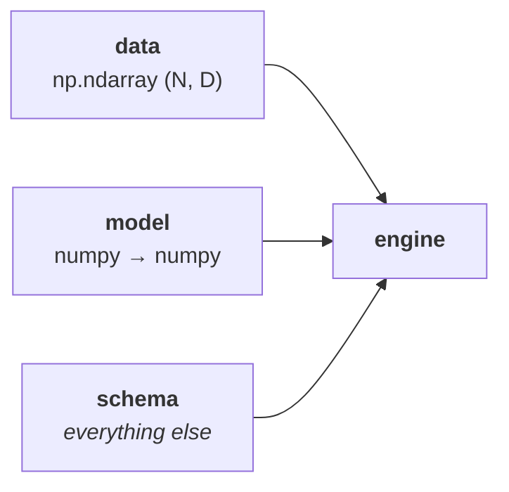
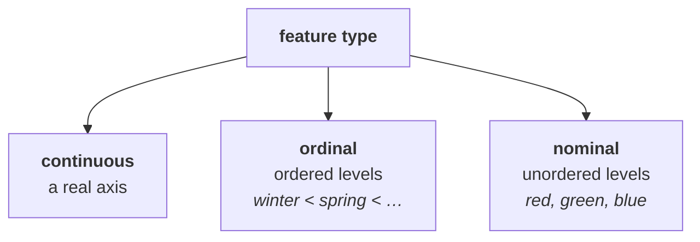

???+ success "Description"

    The in-depth guide to part **(a)** of [`effector`'s API](./simple_api.md):
    the numpy-only contract, wrapping any model (sklearn, torch, keras,
    classifiers, DataFrame pipelines), and the `schema` that makes the whole
    explanation speak your vocabulary.

???+ note "Reading time"

	Approx. 10' to read.

## The contract

`effector` speaks one language: **numpy**.



| you hand it | it must be |
|---|---|
| `data` | a 2-D numeric numpy array, `(N, D)` |
| `model` | a callable `(N, D) → (N,)` |
| `model_jac` *(optional)* | a callable `(N, D) → (N, D)` |
| `schema` *(optional)* | names, types, level names, units |

That is the whole contract. If your model was trained in PyTorch, TensorFlow, or
on a pandas DataFrame, **you** wrap it into a `numpy → numpy` function; that
wrapper is exactly where the framework-specific concerns (dtype, device,
batching) belong, because only you know them.

???+ tip "Why numpy?"

    A numpy array is the one format PyTorch, TensorFlow, JAX, scikit-learn,
    XGBoost, and plain Python functions all speak. Standing on numpy makes
    `effector` **fast** (your model is called as-is, with zero per-call
    conversion) and lets it explain **any** model without shipping a single
    framework adapter.

???+ danger "Nothing is auto-detected"

    [`effector.adapters`](../api_docs/api_adapters.md) *returns* a wrapper; it
    never installs one behind your back. **You** make the final pass into the
    constructor, so if a conversion is happening, it is on a line you wrote.

    ```python
    model = effector.adapters.from_sklearn(est)   # estimator -> plain callable
    effector.adapters.check(model, X)             # the handshake: probe on 2 rows
    effector.PDP(X, model, schema=schema)         # the final pass is yours
    ```

## The model

=== "Already numpy"

    Nothing to wrap; just call it.

    ```python
    import numpy as np
    import effector

    X = np.random.uniform(-1, 1, (500, 3))
    model = lambda A: A[:, 0] + A[:, 1] * (A[:, 2] > 0)

    effector.PDP(X, model).plot(feature=0)
    ```

=== "scikit-learn"

    ```python
    model = effector.adapters.from_sklearn(est)
    ```

    Wraps `est.predict` and validates the output shape.

=== "PyTorch"

    The adapter handles `eval()` mode, `no_grad`, device and dtype:

    ```python
    model = effector.adapters.from_torch(net)
    ```

    Which is exactly this, by hand; write it yourself whenever your forward pass
    needs something special (a head selection, custom batching):

    ```python
    import torch

    net.eval()
    device = next(net.parameters()).device

    def model(X):                     # numpy (N, D) -> numpy (N,)
        with torch.no_grad():
            t = torch.as_tensor(X, dtype=torch.float32, device=device)
            return net(t).cpu().numpy().ravel()
    ```

=== "TensorFlow / Keras"

    Keras `.predict` already takes numpy in and returns numpy out, so the
    wrapper is almost a no-op:

    ```python
    model = lambda X: net.predict(X, verbose=0).ravel()
    ```

=== "Classifiers"

    Class labels are not a regression surface, so `effector` explains a
    **per-class probability** instead: one explanation per class.

    ```python
    model = effector.adapters.classifier_proba(clf, class_="yes")   # P(class="yes")
    ```

    Loop over `clf.classes_` if you want every class explained.

=== "A DataFrame-hungry pipeline"

    If your model *needs* a DataFrame (a `ColumnTransformer` / `OneHotEncoder`
    pipeline trained on string columns), reconstruct the frame **inside your
    wrapper**:

    ```python
    levels = ["clear", "mist", "rain"]

    def model(X):                     # numpy grid -> numpy predictions
        frame = pd.DataFrame({
            "hour":    X[:, 0],
            "temp":    X[:, 1],
            "weather": pd.Categorical.from_codes(
                np.clip(np.round(X[:, 2]), 0, 2).astype(int), levels),
        })
        return pipeline.predict(frame)
    ```

    You own the reconstruction, so it is visible and testable; `effector` never
    guesses how to call your model.

## The jacobian (optional)

Only `RHALE` and `DerPDP` use it, and only to go faster: without it they fall
back to a numerical jacobian (central finite differences).

```python
model, model_jac = effector.adapters.from_torch(net, jacobian=True)
effector.RHALE(X, model, model_jac).plot(feature=0)
```

Or by hand, since it too is just `numpy → numpy`:

```python
def model_jac(X):                     # numpy (N, D) -> numpy (N, D)
    t = torch.as_tensor(X, dtype=torch.float32,
                        device=device).requires_grad_(True)
    net(t).sum().backward()
    return t.grad.cpu().numpy()
```

## The schema

Everything that is *not* data and *not* the model travels in one optional
argument. It is what makes rules read `season = winter` instead of `x_7 = 0.0`.

```python
schema = effector.Schema(
    feature_names=["hr", "temp", "workingday"],
    feature_types=["ordinal", "continuous", "nominal"],
    target_name="count",
)
pdp = effector.PDP(X, model, schema=schema)
```

Every field is optional; whatever you do not declare is inferred or synthesized
(`x_0…`, `"y"`). A plain dict with the same keys works too.

| field | meaning |
|---|---|
| `feature_names` | one name per column (default `x_0, x_1, …`) |
| `feature_types` | `"continuous"` / `"ordinal"` / `"nominal"` per column |
| `category_names` | per categorical feature: a human-readable name per level, in ascending order |
| `target_name` | name of the model output (default `"y"`) |
| `scale_x_list` | per-feature `{"mean": .., "std": ..}` to display plots in original units |
| `scale_y` | `{"mean": .., "std": ..}` for the output axis |
| `cat_limit` | cardinality threshold for the int-column type heuristic (default 10) |

✅ With a schema, **every verb takes a name instead of an index**: `pdp.plot(0)`
and `pdp.plot("hr")` are the same call.

### The three feature types



⚠️ **The type is not cosmetic; it changes the math.** Splits on an ordinal
feature can use thresholds (`season ≤ spring`); splits on a nominal one cannot,
and its effects are computed order-free (all-pairs level differences). Get the
type wrong and the explanation answers the wrong question. See
[method semantics](../guides/method_semantics.md).

### Level names

Give the levels names and they appear on every axis, in every rule, in every
tree, instead of numeric codes.

```python
schema = effector.Schema(
    feature_names=["hr", "workingday", "season"],
    feature_types=["continuous", "nominal", "nominal"],
    category_names=[None, ["no", "yes"], ["winter", "spring", "summer", "fall"]],
)
```

```text
workingday = no 🔹 [id: 1 | heter: 0.37 | inst: 614 | w: 0.31]
    season ∈ {spring, summer, fall} 🔹 [id: 3 | heter: 0.34 | inst: 460 | w: 0.23]
```

### Units

If you fed the model standardized columns, hand back the scaling and the plots
speak the original units.

```python
schema = effector.Schema(
    feature_names=["temp"],
    scale_x_list=[{"mean": 15.2, "std": 8.6}],   # °C, not z-scores
    scale_y={"mean": 190.0, "std": 181.0},       # rentals, not z-scores
)
```

## Starting from pandas

Most workflows begin with a DataFrame. Convert it **once**; it reads column
names, dtypes and category labels into `(X, schema)`, and never touches your
model.

```python
import dataclasses

X_np, schema = effector.from_dataframe(df)   # numpy matrix + a populated Schema
print(schema.feature_types)                  # inspect the guesses...

# Schema is a frozen dataclass: override anything you don't like
schema = dataclasses.replace(
    schema, feature_types=["ordinal", "continuous", "nominal"]
)

effector.PDP(X_np, model, schema=schema).plot(feature=0)
```

???+ warning "Always inspect the returned schema"

    `from_dataframe` infers types from dtypes, but an **integer** column is
    ambiguous: ordinal, continuous, or a label-encoded nominal are all
    plausible. `effector` emits a `UserWarning` for those guesses. Check them.

???+ danger "The worse-model trap"

    Raw integer codes fed into a distance-based model (an MLP, a kNN) imply an
    order and a spacing that may not exist. Scale them for the **model** if you
    must, but keep the schema calling them categorical for the **explanation**;
    the two are separate decisions.

## When you get it wrong

Passing a DataFrame straight into a constructor raises, with the fix in the
message:

```python
effector.PDP(df, model)
# TypeError: effector is numpy-only: `data` must be a 2-D numeric numpy array,
#   not a pandas DataFrame. Convert it first:
#       X, schema = effector.from_dataframe(df)
#   and pass a numpy->numpy `model` ...
```

---

## Where to next

- [The one-liner and the report](./report.md): what to do once the inputs are in
- [The interactive API](./interactive_api.md): drive the analysis yourself
- [Method semantics](../guides/method_semantics.md): what each method computes per feature type
- [The design contract](../guides/design.md): R8 (constructor) and R10 (numpy-only), the authoritative spec
- [API docs](../api_docs/api_ingestion.md): `Schema` and `from_dataframe`
